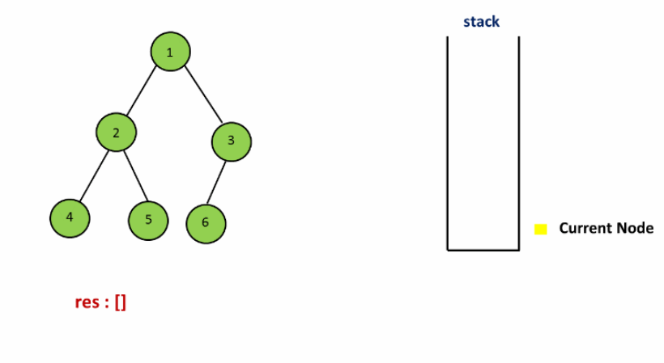

# AlgorithmEasyDay04：二叉树

[TOC]


### 一、实现二叉树的先序、中序、后序遍历

### （一）使用递归的方式

二叉树的示例结构为：


实际函数访问结点的顺序为：1 2 4 4 4 2 5 5 5 2 1 3 6 6 6 3 7 7 7 3 1 结束
以先序遍历二叉树为例，可以发现递归方式首先尝试打印当前结点的值，随后尝试打印左子树，打印完左子树后尝试打印右子树，递归过程的`base case`是当某个结点为空时停止子过程的展开。这种递归尝试是由二叉树本身的结构所决定的，因为二叉树上的任意结点都可看做一棵二叉树的根结点（即使是叶子结点，也可以看做是一棵左右子树为空的二叉树根结点）。

观察先序、中序、后序三个递归方法你会发现，不同点在于打印当前结点的值这一操作的时机。**你会发现每个结点会被访问三次**：进入方法时算一次、递归处理左子树完成之后返回时算一次、递归处理右子树完成之后返回时算一次。因此在`preOrderRecursive`中将打印语句放到方法开始时就产生了先序遍历；在`midOrderRecursive`中，将打印语句放到递归chu处理左子树完成之后就产生了中序遍历；同理放在第三次访问时候打印就是后续遍历。


### （二）非递归方式
因为递归使用的是栈，这里只需要自己实现一个栈结构即可；

- 先序遍历
拿到一棵树的根结点后，首先打印该结点的值，然后将其非空右孩子、非空左孩子依次压栈。栈非空循环：从栈顶弹出结点（一棵子树的根节点）并打印其值，再将其非空右孩子、非空左孩子依次压栈。你会发现压栈的顺序和打印的顺序是相反的，压栈是先根结点，然后有右孩子就压右孩子、有左孩子就压左孩子，这是利用栈的后进先出。每次获取到一棵子树的根节点之后就可以获取其左右孩子，因此无需保留其信息，直接弹出并打印，然后保留其左右孩子到栈中即可。

首先在栈中放入头结点，然后弹出头结点进行打印，如果该节点的右结点不为空，压入右结点，如果左结点不为空压入左结点，然后弹出栈顶，再次循环；
示例为例：先压入 1 ，然后弹出 1，先压入节点 1 的右孩子 3，然后压入左孩子 2，然后弹出栈顶 2，然后压入节点 2 的右孩子和左孩子，现在栈中顺序为：4 5 3，然后弹出 4，压入 4 的右孩子和左孩子，发现都没有，弹出栈顶 5，压入 5 的右孩子和左孩子，发现都没有，弹出栈顶 3，然后压入 3 的右孩子和左孩子，然后弹出栈顶 6，然后压入 6 的右、左孩子，都没有，弹出 7，压入右孩子、左孩子，没有，弹出发现为空，结束；


- 中序遍历：
对于一棵树，将该树的左边界全部压栈，`root`的走向是只要左孩子不为空就走向左孩子。当左孩子为空时弹出栈顶结点（此时该结点是一棵左子树为空的树的根结点，根据中序遍历可以直接打印该结点，然后中序遍历该结点的右子树）打印，如果该结点的右孩子非空（说明有右子树），那么将其右孩子压栈，这个右孩子又可能是一棵子树的根节点，因此将这棵子树的左边界压栈，这时回到了开头，以此类推。

当前结点不为空的时候，将当前结点压入栈中，结点指针左移，指向左结点，直到当前结点为空，则从栈中将栈顶弹出打印，然后指针右移；
示例为例：首先头结点 1 不为空，将该结点压入，然后指向节点 2，然后压入结点 2，然后压入结点 4，然后指向 null，因为栈不等于空，还得遍历，进入 else，弹出栈顶为 结点 4 ，指针指向 4，然后指向结点 4 的右结点为 null，然后再次弹出节点 2，然后指向结点 2 的右子节点 5，然后。。。。




- 后序遍历：
思路一：准备两个栈，一个栈用来保存遍历时的结点信息，另一个栈用来排列后根顺序（根节点先进栈，右孩子再进，左孩子最后进）。
思路二：只用一个栈。借助两个变量`h`和`c`，`h`代表最近一次打印过的结点，`c`代表栈顶结点。首先将根结点压栈，此后栈非空循环，令`c`等于栈顶元素（`c=stack.peek()`）执行以下三个分支：

1.  `c`的左右孩子是否与`h`相等，如果都不相等，说明`c`的左右孩子都不是最近打印过的结点，由于左右孩子是左右子树的根节点，根据后根遍历的特点，左右子树肯定都没打印过，那么将左孩子压栈（打印左子树）。
2.  分支1没有执行说明`c`的左孩子要么不存在；要么左子树刚打印过了；要么右子树刚打印过了。这时如果是前两种情况中的一种，那就轮到打印右子树了，因此如果`c`的右孩子非空就压栈。
3.  如果前两个分支都没执行，说明`c`的左右子树都打印完了，因此弹出并打印`c`结点，更新一下`h`。


是左右中打印（需要用到两个栈，代码方式二是用的一个栈，不太好理解）；先序遍历是中、左、右，就是当前结点先压右孩子然后压左孩子，那么中右左就是当前结果先压左孩子然后压右孩子，然后将原来使用打印的语句更改为：将该元素存放到另一个栈中，但是不打印，全部遍历完成之后，将栈中的元素全部打印出来即可；

**递归和非递归版本代码**
```java
package nowcoder.easy.day04;  
  
import java.util.Stack;  
  
/**  
 * 递归版和非递归版本的先序、中序、后序遍历 * * @author GJXAIOU  
 */public class PreInPosTraversal {  
  
    public static class Node {  
        public int value;  
        public Node left;  
        public Node right;  
  
        public Node(int data) {  
            this.value = data;  
        }  
    }  
  
    /**  
 * 递归版本实现先序、中序、后序遍历，唯一变化就是 print() 函数位置不同。 */ // 先序遍历  public static void preOrderRecur(Node head) {  
        if (head == null) {  
            return;  
        }  
        System.out.print(head.value + " ");  
        preOrderRecur(head.left);  
        preOrderRecur(head.right);  
    }  
  
    // 中序遍历  
  public static void inOrderRecur(Node head) {  
        if (head == null) {  
            return;  
        }  
        inOrderRecur(head.left);  
        System.out.print(head.value + " ");  
        inOrderRecur(head.right);  
    }  
  
    // 后序遍历  
  public static void posOrderRecur(Node head) {  
        if (head == null) {  
            return;  
        }  
        posOrderRecur(head.left);  
        posOrderRecur(head.right);  
        System.out.print(head.value + " ");  
    }  
  
  
    /**  
 * 非递归版本实现先序、中序、后序遍历 * * @param head  
  */  
  public static void preOrderUnRecur(Node head) {  
        System.out.print("pre-order: ");  
        if (head != null) {  
            // 准备一个栈  
  Stack<Node> stack = new Stack<Node>();  
            // 放入头结点  
  stack.add(head);  
            while (!stack.isEmpty()) {  
                head = stack.pop();  
                System.out.print(head.value + " ");  
                if (head.right != null) {  
                    stack.push(head.right);  
                }  
                if (head.left != null) {  
                    stack.push(head.left);  
                }  
            }  
        }  
        System.out.println();  
    }  
  
    public static void inOrderUnRecur(Node head) {  
        System.out.print("in-order: ");  
        if (head != null) {  
            Stack<Node> stack = new Stack<Node>();  
            while (!stack.isEmpty() || head != null) {  
                if (head != null) {  
                    stack.push(head);  
                    head = head.left;  
                } else {  
                    head = stack.pop();  
                    System.out.print(head.value + " ");  
                    head = head.right;  
                }  
            }  
        }  
        System.out.println();  
    }  
  
    public static void posOrderUnRecur1(Node head) {  
        System.out.print("pos-order: ");  
        if (head != null) {  
            Stack<Node> s1 = new Stack<Node>();  
            Stack<Node> s2 = new Stack<Node>();  
            s1.push(head);  
            while (!s1.isEmpty()) {  
                head = s1.pop();  
                s2.push(head);  
                if (head.left != null) {  
                    s1.push(head.left);  
                }  
                if (head.right != null) {  
                    s1.push(head.right);  
                }  
            }  
            while (!s2.isEmpty()) {  
                System.out.print(s2.pop().value + " ");  
            }  
        }  
        System.out.println();  
    }  
  
    // 另一种实现后续，使用一个栈  
  public static void posOrderUnRecur2(Node h) {  
        System.out.print("pos-order: ");  
        if (h != null) {  
            Stack<Node> stack = new Stack<Node>();  
            stack.push(h);  
            Node c = null;  
            while (!stack.isEmpty()) {  
                c = stack.peek();  
                if (c.left != null && h != c.left && h != c.right) {  
                    stack.push(c.left);  
                } else if (c.right != null && h != c.right) {  
                    stack.push(c.right);  
                } else {  
                    System.out.print(stack.pop().value + " ");  
                    h = c;  
                }  
            }  
        }  
        System.out.println();  
    }  
  
    public static void main(String[] args) {  
        Node head = new Node(5);  
        head.left = new Node(3);  
        head.right = new Node(8);  
        head.left.left = new Node(2);  
        head.left.right = new Node(4);  
        head.left.left.left = new Node(1);  
        head.right.left = new Node(7);  
        head.right.left.left = new Node(6);  
        head.right.right = new Node(10);  
        head.right.right.left = new Node(9);  
        head.right.right.right = new Node(11);  
  
        // recursive  
  System.out.println("==============递归版本==============");  
        System.out.print("pre-order: ");  
        preOrderRecur(head);  
        System.out.println();  
        System.out.print("in-order: ");  
        inOrderRecur(head);  
        System.out.println();  
        System.out.print("pos-order: ");  
        posOrderRecur(head);  
        System.out.println();  
  
        // unRecursive  
  System.out.println("============非递归版本=============");  
        preOrderUnRecur(head);  
        inOrderUnRecur(head);  
        posOrderUnRecur1(head);  
        posOrderUnRecur2(head);  
    }  
}
```
程序运行结果：
```java
==============递归版本==============
pre-order: 5 3 2 1 4 8 7 6 10 9 11 
in-order: 1 2 3 4 5 6 7 8 9 10 11 
pos-order: 1 2 4 3 6 7 9 11 10 8 5 
============非递归版本=============
pre-order: 5 3 2 1 4 8 7 6 10 9 11 
in-order: 1 2 3 4 5 6 7 8 9 10 11 
pos-order: 1 2 4 3 6 7 9 11 10 8 5 
pos-order: 1 2 4 3 6 7 9 11 10 8 5
```


## 二、直观的打印一颗二叉树

```java
package nowcoder.easy.day04;

/**
 * 最直观的打印二叉树
 *
 * @author GJXAIOU
 * 在节点值两边加上特定的字符串标记来区分孩子和位置以及之间的位置关系：
 * HXH：表示头结点 X；vYv：表示节点 Y 是左下方最近节点的孩子；^Z^：表示节点 Z 是左上方最近节点的孩子
 * 遍历树的顺序为：右子树 -> 根 -> 左子树；
 * 避免节点值长度不同影响对其，规定每个节点值长度为固定值（这里规定为 10）
 */
public class PrintBinaryTree {

    public static class Node {
        public int value;
        public Node left;
        public Node right;

        public Node(int data) {
            this.value = data;
        }
    }

    public static void printTree(Node head) {
        System.out.println("Binary Tree:");
        printInOrder(head, 0, "H", 10);
        System.out.println();
    }

    /**
     * @param head               ：传入的节点
     * @param treeHeight：层数（根节点为 0）
     * @param to                 ：表示的特定节点  H表示根节点   ^表示父亲节点在左上方　v表示父亲节点在左下方
     * @param totalLength        ：指定每一个节点打印的宽度(总宽度)
     */
    public static void printInOrder(Node head, int treeHeight, String to, int totalLength) {
        if (head == null) {
            return;
        }
        // 递归遍历右子树
        printInOrder(head.right, treeHeight + 1, "v", totalLength);
        // 在节点值两边加上标识符
        String val = to + head.value + to;
        int lenValue = val.length();
        // 节点值左边的空格数：（总长度 - 节点值长度）/ 2
        int lenL = (totalLength - lenValue) / 2;
        // 节点值右边的空格数
        int lenR = totalLength - lenValue - lenL;
        val = getSpace(lenL) + val + getSpace(lenR);
        // treeHeight * totalLength 为打印的节点前空格长度
        System.out.println(getSpace(treeHeight * totalLength) + val);
        // 递归遍历左子树
        printInOrder(head.left, treeHeight + 1, "^", totalLength);
    }

    public static String getSpace(int num) {
        String space = " ";
        StringBuffer buf = new StringBuffer("");
        for (int i = 0; i < num; i++) {
            buf.append(space);
        }
        return buf.toString();
    }

    public static void main(String[] args) {
        Node head = new Node(1);
        head.left = new Node(-22);
        head.right = new Node(3);
        head.left.left = new Node(2);
        head.right.left = new Node(55);
        head.right.right = new Node(66);
        head.left.left.right = new Node(7);
        printTree(head);

        head = new Node(1);
        head.left = new Node(1);
        head.right = new Node(1);
        head.left.left = new Node(1);
        head.right.left = new Node(1);
        head.right.right = new Node(1);
        head.left.left.right = new Node(1);
        printTree(head);
    }
}
```
程序运行结果
```java
Binary Tree:
                       v66v   
             v3v    
                       ^55^   
   H1H    
            ^-22^   
                                 v7v    
                       ^2^    

Binary Tree:
                       v1v    
             v1v    
                       ^1^    
   H1H    
             ^1^    
                                 v1v    
                       ^1^    
```
注释：打印结果中， `HXH`表示头结点 X，`VYV`表示 Y 是左下方最近结点的孩子；`^Z^` 表示 Z 是左上方最近结点的孩子；


## 三、在二叉树中找到一个节点的后继节点
【题目】 现在有一种新的二叉树节点类型如下：
```java
public class Node { 
    public int value; 
    public Node left;
    public Node right; 
    public Node parent;
    public Node(int data) { 
        this.value = data; 
    }
}
```
该结构比普通二叉树节点结构多了一个指向父节点的parent指针。假设有一 棵Node类型的节点组成的二叉树，树中每个节点的parent指针都正确地指向 自己的父节点，头节点的parent指向null。只给一个在二叉树中的某个节点 node，请实现返回node的后继节点的函数。

【概念】在二叉树中，前驱结点和后继结点是按照二叉树中两个结点被**中序遍历**的先后顺序来划分的。
以上面的树形结构为例，中序遍历结果为：`4 2 5 1 6 3 7`，则 `1` 的后继结点为 `6`，前驱结点为 `5`；


【解答】
- 一般方法：可以通过给定结点的 parent 指针一直找到根结点，然后从根节点中序遍历整个树，在遍历到该结点的时候标记一下，那么下一个要打印的结点就是该结点的后继结点。最后根据中序遍历的结果得到每个结点的后继结点；
	- 时间复杂度为：O(N)

- 改进解法：
例如 5 的后继结点为 1，能不能通过 5 2 1 这样的结构找到，即当前结点距离后继结点的距离长度就是所要的复杂度；
**方案**：
- 如果一个结点有右子树，则后继结点就是其右子树上最左边的结点；例：1 的后继为 6；
- 如果没有右子树，则使用 parent 指针一直向上找（指向当前结点的指针和 parent 指针同时向上移动），一直到当前指向的结点是当前结点父结点的左孩子就停止，则该父结点就是所求结点的后继结点；
示例图：

以结点 11 为例，其父结点为 5,11 不是 5 的左结点，向上，5 的父结点为 2,5 不是 2 的左结点，向上，2 是 1 的左结点，则节点 11 的后继结点为 1；

**补充：**如果求前驱结点，方案如下：
如果结点有左子树，该结点的前驱就是左子树的最右边结点；
如果结点没有左子树，就一直往上找，直到指向的结点是其父结点的右孩子为止；


```java
package nowcoder.easy.day04;  
  
/**  
 * 求二叉树中某个节点的后继结点 
 * @author GJXAIOU  
 */
 public class SuccessorNode {  
  
    public static class Node {  
        public int value;  
        public Node left;  
        public Node right;  
        public Node parent;  
  
        public Node(int data) {  
            this.value = data;  
        }  
    }  
  
    public static Node getSuccessorNode(Node node) {  
        if (node == null) {  
            return node;  
        }  
        // 说明当前结点有右子树，则后继结点为右子树的最左结点  
  if (node.right != null) {  
            return getLeftMost(node.right);  
        } else {  
            Node parent = node.parent;  
            // 当前节点是父结点的左孩子则停止；整棵树最右边的节点是没有后继的，例如节点7，最终一直上升到节点1，但是节点1的 parent指向null，所有最后返回  
 // null表示没有后继；  while (parent != null && parent.left != node) {  
                node = parent;  
                parent = node.parent;  
            }  
            return parent;  
        }  
    }  
  
    public static Node getLeftMost(Node node) {  
        if (node == null) {  
            return node;  
        }  
        while (node.left != null) {  
            node = node.left;  
        }  
        return node;  
    }  
  
    public static void main(String[] args) {  
        Node head = new Node(6);  
        head.parent = null;  
        head.left = new Node(3);  
        head.left.parent = head;  
        head.left.left = new Node(1);  
        head.left.left.parent = head.left;  
        head.left.left.right = new Node(2);  
        head.left.left.right.parent = head.left.left;  
        head.left.right = new Node(4);  
        head.left.right.parent = head.left;  
        head.left.right.right = new Node(5);  
        head.left.right.right.parent = head.left.right;  
        head.right = new Node(9);  
        head.right.parent = head;  
        head.right.left = new Node(8);  
        head.right.left.parent = head.right;  
        head.right.left.left = new Node(7);  
        head.right.left.left.parent = head.right.left;  
        head.right.right = new Node(10);  
        head.right.right.parent = head.right;  
  
        Node test = head.left.left;  
        System.out.println(test.value + " next: " + getSuccessorNode(test).value);  
        test = head.left.left.right;  
        System.out.println(test.value + " next: " + getSuccessorNode(test).value);  
        test = head.left;  
        System.out.println(test.value + " next: " + getSuccessorNode(test).value);  
        test = head.left.right;  
        System.out.println(test.value + " next: " + getSuccessorNode(test).value);  
        test = head.left.right.right;  
        System.out.println(test.value + " next: " + getSuccessorNode(test).value);  
        test = head;  
        System.out.println(test.value + " next: " + getSuccessorNode(test).value);  
        test = head.right.left.left;  
        System.out.println(test.value + " next: " + getSuccessorNode(test).value);  
        test = head.right.left;  
        System.out.println(test.value + " next: " + getSuccessorNode(test).value);  
        test = head.right;  
        System.out.println(test.value + " next: " + getSuccessorNode(test).value);  
        test = head.right.right; // 10's next is null  
  System.out.println(test.value + " next: " + getSuccessorNode(test));  
    }  
}
```
程序运行结果为：
```java
1 next: 2
2 next: 3
3 next: 4
4 next: 5
5 next: 6
6 next: 7
7 next: 8
8 next: 9
9 next: 10
10 next: null
```


## 四、介绍二叉树的序列化和反序列化

- **序列化：** 就是将在内存中构建的二叉树，怎么使用文件进行存储（一般变成字符串进行处理）
- **反序列化：** 就是将文件中序列化的二叉树取出重新还原成二叉树；
- 二叉树的序列化要注意的两个点如下：
	-  每序列化一个结点数值之后都应该加上一个结束符表示一个结点序列化的终止，如`!`或者 `_` 等等。
	- 不能忽视空结点的存在，可以使用一个占位符如`#`表示空结点的序列化。


**方案**
- 方案一：使用先序遍历、中序遍历、后续遍历其中之一，同样反序列化也应该使用同样方式；
- 方案二：使用按层序列化；

**以先序遍历为例：**
树的结构为：


先序遍历结果：`1_2_4_#_#_5_#_#_3_6_#_#_7_#_#_`
其中：`#`表示该结点为空，`_`表示值的结束符，这两个都可以使用其他符号进行代替；如果不使用 `#` 则无法表示整个树中结点值都是一样的情况；
反序列化：从数组的第一个元素开始，因为是先序遍历，因此该结点一定是根节点，然后开始搭建左子树，1 的左孩子是 2，2 的左孩子是 4，然后是 #，则 4 的左孩子没有，返回到节点 4，下一个还是# ，则 4 的右孩子也没有，则回到 2，。。。。

按层序列化：上面图片中的二叉树按层遍历的结果为：`1_2_3_5_#_#_6_#_#_#_#_`

```java
package nowcoder.easy.day04;  
  
import java.util.LinkedList;  
import java.util.Queue;  
  
/**  
 * 序列号和反序列化二叉树 
 * @author GJXAIOU  
 */
 public class SerializeAndReconstructTree {  
  
    public static class Node {  
        public int value;  
        public Node left;  
        public Node right;  
  
        public Node(int data) {  
            this.value = data;  
        }  
    }  
  
    // 使用递归版本的先序遍历实现二叉树的序列化  
  public static String serialByPre(Node head) {  
        if (head == null) {  
            return "#!";  
        }  
        // 形成字符串格式为：结点值!  
  String res = head.value + "!";  
        res += serialByPre(head.left);  
        res += serialByPre(head.right);  
        return res;  
    }  
  
    // 对先序遍历序列化得到的字符串进行反序列化  
  public static Node reconByPreString(String preStr) {  
        // 首先将字符串分割  
  String[] values = preStr.split("!");  
        Queue<String> queue = new LinkedList<String>();  
        for (int i = 0; i != values.length; i++) {  
            // add() 和 offer() 都是向队列中添加一个元素，如果想在一个满的队列中加入一个新项，调用 add() 方法就会抛出一个 unchecked 异常，而调用   
            //offer() 方法会返回 false  
  queue.offer(values[i]);  
        }  
        return reconPreOrder(queue);  
    }  
  
    // 通过队列建出树  
  public static Node reconPreOrder(Queue<String> queue) {  
        String value = queue.poll();  
        if (value.equals("#")) {  
            return null;  
        }  
        Node head = new Node(Integer.valueOf(value));  
        head.left = reconPreOrder(queue);  
        head.right = reconPreOrder(queue);  
        return head;  
    }  
  
  
    // 按层遍历二叉树的序列号  
  public static String serialByLevel(Node head) {  
        if (head == null) {  
            return "#!";  
        }  
        String res = head.value + "!";  
        Queue<Node> queue = new LinkedList<Node>();  
        queue.offer(head);  
        while (!queue.isEmpty()) {  
            head = queue.poll();  
            if (head.left != null) {  
                res += head.left.value + "!";  
                queue.offer(head.left);  
            } else {  
                res += "#!";  
            }  
            if (head.right != null) {  
                res += head.right.value + "!";  
                queue.offer(head.right);  
            } else {  
                res += "#!";  
            }  
        }  
        return res;  
    }  
  
    // 按层遍历二叉树的反序列化  
  public static Node reconByLevelString(String levelStr) {  
        String[] values = levelStr.split("!");  
        int index = 0;  
        Node head = generateNodeByString(values[index++]);  
        Queue<Node> queue = new LinkedList<Node>();  
        if (head != null) {  
            queue.offer(head);  
        }  
        Node node = null;  
        while (!queue.isEmpty()) {  
            node = queue.poll();  
            node.left = generateNodeByString(values[index++]);  
            node.right = generateNodeByString(values[index++]);  
            if (node.left != null) {  
                queue.offer(node.left);  
            }  
            if (node.right != null) {  
                queue.offer(node.right);  
            }  
        }  
        return head;  
    }  
  
    public static Node generateNodeByString(String val) {  
        if (val.equals("#")) {  
            return null;  
        }  
        return new Node(Integer.valueOf(val));  
    }  
  
    // 打印二叉树树形结构--------  
  public static void printTree(Node head) {  
        System.out.println("Binary Tree:");  
        printInOrder(head, 0, "H", 10);  
        System.out.println();  
    }  
  
    public static void printInOrder(Node head, int height, String to, int len) {  
        if (head == null) {  
            return;  
        }  
        printInOrder(head.right, height + 1, "v", len);  
        String val = to + head.value + to;  
        int lenM = val.length();  
        int lenL = (len - lenM) / 2;  
        int lenR = len - lenM - lenL;  
        val = getSpace(lenL) + val + getSpace(lenR);  
        System.out.println(getSpace(height * len) + val);  
        printInOrder(head.left, height + 1, "^", len);  
    }  
  
    public static String getSpace(int num) {  
        String space = " ";  
        StringBuffer buf = new StringBuffer("");  
        for (int i = 0; i < num; i++) {  
            buf.append(space);  
        }  
        return buf.toString();  
    }  
    //-----------------------------  
  
  public static void main(String[] args) {  
        Node head = null;  
        printTree(head);  
  
        String pre = serialByPre(head);  
        System.out.println("通过先序遍历序列化二叉树: " + pre);  
        head = reconByPreString(pre);  
        System.out.print("通过先序遍历反序列二叉树, ");  
        printTree(head);  
  
        String level = serialByLevel(head);  
        System.out.println("通过层序遍历序列化二叉树: " + level);  
        head = reconByLevelString(level);  
        System.out.print("通过层序遍历反序列化二叉树, ");  
        printTree(head);  
        System.out.println("====================================");  
  
        head = new Node(1);  
        printTree(head);  
  
        pre = serialByPre(head);  
        System.out.println("通过先序遍历序列化二叉树: " + pre);  
        head = reconByPreString(pre);  
        System.out.print("通过先序遍历反序列二叉树, ");  
        printTree(head);  
  
        level = serialByLevel(head);  
        System.out.println("通过层序遍历序列化二叉树: " + level);  
        head = reconByLevelString(level);  
        System.out.print("通过层序遍历反序列化二叉树, ");  
        printTree(head);  
  
        System.out.println("====================================");  
  
        head = new Node(1);  
        head.left = new Node(2);  
        head.right = new Node(3);  
        head.left.left = new Node(4);  
        head.right.right = new Node(5);  
        printTree(head);  
  
        pre = serialByPre(head);  
        System.out.println("通过先序遍历序列化二叉树: " + pre);  
        head = reconByPreString(pre);  
        System.out.print("通过先序遍历反序列二叉树, ");  
        printTree(head);  
  
        level = serialByLevel(head);  
        System.out.println("通过层序遍历序列化二叉树: " + level);  
        head = reconByLevelString(level);  
        System.out.print("通过层序遍历反序列化二叉树, ");  
        printTree(head);  
  
        System.out.println("====================================");  
    }  
}
```
程序运行结果
```java
Binary Tree:

通过先序遍历序列化二叉树: #!
通过先序遍历反序列二叉树, Binary Tree:

通过层序遍历序列化二叉树: #!
通过层序遍历反序列化二叉树, Binary Tree:

====================================
Binary Tree:
   H1H    

通过先序遍历序列化二叉树: 1!#!#!
通过先序遍历反序列二叉树, Binary Tree:
   H1H    

通过层序遍历序列化二叉树: 1!#!#!
通过层序遍历反序列化二叉树, Binary Tree:
   H1H    

====================================
Binary Tree:
                       v5v    
             v3v    
   H1H    
             ^2^    
                       ^4^    

通过先序遍历序列化二叉树: 1!2!4!#!#!#!3!#!5!#!#!
通过先序遍历反序列二叉树, Binary Tree:
                       v5v    
             v3v    
   H1H    
             ^2^    
                       ^4^    

通过层序遍历序列化二叉树: 1!2!3!4!#!#!5!#!#!#!#!
通过层序遍历反序列化二叉树, Binary Tree:
                       v5v    
             v3v    
   H1H    
             ^2^    
                       ^4^    

====================================
```

### 五、折纸问题
【题目】 请把一段纸条竖着放在桌子上，然后从纸条的下边向上方对折1次，压出折痕后展开。此时 折痕是凹下去的，即折痕突起的方向指向纸条的背面。如果从纸条的下边向上方连续对折2 次，压出折痕后展开，此时有三条折痕，从上到下依次是下折痕、下折痕和上折痕。
给定一 个输入参数N，代表纸条都从下边向上方连续对折N次，请从上到下打印所有折痕的方向。 例如：N=1时，打印： down ；N=2时，打印： down down up

【解答】本质上就是将下面这棵二叉树按照 右 -> 中 -> 左 的顺序进行遍历；


```java
package nowcoder.easy.day04;  
  
/**  
 * 折纸问题 
 * @author GJXAIOU  
 * 将一棵头结点为 down，然后左孩子为 down，右孩子为 up 的二叉树按照 右、中、左顺序打印即可。 
 */
 public class PaperFolding {  
  
    public static void printAllFolds(int flodTime) {  
        printProcess(1, flodTime, true);  
    }  
  
    public static void printProcess(int i, int flodTime, boolean down) {  
        if (i > flodTime) {  
            return;  
        }  
        printProcess(i + 1, flodTime, true);  
        System.out.print(down ? "down " : "up ");  
        printProcess(i + 1, flodTime, false);  
    }  
  
    public static void main(String[] args) {  
        int N = 1;  
        printAllFolds(N);  
      System.out.println();  
        printAllFolds(2);  
      System.out.println();  
        printAllFolds(3);  
      System.out.println();  
        printAllFolds(4);  
    }  
}
```
程序运行结果
```java
down 
down down up 
down down up down down up up 
down down up down down up up down down down up up down up up 
```


## 六、判断一棵二叉树是否是平衡二叉树

【概念】平衡二叉树：当二叉树的任意一棵子树的左子树的高度和右子树的高度相差不超过 1 时，该二叉树为平衡二叉树。

【解答】根据定义可知，要确认一个二叉树是否是平衡二叉树势必要遍历所有结点。即将问题分解为：只要保证以每个结点为根节点的树是否平衡；而遍历到每个结点时，要想知道以该结点为根结点的子树是否是平衡二叉树，首先判断该结点的左子树是否平衡，然后判断该结点的右子树是否平衡，如果两个子树都平衡，分别计算左树和右树的高度。因此我们要收集两个信息：

1.  该结点的左子树、右子树是否是平衡二叉树
2.  左右子树的高度分别是多少，相差是否超过1

那么我们来到某个结点时（子过程），我们需要向上层（父过程）返回的信息就是该结点为根结点的树是否是平衡二叉树以及该结点的高度，这样的话，父过程就能继续向上层返回应该收集的信息。

  **改进点**
因为使用递归进行二叉树的遍历的时候，每个递归函数会到一个节点 3 次：首先会到一次，然后访问左子树之后会回来一次，最后访问右子树之后会回来一次； 对于二叉树使用递归的时候，首先想办法收集一下左子树上的信息，然后想办法收集一下右子树上的信息，最后将这些信息进行整合皆可以得到该结点所在的整棵树符不符合标准；本题中的标准就是判断该数是否平衡；
```java
package nowcoder.easy.day04;  
  
/**  
 * 判断是否为平衡树 
 * @author GJXAIOU  
 */
 public class IsBalancedTree {  
  
    public static class Node {  
        public int value;  
        public Node left;  
        public Node right;  
  
        public Node(int data) {  
            this.value = data;  
        }  
    }  
  
    public static boolean isBalance(Node head) {  
        boolean[] res = new boolean[1];  
        res[0] = true;  
        getHeight(head, 1, res);  
        return res[0];  
    }  
  
    public static int getHeight(Node head, int level, boolean[] res) {  
        if (head == null) {  
            return level;  
        }  
        int leftHight = getHeight(head.left, level + 1, res);  
        if (!res[0]) {  
            return level;  
        }  
        int rightHight = getHeight(head.right, level + 1, res);  
        if (!res[0]) {  
            return level;  
        }  
        // 如果左右高度差大于 1 则返回 false  
  if (Math.abs(leftHight - rightHight) > 1) {  
            res[0] = false;  
        }  
        return Math.max(leftHight, rightHight);  
    }  
  
    public static void main(String[] args) {  
        Node head = new Node(1);  
        head.left = new Node(2);  
        head.right = new Node(3);  
        head.left.left = new Node(4);  
        head.left.right = new Node(5);  
        head.right.left = new Node(6);  
        head.right.right = new Node(7);  
  
        System.out.println(isBalance(head));  
    }  
}
```
程序运行结果
```java
true
```

递归很好用，该题中的递归用法也是一种经典用法，可以高度套路：

1.  分析问题的解决需要哪些步骤（这里是遍历每个结点，确认每个结点为根节点的子树是否为平衡二叉树）
2.  确定递归：父问题是否和子问题相同
3.  子过程要收集哪些信息
4.  本次递归如何利用子过程返回的信息得到本过程要返回的信息
5.  `base case`

  

## 七、判断一棵树是否是搜索二叉树或者完全二叉树
### （一）搜索二叉树 BST
【概念】搜索二叉树 BST 的定义：对于二叉树的任意一棵子树，其左子树上的所有结点的值小于该子树的根节点的值，而其右子树上的所有结点的值大于该子树的根结点的值，并且整棵树上任意两个结点的值不同（重复的结点的值可以通过 List 的形式进行存放）。

【解法】 根据二叉树的中序遍历是否递增
根据定义，搜索二叉树的**中序遍历**打印将是一个升序序列。因此我们可以利用二叉树的中序遍历的非递归方式，比较中序遍历时相邻两个结点的大小，只要有一个结点的值小于其后继结点的那就不是搜索二叉树。
下面代码提供的是递归版本，如果想要非递归版本，只要将中序遍历的非递归版本的打印方法去掉，然后改成与上一个结点值的比较即可（可以采用一个变量保存上一个结点的值）；


### （二）完全二叉树 CBT 
【概念】根据完全二叉树的定义，如果二叉树上某个结点有右孩子无左孩子则一定不是完全二叉树；如果二叉树上某个结点有左孩子而没有右孩子，那么该结点所在的那一层上，该结点右侧的所有结点应该都是叶子结点，否则不是完全二叉树。

【解法】 将二叉树按层遍历，如果结点有右孩子但是没有左孩子则一定不是完全二叉树，如果不符合上面，则接着判断是否是有左孩子没有右孩子或者是两个都没有，如果是这种情况则该结点下面的所有节点都必须是叶子结点；否则就不是完全二叉树；


```java
package nowcoder.easy.day04;  
  
import java.util.LinkedList;  
import java.util.Queue;  
  
/**  
 * 判断是否为搜索二叉树、完全二叉树 
 * @author GJXAIOU  
 */
 public class IsBSTAndCBT {  
  
    public static class Node {  
        public int value;  
        public Node left;  
        public Node right;  
  
        public Node(int data) {  
            this.value = data;  
        }  
    }  
  
    /**  
 * 判断是否为搜索二叉树 * * @param head  
  * @return true ? false  
 */  public static boolean isBST(Node head) {  
        if (head == null) {  
            return true;  
        }  
        boolean res = true;  
        Node pre = null;  
        Node cur1 = head;  
        Node cur2 = null;  
        while (cur1 != null) {  
            cur2 = cur1.left;  
            if (cur2 != null) {  
                while (cur2.right != null && cur2.right != cur1) {  
                    cur2 = cur2.right;  
                }  
                if (cur2.right == null) {  
                    cur2.right = cur1;  
                    cur1 = cur1.left;  
                    continue;  
                } else {  
                    cur2.right = null;  
                }  
            }  
            // 中序遍历之后如果不是递增数列，就不是搜索二叉树  
  if (pre != null && pre.value > cur1.value) {  
                res = false;  
            }  
            pre = cur1;  
            cur1 = cur1.right;  
        }  
        return res;  
    }  
  
    /**  
 * 判断是否为完全二叉树 * * @param head  
  * @return  
  */  
  public static boolean isCBT(Node head) {  
        if (head == null) {  
            return true;  
        }  
        Queue<Node> queue = new LinkedList<Node>();  
        boolean leaf = false;  
        Node l = null;  
        Node r = null;  
        queue.offer(head);  
        while (!queue.isEmpty()) {  
            head = queue.poll();  
            l = head.left;  
            r = head.right;  
            if ((leaf && (l != null || r != null)) || (l == null && r != null)) {  
                return false;  
            }  
            if (l != null) {  
                queue.offer(l);  
            }  
            if (r != null) {  
                queue.offer(r);  
            } else {  
                // 左等于空或者右等于空 则开启。因为上面代码已经去掉左等于空的情况，因此这里只需要判断右是否为空；  
  leaf = true;  
            }  
        }  
        return true;  
    }  
  
    // for test -- print tree  
  public static void printTree(Node head) {  
        System.out.println("Binary Tree:");  
        printInOrder(head, 0, "H", 17);  
        System.out.println();  
    }  
  
    public static void printInOrder(Node head, int height, String to, int len) {  
        if (head == null) {  
            return;  
        }  
        printInOrder(head.right, height + 1, "v", len);  
        String val = to + head.value + to;  
        int lenM = val.length();  
        int lenL = (len - lenM) / 2;  
        int lenR = len - lenM - lenL;  
        val = getSpace(lenL) + val + getSpace(lenR);  
        System.out.println(getSpace(height * len) + val);  
        printInOrder(head.left, height + 1, "^", len);  
    }  
  
    public static String getSpace(int num) {  
        String space = " ";  
        StringBuffer buf = new StringBuffer("");  
        for (int i = 0; i < num; i++) {  
            buf.append(space);  
        }  
        return buf.toString();  
    }  
  
    public static void main(String[] args) {  
        Node head = new Node(4);  
        head.left = new Node(2);  
        head.right = new Node(6);  
        head.left.left = new Node(1);  
        head.left.right = new Node(3);  
        head.right.left = new Node(5);  
  
        printTree(head);  
        System.out.println(isBST(head));  
        System.out.println(isCBT(head));  
  
    }  
}
```
程序运行结果
```java
Binary Tree:
                        v6v       
                                         ^5^       
       H4H       
                                         v3v       
                        ^2^       
                                         ^1^       

true
true
```

## 八、已知一棵完全二叉树，求其节点的个数
要求：时间复杂度低于O(N)，N为这棵树的节点个数

如果我们遍历二叉树的每个结点来计算结点个数，那么时间复杂度将是 $O(N^2)$，我们可以利用满二叉树的结点个数为 $2^{h} -1$（h 为树的层数）来加速这个过程。

首先完全二叉树，如果其左子树的最左结点在树的最后一层，那么其右子树肯定是满二叉树，且高度为 h - 1；否则其左子树肯定是满二叉树，且高度为 h - 2。也就是说，对于一个完全二叉树结点个数的求解，我们可以分解求解过程：1个根结点+ 一棵满二叉树（高度为 h - 1 或者 h - 2）+ 一棵完全二叉树（高度为 h - 1）。前两者的结点数是可求的（$1 + 2^{level} - 1$ = $2^{level}$），后者就又成了求一棵完全二叉树结点数的问题了，可以使用递归。


**结论：** 对于满二叉树，如果数的高度为 L，则其节点数为 ${2}^{L} -1$，这里采用的方法如果一共有 N 个结点，每一层都只会遍历一个，不是左孩子就是右孩子，则一共 $O(log_{2}^{N})$，到了某个结点之后，一直往下遍历的时间复杂度也是 $O(log_{2}^{N})$，最终结果就是两者乘积；

```java
package nowcoder.easy.day04;  
  
/**  
 * 计算完全二叉树的结点个数 * * @author GJXAIOU  
 */public class CompleteTreeNodeNumber {  
  
    public static class Node {  
        public int value;  
        public Node left;  
        public Node right;  
  
        public Node(int data) {  
            this.value = data;  
        }  
    }  
  
    public static int nodeNum(Node head) {  
        if (head == null) {  
            return 0;  
        }  
        return bs(head, 1, mostLeftLevel(head, 1));  
    }  
  
    /**  
 * @param node： 表示当前节点  
 * @param level：当前节点在第几层  
 * @param h：整棵树的高度，为定值  
 * @return ：以这个节点为头的子树一共有多少个节点  
 */  public static int bs(Node node, int level, int h) {  
        if (level == h) {  
            return 1;  
        }  
        // node 的右子树上的左边界到 h 层  
  if (mostLeftLevel(node.right, level + 1) == h) {  
            // 1 << (h - level)表示当前节点的左子树和当前节点的节点个数和，2^(h - level)个  
 // 因为右孩子也是一个完全二叉树，使用递归求其总节点，就是后面部分；  return (1 << (h - level)) + bs(node.right, level + 1, h);  
        } else {  
            // 没有到 h 层，则右树的高度比左树少一个，1 << (h - level - 1))就是右树所有节点加上当前节点个数，然后后面是左树也是完全二叉树，递归求解；  
  return (1 << (h - level - 1)) + bs(node.left, level + 1, h);  
        }  
    }  
  
    public static int mostLeftLevel(Node node, int level) {  
        while (node != null) {  
            level++;  
            node = node.left;  
        }  
        return level - 1;  
    }  
  
    public static void main(String[] args) {  
        Node head = new Node(1);  
        head.left = new Node(2);  
        head.right = new Node(3);  
        head.left.left = new Node(4);  
        head.left.right = new Node(5);  
        head.right.left = new Node(6);  
        System.out.println(nodeNum(head));  
    }  
}
```
程序运行结果为 `6`
