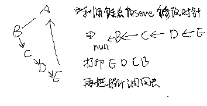
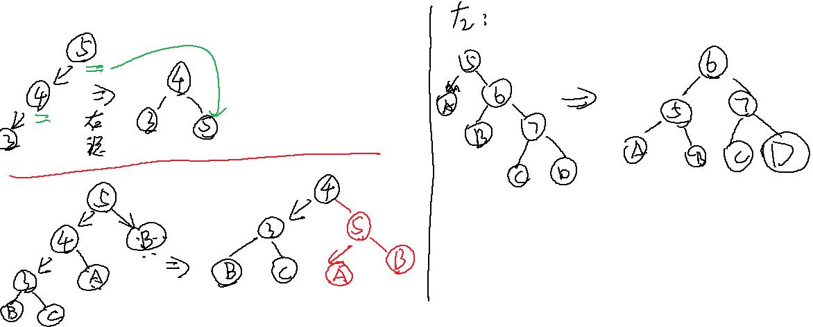

# AlgorithmMediumDay03

笔记可以和 PDF 一样了


## part 1

介绍一种时间复杂度O(N)，额外空间复杂度O(1)的二叉树的遍历方式，N为二叉树的节点个数（不要求是完全二叉树）

### Morris遍历

经典二叉树，由于没有指向父节点的指针，故遍历时都需要一个栈（递归：系统递归函数帮助压栈，非递归：自己压）来保存有关父节点的信息，都会造成O(H)的额外空间复杂度，H为二叉树高度。

```java
//普通递归版
public static void process(Node head){
    if (head == null) { return; }
    //1
    //System.out.println(head.value)
    process(head.left);
    //2
    //System.out.println(head.value)
    process(head.right);
    //3
    //System.out.println(head.value)
}
```

Morris 遍历是利用了二叉树中空闲的结点，例如末子节点的两个引用都是指向的位置为空，但是引用仍然占着空间。利用空闲的空间完成回到上级的操作，即修改原来二叉树结构来实现。


普通遍历递归，可以三次来到当前节点，按打印时机可分为前中后序。

morris遍历，如果有左子树，可以来到当前节点两次，若没有左子树，来到当前节点一次，可以利用左子树最右节点右指针指向谁来标记第一次还是第二次到这个节点（左子树最右指针指向null，第一次到，指向当前节点，即指向自己，第二次到）。但是在遍历右子树时，无法第三次回到自己。

morris遍历第一次到时打印，**先序**。第二次到时打印（没有左子树的一次可以理解为直到第一次与第二次重叠在一起），**中序**。

morris**后序**，**只关注能来到两次的节点**，在第二次来到这个节点的时候，逆序打印其左子树的右边界，然后整个函数退出之前单独打印整个树的右边界。


逆序打印：利用链表的reverse修改指针指向，打印后，改回指针。

示例拓扑：



**所有先序、中序、后序是经典遍历基础是选择打印时机不同的产生的结果**

morris遍历的空间复杂度：O（1）

- 来到的当前节点记为cur，如果cur无左孩子，cur向右移动（cur = cur.right）

- 如果cur有左孩子，找到 cur 左子树上最右的节点，记为 mostright
    - 若 mostright 的 right 指针指向空，让其指向 cur，然后 cur 向左移动（cur = cur.left）
    - 若 mostright 的 right 指针指向 cur，让其指向空，cur 向右移动


```java
package nowcoder.advanced.class03;

/**
 * @Author GJXAIOU
 * @Date 2020/1/3 18:49
 */
public class MorrisTraversal {
    public static void process(Node head) {
        if (head == null) {
            return;
        }
        // 1，打印放在这里为先序遍历
        //System.out.println(head.value);
        process(head.left);
        // 2，打印放在这里为中序遍历
        //System.out.println(head.value);
        process(head.right);
        // 3,打印放在这里为中序遍历(第三次回到自己节点时候打印)
        //System.out.println(head.value);
    }

    public static class Node {
        public int value;
        Node left;
        Node right;

        public Node(int data) {
            this.value = data;
        }
    }

    // Morris 中序遍历
    public static void morrisIn(Node head) {
        if (head == null) {
            return;
        }
        // 开始 cur 指向 head
        Node cur = head;
        Node mostRight = null;
        while (cur != null) {
            mostRight = cur.left;
            // 节点 cur 左孩子不为空则走这里
            if (mostRight != null) {
                // 不断找左子树最右的节点
                while (mostRight.right != null && mostRight.right != cur) {
                    mostRight = mostRight.right;
                }
                // 情况二的第一种可能性
                if (mostRight.right == null) {
                    mostRight.right = cur;
                    cur = cur.left;
                    continue;
                    // 情况二的第二种可能性
                } else {
                    mostRight.right = null;
                }
            }
            // 在节点往右跑之前打印
            System.out.print(cur.value + " ");
            // 当没有左孩子的时候
            cur = cur.right;
        }
        System.out.println();
    }

    // Morris 遍历改为先序遍历
    public static void morrisPre(Node head) {
        if (head == null) {
            return;
        }
        Node cur = head;
        Node mostRight = null;
        while (cur != null) {
            mostRight = cur.left;
            if (mostRight != null) {
                while (mostRight.right != null && mostRight.right != cur) {
                    mostRight = mostRight.right;
                }
                if (mostRight.right == null) {
                    mostRight.right = cur;
                    System.out.print(cur.value + " ");
                    cur = cur.left;
                    continue;
                } else {
                    mostRight.right = null;
                }
                // 此 else 表示当前结点没有左子树的时候，可以认为其第一次到达和第二次到达是重在一起的
            } else {
                System.out.print(cur.value + " ");
            }
            cur = cur.right;
        }
        System.out.println();
    }

    // Morris 实现后续遍历
    public static void morrisPos(Node head) {
        if (head == null) {
            return;
        }
        Node cur = head;
        Node mostRight = null;
        while (cur != null) {
            mostRight = cur.left;
            // if 表示一个节点可以回到自己两次
            if (mostRight != null) {
                while (mostRight.right != null && mostRight.right != cur) {
                    mostRight = mostRight.right;
                }
                if (mostRight.right == null) {
                    mostRight.right = cur;
                    cur = cur.left;
                    continue;
                    // 发现是回到自己两次
                } else {
                    mostRight.right = null;
                    // 打印这个结点的整棵树右边界逆序打印
                    printEdge(cur.left);
                }
            }
            cur = cur.right;
        }
        // 函数结束之前打印整个树右边界
        printEdge(head);
        System.out.println();
    }

    public static void printEdge(Node head) {
        Node tail = reverseEdge(head);
        Node cur = tail;
        while (cur != null) {
            System.out.print(cur.value + " ");
            cur = cur.right;
        }
        reverseEdge(tail);
    }

    public static Node reverseEdge(Node from) {
        Node pre = null;
        Node next = null;
        while (from != null) {
            next = from.right;
            from.right = pre;
            pre = from;
            from = next;
        }
        return pre;
    }
}
```


## 二、二叉树

## 搜索二叉树

搜索二叉树的定义：对于一棵二叉树中的任意子树，其左子树上的所有数值小于头结点的数值，其右子树上所有的数值大于头结点的数值，并且树中不存在数值相同的结点。也称二叉查找树。

### 平衡二叉树/AVL树

#### 平衡性

经典的平衡搜索二叉树结构：在满足搜索二叉树的前提条件下，对于一棵二叉树中的任意子树，其左子树和其右子树的高度相差不超过1。


因为默认情况下形成的搜索二叉树结构和数值的输入顺序有关，如果想要尽量保持平衡性则需要对树的结构进行调整。

### 典型搜索二叉树—AVL树、红黑树、SBT树的原理，增删改查都是 O（N）

#### AVL树

AVL树是一种具有严苛平衡性的搜索二叉树。什么叫做严苛平衡性呢？那就是**所有子树的左子树和右子树的高度相差不超过1**。弊端是，每次发现因为插入、删除操作破坏了这种严苛的平衡性之后，都需要作出相应的调整以使其恢复平衡，调整较为频繁。

#### 红黑树

红黑树是每个节点都带有颜色属性的搜索二叉树，颜色或红色或黑色。在搜索二叉树强制一般要求以外，对于任何有效的红黑树我们增加了如下的额外要求:

- 性质1. 节点是红色或黑色。
- 性质2. 根节点是黑色。
- 性质3 每个叶节点（NIL节点，空节点）是黑色的。
- 性质4 每个红色节点的两个子节点都是黑色。(从每个叶子到根的所有路径上不能有两个连续的红色节点)
- 性质5. 从任一节点到其每个叶子的所有路径都包含相同数目的黑色节点。

这些约束强制了红黑树的关键性质: **从根到叶子的最长的可能路径不多于最短的可能路径的两倍长**。结果是这个树**大致上是平衡**的。因为操作比如插入、删除和查找某个值的最坏情况时间都要求与树的高度成比例，这个在高度上的理论上限允许红黑树在最坏情况下都是高效的，而不同于普通的二叉查找树。

要知道为什么这些特性确保了这个结果，注意到**性质4导致了路径不能有两个毗连的红色节点**就足够了。**最短的可能路径都是黑色节点，最长的可能路径有交替的红色和黑色节点**。因为根据性质5所有最长的路径都有相同数目的黑色节点，这就表明了没有路径能多于任何其他路径的两倍长。

#### SBT树

它是由中国广东中山纪念中学的陈启峰发明的。陈启峰于2006年底完成论文《Size Balanced Tree》，并在2007年的全国青少年信息学奥林匹克竞赛冬令营中发表。**相比红黑树、AVL树等自平衡二叉查找树，SBT更易于实现**。**据陈启峰在论文中称，SBT是“目前为止速度最快的高级二叉搜索树”**。**SBT能在O(log n)的时间内完成所有二叉搜索树(BST)的相关操作**，而与普通二叉搜索树相比，SBT仅仅加入了简洁的核心操作Maintain。由于SBT赖以保持平衡的是size域而不是其他“无用”的域，它可以很方便地实现动态顺序统计中的select和rank操作。

**SBT树的性质**是：对于数中任意结点，以该结点为根节点的子树的结点个数不能比以该结点的叔叔结点为根节点的子树的结点个数大。


> 由于红黑树的实现较为复杂，因此现在工程中大多使用SBT树作为平衡二叉树的实现。


原版没有调整的搜索二叉树：不兼顾平衡性

```java
package nowcoder.advanced.advanced_class_03;

/**
 * Abstract binary search tree implementation. Its basically fully implemented
 * binary search tree, just template method is provided for creating Node (other
 * trees can have slightly different nodes with more info). This way some code
 * from standart binary search tree can be reused for other kinds of binary
 * trees.
 *
 * @author Ignas Lelys
 * @created Jun 29, 2011
 */
public class AbstractBinarySearchTree {

    /**
     * Root node where whole tree starts.
     */
    public Node root;

    /**
     * Tree size.
     */
    protected int size;

    /**
     * Because this is abstract class and various trees have different
     * additional information on different nodes subclasses uses this abstract
     * method to create nodes (maybe of class {@link Node} or maybe some
     * different node sub class).
     *
     * @param value  Value that node will have.
     * @param parent Node's parent.
     * @param left   Node's left child.
     * @param right  Node's right child.
     * @return Created node instance.
     */
    protected Node createNode(int value, Node parent, Node left, Node right) {
        return new Node(value, parent, left, right);
    }

    /**
     * Finds a node with concrete value. If it is not found then null is
     * returned.
     *
     * @param element Element value.
     * @return Node with value provided, or null if not found.
     */
    public Node search(int element) {
        Node node = root;
        while (node != null && node.value != null && node.value != element) {
            if (element < node.value) {
                node = node.left;
            } else {
                node = node.right;
            }
        }
        return node;
    }

    /**
     * Insert new element to tree.
     *
     * @param element Element to insert.
     */
    public Node insert(int element) {
        if (root == null) {
            root = createNode(element, null, null, null);
            size++;
            return root;
        }

        Node insertParentNode = null;
        Node searchTempNode = root;
        // 一直找到不能再找了
        while (searchTempNode != null && searchTempNode.value != null) {
            insertParentNode = searchTempNode;
            if (element < searchTempNode.value) {
                searchTempNode = searchTempNode.left;
            } else {
                searchTempNode = searchTempNode.right;
            }
        }

        Node newNode = createNode(element, insertParentNode, null, null);
        if (insertParentNode.value > newNode.value) {
            insertParentNode.left = newNode;
        } else {
            insertParentNode.right = newNode;
        }
        size++;
        return newNode;
    }

    /**
     * Removes element if node with such value exists.
     *
     * @param element Element value to remove.
     * @return New node that is in place of deleted node. Or null if element for
     * delete was not found.
     */
    public Node delete(int element) {
        Node deleteNode = search(element);
        if (deleteNode != null) {
            return delete(deleteNode);
        } else {
            return null;
        }
    }

    /**
     * Delete logic when node is already found.
     *
     * @param deleteNode Node that needs to be deleted.
     * @return New node that is in place of deleted node. Or null if element for
     * delete was not found.
     */
    protected Node delete(Node deleteNode) {
        if (deleteNode != null) {
            Node nodeToReturn = null;
            if (deleteNode != null) {
                if (deleteNode.left == null) {
                    nodeToReturn = transplant(deleteNode, deleteNode.right);
                } else if (deleteNode.right == null) {
                    nodeToReturn = transplant(deleteNode, deleteNode.left);
                    // 如果要删除的节点的左子树和右子树都存在，见图片解析
                } else {
                    Node successorNode = getMinimum(deleteNode.right);
                    if (successorNode.parent != deleteNode) {
                        transplant(successorNode, successorNode.right);
                        successorNode.right = deleteNode.right;
                        successorNode.right.parent = successorNode;
                    }
                    transplant(deleteNode, successorNode);
                    successorNode.left = deleteNode.left;
                    successorNode.left.parent = successorNode;
                    nodeToReturn = successorNode;
                }
                size--;
            }
            return nodeToReturn;
        }
        return null;
    }

    /**
     * Put one node from tree (newNode) to the place of another (nodeToReplace).
     *
     * @param nodeToReplace Node which is replaced by newNode and removed from tree.
     * @param newNode       New node.
     * @return New replaced node.
     */
    private Node transplant(Node nodeToReplace, Node newNode) {
        if (nodeToReplace.parent == null) {
            this.root = newNode;
        } else if (nodeToReplace == nodeToReplace.parent.left) {
            nodeToReplace.parent.left = newNode;
        } else {
            nodeToReplace.parent.right = newNode;
        }
        if (newNode != null) {
            newNode.parent = nodeToReplace.parent;
        }
        return newNode;
    }

    /**
     * @param element
     * @return true if tree contains element.
     */
    public boolean contains(int element) {
        return search(element) != null;
    }

    /**
     * @return Minimum element in tree.
     */
    public int getMinimum() {
        return getMinimum(root).value;
    }

    /**
     * @return Maximum element in tree.
     */
    public int getMaximum() {
        return getMaximum(root).value;
    }

    /**
     * Get next element element who is bigger than provided element.
     *
     * @param element Element for whom descendand element is searched
     * @return Successor value.
     */
    // TODO Predecessor
    public int getSuccessor(int element) {
        return getSuccessor(search(element)).value;
    }

    /**
     * @return Number of elements in the tree.
     */
    public int getSize() {
        return size;
    }

    /**
     * Tree traversal with printing element values. In order method.
     */
    public void printTreeInOrder() {
        printTreeInOrder(root);
    }

    /**
     * Tree traversal with printing element values. Pre order method.
     */
    public void printTreePreOrder() {
        printTreePreOrder(root);
    }

    /**
     * Tree traversal with printing element values. Post order method.
     */
    public void printTreePostOrder() {
        printTreePostOrder(root);
    }

    /*-------------------PRIVATE HELPER METHODS-------------------*/

    private void printTreeInOrder(Node entry) {
        if (entry != null) {
            printTreeInOrder(entry.left);
            if (entry.value != null) {
                System.out.println(entry.value);
            }
            printTreeInOrder(entry.right);
        }
    }

    private void printTreePreOrder(Node entry) {
        if (entry != null) {
            if (entry.value != null) {
                System.out.println(entry.value);
            }
            printTreeInOrder(entry.left);
            printTreeInOrder(entry.right);
        }
    }

    private void printTreePostOrder(Node entry) {
        if (entry != null) {
            printTreeInOrder(entry.left);
            printTreeInOrder(entry.right);
            if (entry.value != null) {
                System.out.println(entry.value);
            }
        }
    }

    protected Node getMinimum(Node node) {
        while (node.left != null) {
            node = node.left;
        }
        return node;
    }

    protected Node getMaximum(Node node) {
        while (node.right != null) {
            node = node.right;
        }
        return node;
    }

    protected Node getSuccessor(Node node) {
        // if there is right branch, then successor is leftmost node of that
        // subtree
        if (node.right != null) {
            return getMinimum(node.right);
        } else { // otherwise it is a lowest ancestor whose left child is also
            // ancestor of node
            Node currentNode = node;
            Node parentNode = node.parent;
            while (parentNode != null && currentNode == parentNode.right) {
                // go up until we find parent that currentNode is not in right
                // subtree.
                currentNode = parentNode;
                parentNode = parentNode.parent;
            }
            return parentNode;
        }
    }

    // -------------------------------- TREE PRINTING
    // ------------------------------------

    public void printTree() {
        printSubtree(root);
    }

    public void printSubtree(Node node) {
        if (node.right != null) {
            printTree(node.right, true, "");
        }
        printNodeValue(node);
        if (node.left != null) {
            printTree(node.left, false, "");
        }
    }

    private void printNodeValue(Node node) {
        if (node.value == null) {
            System.out.print("<null>");
        } else {
            System.out.print(node.value.toString());
        }
        System.out.println();
    }

    private void printTree(Node node, boolean isRight, String indent) {
        if (node.right != null) {
            printTree(node.right, true, indent + (isRight ? "        " : " |      "));
        }
        System.out.print(indent);
        if (isRight) {
            System.out.print(" /");
        } else {
            System.out.print(" \\");
        }
        System.out.print("----- ");
        printNodeValue(node);
        if (node.left != null) {
            printTree(node.left, false, indent + (isRight ? " |      " : "        "));
        }
    }

    public static class Node {
        public Node(Integer value, Node parent, Node left, Node right) {
            super();
            this.value = value;
            this.parent = parent;
            this.left = left;
            this.right = right;
        }

        public Integer value;
        public Node parent;
        public Node left;
        public Node right;

        public boolean isLeaf() {
            return left == null && right == null;
        }

        @Override
        public int hashCode() {
            final int prime = 31;
            int result = 1;
            result = prime * result + ((value == null) ? 0 : value.hashCode());
            return result;
        }

        @Override
        public boolean equals(Object obj) {
            if (this == obj)
                return true;
            if (obj == null)
                return false;
            if (getClass() != obj.getClass())
                return false;
            Node other = (Node) obj;
            if (value == null) {
                if (other.value != null)
                    return false;
            } else if (!value.equals(other.value))
                return false;
            return true;
        }

    }
}

```


### 搜索二叉树调整的步骤：为了平衡性

右旋：头结点变成了新头结点的右孩子

左旋：头结点变成了新头结点的左孩子




### 旋转——Rebalance

左旋：


右旋：


每种平衡二叉树都有自己的一套在插入、删除等操作改变树结构而破坏既定平衡性时的应对措施（但都是左旋操作和右旋操作的组合），以AVL数为例（有四种平衡调整操作，其中的数字只是结点代号而非结点数值）：

- `LL`调整：2号结点的左孩子的左孩子导致整个树不平衡，2号结点右旋一次

    

    

    

- `RR`调整：3号结点的右孩子的右孩子导致树不平衡，3号结点左旋一次：

    

    

    

- `LR`调整：先左后右

    

    

    

- `RL`调整：先右后左：

    

    

    

> 红黑树的调整也是类似的，只不过调整方案更多。面试中一般不会让你手写红黑树（若有兴趣可参见文末附录），但我们一定能说清这些查找二叉树的性质，以及调整平衡的基本操作，再就是这些结构的使用。

### Java中红黑树的使用

Java中红黑树的实现有`TreeSet`和`TreeMap`，前者结点存储的是单一数据，而后者存储的是``的形式。

```java
public static void main(String[] args) {
    TreeMap<Integer,String> treeMap = new TreeMap();
    treeMap.put(5, "tom");
    treeMap.put(11, "jack");
    treeMap.put(30,"tony");
    treeMap.put(18, "alice");
    treeMap.put(25, "jerry");

    //红黑树中最右边的结点
    System.out.println(treeMap.lastEntry());
    System.out.println(treeMap.lastKey());
    //红黑树最左边的结点
    System.out.println(treeMap.firstKey());
    //如果有13这个key，那么返回这条记录，否则返回树中比13大的key中最小的那一个
    System.out.println(treeMap.ceilingEntry(13));
    //如果有21这个key，那么返回这条记录，否则返回树中比21小的key中最大的那一个
    System.out.println(treeMap.floorEntry(21));
    //比11大的key中，最小的那一个
    System.out.println(treeMap.higherKey(11));
    //比25小的key中，最大的那一个
    System.out.println(treeMap.lowerKey(25));
    //遍历红黑树，是按key有序遍历的
    for (Map.Entry<Integer, String> record : treeMap.entrySet()) {
        System.out.println("age:"+record.getKey()+",name:"+record.getValue());
    }
}
```

`TreeMap`的优势是`key`在其中是有序组织的，因此增加、删除、查找`key`的时间复杂度均为`log(2,N)`。

### 案例

#### The Skyline Problem

水平面上有 *N* 座大楼，每座大楼都是矩阵的形状，可以用一个三元组表示 `(start, end, height)`，分别代表其在x轴上的起点，终点和高度。大楼之间从远处看可能会重叠，求出 *N* 座大楼的外轮廓线。

外轮廓线的表示方法为若干三元组，每个三元组包含三个数字 (start, end, height)，代表这段轮廓的起始位置，终止位置和高度。

给出三座大楼：

```
[
  [1, 3, 3],
  [2, 4, 4],
  [5, 6, 1]
]
复制代码
```


外轮廓线为：

```java
[
  [1, 2, 3],
  [2, 4, 4],
  [5, 6, 1]
]
复制代码
```

**解析**：

1. 将一座楼的表示`[start,end,height]`拆分成左右两个边界（边界包含：所处下标、边界高度、是楼的左边界还是右边界），比如`[1,3,3]`就可以拆分成`[1,3,true]`和`[3,3,false]`的形式（`true`代表左边界、`false`代表右边界）。

2. 将每座楼都拆分成两个边界，然后对边界按照边界所处的下标进行排序。比如`[[1,3,3],[2,4,4],[5,6,1]`拆分之后为`[[1,3,true],[3,3,false],[2,4,true],[,4,4,false],[5,1,true],[6,1,false]]`，排序后为`[[1,3,true],[2,4,true],[3,3,false],[4,4,false],[5,1,true],[6,1,false]]`

3. 将边界排序后，遍历每个边界的高度并依次加入到一棵`TreeMap`红黑树中（记为`countOfH`），以该高度出现的次数作为键值（第一次添加的高度键值为1），如果遍历过程中有重复的边界高度添加，要判断它是左边界还是右边界，前者直接将该高度在红黑树中的键值加1，后者则减1。以步骤2中排序后的边界数组为例，首先判断`countOfH`是否添加过边界`[1,3,true]`的高度`3`，发现没有，于是`put(3,1)`；接着对`[2,4,true]`，`put[4,1]`；然后尝试添加`[3,3,false]`的`3`，发现`countOfH`中添加过`3`，而`[3,3,false]`是右边界，因此将`countOfH.get(3)`的次数减1，当`countOfH`中的记录的键值为0时直接移除，于是移除高度为3的这一条记录；……

    对于遍历过程经过的每一个边界，我们还需要一棵`TreeMap`红黑树（记为`maxHOfPos`）来记录对我们后续求外轮廓线有用的信息，也就是每个边界所处下标的最大建筑高度：

    

    

    

    这里有个细节要注意一下，那就是如果添加某个边界之后，`countOfH`树为空了，那么该边界所处下标的建筑高度要记为0，表示一片相邻建筑的结束，比如上图中下标为4和6的边界。这也是为了后续求外轮廓线提供判断的依据。

4. 遍历`maxHOfPos`中的记录，构造整个外轮廓线数组：

    

    

    

    起初没有遍历边界时，记`start=0,height=0`，接着遍历边界，如果边界高度`curHeight!=height`如上图中的`1->2：height=0,curHeight=3`，那么记`start=1,height=3`表示第一条组外轮廓线的`start`和`height`，接下来就是确定它的`end`了。确定了一条轮廓线的`start`和`height`之后会有两种情况：下一组轮廓线和这一组是挨着的（如上图`2->3`）、下一组轮廓线和这一组是相隔的（如上图中`3->4`）。因此在遍历到边界`[index:2,H:4]`时，发现`curHeight=4 != height=3`，于是可以确定轮廓线`start:1,heigth:3`的`end:2`。确定一条轮廓线后就要更新一下`start=2,heigth=4`表示下一组轮廓线的起始下标和高度，接着遍历到边界`[index:3,H:4]`，发现`curHeight=4=height`于是跳过；接着遍历到边界`[index:4,H:0]`，发现`curHeight=0`，根据步骤3中的逻辑可知一片相邻的建筑到此结束了，因此轮廓线`start:2,height:4`的`end=4`。

示例代码：

```java
package top.zhenganwen.lintcode;

import java.util.*;

public class T131_The_SkylineProblem {

    public class Border implements Comparable<Border> {
        public int index;
        public int height;
        public boolean isLeft;

        public Border(int index, int height, boolean isLeft) {
            this.index = index;
            this.height = height;
            this.isLeft = isLeft;
        }

        @Override
        public int compareTo(Border border) {
            if (this.index != border.index) {
                return this.index - border.index;
            }
            if (this.isLeft != border.isLeft) {
                return this.isLeft ? -1 : 1;
            }
            return 0;
        }
    }

    /**
     * @param buildings: A list of lists of integers
     * @return: Find the outline of those buildings
     */
    public List<List<Integer>> buildingOutline(int[][] buildings) {
        //1、split one building to two borders and sort by border's index
        Border[] borders = new Border[buildings.length * 2];
        for (int i = 0; i < buildings.length; i++) {
            int[] oneBuilding = buildings[i];
            borders[i * 2] = new Border(oneBuilding[0], oneBuilding[2], true);
            borders[i * 2 + 1] = new Border(oneBuilding[1], oneBuilding[2], false);
        }
        Arrays.sort(borders);

        //2、traversal borders and record the max height of each index

        //key->height   value->the count of the height
        TreeMap<Integer, Integer> countOfH = new TreeMap<>();
        //key->index    value->the max height of the index
        TreeMap<Integer, Integer> maxHOfPos = new TreeMap<>();
        for (int i = 0; i < borders.length; i++) {
            int height = borders[i].height;
            if (!countOfH.containsKey(height)) {
                countOfH.put(height, 1);
            }else {
                int count = countOfH.get(height);
                if (borders[i].isLeft) {
                    countOfH.put(height, count + 1);
                } else {
                    countOfH.put(height, count - 1);
                    if (countOfH.get(height) == 0) {
                        countOfH.remove(height);
                    }
                }
            }

            if (countOfH.isEmpty()) {
                maxHOfPos.put(borders[i].index, 0);
            } else {
                //lastKey() return the maxHeight in countOfH RedBlackTree->log(2,N)
                maxHOfPos.put(borders[i].index, countOfH.lastKey());
            }
        }

        //3、draw the buildings outline according to the maxHOfPos
        int start = 0;
        int height = 0;
        List<List<Integer>> res = new ArrayList<>();
        for (Map.Entry<Integer, Integer> entry : maxHOfPos.entrySet()) {
            int curPosition = entry.getKey();
            int curMaxHeight = entry.getValue();
            if (height != curMaxHeight) {
                //if the height don't be reset to 0，the curPosition is the end
                if (height != 0) {
                    List<Integer> record = new ArrayList<>();
                    record.add(start);
                    record.add(curPosition);//end
                    record.add(height);

                    res.add(record);
                }
                //reset the height and start
                height = curMaxHeight;
                start = curPosition;
            }
        }
        return res;
    }

    public static void main(String[] args) {
        int[][] buildings = {
                {1, 3, 3},
                {2, 4, 4},
                {5, 6, 1}
        };
        System.out.println(new T131_The_SkylineProblem().buildingOutline(buildings));

    }
}
```

