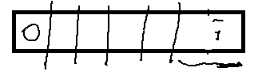

# AlgorithmMediumDay04

### 案例

#### The Skyline Problem

给定一个N行3列二维数组，每一行表示有一座大楼，一共有N座大楼。 所有大楼的底部都坐落在X轴上，每一行的三个值(a,b,c)代表每座大楼的从(a,0)点开始，到 (b,0)点结束，高度为c。 输入的数据可以保证a<b,且a，b，c均为正数。大楼之间可以有重合。 请输出整体的轮廓线。

例子：给定一个二维数组 [ [1, 3, 3], [2, 4, 4], [5, 6,1] ]
输出为轮廓线 [ [1, 2, 3], [2, 4, 4], [5, 6, 1] ]

水平面上有 *N* 座大楼，每座大楼都是矩阵的形状，可以用一个三元组表示 `(start, end, height)`，分别代表其在x轴上的起点，终点和高度。大楼之间从远处看可能会重叠，求出 *N* 座大楼的外轮廓线。

外轮廓线的表示方法为若干三元组，每个三元组包含三个数字 (start, end, height)，代表这段轮廓的起始位置，终止位置和高度。

给出三座大楼：

```
[
  [1, 3, 3],
  [2, 4, 4],
  [5, 6, 1]
]
```


外轮廓线为：

```java
[
  [1, 2, 3],
  [2, 4, 4],
  [5, 6, 1]
]
```

**解析**：

1. 将一座楼的表示`[start,end,height]`拆分成左右两个边界（边界包含：所处下标、边界高度、是楼的左边界还是右边界），比如`[1,3,3]`就可以拆分成`[1,3,true]`和`[3,3,false]`的形式（`true`代表左边界、`false`代表右边界）。

2. 将每座楼都拆分成两个边界，然后对边界按照边界所处的下标进行排序。比如`[[1,3,3],[2,4,4],[5,6,1]`拆分之后为`[[1,3,true],[3,3,false],[2,4,true],[,4,4,false],[5,1,true],[6,1,false]]`，排序后为`[[1,3,true],[2,4,true],[3,3,false],[4,4,false],[5,1,true],[6,1,false]]`

3. 将边界排序后，遍历每个边界的高度并依次加入到一棵`TreeMap`红黑树中（记为`countOfH`），以该高度出现的次数作为键值（第一次添加的高度键值为1），如果遍历过程中有重复的边界高度添加，要判断它是左边界还是右边界，前者直接将该高度在红黑树中的键值加1，后者则减1。以步骤2中排序后的边界数组为例，首先判断`countOfH`是否添加过边界`[1,3,true]`的高度`3`，发现没有，于是`put(3,1)`；接着对`[2,4,true]`，`put[4,1]`；然后尝试添加`[3,3,false]`的`3`，发现`countOfH`中添加过`3`，而`[3,3,false]`是右边界，因此将`countOfH.get(3)`的次数减1，当`countOfH`中的记录的键值为0时直接移除，于是移除高度为3的这一条记录；……

    对于遍历过程经过的每一个边界，我们还需要一棵`TreeMap`红黑树（记为`maxHOfPos`）来记录对我们后续求外轮廓线有用的信息，也就是每个边界所处下标的最大建筑高度：

    

    

    

    这里有个细节要注意一下，那就是如果添加某个边界之后，`countOfH`树为空了，那么该边界所处下标的建筑高度要记为0，表示一片相邻建筑的结束，比如上图中下标为4和6的边界。这也是为了后续求外轮廓线提供判断的依据。

4. 遍历`maxHOfPos`中的记录，构造整个外轮廓线数组：

    

    

    

    起初没有遍历边界时，记`start=0,height=0`，接着遍历边界，如果边界高度`curHeight!=height`如上图中的`1->2：height=0,curHeight=3`，那么记`start=1,height=3`表示第一条组外轮廓线的`start`和`height`，接下来就是确定它的`end`了。确定了一条轮廓线的`start`和`height`之后会有两种情况：下一组轮廓线和这一组是挨着的（如上图`2->3`）、下一组轮廓线和这一组是相隔的（如上图中`3->4`）。因此在遍历到边界`[index:2,H:4]`时，发现`curHeight=4 != height=3`，于是可以确定轮廓线`start:1,heigth:3`的`end:2`。确定一条轮廓线后就要更新一下`start=2,heigth=4`表示下一组轮廓线的起始下标和高度，接着遍历到边界`[index:3,H:4]`，发现`curHeight=4=height`于是跳过；接着遍历到边界`[index:4,H:0]`，发现`curHeight=0`，根据步骤3中的逻辑可知一片相邻的建筑到此结束了，因此轮廓线`start:2,height:4`的`end=4`。

示例代码：

```java
package nowcoder.advanced.advanced_class_04;

import java.util.*;
import java.util.Map.Entry;

public class Code_01_Building_Outline {
    // （位置，高度，上还是下）结构
    public static class Node {
        public boolean isUp;
        public int posi;
        public int h;

        public Node(boolean bORe, int position, int height) {
            isUp = bORe;
            posi = position;
            h = height;
        }
    }

    public static class NodeComparator implements Comparator<Node> {
        @Override
        public int compare(Node o1, Node o2) {
            if (o1.posi != o2.posi) {
                return o1.posi - o2.posi;
            }
            // 排序时候如果同一个位置出现有下有上，则上的在前面，下的在后面
            if (o1.isUp != o2.isUp) {
                return o1.isUp ? -1 : 1;
            }
            return 0;
        }
    }

    public static List<List<Integer>> buildingOutline(int[][] buildings) {
        Node[] nodes = new Node[buildings.length * 2];
        for (int i = 0; i < buildings.length; i++) {
            // 防止放置信息覆盖
            nodes[i * 2] = new Node(true, buildings[i][0], buildings[i][2]);
            nodes[i * 2 + 1] = new Node(false, buildings[i][1], buildings[i][2]);
        }
        // NOde 之间只按照位置排序
        Arrays.sort(nodes, new NodeComparator());
        // key 为高度， value 为该高度出现的次数
        TreeMap<Integer, Integer> htMap = new TreeMap<>();
        TreeMap<Integer, Integer> pmMap = new TreeMap<>();
        for (int i = 0; i < nodes.length; i++) {
            // 如果是 UP
            if (nodes[i].isUp) {
                // 如果之前没有出现过该高度，则加入，并且记录出现次数为 1
                if (!htMap.containsKey(nodes[i].h)) {
                    htMap.put(nodes[i].h, 1);
                } else {
                    // 不是第一次出现，则放入该高度，次数为之前出现次数 + 1；
                    htMap.put(nodes[i].h, htMap.get(nodes[i].h) + 1);
                }
            } else {
                if (htMap.containsKey(nodes[i].h)) {
                    // 只有一次，词频为 1，剪完就直接删除了
                    if (htMap.get(nodes[i].h) == 1) {
                        htMap.remove(nodes[i].h);
                    } else {
                        htMap.put(nodes[i].h, htMap.get(nodes[i].h) - 1);
                    }
                }
            }
            if (htMap.isEmpty()) {
                // pmMap 记录每一个出现位置的最大高度（就是加入结点之后看 TreeMap 中的最大高度值），用于看最大高度是否变化后面计算边界
                pmMap.put(nodes[i].posi, 0);
            } else {
                pmMap.put(nodes[i].posi, htMap.lastKey());
            }
        }
        List<List<Integer>> res = new ArrayList<>();
        // 默认该开始高度为 0
        int start = 0;
        int height = 0;
        // 因为是 TreeMap，所以拿出的值是依次升序的，所以位置小的先遍历
        for (Entry<Integer, Integer> entry : pmMap.entrySet()) {
            int curPosition = entry.getKey();
            int curMaxHeight = entry.getValue();
            // 之前的高度不等于现在高度
            if (height != curMaxHeight) {
                // 如果之前高度不为 0 ，并且变化了，说明一条轮廓线要收尾了
                if (height != 0) {
                    List<Integer> newRecord = new ArrayList<Integer>();
                    newRecord.add(start);
                    newRecord.add(curPosition);
                    newRecord.add(height);
                    res.add(newRecord);
                }
                // 如果不为 0 ，则相当于一条轮廓线刚刚起来，没有终止位置，所以没法记录
                start = curPosition;
                height = curMaxHeight;
            }
        }
        return res;
    }

    public static void main(String[] args) {
        int[][] arr = {{1, 3, 3}, {2, 4, 4}, {5, 6, 1}};
        List<List<Integer>> lists = buildingOutline(arr);
        Iterator<List<Integer>> iterator = lists.iterator();
        while (iterator.hasNext()) {
            System.out.println(iterator.next());
        }
    }
}
```

程序输出结果为：

```java
[1, 2, 3]
[2, 4, 4]
[5, 6, 1]
```


#### 子数组

给定一个数组arr（可正、负、零），和一个整数num，求在arr中，累加和等于num的最长子数组的长度
例子：
arr = {7,3,2,1,1,7,7,7} num = 7
其中有很多的子数组累加和等于7，但是最长的子数组是{3,2,1,1}，所以返回其长度4

**解答**

求得以每一个位置结尾的累加和为该数的子数组，最终答案必在其中。

思路：比如 aim  为 800，现在首先求得从 0 位置到 i 位置所有元素的和 sum，这里例如从 0 到 1000 和为 2000，则如果要求 1000 及其往前和为 800 的子数组，只要求从 0 开始到那个位置连续值为 1200 即可。

**示例**：以数组：[7,3,2,1,1,7,-6,-1,7] 为例，aim 为 7，首先准备一个 map，里面首先包含一个元素{0,-1}，表示 0 这个累加和最早出现在 -1 位置（因为一个数都没有的时候也可以累加出零），首先到 0 位置的 7，此时 sum = 7，在 Map 中找 sum - aim 最早出现在什么位置，从 map 中看出 0 最早出现在 -1 位置，所以从 -1 的下一个位置到当前位置累加和为 7，所以 必须以 0 结尾的情况下最长子数组为 0 ~ 0，长度为 1 。 因为 Map 中没有新出现的累加和为 7 的记录，所以将 7 ，0 加入 map 中，到 1 位置之后 sum = 10 ，在 map 中查找 sum - aim = 3 这个累加和最早出现的位置，发现 map 中没有，所以以 3 结尾不可能累加出累加和为 7 的子数组，然后将新出现的累加和和最早出现的位置 1 放入 map 中，。。。。。注：如果一个累加和在 map 中已经有了则不变

```java
package nowcoder.advanced.advanced_class_04;

import java.util.HashMap;

public class Code_05_LongestSumSubArrayLength {

    public static int maxLength(int[] arr, int aim) {
        if (arr == null || arr.length == 0) {
            return 0;
        }
        HashMap<Integer, Integer> map = new HashMap<Integer, Integer>();
        map.put(0, -1); // important
        int len = 0;
        int sum = 0;
        for (int i = 0; i < arr.length; i++) {
            sum += arr[i];
            if (map.containsKey(sum - aim)) {
                len = Math.max(i - map.get(sum - aim), len);
            }
            if (!map.containsKey(sum)) {
                map.put(sum, i);
            }
        }
        return len;
    }

    public static int[] generateArray(int size) {
        int[] result = new int[size];
        for (int i = 0; i != size; i++) {
            result[i] = (int) (Math.random() * 11) - 5;
        }
        return result;
    }

    public static void printArray(int[] arr) {
        for (int i = 0; i != arr.length; i++) {
            System.out.print(arr[i] + " ");
        }
        System.out.println();
    }

    public static void main(String[] args) {
        int[] arr = generateArray(20);
        printArray(arr);
        System.out.println(maxLength(arr, 10));
    }
}

```


#### 问题变形

- 数组中都是整数，有奇数和偶数，求奇数和偶数个数相等的最长子数组，相当于将奇数变为 1，偶数变为 -1 ，求累加和为 0 的最长子数组即可。

- 数组中含有 0,1,2 求数组中含有1 的数目和 2 的数目相等的最长子数组，相当于将 2 变为-1 ，求累加和为 0 的最长子数组。

- 定义数组的异或和的概念：
    **数组中所有的数异或起来，得到的结果叫做数组的异或和**，比如数组{3,2,1}的异或和是，3^2^1 = 0
    给定一个数组arr，你可以任意把arr分成很多不相容的子数组，你的目的是：分出来的子数组中，异或和为0的子数组最多。
    请返回：分出来的子数组中，异或和为0的子数组最多是多少？


异或满足结合律和交换律；

 0 ^ n = n; n ^n = 0

假设 0 ~ i 位置上存在一种最优划分方式，则存在两种可能性



- i 位置所在区域不满足异或和为 0 的子数组，则  0 ~ i 上满足异或和为 0 的子数组数量和 0 ~ i-1 上满足的数目相同

- 如果 i 作为最优划分的一个部分，而该部分是从 k  开始的（如果 k ….i 中存在 j 到 i 是符合条件的，即异或和为 0，则该 k …i 不是最优划分），那么  k  位置就是距离 i 最近的 从 K 到 i 异或和 0 的部分。

    则如果假设 0 ~ i 的异或和为 sum，因为 k …i 的异或和为 0，则 k  位置就是前面异或和为 sum 的最晚位置的后一个位置。 缩减为 0 ~ k-1 位置上的最优划分。

所以汇总公式：

代码：

```java
package nowcoder.advanced.advanced_class_04;

import java.util.HashMap;

public class Code_06_Most_EOR {

    public static int mostEOR(int[] arr) {
        int ans = 0;
        int xor = 0;
        int[] dp = new int[arr.length];
        HashMap<Integer, Integer> map = new HashMap<>();
        map.put(0, -1);
        for (int i = 0; i < arr.length; i++) {
            xor ^= arr[i];
            if (map.containsKey(xor)) {
                int pre = map.get(xor);
                dp[i] = pre == -1 ? 1 : (dp[pre] + 1);
            }
            if (i > 0) {
                dp[i] = Math.max(dp[i - 1], dp[i]);
            }
            map.put(xor, i);
            ans = Math.max(ans, dp[i]);
        }
        return ans;
    }

    // for test
    public static int comparator(int[] arr) {
        if (arr == null || arr.length == 0) {
            return 0;
        }
        int[] eors = new int[arr.length];
        int eor = 0;
        for (int i = 0; i < arr.length; i++) {
            eor ^= arr[i];
            eors[i] = eor;
        }
        int[] mosts = new int[arr.length];
        mosts[0] = arr[0] == 0 ? 1 : 0;
        for (int i = 1; i < arr.length; i++) {
            mosts[i] = eors[i] == 0 ? 1 : 0;
            for (int j = 0; j < i; j++) {
                if ((eors[i] ^ eors[j]) == 0) {
                    mosts[i] = Math.max(mosts[i], mosts[j] + 1);
                }
            }
            mosts[i] = Math.max(mosts[i], mosts[i - 1]);
        }
        return mosts[mosts.length - 1];
    }

    // for test
    public static int[] generateRandomArray(int maxSize, int maxValue) {
        int[] arr = new int[(int) ((maxSize + 1) * Math.random())];
        for (int i = 0; i < arr.length; i++) {
            arr[i] = (int) ((maxValue + 1) * Math.random());
        }
        return arr;
    }

    // for test
    public static void printArray(int[] arr) {
        if (arr == null) {
            return;
        }
        for (int i = 0; i < arr.length; i++) {
            System.out.print(arr[i] + " ");
        }
        System.out.println();
    }

    // for test
    public static void main(String[] args) {
        int testTime = 500000;
        int maxSize = 300;
        int maxValue = 100;
        boolean succeed = true;
        for (int i = 0; i < testTime; i++) {
            int[] arr = generateRandomArray(maxSize, maxValue);
            int res = mostEOR(arr);
            int comp = comparator(arr);
            if (res != comp) {
                succeed = false;
                printArray(arr);
                System.out.println(res);
                System.out.println(comp);
                break;
            }
        }
        System.out.println(succeed ? "Nice!" : "Error!");
    }
}

```


### 给定一棵二叉树的头节点head，请返回最大搜索二叉子树的大小


**总结**

求一棵树的最大XXXXX，转换为求以每个结点为根节点的最大XXXX，最终答案一定在其中。


代码

```java

```


