# AlgorithmMediumDay06

[TOC]


## 一、从暴力尝试到动态规划

动态规划不是玄学，也无需去记那些所谓的刻板的“公式”（例如状态转换表达式等），其实动态规划是从暴力递归而来。并不是说一个可以动态规划的题一上来就可以写出动态规划的求解步骤，我们只需要能够写出暴力递归版本，然后对重复计算的子过程结果做一个缓存，最后分析状态依赖寻求最优解，即衍生成了动态规划。本节将以多个例题示例，展示求解过程是如何从暴力尝试，一步步到动态规划的。

## 二、换钱的方法数

【**题目**】给定数组 arr，arr 中所有的值都为正数且不重复。每个值代表一种面值的货币，每种面值的货币可以使用任意张，再给定一个整数 aim 代表要找的钱数，求换钱有多少种方法。

举例：`arr=[5,10,25,1]，aim=0`：成0元的方法有1种，就是所有面值的货币都不用。所以返回1。`arr=[5,10,25,1]，aim=15`：组成15元的方法有6种，分别为3张5元、1张10元+1张5元、1张10元+5张1元、10张1元+1张5元、2张5元+5张1元和15张1元。所以返回6。`arr=[3,5]，aim=2`：任何方法都无法组成2元。所以返回0。

### （一）暴力尝试

我们可以将该题要求解的问题定义成一个过程：对于下标`index`，`arr`中在`index`及其之后的所有面值不限张数任意组合，该过程最终返回所有有效的组合方案。因此该过程可以描述为`int process(int arr[],int index,int aim)`，题目的解就是调用`process(arr,0,aim)`。那么函数内部具体该如何解决此问题呢？

其实所有面值不限张数的任意组合就是对每一个面值需要多少张的一个**决策**，那我们不妨从碰到的第一个面值开始决策，比如 `arr=[5,10,25,1]，aim=15`时，（ 选0张5元之后剩下的面值不限张数组合成15元的方法数 + 选1张5元之后剩下的面值不限张数组合成10元方法数 + 选2张5元之后剩下的面值不限张数组合成5元方法数 + 选3张5元之后剩下的面值不限张数组合成0元方法数 ）就是所给参数对应的解，其中“剩下的面值不限张数组合成一定的钱数”又是同类问题，可以使用相同的过程求解，因此有了如下的暴力递归：

```java
/**
     * arr中的每个元素代表一个货币面值，使用数组index及其之后的面值（不限张数）
     * 拼凑成钱数为aim的方法有多少种，返回种数
     * @param arr
     * @param index
     * @param aim
     * @return
     */
public static int process(int arr[], int index, int aim) {
    if (index == arr.length) {
        return aim == 0 ? 1 : 0;
    }
    int res = 0;
    //index位置面值的决策，从0张开始
    for (int zhangshu = 0; arr[index] * zhangshu <= aim; zhangshu++) {
        res += process(arr, index + 1, aim - (arr[index] * zhangshu));
    }
    return res;
}

public static int swapMoneyMethods(int arr[], int aim) {
    if (arr == null) {
        return 0;
    }
    return process(arr, 0, aim);
}

public static void main(String[] args) {
    int arr[] = {5, 10, 25, 1};
    System.out.println(swapMoneyMethods(arr, 15));
}
```

### （二）缓存每个状态的结果，以免重复计算

上述的暴力递归是极其暴力的，比如对于参数 `arr=[5，3，1，30，15，20，10]，aim=100`来说，如果已经决策了`3张5元+0张3元+0张1元`的接着会调子过程`process(arr, 3, 85)`；如果已经决策了`0张5元+5张3元+0张1元`接着也会调子过程`process(arr, 3, 85)`；如果已经决策了`0张5元+0张3元+15张1元`接着还是会调子过程`process(arr, 3, 85)`。

你会发现，这个已知面额种类和要凑的钱数，求凑钱的方法的解是固定的。也就是说不管之前的决策是3张5元的，还是5张3元的，又或是15张1元的，对后续子过程的`[30，15，20，10]`凑成`85`这个问题的解是不影响的，这个解该是多少还是多少。这也是**无后效性问题**。无后效性问题就是某一状态的求解不依赖其他状态，比如著名的N皇后问题就是有后效性问题。

因此，我们不妨再求解一个状态之后，将该状态对应的解做个缓存，在后续的状态求解时先到缓存中找是否有该状态的解，有则直接使用，没有再求解并放入缓存，这样就不会有重复计算的情况了：

```java
public static int swapMoneyMethods(int arr[], int aim) {
    if (arr == null) {
        return 0;
    }
    return process2(arr, 0, aim);
}

/**
* 使用哈希表左缓存容器
* key是某个状态的代号，value是该状态对应的解
*/
static HashMap<String,Integer> map = new HashMap();

public static int process2(int arr[], int index, int aim) {
    if (index == arr.length) {
        return aim == 0 ? 1 : 0;
    }
    int res = 0;
    for (int zhangshu = 0; arr[index] * zhangshu <= aim; zhangshu++) {
        //使用index及其之后的面值拼凑成aim的方法数这个状态的代号：index_aim
        String key = String.valueOf(index) + "_" + String.valueOf(aim);
        if (map.containsKey(key)) {
            res += map.get(key);
        } else {
            int value = process(arr, index + 1, aim - (arr[index] * zhangshu));
            key = String.valueOf(index + 1) + "_" + String.valueOf(aim - (arr[index] * zhangshu));
            map.put(key, value);
            res += value;
        }
    }
    return res;
}

public static void main(String[] args) {
    int arr[] = {5, 10, 25, 1};
    System.out.println(swapMoneyMethods(arr, 15));
}
```

### （三）确定依赖关系，寻找最优解

当然，借助缓存已经将暴力递归的时间复杂度拉低了很多，但这还不是最优解。下面我们将以寻求最优解为引导，挖掘出动态规划中的状态转换。

从暴力尝试到动态规划，我们只需观察暴力尝试版本的代码，甚至可以忘却题目，按照下面高度套路化的步骤，就可以轻易改出动态规划：

1. 首先每个状态都有两个参数`index`和`aim`（`arr`作为输入参数是不变的），因此可以对应两个变量的变化范围建立一张二维表：

    

    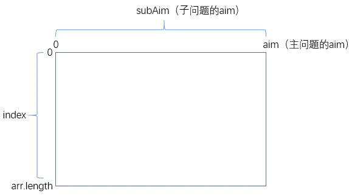

    

2. 从`base case`中找出特殊位置的解。比如`if(index==arr.length) return aim==0?1:0`，那么上述二维表的最后一行对应的所有状态可以直接求解：

    

    

    

3. 从暴力递归中找出普遍位置对应的状态所依赖的其他状态。比如：

    ```java
    for (int zhangshu = 0; arr[index] * zhangshu <= aim; zhangshu++) {
        res += process(arr, index + 1, aim - (arr[index] * zhangshu));
    }
    ```

    那么对于二维表中的一个普遍位置`(i,j)`，它所依赖的状态如下所示：

    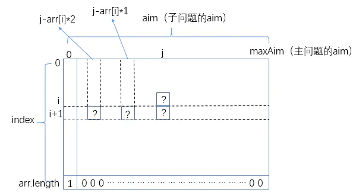

    

    也就是说一个普遍位置的状态依赖它的下一行的几个位置上的状态。那么我们已经知道了最后一行所有位置上的状态，当然可以根据这个依赖关系推出倒数第二行的，继而推出倒数第三行的……整个二维表的所有位置上的状态都能推出来。

4. 找出主问题对应二维表的哪个状态（`(0,maxAim)`），那个状态的值就是问题的解。

示例代码：

```java
public static int maxMethodsDp(int arr[], int aim) {
    //二维表
    int dp[][] = new int[arr.length + 1][aim + 1];
    //base case
    dp[arr.length][0] = 1;
    //从倒数第二行开始推，推出整个二维表每个位置的状态
    for (int i = arr.length - 1; i >= 0; i--) {
        for (int j = 0; j <= aim; j++) {
            //i对应的面值取0张
            dp[i][j] = dp[i + 1][j];
            //i对应的面值取1张、2张、3张……
            for (int subAim = j - arr[i]; subAim >= 0; subAim = subAim - arr[i]) {
                dp[i][j] += dp[i + 1][subAim];
            }
        }
    }

    return dp[0][aim];
}

public static void main(String[] args) {
    int arr[] = {5, 10, 25, 1};
    System.out.println(maxMethodsDp(arr, 15));
}
```

到这里也许你会送一口气，终于找到了最优解，其实不然，因为如果你再分析一下每个状态的求解过程，仍然存在瑕疵：


比如你在求解状态A时，可能会将其依赖的状态M,N,P的值累加起来；然后在求解状态B时，有需要将其依赖的状态M,N,P,Q累加起来，你会发现在这个过程中`M+N+P`的计算是重复的，因此还可以有如下优化：

```java
for (int i = arr.length - 1; i >= 0; i--) {
    for (int j = 0; j <= aim; j++) {
        dp[i][j] = dp[i + 1][j];
        if (j - arr[i] >= 0) {
            dp[i][j] += dp[i][j - arr[i]];
        }
    }
}
```

至此，此题最优解的求解完毕。


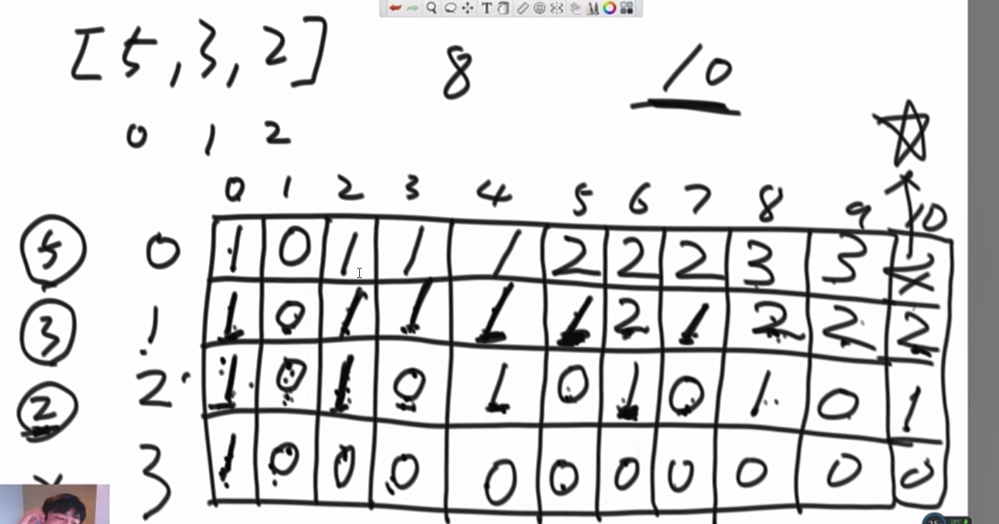

```java
package nowcoder.advanced.advanced_class_06;

import java.util.HashMap;

public class Code_01_CoinsWay {

    public static int coins1(int[] arr, int aim) {
        if (arr == null || arr.length == 0 || aim < 0) {
            return 0;
        }
        return process1(arr, 0, aim);
    }

    /**
     * @param arr
     * @param index ：可以任意自由使用 index 及其之后所有的钱
     * @param aim   ：目标钱数
     * @return ：方法数
     */
    public static int process1(int[] arr, int index, int aim) {
        int res = 0;
        // 如果到达数组最后一个位置，拿出一定金额之后 aim 值为 0，就说明是一种有效的划分，反之则说明该划分不行；
        // 所以最后该划分结果是否可行到最后一位之后才可以判断出来；
        if (index == arr.length) {
            res = aim == 0 ? 1 : 0;
        } else {
            for (int zhangshu = 0; arr[index] * zhangshu <= aim; zhangshu++) {
                // index 为当前货币金额，已经使用过了，从 index + 1 位置开始往后都可以使用；
                // aim - arr[index] * zhangshu 为后面需要凑齐的钱数；
                res += process1(arr, index + 1, aim - arr[index] * zhangshu);
            }
        }
        return res;
    }

    /**
     * 上述暴力方法问题： 200,100,50,10,5,2,1 aim = 1000；则选择 2 张 200,0 张 100，或者 0 张 200,4 张 100，都会需要在 50,
     * 10,5,2,1 中选择得到 600 元，造成重复计算。
     * 同时该问题为无后效性问题，即让后面一串钱搞定 600 元和前面怎么到的 600 元这个状态无关。
     * 一般面试都是无后效性问题。
     */

    // 暴力修改（修改上面的递归方法），因为 index 和 aim 确定，最后返回值结果就确定了，所以计算完之后将该状态和其返回值保存下来可以下次使用
    // String 格式为："index_aim"，Integer 为该种情况下对应的返回值。
    // 使用 map 做一个缓存功能
    public static HashMap<String, Integer> map = new HashMap<>();

    public static int processMap(int[] arr, int index, int aim) {
        int res = 0;
        if (index == arr.length) {
            res = aim == 0 ? 1 : 0;
        } else {
            for (int zhangshu = 0; arr[index] * zhangshu <= aim; zhangshu++) {
                int nextAim = aim - arr[index] * zhangshu;
                String key = String.valueOf(index + 1) + "_" + String.valueOf(nextAim);
                if (map.containsKey(key)) {
                    res += map.get(key);
                } else {
                    res += processMap(arr, index + 1, nextAim);
                }
            }
        }
        map.put(String.valueOf(index) + "_" + String.valueOf(aim), res);
        return res;
    }


    public static int coinsOther(int[] arr, int aim) {
        if (arr == null || arr.length == 0 || aim < 0) {
            return 0;
        }
        return processOther(arr, arr.length - 1, aim);
    }

    public static int processOther(int[] arr, int index, int aim) {
        int res = 0;
        if (index == -1) {
            res = aim == 0 ? 1 : 0;
        } else {
            for (int i = 0; arr[index] * i <= aim; i++) {
                res += processOther(arr, index - 1, aim - arr[index] * i);
            }
        }
        return res;
    }

    public static int coins2(int[] arr, int aim) {
        if (arr == null || arr.length == 0 || aim < 0) {
            return 0;
        }
        int[][] map = new int[arr.length + 1][aim + 1];
        return process2(arr, 0, aim, map);
    }

    public static int process2(int[] arr, int index, int aim, int[][] map) {
        int res = 0;
        if (index == arr.length) {
            res = aim == 0 ? 1 : 0;
        } else {
            int mapValue = 0;
            for (int i = 0; arr[index] * i <= aim; i++) {
                mapValue = map[index + 1][aim - arr[index] * i];
                if (mapValue != 0) {
                    res += mapValue == -1 ? 0 : mapValue;
                } else {
                    res += process2(arr, index + 1, aim - arr[index] * i, map);
                }
            }
        }
        map[index][aim] = res == 0 ? -1 : res;
        return res;
    }

    public static int coins3(int[] arr, int aim) {
        if (arr == null || arr.length == 0 || aim < 0) {
            return 0;
        }
        int[][] dp = new int[arr.length][aim + 1];
        for (int i = 0; i < arr.length; i++) {
            dp[i][0] = 1;
        }
        for (int j = 1; arr[0] * j <= aim; j++) {
            dp[0][arr[0] * j] = 1;
        }
        int num = 0;
        for (int i = 1; i < arr.length; i++) {
            for (int j = 1; j <= aim; j++) {
                num = 0;
                for (int k = 0; j - arr[i] * k >= 0; k++) {
                    num += dp[i - 1][j - arr[i] * k];
                }
                dp[i][j] = num;
            }
        }
        return dp[arr.length - 1][aim];
    }

    public static int coins4(int[] arr, int aim) {
        if (arr == null || arr.length == 0 || aim < 0) {
            return 0;
        }
        int[][] dp = new int[arr.length][aim + 1];
        for (int i = 0; i < arr.length; i++) {
            dp[i][0] = 1;
        }
        for (int j = 1; arr[0] * j <= aim; j++) {
            dp[0][arr[0] * j] = 1;
        }
        for (int i = 1; i < arr.length; i++) {
            for (int j = 1; j <= aim; j++) {
                dp[i][j] = dp[i - 1][j];
                dp[i][j] += j - arr[i] >= 0 ? dp[i][j - arr[i]] : 0;
            }
        }
        return dp[arr.length - 1][aim];
    }

    public static int coins5(int[] arr, int aim) {
        if (arr == null || arr.length == 0 || aim < 0) {
            return 0;
        }
        int[] dp = new int[aim + 1];
        for (int j = 0; arr[0] * j <= aim; j++) {
            dp[arr[0] * j] = 1;
        }
        for (int i = 1; i < arr.length; i++) {
            for (int j = 1; j <= aim; j++) {
                dp[j] += j - arr[i] >= 0 ? dp[j - arr[i]] : 0;
            }
        }
        return dp[aim];
    }

    public static void main(String[] args) {
        int[] coins = {10, 5, 1, 25};
        int aim = 2000;

        long start = 0;
        long end = 0;
        start = System.currentTimeMillis();
        System.out.println(coins1(coins, aim));
        end = System.currentTimeMillis();
        System.out.println("cost time : " + (end - start) + "(ms)");

        start = System.currentTimeMillis();
        System.out.println(coinsOther(coins, aim));
        end = System.currentTimeMillis();
        System.out.println("cost time : " + (end - start) + "(ms)");

        aim = 20000;

        start = System.currentTimeMillis();
        System.out.println(coins2(coins, aim));
        end = System.currentTimeMillis();
        System.out.println("cost time : " + (end - start) + "(ms)");

        start = System.currentTimeMillis();
        System.out.println(coins3(coins, aim));
        end = System.currentTimeMillis();
        System.out.println("cost time : " + (end - start) + "(ms)");

        start = System.currentTimeMillis();
        System.out.println(coins4(coins, aim));
        end = System.currentTimeMillis();
        System.out.println("cost time : " + (end - start) + "(ms)");

        start = System.currentTimeMillis();
        System.out.println(coins5(coins, aim));
        end = System.currentTimeMillis();
        System.out.println("cost time : " + (end - start) + "(ms)");

    }

}

```


## 三、排成一条线的纸牌博问题

【**题目**】 给定一个整型数组arr，代表分数不同的纸牌排成一条线。玩家A和玩家B依次拿走每张纸牌，规定玩家A先拿，玩家B后拿，但是每个玩家每次只能拿走最左或最右的纸牌，玩家A和玩家B都绝顶聪明。请返回最后获胜者的分数。

【**举例**】 `arr=[1,2,100,4]`。开始时玩家A只能拿走1或4。如果玩家A拿走1，则排列变为`[2,100,4]`，接下来玩家B可以拿走2或4，然后继续轮到玩家A。如果开始时玩家A拿走4，则排列变为`[1,2,100]`，接下来玩家B可以拿走1或100，然后继续轮到玩家A。玩家A作为绝顶聪明的人不会先拿4，因为拿4之后，玩家B将拿走100。所以玩家A会先拿1，让排列变为`[2,100,4]`，接下来玩家B不管怎么选，100都会被玩家A拿走。玩家A会获胜，分数为101。所以返回101。`arr=[1,100,2]`。开始时玩家A不管拿1还是2，玩家B作为绝顶聪明的人，都会把100拿走。玩家B会获胜，分数为100。所以返回100。

> 动态规划的题难就难在暴力尝试这个“试”法，只要能够试出了暴力版本，那改为动态规划就是高度套路的。

### （一）暴力尝试

```
public static int maxScoreOfWinner(int arr[]) {
    if (arr == null) {
        return 0;
    }
    return Math.max(
        f(arr, 0, arr.length-1),
        s(arr, 0, arr.length-1));
}

public static int f(int arr[], int beginIndex, int endIndex) {
    if (beginIndex == endIndex) {
        return arr[beginIndex];
    }
    return Math.max(
        arr[beginIndex] + s(arr, beginIndex + 1, endIndex),
        arr[endIndex] + s(arr, beginIndex, endIndex - 1));
}

public static int s(int arr[], int beginIndex, int endIndex) {
    if (beginIndex == endIndex) {
        return 0;
    }
    return Math.min(
        f(arr, beginIndex + 1, endIndex),
        f(arr, beginIndex, endIndex - 1));
}

public static void main(String[] args) {
    int arr[] = {1, 2, 100, 4};
    System.out.println(maxScoreOfWinner(arr));//101
}
```

这个题的试法其实很不容易，笔者直接看别人写出的暴力尝试版本表示根本看不懂，最后还是搜了博文才弄懂。其中`f()`和`s()`就是整个尝试中的思路，与以往穷举法的暴力递归不同，这里是两个函数相互递归调用。

`f(int arr[],int begin,int end)`表示如果纸牌只剩下标在`begin~end`之间的几个了，那么作为先拿者，纸牌被拿完后，先拿者能达到的最大分数；而`s(int arr[],int begin,int end)`表示如果纸牌只剩下标在`begin~end`之间的几个了，那么作为后拿者，纸牌被拿完后，后拿者能达到的最大分数。

在`f()`中，如果只有一张纸牌，那么该纸牌分数就是先拿者能达到的最大分数，直接返回，无需决策。否则先拿者A的第一次决策只有两种情况：

- 先拿最左边的`arr[beginIndex]`，那么在A拿完这一张之后就会作为后拿者参与到剩下的`(begin+1)~end`之间的纸牌的决策了，这一过程可以交给`s()`来做。
- 先拿最右边的`arr[endIndex]`，那么在A拿完这一张之后就会作为后拿者参与到剩下的`begin~(end-1)`之间的纸牌的决策了，这一过程可以交给`s()`来做。

最后返回两种情况中，**结果较大**的那种。

在`s()`中，如果只有一张纸牌，那么作为后拿者没有纸牌可拿，分数为0，直接返回。否则以假设的方式巧妙的将问题递归了下去：

- 假设先拿者A拿到了`arr[beginIndex]`，那么去掉该纸牌后，对于剩下的`(begin+1)~end`之间的纸牌，后拿者B就转变身份成了先拿者，这一过程可以交给`f()`来处理。
- 假设先拿者A拿到了`arr[endIndex]`，那么去掉该纸牌后，对于剩下的`begin~(end-1)`之间的纸牌，后拿者B就转变身份成了先拿者，这一过程可以交给`f()`来处理。

这里取两种情况中**结果较小**的一种，是因为这两种情况是我们假设的，但先拿者A绝顶聪明，他的选择肯定会让后拿者尽可能拿到更小的分数。比如`arr=[1,2,100,4]`，虽然我们的假设有先拿者拿`1`和拿`4`两种情况，对应`f(arr,1,3)`和`f(arr,0,2)`，但实际上先拿者不会让后拿者拿到`100`，因此取两种情况中结果较小的一种。

### 改动态规划

这里是两个函数相互递归，每个函数的参数列表又都是`beginIndex`和`endIndex`是可变的，因此需要两张二维表保存`(begin,end)`确定时，`f()`和`s()`的状态值。

1. 确定`base case`对应的特殊位置上的状态值：

    

    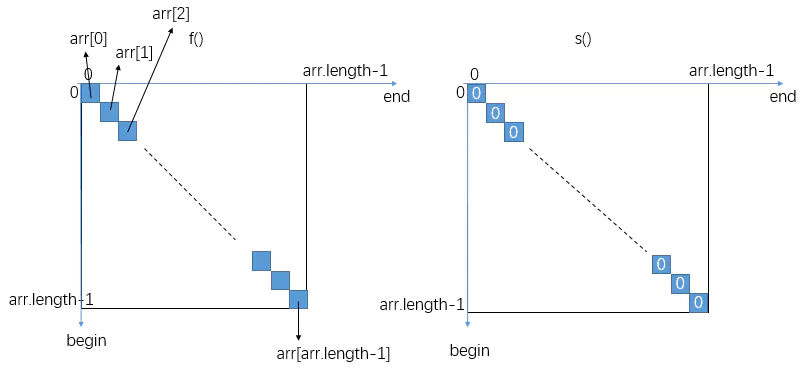

    

    可以发现两张表的对角线位置上的状态值都是可以确定的，`begin<=end`，因此对角线左下方的区域不用管。

2. 由递归调用逻辑找出状态依赖。

    `f()`依赖的状态：

    ```
    return Math.max(
                    arr[beginIndex] + s(arr, beginIndex + 1, endIndex),
                    arr[endIndex] + s(arr, beginIndex, endIndex - 1));
    复制代码
    ```

    F表的`(begin,end)`依赖S表`(begin+1,end)`和`(begin,end-1)`。

    `s()`依赖的状态：

    ```
    return Math.min(
                    f(arr, beginIndex + 1, endIndex),
                    f(arr, beginIndex, endIndex - 1));
    复制代码
    ```

    S表的`(begin,end)`依赖F表的`(begin+1,end)`和`(begin,end-1)`。

    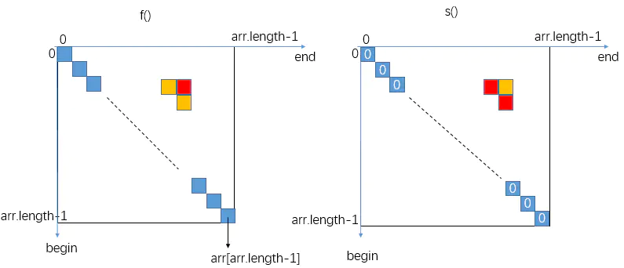

    

    如此的话，对于对角线的右上区域，对角线位置上的状态能推出倒数第二长对角线位置上的状态，进而推出倒数第三长位置上的状态……右上区域每个位置的状态都能推出。

3. 确定主问题对应的状态：

    ```
    return Math.max(
                    f(arr, 0, arr.length-1),
                    s(arr, 0, arr.length-1));
    复制代码
    ```

示例代码：

```
public static int maxScoreOfWinnerDp(int arr[]) {
    if (arr == null || arr.length == 0) {
        return 0;
    }

    int F[][] = new int[arr.length][arr.length];
    int S[][] = new int[arr.length][arr.length];
    for (int i = 0; i < arr.length; i++) {
        for (int j = 0; j < arr.length; j++) {
            if (i == j) {
                F[i][i] = arr[i];
            }
        }
    }
    //依次推出每条对角线，一共n-1条
    for (int i = 1; i < arr.length; i++) {
        for (int row = 0; row < arr.length - i; row++) {
            int col = row + i;
            F[row][col] = Math.max(arr[row] + S[row + 1][col], arr[col] + S[row][col - 1]);
            S[row][col] = Math.min(F[row + 1][col], F[row][col - 1]);
        }
    }

    return Math.max(F[0][arr.length - 1], S[0][arr.length - 1]);
}

public static void main(String[] args) {
    int arr[] = {1, 2, 100, 4};
    System.out.println(maxScoreOfWinnerDp(arr));
}
复制代码
```

代码优化：

```
if (arr == null || arr.length == 0) {
    return 0;
}
int[][] f = new int[arr.length][arr.length];
int[][] s = new int[arr.length][arr.length];
for (int j = 0; j < arr.length; j++) {
    f[j][j] = arr[j];
    for (int i = j - 1; i >= 0; i--) {
        f[i][j] = Math.max(arr[i] + s[i + 1][j], arr[j] + s[i][j - 1]);
        s[i][j] = Math.min(f[i + 1][j], f[i][j - 1]);
    }
}
return Math.max(f[0][arr.length - 1], s[0][arr.length - 1]);
复制代码
```

最终代码

```java
package nowcoder.advanced.advanced_class_06;

public class Code_02_CardsInLine {
    /**
     * 暴力破解
     *
     * @param arr
     * @return
     */
    public static int win1(int[] arr) {
        if (arr == null || arr.length == 0) {
            return 0;
        }
        return Math.max(f(arr, 0, arr.length - 1), s(arr, 0, arr.length - 1));
    }

    public static int f(int[] arr, int i, int j) {
        if (i == j) {
            return arr[i];
        }
        return Math.max(arr[i] + s(arr, i + 1, j), arr[j] + s(arr, i, j - 1));
    }

    public static int s(int[] arr, int i, int j) {
        if (i == j) {
            return 0;
        }
        return Math.min(f(arr, i + 1, j), f(arr, i, j - 1));
    }

    public static int win2(int[] arr) {
        if (arr == null || arr.length == 0) {
            return 0;
        }
        int[][] f = new int[arr.length][arr.length];
        int[][] s = new int[arr.length][arr.length];
        for (int j = 0; j < arr.length; j++) {
            f[j][j] = arr[j];
            for (int i = j - 1; i >= 0; i--) {
                f[i][j] = Math.max(arr[i] + s[i + 1][j], arr[j] + s[i][j - 1]);
                s[i][j] = Math.min(f[i + 1][j], f[i][j - 1]);
            }
        }
        return Math.max(f[0][arr.length - 1], s[0][arr.length - 1]);
    }

    public static void main(String[] args) {
        int[] arr = {1, 9, 1};
        System.out.println(win1(arr));
        System.out.println(win2(arr));

    }

}

```


## 四、机器人走路问题

给你标号为1、2、3、……、N的N个位置，机器人初始停在M位置上，走P步后停在K位置上的走法有多少种。注：机器人在1位置上时只能向右走，在N位置上时只能向左走，其它位置既可向右又可向左。

```
public static int process(int N, int M, int P, int K) {
    if (P == 0) {
        return M == K ? 1 : 0;
    }
    if (M == 1) {
        return process(N, M + 1, P - 1, K);
    } else if (M == N) {
        return process(N, M - 1, P - 1, K);
    }
    return process(N, M + 1, P - 1, K) + process(N, M - 1, P - 1, K);
}

public static void main(String[] args) {
    System.out.println(process(5, 2, 3, 3));
}
```

这里暴力递归参数列表的可变变量有`M`和`P`，根据`base case`和其它特殊情况画出二维表：

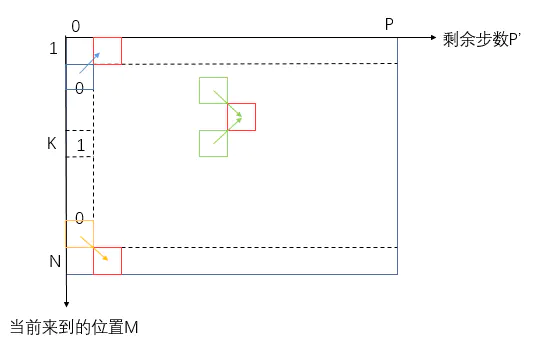


动态规划示例代码：

```
public static int robotWalkWaysDp(int N, int M, int P, int K) {
    int dp[][] = new int[N + 1][P + 1];
    dp[K][0] = 1;
    for (int j = 1; j <= P; j++) {
        for (int i = 1; i <= N; i++) {
            if (i - 1 < 1) {
                dp[i][j] = dp[i + 1][j - 1];
            } else if (i + 1 > N) {
                dp[i][j] = dp[i - 1][j - 1];
            } else {
                dp[i][j] = dp[i + 1][j - 1] + dp[i - 1][j - 1];
            }
        }
    }
    return dp[M][P];
}

public static void main(String[] args) {
    System.out.println(robotWalkWaysDp(5, 2, 3, 3));
}
复制代码
```


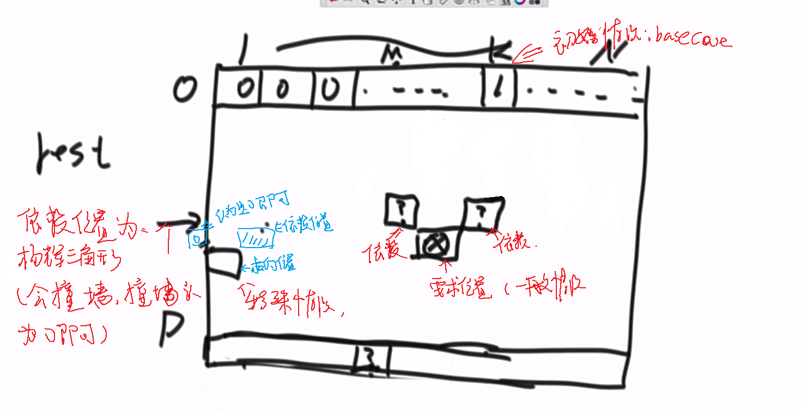

暴力破解代码为：

```java
package nowcoder.advanced.advanced_class_06;

/**
 * @Author GJXAIOU
 * @Date 2020/1/12 10:35
 */
public class Robot {
    /**
     * 暴力破解方式
     *
     * @param N：一共有             1 ~ N 的初始位置
     * @param curPosition：来到的位置
     * @param restSteps：可以走的步数
     * @param K：最终停留在的位置
     * @return 一共有多少中走法
     * 变量分析，初始位置和最终停留位置是确定的，所有可变参数为： curPosition 和 restSteps
     */
    public static int ways(int N, int curPosition, int restSteps, int K) {
        // 取出一些不可能的情况
        if (N < 2 || curPosition < 1 || curPosition > N || restSteps < 0 || K < 1 || K > N) {
            return 0;
        }
        // 不剩下步数了，看是否停在了 K 位置
        if (restSteps == 0) {
            return curPosition == K ? 1 : 0;
        }
        int res = 0;
        // 只能往右走了
        if (curPosition == 1) {
            res = ways(N, curPosition + 1, restSteps - 1, K);
            // 到达最右边了，只能往左走
        } else if (curPosition == N) {
            res += ways(N, curPosition - 1, restSteps - 1, K);
        } else {
            res += ways(N, curPosition + 1, restSteps - 1, K) + ways(N, curPosition - 1,
                    restSteps - 1, K);
        }
        return res;
    }
}

```


## 五、求和为aim的最长子数组（都大于0）

基础篇中有过相同的题，只不过这里的数组元素值为正数，而基础篇中的可正可负可0。

基础篇中的做法是用一个哈希表记录子数组和出现的最早的位置。而此题由于数据特殊性（都是正数）可以在额外空间复杂度`O(1)`，时间复杂度`O(N)`内完成。

使用一个窗口，用L表示窗口的左边界、R表示窗口的右边界，用sum表示窗口内元素之和（初始为0）。起初，L和R都停在-1位置上，接下来每次都要将L向右扩一步或将R向右扩一步，具体扩哪个视情况而定：

- 如果`sum`，那么R往右边扩
- 如果`sum=aim`，那么记录窗口内元素个数，L往右边扩
- 如果`sum>aim`，那么L往右边扩

直到R扩到`arr.length`越界，那么此时窗口内元素之和必定小于aim，整个过程可以结束。答案就是所有`sum=aim`情况下窗口内元素最多时的个数。

示例代码：

```java
package nowcoder.advanced.advanced_class_06;

/**
 * 全正数数组中累加和为 aim 的最长子数组长度
 */
public class Code_04_LongestSumSubArrayLengthInPositiveArray {

    public static int getMaxLength(int[] arr, int aim) {
        if (arr == null || arr.length == 0 || aim <= 0) {
            return 0;
        }
        int left = 0;
        int right = 0;
        int sum = arr[0];
        int len = 0;
        while (right < arr.length) {
            if (sum == aim) {
                len = Math.max(len, right - left + 1);
                sum -= arr[left++];
            } else if (sum < aim) {
                right++;
                // 防止越界
                if (right == arr.length) {
                    break;
                }
                sum += arr[right];
                // sum > aim
            } else {
                sum -= arr[left++];
            }
        }
        return len;
    }

    public static int[] generatePositiveArray(int size) {
        int[] result = new int[size];
        for (int i = 0; i != size; i++) {
            result[i] = (int) (Math.random() * 10) + 1;
        }
        return result;
    }

    public static void printArray(int[] arr) {
        for (int i = 0; i != arr.length; i++) {
            System.out.print(arr[i] + " ");
        }
        System.out.println();
    }

    public static void main(String[] args) {
        int len = 20;
        int k = 15;
        int[] arr = generatePositiveArray(len);
        printArray(arr);
        System.out.println(getMaxLength(arr, k));
    }
}
```

> 思考：为什么这个流程得到的答案是正确的呢？也就是说，为什么窗口向右滑动的过程中，不会错过和为aim的最长子数组？我们可以来证明一下：


假设，椭圆区域就是和为aim的最长子数组，如果L来到了椭圆区域的左边界L2，那么R的位置有两种情况：在椭圆区域内比如R1，在椭圆区域外比如R2。如果是前者，由于窗口`L2~R1`是肯定小于`aim`的（元素都是正数），因此在R从R1右移到椭圆区域右边界过程中，L是始终在L2上的，显然不会错过正确答案；如果是后者，窗口`L2~R2`的`sum`明显超过了`aim`，因此这种情况是不可能存在的。而L在L2左边的位置上，比如L1时，R更不可能越过椭圆区域来到了R2，因为窗口是始终保持`sum<=aim`的。

## 六、求和小于等于aim的最长子数组（有正有负有0）

如果使用暴力枚举，枚举出以每个元素开头的子数组，那么答案一定就在其中（`O(N^3)`）。但这里介绍一种时间复杂度`O(N)`的解。

首先从尾到头遍历一遍数组，生成两个辅助数组`min_sum`和`min_sum_index`作为求解时的辅助信息。`min_sum`表示以某个元素开头的所有子数组中和最小为多少，`min_sum_index`则对应保存该最小和子数组的结束下标。

举例：对于`[100,200,7,-6]`。

1. 首先遍历3位置上的`-6`，以`-6`开头的子数组只有`[-6]`，因此`min_sum[3] = -6, min_sum_index[3] = 3`（`[-6]`的尾元素`-6`在原数组中的下标是`3`）。
2. 接着遍历到2位置上的`7`，以`7`开头的最小和子数组是`[7,-6]`，因此`min_sum[2] = 7-6 = 1, min_sum_index[2]=3`。（`[7,-6]`的尾元素`-6`在原数组中的下标是`3`）。
3. 接着遍历到1位置上的`200`，有`min_sum[1] = 200, min_sum_index[1] = 1`。
4. 接着遍历到0位置上的`100`，有`min_sum[0] = 100, min_sum_index[0] = 0`。

那么遍历完数组，生成两个辅助数组之后，就可以开始正式的求解流程了：

使用一个窗口，L表示窗口的左边界，R表示窗口的右边界，`sum`表示窗口内元素之和。

- L从头到尾依次来到数组中的每个元素，每次L来到其中一个元素上时，都尝试向右扩R，R扩到不能扩时，窗口大小`R-L`即为以该元素开头的、和小于等于aim的最长子数组的长度。
- L起初来到首元素，R起初也停在首元素，`sum=0`。
- R向右扩一次的逻辑是：如果`sum + min_sum[L] <= aim`，那么R就扩到`min_sum_index[L] + 1`的位置，并更新`sum`。
- R扩到不能扩时，记录`R-L`，L去往下一个元素，并更新`sum`。
- 如果L来到一个元素后，`sum > aim`，说明以该元素开头的、和小于等于aim的最长子数组的长度，比当前的窗口大小`R-L`还要小，那么以该元素开头的子数组不在正确答案的考虑范围之内（因为上一个元素形成的最大窗口大于当前元素能形成的最大窗口，并且前者已经被记录过了），L直接去往一下个元素并更新`sum`。


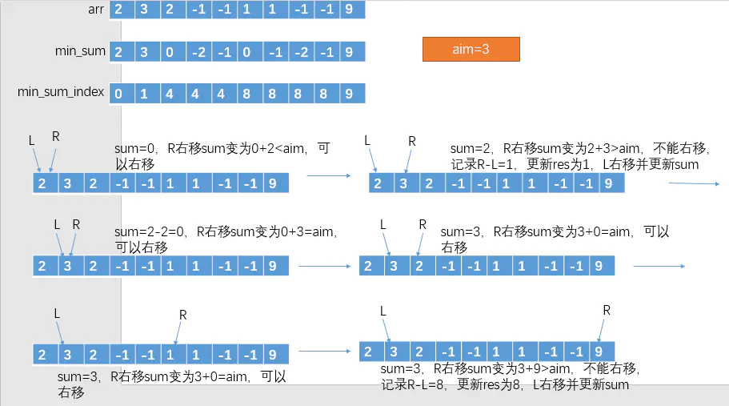


完整的代码

```java
package nowcoder.advanced.advanced_class_06;

import java.util.HashMap;

public class Code_05_LongestSubarrayLessSumAwesomeSolution {

    public static int maxLengthAwesome(int[] arr, int aim) {
        if (arr == null || arr.length == 0) {
            return 0;
        }
        // 分别对应 min_sum 和 min_sum_index
        int[] sums = new int[arr.length];
        int[] ends = new int[arr.length];
        // 最后一个元素的 min_sum 就是自己，min_sum_index 也是自己的下标
        sums[arr.length - 1] = arr[arr.length - 1];
        ends[arr.length - 1] = arr.length - 1;
        // 因为最后一个 length -1 上面已经得到，所以从 Length - 2 开始计算
        for (int i = arr.length - 2; i >= 0; i--) {
            // 如果之前累加和小于 0，现在最小累加和就是自己 + 前面最小累加和，则 ends[i] 就是前一个右边界到达的位置；
            if (sums[i + 1] < 0) {
                sums[i] = arr[i] + sums[i + 1];
                ends[i] = ends[i + 1];
                // 往右扩并不能使得自己的累加和最小，则就只有自己
            } else {
                sums[i] = arr[i];
                ends[i] = i;
            }
        }
// 下面为从 0 开始的扩充过程

        int right = 0;
        int sum = 0;
        int length = 0;
        // start 为每次开始扩的开始，right 为扩的右边界，本质上扩充到 right - 1 位置；
        for (int start = 0; start < arr.length; start++) {
            while (right < arr.length && sum + sums[right] <= aim) {
                sum += sums[right];
                right = ends[right] + 1;
            }
            // sum 减去 start 位置数，因为下面 start++ 了，重新来了
            sum -= right > start ? arr[start] : 0;
            length = Math.max(length, right - start);
            // 如果上来就扩不动，比如 100,200,7,3，-3，aim 等于 7，则100,200 都向右扩不动，需要变
            right = Math.max(right, start + 1);
        }
        return length;
    }

    // 使用二分加速的解法，O（NlogN）
    public static int maxLength(int[] arr, int k) {
        int[] h = new int[arr.length + 1];
        int sum = 0;
        h[0] = sum;
        for (int i = 0; i != arr.length; i++) {
            sum += arr[i];
            h[i + 1] = Math.max(sum, h[i]);
        }
        sum = 0;
        int res = 0;
        int pre = 0;
        int len = 0;
        for (int i = 0; i != arr.length; i++) {
            sum += arr[i];
            pre = getLessIndex(h, sum - k);
            len = pre == -1 ? 0 : i - pre + 1;
            res = Math.max(res, len);
        }
        return res;
    }

    public static int getLessIndex(int[] arr, int num) {
        int low = 0;
        int high = arr.length - 1;
        int mid = 0;
        int res = -1;
        while (low <= high) {
            mid = (low + high) / 2;
            if (arr[mid] >= num) {
                res = mid;
                high = mid - 1;
            } else {
                low = mid + 1;
            }
        }
        return res;
    }

    // for test
    public static int[] generateRandomArray(int len, int maxValue) {
        int[] res = new int[len];
        for (int i = 0; i != res.length; i++) {
            res[i] = (int) (Math.random() * maxValue) - (maxValue / 3);
        }
        return res;
    }

    public static void main(String[] args) {
        for (int i = 0; i < 1000000; i++) {
            int[] arr = generateRandomArray(10, 20);
            int k = (int) (Math.random() * 20) - 5;
            if (maxLengthAwesome(arr, k) != maxLength(arr, k)) {
                System.out.println("oops!");
            }
        }

    }

}

```


示例代码：

```
public static int lessOrEqualAim(int arr[], int aim) {
    int min_sum[] = new int[arr.length];
    int min_sum_index[] = new int[arr.length];
    min_sum[arr.length-1] = arr[arr.length - 1];
    min_sum_index[arr.length-1] = arr.length - 1;
    for (int i = arr.length - 2; i >= 0; i--) {
        if (min_sum[i + 1] < 0) {
            min_sum[i] = arr[i] + min_sum[i + 1];
            min_sum_index[i] = min_sum_index[i + 1];
        } else {
            min_sum[i] = arr[i];
            min_sum_index[i] = i;
        }
    }

    int R = 0;
    int sum = 0;
    int maxLen = 0;
    for (int L = 0; L < arr.length; L++) {
        while (R < arr.length && sum + min_sum[R] <= aim) {
            sum += min_sum[R];
            R = min_sum_index[R] + 1;
        }
        maxLen = Math.max(maxLen, R - L);
        sum -= R == L ? 0 : arr[L];
        R = Math.max(R, L + 1);
    }
    return maxLen;
}

public static void main(String[] args) {
    int arr[] = {1, 2, 3, 2, -1, -1, 1, 1, -1, -1, 9};
    System.out.println(lessOrEqualAim(arr,3));//8
}
复制代码
```

`19-27`行是实现的难点，首先19行是L从头到尾来到数组中的每个元素，然后`20-23`的`while`是尝试让R扩直到R扩不动为止，`24`行当R扩不动时就可以记录以当前L位置上的元素开头的、和小于等于aim的最长子数组长度，最后在进入下一次`for`循环、L右移一步之前，`sum`的更新有两种情况：

1. `29`行的`while`执行了，`R`扩出去了，因此`sum`直接减去当前L上的元素即可。
2. `29`行的`while`压根就没执行，`R`一步都没扩出去且和`L`在同一位置上，也就是说此刻窗口内没有元素（只有当R>L时，窗口才包含从L开始到R之前的元素），`sum=0`，L和R应该同时来到下一个元素，`sum`仍为0，所以`sum`不必减去`arr[L]`（只有当L右移导致一个元素从窗口出去时才需要减`arr[L]`）。

最后`26`行也是为了保证如果L在右移的过程中，R一直都扩不出去，那么在L右移到R上R仍旧扩不出去时，接下来R应该和L同时右移一个位置。

> 此方法能够做到`O(N)`时间复杂度的关键点是：舍去无效情况。比如L在右移一步更新`sum`之后，如果发现`sum > aim`，显然以当前L开头的、和小于等于aim的最长子数组肯定小于当前的`R-L`，而在上一步就记录了`R-(L-1)`，以当前L开头的满足条件的子数组可以忽略掉（因为一定小于`R-(L-1)`），而不必让R回退到当前L重新来扩R。
>
> 这样L和R都只右移而不回退，所以时间复杂度就是遍历了一遍数组。

## 七、环形单链表的约瑟夫问题

据说著名犹太历史学家Josephus有过以下故事：在罗马人占领乔塔帕特后，39个犹太人与Josephus及他的朋友躲到一个洞中，39个犹太人决定宁愿死也不要被敌人抓到，于是决定了一个自杀方式，41个人排成一个圆圈，由第1个人开始报数，报数到3的人就自杀，然后再由下一个人重新报1，报数到3的人再自杀，这样依次下去，直到剩下最后一个人时，那个人可以自由选择自己的命运。这就是著名的约瑟夫问题。现在请用单向环形链表描述该结构并呈现整个自杀过程。

> **输入**：一个环形单向链表的头节点head和报数的值m。
>
> **返回**：最后生存下来的节点，且这个节点自己组成环形单向链表，其他节点都删掉。
>
> **进阶**：如果链表节点数为N，想在时间复杂度为O(N)时完成原问题的要求，该怎么实现？

暴力方法：从头结点开始数，从1数到m，数到m时删除结点，再从下一个结点开始数……如此要删除（n-1）个结点，并且每次删除之前要数m个数，因此时间复杂度为`O(NxM)`

这里介绍一种`O(N)`的方法。

首先介绍一个函数：


如果从头结点开始，为每个结点依次编号1、2、3、……，比如环形链表有3个结点，每次报数到7时杀人：

| 结点编号 | 报数 |
| -------- | ---- |
| 1        | 1    |
| 2        | 2    |
| 3        | 3    |
| 1        | 4    |
| 2        | 5    |
| 3        | 6    |
| 1        | 杀人 |

那么在杀人之前，结点编号和报数有如下对应关系（x轴代表此刻报数报到哪儿了，y轴则对应是几号结点报的，n是结点数量）：


假设每次杀人后，都从下一结点重新编号、重新报数，比如环形链表有9个结点，报数到7就杀人，那么杀人之前结点的旧编号和杀人重新编号后结点的新编号有如下关系：

| 旧编号 | 新编号                       |
| ------ | ---------------------------- |
| 1      | 3                            |
| 2      | 4                            |
| 3      | 5                            |
| 4      | 6                            |
| 5      | 7                            |
| 6      | 8                            |
| 7      | 被杀，从下一结点开始重新编号 |
| 8      | 1                            |
| 9      | 2                            |

如果链表结点数为n，报数到m杀人，那么结点的新旧编号对应关系如下（其中`s`为报数为m的结点编号）：


这个图也可以由基本函数`y = (x - 1) % n + 1`向左平移s个单位长度变换而来：


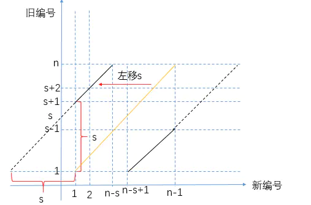


即`y = (x - 1 + s) % n + 1`。

现在我们有了如下两个公式：

1. `结点编号 = (报数 - 1) % n + 1`
2. `旧编号 = (新编号 - 1 + s) % n +1`，其中`s`为报数为m的结点编号

由1式可得`s = (m - 1) % n + 1`，带入2式可得

1. `旧编号 = (新编号 - 1 + (m - 1) % n + 1) % n + 1 = (新编号 + m - 1) % n + 1`，其中`m`和`n`由输入参数决定。

现在我们有了等式3，就可以在已知一个结点在另一个结点被杀之后的新编号的情况下，求出该结点的旧编号。也就是说，假设现在杀到了第`n-1`个结点，杀完之后只剩下最后一个结点了（天选结点），重新编号后天选结点肯定是1号，那么第`n-1`个被杀结点被杀之前天选结点的编号我们就可以通过等式3求出来，通过这个结果我们又能求得天选结点在第`n-2`个被杀结点被杀之前的编号，……，依次往回推就能还原一个结点都没死时天选结点的编号，这样我们就能从输入的链表中找到该结点，直接将其后继指针指向自己然后返回即可。

示例代码：

```
static class Node {
    char data;
    Node next;

    public Node(char data) {
        this.data = data;
    }
}

public static Node aliveNode(Node head, int m) {
    if (head == null) {
        return null;
    }
    int tmp = 1;
    Node cur = head.next;
    while (cur != head) {
        tmp++;
        cur = cur.next;
    }

    //第n-1次杀人前还有两个结点，杀完之后天选结点的新编号为1
    //通过递归调用getAlive推出所有结点存活时，天选结点的编号
    int nodeNumber = getAlive(1, m, 2, tmp);

    cur = head;
    tmp = 1;
    while (tmp != nodeNumber) {
        cur = cur.next;
        tmp++;
    }
    cur.next = cur;
    return cur;
}

/**
     * 旧编号 = (新编号 + m - 1) % n + 1
     *
     * @param newNumber 新编号
     * @param m
     * @param n         旧编号对应的存活的结点个数
     * @param len       结点总个数
     * @return
     */
public static int getAlive(int newNumber, int m, int n, int len) {
    if (n == len) {
        return (newNumber + m - 1) % n + 1;
    }
    //计算出新编号对应的旧编号，将该旧编号作为下一次计算的新编号
    return getAlive((newNumber + m - 1) % n + 1, m, n + 1, len);
}

public static void main(String[] args) {
    Node head = new Node('a');
    head.next = new Node('b');
    head.next.next = new Node('c');
    head.next.next.next = new Node('d');
    head.next.next.next.next = new Node('e');
    head.next.next.next.next.next = head;

    System.out.println(aliveNode(head, 3).data);//d
}
```


完整程序代码

```java
package nowcoder.advanced.advanced_class_06;

public class Code_06_JosephusProblem {

    public static class Node {
        public int value;
        public Node next;

        public Node(int data) {
            this.value = data;
        }
    }

    public static Node josephusKill1(Node head, int m) {
        if (head == null || head.next == head || m < 1) {
            return head;
        }
        Node last = head;
        while (last.next != head) {
            last = last.next;
        }
        int count = 0;
        while (head != last) {
            if (++count == m) {
                last.next = head.next;
                count = 0;
            } else {
                last = last.next;
            }
            head = last.next;
        }
        return head;
    }

    public static Node josephusKill2(Node head, int m) {
        if (head == null || head.next == head || m < 1) {
            return head;
        }
        Node cur = head.next;
        int tmp = 1; // tmp -> list size
        while (cur != head) {
            tmp++;
            cur = cur.next;
        }
        tmp = getLive(tmp, m); // tmp -> service node position
        while (--tmp != 0) {
            head = head.next;
        }
        head.next = head;
        return head;
    }

    public static int getLive(int i, int m) {
        if (i == 1) {
            return 1;
        }
        return (getLive(i - 1, m) + m - 1) % i + 1;
    }

    public static void printCircularList(Node head) {
        if (head == null) {
            return;
        }
        System.out.print("Circular List: " + head.value + " ");
        Node cur = head.next;
        while (cur != head) {
            System.out.print(cur.value + " ");
            cur = cur.next;
        }
        System.out.println("-> " + head.value);
    }

    public static void main(String[] args) {
        Node head1 = new Node(1);
        head1.next = new Node(2);
        head1.next.next = new Node(3);
        head1.next.next.next = new Node(4);
        head1.next.next.next.next = new Node(5);
        head1.next.next.next.next.next = head1;
        printCircularList(head1);
        head1 = josephusKill1(head1, 3);
        printCircularList(head1);

        Node head2 = new Node(1);
        head2.next = new Node(2);
        head2.next.next = new Node(3);
        head2.next.next.next = new Node(4);
        head2.next.next.next.next = new Node(5);
        head2.next.next.next.next.next = head2;
        printCircularList(head2);
        head2 = josephusKill2(head2, 3);
        printCircularList(head2);

    }

}
```

程序运行结果：

```java
Circular List: 1 2 3 4 5 -> 1
Circular List: 4 -> 4
Circular List: 1 2 3 4 5 -> 1
Circular List: 4 -> 4
```


## 八、字符串正则匹配问题

给定字符串`str`，其中绝对不含有字符`'.'`和`'*'`。再给定字符串`exp`，其中可以含有`'.'`或`'*'`，`'*'`字符不能是`exp`的首字符，并且任意两个`'*'`字符不相邻。exp中的`'.'`代表任何一个字符，exp中的`'*'`表示`'*'`的前一个字符可以有0个或者多个。请写一个函数，判断`str`是否能被`exp`匹配。

举例：

- `str="abc"，exp="abc"`，返回`true`。`str="abc"，exp="a.c"`，exp中单个`'.'`可以代表任意字符，所以返回`true`。
- `str="abcd"，exp=".*"`。exp中`'*'`的前一个字符是`'.'`，所以可表示任意数量的`'.'`字符，当exp是`"...."`时与`"abcd"`匹配，返回`true`。
- `str=""，exp="..*"`。exp中`'*'`的前一个字符是`'.'`，可表示任意数量的`'.'`字符，但是`".*"`之前还有一个`'.'`字符，该字符不受`'*'`的影响，所以`str`起码有一个字符才能被`exp`匹配。所以返回`false`。

### （一）暴力尝试

定义一个方法`bool match(char[] str, int i, char[] exp, int j)`，表示`str`的下标`i ~ str.length`部分能否和`exp`的下标`j ~ exp.length`部分匹配，分情况讨论如下：

1. 如果`j`到了`exp.length`而`i`还没到`str.length`，返回`false`，否则返回`true`

    

    

    

2. 如果`i`和`j`都没到右边界，并且`j`的后一个字符不是`*`或者越界，那么只有当`str[i]=exp[j]`或`exp[j]='.'`时，`i`和`j`才同时右移继续比较`match(str, i+1, exp, j+1)`，否则返回`false`

3. 如果`i`和`j`都没到右边界，并且`j`后一个字符是`*`，这时右有两种情况：

    1. `str[i] = exp[j]`或`exp[j]='.'`。比如`a*`可以匹配空串也可以匹配一个`a`，如果`str[i]`之后还有连续的相同字符，那么`a*`还可以匹配多个，不管是哪种情况，将匹配后右移的`i`和`j`交给子过程`match`

        

        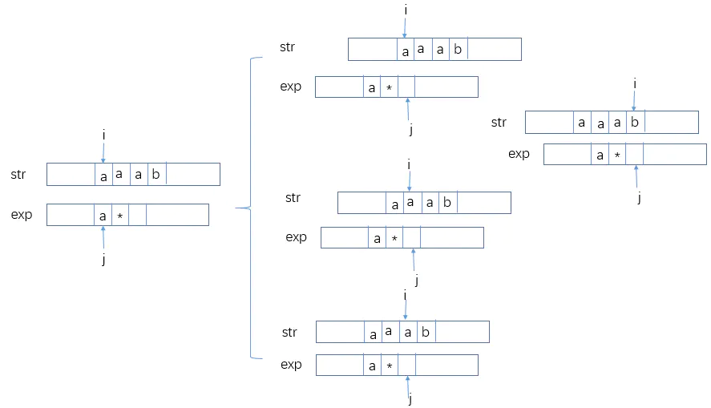

        

    2. `str[i] != exp[j]`且`exp[j] != ‘.’` ，那么`exp[j]*`只能选择匹配空串。

        

        

        

4. 如果`i`到了`str.length`而`j`还没到`exp.length`，那么`j`之后的字符只能是`a*b*c*.*`的形式，也就是一个字符后必须跟一个`*`的形式，这个检验过程同样可以交给`match`来做

    

    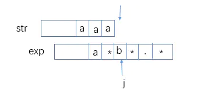

    

示例代码：

```
public static boolean match(char[] s, int i, char[] e, int j) {
    if (j == e.length) {
        return i == s.length;
    }
    //j下一个越界或者j下一个不是*
    if (j + 1 == e.length || e[j + 1] != '*') {
        if (i != s.length && s[i] == e[j] || e[j] == '.') {
            return match(s, i + 1, e, j + 1);
        }
        return false;
    }
    //j下一个不越界并且j下一个是*
    while (i != s.length && s[i] == e[j] || e[j] == '.') {
        if (match(s, i, e, j + 2)) {
            return true;
        }
        i++;
    }
    //如果上面的while是因为 s[i]!=e[j] 而停止的
    return match(s, i, e, j + 2);
}

public static boolean isMatch(String str, String exp) {
    if (str == null || exp == null) {
        return false;
    }
    char[] s = str.toCharArray();
    char[] e = exp.toCharArray();
    return match(s, 0, e, 0);
}

public static void main(String[] args) {
    System.out.println(isMatch("abbbbc","a.*b*c"));//T
    System.out.println(isMatch("abbbbc","a.*bbc"));//T
    System.out.println(isMatch("abbbbc","a.bbc"));//F
    System.out.println(isMatch("abbbbc","a.bbbc"));//T
}
复制代码
```

### 动态规划

==步骤==

首先确定变量，确定几维表

然后表中标明 baseCase

标出一般位置依赖哪些（看掉了哪些递归位置）

然依赖的位置 baseCase能不能提供，不能提供的话就需要将地基补充完整，这样才能推出其他值。


`match`的参数列表中只有`i`和`j`是变化的，也就是说只要确定了`i`和`j`就能对应确定一个`match`的状态，画出二维表并将`base case`对应位置状态值标注出来：

**目标是 (0,0)位置**


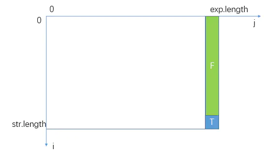


再看普遍位置`(i,j)`的依赖，第`6`行的`if`表明`(i,j)`可能依赖`(i+1, j+1)`，第`13`行的`while`表明`(i,j)`可能依赖`(i, j+2)`、`(i+1, j+2)`、`(i+2, j+2)`、……、`(s.length-1, j+2)`：


你会发现`(i,j)`依赖它下面一行和右边相邻两列的状态，也就是说要想推出普遍位置的状态值，起码需要最后一行、最后一列和倒数第二列上的状态值。而`base case`仅为我们提供了最后一列的状态值，主过程`match(e, 0, s, 0)`对应`(0,0)`位置的状态值，我们需要推出整张表所有位置的状态值才行。

这时就要回归题意了，看倒数第二列和最后一行上的状态有什么特殊含义。

首先最后一行表示`i`到了`str.length`，此时如果`j`还没走完`exp`的话，从`j`开始到末尾的字符必须满足`字符*字符*字符*`的范式才返回`true`。因此最后一行状态值易求：


而对于倒数第二列，表示`j`来到了`exp`的末尾字符，此时如果`i`如果在`str`末尾字符之前，那么也是直接返回`false`的：


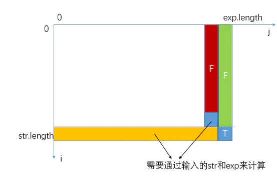


那么接下来就只剩下`(str.length-1, exp.length-1)`这个位置的状态值了，该位置标明`i`来到了`str`的末尾字符，`j`来到了`exp`的末尾字符，只有当这两个字符相等或`exp`的末尾字符为`.`才返回`true`否则`false`，也就是说该状态可以直接通过输入参数`str`和`exp`计算，它不依赖其他状态。二维表的初始化至此全部完成。

示例代码：

```
public static boolean isMatch(String str, String exp) {
    if (str == null || exp == null) {
        return false;
    }
    return matchDp(str, exp);
}

public static boolean matchDp(String str, String exp) {
    if (str == null || exp == null) {
        return false;
    }
    char s[] = str.toCharArray();
    char e[] = exp.toCharArray();
    boolean[][] dpMap = initDpMap(s, e);

    //从倒数第二行开始推，每一行从右向左推
    for (int i = s.length - 1; i > -1; i--) {
        for (int j = e.length - 2; j > -1; j--) {
            if (e[j + 1] != '*') {
                dpMap[i][j] = (s[i] == e[j] || e[j] == '.') && dpMap[i + 1][j + 1];
            } else {
                int tmp = i;
                while (tmp != s.length && (s[tmp] == e[j] || e[j] == '.')) {
                    if (dpMap[tmp][j + 2]) {
                        dpMap[i][j] = true;
                        break;
                    }
                    tmp++;
                }
                if (dpMap[i][j] != true) {
                    dpMap[i][j] = dpMap[i][j + 2];
                }
            }
        }
    }
    return dpMap[0][0];
}

public static boolean[][] initDpMap(char[] s, char[] e) {
    boolean[][] dpMap = new boolean[s.length + 1][e.length + 1];
    //last column
    dpMap[s.length][e.length] = true;
    //last row -> i=s.length-1
    for (int j = e.length - 2; j >= 0; j = j - 2) {
        if (e[j] != '*' && e[j + 1] == '*') {
            dpMap[s.length - 1][j] = true;
        } else {
            break;
        }
    }
    //(str.length-1, e.length-1)
    if (s[s.length - 1] == e[e.length - 1] || e[e.length - 1] == '.') {
        dpMap[s.length - 1][e.length - 1] = true;
    }
    return dpMap;
}
```


完整代码：

```java
package nowcoder.advanced.advanced_class_06;

public class Code_03_RegularExpressionMatch {
    // 输入字符串判断是否合法
    public static boolean isValid(char[] s, char[] e) {
        for (int i = 0; i < s.length; i++) {
            if (s[i] == '*' || s[i] == '.') {
                return false;
            }
        }
        for (int i = 0; i < e.length; i++) {
            if (e[i] == '*' && (i == 0 || e[i - 1] == '*')) {
                return false;
            }
        }
        return true;
    }

    // --------------------------------------------------------------
    // 暴力递归
    public static boolean isMatch(String str, String exp) {
        if (str == null || exp == null) {
            return false;
        }
        char[] s = str.toCharArray();
        char[] e = exp.toCharArray();
        return isValid(s, e) ? process(s, e, 0, 0) : false;
    }

    /**
     * 函数含义：str[i...一直到最后]这个字符串，能不能被 exp[j..一直到最后]的字符串，匹配出来
     *
     * @param str：
     * @param exp
     * @param i
     * @param j
     * @return
     */
    public static boolean process(char[] str, char[] exp, int i, int j) {
        // baseCase,当exp 中 j 来到最后位置
        if (j == exp.length) {
            return i == str.length;
        }
        // j 上面还有字符，考察 j + 1 的情况
        if (j + 1 == exp.length || exp[j + 1] != '*') {
            // 如果 i == str.length 表示 i 已经到最后了，返回 false；&& 后面如果成立可能返回 true，但是如果不成立则一定返回 false；最后表示
            //i 的 i + 1 位置和 j + 1 匹配才能最终返回 true。
            return i != str.length && (exp[j] == str[i] || exp[j] == '.')
                    && process(str, exp, i + 1, j + 1);
        }
        // 该 while 前提为：exp 的 j + 1 位置，不仅有字符并且字符是 *
        while (i != str.length && (exp[j] == str[i] || exp[j] == '.')) {
            // 如果 i 和 j 位置上可以匹配上（相等或者为 . 都认为是匹配上），默认还是认为 * 为 0 个 j 值，先从 j + 2 开始看看能不能与 i 位置匹配上；
            if (process(str, exp, i, j + 2)) {
                return true;
            }
            // 如果上面没有返回 true，则 i++，然后让 j + 2 位置和当前 i 位置开始匹配，本质上就是认为原来 i 位置上元素和 j 位置上数相等了，即 * 表示有
            //1 个 j 值。依次类推一直尝试。
            i++;
        }
        // 跳过 while 到最后一行情况： str: a,a,a,b；exp：c,*,....；就是 str 中第一个为 i 位置上 a 和 exp 中第一个 j 位置上 c
        //不匹配，并且 j  位置上不为 .，所以就从 j + 2 位置开始来看能不能匹配上 i 位置上元素，相当于默认 c,* 中表示 0 的 c。
        return process(str, exp, i, j + 2);
    }
    // --------------------------------------------------------------

    // 动态规划方法
    public static boolean isMatchDP(String str, String exp) {
        if (str == null || exp == null) {
            return false;
        }
        char[] s = str.toCharArray();
        char[] e = exp.toCharArray();
        if (!isValid(s, e)) {
            return false;
        }
        boolean[][] dp = initDPMap(s, e);
        for (int i = s.length - 1; i > -1; i--) {
            for (int j = e.length - 2; j > -1; j--) {
                if (e[j + 1] != '*') {
                    dp[i][j] = (s[i] == e[j] || e[j] == '.')
                            && dp[i + 1][j + 1];
                } else {
                    int si = i;
                    while (si != s.length && (s[si] == e[j] || e[j] == '.')) {
                        if (dp[si][j + 2]) {
                            dp[i][j] = true;
                            break;
                        }
                        si++;
                    }
                    if (dp[i][j] != true) {
                        dp[i][j] = dp[si][j + 2];
                    }
                }
            }
        }
        return dp[0][0];
    }

    // 上来就把二维表的最后一行和最后两列对应值填好
    public static boolean[][] initDPMap(char[] s, char[] e) {
        int slen = s.length;
        int elen = e.length;
        boolean[][] dp = new boolean[slen + 1][elen + 1];
        dp[slen][elen] = true;
        for (int j = elen - 2; j > -1; j = j - 2) {
            if (e[j] != '*' && e[j + 1] == '*') {
                dp[slen][j] = true;
            } else {
                break;
            }
        }
        if (slen > 0 && elen > 0) {
            if ((e[elen - 1] == '.' || s[slen - 1] == e[elen - 1])) {
                dp[slen - 1][elen - 1] = true;
            }
        }
        return dp;
    }

    public static void main(String[] args) {
        String str = "abcccdefg";
        String exp = "ab.*d.*e.*";
        System.out.println(isMatch(str, exp));
        System.out.println(isMatchDP(str, exp));

    }

}

```

