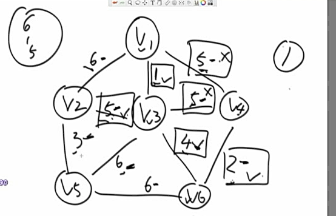

# AlgorithmEasyDay06

[TOC]

## 一、图的存储结构表示方式

**图的定义**：由有穷非空集合的顶点和顶点之间的边组成的集合。通常使用 $G=(V,E)$, V 为顶点集合， E 为边的集合。

**图的分类**：分为无向图和有向图。


### （一）邻接矩阵

使用两个数组：一维的顶点数组和二维的边数组，两个顶点联通则边数组中值为 1，否则为 0.

- 无向图

    

- 有向图

    

- 带权重的图

    这里以带权重的有向图为例，使用权值代替代替上图中的 0 和 1，如果两个节点不相连（即权值不存在）则值为∞。

    

### （二）邻接表

**是一种链式存储结构，主要解决邻接矩阵中的顶点多而边少的时候浪费空间的情况。**

- **图中顶点用一个一维数组存储**，另外，对于顶点数组中，每个数据元素还需要存储指向第一个邻接点的指针，以便于查找该顶点的边信息。

- 图中每个顶点vi的所有邻接点构成一个线性表，由于邻接点的个数不定，所以用单链表存储，无向图称为顶点vi的边表，有向图称为顶点vi作为弧尾的出边表。

- 无向图


- 有向图

    


- 带权值的图

    

### （三）如何表达图/生成图

其他方式：如利用二维数组格式，左边是输入，右边为表示的图的示例。

```java
  边的权重， from 节点， to 结点
[
  [7, 1, 2]
  [5, 1, 3]	
  [2, 2, 3]	  
		   ]
```


**代码中实现图结构**

```java
package com.gjxaiou.easy.day06;

import java.util.HashMap;
import java.util.HashSet;

public class Graph {
	// 点的编号，实际的 Node
	public HashMap<Integer,Node> nodes;
	public HashSet<Edge> edges;

	public Graph() {
		nodes = new HashMap<>();
		edges = new HashSet<>();
	}
}

```

其中每一个 Node 结点为：

```java
package com.gjxaiou.easy.day06;

import java.util.ArrayList;

public class Node {

	public int value;
	// in 表示入度：多少个结点指向我
	public int in;
	public int out;
	// 邻居节点：从我出发能到达的下一个结点
	public ArrayList<Node> nexts;
	// 从我出发发散出边的集合
	public ArrayList<Edge> edges;

	public Node(int value) {
		this.value = value;
		in = 0;
		out = 0;
		nexts = new ArrayList<>();
		edges = new ArrayList<>();
	}
}

```

对于边的说明

```java
	package com.gjxaiou.easy.day06;

public class Edge {
    // 边的权重
    public int weight;
    // 边的 from 结点
    public Node from;
    public Node to;

    public Edge(int weight, Node from, Node to) {
        this.weight = weight;
        this.from = from;
        this.to = to;
    }

}

```

**如果给出上面的二维数组结构，怎么生成一个个的 Graph 图的结构**

```java
package com.gjxaiou.easy.day06;

public class GraphGenerator {
    // matrix 样式见笔记图
    public static Graph createGraph(Integer[][] matrix) {
        Graph graph = new Graph();
        for (int i = 0; i < matrix.length; i++) {
            Integer weight = matrix[i][0];
            Integer from = matrix[i][1];
            Integer to = matrix[i][2];
            // 如果在 graph 中没有 from 这个点则建上这个点
            if (!graph.nodes.containsKey(from)) {
                graph.nodes.put(from, new Node(from));
            }
            // 如果在 graph 中没有 to 这个点则建上这个点
            if (!graph.nodes.containsKey(to)) {
                graph.nodes.put(to, new Node(to));
            }

            // 拿出 from 点和 to 点，建立一个新的边
            Node fromNode = graph.nodes.get(from);
            Node toNode = graph.nodes.get(to);
            Edge newEdge = new Edge(weight, fromNode, toNode);

            // fromNode 邻居指向加上 toNode 结点
            fromNode.nexts.add(toNode);
            fromNode.out++;
            toNode.in++;
            // fromNode 的边集（从 fromNode 出发的边的集合）加上该边
            fromNode.edges.add(newEdge);
            // 加到整个图的边集中
            graph.edges.add(newEdge);
        }
        return graph;
    }

}

```

## 二、遍历

### （一）广度优先遍历（搜索）（Breadth First Search）

- 利用队列实现

- 从源节点开始依次按照宽度进队列，然后弹出

- 每弹出一个点，把该节点所有没有进过队列的邻接点放入队列 

- 直到队列变空

**思想**：根据所有节点到源节点的步数来输出，步数少的先输出，步数一样的是一层，一层只能输出顺序无所谓。如下图的输出顺序为：1234756，或者 1234567等等


实现代码：

```java
package com.gjxaiou.easy.day06;

import java.util.HashSet;
import java.util.LinkedList;
import java.util.Queue;

public class BFS {

	public static void bfs(Node node) {
		if (node == null) {
			return;
		}
		Queue<Node> queue = new LinkedList<>();
		// set 用来判断该 node 点进没进过这个队列
		HashSet<Node> map = new HashSet<>();
		// 先把源节点加入队列和 set 中
		queue.add(node);
		map.add(node);

		while (!queue.isEmpty()) {
			// 首先弹出队列中元素，然后打印
			Node cur = queue.poll();
			System.out.println(cur.value);
			// 然后遍历弹出结点的所有 Next 结点，全部放入队列和 set 中
			for (Node next : cur.nexts) {
				if (!map.contains(next)) {
					map.add(next);
					queue.add(next);
				}
			}
		}
	}

}

```

例如上面的图：

 


### （二）深度优先遍历

1，利用栈实现 

2，从源节点开始把节点按照深度放入栈，然后弹出 

3，每弹出一个点，把该节点下一个没有进过栈的邻接点放入栈 

4，直到栈变空

**过程**：还是上面的图，因为选择的路不同，结果不同。

首先 1 走向 2，然后将 2 走向的所有路都走到头了才能回到 1.（子节点的所有路都走完了才能回到父，看看有没有其他路），如果 2 走向了 3， 3 接着走向了 5，走到头了，回到 3，3 也没有其他路，回到 2，然后 2 走向 7，但是因为 3 走过了，所以 7 不在走向 3，回到 2 ，2 所有路走完了，然后回到 1,1 走向 4，然后。。。。

代码为：

解释：首先提供一个栈和一个 Set 集合，开始的时候将 1 放入栈和集合中，然后打印 1，然后遍历 1 的所有下一个结点看有没有不在集合中的，这里 2 不在，然后将 1 ， 2 加入栈中，将 2 加入集合中，然后打印 next 值 2，break，就是不在看其他下一个结点在不在集合中了。然后弹出 2，找后代有 7， 3，这里比如加入 7，则将 7 加入集合中，然后就是将 2， 7 放入栈中，打印 7。栈中弹出 7，结果 7 的后代 3 也没有进过队列集合中，如果将 3 加入集合，然后将 7,3 压入栈中。 打印 3，弹出 3，然后后代为 5，set 中放入 5，栈中放入 3，5，打印 5。5 弹出，没有后台，循环没有进行。然后到 3 ，找后代没有进入的，没有，直接弹出，一次类推，7 ，2 弹出，到 1 的时候发现 4 没有进入过。。。。。

```java
package com.gjxaiou.easy.day06;

import java.util.HashSet;
import java.util.Stack;

public class DFS {

    public static void dfs(Node node) {
        if (node == null) {
            return;
        }
        Stack<Node> stack = new Stack<>();
        HashSet<Node> set = new HashSet<>();
        stack.add(node);
        set.add(node);
        System.out.println(node.value);
        while (!stack.isEmpty()) {
            Node cur = stack.pop();
            for (Node next : cur.nexts) {
                if (!set.contains(next)) {
                    stack.push(cur);
                    stack.push(next);
                    set.add(next);
                    System.out.println(next.value);
                    break;
                }
            }
        }
    }

}

```


## 三、图的常见算法

### （一）拓扑排序算法

**要求：有向图，且有入度为 0 的节点，且没有环；**

**适用范围**：比如说在编译过程中，A 依赖于 B（即 B 编译完成之后才能编译 A），A 依赖于 C 等等，则应该先编译哪些，后编译哪些。如下图中应该先编译 K,C ,然后就可以编译 BD，最后编译  A


**步骤**：首先找到图中入度为 0 的结点，打印，然后删除这些结点，就会出现新的入度为 0 的结点，打印，删除。就会出现。。。


代码程序：

```java
package com.gjxaiou.easy.day06;

import java.util.ArrayList;
import java.util.HashMap;
import java.util.LinkedList;
import java.util.List;
import java.util.Queue;

public class TopologySort {

    // 要求：该图必须是有向且无环的
    public static List<Node> sortedTopology(Graph graph) {
        // inMap 为当前所有节点的入度
        HashMap<Node, Integer> inMap = new HashMap<>();
        Queue<Node> zeroInQueue = new LinkedList<>();
        // 遍历所有的点
        for (Node node : graph.nodes.values()) {
            // 把所有点和入度放入 Map
            inMap.put(node, node.in);
            // 入度为 0 的点放入队列
            if (node.in == 0) {
                zeroInQueue.add(node);
            }
        }
        List<Node> result = new ArrayList<>();
        while (!zeroInQueue.isEmpty()) {
            // 从入度为 0 的队列中拿出一个结点
            Node cur = zeroInQueue.poll();
            // 放入拓扑排序的下一个
            result.add(cur);
            // 然后该节点的所有下一个结点的入度统一减一（相当于删除该结点操作）
            for (Node next : cur.nexts) {
                inMap.put(next, inMap.get(next) - 1);
                // 如果出现入度为 0 的节点加入队列中
                if (inMap.get(next) == 0) {
                    zeroInQueue.add(next);
                }
            }
        }
        return result;
    }
}

```

# 最小生成树算法

**概念**：保证图中所有结点联通，保留哪些边可以获得权值和最小，返回的是边的集合。

下面两个算法结果相同，但是策略不同。

### （二）Kruskal 算法

**适用范围**：要求是无向图


**思想**：根据边来选择边。从小权重的边开始考虑，如果加上该边之后没有形成回路则要这个边，如果形成回路则不要，一直到所有的边都包括为止。

```java
package com.gjxaiou.easy.day06;

import java.util.Collection;
import java.util.Comparator;
import java.util.HashMap;
import java.util.HashSet;
import java.util.PriorityQueue;
import java.util.Set;

/**
 * @author GJXAIOU
 */
// undirected graph only
public class Kruskal {

    // Union-Find Set
    public static class UnionFind {
        private HashMap<Node, Node> fatherMap;
        private HashMap<Node, Integer> rankMap;

        public UnionFind() {
            fatherMap = new HashMap<Node, Node>();
            rankMap = new HashMap<Node, Integer>();
        }

        private Node findFather(Node n) {
            Node father = fatherMap.get(n);
            if (father != n) {
                father = findFather(father);
            }
            fatherMap.put(n, father);
            return father;
        }

        public void makeSets(Collection<Node> nodes) {
            fatherMap.clear();
            rankMap.clear();
            for (Node node : nodes) {
                fatherMap.put(node, node);
                rankMap.put(node, 1);
            }
        }

        public boolean isSameSet(Node a, Node b) {
            return findFather(a) == findFather(b);
        }

        public void union(Node a, Node b) {
            if (a == null || b == null) {
                return;
            }
            Node aFather = findFather(a);
            Node bFather = findFather(b);
            if (aFather != bFather) {
                int aFrank = rankMap.get(aFather);
                int bFrank = rankMap.get(bFather);
                if (aFrank <= bFrank) {
                    fatherMap.put(aFather, bFather);
                    rankMap.put(bFather, aFrank + bFrank);
                } else {
                    fatherMap.put(bFather, aFather);
                    rankMap.put(aFather, aFrank + bFrank);
                }
            }
        }
    }

    public static class EdgeComparator implements Comparator<Edge> {

        @Override
        public int compare(Edge o1, Edge o2) {
            return o1.weight - o2.weight;
        }

    }


    // 实际过程
    public static Set<Edge> kruskalMST(Graph graph) {
        // 把每一个点作为并查集的一个集合
        UnionFind unionFind = new UnionFind();
        unionFind.makeSets(graph.nodes.values());
        // 按照边的权重组成一个堆，堆中都是边
        PriorityQueue<Edge> priorityQueue = new PriorityQueue<>(new EdgeComparator());
        for (Edge edge : graph.edges) {
            priorityQueue.add(edge);
        }
        Set<Edge> result = new HashSet<>();
        while (!priorityQueue.isEmpty()) {
            // 每次弹出一个边，然后看如果边的 from 和 to 已经属于一个集合了，在放弃该边。
            Edge edge = priorityQueue.poll();
            if (!unionFind.isSameSet(edge.from, edge.to)) {
                // 如果不在里面则保留改变，并将 from 和 to 联通。
                result.add(edge);
                unionFind.union(edge.from, edge.to);
            }
        }
        return result;
    }
}

```


### （三）Prim 算法

**适用范围**：要求是无向图

**思想**：按照点来考察，可以从任意一个点出发，与该点相连的边是可以考虑的，然后选择最小的，然后看最小的连接的点是不是新出现的，如果是新出现的就要这条边。因为加入了一个新的结点，这样就解锁了很多新的边，加上原来的边选择一个最小的，看链接的是不是新出现的点。等等等等。

例如开始选择了 结点1 ，这样就解锁了边 6,5,1。选择一个最短的为 1，然后 1 连接的节点为 3，该结点是新出现的，则该边是可以的，因为加上了一个结点 3，所有引入了新的边包括 5， 5， 6, 4。加上原来的 6,5 边（1 已经考虑过了，不再考虑），选择一个最小的 4，链接的结点 6 是新出现的，该边可以，加入 结点 6 引入了新的边 6,2，选择 2 发现结点 4 是新的，符合，加速结点 4，没有解锁新的边，则在剩下的边中选择一个最小的，这时候剩下 5,5,5,6,6,6，发现右上角的两个 5 连接的都不是新的结点，所以两个边都淘汰，但是第三个 5 连接的新的结点，符合，该边保留，解锁了边 3， 选择最小的边正好是 3，连接 5.完成。




程序：

```java
package com.gjxaiou.easy.day06;

import java.util.Comparator;
import java.util.HashSet;
import java.util.PriorityQueue;
import java.util.Set;

// undirected graph only
public class Prim {

    public static class EdgeComparator implements Comparator<Edge> {

        @Override
        public int compare(Edge o1, Edge o2) {
            return o1.weight - o2.weight;
        }

    }

    // 不牵涉到两个集合的合并问题，只是从一个点出现，通过边的连接让一个点加入一个大的集合中，所以使用 HashSet 即可。
    public static Set<Edge> primMST(Graph graph) {
        // 边的优先级队列（小根堆）
        PriorityQueue<Edge> priorityQueue = new PriorityQueue<>(
                new EdgeComparator());
        HashSet<Node> set = new HashSet<>();
        Set<Edge> result = new HashSet<>();
        // 如果只有一个联通图，则该 for 循环可以删除，这是考虑森林的情况，则多个联通图之间不连接的情况。
        for (Node node : graph.nodes.values()) {
            // node 不在集合中
            if (!set.contains(node)) {
                // 加入集合中
                set.add(node);
                // 该新加入的结点连接的所有边都加入队列中
                for (Edge edge : node.edges) {
                    priorityQueue.add(edge);
                }
                while (!priorityQueue.isEmpty()) {
                    // 从优先级队列中弹出一个最小的边
                    Edge edge = priorityQueue.poll();
                    // 看该边连接的 to 结点在不在集合中咋将 toNode 加入，同时该边也是有效的，所有加入结果
                    Node toNode = edge.to;
                    if (!set.contains(toNode)) {
                        set.add(toNode);
                        result.add(edge);
                        // 将该 toNode 的所有边全部加入优先级队列
                        for (Edge nextEdge : toNode.edges) {
                            priorityQueue.add(nextEdge);
                        }
                    }
                }
            }
        }
        return result;
    }

}

```


### （四）Dijkstra 算法

**适用范围**：没有权值为负数的边

```java
package com.gjxaiou.easy.day06;

import java.util.HashMap;
import java.util.HashSet;
import java.util.Map.Entry;

// no negative weight
public class Dijkstra {

	public static HashMap<Node, Integer> dijkstra1(Node head) {
		HashMap<Node, Integer> distanceMap = new HashMap<>();
		distanceMap.put(head, 0);
		HashSet<Node> selectedNodes = new HashSet<>();

		Node minNode = getMinDistanceAndUnselectedNode(distanceMap, selectedNodes);
		while (minNode != null) {
			int distance = distanceMap.get(minNode);
			for (Edge edge : minNode.edges) {
				Node toNode = edge.to;
				if (!distanceMap.containsKey(toNode)) {
					distanceMap.put(toNode, distance + edge.weight);
				}
				distanceMap.put(edge.to, Math.min(distanceMap.get(toNode), distance + edge.weight));
			}
			selectedNodes.add(minNode);
			minNode = getMinDistanceAndUnselectedNode(distanceMap, selectedNodes);
		}
		return distanceMap;
	}

	public static Node getMinDistanceAndUnselectedNode(HashMap<Node, Integer> distanceMap, 
			HashSet<Node> touchedNodes) {
		Node minNode = null;
		int minDistance = Integer.MAX_VALUE;
		for (Entry<Node, Integer> entry : distanceMap.entrySet()) {
			Node node = entry.getKey();
			int distance = entry.getValue();
			if (!touchedNodes.contains(node) && distance < minDistance) {
				minNode = node;
				minDistance = distance;
			}
		}
		return minNode;
	}

	public static class NodeRecord {
		public Node node;
		public int distance;

		public NodeRecord(Node node, int distance) {
			this.node = node;
			this.distance = distance;
		}
	}

	public static class NodeHeap {
		/**
		 * 下面的 nodes 和 heapIndexMap 实现可以从下标查到 node 和从 node 查到下标的操作
		 */
		// 用数组类型表示堆，例如堆中内容为 [A, B, C]
		private Node[] nodes;
		// 表示一个 node 在堆上的 index 是多少
		// 如果是上面的堆，则这里存放的就是 (A, 0)(B,1)(C,2)
		private HashMap<Node, Integer> heapIndexMap;
		// 存放一个 node 到源节点的距离
		private HashMap<Node, Integer> distanceMap;
		// 堆的大小
		private int heapSize;

		public NodeHeap(int size) {
			nodes = new Node[size];
			heapIndexMap = new HashMap<>();
			distanceMap = new HashMap<>();
			// 刚开始的堆的大小为 0
			this.heapSize = 0;
		}

		public boolean isEmpty() {
			return heapSize == 0;
		}

		public void addOrUpdateOrIgnore(Node node, int distance) {
			// 下面两个 if 只会执行一个
			// 首先判断该 node 是否在堆上
			if (inHeap(node)) {
				distanceMap.put(node, Math.min(distanceMap.get(node), distance));
				insertHeapify(node, heapIndexMap.get(node));
			}
			// 没有进过堆（即肯定不在堆上）
			if (!isEntered(node)) {
				nodes[heapSize] = node;
				heapIndexMap.put(node, heapSize);
				distanceMap.put(node, distance);
				insertHeapify(node, heapSize++);
			}
		}

		// 弹出堆中最小的结点
		public NodeRecord popMinDistance() {
			NodeRecord nodeRecord = new NodeRecord(nodes[0], distanceMap.get(nodes[0]));
			swap(0, heapSize - 1);
			heapIndexMap.put(nodes[heapSize - 1], -1);
			distanceMap.remove(nodes[heapSize - 1]);
			nodes[heapSize - 1] = null;
			heapify(0, --heapSize);
			return nodeRecord;
		}

		private void insertHeapify(Node node, int index) {
			while (distanceMap.get(nodes[index]) < distanceMap.get(nodes[(index - 1) / 2])) {
				swap(index, (index - 1) / 2);
				index = (index - 1) / 2;
			}
		}

		private void heapify(int index, int size) {
			int left = index * 2 + 1;
			while (left < size) {
				int smallest = left + 1 < size && distanceMap.get(nodes[left + 1]) < distanceMap.get(nodes[left])
						? left + 1 : left;
				smallest = distanceMap.get(nodes[smallest]) < distanceMap.get(nodes[index]) ? smallest : index;
				if (smallest == index) {
					break;
				}
				swap(smallest, index);
				index = smallest;
				left = index * 2 + 1;
			}
		}

		// 判断结点进没有经过堆
		private boolean isEntered(Node node) {
			return heapIndexMap.containsKey(node);
		}

		// 判断该结点在不在堆上
		private boolean inHeap(Node node) {
			// 如果堆上某个结点删除之后，堆的大小减一，但是因为 heapIndexMap 中对应结点和下标不删除，只是将下标改为 -1
			// 所以如果下标为 -1 表示该结点曾经进过堆，并且算过答案了，但是目前不在数组（堆）上。
			// 所以 heapIndexMap 中结点后面的下标不为负数，则该结点目前在堆上
			return isEntered(node) && heapIndexMap.get(node) != -1;
		}

		private void swap(int index1, int index2) {
			heapIndexMap.put(nodes[index1], index2);
			heapIndexMap.put(nodes[index2], index1);
			Node tmp = nodes[index1];
			nodes[index1] = nodes[index2];
			nodes[index2] = tmp;
		}
	}

	public static HashMap<Node, Integer> dijkstra2(Node head, int size) {
		NodeHeap nodeHeap = new NodeHeap(size);
		nodeHeap.addOrUpdateOrIgnore(head, 0);
		HashMap<Node, Integer> result = new HashMap<>();
		while (!nodeHeap.isEmpty()) {
			NodeRecord record = nodeHeap.popMinDistance();
			Node cur = record.node;
			int distance = record.distance;
			for (Edge edge : cur.edges) {
				nodeHeap.addOrUpdateOrIgnore(edge.to, edge.weight + distance);
			}
			result.put(cur, distance);
		}
		return result;
	}
}
```


```
Dijkstra算法不允许图中带有负权值的边，而Floyd算法则可以适用；但是不能有回路
```

