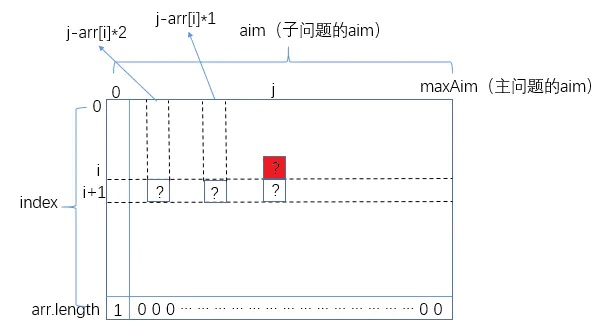
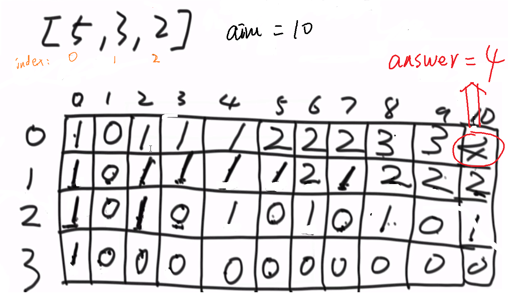
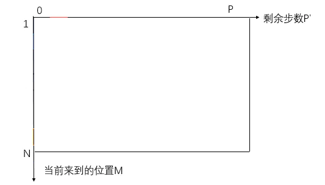
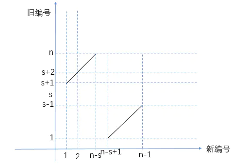

## AlgorithmEasyDay08

[TOC]

## 一、暴力递归

- 把问题转化为规模缩小了的同类问题的子问题；
- 有明确的不需要继续进行递归的条件（base case），因为不能一直递归；
- 有当得到了子问题的结果之后的决策过程；
- 不记录每一个子问题的解；


### （一）问题一：求 n!

【问题】求 $$n!$$ 的结果

【分析】该问题可以分解为子问题：$$n * (n - 1)!$$，同样可以一层层分解，逐层进行依赖，**但是其实每一层都是不知道具体的计算方法**；

#### 方法一：从上到下进行递归

- 第一要素：明确函数功能

    这个函数就是计算输入为 n 的阶乘值，所以返回值为 int，参数为 n

    ```java
    package com.gjxaiou.easy.day08;
    
    public class Factorial {
        public static long getFactorial(int n) {
        
        }
    }
    ```

- 第二要素：寻找递归结束条件

    当 n = 1 的时候，可以明确的得到函数值

    ```java
    package com.gjxaiou.easy.day08;
    
    public class Factorial {
        public static long getFactorial(int n) {
            // 递归结束条件
        	if(n == 1){
        		return 1;
        	}
        }
    }
    ```

- 第三元素：找出函数等价关系式

    找函数等级关系式肯定**需要不断缩小参数范围**，由题意分析可知，f(n) = n * f(n - 1);

    ```java
    package com.gjxaiou.easy.day08;
    
    public class Factorial {
        public static long getFactorial(int n) {
            // 递归结束条件
            if(n == 1){
                return 1;
            }
            return n * getFactorial(n - 1);
        }
    }
    ```

- 最后检查一下递归结束条件是否有遗漏，是否可以结束递归，这里是可以的，当然这里忽略讨论 n = 0 的情况，如果加上改情况只需要将递归结束条件更改为：

    ```java
    if(n == 0 || n == 1){
    	return 1;
    }
    ```


#### 方法二：从下到上递推

这个问题的计算方式： $$ 1 * 2 * 3 * 4 * ... * n$$，这种方式就是上面计算方式的逆过程。

```java
package com.gjxaiou.easy.day08;

public class Factorial {
 
    // 非递归版本
    public static long getFactorial2(int n) {
        long result = 1L;
        for (int i = 1; i <= n; i++) {
            result *= i;
        }
        return result;
    }
}
```


### （二）汉诺塔问题

【问题】给定一个数 n，表示 n 层汉诺塔问题。汉诺塔问题为：从左到右有A、B、C三根柱子，其中 A 柱子上面有从小叠到大的 n 个圆盘，现要求将 A 柱子上的圆盘移到 C 柱子上去，期间只有一个原则：一次只能移到一个盘子且大盘子不能在小盘子上面，求移动的步骤和移动的次数，打印 N 层汉诺塔从最左边移动到最右边的全部过程。

【进阶问题】给定一个汉诺塔的状况用数组 arr 表示（arr中只有1，2，3三种数字），请返回这是汉诺塔最优步数的第几步？

【举个栗子】

> arr = {3,2,1}
> arr 长度为 3，表示这是一个 3 层汉诺塔问题；
> arr[0] == 3表示上面的汉诺塔在右边；
> arr[1] == 2表示中间的汉诺塔在中间；
> arr[2] == 1表示底下的汉诺塔在左间；
> 这种状况是3层汉诺塔最优步数的第2步，所以返回2。

**该问题的递归不能改为动态规划**，因为其每一步都需要打印结果。

**汉诺塔原则**：只能小的压大的，不能大的压小的；


> 注：图示表示将 from 柱上的  ③②① 移动到 to 柱上同样保持  ③②① ，其它序号为移动步骤。

步骤一：将 1 ~ n - 1 移动到 help 

步骤二：见 n 移动到 to

步骤三：将 1 ~ n -1 移动到 to

**一共需要的步骤**： $$2^n - 1$$

```java
package com.gjxaiou.easy.day08;

public class Hanoi {

    // 方式一：
    public static void hanoi(int n) {
        if (n > 0) {
            func(n, n, "left", "mid", "right");
        }
    }

   public static void func(int rest, int down, String from, String help, String to) {
        if (rest == 1) {
            System.out.println("move " + down + " from " + from + " to " + to);
        } else {
            // 将 1 ~ n - 1 移动到 help 上
            func(rest - 1, down - 1, from, to, help);
            // 将 n 移动到
            func(1, down, from, help, to);
            func(rest - 1, down - 1, help, from, to);
        }
    }

    // 方式二：递归版本，只有这一个函数
    // N 表示现在为 1~N 问题，同时 N 个都是停留在 From 上面
    public static void process(int N, String from, String to, String help) {
        if (N == 1) {
            System.out.println("move 1 from " + from + " to " + to);
        } else {
            // 从 from 做到 help 上，可以借助 to
            process(N - 1, from, help, to);
            // 挪动 N
            System.out.println("move " + N + " from " + from + " to " + to);
            // 挪回来
            process(N - 1, help, to, from);
        }
    }

    public static void main(String[] args) {
        int n = 5;
        hanoi(n);

        process(5, "左", "右", "中");
    }
}

```

程序运行结果：

```java
move 1 from left to right
move 2 from left to mid
move 1 from right to mid
move 3 from left to right
move 1 from mid to left
move 2 from mid to right
move 1 from left to right
move 1 from 左 to 右
move 2 from 左 to 中
move 1 from 右 to 中
move 3 from 左 to 右
move 1 from 中 to 左
move 2 from 中 to 右
move 1 from 左 to 右
```


### （三）输出全部子序列

**问题**：打印一个字符串的全部子序列，包括空字符串，**注意**：不是子串（在原字符串中可以找到）。


代码：**主要理解递归版本一即可**。

```java
package com.gjxaiou.easy.day08;

import java.util.ArrayList;
import java.util.Iterator;
import java.util.List;

/**
 * @author GJXAIOU
 */
public class PrintAllSubsequences {
    // 递归版本一：
    // res 为上一级决策之后的字符串值，因为从 i = 0 开始，所以默认 res 为 ""
    public static void printAllSub(String inputString, int i, String res) {
        char[] str = inputString.toCharArray();
        // 如果到最后一个元素就不要递归了
        if (i == str.length) {
            System.out.println(res);
            return;
        }
        // 有两种决策，一种当前为空，就是将上一步决策接着往下扔，另一种就是加上当前字符串然后往下扔
        printAllSub(inputString, i + 1, res);
        printAllSub(inputString, i + 1, res + String.valueOf(str[i]));
    }


    // 方式二：
    public static void printAllSubsquence(String str) {
        char[] chs = str.toCharArray();
        process(chs, 0);
    }

    public static void process(char[] chs, int i) {
        if (i == chs.length) {
            System.out.println(String.valueOf(chs));
            return;
        }
        // 该循环结束之后，输出整个字符串值 abc
        process(chs, i + 1);
        // tmp 保留最后一个字符
        char tmp = chs[i];
        chs[i] = 0;
        // 因为 chs[i] = 0，所以
        process(chs, i + 1);
        chs[i] = tmp;
    }

    public static void main(String[] args) {
        String test = "abc";
        // 测试递归版本
        printAllSub(test, 0, "");
        System.out.println("----------------------");
        printAllSubsquence(test);
        System.out.println("----------------");
    }
}

```

程序运行结果

```java
c
b
bc
a
ac
ab
abc
----------------------
abc
ab 
ac
a  
bc
b 
c    
```


### （四）全排列

**原问题**：打印一个字符串的全部排列

**进阶问题**：打印一个字符串的全部排列，要求不要出现重复的排列

**原问题分析**

把需要全排列的字符串分为两部分看待：

- 字符串的第一个字符；

- 第一个字符后面的所有字符；

求所有可能出现在第一个位置的字符：将第一个字符和后面的字符一次交换；

固定第一个字符，对第一个字符后面的所有字符求全排列。第一个字符后面的所有字符又可以分为两部分；

- 第一元素：确定函数作用

    函数打印出字符串的全部排列，输入值类型为字符型数组，和当前字符长度。输出值为 void；

    ```java
    package com.gjxaiou.easy.day08;
    
    public class PrintAllPermutations {
    
        // 方案一：全排列（不去重）
        public static void printAllPermutations1(String str) {
            char[] charArray = str.toCharArray();
            process1(charArray, 0);
        }
    
        public static void process1(char[] charArray, int local) {
            
        }
    }
    ```
    
- 第二元素：确定递归结束条件

    这里的递归结束条件比较明显，就是排列的字符串长度达到原始字符串长度就停止。

    ```java
    package com.gjxaiou.easy.day08;
    
    import java.util.HashSet;
    
    /**
     * 打印一个字符串的全排列（去重）
     */
    public class PrintAllPermutations {
    
        // 方案一：全排列（不去重）
        public static void printAllPermutations1(String str) {
            char[] charArray = str.toCharArray();
            process1(charArray, 0);
        }
    
        public static void process1(char[] charArray, int local) {
            if (local == charArray.length) {
                System.out.println(String.valueOf(charArray));
            }
         
        }
    }
    ```

- 第三元素：寻找函数等价关系式

    等价关系式很明显，整个字符串的交换可以设定为第一个字符和后面所有字符进行交换，然后固定第一个字符，将后面 n - 1 个字符全排列，最后在交换一次即可

    ```java
    package com.gjxaiou.easy.day08;
    
    import java.util.HashSet;
    
    /**
     * 打印一个字符串的全排列（去重）
     */
    public class PrintAllPermutations {
    
        // 方案一：全排列（不去重）
        public static void printAllPermutations1(String str) {
            char[] charArray = str.toCharArray();
            process1(charArray, 0);
        }
    
        public static void process1(char[] charArray, int local) {
            if (local == charArray.length) {
                System.out.println(String.valueOf(charArray));
            }
            for (int j = local; j < charArray.length; j++) {
                // 将第一个字符与后面的字符交换
                swap(charArray, local, j);
                // 对后面的所有字符进行全排列
                process1(charArray, local + 1);
                // 再将原来交换的字符交换回来，以便第一个字符在与其他字符交换
                swap(charArray, local, j);
            }
        }
        
        public static void swap(char[] chs, int i, int j) {
            char tmp = chs[i];
            chs[i] = chs[j];
            chs[j] = tmp;
        }
    }
    ```

    

**进阶问题**：使用一个 HashSet 进行去重即可

```java
package com.gjxaiou.easy.day08;

import java.util.HashSet;

/**
 * 打印一个字符串的全排列（去重）
 */
public class PrintAllPermutations {
    // 方法二：全排列去重
    public static void printAllPermutations2(String str) {
        char[] chs = str.toCharArray();
        process2(chs, 0);
    }

    public static void process2(char[] chs, int i) {
        if (i == chs.length) {
            System.out.println(String.valueOf(chs));
        }
        HashSet<Character> set = new HashSet<>();
        for (int j = i; j < chs.length; j++) {
            if (!set.contains(chs[j])) {
                set.add(chs[j]);
                swap(chs, i, j);
                process2(chs, i + 1);
                swap(chs, i, j);
            }
        }
    }

    public static void swap(char[] chs, int i, int j) {
        char tmp = chs[i];
        chs[i] = chs[j];
        chs[j] = tmp;
    }

    public static void main(String[] args) {
        String test1 = "abc";
        printAllPermutations1(test1);
        System.out.println("======");
        printAllPermutations2(test1);
        System.out.println("======");

        String test2 = "acc";
        printAllPermutations1(test2);
        System.out.println("======");
        printAllPermutations2(test2);
        System.out.println("======");
    }

}


```

程序运行结果

```java
abc
acb
cab
cba
abc
acb
======
abc
acb
cab
cba
======
acc
acc
cac
cca
acc
acc
======
acc
cac
cca
======
```


### （五）母牛数量

母牛每年生一只母牛，新出生的母牛成长三年后也能每年生一只 母牛，假设不会死。求N年后，母牛的数量。


计算公式为：$$F(n) = F(n - 1) + F(n - 3)$$，
因为今年牛的数量 = 去年牛的数量 + 三年前牛对应生的牛的数量。

**推导步骤**

- 第一因素：确定函数作用

    函数作用就是返回 N 年之后母牛的数量

    ```java
    package com.gjxaiou.easy.day08;
    
    public class Cow {
    	public static int cowNumber1(int n) {
    
    
        }
    }
    
    ```

- 第二因素：确定递归结束条件

    第一年肯定是知道的，一共是 1 头

    ```java
    package com.gjxaiou.easy.day08;
    
    public class Cow {
    	public static int cowNumber1(int n) {
    		if(n == 1){
                return 1;
            }
        }
    }
    
    ```

- 第三因素：寻找函数等价关系式

    由题意知道 $$F(n) = F(n - 1) + F(n - 3)$$

    ```java
    package com.gjxaiou.easy.day08;
    
    public class Cow {
    	public static int cowNumber1(int n) {
    		if(n == 1){
                return 1;
            }
            return cowNumber1(n - 1) + cowNumber1(n - 3);
        }
    }
    
    ```

    最后检查递归结束条件，发现 n == 1 时候可以结束，n == 2 时候 n - 3 为 -1 结束不了，n == 3 时候 n - 3 == 0 结束不了，n == 4 时候可以结束。所以缺少条件，最终代码为：

    ```java
    package com.gjxaiou.easy.day08;
    
    public class Cow {
    
    	public static int cowNumber1(int n) {
    		if (n < 1) {
    			return 0;
    		}
    		if (n == 1 || n == 2 || n == 3) {
    			return n;
    		}
    		return cowNumber1(n - 1) + cowNumber1(n - 3);
    	}
    }    
    ```


**方法二：从底向上递推**，因为这题可以明确的推出迭代公式，所以可以从底向上计算。

```java
package com.gjxaiou.easy.day08;

public class Cow {
    // 方法二：从下到上的递推
    public static int cowNumber2(int n) {
        if (n < 1) {
            return 0;
        }
        if (n == 1 || n == 2 || n == 3) {
            return n;
        }

        int preRes = 3;
        int prePre = 2;
        int prePrePre = 1;
        int temp1 = 0;
        int temp2 = 0;
        for (int i = 4; i <= n; i++) {
            temp1 = preRes;
            temp2 = prePre;
            // 当前值等于 f(n - 1) 即 preRes + f(n - 3) 即 prePrePre
            preRes += prePrePre;
            // f(n - 2) 值向右移动一个变成了 f(n - 1)，即 temp1 保存的 preRes 值。
            prePre = temp1;
            // f(n - 3) 值向右移动一个变成了 f(n - 2)，即 temp2 保存的 prePrePre 值。
            prePrePre = temp2;
        }
        return preRes;
    }
}

```

该代码的时间复杂度为： O(n)，将在进阶班优化为  $$O(log^{n})$$。

**进阶问题**
如果每只母牛只能活10年，求N年后，母牛的数量。


### （六）逆序栈

给你一个栈，请你逆序这个栈，不能申请额外的数据结构，只能使用递归函数。

**举个栗子**：一个栈依次压入1、2、3，将栈转置，使栈顶到栈底依次是1、2、3，只能用递归函数，不能借用额外的数据结构包括栈

**解决方案**：使用两个递归

```java
package com.gjxaiou.easy.day08;

import java.util.Stack;

public class ReverseStackUsingRecursive {
    /**
     * 每层递归取出栈底的元素并缓存到变量中，直到栈空；
     * 然后逆向将每层变量压入栈，最后实现原栈数据的逆序。
     *
     * @param stack
     */
    public static void reverse(Stack<Integer> stack) {
        if (stack.isEmpty()) {
            return;
        }
        // 依次返回1、2、3
        int i = getAndRemoveLastElement(stack);
        reverse(stack);
        // 依次压入3、2、1
        stack.push(i);
    }

    // 返回并且移除栈底元素（栈内元素：<栈底>1,2,3,4,5<栈顶>变为2,3,4,5<栈顶>）.
    public static int getAndRemoveLastElement(Stack<Integer> stack) {
        int result = stack.pop();
        if (stack.isEmpty()) {
            return result;
        } else {
            int last = getAndRemoveLastElement(stack);
            stack.push(result);
            // 第一轮时候返回栈底元素 1
            return last;
        }
    }

    public static void main(String[] args) {
        // Stack 继承 Vector，默认容量是 10(Vector 构造函数中进行了设置)
        Stack<Integer> test = new Stack<Integer>();
        test.push(1);
        test.push(2);
        test.push(3);
        test.push(4);
        test.push(5);
        reverse(test);
        while (!test.isEmpty()) {
            System.out.println(test.pop());
        }
    }
}
```

程序运行结果：

```java
1
2
3
4
5
```


## 二、动态规划

- 从暴力递归中来；来优化暴力递归

- 将每一个子问题的解记录下来，避免重复计算；
- 把暴力递归的过程抽象成了状态表达；
- 并且存在化简状态表达，使其更加简洁的可能；


### （一）矩阵路径最小和

【题目】给你一个二维数组，二维数组中的每个数都是正数，要求从左上角走到右下角，每一步只能向右或者向下。沿途经过的数字要累加起来。返回最小的路径和。

**首先使用暴力规划求解**


代码中的递归 =》包含大量的重复计算，将重复的这些结果计算完保留下来可以避免重复计算。

代码：
```java
package com.gjxaiou.easy.day08;

public class MinPath {

    public static int minPath1(int[][] matrix) {
        return process1(matrix, matrix.length - 1, matrix[0].length - 1);
    }

    // i 表示当前位置的行号，j 表示当前位置的列号；函数表示从 (i，j) 出发到达最右下角位置，最小路径和是多少（并且返回）
    public static int process1(int[][] matrix, int i, int j) {
        int res = matrix[i][j];
        // 因为开始位置就是结尾，所以到（0,0） 位置时候就是结果了。
        if (i == 0 && j == 0) {
            return res;
        }
        if (i == 0 && j != 0) {
            return res + process1(matrix, i, j - 1);
        }
        if (i != 0 && j == 0) {
            return res + process1(matrix, i - 1, j);
        }
        return res + Math.min(process1(matrix, i, j - 1), process1(matrix, i - 1, j));
    }

    // 对应的递归版本（这里属于枚举了）
    public static int walk(int[][] matrix, int i, int j) {
        // 如果达到最右下角元素，则该元素达到最右下角距离为最右下角的值
        if (i == matrix.length - 1 && j == matrix[0].length - 1) {
            return matrix[i][j];
        }
        // 如果到达最底下一行，只能向右走，距离最右下角距离为右边元素距离最右下角元素的距离；
        if (i == matrix.length - 1) {
            return matrix[i][j] + walk(matrix, i, j + 1);
        }
        // 如果到达最右边一列
        if (j == matrix[0].length - 1) {
            return matrix[i][j] + walk(matrix, i + 1, j);
        }
        // 该点右边位置到最右下角的路径和
        int right = walk(matrix, i, j + 1);
        // 该点下边位置到最右下角的路径和
        int down = walk(matrix, i + 1, j);
        // 选择值比较小的那一个
        return matrix[i][j] + Math.min(right, down);
    }

    public static int minPath2(int[][] m) {
        if (m == null || m.length == 0 || m[0] == null || m[0].length == 0) {
            return 0;
        }
        int row = m.length;
        int col = m[0].length;
        int[][] dp = new int[row][col];
        dp[0][0] = m[0][0];
        for (int i = 1; i < row; i++) {
            dp[i][0] = dp[i - 1][0] + m[i][0];
        }
        for (int j = 1; j < col; j++) {
            dp[0][j] = dp[0][j - 1] + m[0][j];
        }
        for (int i = 1; i < row; i++) {
            for (int j = 1; j < col; j++) {
                dp[i][j] = Math.min(dp[i - 1][j], dp[i][j - 1]) + m[i][j];
            }
        }
        return dp[row - 1][col - 1];
    }

    // for test
    public static int[][] generateRandomMatrix(int rowSize, int colSize) {
        if (rowSize < 0 || colSize < 0) {
            return null;
        }
        int[][] result = new int[rowSize][colSize];
        for (int i = 0; i != result.length; i++) {
            for (int j = 0; j != result[0].length; j++) {
                result[i][j] = (int) (Math.random() * 10);
            }
        }
        return result;
    }

    public static void main(String[] args) {
        int[][] m = {{1, 3, 5, 9}, {8, 1, 3, 4}, {5, 0, 6, 1}, {8, 8, 4, 0}};
        System.out.println(minPath1(m));
        System.out.println(minPath2(m));

        m = generateRandomMatrix(6, 7);
        System.out.println(minPath1(m));
        System.out.println(minPath2(m));

        // 测试递归
        int walk = walk(m, 0, 0);
        System.out.println(walk);
    }
}

```

### （二）任意数字累加为 aim
**问题**：给你一个数组 arr，和一个整数 aim。如果可以任意选择 arr 中的数字，能不能累加得到 aim，返回 true 或者 false。

**说明**：这里为了简化，数组中的所有元素都是正数，同样要得到的整数也是一个正数。

```java
package com.gjxaiou.easy.day08;

public class MoneyProblem {

    // 方法一：递归
    public static boolean money1(int[] arr, int aim) {
        return process1(arr, 0, 0, aim);
    }

    public static boolean process1(int[] arr, int i, int sum, int aim) {
        if (sum == aim) {
            return true;
        }
        // sum != aim 且到达最后一位了
        if (i == arr.length) {
            return false;
        }
        // 要当前值继续往下加和不要当前值继续往下加
        return process1(arr, i + 1, sum, aim) || process1(arr, i + 1, sum + arr[i], aim);
    }

    // 方法二：动态规划
    public static boolean money2(int[] arr, int aim) {
        boolean[][] dp = new boolean[arr.length + 1][aim + 1];
        for (int i = 0; i < dp.length; i++) {
            dp[i][aim] = true;
        }
        for (int i = arr.length - 1; i >= 0; i--) {
            for (int j = aim - 1; j >= 0; j--) {
                dp[i][j] = dp[i + 1][j];
                if (j + arr[i] <= aim) {
                    dp[i][j] = dp[i][j] || dp[i + 1][j + arr[i]];
                }
            }
        }
        return dp[0][0];
    }

    public static void main(String[] args) {
        int[] arr = {1, 4, 8};
        int aim = 12;
        System.out.println(money1(arr, aim));
        System.out.println(money2(arr, aim));
    }
}
```


### 暴力递归修改为动态规划
- 步骤一：写出尝试版本
- 步骤二：分析可变参数，哪几个参数可以代表返回值状态，可变参数几维即 DP 为几维表
- 步骤三：在 DP 表中找到需要的最终状态，然后标明；
- 步骤四：回到代码的 baseCase 中，在 DP 中设置到完全不依赖的值；
- 步骤五：看一个普遍位置需要哪些位置信息；
- 步骤六：逆过程回去就是 DP 填表的顺序；


# AlgorithmMediumDay06


## 一、从暴力尝试到动态规划

动态规划不是玄学，也无需去记那些所谓的刻板的“公式”（例如状态转换表达式等），**其实动态规划是从暴力递归而来**。并不是说一个可以动态规划的题一上来就可以写出动态规划的求解步骤，==我们只需要能够写出暴力递归版本，然后对重复计算的子过程结果做一个缓存，最后分析状态依赖寻求最优解，即衍生成了动态规划==。本节将以多个例题示例，展示求解过程是如何从暴力尝试，一步步到动态规划的。

```text
先想递归
发现重复计算
通过记忆化等方法弄掉重复计算
最后看下能不能通过利用计算顺序来做到去掉递归用“刷表”方式直接顺序计算，能搞定最好搞不定拉倒
```

## 二、【DP】换钱的方法数（组合问题）

【**题目**】给定数组 arr，arr 中所有的值都为正数且不重复。每个值代表一种面值的货币，每种面值的货币可以使用任意张，再给定一个整数 aim 代表要找的钱数，求换钱有多少种方法。

【举个栗子】

- `arr = [5,10,25,1]，aim = 0`：组成 0 元的方法有 1 种，就是所有面值的货币都不用。所以返回 1。
- `arr = [5,10,25,1]，aim = 15`：组成 15 元的方法有 6 种，分别为 3 张 5 元、1 张 10 元 + 1 张 5 元、1 张 10 元 + 5 张 1 元、10 张 1 元 + 1 张 5 元、2 张 5 元 + 5 张 1 元和 15 张 1 元。所以返回 6。
- `arr = [3,5]，aim = 2`：任何方法都无法组成 2 元。所以返回 0。

### （一）暴力尝试

我们可以将该题要求解的问题定义成一个过程：对于下标 `index`，`arr` 中在 `index` 及其之后的所有面值不限张数任意组合，该过程最终返回所有有效的组合方案。因此该过程可以描述为 `int process(int arr[],int index,int aim)`，题目的解就是调用 `process(arr,0,aim)`。那么函数内部具体该如何解决此问题呢？

其实所有面值不限张数的任意组合就是对每一个面值需要多少张的一个**决策**，那我们不妨从碰到的第一个面值开始决策，比如 `arr = [5,10,25,1]，aim = 15`时，（ 选 0 张 5 元之后剩下的面值不限张数组合成 15 元的方法数 + 选 1 张 5 元之后剩下的面值不限张数组合成 10 元方法数 + 选 2 张 5 元之后剩下的面值不限张数组合成 5 元方法数 + 选 3 张 5 元之后剩下的面值不限张数组合成 0 元方法数 ）就是所给参数对应的解，其中“剩下的面值不限张数组合成一定的钱数”又是同类问题，可以使用相同的过程求解，因此有了如下的暴力递归：

```java
package nowcoder.advanced.day06;

import java.util.HashMap;

/**
 * @author GJXAIOU
 */
public class CoinsWay {
    // 方式一：暴力递归
    public static int coins1(int[] arr, int aim) {
        if (arr == null || arr.length == 0 || aim < 0) {
            return 0;
        }
        return process1(arr, 0, aim);
    }

    /**
     * @param arr
     * @param index ：可以任意自由使用 index 及其之后所有的钱
     * @param aim   ：目标钱数
     * @return ：方法数
     */
    public static int process1(int[] arr, int index, int aim) {
        int res = 0;
        // 如果到达数组最后一个位置，拿出一定金额之后 aim 值为 0，就说明是一种有效的划分，反之则说明该划分不行；
        // 所以最后该划分结果是否可行到最后一位之后才可以判断出来；
        if (index == arr.length) {
            res = aim == 0 ? 1 : 0;
        } else {
            for (int zhangShu = 0; arr[index] * zhangShu <= aim; zhangShu++) {
                // index 为当前货币金额，已经使用过了，从 index + 1 位置开始往后都可以使用；
                // aim - arr[index] * zhangShu 为后面需要凑齐的钱数；
                res += process1(arr, index + 1, aim - arr[index] * zhangShu);
            }
        }
        return res;
    }
}

```

### （二）缓存每个状态的结果，以免重复计算

上述的暴力递归是极其暴力的，比如对于参数 `arr=[5，3，1，30，15，20，10]，aim=100 `来说，如果已经决策了`3 张 5 元 + 0 张 3 元 + 0 张 1 元`的接着会调子过程 `process(arr, 3, 85)`；如果已经决策了`0 张 5 元 + 5 张 3 元 + 0 张 1 元` 接着也会调子过程 `process(arr, 3, 85)`；如果已经决策了`0 张 5 元 + 0 张 3 元 + 15 张 1 元`接着还是会调子过程`process(arr, 3, 85)`。

你会发现，这个已知面额种类和要凑的钱数，求凑钱的方法的解是固定的。也就是说不管之前的决策是 3 张 5 元的，还是 5 张 3 元的，又或是 15 张 1 元的，对后续子过程的 `[30，15，20，10]` 凑成 `85` 这个问题的解是不影响的，这个解该是多少还是多少。这也是==**无后效性问题**。无后效性问题就是某一状态的求解不依赖其他状态==，比如著名的 N 皇后问题就是有后效性问题。

因此，我们不妨再求解一个状态之后，将该状态对应的解做个缓存，在后续的状态求解时先到缓存中找是否有该状态的解，有则直接使用，没有再求解并放入缓存，这样就不会有重复计算的情况了：

```java
package nowcoder.advanced.day06;

import java.util.HashMap;

/**
 * @author GJXAIOU
 */
public class CoinsWay {
    // 方法二：保存状态结果，避免重复计算
    public static int coins2(int[] arr, int aim) {
        if (arr == null || arr.length == 0 || aim < 0) {
            return 0;
        }
        return processMap(arr, 0, aim);
    }

    // 修改上面的递归方法，因为 index 和 aim 确定，最后返回值结果就确定了，所以计算完之后将该状态和其返回值保存下来可以下次使用
    // String 格式为："index_aim"，Integer 为该种情况下对应的返回值。
    // 使用 map 做一个缓存功能(key 为某个状态的代号，value 为该状态对应的解)
    public static HashMap<String, Integer> map = new HashMap<>();

    public static int processMap(int[] arr, int index, int aim) {
        int res = 0;
        if (index == arr.length) {
            res = aim == 0 ? 1 : 0;
        } else {
            for (int zhangshu = 0; arr[index] * zhangshu <= aim; zhangshu++) {
                int nextAim = aim - arr[index] * zhangshu;
                String key = String.valueOf(index + 1) + "_" + String.valueOf(nextAim);
                if (map.containsKey(key)) {
                    res += map.get(key);
                } else {
                    res += processMap(arr, index + 1, nextAim);
                }
            }
        }
        map.put(String.valueOf(index) + "_" + String.valueOf(aim), res);
        return res;
    }
}

```

### （三）确定依赖关系，寻找最优解

当然，借助缓存已经将暴力递归的时间复杂度拉低了很多，但这还不是最优解。下面我们将以寻求最优解为引导，挖掘出动态规划中的状态转换。

从暴力尝试到动态规划，我们只需观察暴力尝试版本的代码，甚至可以忘却题目，按照下面高度套路化的步骤，就可以轻易改出动态规划：

- 步骤一：**确定参数数量（确定几维表）**==首先每个状态都有两个参数 `index` 和 `aim`（`arr` 作为输入参数是不变的），因此可以对应两个变量的变化范围建立一张二维表==：


- 步骤二：**求解特殊位置解** 从 `base case` 中找出特殊位置的解。比如`if(index == arr.length) return aim == 0 ? 1 : 0`，那么上述二维表的最后一行对应的所有状态可以直接求解：


- 步骤三：**找出状态依赖关系** 从暴力递归中找出普遍位置对应的状态所依赖的其他状态。比如：

```java
for (int zhangshu = 0; arr[index] * zhangshu <= aim; zhangshu++) {
    res += process(arr, index + 1, aim - (arr[index] * zhangshu));
}
```

那么对于二维表中的一个普遍位置`(i,j)`，它所依赖的状态如下所示：



也就是说一个普遍位置的状态依赖它的下一行的几个位置上的状态。那么我们已经知道了最后一行所有位置上的状态，当然可以根据这个依赖关系推出倒数第二行的，继而推出倒数第三行的……整个二维表的所有位置上的状态都能推出来。

- 步骤四：找出主问题对应二维表的哪个状态（`(0,maxAim)`），那个状态的值就是问题的解。

示例代码：

```java
public static int maxMethodsDp(int arr[], int aim) {
    // DP 二维表，大小默认就是上面所有状态数量。
    int dp[][] = new int[arr.length + 1][aim + 1];
    // base case，其他默认都为 0，所以最后一行其他元素也就不需要填充了
    dp[arr.length][0] = 1;
    // 从倒数第二行开始推，推出整个二维表每个位置的状态
    for (int i = arr.length - 1; i >= 0; i--) {
        for (int j = 0; j <= aim; j++) {
            // i对应的面值取0张
            dp[i][j] = dp[i + 1][j];
            // i 对应的面值取 1 张、2 张、3 张……
            for (int subAim = j - arr[i]; subAim >= 0; subAim = subAim - arr[i]) {
                dp[i][j] += dp[i + 1][subAim];
            }
        }
    }

    return dp[0][aim];
}

public static void main(String[] args) {
    int arr[] = {5, 10, 25, 1};
    System.out.println(maxMethodsDp(arr, 15));
}
```

到这里也许你会送一口气，终于找到了最优解，其实不然，因为如果你再分析一下每个状态的求解过程，仍然存在瑕疵：


比如你在求解状态A时，可能会将其依赖的状态 M,N,P 的值累加起来；然后在求解状态 B 时，有需要将其依赖的状态 M,N,P,Q 累加起来，你会发现在这个过程中`M + N + P`的计算是重复的，因此还可以有如下优化：

```java
for (int i = arr.length - 1; i >= 0; i--) {
    for (int j = 0; j <= aim; j++) {
        dp[i][j] = dp[i + 1][j];
        if (j - arr[i] >= 0) {
            dp[i][j] += dp[i][j - arr[i]];
        }
    }
}
```

至此，此题最优解的求解完毕。




```java
package com.gjxaiou.advanced.day06;

import java.util.HashMap;

/**
 * @author GJXAIOU
 */
public class CoinsWay {
    // 方式一：暴力递归
    public static int coins1(int[] arr, int aim) {
        if (arr == null || arr.length == 0 || aim < 0) {
            return 0;
        }
        return process1(arr, 0, aim);
    }

    /**
     * @param arr
     * @param index ：可以任意自由使用 index 及其之后所有的钱
     * @param aim   ：目标钱数
     * @return ：方法数
     */
    public static int process1(int[] arr, int index, int aim) {
        int res = 0;
        // 如果到达数组最后一个位置，拿出一定金额之后 aim 值为 0，就说明是一种有效的划分，反之则说明该划分不行；
        // 所以最后该划分结果是否可行到最后一位之后才可以判断出来；
        if (index == arr.length) {
            res = aim == 0 ? 1 : 0;
        } else {
            for (int zhangShu = 0; arr[index] * zhangShu <= aim; zhangShu++) {
                // index 为当前货币金额，已经使用过了，从 index + 1 位置开始往后都可以使用；
                // aim - arr[index] * zhangShu 为后面需要凑齐的钱数；
                res += process1(arr, index + 1, aim - arr[index] * zhangShu);
            }
        }
        return res;
    }

    // 方法二：保存状态结果，避免重复计算
    public static int coins2(int[] arr, int aim) {
        if (arr == null || arr.length == 0 || aim < 0) {
            return 0;
        }
        return processMap(arr, 0, aim);
    }

    // 修改上面的递归方法，因为 index 和 aim 确定，最后返回值结果就确定了，所以计算完之后将该状态和其返回值保存下来可以下次使用
    // String 格式为："index_aim"，Integer 为该种情况下对应的返回值。
    // 使用 map 做一个缓存功能(key 为某个状态的代号，value 为该状态对应的解)
    public static HashMap<String, Integer> map = new HashMap<>();

    public static int processMap(int[] arr, int index, int aim) {
        int res = 0;
        if (index == arr.length) {
            res = aim == 0 ? 1 : 0;
        } else {
            for (int zhangshu = 0; arr[index] * zhangshu <= aim; zhangshu++) {
                int nextAim = aim - arr[index] * zhangshu;
                String key = String.valueOf(index + 1) + "_" + String.valueOf(nextAim);
                if (map.containsKey(key)) {
                    res += map.get(key);
                } else {
                    res += processMap(arr, index + 1, nextAim);
                }
            }
        }
        map.put(String.valueOf(index) + "_" + String.valueOf(aim), res);
        return res;
    }


    // 方法三：使用动态规划
    public static int coins3(int[] arr, int aim) {
        if (arr == null || arr.length == 0 || aim < 0) {
            return 0;
        }
        int[][] dp = new int[arr.length][aim + 1];
        for (int i = 0; i < arr.length; i++) {
            dp[i][0] = 1;
        }
        for (int j = 1; arr[0] * j <= aim; j++) {
            dp[0][arr[0] * j] = 1;
        }
        int num = 0;
        for (int i = 1; i < arr.length; i++) {
            for (int j = 1; j <= aim; j++) {
                num = 0;
                for (int k = 0; j - arr[i] * k >= 0; k++) {
                    num += dp[i - 1][j - arr[i] * k];
                }
                dp[i][j] = num;
            }
        }
        return dp[arr.length - 1][aim];
    }

    // 方法五：动态规划优化
    public static int coins4(int[] arr, int aim) {
        if (arr == null || arr.length == 0 || aim < 0) {
            return 0;
        }
        int[][] dp = new int[arr.length][aim + 1];
        for (int i = 0; i < arr.length; i++) {
            dp[i][0] = 1;
        }
        for (int j = 1; arr[0] * j <= aim; j++) {
            dp[0][arr[0] * j] = 1;
        }
        for (int i = 1; i < arr.length; i++) {
            for (int j = 1; j <= aim; j++) {
                dp[i][j] = dp[i - 1][j];
                dp[i][j] += j - arr[i] >= 0 ? dp[i][j - arr[i]] : 0;
            }
        }
        return dp[arr.length - 1][aim];
    }

    // 使用一维 DP 数组
    public static int coins5(int[] arr, int aim) {
        if (arr == null || arr.length == 0 || aim < 0) {
            return 0;
        }
        int[] dp = new int[aim + 1];
        for (int j = 0; arr[0] * j <= aim; j++) {
            dp[arr[0] * j] = 1;
        }
        for (int i = 1; i < arr.length; i++) {
            for (int j = 1; j <= aim; j++) {
                dp[j] += j - arr[i] >= 0 ? dp[j - arr[i]] : 0;
            }
        }
        return dp[aim];
    }


    ////////////////////////////// 测试程序 //////////////////////////////////
    public static void main(String[] args) {
        int[] coins = {10, 5, 1, 25};
        int aim = 2000;

        long start = 0;
        long end = 0;
        start = System.currentTimeMillis();
        System.out.println(coins1(coins, aim));
        end = System.currentTimeMillis();
        System.out.println("暴力递归 cost time : " + (end - start) + "(ms)");

        start = System.currentTimeMillis();
        System.out.println(coins2(coins, aim));
        end = System.currentTimeMillis();
        System.out.println("缓存值 cost time : " + (end - start) + "(ms)");

        aim = 2000;

        start = System.currentTimeMillis();
        System.out.println(coins3(coins, aim));
        end = System.currentTimeMillis();
        System.out.println("DP cost time : " + (end - start) + "(ms)");

        start = System.currentTimeMillis();
        System.out.println(coins4(coins, aim));
        end = System.currentTimeMillis();
        System.out.println("优化 DP cost time : " + (end - start) + "(ms)");

        start = System.currentTimeMillis();
        System.out.println(coins5(coins, aim));
        end = System.currentTimeMillis();
        System.out.println("一维 DP cost time : " + (end - start) + "(ms)");
    }
}
```

测试结果：

```java
1103021
暴力递归 cost time : 566(ms)
1103021
缓存值 cost time : 106(ms)
1103021
DP cost time : 7(ms)
1103021
优化 DP cost time : 0(ms)
1103021
一维 DP cost time : 0(ms)
```


## 三、【DP】轮流抽取纸牌获取最大和问题

【**题目**】 给定一个整型数组 arr，代表分数不同的纸牌排成一条线。玩家 A 和玩家 B 依次拿走每张纸牌，规定玩家 A 先拿，玩家 B 后拿，但是每个玩家每次只能拿走最左或最右的纸牌，玩家 A 和玩家 B 都绝顶聪明。请返回最后获胜者的分数。

【**举个栗子**】 

- `arr=[1,2,100,4]`
    - 可能性一：开始时玩家 A 只能拿走 1 或 4。如果玩家 A 拿走 1，则排列变为`[2,100,4]`，接下来玩家 B 可以拿走 2 或 4，然后继续轮到玩家 A。
    - 可能性二：如果开始时玩家 A 拿走 4，则排列变为 `[1,2,100]`，接下来玩家 B 可以拿走 1 或 100，然后继续轮到玩家 A。
    - 最优方案：玩家 A 作为绝顶聪明的人不会先拿 4，因为拿 4 之后，玩家 B 将拿走 100。所以玩家 A 会先拿 1，让排列变为 `[2,100,4]`，接下来玩家 B 不管怎么选，100 都会被玩家 A 拿走。玩家 A 会获胜，分数为101。所以返回 101。
- 示例二：`arr=[1,100,2]`
    - 开始时玩家 A 不管拿 1 还是 2，玩家 B 作为绝顶聪明的人，都会把 100 拿走。玩家 B 会获胜，分数为100。所以返回 100。

> ==动态规划的题难就难在暴力尝试这个“试”法==，只要能够试出了暴力版本，那改为动态规划就是高度套路的。

### （一）暴力尝试

其中`first()`和`second()`就是整个尝试中的思路，与以往穷举法的暴力递归不同，这里是两个函数相互递归调用。

`first(int arr[],int beginIndex,int endIndex)`表示如果纸牌只剩下标在 `beginIndex ~ endIndex`之间的几个了，那么作为先拿者，纸牌被拿完后，先拿者能达到的最大分数；而`second(int arr[],int begin,int end)`表示如果纸牌只剩下标在`beginIndex ~ endIndex`之间的几个了，那么作为后拿者，纸牌被拿完后，后拿者能达到的最大分数。

在`first()`中，如果只有一张纸牌，那么该纸牌分数就是先拿者在该轮能达到的最大分数，直接返回，无需决策。否则先拿者 A 的第一次决策只有两种情况：

- 先拿最左边的`arr[beginIndex]`，那么在 A 拿完这一张之后就会作为后拿者参与到剩下的`(beginIndex + 1) ~ endIndex`之间的纸牌的决策了，这一过程可以交给 `second()` 来做。
- 先拿最右边的 `arr[endIndex]`，那么在 A 拿完这一张之后就会作为后拿者参与到剩下的 `beginIndex ~ (endIndex - 1)` 之间的纸牌的决策了，这一过程可以交给`second()`来做。

最后返回两种情况中，**结果较大**的那种。

在`second()`中，如果只有一张纸牌，那么作为后拿者没有纸牌可拿，分数为 0，直接返回。否则以假设的方式巧妙的将问题递归了下去：

- 假设先拿者 A 拿到了 `arr[beginIndex]`，那么去掉该纸牌后，对于剩下的 `(beginIndex + 1) ~ endIndex`之间的纸牌，后拿者 B 就转变身份成了先拿者，这一过程可以交给 `first()`来处理。
- 假设先拿者 A 拿到了 `arr[endIndex]`，那么去掉该纸牌后，对于剩下的 `beginIndex ~ (endIndex - 1)`之间的纸牌，后拿者 B 就转变身份成了先拿者，这一过程可以交给`first()`来处理。

这里取两种情况中**结果较小**的一种，是因为这两种情况是我们假设的，但先拿者 A 绝顶聪明，他的选择肯定会让后拿者尽可能拿到更小的分数。比如`arr=[1,2,100,4]`，虽然我们的假设有先拿者拿`1`和拿`4`两种情况，对应`f(arr,1,3)`和`f(arr,0,2)`，但实际上先拿者不会让后拿者拿到`100`，因此取两种情况中结果较小的一种。

```java
package com.gjxaiou.advanced.day06;

/**
 * @author GJXAIOU
 */
public class CardsInLine {
    // 方法一：暴力递归
    public static int win1(int[] arr) {
        if (arr == null || arr.length == 0) {
            return 0;
        }
        return Math.max(first(arr, 0, arr.length - 1), second(arr, 0, arr.length - 1));
    }

    // first 表示在剩余的 beginIndex ~ endIndex 中，先拿者会得到最大分数。
    public static int first(int[] arr, int beginIndex, int endIndex) {
        // 如果只剩一个，则只能拿这个了，这就是先拿者能在该步骤获得的最大值
        if (beginIndex == endIndex) {
            return arr[beginIndex];
        }
        // 如果剩余的不止一个，能获得的最大值就是在 先着拿开始位置 + 后者拿剩下的 和 先者拿末尾位置 + 后者拿剩下的 中的最大的一个
        return Math.max(arr[beginIndex] + second(arr, beginIndex + 1, endIndex),
                arr[endIndex] + second(arr, beginIndex, endIndex - 1));
    }

    // second 表示在剩余的 beginIndex ~ endIndex 中，后拿者会得到最大分数。
    public static int second(int[] arr, int beginIndex, int endIndex) {
        // 如果只有一张牌，后者就没有的拿了，返回 0
        if (beginIndex == endIndex) {
            return 0;
        }
        // 假设先拿者拿到了 beginIndex]，对于剩下的 (beginIndex + 1) ~ endIndex 之间的纸牌，后拿者就转变身份成了先拿者，这一过程可以交给 `first()`来处理。
        // 假设先拿者拿到了 endIndex，对于剩下的 `beginIndex ~ (endIndex - 1)`之间的纸牌，后拿者就转变身份成了先拿者，这一过程可以交给`first()`来处理。
        // 这里取两种情况中**结果较小**的一种，是因为这两种情况是我们假设的，但先拿者 A 绝顶聪明，他的选择肯定会让后拿者尽可能拿到更小的分数
        return Math.min(first(arr, beginIndex + 1, endIndex), first(arr, beginIndex,
                endIndex - 1));
    }

    public static void main(String[] args) {
        int[] arr = {1, 9, 1, 3};
        System.out.println(win1(arr))；
    }
}

```

### （二）改动态规划

- 步骤一：**确定参数数量（确定几维表）**==首先每个状态都有两个参数 `beginIndex` 和 `endIndex`（`arr` 作为输入参数是不变的），因此可以对应两个变量的变化范围建立一张二维表==：

但是这里是两个函数相互递归，因此需要两张二维表保存`(begin,end)`确定时，`first()`和`second()`的状态值。

- 步骤二：确定`base case`对应的特殊位置上的状态值：

    - 针对 first() ：当 `beginIndex == endIndex` 时候，值是确定的。值分别为 `arr[0], arr[1]...arr[arr.length - 1]`

        ```java
        public static int first(int[] arr, int beginIndex, int endIndex) {
            // 如果只剩一个，则只能拿这个了，这就是先拿者能在该步骤获得的最大值
            if (beginIndex == endIndex) {
                return arr[beginIndex];
            }
        ```

    - 针对 second()：当 `beginIndex == endIndex` 时候，值也是确定的，均为 0

        ```java
        public static int second(int[] arr, int beginIndex, int endIndex) {
            // 如果只有一张牌，后者就没有的拿了，返回 0
            if (beginIndex == endIndex) {
                return 0;
            }
        ```

    对应的 DP 表如下所示：

    **注意**：题目中有一个隐形条件，`beginIndex <= endIndex`所以只要考虑对角线上方区域即可。


- **步骤三**：由递归调用逻辑找出状态依赖。

`first()`依赖的状态：

```
return Math.max(arr[beginIndex] + second(arr, beginIndex + 1, endIndex),
                arr[endIndex] + second(arr, beginIndex, endIndex - 1));
```

first 表的`(begin,end)`依赖S表`(begin+1,end)`和`(begin,end-1)`。

`second()`依赖的状态：

```
return Math.min(first(arr, beginIndex + 1, endIndex), 
				first(arr, beginIndex,endIndex - 1));
```

second 表的`(begin,end)`依赖F表的`(begin+1,end)`和`(begin,end-1)`。


如此的话，对于对角线的右上区域，对角线位置上的状态能推出倒数第二长对角线位置上的状态，进而推出倒数第三长位置上的状态……右上区域每个位置的状态都能推出。

- 步骤四：确定主问题对应的状态：

```
return Math.max(
                first(arr, 0, arr.length-1),
                second(arr, 0, arr.length-1));
```

示例代码：

```java
package com.gjxaiou.advanced.day06;

/**
 * @author GJXAIOU
 */
public class CardsInLine {

    // 方法二：动态规划
    public static int win2(int[] arr) {
        if (arr == null || arr.length == 0) {
            return 0;
        }
        int[][] first = new int[arr.length][arr.length];
        int[][] second = new int[arr.length][arr.length];
        for (int j = 0; j < arr.length; j++) {
            // 首先对对角线上元素赋 base 值
            first[j][j] = arr[j];
            // 填充其他元素
            for (int i = j - 1; i >= 0; i--) {
                first[i][j] = Math.max(arr[i] + second[i + 1][j], arr[j] + second[i][j - 1]);
                second[i][j] = Math.min(first[i + 1][j], first[i][j - 1]);
            }
        }
        return Math.max(first[0][arr.length - 1], second[0][arr.length - 1]);
    }

    public static void main(String[] args) {
        int[] arr = {1, 9, 1, 3};
        System.out.println(win1(arr));
        System.out.println(win2(arr));
    }
}

```


最终代码（两种代码合并）

```java
package com.gjxaiou.advanced.day06;

/**
 * @author GJXAIOU
 */
public class CardsInLine {
    // 方法一：暴力递归
    public static int win1(int[] arr) {
        if (arr == null || arr.length == 0) {
            return 0;
        }
        return Math.max(first(arr, 0, arr.length - 1), second(arr, 0, arr.length - 1));
    }

    // first 表示在剩余的 beginIndex ~ endIndex 中，先拿者会得到最大分数。
    public static int first(int[] arr, int beginIndex, int endIndex) {
        // 如果只剩一个，则只能拿这个了，这就是先拿者能在该步骤获得的最大值
        if (beginIndex == endIndex) {
            return arr[beginIndex];
        }
        // 如果剩余的不止一个，能获得的最大值就是在 先着拿开始位置 + 后者拿剩下的 和 先者拿末尾位置 + 后者拿剩下的 中的最大的一个
        return Math.max(arr[beginIndex] + second(arr, beginIndex + 1, endIndex),
                arr[endIndex] + second(arr, beginIndex, endIndex - 1));
    }

    // second 表示在剩余的 beginIndex ~ endIndex 中，后拿者会得到最大分数。
    public static int second(int[] arr, int beginIndex, int endIndex) {
        // 如果只有一张牌，后者就没有的拿了，返回 0
        if (beginIndex == endIndex) {
            return 0;
        }
        // 假设先拿者拿到了 beginIndex]，对于剩下的 (beginIndex + 1) ~ endIndex 之间的纸牌，后拿者就转变身份成了先拿者，这一过程可以交给
        //`first()`来处理。
        // 假设先拿者拿到了 endIndex，对于剩下的 `beginIndex ~ (endIndex - 1)
        //`之间的纸牌，后拿者就转变身份成了先拿者，这一过程可以交给`first()`来处理。
        // 这里取两种情况中**结果较小**的一种，是因为这两种情况是我们假设的，但先拿者 A 绝顶聪明，他的选择肯定会让后拿者尽可能拿到更小的分数
        return Math.min(first(arr, beginIndex + 1, endIndex), first(arr, beginIndex,
                endIndex - 1));
    }

    // 方法二：动态规划
    public static int win2(int[] arr) {
        if (arr == null || arr.length == 0) {
            return 0;
        }
        int[][] first = new int[arr.length][arr.length];
        int[][] second = new int[arr.length][arr.length];
        for (int j = 0; j < arr.length; j++) {
            // 首先对对角线上元素赋 base 值
            first[j][j] = arr[j];
            // 填充其他元素
            for (int i = j - 1; i >= 0; i--) {
                first[i][j] = Math.max(arr[i] + second[i + 1][j], arr[j] + second[i][j - 1]);
                second[i][j] = Math.min(first[i + 1][j], first[i][j - 1]);
            }
        }
        return Math.max(first[0][arr.length - 1], second[0][arr.length - 1]);
    }

    public static void main(String[] args) {
        int[] arr = {1, 9, 1, 3};
        System.out.println(win1(arr));
        System.out.println(win2(arr));
    }
}
```


## 四、【DP】机器人走路问题

**问题**：给你标号为 1、2、3、……、N 的 N 个位置，机器人初始停在 M 位置上，走 P 步后停在 K 位置上的走法有多少种。注：机器人在 1 位置上时只能向右走，在 N 位置上时只能向左走，其它位置既可向右又可向左。

**示意图**：


```java
package com.gjxaiou.advanced.day06;

/**
 * @Author GJXAIOU
 * @Date 2020/1/12 10:35
 */
public class Robot {
    /**
     * 暴力破解方式
     *
     * @param N：一共有             1 ~ N 的初始位置
     * @param curPosition：来到的位置
     * @param restSteps：可以走的步数
     * @param K：最终停留在的位置
     * @return 一共有多少中走法
     * 变量分析，初始位置和最终停留位置是确定的，所有可变参数为： curPosition 和 restSteps
     */
    public static int ways(int N, int curPosition, int restSteps, int K) {
        // 取出一些不可能的情况
        if (N < 2 || curPosition < 1 || curPosition > N || restSteps < 0 || K < 1 || K > N) {
            return 0;
        }
        // 不剩下步数了，看是否停在了 K 位置
        if (restSteps == 0) {
            return curPosition == K ? 1 : 0;
        }
        int res = 0;
        // 只能往右走了
        if (curPosition == 1) {
            res += ways(N, curPosition + 1, restSteps - 1, K);
            // 到达最右边了，只能往左走
        } else if (curPosition == N) {
            res += ways(N, curPosition - 1, restSteps - 1, K);
        } else {
            res += ways(N, curPosition + 1, restSteps - 1, K) + ways(N, curPosition - 1,
                    restSteps - 1, K);
        }
        return res;
    }
}

```

**步骤一：确定参数数量，即确定 DP 为几维表**。很明显一个状态由两个位置决定 `curPosition` 和 `restSteps`，所以是一个二维表，参数范围分别为：`1 ~ N` 和 `0 ~ P`，所以二维表如下所示：



**步骤二**：根据 baseCase 填充二维表

```java
// 取出一些不可能的情况
if (N < 2 || curPosition < 1 || curPosition > N || restSteps < 0 || K < 1 || K > N) {
    return 0;
}
// 不剩下步数了，看是否停在了 K 位置
if (restSteps == 0) {
    return curPosition == K ? 1 : 0;
}
```


**步骤三**：由递归调用逻辑找出状态依赖。

```java
// 只能往右走了
if (curPosition == 1) {
    res += ways(N, curPosition + 1, restSteps - 1, K);
    // 到达最右边了，只能往左走
} else if (curPosition == N) {
    res += ways(N, curPosition - 1, restSteps - 1, K);
} else {
    res += ways(N, curPosition + 1, restSteps - 1, K) + ways(N, curPosition - 1,
                                                             restSteps - 1, K);
}
```

最终二维表为：


**步骤四**：确定最终状态位置

动态规划示例代码：

```java
package com.gjxaiou.advanced.day06;

/**
 * @Author GJXAIOU
 * @Date 2020/1/12 10:35
 */
public class Robot {
    // DP
    public static int ways2(int N, int curPosition, int restSteps, int k) {
        int[][] dp = new int[N + 1][restSteps + 1];
        // 赋 base case 值
        dp[k][0] = 1;
        // 填表，这里是一列一列填，不是一行一行
        for (int j = 1; j <= restSteps; j++) {
            // j 从 1 开始，因为 0 列已经赋值结束了
            for (int i = 1; i <= N; i++) {
                if (i == 1) {
                    dp[i][j] = dp[i + 1][j - 1];
                } else if (i == N) {
                    dp[i][j] = dp[i - 1][j - 1];
                } else {
                    dp[i][j] = dp[i - 1][j - 1] + dp[i + 1][j - 1];
                }
            }
        }
        return dp[curPosition][restSteps];
    }


    public static void main(String[] args) {
        System.out.println(Robot.ways1(5, 2, 3, 3));
        System.out.println(Robot.ways2(5, 2, 3, 3));
    }
}

```


## 五、【滑动窗口】求和为 aim 的最长子数组（元素都大于 0）

**基础篇中有过相同的题，只不过这里的数组元素值为正数，而基础篇中的可正可负可0。**

基础篇中的做法是用一个哈希表记录子数组和出现的最早的位置。而此题由于数据特殊性（都是正数）可以在额外空间复杂度`O(1)`，时间复杂度`O(N)`内完成。

使用一个窗口，用 L 表示窗口的左边界、R 表示窗口的右边界，用 sum 表示窗口内元素之和（初始为 0）。起初，L 和 R 都停在 -1 位置上，接下来每次都要将 L 向右扩一步或将 R 向右扩一步，具体扩哪个视情况而定：

- 如果`sum < aim`，那么 R 往右边扩
- 如果`sum = aim`，那么记录窗口内元素个数，L 往右边扩
- 如果`sum > aim`，那么 L 往右边扩

直到 R 扩到 `arr.length` 越界，那么此时窗口内元素之和必定小于 aim，整个过程可以结束。答案就是所有`sum=aim`情况下窗口内元素最多时的个数。

示例代码：

```java
package com.gjxaiou.advanced.day06;

/**
 * 全正数数组中累加和为 aim 的最长子数组长度
 */
public class LongestSumSubArrayLengthInPositiveArray {

    public static int getMaxLength(int[] arr, int aim) {
        if (arr == null || arr.length == 0 || aim <= 0) {
            return 0;
        }
        // 初始状态，窗口左边界以及右边界都在 0 位置
        int left = 0;
        int right = 0;
        int sum = arr[0];
        int len = 0;
        while (right < arr.length) {
            // 如果和正好为 aim，比较当前窗口长度和之前窗口长度，取较大的一个
            if (sum == aim) {
                len = Math.max(len, right - left + 1);
                // 左边界向右移动（left++ 并且将 left 值从 sum 中减去）
                sum -= arr[left++];
                // 如果和小于值，右边界右移：右移就是 right++，并且将 right 值加入 sum
            } else if (sum < aim) {
                right++;
                // 防止越界
                if (right == arr.length) {
                    break;
                }
                sum += arr[right];
                // 如果和大于值， left 右移
            } else {
                sum -= arr[left++];
            }
        }
        return len;
    }

    //////////////  测试程序 //////////////////
    public static int[] generatePositiveArray(int size) {
        int[] result = new int[size];
        for (int i = 0; i != size; i++) {
            result[i] = (int) (Math.random() * 10) + 1;
        }
        return result;
    }

    public static void printArray(int[] arr) {
        for (int i = 0; i != arr.length; i++) {
            System.out.print(arr[i] + " ");
        }
        System.out.println();
    }

    public static void main(String[] args) {
        int len = 20;
        int k = 15;
        int[] arr = generatePositiveArray(len);
        printArray(arr);
        System.out.println(getMaxLength(arr, k));
    }
}
```

> 思考：为什么这个流程得到的答案是正确的呢？也就是说，为什么窗口向右滑动的过程中，不会错过和为aim的最长子数组？我们可以来证明一下：


假设，椭圆区域就是和为aim的最长子数组，如果L来到了椭圆区域的左边界L2，那么R的位置有两种情况：在椭圆区域内比如R1，在椭圆区域外比如R2。如果是前者，由于窗口`L2~R1`是肯定小于`aim`的（元素都是正数），因此在R从R1右移到椭圆区域右边界过程中，L是始终在L2上的，显然不会错过正确答案；如果是后者，窗口`L2~R2`的`sum`明显超过了`aim`，因此这种情况是不可能存在的。而L在L2左边的位置上，比如L1时，R更不可能越过椭圆区域来到了R2，因为窗口是始终保持`sum<=aim`的。

## 六、【滑动窗口】求和小于等于 aim 的最长子数组（有正有负有0）

### （一）暴力枚举

如果使用暴力枚举，枚举出以每个元素开头的子数组，那么答案一定就在其中（`O(N^3)`）。

### （二）遍历 + 滑动窗口

首先从尾到头遍历一遍数组，生成两个辅助数组`min_sum`和`min_sum_index`作为求解时的辅助信息。`min_sum`表示以某个元素开头的所有子数组中和最小为多少，`min_sum_index`则对应保存该最小和子数组的结束下标。

**【举个栗子】**：对于`[100,200,7,-6]`。

- 首先遍历下标为 3 位置上的 `-6`，以 `-6` 开头的子数组只有`[-6]`，因此 `min_sum[3] = -6, min_sum_index[3] = 3`（`[-6]`的尾元素`-6`在原数组中的下标是`3`）。

- 接着遍历到 2 位置上的 `7`，以`7`开头的最小和子数组是`[7,-6]`，因此`min_sum[2] = 7-6 = 1, min_sum_index[2]=3`。（`[7,-6]`的尾元素`-6`在原数组中的下标是`3`）。

- 接着遍历到 1 位置上的 `200`，有 `min_sum[1] = 200, min_sum_index[1] = 1`。

- 接着遍历到0位置上的 `100`，有`min_sum[0] = 100, min_sum_index[0] = 0`。

那么遍历完数组，生成两个辅助数组之后，就可以开始正式的求解流程了：

使用一个窗口，L 表示窗口的左边界，R 表示窗口的右边界，`sum` 表示窗口内元素之和。

- L 从头到尾依次来到数组中的每个元素，每次 L 来到其中一个元素上时，都尝试向右扩 R，R 扩到不能扩时，窗口大小 `R-L` 即为以该元素开头的、和小于等于 aim 的最长子数组的长度。
- L 起初来到首元素，R 起初也停在首元素，`sum=0`。
- R 向右扩一次的逻辑是：如果 `sum + min_sum[L] <= aim`，那么R就扩到`min_sum_index[L] + 1`的位置，并更新`sum`。
- R扩到不能扩时，记录`R-L`，L去往下一个元素，并更新`sum`。
- 如果L来到一个元素后，`sum > aim`，说明以该元素开头的、和小于等于aim的最长子数组的长度，比当前的窗口大小`R-L`还要小，那么以该元素开头的子数组不在正确答案的考虑范围之内（因为上一个元素形成的最大窗口大于当前元素能形成的最大窗口，并且前者已经被记录过了），L直接去往一下个元素并更新`sum`。


完整的代码

```java
package com.gjxaiou.advanced.day06;

public class LongestSubarrayLessSumAwesomeSolution {

    // 方式一：
    public static int maxLengthAwesome(int[] arr, int aim) {
        if (arr == null || arr.length == 0) {
            return 0;
        }

        // 大步骤一：生成 min_sum 以及 min_sum_index
        int[] minSum = new int[arr.length];
        int[] minSumEndIndex = new int[arr.length];
        // 最后一个元素的 min_sum 就是自己，min_sum_index 也是自己的下标
        minSum[arr.length - 1] = arr[arr.length - 1];
        minSumEndIndex[arr.length - 1] = arr.length - 1;
        // 因为最后一个 length -1 上面已经得到，所以从 Length - 2 开始计算
        for (int i = arr.length - 2; i >= 0; i--) {
            // 如果之前累加和小于 0，现在最小累加和就是自己 + 前面最小累加和，则 minSumEndIndex[i] 就是前一个右边界到达的位置；
            // 因为后一个累加和小于 0 说明当前元素 > 当前元素 + 后一个元素，所以加上后面的总 sum 值更小
            if (minSum[i + 1] < 0) {
                minSum[i] = arr[i] + minSum[i + 1];
                minSumEndIndex[i] = minSumEndIndex[i + 1];
                // 往右扩并不能使得自己的累加和最小，则就只有自己
            } else {
                minSum[i] = arr[i];
                minSumEndIndex[i] = i;
            }
        }

        // 大步骤二：正式扩充过程
        int left = 0;
        int right = 0;
        int sum = 0;
        int length = 0;

        // left 为每次开始扩的开始，right 为扩的右边界，本质上扩充到 right - 1 位置；
        for (left = 0; left < arr.length; left++) {
            // 让 right 不断的往右扩充，直到不能扩充为止（到右边界或者和大于 aim）
            while (right < arr.length && sum + minSum[right] <= aim) {
                sum += minSum[right];
                right = minSumEndIndex[right] + 1;
            }
            // 当 right 扩充不动的时候记录以当前 left 位置上的元素开头的并且和小于等于 aim 的最长子数组长度
            // sum 减去 left 位置数，因为下面 left++ 了，重新来了
            sum -= right > left ? arr[left] : 0;
            length = Math.max(length, right - left);
            // 如果上来就扩不动，比如 100,200,7,3，-3，aim 等于 7，则100,200 都向右扩不动，需要变
            right = Math.max(right, left + 1);
        }
        return length;
    }

    // 方法二：使用二分加速的解法，O（NlogN）
    public static int maxLength(int[] arr, int k) {
        int[] h = new int[arr.length + 1];
        int sum = 0;
        h[0] = sum;
        for (int i = 0; i != arr.length; i++) {
            sum += arr[i];
            h[i + 1] = Math.max(sum, h[i]);
        }
        sum = 0;
        int res = 0;
        int pre = 0;
        int len = 0;
        for (int i = 0; i != arr.length; i++) {
            sum += arr[i];
            pre = getLessIndex(h, sum - k);
            len = pre == -1 ? 0 : i - pre + 1;
            res = Math.max(res, len);
        }
        return res;
    }

    public static int getLessIndex(int[] arr, int num) {
        int low = 0;
        int high = arr.length - 1;
        int mid = 0;
        int res = -1;
        while (low <= high) {
            mid = (low + high) / 2;
            if (arr[mid] >= num) {
                res = mid;
                high = mid - 1;
            } else {
                low = mid + 1;
            }
        }
        return res;
    }

    /////////////     测试程序     ////////////////
    public static int[] generateRandomArray(int len, int maxValue) {
        int[] res = new int[len];
        for (int i = 0; i != res.length; i++) {
            res[i] = (int) (Math.random() * maxValue) - (maxValue / 3);
        }
        return res;
    }

    public static void main(String[] args) {
        for (int i = 0; i < 1000000; i++) {
            int[] arr = generateRandomArray(10, 20);
            int k = (int) (Math.random() * 20) - 5;
            if (maxLengthAwesome(arr, k) != maxLength(arr, k)) {
                System.out.println("oops，bad!");
            } else {
                System.out.println("ok");
            }
        }

    }

}

```

> 此方法能够做到`O(N)`时间复杂度的关键点是：舍去无效情况。比如L在右移一步更新`sum`之后，如果发现`sum > aim`，显然以当前L开头的、和小于等于aim的最长子数组肯定小于当前的`R-L`，而在上一步就记录了`R-(L-1)`，以当前L开头的满足条件的子数组可以忽略掉（因为一定小于`R-(L-1)`），而不必让R回退到当前L重新来扩R。
>
> 这样L和R都只右移而不回退，所以时间复杂度就是遍历了一遍数组。

## 七、环形单链表的约瑟夫问题

**题目**：据说著名犹太历史学家 Josephus 有过以下故事：在罗马人占领乔塔帕特后，39 个犹太人与 Josephus 及他的朋友躲到一个洞中，39 个犹太人决定宁愿死也不要被敌人抓到，于是决定了一个自杀方式，41 个人排成一个圆圈，由第 1 个人开始报数，报数到 3 的人就自杀，然后再由下一个人重新报 1，报数到 3 的人再自杀，这样依次下去，直到剩下最后一个人时，那个人可以自由选择自己的命运。这就是著名的约瑟夫问题。现在请用单向环形链表描述该结构并呈现整个自杀过程。

> **输入**：一个环形单向链表的头节点 head 和报数的值 m。
>
> **返回**：最后生存下来的节点，且这个节点自己组成环形单向链表，其他节点都删掉。
>
> **进阶**：如果链表节点数为N，想在时间复杂度为O(N)时完成原问题的要求，该怎么实现？

### （一）暴力方法

从头结点开始数，从 1 数到 m，数到 m 时删除结点，再从下一个结点开始数……如此要删除（n-1）个结点，并且每次删除之前要数 m 个数，因此时间复杂度为`O(NxM)`

### （二）

这里介绍一种`O(N)`的方法。

首先介绍一个函数：$y = x \% i $


如果从头结点开始，为每个结点依次编号1、2、3、……，比如环形链表有 3 个结点，每次报数到 7 时杀人：

| 结点编号 | 报数 |
| -------- | ---- |
| 1        | 1    |
| 2        | 2    |
| 3        | 3    |
| 1        | 4    |
| 2        | 5    |
| 3        | 6    |
| 1        | 杀人 |

那么在杀人之前，结点编号和报数有如下对应关系（x 轴代表此刻报数报到哪儿了，y 轴则对应是几号结点报的，n 是结点数量）：


假设每次杀人后，都从下一结点重新编号、重新报数，比如环形链表有9个结点，报数到7就杀人，那么杀人之前结点的旧编号和杀人重新编号后结点的新编号有如下关系：

| 旧编号 | 新编号                       |
| ------ | ---------------------------- |
| 1      | 3                            |
| 2      | 4                            |
| 3      | 5                            |
| 4      | 6                            |
| 5      | 7                            |
| 6      | 8                            |
| 7      | 被杀，从下一结点开始重新编号 |
| 8      | 1                            |
| 9      | 2                            |

如果链表结点数为n，报数到m杀人，那么结点的新旧编号对应关系如下（其中`s`为报数为m的结点编号）：





这个图也可以由基本函数`y = (x - 1) % n + 1`向左平移s个单位长度变换而来：


即`y = (x - 1 + s) % n + 1`。

现在我们有了如下两个公式：

1. `结点编号 = (报数 - 1) % n + 1`
2. `旧编号 = (新编号 - 1 + s) % n +1`，其中`s`为报数为m的结点编号

由1式可得`s = (m - 1) % n + 1`，带入2式可得

公式 3：`旧编号 = (新编号 - 1 + (m - 1) % n + 1) % n + 1 = (新编号 + m - 1) % n + 1`，其中`m`和`n`由输入参数决定。

现在我们有了等式3，就可以在已知一个结点在另一个结点被杀之后的新编号的情况下，求出该结点的旧编号。也就是说，假设现在杀到了第`n-1`个结点，杀完之后只剩下最后一个结点了（天选结点），重新编号后天选结点肯定是1号，那么第`n-1`个被杀结点被杀之前天选结点的编号我们就可以通过等式3求出来，通过这个结果我们又能求得天选结点在第`n-2`个被杀结点被杀之前的编号，……，依次往回推就能还原一个结点都没死时天选结点的编号，这样我们就能从输入的链表中找到该结点，直接将其后继指针指向自己然后返回即可。

完整程序代码

```java
package com.gjxaiou.advanced.day06;

public class JosephusProblem {

    public static class Node {
        public int value;
        public Node next;

        public Node(int data) {
            this.value = data;
        }
    }

    // 方法一：暴力破解
    public static Node josephusKill1(Node head, int num) {
        if (head == null || head.next == head || num < 1) {
            return head;
        }
        Node last = head;
        // 首先转到一圈中的最后一个节点
        while (last.next != head) {
            last = last.next;
        }
        int count = 0;
        // 遍历圈中每一个节点
        // 例如 1 2 3 4 5
        while (head != last) {
            // 如果下一个结点就是要删除的
            if (++count == num) {
                // 将要删除的结点链接到 last 后面，因为后面还要计数，所以如果删除则就不能实现每隔多少个删除了
                last.next = head.next;
                // count = 0 重新计数
                count = 0;
            } else {
                // 如果不是要删除的，last 往后移动一个，进入下一轮循环
                last = last.next;
            }
            // 每次都从 last.next 开始
            head = last.next;
        }
        return head;
    }

    // 方法二：递推
    public static Node josephusKill2(Node head, int num) {
        if (head == null || head.next == head || num < 1) {
            return head;
        }
        Node cur = head.next;
        int tmp = 1; // tmp -> list size
        while (cur != head) {
            tmp++;
            cur = cur.next;
        }
        tmp = getLive(tmp, num); // tmp -> service node position
        while (--tmp != 0) {
            head = head.next;
        }
        head.next = head;
        return head;
    }

    public static int getLive(int i, int num) {
        if (i == 1) {
            return 1;
        }
        // 计算出新编号对应的旧编号，将该旧编号作为下一次计算的新编号
        return (getLive(i - 1, num) + num - 1) % i + 1;
    }


    /////////////  测试程序   /////////////
    public static void printCircularList(Node head) {
        if (head == null) {
            return;
        }
        System.out.print("Circular List: " + head.value + " ");
        Node cur = head.next;
        while (cur != head) {
            System.out.print(cur.value + " ");
            cur = cur.next;
        }
        System.out.println("-> " + head.value);
    }

    public static void main(String[] args) {
        Node head1 = new Node(1);
        head1.next = new Node(2);
        head1.next.next = new Node(3);
        head1.next.next.next = new Node(4);
        head1.next.next.next.next = new Node(5);
        head1.next.next.next.next.next = head1;
        printCircularList(head1);
        head1 = josephusKill1(head1, 3);
        printCircularList(head1);

        Node head2 = new Node(1);
        head2.next = new Node(2);
        head2.next.next = new Node(3);
        head2.next.next.next = new Node(4);
        head2.next.next.next.next = new Node(5);
        head2.next.next.next.next.next = head2;
        printCircularList(head2);
        head2 = josephusKill2(head2, 3);
        printCircularList(head2);

    }
}
```

程序运行结果：

```java
Circular List: 1 2 3 4 5 -> 1
Circular List: 4 -> 4
Circular List: 1 2 3 4 5 -> 1
Circular List: 4 -> 4
```


## 八、【DP】字符串正则匹配问题

**问题**：给定字符串 `str`，其中绝对不含有字符 `'.'` 和 `'*'`。再给定字符串 `exp`，其中可以含有 `'.'` 或 `'*'`，`'*'` 字符不能是 `exp` 的首字符，并且任意两个 `'*'` 字符不相邻。exp中的 `'.'` 代表任何一个字符，exp中的 `'*'` 表示 `'*'` 的前一个字符可以有 0 个或者多个。请写一个函数，判断 `str` 是否能被 `exp` 匹配。

**【举个栗子】**

- `str="abc"，exp="abc"`，返回`true`。
- `str="abc"，exp="a.c"`，exp中单个`'.'`可以代表任意字符，所以返回`true`。
- `str="abcd"，exp=".*"`。exp中`'*'`的前一个字符是`'.'`，所以可表示任意数量的`'.'`字符，当 exp是`"...."`时与`"abcd"`匹配，返回`true`。
- `str=""，exp="..*"`。exp中`'*'`的前一个字符是`'.'`，可表示任意数量的`'.'`字符，但是`".*"`之前还有一个`'.'`字符，该字符不受`'*'`的影响，所以`str`起码有一个字符才能被`exp`匹配。所以返回`false`。

### （一）暴力尝试

定义一个方法 `boolean process(char[] str, char[] exp, int i, int j)`，表示`str`的下标`i ~ str.length` 部分能否和 `exp`的下标`j ~ exp.length` 部分完全匹配，分情况讨论如下：

- 如果 `j` 到了`exp.length`而 `i` 还没到 `str.length`，返回 `false`，否则返回 `true`


- 如果 `i` 和 `j` 都没到右边界，并且 `j` 的后一个字符不是 `*` 或者越界，那么只有当 `str[i] = exp[j]`或`exp[j]='.'` 时，`i` 和 `j` 才同时右移继续比较 `match(str, i+1, exp, j+1)`，否则返回 `false`

- 如果`i`到了`str.length`而`j`还没到`exp.length`，那么`j`之后的字符只能是`a*b*c*.*`的形式，也就是一个字符后必须跟一个`*`的形式，这个检验过程同样可以交给`match`来做

 


示例代码：

```
public static boolean match(char[] s, int i, char[] e, int j) {
    if (j == e.length) {
        return i == s.length;
    }
    //j下一个越界或者j下一个不是*
    if (j + 1 == e.length || e[j + 1] != '*') {
        if (i != s.length && s[i] == e[j] || e[j] == '.') {
            return match(s, i + 1, e, j + 1);
        }
        return false;
    }
    //j下一个不越界并且j下一个是*
    while (i != s.length && s[i] == e[j] || e[j] == '.') {
        if (match(s, i, e, j + 2)) {
            return true;
        }
        i++;
    }
    //如果上面的while是因为 s[i]!=e[j] 而停止的
    return match(s, i, e, j + 2);
}

public static boolean isMatch(String str, String exp) {
    if (str == null || exp == null) {
        return false;
    }
    char[] s = str.toCharArray();
    char[] e = exp.toCharArray();
    return match(s, 0, e, 0);
}

public static void main(String[] args) {
    System.out.println(isMatch("abbbbc","a.*b*c"));//T
    System.out.println(isMatch("abbbbc","a.*bbc"));//T
    System.out.println(isMatch("abbbbc","a.bbc"));//F
    System.out.println(isMatch("abbbbc","a.bbbc"));//T
}
复制代码
```

### 动态规划

==步骤==

首先确定变量，确定几维表

然后表中标明 baseCase

标出一般位置依赖哪些（看掉了哪些递归位置）

然依赖的位置 baseCase能不能提供，不能提供的话就需要将地基补充完整，这样才能推出其他值。


`match`的参数列表中只有`i`和`j`是变化的，也就是说只要确定了`i`和`j`就能对应确定一个`match`的状态，画出二维表并将`base case`对应位置状态值标注出来：

**目标是 (0,0)位置**


再看普遍位置`(i,j)`的依赖，第`6`行的`if`表明`(i,j)`可能依赖`(i+1, j+1)`，第`13`行的`while`表明`(i,j)`可能依赖`(i, j+2)`、`(i+1, j+2)`、`(i+2, j+2)`、……、`(s.length-1, j+2)`：


你会发现`(i,j)`依赖它下面一行和右边相邻两列的状态，也就是说要想推出普遍位置的状态值，起码需要最后一行、最后一列和倒数第二列上的状态值。而`base case`仅为我们提供了最后一列的状态值，主过程`match(e, 0, s, 0)`对应`(0,0)`位置的状态值，我们需要推出整张表所有位置的状态值才行。

这时就要回归题意了，看倒数第二列和最后一行上的状态有什么特殊含义。

首先最后一行表示`i`到了`str.length`，此时如果`j`还没走完`exp`的话，从`j`开始到末尾的字符必须满足`字符*字符*字符*`的范式才返回`true`。因此最后一行状态值易求：


而对于倒数第二列，表示`j`来到了`exp`的末尾字符，此时如果`i`如果在`str`末尾字符之前，那么也是直接返回`false`的：


那么接下来就只剩下`(str.length-1, exp.length-1)`这个位置的状态值了，该位置标明`i`来到了`str`的末尾字符，`j`来到了`exp`的末尾字符，只有当这两个字符相等或`exp`的末尾字符为`.`才返回`true`否则`false`，也就是说该状态可以直接通过输入参数`str`和`exp`计算，它不依赖其他状态。二维表的初始化至此全部完成。

示例代码：

```
public static boolean isMatch(String str, String exp) {
    if (str == null || exp == null) {
        return false;
    }
    return matchDp(str, exp);
}

public static boolean matchDp(String str, String exp) {
    if (str == null || exp == null) {
        return false;
    }
    char s[] = str.toCharArray();
    char e[] = exp.toCharArray();
    boolean[][] dpMap = initDpMap(s, e);

    //从倒数第二行开始推，每一行从右向左推
    for (int i = s.length - 1; i > -1; i--) {
        for (int j = e.length - 2; j > -1; j--) {
            if (e[j + 1] != '*') {
                dpMap[i][j] = (s[i] == e[j] || e[j] == '.') && dpMap[i + 1][j + 1];
            } else {
                int tmp = i;
                while (tmp != s.length && (s[tmp] == e[j] || e[j] == '.')) {
                    if (dpMap[tmp][j + 2]) {
                        dpMap[i][j] = true;
                        break;
                    }
                    tmp++;
                }
                if (dpMap[i][j] != true) {
                    dpMap[i][j] = dpMap[i][j + 2];
                }
            }
        }
    }
    return dpMap[0][0];
}

public static boolean[][] initDpMap(char[] s, char[] e) {
    boolean[][] dpMap = new boolean[s.length + 1][e.length + 1];
    //last column
    dpMap[s.length][e.length] = true;
    //last row -> i=s.length-1
    for (int j = e.length - 2; j >= 0; j = j - 2) {
        if (e[j] != '*' && e[j + 1] == '*') {
            dpMap[s.length - 1][j] = true;
        } else {
            break;
        }
    }
    //(str.length-1, e.length-1)
    if (s[s.length - 1] == e[e.length - 1] || e[e.length - 1] == '.') {
        dpMap[s.length - 1][e.length - 1] = true;
    }
    return dpMap;
}
```


完整代码：

```java
package nowcoder.advanced.advanced_class_06;

public class Code_03_RegularExpressionMatch {
    // 输入字符串判断是否合法
    public static boolean isValid(char[] s, char[] e) {
        for (int i = 0; i < s.length; i++) {
            if (s[i] == '*' || s[i] == '.') {
                return false;
            }
        }
        for (int i = 0; i < e.length; i++) {
            if (e[i] == '*' && (i == 0 || e[i - 1] == '*')) {
                return false;
            }
        }
        return true;
    }

    // --------------------------------------------------------------
    // 暴力递归
    public static boolean isMatch(String str, String exp) {
        if (str == null || exp == null) {
            return false;
        }
        char[] s = str.toCharArray();
        char[] e = exp.toCharArray();
        return isValid(s, e) ? process(s, e, 0, 0) : false;
    }

    /**
     * 函数含义：str[i...一直到最后]这个字符串，能不能被 exp[j..一直到最后]的字符串，匹配出来
     *
     * @param str：
     * @param exp
     * @param i
     * @param j
     * @return
     */
    public static boolean process(char[] str, char[] exp, int i, int j) {
        // baseCase,当exp 中 j 来到最后位置
        if (j == exp.length) {
            return i == str.length;
        }
        // j 上面还有字符，考察 j + 1 的情况
        if (j + 1 == exp.length || exp[j + 1] != '*') {
            // 如果 i == str.length 表示 i 已经到最后了，返回 false；&& 后面如果成立可能返回 true，但是如果不成立则一定返回 false；最后表示
            //i 的 i + 1 位置和 j + 1 匹配才能最终返回 true。
            return i != str.length && (exp[j] == str[i] || exp[j] == '.')
                    && process(str, exp, i + 1, j + 1);
        }
        // 该 while 前提为：exp 的 j + 1 位置，不仅有字符并且字符是 *
        while (i != str.length && (exp[j] == str[i] || exp[j] == '.')) {
            // 如果 i 和 j 位置上可以匹配上（相等或者为 . 都认为是匹配上），默认还是认为 * 为 0 个 j 值，先从 j + 2 开始看看能不能与 i 位置匹配上；
            if (process(str, exp, i, j + 2)) {
                return true;
            }
            // 如果上面没有返回 true，则 i++，然后让 j + 2 位置和当前 i 位置开始匹配，本质上就是认为原来 i 位置上元素和 j 位置上数相等了，即 * 表示有
            //1 个 j 值。依次类推一直尝试。
            i++;
        }
        // 跳过 while 到最后一行情况： str: a,a,a,b；exp：c,*,....；就是 str 中第一个为 i 位置上 a 和 exp 中第一个 j 位置上 c
        //不匹配，并且 j  位置上不为 .，所以就从 j + 2 位置开始来看能不能匹配上 i 位置上元素，相当于默认 c,* 中表示 0 的 c。
        return process(str, exp, i, j + 2);
    }
    // --------------------------------------------------------------

    // 动态规划方法
    public static boolean isMatchDP(String str, String exp) {
        if (str == null || exp == null) {
            return false;
        }
        char[] s = str.toCharArray();
        char[] e = exp.toCharArray();
        if (!isValid(s, e)) {
            return false;
        }
        boolean[][] dp = initDPMap(s, e);
        for (int i = s.length - 1; i > -1; i--) {
            for (int j = e.length - 2; j > -1; j--) {
                if (e[j + 1] != '*') {
                    dp[i][j] = (s[i] == e[j] || e[j] == '.')
                            && dp[i + 1][j + 1];
                } else {
                    int si = i;
                    while (si != s.length && (s[si] == e[j] || e[j] == '.')) {
                        if (dp[si][j + 2]) {
                            dp[i][j] = true;
                            break;
                        }
                        si++;
                    }
                    if (dp[i][j] != true) {
                        dp[i][j] = dp[si][j + 2];
                    }
                }
            }
        }
        return dp[0][0];
    }

    // 上来就把二维表的最后一行和最后两列对应值填好
    public static boolean[][] initDPMap(char[] s, char[] e) {
        int slen = s.length;
        int elen = e.length;
        boolean[][] dp = new boolean[slen + 1][elen + 1];
        dp[slen][elen] = true;
        for (int j = elen - 2; j > -1; j = j - 2) {
            if (e[j] != '*' && e[j + 1] == '*') {
                dp[slen][j] = true;
            } else {
                break;
            }
        }
        if (slen > 0 && elen > 0) {
            if ((e[elen - 1] == '.' || s[slen - 1] == e[elen - 1])) {
                dp[slen - 1][elen - 1] = true;
            }
        }
        return dp;
    }

    public static void main(String[] args) {
        String str = "abcccdefg";
        String exp = "ab.*d.*e.*";
        System.out.println(isMatch(str, exp));
        System.out.println(isMatchDP(str, exp));

    }

}

```


# AlgorithmMediumDay07

[TOC]

## 二、最长递增子序列

【题目】
给定数组arr，返回arr的最长递增子序列。
【举例】
arr=[2,1,5,3,6,4,8,9,7]，返回的最长递增子序列为[1,3,4,8,9]。
【要求】
如果arr长度为N，请实现时间复杂度为O(NlogN)的方法。

```java
package nowcoder.advanced.day07;

public class Code_02_LIS {

    public static int[] lis1(int[] arr) {
        if (arr == null || arr.length == 0) {
            return null;
        }
        int[] dp = getdp1(arr);
        return generateLIS(arr, dp);
    }

    public static int[] getdp1(int[] arr) {
        int[] dp = new int[arr.length];
        for (int i = 0; i < arr.length; i++) {
            dp[i] = 1;
            for (int j = 0; j < i; j++) {
                if (arr[i] > arr[j]) {
                    dp[i] = Math.max(dp[i], dp[j] + 1);
                }
            }
        }
        return dp;
    }

    public static int[] generateLIS(int[] arr, int[] dp) {
        int len = 0;
        int index = 0;
        for (int i = 0; i < dp.length; i++) {
            if (dp[i] > len) {
                len = dp[i];
                index = i;
            }
        }
        int[] lis = new int[len];
        lis[--len] = arr[index];
        for (int i = index; i >= 0; i--) {
            if (arr[i] < arr[index] && dp[i] == dp[index] - 1) {
                lis[--len] = arr[i];
                index = i;
            }
        }
        return lis;
    }

    public static int[] lis2(int[] arr) {
        if (arr == null || arr.length == 0) {
            return null;
        }
        int[] dp = getdp2(arr);
        return generateLIS(arr, dp);
    }

    public static int[] getdp2(int[] arr) {
        int[] dp = new int[arr.length];
        int[] ends = new int[arr.length];
        ends[0] = arr[0];
        dp[0] = 1;
        int right = 0;
        int l = 0;
        int r = 0;
        int m = 0;
        for (int i = 1; i < arr.length; i++) {
            l = 0;
            r = right;
            while (l <= r) {
                m = (l + r) / 2;
                if (arr[i] > ends[m]) {
                    l = m + 1;
                } else {
                    r = m - 1;
                }
            }
            right = Math.max(right, l);
            ends[l] = arr[i];
            dp[i] = l + 1;
        }
        return dp;
    }

    // for test
    public static void printArray(int[] arr) {
        for (int i = 0; i != arr.length; i++) {
            System.out.print(arr[i] + " ");
        }
        System.out.println();
    }

    public static void main(String[] args) {
        int[] arr = {2, 1, 5, 3, 6, 4, 8, 9, 7};
        printArray(arr);
        printArray(lis1(arr));
        printArray(lis2(arr));

    }
}
```

程序运行结果：

```java
2 1 5 3 6 4 8 9 7 
1 3 4 8 9 
1 3 4 8 9
```


## 三、最长公共子序列问题

【题目】
给定两个字符串str1和str2，返回两个字符串的最长公共子序列。
【举例】
str1="1A2C3D4B56"，str2="B1D23CA45B6A"。
"123456"或者"12C4B6"都是最长公共子序列，返回哪一个都行。

```java
package nowcoder.advanced.day07;

public class Code_03_LCSubsequence {

    public static String lcse(String str1, String str2) {
        if (str1 == null || str2 == null || str1.equals("") || str2.equals("")) {
            return "";
        }
        char[] chs1 = str1.toCharArray();
        char[] chs2 = str2.toCharArray();
        int[][] dp = getdp(chs1, chs2);
        int m = chs1.length - 1;
        int n = chs2.length - 1;
        char[] res = new char[dp[m][n]];
        int index = res.length - 1;
        while (index >= 0) {
            if (n > 0 && dp[m][n] == dp[m][n - 1]) {
                n--;
            } else if (m > 0 && dp[m][n] == dp[m - 1][n]) {
                m--;
            } else {
                res[index--] = chs1[m];
                m--;
                n--;
            }
        }
        return String.valueOf(res);
    }

    public static int[][] getdp(char[] str1, char[] str2) {
        int[][] dp = new int[str1.length][str2.length];
        dp[0][0] = str1[0] == str2[0] ? 1 : 0;
        for (int i = 1; i < str1.length; i++) {
            dp[i][0] = Math.max(dp[i - 1][0], str1[i] == str2[0] ? 1 : 0);
        }
        for (int j = 1; j < str2.length; j++) {
            dp[0][j] = Math.max(dp[0][j - 1], str1[0] == str2[j] ? 1 : 0);
        }
        for (int i = 1; i < str1.length; i++) {
            for (int j = 1; j < str2.length; j++) {
                dp[i][j] = Math.max(dp[i - 1][j], dp[i][j - 1]);
                if (str1[i] == str2[j]) {
                    dp[i][j] = Math.max(dp[i][j], dp[i - 1][j - 1] + 1);
                }
            }
        }
        return dp;
    }

    public static void main(String[] args) {
        String str1 = "A1BC2D3EFGH45I6JK7LMN";
        String str2 = "12OPQ3RST4U5V6W7XYZ";
        System.out.println(lcse(str1, str2));

    }
}
```

程序运行结果：

```java
1234567
```


## 四、最长公共子串问题

最长公共子串问题
【题目】
给定两个字符串str1和str2，返回两个字符串的最长公共子串。
【举例】
str1="1AB2345CD"，str2="12345EF"，返回"2345"。
【要求】
如果str1长度为M，str2长度为N，实现时间复杂度为O(MN)，额外空间复杂度为O(1)的方法。

```java
package nowcoder.advanced.day07;

public class Code_04_LCSubstring {

	public static String lcst1(String str1, String str2) {
		if (str1 == null || str2 == null || str1.equals("") || str2.equals("")) {
			return "";
		}
		char[] chs1 = str1.toCharArray();
		char[] chs2 = str2.toCharArray();
		int[][] dp = getdp(chs1, chs2);
		int end = 0;
		int max = 0;
		for (int i = 0; i < chs1.length; i++) {
			for (int j = 0; j < chs2.length; j++) {
				if (dp[i][j] > max) {
					end = i;
					max = dp[i][j];
				}
			}
		}
		return str1.substring(end - max + 1, end + 1);
	}

	public static int[][] getdp(char[] str1, char[] str2) {
		int[][] dp = new int[str1.length][str2.length];
		for (int i = 0; i < str1.length; i++) {
			if (str1[i] == str2[0]) {
				dp[i][0] = 1;
			}
		}
		for (int j = 1; j < str2.length; j++) {
			if (str1[0] == str2[j]) {
				dp[0][j] = 1;
			}
		}
		for (int i = 1; i < str1.length; i++) {
			for (int j = 1; j < str2.length; j++) {
				if (str1[i] == str2[j]) {
					dp[i][j] = dp[i - 1][j - 1] + 1;
				}
			}
		}
		return dp;
	}

	public static String lcst2(String str1, String str2) {
		if (str1 == null || str2 == null || str1.equals("") || str2.equals("")) {
			return "";
		}
		char[] chs1 = str1.toCharArray();
		char[] chs2 = str2.toCharArray();
		int row = 0;
		int col = chs2.length - 1;
		int max = 0;
		int end = 0;
		while (row < chs1.length) {
			int i = row;
			int j = col;
			int len = 0;
			while (i < chs1.length && j < chs2.length) {
				if (chs1[i] != chs2[j]) {
					len = 0;
				} else {
					len++;
				}
				if (len > max) {
					end = i;
					max = len;
				}
				i++;
				j++;
			}
			if (col > 0) {
				col--;
			} else {
				row++;
			}
		}
		return str1.substring(end - max + 1, end + 1);
	}

	public static void main(String[] args) {
		String str1 = "ABC1234567DEFG";
		String str2 = "HIJKL1234567MNOP";
		System.out.println(lcst1(str1, str2));
		System.out.println(lcst2(str1, str2));

	}

}
```

程序运行结果：

```java
1234567
1234567
```


## 五、最小编辑代价

【题目】
给定两个字符串str1和str2，再给定三个整数ic、dc和rc，分别代表插入、删除和替换一个字符的代价，返回将str1编辑成str2的最小代价。
【举例】
str1="abc"，str2="adc"，ic=5，dc=3，rc=2。
从"abc"编辑成"adc"，把'b'替换成'd'是代价最小的，所以返回2。
str1="abc"，str2="adc"，ic=5，dc=3，rc=100。
从"abc"编辑成"adc"，先删除'b'，然后插入'd'是代价最小的，所以返回8。
str1="abc"，str2="abc"，ic=5，dc=3，rc=2。
不用编辑了，本来就是一样的字符串，所以返回0。

```java
package nowcoder.advanced.day07;

public class Code_05_EditCost {

	public static int minCost1(String str1, String str2, int ic, int dc, int rc) {
		if (str1 == null || str2 == null) {
			return 0;
		}
		char[] chs1 = str1.toCharArray();
		char[] chs2 = str2.toCharArray();
		int row = chs1.length + 1;
		int col = chs2.length + 1;
		int[][] dp = new int[row][col];
		for (int i = 1; i < row; i++) {
			dp[i][0] = dc * i;
		}
		for (int j = 1; j < col; j++) {
			dp[0][j] = ic * j;
		}
		for (int i = 1; i < row; i++) {
			for (int j = 1; j < col; j++) {
				if (chs1[i - 1] == chs2[j - 1]) {
					dp[i][j] = dp[i - 1][j - 1];
				} else {
					dp[i][j] = dp[i - 1][j - 1] + rc;
				}
				dp[i][j] = Math.min(dp[i][j], dp[i][j - 1] + ic);
				dp[i][j] = Math.min(dp[i][j], dp[i - 1][j] + dc);
			}
		}
		return dp[row - 1][col - 1];
	}

	public static int minCost2(String str1, String str2, int ic, int dc, int rc) {
		if (str1 == null || str2 == null) {
			return 0;
		}
		char[] chs1 = str1.toCharArray();
		char[] chs2 = str2.toCharArray();
		char[] longs = chs1.length >= chs2.length ? chs1 : chs2;
		char[] shorts = chs1.length < chs2.length ? chs1 : chs2;
		if (chs1.length < chs2.length) { // str2�ϳ��ͽ���ic��dc��ֵ
			int tmp = ic;
			ic = dc;
			dc = tmp;
		}
		int[] dp = new int[shorts.length + 1];
		for (int i = 1; i <= shorts.length; i++) {
			dp[i] = ic * i;
		}
		for (int i = 1; i <= longs.length; i++) {
			int pre = dp[0]; // pre��ʾ���Ͻǵ�ֵ
			dp[0] = dc * i;
			for (int j = 1; j <= shorts.length; j++) {
				int tmp = dp[j]; // dp[j]û����ǰ�ȱ�������
				if (longs[i - 1] == shorts[j - 1]) {
					dp[j] = pre;
				} else {
					dp[j] = pre + rc;
				}
				dp[j] = Math.min(dp[j], dp[j - 1] + ic);
				dp[j] = Math.min(dp[j], tmp + dc);
				pre = tmp; // pre���dp[j]û����ǰ��ֵ
			}
		}
		return dp[shorts.length];
	}

	public static void main(String[] args) {
		String str1 = "ab12cd3";
		String str2 = "abcdf";
		System.out.println(minCost1(str1, str2, 5, 3, 2));
		System.out.println(minCost2(str1, str2, 5, 3, 2));

		str1 = "abcdf";
		str2 = "ab12cd3";
		System.out.println(minCost1(str1, str2, 3, 2, 4));
		System.out.println(minCost2(str1, str2, 3, 2, 4));

		str1 = "";
		str2 = "ab12cd3";
		System.out.println(minCost1(str1, str2, 1, 7, 5));
		System.out.println(minCost2(str1, str2, 1, 7, 5));

		str1 = "abcdf";
		str2 = "";
		System.out.println(minCost1(str1, str2, 2, 9, 8));
		System.out.println(minCost2(str1, str2, 2, 9, 8));

	}

}

```

程序运行结果：

```java
8
8
10
10
7
7
45
45
```


## 六、回文最小分割数

【题目】
给定两个字符串str，请把str切割，保证每一部分都是回文串，求最小的分割数。
【举例】
str="AA12321BB"，切成"AA","12321","BB"，每一部分都是回文串，分出3个部分，所以返回3


```java
package nowcoder.advanced.day07;

public class Code_06_PalindromeMinCut {

	public static int minCut(String str) {
		if (str == null || str.equals("")) {
			return 0;
		}
		char[] chas = str.toCharArray();
		int len = chas.length;
		int[] dp = new int[len + 1];
		dp[len] = -1;
		boolean[][] p = new boolean[len][len];
		for (int i = len - 1; i >= 0; i--) {
			dp[i] = Integer.MAX_VALUE;
			for (int j = i; j < len; j++) {
				if (chas[i] == chas[j] && (j - i < 2 || p[i + 1][j - 1])) {
					p[i][j] = true;
					dp[i] = Math.min(dp[i], dp[j + 1] + 1);
				}
			}
		}
		return dp[0];
	}

	// for test
	public static String getRandomStringOnlyAToD(int len) {
		int range = 'D' - 'A' + 1;
		char[] charArr = new char[(int) (Math.random() * (len + 1))];
		for (int i = 0; i != charArr.length; i++) {
			charArr[i] = (char) ((int) (Math.random() * range) + 'A');
		}
		return String.valueOf(charArr);
	}

	public static void main(String[] args) {
		int maxLen = 10;
		int testTimes = 5;
		String str = null;
		for (int i = 0; i != testTimes; i++) {
			str = getRandomStringOnlyAToD(maxLen);
			System.out.print("\"" + str + "\"" + " : ");
			System.out.println(minCut(str));
		}

	}
}

```

程序运行结果：

```java
"CC" : 0
"CA" : 1
"" : 0
"" : 0
"CDACD" : 4
```


## 七、字符串的交错组成

【题目】
给定三个字符串str1、str2和aim，如果aim包含且仅包含来自str1和str2的所有字符，而且在aim中属于str1的字符之间保持原来在str1中的顺序，属于str2的字符之间保持原来在str2中的顺序，那么称aim是str1和str2的交错组成。实现一个函数，判断aim是否是str1和str2交错组成。
【举例】
str1="AB"，str2="12"。那么"AB12"、"A1B2"、"A12B"、"1A2B"和"1AB2"等都是str1和str2的交错组成。

```java
package nowcoder.advanced.day07;

public class Code_07_StringCross {

    public static boolean isCross1(String str1, String str2, String aim) {
        if (str1 == null || str2 == null || aim == null) {
            return false;
        }
        char[] ch1 = str1.toCharArray();
        char[] ch2 = str2.toCharArray();
        char[] chaim = aim.toCharArray();
        if (chaim.length != ch1.length + ch2.length) {
            return false;
        }
        boolean[][] dp = new boolean[ch1.length + 1][ch2.length + 1];
        dp[0][0] = true;
        for (int i = 1; i <= ch1.length; i++) {
            if (ch1[i - 1] != chaim[i - 1]) {
                break;
            }
            dp[i][0] = true;
        }
        for (int j = 1; j <= ch2.length; j++) {
            if (ch2[j - 1] != chaim[j - 1]) {
                break;
            }
            dp[0][j] = true;
        }
        for (int i = 1; i <= ch1.length; i++) {
            for (int j = 1; j <= ch2.length; j++) {
                if ((ch1[i - 1] == chaim[i + j - 1] && dp[i - 1][j])
                        || (ch2[j - 1] == chaim[i + j - 1] && dp[i][j - 1])) {
                    dp[i][j] = true;
                }
            }
        }
        return dp[ch1.length][ch2.length];
    }

    public static boolean isCross2(String str1, String str2, String aim) {
        if (str1 == null || str2 == null || aim == null) {
            return false;
        }
        char[] ch1 = str1.toCharArray();
        char[] ch2 = str2.toCharArray();
        char[] chaim = aim.toCharArray();
        if (chaim.length != ch1.length + ch2.length) {
            return false;
        }
        char[] longs = ch1.length >= ch2.length ? ch1 : ch2;
        char[] shorts = ch1.length < ch2.length ? ch1 : ch2;
        boolean[] dp = new boolean[shorts.length + 1];
        dp[0] = true;
        for (int i = 1; i <= shorts.length; i++) {
            if (shorts[i - 1] != chaim[i - 1]) {
                break;
            }
            dp[i] = true;
        }
        for (int i = 1; i <= longs.length; i++) {
            dp[0] = dp[0] && longs[i - 1] == chaim[i - 1];
            for (int j = 1; j <= shorts.length; j++) {
                if ((longs[i - 1] == chaim[i + j - 1] && dp[j])
                        || (shorts[j - 1] == chaim[i + j - 1] && dp[j - 1])) {
                    dp[j] = true;
                } else {
                    dp[j] = false;
                }
            }
        }
        return dp[shorts.length];
    }

    public static void main(String[] args) {
        String str1 = "1234";
        String str2 = "abcd";
        String aim = "1a23bcd4";
        System.out.println(isCross1(str1, str2, aim));
        System.out.println(isCross2(str1, str2, aim));

    }

}

```

程序运行结果：

```java
true
true
```


## 八、括号问题

【题目】
给定一个字符串str，判断是不是整体有效的括号字符串。
【举例】
str="()"，返回true；str="(()())"，返回true；str="(())"，返回true。
str="())"。返回false；str="()("，返回false；str="()a()"，返回false。
【补充题目】
给定一个括号字符串str，返回最长的有效括号子串。
【举例】
str="(()())"，返回6；str="())"，返回2；str="()(()()("，返回4。

```java
package nowcoder.advanced.day07;

public class Code_08_ParenthesesProblem {

	public static boolean isValid(String str) {
		if (str == null || str.equals("")) {
			return false;
		}
		char[] chas = str.toCharArray();
		int status = 0;
		for (int i = 0; i < chas.length; i++) {
			if (chas[i] != ')' && chas[i] != '(') {
				return false;
			}
			if (chas[i] == ')' && --status < 0) {
				return false;
			}
			if (chas[i] == '(') {
				status++;
			}
		}
		return status == 0;
	}

	public static int maxLength(String str) {
		if (str == null || str.equals("")) {
			return 0;
		}
		char[] chas = str.toCharArray();
		int[] dp = new int[chas.length];
		int pre = 0;
		int res = 0;
		for (int i = 1; i < chas.length; i++) {
			if (chas[i] == ')') {
				pre = i - dp[i - 1] - 1;
				if (pre >= 0 && chas[pre] == '(') {
					dp[i] = dp[i - 1] + 2 + (pre > 0 ? dp[pre - 1] : 0);
				}
			}
			res = Math.max(res, dp[i]);
		}
		return res;
	}

	public static void main(String[] args) {
		String str1 = "((())())";
		System.out.println(isValid(str1));
		System.out.println(maxLength(str1));

		String str2 = "(())(()(()))";
		System.out.println(isValid(str2));
		System.out.println(maxLength(str2));

		String str3 = "()(()()(";
		System.out.println(isValid(str3));
		System.out.println(maxLength(str3));

	}
}

```

程序运行结果：

```java
true
8
true
12
false
4
```

