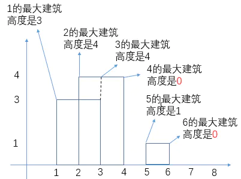
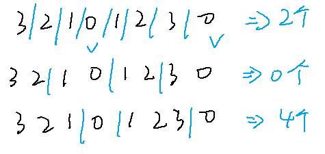
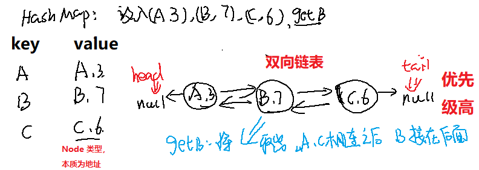
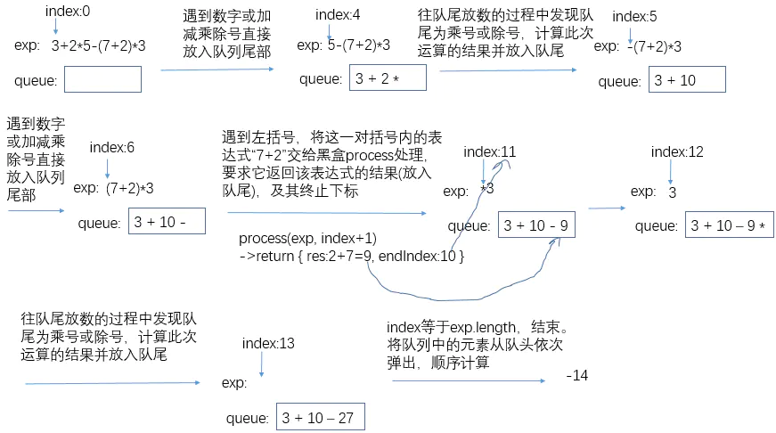
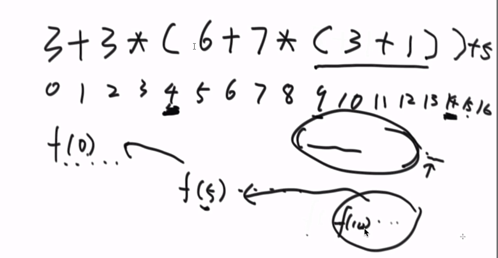

# AlgorithmMediumDay04

[TOC]

## 一、The Skyline Problem（大楼轮廓线问题）

【**问题**】给定一个 N 行 3 列二维数组，每一行表示有一座大楼，一共有 N 座大楼。 所有大楼的底部都坐落在 X 轴上，每一行的三个值 (a,b,c) 代表每座大楼的从 (a,0) 点开始，到 (b,0) 点结束，高度为 c。 输入的数据可以保证a < b, 且 a，b，c 均为正数。大楼之间可以有重合。 请输出整体的轮廓线。

【**示例**】给定一个二维数组 [ [1, 3, 3], [2, 4, 4], [5, 6,1] ]
输出为轮廓线 [ [1, 2, 3], [2, 4, 4], [5, 6, 1] ]


【算法解析】

1. 将一座楼的表示`[start,end,height]`拆分成左右两个边界（每个边界包含：所处下标、边界高度、是楼的左边界还是右边界），比如`[1,3,3]`就可以拆分成`[1,3,true]`和`[3,3,false]`的形式（`true`代表左边界、`false`代表右边界）。

2. 将每座楼都拆分成两个边界，然后对边界**按照边界所处的下标**进行排序。比如`[[1,3,3],[2,4,4],[5,6,1]`拆分之后为`[[1,3,true],[3,3,false],[2,4,true],[,4,4,false],[5,1,true],[6,1,false]]`，排序后为`[[1,3,true],[2,4,true],[3,3,false],[4,4,false],[5,1,true],[6,1,false]]`

3. 将边界排序后，遍历**每个边界的高度**并依次加入到一棵`TreeMap`红黑树中（记为`countOfH`），以**该高度出现的次数作为键值**（第一次添加的高度键值为1），如果遍历过程中有重复的边界高度添加，要判断它是左边界还是右边界，前者直接将该高度在红黑树中的键值加1，后者则减1。以步骤 2 中排序后的边界数组为例，首先判断`countOfH`是否添加过边界`[1,3,true]`的高度`3`，发现没有，于是`put(3,1)`；接着对`[2,4,true]`，`put[4,1]`；然后尝试添加`[3,3,false]`的`3`，发现`countOfH`中添加过`3`，而`[3,3,false]`是右边界，因此将`countOfH.get(3)`的次数减1，当`countOfH`中的记录的键值为 0 时直接移除，于是移除高度为3的这一条记录；……

    对于遍历过程经过的每一个边界，我们还需要一棵`TreeMap`红黑树（记为`maxHOfPos`）来记录对我们后续求外轮廓线有用的信息，也就是每个边界所处下标的最大建筑高度：

    

    

    

    这里有个细节要注意一下，那就是如果添加某个边界之后，`countOfH`树为空了，那么该边界所处下标的建筑高度要记为0，表示一片相邻建筑的结束，比如上图中下标为4和6的边界。这也是为了后续求外轮廓线提供判断的依据。

4. 遍历`maxHOfPos`中的记录，构造整个外轮廓线数组：

    

    

    

    起初没有遍历边界时，记`start=0,height=0`，接着遍历边界，如果边界高度`curHeight!=height`如上图中的`1->2：height=0,curHeight=3`，那么记`start=1,height=3`表示第一条组外轮廓线的`start`和`height`，接下来就是确定它的`end`了。确定了一条轮廓线的`start`和`height`之后会有两种情况：下一组轮廓线和这一组是挨着的（如上图`2->3`）、下一组轮廓线和这一组是相隔的（如上图中`3->4`）。因此在遍历到边界`[index:2,H:4]`时，发现`curHeight=4 != height=3`，于是可以确定轮廓线`start:1,heigth:3`的`end:2`。确定一条轮廓线后就要更新一下`start=2,heigth=4`表示下一组轮廓线的起始下标和高度，接着遍历到边界`[index:3,H:4]`，发现`curHeight=4=height`于是跳过；接着遍历到边界`[index:4,H:0]`，发现`curHeight=0`，根据步骤3中的逻辑可知一片相邻的建筑到此结束了，因此轮廓线`start:2,height:4`的`end=4`。

示例代码：

```java
package com.gjxaiou.advanced.day04;

import java.util.*;
import java.util.Map.Entry;

public class BuildingOutline {
    // （位置，高度，上还是下）结构
    public static class Node {
        public boolean isUp;
        public int position;
        public int height;

        public Node(boolean bORe, int position, int height) {
            isUp = bORe;
            this.position = position;
            this.height = height;
        }
    }

    public static class NodeComparator implements Comparator<Node> {
        @Override
        public int compare(Node o1, Node o2) {
            if (o1.position != o2.position) {
                return o1.position - o2.position;
            }
            // 排序时候如果同一个位置出现有下有上，则上的在前面，下的在后面
            if (o1.isUp != o2.isUp) {
                return o1.isUp ? -1 : 1;
            }
            return 0;
        }
    }

    public static List<List<Integer>> buildingOutline(int[][] buildings) {
        Node[] nodes = new Node[buildings.length * 2];
        for (int i = 0; i < buildings.length; i++) {
            // 防止放置信息覆盖
            nodes[i * 2] = new Node(true, buildings[i][0], buildings[i][2]);
            nodes[i * 2 + 1] = new Node(false, buildings[i][1], buildings[i][2]);
        }
        // NOde 之间只按照位置排序
        Arrays.sort(nodes, new NodeComparator());
        // key 为高度， value 为该高度出现的次数
        TreeMap<Integer, Integer> htMap = new TreeMap<>();
        TreeMap<Integer, Integer> pmMap = new TreeMap<>();
        for (int i = 0; i < nodes.length; i++) {
            // 如果是 UP
            if (nodes[i].isUp) {
                // 如果之前没有出现过该高度，则加入，并且记录出现次数为 1
                if (!htMap.containsKey(nodes[i].height)) {
                    htMap.put(nodes[i].height, 1);
                } else {
                    // 不是第一次出现，则放入该高度，次数为之前出现次数 + 1；
                    htMap.put(nodes[i].height, htMap.get(nodes[i].height) + 1);
                }
            } else {
                if (htMap.containsKey(nodes[i].height)) {
                    // 只有一次，词频为 1，剪完就直接删除了
                    if (htMap.get(nodes[i].height) == 1) {
                        htMap.remove(nodes[i].height);
                    } else {
                        htMap.put(nodes[i].height, htMap.get(nodes[i].height) - 1);
                    }
                }
            }
            if (htMap.isEmpty()) {
                // pmMap 记录每一个出现位置的最大高度（就是加入结点之后看 TreeMap 中的最大高度值），用于看最大高度是否变化后面计算边界
                pmMap.put(nodes[i].position, 0);
            } else {
                pmMap.put(nodes[i].position, htMap.lastKey());
            }
        }
        List<List<Integer>> res = new ArrayList<>();
        // 默认该开始高度为 0
        int start = 0;
        int height = 0;
        // 因为是 TreeMap，所以拿出的值是依次升序的，所以位置小的先遍历
        for (Entry<Integer, Integer> entry : pmMap.entrySet()) {
            int curPosition = entry.getKey();
            int curMaxHeight = entry.getValue();
            // 之前的高度不等于现在高度
            if (height != curMaxHeight) {
                // 如果之前高度不为 0 ，并且变化了，说明一条轮廓线要收尾了
                if (height != 0) {
                    List<Integer> newRecord = new ArrayList<Integer>();
                    newRecord.add(start);
                    newRecord.add(curPosition);
                    newRecord.add(height);
                    res.add(newRecord);
                }
                // 如果不为 0 ，则相当于一条轮廓线刚刚起来，没有终止位置，所以没法记录
                start = curPosition;
                height = curMaxHeight;
            }
        }
        return res;
    }

    public static void main(String[] args) {
        int[][] arr = {{1, 3, 3}, {2, 4, 4}, {5, 6, 1}};
        List<List<Integer>> lists = buildingOutline(arr);
        Iterator<List<Integer>> iterator = lists.iterator();
        while (iterator.hasNext()) {
            System.out.println(iterator.next());
        }
    }
}
```

程序输出结果为：

```java
[1, 2, 3]
[2, 4, 4]
[5, 6, 1]
```


## 二、累加和为定值的最长子数组

【**题目**】

给定一个数组 arr（**可正、负、零**），和一个整数 num，求在 arr 中，累加和等于num 的最长子数组的长度。

【**示例**】

arr = {7,3,2,1,1,7,7,7} ，num = 7
其中有很多的子数组累加和等于 7，但是最长的子数组是 {3,2,1,1}，所以返回其长度 4。

【**解答**】

求得以每一个位置结尾的累加和为该数的子数组，最终答案必在其中。

思路：比如 aim  为 800，现在首先求得从 0 位置到 i 位置所有元素的和 sum，这里例如从 0 到 1000 和为 2000，则如果要求 1000 及其往前和为 800 的子数组，只要求从 0 开始到那个位置连续值为 1200 即可。

**示例**：以数组：`[7,3,2,1,1,7,-6,-1,7]` 为例，`aim` 为 `7`，首先准备一个 `map`，里面首先包含一个元素`{0,-1}`，表示 `0` 这个累加和最早出现在 `-1` 位置（因为一个数都没有的时候也可以累加出零），首先到 `0` 位置的 `7`，此时 `sum = 7`，在 Map 中找 `sum - aim` 最早出现在什么位置，从 `map` 中看出 `0` 最早出现在 `-1` 位置，所以从 `-1` 的下一个位置到当前位置累加和为 `7`，所以 必须以 `0` 结尾的情况下最长子数组为 `0 ~ 0`，长度为 `1` 。 因为 Map 中没有新出现的累加和为 `7` 的记录，所以将 `7 ，0` 加入 `map` 中，到 `1` 位置之后 `sum = 10` ，在 `map` 中查找 `sum - aim = 3` 这个累加和最早出现的位置，发现 `map` 中没有，所以以 `3` 结尾不可能累加出累加和为 `7` 的子数组，然后将新出现的累加和和最早出现的位置 `1` 放入 map 中，。。。。。注：如果一个累加和在 map 中已经有了则不变。

```java
package com.gjxaiou.advanced.day04;

import java.util.HashMap;

/**
 * @author GJXAIOU
 * 累加和为定值的最长子数组
 */
public class LongestSumSubArrayLength {

    public static int maxLength(int[] arr, int aim) {
        if (arr == null || arr.length == 0) {
            return 0;
        }
        // key：累加和的值，value：该累加和最早出现的位置
        HashMap<Integer, Integer> map = new HashMap<Integer, Integer>();
        map.put(0, -1);
        int maxLength = 0;
        int sum = 0;
        for (int i = 0; i < arr.length; i++) {
            sum += arr[i];
            if (map.containsKey(sum - aim)) {
                maxLength = Math.max(i - map.get(sum - aim), maxLength);
            }
            if (!map.containsKey(sum)) {
                map.put(sum, i);
            }
        }
        return maxLength;
    }
}
```


### （二）问题变形：求数组中奇偶数相同个数的最长子数组，某两个数数目相等的最长子数组，异或和为 0 的最长子数组

- 数组中都是整数，有奇数和偶数，求奇数和偶数个数相等的最长子数组，相当于将奇数变为 1，偶数变为 -1 ，求累加和为 0 的最长子数组即可。

- 数组中含有 0,1,2 求数组中含有1 的数目和 2 的数目相等的最长子数组，相当于将 2 变为-1 ，求累加和为 0 的最长子数组。

- 定义数组的异或和的概念：
    **数组中所有的数异或起来，得到的结果叫做数组的异或和**，比如数组{3,2,1}的异或和是，3^2^1 = 0
    给定一个数组arr，你可以任意把 arr 分成很多不相容的子数组，你的目的是：分出来的子数组中，异或和为 0的子数组最多。
    请返回：分出来的子数组中，异或和为 0 的子数组最多是多少？



异或满足结合律和交换律：`0 ^ n = n; n ^ n = 0`

假设 `0 ~ i` 位置上存在一种最优划分方式，则存在两种可能性


- `i` 位置所在区域不满足异或和为 `0` 的子数组，则  `0 ~ i` 上满足异或和为 `0` 的子数组数量和 `0  ~  i-1` 上满足的数目相同；

- 如果 `i` 作为最优划分的一个部分，而该部分是从 `k`  开始的（如果 `k ….i` 中存在 `j` 到 `i` 是符合条件的，即异或和为 `0`，则该 `k … i  `不是最优划分），那么  `k`  位置就是距离 `i` 最近的 从 `K` 到 `i` 异或和 `0` 的部分。

    则如果假设 `0 ~ i` 的异或和为 `sum`，因为 `k …i` 的异或和为 `0`，则 `k`  位置就是前面异或和为 `sum` 的最晚位置的后一个位置。 缩减为 `0 ~ k-1` 位置上的最优划分。

所以汇总公式：$$dp[i] = \begin{cases} dp[i - 1] \\ dp[k - 1] + 1 \end{cases}$$

```java
package com.gjxaiou.advanced.day04;

import java.util.HashMap;

public class MostEOR {

    public static int mostEOR(int[] arr) {
        int res = 0;
        int xor = 0;
        int[] dp = new int[arr.length];
        HashMap<Integer, Integer> map = new HashMap<>();
        map.put(0, -1);

        for (int i = 0; i < arr.length; i++) {
            xor ^= arr[i];
            if (map.containsKey(xor)) {
                int pre = map.get(xor);
                dp[i] = pre == -1 ? 1 : (dp[pre] + 1);
            }
            if (i > 0) {
                dp[i] = Math.max(dp[i - 1], dp[i]);
            }
            map.put(xor, i);
            res = Math.max(res, dp[i]);
        }
        return res;
    }

    // for test
    public static int comparator(int[] arr) {
        if (arr == null || arr.length == 0) {
            return 0;
        }
        int[] eors = new int[arr.length];
        int eor = 0;
        for (int i = 0; i < arr.length; i++) {
            eor ^= arr[i];
            eors[i] = eor;
        }
        int[] mosts = new int[arr.length];
        mosts[0] = arr[0] == 0 ? 1 : 0;
        for (int i = 1; i < arr.length; i++) {
            mosts[i] = eors[i] == 0 ? 1 : 0;
            for (int j = 0; j < i; j++) {
                if ((eors[i] ^ eors[j]) == 0) {
                    mosts[i] = Math.max(mosts[i], mosts[j] + 1);
                }
            }
            mosts[i] = Math.max(mosts[i], mosts[i - 1]);
        }
        return mosts[mosts.length - 1];
    }

    // for test
    public static int[] generateRandomArray(int maxSize, int maxValue) {
        int[] arr = new int[(int) ((maxSize + 1) * Math.random())];
        for (int i = 0; i < arr.length; i++) {
            arr[i] = (int) ((maxValue + 1) * Math.random());
        }
        return arr;
    }

    // for test
    public static void printArray(int[] arr) {
        if (arr == null) {
            return;
        }
        for (int i = 0; i < arr.length; i++) {
            System.out.print(arr[i] + " ");
        }
        System.out.println();
    }

    // for test
    public static void main(String[] args) {
        int testTime = 500000;
        int maxSize = 300;
        int maxValue = 100;
        boolean succeed = true;
        for (int i = 0; i < testTime; i++) {
            int[] arr = generateRandomArray(maxSize, maxValue);
            int res = mostEOR(arr);
            int comp = comparator(arr);
            if (res != comp) {
                succeed = false;
                printArray(arr);
                System.out.println(res);
                System.out.println(comp);
                break;
            }
        }
        System.out.println(succeed ? "Nice!" : "Error!");
    }
}
```


## 四、设计可以变更的缓存结构（LRU） 

【**题目**】设计一种缓存结构，该结构在构造时确定大小，假设大小为 K，并有两个功能：`set(key,value)`：将记录`(key,value)`插入该结构。`get(key)`：返回 key 对应的 value 值。

【要求】

- set 和 get 方法的时间复杂度为 O(1)。
- 某个 key 的 set 或 get 操作一旦发生，认为这个 key 的记录成了最经常使用的。
- 当缓存的大小超过 K 时，移除最不经常使用的记录，即 set 或 get 最久远的。

【举个栗子】

假设缓存结构的实例是 cache，大小为 3，并依次发生如下行为：

1. cache.set("A",1)。最经常使用的记录为("A",1)。
2. cache.set("B",2)。最经常使用的记录为("B",2)，("A",1)变为最不经常的。
3. cache.set("C",3)。最经常使用的记录为("C",2)，("A",1)还是最不经常的。
4. cache.get("A")。最经常使用的记录为("A",1)，("B",2)变为最不经常的。
5. cache.set("D",4)。大小超过了3，所以移除此时最不经常使用的记录("B",2)，加入记录 ("D",4)，并且为最经常使用的记录，然后("C",3)变为最不经常使用的记录

【设计思路】：使用一个哈希表和双向链表





```java
package com.gjxaiou.advanced.day04;

import java.util.HashMap;

public class LRU {

    public static class Node<K, V> {
        public K key;
        public V value;
        public Node<K, V> last;
        public Node<K, V> next;

        public Node(K key, V value) {
            this.key = key;
            this.value = value;
        }
    }

    public static class NodeDoubleLinkedList<K, V> {
        private Node<K, V> head;
        private Node<K, V> tail;

        public NodeDoubleLinkedList() {
            this.head = null;
            this.tail = null;
        }

        // 自定义双向链表添加结点操作
        public void addNode(Node<K, V> newNode) {
            if (newNode == null) {
                return;
            }
            if (this.head == null) {
                this.head = newNode;
                this.tail = newNode;
            } else {
                this.tail.next = newNode;
                newNode.last = this.tail;
                this.tail = newNode;
            }
        }

        // 将给定的节点移动到链表的尾部
        public void moveNodeToTail(Node<K, V> node) {
            if (this.tail == node) {
                return;
            }
            // 头结点处理
            if (this.head == node) {
                this.head = node.next;
                this.head.last = null;
                // 普通结点处理
            } else {
                node.last.next = node.next;
                node.next.last = node.last;
            }
            node.last = this.tail;
            node.next = null;
            this.tail.next = node;
            this.tail = node;
        }

        // 移除头部结点
        public Node<K, V> removeHead() {
            if (this.head == null) {
                return null;
            }
            Node<K, V> res = this.head;
            // 只有一个结点情况下
            if (this.head == this.tail) {
                this.head = null;
                this.tail = null;
                // 不止一个结点的情况下
            } else {
                this.head = res.next;
                res.next = null;
                this.head.last = null;
            }
            return res;
        }
    }

    /**
     * 注意：注意：注意：当 map<key, value> 中 key 和 value 是基本数据类型或者 string 类型的时候，map
     * 中存放的是值，如果是自定义数据类型，存放的是内存地址（一个引用）。
     *
     * @param <K>
     * @param <V>
     */
    public static class MyCache<K, V> {
        private HashMap<K, Node<K, V>> keyNodeMap;
        private NodeDoubleLinkedList<K, V> nodeList;
        private int capacity;

        public MyCache(int capacity) {
            if (capacity < 1) {
                throw new RuntimeException("should be more than 0.");
            }
            this.keyNodeMap = new HashMap<K, Node<K, V>>();
            this.nodeList = new NodeDoubleLinkedList<K, V>();
            this.capacity = capacity;
        }

        public V get(K key) {
            if (this.keyNodeMap.containsKey(key)) {
                Node<K, V> res = this.keyNodeMap.get(key);
                // 在上面得到 Node 之后，然后下面在双向链表中将 Node 移动到尾部
                this.nodeList.moveNodeToTail(res);
                return res.value;
            }
            return null;
        }

        public void set(K key, V value) {
            if (this.keyNodeMap.containsKey(key)) {
                Node<K, V> node = this.keyNodeMap.get(key);
                // 将该结点值赋值为新值
                node.value = value;
                // 进行 set，将优先级提到最后
                this.nodeList.moveNodeToTail(node);
            } else {
                // 如果没有该结点，新建 Node，然后装入 Key - value
                Node<K, V> newNode = new Node<K, V>(key, value);
                // 在 Map 和双向链表中加入该结点
                this.keyNodeMap.put(key, newNode);
                this.nodeList.addNode(newNode);
                // 如果发现 map 大小超了，移除尾部的节点
                if (this.keyNodeMap.size() == this.capacity + 1) {
                    this.removeMostUnusedCache();
                }
            }
        }

        // 超过长度删除尾部，增加新节点
        private void removeMostUnusedCache() {
            // 删除 Node 在双向链表中位置
            Node<K, V> removeNode = this.nodeList.removeHead();
            // 删除 Map 中节点
            K removeKey = removeNode.key;
            this.keyNodeMap.remove(removeKey);
        }
    }

    public static void main(String[] args) {
        MyCache<String, Integer> testCache = new MyCache<String, Integer>(3);
        testCache.set("A", 1);
        testCache.set("B", 2);
        testCache.set("C", 3);
        System.out.println(testCache.get("B"));
        System.out.println(testCache.get("A"));
        testCache.set("D", 4);
        System.out.println(testCache.get("D"));
        System.out.println(testCache.get("C"));
    }
}
```


## 五、LFU

【**题目**】LFU 也是一种经典的缓存结构，只不过它是以`key`的访问频度作为缓存替换依据的。以 O(1) 的时间复杂度实现 set 和 get 方法。

举例：`set("A",Data)`将会在LFU结构中放入一条key为“A”的记录，并将该记录的使用频度置为1，后续的`set("A",newData)`或`get("A")`都会将该key对应的记录的使用频度加1；当该结构容量已满还尝试往里添加记录时，会先将结构中使用频度最少的记录删除，再将新的记录添加进去。

【设计思路】：使用一个哈希表和一个二维双向链表（链表中包含链表）


代码：

```java
package com.gjxaiou.advanced.day04;

import java.util.HashMap;

public class LFU {

    // 这是竖着挂着的小链表结构
    public static class Node {
        public Integer key;
        public Integer value;
        public Integer times;
        public Node up;
        public Node down;

        public Node(int key, int value, int times) {
            this.key = key;
            this.value = value;
            this.times = times;
        }
    }

    public static class LFUCache {
        // 包括横向对应的头结点的整个竖着的链表结构，包含上面的 Node 节点
        public static class NodeList {
            public Node head;
            public Node tail;
            public NodeList last;
            public NodeList next;

            public NodeList(Node node) {
                head = node;
                tail = node;
            }

            public void addNodeFromHead(Node newHead) {
                newHead.down = head;
                head.up = newHead;
                head = newHead;
            }

            public boolean isEmpty() {
                return head == null;
            }

            // 删掉 NodeList 这一个竖串中任意一个结点，例如中间某个结点使用 get 操作之后， times + 1，即从当前 NodeList 中删除然后加到下一个
            //NodeList 中。
            public void deleteNode(Node node) {
                // 仅剩唯一一个结点的时候
                if (head == tail) {
                    head = null;
                    tail = null;
                } else {
                    // 如果为头指针，换头
                    if (node == head) {
                        head = node.down;
                        head.up = null;
                        // 如果为尾指针，换尾
                    } else if (node == tail) {
                        tail = node.up;
                        tail.down = null;
                        // 如果为中间节点，则将该结点上下结点指针连接好即可
                    } else {
                        node.up.down = node.down;
                        node.down.up = node.up;
                    }
                }
                // 将结点与整个链表关联性删除
                node.up = null;
                node.down = null;
            }
        }


        private int capacity;
        private int size;
        // key（Integer）对应一个 Node
        private HashMap<Integer, Node> records;
        private HashMap<Node, NodeList> heads;
        // 记录整个大双向链表 NodeList 的头部，因为头部并不一定就是词频为 1 的 NodeList，因为如果词频为 1 的 Node 都没有，则整个词频为 1
        //的 NodeList 也就删除了。
        private NodeList headList;

        public LFUCache(int capacity) {
            this.capacity = capacity;
            this.size = 0;
            this.records = new HashMap<>();
            this.heads = new HashMap<>();
            headList = null;
        }

        public void set(int key, int value) {
            // 如果该 key 存在，通过该 key 将 Node 的内存地址拿出，就可以访问到 Node 结构
            if (records.containsKey(key)) {
                Node node = records.get(key);
                node.value = value;
                node.times++;
                // 该 Node 属于原来的哪个 NodeList
                NodeList curNodeList = heads.get(node);
                // 将该 Node 移动到原来 NodeList + 1 位置上；
                move(node, curNodeList);
            } else {
                // 如果达到容量，需要将整个 NodeList 的头部的大 List 下面挂载的尾结点删除
                if (size == capacity) {
                    Node node = headList.tail;
                    headList.deleteNode(node);
                    // 移除元素之后涉及到原来 NodeList 中可能没有元素换头，以及后加入元素也要换头问题（只原来最小是 2 次出现，然后新加一个
                    //Node，不仅需要创建词频为 1 的 NodeList，还要将原来指向 3  的 headList 指向 1）
                    modifyHeadList(headList);
                    // 消除该结点影响
                    records.remove(node.key);
                    heads.remove(node);
                    size--;
                }
                // 如果没有改元素，新建 Node 并且赋值
                Node node = new Node(key, value, 1);
                // 如果没有 headList，新建并将 Node 放入
                if (headList == null) {
                    headList = new NodeList(node);
                } else {
                    // 如果 NodeList 中有该词频的链表，直接挂在上面即可
                    if (headList.head.times.equals(node.times)) {
                        headList.addNodeFromHead(node);
                    } else {
                        // 新建大头 NodeList，然后挂入
                        NodeList newList = new NodeList(node);
                        newList.next = headList;
                        headList.last = newList;
                        headList = newList;
                    }
                }
                records.put(key, node);
                heads.put(node, headList);
                size++;
            }
        }

        private void move(Node node, NodeList oldNodeList) {
            // 从老链表中删除该 Node
            oldNodeList.deleteNode(node);
            // 原 NodeList 为 3 - 4 - 6 ，如果get NodeList 4 下面元素，如果 get 之后还有元素，则是在 4 和 6 直接新建 5，然后4 -
            //5 -6，如果 get 之后没有元素了，则新建 5，然后是 3 - 5 - 6
            // preList 是 oldNodeList 的前一个，如果 modifyHeadList（）为真，则新的链表的前面 NodeList 为老链表的前一个
            //NodeList，否则就是 oldNodeList 本身
            NodeList preList = modifyHeadList(oldNodeList) ? oldNodeList.last
                    : oldNodeList;
            NodeList nextList = oldNodeList.next;
            // 如果 nextList 为空，则 oldNodeList 就是整个大链表的尾部
            if (nextList == null) {
                // 新建 NodeList，然后挂上 Node
                NodeList newList = new NodeList(node);
                // 大链表重连
                if (preList != null) {
                    preList.next = newList;
                }
                newList.last = preList;
                if (headList == null) {
                    headList = newList;
                }
                // Node 放入新的 NodeList 中
                heads.put(node, newList);
            } else {
                // 原链表后面存在当前词频的 + 1
                if (nextList.head.times.equals(node.times)) {
                    nextList.addNodeFromHead(node);
                    heads.put(node, nextList);
                } else {
                    // 新建一个 +1 词频的 NodeList，然后重连
                    NodeList newList = new NodeList(node);
                    if (preList != null) {
                        preList.next = newList;
                    }
                    newList.last = preList;
                    newList.next = nextList;
                    nextList.last = newList;
                    if (headList == nextList) {
                        headList = newList;
                    }
                    heads.put(node, newList);
                }
            }
        }

        // Node 删除之后，判断这个 NodeList 是否也需要删除
        private boolean modifyHeadList(NodeList nodeList) {
            // 如果 NodeList 不为空，直接返回 false，如果为空则需要删除
            if (nodeList.isEmpty()) {
                // 如果该 NodeList 正好是整个大链表的头部，
                if (headList == nodeList) {
                    // 首先将头指向老头部的下一个
                    headList = nodeList.next;
                    // 如果不为空，这里的 headList 已经是新头部了，让其前指向空
                    if (headList != null) {
                        headList.last = null;
                    }
                } else {
                    // 如果是大链表中间元素，将整个 NodeList 前后直接连接即可
                    nodeList.last.next = nodeList.next;
                    if (nodeList.next != null) {
                        nodeList.next.last = nodeList.last;
                    }
                }
                return true;
            }
            return false;
        }

        public int get(int key) {
            // 不存在就返回空
            if (!records.containsKey(key)) {
                return -1;
            }
            Node node = records.get(key);
            node.times++;
            NodeList curNodeList = heads.get(node);
            move(node, curNodeList);
            return node.value;
        }
    }
}
```


## 六、求数学表达式的值

【**题目**】给定一个字符串 `str`，`str` 表示一个公式，公式里可能有整数、加减乘除符号和左右括号，返回公式的计算结果。

【**举例**】

- `str="48*((70-65)-43)+8*1"`，返回 -1816；
- `str="3+1*4"`，返回 7；
- `str="3+(1*4)"`，返回 7；

【**说明**】

1. 可以认为给定的字符串一定是正确的公式，即不需要对 str 做公式有效性检查。
2. 如果是负数，就需要用括号括起来，比如`"4*(-3)"`。但如果负数作为公式的开头或括号部分的开头，则可以没有括号，比如`"-3*4"和"(-3)*4"`都是合法的。
3. 不用考虑计算过程中会发生溢出的情况

最优解分析：此题的难度在于如何处理表达式中的括号，可以借助一个栈。但如果仅仅靠一个栈，代码量会显得纷多繁杂。如果我们将式中包含左右括号的子表达式的计算单独抽出来作为一个过程（记为`process`），那么该过程可以被复用，如果我们将整个表达式中所有包含左右括号的子表达式当做一个数值，那么原始问题就转化为计算不含括号的表达式了。

以表达式`3+2*5-(7+2)*3`为例分析解题步骤：



- 整个式子中没有小括号

    准备一个栈，里面放入数和符号，放入数前如果当前栈顶元素为 `*` 或者 `/`，则先将栈顶符号和栈顶下面一位数字拿出与当前数字先元素然后放入。

    

-  有小括号的情况

    遇到左括号就使用下一个过程

    


示例代码：

```java
package com.gjxaiou.advanced.day04;

import java.util.LinkedList;

public class ExpressionCompute {

    // 方法入口
    public static int getValue(String str) {
        return value(str.toCharArray(), 0)[0];
    }

    /**
     * 递归函数
     *
     * @param str
     * @param i   当前是从哪个位置开始的
     * @return 返回数组，长度为 2，arr[0] 表示计算结果，arr[1] 表示算到哪个位置，便于返回之后主过程知道从哪里继续开始计算
     */
    public static int[] value(char[] str, int i) {
        LinkedList<String> que = new LinkedList<String>();
        int pre = 0;
        int[] bra = null;
        // 到数组结尾或者遇到 ） 就停止返回结果
        while (i < str.length && str[i] != ')') {
            // 如果遇到数字要一直收集，因为上面使用 toCharArray()，会把一个完整的数字切分开
            if (str[i] >= '0' && str[i] <= '9') {
                pre = pre * 10 + str[i++] - '0';
                // 不是数字了，也不是 （，开始又规定不是结尾，不是 ），所以只能遇到运算符 + - * /
            } else if (str[i] != '(') {
                // 把形成的数放入栈中
                addNum(que, pre);
                // 放入当前的运算符
                que.addLast(String.valueOf(str[i++]));
                pre = 0;
                // 遇到了 （，当前位置为 i 位置
            } else {
                bra = value(str, i + 1);
                pre = bra[0];
                // 相当于从 ）后面一个位置开始计算
                i = bra[1] + 1;
            }
        }
        addNum(que, pre);
        return new int[]{getNum(que), i};
    }


    public static void addNum(LinkedList<String> que, int num) {
        if (!que.isEmpty()) {
            int cur = 0;
            // 如果栈的最上面是 +  或者 — ，则弹出再放入，即相当于不同
            String top = que.pollLast();
            if (top.equals("+") || top.equals("-")) {
                que.addLast(top);
                // 只能是乘除符号了
            } else {
                // 上面已经弹出最上面的符号了，在弹出一个就是数字值了
                cur = Integer.valueOf(que.pollLast());
                // 将传入的值和弹出的值进行乘除运算然后再次放入
                num = top.equals("*") ? (cur * num) : (cur / num);
            }
        }

        que.addLast(String.valueOf(num));
    }

    public static int getNum(LinkedList<String> que) {
        int res = 0;
        boolean add = true;
        String cur = null;
        int num = 0;
        while (!que.isEmpty()) {
            cur = que.pollFirst();
            if (cur.equals("+")) {
                add = true;
            } else if (cur.equals("-")) {
                add = false;
            } else {
                num = Integer.valueOf(cur);
                res += add ? num : (-num);
            }
        }
        return res;
    }

    public static void main(String[] args) {
        String exp = "48*((70-65)-43)+8*1";
        System.out.println(getValue(exp));

        exp = "4*(6+78)+53-9/2+45*8";
        System.out.println(getValue(exp));

        exp = "10-5*3";
        System.out.println(getValue(exp));

        exp = "-3*4";
        System.out.println(getValue(exp));

        exp = "3+1*4";
        System.out.println(getValue(exp));
    }
}
```
