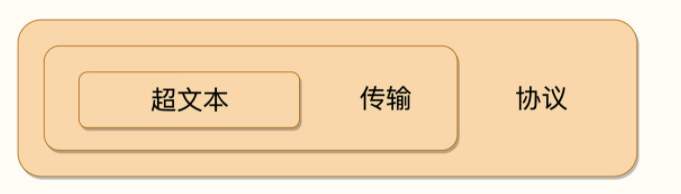
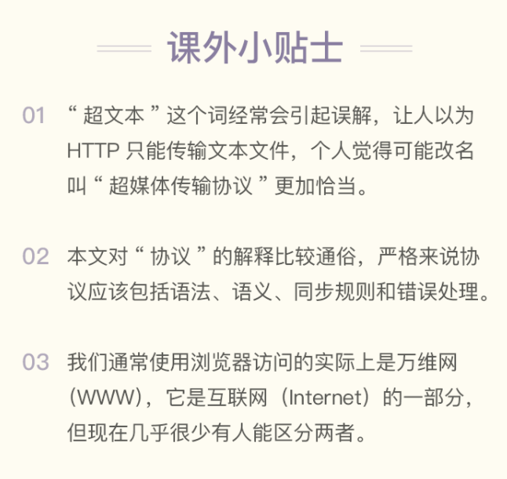

# 02 | HTTP是什么？HTTP又不是什么？

首先我来问出这个问题：「你觉得 HTTP 是什么呢？」

你可能会不假思索、脱口而出：「HTTP 就是超文本传输协议，也就是**H**yper**T**ext **T**ransfer **P**rotocol。」

不过让我们换个对话场景，假设不是我，而是由一位面试官问出刚才的问题呢？

显然，这个答案有点过于简单了，不能让他满意，他肯定会再追问你一些问题：

- 你是怎么理解 HTTP 字面上的「超文本」和「传输协议」的？
- 能否谈一下你对 HTTP 的认识？越多越好。
- HTTP 有什么特点？有什么优点和缺点？
- HTTP 下层都有哪些协议？是如何工作的？
- ……

几乎所有面试时问到的 HTTP 相关问题，都可以从这个最简单的「HTTP 是什么？」引出来。

所以，今天深度地解答一下「**HTTP 是什么？**」，以及**HTTP 不是什么？**」

## HTTP 是什么
先看一下 HTTP 的名字：「**超文本传输协议**」，它可以拆成三个部分，分别是：「**超文本**」「**传输**」和「**协议**」。我们从后往前来逐个解析，理解了这三个词，我们也就明白了什么是 HTTP。

首先，HTTP 是一个**协议**。不过，「协议」有什么特点呢？

第一点，协议必须要有两个或多个参与者，即「协」。

如果**只有**你一个人，那你自然可以想干什么就干什么，不会干涉其他人，其他人也不会干涉你，也就不需要所谓的「协议」。但是，一旦有了两个以上的参与者出现，为了保证最基本的顺畅交流，协议就自然而然地出现了。

例如，为了保证你顺利就业，「三方协议」里的参与者有三个：你、公司和学校；为了保证你顺利入住，「租房协议」里的参与者有两个：你和房东。

第二点，协议是对参与者的一种行为约定和规范，也就是「议」。

协议意味着有多个参与者为了达成某个共同的目的而站在了一起，除了要无疑义地沟通交流之外，还必须明确地规定各方的「责、权、利」，约定该做什么不该做什么，先做什么后做什么，做错了怎么办，有没有补救措施等等。

好，到这里，你应该能够明白 HTTP 的第一层含义了。

== HTTP 是一个用在计算机世界里的协议。它使用计算机能够理解的语言确立了一种计算机之间交流通信的规范，以及相关的各种控制和错误处理方式==。

接下来我们看 HTTP 字面里的第二部分：「**传输**」。

计算机和网络世界里有数不清的各种角色：CPU、内存、总线、磁盘、操作系统、浏览器、网关、服务器……这些角色之间相互通信也必然会有各式各样、五花八门的协议，用处也各不相同，例如广播协议、寻址协议、路由协议、隧道协议、选举协议等等。

HTTP 是一个「**传输协议**」，所谓的「传输」（Transfer）其实很好理解，就是把一堆东西从 A 点搬到 B 点，或者从 B 点搬到 A 点，即「A<===>B」。

别小看了这个简单的动作，它也至少包含了两项重要的信息。

第一点，HTTP 协议是一个「**双向协议**」。

也就是说，有两个最基本的参与者 A 和 B，从 A 开始到 B 结束，数据在 A 和 B 之间双向而不是单向流动。通常我们把先发起传输动作的 A 叫做**请求方**，把后接到传输的 B 叫做**应答方**或者**响应方**。拿我们最常见的上网冲浪来举例子，浏览器就是请求方 A，网易、新浪这些网站就是应答方 B。双方约定用 HTTP 协议来通信，于是浏览器把一些数据发送给网站，网站再把一些数据发回给浏览器，最后展现在屏幕上，你就可以看到各种有意思的新闻、视频了。

第二点，数据虽然是在 A 和 B 之间传输，但并没有限制只有 A 和 B 这两个角色，允许中间有「中转」或者「接力」。

这样，传输方式就从「A<===>B」，变成了「A<=>X<=>Y<=>Z<=>B」，A 到 B 的传输过程中可以存在任意多个「中间人」，而这些中间人也都遵从 HTTP 协议，只要不打扰基本的数据传输，就可以添加任意的额外功能，例如安全认证、数据压缩、编码转换等等，优化整个传输过程。

说到这里，你差不多应该能够明白 HTTP 的第二层含义了。

== HTTP 是一个在计算机世界里专门用来在两点之间传输数据的约定和规范==。

讲完了「协议」和「传输」，现在，我们终于到 HTTP 字面里的第三部分：「**超文本**」。

既然 HTTP 是一个「传输协议」，那么它传输的「超文本」到底是什么呢？我还是用两点来进一步解释。

==所谓「**文本**」（Text），就表示 HTTP 传输的不是 TCP/UDP 这些底层协议里被切分的杂乱无章的二进制包（datagram），而是完整的、有意义的数据，可以被浏览器、服务器这样的上层应用程序处理==。

在互联网早期，「文本」只是简单的字符文字，但发展到现在，「文本」的涵义已经被大大地扩展了，图片、音频、视频、甚至是压缩包，在 HTTP 眼里都可以算做是「文本」。

所谓「**超文本**」，就是「超越了普通文本的文本」，它是文字、图片、音频和视频等的混合体，==最关键的是含有「超链接」，能够从一个「超文本」跳跃到另一个「超文本」 ==，形成复杂的非线性、网状的结构关系。

对于「超文本」，我们最熟悉的就应该是 HTML 了，它本身只是纯文字文件，但内部用很多标签定义了对图片、音频、视频等的链接，再经过浏览器的解释，呈现在我们面前的就是一个含有多种视听信息的页面。

OK，经过了对 HTTP 里这三个名词的详细解释，下次当你再面对面试官时，就可以给出比「超文本传输协议」这七个字更准确更有技术含量的答案：==「HTTP 是一个在计算机世界里专门在两点之间传输文字、图片、音频、视频等超文本数据的约定和规范」==。

## HTTP 不是什么

对「**HTTP 是什么？**」认识，那「**HTTP 不是什么？**」，等价的问题是「HTTP 不能干什么？」。

因为 HTTP 是一个协议，是一种计算机间通信的规范，所以它**不存在「单独的实体」**。它不是浏览器、手机 APP 那样的应用程序，也不是 Windows、Linux 那样的操作系统，更不是 Apache、Nginx、Tomcat 那样的 Web 服务器。

但 HTTP 又与应用程序、操作系统、Web 服务器密切相关，在它们之间的通信过程中存在，而且是一种「动态的存在」，是发生在网络连接、传输超文本数据时的一个「动态过程」。

**HTTP 不是互联网**。

互联网（Internet）是遍布于全球的许多网络互相连接而形成的一个巨大的国际网络，在它上面存放着各式各样的资源，也对应着各式各样的协议，例如超文本资源使用 HTTP，普通文件使用 FTP，电子邮件使用 SMTP 和 POP3 等。毫无疑问，HTTP 是构建互联网的一块重要拼图，而且是占比最大的那一块。

**HTTP 不是编程语言**。

==编程语言是人与计算机沟通交流所使用的语言，而 HTTP 是计算机与计算机沟通交流的语言==，我们无法使用 HTTP 来编程，但可以反过来，用编程语言去实现 HTTP，告诉计算机如何用 HTTP 来与外界通信。

很多流行的编程语言都支持编写 HTTP 相关的服务或应用，例如使用 Java 在 Tomcat 里编写 Web 服务，使用 PHP 在后端实现页面模板渲染，使用 JavaScript 在前端实现动态页面更新。

**HTTP 不是 HTML**，这个可能要特别强调一下，千万不要把 HTTP 与 HTML 混为一谈，虽然这两者经常是同时出现。

==HTML 是超文本的载体，是一种标记语言==，使用各种标签描述文字、图片、超链接等资源，并且可以嵌入 CSS、JavaScript 等技术实现复杂的动态效果。单论次数，在互联网上 HTTP 传输最多的可能就是 HTML，但要是论数据量，HTML 可能要往后排了，图片、音频、视频这些类型的资源显然更大。

**HTTP 不是一个孤立的协议**。
在互联网世界里，HTTP 通常跑在 TCP/IP 协议栈之上，依靠 IP 协议实现寻址和路由、TCP 协议实现可靠数据传输、DNS 协议实现域名查找、SSL/TLS 协议实现安全通信。此外，还有一些协议依赖于 HTTP，例如 WebSocket、HTTPDNS 等。这些协议相互交织，构成了一个协议网，而 HTTP 则处于中心地位。

## 小结

1. HTTP 是一个用在计算机世界里的协议，它确立了一种计算机之间交流通信的规范，以及相关的各种控制和错误处理方式。
2. HTTP 专门用来在两点之间传输数据，不能用于广播、寻址或路由。
3. HTTP 传输的是文字、图片、音频、视频等超文本数据。
4. HTTP 是构建互联网的重要基础技术，它没有实体，依赖许多其他的技术来实现，但同时许多技术也都依赖于它。

把这些综合起来，使用递归缩写方式（模仿 PHP），我们可以把 HTTP 定义为「**与 HTTP 协议相关的所有应用层技术的总和**」。

这里我画了一个思维导图，也可以算是这个专栏系列文章的「知识地图」。

## 课下作业

有一种流行的说法：「HTTP 是用于从互联网服务器传输超文本到本地浏览器的协议」，你认为这种说法对吗？对在哪里，又错在哪里？
你能再说出几个「HTTP 不是什么」吗？

问题一：
我觉得这种说法是错误的。
    理由：HTTP是在计算机世界里，用于两点之间之间传输超文本的协议。这两点并不限定于是服务器还是浏览器。可以是从浏览器到服务器，也可以从服务器到服务器，（两个浏览器不能通信。服务器可以当客户端，但浏览器只是客户端）。并不能描述成从服务器到浏览器。
问题二：
HTTP不是软件、不是网址
 总结：
协议：HTTP是一个用在计算机世界里的协议。它使用计算机能够理解的语言确立了一种计算机之间交流通信的规范，以及相关的各种控制和错误处理方式
 传输：HTTP是一个在计算机世界里专门用来在两点之间传输数据的约定和规范
        1、HTTP协议是一个「双向协议」
        2、不限定两个角色，允许有中转或接力A<=>X<=>Y<=>Z<=>B
文本：完整的有意义的数据，可以被上层应用程序处理
        包括但不限于 文字、图片、音频、压缩包
超文本：超越了普通文本的文本。是文字、图片、音频和视频等的混合体。最关键的是含有超链接。能从一个超文本跳跃到另一个超文本。形成复杂的非线性、网状的结构关系。

HTTP是一个在计算机世界里专门在两点之间传输文字、图片、音频、视频等超文本数据的约定和规范。

HTTP不是互联网、不是编程语言、不是HTML，不是一个孤立的协议
HTTP通常跑在TCP/IP协议栈之上，依靠IP实现寻址和路由、TCP协议实现可靠数据传输、DNS协议实现域名查找、SSL/TLS协议实现安全通信。此外，还有一些协议依赖于HTTP，例如WebSocket、HTTPDNS等。这些协议相互交织，构成了一个协议网，而HTTP则处于中心地位。

- 有个小问题，为什么文章说HTTP通常跑在 TCP/IP协议栈之上，请问还有其它协议栈吗？
作者回复: 有的，比如在UNIX上可以用Domain Socket，还有SSL/TLS｡ ==按照先师说法， 吡

业余草
2019-05-31

3
作者写的很用心！点赞👍
HTTP 协议是双向的。服务器 -> 客户端，客户端 -> 服务器。
期待后面的内容
作者回复: thanks.

不靠谱～
2019-05-31

3
1 错误的说法，Http可以在任意两点间进行传输。只是从服务器传输到浏览器这种形式比较常见。
2 http不是一种服务，不是一种语言，不是一种网络。只是一种协议，一种约定。

感谢老师分享
展开
作者回复: 对。

周伟民
2019-05-31

3
老师你好，我想用Linux C++写一个HTTP Client，但有个问题：当我用socket套接字接收HTTP 响应报文时，会调用recv(int sockfd, void *buf, size_t len, int flags);，这里的len填多少合适呢？开源代码里有填1个字节的，也有填4096个字节的，你怎么看这个问题？
展开
作者回复: len参数是buf的长度，你开了多少就填多少，实际接收到的数据长度在函数返回值里。
调用示例可以参考Nginx源码的ngx_recv.c。

小米
2019-05-31

3
这是我看过的讲HTTP最通俗易懂的文章，忍不住要点赞！
展开
作者回复: 非常感谢。

余熙
2019-06-02

2
讲的很有趣！
一、课后题
问题一： 我觉得这种说法，协议和超文本的描述是对的。从服务器传输超文本到浏览器是不对的。超文本除了从服务器传输到浏览器、还可以浏览器到服务器（比如上传图片、视频，输入用户信息等）、还可以从服务器到服务器传输。
问题二：HTTP 不是算法、不是数据结构、不是数据库、不是机房

二、我的疑问
问题1 A<===>B 这个表示看起来浏览器既可以是请求方，也可以是响应方。如果浏览器可以作为响应方，什么时候会出现，会有错误标识返回服务器吗
问题2 websocket 的设计是依赖于 HTTP 的，它是 tcp 上包了壳，那为何要依赖于 HTTP (希望后面有机会得到解答哈)
展开
作者回复: 1，浏览器只能是请求方，发送请求接收响应。
2，websocket是为了解决动态html的问题而出现的，应用场景是web，所以用到了http。

鲁鹏
2019-05-31

2
罗老师，您好，有个疑问，HTTP 是在两点之间传输数据，这个「两点」是理解为两个终端设备之间吗？但是，我们学习网络协议，知道数据是一层一层传输，从 A 终端的网络层->....->物理层，然后到 B 终端的物理层->...-> 网络层。而 HTTP 协议在这个过程仅仅能接触到的只是「客户端」以及「传输层协议」呀。所以，这个两点是否能够理解为只是「客户端」和「传输层协议」之间的数据传输？
展开
作者回复: 网络分很多层次，但在http来看它并不关心，下层是怎么样它都无所谓，在http这一层来看就是两个端点：客户端和服务器，中间经过了多少路由网关是不考虑的。

这个就是抽象的力量，当然理论上是这么说，实际上当然是层次收发的。

后面还会讲http与协议栈，到时候可以再问。

xing.org1...
2019-06-07

1
老师您好，请问小结第二条，说http是在两点之间进行传输数据。我的疑惑是：http不是协议吗？我就按照老师的比喻把他理解为「协议」、「合同」了，如果就是纸上的约定，只是一个规范的话，http怎么做传输数据的事情呢？另外http又是怎么做到的呢？

我的网络知识真的是小白，问的很幼稚还请见谅:)
展开
作者回复: 你理解的很对，既然是约定，只要大家都遵守，那么协议就生效了。

就像红绿灯，它只是有颜色转换，怎么就能管理交通呢，你可以对比理解一下。

计算机依据http的规范去做，发请求收响应，就实现了传输数据。如果不按照http规范，就不能完成通信。

xing.org1...
2019-06-07

1
哇，好喜欢这个专栏。收获满满。谢谢老师
展开
作者回复: thanks。

小美
2019-06-04

1
1. 「用于从互联网服务器传输超文本到本地浏览器」的说法太过片面，HTTP 是在两点之间，即服务端与客户端，而客户端不仅包括本地浏览器，服务器也可以作为客户端，其他的 App、小程序等应用程序也属于客户端。
2. HTTP 不是软件：HTTP 是没有实体的协议，而软件是一种具体实现。
展开
作者回复: √

Amark
2019-05-31

1
老师，WebSocket协议跟http协议有啥关系?
展开
作者回复: 到探索篇会讲，简单地说它就是tcp套了个壳，但用http建立连接。

patsun
2019-05-31

1

HTTP可应用的个体是两个或者两个以上，对象可以是服务器与服务器、服务器与本地浏览器，本地浏览器与本地浏览器。

http不是网址
展开
作者回复: 最后一个不对，两个浏览器不能通信。服务器可以当客户端，但浏览器只是客户端。

徐云天
2019-05-31

1
总而言之，http是一个通信协议，它有它的规范。不会限制在某个平台。任何计算机，都可以使用它。计算机程序之间的通信可以使用它。
展开
作者回复: good。

一粟
2019-05-31

1
超媒体传输协议更形象，但「超」字含义不明，不好理解，改成「富媒体」或「多媒体」可否?
作者回复: 历史原因，改不了，但自己这么理解是没问题的。

Geek_f9185...
2019-06-13

正好最近想要学习一下http，罗老师就上了这门课，真是瞌睡来了枕头！
作者回复: 努力，加油，奋斗。

芒果
2019-06-06

http是计算机世界里专门在两点之间传输文本，音频，视频等超文本协议的规范

Atomic
2019-06-06

老子曰：道生一，一生二，二生三，三生万物;所谓道就是根源，基础;老师讲的很好，我觉得学习一个知识点弄清本质很重要，再学习应用才能得心应手。老师很赞，思路很清晰，比心！
作者回复: 共同努力。
