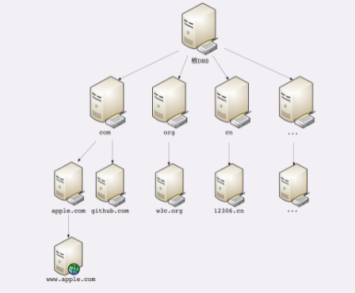
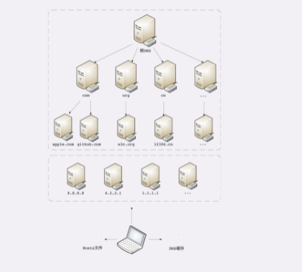

# 06 | 域名里有哪些门道？

在上一讲里，我们学习了 HTTP 协议使用的 TCP/IP 协议栈，知道了 HTTP 协议是运行在 TCP/IP 上的。

IP 协议的职责是「网际互连」，它在 MAC 层之上，使用 IP 地址把 MAC 编号转换成了四位数字，这就对物理网卡的 MAC 地址做了一层抽象，发展出了许多的「新玩法」。

例如，分为 A、B、C、D、E 五种类型，公有地址和私有地址，掩码分割子网等。只要每个小网络在 IP 地址这个概念上达成一致，不管它在 MAC 层有多大的差异，都可以接入 TCP/IP 协议栈，最终汇合进整个互联网。

但接入互联网的计算机越来越多，IP 地址的缺点也就暴露出来了，最主要的是它「对人不友好」，虽然比 MAC 的 16 进制数要好一点，但还是难于记忆和输入。因此在 IP 地址之上再来一次抽象，把数字形式的 IP 地址转换成更有意义更好记的名字，在字符串的层面上再增加「新玩法」。即产生了 DNS 域名系统。

## 域名的形式

在第 4 讲曾经说过，域名是一个有层次的结构，是一串用「.」分隔的多个单词，最右边的被称为「顶级域名」，然后是「二级域名」，层级关系向左依次降低。

最左边的是主机名，通常用来表明主机的用途，比如「www」表示提供万维网服务、「mail」表示提供邮件服务，不过这也不是绝对的，名字的关键是要让我们容易记忆。

看一下极客时间的域名「time.geekbang.org」，这里的「org」就是顶级域名，「geekbang」是二级域名，「time」则是主机名。使用这个域名，DNS 就会把它转换成相应的 IP 地址，你就可以访问极客时间的网站了。

域名不仅能够代替 IP 地址，还有许多其他的用途。

在 Apache、Nginx 这样的 Web 服务器里，域名可以用来标识虚拟主机，决定由哪个虚拟主机来对外提供服务，比如在 Nginx 里就会使用「server_name」指令：

```
server {
    listen 80;                       # 监听 80 端口
    server_name  time.geekbang.org;  # 主机名是 time.geekbang.org
    ...
}
```

域名本质上还是个名字空间系统，使用多级域名就可以划分出不同的国家、地区、组织、公司、部门，每个域名都是独一无二的，可以作为一种身份的标识。

举个例子吧，假设 A 公司里有个小明，B 公司里有个小强，于是他们就可以分别说是「小明.A 公司」，「小强.B 公司」，即使 B 公司里也有个小明也不怕，可以标记为「小明.B 公司」，很好地解决了重名问题。

因为这个特性，域名也被扩展到了其他应用领域，比如 Java 的包机制就采用域名作为命名空间，只是它使用了反序。如果极客时间要开发 Java 应用，那么它的包名可能就是「org.geekbang.time」。

而 XML 里使用 URI 作为名字空间，也是间接使用了域名。

## 域名的解析

就像 IP 地址必须转换成 MAC 地址才能访问主机一样，域名也必须要转换成 IP 地址，这个过程就是「**域名解析**」。
DNS 的核心系统是一个三层的树状、分布式服务，基本对应域名的结构：

1. 根域名服务器（Root DNS Server）：管理顶级域名服务器，返回「com」「net」「cn」等顶级域名服务器的 IP 地址；
2. 顶级域名服务器（Top-level DNS Server）：管理各自域名下的权威域名服务器，比如 com 顶级域名服务器可以返回 apple.com 域名服务器的 IP 地址；
3. 权威域名服务器（Authoritative DNS Server）：管理自己域名下主机的 IP 地址，比如 apple.com 权威域名服务器可以返回 www.apple.com 的 IP 地址。



在这里根域名服务器是关键，它必须是众所周知的，否则下面的各级服务器就无从谈起了。目前全世界共有 13 组根域名服务器，又有数百台的镜像，保证一定能够被访问到。

有了这个系统以后，任何一个域名都可以在这个树形结构里从顶至下进行查询，就好像是把域名从右到左顺序走了一遍，最终就获得了域名对应的 IP 地址。

例如，你要访问「www.apple.com」，就要进行下面的三次查询：

1. 访问根域名服务器，它会告诉你「com」顶级域名服务器的地址；
2. 访问「com」顶级域名服务器，它再告诉你「apple.com」域名服务器的地址；
3. 最后访问「apple.com」域名服务器，就得到了「www.apple.com」的地址。

虽然核心的 DNS 系统遍布全球，服务能力很强也很稳定，但如果全世界的网民都往这个系统里挤，即使不挤瘫痪了，访问速度也会很慢。

所以在核心 DNS 系统之外，还有两种手段用来减轻域名解析的压力，并且能够更快地获取结果，基本思路就是「**缓存**」。==问题：如果域名对应的域名过期了，缓存如何更新==

首先，许多大公司、网络运行商都会建立自己的 DNS 服务器，作为用户 DNS 查询的代理，代替用户访问核心 DNS 系统。这些「野生」服务器被称为「非权威域名服务器」，可以缓存之前的查询结果，如果已经有了记录，就无需再向根服务器发起查询，直接返回对应的 IP 地址。

这些 DNS 服务器的数量要比核心系统的服务器多很多，而且大多部署在离用户很近的地方。比较知名的 DNS 有 Google 的「8.8.8.8」，Microsoft 的「4.2.2.1」，还有 CloudFlare 的「1.1.1.1」等等。

其次，操作系统里也会对 DNS 解析结果做缓存，如果你之前访问过「www.apple.com」，那么下一次在浏览器里再输入这个网址的时候就不会再跑到 DNS 那里去问了，直接在操作系统里就可以拿到 IP 地址。

另外，操作系统里还有一个特殊的「主机映射」文件，通常是一个可编辑的文本，在 Linux 里是「/etc/hosts」，在 Windows 里是「C:\WINDOWS\system32\drivers\etc\hosts」，如果操作系统在缓存里找不到 DNS 记录，就会找这个文件。

有了上面的「野生」DNS 服务器、操作系统缓存和 hosts 文件后，很多域名解析的工作直接在本地或本机就能解决，不仅方便了用户，也减轻了各级 DNS 服务器的压力，效率就大大提升了。

下面的这张图比较完整地表示了现在的 DNS 架构。



在 Nginx 里有这么一条配置指令「resolver」，它就是用来配置 DNS 服务器的，如果没有它，那么 Nginx 就无法查询域名对应的 IP，也就无法反向代理到外部的网站。

```
resolver 8.8.8.8 valid=30s;  # 指定 Google 的 DNS，缓存 30 秒
```

## 域名的「新玩法」

有了域名，又有了可以稳定工作的解析系统，于是我们就可以实现比 IP 地址更多的「新玩法」了。

第一种，也是最简单的，「重定向」。因为域名代替了 IP 地址，所以可以让对外服务的域名不变，而主机的 IP 地址任意变动。当主机有情况需要下线、迁移时，可以更改 DNS 记录，让域名指向其他的机器。

比如，你有一台「buy.tv」的服务器要临时停机维护，那你就可以通知 DNS 服务器：「我这个 buy.tv 域名的地址变了啊，原先是 1.2.3.4，现在是 5.6.7.8，麻烦你改一下。」DNS 于是就修改内部的 IP 地址映射关系，之后再有访问 buy.tv 的请求就不走 1.2.3.4 这台主机，改由 5.6.7.8 来处理，这样就可以保证业务服务不中断。==问题：首先怎么通知DNS服务器，其次第1次的域名和ip地址之间的关系DNS服务器是怎么获取的==

第二种，因为域名是一个名字空间，所以可以使用 bind9 等开源软件搭建一个在内部使用的 DNS，作为名字服务器。这样我们开发的各种内部服务就都用域名来标记，比如数据库服务都用域名「mysql.inner.app」，商品服务都用「goods.inner.app」，发起网络通信时也就不必再使用写死的 IP 地址了，可以直接用域名，而且这种方式也兼具了第一种「玩法」的优势。

第三种「玩法」包含了前两种，也就是基于域名实现的负载均衡。这种「玩法」也有两种方式，两种方式可以混用。

第一种方式，因为域名解析可以返回多个 IP 地址，所以一个域名可以对应多台主机，客户端收到多个 IP 地址后，就可以自己使用轮询算法依次向服务器发起请求，实现负载均衡。

第二种方式，域名解析可以配置内部的策略，返回离客户端最近的主机，或者返回当前服务质量最好的主机，这样在 DNS 端把请求分发到不同的服务器，实现负载均衡。

前面我们说的都是可信的 DNS，如果有一些不怀好意的 DNS，那么它也可以在域名这方面「做手脚」，弄一些比较「恶意」的「玩法」，举两个例子：

- 「域名屏蔽」，对域名直接不解析，返回错误，让你无法拿到 IP 地址，也就无法访问网站；
- 「域名劫持」，也叫「域名污染」，你要访问 A 网站，但 DNS 给了你 B 网站。

好在互联网上还是好人多，而且 DNS 又是互联网的基础设施，这些「恶意 DNS」并不多见，你上网的时候不需要太过担心。==为什么会访问到这些恶意的DNS,不应该

## 小结

这次我们学习了与 HTTP 协议有重要关系的域名和 DNS，在这里简单小结一下今天的内容：

1. 域名使用字符串来代替 IP 地址，方便用户记忆，本质上一个名字空间系统；
2. DNS 就像是我们现实世界里的电话本、查号台，统管着互联网世界里的所有网站，是一个「超级大管家」；
3. DNS 是一个树状的分布式查询系统，但为了提高查询效率，外围有多级的缓存；
4. 使用 DNS 可以实现基于域名的负载均衡，既可以在内网，也可以在外网。

## 课下作业

1. 在浏览器地址栏里随便输入一个不存在的域名，比如就叫「www. 不存在.com」，试着解释一下它的 DNS 解析过程。
2. 如果因为某些原因，DNS 失效或者出错了，会出现什么后果？

欢迎你把自己的答案写在留言区，与我和其他同学一起讨论。如果你觉得有所收获，也欢迎把文章分享给你的朋友。

.png)


## 精选留言

- 为何全世界只有 13 组根域名服务器呢？

    作者回复: 细节原因不好解释，简单来说是因为dns协议还有udp协议里包大小的限制，只有512字节，再除以dns记录长度，最多15组，再去掉buffer。

- 1、操作系统缓存→本地hosts文件→非核心dns服务器→根域名服务器地址→顶级域名服务器地址→二级域名服务器地址。。。
    2、无法访问相应的资源

    作者回复: 第一个没说完，第二个问题可以再说的详细一些。

- 老师好，我有两个疑问：
    1.终极dns的解析是有谁实现的或者谁规定的：
    比如乔布斯有个苹果域名：www.apple.com，苹果电脑的官网；张三也想为水果苹果申请个域名(www.apple.com)来展示他的苹果;结果我们几乎可以猜测到，他是申请失败的，原因已经有一个苹果存在了，谁来评判这个苹果域名已经被占用了呢？判断逻辑是如何来的，如果两个申请发生在同时呢？
    \2. ip地址的分配和身份证号一样吗？有地址在里面吗？
    比如1-45属于美国的网段，或者属于哪个超大公司的网段。如果有，那是不是就以为着预分配，也就意味着部分ip段的浪费，如果没有，那ip地址从一个地方查找另外一个地方怎么找呢？莫非每个初始的线路都需要访问到根DNS

    

    作者回复: 域名由专门的域名注册机构管理，终极的是ICANN。
    IP地址的分配也由ICANN管理，当然有浪费，美国是互联网的发明国，所以占用ip地址最多。

    ip地址查找由专门的协议，比如arp。

    这些比较偏底层，离http比较远，可以再找其他资料学习。。

- 老师您好，之前碰到过这样一个问题
    域名解析返回两个IP地址，其中一个IP无法正常访问。
    Safari可以自动切换到正常的IP地址继续访问
    Chrome会尝试TCP连接不正常的IP，大约1分多钟之后会连接另一个IP
    最终导致Chrome页面访问速度缓慢。想问下这种问题是属于浏览器问题，还是DNS的问题呢？

    

    作者回复: 这个应该是浏览器的重连策略问题，dsn解析结果已经出来了，就已经跟dns无关了。

- 老师好!1.2.3.4改成5.6.7.8后访问不到浏览器会自动重试解析DNS是么?从事的时候使用野生还是专业的有啥策略?重试几次，DNS集群的域名是最终一致还是强一致。
    1.操作系统缓存不存在，host文件不存在，访问DNS服务器，根域名解析成功，二级域名解析失败，重试还是失败。浏览器返回错误。
    2走失败策略，最终还是失败的就错误页面。

    

    作者回复: dns解析出ip后访问失败就不会再解析了。
    浏览器的重试策略跟具体实现有关，这个我也不清楚。
    dns是最终一致。

- 应该是先查找本地hosts文件，在查找缓存吧

    

    作者回复: 浏览器缓存->操作系统缓存->hosts->dns

- \1. www.不存在.com -> Hosts 文件 -> 操作系统本地缓存 -> 非权威域名服务器查询其缓存 -> 查询根域名、顶级域名、以及域名服务器，当后面的查询得到结果时，将会写入本地缓存
    \2. - 首先，我们的目标的 IP 地址就会因此无法被正确解析到，因此将无法打开页面，即域名屏蔽；如果 DNS 错误得将域名解析道错误的 IP 地址上，即域名污染。

    提问一下，浏览器本身是不是也会对 DNS 缓存以提高访问速度？

    

    作者回复: 回答的基本正确。

    是的，课程里好像说了，浏览器内部也会缓存dns的。

- 建议把每节的课后作业，在下一节中，把答案给大家说一下。毕竟有说的不对的地方，也算个参考

    作者回复: 我个人觉得还是自己想出答案比较好，统一的「标准答案」反而不利于学习，其实留言里的很多都回答的挺好的。

- 思考题：
    1、操作系统首先会在其缓存和 HOST 文件中去找域名对应的 IP 地址，如果本地中没有记录，则会去 DNS 服务器中查找，按照 DNS 服务器的树状结构，层级进行访问查找，对于 「www.」 这样的请求，在第一层，也就是根域名服务器中是找不到下一层的域名服务器的，于是就返回错误给客户端，不继续往下找
    2、看 DNS 服务器的返回错误内容吧，如果是返回错误请求或者内部错误告知的话，客户端这边可以相应地做一些响应异常处理；还有一种情况是 DNS 返回一个不存在的 IP 地址，或者是映射到错误的 IP 地址，个人认为前者的影响会小一些，顶多是请求页面 404 报错，后者的话则会误导用户，比如你输入了 「www.apple.com」，弹出的是 Google 搜索栏

    这里想请教老师几个问题，可能有点超出 HTTP 的范畴，但是还是比较好奇
    1、如果说我们应用域名的一些技术，比如文中说的重定向，负载均衡等等，这些技术都涉及到了域名和 IP 映射关系的改变，那么这些改变只是在其对应的 DNS 代理服务器上改变吗，还是说代理服务器立刻会将该改变内容发送到 DNS 核心服务器去？
    2、另外就是操作系统的缓存和 HOST 文件是不是需要定期的人工检查，排除域名和 IP 对应的改变？

    

    作者回复: 「野生」dns服务器本质上只是缓存，它不能影响核心dns系统，而是核心dns改变它的值。

    如果你自己搭dns服务器那么就没有这些问题了。

    第二个，hosts文件需要人工维护，可以自己添加，而操作系统缓存是自动管理的。通常都不需要做修改，除非有些特殊域名被「攻击」，只能手动改hosts实现解析。

- 这句话不是太明白 「第一种方式，因为域名解析可以返回多个 IP 地址，所以一个域...

    域名不是只能绑定一个ip地址吗？为什么解析的时候会返回多个ip呢？ 我是哪里读漏了吗？

    

    作者回复: 一个域名可以对应多个ip地址，不一定是一个，所以域名能够实现负载均衡。

- 老师，想请问下，当域名所对应的ip发生变化的时候，因为本地或者"野生"域名服务器上的ip是怎么发生变化的呢？因为在域名所对应的ip发生变化的时候应该是通知的权威域名服务器吧

    作者回复: 域名解析有个ttl有效期，到期就会去上一级dns重新获取，当然也可以主动刷新。

- 有个疑问，比如我备案了一个域名www.abc.com，是不是abc.com就会注册到根域名服务器上，这个根域名服务器，顶级域名服务器也是某个公司开发的吗？

    

    作者回复: 根和顶级dns由互联网组织ICANN管理，不属于任何公司。

    根dns只管理顶级dns。

- \1. 浏览器缓存 → 系统缓存 → HOSTS → DNS
    DNS：非权威域名服务器 → 上层非权威域名服务器们 → 根域名服务器 → 顶级域名服务器 → 中间的各种域名服务器（NS 记录） → 权威域名服务器

    \2. 如果无本地缓存或缓存有问题那么会无法解析出 IP 地址导致无法访问相应网站

    

- 老师，这个域名的操作系统缓存能简单介绍一下吗？以前我只了解到浏览器-》hosts-〉本地域名服务器

    作者回复: 在Windows上可以用命令行「ipconfig /displaydns」看缓存的dns，存在系统内部。

- 浏览器缓存 操作系统缓存 host文件 根域名 顶级域名 返回失败

    作者回复: √

- 第一个问题：
      1、检查本地dns缓存是否存在解析"www.不存在.com"域名的ip
      2、如果没有找到继续查找本地hosts文件内是否有对应的固定记录
      3、如果hosts中还是没有那就根据本地网卡被分配的 dns server ip 来进行解析，dns server ip 一般是「非官方」的ip，比如谷歌的「8.8.8.8」，本身它也会对查找的域名解析结果进行缓存，如果它没有缓存或者缓存失效，则先去顶级域名服务器「com」去查找「不存在.com」的域名服务器ip，结果发现不存在，于是直接返回告诉浏览器域名解析错误，当然这两次查找过程是基于udp协议

    第二个问题：如果dns失效或出错，那就访问不了了呗，我现在有个域名在国外某些国家每天都有不少访问失败的http请求，客户端直接报「Failed host lookup」的错误

    

    作者回复: √

- 原来Java的包名规则和域名一致，两者原理是一样的。熟悉的东西反而忽视了，终于打通了。

- \1. 先从本地dns查找，找不到然后去hosts找，还找不到就去配置的dns服务器查找，解析不到就返回，立即提示域名无法解析。域名解析有一个生效时间，这个第三方域名从顶级域名同步的时间。
    \2. dns服务异常时，会在域名解析（比如用ping）的时出现等待，一段时间后提示域名无法解析。

    
