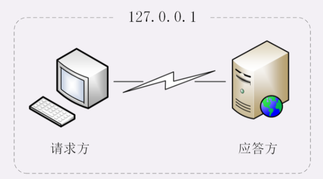
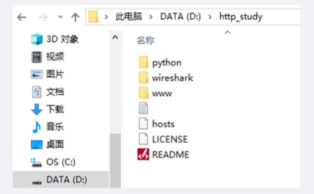
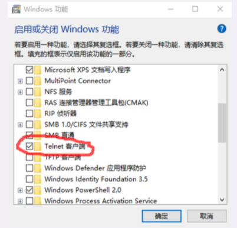
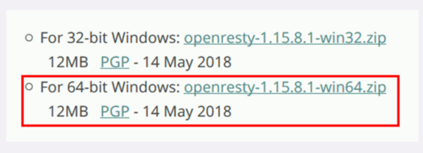
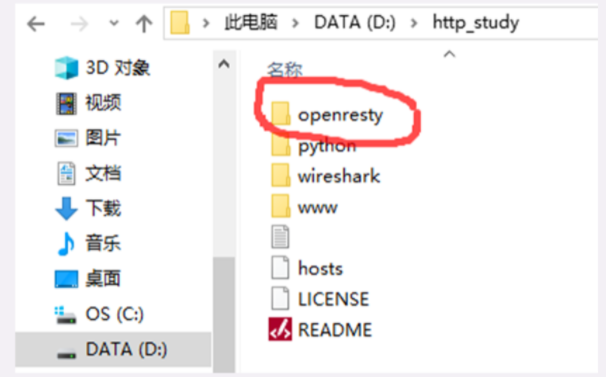
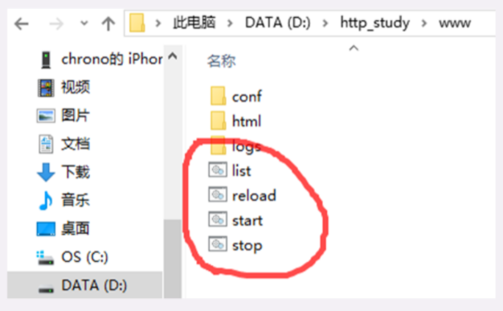
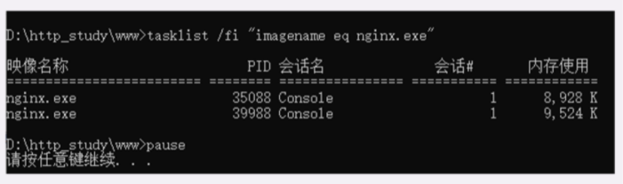
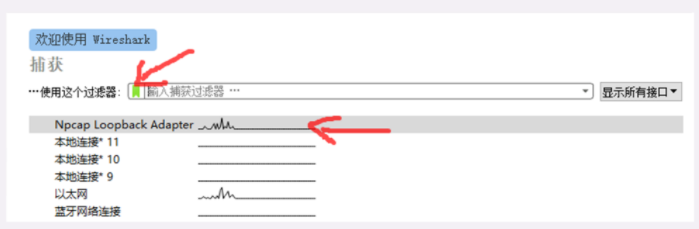
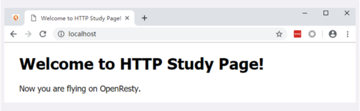
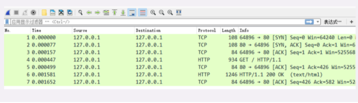

# 07 | 自己动手，搭建HTTP实验环境

这一讲是「破冰篇」的最后一讲，我会先简单地回顾一下之前的内容，然后在 Windows 系统上实际操作，用几个应用软件搭建出一个「最小化」的 HTTP 实验环境，方便后续的「基础篇」「进阶篇」「安全篇」的学习。

## 「破冰篇」回顾

HTTP 协议诞生于 30 年前，设计之初的目的是用来传输纯文本数据。但由于形式灵活，搭配 URI、HTML 等技术能够把互联网上的资源都联系起来，构成一个复杂的超文本系统，让人们自由地获取信息，所以得到了迅猛发展。

HTTP 有多个版本，目前应用的最广泛的是 HTTP/1.1，它几乎可以说是整个互联网的基石。但 HTTP/1.1 的性能难以满足如今的高流量网站，于是又出现了 HTTP/2 和 HTTP/3。不过这两个新版本的协议还没有完全推广开。在可预见的将来，HTTP/1.1 还会继续存在下去。

HTTP 翻译成中文是「超文本传输协议」，是一个应用层的协议，通常基于 TCP/IP，能够在网络的任意两点之间传输文字、图片、音频、视频等数据。

HTTP 协议中的两个端点称为**请求方**和**应答方**。请求方通常就是 Web 浏览器，也叫 user agent，应答方是 Web 服务器，存储着网络上的大部分静态或动态的资源。

在浏览器和服务器之间还有一些「中间人」的角色，如 CDN、网关、代理等，它们也同样遵守 HTTP 协议，可以帮助用户更快速、更安全地获取资源。

HTTP 协议不是一个孤立的协议，需要下层很多其他协议的配合。最基本的是 TCP/IP，实现寻址、路由和可靠的数据传输，还有 DNS 协议实现对互联网上主机的定位查找。

对 HTTP 更准确的称呼是「**HTTP over TCP/IP**」，而另一个「**HTTP over SSL/TLS**」就是增加了安全功能的 HTTPS。

## 软件介绍

常言道「实践出真知」，又有俗语「光说不练是假把式」。要研究 HTTP 协议，最好有一个实际可操作、可验证的环境，通过实际的数据、现象来学习，肯定要比单纯的「动嘴皮子」效果要好的多。

现成的环境当然有，只要能用浏览器上网，就会有 HTTP 协议，就可以进行实验。但现实的网络环境又太复杂了，有很多无关的干扰因素，这些「噪音」会「淹没」真正有用的信息。

所以，我给你的建议是：搭建一个「**最小化**」的环境，在这个环境里仅有 HTTP 协议的两个端点：请求方和应答方，去除一切多余的环节，从而可以抓住重点，快速掌握 HTTP 的本质。



简单说一下这个「最小化」环境用到的应用软件：

- Wireshark
- Chrome/Firefox
- Telnet
- OpenResty

**Wireshark**是著名的网络抓包工具，能够截获在 TCP/IP 协议栈中传输的所有流量，并按协议类型、地址、端口等任意过滤，功能非常强大，是学习网络协议的必备工具。

它就像是网络世界里的一台「高速摄像机」，把只在一瞬间发生的网络传输过程如实地「拍摄」下来，事后再「慢速回放」，让我们能够静下心来仔细地分析那一瞬到底发生了什么。

**Chrome**是 Google 开发的浏览器，是目前的主流浏览器之一。它不仅上网方便，也是一个很好的调试器，对 HTTP/1.1、HTTPS、HTTP/2、QUIC 等的协议都支持得非常好，用 F12 打开「开发者工具」还可以非常详细地观测 HTTP 传输全过程的各种数据。

如果你更习惯使用**Firefox**，那也没问题，其实它和 Chrome 功能上都差不太多，选择自己喜欢的就好。

与 Wireshark 不同，Chrome 和 Firefox 属于「事后诸葛亮」，不能观测 HTTP 传输的过程，只能看到结果。

**Telnet**是一个经典的虚拟终端，基于 TCP 协议远程登录主机，我们可以使用它来模拟浏览器的行为，连接服务器后手动发送 HTTP 请求，把浏览器的干扰也彻底排除，能够从最原始的层面去研究 HTTP 协议。

**OpenResty**你可能比较陌生，它是基于 Nginx 的一个「强化包」，里面除了 Nginx 还有一大堆有用的功能模块，不仅支持 HTTP/HTTPS，还特别集成了脚本语言 Lua 简化 Nginx 二次开发，方便快速地搭建动态网关，更能够当成应用容器来编写业务逻辑。

选择 OpenResty 而不直接用 Nginx 的原因是它相当于 Nginx 的「超集」，功能更丰富，安装部署更方便。我也会用 Lua 编写一些服务端脚本，实现简单的 Web 服务器响应逻辑，方便实验。

## 安装过程

这个「最小化」环境的安装过程也比较简单，大约只需要你半个小时不到的时间就能搭建完成。

我在 GitHub 上为本专栏开了一个项目：[http_study](https://github.com/chronolaw/http_study.git)，可以直接用「git clone」下载，或者去 Release 页面，下载打好的[压缩包](https://github.com/chronolaw/http_study/releases)。

我使用的操作环境是 Windows 10，如果你用的是 Mac 或者 Linux，可以用 VirtualBox 等虚拟机软件安装一个 Windows 虚拟机，再在里面操作。

首先你要获取**最新**的 http_study 项目源码，假设 clone 或解压的目录是「D:\http_study」，操作完成后大概是下图这个样子。



Chrome 和 WireShark 的安装比较简单，一路按「下一步」就可以了。版本方面使用最新的就好，我的版本可能不是最新的，Chrome 是 73，WireShark 是 3.0.0。

Windows 10 自带 Telnet，不需要安装，但默认是不启用的，需要你稍微设置一下。

打开 Windows 的设置窗口，搜索「Telnet」，就会找到「启用或关闭 Windows 功能」，在这个窗口里找到「Telnet 客户端」，打上对钩就可以了，可以参考截图。



接下来我们要安装 OpenResty，去它的[官网](http://openresty.org)，点击左边栏的「Download」，进入下载页面，下载适合你系统的版本（这里我下载的是 64 位的 1.15.8.1，包的名字是「openresty-1.15.8.1-win64.zip」）。



然后要注意，你必须把 OpenResty 的压缩包解压到刚才的「D:\http_study」目录里，并改名为「openresty」。



安装工作马上就要完成了，为了能够让浏览器能够使用 DNS 域名访问我们的实验环境，还要改一下本机的 hosts 文件，位置在「C:\WINDOWS\system32\drivers\etc」，在里面添加三行本机 IP 地址到测试域名的映射，你也可以参考 GitHub 项目里的 hosts 文件，这就相当于在一台物理实机上「托管」了三个虚拟主机。

```
127.0.0.1       www.chrono.com
127.0.0.1       www.metroid.net
127.0.0.1       origin.io
```

注意修改 hosts 文件需要管理员权限，直接用记事本编辑是不行的，可以切换管理员身份，或者改用其他高级编辑器，比如 Notepad++，而且改之前最好做个备份。

到这里，我们的安装工作就完成了！之后你就可以用 Wireshark、Chrome、Telnet 在这个环境里随意「折腾」，弄坏了也不要紧，只要把目录删除，再来一遍操作就能复原。

## 测试验证

实验环境搭建完了，但还需要把它运行起来，做一个简单的测试验证，看是否运转正常。

首先我们要启动 Web 服务器，也就是 OpenResty。

在 http_study 的「www」目录下有四个批处理文件，分别是：



- start：启动 OpenResty 服务器；
- stop：停止 OpenResty 服务器；
- reload：重启 OpenResty 服务器；
- list：列出已经启动的 OpenResty 服务器进程。

使用鼠标双击「start」批处理文件，就会启动 OpenResty 服务器在后台运行，这个过程可能会有 Windows 防火墙的警告，选择「允许」即可。

运行后，鼠标双击「list」可以查看 OpenResty 是否已经正常启动，应该会有两个 nginx.exe 的后台进程，大概是下图的样子。



有了 Web 服务器后，接下来我们要运行 Wireshark，开始抓包。

因为我们的实验环境运行在本机的 127.0.0.1 上，也就是 loopback「环回」地址。所以，在 Wireshark 里要选择「Npcap loopback Adapter」，过滤器选择「HTTP TCP port(80)」，即只抓取 HTTP 相关的数据包。鼠标双击开始界面里的「Npcap loopback Adapter」即可开始抓取本机上的网络数据。



然后我们打开 Chrome，在地址栏输入「http://localhost/」，访问刚才启动的 OpenResty 服务器，就会看到一个简单的欢迎界面，如下图所示。



这时再回头去看 Wireshark，应该会显示已经抓到了一些数据，就可以用鼠标点击工具栏里的「停止捕获」按钮告诉 Wireshark「到此为止」，不再继续抓包。



至于这些数据是什么，表示什么含义，我会在下一讲再详细介绍。

如果你能够在自己的电脑上走到这一步，就说明「最小化」的实验环境已经搭建成功了，不要忘了实验结束后运行批处理「stop」停止 OpenResty 服务器。

## 小结

这次我们学习了如何在自己的电脑上搭建 HTTP 实验环境，在这里简单小结一下今天的内容。

1. 现实的网络环境太复杂，有很多干扰因素，搭建「最小化」的环境可以快速抓住重点，掌握 HTTP 的本质；
2. 我们选择 Wireshark 作为抓包工具，捕获在 TCP/IP 协议栈中传输的所有流量；
3. 我们选择 Chrome 或 Firefox 浏览器作为 HTTP 协议中的 user agent；
4. 我们选择 OpenResty 作为 Web 服务器，它是一个 Nginx 的「强化包」，功能非常丰富；
5. Telnet 是一个命令行工具，可用来登录主机模拟浏览器操作；
6. 在 GitHub 上可以下载到本专栏的专用项目源码，只要把 OpenResty 解压到里面即可完成实验环境的搭建。

## 课下作业

\1. 按照今天所学的，在你自己的电脑上搭建出这个 HTTP 实验环境并测试验证。

\2. 由于篇幅所限，我无法详细介绍 Wireshark，你有时间可以再上网搜索 Wireshark 相关的资料，了解更多的用法。

欢迎你把自己的学习体会写在留言区，与我和其他同学一起讨论。如果你觉得有所收获，也欢迎把文章分享给你的朋友。

.png)

## 精选留言

- 在Mac上，

    拷贝项目（需要Git）
    \1. git clone https://github.com/chronolaw/http_study
    
    安装OpenResty （推荐使用Homebrew）
    \1. brew tap openresty/brew
    \2. brew install openresty
    
    运行项目
    \1. cd http_study/www/
    \2. openresty -p `pwd` -c conf/nginx.conf

    停止项目
    \1. openresty -s quit -p `pwd` -c conf/nginx.conf
    
    展开**
    
    作者回复: 好同学！！赞！
    
- 想请问下在 MacOs 或者是 Linux 上怎么搭建？（不是太想弄 Windows 虚拟机）

    作者回复: 需要用brew或者yum安装OpenResty，然后看一下nginx.conf，里面的注释有说明。

- 老师，上面过程怎么没有用到telnet

    展开**

    作者回复: 后面会用，Telnet需要手动输入http请求，比较麻烦，只有在比较特殊的时候才会用。

- 我打赌很多人抓不到包，找不到本地回环地址，不知道最新版的wireshark是否修复了这个问题，如果出现以上问题，记得卸载重装wireshark，不要勾选它自带的ncap应该是这个名字，然后自己去单独下一个这个软件

    作者回复: 有问题欢迎提出来，我机器上的Wireshark装的比较早，具体的步骤记不太清了，应该是很简单的。

- 为啥有时候批处理stop不掉openresty？

    展开**

    作者回复: 可能是多次start，stop就失效了，只能手动在任务管理器里关闭。

- 建议环境搭建都在linux操作，哈哈

    展开**

    作者回复: 我也是这么想，可惜用Windows的同学还是不少。

- start启动完成后，cmd窗口一闪而过，当我点击list启动时显示「没有运行的任务匹配制定标准」，请按任意键继续，当我随便输入数据时，cmd窗口又没了

    展开**

    作者回复: 看一下www/logs/error.log，是否有端口被占用了。

- 老师 最近我维护的一个网站打开速度非常慢 服务器CPU 负载0.5到0.8之间 有十多台web 服务器 redis db 负载都正常 只是nginx 的链接数在出问题的时间点有上升 我目前不知道从哪下手排查这个问题 是用php symfony 开发的 能否给点思路 万分感谢

    展开**

    作者回复: 在日志里加上$upstream_connect_time、$upstream_header_time、$upstream_response_time这几个变量，看看反向代理耗时在哪里。

    另外也可以用systemtap，抓火焰图看看。

- 老师，我的Npcap Loopback Adapter (port 80) 一直抓不到包怎么办，Npcap和wireshark都重装好几次了

    作者回复: 这个实在是帮不上忙，可以再网上找找资料或者问周围的朋友。

    不过抓不了包也没事，GitHub上也有抓好的包，先临时用一下。

- 老师，你好！
      这个www文件夹里面的文件和openResty是什么关系，我点那个start一闪而过，提示端口占用，能不能改一下端口啊，不要用80端口启用？
    
    作者回复: 如果不能禁用占用端口的服务，就只能自己手动改www/conf/http/servers下的配置了，用80端口是为了测试方便。
    
- 请问我在git hub上怎么访问到您说的资源呢？在您的文章中没有链接地址？

    作者回复: 应该有吧，https://github.com/chronolaw/http_study。

- 老师，我双击list文件，显示没有执行的任务匹配标准是怎么回事呢？

    作者回复: 可能是端口冲突，无法启动服务器，看一下www/logs/error.log，再参考一下其他同学的回答。

- 正在学温铭老师的《OpenResty从入门到实战》，正好用上。

    作者回复: 搭配起来学习，效果更好。

- 老师可以把环境打包成容器，我们进容器直接嗨，隔离更彻底

    作者回复: 考虑大多数同学都用的是Windows，所以暂时只能这样，手动操作也能加深一下印象吧。

- fidder 这个可以吗

    展开**

    作者回复: 应该也可以，我没用过，有经验欢迎分享。

- 的确是两个端口号顺序向服务器三次握手，但是我比较想知道为啥要两次三次握手确认呢

    作者回复: 因为建立了两个连接，互相独立。

- PD虚拟机装的win 10 64位，开启wireshark，并没有Npcap loopback Adapter，其他本地连接都有，请问老师这怎么调整？

    展开**

    作者回复: 没用过pd，如果你用的是mac，可以按照其他同学的回复，直接在macOS上搭建环境。