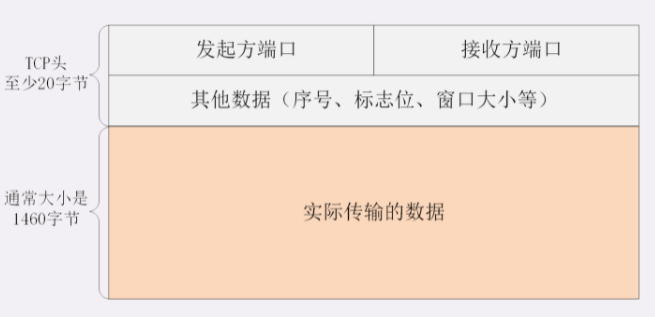
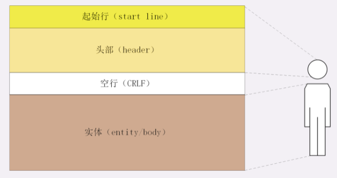
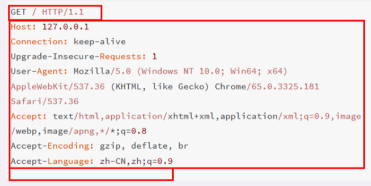
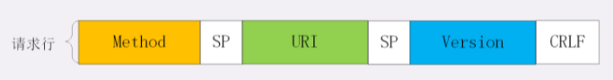
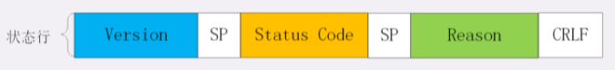
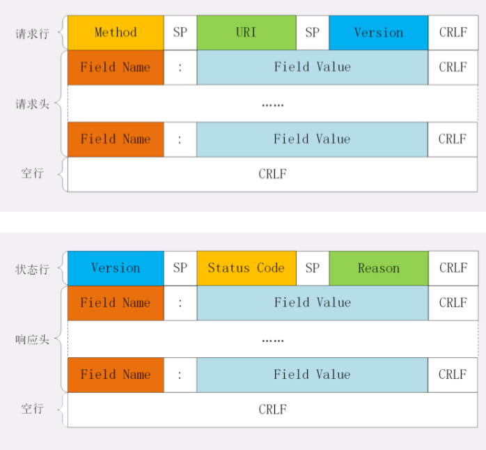
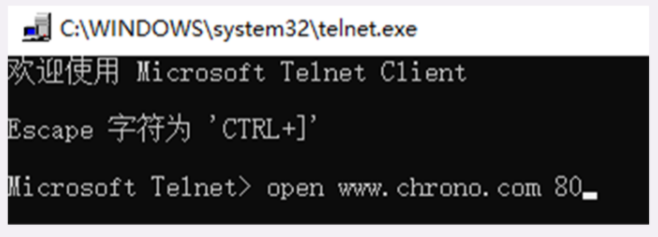
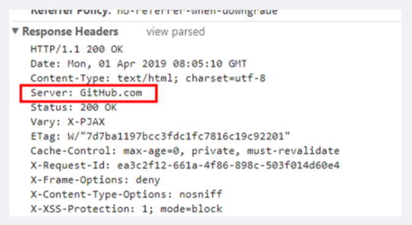

# 09 | HTTP报文是什么样子的？

在上一讲里，我们在本机的最小化环境了做了两个 HTTP 协议的实验，使用 Wireshark 抓包，弄清楚了 HTTP 协议基本工作流程，也就是“请求 - 应答”“一发一收”的模式。

可以看到，HTTP 的工作模式是非常简单的，由于 TCP/IP 协议负责底层的具体传输工作，HTTP 协议基本上不用在这方面操心太多。单从这一点上来看，所谓的“超文本传输协议”其实并不怎么管“传输”的事情，有点“名不副实”。

那么 HTTP 协议的核心部分是什么呢？

答案就是它传输的报文内容。

HTTP 协议在规范文档里详细定义了报文的格式，规定了组成部分，解析规则，还有处理策略，所以可以在 TCP/IP 层之上实现更灵活丰富的功能，例如连接控制，缓存管理、数据编码、内容协商等等。

## 报文结构

你也许对 TCP/UDP 的报文格式有所了解，拿 TCP 报文来举例，它在实际要传输的数据之前附加了一个 20 字节的头部数据，存储 TCP 协议必须的额外信息，例如发送方的端口号、接收方的端口号、包序号、标志位等等。

有了这个附加的 TCP 头，数据包才能够正确传输，到了目的地后把头部去掉，就可以拿到真正的数据。



HTTP 协议也是与 TCP/UDP 类似，同样也需要在实际传输的数据前附加一些头数据，不过与 TCP/UDP 不同的是，它是一个“**纯文本**”的协议，所以头数据都是 ASCII 码的文本，可以很容易地用肉眼阅读，不用借助程序解析也能够看懂。

HTTP 协议的请求报文和响应报文的结构基本相同，由三大部分组成：

1. 起始行（start line）：描述请求或响应的基本信息；
2. 头部字段集合（header）：使用 key-value 形式更详细地说明报文；
3. 消息正文（entity）：实际传输的数据，它不一定是纯文本，可以是图片、视频等二进制数据。

这其中前两部分起始行和头部字段经常又合称为“**请求头**”或“**响应头**”，消息正文又称为“**实体**”，但与“**header**”对应，很多时候就直接称为“**body**”。

HTTP 协议规定报文必须有 header，但可以没有 body，而且在 header 之后必须要有一个“空行”，也就是“CRLF”，十六进制的“0D0A”。

所以，一个完整的 HTTP 报文就像是下图的这个样子，注意在 header 和 body 之间有一个“空行”。



说到这里，我不由得想起了一部老动画片《大头儿子和小头爸爸》，你看，HTTP 的报文结构像不像里面的“大头儿子”？

报文里的 header 就是“大头儿子”的“大头”，空行就是他的“脖子”，而后面的 body 部分就是他的身体了。

看一下我们之前用 Wireshark 抓的包吧。



在这个浏览器发出的请求报文里，第一行“GET / HTTP/1.1”就是请求行，而后面的“Host”“Connection”等等都属于 header，报文的最后是一个空白行结束，没有 body。

在很多时候，特别是浏览器发送 GET 请求的时候都是这样，HTTP 报文经常是只有 header 而没 body，相当于只发了一个超级“大头”过来，你可以想象的出来：每时每刻网络上都会有数不清的“大头儿子”在跑来跑去。

不过这个“大头”也不能太大，虽然 HTTP 协议对 header 的大小没有做限制，但各个 Web 服务器都不允许过大的请求头，因为头部太大可能会占用大量的服务器资源，影响运行效率。

## 请求行

了解了 HTTP 报文的基本结构后，我们来看看请求报文里的起始行也就是**请求行**（request line），它简要地描述了**客户端想要如何操作服务器端的资源**。

请求行由三部分构成：

1. 请求方法：是一个动词，如 GET/POST，表示对资源的操作；
2. 请求目标：通常是一个 URI，标记了请求方法要操作的资源；
3. 版本号：表示报文使用的 HTTP 协议版本。

这三个部分通常使用空格（space）来分隔，最后要用 CRLF 换行表示结束。



还是用 Wireshark 抓包的数据来举例：

```
GET / HTTP/1.1
```

在这个请求行里，“GET”是请求方法，“/”是请求目标，“HTTP/1.1”是版本号，把这三部分连起来，意思就是“服务器你好，我想获取网站根目录下的默认文件，我用的协议版本号是 1.1，请不要用 1.0 或者 2.0 回复我。”

别看请求行就一行，貌似很简单，其实这里面的“讲究”是非常多的，尤其是前面的请求方法和请求目标，组合起来变化多端，后面我还会详细介绍。

## 状态行

看完了请求行，我们再看响应报文里的起始行，在这里它不叫“响应行”，而是叫“**状态行**”（status line），意思是**服务器响应的状态**。

比起请求行来说，状态行要简单一些，同样也是由三部分构成：

1. 版本号：表示报文使用的 HTTP 协议版本；
2. 状态码：一个三位数，用代码的形式表示处理的结果，比如 200 是成功，500 是服务器错误；
3. 原因：作为数字状态码补充，是更详细的解释文字，帮助人理解原因。



看一下上一讲里 Wireshark 抓包里的响应报文，状态行是：

```
HTTP/1.1 200 OK
```

意思就是：“浏览器你好，我已经处理完了你的请求，这个报文使用的协议版本号是 1.1，状态码是 200，一切 OK。”

而另一个“GET /favicon.ico HTTP/1.1”的响应报文状态行是：

```
HTTP/1.1 404 Not Found
```

翻译成人话就是：“抱歉啊浏览器，刚才你的请求收到了，但我没找到你要的资源，错误代码是 404，接下来的事情你就看着办吧。”

## 头部字段

请求行或状态行再加上头部字段集合就构成了 HTTP 报文里完整的请求头或响应头，我画了两个示意图，你可以看一下。



请求头和响应头的结构是基本一样的，唯一的区别是起始行，所以我把请求头和响应头里的字段放在一起介绍。

头部字段是 key-value 的形式，key 和 value 之间用“:”分隔，最后用 CRLF 换行表示字段结束。比如在“Host: 127.0.0.1”这一行里 key 就是“Host”，value 就是“127.0.0.1”。

HTTP 头字段非常灵活，不仅可以使用标准里的 Host、Connection 等已有头，也可以任意添加自定义头，这就给 HTTP 协议带来了无限的扩展可能。

不过使用头字段需要注意下面几点：

1. 字段名不区分大小写，例如“Host”也可以写成“host”，但首字母大写的可读性更好；
2. 字段名里不允许出现空格，可以使用连字符“-”，但不能使用下划线“_”。例如，“test-name”是合法的字段名，而“test name”“test_name”是不正确的字段名；
3. 字段名后面必须紧接着“:”，不能有空格，而“:”后的字段值前可以有多个空格；
4. 字段的顺序是没有意义的，可以任意排列不影响语义；
5. 字段原则上不能重复，除非这个字段本身的语义允许，例如 Set-Cookie。

我在实验环境里用 Lua 编写了一个小服务程序，URI 是“/09-1”，效果是输出所有的请求头。

你可以在实验环境里用 Telnet 连接 OpenResty 服务器试一下，手动发送 HTTP 请求头，试验各种正确和错误的情况。

先启动 OpenResty 服务器，然后用组合键“Win+R”运行 telnet，输入命令“open www.chrono.com 80”，就连上了 Web 服务器。



连接上之后按组合键“CTRL+]”，然后按回车键，就进入了编辑模式。在这个界面里，你可以直接用鼠标右键粘贴文本，敲两下回车后就会发送数据，也就是模拟了一次 HTTP 请求。

下面是两个最简单的 HTTP 请求，第一个在“:”后有多个空格，第二个在“:”前有空格。

```
GET /09-1 HTTP/1.1
Host:   www.chrono.com
 
 
GET /09-1 HTTP/1.1
Host : www.chrono.com
```

第一个可以正确获取服务器的响应报文，而第二个得到的会是一个“400 Bad Request”，表示请求报文格式有误，服务器无法正确处理：

```
HTTP/1.1 400 Bad Request
Server: openresty/1.15.8.1
Connection: close
```

## 常用头字段

HTTP 协议规定了非常多的头部字段，实现各种各样的功能，但基本上可以分为四大类：

1. 通用字段：在请求头和响应头里都可以出现；
2. 请求字段：仅能出现在请求头里，进一步说明请求信息或者额外的附加条件；
3. 响应字段：仅能出现在响应头里，补充说明响应报文的信息；
4. 实体字段：它实际上属于通用字段，但专门描述 body 的额外信息。

对 HTTP 报文的解析和处理实际上主要就是对头字段的处理，理解了头字段也就理解了 HTTP 报文。

后续的课程中我将会以应用领域为切入点介绍连接管理、缓存控制等头字段，今天先讲几个最基本的头，看完了它们你就应该能够读懂大多数 HTTP 报文了。

首先要说的是**Host**字段，它属于请求字段，只能出现在请求头里，它同时也是唯一一个 HTTP/1.1 规范里要求**必须出现**的字段，也就是说，如果请求头里没有 Host，那这就是一个错误的报文。

Host 字段告诉服务器这个请求应该由哪个主机来处理，当一台计算机上托管了多个虚拟主机的时候，服务器端就需要用 Host 字段来选择，有点像是一个简单的“路由重定向”。

例如我们的试验环境，在 127.0.0.1 上有三个虚拟主机：“www.chrono.com”“www.metroid.net”和“origin.io”。那么当使用域名的方式访问时，就必须要用 Host 字段来区分这三个 IP 相同但域名不同的网站，否则服务器就会找不到合适的虚拟主机，无法处理。

**User-Agent**是请求字段，只出现在请求头里。它使用一个字符串来描述发起 HTTP 请求的客户端，服务器可以依据它来返回最合适此浏览器显示的页面。

但由于历史的原因，User-Agent 非常混乱，每个浏览器都自称是“Mozilla”“Chrome”“Safari”，企图使用这个字段来互相“伪装”，导致 User-Agent 变得越来越长，最终变得毫无意义。

不过有的比较“诚实”的爬虫会在 User-Agent 里用“spider”标明自己是爬虫，所以可以利用这个字段实现简单的反爬虫策略。

**Date**字段是一个通用字段，但通常出现在响应头里，表示 HTTP 报文创建的时间，客户端可以使用这个时间再搭配其他字段决定缓存策略。

**Server**字段是响应字段，只能出现在响应头里。它告诉客户端当前正在提供 Web 服务的软件名称和版本号，例如在我们的实验环境里它就是“Server: openresty/1.15.8.1”，即使用的是 OpenResty 1.15.8.1。

Server 字段也不是必须要出现的，因为这会把服务器的一部分信息暴露给外界，如果这个版本恰好存在 bug，那么黑客就有可能利用 bug 攻陷服务器。所以，有的网站响应头里要么没有这个字段，要么就给出一个完全无关的描述信息。

比如 GitHub，它的 Server 字段里就看不出是使用了 Apache 还是 Nginx，只是显示为“GitHub.com”。



实体字段里要说的一个是**Content-Length**，它表示报文里 body 的长度，也就是请求头或响应头空行后面数据的长度。服务器看到这个字段，就知道了后续有多少数据，可以直接接收。如果没有这个字段，那么 body 就是不定长的，需要使用 chunked 方式分段传输。

## 小结

今天我们学习了 HTTP 的报文结构，下面做一个简单小结。

1. HTTP 报文结构就像是“大头儿子”，由“起始行 + 头部 + 空行 + 实体”组成，简单地说就是“header+body”；
2. HTTP 报文可以没有 body，但必须要有 header，而且 header 后也必须要有空行，形象地说就是“大头”必须要带着“脖子”；
3. 请求头由“请求行 + 头部字段”构成，响应头由“状态行 + 头部字段”构成；
4. 请求行有三部分：请求方法，请求目标和版本号；
5. 状态行也有三部分：版本号，状态码和原因字符串；
6. 头部字段是 key-value 的形式，用“:”分隔，不区分大小写，顺序任意，除了规定的标准头，也可以任意添加自定义字段，实现功能扩展；
7. HTTP/1.1 里唯一要求必须提供的头字段是 Host，它必须出现在请求头里，标记虚拟主机名。

## 课下作业

1. 如果拼 HTTP 报文的时候，在头字段后多加了一个 CRLF，导致出现了一个空行，会发生什么？
2. 讲头字段时说“:”后的空格可以有多个，那为什么绝大多数情况下都只使用一个空格呢？

欢迎你把自己的答案写在留言区，与我和其他同学一起讨论。如果你觉得有所收获，也欢迎把文章分享给你的朋友。

.png)精选留言(31)

- 1:如果拼 HTTP 报文的时候，在头字段后多加了一个 CRLF，导致出现了一个空行，会发生什么？
    在header 下面第一个空行以后都会被当作body 体

    2:讲头字段时说“:”后的空格可以有多个，那为什么绝大多数情况下都只使用一个空格呢？
    头部多一个空格就会多一个传输的字节，去掉无用的信息，保证传输的头部字节数尽量小

    作者回复: 回答的很好。

- 答题：
    1、头字段后多了一个CRLF，会被当做body处理
    2、节省资源
    总结：
    HTTP协议的请求报文和相应报文的结构基本相同：
      1、起始行（start line）：描述请求或响应的基本信息
      2、头部字段集合（header）：使用key-value形式更详细的说明报文
      3、消息正文（entity）：实际传输的数据，它不一定是纯文本，可以是图片、视频等二进制数据

    HTTP协议必须有header，可以没有body。而且header之后必须要有一个空行，也就是 “CRLF”，十六进制的“0D0A”

    请求行（请求报文里的起始行）：
      描述了客户端想要如何操作服务器端的资源
    起始行由三部分构成：
      1、请求方法：标识对资源的操作：GET/POST/PUT
      2、请求目标：通常是一个URI，标记了请求方法要操作的资源
      3、版本号：标识报文使用的HTTP协议版本
    以上三部分，通常使用空格分隔，最后用CRLF换行

    状态行：（响应报文里的起始行）：
      服务器响应的状态
    状态行也是由三部分构成：
      1、版本号：标识报文使用的HTTP协议版本
      2、状态码：三位数，用代码形式标识处理的结果，比如200是成功，500是服务器错误
      3、原因：作为数字状态码补充，是更详细的解释文字，帮助人理解原因
    以上三部分，通常也使用空格分隔，最后用CRLF换行

    头部字段：
    请求行或状态行再加上头部字段集合就构成了HTTP报文里完整的请求头或响应头。

    头部字段是key-value的形式，用“:”分隔，最后用CRLF换行标识字段结束

    头字段，不仅可以使用标准的Host等已有开头，也可以任意添加自定义头

    注意：
      1.字段名不区分大小写，例如“Host"也可以写成“host”,但首字母大写的可读性更好;
      2.字段名里不允许出现空格，可以使用连字符“一”，但不能使用下划线“”。例 如，“test-name”是合法的字段名，而“test name""test_ name' 是不正确的字段名;
      3.字段名后面必须紧接着“:”，不能有空格，而“:” 后的字段值前可以有多个空格;
      4.字段的顺序是没有意义的，可以任意排列不影响语义;
      5.字段原则上不能重复，除非这个字段本身的语义允许，例如Set-Cookie。

    常用头字段

    基本分为四类：
      1.通用字段:在请求头和响应头里都可以出现;
      2.请求字段:仅能出现在请求头里，进一步说明请求信息或者额外的附加条件;
      3.响应字段:仅能出现在响应头里，补充说明响应报文的信息;
      4.实体字段:它实际上属于通用字段，但专门描述body的额外信息。

    Host：请求字段，只能出现在请求头。是必须出现的字段
    User-Agent：是请求字段，只能出现在请求头里。
    Date：是通用字段，通常出现在响应头，标识HTTP报文创建的时间，客户端可以使用这个时间再搭配其他字段决定缓存策略
    Server字段是响应字段，只能出现在响应头里。告诉客户端当前正在提供Web服务的软件名称和版本号。
    Content-Length：标识报文里body的长度。

    作者回复: 总结的非常好，赞！

    

- 我也遇到了前面2个同学提到的遗失对主机的连接的问题，但老师您的回答貌似没解决问题，我再确认一下，在浏览器可以顺利访问www.chrono.com的情况下：

    \1. Win+R打开Telnet后，输入 “open www.chrono.com 80”，点击回车，然后界面显示“正在连接open www.chrono.com 80”
    \2. 上一步漫长的等待后，界面显示“按任意键继续”
    \3. 我按了空格，界面上新增一行“遗失对主机的连接”

    另外老师您说的“按Ctrl+]键，然后回车”我在上面1步和第3步都试过 每次都显示“无效指令”

    请问我是哪一步出的问题呢

    作者回复: 不需要等待，在显示“正在连接”的时候按按Ctrl+]键，然后回车。

    “正在连接”的意思是已经连上了。

    可以再搜索一下Windows上Telnet的用法。

- 老师有个点是不是漏讲了，头部字段content_type，和body的数据格式

    作者回复: 后面的进阶篇再讲。

- 老师讲到了 Host，可以顺便讲一下 Host 攻击吗？

    作者回复: 网络攻击的范围太大，我不是专门做这个的，不能讲的很深入。

    简单来说，就是在host头里面加入精心设计的代码，诱骗服务器执行。

- \2. 讲头字段时说“:”后的空格可以有多个，那为什么绝大多数情况下都只使用一个空格呢？
    请问老师，空格可以一个都不加吧，telnet测试也可以正确返回，为什么还要使用一个空格

    作者回复: 按照rfc标准，空格可以是零个或多个，但一个空格已经成了约定俗成的习惯。见rfc7230 3.2.3。

- 文中说 http 的头部不能使用下划线，感觉是有问题的，就拿 nginx 来说吧，虽然nginx 默认是忽略下划线的头部的，但是可以设置 underscores_in_headers on; 来获取下划线的头部

    对于常用的 web application 服务器，下划线的头部好像是可以直接获取到的，不用配置什么

    老师你说的不能使用下划线是 RFC规范吗？

    作者回复: 是的，RFC有规定，但现实中也有部分不遵守。

- 对window一直显示正在连接的问题，我的解决方案是直接使用telnet www.chrono.com 80，而不是使用open www.chrono.com 80

    作者回复: 其他有问题的同学也可以试试。

- 老师，这个telnet每次编辑模式输入
    GET /09-1 HTTP/1.1 Host: www.chrono.com或GET / HTTP/1.1 Host: www.chrono.com，按回车都没有发起请求，按一次回车会提示“无效指令”，按两次回车就进入一个完全空白的页面，只能ctrl+z终止，会提示“遗失对主机的连接”，并且报"HTTP/1.1 400 Bad Request(text/html)"，结果现在wireshark只能捕获" open www.chrono.com 80"这个连接动作的tcp三次握手,然后就自动断开连接了

    作者回复: 我在自己的环境又确认了一下：

    输入" open www.chrono.com 80"，显示“正在连接”，这个时候按“ctrl+]”然后回车。

    进入编辑页面，鼠标右键粘贴请求头，再按回车，服务器就会返回响应报文。

    如果还是不能再现课程里的过程，可以去网上搜一下Windows上Telnet的用法，看有没有解决办法。

- 为啥老师懂的这么多！唉，何时能学成你的一半水平，我也就满意了😂

    作者回复: 学业有先后，术业有专攻，一起努力。

- 按照“大头儿子”的例子来看，请求行和请求头之间是没有空行的，而后面说到请求行的时候，请求行的版本号后面要加一个空行，所以对于整个报文来说，到底存在几个必须的空行？

    作者回复: 可能我说的有点歧义了，实际上是后面加一个CRLF，是个回车换行，不是空行，抱歉。

- 在centos 7系统中，telnet连接主机后，按快捷键ctrl+]进入编辑模式，然后执行模拟请求会报错：?Invalid command，不进入编辑模式就可以正常进行实验了～记录一下

    作者回复: Linux上的Telnet和Windows的操作不一样，不用那么麻烦，可以直接粘贴数据发送。

- 老师，请问为什么请求头太大会占用服务器资源呢？

    作者回复: 因为服务器必须分配内存存储请求头，然后才能处理，如果头很大，比如说16k，那么几万个请求就会占用非常多的内存。

    Nginx里限制头不超过4k，就是为了节约内存资源。

- 请问老师，抓包过程是http请求过程的什么位置拦截的数据包?

    作者回复: 抓包是在整个tcp协议栈，从最底层的mac，所以上面传输的所有数据都能够抓到。

    只要你点开始捕获，之后的http请求响应就都会被抓到，是整个过程。

- 支持老师原声。赞一个

    作者回复: 理解万岁。

- 老师您好，我初次接触openresty，我在open www.chrono.com这一步操作的时候一直连不上，命令行一直显示"正在连接www.chrono.com",然后过一会就提示"遗失对主机的连接"

    作者回复: 如果用浏览器连接没问题，那就是正确的。

    Telnet需要先按ctrl+]，然后回车，进入编辑界面。

    另外，别忘了改hosts。

    有问题随时提。

- ETag 以下的相应头都不知道意思了 下节课有解释么

    作者回复: 在进阶篇都会讲，别着急，慢慢来。

- 我也不是很理解这个host字段，比如一个网站的域名解析后的IP是负载均衡的IP，负载均衡后面对应的是web主机集群，那么这个host是什么，浏览器怎么知道虚拟主机的真实IP呢

    作者回复: host字段是给Web服务器（Apache，Nginx）用的。

    解析出ip后，请求到达Nginx，因为上面运行了很多的虚拟主机，比如a.com/b.com/c.com，那么应该进那个呢？

    这个时候就要用到host字段了。如果host=b.com，那么Nginx就会使用b.com的配置提供服务。

    你最后的问题其实是反了，浏览器解析域名得到ip地址，它不知道域名对应的是不是虚拟主机，也可能是真实主机。

- 所以http请求头是什么数据类型呢？是一个大的数组吗？每个字段都是数组的元素，如果出现空格来就认为头结束了

    作者回复: 是个纯文本的字符串，你看wireshark抓包，很明显。
    头结束用的是crlf，就是回车换行。

- 如果http请求报文可以比喻成大头儿子，而对于多数带实体内容的响应报文则是小头爸爸，那么。。。中间人攻击是不是隔壁老王呢？？？

    作者回复: 这我倒没想到，同学们真是发散思维啊。

    