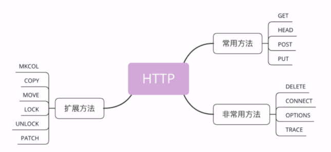

# 10 | 应该如何理解请求方法？

上一讲我介绍了 HTTP 的报文结构，它是由 header+body 构成，请求头里有请求方法和请求目标，响应头里有状态码和原因短语，今天要说的就是请求头里的请求方法。

## 标准请求方法

HTTP 协议里为什么要有“请求方法”这个东西呢？

这就要从 HTTP 协议设计时的定位说起了。还记得吗？蒂姆·伯纳斯 - 李最初设想的是要用 HTTP 协议构建一个超链接文档系统，使用 URI 来定位这些文档，也就是资源。那么，该怎么在协议里操作这些资源呢？

很显然，需要有某种“动作的指示”，告诉操作这些资源的方式。所以，就这么出现了“请求方法”。它的实际含义就是客户端发出了一个“动作指令”，要求服务器端对 URI 定位的资源执行这个动作。

目前 HTTP/1.1 规定了八种方法，单词**都必须是大写的形式**，我先简单地列把它们列出来，后面再详细讲解。

1. GET：获取资源，可以理解为读取或者下载数据；
2. HEAD：获取资源的元信息；
3. POST：向资源提交数据，相当于写入或上传数据；
4. PUT：类似 POST；
5. DELETE：删除资源；
6. CONNECT：建立特殊的连接隧道；
7. OPTIONS：列出可对资源实行的方法；
8. TRACE：追踪请求 - 响应的传输路径。



看看这些方法，是不是有点像对文件或数据库的“增删改查”操作，只不过这些动作操作的目标不是本地资源，而是远程服务器上的资源，所以只能由客户端“请求”或者“指示”服务器来完成。

既然请求方法是一个“指示”，那么客户端自然就没有决定权，服务器掌控着所有资源，也就有绝对的决策权力。它收到 HTTP 请求报文后，看到里面的请求方法，可以执行也可以拒绝，或者改变动作的含义，毕竟 HTTP 是一个“协议”，两边都要“商量着来”。

比如，你发起了一个 GET 请求，想获取“/orders”这个文件，但这个文件保密级别比较高，不是谁都能看的，服务器就可以有如下的几种响应方式：

1. 假装这个文件不存在，直接返回一个 404 Not found 报文；
2. 稍微友好一点，明确告诉你有这个文件，但不允许访问，返回一个 403 Forbidden；
3. 再宽松一些，返回 405 Method Not Allowed，然后用 Allow 头告诉你可以用 HEAD 方法获取文件的元信息。

## GET/HEAD

虽然 HTTP/1.1 里规定了八种请求方法，但只有前四个是比较常用的，所以我们先来看一下这四个方法。

**GET**方法应该是 HTTP 协议里最知名的请求方法了，也应该是用的最多的，自 0.9 版出现并一直被保留至今，是名副其实的“元老”。

它的含义是请求**从服务器获取资源**，这个资源既可以是静态的文本、页面、图片、视频，也可以是由 PHP、Java 动态生成的页面或者其他格式的数据。

GET 方法虽然基本动作比较简单，但搭配 URI 和其他头字段就能实现对资源更精细的操作。

例如，在 URI 后使用“#”，就可以在获取页面后直接定位到某个标签所在的位置；使用 If-Modified-Since 字段就变成了“有条件的请求”，仅当资源被修改时才会执行获取动作；使用 Range 字段就是“范围请求”，只获取资源的一部分数据。

**HEAD**方法与 GET 方法类似，也是请求从服务器获取资源，服务器的处理机制也是一样的，但服务器不会返回请求的实体数据，只会传回响应头，也就是资源的“元信息”。

HEAD 方法可以看做是 GET 方法的一个“简化版”或者“轻量版”。因为它的响应头与 GET 完全相同，所以可以用在很多并不真正需要资源的场合，避免传输 body 数据的浪费。

比如，想要检查一个文件是否存在，只要发个 HEAD 请求就可以了，没有必要用 GET 把整个文件都取下来。再比如，要检查文件是否有最新版本，同样也应该用 HEAD，服务器会在响应头里把文件的修改时间传回来。

你可以在实验环境里试一下这两个方法，运行 Telnet，分别向 URI“/10-1”发送 GET 和 HEAD 请求，观察一下响应头是否一致。

```
GET /10-1 HTTP/1.1
Host: www.chrono.com
 
 
HEAD /10-1 HTTP/1.1
Host: www.chrono.com
```

## POST/PUT

接下来要说的是**POST**和**PUT**方法，这两个方法也很像。

GET 和 HEAD 方法是从服务器获取数据，而 POST 和 PUT 方法则是相反操作，向 URI 指定的资源提交数据，数据就放在报文的 body 里。

POST 也是一个经常用到的请求方法，使用频率应该是仅次于 GET，应用的场景也非常多，只要向服务器发送数据，用的大多数都是 POST。

比如，你上论坛灌水，敲了一堆字后点击“发帖”按钮，浏览器就执行了一次 POST 请求，把你的文字放进报文的 body 里，然后拼好 POST 请求头，通过 TCP 协议发给服务器。

又比如，你上购物网站，看到了一件心仪的商品，点击“加入购物车”，这时也会有 POST 请求，浏览器会把商品 ID 发给服务器，服务器再把 ID 写入你的购物车相关的数据库记录。

PUT 的作用与 POST 类似，也可以向服务器提交数据，但与 POST 存在微妙的不同，通常 POST 表示的是“新建”“create”的含义，而 PUT 则是“修改”“update”的含义。

在实际应用中，PUT 用到的比较少。而且，因为它与 POST 的语义、功能太过近似，有的服务器甚至就直接禁止使用 PUT 方法，只用 POST 方法上传数据。

实验环境的“/10-2”模拟了 POST 和 PUT 方法的处理过程，你仍然可以用 Telnet 发送测试请求，看看运行的效果。注意，在发送请求时，头字段“Content-Length”一定要写对，是空行后 body 的长度：

```
POST /10-2 HTTP/1.1
Host: www.chrono.com
Content-Length: 17
 
POST DATA IS HERE
 
PUT /10-2 HTTP/1.1
Host: www.chrono.com
Content-Length: 16
 
PUT DATA IS HE
```

## 其他方法

讲完了 GET/HEAD/POST/PUT，还剩下四个标准请求方法，它们属于比较“冷僻”的方法，应用的不是很多。

**DELETE**方法指示服务器删除资源，因为这个动作危险性太大，所以通常服务器不会执行真正的删除操作，而是对资源做一个删除标记。当然，更多的时候服务器就直接不处理 DELETE 请求。

**CONNECT**是一个比较特殊的方法，要求服务器为客户端和另一台远程服务器建立一条特殊的连接隧道，这时 Web 服务器在中间充当了代理的角色。

**OPTIONS**方法要求服务器列出可对资源实行的操作方法，在响应头的 Allow 字段里返回。它的功能很有限，用处也不大，有的服务器（例如 Nginx）干脆就没有实现对它的支持。

**TRACE**方法多用于对 HTTP 链路的测试或诊断，可以显示出请求 - 响应的传输路径。它的本意是好的，但存在漏洞，会泄漏网站的信息，所以 Web 服务器通常也是禁止使用。

## 扩展方法

虽然 HTTP/1.1 里规定了八种请求方法，但它并没有限制我们只能用这八种方法，这也体现了 HTTP 协议良好的扩展性，我们可以任意添加请求动作，只要请求方和响应方都能理解就行。

例如著名的愚人节玩笑 RFC2324，它定义了协议 HTCPCP，即“超文本咖啡壶控制协议”，为 HTTP 协议增加了用来煮咖啡的 BREW 方法，要求添牛奶的 WHEN 方法。

此外，还有一些得到了实际应用的请求方法（WebDAV），例如 MKCOL、COPY、MOVE、LOCK、UNLOCK、PATCH 等。如果有合适的场景，你也可以把它们应用到自己的系统里，比如用 LOCK 方法锁定资源暂时不允许修改，或者使用 PATCH 方法给资源打个小补丁，部分更新数据。但因为这些方法是非标准的，所以需要为客户端和服务器编写额外的代码才能添加支持。

当然了，你也完全可以根据实际需求，自己发明新的方法，比如“PULL”拉取某些资源到本地，“PURGE”清理某个目录下的所有缓存数据。

## 安全与幂等

关于请求方法还有两个面试时有可能会问到、比较重要的概念：**安全**与**幂等**。

在 HTTP 协议里，所谓的“**安全**”是指请求方法不会“破坏”服务器上的资源，即不会对服务器上的资源造成实质的修改。

按照这个定义，只有 GET 和 HEAD 方法是“安全”的，因为它们是“只读”操作，只要服务器不故意曲解请求方法的处理方式，无论 GET 和 HEAD 操作多少次，服务器上的数据都是“安全的”。

而 POST/PUT/DELETE 操作会修改服务器上的资源，增加或删除数据，所以是“不安全”的。

所谓的“**幂等**”实际上是一个数学用语，被借用到了 HTTP 协议里，意思是多次执行相同的操作，结果也都是相同的，即多次“幂”后结果“相等”。

很显然，GET 和 HEAD 既是安全的也是幂等的，DELETE 可以多次删除同一个资源，效果都是“资源不存在”，所以也是幂等的。

POST 和 PUT 的幂等性质就略费解一点。

按照 RFC 里的语义，POST 是“新增或提交数据”，多次提交数据会创建多个资源，所以不是幂等的；而 PUT 是“替换或更新数据”，多次更新一个资源，资源还是会第一次更新的状态，所以是幂等的。

我对你的建议是，你可以对比一下 SQL 来加深理解：把 POST 理解成 INSERT，把 PUT 理解成 UPDATE，这样就很清楚了。多次 INSERT 会添加多条记录，而多次 UPDATE 只操作一条记录，而且效果相同。

## 小结

今天我们学习了 HTTP 报文里请求方法相关的知识，简单小结一下。

1. 请求方法是客户端发出的、要求服务器执行的、对资源的一种操作；
2. 请求方法是对服务器的“指示”，真正应如何处理由服务器来决定；
3. 最常用的请求方法是 GET 和 POST，分别是获取数据和发送数据；
4. HEAD 方法是轻量级的 GET，用来获取资源的元信息；
5. PUT 基本上是 POST 的同义词，多用于更新数据；
6. “安全”与“幂等”是描述请求方法的两个重要属性，具有理论指导意义，可以帮助我们设计系统。

## 课下作业

1. 你能把 GET/POST 等请求方法对应到数据库的“增删改查”操作吗？请求头应该如何设计呢？
2. 你觉得 TRACE/OPTIONS/CONNECT 方法能够用 GET 或 POST 间接实现吗？

欢迎你把自己的答案写在留言区，与我和其他同学一起讨论。如果你觉得有所收获，欢迎你把文章分享给你的朋友。

.png)精选留言(16)

- 

    壹笙☞漂泊

    2019-06-19

    答题：
    1、增：POST 删：DELETE 改：PUT 查：GET
    请求头如何设计，这个问题。。。不太明白。
    2、我认为可以，因为http协议具有很好的灵活性。具体的对资源操作是由服务器决定的。

    总结：
    Http/1.1规定了八种方法，单词必须都是大写的形式。
      \1. GET:获取资源，可以理解为读取或者下载数据
      \2. HEAD:获取资源的元信息;
      \3. POST:向资源提交数据，相当于写入或上传数据;
      \4. PUT:类似POST;
      \5. DELETE:删除资源;
      \6. CONNECT:建立特殊的连接隧道;
      \7. OPTIONS:列出可对资源实行的方法;
      \8. TRACE:追踪请求-响应的传输路径。

    GET/HEAD
      ——从服务器获取资源
      HEAD和GET类似，也是从服务器获取资源，但是不会返回请求的实体数据，只有响应头（元信息），是GET的简易版，如果不需要资源的话，可以避免传输body数据的浪费。

    POST/PUT
      ——向服务器提交数据，数据在body里
      PUT和POST作用类似，有微妙不同，通常POST标识新建，PUT标识修改

    DELETE
      ——删除资源，危险性大，很少用

    CONNECT
      ——要求服务器为客户端和另一台远程服务器建立一条特殊的链接，这时Web服务器充当代理的角色

    OPTIONS
      ——要求服务器列出可对资源实行的操作方法，在响应头Allow字段里返回。功能有限，用处不大。Nginx没支持

    TRACE
      ——用于对HTTP链路的测试或诊断，可以显示出请求 - 响应的传输路径。存在漏洞，会泄露网站的信息，所以通常也是禁止使用

    安全与幂等
      安全：在HTTP协议里，所谓的安全，是指请求方法不会对服务器上的资源造成实质的修改，so 只有GET和HEAD是安全的，因为是只读操作。
      幂等：多次执行相同的操作，结果也都是相同的。so GET和HEAD 即是安全的也是幂等的，DELETE可以多次删除同一个资源，效果都是“资源不存在”，所以也是幂等。POST是新增或提交数据，多次提交会创建多个资源，所以不是幂等的。PUT是替换或更新数据，多次更新一个资源，资源还是第一次更新的状态。所以是幂等的。
      幂等：GET、HEAD、DELETE、PUT
      非幂等：POST

    

    作者回复: 总结的非常好。
    问题里的“请求头如何设计”，意思是说相关的curd参数应该放在什么地方，比如用query参数或者是字段，只是一个提示，不是要必须如何如何做。

    **

    **2

- 

    大小兵

    2019-06-19

    真希望快点更新啊，看的不过瘾！

    作者回复: 慢慢来。

    **

    **2

- 

    业余爱好者

    2019-06-19

    之前做一个网站的cms,觉得又是一套crud,毫无新意，闲得慌，于是玩了一波restful"架构"。严格按照http规范，比如，查询都用GET，新增用POST，更新用PUT，删除用DELETE，url的设计也按照rest风格设计。现在想想，tomcat支持这几种http方法也是万幸，不然的话，又得加班换成get/post了。

    这段经历我认识到，http只是一种协议，不同的服务器，还有客户端，比如浏览器都可以有自己的实现。虽然各自在实现上有所取舍，但大体上，按照协议规范来，不会差。

    协议，是个好东西。。

    作者回复: 请求方法的设计思想非常好，动词可以表示各种操作，所以非常适合RESTful。

    **

    **2

- 

    一步

    2019-06-19

    老师 WebDav 这一块会详细讲嘛？ 有这块的需求，或者有没有好的文档

    作者回复: 这块我基本没用过，它也不是http标准里面的，抱歉了。

    **

    **1

- 

    一步

    2019-06-19

    OPTIONS 方法还是用的很多的，CORS跨域请求必须用到OPTIONS方法了

    作者回复: 我接触的领域里options用的比较少，可能有点孤陋寡闻了。

    **

    **1

- 

    10

    2019-06-19

    我采用POST /10-2 HTTP/1.1的指令写了10-2的内容为“POST DATA IS HERE”，然后我采用GET /10-2 HTTP/1.1的指令去读内容 返回的“200 OK”，但实体body的内容只是一个“0”，而非前面写的“POST DATA IS HERE”
    请问难道我前面的POST指令没有写成功么？

    作者回复: 测试用的URI“10-2”不支持存储数据，所以post的数据只能在当次请求生效。

    另外发现这两测试uri有小bug，已经修复，请及时git pull更新。

    **

    **1

- 

    许童童

    2019-06-19

    请求头里面应该要包含 请求的目标
    也就是对应数据库里面行

    **

    **1

- 

    趙衍

    2019-06-19

    关于Post和Get之间的区别，我一直很困惑，因为其实我们也可以在Get的请求体里写参数，用Get去修改资源；或者在Post的请求头上去写参数，用它去获取资源。所以他们两者之间到底有什么区别呢？希望老师可以指教一下！

    作者回复: 就是个使用的习惯和约定，就像是红绿灯，不是强制要求你必须遵守，但大家都按照这样做沟通起来顺畅。

    要理解协议的含义，要求你遵守，但不强制。

    **

    **1

- 

    天，很蓝 ～

    2019-06-23

    PUT方法的Content-Length是不是和body的长度对不上

    作者回复: body里漏写了两个字母，应该是“PUT DATA IS HERE”

    **

    **

- 

    彧豪

    2019-06-19

    老师，话说我昨天实际项目终于到一个问题：
    get请求带上查询字符串例如?name=a+b，但是打开chrome的控制台network选项卡发现请求url那是对的，是xxx?name=a+b，但是最后的查询字符串那那里是name: a b，+号变成了空格，java那边收到的也是a b……
    最后的解决方法是我这边encodeURIComponent一下，java那边URLDecoder.decode一下即可
    但是我不明白为何会如此，为何get请求的查询字符串中带+号，浏览器会将其变为空格
    在浏览器控制台network选项卡底端的query string parameters那有个"view URL encoded"按钮，点了之后name:a b变为name:a+b，这就意味着空格被转义成了+号，那是不是这个a和b之间的字符(串)实际不是空格呢？毕竟我暂时想不到什么方法能将空格转义为+号
    关于+号变空格的问题希望老师能指点迷津，感谢

    作者回复: 下一讲里面的url编码就会谈到。
    uri里面有些字符是不允许出现的，需要编码和解码，而+正好就被解码成了空格。

    你刚才也说了，会用到encodeURI这样的函数。

    