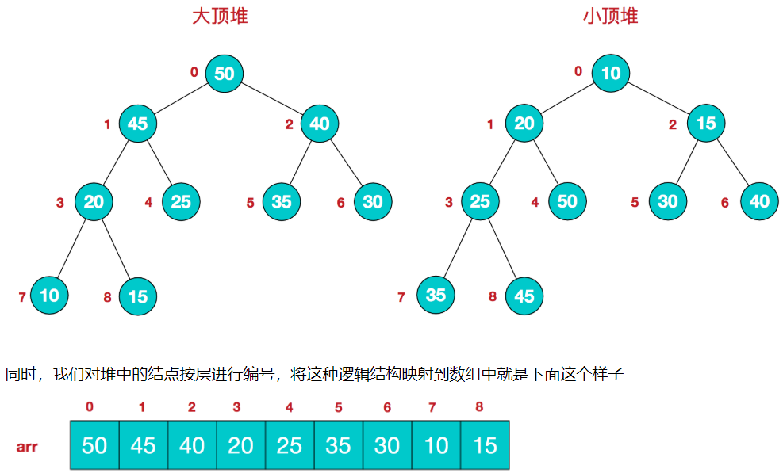
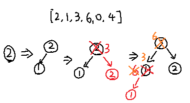

# AlgorithmEasyDay01

[toc]

# 一、时间复杂度和空间复杂度

## （一）时间复杂度

- 常数时间的操作：一个操作和样本数据量没有关系，每次都是在固定的时间内完成，叫做常数操作；
- 操作数量表达式中，只要高阶项，不要低阶项，去掉高阶项的系数，比较先比较次幂，然后比较系数以及其他项；
-  可以将 O(1) 看做每一次操作的时间；

**以一个示例比较：**（示例一）

一个有序数组A，另一个无序数组B，请打印B中的所有不在A中的数，A数
组长度为N，B数组长度为M。

- **算法流程1**：对于数组B中的每一个数，都在A中通过遍历的方式找一下；
相当于：B 中每一个数都要在 A 中遍历一遍，则需要操作 N 遍，而 B 中 M 个数都需要按照上面操作一遍，共操作 M * N 遍，因此时间复杂度为：$O(M * N)$；
- **算法流程2**：对于数组B中的每一个数，都在A中通过**二分的方式**找一下；
因为 A 中数组是有序的，因此可以进行二分查找，因此整体时间复杂度为：$O(M * \log_{2}^{N})$；
- **算法流程3**：先把数组B排序，然后用类似外排的方式打印所有不在A中出现的数；
因为可以是会用快速排序对数组 B 进行排序，因此时间复杂度为：$M * \log_{2}^{M}$，==**外排思想：**==  数组 A 开头放置下标 a，数组 B 开头放置下标 b，比较两个下标指向的值，如果 a >=  b  指向的值，则 b 向右移动，否则 a 向右移动，其中若 b 指向的值  < a 指向的值，则 b 向右移动同时打印 b 指向的数，若等于则向右移动不打印；
因此整体外排时间复杂度最差为 $$O(M + N)$$，因此整个流程时间复杂度为：$O(M * log_{2}^{M}) + O(M + N)$

**总结：** 流程一：$O(M * N)$，流程二：$O(M * \log_{2}^{N})$，流程三：$O(M * log_{2}^{M}) + O(M + N)$；当 A 数组较短的时候，流程二较好，当 B 数组较短的时候，流程三较好（因为流程三需要对 B 进行排序）；


二分查找： **二分查找前提是该数组必须有序**，每次进行查找都是将数组划分一半，N 样本的数组一共可以划分 $\log_{2}^{N}$次，因此时间复杂度为$O(\log_{2}^{N})$

```java
package sort.com.gjxaiou.easy.day01;

import java.util.ArrayList;
import java.util.Arrays;
import java.util.HashMap;
import java.util.List;

public class GetAllNotIncluded {
	public static List<Integer> GetAllNotIncluded(int[] A, int[] B) {
		List<Integer> res = new ArrayList<>();
		for (int i = 0; i < B.length; i++) {
			int l = 0;
			int r = A.length - 1;
			boolean contains = false;
			while (l <= r) {
				int mid = l + ((r - l) >> 1);
				if (A[mid] == B[i]) {
					contains = true;
					break;
				}
				if (A[mid] > B[i]) {
					r = mid - 1;
				} else {
					l = mid + 1;
				}
			}
			if (!contains) {
				res.add(B[i]);
			}
		}
		return res;
	}
}
```


## （二）空间复杂度
就是在操作的过程中需要的**额外的空间**，如果仅仅需要有限个变量：$O(1)$，如果**需要原来数组的长度或者和样本数有关**，则为：$O(N)$；


## （三）master 公式

一般的时间复杂度公式可以表示为：$T(N) = aT(\frac{N}{b}) + O({N}^{d}))$，其中 N 表示整个过程的样本量，$\frac{N}{b}$表示划分之后子过程的样本量，a 表示子过程共发生多少次，后面的：$O({N}^{d}))$ 表示除了子过程之外其它操作的时间复杂度，==**这里的子过程只是划分一次之后的数量**== ，并且划分的子问题应该规模相同；
如果一个过程的时间复杂度表示为：$T(N) = aT(\frac{N}{b}) + O({N}^{d}))$，则可以根据 master 公式化为以下结果：

- $\log_{b}^{a} < d$ ：复杂度为：$O({N}^{d})$；
- $\log_{b}^{a} = d$ ：复杂度为：$O({N}^{d} *{\log_{2}^{N}})$；
- $\log_{b}^{a} > d$ ：复杂度为：$O({N}^{log{b}^{a}})$；

**测试程序：**

**小和问题：**
在一个数组中，每一个数左边比当前数小的数累加起来，叫做这个数组的小和。求一个数组的小和。

```java
[1,3,4,2,5]
1左边比1小的数，没有；
3左边比3小的数，1；
4左边比4小的数，1、3；
2左边比2小的数，1；
5左边比5小的数，1、3、4、2；
所以小和为1+1+3+1+1+3+4+2=16
```

**求解：**
将该数组不断的切分`[1,3,4][2,5]`，然后再次切分：`[1,3][4][2][5]`,最后切分为：`[1][3][4][2][5]`;
这里以 1 为例，`[1][3]` 中有一个 1（即 3 的左边有一个 1 比他小），然后[1,3]和[4]，有一个 1（即 4 左边有一个 1 比他小），然后 [1,3,4]和 [2,5]，有两个 1（即 2 和 5 左边有一个 1 比它小），最终以 1 为例的小和为：1 + 1 + 2*1 = 4;其他类似；
**过程**

- 将当前序列分为两个子序列，分别求其小和  
- 对 a 划分得到的两个子序列进行 merge 操作，得到合并过程产生的小和，再加上a得到的两个子序列的小和之和  
- c. 递归地执行a和b

merge操作采用二路归并排序的思想  

求一个数组的小和，可以转化为求每个元素在小和累加过程出现的次数，然后将当前元素与出现次数相乘，累加得到小和  
假设当前元素为a，a右边比a大的元素个数则为a在小和累加过程出现的次数

```java
package com.gjxaiou.easy.day01;  
  
/**  
 * 小和问题  
  * 解决思路：  
  * 1.借助于归并排序，首先将原数组分为两部分  
  * 2.对划分的两个子序列进行 merge 操作，得到合并过程重产生的小和，再加上前面两个子序列的小和  
  * 3.递归的执行 1，2 步骤。  
  */  
public class SmallSum {  
  
   public static int smallSum(int[] sourceArray) {  
      if (sourceArray == null || sourceArray.length < 2) {  
         return 0;  
      }  
      return mergeSort(sourceArray, 0, sourceArray.length - 1);  
   }  
  
   public static int mergeSort(int[] sourceArray, int left, int right) {  
      if (left == right) {  
         return 0;  
      }  
      int mid = left + ((right - left) >> 1);  
      // 最终的小和数目为分开数组分别求得的小和加上合并之后的小和  
  return mergeSort(sourceArray, left, mid) + mergeSort(sourceArray, mid + 1, right) + merge(sourceArray, left, mid, right);  
   }  
  
   public static int merge(int[] arr, int left, int mid, int right) {  
      int[] help = new int[right - left + 1];  
      int i = 0;  
      int startLeft = left;  
      int startRight = mid + 1;  
      int res = 0;  
      while (startLeft <= mid && startRight <= right) {  
         // 因为两个序列都是按照从小到大排序好的，所以一旦 startLeft　＜　startRight　则相当于 arr[startLeft]　是　startRight + 1　～　right　之间所有元素的小和  
  res += arr[startLeft] < arr[startRight] ? (right - startRight + 1) * arr[startLeft] : 0;  
         help[i++] = arr[startLeft] < arr[startRight] ? arr[startLeft++] : arr[startRight++];  
      }  
      while (startLeft <= mid) {  
         help[i++] = arr[startLeft++];  
      }  
      while (startRight <= right) {  
         help[i++] = arr[startRight++];  
      }  
      for (i = 0; i < help.length; i++) {  
         arr[left + i] = help[i];  
      }  
      return res;  
   }  
  
   // --------对数器-----------  
 // 这里仅仅保留作为比较的绝对正确的方法，其它例如随机数产生器和比较器和上面一样  
  public static int comparator(int[] arr) {  
      if (arr == null || arr.length < 2) {  
         return 0;  
      }  
      int res = 0;  
      for (int i = 1; i < arr.length; i++) {  
         for (int j = 0; j < i; j++) {  
            res += arr[j] < arr[i] ? arr[j] : 0;  
         }  
      }  
      return res;  
   }  
    
}
```


# 二、排序算法

## （一）冒泡排序
两两比较，将较大的一个一个向上冒，**每次只能排好一个数**；

时间复杂度：$O(N^{2})$，空间复杂度：$O(1)$

```java
import java.util.Arrays;

public class BubbleSort {
    public static void bubbleSort(int[] sourceArray) {
        if (sourceArray == null || sourceArray.length < 2) {
            return;
        }
        // end 刚开始在 length-1,但是得大于零，每排完一圈就确定一个最大值，然后值减一；
        for (int end = sourceArray.length - 1; end > 0; end--) {
            for (int start = 0; start < end; start++) {
                if (sourceArray[start] > sourceArray[start + 1]) {
                    swap(sourceArray, start, start + 1);
                }
            }
        }
    }

    public static void swap(int[] sourceArray, int left, int right) {
        sourceArray[left] = sourceArray[left] ^ sourceArray[right];
        sourceArray[right] = sourceArray[left] ^ sourceArray[right];
        sourceArray[left] = sourceArray[left] ^ sourceArray[right];
    }
}    
```

## （二）选择排序
首先从 `1 ~ N-1` 上选择最小的数和 `0` 位置上互换，然后才能够 `2 ~ N-1` 上选择最小的数和 `1` 位置上互换.....，**每次只能排好一个数**；

时间复杂度：$O(N^{2})$，空间复杂度：$O(1)$

```java
package sort.com.gjxaiou;

import java.util.Arrays;

public class SelectionSort {

    public static void selectionSort(int[] sourceArray) {
        if (sourceArray == null || sourceArray.length < 2) {
            return;
        }
        for (int start = 0; start < sourceArray.length - 1; start++) {
            int minIndex = start;
            // 从 i + 1 位置到最后的最小的数下标
            for (int cur = start + 1; cur < sourceArray.length; cur++) {
                minIndex = sourceArray[cur] < sourceArray[minIndex] ? cur : minIndex;
            }
            swap(sourceArray, start, minIndex);
        }
    }

    public static void swap(int[] sourceArray, int left, int right) {
        int tmp = sourceArray[left];
        sourceArray[left] = sourceArray[right];
        sourceArray[right] = tmp;
    }
}
```

**注意：**
上面的交换程序可以改为：
```java
 public static void swap(int[] sourceArray, int left, int right) {
        if (left == right){
            return;
        }
        sourceArray[left] = sourceArray[left] ^ sourceArray[right];
        sourceArray[right] = sourceArray[left] ^ sourceArray[right];
        sourceArray[left] = sourceArray[left] ^ sourceArray[right];
    }
```
因为如果之前 `minIndex` 没有改变，则 `start` 与 `minIndex` 是相等的，在进行 `swap()` 的时候，`arr[left] = arr[left] ^ arr[right];`相当于对两个相同的数做异或运算，结果是 `0`。`swap()` 函数出现错误。可以在`swap()` 函数加上`if(left==right)return;`来解决。

交换数组中的两个数，一个数自己与自己异或结果为0；一个数与0异或，结果还是自己。

## （三）插入排序
首先**默认第一个数（0）是排好序的**，然后拿第二个数和第一个数比较，如果比第一个数小，就互换，反之不动，这样 0~1 位置上是排好序的；然后拿第三个数和第二个数比较，比他小就互换，如果更换之后再次和第一个数比较，看是否需要互换，最终 0~2 位置上是排好序的.......

最好的情况是原来就有序：$O(N)$，最差的情况是原来就是倒序的：$O(N^{2})$；因此最终的时间复杂度为：$O(N^{2})$，空间复杂度：$O(1)$；
```java
package com.gjxaiou.easy.day01;

/**
 * @author GJXAIOU
 * @create 2019-10-04-20:02
 */
import java.util.Arrays;

public class InsertionSort {

    public static void insertionSort(int[] sourceArray) {
        if (sourceArray == null || sourceArray.length < 2) {
            return;
        }
        for (int end = 1; end < sourceArray.length; end++) {
            for (int cur = end - 1; cur >= 0; cur--) {
                if (sourceArray[cur] > sourceArray[cur + 1]) {
                    swap(sourceArray, cur, cur + 1);
                }
            }
        }
    }

    public static void swap(int[] sourceArray, int left, int right) {
        sourceArray[left] = sourceArray[left] ^ sourceArray[right];
        sourceArray[right] = sourceArray[left] ^ sourceArray[right];
        sourceArray[left] = sourceArray[left] ^ sourceArray[right];
    }
}
```

## （四）归并排序
归并排序（MERGE-SORT）是利用**归并**的思想实现的排序方法，该算法采用经典的**分治**（divide-and-conquer）策略（分治法将问题 **分**(divide) 成一些小的问题然后递归求解，而 **治(conquer)** 的阶段则将分的阶段得到的各答案"修补"在一起，即分而治之)。

流程：首先将数组对半分为两个部分，然后分别对左右两边进行排序；最后对整体进行外排；
**重点关注：最后整体的外排**


```java
package com.gjxaiou.easy.day01;

import java.util.Arrays;

/**
 * 归并排序
 *
 * @author GJXAIOU
 */
public class MergeSort {
    public static void mergeSort(int[] sourceArray) {
        if (sourceArray == null || sourceArray.length < 2) {
            return;
        }
        mergeSort(sourceArray, 0, sourceArray.length - 1);
    }

    public static void mergeSort(int[] sourceArray, int left, int right) {
        if (left == right) {
            return;
        }
        // 求数组中间点，将数组划分为两部分
        int mid = (left + right) >>> 1;
        mergeSort(sourceArray, left, mid);
        mergeSort(sourceArray, mid + 1, right);
        merge(sourceArray, left, mid, right);
    }

    public static void merge(int[] sourceArray, int left, int mid, int right) {
        // 准备一个和原数组等长的辅助数组；
        int[] help = new int[right - left + 1];
        int i = 0;
        int startLeft = left;
        int startRight = mid + 1;
        while (startLeft <= mid && startRight <= right) {
            help[i++] = sourceArray[startLeft] < sourceArray[startRight] ?
                    sourceArray[startLeft++] : sourceArray[startRight++];
        }
        // 上面的 while 循环会将一个数组中元素全部挪到 help 数组中，而另个数组还会剩余最后几个元素
        // 将剩余的一个数组中剩余的元素全部移到 help 数组中，这两个 while 只会执行一个
        while (startLeft <= mid) {
            help[i++] = sourceArray[startLeft++];
        }
        while (startRight <= right) {
            help[i++] = sourceArray[startRight++];
        }
        for (i = 0; i < help.length; i++) {
            sourceArray[left + i] = help[i];
        }
    }
}
```

**示例：** 原来数组元素为：`3，6，4，5，2，8`；首先划分为：`Left:[3,6,4]` 和 `right:[5,2,8]`；然后将他们分别排序为：`Left:[3,4,6]` 和 `Right:[2,5,8]`，然后左右各取指针 `a,b`，同时准备一个辅助数组，长度和原数组长度相同；然后比较 `a,b` 指向元素的大小，哪一个小哪一个就放进数组，同时下标 `+ 1`，然后再次比较，直到某一方全部放入数组，则另一方剩余的全部放入数组，最后将该数组拷贝回原来数组；
因为一共 N 的样本，分为两个一样的部分，每部分的时间复杂度为 ：$T(\frac{\mathrm{N}}{2})$，每一部分进行比较等操作为：$O(N)$，因此时间复杂度为：$T(N) = 2* T({\frac{N}{2}}) + O(N)$，根据 master 公式结果为：$O(N * \log_{2}^{N})$ 
空间复杂度：$O(N)$


## （五）快速排序

### 1.荷兰国旗类问题（数组划分）

#### 问题一：按给定值分割数组

给定一个数组 `arr`，和一个数 `num`，请把小于等于 `num` 的数放在数组的左边，大于 `num` 的数放在数组的右边。
要求额外空间复杂度 O(1)，时间复杂度 O(N)；


其中 `less` 初始坐标为 `Left - 1`，表示 `<=left`位置上放置的都是 `<= num` 值的数，然后依次向右遍历，如果该数大于 `num`，则 `less` 不动，直接判断下一个数，如果该数小于等于 `num`，则该数和 `less + 1` 位置上的数互换， `less` 向右移动一位，即 `less + 1`，然后继续判断下一个数；以此类推；

```java
package com.gjxaiou.easy.day01;

import java.util.Arrays;

/**
 * 分割数组
 * 注：该算法会调整数组中元素顺序，所以不能直接和对数器逐个值比较
 *
 * @author GJXAIOU
 * @create 2019-10-07-15:03
 */
public class SplitArray {
    /**
     * @param sourceArray 输入的原数组
     * @param left        需要判断的数组左区间下标：默认为 0
     * @param right       需要判断的数组左区间下标：默认为 sourceArray.length - 1
     * @param tagMum      目标值
     */
    public static void sort(int[] sourceArray, int left, int right, int tagMum) {
        int less = left - 1;
        while (left <= right) {
            if (sourceArray[left] <= tagMum) {
                // 因为 less 的下一位就是大于 tagMum 的数
                // 如果没有这个判断，则如果数组最后一位则不会处理
                if (left == right) {
                    swap(sourceArray, left, ++less);
                }
                swap(sourceArray, left++, ++less);
            } else {
                left++;
            }
        }
        return;
    }

    public static void swap(int[] sourceArray, int left, int right) {
        if (left == right) {
            return;
        }
        sourceArray[left] = sourceArray[left] ^ sourceArray[right];
        sourceArray[right] = sourceArray[left] ^ sourceArray[right];
        sourceArray[left] = sourceArray[left] ^ sourceArray[right];
    }

    
    
    // 测试方法
    public static void main(String[] args) {
        int[] sourceArray = {1, 2, 8, -2, 4, 3, 4, 2, 8, 12, 3, 9, 8, 10, 9, 5, -1, 4, 9, 2};
        int[] sourceArray2 = copyArray(sourceArray);
        int left = 0;
        int right = sourceArray.length - 1;
        int tagMum = 6;

        System.out.println("原数组为：");
        for (int i : sourceArray) {
            System.out.print(i + " ");
        }

        sort(sourceArray, left, right, tagMum);

        System.out.println("\n分割之后数组为：");
        for (int i = 0; i < sourceArray.length; i++) {
            System.out.print(sourceArray[i] + " ");
        }

        System.out.println("\n---对数器输出结果-----");
        compare(sourceArray2, 6);
        for (int i = 0; i < sourceArray2.length; i++) {
            System.out.print(sourceArray2[i] + " ");
        }

        boolean equal = isEqual(sourceArray, sourceArray2, tagMum);
        System.out.println("\n" + equal);
    }

    // ---------对数器---------------------
    // 思路：遍历数组中每一个元素，小于等于 tagNum 放置于一个数组，大于 tagNum 放置于一个数组，最后将两个数组进行合并，可以保证和数组原顺序一致
    public static void compare(int[] sourceArray, int tagNum) {
        int[] lessArr = new int[sourceArray.length];
        int[] moreArr = new int[sourceArray.length];
        int less = 0;
        int more = 0;
        for (int i = 0; i < sourceArray.length; i++) {
            if (sourceArray[i] <= tagNum) {
                lessArr[less++] = sourceArray[i];
            } else {
                moreArr[more++] = sourceArray[i];
            }
        }
        for (int i = 0; i < more; i++) {
            lessArr[less++] = moreArr[i];
        }
        for (int i = 0; i < lessArr.length; i++) {
            sourceArray[i] = lessArr[i];
        }
        return;
    }


    public static int[] copyArray(int[] sourceArray) {
        int[] res = new int[sourceArray.length];
        if (sourceArray == null || sourceArray.length == 0) {
            return res;
        }	
        for (int i = 0; i < sourceArray.length; i++) {
            res[i] = sourceArray[i];
        }
        return res;
    }

    // 依次比较两个数组在相同位置上元素和 tagNum 的关系
    public static boolean isEqual(int[] arr1, int[] arr2, int tagNum) {
        boolean[] booleanArr1 = new boolean[arr1.length];
        boolean[] booleanArr2 = new boolean[arr2.length];
        for (int i = 0; i < arr1.length; i++) {
            booleanArr1[i] = (arr1[i] <= tagNum);
            booleanArr2[i] = (arr2[i] <= tagNum);
        }
        return Arrays.equals(booleanArr1, booleanArr2);
    }
}
```

程序运行结果为：

```java
原数组为：
1 2 8 -2 4 3 4 2 8 12 3 9 8 10 9 5 -1 4 9 2 
分割之后数组为：
1 2 -2 4 3 4 2 3 5 -1 4 2 9 10 9 8 12 8 9 8 
---对数器输出结果-----
1 2 -2 4 3 4 2 3 5 -1 4 2 8 8 12 9 8 10 9 9 
true
```

#### 问题二：荷兰国旗问题

**【问题】**： 给定一个数组 `arr`，和一个数 `num`，请把小于 `num` 的数放在数组的左边，等于 `num` 的数放在数组的中间，大于`num` 的数放在数组的右边。
**【要求】**： 额外空间复杂度 O(1)，时间复杂度 O(N)


x 坐标为 L - 1，y 坐标为 R + 1，两边分别表示小于 num 和大于 num 的值，当前位置坐标为 cur，然后依次向右遍历，如果该数小于 num，则该数和小于区域最右边下标（x）的下一个坐标元素交换，小于区域向右扩充（即 x + 1），如果该数等于 num ,则 cur 指向下一个元素，如果大于 num，则该数和大于区域最左边区域的前一个坐标元素交换，大于区域向左扩充一个（即 y - 1），然后这里**交换回来的数还需要按照上面的标准进行判断**，直到 cur 和 又边界相遇停止；

```java
package com.gjxaiou.easy.day01;

/**
 * @author GJXAIOU
 * 荷兰国旗问题
 */
public class NetherlandsFlag {
    /**
     * @param sourceArray：要分割的数组
     * @param left        ：数组左边界
     * @param right：数组右边界
     * @param tagNum：用于分割的参考数字
     * @return
     */
    public static int[] partition(int[] sourceArray, int left, int right, int tagNum) {
        // less 表示小于 tagNum 区域最右边数，more 是大于 tagNum 区域最左边数
        int less = left - 1;
        int more = right + 1;
        while (left < more) {
            if (sourceArray[left] < tagNum) {
                swap(sourceArray, ++less, left++);
            } else if (sourceArray[left] > tagNum) {
                // 从大于区域换过来的值还需要再次判断
                swap(sourceArray, --more, left);
            } else {
                left++;
            }
        }
        return new int[]{less + 1, more - 1};
    }

    public static void swap(int[] sourceArray, int left, int right) {
        int tmp = sourceArray[left];
        sourceArray[left] = sourceArray[right];
        sourceArray[right] = tmp;
    }
}
```

### 2.经典快排

**首先以数组最后一个数值为基准，将小于等于该数值的全部放在数组前半部分，大于该数值的全部放在数组的后半部分，然后前半部分和后半部分分别以该部分最后一个元素为基准重复以上步骤；**

**改进**：使用荷兰国旗思想
首先还是选取数组最后一个值为基准，但是遍历判断的时候最后一个值不再进行判断，即只有 L ~ R - 1 的值与基准进行比较，同时区域划分为三个区域：小于基准、等于基准、大于基准；然后将小于基准和大于基准部分进行再次取最后一个数，同上进行比较.....最后全部比较结束之后，将最后一个基准值放在大于该基准的范围的前一个位置；

- 经典快排和数据的状态有关：
    - 当小于最后一个数值的元素个数 远大于 大于最后一个数组的元素个数时候，或者反之情况，时间复杂度都是：$O({N}^{2})$
    - 如果数据状态较好，即大于和小于差不多的情况下，时间复杂度为：$T(N) = 2T(\frac{N}{2}) + O(N) = O(N * log_{2}^{N})$
    
    - 经典快排的空间复杂度为：$O(N)$

### 3.随机快速排序

通过随机选一个数和最后一个数进行互换，使得每次划分标准都在改变；
根据随机性，随机快速排序的时间复杂度是：$O(N * \log_{2}^{N})$，同时需要空间复杂度为：$O(\log_{2}^{N})$，这里的额外空间主要用于记录每次划分区域的断点；

```java
package com.gjxaiou.easy.day01;

/**
 * 随机快排
 * @author GJXAIOU
 * @create 2019-10-04-20:08
 */
public class QuickSort {
    /**
     * 首先调用该方法，可以设置排序的区间，默认为 0 ~ length-1；
     * @param sourceArray：需要排序的数组
     */
    public static void quickSort(int[] sourceArray) {
        if (sourceArray == null || sourceArray.length < 2) {
            return;
        }
        quickSort(sourceArray, 0, sourceArray.length - 1);
    }

    /**
     * @param sourceArray：需要排序的数组
     * @param left：排序数组左边界，一般为：0
     * @param right：排序数组右边界，一般为：length - 1;
     * equalsPart[0]：等于参照元素区域的最左边边界；
     * equalsPart[1]：等于参数元素区域的最右边边界；
     * 划分区域总结：
     *  小于参照元素区域：[Left ~ equalsPart[0] - 1];
     *  等于参照元素区域：[equalsPart[0] ~ equalsPart[1]]；
     *  大于参照元素区域：[equalsPart[1] + 1 ~ right]；
     */
    public static void quickSort(int[] sourceArray, int left, int right) {
        if (left < right) {
            // 将本部分数组最右边和本部分数组中任一元素进行交换
            swap(sourceArray, left + (int) (Math.random() * (right - left + 1)), right);
            int[] equalsPart = partition(sourceArray, left, right);
            quickSort(sourceArray, left, equalsPart[0] - 1);
            quickSort(sourceArray, equalsPart[1] + 1, right);
        }
    }

    /**
     * 以数组最后一个元素为标准，将整个数组划分为 小于、等于、大于 三个部分
     * less：小于参照元素区域的最右边边界：
     * more：大于参照元素区域的最左边边界：
     */
    public static int[] partition(int[] sourceArray, int left, int right) {
        int less = left - 1;
        // 因为本身 right 位置是参考，不参与排序，所以 more 
        int more = right;
        while (left < more) {
            if (sourceArray[left] < sourceArray[right]) {
                // 相当于不变，只是 less 和 left 分别向右移动一位
                swap(sourceArray, ++less, left++);
            } else if (sourceArray[left] > sourceArray[right]) {
                // 将该值放入大于区域的右边界
                swap(sourceArray, --more, left);
            } else {
                left++;
            }
        }
        // 因为 more 是大于区域左边边界，right 是等于区域的，所有应该交换
        swap(sourceArray, more, right);
        // 返回等于区域
        return new int[]{less + 1, more};
    }

    // 交换两下标对应元素
    public static void swap(int[] sourceArray, int left, int right) {
        int tmp = sourceArray[left];
        sourceArray[left] = sourceArray[right];
        sourceArray[right] = tmp;
    }

    // 测试程序
    public static void main(String[] args) {
        int[] arr = {43, -31, 10, -38, -42, -2, 22, 29, 30, 15, -60, -50, -13, 26, 3, 22, 27, 24, 18, 18, 42, -40, 22, 8, 33, -52, -70, -55, 31, 42, 82, 19, -8, 8, 41, -35, 59, 65, -23, 3, -34, 65};
        System.out.println("原数组为：");
        for (int i = 0; i < arr.length; i++) {
            System.out.print(arr[i] + "  ");
        }

        quickSort(arr);
        System.out.println("\n排序后数组为：");
        for (int i = 0; i < arr.length; i++) {
            System.out.print(arr[i] + "  ");
        }
    }
}
```

程序运行结果：

```java
原数组为：
43  -31  10  -38  -42  -2  22  29  30  15  -60  -50  -13  26  3  22  27  24  18  18  42  -40  22  8  33  -52  -70  -55  31  42  82  19  -8  8  41  -35  59  65  -23  3  -34  65  
排序后数组为：
-70  -60  -55  -52  -50  -42  -40  -38  -35  -34  -31  -23  -13  -8  -2  3  3  8  8  10  15  18  18  19  22  22  22  24  26  27  29  30  31  33  41  42  42  43  59  65  65  82 
```


## （六）堆排序

**满二叉树**：所有的分支结点都存在左子树和右子树，且所有的叶子都在同一层；

**完全二叉树**：对一棵具有 n 个节点的二叉树按照层序进行编号，如果编号 i （1<=i<=n）的结点与同样深度的满二叉树中编号为 i 的结点位置完全相同；即==对于完全二叉树，结点 i 的左孩子序号为：2i + 1；右孩子序号为：2i + 2；父结点的序号为：$\frac{i - 1}{2}$==。

### 1.堆

- **==堆是一个完全二叉树==**，可以采用数组进行实现；可以分为两类：
    - 大根堆：每棵树（包括任意一棵子树）的最大值都是其头部（父结点）：`arr[i] >= arr[2i+1] && arr[i] >= arr[2i+2]`
    - 小根堆：每棵树（包括任意一棵子树）的最小值都是其头部（父结点）：`arr[i] <= arr[2i+1] && arr[i] <= arr[2i+2]`



### 2.数组转换为大根堆

**举个栗子** ：以数组 `[2,1,3,6,0,4]` 为例

- 首先取出第 `0` 号元素 `2` 作为头结点；

- 然后取出第 `1` 个元素 `1`，该元素的父结点为：$\frac{1 - 1}{2} = 0$，所以和 `0` 位置元素相比，结果该值 `1` 比  `2` 小，放在左孩子位置，数组元素为：`[2,1]`；

- 然后取出第 `2` 个元素 `3`，计算该元素的父结点：$\frac{2 - 1}{2} = 0$，则与 `0` 位置元素 `2` 进行比较，发现 `3` 比较大，则在数组中将 `3` 和 `2` 两个元素互换，则数组变为：`[3,1,2]`；
- 然后取出第 `3` 个元素 `6`，计算父结点下标为：$\frac{3 - 1}{2} = 1$，则与 `1` 位置的元素 `1` 进行比较，发现 `6` 比较大，则将元素 `1` 和元素 `6` 互换，得到 `[3,6,2,1]`，然后再比较元素 `6` 和其父结点：$\frac{1 - 1}{2} = 0$，比较得出 `6` 比 `3` 大，然后再换，最后得到数组为：`[6,3,2,1]`，剩下元素依次类推......



==**每加入一个节点其最多比较的次数和已经形成的二叉树高度有关**（因为每次只和其父结点比较），因此最多时间复杂度为：$O(log_{2}^{N})$，所有整个转换过程时间复杂度为：$log_{2}^{1} + log_{2}^{2} + ..... + log_{2}^{N} = O(N)$==

### 3.堆排序

[详细示例步骤可以看这里](https://www.cnblogs.com/chengxiao/p/6129630.html)

- **步骤一：首先将待排序序列构造成一个大顶堆，此时，整个序列的最大值就是堆顶的根节点。**

- **步骤二：将堆顶与末尾元素进行交换，此时末尾就为最大值。**
- **然后堆大小减一，即将剩余 n-1 个元素通过 heapify 调整重新构造成一个堆，这样会得到 n 个元素的次小值。如此反复执行，便能得到一个有序序列了**。

```java
package sort.com.gjxaiou.easy.day01;

/**
 * @author GJXAIOU
 * @create 2019-10-04-20:08
 */
import java.util.Arrays;

public class HeapSort {

    public static void heapSort(int[] arr) {
        if (arr == null || arr.length < 2) {
            return;
        }
        // 首先将数组转化为大根堆；0 到  i 之间形成大根堆
        for (int i = 0; i < arr.length; i++) {
            heapInsert(arr, i);
        }

        // 不断将堆顶的元素和最后一个元素交换然后进行 heapify 过程
        int size = arr.length;
        swap(arr, 0, --size);
        while (size > 0) {
            heapify(arr, 0, size);
            swap(arr, 0, --size);
        }
    }

    public static void heapInsert(int[] arr, int index) {
        // 如果插入的新节点值大于其父结点大小
        while (arr[index] > arr[(index - 1) / 2]) {
            swap(arr, index, (index - 1) / 2);
            index = (index - 1) / 2;
        }
    }

    /**
     * size - 1 到 length - 1 位置上已经拍好
     * @param arr：要排序的数组
     * @param index：哪个节点位置上元素发生了变化，传入的初始值一直为0
     * @param size：还没有排好序的数组长度
     */
    public static void heapify(int[] arr, int index, int size) {
        // size 表示当前堆上节点数，从 index 结点的左子结点开始，也就是 2*index+1 处开始
        int left = index * 2 + 1;
        // 越界表示已经是叶子结点了
        while (left < size) {
            // 比较 index 的左右两结点哪个值大，然后最大值和 index 比较，如果比 index 值大就互换。
            int largest = left + 1 < size && arr[left + 1] > arr[left] ? left + 1 : left;
            largest = arr[largest] > arr[index] ? largest : index;
            if (largest == index) {
                break;
            }
            swap(arr, largest, index);
            index = largest;
            left = index * 2 + 1;
        }
    }

    public static void swap(int[] arr, int left, int right) {
        int tmp = arr[left];
        arr[left] = arr[right];
        arr[right] = tmp;
    }
}    
```

**概念：**

- HeapInsert：将新的节点加入堆中同时按照堆的结构进行向上调整的过程；
- HeapSize：堆的大小；对应数组中就是 0-i 位置;
- Heapify：假设堆中（数组中）某个值发生了变化，让其整体再次调整为大根堆（或小根堆）原来的样子的过程；
    首先找到变化的值的两个孩子，然后找到其中较大的一个与之交换，如果有交换，在新的位置上再次找现在的两个孩子进行比较，然后交换，一直到没有交换为止；
- 堆减小的过程：以大根堆为例：首先将堆顶元素和堆的最后一个元素位置互换，这样原来堆顶的元素就放在了数组的最后，然后将堆的 Heapsize - 1，这样最后一个元素就应为超过了现在的 HeapSize 而越界，从而失效；然后将剩余的 0 ~ i - 1 位置的按照 Heapify 重新进行调整（因为堆顶的元素值发生了变化）为原来的堆结构；


#### 4.示例题目

吐泡泡：一个 XXX 会不停的吐出数字，求任意时刻的已经吐出的所有元素的中位数；

**解答：**
这里需要同时使用大根堆和小根堆，大根堆中存放着较小的 $\frac{N}{2}$个元素，小根堆中存放较大的  $\frac{N}{2}$个元素；

这里以：5 4 6 7 为例
首先将 5 **放入大根堆**，计算大根堆和小根堆的 Heapsize，差值为 1,不动， 然后因为 4 **小于等于大根堆的堆顶，因此放入大根堆**，再次计算 HeapSize，插值 > 1，然后将大根堆的堆顶放在小根堆，接着将大根堆剩余的调整为大根堆，然后元素 6 大于大根堆现在堆顶 4，因此放入小根堆；现在大根堆为 4，小根堆为 5,6；插值为 1，然后放入元素 7，同样大于大根堆堆顶，放入小根堆，然后插值> 1，将**小根堆的堆顶放入大根堆末尾**，小根堆重新排为：6,7；大根堆重新排为：5,4；中位数就是两个堆顶的平均值；

## （七）排序算法的稳定性

首先总结现有排序算法稳定性

**不稳定的排序算法**：快、选、希、堆

| 算法名称 | 时间复杂度           | 算法种类   | 是否稳定             | 原因                                                         |
| -------- | -------------------- | ---------- | -------------------- | ------------------------------------------------------------ |
| 冒泡排序 | $O({N}^{2})$         | 基于比较   | 稳定                 | 在冒泡的时候，如果遇到前后相同的值两者不交换即可，只有前者比后者大才交换； |
| 插入排序 | $O({N}^{2})$         | 基于比较   | 稳定                 | 同样在比较的时候，相同的值不交换即可；                       |
| 选择排序 | $O({N}^{2})$         | 基于比较   | 不稳定               | 因为如果后面有小于前面的，就和前面的互换，如果有几个相同数，则相当于和最前面的数进行互换，这样顺序就乱了； |
| 归并排序 | $O(N * log_{2}^{N})$ | 基于比较   | 稳定                 | 以为归并之前是左右两个数组，左边数组在原数组中就是在左边，右边数组原来就是右边，这样只需要如果左右两个数组中有相同的数字，则只需要先拷贝左边数组值，然后拷贝右边数组中值即可； |
| 快速排序 | $O(N * log_{2}^{N})$ | 基于比较   | 不稳定（也可以稳定） | 因为 partition 过程就是交换，肯定是无序的；                  |
| 堆排序   | $O(N * log_{2}^{N})$ | 基于比较   | 不稳定               | 因为在形成大根堆的时候，叶子结点与根节点进行交换的时候就会序号乱，例如：2,2,3；当放入 3 的时候，两个 2 的顺序就改变了； |
| 桶排序   | $O(N)$               | 非基于比较 | 稳定                 |                                                              |
| 基数排序 | $O(N)$               | 非基于比较 | 稳定                 |                                                              |
| 计数排序 | $O(N)$               | 非基于比较 | 稳定                 |                                                              |


**排序问题补充：**

- 归并排序的空间复杂度可以变成 O(1)，可以采用 “归并排序 内部缓存法”实现，但是仅仅要求了解即可；
- 快速排序可以做到稳定性，采用“01 stable sort”；
- 荷兰国旗问题不可能稳定，因为明显存在交换；
    问题：将一个数组的奇数放在数组左边，偶数放在数组右边，并且要求原始的相对次序不变，时间复杂度要求：O(N)，空间复杂度要求：O(1)；
    **解析：**   因为每一个数不是奇数就是偶数，因此也是可以抽象为一个 0 1 问题，相当于把 0 类（例如 < 0.5 的，这里 0.5 是随便取，就是为了区分）的放在左边，把大于 0.5 的放在右边，即 1 类 ；且保证原来的相对顺序不变，抽象就是快排的 partition 过程保证稳定；因为 partition 过程就是将一个数组分为 <= 和 > 两个部分，也是 0  1 过程，如果上述满足就可以实现快排稳定；只能采用 01 stable sort 解决；

## （八）非基于比较的排序

### 1.桶排序

==桶排序仅仅是一种概念，整体思想是首先记录数据各状况出现的词频，然后根据词频进行还原从而达到排序目的；==
它的具体实现有：计数排序、基数排序；


### 2.计数排序

**有多少个元素就需要多少个桶；**
示例：有一个**元素值**范围为：`0 ~ N` 的数组，将其排序；

- 步骤一：首先准备一个长度为 `N + 1` (数组元素最大值 + 1 )的辅助数组；辅助数组下标分别为：`0 ~ N`；
- 步骤二：然后遍历原数组，有一个 `X` 值（大小位于 0 ~ N 之间），就在辅助数组下标为 X 的对应元素值  + 1；一直遍历结束；
- 步骤三：最后将辅助数组中各个下标对应的元素值还原。

示例：辅助数组为：`[1,2,0,2]`就相当于有 1 个 0,2 个 1,0 个 3,2 个 4，因此结果为：`[0,1,1,4,4]`；

```java
package com.gjxaiou.easy.day01;

import java.util.Arrays;

/**
 * 这里是使用计数排序实现桶排序思想
 */
public class BucketSort {
	public static void bucketSort(int[] arr) {
		if (arr == null || arr.length < 2) {
			return;
		}
		// 首先找到要排序数组中的最大值
		int max = Integer.MIN_VALUE;
		for (int i = 0; i < arr.length; i++) {
			max = Math.max(max, arr[i]);
		}
        
		// 新建 max + 1 个桶，然后遍历原数组，数组中元素值为X，则 X号桶中值 + 1；
		int[] bucket = new int[max + 1];
		for (int i = 0; i < arr.length; i++) {
			bucket[arr[i]]++;
		}
		// 遍历将 bucket 中按照个数进行还原
		int i = 0;
		for (int j = 0; j < bucket.length; j++) {
			while (bucket[j]-- > 0) {
				arr[i++] = j;
			}
		}
	}
}	
```

#### 示例：排序后相邻元素最大差值

【题目】：给定一个数组，求如果排序之后相邻两个元素的最大差值，要求时间复杂度为 O(N)，且不能用非基于比较的排序；
【解答】

思想：借用桶的思想，但是不使用桶排序；思路如下：

- 准备桶，原数组中有 `N` 个元素，因此准备 `N + 1` 个桶；（这里 N 就是元素个数，不是最大值）
- 遍历原数组，找到原数组中的最小值和最大值，分别放在第 `0` 号桶和第 `N` 号桶中；如果最大值等于最小值，直接返回 `0` 结束；
- 将新数组（桶）的 `0 ~ N` 部分等分为 `N + 1` 份，原数组中值属于哪一个部分就放在哪一个桶中；示例：如果原数组一共 `9` 个数，则准备 `10` 个桶，且第一个桶中放的是数组最小值 `0`（假定），最后一个桶放的是最大值 `99`（假定），则将 `0 ~ 99` 等分为 `10` 份，则原数组中出现 `0 ~ 9` 直接的数放在 `0` 号桶，出现 `10 ~ 19` 之间的数放在 `1` 号桶。。。；
- 每个桶只保留三个值：一个 `Boolean` 值，用于判断该桶中是否有元素，一个 `min`，表示桶中的最小值，一个 `max` ，表示桶中的最大值；因此如果元素 `X` 进入 `7` 号桶，如果 `7` 号桶之前没有元素，则首先将 `Boolean` 值置为 `true`，然后 `min = x`，`max = x`；当又一个元素进入 `7` 号桶的时候，**比较桶内元素的值，更新最大值和最小值，其他值扔掉；**
- 最后遍历所有的桶，如果遇到空桶，跳到下一个进行判断，**如果是非空桶，找到其左边最近的非空桶，将后一个非空的 min - 前一个非空的 max**，差值进行保存，然后比较所有的差值，取最大的就是最大差值，

```java
package com.gjxaiou.easy.day01;

import java.util.Arrays;
/**
 * 排序后相邻两元素之间的最大插值
 */
public class MaxGap {
    public static int maxGap(int[] nums) {
        if (nums == null || nums.length < 2) {
            return 0;
        }
        int len = nums.length;
        int minValue = Integer.MAX_VALUE;
        int maxValue = Integer.MIN_VALUE;
        // 找到数组中的最大值和最小值
        for (int i = 0; i < len; i++) {
            minValue = Math.min(minValue, nums[i]);
            maxValue = Math.max(maxValue, nums[i]);
        }
        if (minValue == maxValue) {
            return 0;
        }

        // 下面三个数组是描述 len + 1 个桶中每个桶的三个必备信息
        boolean[] hasNum = new boolean[len + 1];
        int[] maxArray = new int[len + 1];
        int[] minArray = new int[len + 1];
        int bucketIndex = 0;
        for (int i = 0; i < len; i++) {
            // 确定该数去第几号桶
            bucketIndex = bucket(nums[i], len, minValue, maxValue);
            // 该桶中的三个信息进行更新
            minArray[bucketIndex] = hasNum[bucketIndex] ? Math.min(minArray[bucketIndex],
                    nums[i]) : nums[i];
            maxArray[bucketIndex] = hasNum[bucketIndex] ? Math.max(maxArray[bucketIndex],
                    nums[i]) : nums[i];
            hasNum[bucketIndex] = true;
        }
        // 找到每一个非空桶和离他最近的非空桶的插值：用当前min - 前一个max；
        int res = 0;
        int lastMax = maxArray[0];
        for (int i = 1; i <= len; i++) {
            if (hasNum[i]) {
                res = Math.max(res, minArray[i] - lastMax);
                lastMax = maxArray[i];
            }
        }
        return res;
    }

    public static int bucket(long num, long len, long min, long max) {
        return (int) ((num - min) * len / (max - min));
    }


    ///////////// 对数器 //////////////////
    public static int comparator(int[] nums) {
        if (nums == null || nums.length < 2) {
            return 0;
        }
        Arrays.sort(nums);
        int gap = Integer.MIN_VALUE;
        for (int i = 1; i < nums.length; i++) {
            gap = Math.max(nums[i] - nums[i - 1], gap);
        }
        return gap;
    }
    
    public static int[] generateRandomArray(int maxSize, int maxValue) {
        int[] arr = new int[(int) ((maxSize + 1) * Math.random())];
        for (int i = 0; i < arr.length; i++) {
            arr[i] = (int) ((maxValue + 1) * Math.random()) - (int) (maxValue * Math.random());
        }
        return arr;
    }

    public static int[] copyArray(int[] arr) {
        if (arr == null) {
            return null;
        }
        int[] res = new int[arr.length];
        for (int i = 0; i < arr.length; i++) {
            res[i] = arr[i];
        }
        return res;
    }

    public static void main(String[] args) {
        int testTime = 500000;
        int maxSize = 100;
        int maxValue = 100;
        boolean succeed = true;
        for (int i = 0; i < testTime; i++) {
            int[] arr1 = generateRandomArray(maxSize, maxValue);
            int[] arr2 = copyArray(arr1);
            if (maxGap(arr1) != comparator(arr2)) {
                succeed = false;
                break;
            }
        }
        System.out.println(succeed ? "Nice!" : "Bad");
    }
}
```

### 3.基数排序

- 原理：因为 0 号桶非空，N 号桶非空，但是只有 N 个数，因此**中间至少有一个桶是空的**，同时任何两个相邻的数可以来自于同一个桶，也可能来自于不同的桶；
    - 为什么要设置一个空桶：因为至少有一个桶为空，则距离空桶左右最近的两个非空桶：左非空 min .... 左非空 max 。。。空桶 。。。右非空 min....右非空 max，则右非空 min - 左非空 max 的插值一定大于桶内插值，因为其值至少是一个桶的长度，而同一个桶内元素之间的插值是不会大于桶长的， 为了证明：**最大的插值一定不会来自于同一个桶**。**但是空桶仅仅是用于否定最终答案不是在同一个桶中，但是不是答案一定就是在空桶的两边；**示例：非空：13,19；空；非空：30，39；非空：59,63；不是空桶左右俩个的插值最大；

```java
package com.gjxaiou.easy.day01;


import java.util.Arrays;

/**
 * 基数排序
 */
public class RadixSort {

    // only for no-negative value
    public static void radixSort(int[] arr) {
        if (arr == null || arr.length < 2) {
            return;
        }
        radixSort(arr, 0, arr.length - 1, maxbits(arr));
    }

    public static int maxbits(int[] arr) {
        int max = Integer.MIN_VALUE;
        for (int i = 0; i < arr.length; i++) {
            max = Math.max(max, arr[i]);
        }
        int res = 0;
        while (max != 0) {
            res++;
            max /= 10;
        }
        return res;
    }

    public static void radixSort(int[] arr, int begin, int end, int digit) {
        final int radix = 10;
        int i = 0, j = 0;
        int[] count = new int[radix];
        int[] bucket = new int[end - begin + 1];
        for (int d = 1; d <= digit; d++) {
            for (i = 0; i < radix; i++) {
                count[i] = 0;
            }
            for (i = begin; i <= end; i++) {
                j = getDigit(arr[i], d);
                count[j]++;
            }
            for (i = 1; i < radix; i++) {
                count[i] = count[i] + count[i - 1];
            }
            for (i = end; i >= begin; i--) {
                j = getDigit(arr[i], d);
                bucket[count[j] - 1] = arr[i];
                count[j]--;
            }
            for (i = begin, j = 0; i <= end; i++, j++) {
                arr[i] = bucket[j];
            }
        }
    }

    public static int getDigit(int x, int d) {
        return ((x / ((int) Math.pow(10, d - 1))) % 10);
    }

    // for test
    public static void comparator(int[] arr) {
        Arrays.sort(arr);
    }

    // for test
    public static int[] generateRandomArray(int maxSize, int maxValue) {
        int[] arr = new int[(int) ((maxSize + 1) * Math.random())];
        for (int i = 0; i < arr.length; i++) {
            arr[i] = (int) ((maxValue + 1) * Math.random());
        }
        return arr;
    }

    // for test
    public static int[] copyArray(int[] arr) {
        if (arr == null) {
            return null;
        }
        int[] res = new int[arr.length];
        for (int i = 0; i < arr.length; i++) {
            res[i] = arr[i];
        }
        return res;
    }

    // for test
    public static boolean isEqual(int[] arr1, int[] arr2) {
        if ((arr1 == null && arr2 != null) || (arr1 != null && arr2 == null)) {
            return false;
        }
        if (arr1 == null && arr2 == null) {
            return true;
        }
        if (arr1.length != arr2.length) {
            return false;
        }
        for (int i = 0; i < arr1.length; i++) {
            if (arr1[i] != arr2[i]) {
                return false;
            }
        }
        return true;
    }

    // for test
    public static void printArray(int[] arr) {
        if (arr == null) {
            return;
        }
        for (int i = 0; i < arr.length; i++) {
            System.out.print(arr[i] + " ");
        }
        System.out.println();
    }

    // for test
    public static void main(String[] args) {
        int testTime = 500000;
        int maxSize = 100;
        int maxValue = 100000;
        boolean succeed = true;
        for (int i = 0; i < testTime; i++) {
            int[] arr1 = generateRandomArray(maxSize, maxValue);
            int[] arr2 = copyArray(arr1);
            radixSort(arr1);
            comparator(arr2);
            if (!isEqual(arr1, arr2)) {
                succeed = false;
                printArray(arr1);
                printArray(arr2);
                break;
            }
        }
        System.out.println(succeed ? "Nice!" : "Fucking fucked!");

        int[] arr = generateRandomArray(maxSize, maxValue);
        printArray(arr);
        radixSort(arr);
        printArray(arr);

    }
}
```

## （九）工程中的综合排序算法

- 首先会判断数组的长度（一般界限为 60）；
    - 如果数组长度较短，一般使用插入排序，虽然插入排序的时间复杂度为：$O({N}^{2})$ 但是因为数据量较小，因此 $O({N}^{2})$ 比 $log_{2}^{N}$不会差距很大，但是因为插入排序的常数项很低，因此整体的时间复杂度较低；
    - 如果数组长度较长
        - 首先判断数组中装的数据类型
            - 如果是基础数据类型：使用快排，因为其相同值没有区分，因此不必考虑稳定性；
            - 如果是自定义数据类型：使用归并排序，因为即使相同值也是有区别的，要保证稳定性；
        - 然后如果使用快排的话，因为快排使用分治划分的思想，因此在递归的时候如果划分多次之后数组长度减少到一定长度（例如 60），则直接使用插入排序；


# 三、对数器

- 首先有一个你想要验证是否正确的方法 A；
- 其次需要一个已知绝对正确但是可能时间复杂度不好的方法 B；（也可以不完全正确）
- 实现一个随机样本产生器；
- 实现两个方法 A 和 B 对比的方法；
- 将方法 A 和方法 B 通过很多次验证来判断 A 是否正确；
- 如果某一个样本输出两个方法的结果不一致，可以打印出该样本，然后根据该样本分析是哪个方法出错了；
- 当进行大量样本量对比之后测试仍然正确，可以确认方法 A 是正确的；

例如验证冒泡排序是否正确：

```java
package com.gjxaiou.easy.day01;  
  
/**  
 * @author GJXAIOU  
 * @create 2019-10-04-20:00  
 */  
import java.util.Arrays;  
  
public class BubbleSort {  
    ////////////////// 冒泡排序 /////////////////////////  public static void bubbleSort(int[] sourceArray) {  
        if (sourceArray == null || sourceArray.length < 2) {  
            return;  
        }  
        // end 刚开始在 length-1,但是得大于零，每排完一圈减一  
  for (int end = sourceArray.length - 1; end > 0; end--) {  
            for (int start = 0; start < end; start++) {  
                if (sourceArray[start] > sourceArray[start + 1]) {  
                    swap(sourceArray, start, start + 1);  
                }  
            }  
        }  
    }  
  
    public static void swap(int[] sourceArray, int left, int right) {  
        sourceArray[left] = sourceArray[left] ^ sourceArray[right];  
        sourceArray[right] = sourceArray[left] ^ sourceArray[right];  
        sourceArray[left] = sourceArray[left] ^ sourceArray[right];  
    }  
  
    ////////////////////// 使用对数器 //////////////////////// // 1.想要验证的方法，见上  
  // 2.准备一个绝对正确的方法：这里使用系统自带的排序方法  
  public static void comparator(int[] arr) {  
        Arrays.sort(arr);  
    }  
  
    // 3.实现一个随机样本产生器：这里随机生成一个任意长度，值为任意的数组  
  public static int[] generateRandomArray(int maxSize, int maxValue) {  
        // Math.random() 表示范围为： double [0,1) // (int)((maxSize + 1) * Math.random())：int [0,size]  
  int[] arr = new int[(int) ((maxSize + 1) * Math.random())];  
        for (int i = 0; i < arr.length; i++) {  
            arr[i] = (int) ((maxValue + 1) * Math.random()) - (int) (maxValue * Math.random());  
        }  
        return arr;  
    }  
  
    // 因为是原地排序，会改变原数组，所以复制一份两个算法使用  
  public static int[] copyArray(int[] arr) {  
        if (arr == null) {  
            return null;  
        }  
        int[] res = new int[arr.length];  
        for (int i = 0; i < arr.length; i++) {  
            res[i] = arr[i];  
        }  
        return res;  
    }  
  
    // 4.实现连个方法对比的方法  
  public static boolean isEqual(int[] arr1, int[] arr2) {  
        if ((arr1 == null && arr2 != null) || (arr1 != null && arr2 == null)) {  
            return false;  
        }  
        if (arr1 == null && arr2 == null) {  
            return true;  
        }  
        if (arr1.length != arr2.length) {  
            return false;  
        }  
        for (int i = 0; i < arr1.length; i++) {  
            if (arr1[i] != arr2[i]) {  
                return false;  
            }  
        }  
        return true;  
    }  
  
    // 可有可无  
  public static void printArray(int[] arr) {  
        if (arr == null) {  
            return;  
        }  
        for (int i = 0; i < arr.length; i++) {  
            System.out.print(arr[i] + " ");  
        }  
        System.out.println();  
    }  
      
    // 最后：进行大样本测试  
  public static void main(String[] args) {  
        int testTime = 500000;  
        // 长度为【0-100】  
  int maxSize = 100;  
        // 值为 【-100-100】之间  
  int maxValue = 100;  
        boolean succeed = true;  
        for (int i = 0; i < testTime; i++) {  
            int[] arr1 = generateRandomArray(maxSize, maxValue);  
            int[] arr2 = copyArray(arr1);  
            bubbleSort(arr1);  
            comparator(arr2);  
            if (!isEqual(arr1, arr2)) {  
                succeed = false;  
                break;  
            }  
        }  
        System.out.println(succeed ? "Nice!" : "Bad!");  
  
        int[] arr = generateRandomArray(maxSize, maxValue);  
        printArray(arr);  
        bubbleSort(arr);  
        printArray(arr);  
    }  
}
```


# 四、比较器

比较器作用：自己实现比较自己定义的对象的方法，然后通过将其传入**系统中有序的结构**就可以处理自己定义类型的比较；**就是自己只需要实现自定义比较规则**

例如：使用优先级队列（实质上就是堆）存放自定义对象，然后自定义比较器使得可以比较自定义的类型对象；

```java
package sort.com.gjxaiou.easy.day01;

import java.util.Arrays;
import java.util.Comparator;
import java.util.PriorityQueue;

public class MyComparator {

	// 使用了内部类
	public static class Student {
		public String name;
		public int id;
		public int age;

		public Student(String name, int id, int age) {
			this.name = name;
			this.id = id;
			this.age = age;
		}
    }

	// 重载比较器
	public static class IdAscendingComparator implements Comparator<Student> {
		@Override
		public int compare(Student o1, Student o2) {
            // 返回值：负数：前面的放在前面，整数：后面的放在前面，0：两者相等；
			return o1.id - o2.id;
            /**
             * 上面的 return 等价于
             * if(o1.id < o2.id){
             *      return -1;
             * }else if(o1.id > o2.id){
             *     return 1;
             * }else{
             *     return 0;
             * }
             */
		}

	}

	// 按照 id 降序排列
	public static class IdDescendingComparator implements Comparator<Student> {
		@Override
		public int compare(Student o1, Student o2) {
			return o2.id - o1.id;
		}

	}

	public static class AgeAscendingComparator implements Comparator<Student> {
		@Override
		public int compare(Student o1, Student o2) {
			return o1.age - o2.age;
		}

	}

	public static class AgeDescendingComparator implements Comparator<Student> {
		@Override
		public int compare(Student o1, Student o2) {
			return o2.age - o1.age;
		}

	}

	public static void printStudents(Student[] students) {
		for (Student student : students) {
			System.out.println("Name : " + student.name + ", Id : " + student.id + ", Age : " + student.age);
		}
		System.out.println("===========================");
	}

	public static void main(String[] args) {
		Student student1 = new Student("A", 1, 23);
		Student student2 = new Student("B", 2, 21);
		Student student3 = new Student("C", 3, 22);

		Student[] students = new Student[] { student3, student2, student1 };
		printStudents(students);

		Arrays.sort(students, new IdAscendingComparator());
		printStudents(students);

		Arrays.sort(students, new IdDescendingComparator());
		printStudents(students);

		Arrays.sort(students, new AgeAscendingComparator());
		printStudents(students);

		Arrays.sort(students, new AgeDescendingComparator());
		printStudents(students);


        // 使用系统提供的堆：优先级队列进行排序： TreeMap 实现
        PriorityQueue<Student> heap =  new PriorityQueue<>(new IdAscendingComparator());
        // 添加自定义的类型
        heap.add(student1);
        heap.add(student2);
        heap.add(student3);

		System.out.println("==========优先级队列按照 Id 排序=================");
        while (!heap.isEmpty()){
            // 逐个弹出栈顶，内部实现就是 heapify
            Student student = heap.poll();
            System.out.println("Name : " + student.name + ", Id : " + student.id + ", Age : " + student.age);
        }
	}
}

```


