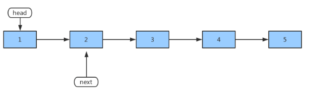
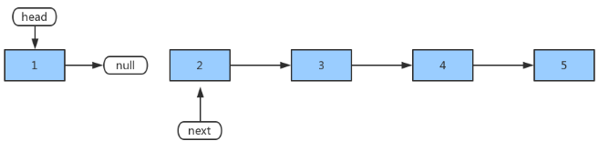
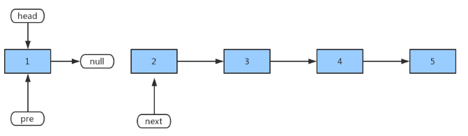
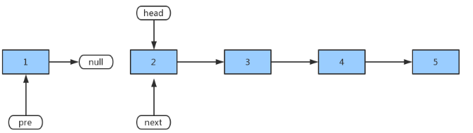
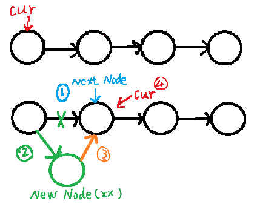

# AlgorithmEasyDay03

[TOC]

## 一、栈和队列

### （一）用数组结构实现大小固定的栈和队列
- 要求：只能使用长度为 X 的固定长度数组实现同样长度的队列和栈，超过则报错；
- 注：栈是先进后出，队列的结构为先进先出；

```java
package com.gjxaiou.easy.day03;

/**
 * @author GJXAIOU
 * 使用数组实现栈和队列结构
 */
public class ArrayToStackAndQueue {

    /**
     * 数组结构实现大小固定的栈
     */
    public static class ArrayToStack {
        private Integer[] arr;
        // index 当前指向栈的位置： 0 ~ size -1
        private Integer index;

        // 初始化数组
        public ArrayToStack(int initSize) {
            if (initSize < 0) {
                throw new IllegalArgumentException("The init size is less than 0");
            }
            arr = new Integer[initSize];
            index = 0;
        }

        // 在栈中压入一个数
        public void push(int value) {
            if (index == arr.length) {
                throw new ArrayIndexOutOfBoundsException("The stack is full");
            }
            // index：指向的是栈中下一个有空位置的数组下标
            // index 位置填上，然后 index++
            arr[index++] = value;
        }

        // 弹出一个栈顶的元素
        public Integer pop() {
            if (index == 0) {
                throw new ArrayIndexOutOfBoundsException("The stack is empty");
            }
            // 这里是 --index，因为 index 为下一个空位置的下标
            return arr[--index];
        }

        // 只将值返回给我，但是原来栈中该值仍然保存。=====重要，index 并不改变=====
        public Integer peek() {
            if (index == 0) {
                return null;
            }
            return arr[index - 1];
        }
    }


    /**
     * 数组结构实现大小固定的队列
     */
    public static class ArrayToQueue {
        private Integer[] arr;
        // 因为固定大小，可以循环放置，所以得使用 size 来标识。
        private Integer size;
        private Integer start;
        private Integer end;

        // 初始化队列
        public ArrayToQueue(int initSize) {
            if (initSize < 0) {
                throw new IllegalArgumentException("The init size is less than 0");
            }
            arr = new Integer[initSize];
            size = 0;
            start = 0;
            end = 0;
        }

        // 向队列中放入一个数
        public void push(int obj) {
            if (size == arr.length) {
                throw new ArrayIndexOutOfBoundsException("The queue is full");
            }
            size++;
            // 该数放在 end 的位置上，因为 end 位置是上下移动的；
            arr[end] = obj;
// end 如果到底即 Length-1，就等于 0，从头开始写入数据，可以覆盖之前的元素；如果没到底就 end+1;
            end = (end == arr.length - 1) ? 0 : end + 1;
        }

        // 弹出队列头部元素
        public Integer poll() {
            if (size == 0) {
                throw new ArrayIndexOutOfBoundsException("The queue is empty");
            }
            size--;
   // 因为 start 位置要改变，所有使用临时变量 tmp 记录 start 位置，最终弹出的是原始 start 位置元素；
            int tmp = start;
            start = (start == arr.length - 1) ? 0 : start + 1;
            return arr[tmp];
        }

        // 取出队列头部的元素，但是队列不动
        public Integer peek() {
            if (size == 0) {
                return null;
            }
            return arr[start];
        }
    }
}

```

### （二）特殊栈的实现：返回栈中最小元素
**目标**：实现一个特殊的栈，在实现栈的基础功能上，再实现返回栈中最小元素的操作；
**要求**：pop、push、getMin 的操作的时间复杂度都是 O（1），同时设计的栈类型可以使用现成的栈结构；

**解答思路**： 因为时间复杂度要求：O(1)，因此不能使用遍历，因为遍历的结果就是 O（N），这里使用两个栈；一个栈为 Data 栈，用于存放数据，另一个栈为 Min 栈，用于存放最小值，两个栈一起增长；                     
**步骤**：放入第一个数据，放入 Data 栈中，同时因为 Min 栈中当前为空，因此放入第一个元素之后最小值也是第一个元素，因此将第一个元素也放入 min 栈中；在 Data 栈中放入第二个数据时候，将当前元素与 min 栈顶比较，如果当前数大于等于 min 栈顶，方法一是不动，方法二是将原来 Min 栈的栈顶元素再次压入一遍；反之如果当前数小于 min 栈顶，就将原来 min 栈顶的元素再次在 min 栈中压入一遍。**push 和 pop 方法都有修改**

```java
package com.gjxaiou.easy.day03;

import java.util.Stack;

/**
 * @author GJXAIOU
 * 返回栈中最小元素
 */
public class GetMinStack {
    // 该方法中当新加入的元素大于原来 Min 栈的栈顶元素时候，不动；
    public static class MyStack1 {
        // 分别为数据栈和最小值栈
        private Stack<Integer> stackData;
        private Stack<Integer> stackMin;

        // 因为每次都是创建新的栈，因此使用构造函数
        public MyStack1() {
            stackData = new Stack<Integer>();
            stackMin = new Stack<Integer>();
        }

        public void push(int newNum) {
            // Data 栈肯定压入最新的数
            stackData.push(newNum);
            // 如果最小元素栈中没有元素，就将新加入的元素同时压入最小栈，否则需要比较当前数和最小栈中的地栈顶比较，返回最小
            if (stackMin.isEmpty()) {
                stackMin.push(newNum);
            } else if (newNum <= this.getmin()) {
                stackMin.push(newNum);
            }
        }

        public int pop() {
            if (stackData.isEmpty()) {
                throw new RuntimeException("Your stack is empty.");
            }
            int value = stackData.pop();
            if (value == this.getmin()) {
                stackMin.pop();
            }
            return value;
        }

        // peek() 返回 min 栈栈顶，但是不弹出；
        public int getmin() {
            if (stackMin.isEmpty()) {
                throw new RuntimeException("Your stack is empty.");
            }
            return stackMin.peek();
        }
    }


    /**
    * 下面方法和上面的唯一区别就是当新压入的数据大于原来 Min栈中栈顶的时候，将 Min 栈顶的元素再次压入；
     */
    public static class MyStack2 {
        private Stack<Integer> stackData;
        private Stack<Integer> stackMin;

        public MyStack2() {
            stackData = new Stack<Integer>();
            stackMin = new Stack<Integer>();
        }

        public void push(int newNum) {
            if (stackMin.isEmpty()) {
                stackMin.push(newNum);
            } else if (newNum < this.getmin()) {
                stackMin.push(newNum);
            } else {
                int newMin = stackMin.peek();
                stackMin.push(newMin);
            }
            stackData.push(newNum);
        }

        public int pop() {
            if (stackData.isEmpty()) {
                throw new RuntimeException("Your stack is empty.");
            }
            this.stackMin.pop();
            return stackData.pop();
        }

        public int getmin() {
            if (stackMin.isEmpty()) {
                throw new RuntimeException("Your stack is empty.");
            }
            return stackMin.peek();
        }
    }

    public static void main(String[] args) {
        System.out.println("=====方法一获得的实时最小值和 pop 方法测试========");
        MyStack1 stack1 = new MyStack1();
        stack1.push(3);
        System.out.println("加入 3 之后栈中最小值：" + stack1.getmin());
        stack1.push(4);
        System.out.println("加入 4 之后栈中最小值：" + stack1.getmin());
        stack1.push(1);
        System.out.println("加入 1 之后栈中最小值：" + stack1.getmin());
        System.out.println(stack1.pop());
        System.out.println("弹出栈头之后最小值：" + stack1.getmin());

        System.out.println("=====方法二获得的实时最小值和 pop 方法测试========");
        MyStack2 stack2 = new MyStack2();
        stack2.push(3);
        System.out.println(stack2.getmin());
        stack2.push(4);
        System.out.println(stack2.getmin());
        stack2.push(1);
        System.out.println(stack2.getmin());
        System.out.println(stack2.pop());
        System.out.println(stack2.getmin());
    }
}
```

### ==（三）仅用队列结构实现栈结构==

**注意：**因为操作系统的内存操作时从低到高，而应用程序的内存操作时从高到低（防止内存冲突），一般栈顶的内存地址小于栈底的内存地址；
**示例**：放入队列顺序是 `1,2,3,4,5`；保证出来的顺序为：`5,4,3,2,1`；

- 首先准备两个队列：`data` 队列和 `help` 队列；
- 然后将数据放入 `data` 队列中，即以数组描述为：`5 4 3 2 1`，然后将后面四个  `1,2 3,4` 压入 `help` 队列中，然后返回 `data` 队列中元素 `5`；
- 然后将 `data` 和 `help` 指向的队列互换；
- 然后将新的 `data` 队列（即原来的 `help` 队列）中的 `1,2,3` 放入 新的 `help` 队列中（即原来的 `data` 队列中），然后返回 `data` 中的数据；
- 然后互换引用，以此循环；

```java
package sort.com.gjxaiou.easy.day03;

import java.util.LinkedList;
import java.util.Queue;
import java.util.Stack;

/**
     * 使用两个队列实现栈结构
     */
public static class QueueConvertToStack {
    private Queue<Integer> data;
    private Queue<Integer> help;

    public QueueConvertToStack() {
        // 用双向链表实现，也可以使用动态数组
        data = new LinkedList<Integer>();
        help = new LinkedList<Integer>();
    }

    // 压数的时候直接在 data 中将该数压入
    public void push(int pushInt) {
        data.add(pushInt);
    }

    // 实现弹出一个数，======重点=======
    public int pop() {
        if (data.isEmpty()) {
            throw new RuntimeException("Stack is empty!");
        }
        // 当 data 队列中不止一个数，将 data中所有数放进 help 中，当 data 中只剩一个数时候停止，然后将该数弹出并返回
        while (data.size() > 1) {
            help.add(data.poll());
        }
        int res = data.poll();
        // 改变两个引用，就是 Help 栈变 data 栈， data 栈变  help 栈；
        swap();
        return res;
    }

    public int peek() {
        if (data.isEmpty()) {
            throw new RuntimeException("Stack is empty!");
        }
        while (data.size() != 1) {
            help.add(data.poll());
        }
        int res = data.poll();
        help.add(res);
        swap();
        return res;
    }

    private void swap() {
        Queue<Integer> tmp = help;
        help = data;
        data = tmp;
    }
}
```

### ==（四）仅用栈结构实现队列结构==
示例：放入栈的顺序为：`1,2,3,4,5` 保证拿出顺序为：`1,2,3,4,5`；
首先将数据放入 push 栈中，形成：5,4,3,2,1，然后将其全部拿出 push 到 pop 栈中，变成了 1,2,3,4,5；然后在 pop 栈中依次从栈顶取出所有元素即可；
==**要求**：如果 push 栈中决定往 pop 栈中倒数据，**则一次必须倒完**；==
==如果 pop 栈中仍有数据，则 push 栈不能往 pop 栈中倒数据；==

```java
package sort.com.gjxaiou.easy.day03;

import java.util.LinkedList;
import java.util.Queue;
import java.util.Stack;

/**  
 * 使用两个栈实现队列  
  */  
public static class StackConvertToQueue {  
    // 分别表示 Data 栈和 help 栈  
    private Stack<Integer> stackPush;  
    private Stack<Integer> stackPop;  

    public StackConvertToQueue() {  
        stackPush = new Stack<Integer>();  
        stackPop = new Stack<Integer>();  
    }  

    // 向 push 栈中加入数据  
    public void push(int pushInt) {  
        stackPush.push(pushInt);  
    }  

    // 将 push 栈中数据全部倒入 pop 栈中，然后返回 Pop 栈顶元素  
    public int poll() {  
        if (stackPop.empty() && stackPush.empty()) {  
            throw new RuntimeException("Queue is empty!");  
        } else if (stackPop.empty()) {  
            // 将 push 栈中所有元素一次性全部倒入 pop 栈中  
            while (!stackPush.empty()) {  
                stackPop.push(stackPush.pop());  
            }  
        }  
        // 最后弹出 pop 栈顶元素即可  
        return stackPop.pop();  
    }  

    // 将 push 栈中数据全部倒入 Pop 栈，然后仅仅复制返回 pop 栈顶元素  
    public int peek() {  
        if (stackPop.empty() && stackPush.empty()) {  
            throw new RuntimeException("Queue is empty!");  
        } else if (stackPop.empty()) {  
            while (!stackPush.empty()) {  
                stackPop.push(stackPush.pop());  
            }  
        }  
        return stackPop.peek();  
    }  
}
```


### （五）猫狗队列问题
宠物、狗和猫的类如下：

```java
public class Pet { 
    private String type;
    public Pet(String type) { 
          this.type = type; 
    }
    public String getPetType() { 
          return this.type; 
    }
}
public class Dog extends Pet { 
    public Dog() { 
         super("dog"); 
    } 
}
public class Cat extends Pet { 
     public Cat() { 
          super("cat"); 
     } 
}
```
实现一种狗猫队列的结构，要求如下： 
- 用户可以调用 add 方法将 cat 类或 dog 类的实例放入队列中； 
- 用户可以调用 pollAll 方法，将队列中所有的实例按照进队列的先后顺序依次弹出； 
- 用户可以调用 pollDog 方法，将队列中 dog 类的实例按照进队列的先后顺序依次弹出；
- 用户可以调用 pollCat 方法，将队列中 cat 类的实例按照进队列的先后顺序依次弹出； 
- 用户可以调用 isEmpty 方法，检查队列中是否还有 dog 或 cat 的实例； 
- 用户可以调用 isDogEmpty 方法，检查队列中是否有 dog 类的实例； 
- 用户可以调用 isCatEmpty 方法，检查队列中是否有 cat 类的实例。 

**解答：** 分别建立狗队列和猫队列，然后使用时间戳（这里可以使用一个 count 变量代替），然后只要进入一个动物类就 count + 1，然后将该值封装到该对象中；依次类推。。。
　
```java
package com.gjxaiou.easy.day03;

import java.util.LinkedList;
import java.util.Queue;

/**
 * @author GJXAIOU
 */
public class CatDogQueue {

	public static class Pet {
		private String type;

		public Pet(String type) {
			this.type = type;
		}

		public String getPetType() {
			return this.type;
		}
	}

	public static class Dog extends Pet {
		public Dog() {
			super("dog");
		}
	}

	public static class Cat extends Pet {
		public Cat() {
			super("cat");
		}
	}

	/**
	 * 宠物进入的方法
	 */
	public static class PetEnter {
		// 宠物类型
		private Pet pet;
		// 第几个宠物
		private long count;

		// 使用构造器实现为每个宠物赋属性
		public PetEnter(Pet pet, long count) {
			this.pet = pet;
			this.count = count;
		}

		public Pet getPet() {
			return this.pet;
		}

		public long getCount() {
			return this.count;
		}

		public String getEnterPetType() {
			return this.pet.getPetType();
		}
	}

	public static class CatAndDogQueue {
		private Queue<PetEnter> dogQ;
		private Queue<PetEnter> catQ;
		private long count;

		public CatAndDogQueue() {
			this.dogQ = new LinkedList<PetEnter>();
			this.catQ = new LinkedList<PetEnter>();
			this.count = 0;
		}

		public void add(Pet pet) {
			if (pet.getPetType().equals("dog")) {
				this.dogQ.add(new PetEnter(pet, this.count++));
			} else if (pet.getPetType().equals("cat")) {
				this.catQ.add(new PetEnter(pet, this.count++));
			} else {
				throw new RuntimeException("err, not dog or cat");
			}
		}

		public Pet pollAll() {
			if (!this.dogQ.isEmpty() && !this.catQ.isEmpty()) {
				// 比较猫狗队列的队列头 count大小
				if (this.dogQ.peek().getCount() < this.catQ.peek().getCount()) {
					return this.dogQ.poll().getPet();
				} else {
					return this.catQ.poll().getPet();
				}
			} else if (!this.dogQ.isEmpty()) {
				return this.dogQ.poll().getPet();
			} else if (!this.catQ.isEmpty()) {
				return this.catQ.poll().getPet();
			} else {
				throw new RuntimeException("err, queue is empty!");
			}
		}

		public Dog pollDog() {
			if (!this.isDogQueueEmpty()) {
				return (Dog) this.dogQ.poll().getPet();
			} else {
				throw new RuntimeException("Dog queue is empty!");
			}
		}

		public Cat pollCat() {
			if (!this.isCatQueueEmpty()) {
				return (Cat) this.catQ.poll().getPet();
			} else {
				throw new RuntimeException("Cat queue is empty!");
			}
		}

		public boolean isEmpty() {
			return this.dogQ.isEmpty() && this.catQ.isEmpty();
		}

		public boolean isDogQueueEmpty() {
			return this.dogQ.isEmpty();
		}

		public boolean isCatQueueEmpty() {
			return this.catQ.isEmpty();
		}

	}

	public static void main(String[] args) {
		CatAndDogQueue test = new CatAndDogQueue();

		Pet dog1 = new Dog();
		Pet cat1 = new Cat();
		Pet dog2 = new Dog();
		Pet cat2 = new Cat();
		Pet dog3 = new Dog();
		Pet cat3 = new Cat();

		test.add(dog1);
		test.add(cat1);
		test.add(dog2);
		test.add(cat2);
		test.add(dog3);
		test.add(cat3);

		test.add(dog1);
		test.add(cat1);
		test.add(dog2);
		test.add(cat2);
		test.add(dog3);
		test.add(cat3);

		while (!test.isDogQueueEmpty()) {
			System.out.println(test.pollDog().getPetType());
		}
		while (!test.isEmpty()) {
			System.out.println(test.pollAll().getPetType());
		}
	}
}

```
程序运行结果：
```java
dog
dog
dog
dog
dog
dog
cat
cat
cat
cat
cat
cat
```

## 二、数组问题

### （一）转圈打印矩阵

【题目】 给定一个整型矩阵 `matrix`，请按照转圈的方式打印它。
例如： `1 2 3 4 5 6 7 8 9 10 11 12 13 14 15 16 `
打印结果为：`1，2，3，4，8，12，16，15，14，13，9，5，6，7，11， 10`


【要求】 额外空间复杂度为O(1)。

**进行宏观调度分析**
解法：将整体分圈，一圈一圈作为一个整体；一圈打印完之后，左上角和右下角分别沿着主对角线进行缩进，每缩进一次就遍历一圈，一直到两个坐标撞到一起；

```java
package com.gjxaiou.easy.day03;

/**
 * @author GJXAIOU
 * 转圈打印矩阵
 */
public class PrintMatrixSpiralOrder {
    public static void spiralOrderPrint(int[][] matrix) {
        // 设置初始化左上角和右上角位置，从最外圈往里依次打印
        int leftTopRow = 0;
        int leftTopColumn = 0;
        int rightBottomRow = matrix.length - 1;
        int rightBottomColumn = matrix[0].length - 1;
        while (leftTopRow <= rightBottomRow && leftTopColumn <= rightBottomColumn) {
            printEdge(matrix, leftTopRow++, leftTopColumn++, rightBottomRow--, rightBottomColumn--);
        }
    }

    /**
     * 主要实现根据左上角和右下角的坐标，实现顺时针打印矩阵一圈的方法
     *
     * @param matrix
     * @param leftTopRow              左上角的行
     * @param leftTopColumn           左上角的列
     * @param rightBottomRow：右下角的行
     * @param rightBottomColumn：右下角的列
     */
    public static void printEdge(int[][] matrix, int leftTopRow, int leftTopColumn, int rightBottomRow, int rightBottomColumn) {
        // 如果 Matrix 只有一行
        if (leftTopRow == rightBottomRow) {
            for (int i = leftTopColumn; i <= rightBottomColumn; i++) {
                System.out.print(matrix[leftTopRow][i] + " ");
            }
            // 如果 Matrix 只有一列
        } else if (leftTopColumn == rightBottomColumn) {
            for (int i = leftTopRow; i <= rightBottomRow; i++) {
                System.out.print(matrix[i][leftTopColumn] + " ");
            }
        } else {
            // 打印四条边
            int curR = leftTopRow;
            int curC = leftTopColumn;
            while (curC != rightBottomColumn) {
                System.out.print(matrix[leftTopRow][curC] + " ");
                curC++;
            }
            while (curR != rightBottomRow) {
                System.out.print(matrix[curR][rightBottomColumn] + " ");
                curR++;
            }
            while (curC != leftTopColumn) {
                System.out.print(matrix[rightBottomRow][curC] + " ");
                curC--;
            }
            while (curR != leftTopRow) {
                System.out.print(matrix[curR][leftTopColumn] + " ");
                curR--;
            }
        }
    }

    public static void main(String[] args) {
        int[][] matrix = {{1, 2, 3, 4}, {5, 6, 7, 8}, {9, 10, 11, 12},
                {13, 14, 15, 16}};
        spiralOrderPrint(matrix);
    }
}

```
程序执行结果为：`1 2 3 4 8 12 16 15 14 13 9 5 6 7 11 10 `

### （二）旋转正方形矩阵
【题目】 给定一个整型正方形矩阵matrix，请把该矩阵调整成顺时针旋转 90 度的样子。
【要求】 额外空间复杂度为O(1)。

**解答**：  **还是一圈圈的旋转**，首先旋转最外面，然后逐层向里，在旋转的时候唯一需要注意的就是元素之间的位置替换；


```java
package com.gjxaiou.easy.day03;

/**
 * @author GJXAIOU
 * 正方形矩阵顺时针翻转 90 度
 */
public class RotateMatrix {

     public static void rotate(int[][] matrix) {
        int leftTopRow = 0;
        int leftTopColumn = 0;
        int rightBottomRow = matrix.length - 1;
        int rightBottomColumn = matrix[0].length - 1;
        // 因为是正方形，因此只要考虑一个就行，同时不能 =
        while (leftTopRow < rightBottomRow) {
            rotateEdge(matrix, leftTopRow++, leftTopColumn++, rightBottomRow--,
                    rightBottomColumn--);
        }
    }

    public static void rotateEdge(int[][] matrix, int leftTopRow, int leftTopColumn,
                                  int rightBottomRow, int rightBottomColumn) {
        int times = rightBottomColumn - leftTopColumn;
        int tmp = 0;
        // i 相当于圈数，从0 ~ times -1;（times 为右下角和左上角列数差），因为只需要交换 times 次就可以完成全部交换
        // 这里的圈数是指每一层矩阵中每次矩阵元素交换次数，
        // 具体的交换为一次换四个（对应一边一个）
        for (int i = 0; i != times; i++) {
            // 保留最上面一行
            tmp = matrix[leftTopRow][leftTopColumn + i];
            // 最上面一行等于最左边一列
            matrix[leftTopRow][leftTopColumn + i] = matrix[rightBottomRow - i][leftTopColumn];
            // 最左边一列等于最下面一行
            matrix[rightBottomRow - i][leftTopColumn] =
                    matrix[rightBottomRow][rightBottomColumn - i];
            // 最下面一行等于最右边一列
            matrix[rightBottomRow][rightBottomColumn - i] =
                    matrix[leftTopRow + i][rightBottomColumn];
            // 最右边一列等于最上面保留的一行
            matrix[leftTopRow + i][rightBottomColumn] = tmp;
        }
    }

    public static void printMatrix(int[][] matrix) {
        for (int i = 0; i != matrix.length; i++) {
            for (int j = 0; j != matrix[0].length; j++) {
                System.out.print(matrix[i][j] + " ");
            }
            System.out.println();
        }
    }

    public static void main(String[] args) {
        int[][] matrix = {{1, 2, 3, 4}, {5, 6, 7, 8}, {9, 10, 11, 12},
                {13, 14, 15, 16}};
        printMatrix(matrix);
        rotate(matrix);
        System.out.println("=========");
        printMatrix(matrix);
    }
}
```
程序运行结果为：
```java
1 2 3 4 
5 6 7 8 
9 10 11 12 
13 14 15 16 
=========
13 9 5 1 
14 10 6 2 
15 11 7 3 
16 12 8 4 

```

### （三）“之”字形打印矩阵

【题目】 给定一个矩阵matrix，按照“之”字形的方式打印这个矩阵，
例如： 

```java
1 2  3  4 
5 6  7  8 
9 10 11 12
```

“之”字形打印的结果为：1，2，5，9，6，3，4，7，10，11，8，12
【要求】 额外空间复杂度为O(1)。
**当局部位置变化很麻烦的时候，采用宏观角度思考；**
**解答：** 使用两个位置变量，A 一直向右走，每次移动一步，当不能往右移动的时候就往下移动；B 一直往下走，每次移动一步，当不能向下移动的时候就往右移动；A 和 B 每次移动都会形成一条对角线，只要打印对角线上元素即可，因为每次打印顺序不同，因此可以采用一个 Boolean 变量实现正反打印；
**A、B 之间完全解耦**
示例图片：


```java
package com.gjxaiou.easy.day03;

/**
 * @author GJXAIOU
 * 之字形打印矩阵中所有元素
 */
public class ZigZagPrintMatrix {

    public static void printMatrixZigZag(int[][] matrix) {
        int leftTopRow = 0;
        int leftTopColumn = 0;
        int rightBottomRow = 0;
        int rightBottomColumn = 0;
        int endRow = matrix.length - 1;
        int endColumn = matrix[0].length - 1;
        boolean fromUp = false;
        while (leftTopRow != endRow + 1) {
            printLevel(matrix, leftTopRow, leftTopColumn, rightBottomRow, rightBottomColumn, fromUp);
            // 如果 A点来到最后一列，就往下走，否则行号不变
            leftTopRow = (leftTopColumn == endColumn) ? leftTopRow + 1 : leftTopRow;
            leftTopColumn = (leftTopColumn == endColumn) ? leftTopColumn : leftTopColumn + 1;
            rightBottomColumn = (rightBottomRow == endRow) ? rightBottomColumn + 1 : rightBottomColumn;
            rightBottomRow = (rightBottomRow == endRow) ? rightBottomRow : rightBottomRow + 1;
            // 每打印一次，打印方向翻转一次
            fromUp = !fromUp;
        }
        System.out.println();
    }

    // 打印对角线
    public static void printLevel(int[][] m, int leftTopRow, int leftTopColumn, int rightBottomRow, int rightBottomColumn,
                                  boolean fromUp) {
        if (fromUp) {
            // 从上往下打印对角线
            while (leftTopRow != rightBottomRow + 1) {
                System.out.print(m[leftTopRow++][leftTopColumn--] + " ");
            }
        } else {
            // 从下往上打印对角线
            while (rightBottomRow != leftTopRow - 1) {
                System.out.print(m[rightBottomRow--][rightBottomColumn++] + " ");
            }
        }
    }

    public static void main(String[] args) {
        int[][] matrix = {{1, 2, 3, 4}, {5, 6, 7, 8}, {9, 10, 11, 12}};
        printMatrixZigZag(matrix);
    }
}

```

程序运行结果：

```java
1 2 5 9 6 3 4 7 10 11 8 12
```

### （四）在行列都排好序的矩阵中找数

**一般如果数据状况特殊都有较优解**，例如有序等等；
【题目】 给定一个有 `N*M` 的整型矩阵 `matrix` 和一个整数 `K`，`matrix` 的每一行和每一 列都是排好序的。实现一个函数，判断 `K` 是否在 `matrix` 中。 

【要求】 时间复杂度为O(N+M)，额外空间复杂度为O(1)


**解答：**
==可以从左下角或者右上角开始，这里以右上角为例==，在上面数组中找元素 4；
首先右上角为 6 ，6>4 ，则 6 该列下面不用看了，因为都大于 6，所有往左走；
然后是 5，5 > 4，然后同上，往左走；
然后是 3，3 < 4，则 3 的左边不用看了，往下走；
然后是。。。。

```java
package com.gjxaiou.easy.day03;

/**
 * @author GJXAIOU
 * 在行列都排序好的矩阵中查找值
 */
public class FindNumInSortedMatrix {

    public static boolean isContains(int[][] matrix, int num) {
        // 初始位置在数组的右上角
        int row = 0;
        int col = matrix[0].length - 1;
        while (row < matrix.length && col > -1) {
            if (matrix[row][col] == num) {
                return true;
            } else if (matrix[row][col] > num) {
                // 列--，即往左走
                col--;
            } else {
                // 行++，即往下走
                row++;
            }
        }
        return false;
    }

    public static void main(String[] args) {
        int[][] matrix = new int[][]{
                {0, 1, 2, 3, 4, 5, 6},
                {10, 12, 13, 15, 16, 17, 18},
                {23, 24, 25, 26, 27, 28, 29},
                {44, 45, 46, 47, 48, 49, 50},
                {65, 66, 67, 68, 69, 70, 71},
                {96, 97, 98, 99, 100, 111, 122},
                {166, 176, 186, 187, 190, 195, 200},
                {233, 243, 321, 341, 356, 370, 380}
        };
        int num = 233;
        System.out.println(isContains(matrix, num));
    }
}
```

程序执行结果：
`true`

## 二、链表问题

时间复杂度一般没法解决，一般都是优化空间复杂度；

### （一）反转单向和双向链表

【题目】 分别实现反转单向链表和反转双向链表的函数。
【要求】 如果链表长度为N，时间复杂度要求为O(N)，额外空间复杂度要求为O(1)

**图解**反转函数过程：

- 第一步：`next = head.next`
    将 head.next 赋值给 next 变量，也就是说 next 指向了节点2，先将节点2 保存起来。



- 第二步：`head.next = pre`
    将 pre 变量赋值给 head.next，即 节点1 指向了 null



- 第三步：`pre = head`

    将 head 赋值给了 pre，即 pre 指向节点1，将节点1 设为“上一个节点”



- 第四步：`head = next`

    将 next 赋值给 head，即 head 指向了节点2。将节点2 设为“头节点”



**解答：**
```java
package com.gjxaiou.easy.day03;

public class ReverseList {

    public static class Node {
        public int value;
        public Node next;

        public Node(int data) {
            this.value = data;
        }
    }
    // 反转单向链表；=== 重要====
    public static Node reverseList(Node head) {
        Node pre = null;
        Node next = null;
        while (head != null) {
            next = head.next;
            head.next = pre;
            pre = head;
            head = next;
        }
        return pre;
    }


    public static class DoubleNode {
        public int value;
        public DoubleNode last;
        public DoubleNode next;

        public DoubleNode(int data) {
            value = data;
        }
    }

    // 反转双向链表
    public static DoubleNode reverseList(DoubleNode head) {
        DoubleNode pre = null;
        DoubleNode next = null;
        while (head != null) {
            next = head.next;
            head.next = pre;
            head.last = next;
            pre = head;
            head = next;
        }
        return pre;
    }

    
    /// 测试程序
    public static void printLinkedList(Node head) {
        System.out.print("Linked List: ");
        while (head != null) {
            System.out.print(head.value + " ");
            head = head.next;
        }
        System.out.println();
    }

    public static void printDoubleLinkedList(DoubleNode head) {
        System.out.print("Double Linked List: ");
        DoubleNode end = null;
        while (head != null) {
            System.out.print(head.value + " ");
            end = head;
            head = head.next;
        }
        System.out.print("| ");
        while (end != null) {
            System.out.print(end.value + " ");
            end = end.last;
        }
        System.out.println();
    }

    public static void main(String[] args) {
        Node head1 = new Node(1);
        head1.next = new Node(2);
        head1.next.next = new Node(3);
        printLinkedList(head1);
        head1 = reverseList(head1);
        printLinkedList(head1);

        DoubleNode head2 = new DoubleNode(1);
        head2.next = new DoubleNode(2);
        head2.next.last = head2;
        head2.next.next = new DoubleNode(3);
        head2.next.next.last = head2.next;
        head2.next.next.next = new DoubleNode(4);
        head2.next.next.next.last = head2.next.next;
        printDoubleLinkedList(head2);
        printDoubleLinkedList(reverseList(head2));
    }
}

```
程序运行结果：
```java
Linked List: 1 2 3 
Linked List: 3 2 1 
Double Linked List: 1 2 3 4 | 4 3 2 1 
Double Linked List: 4 3 2 1 | 1 2 3 4 
```


### （十一）打印两个有序链表的公共部分
【题目】 给定两个有序链表的头指针head1和head2，打印两个链表的公共部分。
【解答】 和比较两个数组中所有的相同值一样，逐个遍历比较。
见代码；

```java
package com.gjxaiou.easy.day03;

/**
 * @author GJXAIOU
 * 打印两个有序列表公共部分
 */
public class PrintCommonPart {

    public static class Node {
        public int value;
        public Node next;

        public Node(int data) {
            this.value = data;
        }
    }

    
    // 打印两个有序链表都有的元素，====重点=====
    public static void printCommonPart(Node head1, Node head2) {
        System.out.print("Common Part: ");
        while (head1 != null && head2 != null) {
            if (head1.value < head2.value) {
                head1 = head1.next;
            } else if (head1.value > head2.value) {
                head2 = head2.next;
            } else {
                System.out.print(head1.value + " ");
                head1 = head1.next;
                head2 = head2.next;
            }
        }
        System.out.println();
    }

    
    // 输出输入的两个链表元素
    public static void printLinkedList(Node node) {
        System.out.print("Linked List: ");
        while (node != null) {
            System.out.print(node.value + " ");
            node = node.next;
        }
        System.out.println();
    }

    public static void main(String[] args) {
        Node node1 = new Node(2);
        node1.next = new Node(3);
        node1.next.next = new Node(5);
        node1.next.next.next = new Node(6);

        Node node2 = new Node(1);
        node2.next = new Node(2);
        node2.next.next = new Node(5);
        node2.next.next.next = new Node(7);
        node2.next.next.next.next = new Node(8);

        printLinkedList(node1);
        printLinkedList(node2);
        printCommonPart(node1, node2);
    }
}
```
程序运行结果：
```java
Linked List: 2 3 5 6 
Linked List: 1 2 5 7 8 
Common Part: 2 5 
```


### ==（一）判断一个链表是否为回文结构==
【题目】 给定一个链表的头节点head，请判断该链表是否为回文结构。 例： 1->2->1，返回true。 1->2->2->1，返回true。15->6->15，返回true。 1->2->3，返回 false。

**方法一：** 额外空间复杂度为 O（N），需要栈的长度等于链表的长度；

- 将链表遍历一遍之后挨个放入栈中，相当于顺序反了过来；
- 然后再遍历链表，并且同时从栈中取出元素，两个进行逐个比较，如果有不相等的就不是；

**方法二：**额外空间复杂度为 O（N），需要栈空间为链表长度的一半；

- 将链表遍历一遍，但是这次使用快慢指针，快指针一次走两步，慢指针一次走一步，这样快指针走到头，慢指针正好走到链表中间；然后**将链表后半部分放入栈中**；
- 遍历链表前半部分，同时从栈中取出元素，两者进行逐个比较，如果不相等就不是；

==**进阶**： 如果链表长度为N，时间复杂度达到O(N)，额外空间复杂度达到O(1)。==

- 同上使用快慢指针，将链表遍历一遍，保证一个走一步另一个走两步，最终保证快指针走到头的时候，慢指针正好走到链表中间（中间：奇数个节点就是中间那个，偶数个节点则是中间两个靠左边的那个）
- 然后将后半部分链表逆序，例如原来为：1 -> 2 ->3 ->2 ->1 ，改变为：1 -> 2 ->3 <- 2 <- 1，其中 3 指向 null；
- 然后分别从两头往中间走，同时比较每个数，直到两者相遇，最后将数据结构恢复到原来的结构；

```java
package com.gjxaiou.easy.day03;

import java.util.Stack;

/**
 * @author GJXAIOU
 * 判断链表是否是一个回文串
 */
public class IsPalindromeList {

    public static class Node {
        public int value;
        public Node next;

        public Node(int data) {
            this.value = data;
        }
    }

    // 方法一：每次都压栈，空间复杂度为：O(N)
    public static boolean isPalindrome1(Node head) {
        Stack<Node> stack = new Stack<Node>();
        Node cur = head;
        // 将整个链表中元素都压入栈中
        while (cur != null) {
            stack.push(cur);
            cur = cur.next;
        }
        while (head != null) {
            if (head.value != stack.pop().value) {
                return false;
            }
            head = head.next;
        }
        return true;
    }

    // 方法二：快慢指针，空间复杂度为：O(N)，实际使用 n/2 空间
    public static boolean isPalindrome2(Node head) {
        if (head == null || head.next == null) {
            return true;
        }
        Node right = head.next;
        Node cur = head;
        while (cur.next != null && cur.next.next != null) {
            right = right.next;
            cur = cur.next.next;
        }
        // 经过上面之后 right 指向中间，然后将 right 右边所有元素压入栈中
        Stack<Node> stack = new Stack<Node>();
        while (right != null) {
            stack.push(right);
            right = right.next;
        }
        while (!stack.isEmpty()) {
            if (head.value != stack.pop().value) {
                return false;
            }
            head = head.next;
        }
        return true;
    }

    // 方法三：空间复杂度O（1）             =======重点=======
    public static boolean isPalindrome3(Node head) {
        if (head == null || head.next == null) {
            return true;
        }
        
       	// 使用这种方式寻找中间节点
        
        // slowPointer 是慢指针，fastPointer 是快指针
        Node slowPointer = head;
        Node fastPointer = head;
        // 寻找中间节点
        while (fastPointer.next != null && fastPointer.next.next != null) {
            slowPointer = slowPointer.next;
            fastPointer = fastPointer.next.next;
        }
        
        
        // 快指针指向右半部分第一个节点
        fastPointer = slowPointer.next;
        // 中间节点指向 null
        slowPointer.next = null;
        // tmpNode 保存下一个结点
        Node tmpNode = null;
        // 反转右半部分
        while (fastPointer != null) {
            tmpNode = fastPointer.next;
            fastPointer.next = slowPointer;
            slowPointer = fastPointer;
            fastPointer = tmpNode;
        }
        tmpNode = slowPointer;
        fastPointer = head;
        boolean res = true;
        while (slowPointer != null && fastPointer != null) {
            if (slowPointer.value != fastPointer.value) {
                res = false;
                break;
            }
            slowPointer = slowPointer.next;
            fastPointer = fastPointer.next;
        }
        slowPointer = tmpNode.next;
        tmpNode.next = null;
        // 把逆序的再逆回来
        while (slowPointer != null) {
            fastPointer = slowPointer.next;
            slowPointer.next = tmpNode;
            tmpNode = slowPointer;
            slowPointer = fastPointer;
        }
        return res;
    }

    public static void printLinkedList(Node node) {
        System.out.print("Linked List: ");
        while (node != null) {
            System.out.print(node.value + " ");
            node = node.next;
        }
        System.out.println();
    }

    public static void main(String[] args) {

        Node head = null;
        printLinkedList(head);
        System.out.println("三个方法分别输出结果为： ");
        System.out.print(isPalindrome1(head) + " | ");
        System.out.print(isPalindrome2(head) + " | ");
        System.out.println(isPalindrome3(head) + " | ");
        System.out.println("=========================");

        head = new Node(1);
        printLinkedList(head);
        System.out.println("三个方法分别输出结果为： ");
        System.out.print(isPalindrome1(head) + " | ");
        System.out.print(isPalindrome2(head) + " | ");
        System.out.println(isPalindrome3(head) + " | ");
        System.out.println("=========================");

        head = new Node(1);
        head.next = new Node(2);
        printLinkedList(head);
        System.out.println("三个方法分别输出结果为： ");
        System.out.print(isPalindrome1(head) + " | ");
        System.out.print(isPalindrome2(head) + " | ");
        System.out.println(isPalindrome3(head) + " | ");
        System.out.println("=========================");

        head = new Node(1);
        head.next = new Node(1);
        printLinkedList(head);
        System.out.println("三个方法分别输出结果为： ");
        System.out.print(isPalindrome1(head) + " | ");
        System.out.print(isPalindrome2(head) + " | ");
        System.out.println(isPalindrome3(head) + " | ");
        System.out.println("=========================");

        head = new Node(1);
        head.next = new Node(2);
        head.next.next = new Node(3);
        printLinkedList(head);
        System.out.println("三个方法分别输出结果为： ");
        System.out.print(isPalindrome1(head) + " | ");
        System.out.print(isPalindrome2(head) + " | ");
        System.out.println(isPalindrome3(head) + " | ");
        System.out.println("=========================");

        head = new Node(1);
        head.next = new Node(2);
        head.next.next = new Node(1);
        printLinkedList(head);
        System.out.println("三个方法分别输出结果为： ");
        System.out.print(isPalindrome1(head) + " | ");
        System.out.print(isPalindrome2(head) + " | ");
        System.out.println(isPalindrome3(head) + " | ");
        System.out.println("=========================");

        head = new Node(1);
        head.next = new Node(2);
        head.next.next = new Node(3);
        head.next.next.next = new Node(1);
        printLinkedList(head);
        System.out.println("三个方法分别输出结果为： ");
        System.out.print(isPalindrome1(head) + " | ");
        System.out.print(isPalindrome2(head) + " | ");
        System.out.println(isPalindrome3(head) + " | ");
        System.out.println("=========================");

        head = new Node(1);
        head.next = new Node(2);
        head.next.next = new Node(2);
        head.next.next.next = new Node(1);
        printLinkedList(head);
        System.out.println("三个方法分别输出结果为： ");
        System.out.print(isPalindrome1(head) + " | ");
        System.out.print(isPalindrome2(head) + " | ");
        System.out.println(isPalindrome3(head) + " | ");
        System.out.println("=========================");

        head = new Node(1);
        head.next = new Node(2);
        head.next.next = new Node(3);
        head.next.next.next = new Node(2);
        head.next.next.next.next = new Node(1);
        printLinkedList(head);
        System.out.println("三个方法分别输出结果为： ");
        System.out.print(isPalindrome1(head) + " | ");
        System.out.print(isPalindrome2(head) + " | ");
        System.out.println(isPalindrome3(head) + " | ");
        System.out.println("=========================");
    }
}
```
程序输出结果：
```java
Linked List: 
三个方法分别输出结果为： 
true | true | true | 
=========================
Linked List: 1 
三个方法分别输出结果为： 
true | true | true | 
=========================
Linked List: 1 2 
三个方法分别输出结果为： 
false | false | false | 
=========================
Linked List: 1 1 
三个方法分别输出结果为： 
true | true | true | 
=========================
Linked List: 1 2 3 
三个方法分别输出结果为： 
false | false | false | 
=========================
Linked List: 1 2 1 
三个方法分别输出结果为： 
true | true | true | 
=========================
Linked List: 1 2 3 1 
三个方法分别输出结果为： 
false | false | false | 
=========================
Linked List: 1 2 2 1 
三个方法分别输出结果为： 
true | true | true | 
=========================
Linked List: 1 2 3 2 1 
三个方法分别输出结果为： 
true | true | true | 
=========================
```


### （二）将单向链表按某值划分成左边小、中间相等、右边大的形式
【题目】 给定一个单向链表的头节点 head，节点的值类型是整型，再给定一个整数 pivot。实现一个调整链表的函数，将链表调整为左部分都是值小于 pivot 的节点，中间部分都是值等于 pivot 的节点，右部分都是值大于 pivot 的节点。

> 对调整后的节点顺序没有更多的要求：例如：链表 `9->0->4->5->1，pivot = 3`。 调整后链表可以是 `1->0->4->9->5`，也可以是 `0->1->9->5->4`。总之，满足左部分都是小于 3 的节点，中间部分都是等于 3 的节点（本例中这个部分为空），右部分都是大于 3 的节点即可。对某部分内部的节点顺序不做要求。

**不要求结点顺序的解答方法**：
可以借用荷兰国旗问题解法，空间复杂度是 O(N)，同时**不能保证稳定性**；
==**具体解法**：将链表中的所有节点都放入数组中，在数组中将所有的节点整理好之后，然后再重新串起来形成链表；这里需要生成一个辅助数组，里面装的是节点类型；==

#### **进阶问题：保证稳定性以及空间复杂度为 O(1)** 。

> 在左、中、右三个部分的内部也做顺序要求，要求每部分里的节点从左到右的顺序与原链表中节点的先后次序一致。 例如：链表 `9->0->4->5->1，pivot = 3`。调整后的链表是 `0->1->9->4->5`。 在满足原问题要求的同时，左部分节点从左到右为 `0、1`。因为在原链表中也是先出现 0，后出现 1；中间部分在本例中为空，不再讨论；右部分节点 从左到右为 `9、4、5`。在原链表中也是先出现 9，然后出现 4，最后出现 5。
> 如果链表长度为 N，时间复杂度请达到 O(N)，额外空间复杂度请达到 O(1)。

**要求结点顺序的解答过程：**

- 首先设立三个 Node 类型的变量：`less = null；equal = null；more = null；`
- 遍历整个链表，找到第一个值 < num (设置的值)的节点，然后让 less 指向该结点，同理找到另外两个变量指向的节点，如果遍历结束没有则还是指向 null；
- 再遍历一遍链表，将所有小于、等于、大于该值的节点分别追加到上面确定的第一个节点后面；
- 最后将三个部分连接在一起形成结果；（注意某些链可能没有值） 

```java
package com.gjxaiou.easy.day03;

/**
 * @author GJXAIOU
 * 将链表分为小于、等于、大于三个部分
 */
public class TurnListToSmallerEqualBigger {

    public static class Node {
        public int value;
        public Node next;

        public Node(int data) {
            value = data;
        }
    }

    // 方案一：模拟荷兰国旗问题，空间复杂度为：O（N），不保证稳定性
    public static Node listPartition1(Node head, int num) {
        if (head == null) {
            return head;
        }
        Node cur = head;
        int i = 0;
        while (cur != null) {
            i++;
            cur = cur.next;
        }

        Node[] nodeArr = new Node[i];
        i = 0;
        cur = head;
        for (i = 0; i != nodeArr.length; i++) {
            nodeArr[i] = cur;
            cur = cur.next;
        }

        arrPartition(nodeArr, num);
        for (i = 1; i != nodeArr.length; i++) {
            nodeArr[i - 1].next = nodeArr[i];
        }
        nodeArr[i - 1].next = null;
        return nodeArr[0];
    }

    public static void arrPartition(Node[] nodeArr, int num) {
        int small = -1;
        int big = nodeArr.length;
        int index = 0;
        while (index != big) {
            if (nodeArr[index].value < num) {
                swap(nodeArr, ++small, index++);
            } else if (nodeArr[index].value == num) {
                index++;
            } else {
                swap(nodeArr, --big, index);
            }
        }
    }

    public static void swap(Node[] nodeArr, int a, int b) {
        Node tmp = nodeArr[a];
        nodeArr[a] = nodeArr[b];
        nodeArr[b] = tmp;
    }


    /**
     * 方案二：实现稳定且空间复杂度为 O(1)
     */
    public static Node listPartition2(Node head, int num) {
        // 定义三个部分的头结点和尾结点
        Node lessHead = null;
        Node lessTail = null;
        Node equalHead = null;
        Node equalTail = null;
        Node moreHead = null;
        Node moreTail = null;

        Node next = null;
        // 步骤一：遍历整个链表，将每次结点都分配到三个链表之一
        while (head != null) {
            next = head.next;
            head.next = null;
            if (head.value < num) {
                // 放在小的部分，小的部分如果头结点为空，则头结点和尾结点均指向 head。
                if (lessHead == null) {
                    lessHead = head;
                    lessTail = head;
                } else {
                    // 小的部分结尾加上该结点，然后结尾指针指向该结点
                    lessTail.next = head;
                    lessTail = head;
                }
                // 如果是相等
            } else if (head.value == num) {
                if (equalHead == null) {
                    equalHead = head;
                    equalTail = head;
                } else {
                    equalTail.next = head;
                    equalTail = head;
                }
                // 如果是大于部分
            } else {
                if (moreHead == null) {
                    moreHead = head;
                    moreTail = head;
                } else {
                    moreTail.next = head;
                    moreTail = head;
                }
            }

            head = next;
        }

        // 小于部分和等于部分相连接
        if (lessTail != null) {
            lessTail.next = equalHead;
            equalTail = equalTail == null ? lessTail : equalTail;
        }
        // 中间部分和大于部分相连接
        if (equalTail != null) {
            equalTail.next = moreHead;
        }
        // 最终返回结果为 lessHead/equalHead/moreHead（最近的一个不为空的）
        return lessHead != null ? lessHead : equalHead != null ? equalHead : moreHead;
    }


    // 测试程序
    public static void printLinkedList(Node node) {
        System.out.print("Linked List: ");
        while (node != null) {
            System.out.print(node.value + " ");
            node = node.next;
        }
        System.out.println();
    }

    public static void main(String[] args) {
        Node head1 = new Node(7);
        head1.next = new Node(9);
        head1.next.next = new Node(1);
        head1.next.next.next = new Node(8);
        head1.next.next.next.next = new Node(5);
        head1.next.next.next.next.next = new Node(2);
        head1.next.next.next.next.next.next = new Node(5);
        printLinkedList(head1);
        // head1 = listPartition1(head1, 4);
        head1 = listPartition2(head1, 5);
        printLinkedList(head1);
    }
}
```
程序运行结果：
```java
Linked List: 7 9 1 8 5 2 5 
Linked List: 1 2 5 5 7 9 8 
```


### （三）复制含有随机指针节点的链表
【题目】 一种特殊的链表节点类描述如下：

```java
public class Node { 
    public int value; 
    public Node next; 
    public Node rand;
    public Node(int value) { 
        this.value = value; 
    }
}
```

> **说明**：Node 类中的 value 是节点值，next 指针和正常单链表中 next 指针的意义一 样，都指向下一个节点，rand 指针是 Node 类中新增的指针，这个指针可能指向链表中的任意一个节点，也可能指向 null。 给定一个由 Node 节点类型组成的无环单链表的头节点 head，请实现一个 函数完成这个链表中所有结构的复制，并返回复制的新链表的头节点。 

示例图片：


**解法一：**空间复杂度为：O(N)

- 步骤一：首先准备一个 `map<Node, Node>`；
- 步骤二：拷贝节点 1，得到节点 1’，然后将节点 `<1，1’>` 以 key 和 value 的形式存放在 Map 中；
- 步骤三：通过结点 1 的 next() 找到节点 2，然后拷贝节点 2 得到节点 2’，同样将节点 `<2 , 2’>` 存放在 Map 中；同样以此类推，将所有节点及其拷贝节点存放在 map 中；
- 步骤四：在 map 中通过查询节点 1 的 value 得到 节点 1’，然后通过节点 1 的 next 找到 节点 2，同样根据节点 2 找到其复制节点 2’；则将 节点 1’ 指向 2’，同样方法可以通过节点 1 的 rand 查找到节点 3，然后通过 map 中查到到 3’，然后将 1’的 rand 指向 3’；其他节点同理；


**进阶解法**：不使用额外的数据结构，只用有限几个变量，且在时间复杂度为 O(N)内完成原问题要实现的函数。

- 遍历链表将各个节点的复制节点链接到源节点的后面，示例得到的结果为：1 -> 1’ -> 2 -> 2’ -> 3 -> 3’ ->null；

    

- 然后将新的链表中的结点两个两个一起拿出，因为节点 1 的 rand 指向节点 3，则节点 1’ 的 rand 应该指向 节点 3 的 next（即节点 3’）；其他节点的 rand 原理同上；最后原链表的 next 和 rand 指向的还是原链表的值，复制后的链表的 next 和 rand 指向新链表的值；

- 最后将两个链表分开；

```java
package com.gjxaiou.easy.day03;

import java.util.HashMap;

public class CopyListWithRandom {

    public static class Node {
        public int value;
        public Node next;
        public Node rand;

        public Node(int value) {
            this.value = value;
        }
    }

    /**
     * 方法一：使用 Hash 表存放完整结点映射
     */
    public static Node copyListWithRand1(Node head) {
        // <Node,Node> 映射关系为：原结点和复制结点
        HashMap<Node, Node> resMap = new HashMap<Node, Node>();
        Node cur = head;
        while (cur != null) {
            // cur：在原链表中遍历到的节点，后面的 new Node() 就是生成对应的拷贝节点；最后放入 map
            resMap.put(cur, new Node(cur.value));
            cur = cur.next;
        }

        // 复制对应的 next 和 rand 结点
        cur = head;
        while (cur != null) {
            // 拷贝节点的 next 应该指向原来 cur 节点的 next节点对应的 value值；
            resMap.get(cur).next = resMap.get(cur.next);
            resMap.get(cur).rand = resMap.get(cur.rand);
            cur = cur.next;
        }
        return resMap.get(head);
    }


    /**
     * 方法二：将复制结点复制到原来结点之后
     */
    public static Node copyListWithRand2(Node head) {
        if (head == null) {
            return null;
        }

        // 复制新的结点链接到对应结点后面
        Node cur = head;
        Node nextNode = null;
        while (cur != null) {
            nextNode = cur.next;
            cur.next = new Node(cur.value);
            cur.next.next = nextNode;
            cur = nextNode;
        }

        // 两个结点一起，根据源节点对其对应的复制结点赋值
        cur = head;
        Node curCopy = null;
        while (cur != null) {
            nextNode = cur.next.next;
            curCopy = cur.next;
     // 复制结点的 random = 原来结点的 random 的下一节点（该结点为原来结点的 random 结点的复制结点）
            curCopy.rand = cur.rand != null ? cur.rand.next : null;
            cur = nextNode;
        }
        Node res = head.next;
        cur = head;
        // split
        while (cur != null) {
            nextNode = cur.next.next;
            curCopy = cur.next;
            cur.next = nextNode;
            curCopy.next = nextNode != null ? nextNode.next : null;
            cur = nextNode;
        }
        return res;
    }


    /////// 测试程序
    public static void printRandLinkedList(Node head) {
        Node cur = head;
        System.out.print("order: ");
        while (cur != null) {
            System.out.print(cur.value + " ");
            cur = cur.next;
        }
        System.out.println();
        cur = head;
        System.out.print("rand:  ");
        while (cur != null) {
            System.out.print(cur.rand == null ? "- " : cur.rand.value + " ");
            cur = cur.next;
        }
        System.out.println();
    }

    public static void main(String[] args) {
        Node head = null;
        Node res1 = null;
        Node res2 = null;
        printRandLinkedList(head);
        res1 = copyListWithRand1(head);
        printRandLinkedList(res1);
        res2 = copyListWithRand2(head);
        printRandLinkedList(res2);
        printRandLinkedList(head);
        System.out.println("=========================");

        head = new Node(1);
        head.next = new Node(2);
        head.next.next = new Node(3);
        head.next.next.next = new Node(4);
        head.next.next.next.next = new Node(5);
        head.next.next.next.next.next = new Node(6);

        head.rand = head.next.next.next.next.next; // 1 -> 6
        head.next.rand = head.next.next.next.next.next; // 2 -> 6
        head.next.next.rand = head.next.next.next.next; // 3 -> 5
        head.next.next.next.rand = head.next.next; // 4 -> 3
        head.next.next.next.next.rand = null; // 5 -> null
        head.next.next.next.next.next.rand = head.next.next.next; // 6 -> 4

        printRandLinkedList(head);
        res1 = copyListWithRand1(head);
        printRandLinkedList(res1);
        res2 = copyListWithRand2(head);
        printRandLinkedList(res2);
        printRandLinkedList(head);
        System.out.println("=========================");
    }
}
```


### ==（四）两个单链表相交的一系列问题==

【题目】 在本题中，单链表可能有环，也可能无环。给定两个单链表的头节点 head1 和 head2，这两个链表可能相交，也可能不相交。请实现一个函数， 如果两个链表相交，请返回相交的第一个节点；如果不相交，返回 null 即可。 要求：如果链表 1 的长度为 N，链表 2 的长度为 M，时间复杂度请达到 O(N+M)，额外空间复杂度请达到O(1)。

**思路：**该题可以划分开，首先判断单链表是否有环，然后判断链表是否相交；

#### 步骤一：判断单链表是否有环

==**注：** 判断两个节点是否相同是判断两个节点的内存地址是否相同，不是值是否相同；==

- 方法一：使用 Hash 表
 使用 Hash 表，可以使用 HashSet，遍历单链表，不断的将链表中的节点作为 key 放入 hash 表中，如果放入的过程中发现该节点已经存在则说明单链表有环，反之如果一直遍历到最后的 null 则无环；

- 方法二：使用快慢指针
使用快慢指针，快指针一次走两步，慢指针一次走一步，如果快指针可以一直指到 null，则说明没有环，如果快慢指针相遇则说明有环；如果两指针相遇的时候，将快指针重新指向链表的头结点，但是现在是一次走一步，最终快慢指针一定会相遇，相遇的地方即是入环的节点；

#### 步骤二：判断两个无环单链表是否相交

- 方法一：使用 HashMap
同上，将链表一中的所有节点放入 map 中，然后遍历链表二，同时对应查询 map，如果两者相等则该值为第一个相交点，如果一直没有则不想交；
- 方法二：不使用 map
 首先分别遍历链表一和链表二，得到他们的长度和尾结点，然后只需要比较两个尾结点的内存地址是否相等，如果相等则两个单链表相交，反之不想交；如果相交的话，尾结点不一定是第一个相交的节点，如何找到第一个相交的节点：如果链表一的 length = 100，链表二的 length= 80，则先让链表一走 20 步，然后两个链表一起走，相撞上的点就是第一个相交的点；

#### 步骤三：判断一个无环一个有环的单链表是否相交

不阔能相交的，注意是单链表。

#### 步骤四：两个都有环的单链表是否相交

两个有环的单链表位置情况如下：


- 首先判断属于哪一种结构，这里需要两个单链表的头结点 head，进入环的第一个节点 loop，即首先得到 `head1,dead2,loop1,loop2`;
- 如果 `loop1 = loop2`，则为第二种结构，只需要将尾结点设置为 loop1 或者 loop2，其判断过程和前面的无环相交判断是一样的；
- 如果 loop1 不等于 loop2，则让 loop1 通过 next 一直往下走，如果 loop1 都绕回了自己都没有撞到 loop2，则是第一种结构，如果撞到了一起就是第三种结构；
- 如果是第三种，以为 loop1 和 loop2 都是入环的第一个节点，只是该结点靠近那个链表近一点而已，默认返回任意一个都行；

```java
package com.gjxaiou.easy.day03;

/**
 * @author GJXAIOU
 * 判断两个单链表是否相交，如果相交返回第一个相交节点，反之返回 Null
 */
public class FindFirstIntersectNode {

    // 单链表结构
    public static class Node {
        public int value;
        public Node next;

        public Node(int data) {
            this.value = data;
        }
    }

    // 主函数，传入 head1和 head2，如果相交返回第一个相交节点，不想交返回空
    public static Node getIntersectNode(Node head1, Node head2) {
        if (head1 == null || head2 == null) {
            return null;
        }

        // 分别得到第一个入环节点
        Node loop1 = getLoopNode(head1);
        Node loop2 = getLoopNode(head2);

        // 两个无环链表的相交问题
        if (loop1 == null && loop2 == null) {
            return noLoop(head1, head2);
        }

        // 两个有环链表相交问题
        if (loop1 != null && loop2 != null) {
            return bothLoop(head1, loop1, head2, loop2);
        }
        return null;
    }

    // 步骤一：使用快慢指针判断链表是否有环
    public static Node getLoopNode(Node head) {
        if (head == null || head.next == null || head.next.next == null) {
            return null;
        }
        Node slow = head.next;
        Node fast = head.next.next;
        // 当快慢指针相遇的时候停止
        while (slow != fast) {
            if (fast.next == null || fast.next.next == null) {
                return null;
            }
            fast = fast.next.next;
            slow = slow.next;
        }
        // 快指针回到开头
        fast = head;
        // 快指针从链表头部，慢指针继续遍历，
        while (slow != fast) {
            slow = slow.next;
            fast = fast.next;
        }
        return slow;
    }

    // 步骤二：两个无环链表相交问题
    public static Node noLoop(Node head1, Node head2) {
        if (head1 == null || head2 == null) {
            return null;
        }
        // length 是两个链表差值关系
        Node cur1 = head1;
        Node cur2 = head2;
        int length = 0;
        while (cur1.next != null) {
            length++;
            cur1 = cur1.next;
        }
        while (cur2.next != null) {
            length--;
            cur2 = cur2.next;
        }
        // 如果两个链表的最后结点不相等则肯定不想交
        if (cur1 != cur2) {
            return null;
        }
        // 在定位哪一个是长链表，哪一个是短链表
        // cur1 指向长链表的头部，cur2 指向短链表的头部
        cur1 = length > 0 ? head1 : head2;
        cur2 = cur1 == head1 ? head2 : head1;
        length = Math.abs(length);
        // 长的先走 length 步，然后短的再走，最后返回的 cur1 就是他们进入的第一个相交节点
        while (length != 0) {
            length--;
            cur1 = cur1.next;
        }
        while (cur1 != cur2) {
            cur1 = cur1.next;
            cur2 = cur2.next;
        }
        return cur1;
    }

    // 步骤三：两个有环链表相交问题
    public static Node bothLoop(Node head1, Node loop1, Node head2, Node loop2) {
        Node cur1 = null;
        Node cur2 = null;
        // loop1 = loop2 就是第二个拓扑，
        if (loop1 == loop2) {
            cur1 = head1;
            cur2 = head2;
            int n = 0;
            // 原来尾结点为 null
            while (cur1 != loop1) {
                n++;
                cur1 = cur1.next;
            }
            while (cur2 != loop2) {
                n--;
                cur2 = cur2.next;
            }
            cur1 = n > 0 ? head1 : head2;
            cur2 = cur1 == head1 ? head2 : head1;
            n = Math.abs(n);
            while (n != 0) {
                n--;
                cur1 = cur1.next;
            }
            while (cur1 != cur2) {
                cur1 = cur1.next;
                cur2 = cur2.next;
            }
            return cur1;
            // 下面就是分为第一种和第三种情况
        } else {
            // 其他两种情况，loop1 往下跑，看能不能遇到 loop2
            cur1 = loop1.next;
            while (cur1 != loop1) {
                if (cur1 == loop2) {
                    return loop1;
                }
                cur1 = cur1.next;
            }
            return null;
        }
    }

    // 测试程序
    public static void main(String[] args) {
        // 1->2->3->4->5->6->7->null
        Node head1 = new Node(1);
        head1.next = new Node(2);
        head1.next.next = new Node(3);
        head1.next.next.next = new Node(4);
        head1.next.next.next.next = new Node(5);
        head1.next.next.next.next.next = new Node(6);
        head1.next.next.next.next.next.next = new Node(7);

        // 0->9->8->6->7->null
        Node head2 = new Node(0);
        head2.next = new Node(9);
        head2.next.next = new Node(8);
        head2.next.next.next = head1.next.next.next.next.next; // 8->6
        System.out.println(getIntersectNode(head1, head2).value);

        // 1->2->3->4->5->6->7->4...
        head1 = new Node(1);
        head1.next = new Node(2);
        head1.next.next = new Node(3);
        head1.next.next.next = new Node(4);
        head1.next.next.next.next = new Node(5);
        head1.next.next.next.next.next = new Node(6);
        head1.next.next.next.next.next.next = new Node(7);
        head1.next.next.next.next.next.next = head1.next.next.next; // 7->4

        // 0->9->8->2...
        head2 = new Node(0);
        head2.next = new Node(9);
        head2.next.next = new Node(8);
        head2.next.next.next = head1.next; // 8->2
        System.out.println(getIntersectNode(head1, head2).value);

        // 0->9->8->6->4->5->6..
        head2 = new Node(0);
        head2.next = new Node(9);
        head2.next.next = new Node(8);
        head2.next.next.next = head1.next.next.next.next.next; // 8->6
        System.out.println(getIntersectNode(head1, head2).value);
    }
}
```
程序运行结果
```java
6
2
4
```
