# AlgorithmMediumDay01

[TOC]

## 一、不用比较符返回较大数

**题目**：给定两个数 a 和 b，如何不用比较运算符，返回较大的数。

**解答**

这里有两种方法进行解决，两种方法原理都一样的，只是第二种是第一种的优化。

首先 sign 函数的功能是返回整数 n 的符号，正数返回 1，负数返回 0。flip 函数的功能是做 n 的异或运算，n 是 1返回 0，n 是 0 返回 1。

**==方法一：使用位运算==**

因为不能直接比较，则用减法 a - b 的值的符号来判断，符号为正 a 大反之则 b 比较大。signC 表示差值 c 的符号，signRevC 表示 c 的相反的符号，scA 是 1 返回 a，scA 是 0 返回 b。但是有局限性，那就是 a - b 的值可能出现溢出，返回结果不正确。

**方法二：**

先比较 a 与 b 两个数的符号，符号不同 `difSab==1`，`sameSab==0`；直接返回符号为正的那个数。

- 如果 a 为 0 或正，那么 b 为负(`signA == 1`,`signB == 0`)，则返回 a;

- 如果 a 为负，那么 b 为 0 或正(`signA == 0`,`signB == 1`)，则返回 b;

如果符号相同 `difSab==0`, `sameSab==1`，这种情况下, a - b 的值绝对不会溢出，那么就看 c 的符号。

- 如果 c = a - b, 为正返回 a;

- 如果 c = a - b, 为负返回 b;

```java
package com.gjxaiou.advanced.day01;

public class GetMax {

    // 方法一：得到 a - b 的符号就可以知道大小（缺点：a - b 值可能出现溢出）
    public static int getMax1(int a, int b) {
        int c = a - b;
        // signC 表示 c 的符号
        int signC = sign(c);
        // 表示与 c 相反的符号
        int signRevC = flip(signC);
        // signC 和 signRev 中必有一个为 0
        return a * signC + b * signRevC;
    }

    /**
     * 二进制中符号位 0 表示正，1 表示负：若正数或 0 返回 1，负数则返回 0
     * 这里是有符号数，n >> 31 表示将所有位上值右移 31 位，最终结果就是最后一位放的是原来数的第一位（即符号位），
     * 然后前面所有高位补符号位，如果是正数，所有前面所有高位补 0，反之补 1。

     * 所以如果 n 为正数，(n >> 31) & 1 结果为 0，然后调用 flip 实现 n ^ 1 结果为 1；
     * 如果 n 为负数，(n >> 31) & 1 结果为 1，然后调用 flip 实现 n ^ 1 结果为 0.
     */
    public static int sign(int n) {
        return flip((n >> 31) & 1);
    }

    public static int flip(int n) {
        // 异或，二进制表示，相同输出 0，不同输出 1；
        return n ^ 1;
    }

    //方法二：
    public static int getMax2(int a, int b) {
        int res = a - b;
        //返回 a 的符号
        int signA = sign(a);
        //返回 b 的符号
        int signB = sign(b);
        //返回 c 的符号
        int signC = sign(res);

        /*
         * 如果a、b的符号相同(+,+)、(-,-)，difSab=0,returnA=signC;如果 sc 是 1,返回 a,否则返回 b
         * 如果a、b的符号不同(+,-)、(-,+)，disSab=1,returnA=signA;如果 sa 是 1,返回 a,否则返回 b
         */
        int difSab = signA ^ signB;
        int sameSab = flip(difSab);
        int returnA = difSab * signA + sameSab * signC;
        int returnB = flip(returnA);
        return a * returnA + b * returnB;
    }

    // 测试
    public static void main(String[] args) {
        int a = -16;
        int b = 1;
        System.out.println(getMax1(a, b));
        System.out.println(getMax2(a, b));
        a = 2147483647;
        b = -2147480000;
        System.out.println(getMax1(a, b)); // wrong answer because of overflow
        System.out.println(getMax2(a, b));
    }
}
```


## 二、二叉树和为 Sum 的最长路径长度

【题目】给定一棵二叉树的头节点 head，和一个整数 sum，二叉树每个节点上都有数字，我们规定路径必须是从上往下的，求二叉树上累加和为 sum 的最长路径长度。

【解答过程】

==使用 HashMap（代码中对应为 sumMap）来保存从头结点 head 开始的一条路径上的结点累加和。其中 key 值为累加和，value 值为对应累加和在路径中最早出现的层数。==

所以对于当前结点来说，需要父结点的累加和 + 当前结点的值（这里使用先序遍历的变形应用）。

如何保证 level 为最早出现这个累加和的层数：

- sumMap 中加入某个累加和时候，判断是否已经存在该累积和，没有就加入否则不加入。
- 求解以某个结点结尾的情况下，累加和为规定值的最长路径长度。

<font color="red">代码有点没看懂</font>

```java
package com.gjxaiou.advanced.day01;

import java.util.HashMap;

public class LongestPathSum {

    public static class Node {
        public int value;
        public Node left;
        public Node right;

        public Node(int data) {
            this.value = data;
        }
    }

    public static int getMaxLength(Node head, int sum) {
        HashMap<Integer, Integer> sumMap = new HashMap<Integer, Integer>();
        sumMap.put(0, 0);
        return preOrder(head, sum, 0, 1, 0, sumMap);
    }

    public static int preOrder(Node head, int sum, int preSum, int level,
                               int maxLen, HashMap<Integer, Integer> sumMap) {
        if (head == null) {
            return maxLen;
        }

        int curSum = preSum + head.value;
        // 保证 level 为最早出现这个累加和的层数
        if (!sumMap.containsKey(curSum)) {
            sumMap.put(curSum, level);
        }

        // 求解以每个节点结尾的情况下，累加和为规定值的最长路径长度，更新最大路径长度
        if (sumMap.containsKey(curSum - sum)) {
            maxLen = Math.max(level - sumMap.get(curSum - sum), maxLen);
        }
        //遍历左右子树
        maxLen = preOrder(head.left, sum, curSum, level + 1, maxLen, sumMap);
        maxLen = preOrder(head.right, sum, curSum, level + 1, maxLen, sumMap);
        //返回之前，如果当前累加和是新加入的（通过level判断），则删除
        if (level == sumMap.get(curSum)) {
            sumMap.remove(curSum);
        }
        return maxLen;
    }


    // for test -- print tree
    public static void printTree(Node head) {
        System.out.println("Binary Tree:");
        printInOrder(head, 0, "H", 17);
        System.out.println();
    }

    public static void printInOrder(Node head, int height, String to, int len) {
        if (head == null) {
            return;
        }
        printInOrder(head.right, height + 1, "v", len);
        String val = to + head.value + to;
        int lenM = val.length();
        int lenL = (len - lenM) / 2;
        int lenR = len - lenM - lenL;
        val = getSpace(lenL) + val + getSpace(lenR);
        System.out.println(getSpace(height * len) + val);
        printInOrder(head.left, height + 1, "^", len);
    }

    public static String getSpace(int num) {
        String space = " ";
        StringBuffer buf = new StringBuffer("");
        for (int i = 0; i < num; i++) {
            buf.append(space);
        }
        return buf.toString();
    }

    public static void main(String[] args) {
        Node head = new Node(-3);
        head.left = ne Node(3);
        head.right = new Node(-9);
        head.left.left = new Node(1);
        head.left.right = new Node(0);
        head.left.right.left = new Node(1);
        head.left.right.right = new Node(6);
        head.right.left = new Node(2);
        head.right.right = new Node(1);
        printTree(head);
        System.out.println(getMaxLength(head, 6));
        System.out.println(getMaxLength(head, -9));

    }
}
```

程序运行结果：

```java
Binary Tree:
                                         v1v       
                       v-9v       
                                         ^2^       
      H-3H       
                                                          v6v       
                                         v0v       
                                                          ^1^       
                        ^3^       
                                         ^1^       

4
1
```


## 三、KMP：求解一个字符串中是否包含另一个字符串

### （一）基本知识

- ==子序列：可以连续可以不连续；==
- ==子数组（子串）：必须是连续的；==

### （二）作用

【原始问题】：给定两个字符串 str 和 match，长度分别为 N 和 M，实现一个算法，如果字符串 str 中含有子串 match，则返回 match 在 str 中的开始位置，不含有则返回 -1。

**举个栗子**：

> str=”acbc”, match=”bc”，返回 2。
>
> str=”acbc”, mathc=”bcc”, 返回 -1。

**算法要求：**

如果 match 的长度大于 str 的长度（M > N），str 必然不会含有 match，则直接返回 -1，但是如果 N >= M，要求算法复杂度为 O(N)。

### （三）常规解法

每次都是从头开始一个个匹配，但是时间复杂度太高，最差的情况下是：$$O(N * M)$$

**大致思路**：从左到右遍历 str 的每一个字符，然后看如果以当前字符作为第一个字符出发是否匹配出 match。比如  `str="aaaaaaaaaaaaaaaaab"`，`match="aaaab"`。从 `str[0]` 出发， 开始匹配，匹配到 `str[4]='a'` 时发现和 `match[4]='b'` 不一样，所以匹配失败，说明从 `str[0]` 出发是不行的。从`str[1]` 出发，开始匹配，匹配到 `str[5]='a'` 时发现和 `match[4]='b'` 不一样， 所以匹配失败，说明从 `str[1]` 出发是不行的。然后分别从`str[2...12]`出发，都会一直失败。从 `str[13]` 出 发，开始匹配，匹配到 `str[17]=='b'` 时发现和 `match[4]='b'` —样，match 己经全部匹配完，说明匹配成功，返回 13。

时间复杂度较高，从每个字符串发时，匹配的代价都可能是 `O(M)`，那么一共有 N 个字符，所以整体的时间复杂度为 `O（N*M）`。原因是因为每次遍历到一个字符时，检查工作相当于从无开始，之前的遍历检查 不能优化当前的遍历检查。

**总结**： 我们发现每次匹配前面的并没有给后面一些指导信息。


### （四）KMP 算法思路
==原理：就是发现不匹配的时候，不是移动一个，而是移动最长前后缀匹配长度来匹配，从而减少匹配次数。==

**首先根据 match 生成最大前后缀匹配长度数组 ：**

首先生成 match 字符串的 nextArr 数组，这个数组的长度与 match 字符串的长度一 样，**`nextArr[i]` 的含义是在 `match[i]` 之前的字符串 `match[0..i-1]` 中，心须以 `match[i-1]` 结尾的后缀子串（不能包含`match[0]`）与必须以 `match[0]` 开头的前缀子串（不能包含 `match[i - 1]` ）最大匹配长度是多少**。这个长度就是 `nextArr[i]` 的值。
> 比如，`match="aaaab"`字符串，`nextArr[4]` 的值该是多少呢？`match[4]=="b"`，所以它之前的字符串为 "aaaa"，根据定义这个字符串的后缀子串和前缀子串最大匹配为 "aaa"。也就是当后缀子串等于 `match[1...3] = "aaa"`，前缀子串等于 `match[0..2]=="aaa"` 时，这时前缀和后缀不仅相等，而且是所有前缀和后缀的匹配长度最长的。

==简单概括：**nextArr 数组中的值表示一个字符之前的所有字符串的最长前缀和最长后缀的匹配长度（前缀不包括数组中最后一个字符，后缀不包含第一个字符）**==

示例：对于数组： a b c a b c d，则元素 d  的最长前缀和最长后缀匹配长度为 3


前缀：| a | ab| abc | abca | abcab |不能包含最后一个，至此截止，所以最长为 3. 
---|---|---|---|---|---|---
后缀：| c |   bc  |       abc   |      cabc   |    bcabc| 不能包含最前一个 d，所以从 c 开始 
值：|  不等 |  不等 |   相等，为3 |    不等 | 不等|  

#### 1.整体求解步骤

- **步骤一：从 str[i] 字符出发一直匹配到 str[j] 位置上发现开始出现不匹配：**

假设从 str[i] 字符出发时候，匹配到 j  位置的字符发现与 match 中的字符不一致，也就是说， str[i] 与 match[0] 一样，并且从这个位置开始一直可以匹配，即 `str[i..j-1]` 与 `match[0..j-i-1]` 一样，直到发现 `str[j] != match[j -i]`，匹配停止，如图所示。

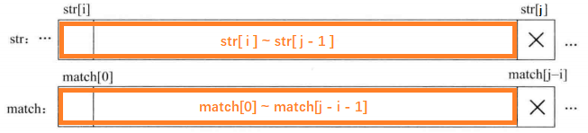


- **步骤二：下一次 match 数组往右滑动， 滑动大小为 match 当前字符的最大前后缀匹配长度，再让 str[j] 与 match[k] 进行下一次匹配，反过来比较好理解：让 `match[k]` 和 `str[j]` 来匹配。**

    那么下一次的匹配检查不再像普通解法那样退回到 `str[i+1]` 重新开始与 `match[0]` 的匹配过程，而是**直接让 `str[j]` 与 `match[k]` 进行匹配检查**，如图所示。在图中，**在 str 中要匹配的位置仍是 j，而不进行退回**。对 match 来说，相当于向右滑动，让 match[k] 滑动到与 str[j] 同一个位置上，然后进行后续的匹配检查。直到在 str 的某一个位置把 match 完全匹配完，就说明str 中有 match。如果 match 滑到最后也没匹配出来，就说明str 中没有 match。

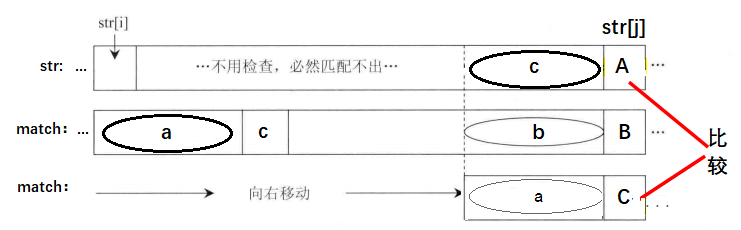


> 注：注意为什么加快，主要是 str[i] ~ c 前那段不用考虑，因为肯定不能匹配，若有匹配 则出现更大的前后缀匹配长度 ，与最初 nextArr[] 定义违背。

#### 2. match 字符串的 nextArr 数组求解和时间复杂度 O(M) 的证明

对 `match[0]` 来说，在它之前没有字符，所以 **`nextArr[0]` 规定为 `-1`**，对于 `match[1]` 来说，在它之前有 `match[0]`，但是 nextArr 数组定义要求任何子串的后缀不能包括第一个字符（这里为 `match[0]`），所以 `match[1]` 之前的字符串只有长度为 `0` 的后缀字符串，所以 **`nextArr[1]` 为 `1`**，对于 `match[i]（i > 1）`来说，求解过程如下：

因为是从左到右依次求解 `nextArr`，所以在求解 `nextArr[i]` 时候，`nextArr[0…i - 1]` 的值都已经求出。假设 `match[i]` 字符为下图中的 `A` 字符，`match[i - 1]` 为下图中的 `B` 字符。

通过 `nextArr[i - 1]` 的值可以得到 `B` 字符前的字符串的最长前缀和后缀匹配区域，下图中的 `L` 区域就是最长匹配的前缀子串， `K` 区域就是最长匹配的后缀子串，图中字符 `C` 是 `L` 区域之后的字符，然后看字符 `C` 和字符 `B` 是否相等。

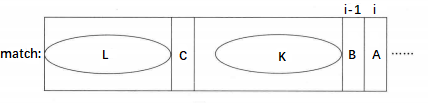

- 如果字符 `C` 和字符 `B` 相等，那么 `A` 字符之前的最长前缀和后缀匹配区域就可以确定，前缀子串为 `L` 的区域 +`C` 字符，后缀子串为 `K` 区域 + `B` 字符，即 `nextArr[i + 1] = nextArr[i] + 1;`

- 如果字符 `C` 和字符 `B` 不相等，就看字符 `C` 之前的前缀和后缀匹配情况，假设字符 `C` 是第 `cn` 个字符（match[cn]），那么 `nextArr[cn]` 就是其最长前缀和最长后缀匹配长度。如图所示：

    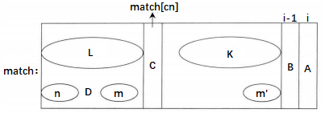
    
    在图中， `m` 区域和 `n` 区域分别是字符 `C` 之前的字符串的最长匹配的后缀和前缀区域，这是通过 `nextArr[cn]` 值确定的，当然两个区域是相等的， `m’` 区域为 `K` 区域的最右的区域且长度与 `m` 区域一样，因为 `K` 区域和 `L` 区域是相等的，`m‘` 区域 为 `K` 区域最右区域且长度和 `m` 区域一样，因为 `K` 区域和 `L` 区域是相等的，所以 `m` 区域和 `m’` 区域是相等的，字符 `D` 为 `n` 区域之后的一个字符，接下来比较字符 `D` 是否与字符 `B` 相等。
    
    - 如果相等，`A` 字符之前的字符串的最长前缀与后缀匹配区域就可以确定，前缀子串为 `n` 区域 + `D` 字符，后缀子串为 `m’` 区域 + `B` 字符，则令 `nextArr[i] = nextArr[cn] + 1`。
    - 如果不等，继续往前跳到字符 `D`，之后的过程和跳到字符 `C` 类似，一直进行这样的跳过程，跳的每一步都会有一个新的字符和 `B` 比较（就像 `C` 字符和 `D` 字符一样），只要有相等的情况，`nextArr[i]` 的值就能确定。		
    
    如果向前跳到最左位置（即 `match[0]` 的位置），此时 `nextArr[0] == -1`，说明字符 `A` 之前的字符串不存在前缀和后缀匹配的情况，则令 `nextArr[i] = 0`。用这种不断向前跳的方式可以算出正确的 `nextArr[i]` 值的原因还是因为每跳到一个位置 `cn`，`nextArr[cn]` 的意义就表示它之前字符串的最大匹配长度。求解 `nextArr` 数组的具体过程请参照如下代码中的 `getNextArray` 方法。
    
    

**讨论计算复杂度：**

getNextArray 方法中的 while 循环就是求解 nextArr 数组的过程，现在证明这个循环发生的次数不会超过 2M 这个数量。先来看 pos 量，一个为（pos-cn）的量，对 pos 量来说，从 2 开始又必然不会大于 match 的长度，即 pos < M，对（pos-cn）量来说，pos 最大为 M - 1， cn 最小为 0，所以 （pos - cn）<= M。

循环的第一个逻辑分支会让 pos 的值增加，（pos - cn）的值不变。循环的第二个逻辑分支为 cn 向左跳的过程，所以会让 cn 减小， pos 值在这个分支中不变，所以 (pos - cn)的值会增加，循环的第三个逻辑分支会让 pos 的值增加，（pos- cn) 的值也会增加，如下表所示：

|                      | Pos  | pos-cn |
| -------------------- | ---- | ------ |
| 循环的第一个逻辑分支 | 增加 | 不变   |
| 循环的第二个逻辑分支 | 不变 | 增加 |
| 循环的第三个逻辑分支 | 增加 | 增加 |

因为 pos+ （pos - cn）< 2M，和上表的关系，所以循环发生的总体次数小于 pos 量 和 （pos - cn）量的增加次数，也必然小于 2M，证明完毕。

所以整个 KMP 算法的复杂度为 O(M)(求解 nextArr 数组的过程) + O(N)(匹配的过程)，因为有 N>= M，所以时间复杂度为 O（N）。

代码

```java
package com.gjxaiou.advanced.day01;

/**
 * @author GJXAIOU
 */
public class KMP {

    public static int getIndexOf(String str, String match) {
        if (str == null || match == null || match.length() < 1 || str.length() < match.length()) {
            return -1;
        }
        char[] strArray = str.toCharArray();
        char[] matchArray = match.toCharArray();
        int strIndex = 0;
        int matchIndex = 0;
        int[] next = getNextArray(matchArray);
        while ((strIndex < strArray.length) && (matchIndex < matchArray.length)) {
            if (strArray[strIndex] == matchArray[matchIndex]) {
                strIndex++;
                matchIndex++;
                // 数组中值等于 -1 ，说明是第一个元素，说明当前 str 中值连 match 第一个字母都匹配不上，则直接从 str 的下一个开始进行匹配
            } else if (next[matchIndex] == -1) {
                strIndex++;
            } else {
                matchIndex = next[matchIndex];
            }
        }
        return (matchIndex == matchArray.length) ? strIndex - matchIndex : -1;
    }

    /**
     * 求解 nextArr 方法
     */
    public static int[] getNextArray(char[] match) {
        if (match.length == 1) {
            return new int[]{-1};
        }
        int[] nextArr = new int[match.length];
        nextArr[0] = -1;
        nextArr[1] = 0;

        // 从第二个位置开始求值
        int curIndex = 2;
        int cn = 0;
        while (curIndex < nextArr.length) {
            // 如果 B 位置值等于 C 位置值，则 L + C = K + B
            if (match[curIndex - 1] == match[cn]) {
                // 则长度就是从 0 到 cn，即 ++cn 的长度
                nextArr[curIndex] = ++cn;
                curIndex++;
                // cn 换值，curIndex 不变，继续循环
            } else if (cn > 0) {
                cn = nextArr[cn];
            } else {
                nextArr[curIndex++] = 0;
            }
        }
        return nextArr;
    }

    public static void main(String[] args) {
        String str = "abcabcababaccc";
        String match = "ababa";
        System.out.println(getIndexOf(str, match));
    }
}
```
程序运行结果为：`6`

### （五）添加字符串得到原字符串两倍

【题目】给定一个字符串如何加最短的字符（只能在原始串的后面进行添加）使其构成一个长的字符串且包含两个原始字符串，并且开始位置还得不一样

【示例】：`abcabc ---->abcabcabc` 最少增加 3 个

**思路：**其实就是最大前后缀长度数组

**步骤**：求原字符串每一个的 next 数组，得到原字符串最大长度==**后一个**==的 next 数组值。该值表明原字符串的最大可复用长度（next 数组的意义），然后用原字符串长度减去最大可复用长度，得到应该添加字符的长度，即从原字符串倒数取得，添加即可。

总结： 在 KMP 中 nextArr 数组基础上多求一位终止位，将不是的补上即可

```java
package com.gjxaiou.advanced.day01;

/**
 * @author GJXAIOU
 */
public class ShortestHaveTwice {

    public static String answer(String inputStr) {
        if (inputStr == null || inputStr.length() == 0) {
            return "";
        }
        char[] inputArray = inputStr.toCharArray();
        if (inputArray.length == 1) {
            return inputStr + inputStr;
        }
        if (inputArray.length == 2) {
            return inputArray[0] == inputArray[1] ? (inputStr + inputArray[0]) :
                    (inputStr + inputStr);
        }
        // 获取长度
        int endNextArrLength = endNextLength(inputArray);
        return inputStr + inputStr.substring(endNextArrLength);
    }

    public static int endNextLength(char[] inputArray) {
        // 多求一位
        int[] nextArr = new int[inputArray.length + 1];
        nextArr[0] = -1;
        nextArr[1] = 0;
        int curIndex = 2;
        int cn = 0;
        while (curIndex < nextArr.length) {
            if (inputArray[curIndex - 1] == inputArray[cn]) {
                nextArr[curIndex++] = ++cn;
            } else if (cn > 0) {
                cn = nextArr[cn];
            } else {
                nextArr[curIndex++] = 0;
            }
        }
        return nextArr[nextArr.length - 1];
    }

    public static void main(String[] args) {
        String test1 = "a";
        System.out.println(answer(test1));
        String test2 = "aa";
        System.out.println(answer(test2));
        String test3 = "ab";
        System.out.println(answer(test3));
        String test4 = "abcdabcd";
        System.out.println(answer(test4));
        String test5 = "abracadabra";
        System.out.println(answer(test5));
    }
}
```
程序运行结果为
```java
aa
aaa
abab
abcdabcdabcd
abracadabracadabra
```

### （六）给定两个树（值可以相同或者不同） 判断树 1 的某棵子树是否包含树 2（结构和值完全相同）

**子树就是从某个头结点开始下面所有子节点都要**，下图第一个图就是可以 true，另一个图就是 false。

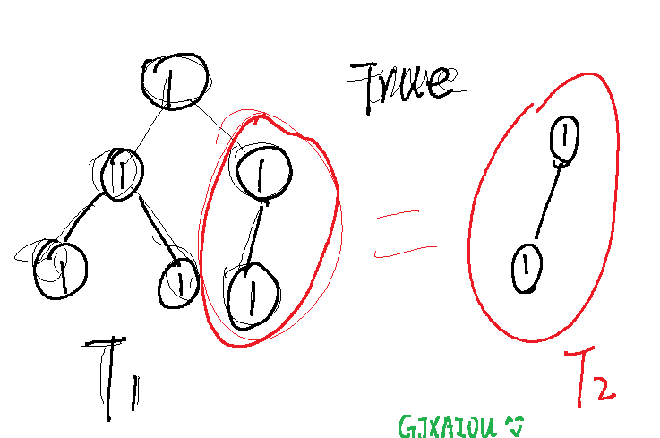


**思路**： 把一棵树序列化（可以先序、中序、后续）为字符串（字符数组）  。如果 str2 是 str1的子串 则T2也是T1的子树。

```java
package com.gjxaiou.advanced.day01;

/**
 * 判断树 1 的某棵子树是否包含树 2
 *
 * @author GJXAIOU
 */
public class T1SubtreeEqualsT2 {

    public static class TreeNode {
        public int value;
        public TreeNode left;
        public TreeNode right;

        public TreeNode(int data) {
            this.value = data;
        }
    }

    // 首先对两棵树进行序列化，然后就可以按照字符串进行判断
    public static boolean isSubtree(TreeNode t1, TreeNode t2) {
        String t1Str = treeSerialToString(t1);
        String t2Str = treeSerialToString(t2);
        return getIndexOf(t1Str, t2Str) != -1;
    }

    // 将树结构序列化为字符串，这里使用前序遍历
    public static String treeSerialToString(TreeNode head) {
        if (head == null) {
            return "#!";
        }
        String res = head.value + "!";
        res += treeSerialToString(head.left);
        res += treeSerialToString(head.right);
        return res;
    }

    // 按照 KMP 算法即可
    public static int getIndexOf(String str, String match) {
        if (str == null || match == null || match.length() < 1 || str.length() < match.length()) {
            return -1;
        }
        char[] strArray = str.toCharArray();
        char[] matchArray = match.toCharArray();
        int[] nextArr = getNextArray(matchArray);
        int strIndex = 0;
        int matchIndex = 0;
        while (strIndex < strArray.length && matchIndex < matchArray.length) {
            if (strArray[strIndex] == matchArray[matchIndex]) {
                strIndex++;
                matchIndex++;
            } else if (nextArr[matchIndex] == -1) {
                strIndex++;
            } else {
                matchIndex = nextArr[matchIndex];
            }
        }
        return matchIndex == matchArray.length ? strIndex - matchIndex : -1;
    }

    public static int[] getNextArray(char[] matchArray) {
        if (matchArray.length == 1) {
            return new int[]{-1};
        }
        int[] nextArr = new int[matchArray.length];
        nextArr[0] = -1;
        nextArr[1] = 0;
        int curIndex = 2;
        int cn = 0;
        while (curIndex < nextArr.length) {
            if (matchArray[curIndex - 1] == matchArray[cn]) {
                nextArr[curIndex++] = ++cn;
            } else if (cn > 0) {
                cn = nextArr[cn];
            } else {
                nextArr[curIndex++] = 0;
            }
        }
        return nextArr;
    }

    public static void main(String[] args) {
        TreeNode t1 = new TreeNode(1);
        t1.left = new TreeNode(2);
        t1.right = new TreeNode(3);
        t1.left.left = new TreeNode(4);
        t1.left.right = new TreeNode(5);
        t1.right.left = new TreeNode(6);
        t1.right.right = new TreeNode(7);
        t1.left.left.right = new TreeNode(8);
        t1.left.right.left = new TreeNode(9);

        TreeNode t2 = new TreeNode(2);
        t2.left = new TreeNode(4);
        t2.left.right = new TreeNode(8);
        t2.right = new TreeNode(5);
        t2.right.left = new TreeNode(9);

        System.out.println(isSubtree(t1, t2));
    }
}
```


### （七）判断一个大字符串是否由一个小字符串重复得到，就是某个字符串是否为某个小字符串 * n 得到；

**思路**：转换为 一个前缀和后缀相差整数倍的问题


## 二、Manacher 算法：求字符串中最长回文子串长度

【题目】：给定一个字符串 str，返回 str 中最长回文子串的长度。

【常规思路】： 

- 总是从中间那个字符出发，向两边开始扩展，观察回文，然后每个字符都得进行一遍

   但是奇数位数字完全可以  偶数位数字不可以，例如 1221 对应的每位扩充结果为：1 1 1 1 ，但是结果为 4.会出错

-  经过规律发现 无论是哪种情况 总是 `最大值/2` 即为最大回文串长度

处理回文子串长度为偶数的问题：上面拿`abcdcb`来举例，其中`bcdcb`属于一个回文子串，但如果回文子串长度为偶数呢？像`cabbac`，按照上面定义的“扩”的逻辑岂不是每个字符的回文半径都是0，但事实上`cabbac`的最长回文子串的长度是6。==**因为我们上面“扩”的逻辑默认是将回文子串当做奇数长度的串来看的，因此我们在使用Manacher算法之前还需要将字符串处理一下**==。

处理方式为：将字符串的首尾和每个字符之间加上一个特殊符号，这样就能将输入的串统一转为奇数长度的串了。比如`abba`处理过后为`#a#b#b#a#`，这样的话就有`charArr[4]='#'`的回文半径为 4，也即原串的最大回文子串长度为 4。相应代码如下：

前提是要处理字符串形式，加入特殊字符占位 #（其实什么字符都行）进行填充（在开头结尾和每个中间加入）

 这种方法是暴力法，时间复杂度为$$O(n^2)$$-----==而Manacher算法可以降到O(n)==

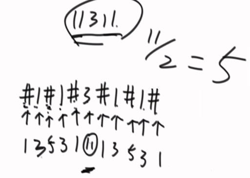

**概念汇总**：Manacher 算法中定义了如下几个概念：

- 回文半径：串中某个字符最多能向外扩的字符**个数**（加上字符本身）称为该字符的回文半径。比如`abcdcb`中字符`d`，能扩一个`c`，还能再扩一个`b`，再扩就到字符串右边界了，再**算上字符本身**，字符`d`的回文半径是3。

- 回文**半径**数组`pArr`：长度和字符串长度一样，保存串中每个字符的回文半径。比如`charArr="abcdcb"`，其中`charArr[0]='a'`一个都扩不了，但算上其本身有`pArr[0]=1`；而`charArr[3]='d'`最多扩2个，算上其本身有`pArr[3]=3`。

- 最右回文右边界`R`：遍历过程中，“扩”这一操作扩到的最右的字符的下标。比如`charArr=“abcdcb”`，当遍历到`a`时，只能扩`a`本身，向外扩不动，所以`R=0`；当遍历到`b`时，也只能扩`b`本身，所以更新`R=1`；但当遍历到`d`时，能向外扩两个字符到`charArr[5]=b`，所以`R`更新为5。【即能扩充到的最右边的下标】。

    > 如图所示，刚开始默认在 -1 位置，然后当到 0 位置，回文半径只能到 0 位置，所以最右的回文半径为 0  位置，当到 1 位置时候，回文半径扩充到 2 位置，则最右回文半径扩充到 2 位置，当移动到 3 位置时候，最右回文半径为 6

    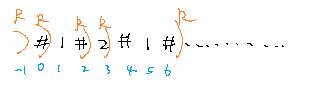

- 最右回文右边界对应的回文中心`C`：`C`与`R`是对应的、同时更新的。比如`abcdcb`遍历到`d`时，`R=5`，`C`就是`charArr[3]='d'`的下标`3`。

### （二）Manacher 算法详解

针对 `i` 位置的回文串求法

- 如果 `i` 位置当前不在最右回文半径中，只能采用上面的方式暴力破：O(N )

    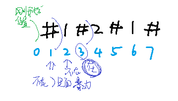

- `i` 位置在回文右边界内：则设当前回文中心为 `C`，则 `i` 位置肯定是在回文中心 `C` 和回文右边界之间，做 `i` 位置关于中心 `C` 的对称点 `i’`，则针对 `i’` 的所在的回文区域与整个回文区域关系有不同情况

    - `i'` 所在的回文区域在整个回文区域之间：O(1)

        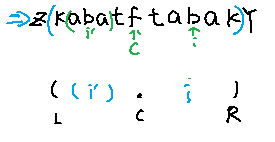
        
        **则 `i` 回文长度大小和 `i’` 回文长度相同**。证明：使用对称和区间内小回文，整个大区间大回文的结论可以证明 i 对应的区域是回文，并且是最大的。
        
    - `i'` 所在的回文区域在整个回文区域相交：O(1)
    
    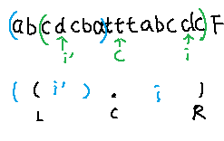
    
    ​		**则 `i` 回文长度为 `i` 到 `R` 长度**。
    
- `i'` 所在的回文区域与整个回文区域之间边界重叠

    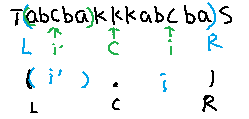

这种情况下，只能保证 `i` 到 `R`  区间的数据不需要进行暴力破，相当于可以从 `R + 1` 位置开始判断。

```java
package com.gjxaiou.advanced.day01;

/**
 * @Author GJXAIOU
 * @Date 2020/1/1 14:22
 */
public class Manacher {
    // 将输入字符串构造前后和中间加上特殊符号，构成奇数长度。
    public static char[] inputStringToOddNum(String str) {
        char[] strArray = str.toCharArray();

        char[] resArray = new char[str.length() * 2 + 1];
        int index = 0;
        for (int i = 0; i != resArray.length; i++) {
            resArray[i] = (i & 1) == 0 ? '#' : strArray[index++];
        }
        return resArray;
    }

    public static int maxLoopsLength(String str) {
        if (str == null || str.length() == 0) {
            return 0;
        }
        char[] charArr = inputStringToOddNum(str);
        // 回文半径数组
        int[] pArr = new int[charArr.length];
        // indexC 为对称中心 C
        int indexC = -1;
        int pR = -1;
        int maxResLength = Integer.MIN_VALUE;
        for (int i = 0; i != charArr.length; i++) {
            /**
             *  i < pR,表示 i 在回文右边界里面
             *  2 * indexC - 1 就是对应 i' 位置
             *  i 只要在回文右边界里面，则 i 的回文半径 pArr[i] 为 i'的回文半径 或者 pR - i 两者中最小的一个。
             *  如果 i > pR 则只能暴力破解
             */
            pArr[i] = i < pR ? Math.min(pArr[2 * indexC - i], pR - i) : 1;
            // 四种情况都让扩一下，其中 1 和 4 会成功，但是 2 ，3 会失败则回文右边界不改变；可以自己写成 if-else 问题。
            while ((i + pArr[i] < charArr.length) && (i - pArr[i] > -1)) {
                if (charArr[i + pArr[i]] == charArr[i - pArr[i]]) {
                    pArr[i]++;
                } else {
                    break;
                }
            }
            if (i + pArr[i] > pR) {
                pR = i + pArr[i];
                indexC = i;
            }
            maxResLength = Math.max(maxResLength, pArr[i]);
        }
        return maxResLength - 1;
    }

    public static void main(String[] args) {
        int length = maxLoopsLength("123abccbadbccba4w2");
        System.out.println(length);
    }
}
```


### （三）题目拓展：添加字符形成回文串

一个字符串，只能向后面添加字符，怎么将整个串都变成回文串，要求添加字符最短。

示例： ‘abc12321’  应添加  ‘cba’  变成  ’abc12321cba‘

即求，在包含最后一个字符情况下，最长回文串多少，前面不是的部分，逆序添加即可。

用 manacher 求得回文边界，发现边界与字符串最后位置，停止，求得回文中心C与有边界R，找到回文字符串，用原字符串减去该部分，在逆序就是结果。

>思路：当`R`第一次到达串尾时，做`R`关于`C`的对称点`L`，将`L`之前的字符串逆序就是结果。

```java
package com.gjxaiou.advanced.day01;

/**
 * 添加尽可能少的字符使其成为一个回文字符串
 *
 * @author GJXAIOU
 * @Date 2020/1/1 14:11
 */

public class ShortestEnd {

    public static char[] manacherString(String str) {
        char[] charArr = str.toCharArray();
        char[] res = new char[str.length() * 2 + 1];
        int index = 0;
        for (int i = 0; i != res.length; i++) {
            res[i] = (i & 1) == 0 ? '#' : charArr[index++];
        }
        return res;
    }

    public static String shortestEnd(String str) {
        if (str == null || str.length() == 0) {
            return null;
        }
        char[] charArr = manacherString(str);
        int[] pArr = new int[charArr.length];
        int index = -1;
        int pR = -1;
        int maxContainsEnd = -1;
        for (int i = 0; i != charArr.length; i++) {
            pArr[i] = pR > i ? Math.min(pArr[2 * index - i], pR - i) : 1;
            while (i + pArr[i] < charArr.length && i - pArr[i] > -1) {
                if (charArr[i + pArr[i]] == charArr[i - pArr[i]])
                    pArr[i]++;
                else {
                    break;
                }
            }
            if (i + pArr[i] > pR) {
                pR = i + pArr[i];
                index = i;
            }
            if (pR == charArr.length) {
                maxContainsEnd = pArr[i];
                break;
            }
        }
        char[] res = new char[str.length() - maxContainsEnd + 1];
        for (int i = 0; i < res.length; i++) {
            res[res.length - 1 - i] = charArr[i * 2 + 1];
        }
        return String.valueOf(res);
    }

    public static void main(String[] args) {
        String str2 = "abcd1233212";
        System.out.println(shortestEnd(str2));
    }
}
```

## 三、BFPRT 算法：求解最小/最大的 k 个数问题，不是第 K 个数

- 最暴力的方法是：排序然后查找：$$O(N*log^N)$$

- 常规的做法 就是 平均时间复杂度为 O(n) 的 partition 函数的应用，划分结果为小于某个数的放左边，等于某个数的放中间，大于某个数的放右边，然后看等于的左右边界，例如第一次划分结果左右边界为：500 ~ 600 位，查找的是第 300 小的数，则将小于区域按照上面方式再次使用 partition 函数进行划分，如果等于区域命中就结束过程，依次类推。  

    缺点：是概率式的，无法避免最差的情况（因为每次选取的划分值是随机的，很难保证大于和小于该值的区间长度差不多）。因此最终期望为：$$O(N)$$

- BFPRT算法优点是确定性的，严格的 $$O(N)$$。

### （一）BFPRT 算法思路

- 步骤一：将整个数组以 `5` 个数字一组划分 ,最后不满 `5` 个的单独成组，分别进行组内排序（组间不排序） ，因为只是 `5` 个数排序，所有时间复杂度为 `O(1)`， 同时因为整个数组分为 `N/5` 组，所以则总共时间复杂度为 O(N)。

- 步骤二：把每个组内的中位数拿出来构成一个新数组，若为偶数则拿其上中位数即可，数组长度为 N/5；

- 递归调用该 BFPRT 函数，传入刚才的中位数数组 和 中位数数组长度的一半 （继续求中位数）【BFPRT 函数格式为： int BFPRT（arr,k) 输入数组 arr 和要求的第 k 小的值】

- 将上一步返回的值作为原始数组划分值，一直以该值作为 paritition 函数的划分值，然后后面同上的 Partition 过程。

**举个栗子**：

BFPRT(arr,k)，求第二大的值

- 步骤一：将原数组划分为 5 个一组：          3 2 1 4 6      0 1 2 3 5      2 3 7 5 6      4 2 1 3 2       5 3 2 4
- 步骤二：对每个划分之后的数排序：          1 2 3 4 6      0 1 2 3 5      2 3 5 6 7      1 2 2 3 4       2 3 4 5
- 步骤三：对每个数组取中位数构成新数组：    3                  2                 5                   2                3


每一步的时间复杂度为：假设原始数据量为 N，则

- 步骤一：O(1)

- 步骤二：O(N)

- 步骤三：O(N)

- 步骤四：因为是递归：T（N/5），最终获取划分值 P

- 步骤五：在 partition 算法中如果不是值正好在相等区域的情况下，则不是在小于就是在大于区间上，同时两个区间后续只有一个需要再次判断，另一个区间直接舍弃。

    判断最差的情况：左侧最差情况，就是找到最多能有多少数是小于划分值 P（即）最少多少数的确定大于划分值 P 的，所以至少共 3N/10 大于划分值。所以左边比它小的最多有7N/10。右边类似。

    所以最终该步骤左右时间复杂度为：$$T(\frac{7N}{10})$$ ，因为只算一个，所以最终仍然是：$$T(\frac{7N}{10})$$ 。

    所以整体时间复杂度为：$$T(N) = T(\frac{N}{5}) + T(\frac{7N}{10}) + O(N)$$，结果为 O(N)，证明见算法导论。


优点 :我们选择的基准一定将数组划分为 一定规模的子部分

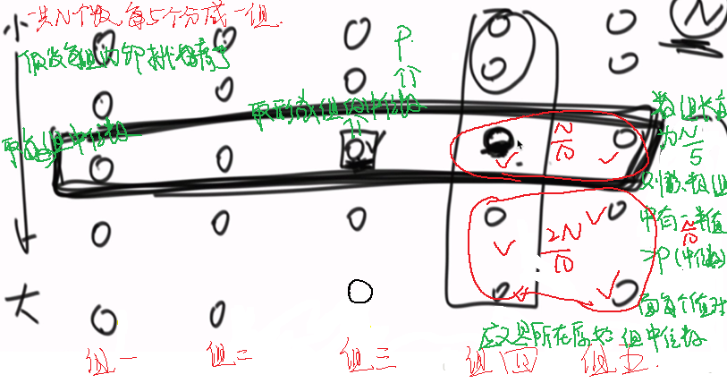

由上图我们可以看到： 最中间的中位数--- 右边比它大的**至少**有N/10 * 3 个（每个组又有两个大于该组中位数的数字）

​                                右边比它小的最多有N/10 * 7

​                             ---- 同理左边也是~

如下例子：  7为中位数 ----比它大的至少有 8 9 12 13 14 这几个数

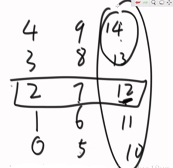

```java
package com.gjxaiou.advanced.day01;

/**
 * @Author GJXAIOU
 * @Date 2020/1/1 16:13
 */
public class BFPRT {
    // 使用堆的方式来求解该题，时间复杂度为：O(N * logN)
    public static int[] getMinKNumsByHeap(int[] arr, int k) {
        if (k < 1 || k > arr.length) {
            return arr;
        }
        int[] kHeap = new int[k];
        for (int i = 0; i != k; i++) {
            heapInsert(kHeap, arr[i], i);
        }
        for (int i = k; i != arr.length; i++) {
            if (arr[i] < kHeap[0]) {
                kHeap[0] = arr[i];
                heapify(kHeap, 0, k);
            }
        }
        return kHeap;
    }

    public static void heapInsert(int[] arr, int value, int index) {
        arr[index] = value;
        while (index != 0) {
            int parent = (index - 1) / 2;
            if (arr[parent] < arr[index]) {
                swap(arr, parent, index);
                index = parent;
            } else {
                break;
            }
        }
    }

    public static void heapify(int[] arr, int index, int heapSize) {
        int left = index * 2 + 1;
        int right = index * 2 + 2;
        int largest = index;
        while (left < heapSize) {
            if (arr[left] > arr[index]) {
                largest = left;
            }
            if (right < heapSize && arr[right] > arr[largest]) {
                largest = right;
            }
            if (largest != index) {
                swap(arr, largest, index);
            } else {
                break;
            }
            index = largest;
            left = index * 2 + 1;
            right = index * 2 + 2;
        }
    }

    // ------------------分割线---------------------

    // 获取前 K 个元素
    public static int[] getMinKNumsByBFPRT(int[] arr, int k) {
        if (k < 1 || k > arr.length) {
            return arr;
        }
        int minKth = getMinKthByBFPRT(arr, k);
        int[] res = new int[k];
        int index = 0;
        for (int i = 0; i != arr.length; i++) {
            if (arr[i] < minKth) {
                res[index++] = arr[i];
            }
        }
        for (; index != res.length; index++) {
            res[index] = minKth;
        }
        return res;
    }

    // 获取第 K 个元素
    public static int getMinKthByBFPRT(int[] arr, int K) {
        if (arr == null || K > arr.length) {
            return Integer.MIN_VALUE;
        }
        int[] copyArr = copyArray(arr);
        return bfprt(copyArr, 0, copyArr.length - 1, K - 1);
    }

    public static int[] copyArray(int[] arr) {
        int[] res = new int[arr.length];
        for (int i = 0; i != res.length; i++) {
            res[i] = arr[i];
        }
        return res;
    }

    // 在 begin 到 end 范围内求第 i 小的数
    public static int bfprt(int[] arr, int begin, int end, int i) {
        if (begin == end) {
            return arr[begin];
        }
        // 划分值
        int pivot = medianOfMedians(arr, begin, end);
        int[] pivotRange = partition(arr, begin, end, pivot);
        if (i >= pivotRange[0] && i <= pivotRange[1]) {
            return arr[i];
        } else if (i < pivotRange[0]) {
            return bfprt(arr, begin, pivotRange[0] - 1, i);
        } else {
            return bfprt(arr, pivotRange[1] + 1, end, i);
        }
    }

    public static int medianOfMedians(int[] arr, int begin, int end) {
        int num = end - begin + 1;
        int offset = num % 5 == 0 ? 0 : 1;
        int[] mArr = new int[num / 5 + offset];
        for (int i = 0; i < mArr.length; i++) {
            int beginI = begin + i * 5;
            int endI = beginI + 4;
            mArr[i] = getMedian(arr, beginI, Math.min(endI, end));
        }
        return bfprt(mArr, 0, mArr.length - 1, mArr.length / 2);
    }

    public static int[] partition(int[] arr, int begin, int end, int pivotValue) {
        int small = begin - 1;
        int cur = begin;
        int big = end + 1;
        while (cur != big) {
            if (arr[cur] < pivotValue) {
               // swap(arr, ++small, cur++);
                swap(arr, cur++, ++small);
            } else if (arr[cur] > pivotValue) {
                swap(arr, cur, --big);
            } else {
                cur++;
            }
        }
        int[] range = new int[2];
        // 等于区域最左边
        range[0] = small + 1;
        // 等于区域最右边
        range[1] = big - 1;
        return range;
    }

    public static int getMedian(int[] arr, int begin, int end) {
        insertionSort(arr, begin, end);
        int sum = end + begin;
        int mid = (sum / 2) + (sum % 2);
        return arr[mid];
    }

    public static void insertionSort(int[] arr, int begin, int end) {
        if (begin >= end) {
            return;
        }
        for (int i = begin + 1; i <= end; i++) {
            for (int j = i; j > begin; j--) {
                if (arr[j] < arr[j -1]) {
                    swap(arr, j, j -1);
                } else {
                    break;
                }
            }
        }
    }

    public static void swap(int[] arr, int begin, int end) {
        if (begin == end){
            return;
        }
        arr[begin] = arr[begin] ^ arr[end];
        arr[end] = arr[begin] ^ arr[end];
        arr[begin] = arr[begin] ^ arr[end];
    }
    public static void printArray(int[] array){
        for (int i = 0; i < array.length; i++) {
            System.out.print(array[i] + " ");
        }
        System.out.println();
    }

    public static void main(String[] args) {
        int[] demo ={6,9,1,3,1,2,2,5,6,1,3,5,9,7,2,5,6,1,9};
        printArray(getMinKNumsByHeap(demo, 10));
        printArray(getMinKNumsByBFPRT(demo, 10));
        System.out.println(getMinKthByBFPRT(demo, 10));
    }
}
```

注意： 此时的partition和常规的partition函数不太一样 多了一个我们定义的基准划分值

​      且以此基准值划分 比它小的在左边 比它大的在右边 和它相等的在中间并将相等的左右边界存放在一个数组中


