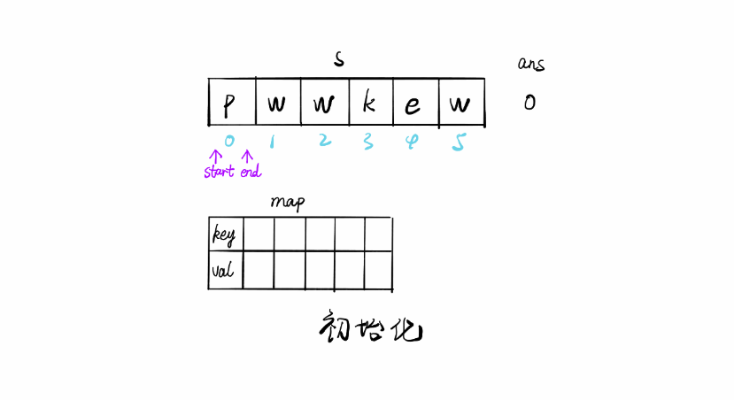
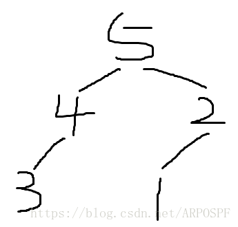
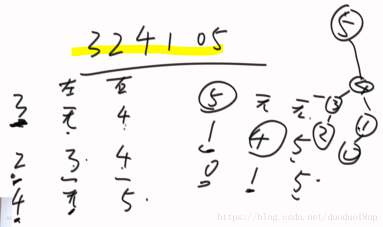
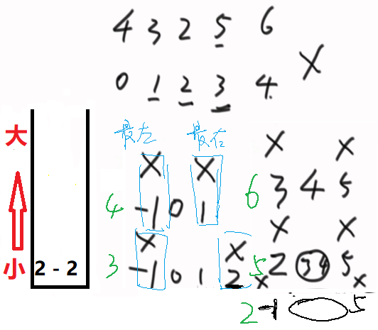
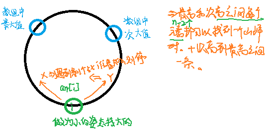

# AlgorithmMediumDay02

[TOC]

## 一、找到新的被指的新类型字符

【题目】新类型字符的定义如下：　

- 新类型字符是长度为 1 或者 2 的字符串

- 表现形式可以仅是小写字母，例如："e"；也可以是大写字母+小写字母，例如："Ab"；还可以是大写字母+大写字母，例如："DC"

现在给定一个字符串 str，str 一定是若干新类型字符正确组合的结果。比如"eaCCBi"，由新类型字符"e"，"a"，"CC"和"Bi"拼成。再给定一个整数 k，代表 str 中的位置。请返回被 k 位置指中的新类型字符

**举个栗子**：`str="aaABCDEcBCg"`

- k=7 时，返回"Ec"

- k=4 时，返回"CD"

- k=10 时，返回"g"

**思路**：

从 k-1 位置开始向左统计连续出现的大写字母数量 upperNum 遇到小写字母就停止 

- 如果 `upperNum` 为奇数， `str[k -1..k]` 是被选中的新型字符

- 如果 `upperNum` 为偶数，且 `str[k]` 是大写字母，`str[k..k+1]` 是被选中的新型字符

- 如果 `upperNum` 为偶数，且 `srt[k]` 是小写字母，`str[k]` 是被选中的新类型字符

```java
package com.gjxaiou.advanced.day02;

/**
 * @author GJXAIOU
 */
public class FindNewTypeChar {

    public static String pointNewChar(String s, int k) {
        if (s == null || s.equals("") || k < 0 || k >= s.length()) {
            return "";
        }

        char[] inputArray = s.toCharArray();
        // inputArray[k] 左边连续出现的大写字母数
        int upperNum = 0;
        for (int i = k - 1; i >= 0; i--) {
            // 遇到小写就停止寻找左边的大写字母个数
            if (!isUpper(inputArray[i])) {
                break;
            }
            upperNum++;
        }
        // 第一种情况：左边出现的大写字母为奇数
        if ((upperNum & 1) == 1) {
            //大写字母不能单独出现，所以一定和当前 k 字符共同组成新字符，即 [k-1,k]
            return s.substring(k - 1, k + 1);
        }

        // 第二种情况，左边大写偶数，当前 k 字符是大写
        if (isUpper(inputArray[k])) {
            // 大写字母不能单独出现，所以一定和后面的 k+1 字符共同组成新字符
            return s.substring(k, k + 2);
        }

        //第三种情况，左边大写偶数，当前k字符是小写，返回当前k字符即可
        return String.valueOf(inputArray[k]);
    }

    // 判断字符是否为大写
    public static boolean isUpper(char ch) {
        return !(ch < 'A' || ch > 'Z');
    }


    public static void main(String[] args) {
        String str = "aaABCDEcBCg";
        System.out.println(pointNewChar(str, 7));
        System.out.println(pointNewChar(str, 4));
        System.out.println(pointNewChar(str, 10));

    }
}
```


## 三、数字的英文表达和中文表达

【题目】给定一个 32 位整数 num，写两个函数分别返回 num 的英文与中文表达字符串。
【举个栗子】

- num=319
  - 英文表达字符串为：Three Hundred Nineteen
  - 中文表达字符串为：三百一十九
- num=1014
  - 英文表达字符串为：One Thousand, Fourteen
  - 中文表达字符串为：一千零十四
- num=-2147483648
  - 英文表达字符串为：Negative, Two Billion, One Hundred Forty Seven Million, Four Hundred Eighty Three Thousand, Six Hundred Forty Eight
  - 中文表达字符串为：负二十一亿四千七百四十八万三千六百四十八
- num=0
  - 英文表达字符串为：Zero
  - 中文表达字符串为：零

```java
package com.gjxaiou.advanced.day02;

public class EnglishExpression {

    // 如果是 1- 19，直接取值；可以通过枚举的方式,将所有19个可能性放入到一个String数组中
    public static String num1To19(int num) {
        if (num < 1 || num > 19) {
            return "";
        }
        String[] names = {"One ", "Two ", "Three ", "Four ", "Five ", "Six ",
                "Seven ", "Eight ", "Nine ", "Ten ", "Eleven ", "Twelve ",
                "Thirteen ", "Fourteen ", "Fifteen ", "Sixteen ", "Sixteen ",
                "Eighteen ", "Nineteen "};
        return names[num - 1];
    }

    /**
     * 当我们传入16是,就找出这个数组中16-1,下标为15的表达.十分简单,现在完成了1---19的表达,然后我们来完成1---99的表达,我们通过/运算得到十位,用一个数组来承担,
     * 然后通过%运算得到低位,然后使用num1to19来表达
     */
    public static String num1To99(int num) {
        if (num < 1 || num > 99) {
            return "";
        }
        if (num < 20) {
            return num1To19(num);
        }
        int high = num / 10;
        String[] tyNames = {"Twenty ", "Thirty ", "Forty ", "Fifty ",
                "Sixty ", "Seventy ", "Eighty ", "Ninety "};
        return tyNames[high - 2] + num1To19(num % 10);
    }

    // 依次类推,我们现在知道了1---99的表达,然后我们通过/和%运算就可以得到1---999的表达了,但是要注意,在中间加上,"Hundred".
    public static String num1To999(int num) {
        if (num < 1 || num > 999) {
            return "";
        }
        if (num < 100) {
            return num1To99(num);
        }
        int high = num / 100;
        return num1To19(high) + "Hundred " + num1To99(num % 100);
    }

    // 主函数
    public static String getNumEngExp(int num) {
        // 第一步判断num是不是0,如果是0的话直接返回 Zero
        if (num == 0) {
            return "Zero";
        }
        String res = "";
        // 第二步判断是不是负数,如果num<0,我们家在操作之前加上negative,
        if (num < 0) {
            res = "Negative, ";
        }
        // 重点来了,我们这儿为什么要将Integer.MIN_VALUE单另的拿出来做判断.因为如果不做处理的话,将Integer.MIN_VALUE转化成整数的话,就会溢出
        if (num == Integer.MIN_VALUE) {
            res += "Two Billion, ";
            num %= -2000000000;
        }
        num = Math.abs(num);
        int high = 1000000000;
        int highIndex = 0;
        String[] names = {"Billion", "Million", "Thousand", ""};
        while (num != 0) {
            int cur = num / high;
            num %= high;
            if (cur != 0) {
                res += num1To999(cur);
                res += names[highIndex] + (num == 0 ? " " : ", ");
            }
            high /= 1000;
            highIndex++;
        }
        return res;
    }

    /**
     * 测试程序
     */
    public static int generateRandomNum() {
        boolean isNeg = Math.random() > 0.5 ? false : true;
        int value = (int) (Math.random() * Integer.MIN_VALUE);
        return isNeg ? value : -value;
    }

    public static void main(String[] args) {
        System.out.println(getNumEngExp(0));
        System.out.println(getNumEngExp(Integer.MAX_VALUE));
        System.out.println(getNumEngExp(Integer.MIN_VALUE));
        int num = generateRandomNum();
        System.out.println(num);
        System.out.println(getNumEngExp(num));
    }
}
```


中文表达：https://www.jianshu.com/p/f08b03200f58

```java
package com.gjxaiou.advanced.day02;

public class ChineseExpression {

    public static String num1To9(int num) {
        if (num < 1 || num > 9) {
            return "";
        }
        String[] names = {"一", "二", "三", "四", "五", "六", "七", "八", "九"};
        return names[num - 1];
    }

    public static String num1To99(int num, boolean hasBai) {
        if (num < 1 || num > 99) {
            return "";
        }
        if (num < 10) {
            return num1To9(num);
        }
        int shi = num / 10;
        if (shi == 1 && (!hasBai)) {
            return "十" + num1To9(num % 10);
        } else {
            return num1To9(shi) + "十" + num1To9(num % 10);
        }
    }

    public static String num1To999(int num) {
        if (num < 1 || num > 999) {
            return "";
        }
        if (num < 100) {
            return num1To99(num, false);
        }
        String res = num1To9(num / 100) + "百";
        int rest = num % 100;
        if (rest == 0) {
            return res;
        } else if (rest >= 10) {
            res += num1To99(rest, true);
        } else {
            res += "零" + num1To9(rest);
        }
        return res;
    }

    public static String num1To9999(int num) {
        if (num < 1 || num > 9999) {
            return "";
        }
        if (num < 1000) {
            return num1To999(num);
        }
        String res = num1To9(num / 1000) + "千";
        int rest = num % 1000;
        if (rest == 0) {
            return res;
        } else if (rest >= 100) {
            res += num1To999(rest);
        } else {
            res += "零" + num1To99(rest, false);
        }
        return res;
    }

    public static String num1To99999999(int num) {
        if (num < 1 || num > 99999999) {
            return "";
        }
        int wan = num / 10000;
        int rest = num % 10000;
        if (wan == 0) {
            return num1To9999(rest);
        }
        String res = num1To9999(wan) + "万";
        if (rest == 0) {
            return res;
        } else {
            if (rest < 1000) {
                return res + "零" + num1To999(rest);
            } else {
                return res + num1To9999(rest);
            }
        }
    }

    public static String getNumChiExp(int num) {
        if (num == 0) {
            return "零";
        }
        String res = num < 0 ? "负" : "";
        int yi = Math.abs(num / 100000000);
        int rest = Math.abs((num % 100000000));
        if (yi == 0) {
            return res + num1To99999999(rest);
        }
        res += num1To9999(yi) + "亿";
        if (rest == 0) {
            return res;
        } else {
            if (rest < 10000000) {
                return res + "零" + num1To99999999(rest);
            } else {
                return res + num1To99999999(rest);
            }
        }
    }

    // for test
    public static int generateRandomNum() {
        boolean isNeg = Math.random() > 0.5 ? false : true;
        int value = (int) (Math.random() * Integer.MIN_VALUE);
        return isNeg ? value : -value;
    }

    public static void main(String[] args) {
        System.out.println(0);
        System.out.println(getNumChiExp(0));

        System.out.println(Integer.MAX_VALUE);
        System.out.println(getNumChiExp(Integer.MAX_VALUE));

        System.out.println(Integer.MIN_VALUE);
        System.out.println(getNumChiExp(Integer.MIN_VALUE));

        int num = generateRandomNum();
        System.out.println(num);
        System.out.println(getNumChiExp(num));

        num = generateRandomNum();
        System.out.println(num);
        System.out.println(getNumChiExp(num));

        num = generateRandomNum();
        System.out.println(num);
        System.out.println(getNumChiExp(num));

        num = generateRandomNum();
        System.out.println(num);
        System.out.println(getNumChiExp(num));

        System.out.println(getNumChiExp(10));
        System.out.println(getNumChiExp(110));
        System.out.println(getNumChiExp(1010));
        System.out.println(getNumChiExp(10010));
        System.out.println(getNumChiExp(1900000000));
        System.out.println(getNumChiExp(1000000010));
        System.out.println(getNumChiExp(1010100010));

    }
}
```


## 四、滑动窗口

**介绍窗口以及窗口内最大值或者最小值的更新结构（单调双向队列）**

### （一）滑动窗口的概念

**数组中包括 `L` 和 `R` 指 针，默认两个指针均位于数组的最左边即下标为 `-1` 的位置， 当有数字进入时 `R` 向右移动。当有数字删除时则 `L` 向右移动 且 `L` 和 `R` 不会回退且 `L` 不能到 `R` 右边。**

思路： **双端队列（链表）**：双端队列中既需要放置数据又需要放置位置下标，本质上存放下标就行，对应值根据下标从数组中就能获取。


**上图运行逻辑为：** 如果想实现窗口内最大值的更新结构： 使得双端队列保证从大到小的顺序 

- 当放入元素时候 ：

    （R 增加） **头部始终存放的是当前最大的元素**--- 如果即将进入双端队列的元素（因为 R 增加而从数组中取出放入双端队列中的元素）比上一个进入双端队列的元素小，则从尾部进入，新进入的元素直接连接在后面，否则 原来双端队列的尾部一直弹出（包含相等情况，因为晚过期） 直到为即将要放入的元素找到合适的位置，或者整个队列为空，然后放入新加入的元素。（见上面示例）

- 当删除元素时候：

    （L 增加）即 L 向右移---（index下标一定得保留）则需要检查当前头部元素 index是否过期，若过期则需要从头部进行弹出


**时间复杂度**：因为从到到位滑过，每个数只会进队列一次，出队列一次，在队列中删除的数是不找回的，因此时间复杂度为：$$O(N)$$


### （二）应用一：生成窗口最大值数组

【题目】：有一个整型数组 arr 和一个大小为 w 的窗口从数组的最左边滑到最右边，窗口每次向右滑一个位置。

例如，数组为 [4,3,5,4,3,3,6,7]，窗口大小为 3 时候：

[4 3 5] 4 3 3 6 7   窗口中最大值为：5

4 [3 5 4] 3 3 6 7   窗口中最大值为：5

4 3 [5 4 3] 3 6 7   窗口中最大值为：5

4 3 5 [4 3 3] 6 7   窗口中最大值为：4

4 3 5 4 [3 3 6] 7   窗口中最大值为：6

4 3 5 4 3 [3 6 7]   窗口中最大值为：7

如果数组长度为 n，窗口大小为 w，则一共产生 n - w + 1 个窗口的最大值。请实现一个函数：

- 输入：整型数组 arr，窗口大小为 w。

- 输出：一个长度为 n - w + 1 的数组 res，res[i] 表示每一种窗口状态下的最大值。

上面的结果应该返回{5,5,5,4,6,7}

**代码：**

```java
package com.gjxaiou.advanced.day02;

import java.util.LinkedList;

/**
 * @Author GJXAIOU
 * @Date 2020/1/1 20:29
 */
public class SlidingWindowMaxArray {
    public static int[] getMaxWindow(int[] arr, int w) {
        if (arr == null || w < 1 || arr.length < w) {
            return null;
        }

        LinkedList<Integer> maxList = new LinkedList<Integer>();
        int[] resList = new int[arr.length - w + 1];
        int index = 0;
        for (int i = 0; i < arr.length; i++) {
           // 更新双端队列，如果双端队列不为空，并且尾结点(存的是下标)对应数组中的值是否小于等于当前值
            while (!maxList.isEmpty() && arr[maxList.peekLast()] <= arr[i]) {
                maxList.pollLast();
            }

            // 上面一直弹出，直到不符合然后加上当前值。
            maxList.addLast(i);

            // 当过期的时候（当窗口形成之后再扩充才算过期）即窗口长度 > w，窗口形成过程中不会过期, i - w表示过期的下标
            if (maxList.peekFirst() == i - w) {
                maxList.pollFirst();
            }

            // 判断下标过期
            if (i >= w - 1) {
                // 当窗口已经形成了，记录每一步的 res
                resList[index++] = arr[maxList.peekFirst()];
            }
        }
        return resList;
    }

    /**
     * 测试程序
     */
    public static void printArray(int[] array) {
        for (int i = 0; i < array.length; i++) {
            System.out.print(array[i] + " ");
        }
        System.out.println();
    }

    public static void main(String[] args) {
        int[] arr = {4, 3, 5, 4, 3, 3, 6, 7};
        printArray(getMaxWindow(arr, 3));
    }
}
```


### （二）应用二：最大值-最小值<=num的子数组数量:

【题目】：给定数组 arr 和整数 num，共返回有多少个子数组满足如下情况：`max(arr[i...j]) - min(arr[i...j]) <= num`，其中 `max(arr[i...j])` 表示子数组 `arr[i...j]` 中最大值，`min(arr[i...j])` 表示子数组 `arr[i...j]` 中的最小值。

**要求**：如果数组长度为 N，请实现时间复杂度为 O（N）的解法。


**最简单思路： 暴力求解 两个for 依次遍历** ，时间复杂度： $$O(N^3)$$

子数组（必须连续）一共有：$$N^2$$ 个（0~1,0~2，。。。0~n；1~1，。。。）

```java
package com.gjxaiou.advanced.class02;

/**
 * @Author GJXAIOU
 * @Date 2020/1/1 20:59
 */
public class AllLessNumSubArray {
    // 暴力解法:O(N^3)
    public static int getNum1(int[] arr, int num) {
        int res = 0;
        // 双层 for 循环穷尽所有的子数组可能性。
        for (int start = 0; start < arr.length; start++) {
            for (int end = start; end < arr.length; end++) {
                if (isValid(arr, start, end, num)) {
                    res++;
                }
            }
        }
        return res;
    }

    public static boolean isValid(int[] arr, int start, int end, int num) {
        int max = Integer.MIN_VALUE;
        int min = Integer.MAX_VALUE;
        for (int i = start; i <= end; i++) {
            max = Math.max(max, arr[i]);
            min = Math.min(min, arr[i]);
        }
        return max - min <= num;
    }
}

```


**最优解思路：**

- 如果有一个子数组 `L~R` 已经符合要求（并且其最大值为 max，最小值为 min），则其中内部的子数组一定也符合要求，**因为内部空间（即范围小于 `L ~ R`）中的最大值只会 <= max，并且最小值只会 >=min，所有相减的结果肯定小于等于 num**。

- 同理如果已经不达标则往两边扩也肯定不达标（因为扩大返回只会导致 max 值变大，min 值变小）。

- 总计规律： 就是 `L` 一直往右走 不回退 `R` 也跟着往右扩大范围

首先数组左边固定在 0 位置，然后右边界一直扩充，但是同时维护一个窗口内最大值更新结构和窗口内最小值更新结构，使得每次扩充值之后都可以比较当前数组是否满足最大值 - 最小值 <= max 的情况，比如当到 X 下标的时候是满足的，但是 X + 1 下标就不满足的时候，则表示以 0 开头的满足的子数组数目为 X +1 个（0 ~ 0,0 ~1，。。0 ~X）。

然后 L 缩一个位置，到 1 的位置，然后更新现有的最大和最小窗口更新结构（因为更新结构中 0 下标的值需要弹出），然后 R 继续向右走进行判断，直到不可以了就可以得到所有以 1 开头的子数组个数。

其他类型，以此类推

```java
package com.gjxaiou.advanced.day02;

import java.util.LinkedList;

/**
 * @Author GJXAIOU
 * @Date 2020/1/1 20:59
 */
public class AllLessNumSubArray {
    /**
     * 使用双向最大最小值更新结构，时间复杂度为 O（N）
     */
    public static int getNum(int[] arr, int num) {
        if (arr == null || arr.length == 0) {
            return 0;
        }
        // 分别准备最大值和最小值更新结构
        LinkedList<Integer> maxList = new LinkedList<Integer>();
        LinkedList<Integer> minList = new LinkedList<Integer>();
        int L = 0;
        int R = 0;
        int res = 0;
        while (L < arr.length) {
            while (R < arr.length) {
                while (!minList.isEmpty() && arr[minList.peekLast()] >= arr[R]) {
                    minList.pollLast();
                }
                minList.addLast(R);
                while (!maxList.isEmpty() && arr[maxList.peekLast()] <= arr[R]) {
                    maxList.pollLast();
                }
                maxList.addLast(R);
                // 不达标
                if (arr[maxList.getFirst()] - arr[minList.getFirst()] > num) {
                    break;
                }
                R++;
            }

            if (minList.peekFirst() == L) {
                minList.pollFirst();
            }
            if (maxList.peekFirst() == L) {
                maxList.pollFirst();
            }
            res += R - L;
            // 换一个开头
            L++;
        }
        return res;
    }
}
```

## 五、找到字符串的最长无重复字符子串

【题目】：给定一个字符串 str，返回 str 的最长无重复字符子串的长度。
【举例】
str="abcd"，返回 4
str="aabcb"，最长无重复字符子串为 "abc"，返回 3。
【要求】：如果 str 的长度为N ，请实现时间复杂度为 O(N) 的方法。方法：滑动窗口

【解答】建立一个256位大小的整型数组 freq ，用来建立字符和其出现位置之间的映射。

维护一个滑动窗口，窗口内的都是没有重复的字符，去尽可能的扩大窗口的大小，窗口不停的向右滑动。

*   如果当前遍历到的字符从未出现过，那么直接扩大右边界；
*   如果当前遍历到的字符出现过，则缩小窗口（左边索引向右移动），然后继续观察当前遍历到的字符；
*   重复前两步，直到左边索引无法再移动；
*   维护一个结果res，每次用出现过的窗口大小来更新结果 res，最后返回 res 获取结果。


```java
package string.medium;

import java.util.HashMap;
import java.util.Map;

/**
 * 使用滑动窗口
 *
 * @author GJXAIOU
 * @create 2019-09-01-19:11
 */
public class LeetCode3 {
    public int lengthOfLongestSubstring(String s) {
        int[] freq = new int[256];
        int left = 0;
        int right = -1;
        int res = 0;

        // 在每次循环里逐渐改变窗口, 维护freq, 并记录当前窗口中是否找到了一个新的最优值
        while (left < s.length()) {
            if ((right + 1) < s.length() && (freq[s.charAt(right + 1)] == 0)) {
                right++;
                freq[s.charAt(right)]++;
            } else {
                // 如果 right 已经到头或者 right 位置已经有元素了
                freq[s.charAt(left)]--;
                left++;
            }
            res = res > (right - left + 1) ? res : (right - left + 1);
        }
        return res;
    }
}
```


### 方法优化

如果有重复，left 直接跳到重复位置  + 1 开始，不用慢慢+1；

- 定义一个 map 数据结构存储 (k, v)，其中 key 值为字符，value 值为字符位置 +1，加 1 表示从字符位置后一个才开始不重复；
- 我们定义不重复子串的开始位置为 start，结束位置为 end；
- 随着 end 不断遍历向后，会遇到与 [start, end] 区间内字符相同的情况，**此时将字符作为 key 值，获取其 value 值**，并更新 start，此时 [start, end] 区间内不存在重复字符
- 无论是否更新 start，都会更新其 map 数据结构和结果 ans。
- 时间复杂度：O(n)

```java
class Solution {
    public int lengthOfLongestSubstring(String s) {
        int length = s.length(), ans = 0;
        Map<Character, Integer> map = new HashMap<>();
        for (int end = 0, start = 0; end < length; end++) {
            char alpha = s.charAt(end);
            if (map.containsKey(alpha)) {
                start = map.get(alpha) > start ? map.get(alpha) : start;
            }
            ans = ans > end - start + 1 ? ans : end - start + 1;
            map.put(s.charAt(end), end + 1);
        }
        return ans;
    }
}

```



## 五、单调栈

【问题】给定一个数组 请确定每个元素左右距离**最近的比它大的数字**


**常规想法：** 到某一个元素时，通过两个for 分别获取其左边比它大的和右边比他大的数字 时间复杂度为 $$O(n^2)$$。

**最优解思路（单调栈）**，栈中实际放置下标即可。O(N)

- 首先一个按照从大到小顺序排序的栈结构 ，若在压栈过程中发现要压栈的元素和栈顶的元素相比要大，则弹出当前栈顶元素，并从开始弹出处记录，要压栈的元素就是其右边离栈顶元素最近比它大的数，之后继续弹出的下一个即为栈顶元素左边距离最近的一个元素。


注意： 到数组末尾时 但是栈中依然有元素 则此时元素弹出，该元素的右为null 而左边为栈中的下一元素。


**特殊情况：**若出现相等元素情况，则将下标放在一起，等到出现比它们大的数字时再都依次弹出即可。


```java
package com.gjxaiou.advanced.day02;

import java.util.ArrayList;
import java.util.List;
import java.util.Stack;

/**
 * @Author GJXAIOU
 * @Date 2020/8/6 22:15
 */
public class MonotonousStack {
    // 没有重复元素可以用这个
    public static int[][] getNearLessNoRepeat(int[] arr) {
        int[][] res = new int[arr.length][2];
        Stack<Integer> stack = new Stack<>();
        for (int i = 0; i < arr.length; i++) {
            while (!stack.isEmpty() && arr[stack.peek()] > arr[i]) {
                int popIndex = stack.pop();
                int leftLessIndex = stack.isEmpty() ? -1 : stack.peek();
                res[popIndex][0] = leftLessIndex;
                res[popIndex][1] = i;
            }
            stack.push(i);
        }
        while (!stack.isEmpty()) {
            int popIndex = stack.pop();
            int leftLessIndex = stack.isEmpty() ? -1 : stack.peek();
            res[popIndex][0] = leftLessIndex;
            res[popIndex][1] = -1;
        }
        return res;
    }

    // 针对所有情况都可以
    public static int[][] getNearLess(int[] arr) {
        int[][] res = new int[arr.length][2];
        Stack<List<Integer>> stack = new Stack<>();
        for (int i = 0; i < arr.length; i++) {
            while (!stack.isEmpty() && arr[stack.peek().get(0)] > arr[i]) {
                List<Integer> popIs = stack.pop();
                // 取位于下面位置的列表中，最晚加入的那个
                int leftLessIndex = stack.isEmpty() ? -1 : stack.peek().get(
                        stack.peek().size() - 1);
                for (Integer popi : popIs) {
                    res[popi][0] = leftLessIndex;
                    res[popi][1] = i;
                }
            }
            if (!stack.isEmpty() && arr[stack.peek().get(0)] == arr[i]) {
                stack.peek().add(Integer.valueOf(i));
            } else {
                ArrayList<Integer> list = new ArrayList<>();
                list.add(i);
                stack.push(list);
            }
        }
        while (!stack.isEmpty()) {
            List<Integer> popIs = stack.pop();
            // 取位于下面位置的列表中，最晚加入的那个
            int leftLessIndex = stack.isEmpty() ? -1 : stack.peek().get(
                    stack.peek().size() - 1);
            for (Integer popi : popIs) {
                res[popi][0] = leftLessIndex;
                res[popi][1] = -1;
            }
        }
        return res;
    }


    // for test
    public static int[] getRandomArrayNoRepeat(int size) {
        int[] arr = new int[(int) (Math.random() * size) + 1];
        for (int i = 0; i < arr.length; i++) {
            arr[i] = i;
        }
        for (int i = 0; i < arr.length; i++) {
            int swapIndex = (int) (Math.random() * arr.length);
            int tmp = arr[swapIndex];
            arr[swapIndex] = arr[i];
            arr[i] = tmp;
        }
        return arr;
    }

    // for test
    public static int[] getRandomArray(int size, int max) {
        int[] arr = new int[(int) (Math.random() * size) + 1];
        for (int i = 0; i < arr.length; i++) {
            arr[i] = (int) (Math.random() * max) - (int) (Math.random() * max);
        }
        return arr;
    }

    // for test
    public static int[][] rightWay(int[] arr) {
        int[][] res = new int[arr.length][2];
        for (int i = 0; i < arr.length; i++) {
            int leftLessIndex = -1;
            int rightLessIndex = -1;
            int cur = i - 1;
            while (cur >= 0) {
                if (arr[cur] < arr[i]) {
                    leftLessIndex = cur;
                    break;
                }
                cur--;
            }
            cur = i + 1;
            while (cur < arr.length) {
                if (arr[cur] < arr[i]) {
                    rightLessIndex = cur;
                    break;
                }
                cur++;
            }
            res[i][0] = leftLessIndex;
            res[i][1] = rightLessIndex;
        }
        return res;
    }

    // for test
    public static boolean isEqual(int[][] res1, int[][] res2) {
        if (res1.length != res2.length) {
            return false;
        }
        for (int i = 0; i < res1.length; i++) {
            if (res1[i][0] != res2[i][0] || res1[i][1] != res2[i][1]) {
                return false;
            }
        }

        return true;
    }

    // for test
    public static void printArray(int[] arr) {
        for (int i = 0; i < arr.length; i++) {
            System.out.print(arr[i] + " ");
        }
        System.out.println();
    }

    public static void main(String[] args) {
        int size = 10;
        int max = 20;
        int testTimes = 2000000;
        for (int i = 0; i < testTimes; i++) {
            int[] arr1 = getRandomArrayNoRepeat(size);
            int[] arr2 = getRandomArray(size, max);
            if (!isEqual(getNearLessNoRepeat(arr1), rightWay(arr1))) {
                System.out.println("Oops!");
                printArray(arr1);
                break;
            }
            if (!isEqual(getNearLess(arr2), rightWay(arr2))) {
                System.out.println("Oops!");
                printArray(arr2);
                break;
            }
        }
    }
}
```


### （一） 应用一：构造数组的 maxtree

定义二叉树的节点如下：

```java
public class Node{
    public int value;
    public Node left;
    public Node right;
    public Node(int data){
        this.value=data;
    }
}
```

一个数组的 MaxTree 定义：

- 数组必须没有重复元素
- MaxTree 是一棵二叉树，数组的每一个值对应一个二叉树节点
- 包括 MaxTree 树在内且在其中的每一棵子树上，值最大的节点都是树的头

给定一个没有重复元素的数组 arr，写出生成这个数组的 MaxTree 的函数，要求如果数组长度为 N，则时间负责度为 O(N)、额外空间负责度为 O(N)。

思考：

举例说明如何在满足时间和空间复杂度的要求下生成MaxTree。

arr={3,4,5,1,2}

3的左边第一个比3大的数：无      3的右边第一个比3大的数：4

4的左边第一个比4大的数：无      4的右边第一个比4大的数：5

5的左边第一个比5大的数：无      5的右边第一个比5大的数：无

1的左边第一个比1大的数：5      1的右边第一个比1大的数：2

2的左边第一个比2大的数：5       2的右边第一个比2大的数：无

以下列原则来建立这棵树：

- 每一个数的父结点是它左边第一个比它大的数和它右边第一个比它大的数中，较小的那个
- 如果一个数左边没有比它大的数，右边也没有。也就是说，这个数是整个数组的最大值，那么这个数就是MaxTree的头节点

那么3,4,5,1,2的MaxTree如下：



为什么通过这个方法能够正确地生成MaxTree呢？现给出证明：

1. 通过这个方法，所有的数能够生成一棵树，这棵树可能不是二叉树，但肯定是一棵树，而不是多棵树（森林）。在数组中的所有数都不同，而一个较小的数肯定会以一个比自己大的数作为父节点，那么最终所有的数向上找都会找到数组中的最大值，所以它们会有一个共同的头。
2. 通过这个方法，所有的数最多只有两个孩子。也就是说，这棵树可以用二叉树表示，而不需要多叉数。

如何尽可能快地找到每一个数左右两边第一个比它大的数呢？利用栈。找每个数左边第一个比它大的数，从左到右遍历每个数，栈中保持递减序列，新来的数不停地利用Pop出栈顶，直到栈顶比新数大或没有数。同样的方法可以求得每个数往右第一个比它大的数。


#### 实现思路

对每一个元素，从左边和右边各选择第一个比这个元素大的值，选择值较小的元素作为父节点。
  在【生成窗口最大数组】里面，已经掌握了，在 O(N) 时间复杂度里面，找到每个元素位置最近的比元素大的元素，同个这个套路，就可以构造一棵 MaxTree 了。

#### 证明

1 构造的不是森林
2 是一棵二叉树

证明：1  
  对于每一个树节点，都能往上找到一个节点，直到找到最大节点为止，这样所有树节点都有共同的父节点，这样构造出来的就是一棵树。

证明：2
  使用反证法解决，如果是一棵二叉树，那么对于每个作为父节点的元素，能够在元素的一边找到两个或两个以上的元素。存在如：[p, b1, x, b2]这样的结构，p是父节点、b1、b2为子节点, x为其他节点。

- 按照题目，可以设定：
      p > b1, p > b2
- 当b1 > b2：
      b2不会选择p作为父节点，可能选择b1作为父节点.
- 当b1 < b2：
      当x < b2时，b1不会选择p作为父节点，选择b2作为父节点.
      当x > b2时，b2不会选择p作为父节点，选择x作为父节点.

**注意**：树不要求一定要平衡

思路1 ： 按照大根堆思路建立 O(N)

思路2： 单调栈：O（N）

按照单调栈的思路找到每个元素左右最近比它大的元素---分以下几种情况进行讨论：

 1 若一个元素左右均是null 则它是全局最大的 直接作为根节点

 2 若一个元素左或者右 只存在一个 则只具有唯一的父节点

 3  若一个元素左右两个元素均存在 则选择其中最小的那个作为父节点



注意： 一定只能构成一棵树，不会成为多叉树或者森林：

因为数组中没有重复值，所有最大值肯定作为整棵树的头结点，而任何一个节点都会找到一个比它大的，然后放置在其下面，所以每个节点都有归属并且均以最大值为头结点 -》最终形成一棵树。

证明不是多叉树：即是证明每个结点下面最多只有两个子节点，即是证明每个结点的单侧只有一个数会挂在该结点的底下。


```java
package com.gjxaiou.advanced.day02;

import java.util.HashMap;
import java.util.Stack;

/**
 * @Author GJXAIOU
 * @Date 2020/8/6 22:52
 */
public class MaxTree {
    private static class Node {
        public int value;
        public Node left;
        public Node right;

        public Node(int data) {
            this.value = data;
        }
    }

    private static Node getMaxTree(int[] arr) {
        Node[] nArr = new Node[arr.length];
        for (int i = 0; i != arr.length; i++) {
            nArr[i] = new Node(arr[i]);
        }
        Stack<Node> stack = new Stack<Node>();
        HashMap<Node, Node> lBigMap = new HashMap<Node, Node>();
        HashMap<Node, Node> rBigMap = new HashMap<Node, Node>();
        for (int i = 0; i < nArr.length; i++) {
            Node currNode = nArr[i];
            while ((!stack.isEmpty()) && stack.peek().value < currNode.value) {
                popStackSetMap(stack, lBigMap);
            }
            stack.push(currNode);
        }
        while (!stack.isEmpty()) {
            popStackSetMap(stack, lBigMap);
        }
        for (int i = nArr.length - 1; i != -1; i--) {
            Node currNode = nArr[i];
            while ((!stack.isEmpty()) && stack.peek().value < currNode.value) {
                popStackSetMap(stack, rBigMap);
            }
            stack.push(currNode);
        }
        while (!stack.isEmpty()) {
            popStackSetMap(stack, rBigMap);
        }
        Node head = null;
        for (int i = 0; i != nArr.length; i++) {
            Node currNode = nArr[i];
            Node left = lBigMap.get(currNode);
            Node right = rBigMap.get(currNode);
            if (left == null && right == null) {
                head = currNode;
            } else if (left == null) {
                if (right.left == null) {
                    right.left = currNode;
                } else {
                    right.right = currNode;
                }
            } else if (right == null) {
                if (left.left == null) {
                    left.left = currNode;
                } else {
                    left.right = currNode;
                }
            } else {
                Node parent = left.value < right.value ? left : right;
                if (parent.left == null) {
                    parent.left = currNode;
                } else {
                    parent.right = currNode;
                }
            }
        }
        return head;
    }

    private static void popStackSetMap(Stack<Node> stack, HashMap<Node, Node> map) {
        Node popNode = stack.pop();
        if (stack.isEmpty()) {
            map.put(popNode, null);
        } else {
            map.put(popNode, stack.peek());
        }
    }

    private static void printPreOrder(Node head) {
        if (head == null) {
            return;
        }
        System.out.print(head.value + " ");
        printPreOrder(head.left);
        printPreOrder(head.right);
    }

    private static void printInOrder(Node head) {
        if (head == null) {
            return;
        }
        printPreOrder(head.left);
        System.out.print(head.value + " ");
        printPreOrder(head.right);
    }

    public static void main(String[] args) {
        int[] uniqueArr = {3, 4, 5, 1, 2};
        Node head = getMaxTree(uniqueArr);
        printPreOrder(head);
        System.out.println();
        printInOrder(head);
    }
}
```


### （二）求最大子矩阵的大小

【题目】给定一个整型矩阵 `map`，其中的值只有 `0` 和 `1` 两种，求其中全是 `1` 的所有矩形区域中，最大的矩形区域为 `1` 的数量。

【举个栗子】

- `1 1 1 0`

    其中，最大的矩形区域有 3 个 1，所以返回 3

- 示例 2

```
1 0 1 1
1 1 1 1
1 1 1 0
```

其中，最大的矩形区域有 6 个 1，所以返回 6


**类似的，下图的直方图** （值可以相等），以每个矩阵的中心高度为杠---然后分别向左右去扩展，到比它小的时候就停止 ---并记录能够达成的最大格子数目


**解法:**   此题用单调栈，但是是找到左边和右边离他最近的比它小的数---从小到大的顺序  

若压栈元素<当前栈顶元素 则弹出栈顶元素 ，并且结算值，例如放入  1 -> 3 时候会弹出 0 -》4 则表示 0 位置数的距离其最近的比它小的数在 1 位置，同时 0-》 4 下面没有元素，表示最左边可以扩充到 -1 位置，因为 -1 和 1 位置都不可达，所以其真正能扩充的只有它自己。 

如果栈下面没有元素 则一定能够到达左边界 右边界就是那个压栈元素所在值  

若到最后栈里有元素 但是没有主动让元素弹出的右端元素 则可以最右到达右边界 左边就是下面的元素（两边不可达）



**转换到原始问题中** ：

数组为 10 11 带入上面代码求出，以第 0 行为底的所有长方形中，含有1 最大的长方形；

则 对于1 行  2 1 2 2（表示以该行开始往上看有多少个连续的 1）带入上面代码求出以 第 1 行为底的。。。。

对于行 3 2 2 0 （注意此时为0 因为最上面是0 并没构成连续的1）

目的就是找到 每一行打底的最大的1的长方形


分析时间复杂度：因为每行运算都是 O（m），然后一共 N 行，所以是 O（n*m ) 就是遍历一遍矩阵

```java
package com.gjxaiou.advanced.day02;

import java.util.Stack;

/**
 * @Author GJXAIOU
 * @Date 2020/1/3 15:59
 */
public class MaximalRectangle {
    // 原问题（就是 0 1 矩阵）
    public static int maxRecSize(int[][] map) {
        if (map == null || map.length == 0 || map[0].length == 0) {
            return 0;
        }
        int maxArea = 0;
        int[] height = new int[map[0].length];
        for (int i = 0; i < map.length; i++) {
            for (int j = 0; j < map[0].length; j++) {
                // 形成辅助数组：就是 [10 11][2 1 2 2]等等
                height[j] = map[i][j] == 0 ? 0 : height[j] + 1;
            }
            maxArea = Math.max(maxRecFromBottom(height), maxArea);
        }
        return maxArea;
    }

    // 最基本方法，即一个数组代表直方图的话在其中找到最大矩形
    public static int maxRecFromBottom(int[] height) {
        if (height == null || height.length == 0) {
            return 0;
        }
        int maxArea = 0;
        // 准备一个单调栈，栈中放置下标
        Stack<Integer> stack = new Stack<Integer>();
        for (int i = 0; i < height.length; i++) {
            // 当栈不为空，且当前数小于等于栈顶
            while (!stack.isEmpty() && height[i] <= height[stack.peek()]) {
                // 弹出栈顶
                int j = stack.pop();
                // k 为左边界 （即弹出的数的下面是什么）
                int k = stack.isEmpty() ? -1 : stack.peek();
                // i 为当前数，就是右边界，自己在 k 位置上
                int curArea = (i - k - 1) * height[j];
                maxArea = Math.max(maxArea, curArea);
            }
            stack.push(i);
        }
        // 遍历完成之后，栈中剩余元素进行结算
        while (!stack.isEmpty()) {
            int j = stack.pop();
            int k = stack.isEmpty() ? -1 : stack.peek();
            int curArea = (height.length - k - 1) * height[j];
            maxArea = Math.max(maxArea, curArea);
        }
        return maxArea;
    }

    public static void main(String[] args) {
        int[][] map = {{1, 0, 1, 1}, {1, 1, 1, 1}, {1, 1, 1, 0}};
        int maxArea = maxRecSize(map);
        System.out.println("maxArea = " + maxArea);
    }
}
```


### （三）回形山

【题目】 使用一个数组表示环形山，然后每座山上放烽火，相邻山之间的烽火可以看见；因为任意两座山之间可以通过顺时针或者逆时针的方式互相到达，如果两种方式中一条经过的数字都不大于两座山值的较小的一个，则两座山相互可见（如 3,4 之间可以看见），返回能返回相互看见的山峰有多少对。


如果数组中所有值都不相等：

1 座山峰规定为 0 对，2 座山峰规定为 1 对，如果大于 2 座，则 i 座山峰共 （ 2 * i - 3 ）对。

找发规定为：小的找大的，




但是实际问题中是可能含有最大值的，因此首先找到数组中的最大值，如果有多个取第一个，从该值开始进行环形遍历（例如：3  3 5  4  5，遍历顺序为：5 4  5 3  3）


针对遍历结束之后单调栈中剩余的元素，倒数第 3 及其以上的仍然适用于原来的公式，其余倒数第 2 和倒数第 1 单独计算。


```java
package com.gjxaiou.advanced.day02;

import java.util.Scanner;
import java.util.Stack;

/**
 * @Author GJXAIOU
 * @Date 2020/1/3 17:44
 */
public class MountainsAndFlame {
    public static void main(String[] args) {
        // 输入两部分值：数组长度和数组具体的内容
        Scanner in = new Scanner(System.in);
        while (in.hasNextInt()) {
            int size = in.nextInt();
            int[] arr = new int[size];
            for (int i = 0; i < size; i++) {
                arr[i] = in.nextInt();
            }
            System.out.println(communications(arr));
        }
        in.close();
    }

    // 在环形数组中 i 位置的下一位，没到底则 +1，到底就为 0
    public static int nextIndex(int size, int i) {
        return i < (size - 1) ? (i + 1) : 0;
    }

    public static long getInternalSum(int n) {
        return n == 1L ? 0L : (long) n * (long) (n - 1) / 2L;
    }

    public static class Pair {
        public int value;
        public int times;

        public Pair(int value) {
            this.value = value;
            this.times = 1;
        }
    }

    // arr 为环形数组
    public static long communications(int[] arr) {
        if (arr == null || arr.length < 2) {
            return 0;
        }
        int size = arr.length;
        // 找到最大值位置（第一个）
        int maxIndex = 0;
        for (int i = 0; i < size; i++) {
            maxIndex = arr[maxIndex] < arr[i] ? i : maxIndex;
        }
        // value 为最大值
        int value = arr[maxIndex];
        int index = nextIndex(size, maxIndex);
        long res = 0L;
        // 首先将最大值扔入栈中
        Stack<Pair> stack = new Stack<Pair>();
        stack.push(new Pair(value));
        // 因为是从 maxIndex 的下一个位置开始遍历的，所有如果值再次相等说明遍历结束
        while (index != maxIndex) {
            // 数组中的当前值
            value = arr[index];
            while (!stack.isEmpty() && stack.peek().value < value) {
                int times = stack.pop().times;
                // res += getInernalSum(times) +times;
                // res += stack.isEmpty() ? 0 : times;
                // 下面结果为上面两句合并
                res += getInternalSum(times) + 2 * times;
            }
            // 如果当前值使得栈顶弹出，然后栈顶和弹出之后露出的栈顶值相同，则原来栈顶数目 +1
            if (!stack.isEmpty() && stack.peek().value == value) {
                stack.peek().times++;
                // 如果和弹出之后露出的栈顶值不相等，则将当前值放入栈中
            } else {
                stack.push(new Pair(value));
            }
            index = nextIndex(size, index);
        }
        // 遍历结束之后剩余栈中元素进行结算
        while (!stack.isEmpty()) {
            int times = stack.pop().times;
            res += getInternalSum(times);
            if (!stack.isEmpty()) {
                res += times;
                if (stack.size() > 1) {
                    res += times;
                } else {
                    res += stack.peek().times > 1 ? times : 0;
                }
            }
        }
        return res;
    }
}
```
