# AlgorithmMediumDay03

[TOC]

## 一、Morris遍历

利用 Morris 遍历实现二叉树的先序、中序、后序遍历，时间复杂度为 O（N），额外空间复杂度为 O（1），N 为二叉树的节点个数（不要求是完全二叉树）。

**经典二叉树，由于没有指向父节点的指针，故遍历时都需要一个栈**（递归：系统递归函数帮助压栈，非递归：自己压）来保存有关父节点的信息，都会造成 O(H) 的额外空间复杂度，H 为二叉树高度。

```java
// 普通递归版
public static void process(Node head) {
        if (head == null) {
            return;
        }
        // 1，打印放在这里为先序遍历
        //System.out.println(head.value);
        process(head.left);
        // 2，打印放在这里为中序遍历
        //System.out.println(head.value);
        process(head.right);	
        // 3,打印放在这里为后序遍历(第三次回到自己节点时候打印)
        //System.out.println(head.value);
 }
```

==Morris 遍历是利用了二叉树中空闲的结点，例如末子节点的两个引用都是指向的位置为空，但是引用仍然占着空间。利用空闲的空间完成回到上级的操作，即修改原来二叉树结构来实现。==


普通遍历递归，可以三次来到当前节点，按打印时机可分为前中后序。

morris 遍历：如果有左子树，可以来到当前节点两次，若没有左子树，来到当前节点一次，可以利用左子树最右节点右指针指向谁来标记第一次还是第二次到这个节点（左子树最右指针指向null，第一次到，指向当前节点，即指向自己，第二次到）。但是在遍历右子树时，无法第三次回到自己。

morris遍历第一次到时打印，**先序**。第二次到时打印（没有左子树的一次可以理解为直到第一次与第二次重叠在一起），**中序**。

morris**后序**，**只关注能来到两次的节点**，在第二次来到这个节点的时候，逆序打印其左子树的右边界，然后整个函数退出之前单独打印整个树的右边界。

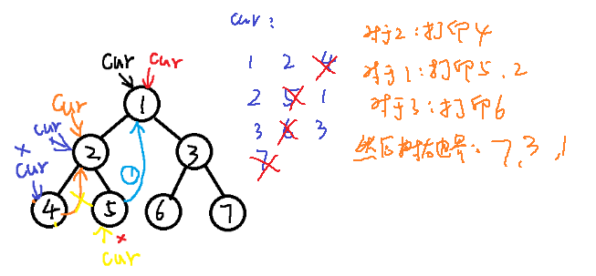

逆序打印：利用链表的reverse修改指针指向，打印后，改回指针。

示例拓扑：

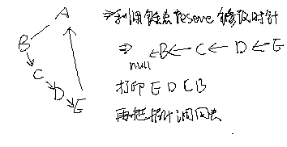

**所有先序、中序、后序是经典遍历基础是选择打印时机不同的产生的结果**

morris遍历的空间复杂度：O（1）

- 来到的当前节点记为 cur，如果 cur 无左孩子，cur 向右移动（cur = cur.right）

- 如果 cur 有左孩子，找到 cur 左子树上最右的节点，记为 mostright
    - 若 mostright 的 right 指针指向空，让其指向 cur，然后 cur 向左移动（cur = cur.left）
    - 若 mostright 的 right 指针指向 cur，让其指向空，cur 向右移动

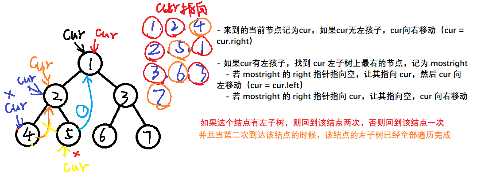

```java
package com.gjxaiou.advanced.day03;

/**
 * @Author GJXAIOU
 * @Date 2020/1/3 18:49
 */
public class MorrisTraversal {

    public static class Node {
        public int value;
        Node left;
        Node right;

        public Node(int data) {
            this.value = data;
        }
    }

    // Morris 遍历改为先序遍历
    public static void morrisPre(Node head) {
        if (head == null) {
            return;
        }
        Node cur = head;
        Node mostRight = null;
        while (cur != null) {
            mostRight = cur.left;
            // 如果当前结点的左孩子不为空，找到该结点左子树的最右节点
            if (mostRight != null) {
                while (mostRight.right != null && mostRight.right != cur) {
                    mostRight = mostRight.right;
                }
                // 如果最右结点的 right 指向 null，让其指向 cur，然后 cur 向左移动
                if (mostRight.right == null) {
                    mostRight.right = cur;
                    System.out.print(cur.value + " ");
                    cur = cur.left;
                    continue;
                    // 最右结点的 right 指向 cur，则改为指向 null
                } else {
                    mostRight.right = null;
                }
                // 此 else 表示当前结点没有左子树的时候，可以认为其第一次到达和第二次到达是重在一起的，没有左孩子，当前结点向右移动
            } else {
                System.out.print(cur.value + " ");
            }
            cur = cur.right;
        }
        System.out.println();
    }

    // Morris 中序遍历
    public static void morrisIn(Node head) {
        if (head == null) {
            return;
        }
        // 开始 cur 指向 head
        Node cur = head;
        Node mostRight = null;
        while (cur != null) {
            mostRight = cur.left;
            // 节点 cur 左孩子不为空则走这里
            if (mostRight != null) {
                // 不断找左子树最右的节点
                while (mostRight.right != null && mostRight.right != cur) {
                    mostRight = mostRight.right;
                }
                // 情况二的第一种可能性
                if (mostRight.right == null) {
                    mostRight.right = cur;
                    cur = cur.left;
                    continue;
                    // 情况二的第二种可能性
                } else {
                    mostRight.right = null;
                }
            }
            // 在节点往右跑之前打印
            System.out.print(cur.value + " ");
            // 当没有左孩子的时候
            cur = cur.right;
        }
        System.out.println();
    }


    // Morris 实现后续遍历
    public static void morrisPos(Node head) {
        if (head == null) {
            return;
        }
        Node cur = head;
        Node mostRight = null;
        while (cur != null) {
            mostRight = cur.left;
            // if 表示一个节点可以回到自己两次
            if (mostRight != null) {
                while (mostRight.right != null && mostRight.right != cur) {
                    mostRight = mostRight.right;
                }
                if (mostRight.right == null) {
                    mostRight.right = cur;
                    cur = cur.left;
                    continue;
                    // 发现是回到自己两次
                } else {
                    mostRight.right = null;
                    // 打印这个结点的整棵树右边界逆序打印
                    printEdge(cur.left);
                }
            }
            cur = cur.right;
        }
        // 函数结束之前打印整个树右边界
        printEdge(head);
        System.out.println();
    }

    public static void printEdge(Node head) {
        Node tail = reverseEdge(head);
        Node cur = tail;
        while (cur != null) {
            System.out.print(cur.value + " ");
            cur = cur.right;
        }
        reverseEdge(tail);
    }

    public static Node reverseEdge(Node from) {
        Node pre = null;
        Node next = null;
        while (from != null) {
            next = from.right;
            from.right = pre;
            pre = from;
            from = next;
        }
        return pre;
    }
}
```


## morris 遍历二叉树

> 关于二叉树先序、中序、后序遍历的递归和非递归版本，这6种遍历算法的时间复杂度都需要`O(H)`（其中`H`为树高）的额外空间复杂度，因为二叉树遍历过程中只能向下查找孩子节点而无法回溯父结点，因此这些算法借助栈来保存要回溯的父节点（递归的实质是系统帮我们压栈），并且栈要保证至少能容纳下`H`个元素（比如遍历到叶子结点时回溯父节点，要保证其所有父节点在栈中）。而morris遍历则能做到时间复杂度仍为`O(N)`的情况下额外空间复杂度只需`O(1)`。

### 遍历规则

首先在介绍morris遍历之前，我们先把先序、中序、后序定义的规则抛之脑后，比如先序遍历在拿到一棵树之后先遍历头结点然后是左子树最后是右子树，并且在遍历过程中对于子树的遍历仍是这样。

忘掉这些遍历规则之后，我们来看一下morris遍历定义的标准：

1. 定义一个遍历指针`cur`，该指针首先指向头结点

2. 判断 `cur`的左子树是否存在

    - 如果`cur`的左孩子为空，说明`cur`的左子树不存在，那么`cur`右移来到`cur.right`

    - 如果 `cur`的左孩子不为空，说明 `cur`的左子树存在，找出该左子树的最右结点，记为`mostRight`；

        - 如果，`mostRight`的右孩子为空，那就让其指向`cur`（`mostRight.right=cur`），并左移`cur`（`cur=cur.left`）
    - 如果`mostRight`的右孩子不空，那么让`cur`右移（`cur=cur.right`），并将`mostRight`的右孩子置空

3. 经过步骤2之后，如果`cur`不为空，那么继续对`cur`进行步骤2，否则遍历结束。

下图所示举例演示morris遍历的整个过程：


### 先序、中序序列

遍历完成后对`cur`进过的节点序列稍作处理就很容易得到该二叉树的先序、中序序列：


示例代码：

```java
public static class Node {
    int data;
    Node left;
    Node right;
    public Node(int data) {
        this.data = data;
    }
}

public static void preOrderByMorris(Node root) {
    if (root == null) {
        return;
    }
    Node cur = root;
    while (cur != null) {
        if (cur.left == null) {
            System.out.print(cur.data+" ");
            cur = cur.right;
        } else {
            Node mostRight = cur.left;
            while (mostRight.right != null && mostRight.right != cur) {
                mostRight = mostRight.right;
            }
            if (mostRight.right == null) {
                System.out.print(cur.data+" ");
                mostRight.right = cur;
                cur = cur.left;
            } else {
                cur = cur.right;
                mostRight.right = null;
            }
        }
    }
    System.out.println();
}

public static void mediumOrderByMorris(Node root) {
    if (root == null) {
        return;
    }
    Node cur = root;
    while (cur != null) {
        if (cur.left == null) {
            System.out.print(cur.data+" ");
            cur = cur.right;
        } else {
            Node mostRight = cur.left;
            while (mostRight.right != null && mostRight.right != cur) {
                mostRight = mostRight.right;
            }
            if (mostRight.right == null) {
                mostRight.right = cur;
                cur = cur.left;
            } else {
                System.out.print(cur.data+" ");
                cur = cur.right;
                mostRight.right = null;
            }
        }
    }
    System.out.println();
}

public static void main(String[] args) {
    Node root = new Node(1);
    root.left = new Node(2);
    root.right = new Node(3);
    root.left.left = new Node(4);
    root.left.right = new Node(5);
    root.right.left = new Node(6);
    root.right.right = new Node(7);
    preOrderByMorris(root);
    mediumOrderByMorris(root);

}
```

这里值得注意的是：**morris遍历会来到一个左孩子不为空的结点两次**，而其它结点只会经过一次。因此使用morris遍历打印先序序列时，如果来到的结点无左孩子，那么直接打印即可（这种结点只会经过一次），否则如果来到的结点的左子树的最右结点的右孩子为空才打印（这是第一次来到该结点的时机），这样也就忽略了`cur`经过的结点序列中第二次出现的结点；而使用morris遍历打印中序序列时，如果来到的结点无左孩子，那么直接打印（这种结点只会经过一次，左中右，没了左，直接打印中），否则如果来到的结点的左子树的最右结点不为空时才打印（这是第二次来到该结点的时机），这样也就忽略了`cur`经过的结点序列中第一次出现的重复结点。

### 后序序列

使用morris遍历得到二叉树的后序序列就没那么容易了，因为对于树种的非叶结点，morris遍历最多会经过它两次，而我们后序遍历实在第三次来到该结点时打印该结点的。因此要想得到后序序列，仅仅改变在morris遍历时打印结点的时机是无法做到的。

但其实，在morris遍历过程中，如果在每次遇到第二次经过的结点时，将该结点的左子树的右边界上的结点从下到上打印，最后再将整个树的右边界从下到上打印，最终就是这个数的后序序列：


其中无非就是在morris遍历中在第二次经过的结点的时机执行一下打印操作。而从下到上打印一棵树的右边界，可以将该右边界上的结点看做以`right`指针为后继指针的链表，将其反转`reverse`然后打印，最后恢复成原始结构即可。示例代码如下（其中容易犯错的地方是`18`行和`19`行的代码不能调换）：

```java
public static void posOrderByMorris(Node root) {
    if (root == null) {
        return;
    }
    Node cur = root;
    while (cur != null) {
        if (cur.left == null) {
            cur = cur.right;
        } else {
            Node mostRight = cur.left;
            while (mostRight.right != null && mostRight.right != cur) {
                mostRight = mostRight.right;
            }
            if (mostRight.right == null) {
                mostRight.right = cur;
                cur = cur.left;
            } else {
                mostRight.right = null;
                printRightEdge(cur.left);
                cur = cur.right;
            }
        }
    }
    printRightEdge(root);
}

private static void printRightEdge(Node root) {
    if (root == null) {
        return;
    }
    //reverse the right edge
    Node cur = root;
    Node pre = null;
    while (cur != null) {
        Node next = cur.right;
        cur.right = pre;
        pre = cur;
        cur = next;
    }
    //print 
    cur = pre;
    while (cur != null) {
        System.out.print(cur.data + " ");
        cur = cur.right;
    }
    //recover
    cur = pre;
    pre = null;
    while (cur != null) {
        Node next = cur.right;
        cur.right = pre;
        pre = cur;
        cur = next;
    }
}

public static void main(String[] args) {
    Node root = new Node(1);
    root.left = new Node(2);
    root.right = new Node(3);
    root.left.left = new Node(4);
    root.left.right = new Node(5);
    root.right.left = new Node(6);
    root.right.right = new Node(7);
    posOrderByMorris(root);
}
```

### 时间复杂度分析

因为morris遍历中，只有左孩子非空的结点才会经过两次而其它结点只会经过一次，也就是说遍历的次数小于`2N`，因此使用morris遍历得到先序、中序序列的时间复杂度自然也是`O(1)`；但产生后序序列的时间复杂度还要算上`printRightEdge`的时间复杂度，但是你会发现整个遍历的过程中，所有的`printRightEdge`加起来也只是遍历并打印了`N`个结点：


因此时间复杂度仍然为`O(N)`。

> morris遍历结点的顺序不是先序、中序、后序，而是按照自己的一套标准来决定接下来要遍历哪个结点。
>
> morris遍历的独特之处就是充分利用了叶子结点的无效引用（引用指向的是空，但该引用变量仍然占内存），从而实现了`O(1)`的时间复杂度。


## 二、平衡二叉树/AVL树

### （一）平衡性

经典的平衡搜索二叉树结构：在满足**搜索二叉树的前提条件**下，对于一棵二叉树中的任意子树，其左子树和其右子树的高度相差不超过1。

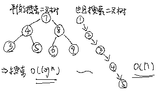

因为默认情况下形成的搜索二叉树结构和数值的输入顺序有关，如果想要尽量保持平衡性则需要对树的结构进行调整。

### （二）典型搜索二叉树—AVL树、红黑树、SBT树的原理，增删改查都是 O（N）

#### 1.AVL树

AV L树是一种具有严苛平衡性的搜索二叉树。即**所有子树的左子树和右子树的高度相差不超过1**。弊端是，每次发现因为插入、删除操作破坏了这种严苛的平衡性之后，都需要作出相应的调整以使其恢复平衡，调整较为频繁。

#### ==2.红黑树==

红黑树是每个节点都带有颜色属性的搜索二叉树，颜色为红色或黑色。在搜索二叉树强制一般要求以外，对于任何有效的红黑树我们增加了如下的额外要求:

- 性质1. 节点是红色或黑色。
- 性质2. 根节点是黑色。
- 性质3 每个叶节点（NIL节点，空节点）是黑色的。
- 性质4 每个红色节点的两个子节点都是黑色。(从每个叶子到根的所有路径上不能有两个连续的红色节点)
- 性质5. 从任一节点到其每个叶子的所有路径都包含相同数目的黑色节点。

这些约束强制了红黑树的关键性质:==**从根到叶子的最长的可能路径不多于最短的可能路径的两倍长**==。结果是这个树**大致上是平衡**的。因为操作比如插入、删除和查找某个值的最坏情况时间都要求与树的高度成比例，这个在高度上的理论上限允许红黑树在最坏情况下都是高效的，而不同于普通的二叉查找树。

因为**性质 4 导致了路径不能有两个毗连的红色节点**就足够了。**最短的可能路径都是黑色节点，最长的可能路径有交替的红色和黑色节点**。因为根据性质5所有最长的路径都有相同数目的黑色节点，这就表明了没有路径能多于任何其他路径的两倍长。

**红黑树结构代码见 Algorithm 项目**


**Java中红黑树的使用**

Java中红黑树的实现有`TreeSet`和`TreeMap`，前者结点存储的是单一数据，而后者存储的是`key-value`的形式。

```java
public static void main(String[] args) {
    TreeMap<Integer,String> treeMap = new TreeMap();
    treeMap.put(5, "tom");
    treeMap.put(11, "jack");
    treeMap.put(30,"tony");
    treeMap.put(18, "alice");
    treeMap.put(25, "jerry");

    //红黑树中最右边的结点
    System.out.println(treeMap.lastEntry());
    System.out.println(treeMap.lastKey());
    //红黑树最左边的结点
    System.out.println(treeMap.firstKey());
    //如果有13这个key，那么返回这条记录，否则返回树中比13大的key中最小的那一个
    System.out.println(treeMap.ceilingEntry(13));
    //如果有21这个key，那么返回这条记录，否则返回树中比21小的key中最大的那一个
    System.out.println(treeMap.floorEntry(21));
    //比11大的key中，最小的那一个
    System.out.println(treeMap.higherKey(11));
    //比25小的key中，最大的那一个
    System.out.println(treeMap.lowerKey(25));
    //遍历红黑树，是按key有序遍历的
    for (Map.Entry<Integer, String> record : treeMap.entrySet()) {
        System.out.println("age:"+record.getKey()+",name:"+record.getValue());
    }
}
```

`TreeMap`的优势是`key`在其中是有序组织的，因此增加、删除、查找`key`的时间复杂度均为`log(2,N)`。

#### 3.SBT（Size Balanced Tree） 树

**相比红黑树、AVL树等自平衡二叉查找树，SBT更易于实现**。**SBT能在O(log n)的时间内完成所有二叉搜索树(BST)的相关操作**，而与普通二叉搜索树相比，SBT仅仅加入了简洁的核心操作Maintain。由于SBT赖以保持平衡的是size域而不是其他“无用”的域，它可以很方便地实现动态顺序统计中的select和rank操作。

**SBT树的性质**是：对于数中任意结点，以该结点为根节点的子树的结点个数不能比以该结点的叔叔结点为根节点的子树的结点个数大。


> 由于红黑树的实现较为复杂，因此现在工程中大多使用SBT树作为平衡二叉树的实现。

**代码见**：Algorithm 项目


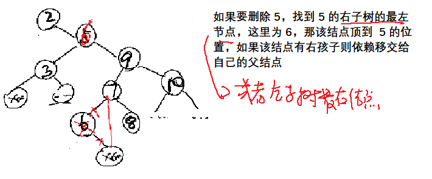

### （三）搜索二叉树调整的步骤：为了平衡性

==右旋：头结点变成了新头结点的右孩子==

==左旋：头结点变成了新头结点的左孩子==

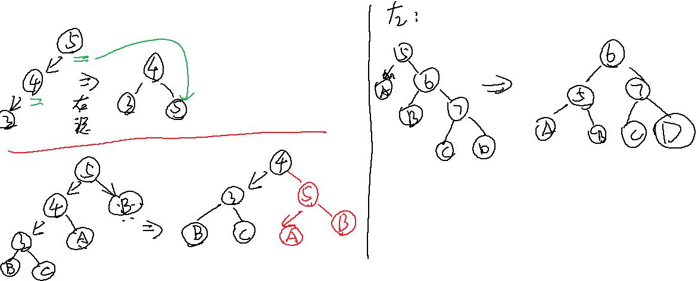


#### 以 AVL 树为例

- 怎么发现不平衡的

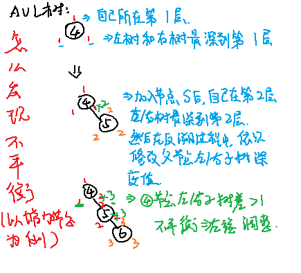

- 发现之后的修改方式

    结点发现左右子树高度不平衡，修改，然后向父走，一级一级判断修改

- LL，RR，LR，RL型

    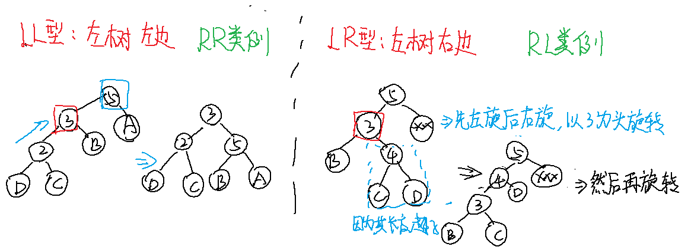

#### 1.旋转过程——Rebalance

每种平衡二叉树都有自己的一套在插入、删除等操作改变树结构而破坏既定平衡性时的应对措施（但都是左旋操作和右旋操作的组合），以AVL数为例（有四种平衡调整操作，其中的数字只是结点代号而非结点数值）：

- `LL`调整：2号结点的左孩子的左孩子导致整个树不平衡，2号结点右旋一次

    

    

    

- `RR`调整：3号结点的右孩子的右孩子导致树不平衡，3号结点左旋一次：

    

    

    

- `LR`调整：先左后右

    

    

    

- `RL`调整：先右后左：

    

    

    

> 红黑树的调整也是类似的，只不过调整方案更多。面试中一般不会让你手写红黑树（若有兴趣可参见文末附录），但我们一定能说清这些查找二叉树的性质，以及调整平衡的基本操作，再就是这些结构的使用。

AVL 树结构代码见：Algorithm 项目


## 二、舞会最大活跃度

【题目】一个公司的上下级关系是一棵多叉树，这个公司要举办晚会，你作为组织者已经摸清了大家的心理：**一个员工的直** **接上级如果到场，这个员工肯定不会来**。每个员工都有一个活跃度的值（值越大，晚会上越活跃），**你可以给某个员工发邀请函以决定谁来**，怎么让舞会的气氛最活跃？返回最大的活跃值。

【举个栗子】


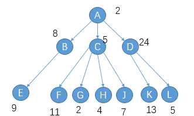


如果邀请 A 来，那么其直接下属 B、C、D 一定不会来，你可以邀请 E、F、G、H、J、K、L 中的任意几个来，如果都邀请，那么舞会最大活跃度为`A(2)+E(9)+F(11)+G(2)+H(4)+J(7)+K(13)+L(5)`；但如果选择不邀请 A 来，那么你可以邀请其直接下属 B、C、D 中任意几个来，比如邀请 B 而不邀请 C、D，那么 B 的直接下属 E 一定不回来，但 C、D 的直接下属你可以选择性邀请。

【输入参数表示】

给定一个矩阵来表述这种关系
matrix =
{1,6
1,5
1,4}
这个矩阵的含义是：
`matrix[0] = {1 , 6}`，表示 0 这个员工的直接上级为 1 , 0 这个员工自己的活跃度为 6
`matrix[1] = {1 , 5}`，表示 1 这个员工的直接上级为 1（他自己是这个公司的最大boss）,1 这个员工自己的活跃度为 5
`matrix[2] = {1 , 4}`，表示 2 这个员工的直接上级为 1 , 2 这个员工自己的活跃度为 4
为了让晚会活跃度最大，应该让 1 不来，0 和 2 来。最后返回活跃度为 10

【前提】如果你知道每个员工来舞会或不来舞会对舞会活跃值的影响，那么舞会最大活跃值就容易得知了。**比如是否邀请 A 来取决于：B 来或不来两种情况中选择对舞会活跃值增益最大的那个 + C 来或不来两种情况中选择对舞会活跃值增益最大的那个 + D 来或不来两种情况中选择对舞会活跃值增益最大的那个**；同理，对于任意一名员工，是否邀请他来都是用此种决策。


**列出可能性**：来或不来。

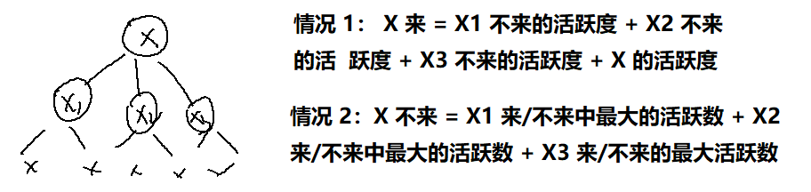

**子过程要收集的信息**：返回子员工来对舞会活跃值的增益值和不来对舞会的增益值中的较大值。

```java
package com.gjxaiou.advanced.day03;

import java.util.ArrayList;
import java.util.List;

public class MaxHappy {

    public static class Node {
        public int huo;
        public List<Node> nexts;

        public Node(int huo) {
            this.huo = huo;
            nexts = new ArrayList<>();
        }
    }

    public static class ReturnData {
        public int lai_huo;
        public int bu_lai_huo;

        public ReturnData(int lai_huo, int bu_lai_huo) {
            this.lai_huo = lai_huo;
            this.bu_lai_huo = bu_lai_huo;
        }
    }

    /**
     * 方法一：递归
     */
    public static int getMaxHuo(Node head) {
        ReturnData data = process(head);
        return Math.max(data.bu_lai_huo, data.lai_huo);
    }

    public static ReturnData process(Node head) {
        // 来的时候默认就是结果包含自己的
        int lai_huo = head.huo;
        int bu_lai_huo = 0;
        for (int i = 0; i < head.nexts.size(); i++) {
            Node next = head.nexts.get(i);
            ReturnData nextData = process(next);
            lai_huo += nextData.bu_lai_huo;
            bu_lai_huo += Math.max(nextData.lai_huo, nextData.bu_lai_huo);
        }
        return new ReturnData(lai_huo, bu_lai_huo);
    }


    /**
     * 方法二：动态规划
     * matrix 第一维代表直接上级，第二维代表活跃值
     */
    public static int maxHappy(int[][] matrix) {
        // dp[i][0]表示的是i作为父节点，它不来的时候的最大活跃度；
        // dp[i][1]表示的是i作为父节点，它来的时候的最大活跃度；
        int[][] dp = new int[matrix.length][2];
        boolean[] visited = new boolean[matrix.length];
        // 如果某行行数值 = 其上级值，则表示该值为根节点
        int root = 0;
        for (int i = 0; i < matrix.length; i++) {
            if (i == matrix[i][0]) {
                root = i;
            }
        }
        process(matrix, dp, visited, root);
        return Math.max(dp[root][0], dp[root][1]);
    }

    public static void process(int[][] matrix, int[][] dp, boolean[] visited, int root) {
        // 标记当前结点已经做过父 也就是它的 dp 数组中两个值都算出来了，可以直接用
        visited[root] = true;
        // 初始化根节点来的时候的活跃度
        dp[root][1] = matrix[root][1];
        for (int i = 0; i < matrix.length; i++) {
            if (matrix[i][0] == root && !visited[i]) {
                process(matrix, dp, visited, i);
                //当root来，则加上root的每个直接下级不来的时候的活跃度
                dp[root][1] += dp[i][0];
                //当root不来，则每个直接下级可以来也可以不来，加上较大的活跃度
                dp[root][0] += Math.max(dp[i][1], dp[i][0]);
            }
        }
    }

    public static void main(String[] args) {
        int[][] matrix = {{1, 8}, {1, 9}, {1, 10}};
        System.out.println(maxHappy(matrix));
    }
}
```


## 四、跳表

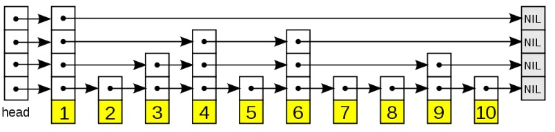

跳表有着和红黑树、SBT树相同的功能，都能实现在$O(log_2^N))$内实现对数据的增删改查操作。但跳表不是以二叉树为原型的，其设计细节如下：

记该结构为`SkipList`，该结构中可以包含有很多结点（`SkipListNode`），每个结点代表一个被添加到该结构的数据项。当实例化`SkipList`时，该对象就会自带一个`SkipListNode`（不代表任何数据项的头结点）。

### （一）添加数据

当你向其中添加数据之前，首先会抛硬币，将第一次出现正面朝上时硬币被抛出的次数作为该数据的层数（`level`，**最小为1**），接着将数据和其层数封装成一个`SkipListNode`添加到`SkipList`中。**结构初始化时，其头结点的层数为0，但每次添加数据后都会更新头结点的层数为所添数据中层数最大的**。比如实例化一个`SkipList`后向其中添加一条层数为`3`的数据`7`：

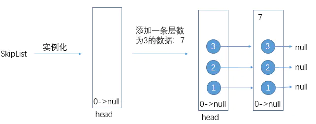

这时如果再添加一条层数为`2`的数据`5`呢？首先游标`curNode`会从`head`的最高层出发往右走，走到数据项为 7 的结点，发现`7>5`，于是又退回来走向下一层：

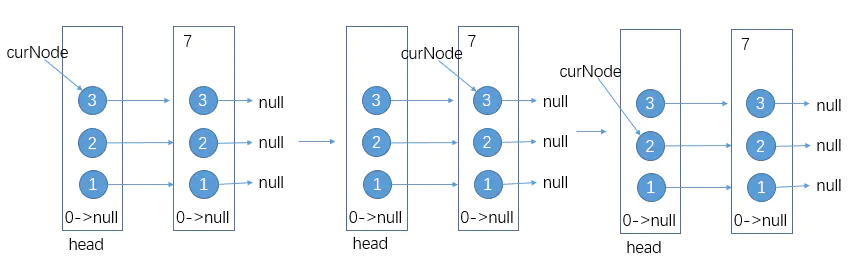

接着再尝试往右走，还是发现`7>5`，于是还是准备走向下一层，但此时发现`curNode`所在层数`2`是数据项`5`的最高层，于是先建出数据项`5`的第二层，`curNode`再走向下一层

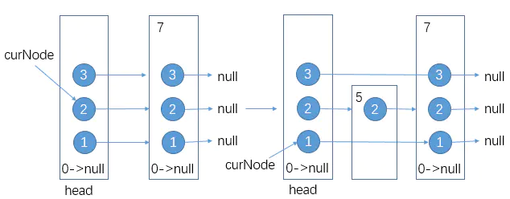

同样的，`curNode`尝试往右走，但发现`7>5`，`curNode`所在层为1，但数据`5`的第一层还没建，于是建出，`curNode`再往下走。当`curNode`走到`null`时，建出数据`5`根部的`null`：

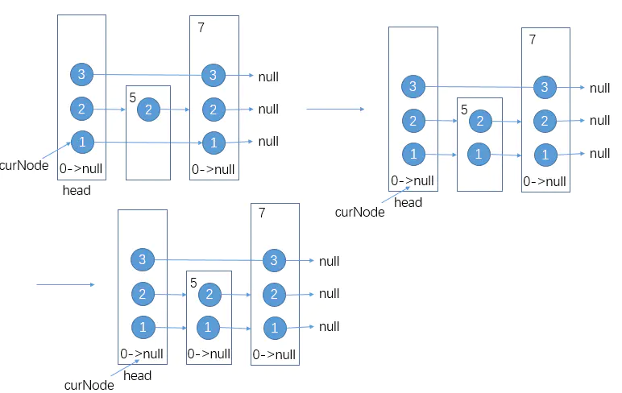

至此层数为 `2` 的数据项`5`的添加操作完毕。

那如果添加一个层数较高的数据项该如何处理呢？以添加层数为 `4`的数据`10`为例：


添加操作对应的代码示例：见下面源代码中的 ` public void add(int newValue) `方法


### （二）查找数据

查找数据项的操作和添加数据项的步骤类似，也是游标`curNode`从`head`的最高层出发，每次先尝试向右走来到`nextNode`，如果`nextNode`封装的数据大于查找的目标`target`或`nextNode`为空，那么`curNode`回退并向下走；如果`nextNode`封装的数据小于`target`，那么`curNode`继续向右走，直到`curNode`走到的结点数据与`target`相同表示找到了，否则`curNode`走到了某一结点的根部`null`，那么说明结构中不存在该数据。`->contains()`

### （三）删除数据

了解添加数据的过程之后，删除数据其实就是将逻辑倒过来：解除该数据结点的前后引用关系。下图是我在写好上述`add()`方法后，向其中放入`1、2、3、4、5`后形成的结构：

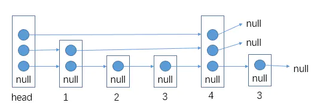

如果此时删除数据`3`：

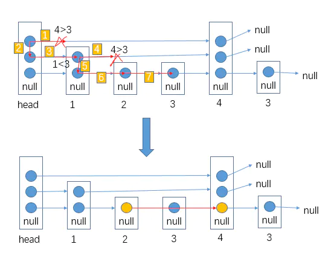

首先应该从`head`的最高层出发，通过向右或向下找到数据3的最高层（如图`2->3->5->6->7`），将该层移除整体结构并处理好该层上，其前后结点的关系。同样的逻辑，将数据`3`剩下的层移除。

示例代码：见下面代码中的 delete(int value) 方法。


### （四）遍历数据

需要遍历跳表中的数据时，我们可以根据每个数据的层数至少为1的特点（每个结点的第一层引用的是比该结点数据大的结点中数据最小的结点）。

完整的代码程序见：SkipList


