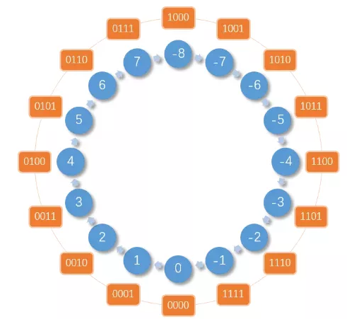
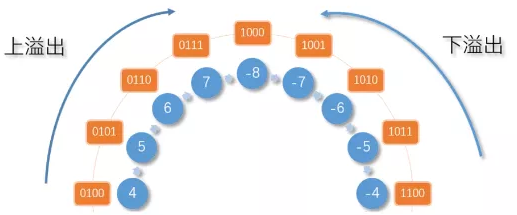
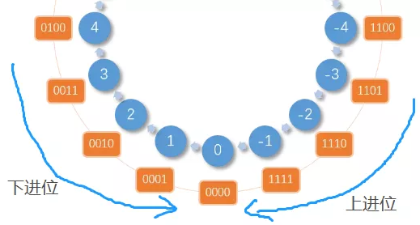

# MathSummary

[TOC]

## 一、原理

### （一）机器数

机器数（computer number）是数字在计算机中的二进制表示形式。机器数有两个基本特点：

- **符号数字化。**由于计算机内部的硬件只能表示两种物理状态（用 0 和 1 表示），因此数据的正负号在机器里就用一位二进制 0 或者 1 来区分。通常这个符号放在二进制数的最高位，称**为符号位，以 0 表示 '+' 号，以 1 表示 '-' 号**。

- 机器数的大小受机器字长的限制。机器内部设备一次能表示的二进制位叫**机器字长**，一台机器的字长是固定的。==字长 8 位叫一个字节（Byte）==，机器字长一般都是字节的整数倍，如字长 8 位、16 位、32 位、64 位。比如在字长为 8 的计算机中，十进制数 +5，其机器数为 `00000101`；十进制数 -5，其机器数为 `10000101`。

### （二）真值

计算机机器数真正的值称为真值。因为机器数的最高位是符号位，所以我们在计算真值的时候要分区分开。比如上面讲的机器数10000101，单纯作为一个二进制数，我们转换为十进制是133。**但是其真值是不计算符号位的**，其最高位的1表示"-"。所以10000101的真值为-5。

### （三）机器数的原码、反码、补码三种形式

前面我们讲过机器数是在计算机中的二进制表示形式，但是在计算机中，这种表现形式又分为原码、反码、补码等三种最常用的形式。

**ps：下面举例都是字长为 8。**

#### 1.原码

**原码 = 符号位 + 真值**

比如：

```
[+5](原码) = 0000 0101
[-5](原码) = 1000 0101
```

原码表示与真值对应直观，它的数值部分就是该数的绝对值，而且与真值、十进制的转换十分方便。但是用原码进行加减运算的时候，会出现以下问题：

使用原码计算表达式：`1 - 1 = 0`

```
1 - 1 
= 1 + (-1) 
= [0000 0001](原) + [10000 00001](原) 
= -2
```

注意：**由于计算机是没有减法器，只有加法器，减法运算可以转换为加上那个数的负数。**

使用原码计算 1 - 1 表达式结果居然等于 -2。

在进行原码加减法运算时，首先判断两个数的符号，同号相加，异号相减。在做减法前，先判断两个数绝对值的大小，然后用大数减去小数，最后再确定差的符号。

例子：

`7 - 13 = 7 + (-13) = 6`，由于两个数的符号存在异号，所以这里做减法运算。首先先判断两个数的绝对值： `|7| < |13|`，然后用大数减去小数：`13 - 7 = 6`，最后确定差的符号，由于 13 为原式中的被减数，且符号位为 1（-），因此最后的结果为 -6。

这样一种形式进行加减运算时，负数的符号位不能与其数值部分一道参加运算，而必须利用单独的线路确定符号位。很显然，这样设计电路就很复杂，这是不经济实用的，为了解决这个问题，反码产生了。

#### 反码

==**反码：正数的反码与其原码相同；负数的反码是对其原码逐位取反，但符号位除外。**==

用反码来计算 `1 - 1`

```
1 - 1 
= 1 + (-1) 
= [0000 0001](原) + [1000 0001](原) 
= [0000 0001](反) + [1111 1110](反) 
= [1111 1111](反) 
= [1000 0000](原)
= -0
```

看上去结果好像是正确的，但结果是 -0，虽然对于 0 的符号没有什么实际意义。但是在计算机中，0 如果用原码和反码来表示会有两种形式：

```
[+0] = [0000 0000](原) = [0000 0000](反)
[-0] = [1000 0000](原) = [1111 1111](反)
```

两种编码就算了吧，只要结果正确什么都可以，然而。

使用反码计算表达式：`2 - 1`

```
2 - 1 
= 2 + (-1)
= [0000 0010](原) + [1000 0001](原)
= [0000 0010](反) + [1111 1110](反)
= [0000 0000](反)
= [0000 0000](原)
= +0
```

使用原码的思想去计算 2 - 1 得到的结果居然是 0.其实在进行反码加法运算的时候发生了进位，而由于字长为 9，进位就直接省略了，便造成了错误。下面采用反码的计算机解决办法如下：

**反码的符号位相加后，如果有进位出现，则要把它送回到最低位去相加（循环进位）**

```
2 - 1
= 2 + (-1)
= [0000 0010](原) + [1000 0001](原)
= [0000 0010](反) + [1111 1110](反) + [0000 0001](循环进位)
= [0000 0001](反)
= [0000 0001](原)
= +1
```

采用反码运算虽然较好的解决了原码运算所遇到的问题，但由于循环进位需要二次算术相加，延长了计算时间，这同样给电路带来麻烦，这时候补码就要登场了。

#### ==补码==

==**补码：正数的补码与原码相同，负数的补码等于其反码的末位加 1**==

==**补码运算要注意的问题：**==

1. 补码运算时，其符号位与数值部分一起参加运算。
2. 补码的符号位相加后，如果有进位出现，要把这个进位舍去（自然丢失）。

例子：

```
2 - 1
= 2 + (-1)
= [0000 0010](原) + [1000 0001](原) 
= [0000 0010](反) + [1111 1110](反)
= [0000 0010](补) + [1111 1111](补)
= [0000 0001](补)
= [0000 0001](原)
= +1
```

**补码运算中符号位发生进位之后为什么可以被舍弃？**

对于两位十进制来说，下面的结果都是相同的：

```
28 - 1 = 27
28 + 99 = (1)27
```

可以看到，由于只能表示两位十进制，因此在 `28 + 99 = 127` 中，27 前面的 1 将无法显示，因此就需要舍弃掉。

补码运算相对来说说就简单很多，符号位和数值部分都可以参与运算，且无需考虑进位的问题。还有就是 +0 和 -0 在补码中只有一种形式：

```
[+0] = [0000 0000](原) = [0000 0000](反) = [0000 0000](补)
[-0] = [1000 0000](原) = [1111 1111](反) = [0000 0000](补)
```

补码完美的解决了计算机中正数运算的问题。因此可以得出一个结论：**整型数在计算机中，使用补码来表示。**

但还有一个问题需要考虑：

**算出 127 + 1 的值（在字长为 8 的机器中）**

### 溢出

**在程序中计算：127 + 1**

```java
public static void main(String[] args) {
    byte x = 127;
    byte y = 1;
    byte k = (byte) (x+y);
    System.out.println(k);  //-128
    System.out.println(Byte.MIN_VALUE+"~"+Byte.MAX_VALUE); //-128~127
}
```

**byte 在计算机正好是一个字节，也就是 8 位二进制序列**。可以发现127 + 1 结果不是 128，反而是 -128，这就是结果发生了溢出。因为byte表示数的范围是 -128-127，128 超出了这个范围。用补码计算如下：

```
1 + 127
= [0000 0001]原 + [0111 1111]原
= [0000 0001]补 + [0111 1111]补
= [1000 0000]补
```

可以发现这个数的符号位没有发生进位，但是数值最高位发生了进位。在看前面的 2 - 1

```
2 -1
= 2 + (-1)
= [0000 0010]原 + [1000 0001]原
= [0000 0010]补 + [1111 1111]补
= [0000 0001]补 = [0000 0001]原
= +1
```

这个表达式符号位和数值最高位发生了进位，但是结果却是正确的。总结如下：

**符号位和数值最高位只有其中一个发生了进位了进位就为溢出**

### 补码与模的关系

作为程序猿，相信对于模这个概念都不陌生了吧。

那么什么是模呢？想象一下我们日常中使用的钟表，它只可以显示 0 ~ 12 点的时间。假设现在是 2 点钟，想要将时间调到 10 点钟的话，会有两种调整方式：

1. 逆时针将时针转动 4 小时
2. 顺时针将时针转动 8（12 - 4） 小时

从这个例子便能看出模的使用。

还记得上面有过这么一个问题：**补码运算中符号位发生进位之后为什么可以被舍弃？**

对于两位十进制来说，下面的结果都是相同的：

```
28 - 1 = 27
28 + 99 = (1)27
```

可以看到，这里的 99 是通过 `100 - 1 = 99` 得来的，因此，100 就是这个例子中的模。从上面的例子中可以分析出 1 和 99 互为 100 的补数。

因此，在模的范围内做减法，可以将 **X - Y** 的减法变更为 **X + Y 的补数** 的加法。那么就得出一个结论：**在计算机中，负数的表达方式就是它绝对值的补数。**

例如（使用 4 字长方便观察）：

```
[-3] = [1011](原) = [1100](反) = [1101](补)
```

4 字长最大能表示 15，因此 -3 的绝对值的补数为：16 - 3 = 13

```
[13] = [1101](原) = [1010](反) = [1011](补)
```

那么问题来了，13 已经用于表示正数的 13 了，现在又要用来表示负数的 -3，这就产生了混淆。

为了解决这个问题，需要给这套规则划分一个范围，原来 4 字长能表示的数为 0 - 15，但现在需要拿出一半来表示负数，因此就会有下面这张图：



可以看到 4 字长的二进制表示的正数与负数的范围，即正数的范围：`[0 ~ 7]`，负数的范围：`[-8 ~ -1]`，负数和正数整好各占一半。

从上面这个图就可以很容易的找到**溢出临界区和进位临界区**了。例如：`7 + 1 = 8` ，可以从上图中看到， 7 顺时针的下一位是 -8，而正确答案应该是 8，所以发生了**溢出**。再有：`-1 + 1 = 0` ，从上图中看到， -1 顺时针的下一位为 0，且正确答案正好为 0，所以发生了**进位**。

因此，溢出临界区如下图所示：



进位临界区如下图所示：

进位临界图

### ==位运算符==

| 运算符 | 描述                                                         |
| :----- | :----------------------------------------------------------- |
| &      | 与运算符，对两个数的二进制位做有 0 则为 0，==全都为 1 则为 1 的操作== |
| \|     | 或运算符，对两个数的二进制位做==有 1 则为 1==，无 1 则为 0 的操作 |
| ^      | 异或运算符，对两个数的二进制位做==相同则为 0，不同则为 1==的操作 |
| ~      | 取反运算符，对两个数的二进制位做 ==有 1 则为 0，有 0 则为 1== 的操作 |
| <<     | 左移运算符，二进数位向左移动指定位数                         |
| >>     | 右移运算符，二进数位向右移动指定位数                         |

#### 与运算

从下面的展示中可以看到，两个数的二进制位进行与运算，只要有 0，结果就为 0，全部为 1 则为 1。

```java
    00000111 (7)
&   00000101 (5)
    --------
    00000101 (5)
```

#### 或运算

从下面的展示中可以看到，两个数的二进制位进行与或运算，只要有 1，结果就为 1，无 1 则为 0。

```java
    00000111 (7)
|   00000101 (5)
    --------
    00000111 (7)
```

#### 异或运算

从下面的展示中可以看到，两个数的二进制位进行异或运算，只要相同则为 0，不同则为 1。

```java
    00000111 (7)
^   00000101 (5)
    --------
    00000010 (2)
```

#### 取反运算

从下面的展示中可以看到，对一个数的二进制位进行取反操作，有 1 则为 0，有 0 则为 1。

```java
~   00000101 (5)
    --------
    11111010 (-6)
```

#### 左移操作

从下面的展示中可以看到，对一个数的二进制位进行左移三位的操作（1<<3），原来 1 对应二进制位的第一个位置上的 1 向左移动到了三个位置。

```
        00000001 (1)
>>(3)   --------
        00001000 (8)
```

#### 右移操作

从下面的展示中可以看到，对一个数的二进制位进行右移三位的操作（8>>3），原来 8 对应二进制位的第四个位置上的 1 向右移动到了一个位置。

```
        00001000 (8)
<<(3)   --------
        00000001 (1)
```

### 位运算奇淫技巧

#### 工具函数代码

```c++
/* 用于根据类型生成对应位数的二进制，例如 char 为 1 字节，即 8 位，因此会显示 8 位二进制*/
typedef char ElemType;

// 数字转二进制格式
void number2binary(ElemType number, char* str)
{
    int count = sizeof(ElemType) * 8;
    int i;
    for (i = count - 1; i >= 0; i--)
    {
        str[i] = (number & 1) ? '1' : '0';
        number = number >> 1;
    }
    str[count] = '\0';
}

// 格式化二进制计算显示
/*
例如：

    00000111 (7)
^   00000101 (5)
    --------
    00000010 (2)

*/
void binary_calculate_format(ElemType a, ElemType b, ElemType c, char oper)
{
    int count = sizeof(ElemType) * 8 + 1;
    char strSplit[sizeof(ElemType) * 8 + 1];
    int i;
    for (i = 0; i < count-1; i++)
        strSplit[i] = '-';

    char str[sizeof(ElemType) * 8 + 1];
    number2binary(a, str);
    printf("    %s (%d)\n", str, a);
    number2binary(b, str);
    printf("%c   %s (%d)\n", oper, str, b);
    printf("    %s\n", strSplit);
    number2binary(c, str);
    printf("    %s (%d)\n", str, c);
}


int main()
{
    // 使用方法
    char str[sizeof(ElemType) * 8 + 1];
    // number2binary 函数
    number2binary(1, str);
    printf("%s\n", str);
    // binary_calculate_format 函数
    binary_calculate_format(5, 6, 5|6, '|');
    return 0;
}

/*
测试程序输出：
00000001
    00000101 (5)
|   00000110 (6)
    --------
    00000111 (7)
*/
```

#### 判断一个数的奇偶性【(x & 1) == 1 为奇数】

```java
public static void main(String[] args) {
    int x = 10;
    if ((x & 1) == 1) {
        System.out.println(x + "为奇数\n");
    } else {
        System.out.println(x + "为偶数\n");
    }
}
```

==其实就是判断一个数的二进制格式的最低位，如果等于 1 则为奇数，反之等于 0 。因为除了二进制的最低位上的 1 表示数值 1 外，其它位上的 1 都表示 2 的 n 次幂==，因此只需要判断最低位是否为 1 便能确定该数的奇偶性。（其效果和 `x % 2` 相同）

#### 判断二进制的第 n + 1 位为 1 或 0【(x & (1 << n)) != 0 则为 1】

```java
package array.easy;

/**
 * @author GJXAIOU
 * @create 2020/05/05 14:38
 */
public class Demo {
    public static void main(String[] args) {
        int x = 10;
        // 因为 1 正好处于二进制的第一位，所以如果需要将 1 移动到第 n + 1位，只需要移动 n 次，因此这里是 << n 操作。
        int n = 4;
        if ((x & (1 << n)) != 0) {
            System.out.println("x 的第 n + 1 位为：1");
        } else {
            System.out.println("x 的第 n + 1 位为：0");
        }
    }
}

```

其实这个技巧和**判断一个数的奇偶性**是差不多的，只不过在这个技巧中使用了左移操作，将 1 移动到了指定的位置，然后进行与运算，判断指定位置的值为 1 或 0。

#### 将二进制的第 n 位设置为 1【x | (1<<n)】

```
ElemType x = 10;
ElemType n = 3 - 1;
binary_calculate_format(x, 1<<n, x|(1<<n), '|');

/*
程序输出：
    00001010 (10)
|   00000100 (4)
    --------
    00001110 (14)
*/
```

这个技巧和上面的**判断二进制的第 n 位为 1 或 0**大体相同，只不过一个使用了与运算，一个使用了或运算，各自根据自己的需求，使用对应的位运算符。

在执行 `1< 之后的二进制除第 n 位为 1 外，其他都为 0，又因为使用的是或运算，因此 x 的二进制除了第 n 位会受到影响外，其它位都不会受到影响。

#### 将二进制的第 n 位设置为 0【x & ~(1<<n)】

```
ElemType x = 7;
ElemType n = 3 - 1;
binary_calculate_format(x, ~(1<<n), x&~(1<<n), '|');

/*
程序输出：
    00000111 (7)
|   11111011 (-5)
    --------
    00000011 (3)
*/
```

这个技巧和上面的**将二进制的第 n 位设置为 1**大体相同，只不过一个使用了与运算，一个使用了或运算，各自根据自己的需求，使用对应的位运算符。

在执行 `~(1< 之后的二进制除第 n 位为 0 外，其他都为 1，又因为使用的是与运算，因此 x 的二进制除了第 n 位会受到影响外，其它位都不会受到影响。

**其实上面几个技巧在应用层面上的开发是不怎么用到的，之所以写出来是体验一下位操作的艺术。接下来的几个就是实实在在在平时的开发中会用到的技巧。**

#### 使用一个变量存储多个标志位【flag1 | flag2 | flag3 …】

```
ElemType flag = 0;
ElemType flag1 = 1; // 0000 0001
ElemType flag2 = 2; // 0000 0010
ElemType flag3 = 4; // 0000 0100
// 设置操作
flag |= flag1;
char str[sizeof(ElemType) * 8 + 1];
number2binary(flag, str);
printf("%s\n", str);    // 0000 0001

flag |= flag2;
number2binary(flag, str);
printf("%s\n", str);    // 0000 0011

flag |= flag3;
number2binary(flag, str);
printf("%s\n", str);    // 0000 0111

// 判断操作
if (flag & flag1)
    printf("存在 flag1.\n");
else
    printf("不存在 flag1.\n");

// 取出操作
flag ^= flag1;
if (flag & flag1)
    printf("存在 flag1.\n");
else
    printf("不存在 flag1.\n");

/*
程序输出：
00000001
00000011
00000111
存在 flag1.
不存在 flag1.
*/
```

是不是很熟悉啊？例如 c 语言以只读且文件不存在时创建文件的方式打开文件：`open("demo.txt", O_RDONLY|O_CREAT);`。

其设置操作的原理就是使用或运算将二进制不同位设为 1。

其判断操作的原理就是使用与运算判断指定位是否为 1。

其取出操作的原理就是使用异或运算将 flag1 取出，即使用了异或的性质：a ^ 0 = a，a ^ a = 0。

#### 交换两个数的值

```java
package array.easy;


/**
 * @author GJXAIOU
 * @create 2020/05/05 14:38
 */
public class Demo {
    public static void main(String[] args) {
        // 交换两个数的值
        int a = 10;
        int b = 20;
        System.out.println("交换前: a = " + a + " b = " + b );

        System.out.println("执行 a = a ^ b: 即 a ^ b = ab");
        a = a ^ b;

        System.out.println("执行 a = a ^ b：即 ab ^ b = a");
        b = a ^ b;

        System.out.println("执行 a = a ^ b：即 ab ^ a = b");
        a = a ^ b;

        System.out.println("交换后: a = " + a + " b = " + b);

    }
}
```

```java
交换前: a = 10 b = 20
执行 a = a ^ b: 即 a ^ b = ab
执行 a = a ^ b：即 ab ^ b = a
执行 a = a ^ b：即 ab ^ a = b
交换后: a = 20 b = 10
```

其实这个技巧的核心原理就是使用了异或的性质：==a ^ 0 = a，a ^ a = 0===。具体过程上面代码已有注释。

#### 找出不重复的数

```java
package array.easy;

/**
 * @author GJXAIOU
 * @create 2020/05/05 14:38
 */
public class Demo {
    public static void main(String[] args) {
        int arr[] = {1, 1, 2, 2, 3, 4, 4};
        int ans = 0;
        for (int i = 0; i < arr.length; i++) {
            ans ^= arr[i];
        }
        System.out.println("ans = " + ans);
    }
}

```

```java
ans = 3
```

其实这个技巧的核心原理也是使用了异或的性质：a ^ 0 = a，a ^ a = 0。由于 arr 中的重复元素最多只能重复一次，所以就可以根据异或的性质将重复的元素排除出来，最后就只剩没有重复的元素了。

#### 数据合并

```
ElemType a = 7;
ElemType b = 5;
char str[sizeof(ElemType) * 8 + 1];
char str1[sizeof(ElemType) * 8 + 1];

// 存放操作
ElemType c = a << 4; // 将 a 存放到高 4 位
number2binary(c, str);
number2binary(a, str1);
printf("a = %d(%s), (a<<4) = %d(%s)\n", a, str1, c, str);

c |= b; // 将 b 存放在低四位
printf("********************\n");
printf("c |= b : \n");
binary_calculate_format(c, b, c|b, '|');
printf("********************\n");

// 取出操作
a = c >> 4;     // 取出 a
number2binary(a, str);
number2binary(c, str1);
printf("c = %d(%s), (c>>4) = %d(%s)\n", c, str1, a, str);

b = c & 0xF;  // 0xF => 0000 1111
printf("********************\n");
printf("b = c & 0xF : \n");
binary_calculate_format(c, 0xF, c & 0xF, '&');
printf("********************\n");

/*
程序输出：
a = 7(00000111), (a<<4) = 112(01110000)
********************
c |= b : 
    01110101 (117)
|   00000101 (5)
    --------
    01110101 (117)
********************
c = 117(01110101), (c>>4) = 7(00000111)
********************
b = c & 0xF : 
    01110101 (117)
&   00001111 (15)
    --------
    00000101 (5)
********************
*/
```

这个技巧的原理在于，使用一个指定位数的二进制数，然后将该二进制数指定的范围用于存放指定的数据。例如上面的例子中，使用了一个 char 类型（1 字节长度，即 8 位）来存放两个数据，且每个数据占用 4 位，分别存放于高四位和低四位。

就这个技巧在我平时的工作中常用于两个方面：

1. 用于制作一个组合键来当用 map 的 key 来使用。（下面代码是用 c++ 语言写的，所以要使用对应的编译器编译）

```
#include <stdint.h> // 用于导入 int16_t 类型
#include <cstdio>  // 用于导入 printf 函数，方便格式化输出
#include <string>
#include <map>

using namespace std;

#define MAKE_KEY(gid, uid) ((uid) | (gid) << 8)

/* 用于根据类型生成对应位数的二进制，例如 int16_t 为 2 字节，即 16 位，因此会显示 16 位二进制*/
typedef int16_t  ElemType;

// 数字转二进制格式
void number2binary(ElemType number, string& str, int size = 0)
{
    int count = sizeof(ElemType) * 8;
    if (size > 0)
        count = size;

    int i;
    for (i = count - 1; i >= 0; i--)
    {
        if (!size && i == 7)
            str = ' ' + str;
        str = ((number & 1) ? '1' : '0') + str;
        number = number >> 1;
    }
}

int main()
{
    map<int16_t, string> m;

    // 使用 gid(100) 和 uid(50) 生成一个组合键
    int8_t gid = 100;
    int8_t uid = 50;
    int16_t key = MAKE_KEY(gid, uid);

    // 将 key 生成的二进制作为 value
    string value;
    number2binary(key, value);

    // 存入 map 中
    m[key] = value;

    // 读取 map
    string strGID;
    string strUID;
    number2binary(gid, strGID, sizeof(gid)*8);
    number2binary(uid, strUID, sizeof(uid)*8);
    printf("gid: %d(%s), uid: %d(%s)\n", gid, strGID.c_str(), uid, strUID.c_str());
    printf("value: %d(%s)\n", key, m[key].c_str());

    // 从 key 中读取 gid
    gid = key >> 8;
    printf("gid = %d\n", gid);

    // 从 key 中读取 uid
    uid = key & 0xFF;   // 0xFF = 1111 1111
    printf("uid = %d\n", uid);

    return 0;
}

/*
程序输出：
gid: 100(01100100), uid: 50(00110010)
value: 25650(01100100 00110010)
gid = 100
uid = 50
*/
```

可以看到，这样就可以使用位操作来完成了一个组合键了，是不是很方便。如果不使用组合键，那么你就要进行 map 嵌套，又浪费内存，代码看起来还很凌乱。

1. 用于组装传输协议（下面代码是用 c 语言写的，所以要使用对应的编译器编译）

```
#include <stdint.h>
#include <stdio.h>

int main()
{
    // 协议：消息头部（2字节消息类型 + 2字节消息体长度）+ 消息体（最大长度为 65535，即 2 字节的长度）
    char msg_body[] = "I'm Liction!!!";     // 消息体
    int16_t msg_type = 11;                  // 消息类型
    int16_t msg_size = sizeof(msg_body);    // 消息体长度

    // 组装协议
    // 声明消息包，长度为：消息类型长度 + 消息体长度的长度 + 消息体长度
    char msg_pack[sizeof(msg_type) + sizeof(msg_size) + sizeof(msg_body)];
    // 存入消息类型，由于 msg_pack 为 char 数组，且 char 为 1 字节，而 msg_type 为 2 字节，所以需要两个元素来分别存放
    msg_pack[0] = msg_type;         // 先存放 msg_type 的低 8 位，即先存放 1 字节数据
    msg_pack[1] = msg_type << 8;    // 再存放 msg_type 的高 8 位，即再存放 1 字节数据
    // 存入消息体长度，由于 msg_pack 为 char 数组，且 char 为 1 字节，而 msg_type 为 2 字节，所以需要两个元素来分别存放
    msg_pack[2] = msg_size;         // 先存放 msg_size 的低 8 位，即先存放 1 字节数据
    msg_pack[3] = msg_size << 8;    // 再存放 msg_type 的高 8 位，即再存放 1 字节数据

    // 存放消息体数据,由于 msg_body 正好是 char 数组，所以直接一一放入 msg_pack
    int i;
    for (i = 0; i < sizeof(msg_body); i++)
        msg_pack[i+4] = msg_body[i];

    // 无用的操作，遍历输出 msg_pack
    for (i = 0; i < sizeof(msg_pack); i++)
    {
        // 前面 4 个字节让它输出数字
        if (i < 4)
            printf("%d ", msg_pack[i]);
        else
            printf("%c ", msg_pack[i]);
    }
    printf("\n");

    // 模拟网路传输
    printf("发送数据的长度：%d\n", sizeof(msg_pack));
    printf("接收到数据的长度：%d\n", sizeof(msg_pack));

    // 读取消息类型
    msg_type = msg_pack[0] | msg_pack[1] << 8;
    printf("msg_type: %d\n", msg_type);

    // 读取消息体长度
    msg_size = msg_pack[2] | msg_pack[3] << 8;
    printf("msg_size: %d\n", msg_size);

    // 读取消息体
    // （由于是网络传输过来的数据，我们是不知道消息体由多长的，因此应该使用通过解包得到的消息体长度来构建消息体内容）
    char new_msg_body[msg_size];
    for (i = 0; i < msg_size; i++)
        new_msg_body[i] = msg_pack[i+4];
    printf("new_msg_body: %s\n", new_msg_body);

    return 0;
}

/*
程序输出：
11 0 15 0 I ' m   L i c t i o n ! ! !  
发送数据的长度：19
接收到数据的长度：19
msg_type: 11
msg_size: 15
new_msg_body: I'm Liction!!!
*/
```

可以看到，这样便能很好的使用位操作来封装协议包了。具体的过程已有注释，就不多说了。

### 总结

好了，差不多就到这里了，以后碰到不懂的再继续写总结笔记。

Beauty is found everywhere. Our eyes do not show a lack of sense of beauty, but a lack of observation.（你英语很厉害？）


## 二、位操作2

### 1. 消除最后的一个“1”bit —–> `x & (x - 1)`

看上去很难理解，但是有很容易理解。要不先用几分钟思考一下？

比如：6 & ( 6 - 1 ) 就从 110 变为 100，消除了最后面的一个"1"bit，为什么呢？

其实只需要考虑110 后面 的“10”就可以了，因为任何一个数（x > 0 ）后面都是 10 的结构( 0 可能有 0~n )。

因为整数只有奇数和偶数。首先偶数最后一位必然为0（即 10 的 0 包含 1 ~ n 个），奇数则为1（即最后的 10  中的 0 个数为 0 个，就只剩 1 了），这是也是我们判断奇偶数的原理。

 

因此分两种情况，后面有没有0与n个"0"的情况。

- 第一种(没有0，也就是奇数情况)：

x & (x-1)，x为奇数，这个很容易知道啊，x - 1 把二进制最后的1个去掉了，只是改动了一位，前面的没有动，因此消除了一个1bit。**因为 x 为奇数， -1  之后就去掉 1 了，同时变成偶数了，偶数最后为 0 ，相与结果就没有了**。

5 & (5-1) => 101 & (100) = 100 (黄色的地方没变化，变化的是第一位)

- 第二种情况（偶数，10结构）：

这次使用一个大点的会容易理解，二进制数 n =  xxxx100000，前面的xxxx我们先忽略，因为我们不需要知道具体的值，只要符合10结构既可以，

因此 n - 1 = xxxx    0    11111，这样看来 n & (n-1),就会把n中原来为 1 的最后一个地方变为0，也就达到了消除最后一个1bit的效果

 

### 2. 获取最后一个"1"bit —> `n & -n`

不妨假设 x 是n前面的bit，并且进行~运算会得到y

　　因为每个大于0的整数都是10结构，比如：n & (~n) = x10000 & y01111 = 0，但是 n & (~n+1) = x10000 & ( y01111 + 1 ) = x10000 & ( y10000 )  = 10000

思想就是把最后的 10结构保留原样，前面的就取反，这样进行&运算就可以得到最后的1bit了。

　　我们来优化一下，~n + 1 可以变成什么？我们知道n是大于0的整数啊，~n + 1 不就是 -n的补码(使用补码存储与运算)？所以可以优化为： n & -n就可以了

```
 ~n + 1 = -n 
==>  n & (~n+1) = n & -n
==> ~n = -(n+1)
```

 

### 3. 按区域取反

如果我想把某一个数n的某一个区域的bit取反会怎么样？

提示：使用异或运算，可以知道1遇到0会变1；如果1遇到1就会变0；0遇到啥都不会变；难懂这不就是取反吗

例子：A ^ B =  1010 ^ 1100 = 0100 。这个例子黄色部分bit就把A中某一部分的bit取反了。

接下来：就是让读者写出具有通用的代码了(让某一个数的n位到m位取反)

 

### 4. 位运算需要32位

需要注意的是，位运算在一些语言里面是基于32为整型。 比如PHP，Javascript等。

问：有人会问为什么JS也是要求32位呢，不是不区分浮点数，整型，更没有位数吗？

答：JS的确没有这些区分，但是位运算只能用于32位整型的。另外JS对于整型是有安全范围的，如果你使用过大的数（超过整型 Number.MAX_SAFE_INTEGER）就必须转为字符串，否则失真

 

类似的问题：

 \* 某个区域设定固定的bit，比如 n 的4-7为设置为固定的bit不如全是1或者全是0，其他保持不变？

  
