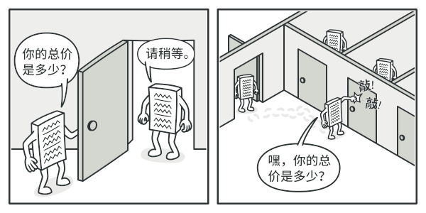
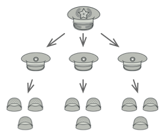

# 结构型：组合模式

[TOC]

**组合模式**是一种结构型设计模式， 你可以使用它将对象组合成树状结构， 并且能像使用独立对象一样使用它们。也是一种「整体-部分」的层次关系。

**如果应用的核心模型能用树状结构表示， 在应用中使用组合模式才有价值。**

组合模式使得**用户对单个对象和组合对象的访问具有一致性**，即：组合能让客户以一致的方式处理个别对象以及组合对象

## 一、引言 

例如， 你有两类对象：  `产品`和 `盒子` 。 一个盒子中可以包含多个 `产品`或者几个较小的 `盒子` 。 这些小 `盒子`中同样可以包含一些 `产品`或更小的 `盒子` ， 以此类推。

假设你希望在这些类的基础上开发一个定购系统。 订单中可以包含无包装的简单产品， 也可以包含装满产品的盒子……以及其他盒子。 此时你会如何计算每张订单的总价格呢？


订单中可能包括各种产品， 这些产品放置在盒子中， 然后又被放入一层又一层更大的盒子中。 整个结构看上去像是一棵倒过来的树。

你可以尝试直接计算： 打开所有盒子， 找到每件产品， 然后计算总价。 这在真实世界中或许可行， 但在程序中， 你并不能简单地使用循环语句来完成该工作。 你必须事先知道所有 `产品`和 `盒子`的类别， 所有盒子的嵌套层数以及其他繁杂的细节信息。 因此， 直接计算极不方便， 甚至完全不可行。

## 二、解决方案

组合模式建议使用一个通用接口来与 `产品`和 `盒子`进行交互， 并且在该接口中声明一个计算总价的方法。

那么方法该如何设计呢？ 对于一个产品， 该方法直接返回其价格； 对于一个盒子， 该方法遍历盒子中的所有项目， 询问每个项目的价格， 然后返回该盒子的总价格。 如果其中某个项目是小一号的盒子， 那么当前盒子也会遍历其中的所有项目， 以此类推， 直到计算出所有内部组成部分的价格。 你甚至可以在盒子的最终价格中增加额外费用， 作为该盒子的包装费用。



组合模式以递归方式处理对象树中的所有项目

该方式的最大优点在于你无需了解构成树状结构的对象的具体类。 你也无需了解对象是简单的产品还是复杂的盒子。 你只需调用通用接口以相同的方式对其进行处理即可。 当你调用该方法后， 对象会将请求沿着树结构传递下去。

## 三、真实世界类比



部队结构的例子。

大部分国家的军队都采用层次结构管理。 每支部队包括几个师， 师由旅构成， 旅由团构成， 团可以继续划分为排。 最后， 每个排由一小队实实在在的士兵组成。 军事命令由最高层下达， 通过每个层级传递， 直到每位士兵都知道自己应该服从的命令。

## 四、组合模式结构


- **组件** （Component） 接口描述了树中简单项目和复杂项目所共有的操作。

- **叶节点** （Leaf） 是树的基本结构， 它不包含子项目。

    一般情况下， 叶节点最终会完成大部分的实际工作， 因为它们无法将工作指派给其他部分。

- **容器** （Container）—又名「组合 （Composite）」—是包含叶节点或其他容器等子项目的单位。 容器不知道其子项目所属的具体类， 它只通过通用的组件接口与其子项目交互。

    容器接收到请求后会将工作分配给自己的子项目， 处理中间结果， 然后将最终结果返回给客户端。

- **客户端** （Client） 通过组件接口与所有项目交互。 因此， 客户端能以相同方式与树状结构中的简单或复杂项目交互。

组合模式解决这样的问题，当我们要处理的对象可以生成一棵树形结构，而我们要对树上的节点和叶子进行操作时候，它能够提供一致的方式，而不用考虑它是节点还是叶子；

## 示例一：

要在一个页面中展示出学校的院系组成，一个学校有多个学院， 一个学院有多个系。如图：

 ----------清华大学--------------
----------计算机学院------------
计算机科学与技术
软件工程
网络工程
---------信息工程学院-----------
通信工程
信息工程

### （一）传统方案解决学校院系展示(类图)

   

### （二）传统方案解决学校院系展示存在的问题分析


- 将**学院看做是学校的子类**，**系是学院的子类**，这样实际上是站在组织大小来进行分层次的
- 实际上我们的要求是 ：在一个页面中展示出学校的院系组成，一个学校有多个学院，一个学院有多个系，因此这种方案，**不能很好实现的管理的操作**，比如对学院、系的**添加，删除，遍历**等
- 解决方案：把学校、院、系都看做是组织结构，他们之间没有继承的关系，而是一个树形结构，可以更好的实现管理操作。 => **组合**模式


### （三）组合模式解决学校院系展示的应用实例

应用实例要求

- **编写程序**展示一个学校院系结构：需求是这样，要在一个页面中展示出学校的院系组成，一个学校有多个学院， 一个学院有多个系。
- 思路分析和图解(类图)

 

- 代码实现

   对象声明接口
```java
package com.gjxaiou.composite;

import lombok.Data;

@Data
public abstract class OrganizationComponent {
	private String name;
	private String des;

	protected void add(OrganizationComponent organizationComponent) {
		// 默认实现
		throw new UnsupportedOperationException();
	}

	protected void remove(OrganizationComponent organizationComponent) {
		// 默认实现
		throw new UnsupportedOperationException();
	}

	// 方法 print, 做成抽象的, 子类都需要实现
	protected abstract void print();
}
```

  学校三层关系对应的实现类：

```java
  package com.gjxaiou.composite;
  
  import java.util.ArrayList;
  import java.util.List;
  
  //University 就是 Composite , 可以管理College
  public class University extends OrganizationComponent {
  
  	List<OrganizationComponent> organizationComponents = new ArrayList<OrganizationComponent>();
  
  	// 构造器
  	public University(String name, String des) {
  		super(name, des);
  	}
  
  	// 重写add
  	@Override
  	protected void add(OrganizationComponent organizationComponent) {
  		organizationComponents.add(organizationComponent);
  	}
  
  	// 重写remove
  	@Override
  	protected void remove(OrganizationComponent organizationComponent) {
  		organizationComponents.remove(organizationComponent);
  	}
  
  	@Override
  	public String getName() {
  		return super.getName();
  	}
  
  	@Override
  	public String getDes() {
  		return super.getDes();
  	}
  
  	// print方法，就是输出University 包含的学院
  	@Override
  	protected void print() {
  		System.out.println("--------------" + getName() + "--------------");
  		//遍历 organizationComponents 
  		for (OrganizationComponent organizationComponent : organizationComponents) {
  			organizationComponent.print();
  		}
  	}
  }
  
  //-----------------------------------------------
  package com.gjxaiou.composite;
  
  import java.util.ArrayList;
  import java.util.List;
  
  public class College extends OrganizationComponent {
  
  	//List 中 存放的Department
  	List<OrganizationComponent> organizationComponents = new ArrayList<OrganizationComponent>();
  
  	// 构造器
  	public College(String name, String des) {
  		super(name, des);
  	}
  
  	// 重写add
  	@Override
  	protected void add(OrganizationComponent organizationComponent) {
  		//  将来实际业务中，Colleage 的 add 和  University add 不一定完全一样
  		organizationComponents.add(organizationComponent);
  	}
  
  	// 重写remove
  	@Override
  	protected void remove(OrganizationComponent organizationComponent) {
  		organizationComponents.remove(organizationComponent);
  	}
  
  	@Override
  	public String getName() {
  		return super.getName();
  	}
  
  	@Override
  	public String getDes() {
  		return super.getDes();
  	}
  
  	// print方法，就是输出University 包含的学院
  	@Override
  	protected void print() {
  		System.out.println("--------------" + getName() + "--------------");
  		//遍历 organizationComponents 
  		for (OrganizationComponent organizationComponent : organizationComponents) {
  			organizationComponent.print();
  		}
  	}
  }
  
  //----------------------------------------------------
  package com.gjxaiou.composite;
  
  public class Department extends OrganizationComponent {
  
  	//没有集合
  	public Department(String name, String des) {
  		super(name, des);
  	}
  	
  	//add , remove 就不用写了，因为他是叶子节点
  	@Override
  	public String getName() {
  		return super.getName();
  	}
  	
  	@Override
  	public String getDes() {
  		return super.getDes();
  	}
  	
  	@Override
  	protected void print() {
  		System.out.println(getName());
  	}
  }
  
```

  使用和测试：

```java
  package com.gjxaiou.composite;
  
  public class Client {
  
  	public static void main(String[] args) {
  		
  		//从大到小创建对象 学校
  		OrganizationComponent university = new University("清华大学", " 中国顶级大学 ");
  		
  		//创建 学院
  		OrganizationComponent computerCollege = new College("计算机学院", " 计算机学院 ");
  		OrganizationComponent infoEngineercollege = new College("信息工程学院", " 信息工程学院 ");
  		
  		
  		//创建各个学院下面的系(专业)
  		computerCollege.add(new Department("软件工程", " 软件工程不错 "));
  		computerCollege.add(new Department("网络工程", " 网络工程不错 "));
  		computerCollege.add(new Department("计算机科学与技术", " 计算机科学与技术是老牌的专业 "));
  		
  		//
  		infoEngineercollege.add(new Department("通信工程", " 通信工程不好学 "));
  		infoEngineercollege.add(new Department("信息工程", " 信息工程好学 "));
  		
  		//将学院加入到 学校
  		university.add(computerCollege);
  		university.add(infoEngineercollege);
  		
  		//university.print();
  		infoEngineercollege.print();
  	}
  
  }
  
```

### （四）组合模式在 JDK 集合的源码分析 P193

- Java 的集合类-**HashMap** 就使用了组合模式
- 代码分析+Debug 源码
- 类图


## 示例二：伪代码

在本例中， 我们将借助**组合**模式帮助你在图形编辑器中实现一系列的几何图形。


几何形状编辑器示例。

`组合图形`Compound­Graphic 是一个容器， 它可以由多个包括容器在内的子图形构成。 组合图形与简单图形拥有相同的方法。 但是， 组合图形自身并不完成具体工作， 而是将请求递归地传递给自己的子项目， 然后 “汇总” 结果。

通过所有图形类所共有的接口， 客户端代码可以与所有图形互动。 因此， 客户端不知道与其交互的是简单图形还是组合图形。 客户端可以与非常复杂的对象结构进行交互， 而无需与组成该结构的实体类紧密耦合。

```
// 组件接口会声明组合中简单和复杂对象的通用操作。
interface Graphic is
    method move(x, y)
    method draw()

// 叶节点类代表组合的终端对象。叶节点对象中不能包含任何子对象。叶节点对象
// 通常会完成实际的工作，组合对象则仅会将工作委派给自己的子部件。
class Dot implements Graphic is
    field x, y

    constructor Dot(x, y) { ... }

    method move(x, y) is
        this.x += x, this.y += y

    method draw() is
        // 在坐标位置(X,Y)处绘制一个点。

// 所有组件类都可以扩展其他组件。
class Circle extends Dot is
    field radius

    constructor Circle(x, y, radius) { ... }

    method draw() is
        // 在坐标位置(X,Y)处绘制一个半径为 R 的圆。

// 组合类表示可能包含子项目的复杂组件。组合对象通常会将实际工作委派给子项
// 目，然后“汇总”结果。
class CompoundGraphic implements Graphic is
    field children: array of Graphic

    // 组合对象可在其项目列表中添加或移除其他组件（简单的或复杂的皆可）。
    method add(child: Graphic) is
        // 在子项目数组中添加一个子项目。

    method remove(child: Graphic) is
        // 从子项目数组中移除一个子项目。

    method move(x, y) is
        foreach (child in children) do
            child.move(x, y)

    // 组合会以特定的方式执行其主要逻辑。它会递归遍历所有子项目，并收集和
    // 汇总其结果。由于组合的子项目也会将调用传递给自己的子项目，以此类推，
    // 最后组合将会完成整个对象树的遍历工作。
    method draw() is
        // 1. 对于每个子部件：
        //     - 绘制该部件。
        //     - 更新边框坐标。
        // 2. 根据边框坐标绘制一个虚线长方形。


// 客户端代码会通过基础接口与所有组件进行交互。这样一来，客户端代码便可同
// 时支持简单叶节点组件和复杂组件。
class ImageEditor is
    field all: CompoundGraphic

    method load() is
        all = new CompoundGraphic()
        all.add(new Dot(1, 2))
        all.add(new Circle(5, 3, 10))
        // ...

    // 将所需组件组合为复杂的组合组件。
    method groupSelected(components: array of Graphic) is
        group = new CompoundGraphic()
        foreach (component in components) do
            group.add(component)
            all.remove(component)
        all.add(group)
        // 所有组件都将被绘制。
        all.draw()
```


### 示例二代码：

**使用实例：** 组合模式在 Java 代码中很常见,常用于表示与图形打交道的用户界面组件或代码的层次结构。

下面是一些来自 Java 标准程序库中的组合示例：

- [`java.awt.Container#add(Component)`](http://docs.oracle.com/javase/8/docs/api/java/awt/Container.html#add-java.awt.Component-) （几乎广泛存在于 Swing 组件中）
- [`javax.faces.component.UIComponent#getChildren()`](http://docs.oracle.com/javaee/7/api/javax/faces/component/UIComponent.html#getChildren--) （几乎广泛存在于 JSF UI 组件中）

**识别方法：** 组合可以通过将同一抽象或接口类型的实例放入树状结构的行为方法来轻松识别。


## 简单和复合图形

本例展示了如何利用较为简单的形状来组成复杂图形， 以及如何统一处理简单和复杂图形。

##  **shapes**

####  **shapes/Shape.java:** 通用形状接口

```
package refactoring_guru.composite.example.shapes;

import java.awt.*;

public interface Shape {
    int getX();
    int getY();
    int getWidth();
    int getHeight();
    void move(int x, int y);
    boolean isInsideBounds(int x, int y);
    void select();
    void unSelect();
    boolean isSelected();
    void paint(Graphics graphics);
}
```

####  **shapes/BaseShape.java:** 提供基本功能的抽象形状

```
package refactoring_guru.composite.example.shapes;

import java.awt.*;

abstract class BaseShape implements Shape {
    public int x;
    public int y;
    public Color color;
    private boolean selected = false;

    BaseShape(int x, int y, Color color) {
        this.x = x;
        this.y = y;
        this.color = color;
    }

    @Override
    public int getX() {
        return x;
    }

    @Override
    public int getY() {
        return y;
    }

    @Override
    public int getWidth() {
        return 0;
    }

    @Override
    public int getHeight() {
        return 0;
    }

    @Override
    public void move(int x, int y) {
        this.x += x;
        this.y += y;
    }

    @Override
    public boolean isInsideBounds(int x, int y) {
        return x > getX() && x < (getX() + getWidth()) &&
                y > getY() && y < (getY() + getHeight());
    }

    @Override
    public void select() {
        selected = true;
    }

    @Override
    public void unSelect() {
        selected = false;
    }

    @Override
    public boolean isSelected() {
        return selected;
    }

    void enableSelectionStyle(Graphics graphics) {
        graphics.setColor(Color.LIGHT_GRAY);

        Graphics2D g2 = (Graphics2D) graphics;
        float dash1[] = {2.0f};
        g2.setStroke(new BasicStroke(1.0f,
                BasicStroke.CAP_BUTT,
                BasicStroke.JOIN_MITER,
                2.0f, dash1, 0.0f));
    }

    void disableSelectionStyle(Graphics graphics) {
        graphics.setColor(color);
        Graphics2D g2 = (Graphics2D) graphics;
        g2.setStroke(new BasicStroke());
    }


    @Override
    public void paint(Graphics graphics) {
        if (isSelected()) {
            enableSelectionStyle(graphics);
        }
        else {
            disableSelectionStyle(graphics);
        }

        // ...
    }
}
```

####  **shapes/Dot.java:** 点

```
package refactoring_guru.composite.example.shapes;

import java.awt.*;

public class Dot extends BaseShape {
    private final int DOT_SIZE = 3;

    public Dot(int x, int y, Color color) {
        super(x, y, color);
    }

    @Override
    public int getWidth() {
        return DOT_SIZE;
    }

    @Override
    public int getHeight() {
        return DOT_SIZE;
    }

    @Override
    public void paint(Graphics graphics) {
        super.paint(graphics);
        graphics.fillRect(x - 1, y - 1, getWidth(), getHeight());
    }
}
```

####  **shapes/Circle.java:** 圆形

```
package refactoring_guru.composite.example.shapes;

import java.awt.*;

public class Circle extends BaseShape {
    public int radius;

    public Circle(int x, int y, int radius, Color color) {
        super(x, y, color);
        this.radius = radius;
    }

    @Override
    public int getWidth() {
        return radius * 2;
    }

    @Override
    public int getHeight() {
        return radius * 2;
    }

    public void paint(Graphics graphics) {
        super.paint(graphics);
        graphics.drawOval(x, y, getWidth() - 1, getHeight() - 1);
    }
}
```

####  **shapes/Rectangle.java:** 三角形

```
package refactoring_guru.composite.example.shapes;

import java.awt.*;

public class Rectangle extends BaseShape {
    public int width;
    public int height;

    public Rectangle(int x, int y, int width, int height, Color color) {
        super(x, y, color);
        this.width = width;
        this.height = height;
    }

    @Override
    public int getWidth() {
        return width;
    }

    @Override
    public int getHeight() {
        return height;
    }

    @Override
    public void paint(Graphics graphics) {
        super.paint(graphics);
        graphics.drawRect(x, y, getWidth() - 1, getHeight() - 1);
    }
}
```

####  **shapes/CompoundShape.java:** 由其他形状对象组成的复合形状

```
package refactoring_guru.composite.example.shapes;

import java.awt.*;
import java.util.ArrayList;
import java.util.Arrays;
import java.util.List;

public class CompoundShape extends BaseShape {
    protected List<Shape> children = new ArrayList<>();

    public CompoundShape(Shape... components) {
        super(0, 0, Color.BLACK);
        add(components);
    }

    public void add(Shape component) {
        children.add(component);
    }

    public void add(Shape... components) {
        children.addAll(Arrays.asList(components));
    }

    public void remove(Shape child) {
        children.remove(child);
    }

    public void remove(Shape... components) {
        children.removeAll(Arrays.asList(components));
    }

    public void clear() {
        children.clear();
    }

    @Override
    public int getX() {
        if (children.size() == 0) {
            return 0;
        }
        int x = children.get(0).getX();
        for (Shape child : children) {
            if (child.getX() < x) {
                x = child.getX();
            }
        }
        return x;
    }

    @Override
    public int getY() {
        if (children.size() == 0) {
            return 0;
        }
        int y = children.get(0).getY();
        for (Shape child : children) {
            if (child.getY() < y) {
                y = child.getY();
            }
        }
        return y;
    }

    @Override
    public int getWidth() {
        int maxWidth = 0;
        int x = getX();
        for (Shape child : children) {
            int childsRelativeX = child.getX() - x;
            int childWidth = childsRelativeX + child.getWidth();
            if (childWidth > maxWidth) {
                maxWidth = childWidth;
            }
        }
        return maxWidth;
    }

    @Override
    public int getHeight() {
        int maxHeight = 0;
        int y = getY();
        for (Shape child : children) {
            int childsRelativeY = child.getY() - y;
            int childHeight = childsRelativeY + child.getHeight();
            if (childHeight > maxHeight) {
                maxHeight = childHeight;
            }
        }
        return maxHeight;
    }

    @Override
    public void move(int x, int y) {
        for (Shape child : children) {
            child.move(x, y);
        }
    }

    @Override
    public boolean isInsideBounds(int x, int y) {
        for (Shape child : children) {
            if (child.isInsideBounds(x, y)) {
                return true;
            }
        }
        return false;
    }

    @Override
    public void unSelect() {
        super.unSelect();
        for (Shape child : children) {
            child.unSelect();
        }
    }

    public boolean selectChildAt(int x, int y) {
        for (Shape child : children) {
            if (child.isInsideBounds(x, y)) {
                child.select();
                return true;
            }
        }
        return false;
    }

    @Override
    public void paint(Graphics graphics) {
        if (isSelected()) {
            enableSelectionStyle(graphics);
            graphics.drawRect(getX() - 1, getY() - 1, getWidth() + 1, getHeight() + 1);
            disableSelectionStyle(graphics);
        }

        for (refactoring_guru.composite.example.shapes.Shape child : children) {
            child.paint(graphics);
        }
    }
}
```

##  **editor**

####  **editor/ImageEditor.java:** 形状编辑器

```
package refactoring_guru.composite.example.editor;

import refactoring_guru.composite.example.shapes.CompoundShape;
import refactoring_guru.composite.example.shapes.Shape;

import javax.swing.*;
import javax.swing.border.Border;
import java.awt.*;
import java.awt.event.MouseAdapter;
import java.awt.event.MouseEvent;

public class ImageEditor {
    private EditorCanvas canvas;
    private CompoundShape allShapes = new CompoundShape();

    public ImageEditor() {
        canvas = new EditorCanvas();
    }

    public void loadShapes(Shape... shapes) {
        allShapes.clear();
        allShapes.add(shapes);
        canvas.refresh();
    }

    private class EditorCanvas extends Canvas {
        JFrame frame;

        private static final int PADDING = 10;

        EditorCanvas() {
            createFrame();
            refresh();
            addMouseListener(new MouseAdapter() {
                @Override
                public void mousePressed(MouseEvent e) {
                    allShapes.unSelect();
                    allShapes.selectChildAt(e.getX(), e.getY());
                    e.getComponent().repaint();
                }
            });
        }

        void createFrame() {
            frame = new JFrame();
            frame.setDefaultCloseOperation(WindowConstants.EXIT_ON_CLOSE);
            frame.setLocationRelativeTo(null);

            JPanel contentPanel = new JPanel();
            Border padding = BorderFactory.createEmptyBorder(PADDING, PADDING, PADDING, PADDING);
            contentPanel.setBorder(padding);
            frame.setContentPane(contentPanel);

            frame.add(this);
            frame.setVisible(true);
            frame.getContentPane().setBackground(Color.LIGHT_GRAY);
        }

        public int getWidth() {
            return allShapes.getX() + allShapes.getWidth() + PADDING;
        }

        public int getHeight() {
            return allShapes.getY() + allShapes.getHeight() + PADDING;
        }

        void refresh() {
            this.setSize(getWidth(), getHeight());
            frame.pack();
        }

        public void paint(Graphics graphics) {
            allShapes.paint(graphics);
        }
    }
}
```

####  **Demo.java:** 客户端代码

```
package refactoring_guru.composite.example;

import refactoring_guru.composite.example.editor.ImageEditor;
import refactoring_guru.composite.example.shapes.Circle;
import refactoring_guru.composite.example.shapes.CompoundShape;
import refactoring_guru.composite.example.shapes.Dot;
import refactoring_guru.composite.example.shapes.Rectangle;

import java.awt.*;

public class Demo {
    public static void main(String[] args) {
        ImageEditor editor = new ImageEditor();

        editor.loadShapes(
                new Circle(10, 10, 10, Color.BLUE),

                new CompoundShape(
                    new Circle(110, 110, 50, Color.RED),
                    new Dot(160, 160, Color.RED)
                ),

                new CompoundShape(
                        new Rectangle(250, 250, 100, 100, Color.GREEN),
                        new Dot(240, 240, Color.GREEN),
                        new Dot(240, 360, Color.GREEN),
                        new Dot(360, 360, Color.GREEN),
                        new Dot(360, 240, Color.GREEN)
                )
        );
    }
}
```

####  **OutputDemo.png:** 执行结果


##  组合模式适合应用场景

 如果你需要实现树状对象结构， 可以使用组合模式。

 组合模式为你提供了两种共享公共接口的基本元素类型： 简单叶节点和复杂容器。 容器中可以包含叶节点和其他容器。 这使得你可以构建树状嵌套递归对象结构。

 如果你希望客户端代码以相同方式处理简单和复杂元素， 可以使用该模式。

 组合模式中定义的所有元素共用同一个接口。 在这一接口的帮助下， 客户端不必在意其所使用的对象的具体类。

##  实现方式

1. 确保应用的核心模型能够以树状结构表示。 尝试将其分解为简单元素和容器。 记住， 容器必须能够同时包含简单元素和其他容器。

2. 声明组件接口及其一系列方法， 这些方法对简单和复杂元素都有意义。

3. 创建一个叶节点类表示简单元素。 程序中可以有多个不同的叶节点类。

4. 创建一个容器类表示复杂元素。 在该类中， 创建一个数组成员变量来存储对于其子元素的引用。 该数组必须能够同时保存叶节点和容器， 因此请确保将其声明为组合接口类型。

    实现组件接口方法时， 记住容器应该将大部分工作交给其子元素来完成。

5. 最后， 在容器中定义添加和删除子元素的方法。

    记住， 这些操作可在组件接口中声明。 这将会违反_接口隔离原则_， 因为叶节点类中的这些方法为空。 但是， 这可以让客户端无差别地访问所有元素， 即使是组成树状结构的元素。

##  组合模式优缺点

-  你可以利用多态和递归机制更方便地使用复杂树结构。
-  *开闭原则*。 无需更改现有代码， 你就可以在应用中添加新元素， 使其成为对象树的一部分。

-  对于功能差异较大的类， 提供公共接口或许会有困难。 在特定情况下， 你需要过度一般化组件接口， 使其变得令人难以理解。

##  与其他模式的关系

- [桥接模式](https://refactoringguru.cn/design-patterns/bridge)、 [状态模式](https://refactoringguru.cn/design-patterns/state)和[策略模式](https://refactoringguru.cn/design-patterns/strategy) （在某种程度上包括[适配器模式](https://refactoringguru.cn/design-patterns/adapter)） 模式的接口非常相似。 实际上， 它们都基于[组合模式](https://refactoringguru.cn/design-patterns/composite)——即将工作委派给其他对象， 不过也各自解决了不同的问题。 模式并不只是以特定方式组织代码的配方， 你还可以使用它们来和其他开发者讨论模式所解决的问题。

- 你可以在创建复杂[组合](https://refactoringguru.cn/design-patterns/composite)树时使用[生成器模式](https://refactoringguru.cn/design-patterns/builder)， 因为这可使其构造步骤以递归的方式运行。

- [责任链模式](https://refactoringguru.cn/design-patterns/chain-of-responsibility)通常和[组合模式](https://refactoringguru.cn/design-patterns/composite)结合使用。 在这种情况下， 叶组件接收到请求后， 可以将请求沿包含全体父组件的链一直传递至对象树的底部。

- 你可以使用[迭代器模式](https://refactoringguru.cn/design-patterns/iterator)来遍历[组合](https://refactoringguru.cn/design-patterns/composite)树。

- 你可以使用[访问者模式](https://refactoringguru.cn/design-patterns/visitor)对整个[组合](https://refactoringguru.cn/design-patterns/composite)树执行操作。

- 你可以使用[享元模式](https://refactoringguru.cn/design-patterns/flyweight)实现[组合](https://refactoringguru.cn/design-patterns/composite)树的共享叶节点以节省内存。

- [组合](https://refactoringguru.cn/design-patterns/composite)和[装饰模式](https://refactoringguru.cn/design-patterns/decorator)的结构图很相似， 因为两者都依赖递归组合来组织无限数量的对象。

    *装饰*类似于*组合*， 但其只有一个子组件。 此外还有一个明显不同： *装饰*为被封装对象添加了额外的职责， *组合*仅对其子节点的结果进行了 “求和”。

    但是， 模式也可以相互合作： 你可以使用*装饰*来扩展*组合*树中特定对象的行为。

- 大量使用[组合](https://refactoringguru.cn/design-patterns/composite)和[装饰](https://refactoringguru.cn/design-patterns/decorator)的设计通常可从对于[原型模式](https://refactoringguru.cn/design-patterns/prototype)的使用中获益。 你可以通过该模式来复制复杂结构， 而非从零开始重新构造。

## 组合模式的注意事项和细节

- 简化客户端操作。客户端只需要面对一致的对象而不用考虑整体部分或者节点叶子的问题。
- 具有较强的扩展性。当我们要更改组合对象时，我们只需要调整内部的层次关系，客户端不用做出任何改动.
- 方便创建出复杂的层次结构。客户端不用理会组合里面的组成细节，容易添加节点或者叶子从而创建出复杂的树形结构
- 需要遍历组织机构，或者处理的对象具有树形结构时, 非常适合使用组合模式.
- 要求较高的抽象性，如果**节点和叶子有很多差异性的话**，比如很多方法和属性都不一样**，不适合使用组合模**式