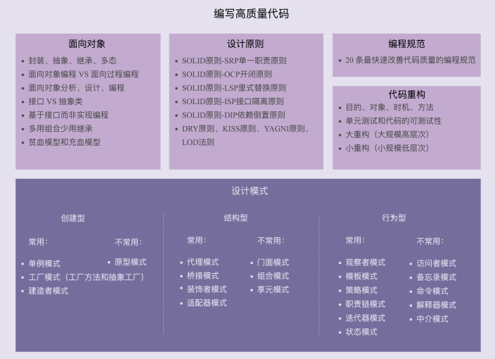

# 03 \| 面向对象、设计原则、设计模式、编程规范、重构，这五者有何关系？

在上一节课中，我们讲到，要具备编写高质量代码的能力，你需要学习一些编程方法论，其中就包含面向对象（可以看成一种设计思想）、设计原则、设计模式、编程规范、重构技巧等。而我们整个专栏的内容也是围绕着这几块展开讲解的。所以，今天我就先来简单介绍一下这几个概念，并且说一说它们之间的联系。

今天的内容相当于专栏的一个教学大纲，或者说学习框架。它能让你对整个专栏所涉及的知识点，有一个全局性的了解，能帮你将后面零散的知识更系统地组织在大脑里。

## 一、面向对象

现在，主流的编程范式或者是编程风格有三种，它们分别是面向过程、面向对象和函数式编程。面向对象这种编程风格又是这其中最主流的。现在比较流行的编程语言大部分都是面向对象编程语言。大部分项目也都是基于面向对象编程风格开发的。面向对象编程因为其具有丰富的特性（封装、抽象、继承、多态），可以实现很多复杂的设计思路，是很多设计原 则、设计模式编码实现的基础。

所以，在专栏的最开始，我们会详细地讲解面向对象编程的相关的知识，为学习后面的内容做铺垫。对于这部分内容，你需要掌握下面这 7 个大的知识点。

- 面向对象的四大特性：封装、抽象、继承、多态

- 面向对象编程与面向过程编程的区别和联系

- 面向对象分析、面向对象设计、面向对象编程

- 接口和抽象类的区别以及各自的应用场景

- 基于接口而非实现编程的设计思想

- 多用组合少用继承的设计思想

- 面向过程的贫血模型和面向对象的充血模型

## 二、设计原则

设计原则是指导我们代码设计的一些经验总结。设计原则这块儿的知识有一个非常大的特点，那就是这些原则听起来都比较抽象，定义描述都比较模糊，不同的人会有不同的解读。所以，如果单纯地去记忆定义，对于编程、设计能力的提高，意义并不大。==对于每一种设计原则，我们需要掌握它的设计初衷，能解决哪些编程问题，有哪些应用场景==。只有这样，我们才能在项目中灵活恰当地应用这些原则。

对于这一部分内容，你需要透彻理解并且掌握，如何应用下面这样几个常用的设计原则。

- SOLID 原则 -SRP 单一职责原则

- SOLID 原则 -OCP 开闭原则

- SOLID 原则 -LSP 里式替换原则

- SOLID 原则 -ISP 接口隔离原则

- SOLID 原则 -DIP 依赖倒置原则

- DRY 原则、KISS 原则、YAGNI 原则、LOD 法则

## 三、设计模式

设计模式是针对软件开发中经常遇到的一些设计问题，总结出来的一套解决方案或者设计思路。**大部分设计模式要解决的都是代码的可扩展性问题**。设计模式相对于设计原则来说，没有那么抽象，而且大部分都不难理解，代码实现也并不复杂。这一块的学习难点是了解它们都能解决哪些问题，掌握典型的应用场景，并且懂得不过度应用。

经典的设计模式有 23 种。随着编程语言的演进，一些设计模式（比如 Singleton）也随之过时，甚至成了反模式，一些则被内置在编程语言中（比如 Iterator），另外还有一些新的模式诞生（比如 Monostate）。

在专栏中，我们会重点讲解 23 种经典的设计模式。它们又可以分为三大类：创建型、结构型、行为型。对于这 23 种设计模式的学习，我们要有侧重点，因为有些模式是比较常用的，有些模式是很少被用到的。对于常用的设计模式，我们要花多点时间理解掌握。对于不常用的设计模式，我们只需要稍微了解即可。

我按照类型和是否常用，对专栏中讲到的这些设计模式，进行了简单的分类，具体如下所示。

- 创建型

  常用的有：单例模式、工厂模式（工厂方法和抽象工厂）、建造者模式。不常用的有：原型模式。

- 结构型

  常用的有：代理模式、桥接模式、装饰者模式、适配器模式。不常用的有：门面模式、组合模式、享元模式。

- 行为型

  常用的有：观察者模式、模板模式、策略模式、职责链模式、迭代器模式、状态模式。不常用的有：访问者模式、备忘录模式、命令模式、解释器模式、中介模式。

## 四、编程规范

编程规范主要解决的是代码的可读性问题。编码规范相对于设计原则、设计模式，更加具体、更加偏重代码细节。即便你可能对设计原则不熟悉、对设计模式不了解，但你最起码要掌握基本的编码规范，比如，如何给变量、类、函数命名，如何写代码注释，函数不宜过长、参数不能过多等等。

对于编码规范，考虑到很多书籍已经讲得很好了（比如《重构》《代码大全》《代码整洁之道》等）。而且，每条编码规范都非常简单、非常明确，比较偏向于记忆，你只要照着来做可以。它不像设计原则，需要融入很多个人的理解和思考。所以，在这个专栏中，我并没有花太多的篇幅来讲解所有的编码规范，而是总结了我认为的最能改善代码质量的 20 条规范。如果你暂时没有时间去看那些经典的书籍，看我这些就够了。

除此之外，专栏并没有将编码规范单独作为一个模块来讲解，而是跟重构放到了一起。之所以这样做，那是因为我把重构分为大重构和小重构两种类型，而小重构利用的知识基本上就是编码规范。

除了编码规范，我们还会介绍一些代码的坏味道，让你知道什么样的代码是不符合规范的， 应该如何优化。参照编码规范，你可以写出可读性好的代码；参照代码的坏味道，你可以找出代码存在的可读性问题。

## 五、代码重构

在软件开发中，只要软件在不停地迭代，就没有一劳永逸的设计。随着需求的变化，代码的不停堆砌，原有的设计必定会存在这样那样的问题。针对这些问题，我们就需要进行代码重构。重构是软件开发中非常重要的一个环节。持续重构是保持代码质量不下降的有效手段， 能有效避免代码腐化到无可救药的地步。

而重构的工具就是我们前面罗列的那些面向对象设计思想、设计原则、设计模式、编码规范。实际上，设计思想、设计原则、设计模式一个最重要的应用场景就是在重构的时候。我们前面讲过，虽然使用设计模式可以提高代码的可扩展性，但过度不恰当地使用，也会增加代码的复杂度，影响代码的可读性。**在开发初期，除非特别必须，我们一定不要过度设计， 应用复杂的设计模式。而是当代码出现问题的时候，我们再针对问题，应用原则和模式进行重构。这样就能有效避免前期的过度设计。**

对于重构这部分内容，你需要掌握以下几个知识点：

- 重构的目的（why）、对象（what）、时机（when）、方法（how）； 

- 保证重构不出错的技术手段：单元测试和代码的可测试性；

- 两种不同规模的重构：大重构（大规模高层次）和小重构（小规模低层次）。

希望你学完这部分内容之后，不仅仅是掌握一些重构技巧、套路，更重要的是建立持续重构意识，把重构当作开发的一部分，融入到日常的开发中。

## 六、五者之间的联系

关于面向对象、设计原则、设计模式、编程规范和代码重构，这五者的关系我们前面稍微提到了一些，我这里再总结梳理一下。

面向对象编程因为其具有丰富的特性（封装、抽象、继承、多态），可以实现很多复杂的设计思路，是很多设计原则、设计模式等编码实现的基础。

设计原则是指导我们代码设计的一些经验总结，对于某些场景下，是否应该应用某种设计模式，具有指导意义。比如，"开闭原则"是很多设计模式（策略、模板等）的指导原则。

设计模式是针对软件开发中经常遇到的一些设计问题，总结出来的一套解决方案或者设计思路。应用设计模式的主要目的是提高代码的可扩展性。从抽象程度上来讲，设计原则比设计模式更抽象。设计模式更加具体、更加可执行。

编程规范主要解决的是代码的可读性问题。编码规范相对于设计原则、设计模式，更加具体、更加偏重代码细节、更加能落地。持续的小重构依赖的理论基础主要就是编程规范。

重构作为保持代码质量不下降的有效手段，利用的就是面向对象、设计原则、设计模式、编码规范这些理论。

实际上，面向对象、设计原则、设计模式、编程规范、代码重构，这五者都是保持或者提高代码质量的方法论，本质上都是服务于编写高质量代码这一件事的。当我们追本逐源，看清这个本质之后，很多事情怎么做就清楚了，很多选择怎么选也清楚了。比如，在某个场景 下，该不该用这个设计模式，那就看能不能提高代码的可扩展性；要不要重构，那就看重代码是否存在可读、可维护问题等。

## 重点回顾

今天的内容到此就讲完了。我画了一张图，总结了专栏中所涉及的知识点。在学习后面的课程的时候，你可以经常翻出来看一下，建立全局意识，不至于迷失在零碎的知识点中。

## 课堂讨论

今天课堂讨论的话题有两个。

1.  在今天讲到的内容中，你觉得哪一部分内容对提高代码质量最有效？为什么？除了我罗列的这些内容之外，你还知道哪些可以提高代码质量的方法？

2.  我们知道，最经典的设计模式书籍是 GoF 的《设计模式》，它的中文全称是《设计模式：可复用面向对象软件的基础》，英文全称是"Design Patterns: Elements of Reusable Object-Oriented Software"。为什么它在标题中会特意提到"面向对象"呢？

欢迎在留言区写下你的想法，和同学一起交流和分享。如果有收获，也欢迎你把这篇文章分享给你的朋友。

## 精选留言

- 面向对象是武器，设计模式是招式，设计原则是心法
  以心法为基础，以武器运用招式应对复杂的编程问题  

- 函数是相对比较小的可复用单位
  面向对象把可复用单位提升到类层次
  设计模式把可复用单位提升到框架层次

- 第二题，文中已经给出答案了?
  主要是因为面向对象编程因为具有丰富的特性(封装抽象继承多态)，可以实现很多复杂的设
  计思路， 是很多设计原则、设计模式等编码实现的基础。

- 面向对象的特征也未必包含“继承”这一点吧，比如 Go 语言就没有提供“继承”这个特
  性，取而代之的是，推荐使用“组合”。但不能说它不支持面向对象编程。那么我们在探
  讨“面向对象”这个范式时，需要更深刻的去思考“面向对象”的本质是什么。而不是用J
  ava 中的概念来一以概之。希望王争老师参考。
  作者回复: 后面会讲到，等讲到了就明白了

- 建议和左耳的程序员练级攻略结合起来一起读。
  上述道理 ，知易行难，一起加油。

- 有的时候业务复杂，代码就被业务牵着鼻子走，尤其是老项目，既存代码写的可读性差，
  但是时间紧任务重，能跑就行……哎

- 个人认为重构对提高代码质量最有效，原因：
  重构的基础就是面向对象、设计原则、设计模式、编程规范；
  重构是一个持续的过程，能够兼顾项目进度、项目开发效率和项目质量，既可以避免前期
  的过度设计，又能避免后期代码腐化，从而保证代码的质量不下降以致不断提高代码质
  量；…

- 最近一直在思考一个问题，就是我们在开发过程中，写好代码，应该是一个程序员必备的
  基本功。这个好字就是这老师说的高质量的代码，以前一直觉得要追求最热最新的技术，
  不然就会被淘汰。其实忘记了一个最基本的事情，怎么写好代码，写高质量的代码，这个
  才是我们开发过程中的重点，写好代码应该是一个合格的程序员必备的技能，毕竟写代码
  才是我们真真正正吃饭的家伙。老师出的这个专栏真的是太好了，教大家怎么样做好我…

- 总结：提高代码质量的方法论，包含面向对象（基础），设计原则（指导方针），设计模
  式（三大类，提高扩展性），编程规范（提高可读性），重构（保证代码质量）。

- 设计原则是高手的内功，设计模式是少林，武当，峨眉派的武术套路，规范是招式 出拳还
  是横扫，重构是组合拳 融汇贯通各种组合，而想练好这些武功还要有扎实的基本功 面向对
  象。

- GoF的提出是针对解决面向对象编程中遇到的问题，所以书名中强调“面向对象”。It’s
  a book of design patterns that describes simple and elegant solutions to specific problems
  in object-oriented software design.
  
- 设计原则是指导设计模式的更抽象的理论（这么说应该对吧）
  另外有个困惑就是在编码规范的时候，自我感觉英语还可以，但是函数，变量命名的时候
  经常会犯纠结症和强迫症。。。不知道怎么命名才好。
  作者回复: 理解是对的。这个正常，一个好的命名确实要花点时间想的

- 我看到设计原则中还有迪米特法则(Law of Demeter, LoD)，这个也是解决God类的一种方
  式。另外这个法则，好像跟组合复用相背呢。帮忙解释一下。

  作者回复: 学了后面章节就明白了

- 编码规范和设计原则解决的是可读性和可维护性，而面向对象是一种设计方法或者说是一
  种抽象思维，更符合人类的思考方式，所以它们的属性偏向于静态的概念；代码重构和设
  计模式是一种动态的概念，是具体的执行方法，当然代码重构本身就包含了：编码规范,设
  计原则,设计模式。
  另外，面向对象和设计模式本身就有着紧密的联系，设计模式是解决特定问题的有效方…
- 我觉得今年对我来说，是重新认识“面向对象”的一年。
  今年事我工作的第三年了（从八月份开始算第三年），年初的时候误打误撞的学了一段时
  间的DDD，让我瞬间感受到了什么才是面向对象编程，之前自己做的都是用面向对象的语
  言写面向过程的代码。究其原因，可能是MVC 三层架构的影响，太多人的代码里头只剩下
  了pojo这种贫血模型。封装，继承，多态，抽象是啥，早就忘干净了。…
- 1.对于一些刚接触面向对象语言的同学，有面向对象的思维尤为重要。对于有了一定开发
  基础的同学，可能编程规范是他们亟需了解的。对一些老同学而言，设计原则、设计模
  式、什么样的代码需要重构、怎样把代码重构的更合理是他们最关注的的。
  2.还没有看过这本书，但是感觉标题提到了“设计模式”，应该是这种思想贯穿着整本
  书。
- 设计模式是帮助梳理对象之间的关系的，帮助重用复用对象，所以才强调“对象”
- 其实这些概念都是老生常谈了，你要说是哪种好，哪种坏不见得有个标准答案，有的时候
  还是不得不违反这些原则去编程，真心希望跟着王老师能深究这其中的奥妙
- 导读部分的最后一节课了，明白了编程思想、设计原则。设计模式。编码规范和重构的意
  思，之前也有了解，这次通过老师解读，理解变得更清晰了，有了面向对象的设计思想，
  才有了适合这种思想的设计原则，设计原则是设计系统和代码应该考虑的问题，在满足部
  分原则的情况下，针对具体的场景，有了设计模式，设计模式的出现就是为了最大可能的
  满足设计原则，至于编码规范，可以提高代码的可读性和不同程序员直接的一个约定一…
