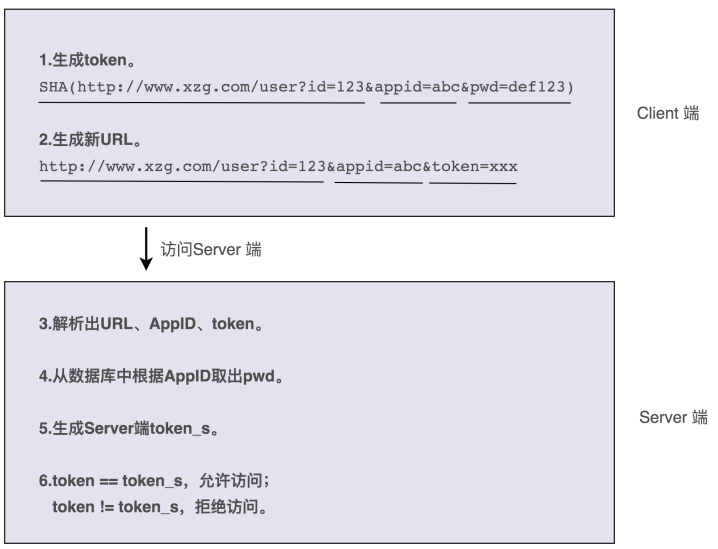

# 13实战二（上）：如何对接口鉴权这样一个功能开发做面向对象分析？

对于"如何做需求分析，如何做职责划分？需要定义哪些类？每个类应该具有哪些属性、方法？类与类之间该如何交互？如何组装类成一个可执行的程序？"等等诸多问题，都没有清晰的思路，更别提利用成熟的设计原则、思想或者设计模式，开发出具有高内聚低耦合、易扩展、易读等优秀特性的代码了。

所以，我打算用两节课的时间，结合一个真实的开发案例，从基础的需求分析、职责划分、类的定义、交互、组装运行讲起，将最基础的面向对象分析、设计、编程的套路给你讲清楚，为后面学习设计原则、设计模式打好基础。

## 一、案例介绍和难点剖析

假设，你正在参与开发一个微服务。微服务通过 HTTP 协议暴露接口给其他系统调用，即其他系统通过 URL 来调用微服务的接口。有一天，你的 leader 找到你说，"为了保证接口调用的安全性，我们希望设计实现一个接口调用鉴权功能，只有经过认证之后的系统才能调用我们的接口，没有认证过的系统调用我们的接口会被拒绝。我希望由你来负责这个任务的开发，争取尽快上线。"

leader 丢下这些话就走了。这个时候，你该如何来做呢？有没有脑子里一团浆糊，一时间无从下手的感觉呢？为什么会有这种感觉呢？我个人觉得主要有下面两点原因。

### （一）需求不明确

leader 给到的需求过于模糊、笼统，不够具体、细化，离落地到设计、编码还有一定的距离。而人的大脑不擅长思考这种过于抽象的问题。这也是真实的软件开发区别于应试教育的地方。应试教育中的考试题目，一般都是一个非常具体的问题，我们去解答就好了。而真实的软件开发中，需求几乎都不是很明确。

我们前面讲过，面向对象分析主要的分析对象是"需求"，因此，面向对象分析可以粗略地看成"需求分析"。实际上，不管是需求分析还是面向对象分析，我们首先要做的都是**将笼统的需求细化到足够清晰、可执行**。我们需要通过沟通、挖掘、分析、假设、梳理，搞清楚具体的需求有哪些，哪些是现在要做的，哪些是未来可能要做的，哪些是不用考虑做的。

### （二）缺少锻炼

相比单纯的业务 CRUD 开发，鉴权这个开发任务，要更有难度。鉴权作为一个跟具体业务无关的功能，我们完全可以把它开发成一个独立的框架，集成到很多业务系统中。而作为被很多系统复用的通用框架，比起普通的业务代码，我们对框架的代码质量要求要更高。

开发这样通用的框架，对工程师的需求分析能力、设计能力、编码能力，甚至逻辑思维能力的要求，都是比较高的。如果你平时做的都是简单的 CRUD 业务开发，那这方面的锻炼肯定不会很多，所以，一旦遇到这种开发需求，很容易因为缺少锻炼，脑子放空，不知道从何入手，完全没有思路。

## 二、对案例进行需求分析

实际上，需求分析的工作很琐碎，也没有太多固定的章法可寻，所以，我不打算很牵强地罗列那些听着有用、实际没用的方法论，而是希望通过鉴权这个例子，来给你展示一下，面对需求分析的时候，我的完整的思考路径是什么样的。希望你能自己去体会，举一反三地类比应用到其他项目的需求分析中。

**尽管针对框架、组件、类库等非业务系统的开发，我们一定要有组件化意识、框架意识、抽象意识，开发出来的东西要足够通用，不能局限于单一的某个业务需求，但这并不代表我们就可以脱离具体的应用场景，闷头拍脑袋做需求分析**。多跟业务团队聊聊天，甚至自己去参与几个业务系统的开发，只有这样，我们才能真正知道业务系统的痛点，才能分析出最有价值的需求。不过，针对鉴权这一功能的开发，最大的需求方还是我们自己，所以，我们也可以先从满足我们自己系统的需求开始，然后再迭代优化。

现在，我们来看一下，针对鉴权这个功能的开发，我们该如何做需求分析？

实际上，这跟做算法题类似，先**从最简单的方案想起，然后再优化**。所以，我把整个的分析过程分为了循序渐进的四轮。每一轮都是对上一轮的迭代优化，最后形成一个可执行、可落地的需求列表。

### （一）第一轮基础分析

对于如何做鉴权这样一个问题，最简单的解决方案就是，通过用户名加密码来做认证。我们给每个允许访问我们服务的调用方，派发一个应用名（或者叫应用 ID、AppID）和一个对应的密码（或者叫秘钥）。调用方每次进行接口请求的时候，都携带自己的 AppID 和密码。微服务在接收到接口调用请求之后，会解析出 AppID 和密码，跟存储在微服务端的 AppID 和密码进行比对。如果一致，说明认证成功，则允许接口调用请求；否则，就拒绝接口调用请求。

### （二）第二轮分析优化

不过，这样的验证方式，每次都要明文传输密码。密码很容易被截获，是不安全的。那如果我们借助加密算法（比如 SHA），对密码进行加密之后，再传递到微服务端验证，是不是就可以了呢？实际上，这样也是不安全的，因为加密之后的密码及 AppID，照样可以被未认证系统（或者说黑客）截获，未认证系统可以携带这个加密之后的密码以及对应的 AppID，伪装成已认证系统来访问我们的接口。这就是典型的"重放攻击"。

提出问题，然后再解决问题，是一个非常好的迭代优化方法。对于刚刚这个问题，我们可以借助 OAuth 的验证思路来解决。调用方将请求接口的 URL 跟 AppID、密码拼接在一起，然后进行加密，生成一个 token。调用方在进行接口请求的时候，将这个 token 及 AppID，随 URL 一块传递给微服务端。微服务端接收到这些数据之后，根据 AppID 从数据库中取出对应的密码，并通过同样的 token 生成算法，生成另外一个 token。用这个新生成的 token 跟调用方传递过来的 token 对比。如果一致，则允许接口调用请求；否则，就拒绝接口调用请求。

这个方案稍微有点复杂，我画了一张示例图，来帮你理解整个流程。

### （三）第三轮分析优化

不过，这样的设计仍然存在重放攻击的风险，还是不够安全。每个 URL 拼接上 AppID、密码生成的 token 都是固定的。未认证系统截获 URL、token 和 AppID 之后，还是可以通过重放攻击的方式，伪装成认证系统，调用这个 URL 对应的接口。

为了解决这个问题，我们可以进一步优化 token 生成算法，引入一个随机变量，让每次接口请求生成的 token 都不一样。我们可以选择时间戳作为随机变量。原来的 token 是对 URL、AppID、密码三者进行加密生成的，现在我们将 URL、AppID、密码、时间戳四者进行加密来生成 token。调用方在进行接口请求的时候，将 token、AppID、时间戳，随 URL 一并传递给微服务端。

微服务端在收到这些数据之后，会验证当前时间戳跟传递过来的时间戳，是否在一定的时间窗口内（比如一分钟）。如果超过一分钟，则判定 token 过期，拒绝接口请求。如果没有超过一分钟，则说明 token 没有过期，就再通过同样的 token 生成算法，在服务端生成新的 token，与调用方传递过来的 token 比对，看是否一致。如果一致，则允许接口调用请求；否则，就拒绝接口调用请求。

优化之后的认证流程如下图所示。

### （四）第四轮分析优化

不过，你可能会说，这样还是不够安全啊。未认证系统还是可以在这一分钟的 token 失效窗口内，通过截获请求、重放请求，来调用我们的接口啊！

不过，攻与防之间，本来就没有绝对的安全。我们能做的就是，尽量提高攻击的成本。这个方案虽然还有漏洞，但是实现起来足够简单，而且不会过度影响接口本身的性能（比如响应时间）。所以，权衡安全性、开发成本、对系统性能的影响，这个方案算是比较折中、比较合理的了。

实际上，还有一个细节我们没有考虑到，那就是，如何在微服务端存储每个授权调用方的 AppID 和密码。当然，这个问题并不难。最容易想到的方案就是存储到数据库里，比如 MySQL。不过，开发像鉴权这样的非业务功能，最好不要与具体的第三方系统有过度的耦合。

针对 AppID 和密码的存储，我们最好能灵活地支持各种不同的存储方式，比如 ZooKeeper、本地配置文件、自研配置中心、MySQL、Redis 等。我们不一定针对每种存储方式都去做代码实现，但起码要留有扩展点，保证系统有足够的灵活性和扩展性，能够在我们切换存储方式的时候，尽可能地减少代码的改动。

### （五）最终确定需求

到此，需求已经足够细化和具体了。现在，我们按照鉴权的流程，对需求再重新描述一下。如果你熟悉 UML，也可以用时序图、流程图来描述。不过，用什么描述不是重点，描述清楚才是最重要的。考虑到在接下来的面向对象设计环节中，我会基于文字版本的需求描述，来进行类、属性、方法、交互等的设计，所以，这里我给出的最终需求描述是文字版本的。

调用方进行接口请求的时候，将 URL、AppID、密码、时间戳拼接在一起，通过加密算法生成 token，并且将 token、AppID、时间戳拼接在 URL 中，一并发送到微服务端。

微服务端在接收到调用方的接口请求之后，从请求中拆解出 token、AppID、时间戳。

微服务端首先检查传递过来的时间戳跟当前时间，是否在 token 失效时间窗口内。如果已经超过失效时间，那就算接口调用鉴权失败，拒绝接口调用请求。

如果 token 验证没有过期失效，微服务端再从自己的存储中，取出 AppID 对应的密码，通过同样的 token 生成算法，生成另外一个 token，与调用方传递过来的 token 进行匹配；如果一致，则鉴权成功，允许接口调用，否则就拒绝接口调用。

这就是我们需求分析的整个思考过程，从最粗糙、最模糊的需求开始，通过"提出问题 -解决问题"的方式，循序渐进地进行优化，最后得到一个足够清晰、可落地的需求描述。

## 三、重点回顾

针对框架、类库、组件等非业务系统的开发，其中一个比较大的难点就是，需求一般都比较抽象、模糊，需要你自己去挖掘，做合理取舍、权衡、假设，把抽象的问题具象化，最终产生清晰的、可落地的需求定义。需求定义是否清晰、合理，直接影响了后续的设计、编码实现是否顺畅。所以，作为程序员，你一定不要只关心设计与实现，前期的需求分析同等重 要。

需求分析的过程实际上是一个不断迭代优化的过程。我们不要试图一下就能给出一个完美的解决方案，而是先给出一个粗糙的、基础的方案，有一个迭代的基础，然后再慢慢优化，这样一个思考过程能让我们摆脱无从下手的窘境。

## 四、课堂讨论

除了工作中我们会遇到需求不明确的开发任务，实际上，在面试中，我们也经常遇到一些开放性的设计问题，对于这类问题，你是如何解答的？有哪些好的经验可以分享给大家呢？

欢迎在留言区写下你的答案，和同学一起交流和分享。如果有收获，也欢迎你把这篇文章分享给你的朋友。

### 精选留言

- 工作中遇到非crud的需求我就会想尽一切办法让他通用，基本需求分析和需求设计的时间占用百分之五十，开发和重构到自认为最优占用百分之五十。比如最简单的验证码功能，几乎每个项目都有，我就封装一套验证码服务，主要功能有你在配置文件里配置好需要被验证码拦截的路径，这里还要考虑到通配符，空格等等细节和可扩展的点，内置图片验证码，极验证，手机验证以及自定义验证码等等，总之我认为如果有机会遇到非crud的需...

- 一句话：使用进化算法的思想，提出一个MVP（最小可行性产品），逐步迭代改进。

  拿到这个需求，假设我们不了解接口鉴权，需求又不明确，我会我自己如下问题： 

  1.什么叫接口鉴权？搞清基本概念

  2.接口鉴权最佳实践是什么？技术调研...

- 这个需求去年我就做过，给自己系统的对外接口开发一个鉴权的功能。因为之前了解过oau th2，当时就直接想到了oauth2鉴权来实现，就去学习了下，然后选择了"客户端模式"来实现，给各个应用分配appid和appsecrete，客户端拿appid和appsecrete请求有一定时效的token，应用拿到token后再跟appid和appsecrete一起来请求接口，服务端鉴权通过后即可调用。老师的例子是客户端定开始时间，我做的是服务端定开始时间。...

- 前一段写了一套 open api，使用鉴权方式就是老师描述的这种基于AK/SK的签名验证。这种方式感觉有一个问题就是如果是一个具有很大请求内容的post方法，签名的成本感觉还是挺高的。还有一种方式是服务端给客户端下发一个有一定时长的token，然后客户端的每次请求都带着这个token。

- 像今天的例子中，如果老板给我这样的需求，我第一反应就是去想怎么实现，用什么技术实现，有什么现成的框架，而不是去先思考「用户名密码登录验证」这最基础的第一步。刚开始脑子就一团浆糊，知道完成也是在便实现便理思路，这样浪费时间而且最后也没有自己完整的思路过程。

- 前面讲的充血模型还有点不理解, 准备这几天写个 demo 实践一下, 加深理解

- 还有个风险，如果调用方是app，那有可能app被反编译，然后加密算法就被第三方知道了

- 一般遇到这种需求不是特别明确的，先自己理解第一遍需求，有一个大概的思路，然后在和产品经理确认是不是这样。需求确认之前在按照争哥说的需求分析，对需求做任务分 解，将需求分解成一个个小的任务点，每个小任务都是很容易执行的。就算开发过程中被打断了，也不要紧。任务分解的尽量小，这样重新回到开发状态也就越容易。

- 有个问题: 通过同样的 token 生成算法，在服务端生成新的 token，与调用方传递过来的 t oken 比对。这个做法是不是有点多余？ 能把token解密难道不能说明token没有问题么？

- client端生成的token在时间窗口内，假如用户在操作中停留了1分钟（时间窗口），那tok en就过期了吗？

- 虽然对于程序员来说需求分析很重要，但最终需求的明确是产品经理的职责，即便是程序员自己分析需求最终也要与产品经理沟通确认。技术实现另当别论！

- 面试中遇到开放性的问题，先把能想到的思路说下，一般会和面试官有交流，交流的过程中（面试官可能会提醒）再进行补充

- 整个方案的分析过程是比较关键的，比如文中的几轮方案分析对于初级工程师来讲可能根本想不到，尤其是"重放攻击"，那么应该怎么办呢？这就需要首先先参考其他人的解决方案，然后综合给出自己的方案，在找组内同事们一起讨论，分析利弊，最终给出大家都认同的方案，面试中遇到开放性问题也一样，先给出自己的解决方案，然后和面试官一起探讨方案的利弊，再进行改动，不要紧张，很少有人一上来就能给出完美方案。
