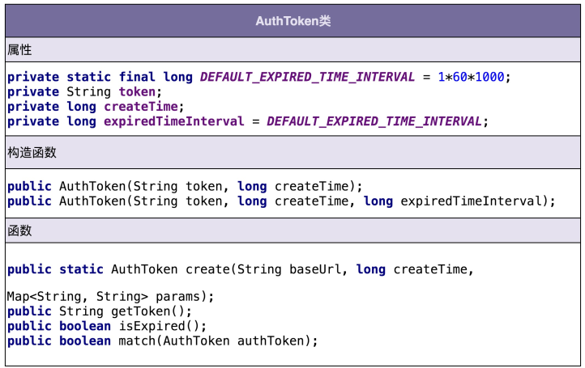
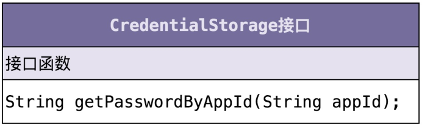
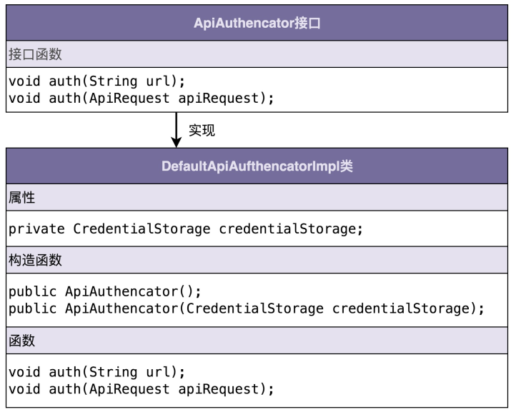

# 14实战二（下）：如何利用面向对象设计和编程开发接口鉴权功能？

在上一节课中，针对接口鉴权功能的开发，我们讲了如何进行面向对象分析（OOA），也就是需求分析。实际上，需求定义清楚之后，这个问题就已经解决了一大半，这也是为什么我花了那么多篇幅来讲解需求分析。今天，我们再来看一下，针对面向对象分析产出的需 求，如何来进行面向对象设计（OOD）和面向对象编程（OOP）。

## 一、如何进行面向对象设计？

我们知道，面向对象分析的产出是详细的需求描述，那面向对象设计的产出就是类。在面向对象设计环节，我们将需求描述转化为具体的类的设计。我们把这一设计环节拆解细化一 下，主要包含以下几个部分：

划分职责进而识别出有哪些类；定义类及其属性和方法；

定义类与类之间的交互关系； 将类组装起来并提供执行入口。

实话讲，不管是面向对象分析还是面向对象设计，理论的东西都不多，所以我们还是结合鉴权这个例子，在实战中体会如何做面向对象设计。

### （一）划分职责进而识别出有哪些类

在面向对象有关书籍中经常讲到，类是现实世界中事物的一个建模。但是，并不是每个需求都能映射到现实世界，也并不是每个类都与现实世界中的事物一一对应。对于一些抽象的概念，我们是无法通过映射现实世界中的事物的方式来定义类的。

所以，大多数讲面向对象的书籍中，还会讲到另外一种识别类的方法，那就是把需求描述中的名词罗列出来，作为可能的候选类，然后再进行筛选。对于没有经验的初学者来说，这个方法比较简单、明确，可以直接照着做。

不过，我个人更喜欢另外一种方法，那就是根据需求描述，把其中涉及的功能点，一个一个罗列出来，然后再去看哪些功能点职责相近，操作同样的属性，可否应该归为同一个类。我们来看一下，针对鉴权这个例子，具体该如何来做。

在上一节课中，我们已经给出了详细的需求描述，为了方便你查看，我把它重新贴在了下面。

调用方进行接口请求的时候，将 URL、AppID、密码、时间戳拼接在一起，通过加密算法生成 token，并且将 token、AppID、时间戳拼接在 URL 中，一并发送到微服务端。

微服务端在接收到调用方的接口请求之后，从请求中拆解出 token、AppID、时间戳。

微服务端首先检查传递过来的时间戳跟当前时间，是否在 token 失效时间窗口内。如果已经超过失效时间，那就算接口调用鉴权失败，拒绝接口调用请求。

如果 token 验证没有过期失效，微服务端再从自己的存储中，取出 AppID 对应的密码，通过同样的 token 生成算法，生成另外一个 token，与调用方传递过来的 token 进行匹配。如果一致，则鉴权成功，允许接口调用；否则就拒绝接口调用。

首先，我们要做的是逐句阅读上面的需求描述，拆解成小的功能点，一条一条罗列下来。注意，拆解出来的每个功能点要尽可能的小。每个功能点只负责做一件很小的事情（专业叫法是"单一职责"，后面章节中我们会讲到）。下面是我逐句拆解上述需求描述之后，得到的功能点列表：

1.  把 URL、AppID、密码、时间戳拼接为一个字符串；

2.  对字符串通过加密算法加密生成 token；

3.  将 token、AppID、时间戳拼接到 URL 中，形成新的 URL；

4.  解析 URL，得到 token、AppID、时间戳等信息；

5.  从存储中取出 AppID 和对应的密码；

6.  根据时间戳判断 token 是否过期失效；

7.  验证两个 token 是否匹配；

从上面的功能列表中，我们发现，1、2、6、7 都是跟 token 有关，负责 token 的生成、验证；3、4 都是在处理 URL，负责 URL 的拼接、解析；5 是操作 AppID 和密码，负责从存储中读取 AppID 和密码。所以，我们可以粗略地得到三个核心的类：AuthToken、 Url、CredentialStorage。AuthToken 负责实现 1、2、6、7 这四个操作；Url 负责 3、4两个操作；CredentialStorage 负责 5 这个操作。

当然，这是一个初步的类的划分，其他一些不重要的、边边角角的类，我们可能暂时没法一下子想全，但这也没关系，面向对象分析、设计、编程本来就是一个循环迭代、不断优化的过程。根据需求，我们先给出一个粗糙版本的设计方案，然后基于这样一个基础，再去迭代优化，会更加容易一些，思路也会更加清晰一些。

不过，我还要再强调一点，接口调用鉴权这个开发需求比较简单，所以，需求对应的面向对象设计并不复杂，识别出来的类也并不多。但如果我们面对的是更加大型的软件开发、更加复杂的需求开发，涉及的功能点可能会很多，对应的类也会比较多，像刚刚那样根据需求逐句罗列功能点的方法，最后会得到一个长长的列表，就会有点凌乱、没有规律。针对这种复杂的需求开发，我们首先要做的是进行模块划分，将需求先简单划分成几个小的、独立的功能模块，然后再在模块内部，应用我们刚刚讲的方法，进行面向对象设计。而模块的划分和识别，跟类的划分和识别，是类似的套路。

### （二）定义类及其属性和方法

刚刚我们通过分析需求描述，识别出了三个核心的类，它们分别是 AuthToken、Url 和 CredentialStorage。现在我们来看下，每个类都有哪些属性和方法。我们还是从功能点列表中挖掘。

### （三）AuthToken 类相关的功能点有四个：

把 URL、AppID、密码、时间戳拼接为一个字符串；

对字符串通过加密算法加密生成 token；

根据时间戳判断 token 是否过期失效；

验证两个 token 是否匹配。

对于方法的识别，很多面向对象相关的书籍，一般都是这么讲的，识别出需求描述中的动 词，作为候选的方法，再进一步过滤筛选。类比一下方法的识别，我们可以把功能点中涉及的名词，作为候选属性，然后同样进行过滤筛选。

我们可以借用这个思路，根据功能点描述，识别出来 AuthToken 类的属性和方法，如下所示：



从上面的类图中，我们可以发现这样三个小细节。

- 第一个细节：并不是所有出现的名词都被定义为类的属性，比如 URL、AppID、密码、时间戳这几个名词，我们把它作为了方法的参数。
- 第二个细节：我们还需要挖掘一些没有出现在功能点描述中属性，比如 createTime， expireTimeInterval，它们用在 isExpired() 函数中，用来判定 token 是否过期。
- 第三个细节：我们还给 AuthToken 类添加了一个功能点描述中没有提到的方法 getToken()。

第一个细节告诉我们，从业务模型上来说，不应该属于这个类的属性和方法，不应该被放到这个类里。比如 URL、AppID 这些信息，从业务模型上来说，不应该属于 AuthToken，所以我们不应该放到这个类中。

第二、第三个细节告诉我们，在设计类具有哪些属性和方法的时候，不能单纯地依赖当下的需求，还要分析这个类从业务模型上来讲，理应具有哪些属性和方法。这样可以一方面保证类定义的完整性，另一方面不仅为当下的需求还为未来的需求做些准备。

#### Url 类相关的功能点有两个：

- 将 token、AppID、时间戳拼接到 URL 中，形成新的 URL；

- 解析 URL，得到 token、AppID、时间戳等信息。

虽然需求描述中，我们都是以 URL 来代指接口请求，但是，接口请求并不一定是以 URL 的形式来表达，还有可能是 dubbo RPC 等其他形式。为了让这个类更加通用，命名更加贴切，我们接下来把它命名为 ApiRequest。下面是我根据功能点描述设计的 ApiRequest 类。


#### CredentialStorage 类相关的功能点有一个：

从存储中取出 AppID 和对应的密码。

CredentialStorage 类非常简单，类图如下所示。为了做到抽象封装具体的存储方式，我们将 CredentialStorage 设计成了接口，基于接口而非具体的实现编程。



### （四）定义类与类之间的交互关系

类与类之间都哪些交互关系呢？UML 统一建模语言中定义了六种类之间的关系。它们分别是：泛化、实现、关联、聚合、组合、依赖。关系比较多，而且有些还比较相近，比如聚合和组合，接下来我就逐一讲解一下。

**泛化**（Generalization）可以简单理解为继承关系。具体到 Java 代码就是下面这样：

```java
public class A { ... }
public class B extends A { ... }
```

**实现**（Realization）一般是指接口和实现类之间的关系。具体到 Java 代码就是下面这样：

```java
public interface A {...}
public class B implements A { ... }
```

**聚合**（Aggregation）是一种包含关系，A 类对象包含 B 类对象，B 类对象的生命周期可以不依赖 A 类对象的生命周期，也就是说可以单独销毁 A 类对象而不影响 B 对象，比如课程与学生之间的关系。具体到 Java 代码就是下面这样：

```java
public class A {
    private B b;
    public A(B b) {
        this.b = b;
    }
}
```

**组合**（Composition）也是一种包含关系。A 类对象包含 B 类对象，B 类对象的生命周期跟依赖 A 类对象的生命周期，B 类对象不可单独存在，比如鸟与翅膀之间的关系。具体到 Java 代码就是下面这样：

```java
public class A {
    private B b;
    public A() {
        this.b = new B();
    }
}
```

**关联**（Association）是一种非常弱的关系，包含聚合、组合两种关系。具体到代码层面，如果 B 类对象是 A 类的成员变量，那 B 类和 A 类就是关联关系。具体到 Java 代码就是下面这样：

```java
public class A {
    private B b;
    public A(B b) {
        this.b = b;
    }
}
// 或者
public class A {
    private B b;
    public A() {
        this.b = new B();
    }
}
```

**依赖**（Dependency）是一种比关联关系更加弱的关系，包含关联关系。不管是 B 类对象是 A 类对象的成员变量，还是 A 类的方法使用 B 类对象作为参数或者返回值、局部变量，只要 B 类对象和 A 类对象有任何使用关系，我们都称它们有依赖关系。具体到 Java 代码就是下面这样：

```java
public class A {
    private B b;
    public A(B b) {
        this.b = b;
    }
}
// 或者
public class A {
    private B b;
    public A() {
        this.b = new B();
    }
}
// 或者
public class A {
    public void func(B b) { ... }
}
```

看完了 UML 六种类关系的详细介绍，不知道你有何感受？我个人觉得这样拆分有点太细，增加了学习成本，对于指导编程开发没有太大意义。所以，我从更加贴近编程的角度，对类与类之间的关系做了调整，只保留了四个关系：泛化、实现、组合、依赖，这样你掌握起来会更加容易。

其中，泛化、实现、依赖的定义不变，组合关系替代 UML 中组合、聚合、关联三个概念，也就相当于重新命名关联关系为组合关系，并且不再区分 UML 中的组合和聚合两个概念。之所以这样重新命名，是为了跟我们前面讲的"多用组合少用继承"设计原则中的"组合"统一含义。只要 B 类对象是 A 类对象的成员变量，那我们就称，A 类跟 B 类是组合关系。

理论的东西讲完了，让我们来看一下，刚刚我们定义的类之间都有哪些关系呢？因为目前只有三个核心的类，所以只用到了实现关系，也即 CredentialStorage 和 MysqlCredentialStorage 之间的关系。接下来讲到组装类的时候，我们还会用到依赖关系、组合关系，但是泛化关系暂时没有用到。

### （五）将类组装起来并提供执行入口

类定义好了，类之间必要的交互关系也设计好了，接下来我们要将所有的类组装在一起，提供一个执行入口。这个入口可能是一个 main() 函数，也可能是一组给外部用的 API 接口。通过这个入口，我们能触发整个代码跑起来。

接口鉴权并不是一个独立运行的系统，而是一个集成在系统上运行的组件，所以，我们封装所有的实现细节，设计了一个最顶层的 ApiAuthencator 接口类，暴露一组给外部调用者使用的 API 接口，作为触发执行鉴权逻辑的入口。具体的类的设计如下所示：



## 二、如何进行面向对象编程？

面向对象设计完成之后，我们已经定义清晰了类、属性、方法、类之间的交互，并且将所有的类组装起来，提供了统一的执行入口。接下来，面向对象编程的工作，就是将这些设计思路翻译成代码实现。有了前面的类图，这部分工作相对来说就比较简单了。所以，这里我只给出比较复杂的 ApiAuthencator 的实现。

对于 AuthToken、ApiRequest、CredentialStorage 这三个类，在这里我就不给出具体的代码实现了。给你留一个课后作业，你可以试着把整个鉴权框架自己去实现一遍。

```java
public interface ApiAuthencator {
    void auth(String url);
    void auth(ApiRequest apiRequest);
} 
public class DefaultApiAuthencatorImpl implements ApiAuthencator {
    private CredentialStorage credentialStorage;
    public ApiAuthencator() {
        this.credentialStorage = new MysqlCredentialStorage();
    } 
    
    public ApiAuthencator(CredentialStorage credentialStorage) {
        this.credentialStorage = credentialStorage;
    } 
    
    @Override
    public void auth(String url) {
        ApiRequest apiRequest = ApiRequest.buildFromUrl(url);
        auth(apiRequest);
    }
    
    @Override
    public void auth(ApiRequest apiRequest) {
        String appId = apiRequest.getAppId();
        String token = apiRequest.getToken();
        long timestamp = apiRequest.getTimestamp();
        String originalUrl = apiRequest.getOriginalUrl();
        AuthToken clientAuthToken = new AuthToken(token, timestamp);
        if (clientAuthToken.isExpired()) {
            throw new RuntimeException("Token is expired.");
        }
        String password = credentialStorage.getPasswordByAppId(appId);
        AuthToken serverAuthToken = AuthToken.generate(originalUrl, appId, password);
        if (!serverAuthToken.match(clientAuthToken)) {
            throw new RuntimeException("Token verfication failed.");
        }
    }
}
```

## 三、辩证思考与灵活应用

在之前的讲解中，面向对象分析、设计、实现，每个环节的界限划分都比较清楚。而且，设计和实现基本上是按照功能点的描述，逐句照着翻译过来的。这样做的好处是先做什么、后做什么，非常清晰、明确，有章可循，即便是没有太多设计经验的初级工程师，都可以按部就班地参照着这个流程来做分析、设计和实现。

不过，在平时的工作中，大部分程序员往往都是在脑子里或者草纸上完成面向对象分析和设计，然后就开始写代码了，边写边思考边重构，并不会严格地按照刚刚的流程来执行。而 且，说实话，即便我们在写代码之前，花很多时间做分析和设计，绘制出完美的类图、 UML 图，也不可能把每个细节、交互都想得很清楚。在落实到代码的时候，我们还是要反复迭代、重构、打破重写。

毕竟，整个软件开发本来就是一个迭代、修修补补、遇到问题解决问题的过程，是一个不断重构的过程。我们没法严格地按照顺序执行各个步骤。这就类似你去学驾照，驾校教的都是比较正规的流程，先做什么，后做什么，你只要照着做就能顺利倒车入库，但实际上，等你开熟练了，倒车入库很多时候靠的都是经验和感觉。

## 重点回顾

今天的内容到此就讲完了。我们来一块总结回顾一下，你需要掌握的重点内容。

面向对象分析的产出是详细的需求描述。面向对象设计的产出是类。在面向对象设计这一环节中，我们将需求描述转化为具体的类的设计。这个环节的工作可以拆分为下面四个部分。

#### 划分职责进而识别出有哪些类

根据需求描述，我们把其中涉及的功能点，一个一个罗列出来，然后再去看哪些功能点职责相近，操作同样的属性，可否归为同一个类。

#### 定义类及其属性和方法

我们识别出需求描述中的动词，作为候选的方法，再进一步过滤筛选出真正的方法，把功能点中涉及的名词，作为候选属性，然后同样再进行过滤筛选。

#### 定义类与类之间的交互关系

UML 统一建模语言中定义了六种类之间的关系。它们分别是：泛化、实现、关联、聚合、组合、依赖。我们从更加贴近编程的角度，对类与类之间的关系做了调整，保留四个关系：泛化、实现、组合、依赖。

#### 将类组装起来并提供执行入口

我们要将所有的类组装在一起，提供一个执行入口。这个入口可能是一个 main() 函数，也可能是一组给外部用的 API 接口。通过这个入口，我们能触发整个代码跑起来。

## 课堂讨论

- 干货满满！争哥拆分需求、组织类和方法的思考过程值得我们学习。

  我想到的实现过程是按照用户发送请求通过鉴权和未通过鉴权的流程写： 1、先写接口auth(String url) ，这里先定义好请求的格式，例如"xxx?AppID=123&Tok en=aaa&TimeStamp=123123"...

- 前一个项目我也完整的实现了整个鉴权流程，需求分析阶段可以说和小争哥分析的功能点几乎一样，拼接参数，进行加密，验证token，验证时间。可到了编程阶段，我还是按照面向过程的方式，拆了几个方法，把功能就实现了。今天给我了一个深刻的感悟，面向对象编程，听起来并不复杂，但他真正的难点在于我学了这么多，对于下一个功能，是不是能够用面向对象的方式来把功能实现。如何做到学以致用，是我们学会知识后，接下来要...展开

- 如果是我的话怕是理清功能后，写一个鉴权util，然后所有的方法都塞进去，典型的面向过程了😩

- 看代码，我也是看的云里雾里的，希望老师能抽空将课程的代码写到github上

  作者回复: 好的 我放到github上 github 上你搜 wangzheng0822

- 需求分析过程中，或者分析完，不要直接就想着数据库表结构怎么设计。

  基本是按照老师说的这个流程分析下来，再对外暴露接口，最后是如何存储，存储的结构视存储方式而定，比如存到DB，Redis，MongoDB等等，还有可能会切换实现。

  整体就是做好需求分析拆解，根据功能边界模块划分，模块内部还可以分子模块，再做好每个模块内部功能分析实现，以及模块之间的协作。

- 我觉得，鉴权和url解析的类就是充血模型。就是domain,就是领域层

- 1、token加密采用md5 

  2、执行测试类即可

  花了一小时完成了课后题，望纠正，一起学习.

  上代码: https://gitee.com/MondayLiu/geek-design.git

- 组合关系：强调部分与整体的关系，其中包括两种情况，关联性强（大雁与翅膀）的与关联性弱（学生与班级）的。

  依赖关系：强调对象与对象的临时关系，人开车。

- 针对以往的贫血模型的开发经验，基本就是通过数据建模来实现的，都是先把需求拆分出实体，针对实体定义数据字段，也就是属性，再梳理出方法。这种思路就很难引导自己去进行抽象。最后出来的代码也就是面向过程了😂

- 目前我觉得需要学会的是转化自己的面向过程编程的思想

- 老师，我有个问题，当客户端跟服务端的时间不同步时，鉴权token不是都检验不通过了吗？怎么才能保证客户端跟服务端时间同步？

- 有关数据存储接口定义，有如下疑问： 数据存储会支持数据库（sqlite, mysql, redis）或者文本，那么我这个接口如何定义呢？我感觉下面的做法有点问题，就是数据库和文本存储方式接口不是很兼容

- 同样的需求我在代码里实现过，但是看了争哥的思路有种耳目一新的感觉；

  另外我有一点疑惑："将 token、AppID、时间戳拼接到 URL 中，形成新的 URL"，这个功能点应该是在客户端完成的吧，服务端只需要在验证的时候解析URL，验证token就可以了吧，虽然也是一个功能点，但实际并不需要服务端考虑。

- 有个问题就是：DefaultApiAuthencatorImpl 类里的构造函数名应该和类名一样的吧，还是说java哪个版本的新特性？

- 用这种需求分析需求设计的方式，你告诉我一个方法怎么可能超过五十行？编程规范都说方法单个不超过五十行，八十行的。到头来为什么还是超过？就是因为之前都是面向过程编程，token，url等操作都放到一个类的一个方法里面，要全面相过程编程。争哥的这种需求分析需求设计的方式值得学习和效仿，真的香！
