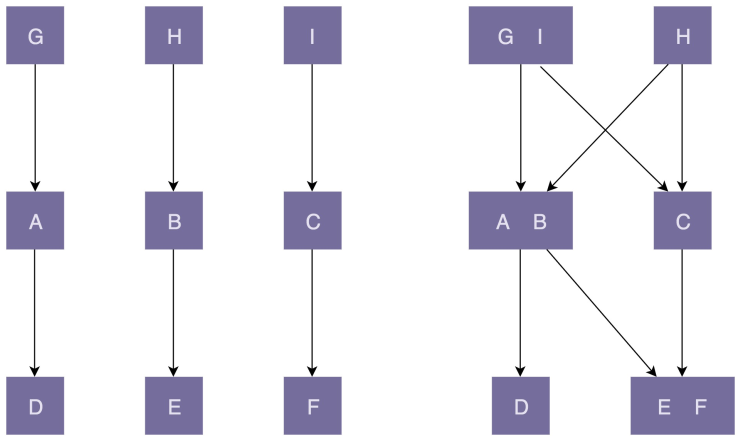

# 22理论八：如何用迪米特法则（LOD）实现「高内聚、松耦合」？

## 一、何为「高内聚、松耦合」？

**「高内聚、松耦合」是一个非常重要的设计思想，能够有效地提高代码的可读性和可维护性，缩小功能改动导致的代码改动范围。**很多设计原则都以实现代码的「高内聚、松耦合」为目的，比如单一职责原则、基于接口而非实现编程等。

实际上，「高内聚、松耦合」是一个比较通用的设计思想，可以用来指导不同粒度代码的设计与开发，比如系统、模块、类，甚至是函数，也可以应用到不同的开发场景中，比如微服务、框架、组件、类库等。为了方便我讲解，接下来我以「类」作为这个设计思想的应用对象来展开讲解，其他应用场景你可以自行类比。

在这个设计思想中，**「高内聚」用来指导类本身的设计，「松耦合」用来指导类与类之间依赖关系的设计**。高内聚有助于松耦合，松耦合又需要高内聚的支持。

### （一）「高内聚」和「松耦合」的含义

**高内聚：指相近的功能应该放到同一个类中，不相近的功能不要放到同一个类中**。相近的功能往往会被同时修改，放到同一个类中，修改会比较集中，代码容易维护。实际上，我们前面讲过的单一职责原则是实现代码高内聚非常有效的设计原则。

松耦合：在代码中，类与类之间的依赖关系简单清晰。即使两个类有依赖关系，一个类的代码改动不会或者很少导致依赖类的代码改动。实际上，我们前面讲的依赖注入、接口隔离、基于接口而非实现编程，以及今天讲的迪米特法则，都是为了实现代码的松耦合。

### （二）「内聚」和「耦合」之间的关系

「高内聚」有助于「松耦合」，同理，「低内聚」也会导致「紧耦合」。关于这一点，我画了一张对比图来解释。图中左边部分的代码结构是「高内聚、松耦合」；右边部分正好相反，是「低内聚、紧耦合」。



图中左边部分的代码设计中，**类的粒度比较小，每个类的职责都比较单一**。相近的功能都放到了一个类中，不相近的功能被分割到了多个类中。这样类更加独立，代码的内聚性更好。因为职责单一，所以每个类被依赖的类就会比较少，代码低耦合。一个类的修改，只会影响到一个依赖类的代码改动。我们只需要测试这一个依赖类是否还能正常工作就行了。

图中右边部分的代码设计中，类粒度比较大，低内聚，功能大而全，不相近的功能放到了一个类中。这就导致很多其他类都依赖这个类。当我们修改这个类的某一个功能代码的时候，会影响依赖它的多个类。我们需要测试这三个依赖类，是否还能正常工作。这也就是所谓 的「牵一发而动全身」。

除此之外，从图中我们也可以看出，高内聚、低耦合的代码结构更加简单、清晰，相应地，在可维护性和可读性上确实要好很多。

## 二、「迪米特法则」理论描述

迪米特法则（Law of Demeter，LOD）又名最小知识原则（The Least Knowledge Principle），该原则定义为：

> Each unit should have only limited knowledge about other units: only units 「closely」 related to the current unit. Or: Each unit should only talk to its friends; Don’t talk to stranger
>
> 每个模块（unit）只应该了解那些与它关系密切的模块（units: only units 「closely」 related to the current unit）的有限知识（knowledge）。或者说，每个模块只和自己的朋友「说话」（talk），不和陌生人「说话」（talk）。

下面结合我自己的理解和经验，对刚刚的定义重新描述一下。注意，为了统一讲解，我把定义描述中的「模块」替换成了「类」。

**不该有直接依赖关系的类之间，不要有依赖；有依赖关系的类之间，尽量只依赖必要的接口（即定义中的「有限知识」）**。

迪米特法则包含前后两部分，这两部分讲的是两件事情，用两个实战案例分别来解读一下。

## 三、理论解读与代码实战一

**「不该有直接依赖关系的类之间，不要有依赖」。**下面例子实现了简化版的搜索引擎爬取网页的功能，具体的代码实现如下所示：

```java
// NetworkTransporter 类负责底层网络通信，根据请求获取数据
public class NetworkTransporter {
    // 省略属性和其他方法...
    public Byte[] send(HtmlRequest htmlRequest) {
        //...
    }
} 

// HtmlDownloader 类用来通过 URL 获取网页
public class HtmlDownloader {
    // 通过构造函数或 IOC 注入
    private NetworkTransporter transporter;
    public Html downloadHtml(String url) {
        Byte[] rawHtml = transporter.send(new HtmlRequest(url));
        return new Html(rawHtml);
    }
} 

// Document 表示网页文档，后续的网页内容抽取、分词、索引都是以此为处理对象
public class Document {
    private Html html;
    private String url;
    public Document(String url) {
        this.url = url;
        HtmlDownloader downloader = new HtmlDownloader();
        this.html = downloader.downloadHtml(url);
    }
    //...
}
```

这段代码虽然「能用」，能实现我们想要的功能，但是它不够「好用」，有比较多的设计缺陷。

首先，NetworkTransporter 类作为一个底层网络通信类，其功能应该尽可能通用，而不只是服务于下载 HTML，所以不应该直接依赖太具体的发送对象 HtmlRequest。从这一点上讲，NetworkTransporter 类的设计违背迪米特法则，依赖了不该有直接依赖关系的 HtmlRequest 类。

应该如何进行重构让 NetworkTransporter 类满足迪米特法则呢？我这里有个形象的比喻。假如你现在要去商店买东西，你肯定不会直接把钱包给收银员，让收银员自己从里面拿钱，而是你从钱包里把钱拿出来交给收银员。这里的 HtmlRequest 对象就相当于钱包，HtmlRequest 里的 address 和 content 对象就相当于钱。**我们应该把 address 和content 交给 NetworkTransporter，而非是直接把 HtmlRequest 交给 NetworkTransporter**。根据这个思路，NetworkTransporter 重构之后的代码如下所示：

```java
public class NetworkTransporter {
    // 省略属性和其他方法...
    public Byte[] send(String address, Byte[] data) {
        //...
    }
}
```

**我们再来看 HtmlDownloader 类。**这个类的设计没有问题。不过，我们修改了 NetworkTransporter 的 send() 函数的定义，而这个类用到了 send() 函数，所以我们需要对它做相应的修改，修改后的代码如下所示：

```java
public class HtmlDownloader {
    // 通过构造函数或 IOC 注入
    private NetworkTransporter transporter;
    // HtmlDownloader 这里也要有相应的修改
    public Html downloadHtml(String url) {
        HtmlRequest htmlRequest = new HtmlRequest(url);
        Byte[] rawHtml = transporter.send(
            htmlRequest.getAddress(), htmlRequest.getContent().getBytes());
        return new Html(rawHtml);
    }
}
```

**最后，我们来看下 Document 类。**这个类的问题比较多，主要有三点。第一，构造函数中的 `downloader.downloadHtml()` 逻辑复杂，耗时长，不应该放到构造函数中，会影响代码的可测试性。代码的可测试性我们后面会讲到，这里你先知道有这回事就可以了。第二，HtmlDownloader 对象在构造函数中通过 new 来创建，违反了基于接口而非实现编程的设计思想，也会影响到代码的可测试性。第三，从业务含义上来讲，Document 网页文档没必要依赖 HtmlDownloader 类，违背了迪米特法则。

虽然 Document 类的问题很多，但修改起来比较简单，只要一处改动就可以解决所有问题。修改之后的代码如下所示：

```java
public class Document {
    private Html html;
    private String url;
    public Document(String url, Html html) {
        this.html = html;
        this.url = url;
    }
    //...
} 

// 通过一个工厂方法来创建 Document
public class DocumentFactory {
    private HtmlDownloader downloader;
    public DocumentFactory(HtmlDownloader downloader) {
        this.downloader = downloader;
    }
    public Document createDocument(String url) {
        Html html = downloader.downloadHtml(url);
        return new Document(url, html);
    }
}
```

## 四、理论解读与代码实战二

「有依赖关系的类之间，尽量只依赖必要的接口」。我们还是结合一个例子来讲解。下面这段代码非常简单，Serialization 类负责对象的序列化和反序列化。提醒你一下，有个类似的例子在之前的第 15 节课中讲过，你可以结合着一块儿看一下。

```java
public class Serialization {
    public String serialize(Object object) {
        String serializedResult = ...;
        //...
        return serializedResult;
    } 
    
    public Object deserialize(String str) {
        Object deserializedResult = ...;
        //...
        return deserializedResult;
    }
}
```

单看这个类的设计，没有一点问题。不过，如果我们把它放到一定的应用场景里，那就还有继续优化的空间。假设在我们的项目中，有些类只用到了序列化操作，而另一些类只用到反序列化操作。那基于迪米特法则后半部分「有依赖关系的类之间，尽量只依赖必要的接口」，只用到序列化操作的那部分类不应该依赖反序列化接口。同理，只用到反序列化操作的那部分类不应该依赖序列化接口。

根据这个思路，我们应该将 Serialization 类拆分为两个更小粒度的类，一个只负责序列化（Serializer 类），一个只负责反序列化（Deserializer 类）。拆分之后，使用序列化操作的类只需要依赖 Serializer 类，使用反序列化操作的类只需要依赖 Deserializer 类。拆分之后的代码如下所示：

```java
public class Serializer {
    public String serialize(Object object) {
        String serializedResult = ...;
        //...
        return serializedResult;
    }
}

public class Deserializer {
    public Object deserialize(String str) {
        Object deserializedResult = ...;
        // ...
        return deserializedResult;
    }
}
```

不知道你有没有看出来，尽管**拆分之后的代码更能满足迪米特法则，但却违背了高内聚的设计思想**。高内聚要求相近的功能要放到同一个类中，这样可以方便功能修改的时候，修改的地方不至于过于分散。对于刚刚这个例子来说，如果我们修改了序列化的实现方式，比如从 JSON 换成了 XML，那反序列化的实现逻辑也需要一并修改。在未拆分的情况下，我们只需要修改一个类即可。在拆分之后，我们需要修改两个类。显然，这种设计思路的代码改动范围变大了。

**如果我们既不想违背高内聚的设计思想，也不想违背迪米特法则，那我们该如何解决这个问题呢？实际上，通过引入两个接口就能轻松解决这个问题**，具体的代码如下所示。实际上， 在第 18 节课中讲到「接口隔离原则」的时候，第三个例子就使用了类似的实现思路，可以结合着一块儿来看。

```java
public interface Serializable {
    String serialize(Object object);
} 

public interface Deserializable {
    Object deserialize(String text);
} 

public class Serialization implements Serializable, Deserializable {
    @Override
    public String serialize(Object object) {
        String serializedResult = ...;
        // ...
        return serializedResult;
    } 
    
    @Override
    public Object deserialize(String str) {
        Object deserializedResult = ...;
        // ...
        return deserializedResult;
    }
} 

public class DemoClass_1 {
    private Serializable serializer;
    public Demo(Serializable serializer) {
        this.serializer = serializer;
    }
    //...
}

public class DemoClass_2 {
    private Deserializable deserializer;
    public Demo(Deserializable deserializer) {
        this.deserializer = deserializer;
    }
    //...
}
```

**尽管我们还是要往 DemoClass_1 的构造函数中，传入包含序列化和反序列化的 Serialization 实现类，但是，我们依赖的 Serializable 接口只包含序列化操作，DemoClass_1 无法使用 Serialization 类中的反序列化接口，对反序列化操作无感知，这也就符合了迪米特法则后半部分所说的「依赖有限接口」的要求。**

实际上，上面的的代码实现思路，也体现了「基于接口而非实现编程」的设计原则，结合迪米特法则，我们可以总结出一条新的设计原则，那就是「基于最小接口而非最大实现编程」。有些同学之前问，新的设计模式和设计原则是怎么创造出来的，实际上，就是在大量的实践中，针对开发痛点总结归纳出来的套路。

## 五、辩证思考与灵活应用

对于实战二最终的设计思路，你有没有什么不同的观点呢？

整个类只包含序列化和反序列化两个操作，只用到序列化操作的使用者，即便能够感知到仅有的一个反序列化函数，问题也不大。那为了满足迪米特法则，我们将一个非常简单的类，拆分出两个接口，是否有点过度设计的意思呢？

设计原则本身没有对错，只有能否用对之说。不要为了应用设计原则而应用设计原则，我们在应用设计原则的时候，一定要具体问题具体分析。

对于刚刚这个 Serialization 类来说，只包含两个操作，确实没有太大必要拆分成两个接口。但是，如果我们对 Serialization 类添加更多的功能，实现更多更好用的序列化、反序列化函数，我们来重新考虑一下这个问题。修改之后的具体的代码如下：

```java
public class Serializer { 
    // 参看 JSON 的接口定义
    public String serialize(Object object) { 
        //... 
    }
    public String serializeMap(Map map) { 
        //... 
    }
    public String serializeList(List list) { 
        //... 
    }
    public Object deserialize(String objectString) { 
        //... 
    }
    public Map deserializeMap(String mapString) { 
        //... 
    }
    public List deserializeList(String listString) { 
        //... 
    }
}
```

在这种场景下，第二种设计思路要更好些。因为基于之前的应用场景来说，大部分代码只需要用到序列化的功能。对于这部分使用者，没必要了解反序列化的「知识」，而修改之后的 Serialization 类，反序列化的「知识」，从一个函数变成了三个。一旦任一反序列化操作有代码改动，我们都需要检查、测试所有依赖 Serialization 类的代码是否还能正常工作。 为了减少耦合和测试工作量，我们应该按照迪米特法则，将反序列化和序列化的功能隔离开来。

## 重点回顾

好了，今天的内容到此就讲完了。我们一块来总结回顾一下，你需要掌握的重点内容。

### 如何理解「高内聚、松耦合」？

「高内聚、松耦合」是一个非常重要的设计思想，能够有效提高代码的可读性和可维护性， 缩小功能改动导致的代码改动范围。「高内聚」用来指导类本身的设计，「松耦合」用来指导类与类之间依赖关系的设计。

所谓高内聚，就是指相近的功能应该放到同一个类中，不相近的功能不要放到同一类中。相近的功能往往会被同时修改，放到同一个类中，修改会比较集中。所谓松耦合指的是，在代码中，类与类之间的依赖关系简单清晰。即使两个类有依赖关系，一个类的代码改动也不会或者很少导致依赖类的代码改动。

### 如何理解「迪米特法则」？

不该有直接依赖关系的类之间，不要有依赖；有依赖关系的类之间，尽量只依赖必要的接 口。迪米特法则是希望减少类之间的耦合，让类越独立越好。每个类都应该少了解系统的其他部分。一旦发生变化，需要了解这一变化的类就会比较少。

## 课堂讨论

在今天的讲解中，我们提到了「高内聚、松耦合」「单一职责原则」「接口隔离原则」「基于接口而非实现编程」「迪米特法则」，你能总结一下它们之间的区别和联系吗？

欢迎在留言区写下你的答案，和同学一起交流和分享。如果有收获，也欢迎你把这篇文章分享给你的朋友。

### 精选留言

- 目的都是实现高内聚低耦合，但是出发的角度不一样，单一职责是从自身提供的功能出发，迪米特法则是从关系出发，针对接口而非实现编程是使用者的角度，殊途同归。

- 关 于 LoD，请记住一条：方法中不要使用 ChainMethods。坏的实践：

  Amount = customer.orders().last().totals().amount() 和…

- 「单一职责原则」「接口隔离原则」「基于接口而非实现编程」「迪米特法则」都是为了实现 「高内聚、低耦合」的手段。做到了接口隔离，一般情况下职责也比较单一，基于接口而非实现编程，往往也会降低耦合性。有的时候使用了迪米特法则或者单一职责原则， 可能会破坏高内聚原则，这种情况就要具体分析场景，以及使用接口来实现。

- 接口隔离感觉就是为了迪米特法则的应用，接口隔离开不需要依赖的类，只引入需要的接口和方法。

  高内聚低耦合，是针对具体的实现类的，实现类实现多个接口，相似的功能都在同一个实现类中完成。…

- 我认为所有的设计原则和设计模式都是为了达到高内聚、松耦合的目的，而设计原则是指导思想，设计模式是前人根据设计原则再结合常见痛点得出的具体落地方案。

  按照指导思想设计出来的代码就是会符合高内聚、松耦合。

- 高内聚:指将将相近的功能封装在一个类或者模块中，不要包含语义不相干的功能，是类或者模块本身的设计原则

  松耦合:是模块与模块、类与类之间的依赖关系。依赖的模块只包含我依赖的功能，没有附件功能。尽量让依赖关系成线性。
