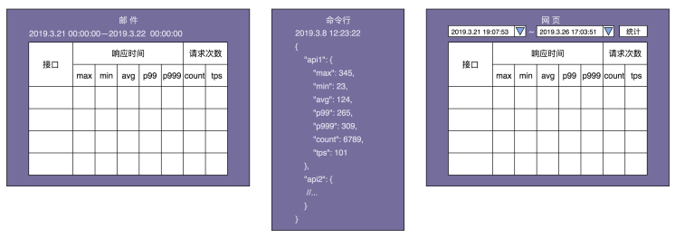
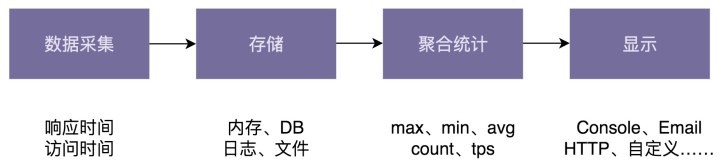

# 25实战二（上）：针对非业务的通用框架开发，如何做需求分析和设计？

上两节课中，我们讲了如何针对一个业务系统做需求分析、设计和实现，并且通过一个积分

兑换系统的开发，实践了之前学过的一些设计原则。接下来的两节课，我们再结合一个支持各种统计规则的性能计数器项目，学习针对一个非业务的通用框架开发，如何来做需求分 析、设计和实现，同时学习如何灵活应用各种设计原则。

## 一、项目背景

我们希望设计开发一个小的框架，能够获取接口调用的各种统计信息，比如，响应时间的最大值（max）、最小值（min）、平均值（avg）、百分位值（percentile）、接口调用次 数（count）、频率（tps） 等，并且支持将统计结果以各种显示格式（比如：JSON 格式、网页格式、自定义显示格式等）输出到各种终端（Console 命令行、HTTP 网页、Email、日志文件、自定义输出终端等），以方便查看。

我们假设这是真实项目中的一个开发需求，如果让你来负责开发这样一个通用的框架，应用到各种业务系统中，支持实时计算、查看数据的统计信息，你会如何设计和实现呢？你可以先自己主动思考一下，然后再来看我的分析思路。

## 二、需求分析

性能计数器作为一个跟业务无关的功能，我们完全可以把它开发成一个独立的框架或者类 库，集成到很多业务系统中。而作为可被复用的框架，除了功能性需求之外，非功能性需求也非常重要。所以，接下来，我们从这两个方面来做需求分析。

### （一）功能性需求分析

相对于一大长串的文字描述，人脑更容易理解短的、罗列的比较规整、分门别类的列表信息。显然，刚才那段需求描述不符合这个规律。我们需要把它拆解成一个一个的“干条 条”。拆解之后我写在下面了，是不是看起来更加清晰、有条理？

- 接口统计信息：包括接口响应时间的统计信息，以及接口调用次数的统计信息等。统计信息的类型：max、min、avg、percentile、count、tps 等。

- 统计信息显示格式：Json、Html、自定义显示格式。

- 统计信息显示终端：Console、Email、HTTP 网页、日志、自定义显示终端。

除此之外，我们还可以借助设计产品的时候，经常用到的线框图，把最终数据的显示样式画出来，会更加一目了然。具体的线框图如下所示：



实际上，从线框图中，我们还能挖掘出了下面几个隐藏的需求。

统计触发方式：包括主动和被动两种。主动表示以一定的频率定时统计数据，并主动推送到显示终端，比如邮件推送。被动表示用户触发统计，比如用户在网页中选择要统计的时间区间，触发统计，并将结果显示给用户。

统计时间区间：框架需要支持自定义统计时间区间，比如统计最近 10 分钟的某接口的 tps、访问次数，或者统计 12 月 11 日 00 点到 12 月 12 日 00 点之间某接口响应时间的最大值、最小值、平均值等。

统计时间间隔：对于主动触发统计，我们还要支持指定统计时间间隔，也就是多久触发一次统计显示。比如，每间隔 10s 统计一次接口信息并显示到命令行中，每间隔 24 小时发送一封统计信息邮件。

### （二）非功能性需求分析

对于这样一个通用的框架的开发，我们还需要考虑很多非功能性的需求。具体来讲，我总结了以下几个比较重要的方面。

- 易用性

  易用性听起来更像是一个评判产品的标准。没错，我们在开发这样一个技术框架的时候，也要有产品意识。框架是否易集成、易插拔、跟业务代码是否松耦合、提供的接口是否够灵活等等，都是我们应该花心思去思考和设计的。有的时候，文档写得好坏甚至都有可能决定一个框架是否受欢迎。

- 性能

  对于需要集成到业务系统的框架来说，我们不希望框架本身的代码执行效率，对业务系统有太多性能上的影响。对于性能计数器这个框架来说，一方面，我们希望它是低延迟的，也就是说，统计代码不影响或很少影响接口本身的响应时间；另一方面，我们希望框架本身对内存的消耗不能太大。

- 扩展性

  这里说的扩展性跟之前讲到的代码的扩展性有点类似，都是指在不修改或尽量少修改代码的情况下添加新的功能。但是这两者也有区别。之前讲到的扩展是从框架代码开发者的角度来说的。这里所说的扩展是从框架使用者的角度来说的，特指使用者可以在不修改框架源码， 甚至不拿到框架源码的情况下，为框架扩展新的功能。这就有点类似给框架开发插件。关于这一点，我举一个例子来解释一下。

feign 是一个 HTTP 客户端框架，我们可以在不修改框架源码的情况下，用如下方式来扩展我们自己的编解码方式、日志、拦截器等。

```java
Feign feign = Feign.builder()
    .logger(new CustomizedLogger())
    .encoder(new FormEncoder(new JacksonEncoder()))
    .decoder(new JacksonDecoder())
    .errorDecoder(new ResponseErrorDecoder())
    .requestInterceptor(new RequestHeadersInterceptor()).build();

public class RequestHeadersInterceptor implements RequestInterceptor {
    @Override
    public void apply(RequestTemplate template) {
        template.header("appId", "...");
        template.header("version", "...");
        template.header("timestamp", "...");
        template.header("token", "...");
        template.header("idempotent-token", "...");
        template.header("sequence-id", "...");
    }
}
public class CustomizedLogger extends feign.Logger {
    //...
} 
public class ResponseErrorDecoder implements ErrorDecoder {
    @Override
    public Exception decode(String methodKey, Response response) {
        //...
    }
}
```

- 容错性

  容错性这一点也非常重要。对于性能计数器框架来说，不能因为框架本身的异常导致接口请求出错。所以，我们要对框架可能存在的各种异常情况都考虑全面，对外暴露的接口抛出的所有运行时、非运行时异常都进行捕获处理。

- 通用性

  为了提高框架的复用性，能够灵活应用到各种场景中。框架在设计的时候，要尽可能通用。我们要多去思考一下，除了接口统计这样一个需求，还可以适用到其他哪些场景中，比如是否还可以处理其他事件的统计信息，比如 SQL 请求时间的统计信息、业务统计信息（比如支付成功率）等。

## 三、框架设计

前面讲了需求分析，现在我们来看如何针对需求做框架设计。

对于稍微复杂系统的开发，很多人觉得不知从何开始。我个人喜欢借鉴 TDD（测试驱动开发）和 Prototype（最小原型）的思想，先聚焦于一个简单的应用场景，基于此设计实现一个简单的原型。尽管这个最小原型系统在功能和非功能特性上都不完善，但它能够看得 见、摸得着，比较具体、不抽象，能够很有效地帮助我缕清更复杂的设计思路，是迭代设计的基础。

这就好比做算法题目。当我们想要一下子就想出一个最优解法时，可以先写几组测试数据， 找找规律，再先想一个最简单的算法去解决它。虽然这个最简单的算法在时间、空间复杂度上可能都不令人满意，但是我们可以基于此来做优化，这样思路就会更加顺畅。

对于性能计数器这个框架的开发来说，我们可以先聚焦于一个非常具体、简单的应用场景， 比如统计用户注册、登录这两个接口的响应时间的最大值和平均值、接口调用次数，并且将

统计结果以 JSON 的格式输出到命令行中。现在这个需求简单、具体、明确，设计实现起来难度降低了很多。

我们先给出应用场景的代码。具体如下所示：

```java
// 应用场景：统计下面两个接口 (注册和登录）的响应时间和访问次数
public class UserController {
public void register(UserVo user) {
//...
} 
    public UserVo login(String telephone, String password) {
//...
}
}
```

要输出接口的响应时间的最大值、平均值和接口调用次数，我们首先要采集每次接口请求的响应时间，并且存储起来，然后按照某个时间间隔做聚合统计，最后才是将结果输出。在原型系统的代码实现中，我们可以把所有代码都塞到一个类中，暂时不用考虑任何代码质量、线程安全、性能、扩展性等等问题，怎么简单怎么来就行。

最小原型的代码实现如下所示。其中，recordResponseTime() 和 recordTimestamp() 两个函数分别用来记录接口请求的响应时间和访问时间。startRepeatedReport() 函数以指定的频率统计数据并输出结果。

```java
public class Metrics {
    // Map 的 key 是接口名称，value 对应接口请求的响应时间或时间戳；
    private Map<String, List<Double>> responseTimes = new HashMap<>();
    private Map<String, List<Double>> timestamps = new HashMap<>();
    private ScheduledExecutorService executor = Executors.newSingleThreadSchedule
        public void recordResponseTime(String apiName, double responseTime) {
        responseTimes.putIfAbsent(apiName, new ArrayList<>());
        responseTimes.get(apiName).add(responseTime);
    } 
    
    public void recordTimestamp(String apiName, double timestamp) {
        timestamps.putIfAbsent(apiName, new ArrayList<>());
        timestamps.get(apiName).add(timestamp);
    }
    
    public void startRepeatedReport(long period, TimeUnit unit){
        executor.scheduleAtFixedRate(new Runnable() {
            @Override
            public void run() {
                Gson gson = new Gson();
                Map<String, Map<String, Double>> stats = new HashMap<>();
                for (Map.Entry<String, List<Double>> entry : responseTimes.entrySet()){
                    String apiName = entry.getKey();
                    List<Double> apiRespTimes = entry.getValue();
                    stats.putIfAbsent(apiName, new HashMap<>());
                    stats.get(apiName).put("max", max(apiRespTimes));
                    stats.get(apiName).put("avg", avg(apiRespTimes));
                } 
                for (Map.Entry<String, List<Double>> entry : timestamps.entrySet()) {
                    String apiName = entry.getKey();
                    List<Double> apiTimestamps = entry.getValue();
                    stats.putIfAbsent(apiName, new HashMap<>());
                    stats.get(apiName).put("count", (double)apiTimestamps.size());
                }
                System.out.println(gson.toJson(stats));
            }
        }, 0, period, unit);
    } 
    
    private double max(List<Double> dataset) {
        // 省略代码实现
    }
    
    private double avg(List<Double> dataset) {
        // 省略代码实现
    }
}
```

我们通过不到 50 行代码就实现了最小原型。接下来，我们再来看，如何用它来统计注册、登录接口的响应时间和访问次数。具体的代码如下所示：

```java
// 应用场景：统计下面两个接口 (注册和登录）的响应时间和访问次数
public class UserController {
    private Metrics metrics = new Metrics();
    public UserController() {
        metrics.startRepeatedReport(60, TimeUnit.SECONDS);
    } 

    public void register(UserVo user) {
        long startTimestamp = System.currentTimeMillis();
        metrics.recordTimestamp("regsiter", startTimestamp);
        //...
        long respTime = System.currentTimeMillis() - startTimestamp;
        metrics.recordResponseTime("register", respTime);
    } 

    public UserVo login(String telephone, String password) {
        long startTimestamp = System.currentTimeMillis();
        metrics.recordTimestamp("login", startTimestamp);
        //...
        long respTime = System.currentTimeMillis() - startTimestamp;
        metrics.recordResponseTime("login", respTime);
    }
}
```

最小原型的代码实现虽然简陋，但它却帮我们将思路理顺了很多，我们现在就基于它做最终的框架设计。下面是我针对性能计数器框架画的一个粗略的系统设计图。图可以非常直观地体现设计思想，并且能有效地帮助我们释放更多的脑空间，来思考其他细节问题。



如图所示，我们把整个框架分为四个模块：数据采集、存储、聚合统计、显示。每个模块负责的工作简单罗列如下。

数据采集：负责打点采集原始数据，包括记录每次接口请求的响应时间和请求时间。数据采集过程要高度容错，不能影响到接口本身的可用性。除此之外，因为这部分功能是暴露给框架的使用者的，所以在设计数据采集 API 的时候，我们也要尽量考虑其易用 性。

存储：负责将采集的原始数据保存下来，以便后面做聚合统计。数据的存储方式有多 种，比如：Redis、MySQL、HBase、日志、文件、内存等。数据存储比较耗时，为了尽量地减少对接口性能（比如响应时间）的影响，采集和存储的过程异步完成。

聚合统计：负责将原始数据聚合为统计数据，比如：max、min、avg、pencentile、count、tps 等。为了支持更多的聚合统计规则，代码希望尽可能灵活、可扩展。

显示：负责将统计数据以某种格式显示到终端，比如：输出到命令行、邮件、网页、自定义显示终端等。

前面讲到面向对象分析、设计和实现的时候，我们讲到设计阶段最终输出的是类的设计，同时也讲到，软件设计开发是一个迭代的过程，分析、设计和实现这三个阶段的界限划分并不明显。所以，今天我们只给出了比较粗略的模块划分，至于更加详细的设计，我们留在下一节课中跟实现一块来讲解。

## 重点回顾

今天的内容到此就讲完了。我们来一起总结回顾一下，你需要掌握的重点内容。

对于非业务通用框架的开发，我们在做需求分析的时候，除了功能性需求分析之外，还需要考虑框架的非功能性需求。比如，框架的易用性、性能、扩展性、容错性、通用性等。

对于复杂框架的设计，很多人往往觉得无从下手。今天我们分享了几个小技巧，其中包括： 画产品线框图、聚焦简单应用场景、设计实现最小原型、画系统设计图等。这些方法的目的都是为了让问题简化、具体、明确，提供一个迭代设计开发的基础，逐步推进。

实际上，不仅仅是软件设计开发，不管做任何事情，如果我们总是等到所有的东西都想好了再开始，那这件事情可能永远都开始不了。有句老话讲：万事开头难，所以，先迈出第一步很重要。

## 课堂讨论

今天的课堂讨论题有下面两道。

1.  应对复杂系统的设计实现，我今天讲到了聚焦简单场景、最小原型、画图等几个技巧， 你还有什么经验可以分享给大家吗？

2.  今天提到的线框图、最小原型、易用性等，实际上都是产品设计方面的手段或者概念， 应用到像框架这样的技术产品的设计上也非常有用。你觉得对于一个技术人来说，产品能力是否同样重要呢？技术人是否应该具备一些产品思维呢？

欢迎在留言区写下你的答案，和同学一起交流和分享。如果有收获，也欢迎你把这篇文章分享给你的朋友。

### 精选留言

- 没有经历过大型系统的全过程（设计，开发，实现，维护）。自己开发一些功能时，比较喜欢“用户故事”，这样能基本能做到一次交付一个可用功能。干就是了！先有一个原型，然后再迭代优化。最后“纸上得来终觉浅”，照着争哥的代码还是自己实现了一下：https://github.com/gdhucoder/Algorithms4/tree/master/designpattern/u025

- 老师，本文中的案例统计时间时对业务代码是侵入式的，有没有非侵入式的案例呀？

  作者回复: 可以使用类似spring aop 做到无侵入

- 一直没有做过关于统计和监控的项目，希望老师可以出一个小的MVP🙏🙏🙏

  作者回复: 39 40讲 会给出完善的代码

- 感谢争哥分享，先看了第一段过来作答，完了再回到文章验证想法。统计接口各维度信息的框架设计思路如下，

  1，确认框架职责，框架的用例。采集原始数据(标准埋点日志)，加工原始数据(时间窗口内)，提供外围消费(适配各种style)

  2\. 细分每一职责，采集原始数据，围绕框架提供能力，确定原始数据标准，甚至原始数…

- 像这种统计频次的功能，是通过集成框架去实现好，还是说通过mq由消费服务去实现好

- 使用线框图，采用最小原型模式，先做出一个模型，画出模型图，然后再迭代优化，使抽象的东西变得看得见摸得着，这确实是一个好方法，实际项目中也不知不觉用到了这种思想，做非业务类的需求如此，业务类的也一样。还有留言里说的用户故事也是很不错的方法，通俗点就是技术要有产品的思维，站在使用者的角度看问题。

- 还没有看文章的方案，先来留个言：

  运行时：框架的接口是注解；通过mq将统计的数据发出到实时计算引擎例如flink，编写udf统计各种特征数据

  管理时：核心是数据存储和查询模块；渠道接入放在独立的模块

- 没有经历过特别复杂的系统。一般工作中遇到需求，第一步是做业务分解和用户故事。将一个功能分解成一个个小任务，理清楚每个小任务之间的关联关系。任务分解清晰之后可以用tdd的方式实现一个最小原型版本，然后在这个最小原型的版本上面持续重构。

  问题2我觉得技术肯定还是要懂产品的，毕竟产品才是公司最需要的东西，有产品能力的技术才能在很多编码和设计的时候让产品更容易扩展。

- 我觉得技术人需要一些产品的思维，这样即使在做已经设计好的产品的时候，也能提出一些不同的看法和见解，而不是一味的做一个执行者，别人说啥就做啥，而且框架的设计我觉得也是一个产品，需要我们技术人自己去推敲去打磨。

- 问题1: 1.1一般会画一下用例图，标注一下优先级，然后针对核心用例，简化它，不要考虑太多个性化的东西。先实现最通用简单的一个场景。

  1.2 流程很复杂的时候，会画流程图，泳道流程图，一方面可以很清楚查漏补缺，另一方面泳道就划分了模块。…

- 1.应对复杂系统的设计实现，我今天讲到了聚焦简单场景、最小原型、画图等几个技巧， 你还有什么经验可以分享给大家吗？

  找个类似的系统多体验几把. 平时多积累各种业务背景知识.

  有条件的可以找有经验的前辈了解业务,快速得到一个业务模型.…

- 1.都提了tdd怎么能少掉测试代码的编写呢。哪怕是最小原型，也要尽量区分好稳定层和变化层，然后针对变化层构建完整的测试用例。这对后续持续重构或则迭代功能都能发挥回归测试的价值。回归测试有助于进一步降低写代码时的心智负担，写好跑一跑，有问题de bug调整下，而不是每一步都用意念测试。省时省心安全。

- 我觉得拥有产品思维对一个开发者来说非常重要,不但工作中更有利于与其它岗位的人员交流,而且如果做独立开发作用也是极大的.

- 1\. 自己没有做过特别复杂的系统，开发的项目时做需求分析和系统设计，一般是从典型的User Story开始，使用TDD，持续重构，版本迭代的思想一步步来做，一开始就把功能拆小，然后使用组合思维，看要不要某些功能聚合在一起；尽可能分离稳定的需求和变化的需求，后来接触了 DDD 的战略设计和战术设计，确实也很有帮助：不断深入理解业务的基础上，去划分不同上下文，定义通用语言，再结合一些战术技巧进行落地，最重要的…
