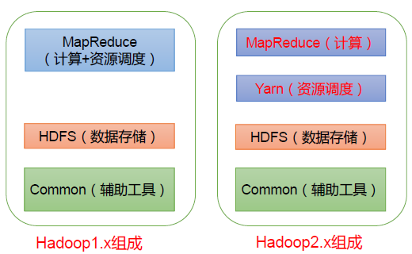
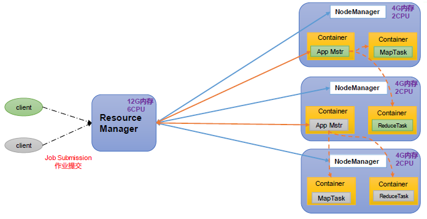
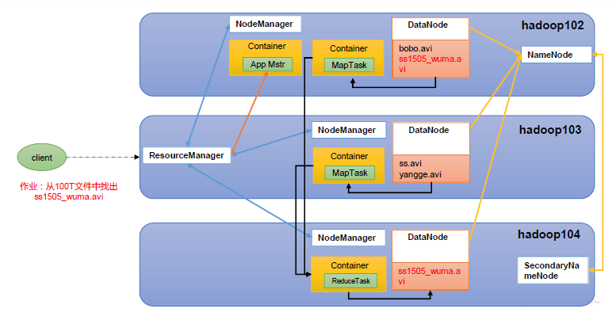
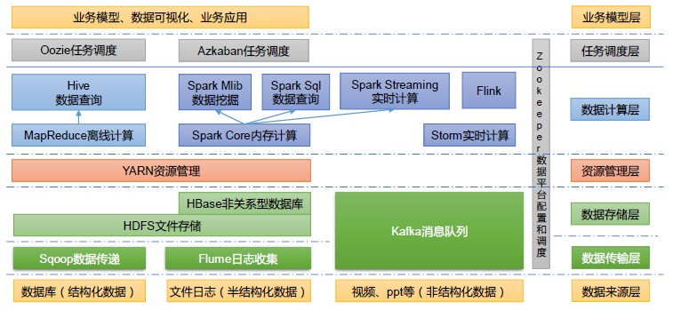

# 尚硅谷大数据技术之Hadoop（入门概述）

[TOC]


## 一、Hadoop 概述

Hadoop 是一个由 Apache 基金会所开发的**分布式系统基础架构**。主要解决海量数据的存储和海量数据的分析计算问题。广义上来说，Hadoop 通常是指一个更广泛的概念——Hadoop 生态圈。

Hadoop 优势

- 高可靠性：Hadoop 底层维护多个数据副本，所以即使 Hadoop 某个计算元素或存储出现故障，也不会导致数据的丢失。
- 高扩展性：在集群间分配任务数据，可方便的扩展数以千计的节点。可以动态增加服务器
- 高效性：在 MapReduce 的思想下，Hadoop 是并行工作的，以加快任务处理速度。
- 高容错性：能够自动将失败的任务重新分配。

### 1.5 Hadoop 组成（面试重点）


在Hadoop1.x 时代，Hadoop 中的 MapReduce 同时处理业务逻辑运算和资源的调度，耦合性较大。
在Hadoop2.x时代，增加了Yarn。Yarn只负责资源的调度，MapReduce 只负责运算。
Hadoop3.x在组成上没有变化。

### 1.5.1 HDFS 架构概述

Hadoop Distributed File System，简称HDFS，是一个分布式文件系统。
HDFS架构概述

- NameNode（nn）：存储文件的元数据，如文件名，文件目录结构，文件属性（生成时间、副本数、
    文件权限），以及每个文件的块列表和块所在的 DataNode 等。
- DataNode(dn)：在本地文件系统**存储文件块数据**，以及块数据的校验和。
- Secondary NameNode(2nn)：每隔一段时间对 NameNode 元数据备份。

### 1.5.2 YARN 架构概述

Yet Another Resource Negotiator 简称YARN ，另一种资源协调者，是Hadoop 的资源管理器，主要管理 CPU 和内存。

- ResourceManager（RM）：整个集群资源（内存、CPU等）的老大
- NodeManager（NM）：单个节点服务器资源老大
- ApplicationMaster（AM）：单个任务运行的老大
- Container：容器，相当一台独立的服务器，里面封装了
    任务运行所需要的资源，如内存、CPU、磁盘、网络等。



说明1：客户端可以有多个
说明2：集群上可以运行多个ApplicationMaster
说明3：每个NodeManager上可以有多个Container

### 1.5.3 MapReduce 架构概述

MapReduce 将计算过程分为两个阶段：Map 和 Reduce

- Map 阶段并行处理输入数据
- Reduce 阶段对 Map 结果进行汇总

### HDFS、YARN、MapReduce三者关系



### 大数据技术生态体系



图中涉及的技术名词解释如下：

- Sqoop：Sqoop 是一款开源的工具，主要用于在Hadoop、Hive 与传统的数据库（MySQL）
    间进行数据的传递，可以将一个关系型数据库（例如 ：MySQL，Oracle 等）中的数据导进
    到Hadoop 的HDFS 中，也可以将HDFS 的数据导进到关系型数据库中。
- Flume：Flume 是一个高可用的，高可靠的，分布式的海量日志采集、聚合和传输的系统，
    Flume 支持在日志系统中定制各类数据发送方，用于收集数据；
- Kafka：Kafka 是一种高吞吐量的分布式发布订阅消息系统；

- Spark：Spark 是当前最流行的开源大数据内存计算框架。可以基于Hadoop 上存储的大数
    据进行计算。
- Flink：Flink 是当前最流行的开源大数据内存计算框架。用于实时计算的场景较多。
- Oozie：Oozie 是一个管理Hadoop 作业（job）的工作流程调度管理系统。
- Hbase：HBase 是一个分布式的、面向列的开源数据库。HBase 不同于一般的关系数据库，
    它是一个适合于非结构化数据存储的数据库。
- Hive：Hive 是基于Hadoop 的一个数据仓库工具，可以将结构化的数据文件映射为一张
    数据库表，并提供简单的SQL 查询功能，可以将SQL 语句转换为MapReduce 任务进行运
    行。其优点是学习成本低，可以通过类SQL 语句快速实现简单的MapReduce 统计，不必开
    发专门的MapReduce 应用，十分适合数据仓库的统计分析。
- ZooKeeper：它是一个针对大型分布式系统的可靠协调系统，提供的功能包括：配置维护、
    名字服务、分布式同步、组服务等。

## 第2 章 Hadoop 运行环境搭建（开发重点）

针对 IP 地址修改

VMware：「编辑」-》「虚拟网络编辑器」=》选择「VMnet8」，然后将其子网 IP 修改为：192.168.10.0，同时将其「NAT设置」为：192.168.10.2；

Windows 主机：将「网络连接」里面的 VMnet8 的 「Internet 协议版本4」里面的「默认网关」同样修改为：192.168.10.2；然后 DNS，一个配置 192.168.10.2，另一个 8.8.8.8 即可。

然后在 Centos 中设置：命令：`sudo vim /etc/sysconfig/network-scripts/ifcfg-ens33`

首先将文件中的 `BOOTPROTO` 的值从 dhcp 修改为 static，即设置静态的 IP。同时在文件最后添加如下信息：

```shell
# IP 地址
IPADDR=192.168.10.100
# 网关
GATEWAY=192.168.10.2
# 域名解析器
DNS1=192.168.10.2
```

为了方便，将 `/etc/hostname` 中的主机值修改为 hadoop100。

添加主机 IP 映射，在 `/etc/hosts` 中新增如下信息：

```shell
192.168.10.100  hadoop100
192.168.10.101  hadoop101
192.168.10.102  hadoop102
192.168.10.103  hadoop103
192.168.10.104  hadoop104
192.168.10.105  hadoop105
192.168.10.106  hadoop106
192.168.10.107  hadoop107
192.168.10.108  hadoop108
```

然后 `reboot` 重启一下即可。

然后通过 `ifconfig` 查看一下 IP 地址，然后 ping 一下百度看能否成功。

