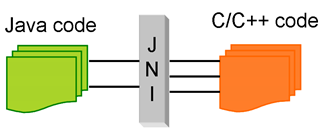
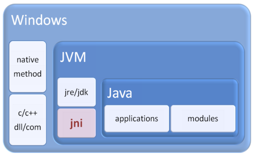
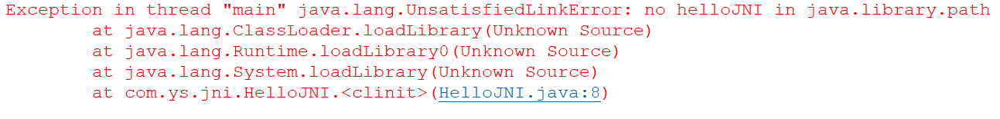
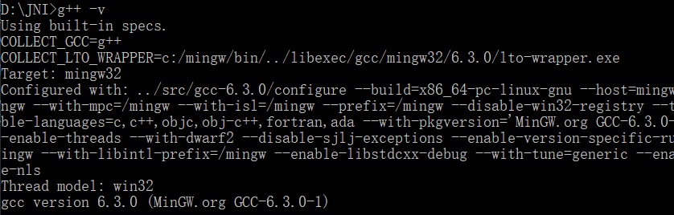
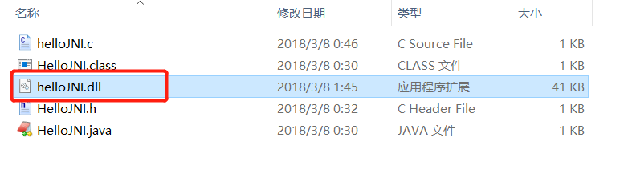
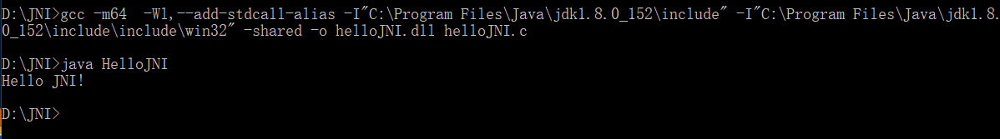
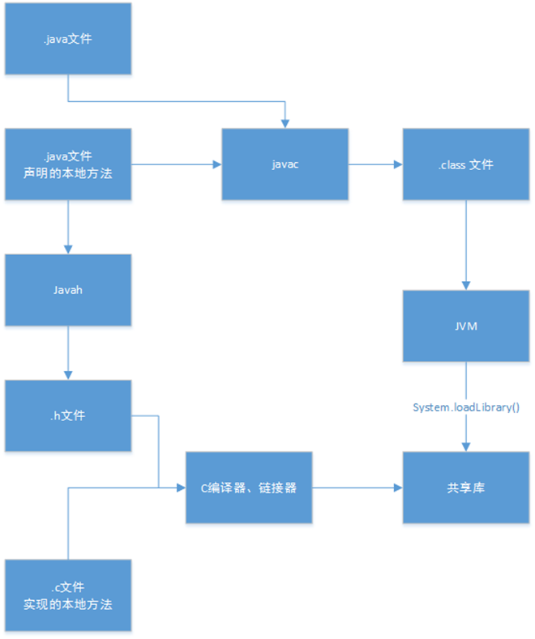

# Java常用API

@toc

### 一、Object对象

面向对象的核心思想:“找合适的对象，做适合的事情”。

合适的对象：

1. 自己描述类，自己创建对象。
2. sun已经描述了好多常用的类，可以使用这些类创建对象。
    API（Application Program Interface）

 sun定义的那么多类的终极父类是Object。Object描述的是所有类的通用属性与方法。

## （一） toString方法以及重写

```java
public static void main(String[] args){
  Object o = new Object();
  System.out.println(o); //java.lang.Object@de6ced
}
```

toString() 返回对象的描述信息 java.lang.Object@de6ced 类名@哈希码值的十六进制形式。
直接输入一个对象的时候，会调用对象的toString方法。

练习：自定义一个Person类，打印该对象的描述信息，要求描述信息为：姓名 — 年龄

```java
class Person{
	int age;
	String name;

	public Person() {
	}
	
	public Person(int age, String name){
		this.age = age;
		this.name = name;
	}
	
}

public class Demo {
	public static void main(String[] args) {
		Person person = new Person();
		System.out.println(person); //对象的描述信息 study.Person@311d617d
	}
}
```

问题：调用person 的toString方法时，打印出来的信息是`类名+内存地址值`。不符合要求。根据我们之前学的继承，假如父类的指定的功能不能满足要求，那么子类可以复写父类的功能函数。那么该对象再调用toString()方法时，则会调用子类复写的toString方法。

```java
//tostring方法重写
class Person{
	int age;
	String name;

	public Person() {
	}
	
	public Person(int age, String name){
		this.age = age;
		this.name = name;
	}
	
  //可以使用Alt + shift + s 然后generate toString 
	@Override
	public String toString() {
		return "Person [age=" + this.age + ", name=" + this.name + "]";
	}
	
}
```


**编程习惯:** 开发者要对自定义的类重写toString()，对对象做详细的说明


## （二） equals方法

**equals()** 返回的是比较的结果  如果相等返回true，否则false，比较的是对象的内存地址值。

```java
public static void main(String[] args){
  Object o1 = new Object();
  Object o2 = new Object();
  System.out.println(o1.equals(o2)); //false
}

public static void main(String[] args){
  Object o1 = new Object();
  Object o2 = o1;
  System.out.println(o1.equals(o2)); //true
}
```

问题：比较两个人是否是同一个人，根据两个人的名字判断。

**问题：** 如果根据名字去作为判断两个人是否是同一个时，明显p与p1是同一个人，但是程序输入却不是同一个人。不符合我们现实生活的要求。

**解决:** 根据我们学的继承中的函数复写，如果父类的函数不能满足我们目前的要求，那么就可以在子类把该功能复写，达到复合我们的要求。

```java
@Override
public boolean equals(Object arg0) {
	Person person = (Person)arg0; //强制类型转换
	return this.name.equals(person.name);//判断name的属性，使用的string中的equals方法
}

```

**编程习惯：** 开发者要对自定义的类重写equals()，使得比较两个对象的时候比较对象的属性是否相等，而不是内存地址。


## （三） hashCode方法

**hashCode()** 返回该对象的哈希码值： 采用操作系统底层实现的哈希算法。 同一个对象的哈希码值是唯一的。

java规定如果两个对象equals返回true，那么这两个对象的hashCode码必须一致。(使用默认的 equals 方法的时候)
**一般情况下：重写了 equals 方法就得重写 hashCode 方法**

```java
@Override
public boolean equals(Object arg0) {
	Person person = (Person)arg0; //强制类型转换
	return this.name.equals(person.name);//判断name的属性，使用的string中的equals方法
}

@Override
public int hashCode() {
	return this.name.hashCode();
}
```


### 二、String类

String类描述的是文本字符串序列。例如： 留言 、QQ、 写日志。

**创建String类的对象的两种方式：**

1. 使用“ ”直接赋值法
2. new关键字法


## （一）字符串对象的比较

```java
public class Demo {
	public static void main(String[] args) {
		String string1 = "hello";
		String string2 = "hello";
		String string3 = new String("hello");
		String string4 = new String("hello");
		
		System.out.println(string1 == string2); //true
		System.out.println(string1 == string3); //false
		System.out.println(string3 == string4); //false
}
```


String string = “hello” 这个语句会先检查字符串常量池是否存放这个”string1”这个字符串对象，如果没有存在，那么就会在字符串常量池中创建这个字符串对象，如果存在直接返回该字符串的内存地址值。

String string3 = new String(“hello”) 该语句会创建两个对象,首先会先检查字符串常量池中存不存在 `hello` 这个字符串对象，如果不存在就会创建，如果存在就返回内存地址值。创建了出来之后，new String这个语句就会在堆内存中开辟一个字符串对象。总共两个对象。


## （二）获取方法

| 返回值 | 命令                | 含义                          |
| ------ | ------------------- | ----------------------------- |
| int    | length()            | 获取字符串的长度              |
| char   | charAt(int index)   | 获取特定位置的字符 (角标越界) |
| int    | indexOf(String str) | 获取特定字符的位置(overload)  |
| int    | lastIndexOf(int ch) | 获取最后一个字符的位置        |

```java
String string = "hello world";
      System.out.println("length : " + string.length());       				  //11
      System.out.println("I 的位置 ：" + string.indexOf("o")); 				 //4
      System.out.println("I的最后位置  ："  + string.lastIndexOf("o"));    // 7
      System.out.println("P的位置 ： " + string.indexOf("P"));				 //-1 不存在下标就是-1
      System.out.println("获取下标为1的元素：" + string.charAt(1));      //e
      System.out.println("获取下表为12的元素：" + string.charAt(12));  // 数组越界java.lang.StringIndexOutOfBoundsException
```


## （三）判断方法

| 返回值  | 命令                                   | 含义                         |
| ------- | -------------------------------------- | ---------------------------- |
| boolean | endsWith(String str)                   | 是否以指定字符结束           |
| boolean | isEmpty()                              | 是否长度为0 如：“” null V1.6 |
| boolean | contains(CharSequences)                | 是否包含指定序列 应用：搜索  |
| boolean | equals(Object anObject)                | 是否相等                     |
| boolean | equalsIgnoreCase(String anotherString) | 忽略大小写是否相等           |

```java
String string1 = " ";
String string2 = "";
System.out.println("string1长度：" + string1.length()); //string1的长度：1
System.out.println("string2长度：" + string2.length()); //string2的长度：0
System.out.println("string1是否为空：" + string1.isEmpty()); //false
System.out.println("string2是否为空：" + string2.isEmpty()); //true

string1 = "hello java world";
System.out.println("是否包含 java 字符串：" +string1.contains("java")); //true
System.out.println("abc".equals("abc")); //true

System.out.println(new String("abc") .equals(new String("abc"))); //true
System.out.println(new String("abc") .equals(new String("ABC"))); //false
System.out.println(new String("abc") .equalsIgnoreCase(new String("ABC"))); //true

string1 = "Demo.java";
System.out.println("是不是以 .java 结尾 " + string1.endsWith(".java")); //是不是以 .java 结尾 true
```


## （四）转换方法

| 方法                                                      | 含义                   |
| --------------------------------------------------------- | ---------------------- |
| String(char[] value)                                      | 将字符数组转换为字符串 |
| String(char[] value, int offset, int count)               |                        |
| Static String valueOf(char[] data)                        |                        |
| static String valueOf(char[] data, int offset, int count) |                        |
| char[] toCharArray()                                      | 将字符串转换为字符数组 |

```java
String str = new String(new char[]{'h', 'e', 'l', 'l', '0'});
System.out.println(str);

char[] chars = str.toCharArray();
for (int i = 0; i < chars.length; i++) {
    System.out.println(chars[i]);
}

byte[] bytes = {97, 98, 99};
String s = new String(bytes);
System.out.println(s);

byte[] strBytes = str.getBytes();
for (int i = 0; i < strBytes.length; i++) {
    System.out.println(strBytes[i]);
 }
```

程序运行结果：

```java
hell0
h
e
l
l
0
abc
104
101
108
108
48
```


## （五）其他方法

| 返回值   | 方法                                    | 说明     |
| -------- | --------------------------------------- | -------- |
| String   | replace(char oldChar, char newChar)     | 替换     |
| String[] | split(String regex)                     | 切割     |
| String   | substring(int beginIndex)               |          |
| String   | substring(int beginIndex, int endIndex) | 截取字串 |
| String   | toUpperCase()                           | 转大写   |
| String   | toLowerCase()                           | 转小写   |
| String   | trim()                                  | 去除空格 |


## （六）练习

- 去除字符串两边空格的函数。

```java
public class Demo {

    // 定义一个祛除字符串两边空格的函数
    public static void main(String[] args) {
        String string = Demo.trim("  hell  0  ");
        System.out.println(string.toCharArray());
    }
    public static String trim(String str) {

        // 0、定义求字串需要的起始索引变量
        int start = 0;
        int end = str.length() - 1;
        // 1. for循环遍历字符串对象的每一个字符
        for (int i = 0; i < str.length(); i++) {
            if (str.charAt(i) == ' ') {
                start++;
            } else {
                break;
            }
        }
        System.out.println(start);

        for (; end < str.length() && end >= 0; ) {
            if (str.charAt(end) == ' ') {
                end--;
            } else {
                break;
            }
        }
        System.out.println(end);
        // 2. 求子串
        if (start < end) {
            return str.substring(start, (end + 1));
        } else {
            return "_";
        }
    }
}

```

程序执行结果：

```java
2
8
hell  0
```

- 获取上传文件名 "D:\\20120512\\day12\\Demo1.java"。

```java
public static  String getFileName2( String path ){
    return path.substring( path.lastIndexOf("\\") + 1 );
     }
}
```

- 将字符串对象中存储的字符反序。

```java
// 将字符串对象中存储的字符反序
    public static String reaverseString(String src) {

        // 1. 将字符串转换为字符数组
        char chs[] = src.toCharArray();
        // 2. 循环交换
        for (int start = 0, end = chs.length - 1; start < end; start++, end--) {
            // 3. 数据交换
            char temp = chs[end];
            chs[end] = chs[start];
            chs[start] = temp;
        }
        // 4. 将字符数组转换为字符串
        return new String(chs);
    }
```

- 求一个子串在整串中出现的次数

```java
 public static int getCount(String src, String tag) {
        // 0. 定义索引变量和统计个数的变量
        int index = 0;
        int count = 0;
        // 1. 写循环判断
        while ((index = src.indexOf(tag)) != -1)   // jackjava
        {
            // 2. 求字串
            System.out.println(src);
            src = src.substring(index + tag.length());   // index 4 + 4 = 8
            System.out.print(src.length() + " : " + index + " :  " + tag.length());
            // 3. 累加
            count++;
        }
        return count;
    }
```

### 三、StringBuffer

**StringBuffer** : 由于String是不可变的，所以导致String对象泛滥，在频繁改变字符串对象的应用中，需要使用可变的字符串缓冲区类。

- 特点：
    - 默认缓冲区的容量是16。
    - StringBuffer ： 线程安全的所有的缓冲区操作方法都是同步的。效率很低。

```java
public static void main(String[] args) {
        String string = "";
        for (int i = 0; i < 10; i++) {
            string += 1;
        }
        System.out.println(string);
    }
```


## （一）添加方法

| 方法名               | 说明                             |
| -------------------- | -------------------------------- |
| StringBuffer("jack") | 在创建对象的时候赋值             |
| append()             | 在缓冲区的尾部添加新的文本对象   |
| insert()             | 在指定的下标位置添加新的文本对象 |

```java
StringBuffer sb = new StringBuffer("jack");
sb.append(true);
sb.append('a');
// 链式编程
sb.append(97).append(34.0).append(new char[]{
     'o', 'o'
 });   
// 输出缓冲区的中文本数据
System.out.println(sb.toString());          
sb = new

StringBuffer("jack");
// jajavack
sb.insert(2, "java");                       
System.out.println(sb.toString());
```

## （二）查看

| 方法                 | 说明                                             |
| -------------------- | ------------------------------------------------ |
| toString()           | 返回这个容器的字符串                             |
| indexOf(String str)  | 返回第一次出现的指定子字符串在该字符串中的索引。 |
| substring(int start) | 从开始的位置开始截取字符串                       |

```java
public static void main(String[] args) {
    StringBuffer stringBuffer = new StringBuffer("jackc");
  System.out.println(stringBuffer.indexOf("c"));
  System.out.println(stringBuffer.lastIndexOf("c")); }
```


## （三）修改(U)

| 方法                                 | 说明                                                         |
| ------------------------------------ | ------------------------------------------------------------ |
| replace(int start int endString str) | 使用给定 `String`  中的字符替换此序列的子字符串中的字符。该子字符串从指定的 `start`  处开始，一直到索引 `end - 1`  处的字符 |
| setCharAt(int index char ch)         | 指定索引位置替换一个字符                                     |

```java
public static void main(String[] args) {
        StringBuffer stringBuffer = new StringBuffer("helloworld");
        System.out.println(stringBuffer.replace(2, 6, "javaEE"));
        stringBuffer.setCharAt(8,'Q');
        System.out.println(stringBuffer);
    }
```

程序运行结果：

```java
hejavaEEorld
hejavaEEQrld
```


## （四）删除(D)

| 方法                       | 说明                                  |
| -------------------------- | ------------------------------------- |
| delete(int start, int end) | 删除指定区域元素，start <= char < end |
| delete(0, sb.length)       | 清空整个缓冲区                        |
| deleteCharAt(int index)    | 删除某个下标的元素                    |

```java
public static void main(String[] args) {
        StringBuffer stringBuffer = new StringBuffer("helloworld");
        System.out.println(stringBuffer.delete(2, 5));

        System.out.println(stringBuffer.deleteCharAt(3));
    }
```

程序运行结果：

```java
heworld
hewrld
```


## （五）反序

reverse() 把字符串反序输出。

```java
public static void main(String[] args) {
  String string = "helloworld";
  StringBuffer stringBuffer = new StringBuffer(string);
  System.out.println(stringBuffer.reverse()); }
```

程序运行结果：
`dlrowolleh`


### 四、StringBuilder

StringBuilder 是JDK1.5之后提出的，线程不安全，但是效率要高。用法与StringBuffer类似。

### 五、System

System 可以获取系统的属性。

```java
public static void main(String[] args) {
        // 获取系统属性
        Properties properties = System.getProperties();
        // 输出系统属性
        properties.list(System.out);
        System.out.println("*********************");

        // 获取操作系统名称
        String osName = System.getProperty("os.name");
        System.out.println(osName);
        System.out.println("*********************");

        // 检测操作系统系统支持该软件
        if ("Windows 10".equals(osName)){
            System.out.println("符合");
        }else{
            System.out.println("不符合");
        }
        System.out.println("*********************");

        // 获取path环境变量值
        System.out.println(System.getenv("path"));
    }

```

输出结果：

```java
-- listing properties --
java.runtime.name=Java(TM) SE Runtime Environment
sun.boot.library.path=E:\Program\Java\JDK1.8\jre\bin
java.vm.version=25.221-b11
## 等等等等
*********************
Windows 10
*********************
符合
*********************
C:\Program Files (x86)\Common Files\Oracle\Java\javapath； ## 等等等等
```


### 六、Runtime

Runtime 类主要描述的是应用程序运行的环境。

| 返回值  | 方法名               | 说明                                                |
| ------- | -------------------- | --------------------------------------------------- |
| 无      | exit()               | 退出虚拟机                                          |
| long    | freeMemory()         | 获取可用内存数目                                    |
| 无      | gc()                 | 调用垃圾回收器程序，但是调用该方法不会马上就运行 gc |
| long    | maxMemory()          | 获取 JVM 最大内存容量                               |
| long    | totalMemory()        | 获取总内存                                          |
| Process | exec(String command) | 启动一个字符串命令的进程                            |

```java
public static void main(String[] args) {
        // 获取应用运行环境的对象
        Runtime runtime = Runtime.getRuntime();

        // 获取可用的内存数
        System.out.println(runtime.freeMemory());

        // 获取JVM试图使用的内存总容量
        System.out.println(runtime.maxMemory());

        // 获取JVM只能使用的总容量
        System.out.println(runtime.totalMemory());

        // 启动程序：
        try {
            Process screentoGif = runtime.exec("D:\\Screentogif\\screentogif.exe");
            Process typora = runtime.exec("typora demo.md");
            
            Thread.sleep(1000*10);
            typora.destroy();
        } catch (IOException e) {
            e.printStackTrace();
        } catch (InterruptedException e) {
            e.printStackTrace();
        }
    }
```

### 七、Date

Date 类封装的是系统的当前时间.。但是Date已经过时了，sun推荐使用Calendar类。

Calendar: 该类是一个日历的类，封装了年月日时分秒时区。

```java
public static void main(String[] args) {
        Calendar calendar = Calendar.getInstance();
        // 获取年、月、日、时、分、秒
        int year = calendar.get(Calendar.YEAR);
        int month = calendar.get(Calendar.MONTH) + 1;
        int day = calendar.get(Calendar.DAY_OF_MONTH);
        int dayOfWeek = calendar.get(Calendar.DAY_OF_WEEK);

        int hour = calendar.get(Calendar.HOUR_OF_DAY);
        int minute = calendar.get(Calendar.MINUTE);
        int second = calendar.get(Calendar.SECOND);

        System.out.println("year : " + year + " month : " + month + " day : " + day +  "\n" +
                "dayOfWeek : " + dayOfWeek + "\n" +
                "hour : " + hour + " minute : " + minute + " second : " + second);

    }
```

程序运行结果：

```java
year : 2019 month : 8 day : 8
dayOfWeek : 5
hour : 11 minute : 40 second : 42
```

日期格式化类：SimpleDateFormat

```java
public static void main(String[] args) {
        SimpleDateFormat simpleDateFormat = new SimpleDateFormat("yyyy年MM日dd日 E a hh时mm分ss秒");
        System.out.println(simpleDateFormat.format(new Date()));
    }
```

程序结果：`2019年08日08日 星期四 上午 11时43分53秒`


### 八、Math

Math：类封装了很多数学的功能。

| 方法                          | 说明                                            |
| ----------------------------- | ----------------------------------------------- |
| static double ceil(double a)  | 返回大于等于指定小数的最小整数                  |
| static double floor(double a) | 返回小于等于指定小数的最大整数                  |
| static long round(double a)   | 四舍五入                                        |
| static double random()        | 返回大于等于 0.0 小于 1.0 的小数 1.0 <= x <11.0 |

```java
public static void main(String[] args) {
        System.out.println(Math.PI);
        System.out.println(Math.ceil(12.3));
        System.out.println(Math.ceil(12.5));
        System.out.println(Math.ceil(-12.5));

        System.out.println(Math.floor(-15.1));
        System.out.println(Math.floor(15.1));

        System.out.println(Math.round(15.1));
        System.out.println(Math.round(15.5));

        System.out.println(Math.random());
    }
```

程序输出结果：

```java
3.141592653589793
13.0
13.0
-12.0
-16.0
15.0
15
16
0.1833227126599336
```


练习：生成一个随机码

```java
public static void main(String[] args) {
        // 生成一个随机码
        Random random = new Random();
        char[] chars = {'a', 'b', 'c', 'd', 'e', '你', '好', '@'};

        StringBuilder stringBuilder = new StringBuilder("");

        for (int i = 0; i < 4; i++) {
            stringBuilder.append(chars[random.nextInt(chars.length)]);

        }
        System.out.println("随机码：" + stringBuilder.toString());
    }
```


# Java迭代器Iterator详解

为了方便的处理集合中的元素,Java中出现了一个对象,该对象提供了一些方法**专门处理集合中的元素**.例如删除和获取集合中的元素.该对象就叫做迭代器(Iterator).

对 Collection 进行迭代的类，称其为迭代器。还是面向对象的思想，专业对象做专业的事情，迭代器就是专门取出集合元素的对象。但是该对象比较特殊，不能直接创建对象（通过new），该对象是以内部类的形式存在于每个集合类的内部。

如何获取迭代器？Collection接口中定义了获取集合类迭代器的方法（iterator（）），所以所有的Collection体系集合都可以获取自身的迭代器。


## 1.Iterable

正是由于每一个容器都有取出元素的功能。这些功能定义都一样，只不过实现的具体方式不同（因为每一个容器的数据结构不一样）所以对共性的取出功能进行了抽取，从而出现了Iterator接口。而每一个容器都在其内部对该接口进行了内部类的实现。也就是将取出方式的细节进行封装。


Jdk1.5之后添加的新接口, Collection的父接口. 实现了Iterable的类就是可迭代的.并且支持增强for循环。该接口只有一个方法即获取迭代器的方法iterator（）可以获取每个容器自身的迭代器Iterator。（Collection）集合容器都需要获取迭代器（Iterator）于是在5.0后又进行了抽取将获取容器迭代器的iterator（）方法放入到了Iterable接口中。Collection接口进程了Iterable，所以Collection体系都具备获取自身迭代器的方法，只不过每个子类集合都进行了重写（因为数据结构不同）


## 2.Iterator 

iterator() 返回该集合的迭代器对象


该类主要用于遍历集合对象，该类描述了遍历集合的常见方法

1：java.lang. Itreable  

- Itreable      接口 实现该接口可以使用增强for循环
    - Collection 描述所有集合共性的接口
        - List接口     可以有重复元素的集合
        - Set接口     不可以有重复元素的集合

public interface Iterable<T>

Itreable   该接口仅有一个方法，用于返回集合迭代器对象。

`Iterator<T> iterator()` 返回集合的迭代器对象

 

Iterator接口定义的方法

```language
Itreator	该接口是集合的迭代器接口类，定义了常见的迭代方法
	1：boolean hasNext() 
		判断集合中是否有元素，如果有元素可以迭代，就返回true。
	2： E next()  
		返回迭代的下一个元素，注意： 如果没有下一个元素时，调用next元素会抛出NoSuchElementException
	3： void remove()
		从迭代器指向的集合中移除迭代器返回的最后一个元素（可选操作）。
```

思考：为什么next方法的返回类型是Object的呢？ 

为了可以接收任意类型的对象,那么返回的时候,不知道是什么类型的就定义为object

## 3.迭代器的遍历

第一种方式：while循环

```java
public static void main(String[] args) {
		ArrayList list = new ArrayList();
		// 增加：add() 将指定对象存储到容器中
		list.add("计算机网络");
		list.add("现代操作系统");
		list.add("java编程思想");
		list.add("java核心技术");
		list.add("java语言程序设计");
		System.out.println(list);
		Iterator it = list.iterator();
		while (it.hasNext()) {
			String next = (String) it.next();
			System.out.println(next);
		}
	}
```

第二种方式:for循环

```java
public class Demo2 {
	public static void main(String[] args) {
		ArrayList list = new ArrayList();
		// 增加：add() 将指定对象存储到容器中
		list.add("计算机网络");
		list.add("现代操作系统");
		list.add("java编程思想");
		list.add("java核心技术");
		list.add("java语言程序设计");
		System.out.println(list);
 
		for (Iterator it = list.iterator(); it.hasNext();) {
             //迭代器的next方法返回值类型是Object，所以要记得类型转换。
			String next = (String) it.next();
			System.out.println(next);
		}
	}
}

```

需要取出所有元素时，可以通过循环，java 建议使用for 循环。因为可以对内存进行一下优化。

第三种方式：使用迭代器清空集合

```java
public class Demo1 {
	public static void main(String[] args) {
		Collection coll = new ArrayList();
		coll.add("aaa");
		coll.add("bbb");
		coll.add("ccc");
		coll.add("ddd");
		System.out.println(coll);
		Iterator it = coll.iterator();
		while (it.hasNext()) {
			it.next();
			it.remove();
		}
		System.out.println(coll);
	}
}

```

需要注意的细节如下：
细节一：

如果迭代器的指针已经指向了集合的末尾，那么如果再调用next()会返回NoSuchElementException异常

```java
public class Demo2 {
	public static void main(String[] args) {
		ArrayList list = new ArrayList();
		// 增加：add() 将指定对象存储到容器中
		list.add("计算机网络");
		list.add("现代操作系统");
		list.add("java编程思想");
		list.add("java核心技术");
		list.add("java语言程序设计");
		System.out.println(list);
 
		Iterator it = list.iterator();
		while (it.hasNext()) {
			String next = (String) it.next();
			System.out.println(next);
		}
		// 迭代器的指针已经指向了集合的末尾
		// String next = (String) it.next();
		// java.util.NoSuchElementException
	}
}

```

细节二：

 如果调用remove之前没有调用next是不合法的，会抛出IllegalStateException

```java
public class Demo2 {
	public static void main(String[] args) {
		ArrayList list = new ArrayList();
		// 增加：add() 将指定对象存储到容器中
		list.add("计算机网络");
		list.add("现代操作系统");
		list.add("java编程思想");
		list.add("java核心技术");
		list.add("java语言程序设计");
		System.out.println(list);
 
		Iterator it = list.iterator();
		while (it.hasNext()) {
			// 调用remove之前没有调用next是不合法的
			// it.remove();
			// java.lang.IllegalStateException
			String next = (String) it.next();
			System.out.println(next);
		}
 
	}
}
```


## 4.迭代器的原理

查看ArrayList源码

```java
private class Itr implements Iterator<E> {
 
		int cursor = 0;
		int lastRet = -1;
		int expectedModCount = modCount;
 
		public boolean hasNext() {
			return cursor != size();
		}
 
		public E next() {
			checkForComodification();
			try {
				E next = get(cursor);
				lastRet = cursor++;
				return next;
			} catch (IndexOutOfBoundsException e) {
				checkForComodification();
				throw new NoSuchElementException();
			}
		}
 
		public void remove() {
			if (lastRet == -1)
				throw new IllegalStateException();
			checkForComodification();
 
			try {
				AbstractList.this.remove(lastRet);
				if (lastRet < cursor)
					cursor--;
				lastRet = -1;
				expectedModCount = modCount;
			} catch (IndexOutOfBoundsException e) {
				throw new ConcurrentModificationException();
			}
		}
 
		
	}
	
```

注意：
1.在对集合进行迭代过程中，不允许出现迭代器以外的对元素的操作，因为这样会产生安全隐患，java会抛出异常并发修改异常（ConcurrentModificationException），普通迭代器只支持在迭代过程中的删除动作。

2.ConcurrentModificationException: 当一个集合在循环中即使用引用变量操作集合又使用迭代器操作集合对象， 会抛出该异常。

```java
public class Demo1 {
	public static void main(String[] args) {
		Collection coll = new ArrayList();
		coll.add("aaa");
		coll.add("bbb");
		coll.add("ccc");
		coll.add("ddd");
		System.out.println(coll);
		Iterator it = coll.iterator();
		while (it.hasNext()) {
			it.next();
			it.remove();
			coll.add("abc"); // 出现了迭代器以外的对元素的操作
		}
		System.out.println(coll);
	}
}

```

如果是List集合，想要在迭代中操作元素可以使用List集合的特有迭代器ListIterator，该迭代器支持在迭代过程中，添加元素和修改元素。

## 5.List特有的迭代器ListIterator

public interface ListIterator extends Iterator

ListIterator<E> listIterator()

-  Iterator
    - hasNext()
    - next()
    - remove()
        -  ListIterator Iterator子接口 List专属的迭代器
         -  add(E e)    将指定的元素插入列表（可选操作）。该元素直接插入到 next 返回的下一个元素的前面（如果有）
         -  void set(E o)   用指定元素替换 next 或 previous 返回的最后一个元素
         -  hasPrevious()    逆向遍历列表，列表迭代器有多个元素，则返回 true。
         -  previous()       返回列表中的前一个元素。
            Iterator在迭代时，只能对元素进行获取(next())和删除(remove())的操作。

对于 Iterator 的子接口ListIterator 在迭代list 集合时，还可以对元素进行添加

(add(obj))，修改set(obj)的操作。

```java
public class Demo2 {
	public static void main(String[] args) {
		ArrayList list = new ArrayList();
		// 增加：add() 将指定对象存储到容器中
		list.add("计算机网络");
		list.add("现代操作系统");
		list.add("java编程思想");
		list.add("java核心技术");
		list.add("java语言程序设计");
		System.out.println(list);
         // 获取List专属的迭代器
		ListIterator lit = list.listIterator();
 
		while (lit.hasNext()) {
			String next = (String) lit.next();
			System.out.println(next);
		}
 
	}
}
```

倒序遍历

```java

public class Demo2 {
	public static void main(String[] args) {
		ArrayList list = new ArrayList();
		// 增加：add() 将指定对象存储到容器中
		list.add("计算机网络");
		list.add("现代操作系统");
		list.add("java编程思想");
		list.add("java核心技术");
		list.add("java语言程序设计");
		System.out.println(list);
        // 获取List专属的迭代器
		ListIterator lit = list.listIterator();
		while (lit.hasNext()) {
			String next = (String) lit.next();
			System.out.println(next);
		}
		System.out.println("***************");
		while (lit.hasPrevious()) {
			String next = (String) lit.previous();
			System.out.println(next);
		}
 
	}
}

```


Set方法：用指定元素替换 next 或 previous 返回的最后一个元素

```java

public class Demo2 {
	public static void main(String[] args) {
		ArrayList list = new ArrayList();
		// 增加：add() 将指定对象存储到容器中
		list.add("计算机网络");
		list.add("现代操作系统");
		list.add("java编程思想");
		list.add("java核心技术");
		list.add("java语言程序设计");
		System.out.println(list);
 
		ListIterator lit = list.listIterator();
		lit.next(); // 计算机网络
		lit.next(); // 现代操作系统
		System.out.println(lit.next()); // java编程思想
		//用指定元素替换 next 或 previous 返回的最后一个元素
		lit.set("平凡的世界");// 将java编程思想替换为平凡的世界
		System.out.println(list);
 
	}
}

```

add方法将指定的元素插入列表，该元素直接插入到 next 返回的元素的后面

```java

public class Demo2 {
	public static void main(String[] args) {
		ArrayList list = new ArrayList();
		// 增加：add() 将指定对象存储到容器中
		list.add("计算机网络");
		list.add("现代操作系统");
		list.add("java编程思想");
		list.add("java核心技术");
		list.add("java语言程序设计");
		System.out.println(list);
 
		ListIterator lit = list.listIterator();
		lit.next(); // 计算机网络
		lit.next(); // 现代操作系统
		System.out.println(lit.next()); // java编程思想
		// 将指定的元素插入列表，该元素直接插入到 next 返回的元素的后
		lit.add("平凡的世界");// 在java编程思想后添加平凡的世界
		System.out.println(list);
 
	}
}
```


# Java 重写(Override)与重载(Overload)

* * *

## 重写(Override)

重写是子类对父类的允许访问的方法的实现过程进行重新编写, 返回值和形参都不能改变。**即外壳不变，核心重写！**

重写的好处在于子类可以根据需要，定义特定于自己的行为。 也就是说子类能够根据需要实现父类的方法。

重写方法不能抛出新的检查异常或者比被重写方法申明更加宽泛的异常。例如： 父类的一个方法申明了一个检查异常 IOException，但是在重写这个方法的时候不能抛出 Exception 异常，因为 Exception 是 IOException 的父类，只能抛出 IOException 的子类异常。

在面向对象原则里，重写意味着可以重写任何现有方法。实例如下：

## TestDog.java 文件代码：

```java
class Animal{
   public void move(){
      System.out.println("动物可以移动");
   }
}
 
class Dog extends Animal{
   public void move(){
      System.out.println("狗可以跑和走");
   }
}
 
public class TestDog{
   public static void main(String args[]){
      Animal a = new Animal(); // Animal 对象
      Animal b = new Dog(); // Dog 对象
 
      a.move();// 执行 Animal 类的方法
 
      b.move();//执行 Dog 类的方法
   }
}
```

以上实例编译运行结果如下：
动物可以移动  
狗可以跑和走

在上面的例子中可以看到，尽管b属于Animal类型，但是它运行的是Dog类的move方法。
这是由于在编译阶段，只是检查参数的引用类型。
然而在运行时，Java虚拟机(JVM)指定对象的类型并且运行该对象的方法。
因此在上面的例子中，之所以能编译成功，是因为Animal类中存在move方法，然而运行时，运行的是特定对象的方法。

思考以下例子：

TestDog.java 文件代码：

```java
class Animal{
   public void move(){
      System.out.println("动物可以移动");
   }
}
 
class Dog extends Animal{
   public void move(){
      System.out.println("狗可以跑和走");
   }
   public void bark(){
      System.out.println("狗可以吠叫");
   }
}
 
public class TestDog{
   public static void main(String args[]){
      Animal a = new Animal(); // Animal 对象
      Animal b = new Dog(); // Dog 对象
 
      a.move();// 执行 Animal 类的方法
      b.move();//执行 Dog 类的方法
      b.bark();
   }
}
```


以上实例编译运行结果如下：

```java
TestDog.java:30: cannot find symbol
symbol  : method bark()
location: class Animal
                b.bark();
                 ^
```

该程序将抛出一个编译错误，因为b的引用类型Animal没有bark方法。

* * *

## 方法的重写规则

*   参数列表必须完全与被重写方法的相同。

*   返回类型与被重写方法的返回类型可以不相同，但是必须是父类返回值的派生类（java5 及更早版本返回类型要一样，java7 及更高版本可以不同）。

*   访问权限不能比父类中被重写的方法的访问权限更低。例如：如果父类的一个方法被声明为 public，那么在子类中重写该方法就不能声明为 protected。

*   父类的成员方法只能被它的子类重写。

*   声明为 final 的方法不能被重写。

*   声明为 static 的方法不能被重写，但是能够被再次声明。

*   子类和父类在同一个包中，那么子类可以重写父类所有方法，除了声明为 private 和 final 的方法。

*   子类和父类不在同一个包中，那么子类只能够重写父类的声明为 public 和 protected 的非 final 方法。

*   重写的方法能够抛出任何非强制异常，无论被重写的方法是否抛出异常。但是，重写的方法不能抛出新的强制性异常，或者比被重写方法声明的更广泛的强制性异常，反之则可以。

*   构造方法不能被重写。

*   如果不能继承一个方法，则不能重写这个方法。

*   * *

## Super 关键字的使用

当需要在子类中调用父类的被重写方法时，要使用 super 关键字。

## TestDog.java 文件代码：

```java
class Animal{
   public void move(){
      System.out.println("动物可以移动");
   }
}
 
class Dog extends Animal{
   public void move(){
      super.move(); // 应用super类的方法
      System.out.println("狗可以跑和走");
   }
}
 
public class TestDog{
   public static void main(String args[]){
 
      Animal b = new Dog(); // Dog 对象
      b.move(); //执行 Dog类的方法
 
   }
}
```

以上实例编译运行结果如下：

动物可以移动  
狗可以跑和走

## 重载(Overload)

重载(overloading) 是在一个类里面，方法名字相同，而参数不同。返回类型可以相同也可以不同。

每个重载的方法（或者构造函数）都必须有一个独一无二的参数类型列表。

最常用的地方就是构造器的重载。

**重载规则:**

*   被重载的方法必须改变参数列表(参数个数或类型不一样)；
*   被重载的方法可以改变返回类型；
*   被重载的方法可以改变访问修饰符；
*   被重载的方法可以声明新的或更广的检查异常；
*   方法能够在同一个类中或者在一个子类中被重载。
*   无法以返回值类型作为重载函数的区分标准。

### 实例

## Overloading.java 文件代码：

```java
public class Overloading {
    public int test(){
        System.out.println("test1");
        return 1;
    }
 
    public void test(int a){
        System.out.println("test2");
    }   
 
    //以下两个参数类型顺序不同
    public String test(int a,String s){
        System.out.println("test3");
        return "returntest3";
    }   
 
    public String test(String s,int a){
        System.out.println("test4");
        return "returntest4";
    }   
 
    public static void main(String[] args){
        Overloading o = new Overloading();
        System.out.println(o.test());
        o.test(1);
        System.out.println(o.test(1,"test3"));
        System.out.println(o.test("test4",1));
    }
}
```

* * *

## 重写与重载之间的区别

| 区别点   | 重载方法 | 重写方法                                       |
| -------- | -------- | ---------------------------------------------- |
| 参数列表 | 必须修改 | 一定不能修改                                   |
| 返回类型 | 可以修改 | 一定不能修改                                   |
| 异常     | 可以修改 | 可以减少或删除，一定不能抛出新的或者更广的异常 |
| 访问     | 可以修改 | 一定不能做更严格的限制（可以降低限制）         |

* * *

## 总结

方法的重写(Overriding)和重载(Overloading)是java多态性的不同表现，重写是父类与子类之间多态性的一种表现，重载可以理解成多态的具体表现形式。

*   (1)方法重载是一个类中定义了多个方法名相同,而他们的参数的数量不同或数量相同而类型和次序不同,则称为方法的重载(Overloading)。
*   (2)方法重写是在子类存在方法与父类的方法的名字相同,而且参数的个数与类型一样,返回值也一样的方法,就称为重写(Overriding)。
*   (3)方法重载是一个类的多态性表现,而方法重写是子类与父类的一种多态性表现。


[](https://www.runoob.com/java/java-inheritance.html)


# Java前期（静态）绑定和后期（动态）绑定 

[Java前期（静态）绑定和后期（动态）绑定](https://www.cnblogs.com/jstarseven/articles/4631586.html)

## 一、程序绑定的概念：

**绑定** 指的是一个方法的调用与方法所在的类(方法主体)关联起来。对Java来说，绑定分为静态绑定和动态绑定；或者叫做前期绑定和后期绑定.

## 二、静态绑定：

在程序执行前方法已经被绑定（也就是说在编译过程中就已经知道这个方法到底是哪个类中的方法），此时由编译器或其它连接程序实现。例如：C。
针对Java简单的可以理解为程序编译期的绑定；这里特别说明一点，**Java当中的方法只有final，static，private和构造方法是前期绑定**

## 三、动态绑定：

后期绑定：在运行时根据具体对象的类型进行绑定。
若一种语言实现了后期绑定，同时必须提供一些机制，可在运行期间判断对象的类型，并分别调用适当的方法。也就是说，编译器此时依然不知道对象的类型，但方法调用机制能自己去调查，找到正确的方法主体。不同的语言对后期绑定的实现方法是有所区别的。但我们至少可以这样认为：**它们都要在对象中安插某些特殊类型的信息。**

**动态绑定的过程：**

1.  虚拟机提取对象的实际类型的方法表；
2.  虚拟机搜索方法签名；
3.  调用方法。

### （一）关于final，static，private和构造方法是前期绑定的理解

- 对于private的方法，首先一点它不能被继承，既然不能被继承那么就没办法通过它子类的对象来调用，而只能通过这个类自身的对象来调用。因此就可以说private方法和定义这个方法的类绑定在了一起。

- final方法虽然可以被继承，但不能被重写（覆盖），虽然子类对象可以调用，但是调用的都是父类中所定义的那个final方法，（由此我们可以知道将方法声明为final类型，一是为了防止方法被覆盖，二是为了有效地关闭Java中的动态绑定)。

- 构造方法也是不能被继承的（网上也有说子类无条件地继承父类的无参数构造函数作为自己的构造函数，不过个人认为这个说法不太恰当，因为我们知道子类是通过super()来调用父类的无参构造方法，来完成对父类的初始化, 而我们使用从父类继承过来的方法是不用这样做的，因此不应该说子类继承了父类的构造方法），因此编译时也可以知道这个构造方法到底是属于哪个类。

- 对于static方法，具体的原理我也说不太清。不过根据网上的资料和我自己做的实验可以得出结论：static方法可以被子类继承，但是不能被子类重写（覆盖），但是可以被子类隐藏。（这里意思是说如果父类里有一个static方法，它的子类里如果没有对应的方法，那么当子类对象调用这个方法时就会使用父类中的方法。而如果子类中定义了相同的方法，则会调用子类的中定义的方法。唯一的不同就是，当子类对象上转型为父类对象时，不论子类中有没有定义这个静态方法，该对象都会使用父类中的静态方法。因此这里说静态方法可以被隐藏而不能被覆盖。这与子类隐藏父类中的成员变量是一样的。隐藏和覆盖的区别在于，子类对象转换成父类对象后，能够访问父类被隐藏的变量和方法，而不能访问父类被覆盖的方法）

由上面我们可以得出结论，**如果一个方法不可被继承或者继承后不可被覆盖，那么这个方法就采用的静态绑定**。

## 四、 Java的编译与运行

**Java的编译过程**是将Java源文件编译成字节码（jvm可执行代码，即.class文件）的过程，在这个过程中Java是不与内存打交道的，在这个过程中编译器会进行语法的分析，如果语法不正确就会报错。

**Java的运行过程**是指jvm（Java虚拟机）装载字节码文件并解释执行。在这个过程才是真正的创立内存布局，执行Java程序。

- Java字节码的执行有两种方式： 
    - （1）即时编译方式：解释器先将字节编译成机器码，然后再执行该机器码；
    - （2）解释执行方式：解释器通过每次解释并执行一小段代码来完成Java字节码程序的所有操作。（这里我们可以看出Java程序在执行过程中其实是进行了两次转换，先转成字节码再转换成机器码。这也正是Java能一次编译，到处运行的原因。在不同的平台上装上对应的Java虚拟机，就可以实现相同的字节码转换成不同平台上的机器码，从而在不同的平台上运行）


## 动态绑定具体过程细节如下：

前面已经说了对于Java当中的方法而言，除了final，static，private和构造方法是前期绑定外，其他的方法全部为动态绑定。

而动态绑定的典型发生在父类和子类的转换声明之下：
比如：Parent p = new Children();
**过程为：**
1：编译器检查对象的声明类型和方法名。
假设我们调用x.f(args)方法，并且x已经被声明为C类的对象，那么编译器会列举出C 类中所有的名称为f 的方法和从C 类的超类继承过来的f 方法。
2：接下来编译器检查方法调用中提供的参数类型。
如果在所有名称为f 的方法中有一个参数类型和调用提供的参数类型最为匹配，那么就调用这个方法，这个过程叫做“重载解析”。

3：当程序运行并且使用动态绑定调用方法时，虚拟机必须调用同x所指向的对象的实际类型相匹配的方法版本。

假设实际类型为D(C的子类)，如果D类定义了f(String)那么该方法被调用，否则就在D的超类中搜寻方法f(String),依次类推。

Java 虚拟机调用一个类方法时（静态方法），它会基于对象引用的类型(通常在编译时可知)来选择所调用的方法。相反，当虚拟机调用一个实例方法时，它会基于对象实际的类型(只能在运行时得知)来选择所调用的方法，这就是动态绑定，是多态的一种。动态绑定为解决实际的业务问题提供了很大的灵活性，是一种非常优美的机制。

与方法不同，在处理Java类中的成员变量（实例变量和类变量）时，并不是采用运行时绑定，而是一般意义上的静态绑定。所以在向上转型的情况下，对象的方法可以找到子类，而对象的属性（成员变量）还是父类的属性（子类对父类成员变量的隐藏）。
Java代码 

```java
 public class Father {  
    protected String name = "父亲属性";  
 }  

public class Son extends Father {  
  protected String name = "儿子属性";  

public static void main(String[] args) {  
    Father sample = new Son();  
    System.out.println("调用的属性：" + sample.name);  
  }  
}  

```


结论，调用的成员为父亲的属性。
这个结果表明，子类的对象(由父类的引用handle)调用到的是父类的成员变量。所以必须明确，运行时（动态）绑定针对的范畴只是对象的方法。
现在试图调用子类的成员变量name，该怎么做？最简单的办法是将该成员变量封装成方法getter形式。
代码如下：
Java代码 

```java
public class Father { 
  protected String name = "父亲属性"; 

  public String getName() { 
  return name; 
  } 
}　　 

public class Son extends Father { 
   protected String name = "儿子属性"; 

   public String getName() { 
     return name; 
 } 

 public static void main(String[] args) { 
 Father sample = new Son(); 

 System.out.println("调用的属性:" + sample.getName()); 

   } 
 }
```

结果：调用的是儿子的属性
Java因为什么对属性要采取静态的绑定方法。这是因为静态绑定是有很多的好处，它可以让我们在编译期就发现程序中的错误，而不是在运行期。这样就可以提高程序的运行效率！而对方法采取动态绑定是为了实现多态，多态是Java的一大特色。多态也是面向对象的关键技术之一，所以Java是以效率为代价来实现多态这是很值得的。


# native 关键字

native 关键字在 JDK 源码中很多类中都有，在 Object 类中，其 `getClass()` 方法、`hashCode()` 方法、`clone()` 方法等都是用 native 关键字修饰的。

```java
public final native Class<?> getClass();
public native int hashCode();
protected native Object clone() throws CloneNotSupportedException;
```

那么为什么要用 native 来修饰方法，这样做有什么用？

### 一、JNI：Java Native Interface

在介绍 native 之前，我们先了解什么是 JNI。

一般情况下，我们完全可以使用 Java 语言编写程序，但某些情况下，Java 可能会不满足应用程序的需求，或者是不能更好的满足需求，比如：

- 标准的 Java 类库不支持应用程序平台所需的平台相关功能。
- **我们已经用另一种语言编写了一个类库，如何用 Java 代码调用**？
- 某些运行次数特别多的方法代码，为了加快性能，我们需要用更接近硬件的语言（比如汇编）编写。

上面这三种需求，其实说到底就是**如何用 Java 代码调用不同语言编写的代码**。那么 JNI 应运而生了。

从 Java 1.1 开始，Java Native Interface （JNI）标准就成为 java 平台的一部分，它允许 Java 代码和其他语言写的代码进行交互。JNI 一开始是为了本地已编译语言，尤其是 C 和 C++ 而设计 的，但是它并不妨碍你使用其他语言，只要调用约定受支持就可以了。**使用 java 与本地已编译的代码交互，通常会丧失平台可移植性**。但是，有些情况下这样做是可以接受的，甚至是必须的，比如，使用一些旧的库，与硬件、操作系统进行交互，或者为了提高程序的性能。JNI 标准至少保证本地代码能工作在任何 Java  虚拟机实现下。

　　

通过 JNI，我们就可以通过 Java 程序（代码）调用到操作系统相关的技术实现的库函数，从而与其他技术和系统交互，使用其他技术实现的系统的功能；同时其他技术和系统也可以通过 JNI 提供的相应原生接口开调用 Java 应用系统内部实现的功能。

在 windows 系统上，一般可执行的应用程序都是基于 native 的 PE 结构，windows 上的 JVM 也是基于 native 结构实现的。Jav a应用体系都是构建于 JVM 之上。



可能有人会问，Java 不是跨平台的吗？如果用 JNI，那么程序不就将失去跨平台的优点?确实是这样的。

**JNI 的缺点：**

- 程序不再跨平台。要想跨平台，必须在不同的系统环境下重新编译本地语言部分。
- 程序不再是绝对安全的，本地代码的不当使用可能导致整个程序崩溃。一个通用规则是，你应该让本地方法集中在少数几个类当中。这样就降低了 JAVA 和 C 之间的耦合性。

目前来讲使用 JNI 的缺点相对于优点还是可以接受的，可能后面随着 Java 的技术发展，我们不在需要 JNI，但是目前 JDK 还是一直提供对 JNI 标准的支持。

### 二、用 C 语言编写程序本地方法

上面讲解了什么是 JNI，那么我们接下来就写个例子，如何用 Java 代码调用本地的 C 程序。

官方文档如下：[https://docs.oracle.com/javase/8/docs/technotes/guides/jni/spec/jniTOC.html](https://docs.oracle.com/javase/8/docs/technotes/guides/jni/spec/jniTOC.html)

步骤如下：

- 编写带有 native 声明的方法的 java 类，生成 `.java` 文件；
- 使用  `javac` 命令编译所编写的 java 类，生成 `.class` 文件；

- 使用 `javah -jni  java类名` 生成扩展名为 h 的头文件，也即生成 `.h` 文件；

- 使用 C/C++（或者其他编程想语言）实现本地方法，创建 `.h` 文件的实现，也就是创建 `.cpp` 文件实现 `.h` 文件中的方法；

- 将 C/C++ 编写的文件生成动态连接库，生成 dll 文件；

下面我们通过一个 HelloWorld 程序的调用来完成这几个步骤。

注意：下面所有操作都是在所有操作都是在目录：D:\JNI 下进行的。

#### 　　（一）编写带有 **native** 声明的方法的java类

```java
public class HelloJNI {
      // native 关键字告诉 JVM 调用的是该方法在外部定义
      private native void helloJNI();
     
      static{
          System.loadLibrary("helloJNI");//载入本地库
      }
      public static void main(String[] args) {
         HelloJNI jni = new HelloJNI();
         jni.helloJNI();
     }

 }
```

用 native 声明的方法表示告知 JVM 调用，该方法在外部定义，也就是我们会用 C 语言去实现。

`System.loadLibrary("helloJNI");` 加载动态库，参数 helloJNI 是动态库的名字。我们可以这样理解：程序中的方法 	`helloJNI()` 在程序中没有实现，但是我们下面要调用这个方法，怎么办呢？我们就需要对这个方法进行初始化，所以用 static 代码块进行初始化。

这时候如果我们直接运行该程序，会报“A Java Exception has occurred”错误：



#### 　　（二）使用 **javac** 命令编译所编写的java类，生成.class文件

使用 `javac HelloJNI.java` 生成对应的 Class 文件 `HelloJNI.class`

#### 　　（三）使用 `javah -jni  java类名` 生成扩展名为 h 的头文件

使用 `javah -jni HelloJNI` 生成 `.h` 文件：`HelloJNI.h`

#### 　　（四）使用 C 语言实现本地方法

　如果不想安装 visual studio 的，我们需要在 windows平台安装 gcc。

　安装教程如下：http://blog.csdn.net/altland/article/details/63252757

　注意安装版本的选择，根据系统是32位还是64位来选择。[64位点击下载](https://sourceforge.net/projects/mingw-w64/files/latest/download?source=files)。

　安装完成之后注意配置环境变量，在 cmd 中输入 g++ -v，如果出现如下信息，则安装配置完成：

　　

接着输入如下命令：

```java
gcc -m64  -Wl,--add-stdcall-alias -I"C:\Program Files\Java\jdk1.8.0_152\include" -I"C:\Program Files\Java\jdk1.8.0_152\include\include\win32" -shared -o helloJNI.dll helloJNI.c
```

`-m64` 表示生成 dll 库是 64 位的。后面的路径表示本机安装的 JDK 路径。生成之后多了一个 `helloJNI.dll` 文件

　　

　　最后运行 HelloJNI：输出 Hello JNI! **大功告成。**




### 三、JNI调用C的流程图

　　

### 四、native 关键字

通过上面介绍了那么多 JNI 的知识，终于到介绍本篇文章的主角——native 关键字了。相信大家看完上面的介绍，应该也是知道什么是 native 了吧。

native 用来修饰方法，用 native 声明的方法表示告知 JVM 调用，该方法在外部定义，我们可以用任何语言去实现它。 简单地讲，一个native Method就是一个 Java 调用非 Java 代码的接口。

native 语法：

- 修饰方法的位置必须在返回类型之前，和其余的方法控制符前后关系不受限制。

- 不能用 abstract 修饰，也没有方法体，也没有左右大括号。
-  返回值可以是任意类型

我们在日常编程中看到native修饰的方法，只需要知道这个方法的作用是什么，至于别的就不用管了，操作系统会给我们实现。