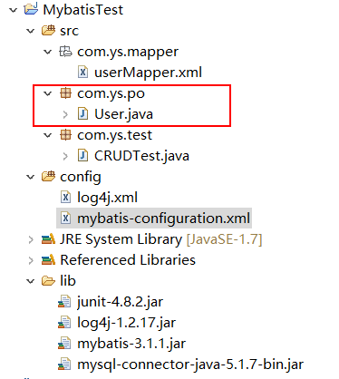
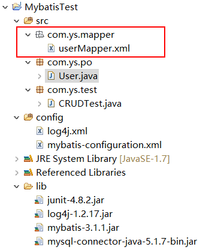
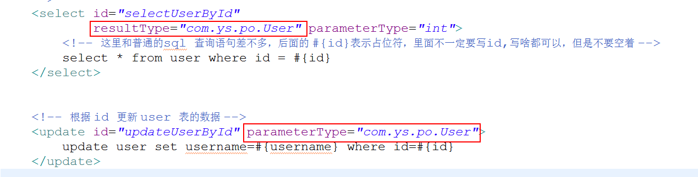
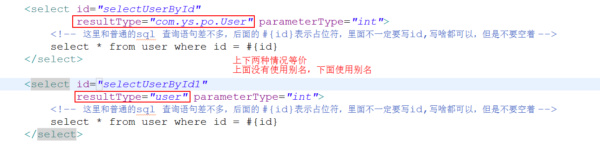
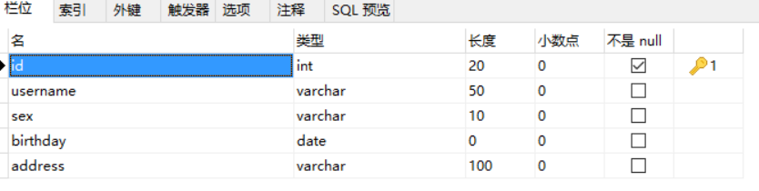

# mybatis 详解（一）---JDBC


## 一、什么是MyBatis?

MyBatis 本是 apache 的一个开源项目 iBatis, 2010 年这个项目由 apache software foundation 迁移到了 google code，并且改名为 MyBatis 。2013 年 11 月迁移到 Github。

iBATIS 一词来源于“internet”和“abatis”的组合，是**一个基于Java的持久层框架**。iBATIS 提供的持久层框架包括 SQL Maps 和 Data Access Objects（DAO）。

MyBatis 是支持普通 SQL 查询，存储过程和高级映射的优秀持久层框架。MyBatis 消除了几乎所有的 JDBC 代码和参数的手工设置以及结果集的检索。**MyBatis 使用简单的 XML或注解用于配置和原始映射，将接口和 Java 的POJOs（Plain Ordinary Java Objects，普通的 Java对象）映射成数据库中的记录**。

## 二、为什么会有 MyBatis?

通过上面的介绍，我们知道 MyBatis 是来和数据库打交道。那么在这之前，我们是使用 JDBC 来对数据库进行增删改查等一系列操作的，而我们之所以会放弃使用 JDBC，转而使用 MyBatis 框架，这是为什么呢？或者说使用 MyBatis 对比 JDBC 有什么好处？

下面我们通过一段 JDBC 对 Person 表的操作来具体看看。

 person 表为：

```java
public class Person {
    private Long pid;
    private String pname;
    // 省略 set、get 方法
}
```

JDBC 查询操作：

```java
package com.ys.dao;
 
import java.sql.Connection;
import java.sql.DriverManager;
import java.sql.PreparedStatement;
import java.sql.ResultSet;
import java.sql.SQLException;
import java.sql.Statement;
import java.util.ArrayList;
import java.util.List;
 
import javax.swing.DebugGraphics;
 
import com.ys.bean.Person;
 
public class CRUDDao {
    //MySQL数据库驱动
    public static String driverClass = "com.mysql.jdbc.Driver";
    //MySQL用户名
    public static String userName = "root";
    //MySQL密码
    public static String passWord = "root";
    //MySQL URL
    public static String url = "jdbc:mysql://localhost:3306/test";
    //定义数据库连接
    public static Connection conn = null;
    //定义声明数据库语句,使用 预编译声明 PreparedStatement提高数据库执行性能
    public static PreparedStatement ps = null;
    //定义返回结果集
    public static ResultSet rs = null;
    
    /**
     * 查询 person 表信息
     * @return：返回 person 的 list 集合
     */
    public static List<Person> readPerson(){
        List<Person> list = new ArrayList<>();
        try {
            // 加载数据库驱动
            Class.forName(driverClass);
            // 获取数据库连接
            conn = DriverManager.getConnection(url, userName, passWord);
            // 定义 sql 语句, ? 表示占位符
            String sql = "select * from person where pname=?";
            // 获取预编译处理的 statement
            ps = conn.prepareStatement(sql);
            // 设置 sql 语句中的参数，第一个为 sql 语句中的参数的?(从1开始)，第二个为设置的参数值
            ps.setString(1, "qzy");
            //向数据库发出 sql 语句查询，并返回结果集
            rs = ps.executeQuery();
            while (rs.next()) {
                Person p = new Person();
                p.setPid(rs.getLong(1));
                p.setPname(rs.getString(2));
                list.add(p);
            }
        } catch (Exception e) {
            e.printStackTrace();
        }finally{
            //关闭数据库连接
            if(rs!=null){
                try {
                    rs.close();
                } catch (SQLException e) {
                    e.printStackTrace();
                }
            }
            if(ps!=null){
                try {
                    ps.close();
                } catch (SQLException e) {
                    e.printStackTrace();
                }
            }
            if(conn!=null){
                try {
                    conn.close();
                } catch (SQLException e) {
                    e.printStackTrace();
                }
            }
        }
         
        return list;
    }
 
    public static void main(String[] args) {
        System.out.println(CRUDDao.readPerson());
    }
}
```

## 三、分析

通过上面的例子我们可以分析如下几点：

①、问题一：数据库连接，使用时就创建，使用完毕就关闭，这样会对数据库进行频繁的获取连接和关闭连接，造成数据库资源浪费，影响数据库性能。
设想解决：使用数据库连接池管理数据库连接

②、问题二：将 sql 语句硬编码到程序中，如果 sql 语句修改了，那么需要重新编译 Java 代码，不利于系统维护
设想解决：将 sql 语句配置到 xml 文件中，即使 sql 语句变化了，我们也不需要对 Java 代码进行修改，重新编译

③、问题三：在 PreparedStatement 中设置参数，对占位符设置值都是硬编码在 Java 代码中，不利于系统维护
设想解决：将 sql 语句以及占位符和参数都配置到 xml 文件中

④、问题四：从 resultset 中遍历结果集时，对表的字段存在硬编码，不利于系统维护
设想解决：将查询的结果集自动映射为 Java 对象

⑤、问题五：重复性代码特别多，频繁的 try-catch
设想解决：将其整合到一个 try-catch 代码块中

⑥、问题六：缓存做的很差，如果存在数据量很大的情况下，这种方式性能特别低
设想解决：集成缓存框架去操作数据库

⑦、问题七：sql 的移植性不好，如果换个数据库，那么 sql 语句可能要重写
设想解决：在 JDBC 和 数据库之间插入第三方框架，用第三方去生成 sql 语句，屏蔽数据库的差异

既然直接使用 JDBC 操作数据库有那么多的缺点，那么我们如何去解决呢？请看下面 mybatis 框架的入门实例介绍。


# mybatis 详解（二）---入门实例（基于XML）

[原文链接](https://www.cnblogs.com/ysocean/p/7277545.html)


通过上一小节，mybatis 和 jdbc 的区别，我们对 mybatis 有了一个大致的了解，下面我们通过一个入门实例来对 mybatis 有更近一步的了解。

我们用 mybatis 来对 user 表进行增删改查操作。


## 1、创建MySQL数据库：mybatisDemo和表：user

这里我们就不写脚本创建了，创建完成后，再向其中插入几条数据即可。
user 表字段如下：


## 2、建立一个Java工程，并导入相应的jar包，具体目录如下

注意：log4j 和 Junit 不是必须的，但是我们为了查看日志以及便于测试，加入了这两个 jar 包


### 3、在 MyBatisTest 工程中添加数据库配置文件 mybatis-configuration.xml

```MyBatis_xml
<?xml version="1.0" encoding="UTF-8"?>
<!DOCTYPE configuration PUBLIC "-//mybatis.org//DTD Config 3.0//EN" "http://mybatis.org/dtd/mybatis-3-config.dtd">
<configuration>
 
<!-- 注意：environments标签，当mybatis和spring整合之后，这个标签是不用配置的 -->
 
<!-- 可以配置多个运行环境，但是每个 SqlSessionFactory 实例只能选择一个运行环境：development:开发模式 或者work：工作模式-->
 <environments default="development">
 <!--id属性必须和上面的default一样  -->
    <environment id="development">
    <!--事务管理器
        一、JDBC：这个配置直接简单使用了 JDBC 的提交和回滚设置。它依赖于从数据源得到的连接来管理事务范围
        二、MANAGED：这个配置几乎没做什么。它从来不提交或回滚一个连接。而它会让容器来管理事务的整个生命周期。比如 spring 或 JEE 应用服务器的上下文，默认情况下，它会关闭连接。然而一些容器并不希望这样，因此如果你需要从连接中停止它，就可以将 closeConnection 属性设置为 false，比如：
            <transactionManager type="MANAGED">
                <property name="closeConnection" value="false"/>
            </transactionManager>
      -->
      <transactionManager type="JDBC"/>
      <!--dataSource 元素使用标准的 JDBC 数据源接口来配置 JDBC 连接对象源  -->
      <dataSource type="POOLED">
        <property name="driver" value="com.mysql.jdbc.Driver"/>
        <property name="url" value="jdbc:mysql://localhost:3306/mybatisdemo"/>
        <property name="username" value="root"/>
        <property name="password" value="root"/>
      </dataSource>
    </environment>
  </environments>
   
</configuration>
```


## 4、定义表所对应的实体类



```User_java
package com.ys.po;
import java.util.Date;
 
public class User {
    private int id;
    private String username;
    private String sex;
    private Date birthday;
    private String address;
   // 省略 get、set 方法以及重写 toString 方法
}
```


## 5、定义操作 user 表的sql映射文件 UserMapper.xml　　



```UserMapper_xml
<?xml version="1.0" encoding="UTF-8" ?>
<!DOCTYPE mapper
  PUBLIC "-//mybatis.org//DTD Mapper 3.0//EN"
  "http://mybatis.org/dtd/mybatis-3-mapper.dtd">
<mapper namespace="com.ys.po.userMapper">
 
    <!-- 根据 id 查询 user 表中的数据
       id：唯一标识符，此文件中的 id 值不能重复, 可以自定义；
       resultType：返回值类型，一条数据库记录也就对应实体类的一个对象；
       parameterType：参数类型，也就是查询条件的类型；
    -->
    <select id="selectUserById"
            resultType="com.ys.po.User" parameterType="int">
        <!-- 这里和普通的 sql 查询语句差不多，对于只有一个参数，后面的 #{id}表示占位符，里面不一定要写 id, 写啥都可以，但是不要空着，如果有多个参数则必须写 pojo 类里面的属性 -->
        select * from user where id = #{id}
    </select>
   
     
    <!-- 查询 user 表的所有数据
        注意：因为是查询所有数据，所以返回的应该是一个集合,这个集合里面每个元素都是User类型
     -->
    <select id="selectUserAll" resultType="com.ys.po.User">
        select * from user
    </select>
     
    <!-- 模糊查询：根据 user 表的username字段
            下面两种写法都可以，但是要注意
            1、${value}里面必须要写value，不然会报错
            2、${}表示拼接 sql 字符串，将接收到的参数不加任何修饰拼接在sql语句中
            3、使用${}会造成 sql 注入
     -->
    <select id="selectLikeUserName" resultType="com.ys.po.User" parameterType="String">
        select * from user where username like '%${value}%'
        <!-- select * from user where username like #{username} -->
    </select>
     
    <!-- 向 user 表插入一条数据 -->
    <insert id="insertUser" parameterType="com.ys.po.User">
        insert into user(id,username,sex,birthday,address)
            value(#{id},#{username},#{sex},#{birthday},#{address})
    </insert>
     
    <!-- 根据 id 更新 user 表的数据 -->
    <update id="updateUserById" parameterType="com.ys.po.User">
        update user set username=#{username} where id=#{id}
    </update>
     
    <!-- 根据 id 删除 user 表的数据 -->
    <delete id="deleteUserById" parameterType="int">
        delete from user where id=#{id}
    </delete>
</mapper>
```

parameterType 这个属性表示的是传入参数类型。
注意：写的不是包路径，而是某个类的全类名，那么表示的是传入的参数类型是这个类的类型。所以不管是 int ，String 这样的数据类型，或者是全类名，都是表示参数类型，并不冲突。


## 6、向 mybatis-configuration.xml 配置文件中注册 userMapper.xml 文件

在 configuration 中注册配置文件：

```MyBatis_xml
<mappers>
       <!-- 注册userMapper.xml文件，
       userMapper.xml位于com.ys.mapper这个包下，所以resource写成com/ys/mapper/userMapper.xml-->
       <mapper resource="com/ys/mapper/userMapper.xml"/>
</mappers>
```


##  7、创建测试类

```CRUDTest_java
package com.ys.test;
 
import java.io.InputStream;
import java.util.List;
 
import org.apache.ibatis.session.SqlSession;
import org.apache.ibatis.session.SqlSessionFactory;
import org.apache.ibatis.session.SqlSessionFactoryBuilder;
import org.junit.Before;
import org.junit.Test;
 
import com.ys.po.User;
 
public class CRUDTest {
    //定义 SqlSession
    SqlSession session =null;
     
    @Before
    public void init(){
        //定义mybatis全局配置文件
        String resource = "mybatis-configuration.xml";
        //加载 mybatis 全局配置文件
        InputStream inputStream = CRUDTest.class.getClassLoader()
                                    .getResourceAsStream(resource);
        //构建sqlSession的工厂
        SqlSessionFactory sessionFactory = new SqlSessionFactoryBuilder().build(inputStream);
        //根据 sqlSessionFactory 产生 session
        session = sessionFactory.openSession();
    }
     
    //根据id查询user表数据
    @Test
    public void testSelectUserById(){
        /*这个字符串由 userMapper.xml 文件中 两个部分构成
            <mapper namespace="com.ys.po.userMapper"> 的 namespace 的值
            <select id="selectUserById" > id 值*/
        String statement = "com.ys.po.userMapper.selectUserById";
        User user = session.selectOne(statement, 1);
        System.out.println(user);
        session.close();
    }
     
    //查询所有user表所有数据
    @Test
    public void testSelectUserAll(){
        String statement = "com.ys.po.userMapper.selectUserAll";
        List<User> listUser = session.selectList(statement);
        for(User user : listUser){
            System.out.println(user);
        }
        session.close();
    }
     
    //模糊查询：根据 user 表的username字段
    @Test
    public void testSelectLikeUserName(){
        String statement = "com.ys.po.userMapper.selectLikeUserName";
        List<User> listUser = session.selectList(statement, "%t%");
        for(User user : listUser){
            System.out.println(user);
        }
        session.close();
         
    }
    //向 user 表中插入一条数据
    @Test
    public void testInsertUser(){
        String statement = "com.ys.po.userMapper.insertUser";
        User user = new User();
        user.setUsername("Bob");
        user.setSex("女");
        session.insert(statement, user);
        //提交插入的数据
        session.commit();
        session.close();
    }
     
    //根据 id 更新 user 表的数据
    @Test
    public void testUpdateUserById(){
        String statement = "com.ys.po.userMapper.updateUserById";
        //如果设置的 id不存在，那么数据库没有数据更改
        User user = new User();
        user.setId(4);
        user.setUsername("jim");
        session.update(statement, user);
        session.commit();
        session.close();
    }
     
 
    //根据 id 删除 user 表的数据
    @Test
    public void testDeleteUserById(){
        String statement = "com.ys.po.userMapper.deleteUserById";
        session.delete(statement,4);
        session.commit();
        session.close();
    }
}
```


### 补充：如何得到插入数据之后的主键值？

- 第一种：数据库设置主键自增机制
    userMapper.xml 文件中定义：

```UserMapper_xml
<!-- 向 user 表插入一条数据 -->
    <insert id="insertUser" parameterType="com.ys.po.User">
        <!-- 将插入的数据主键返回到 user 对象中
             keyProperty:将查询到的主键设置到parameterType 指定到对象的那个属性
             select LAST_INSERT_ID()：查询上一次执行insert 操作返回的主键id值，只适用于自增主键
             resultType:指定 select LAST_INSERT_ID() 的结果类型
             order:AFTER，相对于 select LAST_INSERT_ID()操作的顺序
         -->
        <selectKey keyProperty="id" resultType="int" order="AFTER">
            select LAST_INSERT_ID()
        </selectKey>
        insert into user(username,sex,birthday,address)
            value(#{username},#{sex},#{birthday},#{address})
    </insert>
```

测试：

```InsertUserTest_java
//向 user 表中插入一条数据并获取主键值
    @Test
    public void InsertUserTest(){
        String statement = "com.ys.po.userMapper.insertUser";
        User user = new User();
        user.setUsername("Bob");
        user.setSex("女");
        session.insert(statement, user);
        //提交插入的数据
        session.commit();
        //打印主键值
        System.out.println(user.getId());
        session.close();
    }
```

- 第二种：非自增主键机制

```UserMapper_xml
<!-- 向 user 表插入一条数据 -->
    <insert id="insertUser" parameterType="com.ys.po.User">
        <!-- 将插入的数据主键返回到 user 对象中
        流程是：首先通过 select UUID()得到主键值，然后设置到 user 对象的id中，在进行 insert 操作
             keyProperty:将查询到的主键设置到parameterType 指定到对象的那个属性
             select UUID()：得到主键的id值，注意这里是字符串
             resultType:指定 select UUID() 的结果类型
             order:BEFORE，相对于 select UUID()操作的顺序
         -->
        <selectKey keyProperty="id" resultType="String" order="BEFORE">
            select UUID()
        </selectKey>
        insert into user(id,username,sex,birthday,address)
            value(#{id},#{username},#{sex},#{birthday},#{address})
    </insert>
```


### 总结：

①、parameterType：指定输入参数的类型

②、resultType：指定输出结果的类型，在 select 中如果查询结果是集合，那么也表示集合中每个元素的类型

③、`#{}`：表示占位符，用来接收输入参数，类型可以是简单类型，pojo,HashMap 等等
如果接收简单类型，#{}可以写成 value 或者其他名称
如果接收 pojo 对象值，通过 OGNL 读取对象中的属性值，即属性.属性.属性...的方式获取属性值

④、`${}`：表示一个拼接符，会引起 sql 注入，不建议使用　　
用来接收输入参数，类型可以是简单类型，pojo,HashMap 等等
如果接收简单类型，${}里面只能是 value
如果接收 pojo 对象值，通过 OGNL 读取对象中的属性值，即属性.属性.属性...的方式获取属性值


# mybatis 详解（三）---入门实例（基于注解）

[原文链接](https://www.cnblogs.com/ysocean/p/7282639.html)

@toc

注意：注解配置我们不需要 UserMapper.xml 文件了,使用注解接口 UserMapper.java。

##  1、创建MySQL数据库：mybatisDemo和表：user 

详情参考：mybatis 详解（二）------入门实例（基于 XML） 一致

## 2、建立一个Java工程，并导入相应的jar包，具体目录如下

详情参考：mybatis 详解（二）------入门实例（基于 XML）]一致


##  3、在 MyBatisTest 工程中添加数据库配置文件 mybatis-configuration.xml

详情参考：mybatis 详解（二）------入门实例（基于 XML） 一致

## 4、定义表所对应的实体类

详情参考：mybatis 详解（二）------入门实例（基于 XML) 一致


## 5、定义操作 user 表的注解接口 UserMapper.java

```UserMapper_java
package com.ys.annocation;
 
import org.apache.ibatis.annotations.Delete;
import org.apache.ibatis.annotations.Insert;
import org.apache.ibatis.annotations.Select;
import org.apache.ibatis.annotations.Update;
 
import com.ys.po.User;
 
public interface UserMapper {
    //根据 id 查询 user 表数据
    @Select("select * from user where id = #{id}")
    public User selectUserById(int id) throws Exception;
 
    //向 user 表插入一条数据
    @Insert("insert into user(username,sex,birthday,address) value(#{username},#{sex},#{birthday},#{address})")
    public void insertUser(User user) throws Exception;
     
    //根据 id 修改 user 表数据
    @Update("update user set username=#{username},sex=#{sex} where id=#{id}")
    public void updateUserById(User user) throws Exception;
     
    //根据 id 删除 user 表数据
    @Delete("delete from user where id=#{id}")
    public void deleteUserById(int id) throws Exception;
     
}
```


## 6、向 mybatis-configuration.xml 配置文件中注册 UserMapper.java 文件

```MyBatis_xml
<mappers>
       <mapper class="com.ys.annocation.UserMapper"/>
</mappers>
```


##  7、创建测试类

```UserAnnocationTest_java
package com.ys.test;
 
import java.io.InputStream;
 
import org.apache.ibatis.session.SqlSession;
import org.apache.ibatis.session.SqlSessionFactory;
import org.apache.ibatis.session.SqlSessionFactoryBuilder;
import org.junit.Before;
import org.junit.Test;
 
import com.ys.annocation.UserMapper;
import com.ys.po.User;
 
public class UserAnnocationTest {
    //定义 SqlSession
    SqlSession session =null;
     
    @Before
    public void init(){
        //定义mybatis全局配置文件
        String resource = "mybatis-configuration.xml";
        //加载 mybatis 全局配置文件
        InputStream inputStream = CRUDTest.class.getClassLoader()
                                    .getResourceAsStream(resource);
        //构建sqlSession的工厂
        SqlSessionFactory sessionFactory = new SqlSessionFactoryBuilder().build(inputStream);
        //根据 sqlSessionFactory 产生 session
        session = sessionFactory.openSession();
    }
     
    //注解的增删改查方法测试
    @Test
    public void testAnncationCRUD() throws Exception{
        //根据session获取 UserMapper接口
        UserMapper userMapper = session.getMapper(UserMapper.class);
        //调用selectUserById()方法
        User user = userMapper.selectUserById(1);
        System.out.println(user);
         
        //调用  insertUser() 方法
        User user1 = new User();
        user1.setUsername("aliks");
        user1.setSex("不详");
        userMapper.insertUser(user1);
         
        //调用 updateUserById() 方法
        User user2 = new User();
        user2.setId(6);
        user2.setUsername("lbj");
        userMapper.updateUserById(user2);
         
        //调用 () 方法
        userMapper.deleteUserById(6);
         
        session.commit();
        session.close();
    }
}
```

​     


# mybatis 详解（四）------properties以及别名定义

[原文链接](https://www.cnblogs.com/ysocean/p/7287972.html)

@toc

　　上一篇博客我们介绍了 mybatis 的增删改查入门实例，我们发现在 mybatis-configuration.xml 的配置文件中，对数据库的配置都是硬编码在这个 xml 文件中，如下图，那么我们如何改进这个写法呢？

　　
【注：硬编码和软编码的区别】
计算机科学中，只有硬编码（hardcode），以及非硬编码，有人也成为“软编码”。
    硬编码和软编码的区别是：软编码可以在运行时确定，修改；而硬编码是不能够改变的。所有的硬编码和软编码的区别都可以有这个意思扩展开。
    在计算机程序或文本编辑中，硬编码是指将可变变量用一个固定值来代替的方法。用这种方法编译后，如果以后需要更改此变量就非常困难了。大部分程序语言里，可以将一个固定数值定义为一个标记，然后用这个特殊标记来取代变量名称。当标记名称改变时，变量名不变，这样，当重新编译整个程序时，所有变量都不再是固定值，这样就更容易的实现了改变变量的目的。
    尽管通过编辑器的查找替换功能也能实现整个变量名称的替换，但也很有可能出现多换或者少换的情况，而在计算机 程序中，任何小错误的出现都是不可饶恕的。最好的方法是单独为变量名划分空间，来实现这种变化，就如同前面说的那样，将需要改变的变量名暂时用一个定义好 的标记名称来代替就是一种很好的方法。通常情况下，都应该避免使用硬编码方法。　 　　
    java 小例子： `int a=2,b=2;` 　　
    硬编码：`if(a==2) return false;` 　　
    非硬编码 `if(a==b) return true;` 　　（就是把数值写成常数而不是变量 ）
    一个简单的版本：如求圆的面积 的问题 PI（3.14) 　　
    那么`3.14*r*r` 就是硬编码，而 `PI*r*r` 就不是硬编码。

### 1、我们将 数据库的配置语句写在 db.properties 文件中

```db_properties
jdbc.driver=com.mysql.jdbc.Driver
jdbc.url=jdbc:mysql://localhost:3306/ssm
jdbc.username=root
jdbc.password=root
```

### 2、在  mybatis-configuration.xml 中加载db.properties文件并读取

```MyBatis_xml
<?xml version="1.0" encoding="UTF-8"?>
<!DOCTYPE configuration PUBLIC "-//mybatis.org//DTD Config 3.0//EN" "http://mybatis.org/dtd/mybatis-3-config.dtd">
<configuration>
  <!-- 加载数据库属性文件 -->
  <properties resource="db.properties">
  </properties>

 <environments default="development">
    <environment id="development">
      <transactionManager type="JDBC"/>
      <!--dataSource 元素使用标准的 JDBC 数据源接口来配置 JDBC 连接对象源  -->
      <dataSource type="POOLED">
        <property name="driver" value="${jdbc.driver}"/>
        <property name="url" value="${jdbc.url}"/>
        <property name="username" value="${jdbc.username}"/>
        <property name="password" value="${jdbc.password}"/>
      </dataSource>
    </environment>
  </environments>
</configuration>
```

　　如果数据库有变化，我们就可以通过修改 db.properties 文件来修改，而不用去修改 mybatis-configuration.xml 文件

注意：我们也可以在<properties></properties>中手动增加属性

```MyBatis_xml
<!-- 加载数据库属性文件 -->
<properties resource="db.properties">
    <property name="username" value="aaa"/>
</properties>
```

　　那么这个时候是读取的 username 是以 db.properties 文件中的 root 为准，还是以自己配置的 aaa 为准呢?

我们先看一段 properties 文件加载的源码

```db_properties
private void propertiesElement(XNode context) throws Exception {
  if (context != null) {
    /**
     *  解析properties 属性中指定的属性。
     */
    Properties defaults = context.getChildrenAsProperties();
    String resource = context.getStringAttribute("resource"); //resource 制定的属性路径
    String url = context.getStringAttribute("url"); //url制定的属性路径
    if (resource != null && url != null) {
      throw new BuilderException("The properties element cannot specify both a URL and a resource based property file reference.  Please specify one or the other.");
    }
    /**
     * 根据 properties 元素中的 resource 属性读取类路径下属性文件，并覆盖properties 属性中指定的同名属性。
     */
    if (resource != null) {
      defaults.putAll(Resources.getResourceAsProperties(resource));
    } else if (url != null) {
      /**
       * 根据properties元素中的url属性指定的路径读取属性文件，并覆盖properties 属性中指定的同名属性。
       */
      defaults.putAll(Resources.getUrlAsProperties(url));
    }
    /**
     *  获取方法参数传递的properties
     *  创建XMLConfigBuilder实例时，this.configuration.setVariables(props);
     */
    Properties vars = configuration.getVariables();
    if (vars != null) {
      defaults.putAll(vars);
    }
    parser.setVariables(defaults);
    configuration.setVariables(defaults);
  }
}
```

### 通过源码我们可以分析读取优先级：

1、在 properties 内部**自定义的属性值第一个被读取**

2、**然后读取 resource 路径表示文件中的属性，如果有它会覆盖已经读取的属性**；如果 resource 路径不存在，那么读取 url 表示路径文件中的属性，如果有它会覆盖第一步读取的属性值

3、最后读取 parameterType 传递的属性值，它会覆盖已读取的同名的属性

前面两步好理解，第三步我们可以举个例子来看：

我们在 userMapper.xml 文件中进行模糊查询

```UserMapper_xml
<select id="selectLikeUserName" resultType="com.ys.po.User" parameterType="String">
    select * from user where username like '%${jdbc.username}%'
    <!-- select * from user where username like #{username} -->
</select>
```

　这个时候你会发现无论你后台传给这个查询语句什么参数，都是 select * from user where username like '%root%'

# mybatis 的别名配置　　

　　在 userMapper.xml 文件中，我们可以看到 resultType 和 parameterType 需要指定，这这个值往往都是全路径，不方便开发，那么我们就可以对这些属性进行一些别名设置



## 1、mybatis 默认支持的别名

　　

　　


## 2、自定义别名　　

### 一、定义单个别名

　首先在全局配置文件 mybatis-configuration.xml 文件中添加如下配置：是在<configuration>标签下

```MyBatis_xml
<!-- 定义别名 -->
<typeAliases>
    <typeAlias type="com.ys.po.User" alias="user"/>
</typeAliases>
```

第二步通过 user 引用



### 二、批量定义别名

在全局配置文件 mybatis-configuration.xml 文件中添加如下配置：是在<configuration>标签下

```MyBatis_xml
<!-- 定义别名 -->
<typeAliases>
    <!-- mybatis自动扫描包中的po类，自动定义别名，别名是类名(首字母大写或小写都可以,一般用小写) -->
    <package name="com.ys.po"/>
</typeAliases>
```

引用的时候类名的首字母大小写都可以


# mybatis 详解（五）---动态SQL

[原文链接](https://www.cnblogs.com/ysocean/p/7289529.html)

前面几篇博客我们通过实例讲解了用 mybatis 对一张表进行的 CRUD 操作，但是我们发现写的 SQL 语句都比较简单，如果有比较复杂的业务，我们需要写复杂的 SQL 语句，往往需要拼接，而拼接 SQL ，稍微不注意，由于引号，空格等缺失可能都会导致错误。

那么怎么去解决这个问题呢？这就是本篇所讲的使用 mybatis 动态 SQL，通过 if, choose, when, otherwise, trim, where, set, foreach 等标签，可组合成非常灵活的 SQL 语句，从而在提高 SQL 语句的准确性的同时，也大大提高了开发人员的效率。

我们以 User 表为例来说明：



## 1、动态SQL:if 语句

　　根据 username 和 sex 来查询数据。如果 username 为空，那么将只根据 sex 来查询；反之只根据 username 来查询

　　首先不使用 动态 SQL 来书写

```sql
<select id="selectUserByUsernameAndSex"
        resultType="user" parameterType="com.ys.po.User">
    <!-- 这里和普通的sql 查询语句差不多，对于只有一个参数，后面的 #{id}表示占位符，里面不一定要写id,
            写啥都可以，但是不要空着，如果有多个参数则必须写pojo类里面的属性 -->
    select * from user where username=#{username} and sex=#{sex}
</select>
```


　　上面的查询语句，我们可以发现，如果 #{username} 为空，那么查询结果也是空，如何解决这个问题呢？使用 if 来判断

```sql
<select id="selectUserByUsernameAndSex" resultType="user" parameterType="com.ys.po.User">
    select * from user where
        <if test="username != null">
           username=#{username}
        </if>
         
        <if test="username != null">
           and sex=#{sex}
        </if>
</select>
```

　　这样写我们可以看到，如果 sex 等于 null，那么查询语句为 select * from user where username=#{username},但是如果 usename 为空呢？那么查询语句为 select * from user where and sex=#{sex}，这是错误的 SQL 语句，如何解决呢？请看下面的 where 语句

## 2、动态SQL:if+where 语句

```sql
<select id="selectUserByUsernameAndSex" resultType="user" parameterType="com.ys.po.User">
    select * from user
    <where>
        <if test="username != null">
           username=#{username}
        </if>
         
        <if test="username != null">
           and sex=#{sex}
        </if>
    </where>
</select>
```

　　这个“where”标签会知道如果它包含的标签中有返回值的话，它就插入一个‘where’。此外，如果标签返回的内容是以 AND 或 OR 开头的，则它会剔除掉。

## 3、动态SQL:if+set 语句

　　同理，上面的对于查询 SQL 语句包含 where 关键字，如果在进行更新操作的时候，含有 set 关键词，我们怎么处理呢？

```sql
<!-- 根据 id 更新 user 表的数据 -->
<update id="updateUserById" parameterType="com.ys.po.User">
    update user u
        <set>
            <if test="username != null and username != ''">
                u.username = #{username},
            </if>
            <if test="sex != null and sex != ''">
                u.sex = #{sex}
            </if>
        </set>
     
     where id=#{id}
</update>
```

　这样写，如果第一个条件 username 为空，那么 sql 语句为：update user u set u.sex=? where id=?
　如果第一个条件不为空，那么 sql 语句为：update user u set u.username = ? ,u.sex = ? where id=?

## 4、动态SQL:choose(when,otherwise) 语句

　　有时候，我们不想用到所有的查询条件，只想选择其中的一个，查询条件有一个满足即可，使用 choose 标签可以解决此类问题，类似于 Java 的 switch 语句

```sql
<select id="selectUserByChoose" resultType="com.ys.po.User" parameterType="com.ys.po.User">
      select * from user
      <where>
          <choose>
              <when test="id !='' and id != null">
                  id=#{id}
              </when>
              <when test="username !='' and username != null">
                  and username=#{username}
              </when>
              <otherwise>
                  and sex=#{sex}
              </otherwise>
          </choose>
      </where>
  </select>
```

也就是说，这里我们有三个条件，id,username,sex，只能选择一个作为查询条件

如果 id 不为空，那么查询语句为：select * from user where  id=?

如果 id 为空，那么看 username 是否为空，如果不为空，那么语句为 select * from user where  username=?;

如果 username 为空，那么查询语句为 select * from user where sex=?


## 5、动态SQL:trim 语句

　　trim 标记是一个格式化的标记，可以完成 set 或者是 where 标记的功能

　　①、用 trim 改写上面第二点的 if+where 语句

```sql
<select id="selectUserByUsernameAndSex" resultType="user" parameterType="com.ys.po.User">
        select * from user
        <!-- <where>
            <if test="username != null">
               username=#{username}
            </if>
             
            <if test="username != null">
               and sex=#{sex}
            </if>
        </where>  -->
        <trim prefix="where" prefixOverrides="and | or">
            <if test="username != null">
               and username=#{username}
            </if>
            <if test="sex != null">
               and sex=#{sex}
            </if>
        </trim>
    </select>
```

prefix：前缀　　　　　　

prefixoverride：去掉第一个 and 或者是 or

②、用 trim 改写上面第三点的 if+set 语句

```sql
<!-- 根据 id 更新 user 表的数据 -->
    <update id="updateUserById" parameterType="com.ys.po.User">
        update user u
            <!-- <set>
                <if test="username != null and username != ''">
                    u.username = #{username},
                </if>
                <if test="sex != null and sex != ''">
                    u.sex = #{sex}
                </if>
            </set> -->
            <trim prefix="set" suffixOverrides=",">
                <if test="username != null and username != ''">
                    u.username = #{username},
                </if>
                <if test="sex != null and sex != ''">
                    u.sex = #{sex},
                </if>
            </trim>
         
         where id=#{id}
    </update>
```

　　suffix：后缀　　

　　suffixoverride：去掉最后一个逗号（也可以是其他的标记，就像是上面前缀中的 and 一样）

[回到顶部](https://www.cnblogs.com/ysocean/p/7289529.html#_labelTop)

### 6、动态SQL: SQL 片段

　　有时候可能某个 sql 语句我们用的特别多，为了增加代码的重用性，简化代码，我们需要将这些代码抽取出来，然后使用时直接调用。

　　比如：假如我们需要经常根据用户名和性别来进行联合查询，那么我们就把这个代码抽取出来，如下：

```sql
<!-- 定义 sql 片段 -->
<sql id="selectUserByUserNameAndSexSQL">
    <if test="username != null and username != ''">
        AND username = #{username}
    </if>
    <if test="sex != null and sex != ''">
        AND sex = #{sex}
    </if>
</sql>
```

　　引用 sql 片段

```sql
<select id="selectUserByUsernameAndSex" resultType="user" parameterType="com.ys.po.User">
    select * from user
    <trim prefix="where" prefixOverrides="and | or">
        <!-- 引用 sql 片段，如果refid 指定的不在本文件中，那么需要在前面加上 namespace -->
        <include refid="selectUserByUserNameAndSexSQL"></include>
        <!-- 在这里还可以引用其他的 sql 片段 -->
    </trim>
</select>
```

　　注意：①、最好基于 单表来定义 sql 片段，提高片段的可重用性

　　　　　②、在 sql 片段中最好不要包括 where 


## 7、动态SQL: foreach 语句

　　需求：我们需要查询 user 表中 id 分别为 1,2,3 的用户

　　sql 语句：select * from user where id=1 or id=2 or id=3

　　　　　　 select * from user where id in (1,2,3)

①、建立一个 UserVo 类，里面封装一个 List<Integer> ids 的属性

```sql
package com.ys.vo;
 
import java.util.List;
 
public class UserVo {
    //封装多个用户的id
    private List<Integer> ids;
 
    public List<Integer> getIds() {
        return ids;
    }
 
    public void setIds(List<Integer> ids) {
        this.ids = ids;
    }
 
}　　
```

②、我们用 foreach 来改写 select * from user where id=1 or id=2 or id=3

```sql
<select id="selectUserByListId" parameterType="com.ys.vo.UserVo" resultType="com.ys.po.User">
    select * from user
    <where>
        <!--
            collection:指定输入对象中的集合属性
            item:每次遍历生成的对象
            open:开始遍历时的拼接字符串
            close:结束时拼接的字符串
            separator:遍历对象之间需要拼接的字符串
            select * from user where 1=1 and (id=1 or id=2 or id=3)
          -->
        <foreach collection="ids" item="id" open="and (" close=")" separator="or">
            id=#{id}
        </foreach>
    </where>
</select>
```

　　测试：

```sql
//根据id集合查询user表数据
@Test
public void testSelectUserByListId(){
    String statement = "com.ys.po.userMapper.selectUserByListId";
    UserVo uv = new UserVo();
    List<Integer> ids = new ArrayList<>();
    ids.add(1);
    ids.add(2);
    ids.add(3);
    uv.setIds(ids);
    List<User> listUser = session.selectList(statement, uv);
    for(User u : listUser){
        System.out.println(u);
    }
    session.close();
}
```


③、我们用 foreach 来改写 select * from user where id in (1,2,3)

```sql
<select id="selectUserByListId" parameterType="com.ys.vo.UserVo" resultType="com.ys.po.User">
        select * from user
        <where>
            <!--
                collection:指定输入对象中的集合属性
                item:每次遍历生成的对象
                open:开始遍历时的拼接字符串
                close:结束时拼接的字符串
                separator:遍历对象之间需要拼接的字符串
                select * from user where 1=1 and id in (1,2,3)
              -->
            <foreach collection="ids" item="id" open="and id in (" close=") " separator=",">
                #{id}
            </foreach>
        </where>
    </select>
```


### 8、总结

　　其实动态 sql 语句的编写往往就是一个拼接的问题，为了保证拼接准确，我们最好首先要写原生的 sql 语句出来，然后在通过 mybatis 动态 sql 对照着改，防止出错。