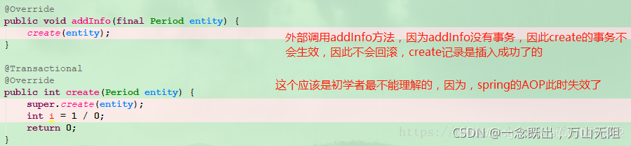
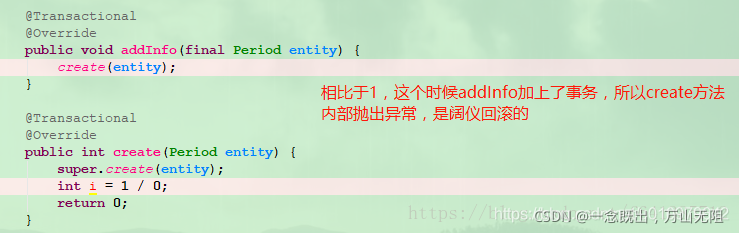
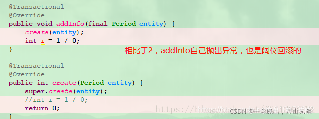
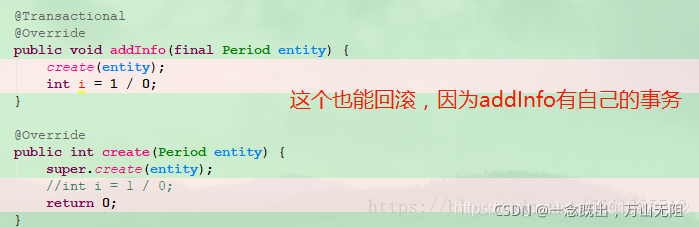
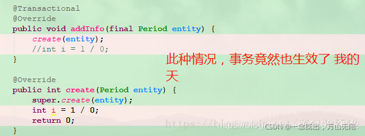
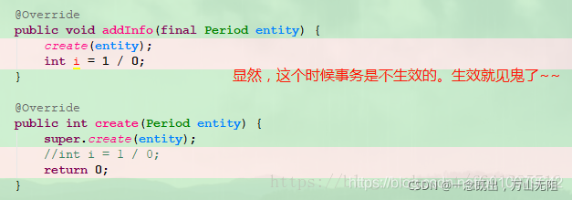
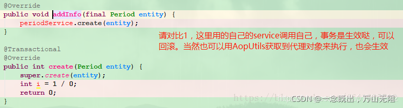

## Java spring事务及事务不生效的原因详解

### 注解 @Transactional 的属性参数

| 属性                   | 类型                                | 描述                         |
| :--------------------- | :---------------------------------- | :--------------------------- |
| value                  | String                              | 可选，指定事务管理器         |
| propagation            | enum: Propagation                   | 可选，指定事务传播行为       |
| isolation              | enum: Isolation                     | 可选，指定事务隔离级别       |
| readOnly               | boolean                             | 读写或只读事务，默认读写     |
| timeout                | int (in seconds granularity)        | 事务超时时间设置             |
| rollbackFor            | Class 对象数组，必须继承自Throwable | 导致事务回滚的异常类数组     |
| rollbackForClassName   | 类名数组，必须继承自Throwable       | 导致事务回滚的异常类名字数组 |
| noRollbackFor          | Class对象数组，必须继承自Throwable  | 不会导致事务回滚的异常类数组 |
| noRollbackForClassName | 类名数组，必须继承自Throwable       | 不会导致事务回滚的           |

### propagation 事务的传播机制

事务的传播机制：如果在开始当前事务之前，一个事务上下文已经存在，此时有若干选项可以指定一个事务性方法的执行行为

枚举 `Propagation` 中定义了 7 个传播机制的值

- `Propagation.REQUIRED`：如果当前没有事务，就新建一个事务，如果已经存在一个事务中，加入到这个事务中。是 spring 默认的传播机制
- `Propagation.SUPPORTS`：持当前事务，如果当前有事务，就以事务方式执行；如果当前没有事务，就以非事务方式执行
- `Propagation.MANDATORY`：使用当前的事务，且必须在一个已有的事务中执行，如果当前不存在事务，否则抛出异常
- `Propagation.REQUIRES_NEW`：不管是否存在事务，都创建一个新的事务，原来的挂起，新的执行完毕，继续执行老的事务
- `Propagation.NOT_SUPPORTED`：以非事务方式执行，如果当前存在事务，就把当前事务挂起
- `Propagation.NEVER`：以非事务方式执行，且必须在一个没有的事务中执行，如果当前存在事务，则抛出异常
- `Propagation.NESTED`：如果当前存在事务，则在嵌套事务内执行；如果当前没有事务，则执行与 `Propagation.REQUIRED `类似的操作

### isolation 事务的隔离级别

隔离级别：若干个并发的事务之间的隔离程度，与我们开发时候主要相关的场景包括：脏读取、重复读、幻读

枚举 `Isolation `中定义了 5 个表示隔离级别的值

- `Isolation.DEFAULT`：使用各个数据库默认的隔离级别，是 spring 默认的隔离级别
- `Isolation.READ_UNCOMMITTED`：读取未提交数据（会出现脏读, 不可重复读）
- `Isolation.READ_COMMITTED`：读取已提交数据（会出现不可重复读和幻读）
- `Isolation.REPEATABLE_READ`：可重复读（会出现幻读）
- `Isolation.SERIALIZABLE`：串行化

#### 常用数据库的默认隔离级别

```
MYSQL：默认为 REPEATABLE_READ
SQLSERVER：默认为 READ_COMMITTED
Oracle：默认为 READ_COMMITTED
```

### readOnly 事务的读写性

默认情况下是 false（不指定只读性）；设置为 true 的含义： 该方法下使用的是只读操作，如果进行其他非读操作，则会跑出异常

#### 事务的只读性概念

从这一点设置的时间点开始（时间点 a），到这个事务结束的过程中，其他事务所提交的数据，该事务将看不见！！即查询中不会出现别人在时间点 a 之后提交的数据

#### 应用场景

- 如果你一次执行单条查询语句，则没有必要启用事务的只读性支持，数据库默认支持 SQL 执行期间的读一致性
- 如果你一次执行多条查询语句，例如统计查询，报表查询。在这种场景下，多条查询 SQL 必须保证整体的读一致性；否则，在前条 SQL 查询之后，后条 SQL 查询之前，数据被其他用户改变，则该次整体的统计查询将会出现读数据不一致的状态。此时，就有必要启用事务的只读性支持

是一次执行多次查询来统计某些信息，这时为了保证数据整体的一致性，要用只读事务


## timeout 超时时间

- 用于设置事务处理的时间长度，阻止可能出现的长时间的阻塞系统或者占用系统资源，单位为秒
- 如果超时设置事务回滚，并抛出 TransactionTimedOutException 异常

### rollbackFor 和 rollbackForClassName 遇到时回滚

- 用来指明回滚的条件是哪些异常类或者异常类名
- spring 默认情况下会对运行期异常 RunTimeException 进行事务回滚，如果遇到 checked 异常就不回滚

### noRollbackFor 和 noRollbackForClassName 遇到时不回滚

用来指明不回滚的条件是哪些异常类或者异常类名

### value 指定使用的事务管理器

- value 主要用来指定不同的事务管理器，主要用来满足在同一个系统中，存在不同的事务管理器的场景需要
- 比如，在 spring 中声明了两种事务管理器 txManager1，txManager2。然后用户可以根据需要，修改这个参数来指定特定的 txManage

存在多个事务管理器的情况：在一个系统中，需要访问多个数据源，则必然会配置多个事务管理器

## spring 事务不生效的原因

spring 团队建议在具体的**类或类的方法上**使用 `@Transactional` 注解，而不要使用在类所要实现的任何接口上。在接口上使用 `@Transactional` 注解，只能当你设置了基于接口的代理时它才生效。因为注解是不能继承的，这就意味着如果正在使用基于类的代理时，那么事务的设置将不能被基于类的代理所识别，而且对象也将不会被事务代理所包装

对 spring 来说，方法调用者所属的类或方法调用者就是主体对象，spring 会从二者身上获取合适的事务增强器和事务属性，如果获取不到合适的增强器和事务属性，那么事务就会失效

### 一、异常被吃了

把异常吃了，然后又不抛出来，事务不会回滚。

```java
@Service
public class OrderServiceImpl implements OrderService {

    @Transactional
    public void updateOrder(Order order) {
        try {
            // update order
        } catch {

        }
    }
}
```

### 二、异常类型错误

```java
@Service
public class OrderServiceImpl implements OrderService {

    @Transactional
    public void updateOrder(Order order) {
        try {
            // update order
        } catch {
            throw new Exception("更新错误");
        }
    }
}
```

这样事务也是不生效的，因为默认回滚的是：RuntimeException，如果你想触发其他异常的回滚，需要在注解上配置一下，如：

```java
@Transactional(rollbackFor = Exception.class)
```

### 三、方法不是 public 的

`@Transactional` 只能用于 public 的方法上，否则事务不会失效，如果要用在非 public 方法上，可以开启 AspectJ 代理模式。即使方法是 `public` 的，但是如果被 `private` 的方法调用，事务同样也会失效

### 四、数据库引擎不支持事务

MyISAM引 擎是不支持事务操作，InnoDB 才是支持事务的引擎。

### 五、没有被 Spring 管理

没写 `@Service`、`@Component` 等注解。

### 六、自身调用问题

update 方法上面没有加 `@Transactional` 注解，调用有 `@Transactional` 注解的 updateOrder 方法，事务失效。需要在 update 方法上加 `@Transactional` 注解，updateOrder 方法可以不用加。

```java
@Service
public class OrderServiceImpl implements OrderService {

    @Transactional
    public void update(Order order) {
        updateOrder(order);
    }

    @Transactional(propagation = Propagation.REQUIRES_NEW)
    public void updateOrder(Order order) {
        // update order
    }
}
```

### 七、数据源没有配置事务管理器

```java
@Bean
public PlatformTransactionManager transactionManager(DataSource dataSource) {
    return new DataSourceTransactionManager(dataSource);
}
```

### 八、不支持事务

```java
@Transactional(propagation = Propagation.NOT_SUPPORTED)
```

#### 案列一

`@Transactional `的事务开启，或者是基于接口的或者是基于类的代理被创建。所以`在同一个类中一个无事务的方法调用另一个有事务的方法`，事务是不会起作用的 （这就是业界老问题：类内部方法调用事务不生效的问题原因）



因为` addInfo()`上没有事务，而 `addInfo()` 调用 `create() `的时候是类内部调用，`没有走代理类，也就没有事务切面`

#### 案列二

事务生效



由于 spring 事务默认的传播机制是 `Propagation.REQUIRED`，`create() `方法的事务会加入到 `addInfo() `方法的事务之中；而所在的类是可以产生代理对象的

#### 案列三

事务生效



由于 spring 事务默认的传播机制是 `Propagation.REQUIRED`，`create() `方法的事务会加入到 `addInfo() `方法的事务之中；而所在的类是可以产生代理对象的


#### 案列四

事务生效



#### 案列五

事务生效



这里虽然是方法内部调用，`但是事务切入了 addInfo() 方法`，所以即使内部抛出异常，也是可以生效的

#### 案列六

事务不生效



#### 案列七

事务生效



这是我们解决方法内部调用事务不生效的最常用方法之一：内部维护一个注入自己的 bean，然后使用这个属性来调用方法。其实还有一种方法，那就是利用 Aop 上下文来获取代理对象`((TestService)AopContext.currentProxy()).create();，`然后通过代理对象来调用。这里需要注意：Aop 上下文 spring 默认是关闭的，需要手动开启