# Spring 解析

# 一、Bean 容器

这一篇开始，正式进入Spring源码解析。本系列主要讨论单例Bean。

需要的知识储备有：

[如何阅读Spring源码](https://zhuanlan.zhihu.com/p/72581899)

[Spring基础(1)：两个概念](https://zhuanlan.zhihu.com/p/70642885)

[Spring基础(2)：放弃XML，走向注解](https://zhuanlan.zhihu.com/p/72668451)

[Spring基础(3)：复习](https://zhuanlan.zhihu.com/p/74807335)

[尚硅谷Spring注解开发视频_雷丰阳老师](https://link.zhihu.com/?target=https%3A//www.bilibili.com/video/av20967380)

源码之所以难，是因为体量庞大、抽象层次深。如果之前从来没看过，很难有全局观。本系列采用先局部，再整体，再局部的方式展现Spring的源码。

今天这篇不看整体，只看局部：存bean的地方。

------

## 一、逃离复杂的组织

网上很多Spring的文章开头必然先甩出一张继承体系图（没有任何预热）：

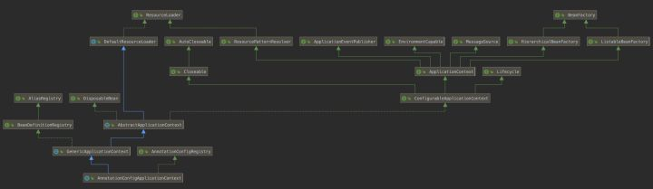

我想先把Spring拍扁了给大家看看，等大家大概熟悉以后，我再想着把它捏圆了。

如何拍扁？

> 任何继承或实现的方法和字段，我都当成是子类自己定义的，暂时不去关心什么父类、接口。

比如：

class Animal

```java
public class Animal {
    // 有名字
    public String name;

    // 会吃东西
    public void eat(){}
}
```

interface Art

```java
public interface Art {
    // 画画
    public void paint();

    // 唱歌
    public void sing();
}
```

class Human extends Animal implements Art

```java
public class Human extends Animal implements Art{
    // 有生日
    public Date birthday;

    // 会画画
    public void paint() {

    }

    // 会唱歌
    public void sing() {

    }
}
```

class Student extends Human

```java
public class Student extends Human {
    // 考试排名
    public String rank;

    // 会写作文
    public void write(){}

}
```

可以使用类的继承体系理清类与类之间的关系：

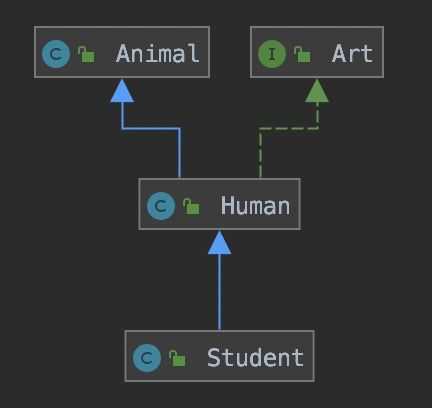

一目了然是吧？

但是有几个问题：

- 图上看不到具体的方法和字段
- 继承结构越复杂，这种图能提现的信息越少，到最后反而成了一种记忆负担

老实说，这种继承体系图只适合复习，而不是预习。

我并非刻意贬低继承体系图，但必须承认任何工具都有它的局限性，尤其当它面对的是Spring这样的怪物时。

来看看我的做法：


这才是真正的一目了然

当然，由于eat()方法实际并不由Student定义，实际调用时可能是这样：


但我只要知道student.eat()能返回执行结果就行，其他的我不管。

听到这，突然有个聪明的读者跳出来说：

> 一般来讲，方法都是public的，子类调用父类方法没问题。但是字段很多时候都是private的，你这样处理就有问题了。

那我倒要问问各位，你们平时定义了一个字段，会直接使用点语法访问吗：

```java
Student s = new Student();
// 直接通过点语法访问，得到学生考试排名
System.out.println(s.rank);
```

点语法访问的前提是，这个字段是public的，否则只能通过方法访问：getter/setter方法或者普通方法。而通过方法访问字段才是正道，点语法那是走后门，不一定通用！

举个例子，我在Human类中定义private String text字段，并提供了public void getText()方法。

```java
public class Human extends Animal implements Art{
    /*省略其他方法和字段*/

    // 测试数据
    private String text = "Human private message";

    // 得到测试数据
    public void getText(){
        System.out.println(text);
    }
}
```

测试

```java
public class Test {
    public static void main(String[] args) {
        Student s = new Student();
        s.getText(); // 测试结果是正常输出：Human private message
}
```

也就是说，虽然父类的字段是private的，但如果子类继承了父类方法，且这个方法中刚好用到了这个字段，那么就相当于间接访问了。

这就是我早期分析Spring的思路：忘掉复杂的继承体系，把Spring拍扁，浓缩到只有两个对象（暂时不知道没关系）

- AnnotationConfigApplicationContext
- DefaultListableBeanFactory

所有继承的、实现的、乱七八糟的东西，我都当成是直接定义在它俩内部的。

最后，让大家看看什么叫英雄所见略同（IDEA）

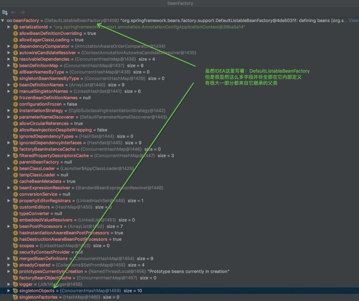

以前我没得选，现在我想简简单单做个BeanFactory

------

## 快说，你把东西存哪里了！！

Spring作为IOC容器，首要任务自然是解决对象存储问题。长久以来，我们都认为Spring是个能帮我们完成自动注入的大Map（不知为何，有点萌），但这其实是对它的误解。

说到Spring的源码，无论是谁都要扯扯ApplicationContext和BeanFactory。我也不能免俗，就从这里开始吧。

首先，这两个都是接口，而且ApplicationContext继承了BeanFactory。

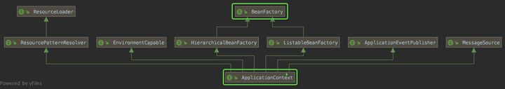

所以，我们先来看看BeanFactory：

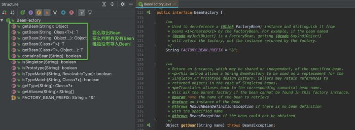

没看到addBean()之类的方法

不是说BeanFactory是Bean工厂吗，怎么“只出不进”？

那我又要反问在座各位一句了：你平时写代码，用什么存数据呀？

用接口吗？接口哪能存东西啊！！

**所有和存储相关的，追究到最后必然是字段或者集合。**

字段能存东西，是因为成员变量和成员方法是对象的基本组成，对象通过成员变量组织数据关系。集合也能存东西，因为它本身就是Java糅合了数据结构造出来专门存数据的。而且通常来说，相较于String、Integer这些，我们更愿意用集合作为一个成员变量，大气！

```java
public class Student {
    // 成员变量，用List存朋友
    private List<String> myFriends = new ArrayList<String>();

    // 其他方法...
}
```

而BeanFactory接口内部并没有定义字段去存储bean，仅仅是提供了方法规范：

> 所有实现BeanFactory接口的子类必须实现getBean()方法。

就好比有人提供了一张工厂设计图，规定了以后造的厂房必须有1个门、2个窗户，但设计图本身并不能存东西。既然BeanFactory接口本身不存储bean，那么不提供addBean()之类的方法也说得过去。

那真正存bean的工厂在哪呢？

向大家隆重介绍一下DefaultSingletonBeanRegistry（省略部分字段、方法）

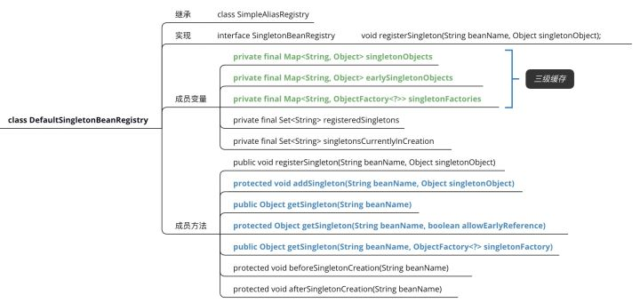

DefaultSingletonBeanRegistry是一个类。直译的话，就是“默认的单例bean注册表”

也就是说，**DefaultSingletonBeanRegistry是专门来管理单例bean的。**那它是怎么做的呢？主要从两个方面考察：

- 容器在哪？
- 如何存取？

**容器在哪？**

DefaultSingletonBeanRegistry最重要的三个成员变量：

- singletonObjects（存放单例bean）
- earlySingletonObjects
- singletonFactories

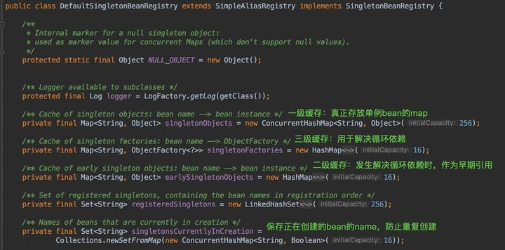

二、三级缓存暂时不用理会，只关注singletonObjects即可

我们之前所理解的Spring容器非常狭隘，认为它就是一个Map。但现在我们知道了，真正存bean的其实是一个叫singletonObjects的Map，但singletonObjects对于整个Spring体系来讲，九牛一毛。甚至DefaultSingletonBeanRegistry本身也只是在Spring容器的一个小角落。

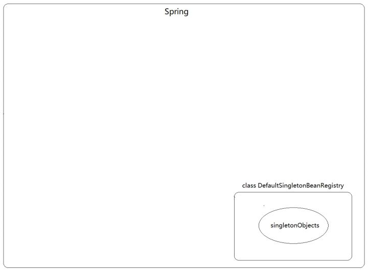

还有一个问题值得关注：既然是专门管理单例bean的工厂，它如何保证单例？

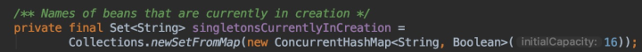

concurrentHashMap转成set

原来，DefaultSingletonBeanRegistry搞了一个Set<String> singletonsCurrentlyInCreation，专门来存放正在创建的单例bean的名字（注意，只是名字而不是bean，因为bean还在创建中）。

除了singletonsCurrentlyInCreation这个字段，它还设计了两个方法：

beforeSingletonCreation(String beanName)

```java
protected void beforeSingletonCreation(String beanName) {
    if (!this.inCreationCheckExclusions.contains(beanName) && !this.singletonsCurrentlyInCreation.add(beanName)) {
        throw new BeanCurrentlyInCreationException(beanName);
    }
}
```

afterSingletonCreation(String beanName)

```java
protected void afterSingletonCreation(String beanName) {
    if (!this.inCreationCheckExclusions.contains(beanName) && !this.singletonsCurrentlyInCreation.remove(beanName)) {
        throw new IllegalStateException("Singleton '" + beanName + "' isn't currently in creation");
    }
}
```

控制单例示意图

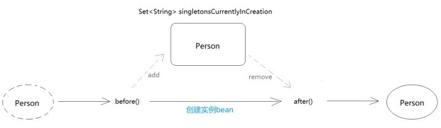

一个单例bean在创建前，先往singletonsCurrentlyInCreation存自己的name，其他bean在创建时，会先来这里确认有无同名bean


**如何存取？**

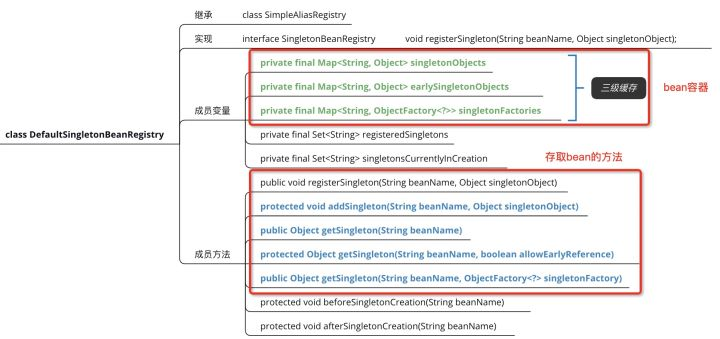

DefaultSingletonBeanRegistry提供了存取bean的一系列方法


我相信，看到这大家都没发现一个问题：DefaultSingletonBeanRegistry没有getBean()方法，因为它压根就没实现BeanFactory！！

图中左侧都是和bean别名相关的，不是很重要

它实现的是SingletonBeanRegistry，专门管理单例bean的。


好了，来捋一捋。目前为止，故事是这样的：

> 我们本来打算看看Spring的两大顶级接口ApplicationContext和BeanFactory，结果看BeanFactory时，发现它根本不是一个具体的工厂，不提供容器（没有可以存bean的成员变量），只规定了getBean()方法。于是，我们翻了翻，在Spring源码的某个角落发现了DefaultSingletonBeanRegistry，它是一个**类**，还设计了几个Map作为成员变量专门存放单例bean，也就是我们常说的“单例池”。但是，当我们研究DefaultSingletonBeanRegistry是如何存取东西时，发现它并没有实现BeanFactory！

**于是，现在出现了一个矛盾！**

我们已经基本确定单例bean就是存在DefaultSingletonBeanRegistry中，但是它却没有实现BeanFactory，没有提供getBean()。那么AnnotationConfigApplicationContext#getBean()最终通向何处？

（这句话一部分读者可能看不懂，就是说，我们原以为AnnotationConfigApplicationContext的getBean()会直通Bean容器DefaultSingletonBeanRegistry的getBean()，最终取到bean实例）


爱因斯坦曾说过，搞物理首先最重要的是想象力，要敢于大胆猜想。于是我们猜测，AnnotationConfigApplicationContext#getBean()不论怎么绕，最终都会来访问DefaultSingletonBeanRegistry的单例池singletonObjects：

singletonObjects是DefaultSingletonBeanRegistry定义的一个字段，俗称单例池，用来存储单例bean

我们在开头说过，一个字段需要通过方法才能访问。我们找了下，发现DefaultSingletonBeanRegistry有好几个getSingleton()方法：


让我们debug试试吧。

第一步，给applicationContext.getBean()打断点并开始运行：


第二步，找到DefaultSingletonBeanRegistry#getSingleton(String beanName, boolean allowEarlyReference)打上点断，然后放开上面的断点，让程序停在getSingleton(...)方法：

从单例池earlySingletonObjects中获得person

整体图


我们发现，AnnotationConfigApplicationContext#getBean()方法，经过层层调用最终还是找到了DefaultSingletonBeanRegistry的earlySingletonObjects。

按我的猜想，必然是AnnotationConfigApplicationContext通过层层继承，最终继承了DefaultSingletonBeanRegistry，然后getBean()方法在某一处调用了getSingleton()，最终从earlySingletonObjects拿到bean。


查看AnnotationConfigApplicationContext的类继承图应该可以看到它继承了DefaultSingletonBeanRegistry：

不用找了，图中根本没有DefaultSingletonBeanRegistry

我去，AnnotationConfigApplicationContext和DefaultSingletonBeanRegistry竟然没有任何关系，这两个类互相不认识...一瞬间，线索全断了。**毫无关系的两个类，是如何调用到的？**

冷静...冷静。

仔细想了想，按我们最初的设想，这单例池最好应该直接放在AnnotationConfigApplicationContext中，但现在发现其实人家单例池是在DefaultSingletonBeanRegistry中。这是已成事实的东西，没法改变。我们要做的就是克服客观上的困难，让AnnotationConfigApplicationContext去DefaultSingletonBeanRegistry访问单例池中的bean。

除了继承后使用父类方法访问父类变量，还有别的途径吗？

有，使用组合/聚合！

什么是组合/聚合？就是把整个对象直接塞到另一个对象中！当然，实际上应该是对象的引用，比如这样：

Parent

```java
public class Parent {
    
    // Parent包含Student
    private Student student;
    
    // 查看成绩
    public void getScore(){
        // 内部调用student.getScore()得到成绩
        System.out.println(student.getScore());
    }
    
}
```

Student

```java
public class Student {

    // 成绩
    private String score;

    public String getScore() {
        return score;
    }

    public void setScore(String score) {
        this.score = score;
    }
}
```

像上面这种情况，parent.getScore()虽然能得到学生的成绩，但是Parent本身和Student没有继承或实现关系，所以你在Parent的继承图上看不到Student。

那么，Spring的AnnotationConfigApplicationContext和DefaultSingletonBeanRegistry也是这种情况吗？

直接点进applicationContext.getBean()


我们来到了AbstractApplicationContext

翻译：ApplicationContext接口的抽象实现类，只是简单地实现了普通的上下文功能，使用模板方法模式，具体方法实现留给子类

请注意getBean()方法上面的注释：Implementation of BeanFactory interface，意味着这些getBean()方法是对BeanFactory的实现

卧槽，这注释写得也太人性化了吧，生怕你不知道AbstractApplicationContext实现了BeanFactory

所以AnnotationConfigApplicationContext也算是间接实现了BeanFactory

AbstractApplicationContext#getBean()（既然实现了BeanFactory，就有getBean()方法）

```java
@Override
public Object getBean(String name) throws BeansException {
    assertBeanFactoryActive();
    // 果然不出我们所料，AbstractApplicationContext内部好像组合了一个BeanFactory
    return getBeanFactory().getBean(name);
}
```

查看AbstractApplicationContext#getBeanFactory()，看看具体组合了哪个BeanFactory

结果发现这里用了模板方法模式，具体的实现留给了子类，AbstractApplicationContext本身并没有组合BeanFactory

继续点下去，我们来到了AbstractApplicationContext的**子类**GenericApplicationContext

GenericApplicationContext说自己包含了一个BeanFactory

GenericApplicationContext#getBeanFactory()


查看GenericApplicationContext的字段，我们终于发现了一个BeanFactory的子类：


所以，AnnotationConfigApplicationContext#getBean()整个过程应该是这样的：

利用模板方法模式，把getBeanFactory()留给子类实现，最终GenericApplicationContext组合了一个DefaultListableBeanFactory

至此，之前种种矛盾都由DefaultListableBeanFactory解决了：

> 【测试代码得到的结论】
> ApplicationContext继承了BeanFactory，AnnotationConfigApplicationContext是ApplicationContext子类，通过getBean()得到了单例对象。
>
> 【观察源码得到的结论】
> DefaultSingletonBeanRegistry拥有单例池earlySingletonObjects，但它没有实现BeanFactory，没有getBean()方法对外界访问。
>
> 【矛盾】
> 那么AnnotationConfigApplicationContext#getBean()怎么访问earlySingletonObjects？

答案就在DefaultListableBeanFactory这个“中介”上：


DefaultListableBeanFactory是ApplicationContext与SingletonBeanRegistry的中介

小结：


------

## ApplicationContext与BeanFactory

按照上面的分析，ApplicationContext继承了BeanFactory，好像和BeanFactory没啥区别。其实不是的。有了上面的预热，我们再来重新审视文章开头那张继承体系图：


也就是说，除了BeanFactory，ApplicationContext还继承了很多乱七八糟的接口来**扩展自己的功能**，比如：

- ResourcePatternResolver接口，继承自ResourceLoader，我们常说的包扫描就是它负责的
- ApplicationEventPublisher接口，关系着Spring的监听机制
- EnvironmentCapable接口，提供了获取环境变量的方法。环境变量意味着什么？关系着@PropertySource、@Value、@Profile等注解
- ...

来看一下官方文档对ApplicationContext的解释：

> The`org.springframework.beans`和`org.springframework.context`包是Spring Framework的IoC容器的基础。BeanFactory接口提供了能够管理任何类型对象的高级配置机制。ApplicationContext是BeanFactory的子接口，扩展了以下几点:
>
> 更容易与Spring的AOP特性集成
> 消息资源处理(用于国际化)
> 事件发布
> 应用程序层特定的上下文，如web应用程序中使用的WebApplicationContext。
>
> 简而言之，BeanFactory提供了配置框架和基本功能，而ApplicationContext添加了更多企业特定的功能。**ApplicationContext是BeanFactory的一个完整超集。**


2019-07-24 17:00:01


博主耗费一年时间编写的Java进阶小册已经上线，覆盖日常开发所需大部分技术，且通俗易懂、深入浅出、图文丰富，需要的同学请戳：


# 二、放弃 XML，走向注解

上一篇并没有实际地带大家去看源码，而是介绍了两个概念：

- BeanDefinition
- BeanPostProcessor

当然，我介绍得非常笼统，不论是BeanDefinition还是BeanPostProcessor其实都有着较为复杂的继承体系，种类也很多。作为Spring系列第一篇，主要目的还是帮大家摆脱对Spring的刻板认知，刷新你们的三观，毕竟太多人对Spring的理解仅限于所谓的IOC和AOP。现在Spring5都出来了，好多人还停留在Spring2.5、Spring3的年代，还在使用XML。

今天我将会带大家复习Spring的基础，大致流程是：

- 复习XML方式开发
- 通过逐步暴露XML的弊端，引出Spring注解
- 最终完全舍弃XML，采用Spring注解开发

之所以推荐注解开发，原因有两点：

- XML配置太繁琐了
- 掌握Spring注解开发有助于后期学习SpringBoot

只有熟练使用Spring后，看源码时才能把应用和原理联系起来。

**文章篇幅较长，建议看的时候先把下方目录截图，放在一旁做引导，防止自己看着看着不知道看到哪了。**

主要内容：

- IOC与DI
- Spring的3种编程风格与2种注入方式
- 1️⃣XML配置开发：<bean>描述依赖关系
- 自动装配：让<bean>职责单一化
- 2️⃣XML+注解：XML+<context:component-scan>+@Component
- @Autowired的小秘密
- 2️⃣JavaConfig+注解：@Configuration+@ComponentScan+@Component
- 3️⃣JavaConfig方式：@Configuration+@Bean
- 大乱斗：@ImportResource、@Component、@Bean

------

## IOC与DI

关于IOC的好处，推荐一篇文章，个人觉得写得很好：[Spring IoC有什么好处呢？](https://www.zhihu.com/question/23277575/answer/169698662)

大家不妨将IOC理解成一种思想，而DI是实现该思想的一种具体方式。Spring被称为IOC容器，它实现IOC的方式除了DI（Dependency Inject，依赖注入），其实还有DL（Dependency Look，依赖查找）。由于我们平时很少用到DL，所以这里只讨论DI（依赖注入）。

IOC与DI

### Spring依赖注入的做法

首先，提供一些配置信息（比如XML）来描述类与类之间的关系，然后由IOC容器（Spring Context）去解析这些配置信息，继而维护好对象之间的关系。

```xml
<!-- 配置信息：在XML中定义Bean -->
<bean id="person" class="com.bravo.annotation.Person">
    <property name="car" ref="car"></property>
</bean>


<bean id="car" class="com.bravo.annotation.Car"></bean>
```

其次，还有一个很重要的前提是，除了配置信息，对象之间**也要**体现依赖关系。

```java
public class Person {
    // Person类中声明了Car，表示Person依赖Car
    private Car car;
    // 由于上面XML使用了<property>标签，表示setter方法注入，所以必须提供setter方法
    public void setCar(Car car) {
        this.car = car;
    }
}
```

总结起来就是：

- 编写配置信息描述类与类之间的关系（XML/注解/Configuration配置类均可）
- 对象之间的依赖关系必须在类中定义好（一般是把依赖的对象作为成员变量）
- Spring会按照配置信息的指示，通过构造方法或者setter方法完成依赖注入

XML中bean标签的职责：1.定义bean 2.维护bean依赖关系，指导Spring完成依赖注入

------

## Spring的3种编程风格与2种注入方式

按照Spring官方文档的说法，Spring的容器配置方式可以分为3种：

- Schema-based Container Configuration（XML配置）
- Annotation-based Container Configuration（注解）
- Java-based Container Configuration（@Configuration配置类）

Spring支持的2种注入方式：

- 构造方法注入
- setter方法注入

在Spring4之前，Spring还支持接口注入（很少用），这里不提及。

（这个分类还是有问题，后面分析源码时再解释）

大家必须要明确，所谓3种编程风格和2种注入方式到底指什么，之间又有什么联系？

我们从2种注入方式开始分析。

> Q：Spring注入的是什么？
> A：是Bean。
> Q：这些Bean怎么来的？
> A：IOC容器里的。

所以，所谓的3种编程风格其实指的是“将Bean交给Spring管理的3种方式”，可以理解为IOC，而2种注入方式即DI，是建立在IOC的基础上的。也就是说Spring的DI（依赖注入）其实是以IOC容器为前提。

3种编程风格其实指的是3种把Bean交给Spring管理的方式，而DI有2种方式：setter方法注入/构造方法注入

接下来，我们把3种编程风格分别用代码实验一下。

Spring系列文章我都会贴出完整、可运行的代码，所以建议大家一边看一边复制到本地调试，这样学得更快。

------

## 1️⃣XML配置开发：<bean>描述依赖关系

### setter方法注入

pom.xml

```xml
    <dependencies>
        <dependency>
            <groupId>org.springframework</groupId>
            <artifactId>spring-context</artifactId>
            <version>4.3.12.RELEASE</version>
        </dependency>
    </dependencies>
```

配置信息（setter方法注入）

```xml
<?xml version="1.0" encoding="UTF-8"?>
<beans xmlns="http://www.springframework.org/schema/beans"
       xmlns:xsi="http://www.w3.org/2001/XMLSchema-instance"
       xsi:schemaLocation="http://www.springframework.org/schema/beans
       http://www.springframework.org/schema/beans/spring-beans.xsd">


    <!-- 在xml中描述类与类的配置信息 -->
    <bean id="person" class="com.bravo.xml.Person">
        <!-- property标签表示，让Spring通过setter方法注入-->
        <property name="car" ref="car"></property>
    </bean>


    <bean id="car" class="com.bravo.xml.Car"></bean>


</bean
```

Person（这里偷懒，把后面要讲的构造器注入的准备工作也做了，对运行结果不影响）

```java
public class Person {


    // Person依赖Car
    private Car car;


    // 无参构造
    public Person(){}


    // 有参构造
    public Person(Car car){
        this.car = car;
        System.out.println("通过构造方法注入...");
    }


    // setter方法
    public void setCar(Car car) {
        this.car = car;
        System.out.println("通过setter方法注入...");
    }


    @Override
    public String toString() {
        return "Person{" +
                "car=" + car +
                '}';
}
```

Car

```java
public class Car {
}
```

Test

```java
public class Test {
    public static void main(String[] args) {
        // 由于是XML配置方式，对应的Spring容器是ClassPathXmlApplicationContext,传入配置文件告知Spring去哪读取配置信息
        ApplicationContext applicationContext = new ClassPathXmlApplicationContext("spring-context.xml");
        // 从容器中获取Person
        Person person = (Person) applicationContext.getBean("person");
        System.out.println(person);
    }
}
```

目录结构


测试结果

由于XML中配置依赖信息时，使用了property标签，所以Spring会调用setter方法注入

### 构造方法注入

接下来，我们试一下构造方法注入：

```xml
<?xml version="1.0" encoding="UTF-8"?>
<beans xmlns="http://www.springframework.org/schema/beans"
       xmlns:xsi="http://www.w3.org/2001/XMLSchema-instance"
       xsi:schemaLocation="http://www.springframework.org/schema/beans
       http://www.springframework.org/schema/beans/spring-beans.xsd">


    <!-- 在xml中描述类与类的配置信息 -->
    <bean id="person" class="com.bravo.xml.Person">
        <!-- constructor-arg标签表示，让Spring通过构造方法注入-->
        <constructor-arg ref="car"></constructor-arg>
    </bean>
    <bean id="car" class="com.bravo.xml.Car"></bean>
    
</beans>
```

测试结果

其他代码都没变，仅仅改变配置信息，由property标签变为constructor-arg标签，Spring就知道要改为构造器注入了


至此，我们把XML配置下2种注入方式都实验过了，它们的区别是：

- XML配置<property> + 对象提供对应的setter方法
- XML配置<constructor-arg> + 对象提供对应的构造方法

改变XML配置的同时，需要对象提供对应的方法支持。如果你用了<property>，却没有在类中提供setter方法，则会报错。


------

## 自动装配：让<bean>职责单一化

我们会发现<bean>这个标签，其实承载着两个作用：

- 定义bean，告诉Spring哪个Bean需要交给它管理（放入容器）
- 维护bean与bean之间的依赖关系

接下来我们思考这样一个问题：

对于Person类

```java
public class Person {
    // Person依赖Car
    private Car car;


    public void setCar(Car car) {
        this.car = car;
    }
}
```

上面代码其实已经很好地描述了Person和Car的依赖关系，此时在XML中继续用<property>或者<constructor-arg>反而成了累赘：

- 既然类结构本身包含了依赖信息，<bean>再用<property>等去描述就显得多余了
- 如果类结构变动，我们还需要额外维护<bean>的依赖信息，很麻烦。比如Person新增了一个shoes字段，那么<bean>又要写一个<property>表示shoes

所以，最好的做法是把让<bean>标签职责单一化，让它只负责定义bean，把bean与bean的依赖关系转交给类自身维护（有这个字段就说明有依赖）。

既然菜鸡的我们能想到，那么Spring肯定也想到了，于是它提出了“自动装配”的概念。很多人一听到自动装配，脑子里只有@Autowired。不算错，但其实XML也支持自动装配，而且真要论先来后到的话，肯定还是XML的自动装配在前。

XML实现自动装配可以分为两种：全局、局部。

### **全局自动装配（XML根标签<beans>末尾加default-autowire配置）**

```xml
<?xml version="1.0" encoding="UTF-8"?>
<beans xmlns="http://www.springframework.org/schema/beans"
       xmlns:xsi="http://www.w3.org/2001/XMLSchema-instance"
       xsi:schemaLocation="http://www.springframework.org/schema/beans
       http://www.springframework.org/schema/beans/spring-beans.xsd"
        default-autowire="byName">

    <!-- 在xml中只定义bean，无需配置依赖关系 -->
    <bean id="person" class="com.bravo.xml.Person"></bean>
    <bean id="car" class="com.bravo.xml.Car"></bean>
  
</beans>
```

所谓全局，就是在XML根标签末尾再加一个配置default-autowire="byName"，那么在此XML中配置的每一个<bean>都遵守这个自动装配模式，可选值有4个：

- byName
- byType
- constructor
- no

default其实就是no

测试结果

我们会发现改用自动装配后，虽然没有了property标签，但是默认是调用setter方法


**局部自动装配（每一个<bean>单独设置autowire）**

```xml
<?xml version="1.0" encoding="UTF-8"?>
<beans xmlns="http://www.springframework.org/schema/beans"
       xmlns:xsi="http://www.w3.org/2001/XMLSchema-instance"
       xsi:schemaLocation="http://www.springframework.org/schema/beans
       http://www.springframework.org/schema/beans/spring-beans.xsd">

    <!-- 在xml中只定义bean，无需配置依赖关系 -->
    <bean id="person" class="com.bravo.xml.Person" autowire="byName"></bean>
    <bean id="car" class="com.bravo.xml.Car"></bean>

</bean
```

测试结果


小结：

- Spring支持自动装配（全局/局部），把原先<bean>标签的职责单一化，只定义bean，而依赖关系交给类本身维护
- 自动装配共4种，除了no，其他3种各自对应两种注入方式：byName/byType对应setter方法注入，constructor对应构造方法注入 **（请自己动手证明）**


------


## 2️⃣XML+注解：XML+<context:component-scan>+@Component

原本<bean>标签有两个职责：

- 定义bean
- 描述依赖信息

上面通过自动装配，把依赖信息交给类本身维护，从此<bean>只负责bean定义。

现在，我们想想办法，能不能干脆把bean定义也剥离出来？这样就不需要在XML中写任何<bean>标签了。我早就看<bean>标签不爽了，这么一大坨，要是bean多了，就很臃肿。

怎么做呢？

我们先来回顾一下手上的牌面：


至此，我们已经成功调教Spring帮我们做了自动装配，也就是说IOC和DI中，DI已经实现自动化。我们接下来要考虑的是如何减少IOC配置的工作量。

原先是把<bean>写在XML中，再把XML喂给Spring：

```java
ApplicationContext applicationContext = new ClassPathXmlApplicationContext("spring-context.xml");
```

既然现在打算消灭XML中的<bean>，则说明即使把XML喂给Spring，它也吃不到bean定义了。所以，必须要告诉Spring去哪可以吃到bean。

我们来看一下，当Spring吃下<bean>时，到底吃了什么：

```xml
<!-- 在xml中只定义bean，无需配置依赖关系 -->
<bean id="person" class="com.bravo.xml.Person" autowire="byName"></bean>
<bean id="car" class="com.bravo.xml.Car"></bean>
```

是的，<bean>只指定了类名和自动装配的模式。也就是说，要定义一个bean，只需要最基本的两样东西：

- 类名
- 装配模式（其实这个也不是必须的，默认no，不自动装配）

而类名其实很好得到，我们自己写的类不就有吗？至于自动装配的模式，也完全可以在类中通过注解指定。于是，我们找到了改造的方向：用带注解的类代替<bean>标签。

之前：XML中写好bean标签后，把XML喂给Spring，Spring就会把bean实例化加到容器

现在：消灭bean标签后，XML中已经没有bean，Spring必须自己去找bean定义

Spring2.5开始提供了一系列注解，比如@Component、@Service等，这些注解都是用来表示bean的。而@Service等注解底层其实还是@Component：


之所以做一层封装，是为了赋予它特殊的语义：定义Service层的bean。其余的这里不再赘述。总之我们暂时理解为，如果要使用注解表示bean定义，我们能用的只有@Component。


新建annotation包，把Car和Person移过去：


Person

```java
@Component //带注解的类，我们希望用这种方式定义bean，并让Spring把它吃进去
public class Person {


    // Person依赖Car
    private Car car;


    @Override
    public String toString() {
        return "Person{" +
                "car=" + car +
                '}';
    }
}
```

Car

```java
@Component
public class Car {
}
```

XML（什么都没有配置，连自动装配模式也没指定，因为不在这里定义bean了）

```xml
<?xml version="1.0" encoding="UTF-8"?>
<beans xmlns="http://www.springframework.org/schema/beans"
       xmlns:xsi="http://www.w3.org/2001/XMLSchema-instance"
       xsi:schemaLocation="http://www.springframework.org/schema/beans
       http://www.springframework.org/schema/beans/spring-beans.xsd">


</beans>
```

Test（不变）

```java
public class Test {
    public static void main(String[] args) {
        // 由于是XML配置方式，对应的Spring容器是ClassPathXmlApplicationContext,传入配置文件告知Spring去哪读取配置信息
        ApplicationContext applicationContext = new ClassPathXmlApplicationContext("spring-context.xml");
        // 从容器中获取Person
        Person person = (Person) applicationContext.getBean("person");
        System.out.println(person);
    }
}
```

测试结果

在Spring容器中找不到person

其实很好理解，我们传入了spring-context.xml告诉Spring去哪读取bean定义，但是实际上XML却没有配置任何<bean>，它是不可能把类实例化加入到容器的。

然而我们新定义的bean（@Component）Spring也没吃，怎么回事？

其实主要是因为我们的改变太突然了，Spring以前吃惯了XML中的<bean>，现在突然换成@Component这种注解类，它吃不惯，甚至不知道它能吃！

所以，必须通知Spring：

> 老哥，我们改用注解了，有@Component注解的类就是bean，和以前<bean>一样一样的。

如何通知？只要在XML中配置：

```xml
 <context:component-scan base-package="com.bravo.annotation"/>
```

官方文档对这个标签的解释是：

> The use of <context:component-scan> implicitly enables the functionality of <context:annotation-config>. There is usually no need to include the <context:annotation-config> element when using <context:component-scan>.

翻译过来就是：

> 使用<context:component-scan>隐式地启用了<context:annotation-config>的功能。<context:annotation-config>的作用是让Spring具备解析@Component等注解的功能。当使用<context:component-scan>时，通常不需要包含<context:annotation-config>元素。

**这个标签的作用相当于什么呢？Spring一口吃下去，发现没有吃到<bean>，却吃出了一张小纸条，上面写着：赶紧去找标了@Component注解的类，那是新菜式！**

所以，最终</context:component-scan>标签的作用有两个：

- 扫描：原先我们把写有bean定义的XML文件喂给Spring，现在则让Spring自己去指定路径下扫描bean定义
- 解析：让Spring具备解析注解的功能

所以，XML虽然不用配置<bean>标签，却要配置扫描（需要配置额外的名称空间）：

```xml
<?xml version="1.0" encoding="UTF-8"?>
<beans xmlns="http://www.springframework.org/schema/beans"
       xmlns:xsi="http://www.w3.org/2001/XMLSchema-instance"
       xmlns:context="http://www.springframework.org/schema/context"
       xsi:schemaLocation="http://www.springframework.org/schema/beans
           http://www.springframework.org/schema/beans/spring-beans.xsd
           http://www.springframework.org/schema/context
           http://www.springframework.org/schema/context/spring-context-3.0.xsd">


    <context:component-scan base-package="com.bravo.annotation"/>


</beans
```

测试结果：

虽然能找到Person了，但是Car并没有被注入

又出幺蛾子了，怎么回事呢？我们回想一下XML的bean定义：

```xml
<!-- 在xml中只定义bean，无需配置依赖关系 -->
<bean id="person" class="com.bravo.xml.Person" autowire="byName"></bean>
<bean id="car" class="com.bravo.xml.Car"></bean>
```

我们设置了autowire属性，告诉Spring按什么方式自动装配。

现在我们改用注解了，@Component只是相当于<bean>标签，却没有指明自动装配的模式。如何在类中告诉Spring我们需要的装配方式呢？

方法有很多种：

- @Autowired（Spring提供的）
- @Resource（JSR-250定义）
- @Inject（JSR-330定义）

这里我们以@Autowired为例：

```java
@Component
public class Person {


    // 用@Autowired告知Spring：请把Car装配进来
    @Autowired
    private Car car;


    @Override
    public String toString() {
        return "Person{" +
                "car=" + car +
                '}';
    }
}
```

测试结果

自动装配成功！


------

## @Autowired的小秘密

上面我们有惊无险地从用@Component替换了<bean>，并且结识了@Autowired这个超棒的注解，用来完成自动装配。即：

- <context:component-scan>+@Component彻底解放IOC配置
- @Autowired完成自动装配

但是细心的小伙伴会发现，相较于<bean>中的autowire="byName"，@Autowired虽然装配成功了，却没有显式地指定自动装配的模式。

只有一种解释：它有默认的装配方式。

在探究@Autowire默认的装配模式之前，关于bean的名称，要和大家先交代一下：

```xml
<!-- 在xml中只定义bean，无需配置依赖关系 -->
<bean id="person" class="com.bravo.xml.Person" autowire="byName"></bean>
<bean id="car" class="com.bravo.xml.Car"></bean>
```

在<bean>中，id即为最终bean在Spring容器的名字。

同样的，@Component也提供了给bean命名的方法：


```java
@Component("bravo")
public class Person {


    // 用@Autowired告知Spring：请把Car装配进来
    @Autowired
    private Car car;


    @Override
    public String toString() {
        return "Person{" +
                "car=" + car +
                '}';
    }
}
```

如果不指定，则默认会把类名首字母小写后作为beanName。

铺垫结束，我们开始探究@Autowired到底默认是哪种装配模式：

- byName
- byType
- constructor
- no（已经装配成功，排除）

先来看看是不是byName

```java
@Component
public class Person {


    // 用@Autowired告知Spring：请把Car装配进来
    @Autowired
    private Car myCar;


    @Override
    public String toString() {
        return "Person{" +
                "car=" + myCar +
                '}';
    }
}
```

测试结果


Car在Spring中bean的名字应该是car，而我把Person中的Car变量名改为myCar，仍旧注入成功，说明不是byName。

再来看看是不是byType。

这个稍微有点麻烦，因为我需要弄出至少两个同类型的bean。所以我打算把Car变成接口，然后创建Bmw和Benz两个实现类。这个接口只是为了试验，没有实际意义：

Car

```java
//接口
public interface Car {
}


//实现类Bmw
@Component
public class Bmw implements Car {
}


//实现类Benz
@Component
public class Benz implements Car {
}
```

Person

```java
@Component
public class Person {


    // 用@Autowired告知Spring：请把Car装配进来
    @Autowired
    private Car car;


    @Override
    public String toString() {
        return "Person{" +
                "car=" + car +
                '}';
    }
}
```

测试结果

熟悉的配方、熟悉的味道：expected single matching bean but found 2: BMW,benz

很明显，@Autowired默认采用byType的方式注入，由于当前Spring容器中存在两个Car类型的bean，所以注入时报错了，因为Spring无法替我们决定注入哪一个。

但是，有个神奇的现象是，你如果把变量名改为bmw或者benz，就会注入对应的bean：

```java
@Component
public class Person {

    // 把变量名改为bmw
    @Autowired
    private Car bmw;

    @Override
    public String toString() {
        return "Person{" +
                "car=" + bmw +
                '}';
    }
}
```


**也就是说，@Autowired默认采用byType模式自动装配，如果找到多个同类型的，会根据名字匹配。都不匹配，则会报错。**

当然，有些人可能有强迫症，觉得我Car类型的变量必须叫car，但又想指定注入bmw，怎么办？我们先看看@Autowired能不能指定名字吧：

不能指定名字，因为Autowired只有一个属性：required，表示当前bean是否必须被注入

为了弥补@Autowired不能指定名字的缺憾，Spring提供了@Qualifier注解

```java
@Qualifier("benz")
@Autowired
private Car car;
```

即使Spring容器中有两个Car类型的bean，也只会按名字注入benz。


其他的我就不测了，给个结论就好：

- @Autowired：默认byType，type相同则byName
- @Resource：和@Autowired几乎一样，但不能配合@Qualifier，因为它本身就可以指定beanName。但没有required属性

```java
@Resource(name = "benz")
private Car car;
```

- @Inject：用的很少，不做讨论

------


## 2️⃣JavaConfig+注解：@Configuration+@ComponentScan+@Component

有没有发现，上面标题还是2️⃣？因为接下来要介绍的，还是注解开发。

先复习一下前面两种方式：

- 纯XML（<bean>负责定义bean，Java类负责定义依赖，Spring完成自动装配）

```xml
<!-- 在xml中只定义bean，无需配置依赖关系 -->
<bean id="person" class="com.bravo.xml.Person" autowire="byName"></bean>
<bean id="car" class="com.bravo.xml.Car"></bean>
```


- 注解+XML（@Component+@Autowired，但我们发现注解并不能单独使用，必须要XML中配置开启注解扫描才能生效）

```xml
 <context:component-scan base-package="com.bravo.annotation"/>
```


之前我在[注解（上）](https://zhuanlan.zhihu.com/p/60941426)讲过，注解的使用必须包含三步：定义注解、使用注解、解析注解。@Component是Spring**定义**、我们**使用**，也肯定是由Spring**解析**。但是这个解析必须由我们手动开启。这就是<context:component-scan>标签的意义。

到了这一步我们已经把<bean>标签完全消灭了。但是这种模式有点不伦不类。

你说它叫XML配置开发吧，它又有@Component注解。你说它是注解开发吧，XML中还有一个<context:component-scan>在那嘚瑟呢。所以如何才能完全消灭XML呢？

究其根本，我们发现无法消灭XML的原因在于：注解的读取和解析必须依赖于<context:component-scan>标签！因为我们要帮Spring开启注解扫描，不然他不知道去哪读取bean。

既然<bean>标签可以被@Component代替，那么<context:component-scan>标签应该也能找到对应的注解。

不错！这个注解就是@ComponentScan！如此一来我们就再也不需要spring-context.xml了。

但是转念一想，脊背发凉...ClassPathXmlApplicationContext这个类要求我们必须传一个XML，怎么办？别担心，Spring同样提供了一个注解@Configuration，目的是让我们可以把一个普通的Java类等同于一个XML文件，而这个Java类就是JavaConfig，我们习惯称之为配置类。

新建一个javaconfig包，把annotation包下的所有类移过来，并且新建AppConfig配置类

```java
@Configuration //表示这个Java类充当XML配置文件
@ComponentScan(basePackages = "com.bravo.javaconfig") //相当于XML中的<context:component-scan>标签
public class AppConfig {


}
```

这样，我们就可以把XML删除，用@ComponentScan来开启注解扫描。

目录结构


准备测试时，发现了大麻烦：

ClassPathXmlApplicationContext无法接受AppConfig配置类，它只认XML

所以，用AppConfig配置类替代XML只是我们的一厢情愿吗？

其实是我们选错了实现类。ApplicationContext的子类除了ClassPathXmlApplicationContext，还有一个专门针对注解开发的：AnnotationConfigApplicationContext。


新的Test

```java
public class Test {
    public static void main(String[] args) {
        // AnnotationConfigApplicationContext是Spring用来专门针对注解开发的ApplicationContext子类
        ApplicationContext applicationContext = new AnnotationConfigApplicationContext(AppConfig.class);
        // 从容器中获取Person
        Person person = (Person) applicationContext.getBean("person");
        System.out.println(person);
    }
}
```

测试结果

稳得一批

至此，XML已经被我们完全消灭了。

------

## 3️⃣JavaConfig方式：@Configuration+@Bean

严格来说，上面的做法并不是所谓的Java-based Container Configuration（@Configuration配置类）风格。我们虽然用到了@Configuration，但只是为了让Java配置类替代XML，最终消灭XML。这也太大材小用了...本质上，这还是@Component+@Autowired注解开发，只是开启注解扫描的方式从<context:component-scan>标签变为@ComponentScan。

实际上，真正的Java-based Container Configuration编程风格是这样的：

AppConfig（如果你不扫描@Component，则不需要@ComponentScan）

```java
@Configuration
public class AppConfig {

    //new一个Benz对象，通过@Bean注解告知Spring把这个bean加到容器
    @Bean
    public Car benz(){
       return new Benz();
    }
    
    //new一个Bmw对象，通过@Bean注解告知Spring把这个bean加到容器
    @Bean
    public Car bmw(){
        return new Bmw();
    }
    
    //new一个Person对象，通过@Bean注解告知Spring把这个bean加到容器
    @Bean
    public Person person(){
        Person p = new Person();
        p.setCar(new Benz());
        return p;
    }

}
```

Benz（去除@Component，那是注解开发方式）

```java
public class Benz implements Car {
}
```

Bmw（去除@Component，那是注解开发方式）

```java
public class Bmw implements Car {
}
```

Person（去除@Component，那是注解开发方式）

```java
public class Person {

    private Car car;

    // setter方法。在@Bean场景下，手动调用setter方法设置成员变量
    public void setCar(Car car) {
        this.car = car;
    }
 
    @Override
    public String toString() {
        return "Person{" +
                "car=" + car +
                '}';
    }
}
```

测试结果


小结

Java-based Container Configuration编程风格指的是：

- 用@Configuration把一个普通Java类变成配置类，充当XML
- 在配置类中写多个方法，加上@Bean把返回值对象加到Spring容器中
- 把配置类AppConfig喂给AnnotationConfigApplicationContext，让它像解析XML一样解析配置类
- 无需加@Component注解，因为我们可以手动new之后通过@Bean加入容器


------


## 大乱斗：@ImportResource、@Component、@Bean

其实XML、注解、JavaConfig三种方式相互兼容，并不冲突。

- XML的<bean>
- @Component注解和扫描（不论是<context:component-scan>还是@ComponentScan）
- @Configuration与@Bean

为了证实它们确实不冲突，我搞了很变态的，一个项目里三种编程方式混用：

- 两辆车子，bmw和benz交给@Bean（JavaConfig）
- Person交给@Component和@ComponentScan（注解）
- Student交给XML和@ImportResource（XML）

目录结构


AppConfig

```java
@Configuration //JavaConfig方式，把当前Java类作为配置类
@ComponentScan(basePackages = "com.bravo.all")//注解方式，开启扫描
@ImportResource("spring-context.xml")//XML方式，导入bean定义
public class AppConfig {


    @Bean
    public Car benz(){
       return new Benz();
    }


    @Bean
    public Car bmw(){
        return new Bmw();
    }

}
```

Car

```java
public interface Car {
}
```

Benz（JavaConfig方式：@Bean加入Spring）

```java
public class Benz implements Car {
}
```

Bmw（JavaConfig方式：@Bean加入Spring）

```java
public class Bmw implements Car {
}
```

Person（注解方式：@ComponentScan扫描@Component加入Spring）

```java
@Component
public class Person {


    // 用@Autowired告知Spring：请把Car装配进来
    @Qualifier("benz")
    @Autowired
    private Car car;


    @Override
    public String toString() {
        return "Person{" +
                "car=" + car +
                '}';
    }
}
```

Student（XML方式：使用<bean>定义）

```java
public class Student {
    private Car bmw;


    //由于在下方XML配置中，我选用了byName自动装配，而byName/byType都要提供setter方法
    public void setBmw(Car bmw) {
        this.bmw = bmw;
    }


    @Override
    public String toString() {
        return "Student{" +
                "car=" + bmw +
                '}';
    }
}
```

spring-context.xml

```xml
<?xml version="1.0" encoding="UTF-8"?>
<beans xmlns="http://www.springframework.org/schema/beans"
       xmlns:xsi="http://www.w3.org/2001/XMLSchema-instance"
       xsi:schemaLocation="http://www.springframework.org/schema/beans
       http://www.springframework.org/schema/beans/spring-beans.xsd">

    <!-- 在xml中描述类与类的配置信息 -->
    <bean id="student" class="com.bravo.all.Student" autowire="byName">
    </bean>

</beans>
```

Test

```java
public class Test {
    public static void main(String[] args) {
        // AnnotationConfigApplicationContext是Spring用来专门针对注解开发的ApplicationContext子类
        ApplicationContext applicationContext = new AnnotationConfigApplicationContext(AppConfig.class);
        // 从容器中获取Person
        Person person = (Person) applicationContext.getBean("person");
        System.out.println(person);
        // 从容器中获取Student
        Student student = (Student) applicationContext.getBean("student");
        System.out.println(student);
    }
}
```

测试结果


通常来说，我们日常开发一般是注解+JavaConfig混用。也就是

- @ComponentScan+@Configuration+@Component+@Bean


------

## 小结

- 纯XML配置开发：没有注解，全部<bean>标签，但也可以配置自动装配

- 注解开发不能单独存在，需要**开启扫描**。自动装配一般用@Autowired

- - XML+注解：XML+**<context:component-scan>**+@Component
    - JavaConfig+注解：@Configuration+**@ComponentScan**+@Component

- JavaConfig方式：@Configuration+@Bean

通常我们都会两两混用，比如XML+注解，或者JavaConfig+注解，但很少三种一起用。

本文目的是让大家知道：

- 3种编程风格：XML、注解、JavaConfig
- 2种注入方式：setter方法、构造方法
- 4种装配模式：byType、byName、constructor、no

然后，有一点需要和大家说明，本文关于所谓的2种注入方式和4种装配方式，在宏观上来说是对的，但是在源码层面上来说，还是太笼统了。有机会的话，后面专门写一篇自动装配相关的文章。


博主耗费一年时间编写的Java进阶小册已经上线，覆盖日常开发所需大部分技术，且通俗易懂、深入浅出、图文丰富，需要的同学请戳：


# Spring基础(3)：复习

[](https://www.zhihu.com/people/huangsunting)

[bravo1988](https://www.zhihu.com/people/huangsunting)

Java进阶小册已上线，详见动态置顶，助力野生程序员

52 人赞同了该文章

为了让大家更容易接受我的一些观点，上一篇很多笔墨都用在了思路引导上，所以导致文章可能比较臃肿。

这一篇来总结一下，会稍微精简一些，但整体趣味性不如第二篇。

(上一篇说过了，目前介绍的2种注入方式的说法其实不够准确，后面源码分析时再详细介绍)

主要内容：

- 如何把对象交给Spring管理
- 依赖注入
- 自动装配
- <bean>、@Component还是@Bean
- 聊一聊@ComponentScan

------

## 如何把对象交给Spring管理

首先明确2个概念：Spring Bean和Java Object。

在Spring官方文档中，Bean指的是交给Spring管理、且在Spring中经历完整生命周期（创建、赋值、各种后置处理）的Java对象。

Object指的是我们自己new的、且没有加入Spring容器的Java对象。


笼统地讲，要把对象交给Spring管理大概有3种方式（其他方式以后补充）：

- XML配置：<bean>
- 注解开发：@Component
- 配置类：@Configuration+@Bean

这里要稍微强调以下几点：


首先，XML配置方式必须搭配ClassPathXmlApplicationContext，并把XML配置文件喂给它

```xml
<?xml version="1.0" encoding="UTF-8"?>
<beans xmlns="http://www.springframework.org/schema/beans"
       xmlns:xsi="http://www.w3.org/2001/XMLSchema-instance"
       xsi:schemaLocation="http://www.springframework.org/schema/beans
       http://www.springframework.org/schema/beans/spring-beans.xsd">

    <!-- 在xml中描述类与类的配置信息 -->
    <bean id="person" class="com.bravo.xml.Person">
        <property name="car" ref="car"></property>
    </bean>

    <bean id="car" class="com.bravo.xml.Car"></bean>
</beans>
```


```java
public class Test {
    public static void main(String[] args) {
        // 由于是XML配置方式，对应的Spring容器是ClassPathXmlApplicationContext,传入配置文件告知Spring去哪读取配置信息
        ApplicationContext applicationContext = new ClassPathXmlApplicationContext("spring-context.xml");
        // 从容器中获取Person
        Person person = (Person) applicationContext.getBean("person");
        System.out.println(person);
    }
}
```


其次，所谓的注解开发不是说只要打上@Component注解，Spring就会把这个注解类解析成BeanDefinition然后实例化放入容器，**必须配合注解扫描。**

开启扫描的方式有2种：

- <context:component-scan>（XML+注解）
- @ComponentScan（@Configuration配置类+注解）

大家可以把注解开发等同于@Component，只不过这个注解的解析必须开启扫描。所以，在我眼中@Component其实只是半吊子，必须依附于XML或者@Configuration配置类。


最后，狭隘的JavaConfig风格可以等同于@Configuration+@Bean。**此时，配置类上面的@ComponentScan并不是必须的。这取决于你是否要另外扫描@Component注解。一旦加了@ComponentScan，其实就是JavaConfig+注解了。**

```java
@Configuration //表示这个Java类充当XML配置文件
public class AppConfig {
    @Bean
    public Person person(){
        Person person = new Person();
        person.setCar(new Benz());
        return person;
    }
}
```


```java
public class Test {
    public static void main(String[] args) {
        // AnnotationConfigApplicationContext专门搭配@Configuration配置类
        ApplicationContext applicationContext = new AnnotationConfigApplicationContext(AppConfig.class);
        // 从容器中获取Person
        Person person = (Person) applicationContext.getBean("person");
        System.out.println(person);
    }
} 
```


3种编程风格其实指的是把Bean交给Spring管理的3种方式：

- <bean>
- @Component
- @Configuration+@Bean

至此，我们已经知道如何把Bean交给IOC。接下来，我们聊一聊DI。

------

## 依赖注入

虽然注入方式不止两种，但我们还是暂时按照两种方式复习

- setter方法注入
- 构造方法注入

**setter方法注入**

```xml
<?xml version="1.0" encoding="UTF-8"?>
<beans xmlns="http://www.springframework.org/schema/beans"
       xmlns:xsi="http://www.w3.org/2001/XMLSchema-instance"
       xsi:schemaLocation="http://www.springframework.org/schema/beans
       http://www.springframework.org/schema/beans/spring-beans.xsd">

    <!-- 在xml中描述类与类的配置信息 -->
    <bean id="person" class="com.bravo.xml.Person">
        <!-- property标签表示，让Spring通过setter方法注入-->
        <property name="car" ref="car"></property>
    </bean>
    <bean id="car" class="com.bravo.xml.Car"></bean>
    
</beans>
```

Person

```java
public class Person {

    // Person依赖Car
    private Car car;

    // setter方法
    public void setCar(Car car) {
        this.car = car;
        System.out.println("通过setter方法注入...");
    }

    @Override
    public String toString() {
        return "Person{" +
                "car=" + car +
                '}';
    }
}
```

Car

```java
public class Car {
}
```

<bean>中配置<property>，则类中必须提供setter方法。因为<property>等于告诉Spring调用setter方法注入。

**构造方法注入**

```xml
<?xml version="1.0" encoding="UTF-8"?>
<beans xmlns="http://www.springframework.org/schema/beans"
       xmlns:xsi="http://www.w3.org/2001/XMLSchema-instance"
       xsi:schemaLocation="http://www.springframework.org/schema/beans
       http://www.springframework.org/schema/beans/spring-beans.xsd">

    <!-- 在xml中描述类与类的配置信息 -->
    <bean id="person" class="com.bravo.xml.Person">
        <!-- constructor-arg标签表示，让Spring通过构造方法注入-->
        <constructor-arg ref="car"></constructor-arg>
    </bean>
    <bean id="car" class="com.bravo.xml.Car"></bean>
    
</beans>
```

Person

```java
public class Person {

    // Person依赖Car
    private Car car;

    // 有参构造
    public Person(Car car){
        this.car = car;
        System.out.println("通过构造方法注入...");
    }

    @Override
    public String toString() {
        return "Person{" +
                "car=" + car +
                '}';
    }
}
```

<bean>中配置<constructor-arg>，则类中必须提供**对应参数列表**的构造方法。因为<constructor-arg>等于告诉Spring调用对应的构造方法注入。

什么叫对应参数列表的构造方法？比如上面配置的

```xml
<constructor-arg ref="car"></constructor-arg>
```

则类中必须提供

```java
public Person(Car benz){
    this.car = benz;
}
```

参数多一个、少一个都不行，Spring只会找这个构造方法，找不到就报错！

------

## 自动装配

我们发现上面XML的依赖注入有点累赘。比如

Person

```java
public class Person {

    // Person依赖Car
    private Car car;

    // setter方法
    public void setCar(Car car) {
        this.car = car;
        System.out.println("通过setter方法注入...");
    }

    @Override
    public String toString() {
        return "Person{" +
                "car=" + car +
                '}';
    }
}
```

其实类结构已经很好地描述了依赖关系：Person定义了Car字段，所以Person依赖Car。

此时在<bean>中再写一遍

```xml
<!-- 在xml中描述类与类的配置信息 -->
<bean id="person" class="com.bravo.xml.Person">
    <!-- property标签表示，让Spring通过setter方法注入-->
    <property name="car" ref="car"></property>
</bean>
<bean id="car" class="com.bravo.xml.Car"></bean>
```

就属于重复操作了。而且后期如果类结构发生改变，比如加了一个shoes字段，我们不仅要维护类结构本身，还要额外维护<bean>标签中的<property>。

针对这种情况，Spring提出了自动装配。我们分三种编程风格讨论。

**1.XML的自动装配**

在XML中，自动装配可以设置全局和局部，即：对所有bean起效，还是对单个bean起效

- 全局：default-autowire="byName"
- 局部：autowire="byName"

全局（XML文件中每一个bean都遵守byName模式的自动装配）

```xml
<?xml version="1.0" encoding="UTF-8"?>
<beans xmlns="http://www.springframework.org/schema/beans"
       xmlns:xsi="http://www.w3.org/2001/XMLSchema-instance"
       xsi:schemaLocation="http://www.springframework.org/schema/beans
       http://www.springframework.org/schema/beans/spring-beans.xsd"
        default-autowire="byName">

    <!-- 在xml中只定义bean，无需配置依赖关系 -->
    <bean id="person" class="com.bravo.xml.Person"></bean>
    <bean id="car" class="com.bravo.xml.Car"></bean>
    
</beans> 
```

局部（只对当前<bean>有效）

```xml
<?xml version="1.0" encoding="UTF-8"?>
<beans xmlns="http://www.springframework.org/schema/beans"
       xmlns:xsi="http://www.w3.org/2001/XMLSchema-instance"
       xsi:schemaLocation="http://www.springframework.org/schema/beans
       http://www.springframework.org/schema/beans/spring-beans.xsd">

    <!-- 在xml中只定义bean，无需配置依赖关系 -->
    <bean id="person" class="com.bravo.xml.Person" autowire="byName"></bean>
    <bean id="car" class="com.bravo.xml.Car"></bean>

</beans
```

XML的自动装配，与之前的依赖注入相比，只有XML文件不同：

- 去除之前依赖注入时配置的<property>或<constructor-arg>
- 加上全局或局部的自动装配属性

类结构要求还是和之前一样，该提供setter方法或者构造方法的，不能少。

自动装配共4种模式：

- byName
- byType
- constructor
- no

如果你选择byName或者byType，则需要提供setter方法。

如果你选择constructor，则需要提供给构造方法。


总之，对于XML而言，自动装配的作用是：只需写<bean>，不需要写<bean>里面的其他标签。


**2.注解开发的自动装配**

```java
@Configuration //表示这个Java类充当XML配置文件
@ComponentScan("com.bravo.annotation")//开启注解扫描
public class AppConfig {
}
```

Person

```java
@Component
public class Person {

    @Qualifier("benz")
    @Autowired
    private Car car;

    @Override
    public String toString() {
        return "Person{" +
                "car=" + car +
                '}';
    }
}
```

@Configuration配置类要搭配AnnotationConfigApplicationContext

```java
public class Test {
    public static void main(String[] args) {
        // AnnotationConfigApplicationContext专门搭配@Configuration配置类
        ApplicationContext applicationContext = new AnnotationConfigApplicationContext(AppConfig.class);
        // 从容器中获取Person
        Person person = (Person) applicationContext.getBean("person");
        System.out.println(person);
    }
}
```

@Autowired默认是byType，如果找到多个相同的，会去匹配与当前字段同名的bean。没找到或者找到多个都会报错。

上面演示的是@Autowired作用于成员变量上，其实我们也可以把@Autowired加在构造方法上，它也会自动注入bean。

读完上面这句话两秒后，你意识到自己被骗了，于是反驳我：放你的屁，我从来没在构造方法上加@Autowired，而且即使不加，形参也能注入进来。

是的，确实不加也注入进来了。

在回答这个问题之前，我们先达成共识：不管我们new对象，还是Spring帮我们创建bean，都离不开构造方法。这一点没有异议吧？

当你的类中只有一个默认无参构造方法时，Spring实例化时没得选，只能用无参构造创建bean。但是，如果类中有两个构造方法，比如：

```java
@Component
public class Person {

    private Car car;

    private Shoes shoes;

    public Person(Car benz) {
        this.car = benz;
    }

    public Person(Car benz, Shoes shoes){
        this.car = benz;
        this.shoes = shoes;
    }

    @Override
    public String toString() {
        return "Person{" +
                "car=" + car +
                ", shoes=" + shoes +
                '}';
    }
 }
```

此时，Spring会报错，因为它无法替你决定到底用哪个构造器创建bean。你要加上@Autowired，明确告诉Spring用哪个构造方法创建bean。

当然，放在setter方法上也可以注入进来。具体细节，会在分析自动装配底层源码时介绍。


**3.JavaConfig的自动装配**

其实没必要把JavaConfig再单独分出一类，因为它底层其实也是@Component。所以和在@Component里使用@Autowired是一样的。

AppConfig

```java
@Configuration //表示这个Java类充当XML配置文件
@ComponentScan("com.bravo.javaconfig")//用来扫描Benz组件注入
public class AppConfig {
    //把benz注入进来，用来设置给person
    @Autowired
    private Car benz;

    @Bean
    public Person person(){
        Person person = new Person();
        person.setCar(benz);
        return person;
    }
}
```

Person

```java
public class Person {

    private Car car;

    public void setCar(Car car) {
        this.car = car;
    }

    @Override
    public String toString() {
        return "Person{" +
                "car=" + car +
                '}';
    }
}
```

------

## <bean>、@Component还是@Bean

学习了把对象交给Spring管理的3种方式后，我们产生了疑惑：

<bean>、@Component和@Bean该如何取舍呢？

虽然@Bean和@Component都是注解，看起来是一家人，但其实@Bean和<bean>更接近。它俩的共同点是：

> 类文件和bean定义分开

什么意思呢？

打个比方：

@Component直接写在源码上，而bean标签和@Bean都是另写一个文件描述bean定义

直接写源码上面，有什么不好吗？

有好有坏。

好处是：相对其他两种方式，@Component非常简洁。

坏处是，如果你想要交给Spring管理的对象是第三方提供的，那么你无法改动它的源码，即无法在上面加@Component。更甚者，人家连源码都没有，只给了你jar包，怎么搞？

网上花里胡哨的对比一大堆，但个人觉得就这个是最重要的。以后遇到不好加@Component的，能想到@Bean或者<bean>就行了。

------

## 聊一聊@ComponentScan

我们都知道，@ComponentScan和XML中的<context:component-scan>标签功能相同，都是开启注解扫描，而且可以指定扫描路径。

AppConfig

```java
@Configuration //表示这个Java类充当XML配置文件
@ComponentScan("com.bravo.javaconfig")
public class AppConfig {

}
```

Person

```java
@Component
public class Person {

    @Qualifier("benz")
    @Autowired
    private Car car;

    @Override
    public String toString() {
        return "Person{" +
                "car=" + car +
                '}';
    }
}
```

Benz

```java
@Component
public class Benz implements Car {
}
```

Test

```java
public class Test {
    public static void main(String[] args) {
        // AnnotationConfigApplicationContext专门搭配@Configuration配置类
        ApplicationContext applicationContext = new AnnotationConfigApplicationContext(AppConfig.class);
        // 从容器中获取Person
        Person person = (Person) applicationContext.getBean("person");
        System.out.println(person);
    }
}
```

目录结构


测试结果


接下来，我们做几个实验，来探讨一下@ComponentScan。


**实验一：不写@ComponentScan**

这个别试了，直接报错，因为压根没开启扫描，找不到Person。

报错：找不到Person，说明没扫描到

**实验二：不指定路径，同包**

AppConfig

```java
@Configuration //表示这个Java类充当XML配置文件
@ComponentScan //删除basePackages，不指定路径
public class AppConfig {

}
```

测试结果

还是能扫描到


**实验三：指定路径，不同包**

AppConfig

```java
@Configuration //表示这个Java类充当XML配置文件
@ComponentScan("com.bravo.javaconfig")//扫描javaconfig包下的组件
public class AppConfig {

}
```

把AppConfig类移到annotation包下，和Person等组件不同包：


测试结果

还是扫描到了，身在曹营心在汉，虽然配置类在annotation包下，但是路径指定了javaconfig


**实验四：不指定路径，不同包**

不试了，扫描不到。


**总结**

其实，背后的原理是下面这句代码：

```java
// AnnotationConfigApplicationContext专门搭配@Configuration配置类
ApplicationContext applicationContext = new AnnotationConfigApplicationContext(AppConfig.class);
```

AnnotationConfigApplicationContext吃了AppConfig这个配置类后，会尝试去拿类上面的@ComponentScan注解：

- 有注解（开启扫描）

- - 有路径：扫描指定路径
    - 没路径：默认扫描当前配置类所在包及其子包下组件

- 没有注解（不开启扫描）

我们回头分析一下四个实验：

- 有注解

- - 有路径：扫描指定路径（实验三：指定路径，不同包，但是指定的路径是对的）
    - 没路径：默认扫描当前包及其子包下组件（实验二、四，默认扫描配置类所在包）

- 没有注解（不扫描）

- - 报错（实验一：不写@ComponentScan）

### @ComponentScan在SpringBoot中的应用

用过SpringBoot的朋友都知道，我们必须写一个启动类

```java
@SpringBootApplication
public class SpringbootDemoApplication {
    public static void main(String[] args) {
        SpringApplication.run(SpringbootDemoApplication.class, args);
    }
}
```

而SpringBoot有一个不成文的规定：

> 所有的组件必须在启动类所在包及其子包下，出了这个范围，组件就无效了。

为什么会有这个规定呢？

我们来看一下启动类上唯一的注解@SpringBootApplication，发现它其实是一个组合注解：


@ComponentScan没有指定basePackages属性，也就是没有指定扫描路径。那么，按照上面的分析，默认扫描当前包及其子包下组件。

这就是上面不成文规定的背后原因。


# 如何阅读Spring源码

[](https://www.zhihu.com/people/huangsunting)

[bravo1988](https://www.zhihu.com/people/huangsunting)

Java进阶小册已上线，详见动态置顶，助力野生程序员

关注他

128 人赞同了该文章

主要内容：

- 必要的知识储备
- 让扁平的文字立体起来
- 画中有话
- “黄老师脸盲，看谁都能想到明星”
- 源码阅读的几个原则

------

## 必要的知识储备

去年（2018）我花了很多时间在SSM上面，因为和大部分人一样，面对一大堆配置我感到手足无措，不知道什么是什么，也不知道它为什么起作用。

其实归根到底，我们之所以学不明白SSM，觉得隔靴搔痒，个人认为是因为“配置式开发”和我们之前“编码式开发”差别太大了。不论是xml还是注解，和我们平时写的业务代码相去甚远。作为一个开发人员，当你看到一个切实的功能被实现了，而自己却完全看不到for循环和if判断的身影，心里是不踏实的。对于一个“手艺人”，唯一能让我们感到踏实的，是if else for这样的编码，而不是@Aspect、@Controller这样的配置！

找到症结以后，我去重新学习了注解、反射、动态代理等知识，然后又学了一遍SSM框架，这回视野就开阔多了。下面是我复习时顺便写的博客，相信对有同样困扰的朋友有帮助：

- [浅谈反射机制](https://zhuanlan.zhihu.com/p/66853751)
- [注解（上）](https://zhuanlan.zhihu.com/p/60941426)
- [注解（下）](https://zhuanlan.zhihu.com/p/60966151)
- [浅谈JDK动态代理（上）](https://zhuanlan.zhihu.com/p/62534874)
- [Java 动态代理作用是什么？](https://www.zhihu.com/question/20794107/answer/658139129)
- [浅谈JDK动态代理（下）](https://zhuanlan.zhihu.com/p/63126398)
- [Listener（倾听者）](https://zhuanlan.zhihu.com/p/65219353)
- [ContextLoaderListener解析](https://zhuanlan.zhihu.com/p/65258266)
- [Spring AOP的实现原理 ?](https://www.zhihu.com/question/23641679/answer/704897152)
- [Filter实现全站编码](https://zhuanlan.zhihu.com/p/65726805)
- [servlet的本质是什么，它是如何工作的？](https://www.zhihu.com/question/21416727/answer/690289895)
- [Servlet（下）](https://zhuanlan.zhihu.com/p/65658315)

但是当时仍然不敢去看Spring源码，因为我心里会觉得：哇，Spring源码诶，我才一年经验，肯定看不懂吧。

很多时候，一件事的失败并不是外部条件多么艰难，而仅仅是因为你怕，所以这个可能伟大的念头干脆都尚未发生就流产了。

促使我发生改变的是尚硅谷雷丰阳老师的《Spring注解驱动开发》。原先我其实仅仅把它当做一个普通的Spring视频学习，因为我那会儿对Spring各种注解还是不是特别熟悉。这套视频前面确实都是基础内容，教你每个注解大概什么作用。但是到了中后期，突然笔锋一转分析起了源码。一开始当然不适应，但是整套视频看完，就对“源码”两个字麻木了...

于是开始将魔爪伸向了Spring。

------

## 让扁平的文字立体起来

前阵子《破冰行动》挺火的，给大家介绍一下人物关系：

> 广东省东山市有一个禁毒模范村，叫塔寨。它的村主任叫林耀东，他有个弟弟叫林耀华。塔寨是一个宗祠观念很重的村落，人口一万多，大多姓林。为了便于管理，族人大致被分为三派：一房、二房、三房。林耀东管一房、弟弟林耀华管二房，三房由林宗辉管理。林耀东有一个儿子叫林景文，林耀华也有一个儿子，叫林灿。林宗辉有一个女儿和两个儿子，分别叫林大宝、林二宝、林三宝。
>
> 介绍完反派势力，讲讲警方。主角叫李飞，他父亲是赵嘉良，赵作为卧底和林耀东接触。李飞还有一个干爹李维民，是本次扫毒行动总指挥，同时是赵嘉良的上司，两个人暗中通信多年、亲密无间。李飞有一个高中同学叫蔡军，蔡军是东山市刑警大队的，他老婆是林宗辉的女儿林大宝，也是他高中同学。

老实说，我当初第一次看《破冰行动》，有点分不清人物关系，随着剧情的展开才慢慢了解。但是，我现在有办法让你在一分钟内理清人物关系：


当然，这个还是不够直观，换种表现形式：


举《破冰行动》并不是说它有多好看，而是想说：相较文字这种扁平化的信息流，我们的大脑更喜欢结构化、成片的东西，记忆更深刻。

同样的，我在学习雷丰阳老师的《Spring注解驱动开发》时，一开始只是用txt做一些简单的记录。可是到了后面就跟不上了，而且发现之前做的笔记自己也看不懂了。因为写下那些文字的时候，基本就是照抄老师的，并没有在脑子做分类和结构化处理。

后来第二次复习时，改用思维导图后感觉好多了：


------

## 画中有话

经常看我专栏的朋友都知道我其实是一个艺术家，在知乎我可以说画画比我好的不懂技术，懂技术的画画没我好，两者都懂的没我帅。

能用一张图说明白的我基本不会浪费笔墨去讲一大堆，这样读者没什么耐心。


我的专栏文章，随处可见这样的草图。个人觉得这些草图可以迅速直观地帮初学者建立对该知识点的第一印象，具体的细节留待后面再补充，而不是一开始就劈头盖脸甩过去一大堆概念。

同样的，Spring源码做了很多层抽象，类与类之间有时层级非常深。如果非要在有限的篇幅里告诉读者各种继承关系，那会使得文章读起来味同嚼蜡，也会挫伤初学者的积极性。所以我还是选择用图来简化：


具体的继承关系，他们自己去阅读源码时自然会注意到，无需我多嘴。

不要让博客抢了API的活，这是我个人的观点。


------

## “黄老师脸盲，看谁都能想到明星”

这句话其实是朋友对我脸盲的吐槽。说来也奇怪，我在学习上也经常“脸盲”，善于发现知识点之间的联系。


在我看来，知识点与知识点之间是存在联系的，有些甚至只是同一个知识点的“变种”。就像你去砍树，你要是执着于砍各种枝干和树叶，那么估计要砍到天黑。较为聪明的办法是，发现它们的共性知识点，抓住本质。一旦抓住本质，记忆将会变得轻松，直接起手就是砍树根，一下子就砍倒搬回家了。

总之，发散思维多联想，善于抓住共性内容。


------

## 源码阅读的几个原则

- 忌漫无目的

Spring源码成百上千万行，你必须带着目的去看源码，不然看到一半可能都不知道这个方法是干嘛的。

- 一定要Debug

Debug的好处是，随时随地观察内存中变量的情况。程序说到底是为了处理数据的，数据体现在一个个变量上。通过观察变量的改变，推测每个方法的大致作用，是非常有效的源码阅读技巧。

- 善用方法调用栈

不论是Eclipse还是IDEA，Debug时左侧都会出现方法调用栈。在你感兴趣的地方打一个断点，就能知道程序经过了哪些类、几个方法到这里的。这对理清调用过程很有帮助。


- 先整体后局部、大方法之后再小方法

不要一开始就掉进一个个小方法的调用链中，这样子出不来的。

先观察变量的变化，猜测主干方法做了啥，在逐一验证，查看小方法


最后，并不是所有人都需要阅读源码，也不是一定要看得非常非常精，不放过每一句，没必要。阅读源码的最终落脚点一定是：帮助我们更好地使用Spring。


2019-07-07 16:41:03


编辑于 2019-07-07 20:41
