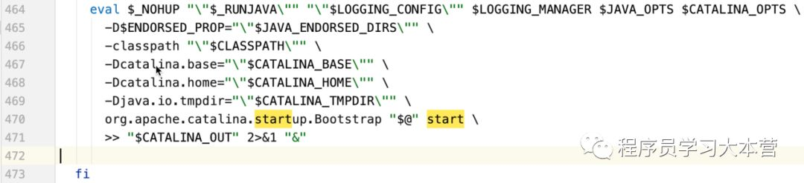

## Tomcat 相关面试题，看这篇！

[java学习](javascript:void(0);) _今天_

点击上方**蓝色字体**，选择“标星公众号”

优质文章，第一时间送达

Tomcat 相关的面试题出场的几率并不高，正式因为如此，很多人忽略了对 Tomcat 相关技能的掌握，下面这一篇文章最早发布在知识星球，整理了 Tomcat 相关的系统架构，介绍了 Server、Service、Connector、Container 之间的关系，各个模块的功能，可以说把这几个掌握住了，Tomcat 相关的面试题你就不会有任何问题了！另外，在面试的时候你还要有意识无意识的往 Tomcat 这个地方引，就比如说常见的 Spring MVC 的执行流程，一个 URL 的完整调用链路，这些相关的题目你是可以再往 Tomcat 处理请求的这个过程去说的！掌握注 Tomcat 这些技能了，面试官一定会佩服你的！

学了本节之后你应该明白的是：

*   Server、Service、Connector、Container 四大组件之间的关系和联系，以及他们的主要功能点；

*   Tomcat 执行的整体架构，请求是如何被一步步处理的；

*   Engine、Host、Context、Wrapper 相关的概念关系；

*   Container 是如何处理请求的；

*   Tomcat 用到的相关设计模式；

**一、Tomcat顶层架构**

俗话说，站在巨人的肩膀上看世界，一般学习的时候也是先总览一下整体，然后逐个部分个个击破，最后形成思路，了解具体细节，Tomcat 的结构很复杂，但是 Tomcat 非常的模块化，找到了 Tomcat 最核心的模块，问题才可以游刃而解，了解了 Tomcat 的整体架构对以后深入了解 Tomcat 来说至关重要！

先上一张 Tomcat 的顶层结构图（图 A），如下：


Tomcat 中最顶层的容器是 Server，代表着整个服务器，从上图中可以看出，一个 Server 可以包含至少一个 Service，用于具体提供服务。

Service 主要包含两个部分：Connector 和 Container。从上图中可以看出 Tomcat 的心脏就是这两个组件，他们的作用如下：

1、Connector 用于处理连接相关的事情，并提供 Socket 与 Request 和 Response 相关的转化; 

2、Container 用于封装和管理 Servlet，以及具体处理 Request 请求；

**一个 Tomcat 中只有一个 Server，一个 Server 可以包含多个 Service，一个 Service 只有一个 Container，但是可以有多个 Connectors，这是因为一个服务可以有多个连接，如同时提供 Http 和 Https 链接，**也可以提供向相同协议不同端口的连接,示意图如下（Engine、Host、Context 下边会说到）：


**多个 Connector 和一个 Container 就形成了一个 Service，有了 Service 就可以对外提供服务了，但是 Service 还要一个生存的环境，必须要有人能够给她生命、掌握其生死大权，那就非 Server 莫属了**！所以整个 Tomcat 的生命周期由 Server 控制。

另外，上述的包含关系或者说是父子关系，都可以在 tomcat 的 conf 目录下的`server.xml`配置文件中看出，下图是删除了注释内容之后的一个完整的`server.xml`配置文件（Tomcat 版本为 8.0）


详细的配置文件文件内容可以到 Tomcat 官网查看：

http://tomcat.apache.org/tomcat-8.0-doc/index.html

上边的配置文件，还可以通过下边的一张结构图更清楚的理解：


Server 标签设置的端口号为 8005，shutdown=”SHUTDOWN” ，表示在 8005 端口监听“SHUTDOWN”命令，如果接收到了就会关闭 Tomcat。一个 Server 有一个 Service，当然还可以进行配置，一个 Service 有多个，Service 左边的内容都属于 Container 的，Service 下边是 Connector。

**二、Tomcat顶层架构小结：**

（1）Tomcat 中只有一个 Server，一个 Server 可以有多个 Service，一个 Service 可以有多个 Connector 和一个 Container； 
（2） Server 掌管着整个 Tomcat 的生死大权； 
（4）Service 是对外提供服务的； 
（5）Connector 用于接受请求并将请求封装成 Request 和 Response 来具体处理； 
（6）Container 用于封装和管理 Servlet，以及具体处理 request 请求；

知道了整个 Tomcat 顶层的分层架构和各个组件之间的关系以及作用，对于绝大多数的开发人员来说 Server 和 Service 对我们来说确实很远，而我们开发中绝大部分进行配置的内容是属于 Connector 和 Container 的，所以接下来介绍一下 Connector 和 Container。

**三、Connector和Container的微妙关系**

由上述内容我们大致可以知道一个请求发送到 Tomcat 之后，首先经过 Service 然后会交给我们的 Connector，Connector 用于接收请求并将接收的请求封装为 Request 和 Response 来具体处理，Request 和 Response 封装完之后再交由 Container 进行处理，Container 处理完请求之后再返回给 Connector，最后在由 Connector 通过 Socket 将处理的结果返回给客户端，这样整个请求的就处理完了！

Connector 最底层使用的是 Socket 来进行连接的，Request 和 Response 是按照 HTTP 协议来封装的，所以 Connector 同时需要实现 TCP/IP 协议和 HTTP 协议！

Tomcat 既然处理请求，那么肯定需要先接收到这个请求，接收请求这个东西我们首先就需要看一下 Connector！关注微信公众号「web_resourc」,回复 Java  领取 2019 最新资源。

**四、Connector架构分析**

Connector 用于接受请求并将请求封装成 Request 和 Response，然后交给 Container 进行处理，Container 处理完之后在交给 Connector 返回给客户端。

因此，我们可以把 Connector 分为四个方面进行理解：

（1）Connector 如何接受请求的？ 

（2）如何将请求封装成 Request 和 Response 的？ 

（3）封装完之后的 Request 和 Response 如何交给 Container 进行处理的？ 

（4）Container 处理完之后如何交给 Connector 并返回给客户端的？

首先看一下 Connector 的结构图（图 B），如下所示：


Connector 就是使用 ProtocolHandler 来处理请求的，不同的 ProtocolHandler 代表不同的连接类型，比如：Http11Protocol 使用的是普通 Socket 来连接的，Http11NioProtocol 使用的是 NioSocket 来连接的。

其中 ProtocolHandler 由包含了三个部件：Endpoint、Processor、Adapter。

（1）Endpoint 用来处理底层 Socket 的网络连接，Processor 用于将 Endpoint 接收到的 Socket 封装成 Request，Adapter 用于将 Request 交给 Container 进行具体的处理。

（2）Endpoint 由于是处理底层的 Socket 网络连接，因此 Endpoint 是用来实现 TCP/IP 协议的，而 Processor 用来实现 HTTP 协议的，Adapter 将请求适配到 Servlet 容器进行具体的处理。

（3）Endpoint 的抽象实现 AbstractEndpoint 里面定义的 Acceptor 和 AsyncTimeout 两个内部类和一个 Handler 接口。Acceptor 用于监听请求，AsyncTimeout 用于检查异步 Request 的超时，Handler 用于处理接收到的 Socket，在内部调用 Processor 进行处理。

至此，我们应该很轻松的回答（1）（2）（3）的问题了，但是（4）还是不知道，那么我们就来看一下 Container 是如何进行处理的以及处理完之后是如何将处理完的结果返回给 Connector 的？关注微信公众号「web_resourc」,回复 Java 领取 2019 最新资源。

**五、Container架构分析**

Container 用于封装和管理 Servlet，以及具体处理 Request 请求，在 Connector 内部包含了 4 个子容器，结构图如下（图 C）：


4 个子容器的作用分别是：

（1）Engine：引擎，用来管理多个站点，一个 Service 最多只能有一个 Engine； 

（2）Host：代表一个站点，也可以叫虚拟主机，通过配置 Host 就可以添加站点； 

（3）Context：代表一个应用程序，对应着平时开发的一套程序，或者一个 WEB-INF 目录以及下面的 web.xml 文件； 

（4）Wrapper：每一 Wrapper 封装着一个 Servlet；

下面找一个 Tomcat 的文件目录对照一下，如下图所示：


Context 和 Host 的区别是 Context 表示一个应用，我们的 Tomcat 中默认的配置下 webapps 下的每一个文件夹目录都是一个 Context，其中 ROOT 目录中存放着主应用，其他目录存放着子应用，而整个 webapps 就是一个 Host 站点。

我们访问应用 Context 的时候，如果是 ROOT 下的则直接使用域名就可以访问，例如：www.ledouit.com,如果是 Host（webapps）下的其他应用，则可以使用 www.ledouit.com/docs 进行访问，当然默认指定的根应用（ROOT）是可以进行设定的，只不过 Host 站点下默认的主营用是 ROOT 目录下的。

看到这里我们知道 Container 是什么，但是还是不知道 Container 是如何进行处理的以及处理完之后是如何将处理完的结果返回给 Connector 的？别急！下边就开始探讨一下 Container 是如何进行处理的！

**六、Container如何处理请求的**

Container 处理请求是使用 Pipeline-Valve 管道来处理的！（Valve 是阀门之意）

Pipeline-Valve 是责任链模式，责任链模式是指在一个请求处理的过程中有很多处理者依次对请求进行处理，每个处理者负责做自己相应的处理，处理完之后将处理后的请求返回，再让下一个处理着继续处理。


但是！Pipeline-Valve 使用的责任链模式和普通的责任链模式有些不同！区别主要有以下两点：

（1）每个 Pipeline 都有特定的 Valve，而且是在管道的最后一个执行，这个 Valve 叫做 BaseValve，BaseValve 是不可删除的；

（2）在上层容器的管道的 BaseValve 中会调用下层容器的管道。

我们知道 Container 包含四个子容器，而这四个子容器对应的 BaseValve 分别在：StandardEngineValve、StandardHostValve、StandardContextValve、StandardWrapperValve。

Pipeline 的处理流程图如下（图 D）：


（1）Connector 在接收到请求后会首先调用最顶层容器的 Pipeline 来处理，这里的最顶层容器的 Pipeline 就是 EnginePipeline（Engine 的管道）；

（2）在 Engine 的管道中依次会执行 EngineValve1、EngineValve2 等等，最后会执行 StandardEngineValve，在 StandardEngineValve 中会调用 Host 管道，然后再依次执行 Host 的 HostValve1、HostValve2 等，最后在执行 StandardHostValve，然后再依次调用 Context 的管道和 Wrapper 的管道，最后执行到 StandardWrapperValve。

（3）当执行到 StandardWrapperValve 的时候，会在 StandardWrapperValve 中创建 FilterChain，并调用其 doFilter 方法来处理请求，这个 FilterChain 包含着我们配置的与请求相匹配的 Filter 和 Servlet，其 doFilter 方法会依次调用所有的 Filter 的 doFilter 方法和 Servlet 的 service 方法，这样请求就得到了处理！

（4）当所有的 Pipeline-Valve 都执行完之后，并且处理完了具体的请求，这个时候就可以将返回的结果交给 Connector 了，Connector 在通过 Socket 的方式将结果返回给客户端。

**七、总结**

至此，我们已经对 Tomcat 的整体架构有了大致的了解，从图 A、B、C、D 可以看出来每一个组件的基本要素和作用。我们在脑海里应该有一个大概的轮廓了！如果你面试的时候，让你简单的聊一下 Tomcat，上面的内容你能脱口而出吗？当你能够脱口而出的时候，这位面试官一定会对你刮目相看的！


## [tomcat学习|tomcat源码结构 ]

### 学习背景

提到 tomcat,相信大家都不陌生,只要是搞 web 开发的,老师总会让我们把应用打成 war 包,然后再丢到 tomcat 的 webapp 里面,然后就可以用 ip:port 来访问了
再后来工作之后,我们现在用 springboot ,可以直接打成 jar 包,只用引一个 web-starter 就可以启动 tomcat 了,实际上里发生着什么,我们一点都不知道,那是不是就代表着我们可以不用学 tomcat 了? 当然不,我们要学 tomcat , demo 级别的工程不用深入去研究,但是当工程进入生产环境,会有各种各样的问题,我们就要深入其原理,然后进行调优
tomcat 小刀也是才刚刚开始学, 这个系列,小刀会和大家一起学习下去

### 学习准备

idea: 看源码,写代码的不二之选
tomcat 源码: 小刀 fork 了一份,新建了一个分支,写一些注释之类的
[https://github.com/weixiaodexiaoxiaodao/tomcat](https://github.com/weixiaodexiaoxiaodao/tomcat)
分支是 study_8_5
笔,本子: 好记性不如烂笔头,tomcat 做为一个 web 容器中大佬级别的存在,只用肉眼,很难看穿他


### 拉下代码

用 idea 把源代码拉到本地, 切换好分支,现在目录结构应该是这个样子的:

可以看到这是一个基于 ant 的工程,那我们就对 build.xml 点右键,然后
`Add as Ant Build File`
通过右侧的 ant 任务列表,我们可以看到,有一个任务名为: ide-intellij,我们对应的在 build.xml 中找到这个 target 可以看到相关说明:

我们按照说明去配置环境变量和建包

然后运行 ide-intellij 这个任务,然后项目就会下载包之类的等等,等他运行完

### 目录结构

目前看代码目录,代码应该都在 java 目录,我们就把 java 目录标记为源代码目录

在这里,我们可以看到 tomcat 最上层的几大模块,这里先介绍下他们的作用,实现等后面我们再一起学习


### Catalina

Catalina 是 Tomcat 提供的 Servlet 容器实现,负责处理来自客户端的请求并输出响应,
里面有 Server ,Service ,Connector,Container, Engine,Host,Context,Wrapper,Executor ,这些概念,现在小刀也只是看了个大概,下次我们学习 Catalina 的时候再细看这些

### Coyote

Coyote 是 Tomcat 链接器框架的名称,是 Tomcat 服务器提供的供客户端访问的外部接口,客户端通过 Coyote 与 Catalina 容器进行通信. 我们比较熟悉的 Request, Response 就是来自于 Coyote 模块

Coyota 将 Socket 输入转换为 Request 对象交给 Catalina, 然后 Catalina 处理完之后再转成 Response 返回 Coyota

### el

Expression Language, java 表达式语言, 这个对应的就是我们 jsp 中取值的那些,由于现在我们对页面要么是前后端分离,要么是使用模板语言如 freemarker , thymeleaf , 所以这块倒可以不用怎么深入,到时候我们也会大致的看一看

### jasper

Tomcat 的 jsp 引擎,我们可以在 jsp 中引入各种标签,在不重启服务器的情况下,检测 jsp 页面是否有更新,等等,还是上面那句话,现在前后端分离比较多,以后的学习,我们也以关注上面的 Catalina 和 Coyota 为主

### jui ,naming ,tomcat

这三个就并在一起说吧
jui 是日志相关的
naming 是命名空间,JNDI,用于 java 目录服务的 API,JAVA 应用可以通过 JNDI API 按照命名查找数据和对象,常用的有: 1.将应用连接到一个外部服务,如数据库. 2\. Servlet 通过 JNDI 查找 WEB 容器提供的配置信息
tomcat 是一些附加功能,如 websocket 等


## tomcat学习|tomat中的server.xml的学习


### 学习准备

server.xml
Tomcat 本质上是一个 Servlet 容器,Catalina 就是 Servlet 容器,如上文我们提到的 Coyote, Jasper,EL , Naming, Juli 等等都是为了 Catalina 服务,而 catalina 的初始就是我们常用的 server.xml,所以我们今天就从 server.xml 来进入 catalina 的学习

### server.xml

以前我们可能只改过 connector 中的端口,如果做部署的话,也会修改 host 下面的东东


通过 server.xml 我们可以看到这么一个层级关系

server 包含 service

service 包含 connector 和 engine
engine 包含有 realm 和 host
host 包含 context(默认的 server.xml 里面没有)但是我们在实际发布时会配置上这个
context 包含 wrapper

### 组件基本解释

*   Server
    表示整个 Servlet 容器,Tomcat 运行时,只有唯一一个 Server 实例

*   Service
    一个或多个 connector 的集合,这些 connector 共享同一个 container 来处理其请求. 在同一个 tomcat 实例中可以包含多个 service , service 之间彼此独立.

*   Connector
    Tomcat 链接器,用于临听转化 socket 请求,将 socket 请求转交给 Container 来处理

*   Engine
    Engine 是指整个的 servlet 引擎, Engine 是最高级的 Container,虽然不是直接处理请求的位置,但是它是请求处理的入口

*   Host
    虚拟主机,与一个服务器的网络名有关,客户端可以用这个名称去连接服务器. 这个名称必须要在 DNS 上注册.

*   Context
    从字面上来就是上下文,放 tomcat 中,上下文就代表着一个完整的 web 应用

*   Wrapper
    Wrapper 作为一类容器,用于表示 web 应用中定义的 servlet

### 最后说两句

server.xml 是我们能够与 tomcat 服务直接交互的地方,我们可以通过 server.xml 配置 tomcat 的绝大多数属性


## Tomcat 启动过程

### 从已知startup.bat/sh入手

windows 上启动是:startup.bat
linux/mac 上启动是 startup.sh


### **startup.sh**

重点在于最后一行:

```
# PRGDIR 是当前tomcat下的bin目录
PRGDIR=`dirname "$PRG"`

EXECUTABLE=catalina.sh

执行tomcat/bin/catalina.sh start 
$@ 是代表全部的参数,
exec "$PRGDIR"/"$EXECUTABLE" start "$@"
```

### catalina.sh

我们通过参数 start 进行追踪:


在这里看到了对 start 参数进行判断,然后走不同的分支逻辑
经过一大堆的判断,最后达到可启动的状态时,就开始执行启动的命令:



nohup: 是 linux 系统中,可以后台运行程序的命令,窗口关掉也会存在

ENDORSED_PROP: 可以覆盖部分 jvm bootstarp 类加载器加载的类

org.apache.catalina.startup.Bootstrap: 最后会执行这个类

### Bootstrap

根据上文,我们可以找到 Bootstrap 这个类的 main 函数


如上图所示,只要执行了以下几步:
1\. 初始化 bootstrap 实例
2\. 调用 bootstrap 的 init 方法,去初始化类加载器,以及 catalina 实例
3\. 调用 bootstrap 的 start 方法,然后通过反射去调用 catalina 的 start 方法

init():

```
public void init() throws Exception {
        // 初始化类加载器
        initClassLoaders();
        // 设置当前线程的类加载器为catalinaLoader
        // 当前线程:初始化Catalina的线程,初始化Servlet容器的这个线程
        Thread.currentThread().setContextClassLoader(catalinaLoader);

        SecurityClassLoad.securityClassLoad(catalinaLoader);

        // Load our startup class and call its process() method
        if (log.isDebugEnabled()){
            log.debug("Loading startup class");
        }
        // 寻找到 Catalina 类,然后用反射进行实例化
        Class<?> startupClass = catalinaLoader.loadClass("org.apache.catalina.startup.Catalina");
        Object startupInstance = startupClass.getConstructor().newInstance();

        // Set the shared extensions class loader
        if (log.isDebugEnabled()){
            log.debug("Setting startup class properties");
        }
        // 获取到Catalina.setParentClassLoader的方法
        String methodName = "setParentClassLoader";
        Class<?> paramTypes[] = new Class[1];
        paramTypes[0] = Class.forName("java.lang.ClassLoader");
        Object paramValues[] = new Object[1];
        paramValues[0] = sharedLoader;
        // 通过反射设置 Catalina实例使用的父类加载器为sharedLoader
        Method method =
            startupInstance.getClass().getMethod(methodName, paramTypes);
        method.invoke(startupInstance, paramValues);

        catalinaDaemon = startupInstance;

    }
```

start():

```
public void start()
        throws Exception {
        if( catalinaDaemon==null ) init();
        // 使用反射去调用Catalina 的 start 方法
        Method method = catalinaDaemon.getClass().getMethod("start", (Class [] )null);
        method.invoke(catalinaDaemon, (Object [])null);

    }
```

### 最后说两句

这样就完成了 tomcat 从命令行到 bootstrap 以及 catalina 的初步初始化.后面还有 server,service , Engine , host 等组件的加载


## tomcat学习|tomcat中的类加载器

原创： 微笑的小小刀 [程序员学习大本营](javascript:void(0);) _今天_

**开头说两句**

小刀博客: http://www.lixiang.red
小刀公众号: 程序员学习大本营

### **学习背景**

上期我们聊到了 tomcat 中各个组件在默认值,在其中,我们看到了有关类加载器的代码, 如 context 中初始化 wabAppLoader
https://www.lixiang.red/articles/2019/08/09/1565361802994.html
今天我们一起学习类加载器相关知识

### **java里面的类加载器**

我们在写 java 代码时,源文件是 *.java , 然后经过编译之后,会变成 _.class 文件,类加载器加载的,实际上就是_.class 文件, 在实际开发中,我们会把相关的 .class 文件,打成一个 jar 包, 然后直接加载 jar 包就可以了.
类加载器就是用来加载这些类到虚拟机里,供程序调用

### **Bootstrap Class Loader**

用来加载 JVM 提供的基础运行类,即位于%JAVA_HOME%jre/lib 这个目录下面的核心类库


### **Extension Class Loader**

java 提供的一个标准的扩展机制,用于加载除核心类库外的 jar 包.默认的扩展目录是 %JAVA_HOME%/jar/lib/ext


该目录下的类库,对所有基于该 JVM 运行的程序都是可见的

### **System class loader**

用于加载环境变量 CLASSPATH 指定目录下的或者是用 -classpath 运行参数指定的 jar 包.


System Class Loader 通常用于加载应用程序 jar 包及其启动入口类(Tomcat Bootstrap 类就是由 System Class Loader 来加载的)

### **类加载器的双亲委派模式**

上面三种类加载器,实际上是有父子关系,Bootstrap 是 Extension 的父加载器, Extension 是 System 的父加载器
当 System ClassLoader 拿到一个 class 文件之后, 会先问父加载器(Extension Class Loader)能不能加载,当(Extension )接收到请求时,会先问问他的父加载器(BootStrap 类加载器能不能加载). 如果 Bootstrap 可以加载,则由 Bootstrap 来加载,如不能,则由 Extension 来加载. 如果 Extension 也加载不了的话,最后由 System 类加载器来加载


### **tomcat中的类加载器**

总共有四种类加载器: Common Class Loader, Catalina Class Loader , Shared Class Loader, Web AppClass Loader.
tomcat 中各个类加载器初始化,声明的地方

```
/**
     * 初始化tomcat中的三大类加载器
     */
    private void initClassLoaders() {
        try {
            // CommonLoader 默认继承AppClassLoader
            commonLoader = createClassLoader("common", null);
            if( commonLoader == null ) {
                // no config file, default to this loader - we might be in a 'single' env.
                commonLoader=this.getClass().getClassLoader();
            }
            // 以CommonLoader 为父加载器
            catalinaLoader = createClassLoader("server", commonLoader);
            // 以CommonLoader 为父加载器
            sharedLoader = createClassLoader("shared", commonLoader);
        } catch (Throwable t) {
            handleThrowable(t);
            log.error("Class loader creation threw exception", t);
            System.exit(1);
        }
    }
```


### **Common Class loader**

以 System Class Loader 为父类加载器, 是位于 Tomcat 应用服务器顶层的公用类加载器,默认是加载$CATALINE_HOME/lib 下的 jar 


### **Catalina Class Loader**

以 Common Class Loader 为父加载器.用于加载 Tomcat 应用服务器本身的.可以在下图中看到使用的位置
1.设置当前线程的类加载器为 Catalina Class Loader , 在没设置之前,是由 shell 脚本用 System Class Loader 来加载的
2\. 用 Catalina Class Loader 加载 Catalina.class 这个文件,并完成一系统组件的初始


### **shared Class Loader**

以 Common 为父加载器,是所有 web 应用的父加载器
使用位置如下


```
/**
     * Set the shared extensions class loader.
     *
     * @param parentClassLoader The shared extensions class loader.
     */
    public void setParentClassLoader(ClassLoader parentClassLoader) {
        this.parentClassLoader = parentClassLoader;
    }
```

在源码中声明 parentClassLoader 时有一个小坑,他默认是声明的加载 Catalina 的类载器            即:Catalina Class Loader,但实际上,在实例化后,我们会用反射调用其 setParentClassLoader 方法,将 parentClassLoader 更改为 shared Class Loader

```
// XXX Should be moved to embedded
    /**
     * The shared extensions class loader for this server.
     */
    protected ClassLoader parentClassLoader =
        Catalina.class.getClassLoader();
```

使用地点、


**WebApp Class Loader**

初始化的地点有两处:
1.createStartDigester 中

```
digester.addObjectCreate(prefix + "Context/Loader",
                            "org.apache.catalina.loader.WebappLoader",
                            "className");
```

1.  StandardContext.startInternal 方法中

```
   
if (getLoader() == null) {
            WebappLoader webappLoader = new WebappLoader(getParentClassLoader());
            webappLoader.setDelegate(getDelegate());
            setLoader(webappLoader);
        }
```

其作用是,每个独立的 Context(web 应用)都使用独立的 ClassLoader,加载我们 web 应用中,WEB-INFO/libs 这个目录下的 jar(如我们在应用中引用的 spring , mybatis 这些包)
这个做的好处是,不同的 web 应用包不会冲突,如 A 应用用的是 spring 4.X , B 应用用的是 spring 5.X , 他们可以在同一个 tomcat 中运行

### **最后说两句**

tomcat 的类加载机制, 是开始的一个比较复杂的点,需要好好理一理,边看代码边做笔记,这个类加载器什么时候初始化的,做了什么,然后在哪里使用的. 大家在学习过种中,有什么问题,可以和小刀一起交流讨论: best396975802


# Tomcat请求处理流程

很多东西在时序图中体现的已经非常清楚了，没有必要再一步一步的作介绍，本文以图为主，然后对部分内容加以简单解释。

*   绘制图形使用的工具是 PlantUML + Visual Studio Code + PlantUML Extension

本文对 Tomcat 的介绍以 `Tomcat-9.0.0.M22` 为标准。

`Tomcat-9.0.0.M22` 是 Tomcat 目前最新的版本，但尚未发布，它实现了 `Servlet4.0` 及 `JSP2.3` 并提供了很多新特性，需要 1.8 及以上的 JDK 支持等等，详情请查阅 Tomcat-9.0-doc

## 一、 Overview


1.  Connector 启动以后会启动一组线程用于不同阶段的请求处理过程。

2.  `Acceptor` 线程组。用于接受新连接，并将新连接封装一下，选择一个 `Poller` 将新连接添加到 `Poller` 的事件队列中。

3.  `Poller` 线程组。用于监听 Socket 事件，当 Socket 可读或可写等等时，将 Socket 封装一下添加到 `worker` 线程池的任务队列中。

4.  `worker` 线程组。用于对请求进行处理，包括分析请求报文并创建 Request 对象，调用容器的 pipeline 进行处理。

*   `Acceptor`、 `Poller`、 `worker` 所在的 `ThreadPoolExecutor` 都维护在 `NioEndpoint` 中。

## Connector Init and Start


1.  `initServerSocket()`，通过 `ServerSocketChannel.open()` 打开一个 ServerSocket，默认绑定到 8080 端口，默认的连接等待队列长度是 100， 当超过 100 个时会拒绝服务。我们可以通过配置 `conf/server.xml` 中 `Connector` 的 `acceptCount` 属性对其进行定制。

2.  `createExecutor()` 用于创建 `Worker` 线程池。默认会启动 10 个 `Worker` 线程，Tomcat 处理请求过程中，Woker 最多不超过 200 个。我们可以通过配置 `conf/server.xml` 中 `Connector` 的 `minSpareThreads` 和 `maxThreads` 对这两个属性进行定制。

3.  `Pollor` 用于检测已就绪的 Socket。 默认最多不超过 2 个， `Math.min(2,Runtime.getRuntime().availableProcessors());`。我们可以通过配置 `pollerThreadCount` 来定制。

4.  `Acceptor` 用于接受新连接。默认是 1 个。我们可以通过配置 `acceptorThreadCount` 对其进行定制。

## Requtst Process

### Acceptor


1.  `Acceptor` 在启动后会阻塞在 `ServerSocketChannel.accept();` 方法处，当有新连接到达时，该方法返回一个 `SocketChannel`。

2.  配置完 Socket 以后将 Socket 封装到 `NioChannel` 中，并注册到 `Poller`, 值的一提的是，我们一开始就启动了多个 `Poller` 线程，注册的时候，连接是公平的分配到每个 `Poller` 的。 `NioEndpoint` 维护了一个 `Poller` 数组，当一个连接分配给 `pollers[index]` 时，下一个连接就会分配给 `pollers[(index+1)%pollers.length]`.

3.  `addEvent()` 方法会将 Socket 添加到该 `Poller` 的 `PollerEvent` 队列中。到此 `Acceptor` 的任务就完成了。

### Poller


1.  `selector.select(1000)`。当 `Poller` 启动后因为 selector 中并没有已注册的 `Channel`，所以当执行到该方法时只能阻塞。所有的 `Poller` 共用一个 Selector，其实现类是 `sun.nio.ch.EPollSelectorImpl`

2.  `events()` 方法会将通过 `addEvent()` 方法添加到事件队列中的 Socket 注册到 `EPollSelectorImpl`，当 Socket 可读时， `Poller` 才对其进行处理

3.  `createSocketProcessor()` 方法将 Socket 封装到 `SocketProcessor` 中， `SocketProcessor` 实现了 `Runnable` 接口。 `worker` 线程通过调用其 `run()` 方法来对 Socket 进行处理。

4.  `execute(SocketProcessor)` 方法将 `SocketProcessor` 提交到线程池，放入线程池的 `workQueue` 中。 `workQueue` 是 `BlockingQueue` 的实例。到此 `Poller` 的任务就完成了。

### Worker


1.  `worker` 线程被创建以后就执行 `ThreadPoolExecutor` 的 `runWorker()` 方法，试图从 `workQueue` 中取待处理任务，但是一开始 `workQueue` 是空的，所以 `worker` 线程会阻塞在 `workQueue.take()` 方法。

2.  当新任务添加到 `workQueue`后， `workQueue.take()` 方法会返回一个 `Runnable`，通常是 `SocketProcessor`, 然后 `worker` 线程调用 `SocketProcessor` 的 `run()` 方法对 Socket 进行处理。

3.  `createProcessor()` 会创建一个 `Http11Processor`, 它用来解析 Socket，将 Socket 中的内容封装到 `Request` 中。注意这个 `Request` 是临时使用的一个类，它的全类名是 `org.apache.coyote.Request`，

4.  `postParseRequest()` 方法封装一下 Request，并处理一下映射关系 (从 URL 映射到相应的 `Host`、 `Context`、 `Wrapper`)。

5.  `CoyoteAdapter` 将 Rquest 提交给 `Container` 处理之前，并将 `org.apache.coyote.Request` 封装到 `org.apache.catalina.connector.Request`，传递给 `Container` 处理的 Request 是 `org.apache.catalina.connector.Request`。

6.  `connector.getService().getMapper().map()`，用来在 `Mapper` 中查询 URL 的映射关系。映射关系会保留到 `org.apache.catalina.connector.Request` 中， `Container` 处理阶段 `request.getHost()` 是使用的就是这个阶段查询到的映射主机，以此类推 `request.getContext()`、 `request.getWrapper()` 都是。

7.  `connector.getService().getContainer().getPipeline().getFirst().invoke()` 会将请求传递到 `Container` 处理，当然了 `Container` 处理也是在 `Worker` 线程中执行的，但是这是一个相对独立的模块，所以单独分出来一节。

### Container


1.  需要注意的是，基本上每一个容器的 `StandardPipeline` 上都会有多个已注册的 `Valve`，我们只关注每个容器的 Basic Valve。其他 Valve 都是在 Basic Valve 前执行。

2.  `request.getHost().getPipeline().getFirst().invoke()` 先获取对应的 `StandardHost`，并执行其 pipeline。

3.  `request.getContext().getPipeline().getFirst().invoke()` 先获取对应的 `StandardContext`, 并执行其 pipeline。

4.  `request.getWrapper().getPipeline().getFirst().invoke()` 先获取对应的 `StandardWrapper`，并执行其 pipeline。

5.  最值得说的就是 `StandardWrapper` 的 Basic Valve， `StandardWrapperValve`

6.  `allocate()` 用来加载并初始化 `Servlet`，值的一提的是 Servlet 并不都是单例的，当 Servlet 实现了 `SingleThreadModel` 接口后， `StandardWrapper` 会维护一组 Servlet 实例，这是享元模式。当然了 `SingleThreadModel` 在 Servlet 2.4 以后就弃用了。

7.  `createFilterChain()` 方法会从 `StandardContext` 中获取到所有的过滤器，然后将匹配 Request URL 的所有过滤器挑选出来添加到 `filterChain` 中。

8.  `doFilter()` 执行过滤链, 当所有的过滤器都执行完毕后调用 Servlet 的 `service()` 方法。

### Reference

1.  《How Tomcat works》

2.  《Tomcat 架构解析》-- 刘光瑞

3.  Tomcat-9.0-doc

4.  apache-tomcat-9.0.0.M22-src

5.  tomcat 架构分析 (connector NIO 实现)