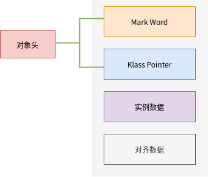
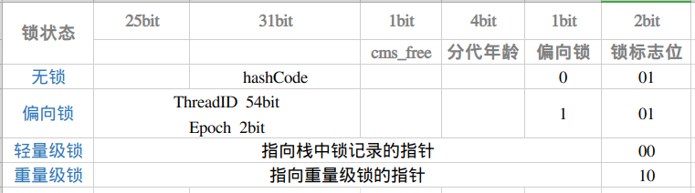
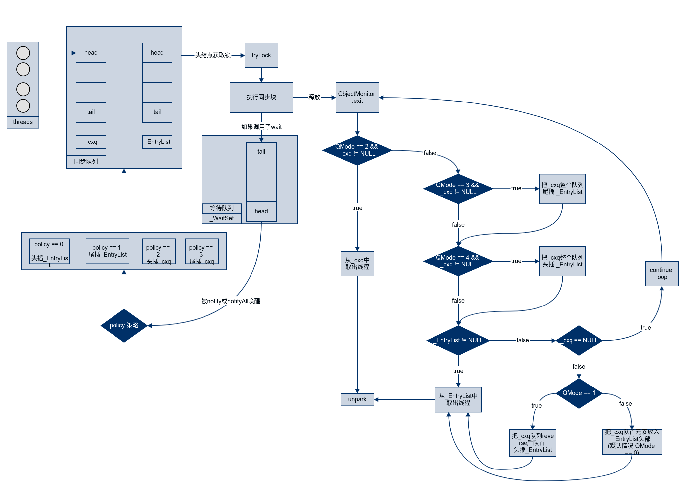

# synchronized 实现原理

**[作者简介]** 张庆波，小米信息技术部架构组

## 前言

众所周知 `synchronized` 锁在 `Java` 中经常使用它的源码是 `C++` 实现的，它的实现原理是怎样的呢？本文以 `OpenJDK 8` 为例探究以下内容。

- synchronized 是如何工作的
- synchronized 锁升级过程
- 重量级锁的队列之间协作过程和策略

## 对象头

对象头的内容非常多这里我们只做简单介绍以引出后文。在 JVM 中对象布局分为三块区域：

- 对象头
- 实例数据
- 对齐填充



当线程访问同步块时首先需要获得锁并把相关信息存储在对象头中。所以 `wait`、`notify`、`notifyAll` 这些方法为什么被设计在 `Object` 中或许你已经找到答案了。

Hotspot 有两种对象头：

- 数组类型，使用 `arrayOopDesc` 来描述对象头
- 其它，使用 `instanceOopDesc` 来描述对象头

对象头由两部分组成

- Mark Word：存储自身的运行时数据，例如 HashCode、GC 年龄、锁相关信息等内容。
- Klass Pointer：类型指针指向它的类元数据的指针。

64 位虚拟机 Mark Word 是 64bit 其结构如下：



在 JDK 6 中虚拟机团队对锁进行了重要改进，优化了其性能引入了 `偏向锁`、`轻量级锁`、`适应性自旋`、`锁消除`、`锁粗化`等实现，其中 `锁消除`和`锁粗化`本文不做详细讨论其余内容我们将对其进行逐一探究。

总体上来说锁状态升级流程如下：


## 偏向锁

### 流程

当线程访问同步块并获取锁时处理流程如下：

1. 检查 `mark word` 的`线程 id` 。
2. 如果为空则设置 CAS 替换当前线程 id。如果替换成功则获取锁成功，如果失败则撤销偏向锁。
3. 如果不为空则检查 `线程 id`为是否为本线程。如果是则获取锁成功，如果失败则撤销偏向锁。

持有偏向锁的线程以后每次进入这个锁相关的同步块时，只需比对一下 mark word 的线程 id 是否为本线程，如果是则获取锁成功。

如果发生线程竞争发生 2、3 步失败的情况则需要撤销偏向锁。

### 偏向锁的撤销

1. 偏向锁的撤销动作必须等待全局安全点
2. 暂停拥有偏向锁的线程，判断锁对象是否处于被锁定状态
3. 撤销偏向锁恢复到无锁（标志位为 01）或轻量级锁（标志位为 00）的状态

### 优点

只有一个线程执行同步块时进一步提高性能，适用于一个线程反复获得同一锁的情况。偏向锁可以提高带有同步但无竞争的程序性能。

### 缺点

如果存在竞争会带来额外的锁撤销操作。

## 轻量级锁

### 加锁

多个线程竞争偏向锁导致偏向锁升级为轻量级锁

1. JVM 在当前线程的栈帧中创建 Lock Reocrd，并将对象头中的 Mark Word 复制到 Lock Reocrd 中。（Displaced Mark Word）
2. 线程尝试使用 CAS 将对象头中的 Mark Word 替换为指向 Lock Reocrd 的指针。如果成功则获得锁，如果失败则先检查对象的 Mark Word 是否指向当前线程的栈帧如果是则说明已经获取锁，否则说明其它线程竞争锁则膨胀为重量级锁。

### 解锁

1. 使用 CAS 操作将 Mark Word 还原
2. 如果第 1 步执行成功则释放完成
3. 如果第 1 步执行失败则膨胀为重量级锁。

### 优点

其性能提升的依据是对于绝大部分的锁在整个生命周期内都是不会存在竞争。在多线程交替执行同步块的情况下，可以避免重量级锁引起的性能消耗。

### 缺点

在有多线程竞争的情况下轻量级锁增加了额外开销。

## 自旋锁

自旋是一种获取锁的机制并不是一个锁状态。在膨胀为重量级锁的过程中或重入时会多次尝试自旋获取锁以避免线程唤醒的开销，但是它会占用 CPU 的时间因此如果同步代码块执行时间很短自旋等待的效果就很好，反之则浪费了 CPU 资源。默认情况下自旋次数是 10 次用户可以使用参数 `-XX : PreBlockSpin` 来更改。那么如何优化来避免此情况发生呢？我们来看适应性自旋。

### 适应性自旋锁

JDK 6 引入了自适应自旋锁，意味着自旋的次数不在固定，而是由前一次在同一个锁上的自旋时间及锁的拥有者的状态来决定。如果对于某个锁很少自旋成功那么以后有可能省略掉自旋过程以避免资源浪费。有了自适应自旋随着程序运行和性能监控信息的不断完善，虚拟机对程序锁的状况预测就会越来越准确，虛拟机就会变得越来越“聪明”了。

### 优点

竞争的线程不会阻塞挂起，提高了程序响应速度。避免重量级锁引起的性能消耗。

### 缺点

如果线程始终无法获取锁，自旋消耗 CPU 最终会膨胀为重量级锁。

## 重量级锁

在重量级锁中没有竞争到锁的对象会 park 被挂起，退出同步块时 unpark 唤醒后续线程。唤醒操作涉及到操作系统调度会有额外的开销。

`ObjectMonitor` 中包含一个同步队列（由 `_cxq` 和 `_EntryList` 组成）一个等待队列（ `_WaitSet` ）。

- 被`notify`或 `notifyAll` 唤醒时根据 `policy` 策略选择加入的队列（policy 默认为 0）
- 退出同步块时根据 `QMode` 策略来唤醒下一个线程（QMode 默认为 0）

这里稍微提及一下**管程**这个概念。synchronized 关键字及 `wait`、`notify`、`notifyAll` 这三个方法都是管程的组成部分。可以说管程就是一把解决并发问题的万能钥匙。有两大核心问题管程都是能够解决的：

- **互斥**：即同一时刻只允许一个线程访问共享资源；
- **同步**：即线程之间如何通信、协作。

`synchronized` 的 `monitor`锁机制和 JDK 并发包中的 `AQS` 是很相似的，只不过 `AQS` 中是一个同步队列多个等待队列。熟悉 `AQS` 的同学可以拿来做个对比。

### 队列协作流程图



## 源码分析

在 HotSpot 中 monitor 是由 ObjectMonitor 实现的。其源码是用 c++来实现的源文件是 ObjectMonitor.hpp 主要数据结构如下所示：

```
ObjectMonitor() {
    _header       = NULL;
    _count        = 0;
    _waiters      = 0,       // 等待中的线程数
    _recursions   = 0;       // 线程重入次数
    _object       = NULL;    // 存储该 monitor 的对象
    _owner        = NULL;    // 指向拥有该 monitor 的线程
    _WaitSet      = NULL;    // 等待线程 双向循环链表_WaitSet 指向第一个节点
    _WaitSetLock  = 0 ;
    _Responsible  = NULL ;
    _succ         = NULL ;
    _cxq          = NULL ;   // 多线程竞争锁时的单向链表
    FreeNext      = NULL ;
    _EntryList    = NULL ;   // _owner 从该双向循环链表中唤醒线程，
    _SpinFreq     = 0 ;
    _SpinClock    = 0 ;
    OwnerIsThread = 0 ;
    _previous_owner_tid = 0; // 前一个拥有此监视器的线程 ID
  }
```

> 1. `_owner`：初始时为 NULL。当有线程占有该 monitor 时 owner 标记为该线程的 ID。当线程释放 monitor 时 owner 恢复为 NULL。owner 是一个临界资源 JVM 是通过 CAS 操作来保证其线程安全的。
> 2. `_cxq`：竞争队列所有请求锁的线程首先会被放在这个队列中（单向）。`_cxq` 是一个临界资源 JVM 通过 CAS 原子指令来修改 `_cxq` 队列。
>     每当有新来的节点入队，它的 next 指针总是指向之前队列的头节点，而 `_cxq` 指针会指向该新入队的节点，所以是后来居上。
> 3. `_EntryLis`t： `_cxq` 队列中有资格成为候选资源的线程会被移动到该队列中。
> 4. `_WaitSet`: 等待队列因为调用 wait 方法而被阻塞的线程会被放在该队列中。

### monitor 竞争过程

> 1. 通过 CAS 尝试把 monitor 的 owner 字段设置为当前线程。
> 2. 如果设置之前的 owner 指向当前线程，说明当前线程再次进入 monitor，即重入锁执行 recursions ++ , 记录重入的次数。
> 3. 如果当前线程是第一次进入该 monitor, 设置 recursions 为 1,_owner 为当前线程，该线程成功获得锁并返回。
> 4. 如果获取锁失败，则等待锁的释放。

执行 `monitorenter` 指令时 调用以下代码

```c
IRT_ENTRY_NO_ASYNC(void, InterpreterRuntime::monitorenter(JavaThread* thread, BasicObjectLock* elem))
#ifdef ASSERT
  thread->last_frame().interpreter_frame_verify_monitor(elem);
#endif
  if (PrintBiasedLockingStatistics) {
    Atomic::inc(BiasedLocking::slow_path_entry_count_addr());
  }
  Handle h_obj(thread, elem->obj());
  assert(Universe::heap()->is_in_reserved_or_null(h_obj()),"must be NULL or an object");
// 是否使用偏向锁  JVM 启动时设置的偏向锁-XX:-UseBiasedLocking=false/true
  if (UseBiasedLocking) {
    // Retry fast entry if bias is revoked to avoid unnecessary inflation
    ObjectSynchronizer::fast_enter(h_obj, elem->lock(), true, CHECK);
  } else {
      // 轻量级锁
    ObjectSynchronizer::slow_enter(h_obj, elem->lock(), CHECK);
  }
  assert(Universe::heap()->is_in_reserved_or_null(elem->obj()),
         "must be NULL or an object");
#ifdef ASSERT
  thread->last_frame().interpreter_frame_verify_monitor(elem);
#endif
IRT_END
```

> `slow_enter` 方法主要是轻量级锁的一些操作，如果操作失败则会膨胀为重量级锁，过程前面已经描述比较清楚此处不在赘述。`enter` 方法则为重量级锁的入口源码如下

```c
void ATTR ObjectMonitor::enter(TRAPS) {
  Thread * const Self = THREAD ;
  void * cur ;
  // 省略部分代码
  
  // 通过 CAS 操作尝试把 monitor 的_owner 字段设置为当前线程
  cur = Atomic::cmpxchg_ptr (Self, &_owner, NULL) ;
  if (cur == NULL) {
     assert (_recursions == 0   , "invariant") ;
     assert (_owner      == Self, "invariant") ;
     return ;
  }

 // 线程重入，recursions++
  if (cur == Self) {
     _recursions ++ ;
     return ;
  }

    // 如果当前线程是第一次进入该 monitor, 设置_recursions 为 1,_owner 为当前线程
  if (Self->is_lock_owned ((address)cur)) {
    assert (_recursions == 0, "internal state error");
    _recursions = 1 ;
    _owner = Self ;
    OwnerIsThread = 1 ;
    return ;
  }

    for (;;) {
      jt->set_suspend_equivalent();
        // 如果获取锁失败，则等待锁的释放；
      EnterI (THREAD) ;

      if (!ExitSuspendEquivalent(jt)) break ;
          _recursions = 0 ;
      _succ = NULL ;
      exit (false, Self) ;

      jt->java_suspend_self();
    }
    Self->set_current_pending_monitor(NULL);
  }
}
```

### monitor 等待

> 1. 当前线程被封装成 ObjectWaiter 对象 node，状态设置成 `ObjectWaiter::TS_CXQ`。
> 2. for 循环通过 CAS 把 node 节点 push 到`_cxq`列表中，同一时刻可能有多个线程把自己的 node 节点 push 到`_cxq`列表中。
> 3. node 节点 push 到 `_cxq` 列表之后，通过自旋尝试获取锁，如果还是没有获取到锁则通过 park 将当前线程挂起等待被唤醒。
> 4. 当该线程被唤醒时会从挂起的点继续执行，通过 `ObjectMonitor::TryLock` 尝试获取锁。

```c
// 省略部分代码
void ATTR ObjectMonitor::EnterI (TRAPS) {
    Thread * Self = THREAD ;
    assert (Self->is_Java_thread(), "invariant") ;
    assert (((JavaThread *) Self)->thread_state() == _thread_blocked   , "invariant") ;

    // Try lock 尝试获取锁
    if (TryLock (Self) > 0) {
        assert (_succ != Self              , "invariant") ;
        assert (_owner == Self             , "invariant") ;
        assert (_Responsible != Self       , "invariant") ;
        // 如果获取成功则退出，避免 park unpark 系统调度的开销
        return ;
    }

    // 自旋获取锁
    if (TrySpin(Self) > 0) {
        assert (_owner == Self, "invariant");
        assert (_succ != Self, "invariant");
        assert (_Responsible != Self, "invariant");
        return;
    }

    // 当前线程被封装成 ObjectWaiter 对象 node, 状态设置成 ObjectWaiter::TS_CXQ
    ObjectWaiter node(Self) ;
    Self->_ParkEvent->reset() ;
    node._prev   = (ObjectWaiter *) 0xBAD ;
    node.TState  = ObjectWaiter::TS_CXQ ;

    // 通过 CAS 把 node 节点 push 到_cxq 列表中
    ObjectWaiter * nxt ;
    for (;;) {
        node._next = nxt = _cxq ;
        if (Atomic::cmpxchg_ptr (&node, &_cxq, nxt) == nxt) break ;

        // 再次 tryLock
        if (TryLock (Self) > 0) {
            assert (_succ != Self         , "invariant") ;
            assert (_owner == Self        , "invariant") ;
            assert (_Responsible != Self  , "invariant") ;
            return ;
        }
    }

    for (;;) {
        // 本段代码的主要思想和 AQS 中相似可以类比来看
        // 再次尝试
        if (TryLock (Self) > 0) break ;
        assert (_owner != Self, "invariant") ;

        if ((SyncFlags & 2) && _Responsible == NULL) {
           Atomic::cmpxchg_ptr (Self, &_Responsible, NULL) ;
        }

        // 满足条件则 park self
        if (_Responsible == Self || (SyncFlags & 1)) {
            TEVENT (Inflated enter - park TIMED) ;
            Self->_ParkEvent->park ((jlong) RecheckInterval) ;
            // Increase the RecheckInterval, but clamp the value.
            RecheckInterval *= 8 ;
            if (RecheckInterval > 1000) RecheckInterval = 1000 ;
        } else {
            TEVENT (Inflated enter - park UNTIMED) ;
            // 通过 park 将当前线程挂起，等待被唤醒
            Self->_ParkEvent->park() ;
        }

        if (TryLock(Self) > 0) break ;
        // 再次尝试自旋
        if ((Knob_SpinAfterFutile & 1) && TrySpin(Self) > 0) break;
    }
    return ;
}
```

### monitor 释放

> 当某个持有锁的线程执行完同步代码块时，会释放锁并 `unpark` 后续线程（由于篇幅只保留重要代码）。

```c
void ATTR ObjectMonitor::exit(bool not_suspended, TRAPS) {
   Thread * Self = THREAD ;
  
   if (_recursions != 0) {
     _recursions--;        // this is simple recursive enter
     TEVENT (Inflated exit - recursive) ;
     return ;
   }

      ObjectWaiter * w = NULL ;
      int QMode = Knob_QMode ;

    // 直接绕过 EntryList 队列，从 cxq 队列中获取线程用于竞争锁
      if (QMode == 2 && _cxq != NULL) {
          w = _cxq ;
          assert (w != NULL, "invariant") ;
          assert (w->TState == ObjectWaiter::TS_CXQ, "Invariant") ;
          ExitEpilog (Self, w) ;
          return ;
      }
    // cxq 队列插入 EntryList 尾部
      if (QMode == 3 && _cxq != NULL) {
          w = _cxq ;
          for (;;) {
             assert (w != NULL, "Invariant") ;
             ObjectWaiter * u = (ObjectWaiter *) Atomic::cmpxchg_ptr (NULL, &_cxq, w) ;
             if (u == w) break ;
             w = u ;
          }
          ObjectWaiter * q = NULL ;
          ObjectWaiter * p ;
          for (p = w ; p != NULL ; p = p->_next) {
              guarantee (p->TState == ObjectWaiter::TS_CXQ, "Invariant") ;
              p->TState = ObjectWaiter::TS_ENTER ;
              p->_prev = q ;
              q = p ;
          }

          ObjectWaiter * Tail ;
          for (Tail = _EntryList ; Tail != NULL && Tail->_next != NULL ; Tail = Tail->_next) ;
          if (Tail == NULL) {
              _EntryList = w ;
          } else {
              Tail->_next = w ;
              w->_prev = Tail ;
          }
      }

    // cxq 队列插入到_EntryList 头部
      if (QMode == 4 && _cxq != NULL) {
          // 把 cxq 队列放入 EntryList
          // 此策略确保最近运行的线程位于 EntryList 的头部
          w = _cxq ;
          for (;;) {
             assert (w != NULL, "Invariant") ;
             ObjectWaiter * u = (ObjectWaiter *) Atomic::cmpxchg_ptr (NULL, &_cxq, w) ;
             if (u == w) break ;
             w = u ;
          }
          assert (w != NULL              , "invariant") ;

          ObjectWaiter * q = NULL ;
          ObjectWaiter * p ;
          for (p = w ; p != NULL ; p = p->_next) {
              guarantee (p->TState == ObjectWaiter::TS_CXQ, "Invariant") ;
              p->TState = ObjectWaiter::TS_ENTER ;
              p->_prev = q ;
              q = p ;
          }

          if (_EntryList != NULL) {
              q->_next = _EntryList ;
              _EntryList->_prev = q ;
          }
          _EntryList = w ;
      }

      w = _EntryList  ;
      if (w != NULL) {
          assert (w->TState == ObjectWaiter::TS_ENTER, "invariant") ;
          ExitEpilog (Self, w) ;
          return ;
      }
      w = _cxq ;
      if (w == NULL) continue ;

      for (;;) {
          assert (w != NULL, "Invariant") ;
          ObjectWaiter * u = (ObjectWaiter *) Atomic::cmpxchg_ptr (NULL, &_cxq, w) ;
          if (u == w) break ;
          w = u ;
      }

      if (QMode == 1) {
         // QMode == 1 : 把 cxq 倾倒入 EntryList 逆序
         ObjectWaiter * s = NULL ;
         ObjectWaiter * t = w ;
         ObjectWaiter * u = NULL ;
         while (t != NULL) {
             guarantee (t->TState == ObjectWaiter::TS_CXQ, "invariant") ;
             t->TState = ObjectWaiter::TS_ENTER ;
             u = t->_next ;
             t->_prev = u ;
             t->_next = s ;
             s = t;
             t = u ;
         }
         _EntryList  = s ;
         assert (s != NULL, "invariant") ;
      } else {
         // QMode == 0 or QMode == 2
         _EntryList = w ;
         ObjectWaiter * q = NULL ;
         ObjectWaiter * p ;
          // 将单向链表构造成双向环形链表；
         for (p = w ; p != NULL ; p = p->_next) {
             guarantee (p->TState == ObjectWaiter::TS_CXQ, "Invariant") ;
             p->TState = ObjectWaiter::TS_ENTER ;
             p->_prev = q ;
             q = p ;
         }
      }

      if (_succ != NULL) continue;

      w = _EntryList  ;
      if (w != NULL) {
          guarantee (w->TState == ObjectWaiter::TS_ENTER, "invariant") ;
          ExitEpilog (Self, w) ;
          return ;
      }
   }
}
```

### notify 唤醒

> notify 或者 notifyAll 方法可以唤醒同一个锁监视器下调用 wait 挂起的线程，具体实现如下

```c
void ObjectMonitor::notify(TRAPS) {
    CHECK_OWNER();
    if (_WaitSet == NULL) {
        TEVENT (Empty - Notify);
        return;
    }
    DTRACE_MONITOR_PROBE(notify, this, object(), THREAD);

    int Policy = Knob_MoveNotifyee;

    Thread::SpinAcquire(&_WaitSetLock, "WaitSet - notify");
    ObjectWaiter *iterator = DequeueWaiter();
    if (iterator != NULL) {
        // 省略一些代码

         // 头插 EntryList
        if (Policy == 0) {
            if (List == NULL) {
                iterator->_next = iterator->_prev = NULL;
                _EntryList = iterator;
            } else {
                List->_prev = iterator;
                iterator->_next = List;
                iterator->_prev = NULL;
                _EntryList = iterator;
            }
        } else if (Policy == 1) {      // 尾插 EntryList
            if (List == NULL) {
                iterator->_next = iterator->_prev = NULL;
                _EntryList = iterator;
            } else {
                ObjectWaiter *Tail;
                for (Tail = List; Tail->_next != NULL; Tail = Tail->_next);
                assert (Tail != NULL && Tail->_next == NULL, "invariant");
                Tail->_next = iterator;
                iterator->_prev = Tail;
                iterator->_next = NULL;
            }
        } else if (Policy == 2) {      // 头插 cxq
            // prepend to cxq
            if (List == NULL) {
                iterator->_next = iterator->_prev = NULL;
                _EntryList = iterator;
            } else {
                iterator->TState = ObjectWaiter::TS_CXQ;
                for (;;) {
                    ObjectWaiter *Front = _cxq;
                    iterator->_next = Front;
                    if (Atomic::cmpxchg_ptr(iterator, &_cxq, Front) == Front) {
                        break;
                    }
                }
            }
        } else if (Policy == 3) {      // 尾插 cxq
            iterator->TState = ObjectWaiter::TS_CXQ;
            for (;;) {
                ObjectWaiter *Tail;
                Tail = _cxq;
                if (Tail == NULL) {
                    iterator->_next = NULL;
                    if (Atomic::cmpxchg_ptr(iterator, &_cxq, NULL) == NULL) {
                        break;
                    }
                } else {
                    while (Tail->_next != NULL) Tail = Tail->_next;
                    Tail->_next = iterator;
                    iterator->_prev = Tail;
                    iterator->_next = NULL;
                    break;
                }
            }
        } else {
            ParkEvent *ev = iterator->_event;
            iterator->TState = ObjectWaiter::TS_RUN;
            OrderAccess::fence();
            ev->unpark();
        }

        if (Policy < 4) {
            iterator->wait_reenter_begin(this);
        }
    }
    // 自旋释放
    Thread::SpinRelease(&_WaitSetLock);

    if (iterator != NULL && ObjectMonitor::_sync_Notifications != NULL) {
        ObjectMonitor::_sync_Notifications->inc();
    }
}
```

## 总结

本文介绍了 `synchronized` 工作原理和锁升级的过程。其中锁队列的协作流程较复杂，本文配了详细的流程图可以参照。最后附上了一部分重要代码的解析，理解 `synchronized` 原理之后便于写出性能更高的代码。

简单的来说偏向锁通过对比 Mark Word thread id 解决加锁问题。而轻量级锁是通过用 CAS 操作 Mark Word 和自旋来解决加锁问题，避免线程阻塞和唤醒而影响性能。重量级锁是将除了拥有锁的线程以外的线程都阻塞。

## 参考资料

- [HotSpot Glossary of Terms](http://openjdk.java.net/groups/hotspot/docs/HotSpotGlossary.html)
- [Java SE 6 Performance White Paper](https://www.oracle.com/technetwork/java/6-performance-137236.html)