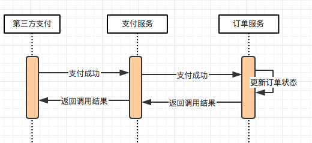
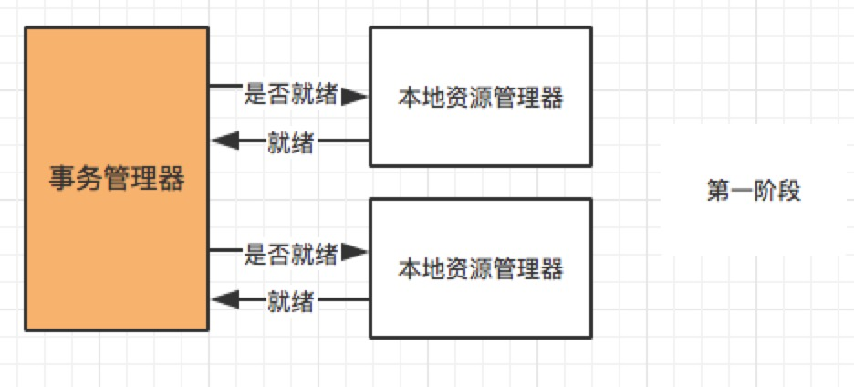
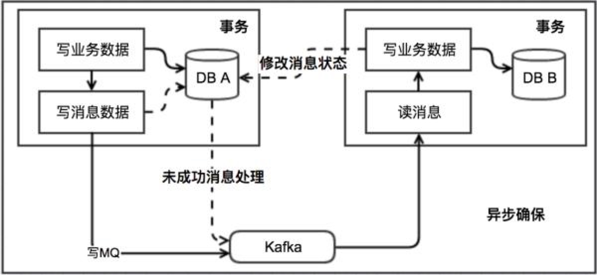
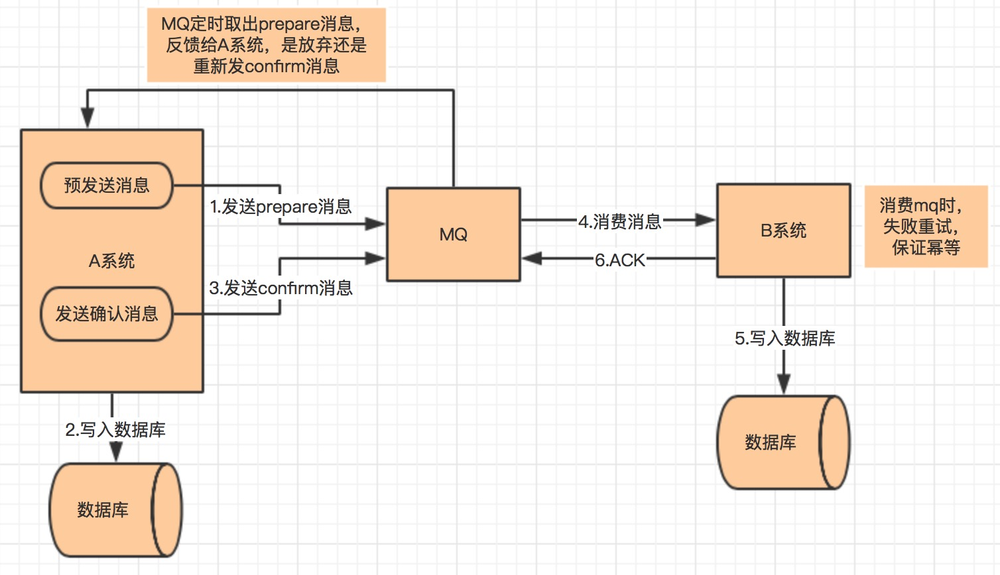
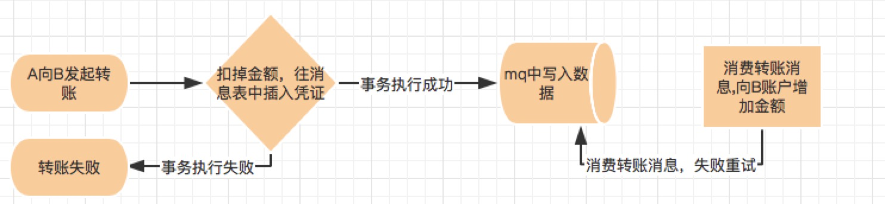
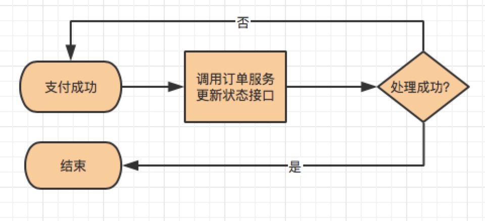
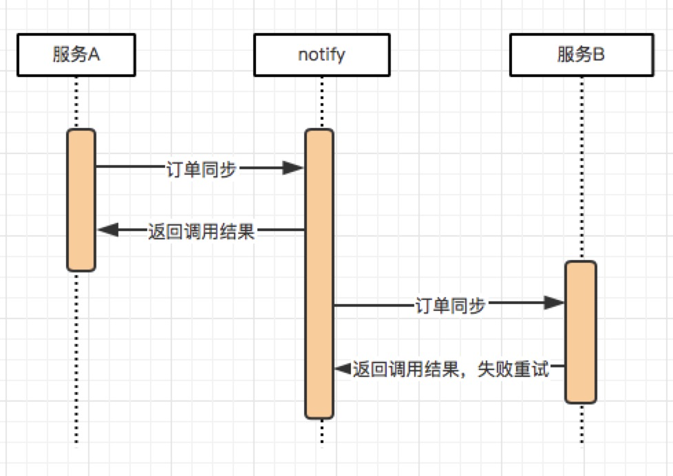

# 分布式事务，这一篇就够了

**[作者简介]** 李文华，小米信息技术部海外商城组

随着互联网技术的不断发展，系统越来越复杂，几乎所有 IT 公司的系统都已经完成从单体架构到分布式架构的转变，分布式系统几乎无处不在。谈到分布式系统，特别是微服务架构，我们不得不谈分布式事务。今天就跟大家一起聊聊分布式事务以及常用解决方案。

## 基础理论

在讲解具体方案之前，我们有必要了解一些分布式事务所涉及到的基础理论知识。

### 事务

事务是应用程序中一系列严密的操作，所有操作必须成功完成，否则在每个操作中所作的所有更改都会被撤消。也就是事务具有原子性，一个事务中的一系列的操作要么全部成功，要么一个都不做。事务应该具有 4 个属性：原子性、一致性、隔离性、持久性。这四个属性通常称为 ACID 特性。

### 分布式事务

分布式事务是指事务的参与者、支持事务的服务器、资源服务器以及事务管理器分别位于不同的分布式系统的不同节点之上。例如在大型电商系统中，下单接口通常会扣减库存、减去优惠、生成订单 id, 而订单服务与库存、优惠、订单 id 都是不同的服务，下单接口的成功与否，不仅取决于本地的 db 操作，而且依赖第三方系统的结果，这时候分布式事务就保证这些操作要么全部成功，要么全部失败。本质上来说，分布式事务就是为了保证不同数据库的数据一致性。

### 强一致性、弱一致性、最终一致性

#### 强一致性

任何一次读都能读到某个数据的最近一次写的数据。系统中的所有进程，看到的操作顺序，都和全局时钟下的顺序一致。简言之，在任意时刻，所有节点中的数据是一样的。

#### 弱一致性

数据更新后，如果能容忍后续的访问只能访问到部分或者全部访问不到，则是弱一致性。

#### 最终一致性

不保证在任意时刻任意节点上的同一份数据都是相同的，但是随着时间的迁移，不同节点上的同一份数据总是在向趋同的方向变化。简单说，就是在一段时间后，节点间的数据会最终达到一致状态。

### CAP 原则

> CAP 原则又称 CAP 定理，指的是在一个分布式系统中， Consistency（一致性）、 Availability（可用性）、Partition tolerance（分区容错性），三者不可得兼。

一致性（C）：

> 在分布式系统中的所有数据备份，在同一时刻是否同样的值。（等同于所有节点访问同一份最新的数据副本）

可用性（A）：

> 在集群中一部分节点故障后，集群整体是否还能响应客户端的读写请求。（对数据更新具备高可用性）

分区容错性（P）：

> 以实际效果而言，分区相当于对通信的时限要求。系统如果不能在时限内达成数据一致性，就意味着发生了分区的情况，必须就当前操作在 C 和 A 之间做出选择。

CAP 原则的精髓就是要么 AP，要么 CP，要么 AC，但是不存在 CAP。如果在某个分布式系统中数据无副本， 那么系统必然满足强一致性条件， 因为只有独一数据，不会出现数据不一致的情况，此时 C 和 P 两要素具备，但是如果系统发生了网络分区状况或者宕机，必然导致某些数据不可以访问，此时可用性条件就不能被满足，即在此情况下获得了 CP 系统，但是 CAP 不可同时满足。

### BASE 理论

BASE 理论指的是基本可用 Basically Available，软状态 Soft State，最终一致性 Eventual Consistency，核心思想是即便无法做到强一致性，但应该采用适合的方式保证最终一致性。

BASE，Basically Available Soft State Eventual Consistency 的简写：
BA：Basically Available 基本可用，分布式系统在出现故障的时候，允许损失部分可用性，即保证核心可用。
S：Soft State 软状态，允许系统存在中间状态，而该中间状态不会影响系统整体可用性。
E：Consistency 最终一致性，系统中的所有数据副本经过一定时间后，最终能够达到一致的状态。
BASE 理论本质上是对 CAP 理论的延伸，是对 CAP 中 AP 方案的一个补充。

### 柔性事务

不同于 ACID 的刚性事务，在分布式场景下基于 BASE 理论，就出现了柔性事务的概念。要想通过柔性事务来达到最终的一致性，就需要依赖于一些特性，这些特性在具体的方案中不一定都要满足，因为不同的方案要求不一样；但是都不满足的话，是不可能做柔性事务的。

### 幂等操作

在编程中一个幂等操作的特点是其任意多次执行所产生的影响均与一次执行的影响相同。幂等函数，或幂等方法，是指可以使用相同参数重复执行，并能获得相同结果的函数。这些函数不会影响系统状态，也不用担心重复执行会对系统造成改变。例如，支付流程中第三方支付系统告知系统中某个订单支付成功，接收该支付回调接口在网络正常的情况下无论操作多少次都应该返回成功。

## 分布式事务使用场景

### 转账

转账是最经典那的分布式事务场景，假设用户 A 使用银行 app 发起一笔跨行转账给用户 B，银行系统首先扣掉用户 A 的钱，然后增加用户 B 账户中的余额。此时就会出现 2 种异常情况：1. 用户 A 的账户扣款成功，用户 B 账户余额增加失败 2. 用户 A 账户扣款失败，用户 B 账户余额增加成功。对于银行系统来说，以上 2 种情况都是不允许发生，此时就需要分布式事务来保证转账操作的成功。

### 下单扣库存

在电商系统中，下单是用户最常见操作。在下单接口中必定会涉及生成订单 id, 扣减库存等操作，对于微服务架构系统，订单 id 与库存服务一般都是独立的服务，此时就需要分布式事务来保证整个下单接口的成功。

### 同步超时

继续以电商系统为例，在微服务体系架构下，我们的支付与订单都是作为单独的系统存在。订单的支付状态依赖支付系统的通知，假设一个场景：我们的支付系统收到来自第三方支付的通知，告知某个订单支付成功，接收通知接口需要同步调用订单服务变更订单状态接口，更新订单状态为成功。流程图如下，从图中可以看出有两次调用，第三方支付调用支付服务，以及支付服务调用订单服务，这两步调用都可能出现调用超时的情况，此处如果没有分布式事务的保证，就会出现用户订单实际支付情况与最终用户看到的订单支付情况不一致的情况。

## 分布式事务的解决方案

### 两阶段提交/XA

两阶段提交，顾名思义就是要分两步提交。存在一个负责协调各个本地资源管理器的事务管理器，本地资源管理器一般是由数据库实现，事务管理器在第一阶段的时候询问各个资源管理器是否都就绪？如果收到每个资源的回复都是 yes，则在第二阶段提交事务，如果其中任意一个资源的回复是 no, 则回滚事务。

大致的流程：

第一阶段（prepare）：事务管理器向所有本地资源管理器发起请求，询问是否是 ready 状态，所有参与者都将本事务能否成功的信息反馈发给协调者；
第二阶段 (commit/rollback)：事务管理器根据所有本地资源管理器的反馈，通知所有本地资源管理器，步调一致地在所有分支上提交或者回滚。

存在的问题：

> 同步阻塞：当参与事务者存在占用公共资源的情况，其中一个占用了资源，其他事务参与者就只能阻塞等待资源释放，处于阻塞状态。

> 单点故障：一旦事务管理器出现故障，整个系统不可用

> 数据不一致：在阶段二，如果事务管理器只发送了部分 commit 消息，此时网络发生异常，那么只有部分参与者接收到 commit 消息，也就是说只有部分参与者提交了事务，使得系统数据不一致。

> 不确定性：当协事务管理器发送 commit 之后，并且此时只有一个参与者收到了 commit，那么当该参与者与事务管理器同时宕机之后，重新选举的事务管理器无法确定该条消息是否提交成功。

### TCC

关于 TCC（Try-Confirm-Cancel）的概念，最早是由 Pat Helland 于 2007 年发表的一篇名为《Life beyond Distributed Transactions:an Apostate’s Opinion》的论文提出。 TCC 事务机制相比于上面介绍的 XA，解决了其几个缺点：

1. 解决了协调者单点，由主业务方发起并完成这个业务活动。业务活动管理器也变成多点，引入集群。
2. 同步阻塞：引入超时，超时后进行补偿，并且不会锁定整个资源，将资源转换为业务逻辑形式，粒度变小。
3. 数据一致性，有了补偿机制之后，由业务活动管理器控制一致性

TCC(Try Confirm Cancel)
Try 阶段：尝试执行，完成所有业务检查（一致性）, 预留必须业务资源（准隔离性）
Confirm 阶段：确认执行真正执行业务，不作任何业务检查，只使用 Try 阶段预留的业务资源，Confirm 操作满足幂等性。要求具备幂等设计，Confirm 失败后需要进行重试。
Cancel 阶段：取消执行，释放 Try 阶段预留的业务资源 Cancel 操作满足幂等性 Cancel 阶段的异常和 Confirm 阶段异常处理方案基本上一致。

在 Try 阶段，是对业务系统进行检查及资源预览，比如订单和存储操作，需要检查库存剩余数量是否够用，并进行预留，预留操作的话就是新建一个可用库存数量字段，Try 阶段操作是对这个可用库存数量进行操作。
基于 TCC 实现分布式事务，会将原来只需要一个接口就可以实现的逻辑拆分为 Try、Confirm、Cancel 三个接口，所以代码实现复杂度相对较高。

### 本地消息表

本地消息表这个方案最初是 ebay 架构师 Dan Pritchett 在 2008 年发表给 ACM 的文章。该方案中会有消息生产者与消费者两个角色，假设系统 A 是消息生产者，系统 B 是消息消费者，其大致流程如下：

1. 当系统 A 被其他系统调用发生数据库表更操作，首先会更新数据库的业务表，其次会往相同数据库的消息表中插入一条数据，两个操作发生在同一个事务中
2. 系统 A 的脚本定期轮询本地消息往 mq 中写入一条消息，如果消息发送失败会进行重试
3. 系统 B 消费 mq 中的消息，并处理业务逻辑。如果本地事务处理失败，会在继续消费 mq 中的消息进行重试，如果业务上的失败，可以通知系统 A 进行回滚操作

本地消息表实现的条件：

1. 消费者与生成者的接口都要支持幂等
2. 生产者需要额外的创建消息表
3. 需要提供补偿逻辑，如果消费者业务失败，需要生产者支持回滚操作

容错机制：

1. 步骤 1 失败时，事务直接回滚
2. 步骤 2、3 写 mq 与消费 mq 失败会进行重试
3. 步骤 3 业务失败系统 B 向系统 A 发起事务回滚操作

此方案的核心是将需要分布式处理的任务通过消息日志的方式来异步执行。消息日志可以存储到本地文本、数据库或消息队列，再通过业务规则自动或人工发起重试。人工重试更多的是应用于支付场景，通过对账系统对事后问题的处理。

### 可靠消息最终一致性

大致流程如下：

1. A 系统先向 mq 发送一条 prepare 消息，如果 prepare 消息发送失败，则直接取消操作
2. 如果消息发送成功，则执行本地事务
3. 如果本地事务执行成功，则想 mq 发送一条 confirm 消息，如果发送失败，则发送回滚消息
4. B 系统定期消费 mq 中的 confirm 消息，执行本地事务，并发送 ack 消息。如果 B 系统中的本地事务失败，会一直不断重试，如果是业务失败，会向 A 系统发起回滚请求

5.mq 会定期轮询所有 prepared 消息调用系统 A 提供的接口查询消息的处理情况，如果该 prepare 消息本地事务处理成功，则重新发送 confirm 消息，否则直接回滚该消息

该方案与本地消息最大的不同是去掉了本地消息表，其次本地消息表依赖消息表重试写入 mq 这一步由本方案中的轮询 prepare 消息状态来重试或者回滚该消息替代。其实现条件与余容错方案基本一致。目前市面上实现该方案的只有阿里的 RocketMq。

### 尽最大努力通知

最大努力通知是最简单的一种柔性事务，适用于一些最终一致性时间敏感度低的业务，且被动方处理结果 不影响主动方的处理结果。

这个方案的大致意思就是：

1. 系统 A 本地事务执行完之后，发送个消息到 MQ；
2. 这里会有个专门消费 MQ 的服务，这个服务会消费 MQ 并调用系统 B 的接口；
3. 要是系统 B 执行成功就 ok 了；要是系统 B 执行失败了，那么最大努力通知服务就定时尝试重新调用系统 B, 反复 N 次，最后还是不行就放弃。

## 分布式事务实战

### 两阶段提交/XA

目前支付宝使用两阶段提交思想实现了分布式事务服务 (Distributed Transaction Service, DTS) ，它是一个分布式事务框架，用来保障在大规模分布式环境下事务的最终一致性。具体可参考支付宝官方文档：https://tech.antfin.com/docs/2/46887

### TCC

TCC 需要事务接口提供 try, confirm, cancel 三个接口，提高了编程的复杂性。依赖于业务方来配合提供这样的接口，推行难度大，所以一般不推荐使用这种方式。

### 可靠消息最终一致性

目前市面上支持该方案的 mq 只有阿里的 rocketmq, 该方案应用场景也比较多，比如用户注册成功后发送邮件、电商系统给用户发送优惠券等需要保证最终一致性的场景

### 本地消息表

跨行转账可通过该方案实现。
用户 A 向用户 B 发起转账，首先系统会扣掉用户 A 账户中的金额，将该转账消息写入消息表中，如果事务执行失败则转账失败，如果转账成功，系统中会有定时轮询消息表，往 mq 中写入转账消息，失败重试。mq 消息会被实时消费并往用户 B 中账户增加转账金额，执行失败会不断重试。

小米海外商城用户订单数据状态变更，会将变更状态记录消息表中，脚本将订单状态消息写入 mq，最终消费 mq 给用户发送邮件、短信、push 等。

### 最大努力通知

最大努力通知最常见的场景就是支付回调，支付服务收到第三方服务支付成功通知后，先更新自己库中订单支付状态，然后同步通知订单服务支付成功。如果此次同步通知失败，会通过异步脚步不断重试地调用订单服务的接口。

小米海外商城目前除了支付回调外，最常用的场景是订单数据同步。例如系统 A、B 进行数据同步，当系统 A 发生订单数据变更，先将数据变更消息写入小米 notify 系统（作用等同 mq），然后 notify 系统异步处理该消息来调用系统 B 提供的接口并进行重试到最大次数。

## 总结

本文介绍了分布式事务的一些基础理论，并对常用的分布式事务方案进行了讲解，在文章的后半部分主要给出了各种方案的常用场景。分布式事务本身就是一个技术难题，业务中具体使用哪种方案还是需要根据自身业务特点自行选择，每种方案在实际执行过程中需要考虑的点都非常多，复杂度较大，所以在非必要的情况下，分布式事务能不用就尽量不用。

参考：

1. “分布式服务化系统一致性的“最佳实干” https://mp.weixin.qq.com/s/khAwfJvWcwgbAYbBHbU8aQ
2. “常用的分布式事务解决方案” https://blog.csdn.net/u010425776/article/details/79516298?tt_from=weixin&utm_source=weixin&utm_medium=toutiao_ios&utm_campaign=client_share&wxshare_count=1
3. “深入分布式事务” http://www.codeceo.com/article/distributed-transaction.html
4. CAP 原则 [https://baike.baidu.com/item/CAP%E5%8E%9F%E5%88%99](https://baike.baidu.com/item/CAP原则)
5. 事务 [https://baike.baidu.com/item/%E4%BA%8B%E5%8A%A1/5945882](https://baike.baidu.com/item/事务/5945882)
6. 布式事务 [https://baike.baidu.com/item/%E5%88%86%E5%B8%83%E5%BC%8F%E4%BA%8B%E5%8A%A1](https://baike.baidu.com/item/分布式事务)
7. 《Atomic Distributed Transactions: a RESTful Design》

------

**作者**

李文华，小米信息技术部海外商城组

**招聘**

信息部是小米公司整体系统规划建设的核心部门，支撑公司国内外的线上线下销售服务体系、供应链体系、ERP 体系、内网 OA 体系、数据决策体系等精细化管控的执行落地工作，服务小米内部所有的业务部门以及 40 家生态链公司。

同时部门承担大数据基础平台研发和微服务体系建设落，语言涉及 Java、Go，长年虚位以待对大数据处理、大型电商后端系统、微服务落地有深入理解和实践的各路英雄。

欢迎投递简历：jin.zhang(a)xiaomi.com（武汉）