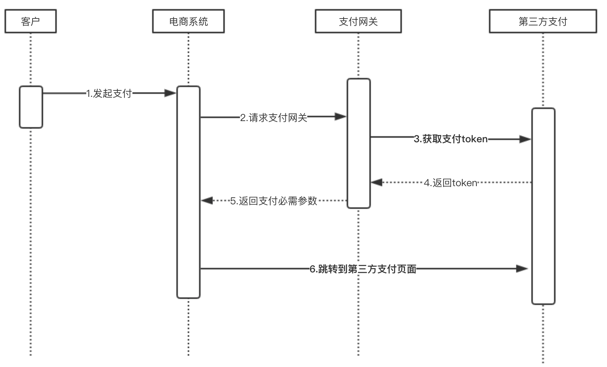
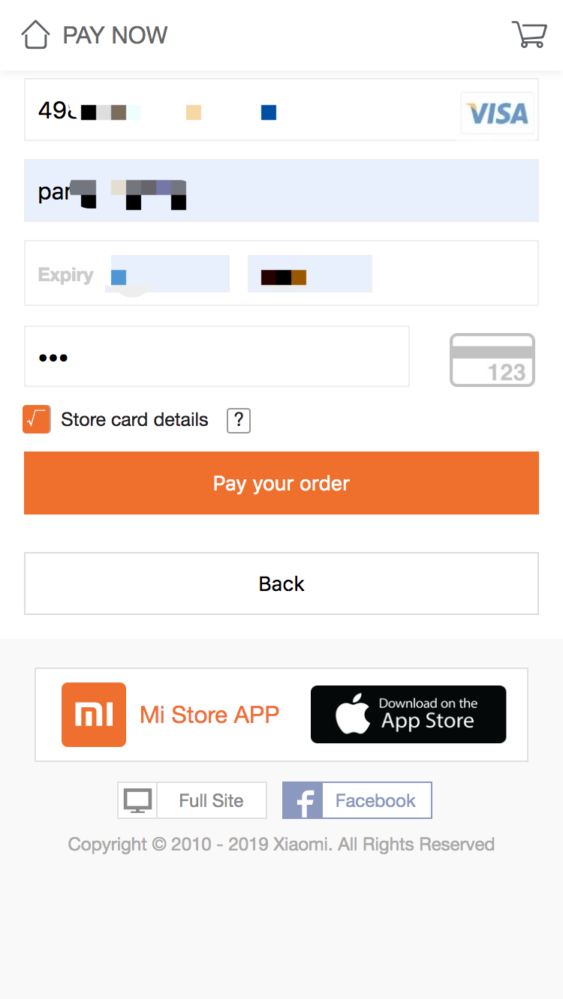
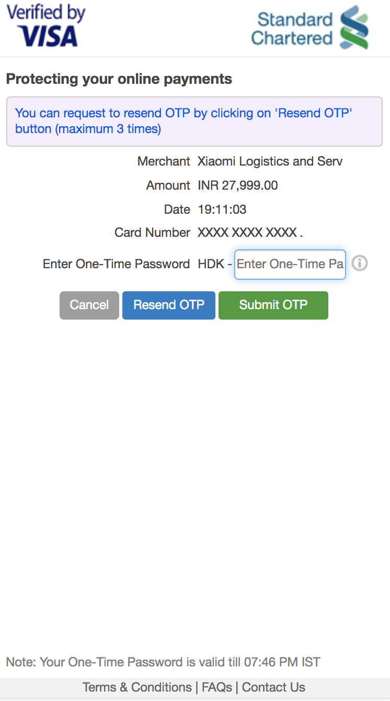
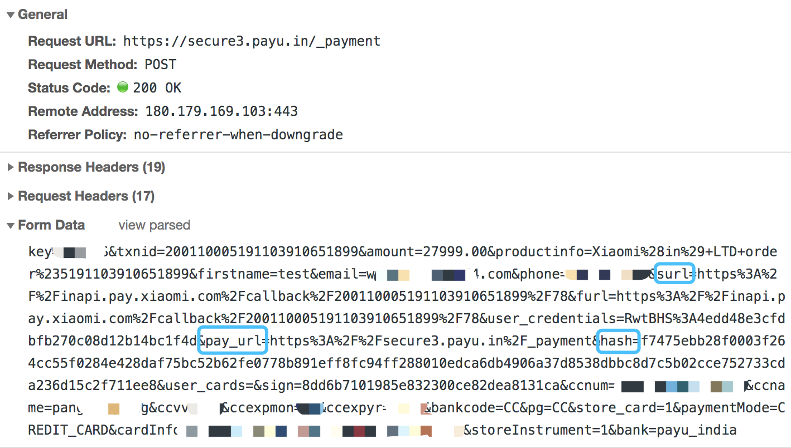
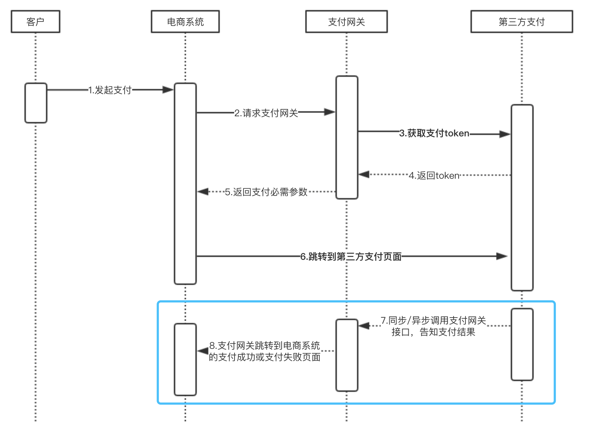
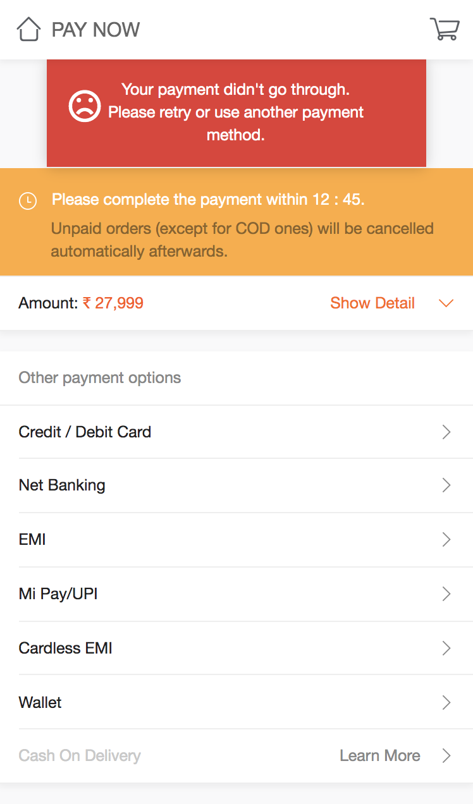
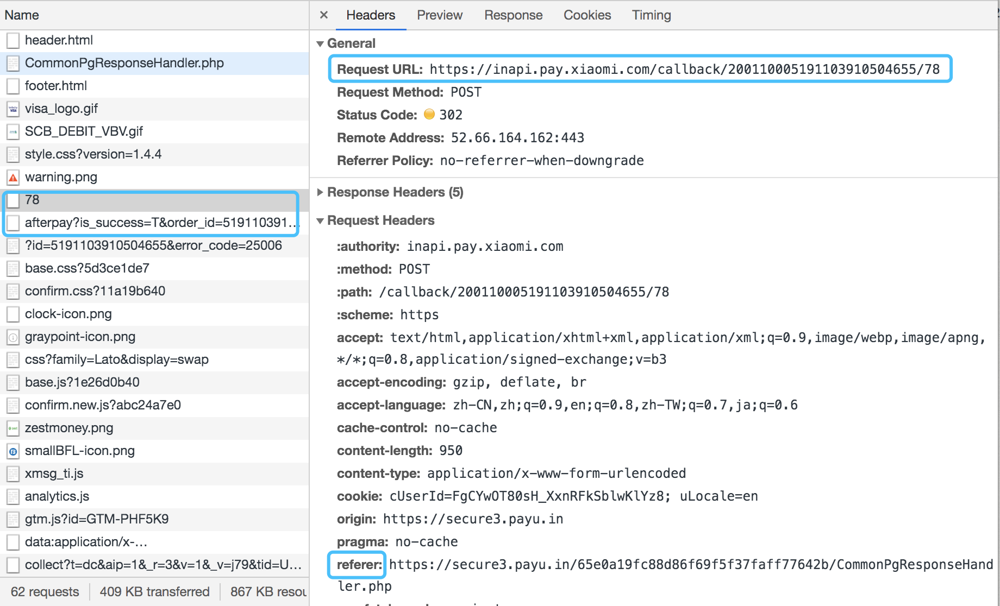
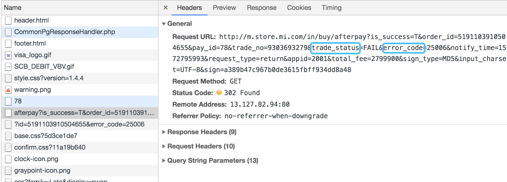
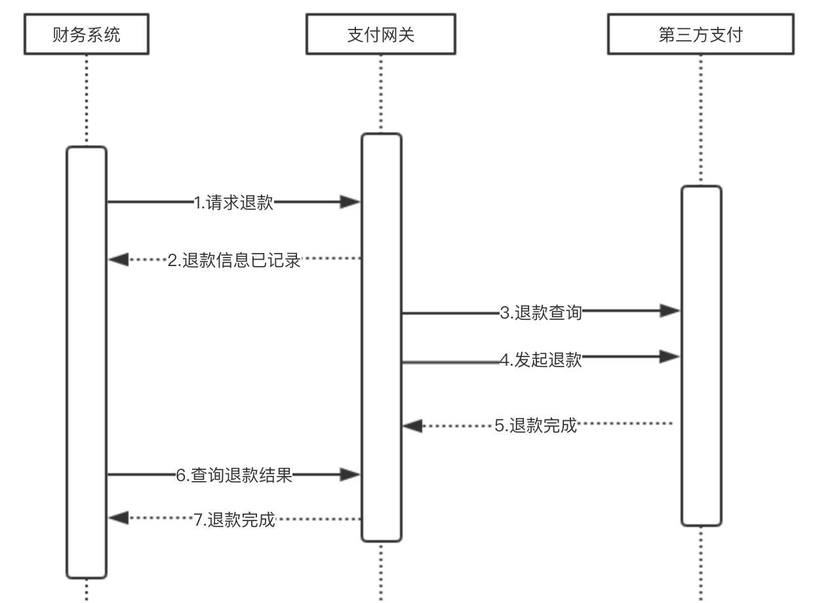
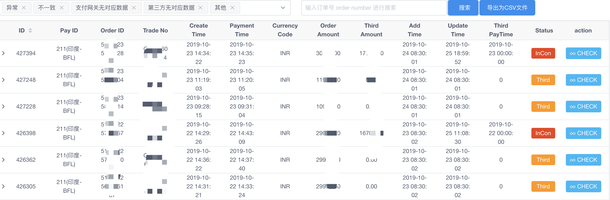

# 如何高效对接第三方支付

**[作者简介]** 逄志强，海外小米网研发工程师，目前主要负责小米网服务构建和研发工作。

海外小米网是小米集团自建的电商网站，是小米集团重要的销售渠道之一。电商购物流程中核心的一环是用户支付。目前我们已经服务 30 个国家和地区，不同国家往往需要对接不同的第三方支付公司，所以最近两年，海外研发组对接了大量的第三方支付公司，积累了一定的经验。

本文主要分享如何对接第三方支付，以及在生产上实际遇到的一些问题，避免大家重复踩坑。

## 一、五个接口

先简单阐述一下，对接第三方支付时，需要对接如下 5 个核心接口。

### 1.发起支付

该接口主要用于从第三方获取 token，当用户跳转到第三方网站进行支付时，第三方支付公司用来校验是否是合法的支付请求。

### 2.支付结果查询

商户用该接口来判断支付结果成功与否。

### 3.退款

商户用该接口进行退款。

### 4.退款查询

商户用该接口来判断退款结果成功与否。

### 5.获取支付成功订单列表接口

商户用该接口获取第三方某日所有成功支付订单列表，用于对账时使用。

## 二、四个流程

只需要对接完如下四个流程，便可完成第三方支付的对接。

- 发起支付请求
- 同步回调和异步回调
- 退款和退款查询
- 对账

### 1.发起支付请求

下面的时序图中有几个名词，此处先给大家介绍一下

- 电商系统：海外商城的服务系统，负责提供整个购物流程
- 支付网关：我们将支付抽离为一个单独的系统，该系统用来对接所有支付

#### 时序图



#### 伪代码

```php
#商城系统
function pay(){
    #1.请求支付网关，获取发起支付必要信息（token，跳转url）
    $res = $this->payRequest($orderInfo,$sign);
    #2.根据返回结果，跳转到第三方，进行支付
    redirect($res['url']);
}

#支付网关
function payment(){
    #1.检查请求数据的签名
    $this->checkSign();
    #2.初始化订单数据，将传入参数格式化为需要的结构
    $this->initData();
    #3.参数检查
    $this->checkParam();
    #4.记录请求日志
    $this->savePayLog();
    #5.发起支付
    #5.1不是首次支付，则检查是否支付成功过
    if(!$isFirstRequest){
        $this->checkPaymentStatus();
    }
    #5.2生成新的支付号
    $transactionCode = $this->getNewTransactionCode();
    #5.3请求第三方，获取token，跳转链接等信息
    $res = $this->pay($transactionCode);
    return $res;
}
```

#### 说明点

- 签名校验：请求支付接口域名为内网域名，使用签名校验，让系统更加安全
- 记录请求日志：请求除了记录到 log 文件中，建议落库，方便日后查找
- 非首次支付判断支付状态：防止重复支付，该判断可在流量高峰期降配掉
- **生成新的支付号**：部分第三方支付公司，规定同一个支付号，无论支付成功与否只能使用一次。目前，在小米网，当订单创建成功后，订单号不会改变，所以每次用户发起支付后，支付网关会生成新的支付号，使用该支付号请求第三方。该方案会引入**重复支付问题**，在后面章节阐述解决方案。

#### 实例



- surl：支付后，第三方会调用该 url，告知支付网关支付结果，这个流程叫同步回调
- pay_url：需要跳转到第三方的 url
- hash：第三方用 hash 来检验该请求是否合法


### 2.同步回调和异步回调

支付后，第三方支付会通知支付网关，支付结果。通知的实现一般会有两种方案

- **同步回调**：支付后，立即回调支付网关提供的回调接口。该接口 url 一般在发起支付时，作为参数传递给第三方
- **异步回调**：支付后，第三方支付会调用对接方提供的 API，该 API 一般是对接的时候提供给第三方，第三方配置在自己系统中的。异步回调有重试机制，如果对接方没有返回指定结果，如 httpcode 不为 200，则会在一段时间后重试，直到达到指定重试上线后，会停止重试。

**同步回调和异步回调是支付系统稳定性和准确性的重要保证。**这两个流程核心逻辑一致，所以此处放在一起讲述。

#### 时序图



#### 伪代码

```php
#2.同步回调 异步回调
#支付网关
function callback()
{
    #1.记录请求日志
    $this->savePayLog();
    #2.检查第三方传入数据是否合法
    $this->checkCallbackData();
    #3.检查第三方签名是否合法
    $this->checkign();
    #4.根据传入数据/调用第三方查询接口判断该订单在第三方系统里是否支付成功
    $this->checkPaymentStatus();
    #5.记录返回数据
    $this->saveResponseLog();
    #6.更改订单状态
    #6.1如果订单是待支付状态，则更新支付网关内的订单状态，同时通知订单中心支付完成，可出库
    if ($orderStatus == "待支付") {
        $this->updateOrderStatusFinish();
        $this->notifyOC();
        #6.2如果订单已经支付完成
    } elseif($orderStatus == "已经支付完成") {
        if("相同的支付方式，第三方交易号也相同"){
            #6.2.1重复通知，幂等处理
            $this->notifyOC();
        }elseif("相同的支付方式，不同的交易号"){
            #6.2.2同渠道重复支付,将该信息记入重复支付表，进行退款
            $this->addRepeatPayment();
        }elseif("不同的支付方式"){
            #6.2.3不同渠道重复支付，将该信息记入重复支付表，进行退款
            $this->addRepeatPayment();
        }
    }
    #7.根据订单状态，跳转到支付成功/失败页面
    if("是同步回调"){
        redirect("电商支付成功/失败页面");
    }
}
```

#### 说明点

- 日志：传入和返回数据都做记录
- 签名校验：校验第三方签名十分重要，这是防止他人攻击的方案之一
- 判断支付成功：情况允许条件下，建议请求第三方查询接口来判断是否支付成功，这是防止他人攻击的方案之二
- 跳转支付成功/失败页面：当发起支付时，支付成功或者失败页面的 url 会传给支付网关。之所以请求支付时传递该 url，原因在于不同终端，url 不同。
- 该流程需要两个定时脚本进行支撑
    - 通知订单中心支付完成。因为更改支付系统的订单状态和通知订单中心未必会同时成功。
    - 重复支付订单自动退款

#### 实例



### 3.退款

退款整体流程一般为，财务系统向支付网关发起退款请求，支付网关将退款记录到表。支付系统定时进行退款，财务系统定时查询退款状态。

#### 时序图



#### 伪代码

```php
#3.退款
#支付网关
function refund(){
    #1.获取待退款列表
    $refundList = $this->getNotRefundList();
    foreach ($refundList as $item){
        #2.检查数据，订单是否支付成功，退款金额是否小于订单金额
        $this->checkRefundParams();
        #3.记录退款请求数据
        $this->saveRefundReqData();
        #4.查询退款结果
        $this->checkRefundStatus();
        #5.调用第三方接口进行退款
        $this->refund();
        #6.记录第三方返回数据
        $this->saveRefundResponse();
        #7.更新退款状态
        $this->updateRefundStatus();
    }
}
```

#### 说明点

- **退款类型**：退款一般分为两种类型
    - 部分退款：有的第三方公司不支持，需要提前咨询
    - 全额退款
- **待退款列表**：建议同一个订单的多个退款单，确认处理完一个之后，再处理另一个
- **退款相关状态**：调用第三方接口状态 callStatus，退款结果状态 refundStatus。callStatus 成功，refundStatus 未成功，可定时查退款状态
- 查询退款结果：可选，根据第三方 API 情况做判断
- 日志：请求日志和返回日志都进行记录

### 4.对账

对账的完成，需要第三方提供前一天的支付成功数据，然后和支付网关系统中当天的支付成功数据进行对比。

对不上账的类型有：

- 支付网关有数据，第三方没有数据
    - 可能被黑客攻击了，用户没有真正支付，但是我们发货了
    - 代码有问题，用户没有完成支付，但是系统认为支付成功了
    - 第三方提供数据不全
- 支付网关没有数据，第三方有数据
    - 用户支付成功，但是同步或者异步通知都失败了
- 金额不一致
    - 代码有问题，电商发起支付金额和真正调用第三方金额不一致
    - 第三方提供数据有问题

对账是验证支付系统准确的重要一环，可以帮助开发人员今早发现很多问题，建议每一种支付方式都要支持，并且及时对账。

#### 实例



## 三、支付进阶

完成上述四个流程后，就实现了支付渠道的对接。然后需要考虑支付网关的实现。支付网关包含多个支付渠道，对外部提供统一的接口。支付网关一般需要考虑如下问题：

- 支付网关中接入多个第三方支付，如何设计使变动最小？
- 相同的银行，多个第三方支付支持，如何设计分配流量的系统？
- 如何监控每个第三方支付的成功率，并动态切换第三方支付？
- 如何做好风控？

这些问题的讲解涉及到很大的篇幅，今后会进行讲解。大家可以先自己思考一些解决方案。

### 下回预告

到目前为止，已经介绍了对接支付渠道需要对接哪些接口，以及整体流程如何搭建。接下来将会介绍支付网关的设计以及如何灵活分配支付流量到各个支付渠道。

------

**作者**

逄志强，小米信息技术部海外商城组

**招聘**

信息部是小米公司整体系统规划建设的核心部门，支撑公司国内外的线上线下销售服务体系、供应链体系、ERP 体系、内网 OA 体系、数据决策体系等精细化管控的执行落地工作，服务小米内部所有的业务部门以及 40 家生态链公司。

同时部门承担大数据基础平台研发和微服务体系建设落，语言涉及 Java、Go，长年虚位以待对大数据处理、大型电商后端系统、微服务落地有深入理解和实践的各路英雄。

欢迎投递简历：jin.zhang(a)xiaomi.com(武汉)