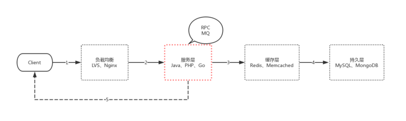
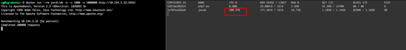

### 什么是高并发?

```
高并发是互联网分布式系统架构的性能指标之一,它通常是指单位时间内系统能够同时处理的请求数,
简单点说，就是QPS(Queries per second)。
```

那么我们在谈论高并发的时候，究竟在谈些什么东西呢？

### 高并发究竟是什么?

这里先给出结论:
`高并发`的基本表现为单位时间内系统能够同时处理的请求数,
`高并发`的核心是对CPU资源的**有效压榨**。

举个例子，如果我们开发了一个叫做`MD5穷举`的应用，每个请求都会携带一个md5加密字符串，最终系统穷举出所有的结果，并返回原始字符串。这个时候我们的应用场景或者说应用业务是属于`CPU密集型`而不是`IO密集型`。这个时候CPU一直在做有效计算，甚至可以把CPU利用率跑满，这时我们谈论高并发并没有任何意义。(当然，我们可以通过加机器也就是加CPU来提高并发能力,这个是一个正常猿都知道废话方案，谈论加机器没有什么意义，没有任何高并发是加机器解决不了，如果有,那说明你加的机器还不够多!🐶)

**对于大多数互联网应用来说,CPU不是也不应该是系统的瓶颈，系统的大部分时间的状况都是CPU在等I/O (硬盘/内存/网络) 的读/写操作完成。**

这个时候就可能有人会说，我看系统监控的时候，内存和网络都很正常，但是CPU利用率却跑满了这是为什么？

```
这是一个好问题,后文我会给出实际的例子，再次强调上文说的 '有效压榨' 这4个字,这4个字会围绕本文的全部内容！
```


### 控制变量法

万事万物都是互相联系的，当我们在谈论高并发的时候，系统的每个环节应该都是需要与之相匹配的。我们先来回顾一下一个经典C/S的HTTP请求流程。



如图中的序号所示:

1. 我们会经过DNS服务器的解析，请求到达负载均衡集群
2. 负载均衡服务器会根据配置的规则，想请求分摊到服务层。服务层也是我们的业务核心层，这里可能也会有一些PRC、MQ的一些调用等等
3. 再经过缓存层
4. 最后持久化数据
5. 返回数据给客户端

要达到高并发，我们需要 负载均衡、服务层、缓存层、持久层 都是高可用、高性能的，甚至在第5步，我们也可以通过 压缩静态文件、HTTP2推送静态文件、CDN来做优化，这里的每一层我们都可以写几本书来谈优化。

本文主要讨论服务层这一块，即图红线圈出来的那部分。不再考虑讲述数据库、缓存相关的影响。
高中的知识告诉我们，这个叫 `控制变量法`。

### 再谈并发

- 网络编程模型的演变历史


并发问题一直是服务端编程中的重点和难点问题，为了优系统的并发量，从最初的Fork进程开始，到进程池/线程池,再到epoll事件驱动(Nginx、node.js反人类回调),再到协程。
从上中可以很明显的看出，整个演变的过程，就是对CPU有效性能压榨的过程。
什么?不明显?

- 那我们再谈谈上下文切换

在谈论上下文切换之前，我们再明确两个名词的概念。
**并行：两个事件同一时刻完成。**
**并发：两个事件在同一时间段内交替发生,从宏观上看，两个事件都发生了**。

线程是操作系统调度的最小单位，进程是资源分配的最小单位。由于CPU是串行的,因此对于单核CPU来说,同一时刻一定是只有一个线程在占用CPU资源的。因此，Linux作为一个多任务(进程)系统，会频繁的发生进程/线程切换。

在每个任务运行前，CPU都需要知道从哪里加载，从哪里运行，这些信息保存在`CPU寄存器`和操作系统的`程序计数器`里面，这两样东西就叫做 `CPU上下文`。
进程是由内核来管理和调度的，进程的切换只能发生在内核态，因此 虚拟内存、栈、全局变量等用户空间的资源，以及内核堆栈、寄存器等内核空间的状态,就叫做 `进程上下文`。
前面说过,线程是操作系统调度的最小单位。同时线程会共享父进程的虚拟内存和全局变量等资源，因此 父进程的资源加上线上自己的私有数据就叫做`线程的上下文`。

对于线程的上下文切换来说，如果是同一进程的线程，因为有资源共享，所以会比多进程间的切换消耗更少的资源。

现在就更容易解释了，进程和线程的切换，会产生`CPU上下文`切换和`进程/线程上下文`的切换。而这些`上下文切换`,都是会消耗额外的CPU的资源的。

- 进一步谈谈协程的上下文切换
    那么协程就不需要上下文切换了吗？需要，但是**不会产生** `CPU上下文切换`和`进程/线程上下文`的切换,因为这些切换都是在同一个线程中，即用户态中的切换，**你甚至可以简单的理解为**，`协程上下文`之间的切换，就是移动了一下你程序里面的指针，CPU资源依旧属于当前线程。
    需要深刻理解的，可以再深入看看Go的`GMP模型`。
    最终的效果就是协程**进一步压榨了CPU的有效利用率**。

### 回到开始的那个问题

```
这个时候就可能有人会说，我看系统监控的时候，内存和网络都很正常，但是CPU利用率却跑满了这是为什么？
```

注意本篇文章在谈到CPU利用率的时候，一定会加上`有效`两字作为定语，CPU利用率跑满，很多时候其实是做了很多低效的计算。
以『世界上最好的语言』为例，典型PHP-FPM的CGI模式，每一个HTTP请求:

- 都会读取框架的数百个php文件，
- 都会重新建立/释放一遍MYSQL/REIDS/MQ连接，
- 都会重新动态解释编译执行PHP文件，
- 都会在不同的php-fpm进程直接不停的切换切换再切换。

php的这种**CGI运行模式**，根本上就决定了它在高并发上的**灾难性表现**。

找到问题，往往比解决问题更难。当我们理解了`当我们在谈论高并发究竟在谈什么` 之后,我们会发现高并发和高性能并不是编程语言限制了你，限制你的只是你的思想。

找到问题,解决问题！当我们能有效压榨CPU性能之后,能达到什么样的效果?

下面我们看看 php+swoole的HTTP服务 与 Java高性能的异步框架netty的HTTP服务之间的性能差异对比。

### 性能对比前的准备

- [swoole是什么][1]

```
Swoole是一个为PHP用C和C++编写的基于事件的高性能异步&协程并行网络通信引擎
```

- [Netty是什么][2]

```
Netty是由JBOSS提供的一个java开源框架。 Netty提供异步的、事件驱动的网络应用程序框架和工具，用以快速开发高性能、高可靠性的网络服务器和客户端程序。
```

- 单机能够达到的最大HTTP连接数是多少？
    回忆一下计算机网络的相关知识，HTTP协议是应用层协议，在传输层，每个TCP连接建立之前都会进行三次握手。
    每个TCP连接由 `本地ip`,`本地端口`,`远端ip`,`远端端口`,四个属性标识。
    TCP协议报文头如下(图片来自[维基百科][3])：


本地端口由16位组成,因此本地端口的最多数量为 2^16 = 65535个。
远端端口由16位组成,因此远端端口的最多数量为 2^16 = 65535个。
同时，在linux底层的网络编程模型中，每个TCP连接，操作系统都会维护一个File descriptor(fd)文件来与之对应，而fd的数量限制，可以由ulimt -n 命令查看和修改，测试之前我们可以执行命令: ulimit -n 65536修改这个限制为65535。

因此，在不考虑硬件资源限制的情况下，
本地的最大HTTP连接数为： 本地最大端口数65535 *本地ip数1 = 65535 个。
远端的最大HTTP连接数为：远端最大端口数65535* 远端(客户端)ip数+∞ = 无限制~~ 。
PS: 实际上操作系统会有一些保留端口占用,因此本地的连接数实际也是达不到理论值的。

### 性能对比

- 测试资源

各一台docker容器,1G内存+2核CPU,如图所示:


docker-compose编排如下:

```
# java8
version: "2.2"
services:
  java8:
    container_name: "java8"
    hostname: "java8"
    image: "java:8"
    volumes:
      - /home/cg/MyApp:/MyApp
    ports:
      - "5555:8080"
    environment:
      - TZ=Asia/Shanghai
    working_dir: /MyApp
    cpus: 2
    cpuset: 0,1

    mem_limit: 1024m
    memswap_limit: 1024m
    mem_reservation: 1024m
    tty: true

# php7-sw
version: "2.2"
services:
  php7-sw:
    container_name: "php7-sw"
    hostname: "php7-sw"
    image: "mileschou/swoole:7.1"
    volumes:
      - /home/cg/MyApp:/MyApp
    ports:
      - "5551:8080"
    environment:
      - TZ=Asia/Shanghai
    working_dir: /MyApp
    cpus: 2
    cpuset: 0,1

    mem_limit: 1024m
    memswap_limit: 1024m
    mem_reservation: 1024m
    tty: true
```

- php代码

```
<?php

use Swoole\Server;
use Swoole\Http\Response;

$http = new swoole_http_server("0.0.0.0", 8080);
$http->set([
	'worker_num' => 2
]);
$http->on("request", function ($request, Response $response) {
	//go(function () use ($response) {
        // Swoole\Coroutine::sleep(0.01);
		$response->end('Hello World');
	//});
});

$http->on("start", function (Server $server) {
	go(function () use ($server) {
		echo "server listen on 0.0.0.0:8080 \n";
	});
});
$http->start();
```

- Java关键代码
    源代码来自, [https://github.com/netty/netty][4]

```
public static void main(String[] args) throws Exception {
    // Configure SSL.
    final SslContext sslCtx;
    if (SSL) {
        SelfSignedCertificate ssc = new SelfSignedCertificate();
        sslCtx = SslContextBuilder.forServer(ssc.certificate(), ssc.privateKey()).build();
    } else {
        sslCtx = null;
    }

    // Configure the server.
    EventLoopGroup bossGroup = new NioEventLoopGroup(2);
    EventLoopGroup workerGroup = new NioEventLoopGroup();
    try {
        ServerBootstrap b = new ServerBootstrap();
        b.option(ChannelOption.SO_BACKLOG, 1024);
        b.group(bossGroup, workerGroup)
         .channel(NioServerSocketChannel.class)
         .handler(new LoggingHandler(LogLevel.INFO))
         .childHandler(new HttpHelloWorldServerInitializer(sslCtx));

        Channel ch = b.bind(PORT).sync().channel();

        System.err.println("Open your web browser and navigate to " +
                (SSL? "https" : "http") + "://127.0.0.1:" + PORT + '/');

        ch.closeFuture().sync();
    } finally {
        bossGroup.shutdownGracefully();
        workerGroup.shutdownGracefully();
    }
}
```

因为我只给了两个核心的CPU资源，所以两个服务均只开启连个work进程即可。
5551端口表示PHP服务。
5555端口表示Java服务。

- **压测工具结果对比：ApacheBench (ab)**

ab命令: docker run –rm jordi/ab -k -c 1000 -n 1000000 http://10.234.3.32:5555/
在并发1000进行100万次Http请求的基准测试中,

Java + netty 压测结果:



PHP + swoole 压测结果:


|      | 服务         | QPS      | 响应时间ms(max,min) | 内存(MB) |      |
| :--- | :----------- | -------- | ------------------- | -------- | ---- |
|      | Java + netty | 84042.11 | (11,25)             | 600+     |      |
|      | php + swoole | 87222.98 | (9,25)              | 30+      |      |

ps: 上图选择的是三次压测下的最佳结果。

总的来说，性能差异并不大，PHP+swoole的服务甚至比Java+netty的服务还要稍微好一点，特别是在内存占用方面，java用了600MB,php只用了30MB。
这能说明什么呢？
没有IO阻塞操作,不会发生协程切换。
这个仅仅只能说明 多线程+epoll的模式下,有效的压榨CPU性能，你甚至用PHP都能写出高并发和高性能的服务。

### 性能对比——见证奇迹的时刻

上面代码其实并没有展现出协程的优秀性能，因为整个请求没有阻塞操作,但往往我们的应用会伴随着例如 文档读取、DB连接/查询 等各种阻塞操作,下面我们看看加上阻塞操作后,压测结果如何。
Java和PHP代码中,我都分别加上 `sleep(0.01) //秒`的代码，模拟0.01秒的系统调用阻塞。
代码就不再重复贴上来了。

带IO阻塞操作的 Java + netty 压测结果:


大概10分钟才能跑完所有压测。。。

带IO阻塞操作的 PHP + swoole 压测结果:


|      | 服务         | QPS     | 响应时间ms(max,min) | 内存(MB) |      |
| :--- | :----------- | ------- | ------------------- | -------- | ---- |
|      | Java + netty | 1562.69 | (52,160)            | 100+     |      |
|      | php + swoole | 9745.20 | (9,25)              | 30+      |      |

从结果中可以看出,基于协程的php+ swoole服务比 Java + netty服务的QPS高了6倍。

当然，这两个测试代码都是官方demo中的源代码，肯定还有很多可以优化的配置，优化之后，结果肯定也会好很多。

可以再思考下，为什么官方默认线程/进程数量不设置的更多一点呢？
进程/线程数量可不是越多越好哦，前面我们已经讨论过了，在进程/线程切换的时候，会产生额外的CPU资源花销，特别是在用户态和内核态之间切换的时候！

**对于这些压测结果来说，我并不是针对Java,我是指 只要明白了高并发的核心是什么,找到这个目标，无论用什么编程语言，只要针对CPU利用率做有效的优化(连接池、守护进程、多线程、协程、select轮询、epoll事件驱动)，你也能搭建出一个高并发和高性能的系统。**

所以,你现在明白了，当我们在谈论高性能的时候，究竟在谈什么了吗？

思路永远比结果重要！

参考：

[1]: https://github.com/swoole/swoole-src/blob/master/README-CN.md
[2]: https://github.com/netty/netty
[3]: https://en.wikipedia.org/wiki/Transmission_Control_Protocol
[4]: https://github.com/netty/netty/tree/4.1/example/src/main/java/io/netty/example/http/helloworld

**作者**

陈刚，小米信息技术部服务研发

**招聘**

小米信息部武汉研发中心，信息部是小米公司整体系统规划建设的核心部门，支撑公司国内外的线上线下销售服务体系、供应链体系、ERP体系、内网OA体系、数据决策体系等精细化管控的执行落地工作，服务小米内部所有的业务部门以及 40 家生态链公司。

同时部门承担大数据基础平台研发和微服务体系建设落，语言涉及 Java、Go，长年虚位以待对大数据处理、大型电商后端系统、微服务落地有深入理解和实践的各路英雄。