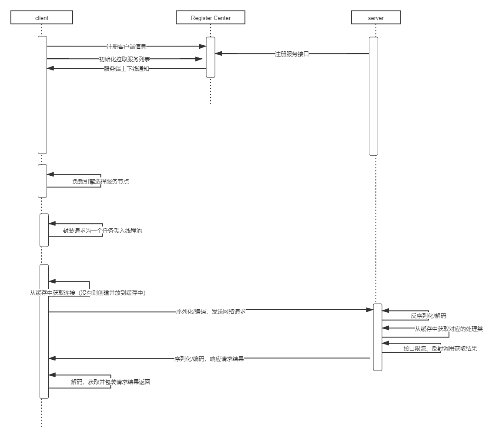
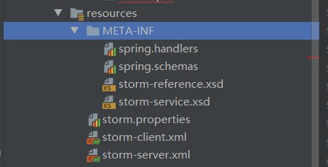
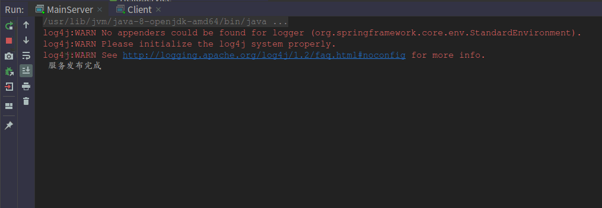
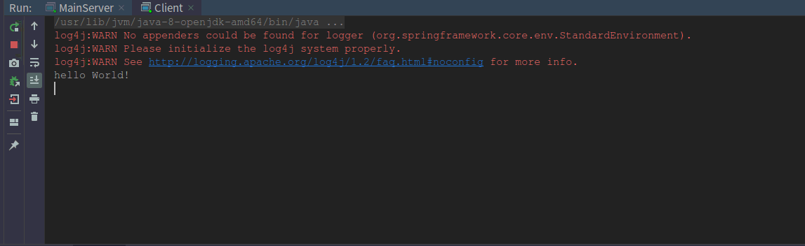
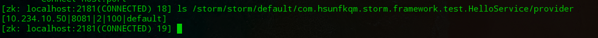

# 浅析 RPC 与基本实现

> 注：文中所用到的代码已上传至 github: https://github.com/fankongqiumu/storm.git

**[作者简介]** 孙浩，信息部售后组研发工程师

## 引言

本文主要论述的是“RPC 实现原理”，那么首先明确一个问题什么是 RPC 呢？RPC 是 Remote Procedure Call 的缩写，即，远程过程调用。RPC 是一个计算机通信协议。该协议允许运行于一台计算机的程序调用另一台计算机的子程序，而开发人员无需额外地为这个交互编程。
值得注意是，两个或多个应用程序都分布在不同的服务器上，它们之间的调用都像是本地方法调用一样。接下来我们便来分析一下一次 RPC 调用发生了些什么？

## 一次基本的 RPC 调用会涉及到什么？

现在业界内比较流行的一些 RPC 框架，例如 Dubbo 提供的是`基于接口的远程方法调用`，即客户端只需要知道接口的定义即可调用远程服务。在 Java 中接口并不能直接调用实例方法，必须通过其实现类对象来完成此操作，这意味着客户端必须为这些接口生成`代理对象`，对此 Java 提供了 `Proxy`、`InvocationHandler` 生成动态代理的支持；生成了代理对象，那么每个具体的发方法是怎么调用的呢？jdk 动态代理生成的代理对象调用指定方法时实际会执行 `InvocationHandler` 中定义的 `#invoke` 方法，在该方法中完成远程方法调用并获取结果。

抛开客户端，回过头来看 RPC 是两台计算机间的调用，实质上是两台主机间的`网络通信`，涉及到网络通信又必然会有`序列化、反序列化`，`编解码`等一些必须要考虑的问题；同时实际上现在大多系统都是集群部署的，多台主机/容器对外提供相同的服务，如果集群的节点数量很大的话，那么管理服务地址也将是一件十分繁琐的事情，常见的做法是各个服务节点将自己的地址和提供的服务列表注册到一个 `注册中心`，由 `注册中心` 来统一管理服务列表；这样的做法解决了一些问题同时为客户端增加了一项新的工作——那就是`服务发现`，通俗来说就是从注册中心中找到远程方法对应的服务列表并通过某种策略从中选取一个服务地址来完成网络通信。

聊了客户端和 `注册中心`，另外一个重要的角色自然是服务端，服务端最重要的任务便是提供服务接口的真正实现并在某个端口上监听网络请求，监听到请求后从网络请求中获取到对应的参数（比如服务接口、方法、请求参数等），再根据这些参数通过`反射`的方式调用接口的真正实现获取结果并将其写入对应的响应流中。

综上所述，一次基本的 RPC 调用流程大致如下：


## 基本实现

### 服务端（生产者）

- 服务接口

在 RPC 中，生产者和消费者有一个共同的服务接口 API。如下，定义一个 HelloService 接口。

```java
/**
 * @author 孙浩
 * @Descrption  服务接口
 ***/
public interface HelloService {
    String sayHello(String somebody);
}
```

- 服务实现

生产者要提供服务接口的实现，创建 HelloServiceImpl 实现类。

```java
/**
 * @author 孙浩
 * @Descrption 服务实现
 ***/
public class HelloServiceImpl implements HelloService {
    @Override
    public String sayHello(String somebody) {
        return "hello " + somebody + "!";
    }
}
```

- 服务注册

本例使用 Spring 来管理 bean，采用自定义 xml 和解析器的方式来将服务实现类载入容器（当然也可以采用自定义注解的方式，此处不过多论述）并将服务接口信息注册到注册中心。
首先自定义`xsd`,

```xml
<xsd:element name="service">
    <xsd:complexType>
        <xsd:complexContent>
            <xsd:extension base="beans:identifiedType">
                <xsd:attribute name="interface" type="xsd:string" use="required"/>
                <xsd:attribute name="timeout" type="xsd:int" use="required"/>
                <xsd:attribute name="serverPort" type="xsd:int" use="required"/>
                <xsd:attribute name="ref" type="xsd:string" use="required"/>
                <xsd:attribute name="weight" type="xsd:int" use="optional"/>
                <xsd:attribute name="workerThreads" type="xsd:int" use="optional"/>
                <xsd:attribute name="appKey" type="xsd:string" use="required"/>
                <xsd:attribute name="groupName" type="xsd:string" use="optional"/>
            </xsd:extension>
        </xsd:complexContent>
    </xsd:complexType>
</xsd:element>
```

分别指定 schema 和 xmd，schema 和对应 handler 的映射：

- schema

    ```xml
    http\://www.storm.com/schema/storm-service.xsd=META-INF/storm-service.xsd
    http\://www.storm.com/schema/storm-reference.xsd=META-INF/storm-reference.xsd
    ```

- handler

    ```xml
    http\://www.storm.com/schema/storm-service=com.hsunfkqm.storm.framework.spring.StormServiceNamespaceHandler
    http\://www.storm.com/schema/storm-reference=com.hsunfkqm.storm.framework.spring.StormRemoteReferenceNamespaceHandler
    
    ```

将编写好的文件放入 `classpath` 下的 `META-INF` 目录下：


在 Spring 配置文件中配置服务类：

```xml
<!-- 发布远程服务 -->
 <bean id="helloService" class="com.hsunfkqm.storm.framework.test.HelloServiceImpl"/>
 <storm:service id="helloServiceRegister"
                     interface="com.hsunfkqm.storm.framework.test.HelloService"
                     ref="helloService"
                     groupName="default"
                     weight="2"
                     appKey="ares"
                     workerThreads="100"
                     serverPort="8081"
                     timeout="600"/>
```

编写对应的 Handler 和 Parser：
`StormServiceNamespaceHandler`

```java
import org.springframework.beans.factory.xml.NamespaceHandlerSupport;

/**
 * @author 孙浩
 * @Descrption 服务发布自定义标签
 ***/
public class StormServiceNamespaceHandler extends NamespaceHandlerSupport {
    @Override
    public void init() {
        registerBeanDefinitionParser("service", new ProviderFactoryBeanDefinitionParser());
    }
}
```

`ProviderFactoryBeanDefinitionParser`：

```java
protected Class getBeanClass(Element element) {
        return ProviderFactoryBean.class;
    }

    protected void doParse(Element element, BeanDefinitionBuilder bean) {

        try {
            String serviceItf = element.getAttribute("interface");
            String serverPort = element.getAttribute("serverPort");
            String ref = element.getAttribute("ref");
            // ....
            bean.addPropertyValue("serverPort", Integer.parseInt(serverPort));
            bean.addPropertyValue("serviceItf", Class.forName(serviceItf));
            bean.addPropertyReference("serviceObject", ref);
            //...
            if (NumberUtils.isNumber(weight)) {
                bean.addPropertyValue("weight", Integer.parseInt(weight));
            }
            //...
       } catch (Exception e) {
            // ...        
      }
    }
```

`ProviderFactoryBean`：

```java
/**
 * @author 孙浩
 * @Descrption 服务发布
 ***/
public class ProviderFactoryBean implements FactoryBean, InitializingBean {

    //服务接口
    private Class<?> serviceItf;
    //服务实现
    private Object serviceObject;
    //服务端口
    private String serverPort;
    //服务超时时间
    private long timeout;
    //服务代理对象，暂时没有用到
    private Object serviceProxyObject;
    //服务提供者唯一标识
    private String appKey;
    //服务分组组名
    private String groupName = "default";
    //服务提供者权重，默认为 1 , 范围为 [1-100]
    private int weight = 1;
    //服务端线程数，默认 10 个线程
    private int workerThreads = 10;

    @Override
    public Object getObject() throws Exception {
        return serviceProxyObject;
    }

    @Override
    public Class<?> getObjectType() {
        return serviceItf;
    }

    @Override
    public void afterPropertiesSet() throws Exception {
        //启动 Netty 服务端
        NettyServer.singleton().start(Integer.parseInt(serverPort));
        //注册到 zk, 元数据注册中心
        List<ProviderService> providerServiceList = buildProviderServiceInfos();
        IRegisterCenter4Provider registerCenter4Provider = RegisterCenter.singleton();
        registerCenter4Provider.registerProvider(providerServiceList);
    }
}

//================RegisterCenter#registerProvider======================
@Override
public void registerProvider(final List<ProviderService> serviceMetaData) {
    if (CollectionUtils.isEmpty(serviceMetaData)) {
        return;
    }

    //连接 zk, 注册服务
    synchronized (RegisterCenter.class) {
        for (ProviderService provider : serviceMetaData) {
            String serviceItfKey = provider.getServiceItf().getName();

            List<ProviderService> providers = providerServiceMap.get(serviceItfKey);
            if (providers == null) {
                providers = Lists.newArrayList();
            }
            providers.add(provider);
            providerServiceMap.put(serviceItfKey, providers);
        }

        if (zkClient == null) {
            zkClient = new ZkClient(ZK_SERVICE, ZK_SESSION_TIME_OUT, ZK_CONNECTION_TIME_OUT, new SerializableSerializer());
        }

        //创建 ZK 命名空间/当前部署应用 APP 命名空间/
        String APP_KEY = serviceMetaData.get(0).getAppKey();
        String ZK_PATH = ROOT_PATH + "/" + APP_KEY;
        boolean exist = zkClient.exists(ZK_PATH);
        if (!exist) {
            zkClient.createPersistent(ZK_PATH, true);
        }

        for (Map.Entry<String, List<ProviderService>> entry : providerServiceMap.entrySet()) {
            //服务分组
            String groupName = entry.getValue().get(0).getGroupName();
            //创建服务提供者
            String serviceNode = entry.getKey();
            String servicePath = ZK_PATH + "/" + groupName + "/" + serviceNode + "/" + PROVIDER_TYPE;
            exist = zkClient.exists(servicePath);
            if (!exist) {
                zkClient.createPersistent(servicePath, true);
            }

            //创建当前服务器节点
            int serverPort = entry.getValue().get(0).getServerPort();//服务端口
            int weight = entry.getValue().get(0).getWeight();//服务权重
            int workerThreads = entry.getValue().get(0).getWorkerThreads();//服务工作线程
            String localIp = IPHelper.localIp();
            String currentServiceIpNode = servicePath + "/" + localIp + "|" + serverPort + "|" + weight + "|" + workerThreads + "|" + groupName;
            exist = zkClient.exists(currentServiceIpNode);
            if (!exist) {
                //注意，这里创建的是临时节点
                zkClient.createEphemeral(currentServiceIpNode);
            }
            //监听注册服务的变化，同时更新数据到本地缓存
            zkClient.subscribeChildChanges(servicePath, new IZkChildListener() {
                @Override
                public void handleChildChange(String parentPath, List<String> currentChilds) throws Exception {
                    if (currentChilds == null) {
                        currentChilds = Lists.newArrayList();
                    }
                    //存活的服务 IP 列表
                    List<String> activityServiceIpList = Lists.newArrayList(Lists.transform(currentChilds, new Function<String, String>() {
                        @Override
                        public String apply(String input) {
                            return StringUtils.split(input, "|")[0];
                        }
                    }));
                    refreshActivityService(activityServiceIpList);
                }
            });

        }
    }
}
```

至此服务实现类已被载入 Spring 容器中，且服务接口信息也注册到了注册中心。

- 网络通信

作为生产者对外提供 RPC 服务，必须有一个网络程序来来监听请求和做出响应。在 Java 领域 Netty 是一款高性能的 NIO 通信框架，很多的框架的通信都是采用 Netty 来实现的，本例中也采用它当做通信服务器。

构建并启动 Netty 服务监听指定端口：

```java
public void start(final int port) {
        synchronized (NettyServer.class) {
            if (bossGroup != null || workerGroup != null) {
                return;
            }

            bossGroup = new NioEventLoopGroup();
            workerGroup = new NioEventLoopGroup();
            ServerBootstrap serverBootstrap = new ServerBootstrap();
            serverBootstrap
                    .group(bossGroup, workerGroup)
                    .channel(NioServerSocketChannel.class)
                    .option(ChannelOption.SO_BACKLOG, 1024)
                    .childOption(ChannelOption.SO_KEEPALIVE, true)
                    .childOption(ChannelOption.TCP_NODELAY, true)
                    .handler(new LoggingHandler(LogLevel.INFO))
                    .childHandler(new ChannelInitializer<SocketChannel>() {
                        @Override
                        protected void initChannel(SocketChannel ch) throws Exception {
                            //注册解码器 NettyDecoderHandler
                            ch.pipeline().addLast(new NettyDecoderHandler(StormRequest.class, serializeType));
                            //注册编码器 NettyEncoderHandler
                            ch.pipeline().addLast(new NettyEncoderHandler(serializeType));
                            //注册服务端业务逻辑处理器 NettyServerInvokeHandler
                            ch.pipeline().addLast(new NettyServerInvokeHandler());
                        }
                    });
            try {
                channel = serverBootstrap.bind(port).sync().channel();
            } catch (InterruptedException e) {
                throw new RuntimeException(e);
            }
        }
    }
```

上面的代码中向 Netty 服务的 pipeline 中添加了编解码和业务处理器，当接收到请求时，经过编解码后，真正处理业务的是业务处理器，即`NettyServerInvokeHandler`, 该处理器继承自`SimpleChannelInboundHandler`, 当数据读取完成将触发一个事件，并调用`NettyServerInvokeHandler#channelRead0`方法来处理请求。

```java
@Override
protected void channelRead0(ChannelHandlerContext ctx, StormRequest request) throws Exception {
    if (ctx.channel().isWritable()) {
        //从服务调用对象里获取服务提供者信息
        ProviderService metaDataModel = request.getProviderService();
        long consumeTimeOut = request.getInvokeTimeout();
        final String methodName = request.getInvokedMethodName();

        //根据方法名称定位到具体某一个服务提供者
        String serviceKey = metaDataModel.getServiceItf().getName();
        //获取限流工具类
        int workerThread = metaDataModel.getWorkerThreads();
        Semaphore semaphore = serviceKeySemaphoreMap.get(serviceKey);
        if (semaphore == null) {
            synchronized (serviceKeySemaphoreMap) {
                semaphore = serviceKeySemaphoreMap.get(serviceKey);
                if (semaphore == null) {
                    semaphore = new Semaphore(workerThread);
                    serviceKeySemaphoreMap.put(serviceKey, semaphore);
                }
            }
        }

        //获取注册中心服务
        IRegisterCenter4Provider registerCenter4Provider = RegisterCenter.singleton();
        List<ProviderService> localProviderCaches = registerCenter4Provider.getProviderServiceMap().get(serviceKey);

        Object result = null;
        boolean acquire = false;

        try {
            ProviderService localProviderCache = Collections2.filter(localProviderCaches, new Predicate<ProviderService>() {
                @Override
                public boolean apply(ProviderService input) {
                    return StringUtils.equals(input.getServiceMethod().getName(), methodName);
                }
            }).iterator().next();
            Object serviceObject = localProviderCache.getServiceObject();

            //利用反射发起服务调用
            Method method = localProviderCache.getServiceMethod();
            //利用 semaphore 实现限流
            acquire = semaphore.tryAcquire(consumeTimeOut, TimeUnit.MILLISECONDS);
            if (acquire) {
                result = method.invoke(serviceObject, request.getArgs());
                //System.out.println("---------------"+result);
            }
        } catch (Exception e) {
            System.out.println(JSON.toJSONString(localProviderCaches) + "  " + methodName+" "+e.getMessage());
            result = e;
        } finally {
            if (acquire) {
                semaphore.release();
            }
        }
        //根据服务调用结果组装调用返回对象
        StormResponse response = new StormResponse();
        response.setInvokeTimeout(consumeTimeOut);
        response.setUniqueKey(request.getUniqueKey());
        response.setResult(result);
        //将服务调用返回对象回写到消费端
        ctx.writeAndFlush(response);
    } else {
        logger.error("------------channel closed!---------------");
    }
}
```

此处还有部分细节如自定义的编解码器等，篇幅所限不在此详述，继承 `MessageToByteEncoder` 和 `ByteToMessageDecoder` 覆写对应的 `encode` 和 `decode` 方法即可自定义编解码器，使用到的序列化工具如 Hessian/Proto 等可参考对应的官方文档。

- 请求和响应包装
    为便于封装请求和响应，定义两个 bean 来表示请求和响应。

请求：

```java
/**
 * @author 孙浩
 * @Descrption
 ***/
public class StormRequest implements Serializable {

    private static final long serialVersionUID = -5196465012408804755L;
    //UUID, 唯一标识一次返回值
    private String uniqueKey;
    //服务提供者信息
    private ProviderService providerService;
    //调用的方法名称
    private String invokedMethodName;
    //传递参数
    private Object[] args;
    //消费端应用名
    private String appName;
    //消费请求超时时长
    private long invokeTimeout;
    // getter/setter
}
```

响应：

```java
/**
 * @author 孙浩
 * @Descrption
 ***/
public class StormResponse implements Serializable {
    private static final long serialVersionUID = 5785265307118147202L;
    //UUID, 唯一标识一次返回值
    private String uniqueKey;
    //客户端指定的服务超时时间
    private long invokeTimeout;
    //接口调用返回的结果对象
    private Object result;
    //getter/setter
}
```

### 客户端（消费者）

客户端（消费者）在 RPC 调用中主要是生成服务接口的代理对象，并从注册中心获取对应的服务列表发起网络请求。
客户端和服务端一样采用 Spring 来管理 bean 解析 xml 配置等不再赘述，重点看下以下几点：

- 通过 jdk 动态代理来生成引入服务接口的代理对象

```java
public Object getProxy() {
    return Proxy.newProxyInstance(Thread.currentThread().getContextClassLoader(), new Class<?>[]{targetInterface}, this);
}
```

- 从注册中心获取服务列表并依据某种策略选取其中一个服务节点

```java
//服务接口名称
String serviceKey = targetInterface.getName();
//获取某个接口的服务提供者列表
IRegisterCenter4Invoker registerCenter4Consumer = RegisterCenter.singleton();
List<ProviderService> providerServices = registerCenter4Consumer.getServiceMetaDataMap4Consume().get(serviceKey);
//根据软负载策略，从服务提供者列表选取本次调用的服务提供者
ClusterStrategy clusterStrategyService = ClusterEngine.queryClusterStrategy(clusterStrategy);
ProviderService providerService = clusterStrategyService.select(providerServices);
```

- 通过 Netty 建立连接，发起网络请求

```java
/**
 * @author 孙浩
 * @Descrption Netty 消费端 bean 代理工厂
 ***/
public class RevokerProxyBeanFactory implements InvocationHandler {
    private ExecutorService fixedThreadPool = null;
    //服务接口
    private Class<?> targetInterface;
    //超时时间
    private int consumeTimeout;
    //调用者线程数
    private static int threadWorkerNumber = 10;
    //负载均衡策略
    private String clusterStrategy;

    @Override
    public Object invoke(Object proxy, Method method, Object[] args) throws Throwable {

        ...

        //复制一份服务提供者信息
        ProviderService newProvider = providerService.copy();
        //设置本次调用服务的方法以及接口
        newProvider.setServiceMethod(method);
        newProvider.setServiceItf(targetInterface);

        //声明调用 AresRequest 对象，AresRequest 表示发起一次调用所包含的信息
        final StormRequest request = new StormRequest();
        //设置本次调用的唯一标识
        request.setUniqueKey(UUID.randomUUID().toString() + "-" + Thread.currentThread().getId());
        //设置本次调用的服务提供者信息
        request.setProviderService(newProvider);
        //设置本次调用的方法名称
        request.setInvokedMethodName(method.getName());
        //设置本次调用的方法参数信息
        request.setArgs(args);

        try {
            //构建用来发起调用的线程池
            if (fixedThreadPool == null) {
                synchronized (RevokerProxyBeanFactory.class) {
                    if (null == fixedThreadPool) {
                        fixedThreadPool = Executors.newFixedThreadPool(threadWorkerNumber);
                    }
                }
            }
            //根据服务提供者的 ip,port, 构建 InetSocketAddress 对象，标识服务提供者地址
            String serverIp = request.getProviderService().getServerIp();
            int serverPort = request.getProviderService().getServerPort();
            InetSocketAddress inetSocketAddress = new InetSocketAddress(serverIp, serverPort);
            //提交本次调用信息到线程池 fixedThreadPool, 发起调用
            Future<StormResponse> responseFuture = fixedThreadPool.submit(RevokerServiceCallable.of(inetSocketAddress, request));
            //获取调用的返回结果
            StormResponse response = responseFuture.get(request.getInvokeTimeout(), TimeUnit.MILLISECONDS);
            if (response != null) {
                return response.getResult();
            }
        } catch (Exception e) {
            throw new RuntimeException(e);
        }
        return null;
    }
    //  ...
}
```

Netty 的响应是异步的，为了在方法调用返回前获取到响应结果，需要将异步的结果同步化。

- Netty 异步返回的结果存入阻塞队列

```java
@Override
protected void channelRead0(ChannelHandlerContext channelHandlerContext, StormResponse response) throws Exception {
    //将 Netty 异步返回的结果存入阻塞队列，以便调用端同步获取
    RevokerResponseHolder.putResultValue(response);
}
```

- 请求发出后同步获取结果

```java
//提交本次调用信息到线程池 fixedThreadPool, 发起调用
Future<StormResponse> responseFuture = fixedThreadPool.submit(RevokerServiceCallable.of(inetSocketAddress, request));
//获取调用的返回结果
StormResponse response = responseFuture.get(request.getInvokeTimeout(), TimeUnit.MILLISECONDS);
if (response != null) {
    return response.getResult();
}

//===================================================
//从返回结果容器中获取返回结果，同时设置等待超时时间为 invokeTimeout
long invokeTimeout = request.getInvokeTimeout();
StormResponse response = RevokerResponseHolder.getValue(request.getUniqueKey(), invokeTimeout);
```

## 测试

`Server`：

```java
/**
 * @author 孙浩
 * @Descrption
 ***/
public class MainServer {
    public static void main(String[] args) throws Exception {
        //发布服务
        final ClassPathXmlApplicationContext context = new ClassPathXmlApplicationContext("storm-server.xml");
        System.out.println(" 服务发布完成");
    }
}
```

`Client`：

```java
public class Client {

    private static final Logger logger = LoggerFactory.getLogger(Client.class);

    public static void main(String[] args) throws Exception {

        final ClassPathXmlApplicationContext context = new ClassPathXmlApplicationContext("storm-client.xml");
        final HelloService helloService = (HelloService) context.getBean("helloService");
        String result = helloService.sayHello("World");
        System.out.println(result);
        for (;;) {

        }
    }
}
```

### 结果

生产者：


消费者：


注册中心


## 总结

本文简单介绍了 RPC 的整个流程，并实现了一个简单的 RPC 调用。希望阅读完本文之后，能加深你对 RPC 的一些认识。

- 生产者端流程：
    - 加载服务接口，并缓存
    - 服务注册，将服务接口以及服务主机信息写入注册中心（本例使用的是 zookeeper)
    - 启动网络服务器并监听
    - 反射，本地调用
- 消费者端流程：
    - 代理服务接口生成代理对象
    - 服务发现（连接 zookeeper，拿到服务地址列表，通过客户端负载策略获取合适的服务地址）
    - 远程方法调用（本例通过 Netty，发送消息，并获取响应结果）

限于篇幅，本文代码并不完整，如有需要，访问：https://github.com/fankongqiumu/storm.git，获取完整代码。

如有错误之处，还望大家指正。