## 前言

我一直认为分享的目的不是炫技。

- 一是，自我学习的总结。
- 二是，降低他人的学习成本。
- 三是，别人对自己学习结果的审核。

同时，本次分享有下面四个要素：

| 观点     | 本次分享的观点是一个软件工程中的思维方法，不限于编程语言     |
| -------- | ------------------------------------------------------------ |
| **探讨** | **我可能理解错的，或者大家没理解的，欢迎大家可以积极留言，尽可能多互动，目的增加理解** |
| **理解** | **真的希望大家能理解**                                       |
| **运用** | **最重要的，如果你觉着有帮助，一定要去在实际业务中实战**     |

## 背景

工作中，几乎大家经常抱怨别人写的代码：

- 没法改
- 耦合高
- 无法扩展

> 今天就来探讨如何**克服**上面的问题～

## 场景

首先问个问题：

> 平常工作中来了一个业务需求，我们是如何开始写代码的？

我推测大多数人可能：

- 1、梳理业务
- 2、设计数据库、接口、缓存
- 3、评审
- 4、于是就开始了 `怎么怎么样...如果怎么怎么样...怎么怎么样...`愉快的码代码的过程

> 此处有人觉着有啥问题么？

```
备注：说出来问题的，本次分享就可以略过了~
```

### 一个简单的业务场景

```
比如产品提了个需求：
描述“我一个同事”一天的生活，简单来看看他一天干些啥。

1.0 饿了吃饭
1.1 到点吃饭

2.0 渴了喝水
2.1 到点喝水

3.0 困了睡觉
3.1 到点睡觉
3.2 有可能一个人睡觉，也有可能... 是吧？复杂
```

刚开始，一个业务逻辑从头写到尾

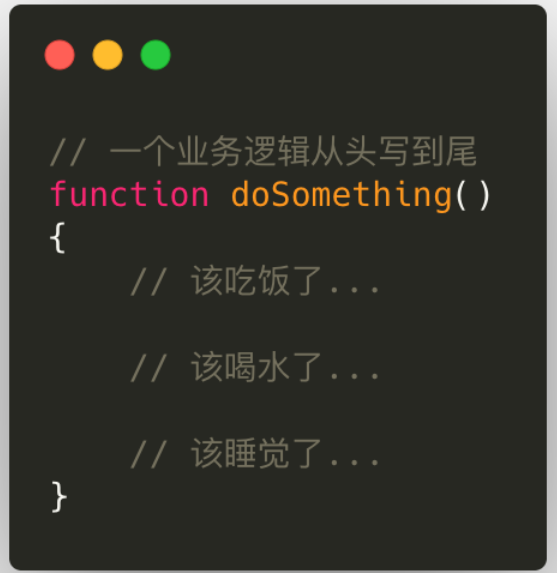

进阶，一个业务逻辑(拆成多个函数)从头写到尾：
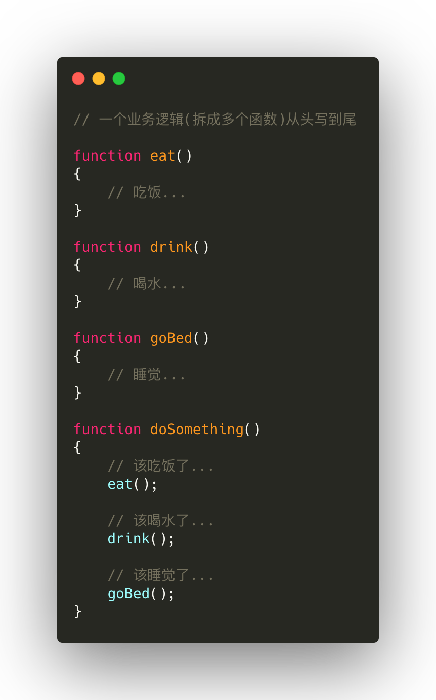
再进阶，一个业务逻辑(引入类)从头写到尾：
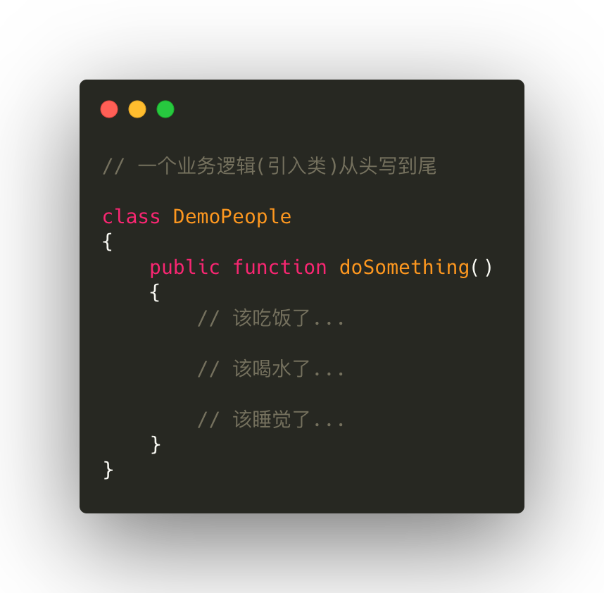
再进阶，一个业务逻辑(拆成多个类方法)从头写到尾，也许、可能、貌似、猜测大多数人停留到了这个阶段。

> 问题：某一天多了社交的能力，咋办？

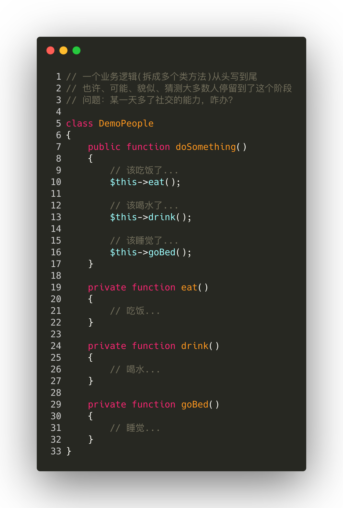

再进阶，一个业务逻辑(拆成多类)从头写到尾：
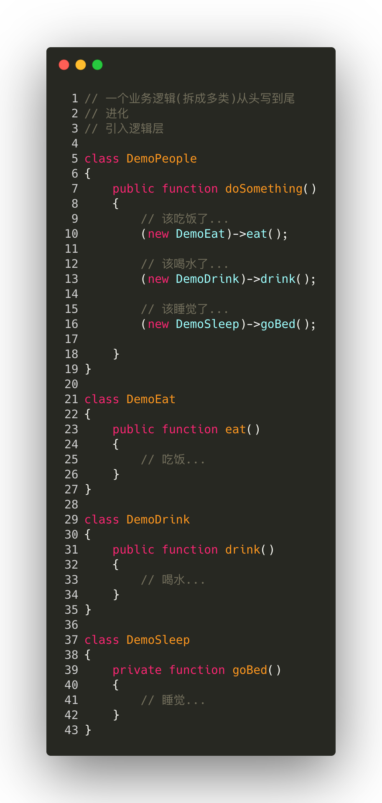
最终，一个业务逻辑(拆成类、抽象类、接口)从头写到尾：
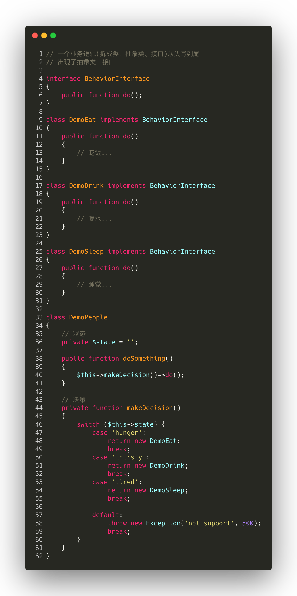

> 思考 🤔：上面的代码就没啥问题了吗？

上面就是面向对象设计的代码结果。

> 所以，如何设计出完全面向对象的代码？

## 代码建模

> 什么是代码建模？

把业务抽象成事物(类 class、抽象类 abstact class)和行为(接口 interface)的过程。

### 实栗 🌰 分析

又来看一个实际的业务场景：

```
最近“我一个同事”开始创业了，刚创立了一家电商公司，B2C，自营书籍《3分钟学会交际》。最近开始写提交订单的代码。

⚠️注意场景 1.刚创业 2.简单的单体应用 3.此处不探讨架构
```

一般来说，我们根据业务需求一顿分析，开始定义接口 API、设计数据库、缓存、技术评审等就开始码代码了。

```
接口参数：
uid
address_id
coupon_id
.etc

业务逻辑：
参数校验->
地址校验->
其他校验->
写订单表->
写订单商品信息表->
写日志->
扣减商品库存->
清理购物车->
扣减各种促销优惠活动的库存->
使用优惠券->
其他营销逻辑等等->
发送消息->
等等...
```

就开始写代码了`怎么怎么样...如果怎么怎么样...怎么怎么样...`一蹴而就、思路清晰、逻辑清楚、很快搞定完代码，很优秀是不是，值得鼓励。

但是，上面的结果就是大概所有人都见过的连续上千行的代码等等。上面的流程没啥问题吗，那正确的做法是什么了？就是接着要说的**代码建模**。

我们根据上面的场景，开始建模。

### 业务分析少不了

同样，首先，我们看看`提交订单`这个业务场景要做的事情:

> 换个角度看业务其实很简单：根据用户相关信息生成一个订单。

1. 梳理得到业务逻辑

```
参数校验->
地址校验->
其他校验->
写订单表->
写订单商品信息表->
写日志->
扣减商品库存->
清理购物车->
扣减各种促销优惠活动的库存->
使用优惠券->
其他营销逻辑等等->
发送消息->
等等...
```

1. 梳理业务逻辑依赖信息

```
用户信息
商品信息
地址信息
优惠券信息
等等...
```

再次回归概念

> 什么是代码建模？把业务抽象成事物(类 class、抽象类 abstact class)和行为(接口 interface)的过程。

### 获取事物

比如我们把订单生成的过程可以想象成`机器人`，一个生成订单的`订单生成机器人`，或者订单生成机器啥的，这样我们就得到了`代码建模`过程中的一个事物。

从而我们就可以把这个事物转化成一个类(或结构体)，或者抽象类。

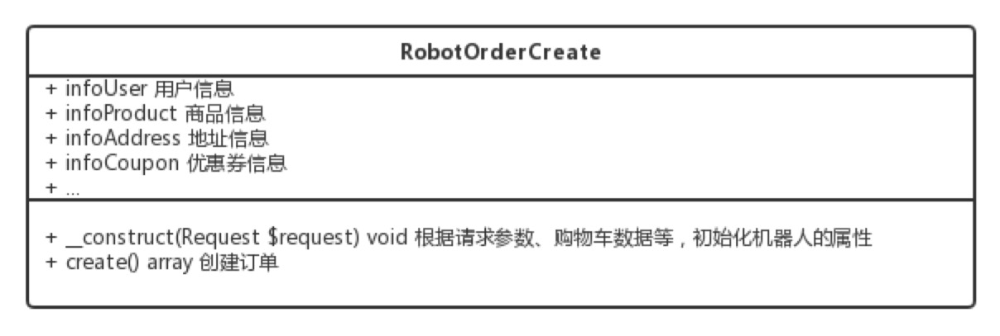

### 获取行为

这些操作就是上面机器人要做的事情。

事物有了：`订单生成机器人`
行为呢？毫无疑问就是上面各种业务逻辑。把具体的行为抽象成一个订单创建行为接口：


### 得到 UML

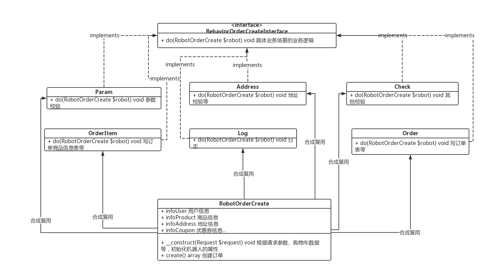

### 设计代码

1. 定义一个类

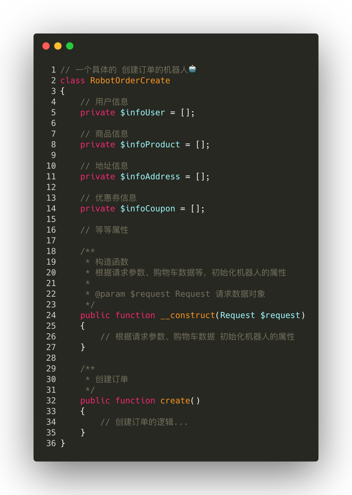

1. 定义一个订单创建行为的接口


1. 定义具体的不同订单创建行为类

```
参数校验->
地址校验->
其他校验->
写订单表->
写订单商品信息表->
写日志->
扣减商品库存->
清理购物车->
扣减各种促销优惠活动的库存->
使用优惠券->
其他营销逻辑等等->
发送消息->
等等...
```

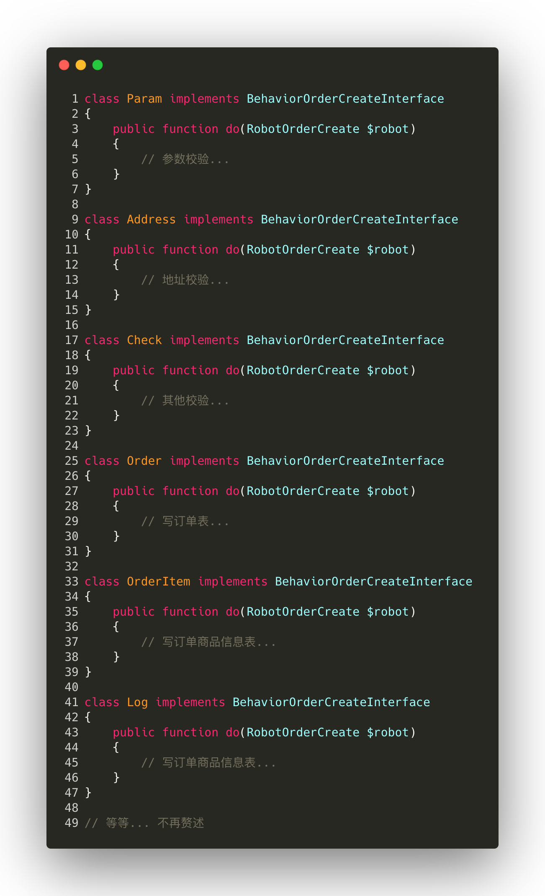

1. 创建订单

这里的代码该怎么写，这样？


还可以继续优化吗？
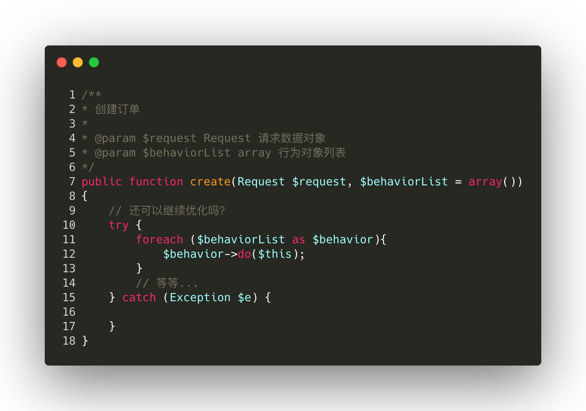
使用闭包。
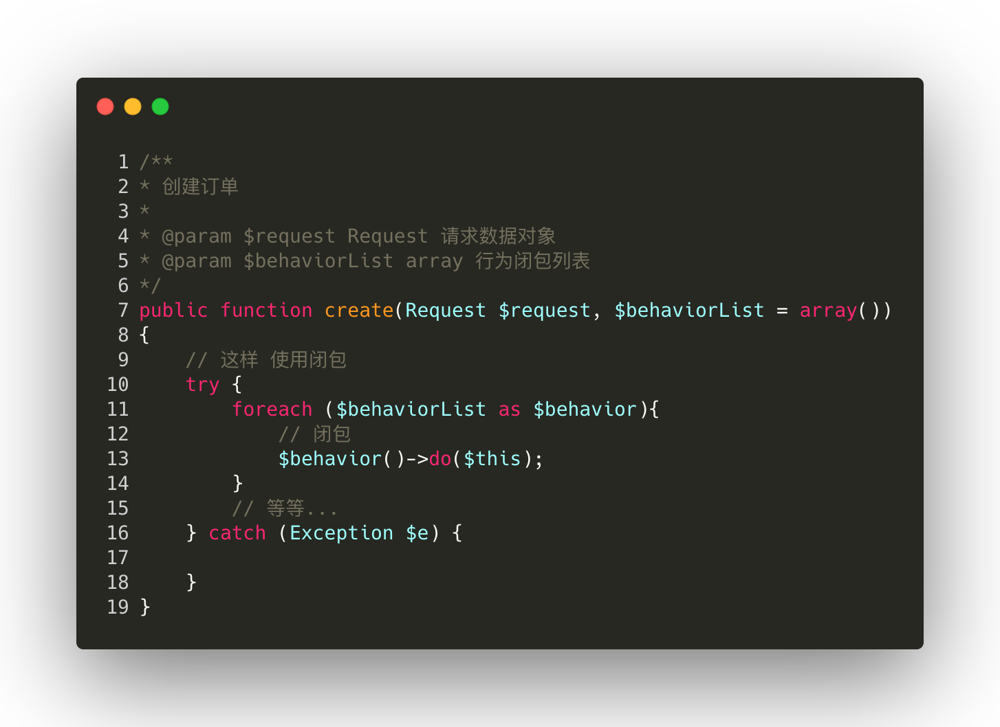

### PHP 版完整代码

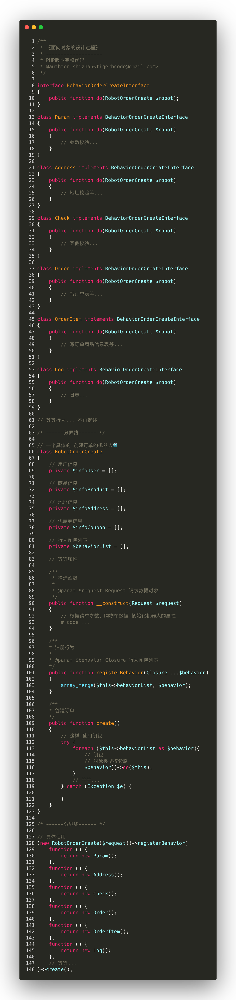

> 上面的代码有什么好处？

假如“我一个同事”又要新开发一个新的应用，新的应用创建订单的时候又有新的逻辑，比如没有优惠逻辑、新增了增加用户积分的逻辑等等，复用上面的代码，是不是就很简单了。

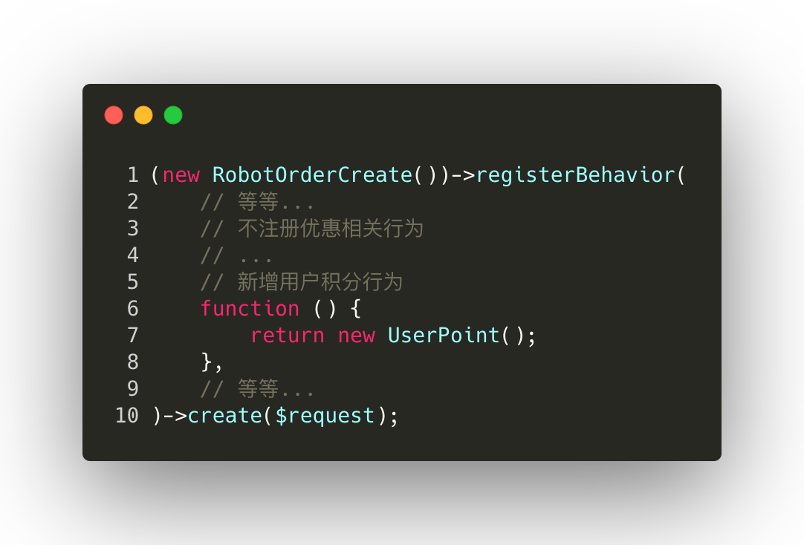

> 所以现在，什么是面向对象？

## 概念

### 面向对象的设计原则

- 对接口编程而不是对实现编程
- 优先使用对象组合而不是继承
- 抽象用于不同的事物，而接口用于事物的行为

针对上面的概念，我们再回头开我们上面的代码

> 对接口编程而不是对实现编程

```
结果：RobotOrderCreate依赖了BehaviorOrderCreateInterface抽象接口
```

> 优先使用对象组合而不是继承

```
结果：完全没有使用继承，多个行为不同场景组合使用
```

> 抽象用于不同的事物，而接口用于事物的行为

```
结果：
1. 抽象了一个创建订单的机器人 RobotOrderCreate
2. 机器人又有不同的创建行为
3. 机器人的创建行为最终依赖于BehaviorOrderCreateInterface接口
```

是不是完美契合，所以这就是“面向对象的设计过程”。

## 结论

```
代码建模过程就是“面向对象的设计过程”的具体实现方式.
```

## 预习

### 设计模式

> 最后，设计模式又是什么？

同样，我们下结合上面的场景和概念预习下设计模式。

#### 设计模式的设计原则

> 开闭原则（Open Close Principle）：对扩展开放，对修改封闭

看看上面的最终的代码是不是完美契合。

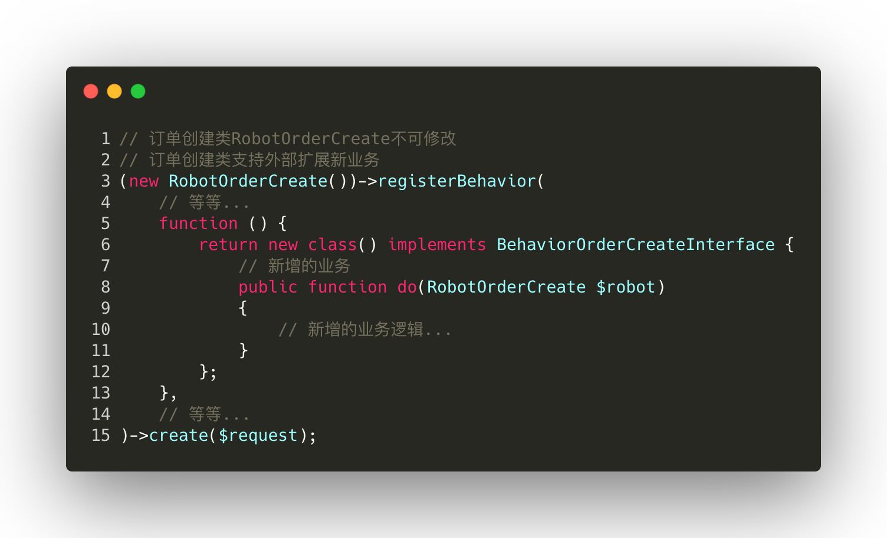

> 依赖倒转原则：对接口编程，依赖于抽象而不依赖于具体

```
结果：创建订单的逻辑从依赖具体的业务转变为依赖于抽象接口BehaviorOrderCreateInterface
```

> 接口隔离原则：使用多个接口，而不是对一个接口编程，去依赖降低耦合

```
结果：上面的场景，我们只简单定义了订单创建的接BehaviorOrderCreateInterface。由于订单创建过程可能出现异常回滚，我们就需要再定义一个订单创建回滚的接口
BehaviorOrderCreateRollBackInterface.
```

> 迪米特法则，又称最少知道原则：减少内部依赖，尽可能的独立

```
结果：还是上面那段代码，我们把RobotOrderCreate机器人依赖的行为通过外部注入的方式使用。
```

> 合成复用原则：多个独立的实体合成聚合，而不是使用继承

```
结果：RobotOrderCreate依赖了多个实际的订单创建行为类。
```

> 里氏代换：超类（父类）出现的地方，派生类（子类）都可以出现

```
结果：不好意思，我们完全没用继承。（备注：继承容易造成父类膨胀。）
```

## 下回预告

上面预习了设计模式的概念，下回我将给大家分享《设计模式基础之——设计模式业务实战》。

------

**作者**

施展，小米信息技术部海外商城组

**招聘**

小米信息部武汉研发中心，信息部是小米公司整体系统规划建设的核心部门，支撑公司国内外的线上线下销售服务体系、供应链体系、ERP 体系、内网 OA 体系、数据决策体系等精细化管控的执行落地工作，服务小米内部所有的业务部门以及 40 家生态链公司。

同时部门承担大数据基础平台研发和微服务体系建设落，语言涉及 Java、Go，长年虚位以待对大数据处理、大型电商后端系统、微服务落地有深入理解和实践的各路英雄。

**欢迎投递简历：jin.zhang(a)xiaomi.com**

更多技术文章：[小米信息部技术团队](https://xiaomi-info.github.io/)