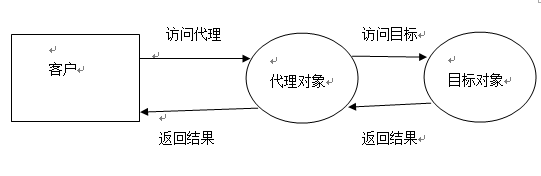

# 浅谈JDK动态代理（上）

专栏最近写了多线程、ThreadLocal、注解相关的文章，这些其实都是我们迈向 SSM 的小碎步。我们已经离 SSM 越来越近了，但还不够。今天，我们仍需一起再往前走一小步：动态代理。这四个字一出来，估计很多初学者已经开始冒冷汗。动态代理之所以给人感觉很难，有三点原因：

- 代码形式很诡异，让人搞不清调用逻辑
- 用到了反射，而很多初学者不了解反射
- 包含代理设计模式的思想，本身比较抽象

尽管动态代理看起来似乎有一定难度，但却必须拿下。因为 Spring 的事务控制依赖于 AOP，AOP 底层实现便是动态代理，环环相扣。到最后，还是看基本功。

主要内容：

- 一个小需求：给原有方法添加日志打印
- 静态代理实现日志打印
- 静态代理的问题

------

## **一个小需求：**给原有方法添加日志打印

假设现在我们有一个类 Calculator，代表一个计算器，它可以进行加减乘除操作

```java
public class Calculator {

	// 加
	public int add(int a, int b) {
		int result = a + b;
		return result;
	}

	// 减
	public int subtract(int a, int b) {
		int result = a - b;
		return result;
	}

	//乘法、除法...
}
```

现有一个需求：在每个方法执行前后打印日志。你有什么好的方案？

**直接修改**

很多人最直观的想法是直接修改 Calculator 类：

```java
public class Calculator {

	//加
	public int add(int a, int b) {
		System.out.println("add方法开始...");
		int result = a + b;
		System.out.println("add方法结束...");
		return result;
	}

	//减
	public int subtract(int a, int b) {
		System.out.println("subtract方法开始...");
		int result = a - b;
		System.out.println("subtract方法结束...");
		return result;
	}

	//乘法、除法...
}
```

上面的方案是有问题的：

1. 直接修改源程序，不符合开闭原则。应该对扩展开放，对修改关闭
2. 如果 Calculator 有几十个、上百个方法，修改量太大
3. 存在重复代码（都是在核心代码前后打印日志）
4. 日志打印硬编码在代理类中，不利于后期维护：比如你花了一上午终于写完了，组长告诉你这个功能取消，于是你又要打开 Calculator 花十分钟删除日志打印的代码！

所以，此种方案 PASS！

------

## **静态代理实现日志打印**

「静态代理」四个字包含了两个概念：静态、代理。我们先来了解什么叫「代理」，至于何为「静态」，需要和「动态」对比着讲。

> 代理是一种模式，提供了对目标对象的间接访问方式，即通过代理访问目标对象。如此便于在目标实现的基础上增加额外的功能操作，前拦截，后拦截等，以满足自身的业务需求。
>
> 详解：https://www.cnblogs.com/jiyukai/p/6958744.html




常用的代理方式可以粗分为：静态代理和动态代理。

静态代理的实现比较简单：编写一个代理类，实现与目标对象相同的接口，并在内部维护一个目标对象的引用。通过构造器塞入目标对象，在代理对象中调用目标对象的同名方法，并添加前拦截，后拦截等所需的业务功能。

按上面的描述，代理类和目标类需要实现同一个接口，所以我打算这样做：

- 将 Calculator 抽取为接口
- 创建目标类 CalculatorImpl 实现 Calculator
- 创建代理类 CalculatorProxy 实现 Calculator

接口

```java
package com.gjxaiou.proxy;

/**
 * Calculator接口
 */
public interface Calculator {
    int add(int a, int b);

    int subtract(int a, int b);
}
```

目标对象实现类

```java
package com.gjxaiou.proxy;

/**
 * 目标对象实现类，实现Calculator接口
 */
public class CalculatorImpl implements Calculator {

    // 加
    public int add(int a, int b) {
        int result = a + b;
        return result;
    }

    // 减
    public int subtract(int a, int b) {
        int result = a - b;
        return result;
    }

    // 乘法、除法...
}
```

代理对象实现类

```java
package com.gjxaiou.proxy;

/**
 * 代理对象实现类，实现Calculator接口
 */
public class CalculatorProxy implements Calculator {
    // 代理对象内部维护一个目标对象引用
    private Calculator target;

    // 构造方法，传入目标对象
    public CalculatorProxy(Calculator target) {
        this.target = target;
    }

    // 调用目标对象的add，并在前后打印日志
    @Override
    public int add(int a, int b) {
        System.out.println("add方法开始...");
        int result = target.add(a, b);
        System.out.println("add方法结束...");
        return result;
    }

    // 调用目标对象的subtract，并在前后打印日志
    @Override
    public int subtract(int a, int b) {
        System.out.println("subtract方法开始...");
        int result = target.subtract(a, b);
        System.out.println("subtract方法结束...");
        return result;
    }

    //乘法、除法...
}
```

使用代理对象完成加减乘除，并且打印日志

```java
public class Test {
	public static void main(String[] args) {
		//把目标对象通过构造器塞入代理对象
		Calculator calculator = new CalculatorProxy(new CalculatorImpl());
		//代理对象调用目标对象方法完成计算，并在前后打印日志
		calculator.add(1, 2);
		calculator.subtract(2, 1);
	}
}  
```


静态代理示意图如上：


静态代理的优点：可以在不修改目标对象的前提下，对目标对象进行功能的扩展和拦截。但是它也仅仅解决了上一种方案 4 大缺点中的第 1 点：

1. 直接修改源程序，不符合开闭原则。应该对扩展开放，对修改关闭 √
2. 如果 Calculator 有几十个、上百个方法，修改量太大 ×
3. 存在重复代码（都是在核心代码前后打印日志） ×
4. 日志打印硬编码在代理类中，不利于后期维护：比如你花了一上午终于写完了，组长告诉你这个功能取消，于是你又要打开 Calculator 花十分钟删除全部新增代码！×

------

## 静态代理的问题

上面案例中，代理类是我们事先编写的，而且要和目标对象类实现相同接口。由于 CalculatorImpl（目标对象）需要日志功能，我们即编写了 CalculatorProxy（代理对象），并通过构造器传入 CalculatorImpl（目标对象），调用目标对象同名方法的同时添加增强代码。

但是这里有个问题！代理对象构造器的参数类型是 Calculator，这意味着它只能接受 Calculator 的实现类对象，亦即我们写的代理类 CalculatorProxy 只能给 Calculator 做代理，它们绑定死了！

如果现在我们系统需要全面改造，给其他类也添加日志打印功能，就得为其他几百个接口都各自写一份代理类...


自己手动写一个类并实现接口实在太麻烦了。仔细一想，**我们其实想要的并不是代理类，而是代理对象！**那么，能否让 JVM 根据接口自动生成代理对象呢？

比如，有没有一个方法，我传入接口，它就给我自动返回代理对象呢？


答案是肯定的。

下一篇我们来看看 JDK 如何自动生成代理对象！


# 浅谈JDK动态代理（中）

这篇文章咬咬牙能看完的话，再看其他动态代理的文章就轻松愉快多了。希望想搞懂动态代理的同学，能坚持下去。

主要内容：

- 前情提要
- 接口创建对象的可行性分析
- 动态代理
- Proxy.getProxyClass()的秘密
- 编写可生成代理和可插入通知的通用方法
- 类加载补充
- 小结
- 彩蛋

------

## **前情提要**

假设现在项目经理有一个需求：在项目现有所有类的方法前后打印日志。

你如何在**不修改已有代码的前提下**，完成这个需求？


**静态代理**

具体做法如下：

1.为现有的每一个类都编写一个**对应的**代理类，并且让它实现和目标类相同的接口（假设都有）


2.在创建代理对象时，通过构造器塞入一个目标对象，然后在代理对象的方法内部调用目标对象同名方法，并在调用前后打印日志。也就是说，**代理对象 = 增强代码 + 目标对象（原对象）**，有了代理对象后，就不用原对象了


**静态代理的缺陷**

程序员要手动为每一个目标类，编写对应的代理类。如果当前系统已经有成百上千个类，工作量太大了。所以，现在我们的努力方向是：如何少写或者不写代理类，却能完成代理功能？

------

## **接口创建对象的可行性分析**

**复习对象的创建过程**

首先，在很多初学者的印象中，类和对象的关系是这样的：


虽然知道源代码经过 javac 命令编译后会在磁盘中得到字节码文件（.class 文件），也知道 java 命令会启动 JVM 将字节码文件加载进内存，但也仅仅止步于此了。至于从字节码文件加载进内存到堆中产生对象，期间具体发生了什么，他们并不清楚。

所谓「万物皆对象」，字节码文件也难逃「被对象」的命运。它被加载进内存后，JVM 为其创建了一个对象，以后所有该类的实例，皆以它为模板。这个对象叫 Class 对象，它是 Class 类的实例。


大家想想，Class 类是用来描述所有类的，比如 Person 类，Student 类...那我如何通过 Class 类创建 Person 类的 Class 对象呢？这样吗：

```java
Class clazz = new Class();
```

好像不对吧，我说这是 Student 类的 Class 对象也行啊。有点晕了...

**其实，程序员是无法自己new一个Class对象的，它仅由JVM创建。**


- Class 类的构造器是 private 的，杜绝了外界通过 new 创建 Class 对象的可能。当程序需要某个类时，JVM 自己会调用这个构造器，并传入 ClassLoader（类加载器），让它去加载字节码文件到内存，然后**JVM为其创建对应的Class对象**
- 为了方便区分，Class 对象的表示法为：`Class<String>`，`Class<Person>`

所以借此机会，我们不妨换种方式看待类和对象：


也就是说，**要得到一个类的实例，关键是先得到该类的 Class 对象！**只不过 new 这个关键字实在太方便，为我们隐藏了底层很多细节，我在刚开始学习 Java 时甚至没意识到 Class 对象的存在。

**接口Class和类Class的区别**

来分析一下接口 Class 和类 Class 的区别。以 Calculator 接口的 Class 对象和 CalculatorImpl 实现类的 Class 对象为例：

```java
package com.gjxaiou.proxy;

import java.lang.reflect.Constructor;
import java.lang.reflect.Executable;
import java.lang.reflect.Method;

public class ProxyTest {
    public static void main(String[] args) {
        /*
         * Calculator接口的Class对象
         得到Class对象的三种方式：1.Class.forName(xxx) 
         2.xxx.class 
         3.xxx.getClass()
         注意，这并不是我们new了一个Class对象，而是让虚拟机加载并创建Class对象           
         */
        Class<Calculator> calculatorClazz = Calculator.class;
        // Calculator接口的构造器信息
        Constructor[] calculatorClazzConstructors = calculatorClazz.getConstructors();
        // Calculator接口的方法信息
        Method[] calculatorClazzMethods = calculatorClazz.getMethods();
        // 打印
        System.out.println("------接口Class的构造器信息------");
        printClassInfo(calculatorClazzConstructors);
        System.out.println("------接口Class的方法信息------");
        printClassInfo(calculatorClazzMethods);

        // Calculator实现类的Class对象
        Class<CalculatorImpl> calculatorImplClazz = CalculatorImpl.class;
        // Calculator实现类的构造器信息
        Constructor<?>[] calculatorImplClazzConstructors = calculatorImplClazz.getConstructors();
        // Calculator实现类的方法信息
        Method[] calculatorImplClazzMethods = calculatorImplClazz.getMethods();
        // 打印
        System.out.println("------实现类Class的构造器信息------");
        printClassInfo(calculatorImplClazzConstructors);
        System.out.println("------实现类Class的方法信息------");
        printClassInfo(calculatorImplClazzMethods);
    }

    public static void printClassInfo(Executable[] targets) {
        for (Executable target : targets) {
            // 构造器/方法名称
            String name = target.getName();
            StringBuilder sBuilder = new StringBuilder(name);
            // 拼接左括号
            sBuilder.append('(');
            Class[] clazzParams = target.getParameterTypes();
            // 拼接参数
            for (Class clazzParam : clazzParams) {
                sBuilder.append(clazzParam.getName()).append(',');
            }
            // 删除最后一个参数的逗号
            if (clazzParams != null && clazzParams.length != 0) {
                sBuilder.deleteCharAt(sBuilder.length() - 1);
            }
            // 拼接右括号
            sBuilder.append(')');
            // 打印 构造器/方法
            System.out.println(sBuilder.toString());
        }
    }
}
```

运行结果：

```shell
------接口Class的构造器信息------
------接口Class的方法信息------
add(int,int)
subtract(int,int)
------实现类Class的构造器信息------
com.gjxaiou.proxy.CalculatorImpl()
------实现类Class的方法信息------
add(int,int)
subtract(int,int)
wait()
wait(long,int)
wait(long)
equals(java.lang.Object)
toString()
hashCode()
getClass()
notify()
notifyAll()
```

- 接口 Class 对象没有构造方法，所以 Calculator 接口不能直接 new 对象
- 实现类 Class 对象有构造方法，所以 CalculatorImpl 实现类可以 new 对象
- 接口 Class 对象有两个方法 add()、subtract()
- 实现类 Class 对象除了 add()、subtract()，还有从 Object 继承的方法

也就是说，接口和实现类的 Class 信息除了构造器，基本相似。

既然我们希望通过接口创建实例，就无法避开下面两个问题：

- 接口方法体缺失问题

  首先，接口的 Class 对象已经得到，它描述了方法信息。但它没方法体。没关系，反正代理对象的方法是个空壳，只要调用目标对象的方法即可。

  JVM 可以在创建代理对象时，随便糊弄一个空的方法体，反正后期我们会想办法把目标对象塞进去调用。所以这个问题，勉强算是解决。

- 接口 Class 没有构造器，无法 new

  这个问题好像无解...毕竟这么多年了，的确没听哪位仁兄直接new接口的。

  但是，仔细想想，接口之所以不能new，是因为它缺少构造器，它本身是具备完善的类结构信息的。就像一个武艺高强的大内太监（接口），他空有一身绝世神功（类结构信息），却后继无人。如果江湖上有一位妙手圣医，能克隆他的一身武艺，那么克隆人不就武艺高强的同时，还能生儿育女了吗？
  所以我们就想，JDK有没有提供这么一个方法，比如getXxxClass()，我们传进一个接口Class对象，它帮我们克隆一个具有相同类结构信息，又具备构造器的新的Class对象呢？

至此，分析完毕，我们无法根据接口直接创建对象（废话）。

那动态代理是怎么创建实例的呢？它到底有没有类似 getXxxClass()这样的方法呢？

------

## 动态代理

不错，动态代理确实存在 getXxxClass()这样的方法。

我们需要 java.lang.reflect.InvocationHandler 接口和 java.lang.reflect.Proxy 类的支持。Proxy 后面会用到 InvocationHandler，因此我打算以 Proxy 为切入点。首先，再次明确我们的思路：


通过查看 API，我们发现 Proxy 类有一个静态方法可以帮助我们。


Proxy.getProxyClass()：返回代理类的 Class 对象。终于找到妙手圣医。

也就说，只要传入目标类实现的接口的 Class 对象，getProxyClass()方法即可返回代理 Class 对象，而不用实际编写代理类。这相当于什么概念？


废话不多说，开搞。

```java
package com.gjxaiou.proxy;

import java.lang.reflect.Constructor;
import java.lang.reflect.Executable;
import java.lang.reflect.Method;
import java.lang.reflect.Proxy;

public class ProxyTest2 {
    public static void main(String[] args) {
        /*
         * 参数1：Calculator的类加载器（当初把Calculator加载进内存的类加载器）
         * 参数2：代理对象需要和目标对象实现相同接口Calculator
         * */
        Class calculatorProxyClazz = Proxy.getProxyClass(Calculator.class.getClassLoader(),
                Calculator.class);
        // 以Calculator实现类的Class对象作对比，看看代理Class是什么类型
        System.out.println(CalculatorImpl.class.getName());
        System.out.println(calculatorProxyClazz.getName());
        // 打印代理Class对象的构造器
        Constructor[] constructors = calculatorProxyClazz.getConstructors();
        System.out.println("----构造器----");
        printClassInfo(constructors);
        // 打印代理Class对象的方法
        Method[] methods = calculatorProxyClazz.getMethods();
        System.out.println("----方法----");
        printClassInfo(methods);
    }

    public static void printClassInfo(Executable[] targets) {
        for (Executable target : targets) {
            // 构造器/方法名称
            String name = target.getName();
            StringBuilder sBuilder = new StringBuilder(name);
            // 拼接左括号
            sBuilder.append('(');
            Class[] clazzParams = target.getParameterTypes();
            // 拼接参数
            for (Class clazzParam : clazzParams) {
                sBuilder.append(clazzParam.getName()).append(',');
            }
            // 删除最后一个参数的逗号
            if (clazzParams != null && clazzParams.length != 0) {
                sBuilder.deleteCharAt(sBuilder.length() - 1);
            }
            // 拼接右括号
            sBuilder.append(')');
            // 打印 构造器/方法
            System.out.println(sBuilder.toString());
        }
    }
}
```

运行结果：

```shell
com.gjxaiou.proxy.CalculatorImpl
com.sun.proxy.$Proxy0
----构造器----
com.sun.proxy.$Proxy0(java.lang.reflect.InvocationHandler)
----方法----
add(int,int)
equals(java.lang.Object)
toString()
hashCode()
subtract(int,int)
isProxyClass(java.lang.Class)
getProxyClass(java.lang.ClassLoader,[Ljava.lang.Class;)
getInvocationHandler(java.lang.Object)
newProxyInstance(java.lang.ClassLoader,[Ljava.lang.Class;,java.lang.reflect.InvocationHandler)
wait()
wait(long,int)
wait(long)
getClass()
notify()
notifyAll()
```

大家还记得接口 Class 的打印信息吗？

```shell
------接口Class的构造器信息------
------接口Class的方法信息------
add(int,int)
subtract(int,int)
```

也就是说，通过给 Proxy.getProxyClass()传入类加载器和接口 Class 对象，我们得到了一个**加强版的Class**：即包含接口的方法信息 add()、subtract()，又包含了构造器$Proxy0(InvocationHandler)，还有一些自己特有的方法以及从 Object 继承的方法。

梳理一下：

1.原先我们本打算直接根据接口 Class 得到代理对象，无奈接口 Class 只有方法信息，没有构造器

2.于是，我们想，有没有办法创建一个 Class 对象，既有接口 Class 的方法信息，同时又包含构造器方便创建代理实例呢？

3.利用 Proxy 类的静态方法 getProxyClass()方法，给它传一个接口 Class 对象，它能返回一个加强版 Class 对象。也就是说 getProxyClass()的本质是：**用Class，造Class。**


要谢谢 Proxy 类和 JVM，让我们不写代理类却直接得到代理 Class 对象，进而得到代理对象。


静态代理


动态代理：用 Class 造 Class


既然 Class<$Proxy0>有方法信息，又有构造器，我们试着用它得到代理实例吧：

```java
package com.gjxaiou.proxy;

import java.lang.reflect.Proxy;

public class ProxyTest3 {
    public static void main(String[] args) throws InstantiationException, IllegalAccessException {
        /*
         * 参数1：Calculator的类加载器（当初把Calculator加载进内存的类加载器）
         * 参数2：代理对象需要和目标对象实现相同接口Calculator
         * */
        Class calculatorProxyClazz = Proxy.getProxyClass(Calculator.class.getClassLoader(),
                Calculator.class);
        // 根据报错得出：无法调用 newInstance() 创建代理对象
        calculatorProxyClazz.newInstance();
    }
}
```

结果为：

```java
Exception in thread "main" java.lang.InstantiationException: com.sun.proxy.$Proxy0
	at java.lang.Class.newInstance(Class.java:427)
	at com.gjxaiou.proxy.ProxyTest3.main(ProxyTest3.java:15)
Caused by: java.lang.NoSuchMethodException: com.sun.proxy.$Proxy0.<init>()
	at java.lang.Class.getConstructor0(Class.java:3082)
	at java.lang.Class.newInstance(Class.java:412)
	... 1 more
```

我们发现，`newInstance()`创建对象失败。因为 **Class 的 `newInstance()` 方法底层会走无参构造器**。而之前打印 `$Proxy0` 的 Class 信息时，我们发现它没有无参构造，只有有参构造 `$Proxy0(InvocationHandler)`。那就靠它了：


constructor.newInstance()需要传入一个 InvocationHandler 对象，这里采用匿名对象的方式，invoke()方法不做具体实现，直接返回 null

舒服~

------

## **Proxy.getProxyClass()的秘密**


**一个小问题**

好不容易通过 Proxy.getProxyClass()得到代理 Class，又通过反射最终得到代理对象，当然要玩一玩：


尴尬，竟然发生了空指针异常。纵观整个代码，新写的 add()和 subtract()返回值是 int，不会是空指针。而再往上的代码之前编译都是通过的，应该没问题啊。再三思量，我们发现匿名对象 InvocationHandler 的 invoke()返回 null。难道是它？做个实验：让 invoke()返回 1，然后观察结果。

结果代理对象的 add 和 subtract 都返回 1

巧合吗？应该不是。我猜：**每次调用代理对象的方法都会调用 invoke()，且 invoke()的返回值就是代理方法的返回值。**如果真是如此，空指针异常就可以解释了：add()和 suntract()期待的返回值类型是 int，但是之前 invoke()返回 null，类型不匹配，于是空指针异常。

以防万一，再验证一下 invoke()和代理对象方法的关系：


好了，什么都不用说了。就目前的实验来看，调用过程应该是这样：


**动态代理底层调用逻辑**

同样的，知道了结果后，我们再反推原理。

静态代理：往代理对象的构造器传入目标对象，然后代理对象调用目标对象的同名方法。

动态代理：constructor 反射创建代理对象时，需要传入 InvocationHandler，我猜，代理对象内部有一个成员变量 InvocationHandler：


果然不出所料。那么动态代理的大致设计思路就是：


为什么这么设计？

为了解耦，也为了通用性。

如果 JVM 生成代理对象的同时生成了特定逻辑的方法体，那这个代理对象后期就没有扩展的余地，只能有一种玩法。而引入 InvocationHandler 的好处是：

- JVM 创建代理对象时不必考虑方法实现，只要造一个空壳的代理对象，舒服
- 后期代理对象想要什么样的方法实现，我写在 invocationHandler 对象的 invoke()方法里送进来便是

所以，invocationHandler 的作用，倒像是把「方法」和「方法体」分离。JVM 只造一个空的代理对象给你，后面想怎么玩，由你自己组装。反正代理对象中有个成员变量 invocationHandler，每一个方法里只有一句话：handler.invoke()。所以调任何一个代理方法，最终都会跑去调用 invoke()方法。

invoke()方法是代理对象和目标对象的桥梁。


但是我们真正想要的结果是：调用代理对象的方法时，去调用目标对象的方法。

所以，接下来努力的方向就是：**设法在invoke()方法得到目标对象，并调用目标对象的同名方法。**


**代理对象调用目标对象方法**

那么，如何在 invoke()方法内部得到目标对象呢？我们来看看能不能从 invoke()方法的形参上获取点线索：

- Object proxy：很遗憾，是代理对象本身，而不是目标对象（不要调用，会无限递归）
- Method method：本次被调用的代理对象的方法
- Obeject[] args：本次被调用的代理对象的方法参数

很可惜，proxy 不是代理对象。其实想想也知道，创建代理对象的过程中自始至终没有目标对象参与，所以也就无法产生关联。而且一个接口可以同时被多个类实现，所以 JVM 也无法判断当前代理对象想要代理哪个目标对象。但好在我们已经知道本次调的方法名(Method)和参数(args)。我们接下来要做的就是得到目标对象并调用同名方法，然后把参数给它。

如何得到目标对象呢？没办法，为今之计只能 new 了...哈哈哈哈。我靠，饶了一大圈，又是动态代理，又是 invoke()的，结果还是要手动 new？别急，先玩玩。后面会改进的：


但是这样的写法显然是倒退 30 年，一夜回到解放前。我们需要改进一下，封装 Proxy.getProxyClass()，使得目标对象可以作为参数传入：

```java
public class ProxyTest {
	public static void main(String[] args) throws Throwable {
		CalculatorImpl target = new CalculatorImpl();
                //传入目标对象
                //目的：1.根据它实现的接口生成代理对象 2.代理对象调用目标对象方法
		Calculator calculatorProxy = (Calculator) getProxy(target);
		calculatorProxy.add(1, 2);
		calculatorProxy.subtract(2, 1);
	}

	private static Object getProxy(final Object target) throws Exception {
		//参数1：随便找个类加载器给它， 参数2：目标对象实现的接口，让代理对象实现相同接口
		Class proxyClazz = Proxy.getProxyClass(target.getClass().getClassLoader(), target.getClass().getInterfaces());
		Constructor constructor = proxyClazz.getConstructor(InvocationHandler.class);
		Object proxy = constructor.newInstance(new InvocationHandler() {
			@Override
			public Object invoke(Object proxy, Method method, Object[] args) throws Throwable {
				System.out.println(method.getName() + "方法开始执行...");
				Object result = method.invoke(target, args);
				System.out.println(result);
				System.out.println(method.getName() + "方法执行结束...");
				return result;
			}
		});
		return proxy;
	}
}
```


厉害厉害...可惜，还是太麻烦了。有没有更简单的方式获取代理对象？有！

直接返回代理对象，而不是代理对象 Class

从一开始就存在，哈哈。但是我觉得 getProxyClass()切入更好理解。

```java
public class ProxyTest {
	public static void main(String[] args) throws Throwable {
		CalculatorImpl target = new CalculatorImpl();
		Calculator calculatorProxy = (Calculator) getProxy(target);
		calculatorProxy.add(1, 2);
		calculatorProxy.subtract(2, 1);
	}

	private static Object getProxy(final Object target) throws Exception {
		Object proxy = Proxy.newProxyInstance(
				target.getClass().getClassLoader(),/*类加载器*/
				target.getClass().getInterfaces(),/*让代理对象和目标对象实现相同接口*/
				new InvocationHandler(){/*代理对象的方法最终都会被JVM导向它的invoke方法*/
					public Object invoke(Object proxy, Method method, Object[] args) throws Throwable {
						System.out.println(method.getName() + "方法开始执行...");
						Object result = method.invoke(target, args);
						System.out.println(result);
						System.out.println(method.getName() + "方法执行结束...");
						return result;
					}
				}
		);
		return proxy;
	}
}
```

------

## 编写可生成代理和可插入通知的通用方法

上面的代码，已经比上一篇开头直接修改目标类好多了。再来看一下当时的四大缺点：

1. 直接修改源程序，不符合开闭原则。应该对扩展开放，对修改关闭√
2. 如果 Calculator 有几十个、上百个方法，修改量太大√
3. 存在重复代码（都是在核心代码前后打印日志）×
4. 日志打印硬编码在代理类中，不利于后期维护：比如你花了一上午终于写完了，组长告诉你这个功能取消，于是你又要打开 Calculator 花十分钟删除日志打印的代码！×

使用动态代理，让我们避免手写代理类，只要给 getProxy()方法传入 target 就可以生成对应的代理对象。但是日志打印仍是硬编码在 invoke()方法中。虽然修改时只要改一处，但是别忘了「开闭原则」。所以最好是能把日志打印单独拆出来，像目标对象一样作为参数传入。

日志打印其实就是 AOP 里的通知概念。我打算定义一个 Advice 接口，并且写一个 MyLogger 实现该接口。

通知接口

```java
public interface Advice {
	void beforeMethod(Method method);
	void afterMethod(Method method);
}
```

日志打印

```java
public class MyLogger implements Advice {

	public void beforeMethod(Method method) {
		System.out.println(method.getName() + "方法执行开始...");
	}

	public void afterMethod(Method method) {
		System.out.println(method.getName() + "方法执行结束...");
	}
}
```

测试类

```java
public class ProxyTest {
	public static void main(String[] args) throws Throwable {
		CalculatorImpl target = new CalculatorImpl();
		Calculator calculatorProxy = (Calculator) getProxy(target, new MyLogger());
		calculatorProxy.add(1, 2);
		calculatorProxy.subtract(2, 1);
	}

	private static Object getProxy(final Object target, Advice logger) throws Exception {
		/*代理对象的方法最终都会被JVM导向它的invoke方法*/
		Object proxy = Proxy.newProxyInstance(
				target.getClass().getClassLoader(),/*类加载器*/
				target.getClass().getInterfaces(),/*让代理对象和目标对象实现相同接口*/
				(proxy1, method, args) -> {
					logger.beforeMethod(method);
					Object result = method.invoke(target, args);
					System.out.println(result);
					logger.afterMethod(method);
					return result;
				}
		);
		return proxy;
	}
}
```

差一点完美~下篇讲讲更完美的做法。

------

## 类加载器补充

初学者可能对诸如「字节码文件」、Class 对象比较陌生。所以这里花一点点篇幅介绍一下类加载器的部分原理。如果我们要定义类加载器，需要继承 ClassLoader 类，并覆盖 findClass()方法：

```java
@Override
public Class<?> findClass(String name) throws ClassNotFoundException {
	try {
		/*自己另外写一个getClassData()
                  通过IO流从指定位置读取xxx.class文件得到字节数组*/
		byte[] datas = getClassData(name);
		if(datas == null) {
			throw new ClassNotFoundException("类没有找到：" + name);
		}
		//调用类加载器本身的defineClass()方法，由字节码得到Class对象
		return this.defineClass(name, datas, 0, datas.length);
	} catch (IOException e) {
		e.printStackTrace();
		throw new ClassNotFoundException("类找不到：" + name);
	}
}
```

所以，这就是类加载之所以能把 xxx.class 文件加载进内存，并创建对应 Class 对象的深层原因。具体文章可以参考基友写的另一篇：[请叫我程序猿大人：好怕怕的类加载器](https://zhuanlan.zhihu.com/p/54693308)


------

## 小结

**静态代理**

代理类 CalculatorProxy 是我们事先写好的，编译后得到 Proxy.class 字节码文件。随后和目标类一起被 ClassLoader（类加载器）加载进内存，生成 Class 对象，最后生成实例对象。代理对象中有目标对象的引用，调用同名方法并前后加上日志打印。


优点：不用修改目标类源码

缺点是：高度绑定，不通用。硬编码，不易于维护。


**动态代理**

我们本想通过接口 Class 直接创建代理实例，无奈的是，接口 Class 虽然有方法信息描述，却没有构造器，无法创建对象。所以我们希望 JDK 能提供一套 API，我们传入接口 Class，它自动复制里面的方法信息，造出一个有构造器、能创建实例的代理 Class 对象。


优点：

- 不用写代理类，根据目标对象直接生成代理对象
- 通知可以传入，不是硬编码

------

## 彩蛋

上面的讨论都在刻意回避代理对象的类型，放最后来聊一聊。

最后讨论一下代理对象是什么类型。

首先，请区分两个概念：代理 Class 对象和代理对象。


单从名字看，代理 Class 和 Calculator 的接口确实相去甚远，但是我们却能讲代理对象赋值给接口类型：


但谁说能否复制给接口是看名字的？难道不是只要实现接口就行了吗？

> 代理对象的本质就是：和目标对象实现相同接口的实例。代理Class可以叫任何名字，whatever，只要它实现某个接口，就能成为该接口类型。


我写了一个 MyProxy 类，那么它的 Class 名字必然叫 MyProxy。**但这和能否赋值给接口没有任何关系。**由于它实现了 Serializable 和 Collection，所以 myProxy（代理实例）**同时**是这两个接口的类型。


我想了个很骚的比喻，希望能解释清楚：

接口 Class 对象是大内太监，里面的方法和字段比做他的一身武艺，但是他没有小 DD（构造器），所以不能 new 实例。一身武艺后继无人。

那怎么办呢？


正常途径（implements）：

写一个类，实现该接口。这个就相当于大街上拉了一个人，认他做干爹。一身武艺传给他，只是比他干爹多了小 DD，可以 new 实例。


非正常途径（动态代理）：

通过妙手圣医 Proxy 的克隆大法（Proxy.getProxyClass()），克隆一个 Class，但是有小 DD。所以这个克隆人 Class 可以创建实例，也就是代理对象。


代理 Class 其实就是附有构造器的接口 Class，一样的类结构信息，却能创建实例。


JDK 动态代理生成的实例


CGLib 动态代理生成的实例

如果说继承的父类是亲爹（只有一个），那么实现的接口是干爹（可以有多个）。

实现接口是一个类认干爹的过程。接口无法创建对象，但实现该接口的类可以。

比如

```text
class Student extends Person implements A, B
```

这个类 new 一个实例出来，你问它：你爸爸是谁啊？它会告诉你：我只有一个爸爸 Person。

但是 student instanceof A interface，或者 student instanceof B interface，它会告诉你两个都是它干爹（true），都可以用来接收它。


然而，凡是有利必有弊。


也就是说，动态代理生成的代理对象，最终都可以用接口接收，和目标对象一起形成了多态，可以随意切换展示不同的功能。但是切换的同时，只能使用该接口定义的方法。

------

下一篇是案例篇，写山寨 Spring AOP 事务：通过@MyTransactional 随意切换普通 Service 对象和代理 Service 对象（含事务）。

# 浅谈JDK动态代理（下）

介绍完 JDK 动态代理，今天和大家一起做个小案例：模拟 Spring 的事务管理。

主要内容：

- 熟悉的陌生人
- 山寨 AOP 事务需求分析
- AOP 事务具体代码实现

------

## 熟悉的陌生人

面试官如果问「请你谈谈你对 Spring 的理解」，估计很多人会脱口而出：IOC 和 AOP。IOC 大概是大家对 Spring 最直接的印象，就是个大容器，装了很多 bean，还会帮你做依赖注入。

IOC

但是对于 AOP，很多人其实没有太多概念，一时不知道 Spring 哪里用了 AOP。好像事务用了切面，但具体又不了解。这样吧，我问你一个问题，我自己写了一个 UserController，以及 UserServiceImpl implements UserService，并且在 UserController 中注入 Service 层对象：

```java
@Autowired
private UserService userService;
```

那么，这个 userService 一定是我们写的 UserServiceImpl 的实例吗？

如果你听不懂我要问什么，说明你本身对 Spring 的了解还是太局限于 IOC。

实际上，Spring 依赖注入的对象并不一定是我们自己写的类的实例，也可能是 userServiceImpl 的代理对象。下面分别演示这两种情况：

- 注入 userServiceImpl 对象


注入的是 UserServiceImpl 类型

- 注入 userServiceImpl 的代理对象（CGLib 动态代理）


注入的是 CGLib 动态代理生成的 userServiceImpl 的代理对象


为什么两次注入的对象不同？

因为第二次我给 UserServiceImpl 加了@Transactional 注解。


此时 Spring 读取到这个注解，便知道我们要使用事务。而我们编写的 UserService 类中并没有包含任何事务相关的代码。如果给你，你会怎么做？动态代理嘛！

但是要用动态代理完成事务管理，还需要自己编写一个通知类，并把通知对象传入代理对象，通知负责事务的开启和提交，并在代理对象内部调用目标对象同名方法完成业务功能。


我们能想到的方案，Spring 肯定也知道。同样地，Spring 为了实现事务，也编写了一个通知类，TransactionManager。利用动态代理创建代理对象时，Spring 会把 transactionManager 织入代理对象，然后将代理对象注入到 UserController。

所以我们在 UserController 中使用的 userService 其实是代理对象，而代理对象才支持事务。

------

## 山寨AOP事务需求分析

了解了 Spring 事务的大致流程后，我们再来分析一下自己如何编写一个山寨的 AOP 事务。

AOP 事务，有两个概念：AOP 和事务。

事务，大家已经很熟悉，这里主要讲讲什么是 AOP。AOP，它是**Aspect-Oriented Programming（面向切面编程）**的英文缩写。什么是面向切面编程？有时直接介绍一个东西是什么，可能比较难。但是一说到它是干嘛的，大家就立即心领神会了。

我们的系统中，常常存在交叉业务，比如事务、日志等。UserService 的 method1 要用到它，BrandService 的 method2 也要用到它。一个交叉业务就是要切入系统的一个方面。具体用代码展示就是：


这个切面，可以是日志，也可以是事务

交叉业务的编程问题即为面向切面编程。AOP 的目标就是使交叉业务模块化。可以将切面代码移动到原始方法的周围：


原先不用 AOP 时，交叉业务直接写在**方法内部的前后**，用了 AOP 交叉业务写在**方法调用前后**。这与 AOP 的底层实现方式有关：动态代理其实就是代理对象调用目标对象的同名方法，并在调用前后加增强代码。不过这两种最终运行效果是一样的。

而所谓的模块化，我个人的理解是将切面代码做成一个可管理的状态。比如日志打印，不再是直接硬编码在方法中的零散语句，而是做成一个通知类，通过通知去执行切面代码。

所以，现在需求已经很明确，我们需要一个通知类（TransactionManager）执行事务，一个代理工厂帮助生成代理对象，然后利用动态代理将事务代码织入代理对象的各个方法中。

就好比下面三个 Service，原先是没有开启事务的：


我们希望最终达到的效果是，我加了个@MyTransactional 后，代理工厂给我返回一个代理对象：


代理工厂使用动态代理，为每一个目标对象创建一个代理对象

细节分析：


txManager 其实是在目标对象 test()方法的前后执行事务，而不是方法内部的前后

也就是说，代理对象方法 = 事务 + 目标对象方法。


另外，还有个棘手的问题：事务操作，必须使用同一个 Connection 对象。如何保证？第一次从数据源获取 Connection 对象并开启事务后，将它存入当前线程的 ThreadLocal 中，等到了 DAO 层，还是从 ThreadLocal 中取，这样就能保证开启事务和操作数据库使用的 Connection 对象是同一个。


开启事务后，Controller 并不是直接调用我们自己写的 Service，而是 Spring 提供的代理对象

这就是事务的实现原理。

------

## AOP事务具体代码实现

ConnectionUtils 工具类

```java
package com.demo.myaopframework.utils;

import org.apache.commons.dbcp.BasicDataSource;

import java.sql.Connection;

/**
 * 连接的工具类，它用于从数据源中获取一个连接，并且实现和线程的绑定
 */
public class ConnectionUtils {

    private ThreadLocal<Connection> tl = new ThreadLocal<Connection>();

    private static BasicDataSource dataSource = new BasicDataSource();

    //静态代码块,设置连接数据库的参数
    static{
        dataSource.setDriverClassName("com.mysql.jdbc.Driver");
        dataSource.setUrl("jdbc:mysql://localhost:3306/test");
        dataSource.setUsername("root");
        dataSource.setPassword("123456");
    }


    /**
     * 获取当前线程上的连接
     * @return
     */
    public Connection getThreadConnection() {
        try{
            //1.先从ThreadLocal上获取
            Connection conn = tl.get();
            //2.判断当前线程上是否有连接
            if (conn == null) {
                //3.从数据源中获取一个连接，并且存入ThreadLocal中
                conn = dataSource.getConnection();
                tl.set(conn);
            }
            //4.返回当前线程上的连接
            return conn;
        }catch (Exception e){
            throw new RuntimeException(e);
        }
    }

    /**
     * 把连接和线程解绑
     */
    public void removeConnection(){
        tl.remove();
    }
}
```

AOP 通知（事务管理器）

```java
package com.demo.myaopframework.utils;

/**
 * 和事务管理相关的工具类，它包含了，开启事务，提交事务，回滚事务和释放连接
 */
public class TransactionManager {

    private ConnectionUtils connectionUtils;

    public void setConnectionUtils(ConnectionUtils connectionUtils) {
        this.connectionUtils = connectionUtils;
    }

    /**
     * 开启事务
     */
    public  void beginTransaction(){
        try {
            connectionUtils.getThreadConnection().setAutoCommit(false);
        }catch (Exception e){
            e.printStackTrace();
        }
    }

    /**
     * 提交事务
     */
    public  void commit(){
        try {
            connectionUtils.getThreadConnection().commit();
        }catch (Exception e){
            e.printStackTrace();
        }
    }

    /**
     * 回滚事务
     */
    public  void rollback(){
        try {
            connectionUtils.getThreadConnection().rollback();
        }catch (Exception e){
            e.printStackTrace();
        }
    }


    /**
     * 释放连接
     */
    public  void release(){
        try {
            connectionUtils.getThreadConnection().close();//还回连接池中
            connectionUtils.removeConnection();
        }catch (Exception e){
            e.printStackTrace();
        }
    }
}
```

自定义注解

```text
@Target({ElementType.TYPE, ElementType.METHOD})
@Retention(RetentionPolicy.RUNTIME)
public @interface MyTransactional {
}
```

Service

```java
public interface UserService {
	void getUser();
}

 
public class UserServiceImpl implements UserService {
	@Override
	public void getUser() {
		System.out.println("service执行...");
	}
}
```

实例工厂

```java
public class BeanFactory {

	public Object getBean(String name) throws Exception {
		//得到目标类的Class对象
		Class<?> clazz = Class.forName(name);
		//得到目标对象
		Object bean = clazz.newInstance();
		//得到目标类上的@MyTransactional注解
		MyTransactional myTransactional = clazz.getAnnotation(MyTransactional.class);
		//如果打了@MyTransactional注解，返回代理对象，否则返回目标对象
		if (null != myTransactional) {
			ProxyFactoryBean proxyFactoryBean = new ProxyFactoryBean();
			TransactionManager txManager = new TransactionManager();
			txManager.setConnectionUtils(new ConnectionUtils());
			//装配通知和目标对象
			proxyFactoryBean.setTxManager(txManager);
			proxyFactoryBean.setTarget(bean);
			Object proxyBean = proxyFactoryBean.getProxy();
			//返回代理对象
			return proxyBean;
		}
		//返回目标对象
		return bean;
	}
}
```

代理工厂

```java
public class ProxyFactoryBean {
	//通知
	private TransactionManager txManager;
	//目标对象
	private Object target;

	public void setTxManager(TransactionManager txManager) {
		this.txManager = txManager;
	}

	public void setTarget(Object target) {
		this.target = target;
	}

	//传入目标对象target，为它装配好通知，返回代理对象
	public Object getProxy() {
		Object proxy = Proxy.newProxyInstance(
				target.getClass().getClassLoader(),/*1.类加载器*/
				target.getClass().getInterfaces(), /*2.目标对象实现的接口*/
				new InvocationHandler() {/*3.InvocationHandler*/
					@Override
					public Object invoke(Object proxy, Method method, Object[] args) throws Throwable {
						try {
							//1.开启事务
							txManager.beginTransaction();
							//2.执行操作
							Object retVal = method.invoke(target, args);
							//3.提交事务
							txManager.commit();
							//4.返回结果
							return retVal;
						} catch (Exception e) {
							//5.回滚事务
							txManager.rollback();
							throw new RuntimeException(e);
						} finally {
							//6.释放连接
							txManager.release();
						}

					}
				}
		);
		return proxy;
	}

}
```

代码结构


得到普通 UserService：


给 UserServiceImpl 添加@MyTransactional 注解，得到代理对象：


本案例源代码：

[https://pan.baidu.com/s/132yohBEUszAqjH66bXkfjA](https://link.zhihu.com/?target=https%3A//pan.baidu.com/s/132yohBEUszAqjH66bXkfjA)

提取码：7icy


# Java 中的代理模式及动态代理

[原文地址链接](https://blog.csdn.net/briblue/article/details/73928350)

### 代理

代理是英文 Proxy 翻译过来的。我们在生活中见到过的代理，大概最常见的就是朋友圈中卖面膜的同学了。

她们从厂家拿货，然后在朋友圈中宣传，然后卖给熟人。


按理说，顾客可以直接从厂家购买产品，但是现实生活中，很少有这样的销售模式。一般都是厂家委托给代理商进行销售，顾客跟代理商打交道，而不直接与产品实际生产者进行关联。

所以，代理就有一种中间人的味道。

接下来，我们说说软件中的代理模式。

### 代理模式

代理模式是面向对象编程中比较常见的设计模式。


这是常见代理模式常见的 UML 示意图。

需要注意的有下面几点：

1.  用户只关心接口功能，而不在乎谁提供了功能。上图中接口是 Subject。
2.  接口真正实现者是上图的 RealSubject，但是它不与用户直接接触，而是通过代理。
3.  代理就是上图中的 Proxy，由于它实现了 Subject 接口，所以它能够直接与用户接触。
4.  用户调用 Proxy 的时候，Proxy 内部调用了 RealSubject。所以，Proxy 是中介者，它可以增强 RealSubject 操作。

如果难于理解的话，我用事例说明好了。值得注意的是，代理可以分为静态代理和动态代理两种。先从静态代理讲起。

### 静态代理

我们平常去电影院看电影的时候，在电影开始的阶段是不是经常会放广告呢？

电影是电影公司委托给影院进行播放的，但是影院可以在播放电影的时候，产生一些自己的经济收益，比如卖爆米花、可乐等，然后在影片开始结束时播放一些广告。

现在用代码来进行模拟。

首先得有一个接口，通用的接口是代理模式实现的基础。这个接口我们命名为 Movie，代表电影播放的能力。

```java
package com.frank.test;

public interface Movie {
	void play();
}
```

然后，我们要**有一个真正的实现这个 Movie 接口的类，和一个只是实现接口的代理类**。

```java
package com.frank.test;

public class RealMovie implements Movie {
	@Override
	public void play() {
		System.out.println("您正在观看电影 《肖申克的救赎》");
	}
}
```

这个表示真正的影片。它实现了 Movie 接口，play() 方法调用时，影片就开始播放。那么 Proxy 代理呢？

```java
package com.frank.test;

public class Cinema implements Movie { //同样实现接口的功能
	RealMovie movie;

	public Cinema(RealMovie movie) {
		super();
		this.movie = movie;
	}

	@Override
	public void play() {
		guanggao(true);
		movie.play();
		guanggao(false);
	}

	public void guanggao(boolean isStart){
		if ( isStart ) {
			System.out.println("电影马上开始了，爆米花、可乐、口香糖9.8折，快来买啊！");
		} else {
			System.out.println("电影马上结束了，爆米花、可乐、口香糖9.8折，买回家吃吧！");
		}
	}
}
```

Cinema 就是 Proxy 代理对象，它有一个 play() 方法。不过调用 play() 方法时，它进行了一些相关利益的处理，那就是广告。现在，我们编写测试代码。

```java
package com.frank.test;

public class ProxyTest {
	public static void main(String[] args) {
		RealMovie realmovie = new RealMovie();
		Movie movie = new Cinema(realmovie);
		movie.play();
	}
}
```

然后观察结果：

```
电影马上开始了，爆米花、可乐、口香糖9.8折，快来买啊！
您正在观看电影 《肖申克的救赎》
电影马上结束了，爆米花、可乐、口香糖9.8折，买回家吃吧！
```

现在可以看到，**代理模式可以在不修改被代理对象的基础上，通过扩展代理类，进行一些功能的附加与增强。值得注意的是，代理类和被代理类应该共同实现一个接口，或者是共同继承某个类。**

上面介绍的是静态代理的内容，为什么叫做静态呢？因为它的类型是事先预定好的，比如上面代码中的 Cinema 这个类。下面要介绍的内容就是动态代理。

### 动态代理

既然是代理，那么它与静态代理的功能与目的是没有区别的，唯一有区别的就是动态与静态的差别。

那么在动态代理的中这个动态体现在什么地方？

上一节代码中 Cinema 类是代理，我们需要手动编写代码让 Cinema 实现 Movie 接口，**而在动态代理中，我们可以让程序在运行的时候自动在内存中创建一个实现 Movie 接口的代理，而不需要去定义 Cinema 这个类。这就是它被称为动态的原因**。

也许概念比较抽象。现在实例说明一下情况。

假设有一个大商场，商场有很多的柜台，有一个柜台卖茅台酒。我们进行代码的模拟。

```java
package com.frank.test;

public interface SellWine {
	 void mainJiu();
}
```

SellWine 是一个接口，你可以理解它为卖酒的许可证。

```java
package com.frank.test;

public class MaotaiJiu implements SellWine {
	@Override
	public void mainJiu() {
		// TODO Auto-generated method stub
		System.out.println("我卖得是茅台酒。");

	}
}
```

然后创建一个类 MaotaiJiu,对的，就是茅台酒的意思。

我们还需要一个柜台来卖酒：

```java
package com.frank.test;
import java.lang.reflect.InvocationHandler;
import java.lang.reflect.Method;

public class GuitaiA implements InvocationHandler {

	private Object pingpai;

	public GuitaiA(Object pingpai) {
		this.pingpai = pingpai;
	}

	@Override
	public Object invoke(Object proxy, Method method, Object[] args)
			throws Throwable {
		// TODO Auto-generated method stub
		System.out.println("销售开始  柜台是： "+this.getClass().getSimpleName());
		method.invoke(pingpai, args);
		System.out.println("销售结束");
		return null;
	}
}
```

GuitaiA 实现了 InvocationHandler 这个类，这个类是什么意思呢？大家不要慌张，待会我会解释。

然后，我们就可以卖酒了。

```java
package com.frank.test;
import java.lang.reflect.InvocationHandler;
import java.lang.reflect.Proxy;

public class Test {

	public static void main(String[] args) {
		// TODO Auto-generated method stub

		MaotaiJiu maotaijiu = new MaotaiJiu();

		InvocationHandler jingxiao1 = new GuitaiA(maotaijiu);

		SellWine dynamicProxy = (SellWine) Proxy.newProxyInstance(MaotaiJiu.class.getClassLoader(),
				MaotaiJiu.class.getInterfaces(), jingxiao1);

		dynamicProxy.mainJiu();
	}
}
```

这里，我们又接触到了一个新的概念，没有关系，先别管，先看结果。

```
销售开始  柜台是： GuitaiA
我卖得是茅台酒。
销售结束
```

看到没有，我并没有像静态代理那样为 SellWine 接口实现一个代理类，但最终它仍然实现了相同的功能，这其中的差别，就是之前讨论的动态代理所谓「动态」的原因。

#### 动态代理语法

放轻松，下面我们开始讲解语法，语法非常简单。

动态代码涉及了一个非常重要的类 Proxy。正是通过 Proxy 的静态方法 newProxyInstance 才会动态创建代理。

#### Proxy

```java
public static Object newProxyInstance(ClassLoader loader,Class<?>[] interfaces, InvocationHandler h)
```

下面讲解它的 3 个参数意义。

*   loader 自然是类加载器
*   interfaces 代码要用来代理的接口
*   h 一个 InvocationHandler 对象

初学者应该对于 InvocationHandler 很陌生，我马上就讲到这一块。

#### InvocationHandler

InvocationHandler 是一个接口，官方文档解释说，每个代理的实例都有一个与之关联的 InvocationHandler 实现类，如果代理的方法被调用，那么代理便会通知和转发给内部的 InvocationHandler 实现类，由它决定处理。

```java
public interface InvocationHandler {
    public Object invoke(Object proxy, Method method, Object[] args)
        throws Throwable;
}
```

InvocationHandler 内部只是一个 invoke() 方法，正是这个方法决定了怎么样处理代理传递过来的方法调用。

*   proxy 代理对象
*   method 代理对象调用的方法
*   args 调用的方法中的参数

因为，Proxy 动态产生的代理会调用 InvocationHandler 实现类，所以 InvocationHandler 是实际执行者。

```java
public class GuitaiA implements InvocationHandler {

	private Object pingpai;

	public GuitaiA(Object pingpai) {
		this.pingpai = pingpai;
	}

	@Override
	public Object invoke(Object proxy, Method method, Object[] args)
			throws Throwable {
		// TODO Auto-generated method stub
		System.out.println("销售开始  柜台是： "+this.getClass().getSimpleName());
		method.invoke(pingpai, args);
		System.out.println("销售结束");
		return null;
	}
}
```

GuitaiA 就是实际上卖酒的地方。

现在，我们加大难度，我们不仅要卖**茅台酒**，还想卖**五粮液**。

```java
package com.frank.test;

public class Wuliangye implements SellWine {

	@Override
	public void mainJiu() {
		// TODO Auto-generated method stub
		System.out.println("我卖得是五粮液。");
	}
}
```

Wuliangye 这个类也实现了 SellWine 这个接口，说明它也拥有卖酒的许可证，同样把它放到 GuitaiA 上售卖。

```java
public class Test {

	public static void main(String[] args) {
		// TODO Auto-generated method stub

		MaotaiJiu maotaijiu = new MaotaiJiu();

		Wuliangye wu = new Wuliangye();

		InvocationHandler jingxiao1 = new GuitaiA(maotaijiu);
		InvocationHandler jingxiao2 = new GuitaiA(wu);

		SellWine dynamicProxy = (SellWine) Proxy.newProxyInstance(MaotaiJiu.class.getClassLoader(),
				MaotaiJiu.class.getInterfaces(), jingxiao1);
		SellWine dynamicProxy1 = (SellWine) Proxy.newProxyInstance(MaotaiJiu.class.getClassLoader(),
				MaotaiJiu.class.getInterfaces(), jingxiao2);

		dynamicProxy.mainJiu();

		dynamicProxy1.mainJiu();
	}
}
```

我们来看结果：

```
销售开始  柜台是： GuitaiA
我卖得是茅台酒。
销售结束
销售开始  柜台是： GuitaiA
我卖得是五粮液。
销售结束
```

有人会问，dynamicProxy 和 dynamicProxy1 什么区别没有？他们都是动态产生的代理，都是售货员，都拥有卖酒的技术证书。

我现在扩大商场的经营，除了卖酒之外，还要卖烟。

首先，同样要创建一个接口，作为卖烟的许可证。

```java
package com.frank.test;

public interface SellCigarette {
	void sell();
}
```

然后，卖什么烟呢？我是湖南人，那就芙蓉王好了。

```java
public class Furongwang implements SellCigarette {

	@Override
	public void sell() {
		// TODO Auto-generated method stub
		System.out.println("售卖的是正宗的芙蓉王，可以扫描条形码查证。");
	}
}
```

然后再次测试验证：

```java
package com.frank.test;
import java.lang.reflect.InvocationHandler;
import java.lang.reflect.Proxy;

public class Test {

	public static void main(String[] args) {
		// TODO Auto-generated method stub

		MaotaiJiu maotaijiu = new MaotaiJiu();

		Wuliangye wu = new Wuliangye();

		Furongwang fu = new Furongwang();

		InvocationHandler jingxiao1 = new GuitaiA(maotaijiu);
		InvocationHandler jingxiao2 = new GuitaiA(wu);

		InvocationHandler jingxiao3 = new GuitaiA(fu);

		SellWine dynamicProxy = (SellWine) Proxy.newProxyInstance(MaotaiJiu.class.getClassLoader(),
				MaotaiJiu.class.getInterfaces(), jingxiao1);
		SellWine dynamicProxy1 = (SellWine) Proxy.newProxyInstance(MaotaiJiu.class.getClassLoader(),
				MaotaiJiu.class.getInterfaces(), jingxiao2);

		dynamicProxy.mainJiu();

		dynamicProxy1.mainJiu();

		SellCigarette dynamicProxy3 = (SellCigarette) Proxy.newProxyInstance(Furongwang.class.getClassLoader(),
				Furongwang.class.getInterfaces(), jingxiao3);

		dynamicProxy3.sell();
	}
}
```

然后，查看结果：

```
销售开始  柜台是： GuitaiA
我卖得是茅台酒。
销售结束
销售开始  柜台是： GuitaiA
我卖得是五粮液。
销售结束
销售开始  柜台是： GuitaiA
售卖的是正宗的芙蓉王，可以扫描条形码查证。
销售结束
```

结果符合预期。大家仔细观察一下代码，同样是通过 Proxy.newProxyInstance() 方法，却产生了 SellWine 和 SellCigarette 两种接口的实现类代理，这就是动态代理的魔力。

### 动态代理的秘密

一定有同学对于为什么 Proxy 能够动态产生不同接口类型的代理感兴趣，我的猜测是肯定通过传入进去的接口然后通过反射动态生成了一个接口实例。
比如 SellWine 是一个接口，那么 Proxy.newProxyInstance() 内部肯定会有

```java
new SellWine();
```

这样相同作用的代码，不过它是通过反射机制创建的。那么事实是不是这样子呢？直接查看它们的源码好了。需要说明的是，我当前查看的源码是 1.8 版本。

```java
public static Object newProxyInstance(ClassLoader loader,
                                          Class<?>[] interfaces,
                                          InvocationHandler h)
        throws IllegalArgumentException
    {
        Objects.requireNonNull(h);

        final Class<?>[] intfs = interfaces.clone();

        /*
         * Look up or generate the designated proxy class.
         */
        Class<?> cl = getProxyClass0(loader, intfs);

        /*
         * Invoke its constructor with the designated invocation handler.
         */
        try {

            final Constructor<?> cons = cl.getConstructor(constructorParams);
            final InvocationHandler ih = h;
            if (!Modifier.isPublic(cl.getModifiers())) {
                AccessController.doPrivileged(new PrivilegedAction<Void>() {
                    public Void run() {
                        cons.setAccessible(true);
                        return null;
                    }
                });
            }

            return cons.newInstance(new Object[]{h});

        } catch (IllegalAccessException|InstantiationException e) {
            throw new InternalError(e.toString(), e);
        } catch (InvocationTargetException e) {
            Throwable t = e.getCause();
            if (t instanceof RuntimeException) {
                throw (RuntimeException) t;
            } else {
                throw new InternalError(t.toString(), t);
            }
        } catch (NoSuchMethodException e) {
            throw new InternalError(e.toString(), e);
        }
    }
```

newProxyInstance 的确创建了一个实例，它是通过 cl 这个 Class 文件的构造方法反射生成。cl 由 getProxyClass0() 方法获取。

```java
private static Class<?> getProxyClass0(ClassLoader loader,
                                       Class<?>... interfaces) {
    if (interfaces.length > 65535) {
        throw new IllegalArgumentException("interface limit exceeded");
    }

    // If the proxy class defined by the given loader implementing
    // the given interfaces exists, this will simply return the cached copy;
    // otherwise, it will create the proxy class via the ProxyClassFactory
    return proxyClassCache.get(loader, interfaces);
}
```

直接通过缓存获取，如果获取不到，注释说会通过 ProxyClassFactory 生成。

```java
/**
     * A factory function that generates, defines and returns the proxy class given
     * the ClassLoader and array of interfaces.
     */
    private static final class ProxyClassFactory
        implements BiFunction<ClassLoader, Class<?>[], Class<?>>
    {
        // Proxy class 的前缀是 “$Proxy”，
        private static final String proxyClassNamePrefix = "$Proxy";

        // next number to use for generation of unique proxy class names
        private static final AtomicLong nextUniqueNumber = new AtomicLong();

        @Override
        public Class<?> apply(ClassLoader loader, Class<?>[] interfaces) {

            Map<Class<?>, Boolean> interfaceSet = new IdentityHashMap<>(interfaces.length);
            for (Class<?> intf : interfaces) {
                /*
                 * Verify that the class loader resolves the name of this
                 * interface to the same Class object.
                 */
                Class<?> interfaceClass = null;
                try {
                    interfaceClass = Class.forName(intf.getName(), false, loader);
                } catch (ClassNotFoundException e) {
                }
                if (interfaceClass != intf) {
                    throw new IllegalArgumentException(
                        intf + " is not visible from class loader");
                }
                /*
                 * Verify that the Class object actually represents an
                 * interface.
                 */
                if (!interfaceClass.isInterface()) {
                    throw new IllegalArgumentException(
                        interfaceClass.getName() + " is not an interface");
                }
                /*
                 * Verify that this interface is not a duplicate.
                 */
                if (interfaceSet.put(interfaceClass, Boolean.TRUE) != null) {
                    throw new IllegalArgumentException(
                        "repeated interface: " + interfaceClass.getName());
                }
            }

            String proxyPkg = null;     // package to define proxy class in
            int accessFlags = Modifier.PUBLIC | Modifier.FINAL;

            /*
             * Record the package of a non-public proxy interface so that the
             * proxy class will be defined in the same package.  Verify that
             * all non-public proxy interfaces are in the same package.
             */
            for (Class<?> intf : interfaces) {
                int flags = intf.getModifiers();
                if (!Modifier.isPublic(flags)) {
                    accessFlags = Modifier.FINAL;
                    String name = intf.getName();
                    int n = name.lastIndexOf('.');
                    String pkg = ((n == -1) ? "" : name.substring(0, n + 1));
                    if (proxyPkg == null) {
                        proxyPkg = pkg;
                    } else if (!pkg.equals(proxyPkg)) {
                        throw new IllegalArgumentException(
                            "non-public interfaces from different packages");
                    }
                }
            }

            if (proxyPkg == null) {
                // if no non-public proxy interfaces, use com.sun.proxy package
                proxyPkg = ReflectUtil.PROXY_PACKAGE + ".";
            }

            /*
             * Choose a name for the proxy class to generate.
             */
            long num = nextUniqueNumber.getAndIncrement();
            String proxyName = proxyPkg + proxyClassNamePrefix + num;

            /*
             * Generate the specified proxy class.
             */
            byte[] proxyClassFile = ProxyGenerator.generateProxyClass(
                proxyName, interfaces, accessFlags);
            try {
                return defineClass0(loader, proxyName,
                                    proxyClassFile, 0, proxyClassFile.length);
            } catch (ClassFormatError e) {
                /*
                 * A ClassFormatError here means that (barring bugs in the
                 * proxy class generation code) there was some other
                 * invalid aspect of the arguments supplied to the proxy
                 * class creation (such as virtual machine limitations
                 * exceeded).
                 */
                throw new IllegalArgumentException(e.toString());
            }
        }
    }
```

这个类的注释说，通过指定的 ClassLoader 和 接口数组 用工厂方法生成 proxy class。 然后这个 proxy class 的名字是：

```java
// Proxy class 的前缀是 “$Proxy”，
private static final String proxyClassNamePrefix = "$Proxy";

long num = nextUniqueNumber.getAndIncrement();

String proxyName = proxyPkg + proxyClassNamePrefix + num;

```

所以，动态生成的代理类名称是**包名+$Proxy+id序号**。

生成的过程，核心代码如下：

```java
byte[] proxyClassFile = ProxyGenerator.generateProxyClass(
                proxyName, interfaces, accessFlags);

return defineClass0(loader, proxyName,
                    proxyClassFile, 0, proxyClassFile.length);
```

这两个方法，我没有继续追踪下去，defineClass0() 甚至是一个 native 方法。我们只要知道，动态创建代理这回事就好了。

现在我们还需要做一些验证，我要检测一下动态生成的代理类的名字是不是**包名+$Proxy+id序号**。

```java
public class Test {

	public static void main(String[] args) {
		// TODO Auto-generated method stub

		MaotaiJiu maotaijiu = new MaotaiJiu();

		Wuliangye wu = new Wuliangye();

		Furongwang fu = new Furongwang();

		InvocationHandler jingxiao1 = new GuitaiA(maotaijiu);
		InvocationHandler jingxiao2 = new GuitaiA(wu);

		InvocationHandler jingxiao3 = new GuitaiA(fu);

		SellWine dynamicProxy = (SellWine) Proxy.newProxyInstance(MaotaiJiu.class.getClassLoader(),
				MaotaiJiu.class.getInterfaces(), jingxiao1);
		SellWine dynamicProxy1 = (SellWine) Proxy.newProxyInstance(MaotaiJiu.class.getClassLoader(),
				MaotaiJiu.class.getInterfaces(), jingxiao2);

		dynamicProxy.mainJiu();

		dynamicProxy1.mainJiu();

		SellCigarette dynamicProxy3 = (SellCigarette) Proxy.newProxyInstance(Furongwang.class.getClassLoader(),
				Furongwang.class.getInterfaces(), jingxiao3);

		dynamicProxy3.sell();

		System.out.println("dynamicProxy class name:"+dynamicProxy.getClass().getName());
		System.out.println("dynamicProxy1 class name:"+dynamicProxy1.getClass().getName());
		System.out.println("dynamicProxy3 class name:"+dynamicProxy3.getClass().getName());

	}
}
```

结果如下：

```
销售开始  柜台是： GuitaiA
我卖得是茅台酒。
销售结束
销售开始  柜台是： GuitaiA
我卖得是五粮液。
销售结束
销售开始  柜台是： GuitaiA
售卖的是正宗的芙蓉王，可以扫描条形码查证。
销售结束

dynamicProxy class name:com.sun.proxy.$Proxy0
dynamicProxy1 class name:com.sun.proxy.$Proxy0
dynamicProxy3 class name:com.sun.proxy.$Proxy1

```

SellWine 接口的代理类名是：`com.sun.proxy.$Proxy0`
SellCigarette 接口的代理类名是：`com.sun.proxy.$Proxy1`

这说明动态生成的 proxy class 与 Proxy 这个类同一个包。

下面用一张图让大家记住动态代理涉及到的角色。

红框中 `$Proxy0`就是通过 Proxy 动态生成的。
`$Proxy0`实现了要代理的接口。
`$Proxy0`通过调用 `InvocationHandler`来执行任务。

### 代理的作用

可能有同学会问，已经学习了代理的知识，但是，它们有什么用呢？

主要作用，还是在不修改被代理对象的源码上，进行功能的增强。

这在 AOP 面向切面编程领域经常见。

 在软件业，AOP 为 Aspect Oriented Programming 的缩写，意为：面向切面编程，通过预编译方式和运行期动态代理实现程序功能的统一维护的一种技术。AOP 是 OOP 的延续，是软件开发中的一个热点，也是 Spring 框架中的一个重要内容，是函数式编程的一种衍生范型。利用 AOP 可以对业务逻辑的各个部分进行隔离，从而使得业务逻辑各部分之间的耦合度降低，提高程序的可重用性，同时提高了开发的效率。

 主要功能
 日志记录，性能统计，安全控制，事务处理，异常处理等等。

上面的引用是百度百科对于 AOP 的解释，至于，如何通过代理来进行日志记录功能、性能统计等等，这个大家可以参考 AOP 的相关源码，然后仔细琢磨。

同注解一样，很多同学可能会有疑惑，我什么时候用代理呢？

这取决于你自己想干什么。你已经学会了语法了，其他的看业务需求。对于实现日志记录功能的框架来说，正合适。

至此，静态代理和动态代理者讲完了。

### 总结

1.  代理分为静态代理和动态代理两种。
2.  静态代理，代理类需要自己编写代码写成。
3.  动态代理，代理类通过 Proxy.newInstance() 方法生成。
4.  不管是静态代理还是动态代理，代理与被代理者都要实现两样接口，它们的实质是面向接口编程。
5.  静态代理和动态代理的区别是在于要不要开发者自己定义 Proxy 类。
6.  动态代理通过 Proxy 动态生成 proxy class，但是它也指定了一个 InvocationHandler 的实现类。
7.  代理模式本质上的目的是为了增强现有代码的功能。