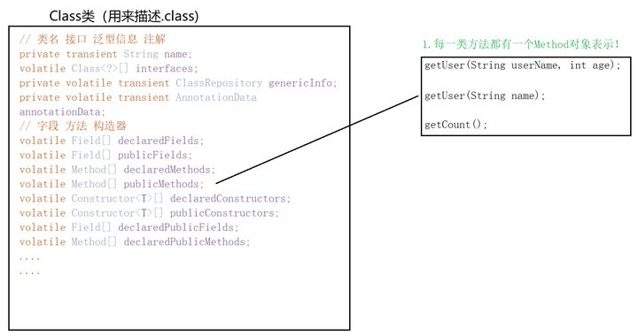

# 浅谈反射机制

2018年我刚入行时曾经写过一篇反射相关的博客：[初识反射](https://zhuanlan.zhihu.com/p/35761599)。

Emmmmm....现在看来还是非常稚嫩的。晚上要在B站直播讲解JDK动态代理，免不了要用到反射。于是，想着还是把反射机制再梳理一遍，有兴趣的朋友可以看看。

我不会去否认过去的每一篇文章，它们未必精确却代表了自己当时所能理解的限度...每写完一篇文章，我都能感受到原本一个个孤立的知识由点到线，由线到面，最终拔地而起变成一个个立体的概念，让我有机会站在更高的地方去环视周围这个广袤无垠的程序世界。这感觉，会上瘾。

由于反射本身确实抽象（说是Java中最抽象的概念也不为过），所以我当初写作时也用了大量的比喻。但是比喻有时会让答案偏离得更远。前阵子看了些讲设计模式的文章，把比喻都用坏了。有时理解比喻，竟然要比理解设计模式本身还费劲...那就南辕北辙了。所以，这一次，能不用比喻就尽量不用，争取用最实在的代码去解释。

主要内容：

- JVM是如何构建一个实例的
- .class文件
- 类加载器
- Class类
- 反射API

------

## 一、JVM 是如何构建一个实例的

下文我会使用的名词及其对应关系

- 内存：即JVM内存，栈、堆、方法区啥的都是JVM内存，只是人为划分
- .class文件：就是所谓的字节码文件，这里称.class文件，直观些

假设main方法中有以下代码：

```java
Person p = new Person();
```

很多初学者会以为整个创建对象的过程是下面这样的

```text
javac Person.java
java Person
```


不能说错，但是粗糙了一点。

稍微细致一点的过程可以是下面这样的


通过new创建实例和反射创建实例，都绕不开Class对象。

------

## 二.class文件

有人用编辑器打开.class文件看过吗？

比如我现在写一个类


用vim命令打开.class文件，以16进制显示就是下面这副鬼样子：


在计算机中，任何东西底层保存的形式都是0101代码。

.java源码是给人类读的，而.class字节码是给计算机读的。根据不同的解读规则，可以产生不同的意思。就好比“这周日你有空吗”，合适的断句很重要。

同样的，JVM对.class文件也有一套自己的读取规则，不需要我们操心。总之，0101代码在它眼里的样子，和我们眼中的英文源码是一样的。


------

## 三、类加载器

在上一小节中，我们了解到.class文件是由类加载器加载的。关于类加载器，如果掰开讲，是有很多门道的，可以看看 

[@请叫我程序猿大人](https://www.zhihu.com/people/65ea239d426f08f3ef31cb4a13ed3c79) 写的[好怕怕的类加载器](https://zhuanlan.zhihu.com/p/54693308)。但是核心方法只有loadClass()，告诉它需要加载的类名，它会帮你加载：

```java
   protected Class<?> loadClass(String name, boolean resolve)
        throws ClassNotFoundException
    {
        synchronized (getClassLoadingLock(name)) {
            // 首先，检查是否已经加载该类
            Class<?> c = findLoadedClass(name);
            if (c == null) {
                long t0 = System.nanoTime();
                try {
                    // 如果尚未加载，则遵循父优先的等级加载机制（所谓双亲委派机制）
                    if (parent != null) {
                        c = parent.loadClass(name, false);
                    } else {
                        c = findBootstrapClassOrNull(name);
                    }
                } catch (ClassNotFoundException e) {
                    // ClassNotFoundException thrown if class not found
                    // from the non-null parent class loader
                }

                if (c == null) {
                    // 模板方法模式：如果还是没有加载成功，调用findClass()
                    long t1 = System.nanoTime();
                    c = findClass(name);

                    // this is the defining class loader; record the stats
                    sun.misc.PerfCounter.getParentDelegationTime().addTime(t1 - t0);
                    sun.misc.PerfCounter.getFindClassTime().addElapsedTimeFrom(t1);
                    sun.misc.PerfCounter.getFindClasses().increment();
                }
            }
            if (resolve) {
                resolveClass(c);
            }
            return c;
        }
    }

    // 子类应该重写该方法
    protected Class<?> findClass(String name) throws ClassNotFoundException {
        throw new ClassNotFoundException(name);
    }
```

加载 `.class` 文件大致可以分为 3 个步骤：

1. 检查是否已经加载，有就直接返回，避免重复加载
2. 当前缓存中确实没有该类，那么遵循父优先加载机制，加载.class文件
3. 上面两步都失败了，调用findClass()方法加载

需要注意的是，ClassLoader类本身是抽象类，而抽象类是无法通过new创建对象的。所以它的findClass()方法写的很随意，直接抛了异常，反正你无法通过ClassLoader对象调用。也就是说，父类ClassLoader中的findClass()方法根本不会去加载.class文件。

正确的做法是，子类重写覆盖findClass()，在里面写自定义的加载逻辑。比如：

```java
@Override
public Class<?> findClass(String name) throws ClassNotFoundException {
	try {
		/*自己另外写一个getClassData()
                  通过IO流从指定位置读取xxx.class文件得到字节数组*/
		byte[] datas = getClassData(name);
		if(datas == null) {
			throw new ClassNotFoundException("类没有找到：" + name);
		}
		//调用类加载器本身的defineClass()方法，由字节码得到Class对象
		return defineClass(name, datas, 0, datas.length);
	} catch (IOException e) {
		e.printStackTrace();
		throw new ClassNotFoundException("类找不到：" + name);
	}
}
```

defineClass()是ClassLoader定义的方法，目的是根据.class文件的字节数组byte[] b造出一个对应的Class对象。我们无法得知具体是如何实现的，因为最终它会调用一个native方法：


反正，目前我们关于类加载只需知道以下信息：


------

## 四、Class 类

现在，.class文件已经被类加载器加载到内存中，并且JVM根据其字节数组创建了对应的Class对象。

接下来，我们来研究一下Class对象，我们将在这一小节一步步分析Class类的结构。

但是，在看源码之前，我想问问聪明的各位，如果你是JDK源码设计者，你会如何设计Class类？

假设现在有个BaseDto类


上面类至少包括以下信息（按顺序）：

- 权限修饰符
- 类名
- 参数化类型（泛型信息）
- 接口
- 注解
- **字段（重点）**
- **构造器（重点）**
- **方法（重点）**

最终这些信息在.class文件中都会以0101表示：


整个.class文件最终都成为字节数组byte[] b，里面的构造器、方法等各个“组件”，其实也是字节。

所以，我猜Class类的字段至少是这样的：


好了，看一下源码是不是如我所料：


字段、方法、构造器对象


注解数据


泛型信息

等等。

而且，针对字段、方法、构造器，因为信息量太大了，JDK还单独写了三个类：Field、Method、Constructor。我们挑Method类看一下：


也就是说，Class类虽然准备了很多字段用来表示一个.class文件的信息，比如类名、注解、实现的接口等，但对于字段、方法、构造器等，为了更详细地描述这些重要信息，还写了三个类，每个类里面都有很详细的对应。而Class类本身就维持这三个对象的引用（对象数组形式！因为一个类可能有多个方法，所以Class要用Method[] methods保存）。


原本UserController类中所有信息，都被**“解构”**后保存在Class类中。其中，字段、方法、构造器又用Field、Method等对象单独表示。

大概了解完Class类的字段后，我们来看看Class类的方法。


- 构造器


可以发现，Class类的构造器是私有的，我们无法手动new一个Class对象，只能由JVM创建。JVM在构造Class对象时，需要传入一个类加载器，然后才有我们上面分析的一连串加载、创建过程。


- Class.forName()方法


反正还是类加载器去搞呗。


- newInstance()


也就是说，**newInstance()底层就是调用无参构造对象的newInstance()。**

所以，本质上Class对象要想创建实例，其实都是通过构造器对象。如果没有空参构造对象，就无法使用clazz.newInstance()，必须要获取其他有参的构造对象然后调用构造对象的newInstance()。

------

## 反射API

没啥好说的，在日常开发中反射最终目的主要两个：

- 创建实例
- 反射调用方法

创建实例的难点在于，很多人不知道clazz.newInstance()底层还是调用Contructor对象的newInstance()。所以，要想调用clazz.newInstance()，必须保证编写类的时候有个无参构造。


反射调用方法的难点，有两个，初学者可能会不理解。

再此之前，先来理清楚Class、Field、Method、Constructor四个对象的关系：


Field、Method、Constructor对象内部有对字段、方法、构造器更详细的描述：


OK，理清关系后我们继续来看看反射调用方法时的两个难点。


- 难点一：为什么根据Class对象获取Method时，需要传入方法名+参数的Class类型


为什么要传name和ParameterType？

因为.class文件中有多个方法，比如



所以必须传入name，以方法名区分哪个方法，得到对应的Method。

那参数parameterTypes为什么要用Class类型，我想和调用方法时一样直接传变量名不行吗，比如userName， age。

答案是：我们无法根据变量名区分方法

```text
User getUser(String userName, int age);
User getUser(String mingzi, int nianling);
```

这不叫重载，这就是同一个方法。只能根据参数类型。

我知道，你还会问：变量名不行，那我能不能传String, int。

不好意思，这些都是基本类型和引用类型，类型不能用来传递。我们能传递的要么值，要么对象（引用）。而String.class, int.class是对象，且是Class对象。

实际上，调用Class对象的getMethod()方法时，内部会循环遍历所有Method，然后根据方法名和参数类型匹配唯一的Method返回。


循环遍历所有Method，根据name和parameterType匹配


难点二：调用method.invoke(obj, args);时为什么要传入一个目标对象？

上面分析过，.class文件通过IO被加载到内存后，JDK创造了至少四个对象：Class、Field、Method、Constructor，这些对象其实都是0101010的抽象表示。

以Method对象为例，它到底是什么，怎么来的？我们上面已经分析过，Method对象有好多字段，比如name（方法名），returnType（返回值类型）等。也就是说我们在.java文件中写的方法，被“解构”以后存入了Method对象中。所以对象本身是一个方法的映射，一个方法对应一个Method对象。

我在专栏的另一篇文章中讲过，**对象的本质就是用来存储数据的。**而方法作为一种行为描述，是所有对象共有的，不属于某个对象独有。比如现有两个Person实例

```text
Person p1 = new Person();
Person p2 = new Person();
```

对象 p1保存了"hst"和18，p2保存了"cxy"和20。但是不管是p1还是p2，都会有changeUser()，但是每个对象里面写一份太浪费。既然是共性行为，可以抽取出来，放在方法区共用。

但这又产生了一个棘手的问题，方法是共用的，JVM如何保证p1调用changeUser()时，changeUser()不会跑去把p2的数据改掉呢？

所以JVM设置了一种隐性机制，每次对象调用方法时，都会隐性传递当前调用该方法的对象参数，方法可以根据这个对象参数知道当前调用本方法的是哪个对象！


同样的，在反射调用方法时，本质还是希望方法处理数据，所以必须告诉它执行哪个对象的数据。


所以，把Method理解为方法执行指令吧，它更像是一个**方法执行器**，必须告诉它要执行的对象（数据）。

当然，如果是invoke一个静态方法，不需要传入具体的对象。因为静态方法并不能处理对象中保存的数据。

