# Java反射详解

[原文地址链接](https://blog.csdn.net/lwl20140904/article/details/80163880)
@toc

==反射是框架设计的灵魂==

**（使用的前提条件：必须先得到代码的字节码的Class，Class类用于表示.class文件（字节码））**

# 一、反射的概述

JAVA反射机是在==运行状态==中，对于任意一个类，都能够知道这个类的所有属性和方法；对于任意一个对象，都能够调用它的任意一个方法和属性；这种动态获取的信息以及动态调用对象的方法的功能称为java语言的反射机制。

要想解剖一个类,必须先要获取到该类的字节码文件对象。而解剖使用的就是Class类中的方法.所以先要获取到每一个字节码文件对应的Class类型的对象. 

**反射就是把java类中的各种成分映射成一个个的Java对象**

例如：一个类有：成员变量、方法、构造方法、包等等信息，利用反射技术可以对一个类进行解剖，把个个组成部分映射成一个个对象。
（其实：一个类中这些成员方法、构造方法、在加入类中都有一个类来描述）

如图是类的正常加载过程：反射的原理在与class对象。

熟悉一下加载的时候：Class对象的由来是将class文件读入内存，并为之创建一个Class对象。


其中这个Class对象很特殊。我们先了解一下这个Class类

# 二、查看Class类在java中的api(1.7)详解

如何阅读java中的api详见java基础之——String字符串处理


**Class 类的实例表示正在运行的 Java 应用程序中的类和接口**。也就是jvm中有N多的实例，每个类都有该Class对象。（包括基本数据类型）

**Class 没有公共构造方法**。Class 对象是在加载类时由 Java 虚拟机以及通过调用类加载器中的defineClass方法自动构造的。也就是这不需要我们自己去处理创建，JVM已经帮我们创建好了。 

没有公共的构造方法，方法共有64个太多了。下面用到哪个就详解哪个吧


# 三、反射的使用（这里使用Student类做演示）

先写一个Student类。

- ==获取Class对象的三种方式==
   * Object ——> getClass();  //返回一个对象的运行时类
   * 任何数据类型（包括基本数据类型）都有一个“静态”的class属性 
   * **通过Class类的静态方法：forName（String  className）(常用)**

其中第一种 是因为Object类中的getClass方法、因为所有类都继承Object类。从而调用Object类来获取

- 获取Class 类对象的三种方法的代码示例：
```java
package fanshe;

public class Fanshe {
    public static void main(String[] args) {
        //☆☆☆第一种方式获取Class对象  
        Student stu1 = new Student();
        //这一new 产生一个Student对象，一个Class对象。      
        Class stuClass = stu1.getClass();//获取Class对象
        System.out.println(stuClass.getName());


        //☆☆☆第二种方式获取Class对象
        Class stuClass2 = Student.class;
        System.out.println(stuClass == stuClass2);
        //判断第一种方式获取的Class对象和第二种方式获取的是否是同一个

        //☆☆☆第三种方式获取Class对象
        try {
            Class stuClass3 = Class.forName("fanshe.Student");
            //注意此字符串必须是真实路径，即带包名的类路径，包名.类名
            System.out.println(stuClass3 == stuClass2);
            //判断三种方式是否获取的是同一个Class对象
        } catch (ClassNotFoundException e) {
            e.printStackTrace();
        }

    }
}
```

 **注意：在运行期间，一个类，只有一个Class对象产生**。 

三种方式常用第三种，第一种对象都有了还要反射干什么。第二种需要导入类的包，依赖太强，不导包就抛编译错误。一般都第三种，一个字符串可以传入也可写在配置文件中等多种方法。

## （一）通过反射获取构造方法并使用：

### 1. 获取构造方法：

- 1).批量的方法：
 `getConstructors();`：所有”公有的”构造方法
  `getDeclaredConstructors();`：获取所有的构造方法(包括私有、受保护、默认、公有)

- 2).获取单个的方法，并调用：
`getConstructor(Class… parameterTypes);`:获取单个的”公有的”构造方法：
`getDeclaredConstructor(Class… parameterTypes);`:获取”某个构造方法”可以是私有的，或受保护、默认、公有；

### 2. 调用构造方法：
`newInstance(Object… initargs);`
newInstance是 Constructor类的方法（管理构造函数的类）
api的解释为:`newInstance(Object… initargs)`。使用此 `Constructor` 对象表示的构造方法来创建该构造方法的声明类的新实例，并用指定的初始化参数初始化该实例。
它的返回值是T类型，所以newInstance是创建了一个构造方法的声明类的新实例对象。并为之调用


- student类：共有六个构造方法用于测试
```java
package fanshe;

public class Student {

    //---------------构造方法-------------------
    //（默认的构造方法）
    Student(String str){
        System.out.println("(默认)的构造方法 s = " + str);
    }

    //无参构造方法
    public Student(){
        System.out.println("调用了公有、无参构造方法执行了。。。");
    }

    //有一个参数的构造方法
    public Student(char name){
        System.out.println("姓名：" + name);
    }

    //有多个参数的构造方法
    public Student(String name ,int age){
        System.out.println("姓名："+name+"年龄："+ age);//这的执行效率有问题，以后解决。
    }

    //受保护的构造方法
    protected Student(boolean n){
        System.out.println("受保护的构造方法 n = " + n);
    }

    //私有构造方法
    private Student(int age){
        System.out.println("私有的构造方法   年龄："+ age);
    }

}

```

- 测试类：
```java
package fanshe;
import java.lang.reflect.Constructor;

public class Constructors {

    public static void main(String[] args) throws Exception {
        //1.加载Class对象
        Class clazz = Class.forName("fanshe.Student");

        //2.获取所有公有构造方法
        System.out.println("****所有公有构造方法********");
        Constructor[] conArray = clazz.getConstructors();
        for(Constructor c : conArray){
            System.out.println(c);
        }

        System.out.println("****所有的构造方法(包括：私有、受保护、默认、公有)******");
       Constructor[] conArray2=clazz.getDeclaredConstructors();
        for(Constructor c : conArray2){
            System.out.println(c);
        }

        System.out.println("****获取公有、无参的构造方法******");
        Constructor con = clazz.getConstructor(null);
        //1>、因为是无参的构造方法，所以类型是一个null,不写也可以：
        //这里需要的是一个参数的类型，切记是类型
        //2>、返回的是描述这个无参构造函数的类对象。

        System.out.println("con = " + con);
        
        //调用构造方法
        Object obj = con.newInstance();
    //  System.out.println("obj = " + obj);
    //  Student stu = (Student)obj;

        System.out.println("****获取私有构造方法，并调用******");
        con = clazz.getDeclaredConstructor(char.class);
        //参数是类型。这里的char.class会被自动包装成Char.class
        System.out.println(con);
        //私有化构造方法调用前要先设置权限
        con.setAccessible(true);//暴力访问(忽略掉访问修饰符)
        obj = con.newInstance('男');
    }
}
```

后台输出：
```java
**********所有公有构造方法************
public fanshe.Student(java.lang.String,int)
public fanshe.Student(char)
public fanshe.Student()
******所有的构造方法(包括：私有、受保护、默认、公有)**********
private fanshe.Student(int)
protected fanshe.Student(boolean)
public fanshe.Student(java.lang.String,int)
public fanshe.Student(char)
public fanshe.Student()
fanshe.Student(java.lang.String)
*********获取公有、无参的构造方法****************
con = public fanshe.Student()
调用了公有、无参构造方法执行了。。。
*********获取私有构造方法，并调用****************
public fanshe.Student(char)
姓名：男
```


## （二）获取成员变量并调用

- 1.批量的
       1).Field[] getFields():获取所有的"公有字段"
       2).Field[] getDeclaredFields():获取所有字段，包括：私有、受保护、默认、公有；
- 2.获取单个的：
       1).public Field getField(String fieldName):获取某个"公有的"字段；
       2).public Field getDeclaredField(String fieldName):获取某个字段(可以是私有的)

- 设置字段的值：
     Field --> public void set(Object obj,Object value):
                  参数说明：
                  1.obj:要设置的字段所在的对象；
                  2.value:要为字段设置的值；


student类：
```java
package fanshe.field;

public class Student {
    public Student(){

    }
    //**********字段*************//
    public String name;
    protected int age;
    char sex;
    private String phoneNum;

    @Override
    public String toString() {
        return "Student[name=" +name+ ", age=" +age+ ",sex=" +sex+ ", phoneNum=" +phoneNum+ "]";
    }

}
```

测试类：

```java
package fanshe.field;
import java.lang.reflect.Field;

public class Fields {

        public static void main(String[] args) throws Exception {
            //1.获取Class对象
            Class stuClass = Class.forName("fanshe.field.Student");
            //2.获取字段
            System.out.println("*****获取所有公有的字段**");
            Field[] fieldArray = stuClass.getFields();
            for(Field f : fieldArray){
                System.out.println(f);
            }
            System.out.println("*****获取所有的字段(包括私有、受保护、默认的)******");
            fieldArray = stuClass.getDeclaredFields();
            for(Field f : fieldArray){
                System.out.println(f);
            }
            System.out.println("******获取公有字段**并调用***");
            Field f = stuClass.getField("name");
            System.out.println(f);
            //获取一个对象
            Object obj=stuClass.getConstructor().newInstance();
           //产生Student对象--》Student stu = new Student();
            //为字段设置值
            f.set(obj, "刘德华");
           //为Student对象中的name属性赋值--》stu.name = "刘德华"
            //验证
            Student stu = (Student)obj;
            System.out.println("验证姓名：" + stu.name);

            System.out.println("*****获取私有字段****并调用**");
            f = stuClass.getDeclaredField("phoneNum");
            System.out.println(f);
            f.setAccessible(true);//暴力反射，解除私有限定
            f.set(obj, "18888889999");
            System.out.println("验证电话：" + stu);

        }
    }
```

后台输出：
```java
************获取所有公有的字段********************
public java.lang.String fanshe.field.Student.name
************获取所有的字段(包括私有、受保护、默认的)*********
public java.lang.String fanshe.field.Student.name
protected int fanshe.field.Student.age
char fanshe.field.Student.sex
private java.lang.String fanshe.field.Student.phoneNum
*************获取公有字段**并调用**************
public java.lang.String fanshe.field.Student.name
验证姓名：刘德华
**************获取私有字段****并调用********************
private java.lang.String fanshe.field.Student.phoneNum
验证电话：Student [name=刘德华, age=0, sex=
```

由此可见，调用字段时：需要传递两个参数：

Object obj = stuClass.getConstructor().newInstance();//产生Student对象–》Student stu = new Student();
//为字段设置值
f.set(obj, “刘德华”);//为Student对象中的name属性赋值–》stu.name = “刘德华” 

第一个参数：要传入设置的对象，第二个参数：要传入实参

## （三）获取成员方法并调用

- 1.批量的：
  public Method[] getMethods():获取所有"公有方法"；（包含了父类的方法也包含Object类）
  public Method[] getDeclaredMethods():获取所有的成员方法，包括私有的(不包括继承的)
- 2.获取单个的：
  public Method getMethod(String name,Class<?>... parameterTypes):
              参数：name : 方法名；
                   Class ... : 形参的Class类型对象
   public Method getDeclaredMethod(String name,Class<?>... parameterTypes)

- 调用方法：
   Method --> public Object invoke(Object obj,Object... args):
               参数说明：
               obj : 要调用方法的对象；
              args:调用方式时所传递的实参；

student类：
```java
package fanshe.method;

public class Student {
    //**************成员方法***************//
    public void show1(String s){
        System.out.println("调用了：公有的，String参数的show1(): s = " + s);
    }
    protected void show2(){
        System.out.println("调用了：受保护的，无参的show2()");
    }
    void show3(){
        System.out.println("调用了：默认的，无参的show3()");
    }
    private String show4(int age){
        System.out.println("调用了，私有的，并且有返回值的，int参数的show4(): age = " + age);
        return "abcd";
    }
}

```

测试类：
```java
package fanshe.method;
import java.lang.reflect.Method;

public class MethodClass {
    public static void main(String[] args) throws Exception {
        //1.获取Class对象
        Class stuClass =Class.forName("fanshe.method.Student");
        //2.获取所有公有方法
        System.out.println("******获取所有的”公有“方法******");
        Method[] methodArray = stuClass.getMethods();
        for(Method m : methodArray){
            System.out.println(m);
        }
        
        System.out.println("****获取所有的方法，包括私有的****");
        methodArray = stuClass.getDeclaredMethods();
        for(Method m : methodArray){
            System.out.println(m);
        }
        
        System.out.println("*******获取公有的show1()方法****");
        Method m = stuClass.getMethod("show1", String.class);
        System.out.println(m);
        //实例化一个Student对象
        Object obj = stuClass.getConstructor().newInstance();
        m.invoke(obj, "刘德华");

        System.out.println("******获取私有的show4()方法*****");
        m = stuClass.getDeclaredMethod("show4", int.class);
        System.out.println(m);
        m.setAccessible(true);//解除私有限定
        Object result = m.invoke(obj, 20);//需要两个参数，一个是要调用的对象（获取有反射），一个是实参
        System.out.println("返回值：" + result);
    }
}
```

控制台输出：
```java
***************获取所有的”公有“方法*******************
public void fanshe.method.Student.show1(java.lang.String)
public final void java.lang.Object.wait(long,int) throws java.lang.InterruptedException
public final native void java.lang.Object.wait(long) throws java.lang.InterruptedException
public final void java.lang.Object.wait() throws java.lang.InterruptedException
public boolean java.lang.Object.equals(java.lang.Object)
public java.lang.String java.lang.Object.toString()
public native int java.lang.Object.hashCode()
public final native java.lang.Class java.lang.Object.getClass()
public final native void java.lang.Object.notify()
public final native void java.lang.Object.notifyAll()
***************获取所有的方法，包括私有的*******************
public void fanshe.method.Student.show1(java.lang.String)
private java.lang.String fanshe.method.Student.show4(int)
protected void fanshe.method.Student.show2()
void fanshe.method.Student.show3()
***************获取公有的show1()方法*******************
public void fanshe.method.Student.show1(java.lang.String)
调用了：公有的，String参数的show1(): s = 刘德华
***************获取私有的show4()方法******************
private java.lang.String fanshe.method.Student.show4(int)
调用了，私有的，并且有返回值的，int参数的show4(): age = 20
返回值：abcd
```

由此可见：

- m = stuClass.getDeclaredMethod(“show4”, int.class);//调用制定方法（所有包括私有的），需要传入两个参数，第一个是调用的方法名称，第二个是方法的形参类型，切记是类型。 System.out.println(m);
- m.setAccessible(true);//解除私有限定
- Object result = m.invoke(obj, 20);//需要两个参数，一个是要调用的对象（获取有反射），一个是实参
System.out.println(“返回值：” + result);//

其实这里的成员方法：在模型中有属性一词，就是那些setter（）方法和getter()方法。还有字段组成，这些内容在内省中详解

## （四）反射main方法

student类：
```java
package fanshe.main;

public class Student {

    public static void main(String[] args) {
        System.out.println("main方法执行了。。。");
    }
}
```

测试类：
```java
package fanshe.main;

import java.lang.reflect.Method;

/**
 * 获取Student类的main方法、不要与当前的main方法搞混了
 */
public class Main {

    public static void main(String[] args) {
        try {
            //1、获取Student对象的字节码
            Class clazz = Class.forName("fanshe.main.Student");

            //2、获取main方法
             Method methodMain = clazz.getMethod("main", String[].class);
             //第一个参数：方法名称，第二个参数：方法形参的类型，
            
            //3、调用main方法
            /* methodMain.invoke(null, new String[]{"a","b","c"});
            第一个参数，对象类型，因为方法是static静态的，所以为null可以，
            第二个参数是String数组，这里要注意在jdk1.4时是数组，jdk1.5之后是可变参数
            这里拆的时候将  new String[]{"a","b","c"} 拆成3个对象。。。所以需要将它强转。
             */
             methodMain.invoke(null, (Object)new String[]{"a","b","c"});//方式一
            // methodMain.invoke(null, new Object[]{new String[]{"a","b","c"}});//方式二

        } catch (Exception e) {
            e.printStackTrace();
        }

    }
}
```

控制台输出：
`main方法执行了。。。`

## （五）反射方法的其它使用之—通过反射运行配置文件内容

student类：
```java
public class Student {
    public void show(){
        System.out.println("is show()");
    }
}
```

配置文件以txt文件为例子（pro.txt）：

```java
className = cn.fanshe.Student
methodName = show1
```

测试类：
```java
import java.io.FileNotFoundException;
import java.io.FileReader;
import java.io.IOException;
import java.lang.reflect.Method;
import java.util.Properties;

/*
 * 我们利用反射和配置文件，可以使：应用程序更新时，对源码无需进行任何修改
 * 我们只需要将新类发送给客户端，并修改配置文件即可
 */
public class Demo {
    public static void main(String[] args) throws Exception {
        //通过反射获取Class对象
        Class stuClass = Class.forName(getValue("className"));//"cn.fanshe.Student"
        //2获取show()方法
        Method m = stuClass.getMethod(getValue("methodName"));//show
        //3.调用show()方法
        m.invoke(stuClass.getConstructor().newInstance());

    }

    //此方法接收一个key，在配置文件中获取相应的value
    public static String getValue(String key) throws IOException{
        Properties pro = new Properties();//获取配置文件的对象
        FileReader in = new FileReader("pro.txt");//获取输入流
        pro.load(in);//将流加载到配置文件对象中
        in.close();
        return pro.getProperty(key);//返回根据key获取的value值
    }
}

```

控制台输出：

is show()

**需求：**
当我们升级这个系统时，不要Student类，而需要新写一个Student2的类时，这时只需要更改pro.txt的文件内容就可以了。代码就一点不用改动

要替换的student2类：
```java
public class Student2 {
    public void show2(){
        System.out.println("is show2()");
    }
}
```

配置文件更改为：
```java
className = cn.fanshe.Student2
methodName = show21
```

控制台输出：

is show2();

## 7、反射方法的其它使用之—通过反射越过泛型检查

泛型用在编译期，编译过后泛型擦除（消失掉）。所以是可以通过反射越过泛型检查的

测试类： 
```java
import java.lang.reflect.Method;
import java.util.ArrayList;

/*
 * 通过反射越过泛型检查
 * 
 * 例如：有一个String泛型的集合，怎样能向这个集合中添加一个Integer类型的值？
 */
public class Demo {
    public static void main(String[] args) throws Exception{
        ArrayList<String> strList = new ArrayList<>();
        strList.add("aaa");
        strList.add("bbb");

    //  strList.add(100);
        //获取ArrayList的Class对象，反向的调用add()方法，添加数据
        Class listClass = strList.getClass(); //得到 strList 对象的字节码 对象
        //获取add()方法
        Method m = listClass.getMethod("add", Object.class);
        //调用add()方法
        m.invoke(strList, 100);

        //遍历集合
        for(Object obj : strList){
            System.out.println(obj);
        }
    }
}
```

控制台输出：

aaa
bbb
100


# 万字总结之反射（框架之魂）

## 一、反射的概述（基础部分开始）

反射是在编译状态，对某个类一无所知 ，但在运行状态中，对于任意一个类，都能知道这个类的所有属性和方法。

如果我们没有Orange类，那该类在编译的时候就会报错找不到该类。这是我们平常使用的“正射”。这个名字是为了和反射相对应，不是官方的术语。

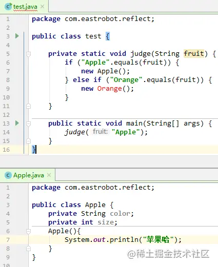

但是这存在着一个明显的缺点，就是在main方法里调用的是Apple类，并没有调用Orange类，所以应该是可以正常调用的，当我想要调用Orange类的时候，再报错即可。但是，事与愿违，事情不是照着我们的想法而发展的。

我们需要一种在编译时不检查类的调用情况，只有在运行时，才根据相应的要求调用相应的类，这就是“反射”。

## 反射的用途

**反射最重要的用途就是开发各种通用框架。**很多框架（比如 Spring）都是配置化的（比如通过 XML 文件配置 Bean），为了保证框架的通用性，它们可能需要根据配置文件加载不同的对象或类，调用不同的方法，这个时候就必须用到反射，运行时动态加载需要加载的对象。

举一个例子，在运用 Struts 2 框架的开发中我们一般会在 `struts.xml` 里去配置 `Action`，比如：

```
<action name="login"       
        class="org.ScZyhSoft.test.action.SimpleLoginAction"   
        method="execute">      
      <result>/shop/shop-index.jsp</result>     
      <result name="error">login.jsp</result>
</action> 
```

配置文件与 `Action` 建立了一种映射关系，当 View 层发出请求时，请求会被 `StrutsPrepareAndExecuteFilter` 拦截，然后 `StrutsPrepareAndExecuteFilter` 会去动态地创建 Action 实例。比如我们请求 `login.action`，那么 `StrutsPrepareAndExecuteFilter`就会去解析struts.xml文件，检索action中name为login的Action，并根据class属性创建SimpleLoginAction实例，并用invoke方法来调用execute方法，这个过程离不开反射。

## 获取Class文件对象的三种方式

万事万物都是对象。

`Apple apple=new Apple();`中的apple为Apple的一个实例。那Apple对象是哪个的实例呢？

其实是Class类的实例。

我们可以看他的注释，私有的构造方法，只有JVM才能创建对象。

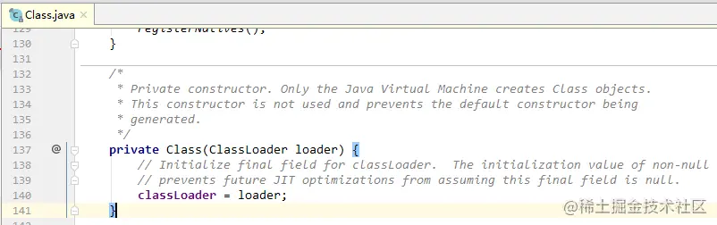

如果我们能找到某个对象的Class类，即可以创建其实例。

- 静态属性class

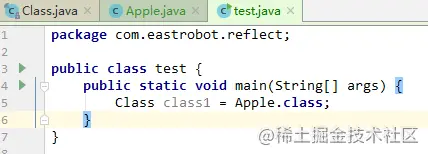

- Object类的getClass方法，如果知道实例，直接调用其getClass方法。

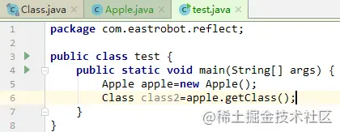

- Class类的静态方法forName()，参数为类的完整路径**（推荐使用）**

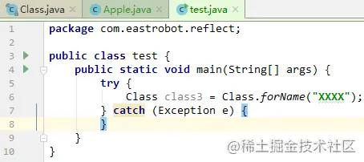

这里需要注意，通过类的全路径名获取Class对象会抛出一个异常，要用try....catch...捕获异常。如果根据类路径找不到这个类那么就会抛出这个异常，Class类中forName方法源码如下：

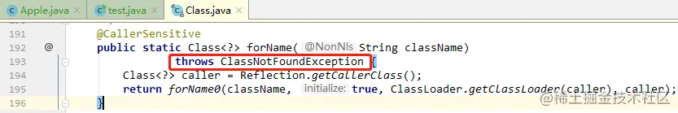

> 注：虽然写了三种方式，但平常使用最多，最推荐的是第三种方式，因为第一种方式需要知道类，第二种方式需要知道实例，如果知道了这些，可以直接调用其方法和参数，没必要再用Class来实现功能。举个例子，你从北京去上海，第一种方式直达就行，第二种方式和第三种方式则是先从北京到云南，再从云南到上海，显得太冗余。

## 反射的使用

我们以Apple类为例，利用发射来获取其参数和方法。其有三个参数，默认default参数color，公有public参数size，私有private参数price。三个构造方法，分别是默认default构造，公有public带有三个参数的有参构造，私有带有两个参数的有参构造。六个setter/getter方法公有方法，分别是color的默认default隔离级别的setter/getter方法，size的public隔离级别的setter/getter方法，price的private隔离级别的setter/getter方法。toString和三个参数的setter/getter方法。最后还有一个public隔离级别的toString方法。这样详细展开的描述，看起来很复杂，其实很简单的，具体代码如下：

```
package com.eastrobot.reflect;

public class Apple extends Fruit{
    String color;//默认default
    public int size;
    private int price;

    Apple() {//默认default
        System.out.println("Apple的无参构造");
    }

    public Apple(String color, int size, int price) {
        this.color = color;
        this.size = size;
        this.price = price;
        System.out.println("Apple的有参构造——三个参数");
    }

    private Apple(String color, int size) {
        this.color = color;
        this.size = size;
        this.price = 10;
        System.out.println("Apple的有参构造——两个参数");
    }

    @Override
    public String toString() {
        return "color:" + color + ",size:" + size + ",price:" + price;
    }

    //默认default
    String getColor() {
        return color;
    }

    public int getSize() {
        return size;
    }

    private int getPrice() {
        return price;
    }

    //默认default
    void setColor(String color) {
        this.color = color;
    }

    public void setSize(int size) {
        this.size = size;
    }

    private void setPrice(int price) {
        this.price = price;
    }
}
```

继承的父类Fruit，包括一个public类型的参数taste，和其public类型的setter/getter方法。

```
public class Fruit {   
 public String taste; 
 public String getTaste() {  
      return taste;    
 }   
 public void setTaste(String taste) {   
     this.taste = taste;  
  }
}
```

### 1.通过反射获取所有参数 getDeclaredFields

```
System.out.println("getDeclaredFields**********");
Field[] fields=appleClass.getDeclaredFields();
for(Field field:fields){   
 System.out.println(field.toString());
}
```

运行结果如下：

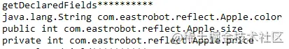

```
注：不管何种隔离级别，getDeclaredFields都会获取到所有参数。复制代码
```

### 2.通过反射获取指定参数getDeclaredField

```
//指定参数
System.out.println("getDeclaredField**********");
Field colorField=appleClass.getDeclaredField("color");
System.out.println("color:"+colorField.toString());

Field sizeField=appleClass.getDeclaredField("size");
System.out.println("size:"+sizeField.toString());

Field priceField=appleClass.getDeclaredField("price");
System.out.println("price:"+priceField.toString());复制代码
```

运行结果如下：

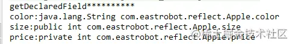

```
注：不管何种隔离级别，getDeclaredField可以通过输入值获取指定参数。复制代码
```

### 3.通过反射获取所有pubic类型的参数 getFields

```
System.out.println("getFields**********");
Field[] fields=appleClass.getFields();
for(Field field:fields){    
    System.out.println(field.toString());
}复制代码
```

运行结果如下：

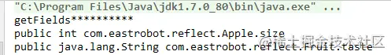

```
注：只能通过反射获取public类型的属性，也包括继承自父类的属性。复制代码
```

### 4.通过反射获取指定public类型的参数 getField

```
Field colorField=appleClass.getField("color");
System.out.println("color:"+colorField.toString());复制代码
```

运行结果如下：

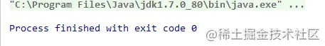

-------------------手动分割线-------------------

```
Field sizeField=appleClass.getField("size");
System.out.println("size:"+sizeField.toString());
复制代码
```

运行结果如下：

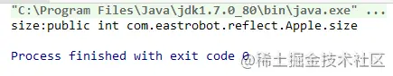

-------------------手动分割线-------------------

```
Field priceField=appleClass.getField("price");
System.out.println("price:"+priceField.toString());复制代码
```

运行结果如下：

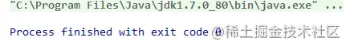

```
注：只有public类型才能通过getField方法获取到，其他类型均获取不到。复制代码
```

看到这里，有些小伙伴要问了，这是为啥，理由呢？咱不能死记硬背，这样过两天就忘了，记得不牢固，咱来瞅瞅底层干了啥。

### 插曲：为什么getFields和getField只能获取public类型的字段？

我们以getField为例，观察getDeclaredField和getField的区别，可以看到两者都调用了privateGetDeclaredFields方法，但是区别是getDeclaredField方法中的参数publicOnly是false，getField方法中的参数publicOnly为true。

getDeclaredField方法：

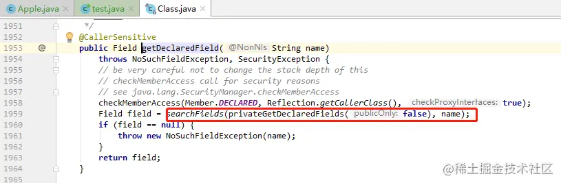

getField方法：

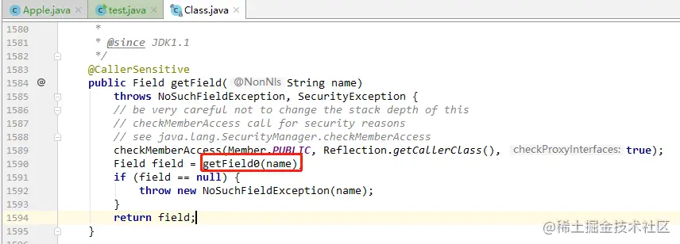

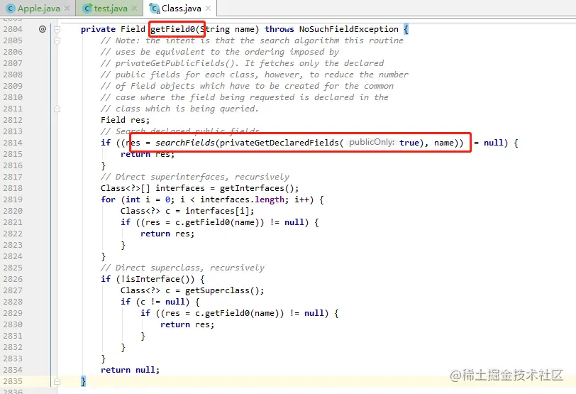

那privateGetDeclaredFields里面干了啥，我们看下。

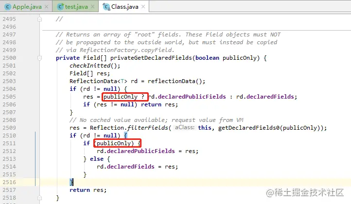

我们可以看到如果为true，就取declaredPublicFields字段，即public字段，如果为false，就取DeclaredFields。

### 5.通过反射获取所有方法 getDeclaredMethods

```
//所有方法
System.out.println("getDeclaredMethods**********");
Method[] methods=appleClass.getDeclaredMethods();
for(Method method:methods){    
    System.out.println(method.toString());
}复制代码
```

运行结果如下：

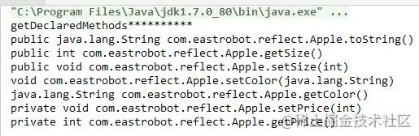

### 6.通过反射获取指定方法 getDeclaredMethod

```
//指定方法
System.out.println("getDeclaredMethod**********");

//default
Method getColorMethod=appleClass.getDeclaredMethod("getColor");
System.out.println("getColorMethod:"+getColorMethod.toString());

//public
Method getSizeMethod=appleClass.getDeclaredMethod("getSize");
System.out.println("getSizeMethod:"+getSizeMethod.toString());

//private
Method getPriceMethod=appleClass.getDeclaredMethod("getPrice");
System.out.println("getPriceMethod:"+getPriceMethod.toString());

//父类的public
Method getTasteMethod=appleClass.getDeclaredMethod("getTaste");
System.out.println("getTasteMethod:"+getTasteMethod.toString());复制代码
```

运行结果如下：

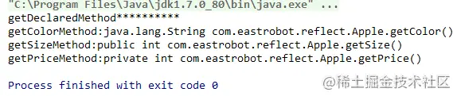

```
注：getDeclaredMethod只能获取自己定义的方法，不能获取从父类的方法。复制代码
```

### 7.通过反射获取所有public类型的方法 getMethods

```
//所有方法
System.out.println("getMethods**********");
Method[] methods=appleClass.getMethods();
for(Method method:methods){
    System.out.println(method.toString());
}
```

运行结果如下：

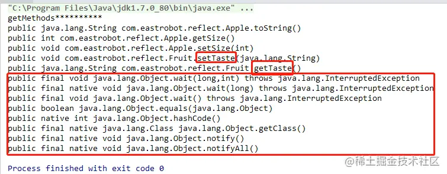

```
注：getMethods可以通过反射获取所有的public方法，包括父类的public方法。复制代码
```

### 8.通过反射获取指定public类型的方法 getMethod

```
//指定方法
System.out.println("getMethod**********");
Method method=appleClass.getMethod("toString");
System.out.println(method.toString());
```

运行结果如下：

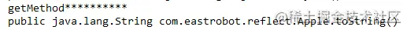

### 9.通过反射获取所有构造方法 getDeclaredConstuctors

```
//构造方法
System.out.println("getDeclaredConstructors**********");
Constructor[] constructors=appleClass.getDeclaredConstructors();
for(Constructor constructor:constructors){   
 System.out.println(constructor.toString());
}
```

运行结果如下：

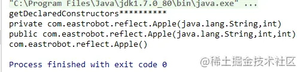

### 10.通过反射获取某个带参数的构造方法 getDeclaredConstructor

```
//指定构造方法
System.out.println("getDeclaredConstructor**********");
Class[] cArg = new Class[3];
cArg[0] = String.class;
cArg[1] = int.class;
cArg[2] = int.class;
Constructor constructor=appleClass.getDeclaredConstructor(cArg);
System.out.println(constructor.toString());复制代码
```

运行结果如下：

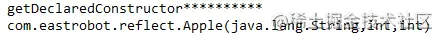

### 11.通过反射获取所有public类型的构造方法getConstructors

```
System.out.println("getConstructors**********");
Constructor[] constructors=appleClass.getConstructors();
for(Constructor constructor:constructors){
    System.out.println(constructor.toString());
}
```

运行结果：

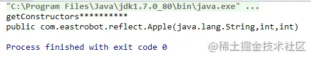

### 12.通过反射获取某个public类型的构造方法getConstructor

```
//构造方法
System.out.println("getConstructor**********");
Constructor constructor1 = appleClass.getConstructor(String.class,int.class,int.class);
System.out.println("public类型的有参构造：" + constructor1.toString());

Constructor constructor2 = appleClass.getConstructor(String.class, int.class);
System.out.println("private类型的有参构造：" + constructor2.toString());复制代码
```

运行结果：

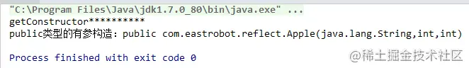

### 13.通过无参构造来获取该类对象 newInstance()

```
//调用无参构造创建对象
Class appleClass = Class.forName("com.eastrobot.reflect.Apple");
Apple apple=(Apple)appleClass.newInstance();复制代码
```

运行结果如下：

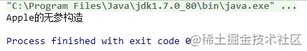

### 14.通过有参构造来获取该类对象 newInstance（XXXX）

```
Constructor constructor=appleClass.getConstructor(String.class,int.class,int.class);
Apple apple=(Apple)constructor.newInstance("红色",10,5);
```

运行结果如下：

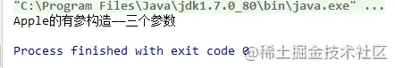

### 15.获取类名包含包路径 getName()

```
String name= appleClass.getName();
System.out.println("name:"+name);
```

运行结果如下：


### 16.获取类名不包含包路径 getSimpleName()

```
String simpleName =appleClass.getSimpleName();
System.out.println("simpleName:"+simpleName);
```

运行结果如下：

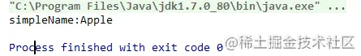

### 17.通过反射调用方法 invoke

```
//调用无参构造创建对象
Class appleClass = Class.forName("com.eastrobot.reflect.Apple");

//调用有参构造
Constructor constructor = appleClass.getDeclaredConstructor(String.class, int.class, int.class);
Apple apple = (Apple) constructor.newInstance("红色", 10, 20);

//获取toString方法并调用
Method method = appleClass.getDeclaredMethod("toString");
String str=(String)method.invoke(apple);
System.out.println(str);复制代码
```

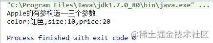

```
注：invoke+实例可以调用相关public方法。
```

### 18.判断方法是否能调用isAccessible

```
//调用无参构造创建对象
Class appleClass = Class.forName("com.eastrobot.reflect.Apple");

//调用有参构造
Constructor constructor = appleClass.getDeclaredConstructor(String.class, int.class, int.class);
Apple apple = (Apple) constructor.newInstance("红色", 10, 20);

//获取public的getSize方法并调用
Method method = appleClass.getDeclaredMethod("getSize");
System.out.println("getSize方法的isAccessible：" + method.isAccessible());
int size = (Integer) method.invoke(apple);
System.out.println("size:" + size);

//获取private的getPrice方法并调用
method = appleClass.getDeclaredMethod("getPrice");
System.out.println("getPrice的isAccessible：" + method.isAccessible());
int price = (Integer) method.invoke(apple);
System.out.println("price:" + price);复制代码
```

运行结果：

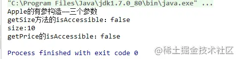

```
注：这样一看，public和private类型的isAccessible都为false，但是public类型的值可以获取到，但是private类型的值并不能获取到。其实isAccessible()值为 true或false，是指启用和禁用访问安全检查的开关，如果为true，则取消安全检查，为false，则执行安全检查。如上，两者都为false，说明两者的进行了安全检查，getSize为public类型，则可以获取值，而getPrice为private，则不能获取值。
```

### 19.设置安全检查开关setAccessible

```
//调用无参构造创建对象
Class appleClass = Class.forName("com.eastrobot.reflect.Apple");

//调用有参构造
Constructor constructor = appleClass.getDeclaredConstructor(String.class, int.class, int.class);
Apple apple = (Apple) constructor.newInstance("红色", 10, 20);

//获取price
Method otherMethod = appleClass.getDeclaredMethod("getPrice");
System.out.println("getPrice方法的isAccessible:" + otherMethod.isAccessible());
otherMethod.setAccessible(true);
int price = (Integer) otherMethod.invoke(apple);
System.out.println("之前的price:" + price);

//重新设置price
Method method = appleClass.getDeclaredMethod("setPrice", int.class);
System.out.println("isAccessible:" + method.isAccessible());
method.setAccessible(true);
method.invoke(apple, 100);

//再次获取price
otherMethod = appleClass.getDeclaredMethod("getPrice");
otherMethod.setAccessible(true);
price = (Integer) otherMethod.invoke(apple);
System.out.println("之后的price:" + price);复制代码
```

运行结果：

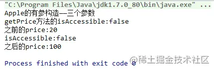

```
注：setAccessible（true）表示取消安全检查，setAccessible(false)表示启用安全检查。
```

## 常见面试题解答(进阶部分开始)

### 被反射的类是否一定需要无参构造方法？

不一样。因为有参构造方法也可以反射，具体代码如下：

```
Constructor constructor=appleClass.getConstructor(String.class,int.class,int.class);
Apple apple=(Apple)constructor.newInstance("红色",10,5);复制代码
```

### 反射的使用有什么优势和劣势？

优势：

在编译时根本无法知道该对象或类可能属于哪些类，程序只依靠运行时信息来发现该对象和类的真实信息。反射提高了Java程序的灵活性和扩展性，降低耦合性，提高自适应能力。它允许程序创建和控制任何类的对象，无需提前硬编码目标类。

劣势：

使用反射基本上是一种解释操作，用于字段和方法接入时要`远慢于直接代码`。

使用反射会`模糊程序内部逻辑`，程序人员希望在源代码中看到程序的逻辑，反射等绕过了源代码的技术，因而会带来维护问题。（这也就是看源码为什么这么难？哎。。。。）

### 为什么说反射可以降低耦合？

因为反射不是硬编码，在运行时可以灵活发现该类的详细信息，降低了代码之间的耦合性。

### 反射比较损耗性能，为什么这样说？（重点）

怎么去判断一个函数的性能?因为函数的执行太快太快了，你需要一个**放慢镜**，这样才能捕捉到他的速度。怎么做？**把一个函数执行一百万遍或者一千万遍，你才能真正了解一个函数的性能**。也就是，你如果想判断性能，你就不能还停留在秒级，毫秒级的概念。

如下是将直接获取实例，直接获取方法，反射获取实例，反射获取方法分别执行1百万次所花费差。

```
try {    
    //直接获取实例
    long startTime1 = System.currentTimeMillis();   
    for (int i = 0; i < 1000000; i++) { 
       new Apple();   
    }  
    long endTime1 = System.currentTimeMillis();  
    System.out.println("直接获取实例时间：" + (endTime1 - startTime1));   
 
    //直接获取方法  
    long startTime2= System.currentTimeMillis();   
    for (int i = 0; i < 1000000; i++) {  
      new Apple().toString();   
    }  
    long endTime2 = System.currentTimeMillis();  
    System.out.println("直接获取方法时间：" + (endTime2- startTime2)); 
   
   //反射获取实例  
   Class appleClass=Class.forName("com.eastrobot.reflect.Apple");   
   long startTime3 = System.currentTimeMillis();   
   for (int i = 0; i < 1000000; i++) {
       appleClass.getDeclaredConstructor().newInstance();  
    }   
   long endTime3 = System.currentTimeMillis(); 
   System.out.println("反射获取实例：" + (endTime3 - startTime3));   
 
   //反射获取方法  
   Apple apple= (Apple)appleClass.getDeclaredConstructor().newInstance();   
   long startTime4 = System.currentTimeMillis();   
   for (int i = 0; i < 1000000; i++) {    
     Method method=appleClass.getMethod("toString");    
     method.invoke(apple);   
   }    
   long endTime4 = System.currentTimeMillis();  
   System.out.println("反射获取方法：" + (endTime4 - startTime4));复制代码
```

运行结果截图：

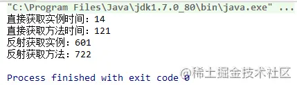

我们可以看到反射的确会导致性能问题，但反射导致的性能问题是否严重跟使用的次数有关系，如果控制在100次以内，基本上没什么差别，如果调用次数超过了100次，性能差异会很明显。

打个比方，如果快递员就在你住的小区，那么你报一个地址：xx栋xx号，那么快递员就可以马上知道你在哪里，直接就去到你家门口；但是，如果快递员是第一次来你们这里，他是不是首先得查查百度地图，看看怎么开车过去，然后到了小区是不是得先问问物管xx栋怎么找，然后，有可能转在楼下转了两个圈才到了你的门前。

我们看上面这个场景，如果快递员不熟悉你的小区，是不是会慢点，他的时间主要花费在了查找百度地图，询问物业管理。OK，反射也是一样，因为我事先什么都不知道，所以我得花时间查询一些其他资料，然后我才能找到你。

综上，大部分我们使用反射是不考虑性能的，平常使用的次数较少，如果真的遇到性能问题，如反射的效率影响到程序逻辑，可以采用缓存或Java字节码增强技术，参照库有asm，也有第三方工具库reflectAsm（[github.com/EsotericSof…](https://link.juejin.cn?target=https%3A%2F%2Fgithub.com%2FEsotericSoftware%2Freflectasm)）。

### 反射中的setAccessible()方法是否破坏了类的访问规则

setAccessible(true)取消了Java的权限控制检查（注意不是改变方法或字段的访问权限），对于setAccessible()方法是否会破坏类的访问规则，产生安全隐患，见下：

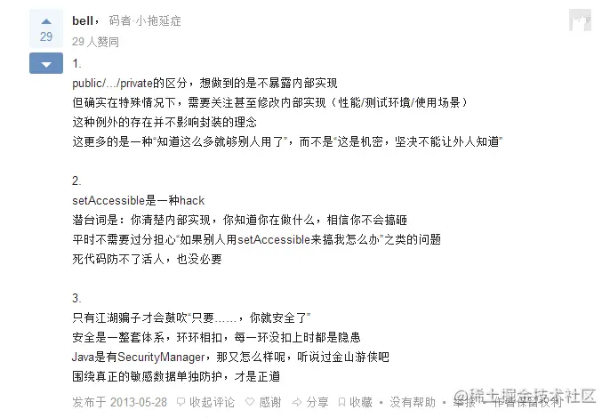

## 反射源码解析

我们跟进Method的invoke方法，分为两步，一是语言访问级别是否为重写，如果不是重写则调用Reflection的quickCheckMemberAccess方法，即通过Modifiers 判断是否具有访问权限，quickCheckMemberAccess方法主要是简单地判断 modifiers 是不是 public，如果不是的话就返回 false。所以 protected、private、default 修饰符都会返回 false,只有 public 都会返回 true。如果为false，则调用checkAccess方法。二是获取MethodAccessor对象，并调用其invoke方法。

```
public final class Method extends AccessibleObject implements GenericDeclaration, Member {   
     private volatile MethodAccessor methodAccessor; 
    //每个Java方法只有一个对应Method对象作为root，这个root不会暴露给用户，
    //而是每次通过反射获取Method对象时新创建的Method对象将root包装起来。
     private Method   root;

    @CallerSensitive 
    public Object invoke(Object obj, Object... args)throws IllegalAccessException, IllegalArgumentException,InvocationTargetException
    {
        if (!override) {
            if (!Reflection.quickCheckMemberAccess(clazz, modifiers)) {
                Class<?> caller = getCallerClass();
                checkAccess(caller, clazz, obj, modifiers);
            }
        }
        MethodAccessor ma = methodAccessor;
        //在第一次调用一个实际Java方法应该的Method对象的invoke方法之前
        //实现调用逻辑的MethodAccessor对象还没有创建
        //等到第一次调用时才创建MethodAccessor，并通过该MethodAccessor.invoke真正完成反射调用
        if (ma == null) {
            ma = acquireMethodAccessor();
        }
        //invoke并不是自己实现的反射调用逻辑，而是委托给sun.reflect.MethodAccessor来处理
        return ma.invoke(obj, args);
    } 

    ...

     private MethodAccessor acquireMethodAccessor() {
        MethodAccessor tmp = null;
        if (root != null) tmp = root.getMethodAccessor();
        if (tmp != null) {
            methodAccessor = tmp;
        } else {
            //调用ReflectionFactory的newMethodAccessor方法，见下
            tmp = reflectionFactory.newMethodAccessor(this);
            //更新root，以便下次直接使用
            setMethodAccessor(tmp);
        }
        return tmp;
    }

    ...

     void setMethodAccessor(MethodAccessor accessor) {
        methodAccessor = accessor;
        // Propagate up
        if (root != null) {
            root.setMethodAccessor(accessor);
        }
    }
复制代码
```

Reflection类：

```
public static boolean quickCheckMemberAccess(Class<?> memberClass,
                                                 int modifiers)
{
    return Modifier.isPublic(getClassAccessFlags(memberClass) & modifiers);
} 复制代码
```

ReflectionFactory类：

```
private static boolean noInflation = false;
//选择java版还是C语言版的阈值
private static int inflationThreshold = 15;

public MethodAccessor newMethodAccessor(Method var1) {
        checkInitted();
        if (noInflation) {
            //java版
            return (new MethodAccessorGenerator()).generateMethod(var1.getDeclaringClass(), var1.getName(), var1.getParameterTypes(), var1.getReturnType(), var1.getExceptionTypes(), var1.getModifiers());
        } else {
            //c语言版
            NativeMethodAccessorImpl var2 = new NativeMethodAccessorImpl(var1);
            DelegatingMethodAccessorImpl var3 = new DelegatingMethodAccessorImpl(var2);
            var2.setParent(var3);
            return var3;
        }
    }复制代码
```

如上述代码所示，实际的MethodAccessor实现有两个版本，一个是Java实现的，另一个是native code实现的。Java实现的版本在初始化时需要较多时间，但长久来说性能较好；native版本正好相反，启动时相对较快，但运行时间长了之后速度就比不过Java版了。这是HotSpot的优化方式带来的性能特性，同时也是许多虚拟机的共同点：跨越native边界会对优化有阻碍作用，它就像个黑箱一样让虚拟机难以分析也将其内联，于是运行时间长了之后反而是托管版本的代码更快些。

为了权衡两个版本的性能，Sun的JDK使用了“inflation”的技巧：让Java方法在被反射调用时，开头若干次使用native版，等反射调用次数超过阈值时则生成一个专用的MethodAccessor实现类，生成其中的invoke()方法的字节码，以后对该Java方法的反射调用就会使用Java版。
Sun的JDK是从1.4系开始采用这种优化的，主要作者是[Ken Russell](https://link.juejin.cn?target=http%3A%2F%2Fblogs.sun.com%2Fkbr%2Fentry%2Fbrief_introduction)

### MethodAccessor的C语言实现(默认)

C语言版的MethodAccessor主要涉及这NativeMethodAccessorImpl和DelegatingMethodAccessorImpl两个类，而DelegatingMethodAccessorImpl是间接层，不是太重要，就不贴代码啦。以下是NativeMethodAccessorImpl的代码，核心是invoke方法：

```
class NativeMethodAccessorImpl extends MethodAccessorImpl {
    private final Method method;
    private DelegatingMethodAccessorImpl parent;
    private int numInvocations;

    NativeMethodAccessorImpl(Method var1) {
        this.method = var1;
    }

    public Object invoke(Object var1, Object[] var2) throws IllegalArgumentException, InvocationTargetException {
        if (++this.numInvocations > ReflectionFactory.inflationThreshold()) {
            MethodAccessorImpl var3 = (MethodAccessorImpl)(new MethodAccessorGenerator()).generateMethod(this.method.getDeclaringClass(), this.method.getName(), this.method.getParameterTypes(), this.method.getReturnType(), this.method.getExceptionTypes(), this.method.getModifiers());
            this.parent.setDelegate(var3);
        }

        return invoke0(this.method, var1, var2);
    }

    void setParent(DelegatingMethodAccessorImpl var1) {
        this.parent = var1;
    }

    private static native Object invoke0(Method var0, Object var1, Object[] var2);
}复制代码
```

每次NativeMethodAccessorImpl.invoke()方法被调用时，都会增加一个调用次数计数器，看超过阈值没有；一旦超过，则调用MethodAccessorGenerator.generateMethod()来生成Java版的MethodAccessor的实现类，并且改变DelegatingMethodAccessorImpl所引用的MethodAccessor为Java版。后续经由DelegatingMethodAccessorImpl.invoke()调用到的就是Java版的实现了。

### MethodAccessor的Java实现

```
 return (new MethodAccessorGenerator()).generateMethod(var1.getDeclaringClass(), var1.getName(), var1.getParameterTypes(), var1.getReturnType(), var1.getExceptionTypes(), var1.getModifiers());复制代码
```

Java的MethodAccessor主要涉及的是MethodAccessorGenerator类，具体代码超长，只截取了部分代码，主要有三个方法，直接就是上述的generateMethod方法，代码如下：

```
public MethodAccessor generateMethod(Class var1, String var2, Class[] var3, Class var4, Class[] var5, int var6) {
        return (MethodAccessor)this.generate(var1, var2, var3, var4, var5, var6, false, false, (Class)null);
    }
 private MagicAccessorImpl generate(final Class var1, String var2, Class[] var3, Class var4, Class[] var5, int var6, boolean var7, boolean var8, Class var9) {
        ByteVector var10 = ByteVectorFactory.create();
        this.asm = new ClassFileAssembler(var10);
        this.declaringClass = var1;
        this.parameterTypes = var3;
        this.returnType = var4;
        this.modifiers = var6;
        this.isConstructor = var7;
        this.forSerialization = var8;
        this.asm.emitMagicAndVersion();
        short var11 = 42;
        boolean var12 = this.usesPrimitiveTypes();
        if (var12) {
            var11 = (short)(var11 + 72);
        }

        if (var8) {
            var11 = (short)(var11 + 2);
        }

        var11 += (short)(2 * this.numNonPrimitiveParameterTypes());
        this.asm.emitShort(add(var11, (short)1));
        final String var13 = generateName(var7, var8);
        this.asm.emitConstantPoolUTF8(var13);
        this.asm.emitConstantPoolClass(this.asm.cpi());
        this.thisClass = this.asm.cpi();
        if (var7) {
            if (var8) {
                this.asm.emitConstantPoolUTF8("sun/reflect/SerializationConstructorAccessorImpl");
            } else {
                this.asm.emitConstantPoolUTF8("sun/reflect/ConstructorAccessorImpl");
            }
        } else {
            this.asm.emitConstantPoolUTF8("sun/reflect/MethodAccessorImpl");
        }

        this.asm.emitConstantPoolClass(this.asm.cpi());
        this.superClass = this.asm.cpi();
        this.asm.emitConstantPoolUTF8(getClassName(var1, false));
        this.asm.emitConstantPoolClass(this.asm.cpi());
        this.targetClass = this.asm.cpi();
        short var14 = 0;
        if (var8) {
            this.asm.emitConstantPoolUTF8(getClassName(var9, false));
            this.asm.emitConstantPoolClass(this.asm.cpi());
            var14 = this.asm.cpi();
        }

        this.asm.emitConstantPoolUTF8(var2);
        this.asm.emitConstantPoolUTF8(this.buildInternalSignature());
        this.asm.emitConstantPoolNameAndType(sub(this.asm.cpi(), (short)1), this.asm.cpi());
        if (this.isInterface()) {
            this.asm.emitConstantPoolInterfaceMethodref(this.targetClass, this.asm.cpi());
        } else if (var8) {
            this.asm.emitConstantPoolMethodref(var14, this.asm.cpi());
        } else {
            this.asm.emitConstantPoolMethodref(this.targetClass, this.asm.cpi());
        }

        this.targetMethodRef = this.asm.cpi();
        if (var7) {
            this.asm.emitConstantPoolUTF8("newInstance");
        } else {
            this.asm.emitConstantPoolUTF8("invoke");
        }

        this.invokeIdx = this.asm.cpi();
        if (var7) {
            this.asm.emitConstantPoolUTF8("([Ljava/lang/Object;)Ljava/lang/Object;");
        } else {
            this.asm.emitConstantPoolUTF8("(Ljava/lang/Object;[Ljava/lang/Object;)Ljava/lang/Object;");
        }

        this.invokeDescriptorIdx = this.asm.cpi();
        this.nonPrimitiveParametersBaseIdx = add(this.asm.cpi(), (short)2);

        for(int var15 = 0; var15 < var3.length; ++var15) {
            Class var16 = var3[var15];
            if (!isPrimitive(var16)) {
                this.asm.emitConstantPoolUTF8(getClassName(var16, false));
                this.asm.emitConstantPoolClass(this.asm.cpi());
            }
        }

        this.emitCommonConstantPoolEntries();
        if (var12) {
            this.emitBoxingContantPoolEntries();
        }

        if (this.asm.cpi() != var11) {
            throw new InternalError("Adjust this code (cpi = " + this.asm.cpi() + ", numCPEntries = " + var11 + ")");
        } else {
            this.asm.emitShort((short)1);
            this.asm.emitShort(this.thisClass);
            this.asm.emitShort(this.superClass);
            this.asm.emitShort((short)0);
            this.asm.emitShort((short)0);
            this.asm.emitShort((short)2);
            this.emitConstructor();
            this.emitInvoke();
            this.asm.emitShort((short)0);
            var10.trim();
            final byte[] var17 = var10.getData();
            return (MagicAccessorImpl)AccessController.doPrivileged(new PrivilegedAction<MagicAccessorImpl>() {
                public MagicAccessorImpl run() {
                    try {
                        return (MagicAccessorImpl)ClassDefiner.defineClass(var13, var17, 0, var17.length, var1.getClassLoader()).newInstance();
                    } catch (InstantiationException var2) {
                        throw (InternalError)(new InternalError()).initCause(var2);
                    } catch (IllegalAccessException var3) {
                        throw (InternalError)(new InternalError()).initCause(var3);
                    }
                }
            });
        }
    } 
private static synchronized String generateName(boolean var0, boolean var1) {
        int var2;
        if (var0) {
            if (var1) {
                var2 = ++serializationConstructorSymnum;
                return "sun/reflect/GeneratedSerializationConstructorAccessor" + var2;
            } else {
                var2 = ++constructorSymnum;
                return "sun/reflect/GeneratedConstructorAccessor" + var2;
            }
        } else {
            var2 = ++methodSymnum;
            return "sun/reflect/GeneratedMethodAccessor" + var2;
        }
    }复制代码
```

去阅读源码的话，可以看到MethodAccessorGenerator是如何一点点把Java版的MethodAccessor实现类生产出来的，其实就是一个逐步解析的过程。

```
此时要注意的是最后的“sun/reflect/GeneratedMethodAccessor”+var2的代码。
```

### 例子

以上空说无用，太干涩，咱来个例子。

```
public class Foo {

public void foo(String name) {       
     System.out.println("Hello, " + name); 
   }
}复制代码
public class test {    
    public static void main(String[] args) {  
          try {          
                  Class<?> clz = Class.forName("com.eastrobot.reflect.Foo");      
                  Object o = clz.newInstance();  
                  Method m = clz.getMethod("foo", String.class);    
                  for (int i = 0; i < 17; i++) {        
                        m.invoke(o, Integer.toString(i));      
                  }       
         } catch (Exception e) {
         } 
   }
}复制代码
```

除了上述代码，还需要在idea配置相关的运行参数，添加-XX:+TraceClassLoading参数，其为要求打印加载类的监控信息。

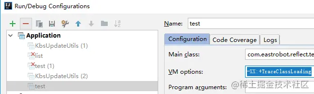

我们先用上述的例子执行下，运行结果如下，前面十五次是正常的，到第16次的时候，出现了很多打印信息，我已将一行标红，“GeneratedMethodAccessor1”，这其实就是上面说的Java版获取MethodAccessorGenerator的最后一行，1为自增参数。当第17次的时候，就不会用Java版的方式重新获取，而是直接复用啦。

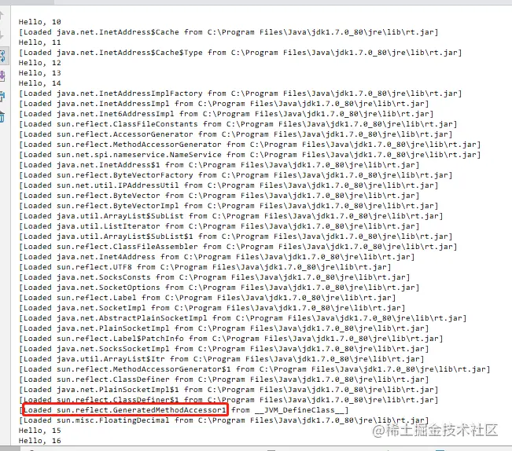

### 

## 结语


作者：学习Java的小姐姐
链接：https://juejin.cn/post/6844904056037572622
来源：稀土掘金
著作权归作者所有。商业转载请联系作者获得授权，非商业转载请注明出处。

## 参考资料

[Java反射详细介绍](https://link.juejin.cn?target=https%3A%2F%2Fyq.aliyun.com%2Farticles%2F620984%3Futm_content%3Dm_1000010869%23)

[Java反射中getDeclaredField和getField的区别](https://link.juejin.cn?target=https%3A%2F%2Fwww.cnblogs.com%2FEdinburghOne%2Fp%2F9292859.html)

[java反射的使用场合和作用、及其优缺点](https://link.juejin.cn?target=https%3A%2F%2Fwww.cnblogs.com%2FYanss%2Fp%2F11690667.html)

[反射是否真的会让你的程序性能降低?](https://link.juejin.cn?target=https%3A%2F%2Fwww.cnblogs.com%2Fmarvin%2Fp%2FShallWeUseReflect.html)

[深入解析Java反射（1） - 基础](https://link.juejin.cn?target=https%3A%2F%2Fwww.sczyh30.com%2Fposts%2FJava%2Fjava-reflection-1%2F)

[关于反射调用方法的一个log ](https://link.juejin.cn?target=https%3A%2F%2Fwww.iteye.com%2Fblog%2Frednaxelafx-548536)

[反射进阶，编写反射代码值得注意的诸多细节](https://link.juejin.cn?target=https%3A%2F%2Fblog.csdn.net%2Fbriblue%2Farticle%2Fdetails%2F76223206)

