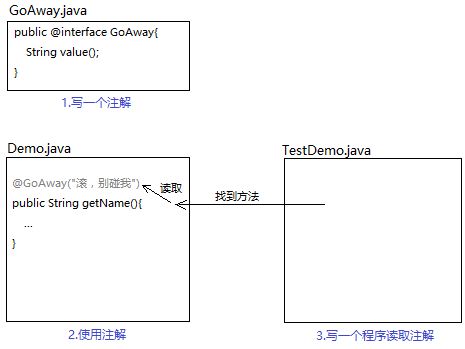
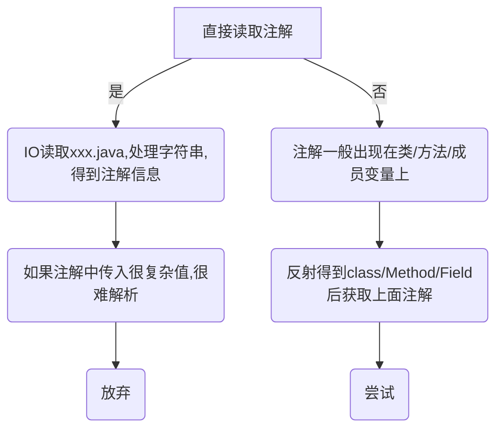
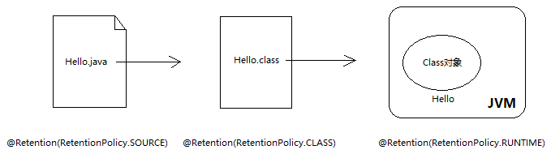

# 注解（上）

内容介绍：

- 注解的作用
- 注解的本质
- 反射注解信息
- 元注解
- 属性的数据类型及特别的属性：value 和数组

## 一、注解的作用

### （一）格式

```java
public @interface 注解名称{
    属性列表;
}
```

### （二）分类

大致分为三类：自定义注解、JDK 内置注解、还有第三方框架提供的注解。

自定义注解就是我们自己写的注解。JDK 内置注解，比如 `@Override` 检验方法重写，`@Deprecated` 标识方法过期等。第三方框架定义的注解比如 SpringMVC 的 `@Controller` 等。

### （三）使用位置

注解常常出现在类、方法、成员变量、形参位置。当然还有其他位置，这里不提及。

### （四）作用

如果说注释是写给人看的，那么注解就是写给程序看的。它更像一个标签，贴在一个类、一个方法或者字段上。它的目的是为当前读取该注解的程序提供判断依据。比如程序只要读到加了 `@Test` 的方法，就知道该方法是待测试方法，又比如 `@Before` 注解，程序看到这个注解，就知道该方法要放在 `@Test` 方法之前执行。

### （五）级别

注解和类、接口、枚举是同一级别的。

------

## 二、注解的本质

`@interface` 和 `interface` 相似，猜测注解的本质是一个接口，验证如下：

```java
package com.gjxaiou;

public @interface MyAnnotation {
}
```

编译后得到字节码文件，然后反编译 MyAnnotation.class 结果如下：

```java
// 先编译，然后反编译结果如下
> javac MyAnnotation.java
> javap MyAnnotation.class
Compiled from "MyAnnotation.java"
public interface com.gjxaiou.MyAnnotation extends java.lang.annotation.Annotation {
}
```

`@interface` 变成了 `interface`，而且自动继承了 `Annotation` 接口，既然确实是个接口，那么我们自然可以在里面写方法：

```java
package com.gjxaiou;

public @interface MyAnnotation {
    // 省略接口方法默认修饰符 public abstract
    String getvalue();
}
```

虽说注解的本质是接口，但是仍然有很多怪异的地方，比如使用注解时，我们竟然可以给 getValue 赋值：

```java
package com.gjxaiou;

@MyAnnotation(getvalue = "annotation on class")
public class Demo {
    @MyAnnotation(getvalue = "annotation on field")
    public String name;

    @MyAnnotation(getvalue = "annotation on method")
    public void hello() {
    }
}
```

你见过给方法赋值的操作吗？（不是给方法传参）。虽然这里的 `getValue` 可能不是指 `getValue()`，底层或许是 `getValue()` 返回的一个同名变量。但不管怎么说，还是太怪异了。所以**在注解里，类似于 String getValue() 这种，被称为“属性”**。给属性赋值显然听起来好接受多了。

另外，我们还可以为属性指定默认值：

```java
package com.gjxaiou;

public @interface MyAnnotation {
    String getvalue() default "no description";
}
```

```java
package com.gjxaiou;

@MyAnnotation(getvalue = "annotation on class")
public class Demo {
    @MyAnnotation(getvalue = "annotation on field")
    public String name;

    @MyAnnotation(getvalue = "annotation on method")
    public void hello() {
    }

    @MyAnnotation()
    public void work() {
    }
}
```

当没有赋值时，属性将使用默认值，比如上面的 `work()`，它的 getValue 就是 `"no description"`。

基于以上差异，以后还是把注解单独归为一类，不要当成接口使用。

------

## 三、反射注解信息

注解就像一个标签，是贴在程序代码上供另一个程序读取的。所以三者关系是：



**只要用到注解，必然有三角关系：定义注解，使用注解，读取注解。**

所以，接下来我们写一个程序读取注解。读取注解的思路是：



反射获取注解信息：

```java
package com.gjxaiou;

import java.lang.reflect.Field;
import java.lang.reflect.Method;

public class AnalysisAnnotation {
    public static void main(String[] args) throws NoSuchFieldException, NoSuchMethodException {
        Class<Demo> clazz = Demo.class;

        // 获取类上注解
        MyAnnotation myAnnotation = clazz.getAnnotation(MyAnnotation.class);
        System.out.println(myAnnotation.getvalue());

        // 获取成员变量上的注解
        Field name = clazz.getField("name");
        MyAnnotation annotationOnField = name.getAnnotation(MyAnnotation.class);
        System.out.println(annotationOnField.getvalue());

        // 获取方法上的注解
        Method hello = clazz.getMethod("hello");
        MyAnnotation annotationOnMethod = hello.getAnnotation(MyAnnotation.class);
        System.out.println(annotationOnMethod.getvalue());

        // 获取默认方法上的注解
        Method work = clazz.getMethod("work");
        MyAnnotation annotationOnDefault = work.getAnnotation(MyAnnotation.class);
        System.out.println(annotationOnDefault.getvalue());
    }
}
```

我们发现，Class、Method、Field 对象都有个 `getAnnotation()`，可以获取各自位置的注解信息。

但是控制台提示“空指针异常”，IDEA 提示我们：Annotation 'MyAnnotation.class' is not retained for reflective。直译的话就是：注解 MyAnnotation 并没有为反射保留。

这是因为注解其实有所谓“保留策略”的说法。大家学习 JSP 时，应该学过 `<!-- -->` 和 `<%-- -->` 的区别：前者可以在浏览器检查网页源代码时看到，而另一个在服务器端输出时就被抹去了。同样的，注解通过保留策略，控制自己可以保留到哪个阶段。保留策略也是通过注解实现，它属于元注解，也叫元数据。

程序输出结果为：

```java
annotation on class
annotation on field
annotation on method
no description
```

## 四、元注解

元注解，就是加在注解上的注解。常用的就是：

- `@Documented`：用于制作文档，不是很重要，忽略便是

- `@Target`：加在注解上，**限定该注解的使用位置**，值可以多选，不写则默认各个位置都是可以的。如果需要限定注解的使用位置，可以在自定义的注解上使用该注解。可选的值详见 java.lang.annotation.ElementType 枚举类中。

- `@Retention`：注解的保留策略，值有三种：SOURCE/ClASS/RUNTIME



- 注解主要被反射读取
- **反射只能读取内存中的字节码信息**
- RetentionPolicy.CLASS 指的是保留到字节码文件，它在磁盘内，而不是内存中。虚拟机将字节码文件加载进内存后注解会消失，**要想被反射读取，保留策略只能用 RUNTIME，即运行时仍可读取**

```java
package com.gjxaiou;

import java.lang.annotation.*;

@Retention(RetentionPolicy.RUNTIME)
@Documented
@Target({ElementType.FIELD,ElementType.METHOD,ElementType.TYPE})
public @interface MyAnnotation {

    String getvalue() default "no description";
}
```

注意，`work()` 反射得到的注解信息是：no description。就是 MyAnnotion 中 getValue 的默认值。

**但是，注解的读取并不只有反射一种途径。比如 @Override，它由编译器读取（你写完代码 ctrl+s 时就编译了），而编译器只是检查语法错误，此时程序尚未运行。所以，我猜 @Override 的保留策略肯定不是 RUNTIME：**，源码中确实保留策略为 SOURCE，仅仅是源码阶段，编译成.class 文件后就消失

```java
package java.lang;

import java.lang.annotation.*;

@Target(ElementType.METHOD)
@Retention(RetentionPolicy.SOURCE)
public @interface Override {
}
```

## 五、属性的数据类型及特别的属性：value 和数组

### （一）属性的数据类型

- 八种基本数据类型
- String
- 枚举
- Class
- 注解类型
- 以上类型的一维数组

```java
package com.gjxaiou;

import java.lang.annotation.Retention;
import java.lang.annotation.RetentionPolicy;

@Retention(RetentionPolicy.RUNTIME)
public @interface MyAnnotation1 {
    // 八种基本数据类型
    int intValue();

    long longValue();
    //......

    // String
    String name();

    // 枚举
    CityEnum citeName();

    // Class 类型
    Class clazz();

    // 注解
    MyAnnotation2 annotation2();

    // 以上几种对应的一维数组
    int[] intValueArray();

    String[] names();
}

enum CityEnum {
    BEIJING,
    NANJING
}
```

```java
package com.gjxaiou;

public @interface MyAnnotation2 {
}
```

使用赋值示例：

```java
package com.gjxaiou;

@MyAnnotation1(
        // 八种数据类型
        intValue = 1,
        longValue = 0L,

        // String
        name = "annotation on class",
        // 枚举
        citeName = CityEnum.BEIJING,
        // class
        clazz = Demo2.class,
        // 注解
        annotation2 = @MyAnnotation2,
        // 一维数组
        intValueArray = {1, 2},
        names = {"ok", "fine"}
)
public class Demo2 {
}
```

### （二）value 属性

如果注解的属性只有一个，且叫 value，那么使用该注解时，可以不用指定属性名，因为默认就是给 value 赋值：

```java
package com.gjxaiou;

import java.lang.annotation.Retention;
import java.lang.annotation.RetentionPolicy;

@Retention(RetentionPolicy.RUNTIME)
public @interface MyAnnotation3 {
    String value() default "no description";
}
```

使用注解：

如果将上面注解中的 value 换为其他，则下面使用注解的时候，赋值必须指定注解中的属性值（哪怕只有一个），否则会报找不到方法 value()。

```java
package com.gjxaiou;

@MyAnnotation3("annotation on class")
public class Demo {

    @MyAnnotation3("annotation on field")
    public String name;

    @MyAnnotation3("annotation on method")
    public void hello() {
    }

    @MyAnnotation3("annotation on defaultMethod")
    public void defaultMethod() {
    }
}
```

验证注解

```java
package com.gjxaiou;

import java.lang.reflect.Field;
import java.lang.reflect.Method;

public class TestDemo {
    public static void main(String[] args) throws NoSuchFieldException, NoSuchMethodException {
        Class<Demo> clazz = Demo.class;
        // 获取类上注解
        MyAnnotation3 annotationClass = clazz.getAnnotation(MyAnnotation3.class);
        System.out.printf( annotationClass.value());

        // 获取成员变量上注解
        Field name = clazz.getField("name");
        MyAnnotation3 annotationField = name.getAnnotation(MyAnnotation3.class);
        System.out.printf( annotationField.value());

        // 获取方法上注解
        Method hello = clazz.getMethod("hello");
        MyAnnotation3 annotationMethod = hello.getAnnotation(MyAnnotation3.class);
        System.out.printf( annotationMethod.value());

        // 获取默认注解
        Method defaultMethod = clazz.getMethod("defaultMethod");
        MyAnnotation3 annotationDefaultMethod = defaultMethod.getAnnotation(MyAnnotation3.class);
        System.out.println(annotationDefaultMethod.value());
    }
}
```

但是注解的属性如果有多个，无论是否叫 value，都必须写明属性的对应关系，且赋值的时候必须所有属性全部赋值

```java
package com.gjxaiou;

import java.lang.annotation.Retention;
import java.lang.annotation.RetentionPolicy;

@Retention(RetentionPolicy.RUNTIME)
public @interface MyAnnotation3 {
    String value() default "no description";

    int num();
}
```

使用注解：

```java
package com.gjxaiou;

@MyAnnotation3(value = "annotation on class", num = 1)
public class Demo {

    @MyAnnotation3(value = "annotation on field", num = 2)
    public String name;

    @MyAnnotation3(value = "annotation on method", num = 3)
    public void hello() {
    }

    @MyAnnotation3(value = "annotation on method", num = 3)
    public void defaultMethod() {
    }
}
```

### （三）数组属性

如果数组的元素只有一个，可以省略{}：

------

小结

- 注解就像标签，是程序判断执行的依据。比如，程序读到 @Test 就知道这个方法是待测试方法，而 @Before 的方法要在测试方法之前执行
- 注解需要三要素：定义、使用、读取并执行
- 注解分为自定义注解、JDK 内置注解和第三方注解（框架）。自定义注解一般要我们自己定义、使用、并写程序读取，而 JDK 内置注解和第三方注解我们只要使用，定义和读取都交给它们
- 大多数情况下，三角关系中我们只负责使用注解，无需定义和执行，框架会将**注解类**和**读取注解的程序**隐藏起来，除非阅读源码，否则根本看不到。**平时见不到定义和读取的过程，光顾着使用注解，久而久之很多人就忘了注解如何起作用了！**


# 注解（下）

[上篇](https://zhuanlan.zhihu.com/p/60941426)讲了什么是注解，以及注解的简单使用，这篇我们一起用注解+反射模拟几个框架，探讨其中的运行原理。

内容介绍：

- 自定义 Junit 框架
- 山寨 JPA

------

## （一）自定义 Junit 框架

**用到注解的地方，必然存在三角关系**，并且别忘了设置保留策略为 RetentionPolicy.RUNTIME。代码示例如下：


MyBefore 注解

```java
@Retention(RetentionPolicy.RUNTIME)
@Target(ElementType.METHOD)
public @interface MyBefore {
}
```

MyTest 注解

```java
@Retention(RetentionPolicy.RUNTIME)
@Target(ElementType.METHOD)
public @interface MyTest {
}
```

MyAfter 注解

```java
@Retention(RetentionPolicy.RUNTIME)
@Target(ElementType.METHOD)
public @interface MyAfter {
}
```

EmployeeDAOTest

```java
//EmployeeDAO的测试类
public class EmployeeDAOTest {
	@MyBefore
	public void init() {
		System.out.println("初始化...");
	}

	@MyAfter
	public void destroy() {
		System.out.println("销毁...");
	}

	@MyTest
	public void testSave() {
		System.out.println("save...");
	}

	@MyTest
	public void testDelete() {
		System.out.println("delete...");
	}
}
```

MyJunitFrameWork

```java
package com.gjxaiou.inner;

import java.lang.reflect.Method;
import java.util.ArrayList;
import java.util.List;

public class MyJunitFrameWork {
    public static void main(String[] args) throws Exception {
        // 1.先找到测试类的字节码：EmployeeDAOTest
        Class<EmployeeDAOTest> clazz = EmployeeDAOTest.class;

        Object obj = clazz.newInstance();
        // 2.获取EmployeeDAOTest类中所有的公共方法
        Method[] methods = clazz.getMethods();

        // 3.迭代出每一个Method对象，判断哪些方法上使用了@MyBefore/@MyAfter/@MyTest注解
        List<Method> mybeforeList = new ArrayList<>();
        List<Method> myAfterList = new ArrayList<>();
        List<Method> myTestList = new ArrayList<>();
        for (Method method : methods) {
            if (method.isAnnotationPresent(MyBefore.class)) {
                // 存储使用了@MyBefore注解的方法对象
                mybeforeList.add(method);
            } else if (method.isAnnotationPresent(MyTest.class)) {
                // 存储使用了@MyTest注解的方法对象
                myTestList.add(method);
            } else if (method.isAnnotationPresent(MyAfter.class)) {
                // 存储使用了@MyAfter注解的方法对象
                myAfterList.add(method);
            }
        }

        // 执行方法测试
        for (Method testMethod : myTestList) {
            // 先执行@MyBefore的方法
            for (Method beforeMethod : mybeforeList) {
                beforeMethod.invoke(obj);
            }

            // 测试方法
            testMethod.invoke(obj);

            // 最后执行@MyAfter的方法
            for (Method afterMethod : myAfterList) {
                afterMethod.invoke(obj);
            }
        }
    }
}
```

执行结果：

```java
初始化...
save...
销毁...
初始化...
delete...
销毁...
```


## （二）山寨 JPA

要写山寨 JPA 需要两个技能：注解+反射。

注解已经学过了，反射还有一个进阶内容，之前那篇反射文章里没有提到。至于是什么内容，一两句话说不清楚。慢慢来吧。

首先，要跟大家介绍泛型中几个定义（记住最后一个）：

- `ArrayList<E>` 中的 E 称为**类型参数变量**；
- `ArrayList<Integer>` 中的 Integer 称为实际类型参数；
- 整个 `ArrayList<E>` 称为泛型类型；
- **整个 `ArrayList<Integer>` 称为参数化的类型 ParameterizedType**；

好，接下来看这个问题：

```java
class A<T>{
	public A(){
               /*
                我想在这里获得子类B、C传递的实际类型参数的Class对象
                class java.lang.String/class java.lang.Integer
               */
	}
}

class B extends A<String>{

}

class C extends A<Integer>{

}
```

我先帮大家排除一个错误答案：直接 T.class 是错误的。请先看下面代码：

```java
public class Test {
	public static void main(String[] args) {
		new B();
	}
}

class A<T>{
	public A(){
                //this是谁？A还是B？
		Class clazz = this.getClass();
		System.out.println(clazz.getName());
	}
}

class B extends A<String>{

}
```

clazz.getName()打印的是 B。因为从头到尾，我们 new 的是 B，这个 Demo 里至始至终只初始化了一个对象，所以 this 指向 B。

好的，到了这里，我们迈出了第一步：在泛型父类中得到了子类的 Class 对象！

我们再来分析：

```java
class A<T>{
	public A(){
                //clazz是B.class
		Class clazz = this.getClass();
	}
}

class B extends A<String>{

}
```

现在已经在 `class A<T>` 中得到 B 类的 Class 对象。而想要得到的是父类 `A<T>` 中泛型的 Class 对象。且先不说泛型的 Class 对象，我们先考虑，如何获得通过子类 Class 对象获得父类 Class 对象？

查阅 JDK API 文档，发现调用 getGenericSuperclass() 就会返回泛型父类的 Class 对象。这非常符合我们的情况。试着打印一下：

> 该方法名直译为：带泛型的父类

```java
package com.gjxaiou.param;

import java.lang.reflect.Type;

public class Test {
    public static void main(String[] args) {
        new B();
    }
}

class A<T> {
    public A() {
        Class clazz = this.getClass();
        System.out.println(clazz.getName());

        // 得到父类（参数化类型），这一步相当于拿到 A<String>，父类及泛型
        Type genericSuperclass = clazz.getGenericSuperclass();
        System.out.println(genericSuperclass);
        System.out.println(genericSuperclass.getClass());
    }
}

class B extends A<String> {

}
```

输出结果为：

```java
com.gjxaiou.param.B
com.gjxaiou.param.A<java.lang.String>
class sun.reflect.generics.reflectiveObjects.ParameterizedTypeImpl
```

发现 `A<T>` 的 Class 对象是 ParameterizedType 的类型的。

暂不关心 Type、ParameterizedType 还有 Class 之间的继承关系，总之以我们多年的编码经验，子类对象的方法总是更多。所以毫不犹豫地向下转型：

果然多了好几个方法，还有个 getActualTypeArguments()，可以得到泛型参数~

```java
package com.gjxaiou.param;

import java.lang.reflect.ParameterizedType;
import java.lang.reflect.Type;

public class Test {
    public static void main(String[] args) {
        new B();
    }
}

class A<T> {
    public A() {
        Class clazz = this.getClass();
        System.out.println(clazz.getName());

        // 得到父类（参数化类型），这一步相当于拿到 A<String>，父类及泛型
        Type genericSuperclass = clazz.getGenericSuperclass();

        // 由于得到的对象本身就是 ParameterizedTypeImpl 类型，于是向下强转
        ParameterizedType superclass = (ParameterizedType) genericSuperclass;

        // 强转后，该方法返回值为所有泛型参数的 class 对象
        Type[] actualTypeArguments = superclass.getActualTypeArguments();

        // 由于 A 类只有一个泛型，所以直接取第一个元素得到子类传来的 T 的 Class 对象即可
        Class actualTypeArgument = (Class) actualTypeArguments[0];

        System.out.println(actualTypeArgument);
    }
}

class B extends A<String> {

}
```

结果为：

```java
com.gjxaiou.param.B
class java.lang.String
```

现在我们能在父类中得到子类继承时传来的泛型的 Class 对象。接下来正式开始编写山寨 JPA。


User

```java
package myJPA;

public class User {
	private String name;
	private Integer age;

	public User(String name, Integer age) {
		this.name = name;
		this.age = age;
	}

	public String getName() {

		return name;
	}

	public void setName(String name) {
		this.name = name;
	}

	public Integer getAge() {
		return age;
	}

	public void setAge(Integer age) {
		this.age = age;
	}
}
```


BaseDao<T>

```java
package myJPA;

import org.apache.commons.dbcp.BasicDataSource;
import org.springframework.jdbc.core.JdbcTemplate;

import java.lang.reflect.Field;
import java.lang.reflect.ParameterizedType;
import java.util.ArrayList;

public class BaseDao<T> {

	private static BasicDataSource datasource = new BasicDataSource();

	//静态代码块,设置连接数据库的参数
	static{
		datasource.setDriverClassName("com.mysql.jdbc.Driver");
		datasource.setUrl("jdbc:mysql://localhost:3306/test");
		datasource.setUsername("root");
		datasource.setPassword("123456");
	}

	//得到jdbcTemplate
	private JdbcTemplate jdbcTemplate = new JdbcTemplate(datasource);
	//泛型参数的Class对象
	private Class<T> beanClass;

	public BaseDao() {
		/*this指代子类
                  通过子类得到子类传给父类的泛型Class对象，假设是User.class
                */
		beanClass = (Class) ((ParameterizedType) this.getClass()
				.getGenericSuperclass())
				.getActualTypeArguments()[0];
	}

	public void add(T bean) {
		//得到User对象的所有字段
		Field[] declaredFields = beanClass.getDeclaredFields();

		//拼接sql语句，表名直接用POJO的类名
                //所以创建表时，请注意写成User，而不是t_user
		String sql = "insert into "
				+ beanClass.getSimpleName() + " values(";
		for (int i = 0; i < declaredFields.length; i++) {
			sql += "?";
			if (i < declaredFields.length - 1) {
				sql += ",";
			}
		}
		sql += ")";

		//获得bean字段的值（要插入的记录）
		ArrayList<Object> paramList = new ArrayList<>();
		for (int i = 0; i < declaredFields.length; i++) {
			try {
				declaredFields[i].setAccessible(true);
				Object o = declaredFields[i].get(bean);
				paramList.add(o);
			} catch (IllegalAccessException e) {
				e.printStackTrace();
			}
		}
		int size = paramList.size();
		Object[] params = paramList.toArray(new Object[size]);

		//传入sql语句模板和模板所需的参数，插入User
		int num = jdbcTemplate.update(sql, params);
		System.out.println(num);
	}
}
```


UserDao

```java
package myJPA;

public class UserDao extends BaseDao<User> {
	@Override
	public void add(User bean) {
		super.add(bean);
	}
}
```


测试类

```java
package myJPA;

public class TestUserDao {
	public static void main(String[] args) {
		UserDao userDao = new UserDao();
		User user = new User("hst", 20);
		userDao.add(user);
	}
}
```


测试结果


桥多麻袋！这个和 JPA 有半毛钱关系啊！上一篇的注解都没用上！！

不错，细心的朋友肯定已经发现，我的代码实现虽然不够完美，但是最让人蛋疼的还是：要求数据库表名和 POJO 的类名一致，不能忍...

于是，我决定抄袭一下 JPA 的思路，给我们的 User 类加一个 Table 注解，用来告诉程序这个 POJO 和数据库哪张表对应：


@Table 注解

```java
import java.lang.annotation.ElementType;
import java.lang.annotation.Retention;
import java.lang.annotation.RetentionPolicy;
import java.lang.annotation.Target;

@Retention(RetentionPolicy.RUNTIME)
@Target(ElementType.TYPE)
public @interface Table {
	String value();
}
```


新的 User 类（类名加了@Table 注解）

```java
package myJPA;

@Table("t_user")
public class User {
	private String name;
	private Integer age;

	public User(String name, Integer age) {
		this.name = name;
		this.age = age;
	}

	public String getName() {

		return name;
	}

	public void setName(String name) {
		this.name = name;
	}

	public Integer getAge() {
		return age;
	}

	public void setAge(Integer age) {
		this.age = age;
	}

}
```


新的测试类

```java
package myJPA;

import org.apache.commons.dbcp.BasicDataSource;
import org.springframework.jdbc.core.JdbcTemplate;

import java.lang.reflect.Field;
import java.lang.reflect.ParameterizedType;
import java.util.ArrayList;

public class BaseDao<T> {

	private static BasicDataSource datasource = new BasicDataSource();

	//静态代码块,设置连接数据库的参数
	static{
		datasource.setDriverClassName("com.mysql.jdbc.Driver");
		datasource.setUrl("jdbc:mysql://localhost:3306/test");
		datasource.setUsername("root");
		datasource.setPassword("123456");
	}

	//得到jdbcTemplate
	private JdbcTemplate jdbcTemplate = new JdbcTemplate(datasource);
	//泛型参数的Class对象
	private Class<T> beanClass;

	public BaseDao() {
		//得到泛型参数的Class对象，假设是User.class
		beanClass = (Class) ((ParameterizedType) this.getClass()
				.getGenericSuperclass())
				.getActualTypeArguments()[0];
	}

	public void add(T bean) {
		//得到User对象的所有字段
		Field[] declaredFields = beanClass.getDeclaredFields();

		//拼接sql语句，【表名从User类Table注解中获取】
		String sql = "insert into "
				+ beanClass.getAnnotation(Table.class).value() 
				+ " values(";
		for (int i = 0; i < declaredFields.length; i++) {
			sql += "?";
			if (i < declaredFields.length - 1) {
				sql += ",";
			}
		}
		sql += ")";

		//获得bean字段的值（要插入的记录）
		ArrayList<Object> paramList = new ArrayList<>();
		for (int i = 0; i < declaredFields.length; i++) {
			try {
				declaredFields[i].setAccessible(true);
				Object o = declaredFields[i].get(bean);
				paramList.add(o);
			} catch (IllegalAccessException e) {
				e.printStackTrace();
			}
		}
		int size = paramList.size();
		Object[] params = paramList.toArray(new Object[size]);

		//传入sql语句模板和模板所需的参数，插入User
		int num = jdbcTemplate.update(sql, params);
		System.out.println(num);
	}
}
```

这下真的是山寨 JPA 了~


# 注解

## 一、注解是什么？

java注解是在JDK5的时候引入的一种新特性。
注解（也可以称为[元数据](https://so.csdn.net/so/search?q=元数据&spm=1001.2101.3001.7020)）为在代码中添加信息提供了一种形式化的方法，使得在代码中任一时刻可以非常方便的使用这些数据。
注解类型定义了一种新的特殊接口类型，用 `@interface` 即可区分注解与普通接口声明。目前大部分框架都是通过使用注解简化代码提高编码效率

## 二、注解的作用

1. 提供信息给编译器：编译器可直接通过注解探测错误和警告信息，例如：@Override，@Deprecated
2. 编译阶段时的处理：软件工具可以用来利用注解信息生成代码、html文档或者做其他相应处理，例如：@Param，@Return，@See，@Author 用于生成javadoc 文档
3. 运行时的处理：某些注解可以在程序运行时接收代码的提取，但注解本身不是代码的一部分

## 三、注解定义

### 3.1 注解的本质

所有的注解本质上都是继承自 Annotation 接口。但是，手动定义一个接口继承 Annotation 接口无效的，需要通过 @interface 声明注解，Annotation 接口本身也不定义注解类型，只是一个普通的接口。

```java
public interface Annotation {  
    boolean equals(Object obj);
    int hashCode();
    String toString();
    /**
     *获取注解类型 
     */
    Class<? extends Annotation> annotationType();
}
```

来对比下 @interface 定义注解和继承 Annotation 接口

```java
public @interface TestAnnotation1 {
}
public interface TestAnnotation2 extends Annotation  {
}
```

通过使用 javap 指令对比两个文件的字节码，发现通过 @interface 定义注解，本质上就是继承 Annotation 接口。

```java
// javap -c TestAnnotation1.class
Compiled from "TestAnnotation1.java"                                                                 
public interface com.hncboy.corejava.annotation.TestAnnotation1 extends java.lang.annotation.Annotation {}

// javap -c TestAnnotation2.class
Compiled from "TestAnnotation2.java"                                                                 
public interface com.hncboy.corejava.annotation.TestAnnotation2 extends java.lang.annotation.Annotation {}
```

虽然本质上都是继承 Annotation 接口，但即使接口可以实现多继承，注解的定义仍然无法使用继承关键字来实现。

通过 @interface 定义注解后，该注解也不能继承其他的注解或接口，注解是不支持继承的，如下代码就会报错。

```java
public @interface TestAnnotation1 {
}
/** 错误的定义，注解不能继承注解 */
@interface TestAnnotation2 extends TestAnnotation1 {
}
/** 错误的定义，注解不能继承接口 */
@interface TestAnnotation3 extends Annotation {
}
```

虽然注解不支持继承其他注解或接口，但可以使用组合注解的方式来解决这个问题。如 @SpringBootApplication 就采用了组合注解的方式。

```java
@Target(ElementType.TYPE)
@Retention(RetentionPolicy.RUNTIME)
@Documented
@Inherited
@SpringBootConfiguration
@EnableAutoConfiguration
@ComponentScan(excludeFilters = { @Filter(type = FilterType.CUSTOM, classes = TypeExcludeFilter.class),
        @Filter(type = FilterType.CUSTOM, classes = AutoConfigurationExcludeFilter.class) })
public @interface SpringBootApplication {
    
}
```

## 3.2 注解的架构


注解的基本架构如图所示，先简单了解下该架构，后面会详细讲解。
该架构的左半部分为基本注解的组成，一个基本的注解包含了 @interface 以及 ElementType 和 RententionPolicy 这两个枚举类。
Annotation 和 ElementType 是一对多的关系
Annotation 和 RetentionPolicy 是一对一的关系
该架构的右半部分为 JDK 部分内置的标准注解及元注解。
标准注解：@Override、@Deprecated 等
元注解：@Documented、@Retention、@Target、@Inherited 等

## 3.3 注解的属性

注解的属性也称为成员变量，注解只有成员变量，没有方法。注解的成员变量在注解的定义中以“无形参的方法”形式来声明，其方法名定义了该成员变量的名字，其返回值定义了该成员变量的类型。

注解内的可使用的数据类型是有限制的，类型如下：

所有的基本类型（int，float，boolean 等）

- String
- Class
- enum（@Retention 中属性的类型为枚举）
- Annotation
- 以上类型的数组（@Target
  中属性类型为枚举类型的数组）

编译器对属性的默认值也有约束。首先，属性不能有不确定的的值。也就是说，属性要么具有默认值，要么在使用注解时提供属性的值。对于非基本类型的属性，无论是在源代码中声明时，或是在注解接口中定义默认值时，都不能使用 null 为其值。因此，为了绕开这个约束，我们需要自己定义一些特殊的值，例如空字符串或负数，来表示某个属性不存在。

通过一个案例来演示下注解可使用的数据类型及默认值。

```java
@interface Reference {
    boolean contain() default false;
}

enum Week {
    Monday, Tuesday, Wednesday, Thursday, Friday, Saturday, Sunday
}

public @interface TestAnnotation {

    /**
     * int 基本数据类型
     * @return
     */
    int type() default -1;

    /**
     * boolean 基本数据类型
     * @return
     */
    boolean status() default false;

    /**
     * String 类型
     * @return
     */
    String name() default "";

    /**
     * Class 类型
     * @return
     */
    Class<?> loadClass() default String.class;

    /**
     * 枚举类型
     * @return
     */
    Week today() default Week.Sunday;

    /**
     * 注解类型
     * @return
     */
    Reference reference() default @Reference(contain = true);

    /**
     * 枚举数组类型
     * @return
     */
    Week[] value();
}
```

## 四、组成

我们已经了解了注解的架构，先来定义一个简单的注解。

```java
@Target(ElementType.TYPE)
@Retention(RetentionPolicy.RUNTIME)
public @interface TestAnnotation {
}
```

### 4.1 ElementType

ElementType 枚举类型的常量为 Java 程序中可能出现注解的声明位置提供了简单的分类。这些常量用于 @Target 注解中。@Target 用于描述注解适用的范围，即注解能修饰的对象范围，通过 ElementType 的枚举常量表示。

先来看下 ElementType 该枚举类的代码。

```java
public enum ElementType {
    
    /**
     * 用于描述类、接口（包括注解类型）、枚举的定义
     */
    TYPE,

    /**
     * 用于描述成员变量、对象、属性（包括枚举常量）
     */
    FIELD,

    /**
     * 用户描述方法
     */
    METHOD,

    /**
     * 用于描述参数
     */
    PARAMETER,

    /**
     * 用于描述构造器
     */
    CONSTRUCTOR,

    /**
     * 用于描述局部变量
     */
    LOCAL_VARIABLE,

    /**
     * 用于描述注解的（元注解）
     */
    ANNOTATION_TYPE,

    /**
     * 用于描述包
     */
    PACKAGE,

    /*
     * 表示该注解能写在类型变量的声明语句中
     * @since 1.8
     */
    TYPE_PARAMETER,

    /**
     * 表示该注解能写在使用类型的任何语句中（声明语句、泛型和强制转换语句中的类型）
     * @since 1.8
     */
    TYPE_USE
}
```

因为 Annotation 和 ElementType 是一对多的关系，所以 @Target 中可以存放数组，表示多个范围，默认所有范围。

JDK8 之前，注解只能用于声明的地方，JDK8 中添加了 TYPE_PARAMETER 和 TYPE_USE 类型注解，可以应用于所有地方：泛型、父类、接口，异常、局部变量等。举个例子，定义一个 @AnyWhere 注解，Boy 接口和 Test 类。

```java
@Target({ElementType.TYPE_USE, ElementType.TYPE_PARAMETER})
@Retention(RetentionPolicy.RUNTIME)
public @interface AnyWhere {
}

public interface Boy {
}

public class Test<@AnyWhere T> extends @AnyWhere Object implements @AnyWhere Boy {

    private @AnyWhere T test1(@AnyWhere T t) throws @AnyWhere Exception {
        return t;
    }
    
    private void test2() {
        Test<Integer> test = new @AnyWhere Test<>();
        @AnyWhere List<@AnyWhere Integer> list = new ArrayList<>();
    }
}
```

### 4.2 RetentionPolicy

RetentionPolicy 枚举类型的常量用于保留注解的各种策略，即该注解的有效期。它们与 @Retention 注解类型一起使用，以指定保留注解的时间。RetentionPolicy 枚举的代码如下。

```java
public enum RetentionPolicy {
    /**
     * 表示该注解只存在于源码阶段，
     */
    SOURCE,

    /**
     * 表示该注解存在于源码阶段和编译后的字节码文件里
     */
    CLASS,

    /**
     * 表示该注解存在于源码阶段、编译后的字节码文件和运行时期，且注解的内容将会被 JVM 解释执行
     * 该范围的注解可通过反射获取到
     */
    RUNTIME
}
```

Annotation 和 RetentionPolicy 是一对一的关系，即每个注解只能有一种保留策略。

这三个枚举值是有等级关系的，SOURCE < CLASS < RUNTIME，即 RUNTIME 的有效范围是最大的，其次的是 CLASS，最小的范围是 SOURCE，默认的保留范围为 CLASS。

RUNTIME 范围使用于在运行期间通过反射的方式去获取注解。

CLASS 适用于编译时进行一些预处理操作。

SOURCE 适用于一些检查性的工作，或者生成一些辅助的代码，如 @Override 检查重写的方法，Lombok 中的 @Date、@Getter、@Setter 注解。

### 4.3 注解与反射

通过前面我们了解到，注解本质上继承 Annotation 接口，也就是说，Annotation 接口是所有注解的父接口。@Retention 的保留策略为 RetentionPolicy.RUNTIME 的情况下，我们可以通过反射获取注解的相关信息。Java 在 java.lang.reflect 包下也提供了对注解支持的接口。


主要来了解下 AnnotationElement 这个接口，其他接口都为该接口的子接口。该接口的对象代表 JVM 运行期间使用注解的类型（Class，Method，Field 等）。该包下的 Constructor 类、Method 类、Package 类和 Class 类等都实现了该接口。简单了解下该接口的部分函数。

```java
public interface AnnotatedElement {
    /**
     * default 方法是 Java8 新增的
     * 如果指定类型的注解存在该类型上，则返回 true，否则返回 false。此方法的主要目的是方便访问一些已知的注解
     *
     * @param annotationClass 该泛型参数表示所有继承了Annotation 接口的接口，也就是注解
     * @return 返回该类型上是否有指定的注解
     */
    default boolean isAnnotationPresent(Class<? extends Annotation> annotationClass) {
        return getAnnotation(annotationClass) != null;
    }
    
    /**
     * 根据注解的 Class 查询注解
     */
    <T extends Annotation> T getAnnotation(Class<T> annotationClass);
    
    /**
     * 返回该类型上的所有注解，包含继承的
     */
    Annotation[] getAnnotations();
    
    /**
     * 返回该类型上的所有注解，不包含继承的
     */
    Annotation[] getDeclaredAnnotations();
}
```

我们使用代码来测试下反射获取注解。定义两个注解，一个保留策略为 RetentionPolicy.RUNTIME，另一个为 RetentionPolicy.CLASS。创建 TestAnnotation 类测试注解，该类上使用了这两个注解。

```java
@Retention(RetentionPolicy.RUNTIME)
public @interface TestAnnotation1 {
    String status() default "hncboy";
}

@Retention(RetentionPolicy.CLASS)
public @interface TestAnnotation2 {
    String value() default "hncboy";
}

@TestAnnotation1(status = "hncboy2")
@TestAnnotation2("hncboy2")
public class TestAnnotation {

    public static void main(String[] args) throws ClassNotFoundException {
        Class<?> clazz = Class.forName("com.hncboy.corejava.annotation.TestAnnotation");
        // 获取该类的所有注解
        Annotation[] annotations = clazz.getAnnotations();
        for (Annotation annotation : annotations) {
            System.out.println(annotation.annotationType());
            System.out.println(annotation.toString());
        }
    }
}
```

输出结果如下，可见 TestAnnotation2 注解没有输出，因为 TestAnnotation2 注解类型是 RetentionPolicy.CLASS 的，所以用反射方法获取不到。这里还涉及到了注解的一个快捷方法，就是当注解里的属性名字定义为 value 时，可以在使用该注解时不指定属性名，上面的 @Target 注解和 @Retention 注解都属于这种情况，不过当注解里有多个属性时，那就必须指定属性名了。

interface com.hncboy.corejava.annotation.TestAnnotation1
@com.hncboy.corejava.annotation.TestAnnotation1()(status=hncboy2)

## 五、元注解

元注解即注解的注解且只能作用于注解上的注解，也就是说元注解负责其他注解的注解，而且只能用在注解上面。

JDK8 以前内置的元注解有 @Documented、@Retention、@Target、@Inherited 这四个，JDK 8 引入了 @Repeatable， 前面已经了解过了 @Target 和 @Retention，下面做一些简单的补充。

元注解的 @Target 都为 ElementType.ANNOTATION_TYPE，因为元注解只能应用于注解的注解。元注解在定义该注解的同时也可以直接使用该注解。

5.1 @Target
该注解用于定义注解能使用的范围，取值为 ElementType 枚举。

```java
复制代码
@Documented
@Retention(RetentionPolicy.RUNTIME)
@Target(ElementType.ANNOTATION_TYPE)
public @interface Target {
    /**
     * 返回可以应用注解类型的各种范围的枚举数组
     * 名字为 value 时可以省略属性名
     * @return
     */
    ElementType[] value();
}
```

使用方式：

```java
@Target(ElementType.METHOD)
@Target(value = ElementType.METHOD)
@Target({ElementType.METHOD, ElementType.TYPE})
@Target(value = {ElementType.METHOD, ElementType.TYPE})
```

### 5.2 @Retention

该注解定义注解的保留策略或者说定义注解的有效期，取值范围为 RetationPolicy 枚举。

```java
复制代码
@Documented
@Retention(RetentionPolicy.RUNTIME)
@Target(ElementType.ANNOTATION_TYPE)
public @interface Retention {
    /**
     * 返回保留策略
     * @return
     */
    RetentionPolicy value();
}
```

使用方式：

```java
@Retention(RetentionPolicy.RUNTIME)
@Retention(value = RetentionPolicy.RUNTIME)
```

### 5.3 @Documented

该注解的使用表示是否包含在生成的 javadoc 文档中。

```java
@Documented
@Retention(RetentionPolicy.RUNTIME)
@Target(ElementType.ANNOTATION_TYPE)
public @interface Documented {
}

```

举个例子，定义一个 @TestAnnotation 注解和 Test 类。

```java
@Retention(value = RetentionPolicy.RUNTIME)
@Documented
public @interface TestAnnotation {

}

@TestAnnotation
public class Test {

}
```

通过 javadoc -d doc *.java 命令将该目录下的这两个类生成文档并放在 doc 目录下。生成的文件如下，点击 index.html。
​
看到如图所示的样子，Test 类中包含 @TestAnnotation。


我们再把 @TestAnnotation 注解上的 @Documenet 注解注释掉再来生成下文档。此时发现 Test 类中没有 @TestAnnotation 注解了。


### 5.4 @Inherited

该注解表示注解是否具有继承的特性。

```java
@Documented
@Retention(RetentionPolicy.RUNTIME)
@Target(ElementType.ANNOTATION_TYPE)
public @interface Inherited {
}
```

举个例子来测试下。新建 TestAnnotation 注解，Father 类，Son 类，Father 类使用了该注解，Son 类继承 Father 类。

```java
@Retention(RetentionPolicy.RUNTIME)
@Inherited
public @interface TestAnnotation {
}

@TestAnnotation
public class Father {
}

public class Son extends Father {
}
```

新建一个测试类，测试 Father 和 Son 这两个类是否包这两个注解。

```java
public class Test {

    public static void main(String[] args) {
        System.out.println(Father.class.isAnnotationPresent(TestAnnotation.class));
        System.out.println(Son.class.isAnnotationPresent(TestAnnotation.class));
    }
}
```

输出为 true true，当把 @TestAnnotation 注解上的 @Inherited 注解注释掉时，输出 true false，如此可见该注解的作用。

## 5.5 @Repeatable

JDK8 以前是不支持重复注解的，同一个地方只能使用同一个注解一次。 该注解从 JDK8 引入，该注解类型用于表示其声明注解的注解类型为可重复时。 value() 的值表示可重复注解的类型，包含注解类型。

```java
@Documented
@Retention(RetentionPolicy.RUNTIME)
@Target(ElementType.ANNOTATION_TYPE)
public @interface Repeatable {
    /**
     * 指可重复注解的类型，包含注解类型
     * @return
     */
    Class<? extends Annotation> value();
}
```

举个例子，定义 @Activity 和 @Activities 注解，定义 Hncboy 类测试重复注解。@Activity 注解被 @Repeatable(Activities.class) 注解，@Activities 相当于一个容器注解，属性为 Activity 类型的数组，通过这样的方式，使得 @Activity 注解可以被重复使用。

```java
@Target(ElementType.TYPE)
@Retention(RetentionPolicy.RUNTIME)
public @interface Activities {
    Activity[] value();
}

@Target(ElementType.TYPE)
@Retention(RetentionPolicy.RUNTIME)
@Repeatable(Activities.class)
public @interface Activity {
    String value();
}

@Activity("打代码")
@Activity("吃饭")
@Activity("睡觉")
public class Hncboy {
}

@Activities({@Activity("打代码"), @Activity("吃饭"), @Activity("睡觉")})
public class Hncboy {
}
```

## 六、标准注解

JDK 内置的注解有 @Deprecated、@Override、@SuppressWarnnings、@SafeVarargs（JDK 7 引入）、@FunctionalInterface（JDK 引入）等。接下来介绍下 3 中常用的内置注解。

### 6.1 @Deprecated

注解为 @Deprecated 的类型是不鼓励程序员使用的元素，通常是因为这样做很危险，或者是因为存在更好的替代方法。当在不推荐使用的代码中使用或覆盖不推荐使用的程序元素时，编译器会发出警告。该注解可以用来修饰构造器、字段、局部变量、方法等类型。

```java
@Documented
@Retention(RetentionPolicy.RUNTIME)
@Target(value={CONSTRUCTOR, FIELD, LOCAL_VARIABLE, METHOD, PACKAGE, PARAMETER, TYPE})
public @interface Deprecated {
}
```

举个例子，使用 @Deprecated 修饰的元素是不推荐使用的，编译器会帮我们将这些类和方法用删除线标记。直接声明在包上会报 Package annotations should be in file package-info.java 错误。

```java
复制代码
@Deprecated
public class TestDeprecated {

    @Deprecated
    String s = "hncboy";

    @Deprecated
    public void test() {
    }
}
```

### 6.2 @Override

@Override 注解我们经常用到，提示子类需要重写父类的方法。方法重写或实现了在父类中声明的方法时需要加上该注解，该注解用于编译器检查重写的操作是否正确，保留策略为 RetentionPolicy.SOURCE。

```java
@Target(ElementType.METHOD)
@Retention(RetentionPolicy.SOURCE)
public @interface Override {
}
```

### 6.3 @SuppressWarnings

用来关闭编译器生成警告信息，可以用来修饰类、方法、成员变量等，在使用该注解时，应采用就近原则，如方法产生警告是，应该针对方法声明该注解，而不是对类声明，有利于发现该类的其他警告信息。

```java
复制代码
@Target({TYPE, FIELD, METHOD, PARAMETER, CONSTRUCTOR, LOCAL_VARIABLE})
@Retention(RetentionPolicy.SOURCE)
public @interface SuppressWarnings {
    /**
     * 带有注解的元素中的编译器将禁止的警告集。
     * 使用 unchecked 忽略无法识别的警告
     */
    String[] value();
}
```

举个例子，rawtypes 用于使用泛型时忽略没有指定相应的类型，unused 用于没有使用过的代码。

```java
public class Test {

    @SuppressWarnings({"rawtypes", "unused"})
    private List test() {
        return new ArrayList();
    }
}
```

## 七、自定义注解

自定义注解实现 Spring IOC Bean 实例创建，自定义简单的注解： @Component、@Bean 和 @ComponentScan。

通过什么是反射？这篇文章我们已经学习到通过反射实现 Spring IOC Bean 实例的三种创建方式，不清楚的可以去看下那篇文章。

### 7.1 新建 @MyComponent、@MyBean、 @MyComponentScan

```java
@Retention(RetentionPolicy.RUNTIME)
@Target({ElementType.METHOD})
public @interface MyBean {

    String value() default "";
}

@Target({ElementType.TYPE})
@Retention(RetentionPolicy.RUNTIME)
public @interface MyComponent {

    String value() default "";
}

@Target({ElementType.TYPE})
@Retention(RetentionPolicy.RUNTIME)
public @interface MyComponentScan {

    String value() default "";
}
```

### 7.2 新建 A、B、C 三个类


```java
@MyComponent(“a”)
public class A {
public A() {
    System.out.println("调用 A 的无参构造器");
}

@MyBean("b")
public static B createBInstance() {
    System.out.println("调用 A 的静态方法 createBInstance");
    return new B();
}

@MyBean("c")
public C createCInstance() {
    System.out.println("调用 A 的实例方法 createCInstance");
    return new C();
}
    }

class B {}
class C {}

```


### 7.3 新建 IOCContainer 类

```java
/**

- 定义 map 存放 bean
  */
  public class IOCContainer {

  private static HashMap<String, Object> container = new HashMap<>();

  public static void putBean(String id, Object object) {
  container.put(id, object);
  }

  public static Object getBean(String id) {
  return container.get(id);
  }
  }
```

### 7.4 新建 Test 类

先获取 @MyComponentScan 注解中的包名

然后扫描该包下所有类的全限定名

遍历类名，判断改类是否实现 @MyComponent 注解

遍历方法，判断该方法是否实现 @MyBean 注解

大致过程是这样，具体的可以见代码的注释。


```java
@MyComponentScan(“com.hncboy.corejava.annotation.spring”)
public class Test {
public static void main(String[] args) throws Exception {
Test test = new Test();
// 获取 MyComponentScan 注解中的包名
String scanPackage = test.getScanPackage();

HashSet<String> classPathSet = new HashSet<>();
// 扫描包下的所有类并将类的全限定名放进 classPathSet
test.doScanPackage(classPathSet, scanPackage);

// 遍历扫描包下的所有类
for (String className : classPathSet) {
    // 通过类的全限定名获取 Class
    Class<?> clazz = Class.forName(className);
    // 判断该类是否实现了 MyComponent 注解
    if (clazz.isAnnotationPresent(MyComponent.class)) {
        // 方式1：通过构造器实例化
        IOCContainer.putBean(className, clazz.newInstance());
    }

    Method[] methods = clazz.getDeclaredMethods();
    for (Method method : methods) {
        // 判断方法是否有 MyBean 注解
        if (method.isAnnotationPresent(MyBean.class)) {
            // 获取 bean 值
            String beanName = method.getAnnotation(MyBean.class).value();
            // 判断该方法是否是静态方法或实例方法
            if (Modifier.isStatic(method.getModifiers())) {
                // 方式2：通过静态工厂实例化
                IOCContainer.putBean(beanName, method.invoke(null));
            } else {
                // 方式3：通过实例工厂实例化
                // 首先获取该类的实例对象，再调用实例方法进行实例化
                IOCContainer.putBean(beanName, method.invoke(IOCContainer.getBean(className)));
            }
        }
    }
}
}

/**
* 获取 MyComponentScan 注解中的包名
*
* @return
*/
private String getScanPackage() {
Class<?> clazz = this.getClass();
if (!clazz.isAnnotationPresent(MyComponentScan.class)) {
    return "";
}
MyComponentScan scanPackage = clazz.getDeclaredAnnotation(MyComponentScan.class);
return scanPackage.value();
}

/**
* 扫描该包下的类
*
* @param classPathSet
* @param scanPackage
*/
private void doScanPackage(HashSet<String> classPathSet, String scanPackage) {
// 通过正则表达式将包名中的 . 替代为 /，并获取到该路径的 class url
URL url = this.getClass().getResource("/" + scanPackage.replaceAll("\\.", "/"));
// 获取该 url 下的所有 File（目录/文件）
File classDir = new File(url.getFile());
// 遍历所有 File
for (File file : classDir.listFiles()) {
    // 判断该 file 如果是目录的话
    if (file.isDirectory()) {
        // 拼接该目录的名字并递归遍历该目录
        doScanPackage(classPathSet, scanPackage + "." + file.getName());
    } else {
        // 如果文件不是以 .class 结尾
        if (!file.getName().endsWith(".class")) {
            continue;
        }

        // 通过 包名+目录名+除去.class的类名 拼接该类的全限定名
        String clazzName = (scanPackage + "." + file.getName().replace(".class", ""));
        // 将该类的全限定名放入 classPathSet
        classPathSet.add(clazzName);
    }
}
}
}
```


输出如下：

调用 A 的无参构造器
调用 A 的静态方法 createBInstance
调用 A 的实例方法 createCInstance

注：APT——这些处理提取和处理 Annotation 的代码统称为 APT（Annotation Processing Tool)。
