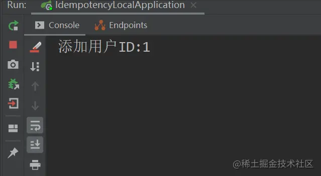
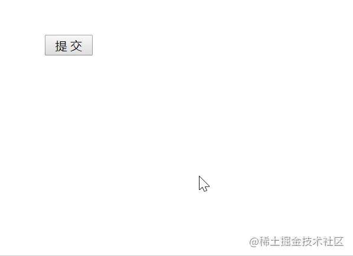
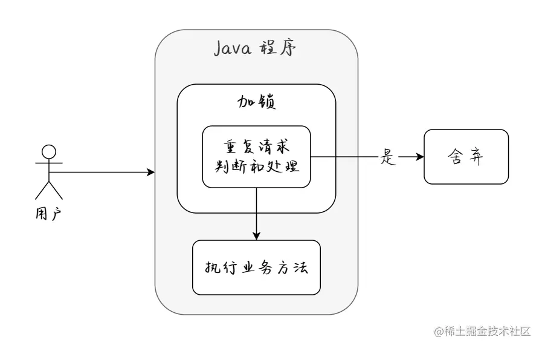
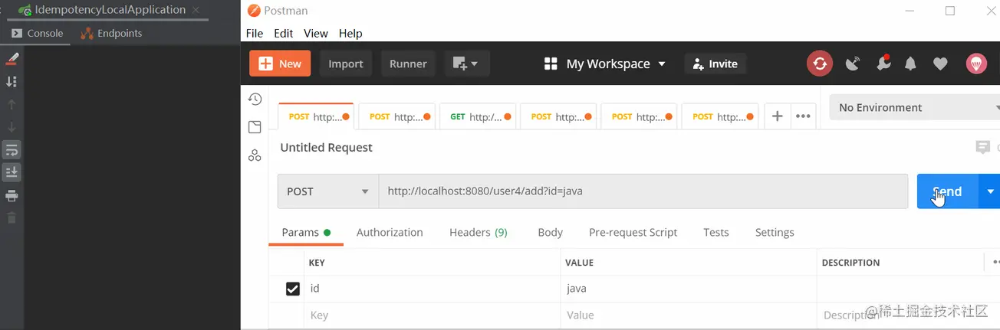
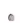

# 防止数据重复提交的6种方法(超简单)！

有位朋友，某天突然问磊哥：**在 Java 中，单机环境防止重复提交最简单的方案是什么**？

## 模拟用户场景

根据朋友的反馈，大致的场景是这样的，如下图所示：



简化的模拟代码如下（基于 Spring Boot）：

```java
import org.springframework.web.bind.annotation.RequestMapping;
import org.springframework.web.bind.annotation.RestController;

@RequestMapping("/user")
@RestController
public class UserController {
   /**
     * 被重复请求的方法
     */
    @RequestMapping("/add")
    public String addUser(String id) {
        // 业务代码...
        System.out.println("添加用户ID:" + id);
        return "执行成功！";
    }
}
```

于是磊哥就想到：通过前、后端分别拦截的方式来解决数据重复提交的问题。

## 前端拦截

前端拦截是指通过 HTML 页面来拦截重复请求，比如在用户点击完“提交”按钮后，我们可以把按钮设置为不可用或者隐藏状态。

执行效果如下图所示：




前端拦截的实现代码：

```html
<html>
<script>
    function subCli(){
        // 按钮设置为不可用
        document.getElementById("btn_sub").disabled="disabled";
        document.getElementById("dv1").innerText = "按钮被点击了~";
    }
</script>
<body style="margin-top: 100px;margin-left: 100px;">
    <input id="btn_sub" type="button"  value=" 提 交 "  onclick="subCli()">
    <div id="dv1" style="margin-top: 80px;"></div>
</body>
</html>
```

但前端拦截有一个致命的问题，如果是懂行的程序员或非法用户可以接绕过前端页面，通过模拟请求来重复提交请求，比如充值了 100 元，重复提交了 10 次变成了 1000 元（瞬间发现了一个致富的好办法）。

所以除了前端拦截一部分正常的误操作之外，后端的拦截也是必不可少。

## 后端拦截

后端拦截的实现思路是在方法执行之前，先判断此业务是否已经执行过，如果执行过则不再执行，否则就正常执行。

我们将请求的业务 ID 存储在内存中，并且通过添加互斥锁来保证多线程下的程序执行安全，大体实现思路如下图所示：




然而，将数据存储在内存中，最简单的方法就是使用 `HashMap` 存储，或者是使用 Guava Cache 也是同样的效果，但很显然 `HashMap` 可以更快的实现功能，所以我们先来实现一个 `HashMap` 的防重（防止重复）版本。

### 1.基础版——HashMap

```
import org.springframework.web.bind.annotation.RequestMapping;
import org.springframework.web.bind.annotation.RestController;

import java.util.HashMap;
import java.util.Map;

/**
 * 普通 Map 版本
 */
@RequestMapping("/user")
@RestController
public class UserController3 {

    // 缓存 ID 集合
    private Map<String, Integer> reqCache = new HashMap<>();

    @RequestMapping("/add")
    public String addUser(String id) {
        // 非空判断(忽略)...
        synchronized (this.getClass()) {
            // 重复请求判断
            if (reqCache.containsKey(id)) {
                // 重复请求
                System.out.println("请勿重复提交！！！" + id);
                return "执行失败";
            }
            // 存储请求 ID
            reqCache.put(id, 1);
        }
        // 业务代码...
        System.out.println("添加用户ID:" + id);
        return "执行成功！";
    }
}
复制代码
```

实现效果如下图所示：




**存在的问题**：此实现方式有一个致命的问题，因为 `HashMap` 是无限增长的，因此它会占用越来越多的内存，并且随着 `HashMap` 数量的增加查找的速度也会降低，所以我们需要实现一个可以自动“清除”过期数据的实现方案。

### 2.优化版——固定大小的数组

此版本解决了 `HashMap` 无限增长的问题，它使用数组加下标计数器（reqCacheCounter）的方式，实现了固定数组的循环存储。

当数组存储到最后一位时，将数组的存储下标设置 0，再从头开始存储数据，实现代码如下：

```
import org.springframework.web.bind.annotation.RequestMapping;
import org.springframework.web.bind.annotation.RestController;

import java.util.Arrays;

@RequestMapping("/user")
@RestController
public class UserController {

    private static String[] reqCache = new String[100]; // 请求 ID 存储集合
    private static Integer reqCacheCounter = 0; // 请求计数器（指示 ID 存储的位置）

    @RequestMapping("/add")
    public String addUser(String id) {
        // 非空判断(忽略)...
        synchronized (this.getClass()) {
            // 重复请求判断
            if (Arrays.asList(reqCache).contains(id)) {
                // 重复请求
                System.out.println("请勿重复提交！！！" + id);
                return "执行失败";
            }
            // 记录请求 ID
            if (reqCacheCounter >= reqCache.length) reqCacheCounter = 0; // 重置计数器
            reqCache[reqCacheCounter] = id; // 将 ID 保存到缓存
            reqCacheCounter++; // 下标往后移一位
        }
        // 业务代码...
        System.out.println("添加用户ID:" + id);
        return "执行成功！";
    }
}
复制代码
```

### 3.扩展版——双重检测锁(DCL)

上一种实现方法将判断和添加业务，都放入 `synchronized` 中进行加锁操作，这样显然性能不是很高，于是我们可以使用单例中著名的 DCL（Double Checked Locking，双重检测锁）来优化代码的执行效率，实现代码如下：

```
import org.springframework.web.bind.annotation.RequestMapping;
import org.springframework.web.bind.annotation.RestController;

import java.util.Arrays;

@RequestMapping("/user")
@RestController
public class UserController {

    private static String[] reqCache = new String[100]; // 请求 ID 存储集合
    private static Integer reqCacheCounter = 0; // 请求计数器（指示 ID 存储的位置）

    @RequestMapping("/add")
    public String addUser(String id) {
        // 非空判断(忽略)...
        // 重复请求判断
        if (Arrays.asList(reqCache).contains(id)) {
            // 重复请求
            System.out.println("请勿重复提交！！！" + id);
            return "执行失败";
        }
        synchronized (this.getClass()) {
            // 双重检查锁（DCL,double checked locking）提高程序的执行效率
            if (Arrays.asList(reqCache).contains(id)) {
                // 重复请求
                System.out.println("请勿重复提交！！！" + id);
                return "执行失败";
            }
            // 记录请求 ID
            if (reqCacheCounter >= reqCache.length) reqCacheCounter = 0; // 重置计数器
            reqCache[reqCacheCounter] = id; // 将 ID 保存到缓存
            reqCacheCounter++; // 下标往后移一位
        }
        // 业务代码...
        System.out.println("添加用户ID:" + id);
        return "执行成功！";
    }
}
复制代码
```

> 注意：DCL 适用于重复提交频繁比较高的业务场景，对于相反的业务场景下 DCL 并不适用。

### 4.完善版——LRUMap

上面的代码基本已经实现了重复数据的拦截，但显然不够简洁和优雅，比如下标计数器的声明和业务处理等，但值得庆幸的是 Apache 为我们提供了一个 commons-collections 的框架，里面有一个非常好用的数据结构 `LRUMap` 可以保存指定数量的固定的数据，并且它会按照 LRU 算法，帮你清除最不常用的数据。

> 小贴士：LRU 是 Least Recently Used 的缩写，即最近最少使用，是一种常用的数据淘汰算法，选择最近最久未使用的数据予以淘汰。

首先，我们先来添加 Apache commons collections 的引用：

```
 <!-- 集合工具类 apache commons collections -->
<!-- https://mvnrepository.com/artifact/org.apache.commons/commons-collections4 -->
<dependency>
  <groupId>org.apache.commons</groupId>
  <artifactId>commons-collections4</artifactId>
  <version>4.4</version>
</dependency>
复制代码
```

实现代码如下：

```
import org.apache.commons.collections4.map.LRUMap;
import org.springframework.web.bind.annotation.RequestMapping;
import org.springframework.web.bind.annotation.RestController;

@RequestMapping("/user")
@RestController
public class UserController {

    // 最大容量 100 个，根据 LRU 算法淘汰数据的 Map 集合
    private LRUMap<String, Integer> reqCache = new LRUMap<>(100);

    @RequestMapping("/add")
    public String addUser(String id) {
        // 非空判断(忽略)...
        synchronized (this.getClass()) {
            // 重复请求判断
            if (reqCache.containsKey(id)) {
                // 重复请求
                System.out.println("请勿重复提交！！！" + id);
                return "执行失败";
            }
            // 存储请求 ID
            reqCache.put(id, 1);
        }
        // 业务代码...
        System.out.println("添加用户ID:" + id);
        return "执行成功！";
    }
}
复制代码
```

使用了 `LRUMap` 之后，代码显然简洁了很多。

### 5.最终版——封装

以上都是方法级别的实现方案，然而在实际的业务中，我们可能有很多的方法都需要防重，那么接下来我们就来封装一个公共的方法，以供所有类使用：

```
import org.apache.commons.collections4.map.LRUMap;

/**
 * 幂等性判断
 */
public class IdempotentUtils {

    // 根据 LRU(Least Recently Used，最近最少使用)算法淘汰数据的 Map 集合，最大容量 100 个
    private static LRUMap<String, Integer> reqCache = new LRUMap<>(100);

    /**
     * 幂等性判断
     * @return
     */
    public static boolean judge(String id, Object lockClass) {
        synchronized (lockClass) {
            // 重复请求判断
            if (reqCache.containsKey(id)) {
                // 重复请求
                System.out.println("请勿重复提交！！！" + id);
                return false;
            }
            // 非重复请求，存储请求 ID
            reqCache.put(id, 1);
        }
        return true;
    }
}
复制代码
```

调用代码如下：

```
import com.example.idempote.util.IdempotentUtils;
import org.springframework.web.bind.annotation.RequestMapping;
import org.springframework.web.bind.annotation.RestController;

@RequestMapping("/user")
@RestController
public class UserController4 {
    @RequestMapping("/add")
    public String addUser(String id) {
        // 非空判断(忽略)...
        // -------------- 幂等性调用（开始） --------------
        if (!IdempotentUtils.judge(id, this.getClass())) {
            return "执行失败";
        }
        // -------------- 幂等性调用（结束） --------------
        // 业务代码...
        System.out.println("添加用户ID:" + id);
        return "执行成功！";
    }
}
复制代码
```

> 小贴士：一般情况下代码写到这里就结束了，但想要更简洁也是可以实现的，你可以通过自定义注解，将业务代码写到注解中，需要调用的方法只需要写一行注解就可以防止数据重复提交了，老铁们可以自行尝试一下（需要磊哥撸一篇的，评论区留言 666）。

## 扩展知识——LRUMap 实现原理分析

既然 `LRUMap` 如此强大，我们就来看看它是如何实现的。

`LRUMap` 的本质是持有头结点的环回双链表结构，它的存储结构如下：

```
AbstractLinkedMap.LinkEntry entry;
复制代码
```

当调用查询方法时，会将使用的元素放在双链表 header 的前一个位置，源码如下：

```
public V get(Object key, boolean updateToMRU) {
    LinkEntry<K, V> entry = this.getEntry(key);
    if (entry == null) {
        return null;
    } else {
        if (updateToMRU) {
            this.moveToMRU(entry);
        }

        return entry.getValue();
    }
}
protected void moveToMRU(LinkEntry<K, V> entry) {
    if (entry.after != this.header) {
        ++this.modCount;
        if (entry.before == null) {
            throw new IllegalStateException("Entry.before is null. This should not occur if your keys are immutable, and you have used synchronization properly.");
        }

        entry.before.after = entry.after;
        entry.after.before = entry.before;
        entry.after = this.header;
        entry.before = this.header.before;
        this.header.before.after = entry;
        this.header.before = entry;
    } else if (entry == this.header) {
        throw new IllegalStateException("Can't move header to MRU This should not occur if your keys are immutable, and you have used synchronization properly.");
    }

}
复制代码
```

如果新增元素时，容量满了就会移除 header 的后一个元素，添加源码如下：

```
 protected void addMapping(int hashIndex, int hashCode, K key, V value) {
     // 判断容器是否已满	
     if (this.isFull()) {
         LinkEntry<K, V> reuse = this.header.after;
         boolean removeLRUEntry = false;
         if (!this.scanUntilRemovable) {
             removeLRUEntry = this.removeLRU(reuse);
         } else {
             while(reuse != this.header && reuse != null) {
                 if (this.removeLRU(reuse)) {
                     removeLRUEntry = true;
                     break;
                 }
                 reuse = reuse.after;
             }
             if (reuse == null) {
                 throw new IllegalStateException("Entry.after=null, header.after=" + this.header.after + " header.before=" + this.header.before + " key=" + key + " value=" + value + " size=" + this.size + " maxSize=" + this.maxSize + " This should not occur if your keys are immutable, and you have used synchronization properly.");
             }
         }
         if (removeLRUEntry) {
             if (reuse == null) {
                 throw new IllegalStateException("reuse=null, header.after=" + this.header.after + " header.before=" + this.header.before + " key=" + key + " value=" + value + " size=" + this.size + " maxSize=" + this.maxSize + " This should not occur if your keys are immutable, and you have used synchronization properly.");
             }
             this.reuseMapping(reuse, hashIndex, hashCode, key, value);
         } else {
             super.addMapping(hashIndex, hashCode, key, value);
         }
     } else {
         super.addMapping(hashIndex, hashCode, key, value);
     }
 }
复制代码
```

判断容量的源码：

```
public boolean isFull() {
  return size >= maxSize;
}
复制代码
```

** 容量未满就直接添加数据：

```
super.addMapping(hashIndex, hashCode, key, value);
复制代码
```

如果容量满了，就调用 `reuseMapping` 方法使用 LRU 算法对数据进行清除。

综合来说：**`LRUMap` 的本质是持有头结点的环回双链表结构，当使用元素时，就将该元素放在双链表 `header` 的前一个位置，在新增元素时，如果容量满了就会移除 `header` 的后一个元素**。

## 总结

本文讲了防止数据重复提交的 6 种方法，首先是前端的拦截，通过隐藏和设置按钮的不可用来屏蔽正常操作下的重复提交。但为了避免非正常渠道的重复提交，我们又实现了 5 个版本的后端拦截：HashMap 版、固定数组版、双重检测锁的数组版、LRUMap 版和 LRUMap 的封装版。

> 特殊说明：本文所有的内容仅适用于单机环境下的重复数据拦截，如果是分布式环境需要配合数据库或 Redis 来实现，想看分布式重复数据拦截的老铁们，请给磊哥一个「**赞**」，如果**点赞超过 100 个**，咱们**更新分布式环境下重复数据的处理方案**，谢谢你。

#### 参考 & 鸣谢

[blog.csdn.net/fenglllle/a…](https://link.juejin.cn/?target=https%3A%2F%2Fblog.csdn.net%2Ffenglllle%2Farticle%2Fdetails%2F82659576)

> 关注公众号「**Java中文社群**」订阅更多精彩。


分类：

[后端](https://juejin.cn/backend)

标签：

[Java](https://juejin.cn/tag/Java)


[安装掘金浏览器插件](https://juejin.cn/extension/?utm_source=standalone&utm_medium=post&utm_campaign=extension_promotion)

多内容聚合浏览、多引擎快捷搜索、多工具便捷提效、多模式随心畅享，你想要的，这里都有！

[前往安装](https://juejin.cn/extension/?utm_source=standalone&utm_medium=post&utm_campaign=extension_promotion)

评论


热门评论

[](https://juejin.cn/user/2400989125808158)

[yangyj](https://juejin.cn/user/2400989125808158)

一把梭 @ 小小小公司1年前

毫无意义

6

3

[](https://juejin.cn/user/61228381386487)

[Java中文社群](https://juejin.cn/user/61228381386487)

（作者）1年前

说出你的理由？

点赞

回复

[](https://juejin.cn/user/2400989125808158)

[yangyj](https://juejin.cn/user/2400989125808158)

回复

[Java中文社群](https://juejin.cn/user/61228381386487)

1年前

redis加锁就好了啊

“

说出你的理由？

”

点赞

回复

查看更多回复

[](https://juejin.cn/user/131597125290365)

[x.L42820](https://juejin.cn/user/131597125290365)

软件开发工程师1年前

1.前台传id的都是修改功能，大多数情况下新增也要做到防止重复提交
2.如果按钮在前端禁用可以会引起一些其他问题。比如ajax保持，禁用了提交后得开启吧，100个页面得改100次。实际项目远远不止100个页面。
3.修改可以多次的，根据id存储缓存防止重复提交不太好，毕竟用户要多次提交的时候，却不让用户修改。
4.操作共享数据才会上锁，防止表单重复和锁没啥关系

3

4

[](https://juejin.cn/user/61228381386487)

[Java中文社群](https://juejin.cn/user/61228381386487)

（作者）1年前

无论是修改还是添加，正常情况下都要判重，通常是前台页面初始化的时候颁发一个 token，而我的文章中的 id 就等于这个 token，只要是一个表单重复提交都是不允许的，原因有两个，第一：无意义的重复条件浪费了系统资源；第二：所有的正常操作都应该有日志记录，而无效的提交而造成更多的垃圾数据。
第二点，前端验证的问题，无论有多少个页面理论上都是要做防重操作的，这个小小的交互实现起来成本很低，但作用很大，不能因为工作量而放弃开发的底线或者是原则，你要想一个问题，如果的是多个页面也就会有多个人来维护，其维护成本也是很低的。 其他问题多看几遍文章理解一下吧，文章已经说得很清楚了

展开

点赞

回复

[](https://juejin.cn/user/61228381386487)

[Java中文社群](https://juejin.cn/user/61228381386487)

（作者）1年前

也欢迎添加我的 WX 单独探讨：GG_Stone，打字确实很累，语音可能会好点

点赞

回复

查看更多回复

[](https://juejin.cn/user/1591748567509080)

[Time elegy](https://juejin.cn/user/1591748567509080)

1年前

请问一下如果这个提交的id是后台生成的怎么办

点赞

4

[](https://juejin.cn/user/61228381386487)

[Java中文社群](https://juejin.cn/user/61228381386487)

（作者）1年前

好问题，这个id可以不是真实的主键业务id，而是一个可以代表此次表单提交的业务id，这个可以在前端页面初始化的时候创建一个。

点赞

回复

[](https://juejin.cn/user/2313028195059453)

[freedomme](https://juejin.cn/user/2313028195059453)

1年前

是的，我也很想请教一下 作者 id 是怎样生成的

点赞

回复

查看更多回复

[](https://juejin.cn/user/2400989125808158)

[yangyj](https://juejin.cn/user/2400989125808158)

一把梭 @ 小小小公司1年前

掘金什么时候水文也能天天上推荐

4

3

[](https://juejin.cn/user/61228381386487)

[Java中文社群](https://juejin.cn/user/61228381386487)

（作者）1年前

再者说了，我天天上推荐了？ 我自己都不知道。

点赞

回复

查看更多回复

[](https://juejin.cn/user/1538972008842669)

[掘金界的摸鱼人](https://juejin.cn/user/1538972008842669)

java开发攻城狮 @ 摸鱼🐟1年前

做这个功能的前提，是要先区分什么样的算是重复数据，ID一般由后端生成，那么就需要其他进行唯一识别的字段进行区分，再进行重复数据处理。你这个的重复数据提交的场景应该是仅应对并发时的连续写入。

1

3

[](https://juejin.cn/user/61228381386487)

[Java中文社群](https://juejin.cn/user/61228381386487)

（作者）1年前

ID 可以理解为 token，主要是为了防止连续重复提交，有可能是网络抖动造成的数据重复提交，通常情况下是一个人重复触发的，加排它锁是为了防止非正常的情况。

点赞

回复

[](https://juejin.cn/user/1538972008842669)

[掘金界的摸鱼人](https://juejin.cn/user/1538972008842669)

回复

[Java中文社群](https://juejin.cn/user/61228381386487)

1年前

噢，那么你上面说的ID，应该是用于识别某一界面内容的唯一ID，用于该界面当前生成状态是唯一，当界面表单有改动，更新，该ID都应该同步刷新一次。用于给后端识别，前端提交过来的数据从业务逻辑上是否有改动，只用于正常操作范围没的识别

“

ID 可以理解为 token，主要是为了防止连续重复提交，有可能是网络抖动造成的数据重复提交，通常情况下是一个人重复触发的，加排它锁是为了防止非正常的情况。

”

点赞

回复

查看更多回复

全部评论 82

最新

最热

[](https://juejin.cn/user/2027932422244199)

[用户9693073046621](https://juejin.cn/user/2027932422244199)

1月前

我觉得这种没有什么用。你是通过前端传一个id ,我只要前端用uuid 传入，就可以无限重复提交。
其实除了以前通过请求后端生成返回视图的方式，然后在后台生成token的方式，然后校验tocken。前后端分离根本无法处理重复提交的问题。

点赞

回复

[](https://juejin.cn/user/3193455834833741)

[谁是大流氓](https://juejin.cn/user/3193455834833741)

无敌架构师 @ 微码科技4月前

单机环境下不包括redis？？？？不可以使用redis？？？

点赞

回复

[](https://juejin.cn/user/3394896602860392)

[用户1055933066](https://juejin.cn/user/3394896602860392)

Java高级劝退师1年前

没卵用

点赞

回复

[](https://juejin.cn/user/4274502657651784)

[用户7410091276930](https://juejin.cn/user/4274502657651784)

1年前

找个人技术，合作上架APP马甲，长期有活，加微信c1237789

点赞

回复

[](https://juejin.cn/user/940837683075799)

[Skyline7](https://juejin.cn/user/940837683075799)

面向工资编程 @ 家里蹲1年前

单机环境，确实可以，或者也可以基于数据库，缓存的策略

点赞

回复

[](https://juejin.cn/user/2858385964023102)

[JacceYang](https://juejin.cn/user/2858385964023102)

首席低调官 @ 某互联网大厂1年前

分布式环境怎么高？

点赞

回复

[](https://juejin.cn/user/2911162523210056)

[似水流年同学109029](https://juejin.cn/user/2911162523210056)

1年前

确实没啥卵用，为了凑数而已，大厂风格。又造轮子，又封装轮子的，最后还解析一段源码。最后确实不如redisson

1

回复

[](https://juejin.cn/user/2911162520053549)

[End羁绊](https://juejin.cn/user/2911162520053549)

开发工程师 @ 河北先鉴1年前

Java中文社群 这个id是什么，怎摸获取

点赞

回复

[](https://juejin.cn/user/1521379824640839)

[isu](https://juejin.cn/user/1521379824640839)

java菜鸡1年前

分布式环境下是不是要使用redis分布式锁，或者说是redisson

2

回复

[](https://juejin.cn/user/2735240659608951)

[阳光下抬头微笑](https://juejin.cn/user/2735240659608951)

1年前

打胡乱说，明明就锁一次，非说双重锁检测

2

1

[](https://juejin.cn/user/360295545973351)

[KKwiki](https://juejin.cn/user/360295545973351)

1年前

很多源码都有这种写法，为了不同场景的效率，别乱喷

点赞

回复

[](https://juejin.cn/user/3843548383034285)

[爱喝水](https://juejin.cn/user/3843548383034285)

1年前

正好在别处看到DCL，想了解下的，这篇文章就来了

点赞

回复

[](https://juejin.cn/user/307518986256904)

[远坂时臣](https://juejin.cn/user/307518986256904)

低端码农 @ 冬木市魔术协会1年前

这都是单机的解决方案啊

点赞

回复

[](https://juejin.cn/user/1662117309856638)

[shawntime](https://juejin.cn/user/1662117309856638)

搬砖工程师 @ Autohome1年前

现在还有几个服务是单机

1

回复

[](https://juejin.cn/user/2629687543349127)

[Mr_Shi-](https://juejin.cn/user/2629687543349127)

1年前

一个分布式锁就解决的问题 弄这个复杂

1

回复

[](https://juejin.cn/user/2365804754249310)

[已注销](https://juejin.cn/user/2365804754249310)

1年前

你不觉得一个系统产生的问题对于业务侵入性太大了么？难道我每个可能会重复请求的接口都需要在单独的业务方法里去写防重复提交的代码？学没学过切面编程？

点赞

2

[](https://juejin.cn/user/61228381386487)

[Java中文社群](https://juejin.cn/user/61228381386487)

（作者）1年前

好好看完文章再说话。

点赞

回复

[](https://juejin.cn/user/923245497813869)

[Oscar酱51904](https://juejin.cn/user/923245497813869)

1年前

世上并不是有了菜刀之后，就不再需要镰刀、铅笔刀、水果刀、切割机的。 我确定菜刀可以切西瓜，水果刀也可以。侵不侵入的，这是一个哲学问题。理论上来说，只要是代码就是在侵入，纯粹的非侵入本质就是0代码。你缕缕。

2

回复

[](https://juejin.cn/user/606586151113853)

[shenjies88](https://juejin.cn/user/606586151113853)

some company1年前

讲句实话，加锁感觉过了

点赞

2

[](https://juejin.cn/user/61228381386487)

[Java中文社群](https://juejin.cn/user/61228381386487)

（作者）1年前

不加锁还是会重复提交。

点赞

回复

[](https://juejin.cn/user/923245497813869)

[Oscar酱51904](https://juejin.cn/user/923245497813869)

回复

[Java中文社群](https://juejin.cn/user/61228381386487)

1年前

别理他，就让他们前端解决就行了，我估计他不经常甚至没用过锁。

“

不加锁还是会重复提交。

”

点赞

回复

[](https://juejin.cn/user/2981531263960584)

[圣西罗](https://juejin.cn/user/2981531263960584)

java1年前

有点水

5

回复

[](https://juejin.cn/user/131597124247661)

[白纸无字Zonciu](https://juejin.cn/user/131597124247661)

全干工程师1年前

分布式才有看头啊

3

回复

[](https://juejin.cn/user/3667626521273678)

[锟斤铐锟斤铐锟斤铐](https://juejin.cn/user/3667626521273678)

复制粘贴工程师1年前

数据“打包”成令牌用完丢弃，这个可不可

点赞

回复

[](https://juejin.cn/user/131597125290365)

[x.L42820](https://juejin.cn/user/131597125290365)

软件开发工程师1年前

1.前台传id的都是修改功能，大多数情况下新增也要做到防止重复提交
2.如果按钮在前端禁用可以会引起一些其他问题。比如ajax保持，禁用了提交后得开启吧，100个页面得改100次。实际项目远远不止100个页面。
3.修改可以多次的，根据id存储缓存防止重复提交不太好，毕竟用户要多次提交的时候，却不让用户修改。
4.操作共享数据才会上锁，防止表单重复和锁没啥关系

3

4

[](https://juejin.cn/user/61228381386487)

[Java中文社群](https://juejin.cn/user/61228381386487)

（作者）1年前

无论是修改还是添加，正常情况下都要判重，通常是前台页面初始化的时候颁发一个 token，而我的文章中的 id 就等于这个 token，只要是一个表单重复提交都是不允许的，原因有两个，第一：无意义的重复条件浪费了系统资源；第二：所有的正常操作都应该有日志记录，而无效的提交而造成更多的垃圾数据。
第二点，前端验证的问题，无论有多少个页面理论上都是要做防重操作的，这个小小的交互实现起来成本很低，但作用很大，不能因为工作量而放弃开发的底线或者是原则，你要想一个问题，如果的是多个页面也就会有多个人来维护，其维护成本也是很低的。 其他问题多看几遍文章理解一下吧，文章已经说得很清楚了

展开

点赞

回复

[](https://juejin.cn/user/61228381386487)

[Java中文社群](https://juejin.cn/user/61228381386487)

（作者）1年前

也欢迎添加我的 WX 单独探讨：GG_Stone，打字确实很累，语音可能会好点

点赞

回复

查看更多回复