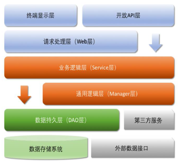

# AJCG 

这是华山版的 Markdown 版本，正在参考嵩山版的 PDF 进行增补，已经修改到了第十章了。

[TOC]


# 一、编程规约

## (一) 命名风格

- 【强制】代码中的**命名均不能以下划线或美元符号开始或者结束**；

- 【强制】代码和注释中都要避免使用任何语言的种族歧视性词语；如将 blackList / whiteList 换成：blockList / allowList

- 【强制】**类名使用 UpperCamelCase 风格**，必须遵从驼峰形式，但以下情形例外：DO / BO /DTO / VO / AO  

- 【强制】**方法名、参数名、成员变量、局部变量都统一使用 lowerCamelCase 风格**，必须遵从驼峰形式。

- 【强制】**常量命名全部大写，单词间用下划线隔开**，力求语义表达完整清楚，不要嫌名字长。

- 【强制】**抽象类命名使用 Abstract 或 Base 开头；异常类命名使用 Exception 结尾；测试类命名以它要测试的类的名称开始，以 Test 结尾。**

- 【强制】中括号是数组类型的一部分，数组定义如下：String[] args;

- 【强制】POJO 类中**布尔类型的变量，都不要加 is**，否则部分框架解析会引起序列化错误。

    反例：定义为基本数据类型 Boolean isDeleted；的属性，它的方法也是 isDeleted()，RPC 框架在反向解析的时候，“以为”对应的属性名称是 deleted，导致属性获取不到，进而抛出异常。

    说明：在本文MySQL规约中的建表约定第一条，表达是与否的变量采用 `is_xxx` 的命名方式，所以，需要在 `<resultMap>` 设置从 `is_xxx` 到 `xxx` 的映射关系。

- 【强制】**包名统一使用小写，点分隔符之间有且仅有一个自然语义的英语单词**。**包名统一使用单数形式，但是类名如果有复数含义，类名可以使用复数形式。**

- 【强制】**避免在子父类的成员变量之间、或者不同代码块的局部变量之间采用完全相同的命名，使可理解性降低**。 说明：子类、父类成员变量名相同，即使是 public 类型的变量也能够通过编译，另外，局部变量在同一方法内的不同代码块中同名也是合法的，这些情况都要避免。对于非setter/getter的参数名称也要避免与成员变量名称相同。 反例：

    ```java
    public class ConfusingName {
    	public int stock;
        
    	// 非 setter/getter 的参数名称，不允许与本类成员变量同名
    	public void get(String alibaba) {
    		if (condition) {
    			final int money = 666;
    			// ...
    		}
            
    		for (int i = 0; i < 10; i++) {
    			// 在同一方法体中，不允许与其它代码块中的 money 命名相同
    			final int money = 15978;
    			// ...
    		}
    	}
    }
    
    class Son extends ConfusingName {
    	// 不允许与父类的成员变量名称相同
    	public int stock;
    }
    ```

- 【推荐】为了达到代码自解释的目标，任何自定义编程元素在命名时，使用尽量完整的单词组合来表达其意，杜绝不规范的缩写。
  正例：从远程仓库拉取代码的类命名为 PullCodeFromRemoteRepository。

- 【推荐】在常量与变量的命名时，**表示类型的名词放在词尾**，以提升辨识度。 

    正例：startTime / workQueue / nameList / TERMINATED_THREAD_COUNT

- 【推荐】**如果模块、接口、类、方法使用了设计模式，在命名时体现出具体模式**。
  
  说明：将设计模式体现在名字中，有利于阅读者快速理解架构设计理念。
  正例：public class OrderFactory; public class LoginProxy;
  
- 【推荐】**接口类中的方法和属性不要加任何修饰符号**（public 也不要加），保持代码的简洁性，并**加上有效的 Javadoc 注释**。尽量**不要在接口里定义变量**，如果一定要定义变量，肯定是与接口方法相关，并且是整个应用的基础常量。
  正例：接口方法签名：`void f();`
  接口基础常量表示：`String COMPANY = "alibaba";`
  说明：JDK8 中接口允许有默认实现，那么这个 default 方法，是对所有实现类都有价值的默认实现。

- 接口和实现类的命名有两套规则：
  - 【强制】对于 Service 和 DAO 类，基于 SOA 的理念，暴露出来的服务一定是接口，内部的实现类用 Impl 的后缀与接口区别。
  正例：`CacheServiceImpl` 实现 `CacheService` 接口。

  - 【推荐】**如果是形容能力的接口名称，取对应的形容词做接口名**（通常是–able 的形式）。

      正例：AbstractTranslator 实现 Translatable。

- 【参考】**枚举类名建议带上 Enum 后缀，枚举成员名称需要全大写，单词间用下划线隔开**。说明：枚举其实就是特殊的常量类，且构造方法被默认强制是私有。
  正例：枚举名字为 `ProcessStatusEnum` 的成员名称：`SUCCESS` / `UNKOWN_REASON`。

- 【参考】各层命名规约：
  - Service/DAO 层方法命名规约
  - 获取单个对象的方法用 get 做前缀。
  -  获取多个对象的方法用 list 做前缀。
  -  获取统计值的方法用 count 做前缀。
  - 插入的方法用 save/insert 做前缀。
  - 删除的方法用 remove/delete 做前缀。
  - 修改的方法用 update 做前缀。
  - 领域模型命名规约
    - 数据对象：xxxDO，xxx 即为数据表名。
    - 数据传输对象：xxxDTO，xxx 为业务领域相关的名称。
    - 展示对象：xxxVO，xxx 一般为网页名称。
    - POJO 是 DO/DTO/BO/VO 的统称，禁止命名成 xxxPOJO。

## (二) 常量定义

- 【强制】**不允许任何未经定义的常量直接出现在代码中**。

    反例：本例中，开发者 A 定义了缓存的 key，然后开发者 B 使用缓存时少了下划线，即 key是"Id#taobao"+tradeId，导致出现故障

    ```java
    String key = "Id#taobao_" + tradeId;
    cache.put(key, value);
    ```

- 【强制】**long 或者 Long 初始赋值时，使用大写的 L，不能是小写的 l**，小写容易跟数字 1 混淆，造成误解。

- 【推荐】**不要使用一个常量类维护所有常量，按常量功能进行归类，分开维护**。
  说明：大而全的常量类，非得使用查找功能才能定位到修改的常量，不利于理解和维护。

  正例：缓存相关常量放在类 CacheConsts 下；系统配置相关常量放在类 ConfigConsts 下。

- 【推荐】常量的复用层次有五层：跨应用共享常量、应用内共享常量、子工程内共享常量、包内共享常量、类内共享常量。
  
  - 跨应用共享常量：放置在二方库中，通常是 client.jar 中的 constant 目录下。
  
  - 应用内共享常量：放置在一方库中，通常是 modules 中的 constant 目录下。
    反例：易懂变量也要统一定义成应用内共享常量，两位攻城师在两个类中分别定义了表示
    “是”的变量：
    类 A 中：`public static final String YES =  "yes";`
    类 B 中：`public static final String YES = "y"; `
    
      `A.YES.equals(B.YES)`，预期是 true，但实际返回为 false，导致线上问题。
    
  - 子工程内部共享常量：即在当前子工程的 constant 目录下。
  
  - 包内共享常量：即在当前包下单独的 constant 目录下。
  - 类内共享常量：直接在类内部 `private static final` 定义。
- 【推荐】如果变量值仅在一个固定范围内变化用 enum 类型来定义。 

  说明：如果存在名称之外的延伸属性应使用 enum 类型，下面正例中的数字就是延伸信息，表示一年中的第几个季节。 正例：
  
  ```java
  public enum SeasonEnum {
  	SPRING(1), SUMMER(2), AUTUMN(3), WINTER(4);
  	private int seq;
  	SeasonEnum(int seq) {
          this.seq = seq;
  	}
  	public int getSeq() {
  		return seq;
  	}
  }
  ```

## (三) 代码格式

- 【强制】大括号的使用约定。如果是**大括号内为空，则简洁地写成 `{}`** 即可，不需要换行；

- 【强制】 左/右小括号和字符之间不出现空格；

- 【强制】**if/for/while/switch/do 等保留字与括号之间都必须加空格**。

- 【强制】**任何二目、三目运算符的左右两边都需要加一个空格**。
说明：运算符包括赋值运算符 =、逻辑运算符 &&、加减乘除符号等。

- 【强制】**注释的双斜线与注释内容之间有且仅有一个空格**。

- 【强制】在进行类型强制转换时，右括号与强制转换值之间不需要任何空格隔开。

- 【强制】单行字符数限制不超过 120 个，超出需要换行，换行时遵循如下原则：
  
  >Editor -> Code style -> General -> Hard wrap at 设置宽度值，后面的 warp on typing 勾选表示输入时超过会自动换行；
  >
  >Editor -> Code style -> Java ->  wrapping and Braces -> Keep when reformatting -> Ensure right margin is not exceeded 勾选表示在格式化代码如果发现超过会自动换行；
  
  - 第二行相对第一行缩进 4 个空格，从第三行开始，不再继续缩进，参考示例。
  - **运算符与下文一起换行**。
  - 方法调用的**点符号与下文一起换行**。
  - 方法调用时，**多个参数，需要换行时，在逗号后进行**。
  - 在括号前不要换行（即换行之后不能最前面就是括号）：
  
  ```java
  StringBuffer sb = new  StringBuffer();
  // 超过 120 个字符的情况下，换行缩进 4 个空格，点号和方法名称一起换行
  sb.append("zi").append("xin")...
    .append("huang").append("huang")...
    .append("huang");
  ```
  
- 【强制】方法参数在定义和传入时，**多个参数逗号后边必须加空格**。

- 【强制】IDE 的 `text file encoding` 设置为 UTF-8；IDE 中文件的换行符使用 Unix 格式，不要使用 Windows 格式。

    >Editor -> File Encodings 
    >
    >Editor -> Code Style -> General -> Line separator

- 【推荐】**单个方法的总行数不超过80行。** 

    说明：除注释之外的方法签名、左右大括号、方法内代码、空行、回车及任何不可见字符的总行数不超过 80 行。 

    正例：代码逻辑分清红花和绿叶，个性和共性，绿叶逻辑单独出来成为额外方法，使主干代码更加清晰；共性逻辑抽取成为共性方法，便于复用和维护。

- 【推荐】没有必要增加若干空格来使变量的赋值等号与上一行对应位置的等号对齐。

- 【推荐】**不同逻辑、不同语义、不同业务的代码之间插入一个空行分隔开来以提升可读性**。 

  说明：任何情形，没有必要插入多个空行进行隔开。

## (四)  OOP 规约

- 【强制】**访问此类的静态变量或静态方法直接用类名来访问**;

- 【强制】所有的**覆写方法，必须加 `@Override` 注解**。

    说明：如果在抽象类中对方法签名进行修改，使用注解之后，其实现类会马上编译报错。

- 【强制】相同参数类型，相同业务含义，才可以使用 Java 的可变参数，避免使用 Object。

  说明：**可变参数必须放置在参数列表的最后**。（提倡**尽量不用可变参数编程**）
  正例：`public List<User> getUsers(String type, Long... ids) {...}`

- 【强制】外部正在调用或者二方库依赖的接口，不允许修改方法签名，避免对接口调用方产生影响。**接口过时必须加 `@Deprecated` 注解，并清晰地说明采用的新接口或者新服务是什么**。

    注释：`@Deprecated` 注解可以用来注解类、接口、成员方法和成员变量等，用来表示某个元素（类、方法等）已经过时。当其它程序调用的时候编译器会有横删除线警告提示。

- 【强制】**不能使用过时的类或方法**。

- 【强制】Object 的 **equals 方法**容易抛空指针异常，**应使用常量或确定有值的对象来调用 equals。**
  正例：`"test".equals(object);`反例：`object.equals("test");`
  说明：**推荐使用 java.util.Objects#equals（JDK7 引入的工具类）**
  推荐使用示例：`Objects.equals(value, that.getValue());`，`Objects.equals` 的源码如下：

  ```java
  // 在判断方法总做了空指针判断
  public static boolean equals(Object a, Object b) {
      return (a == b) || (a != null && a.equals(b));
  }
  ```
  
- 【强制】所有的**相同类型的包装类对象之间值的比较，全部使用 equals 方法比较**。

    说明：对于 Integer var =  ? 在 -128 至 127 范围内的赋值，Integer 对象是在 IntegerCache.cache 产生，会复用已有对象，这个区间内的 Integer 值可以直接使用 == 进行判断，但是这个区间之外的所有数据，都会在堆上产生，并不会复用已有对象，这是一个大坑，推荐使用 equals 方法进行判断。

- 【强制】**任何货币金额，均以最小货币单位且整型类型来进行存储**。

- 【强制】浮点数之间的等值判断，基本数据类型不能用`==`来比较，包装数据类型不能用 equals 来判断。 

    说明：浮点数采用“尾数+阶码”的编码方式，类似于科学计数法的“有效数字+指数”的表示方式。二进制无法精确表示大部分的十进制小数。 

    ```java
    // 反例： 
    float a = 1.0F - 0.9F;
    float b = 0.9F - 0.8F;
    
    if (a == b) {
    // 预期进入此代码块，执行其它业务逻辑
    // 但事实上 a == b 的结果为 false
    }
    
    Float x = Float.valueOf(a);
    Float y = Float.valueOf(b);
    if (x.equals(y)) {
    // 预期进入此代码块，执行其它业务逻辑
    // 但事实上 equals 的结果为 false
    }
    
    // 正例： 
    //(1) 指定一个误差范围，两个浮点数的差值在此范围之内，则认为是相等的。 
    float a = 1.0F - 0.9F;
    float b = 0.9F - 0.8F;
    float diff = 1e-6F;
    if (Math.abs(a - b) < diff) {
    	System.out.println("true");
    } 
    // (2) 使用BigDecimal来定义值，再进行浮点数的运算操作。
    BigDecimal a = new BigDecimal("1.0");
    BigDecimal b = new BigDecimal("0.9");
    BigDecimal c = new BigDecimal("0.8");
    BigDecimal x = a.subtract(b);
    BigDecimal y = b.subtract(c);
    if (x.compareTo(y) == 0) {
    	System.out.println("true");
    }
    ```

- 【强制】如上所示 BigDecimal 的等值比较应使用 `compareTo()` 方法，而不是 `equals()` 方法。 

    说明：`equals()` 方法会比较值和精度（1.0 与 1.00 返回结果为 false），而`compareTo()`会忽略精度。

- 【强制】定义数据对象 DO 类时，属性类型要与数据库字段类型相匹配。 

    正例：**数据库字段的 bigint 必须与类属性的 Long 类型相对应**。

    反例：某个案例的数据库表 id 字段定义类型 bigint unsigned，实际类对象属性为 Integer，随着 id 越来越大，超过 Integer 的表示范围而溢出成为负数。

- 【强制】**禁止使用构造方法 `BigDecimal(double)` 的方式把 double 值转化为 BigDecimal 对象**。 

    说明：`BigDecimal(double)` 存在精度损失风险，在精确计算或值比较的场景中可能会导致业务逻辑异常。如：`BigDecimal g = new BigDecimal(0.1F); `实际的存储值为：0.10000000149 

    正例：**优先推荐入参为 String 的构造方法，或使用 BigDecimal 的 valueOf 方法**，此方法内部其实执行了 Double 的 toString，而 Double 的 toString 按 double 的实际能表达的精度对尾数进行了截断。 

    ```java
    BigDecimal recommend1 = new BigDecimal("0.1"); 
    BigDecimal recommend2 = BigDecimal.valueOf(0.1);
    ```

- ==关于基本数据类型与包装数据类型的使用标准如下：==
  
  - 【强制】所有的 **POJO 类属性必须使用包装数据类型**。
  
  - 【强制】RPC（Remote Procedure Call 远程过程调用）方法的**返回值和参数必须使用包装数据类型**。
  
  - 【推荐】**所有的局部变量使用基本数据类型。**
      说明：POJO 类属性没有初值是提醒使用者在需要使用时，必须自己显式地进行赋值，任何 NPE 问题，或者入库检查，都由使用者来保证。
      正例：数据库的查询结果可能是 null，因为自动拆箱，用基本数据类型接收有 NPE 风险。
  
      反例：比如显示成交总额涨跌情况，即正负 x%，x 为基本数据类型，调用的 RPC 服务，调用不成功时，返回的是默认值，页面显示为 0%，这是不合理的，应该显示成中划线。所以包装数据类型的 null 值，能够表示额外的信息，如：远程调用失败，异常退出。
  
- 【强制】**定义 DO/DTO/VO 等 POJO 类时，不要设定任何属性默认值**。
  反例：POJO 类的 gmtCreate 默认值为 new  Date(); 但是这个属性在数据提取时并没有置入具体值，在更新其它字段时又附带更新了此字段，导致创建时间被修改成当前时间。

- 【强制】序列化类新增属性时，请不要修改 serialVersionUID 字段，避免反序列失败；如果完全不兼容升级，避免反序列化混乱，那么请修改 serialVersionUID 值。
  说明：注意 serialVersionUID 不一致会抛出序列化运行时异常。

  >serialVersionUID 是 Java 为每个序列化类产生的版本标识：版本相同，相互之间则可序列化和反序列化；版本不同，反序列化时会抛出 InvalidClassException。因不同的 jdk 编译很可能会生成不同的serialVersionUID 默认值，通常需要显式指定，如 1L。
  
- 【强制】**构造方法里面禁止加入任何业务逻辑，如果有初始化逻辑，请放在 init 方法中**。

- 【强制】**POJO 类必须写 toString 方法**。使用 IDE 的中工具：source> generate  toString
  时，如果**继承了另一个 POJO 类，注意在前面加一下 super.toString**。
  说明：在方法**执行抛出异常时，可以直接调用 POJO 的 toString()方法打印其属性值**，便于排查问题。

- 【强制】禁止在 POJO 类中，同时存在对应属性 xxx 的 `isXxx()` 和 `getXxx()` 方法。 说明：框架在调用属性 xxx 的提取方法时，并不能确定哪个方法一定是被优先调用到的。

- 【推荐】使用**索引访问用 String 的 split 方法得到的数组时，需做最后一个分隔符后有无内容的检查**，否则会有抛 IndexOutOfBoundsException 的风险。
  
  ```java
  String str =  "a,b,c,,";
  String[] ary =  str.split(",");
  // 预期大于 3，结果是 3 
  System.out.println(ary.length);
  ```
  
- 【推荐】当一个类**有多个构造方法，或者多个同名方法，这些方法应该按顺序放置在一起**，便于阅读，此条规则优先于下一条规则。

- 【推荐】 类内方法定义顺序依次是：**公有方法或保护方法 > 私有方法 > getter/setter方法**。

- 【推荐】**setter 方法中，参数名称与类成员变量名称一致，this.成员名 = 参数名。在 getter/setter 方法中，不要增加业务逻辑**，增加排查问题的难度。

- 【推荐】**循环体内，字符串的连接方式，使用 StringBuilder 的 append 方法进行扩展。**

- 【推荐】final  可以声明类、成员变量、方法、以及本地变量，**下列情况使用  final 关键字**：
  
  > Final 变量会被 JVM 和 Java 应用缓存，以提升性能，同时在多线程环境下无需同步；
  
  - 不允许被继承的类，如：String 类。
  - 不允许修改引用的域对象，如：POJO 类的域变量。
  - 不允许被重写的方法，如：POJO 类的 setter 方法。
  - 不允许运行过程中重新赋值的局部变量。
  - 避免上下文重复使用一个变量，使用 final 描述可以强制重新定义一个变量，方便更好地进行重构。
  
- 【推荐】慎用 Object 的 clone 方法来拷贝对象。
  说明：**对象的 clone 方法默认是浅拷贝**，若想实现深拷贝需要重写 clone 方法实现属性对象的拷贝。

- 【推荐】**类成员与方法访问控制从严**：
  - 如果不允许外部直接通过 new 来创建对象，那么构造方法必须是 private。
  - 工具类不允许有 public 或 default 构造方法。
  - 类非 static 成员变量并且与子类共享，必须是 protected。
  - 类非 static 成员变量并且仅在本类使用，必须是 private。
  - 类 static 成员变量如果仅在本类使用，必须是 private。
  - 若是 static 成员变量，必须考虑是否为 final。
  - 类成员方法只供类内部调用，必须是 private。
  - 类成员方法只对继承类公开，那么限制为 protected。
  
- 字符串分割时，用 Apache Commons 中的 StringUtils.splitPreserveAllTokens(...) 代替 JDK 中的 str.split(..)，避免 JDK 对末尾空串的过滤导致结果与预期不一致。

## (五) 日期时间

- 【强制】日期格式化时，传入 pattern 中表示**年份统一使用小写的 y**。 

    说明：日期格式化时，yyyy 表示当天所在的年，而大写的 YYYY 代表是 week in which year（JDK7 之后引入的概念），意思是当天所在的周属于的年份，一周从周日开始，周六结束，只要本周跨年，返回的YYYY 就是下一年。 

    正例：表示日期和时间的格式如下所示： `new SimpleDateFormat("yyyy-MM-dd HH:mm:ss") `

- 【强制】在日期格式中分清楚大写的 M 和小写的 m，大写的 H 和小写的 h 分别指代的意义。 

    说明：日期格式中的这两对字母表意如下：

    - 表示月份是大写的 M，表示分钟则是小写的 m； 
    - 24 小时制的是大写的 H，12 小时制的则是小写的 h。

- 【强制】**获取当前毫秒数**：`System.currentTimeMillis();` 而不是 `new Date().getTime()`。 

    说明：如果想获取更加精确的纳秒级时间值，使用 System.nanoTime 的方式。在 JDK8 中，针对统计时间等场景，推荐使用 Instant 类。

- 【强制】不允许在程序任何地方中使用：`java.sql.Date` 和`java.sql.Time` 和 `java.sql.Timestamp`。 

    说明：第 1 个不记录时间，`getHours()` 抛出异常；第 2 个不记录日期，`getYear()` 抛出异常；第 3 个在构造方法 `super((time/1000)*1000)`，在 Timestamp 属性 fastTime 和 nanos 分别存储秒和纳秒信息。
    反例： `java.util.Date.after(Date)` 进行时间比较时，当入参是 `java.sql.Timestamp` 时，会触发JDK BUG(JDK9 已修复)，可能导致比较时的意外结果。

- 【强制】**不要在程序中写死一年为 365 天，避免在公历闰年时出现日期转换错误或程序逻辑错误**。

    ```java
    // 正例：
    // 获取今年的天数 
    int daysOfThisYear = LocalDate.now().lengthOfYear(); 
    // 获取指定某年的天数 
    LocalDate.of(2011, 1, 1).lengthOfYear();
    
    // 反例： 
    // 第一种情况：在闰年366天时，出现数组越界异常 
    int[] dayArray = new int[365]; 
    // 第二种情况：一年有效期的会员制，今年1月26日注册，硬编码365返回的却是1月25日 
    Calendar calendar = Calendar.getInstance(); calendar.set(2020, 1, 26); calendar.add(Calendar.DATE, 365);
    ```

- 【推荐】避免公历闰年 2 月问题。闰年的 2 月份有 29 天，一年后的那一天不可能是 2 月 29 日。

- 【推荐】**使用枚举值来指代月份**。如果使用数字，注意 Date，Calendar 等日期相关类的月份 month 取值在 0-11 之间。 

    说明：参考 JDK 原生注释，Month value is 0-based. e.g., 0 for January. 

    正例： Calendar.JANUARY，Calendar.FEBRUARY，Calendar.MARCH 等来指代相应月份来进行传参或比较。

## (六) 集合处理

- 【强制】关于 hashCode 和 equals 的处理，遵循如下规则：
  - **只要重写 equals，就必须重写 hashCode**。
  - 因为 Set 存储的是不重复的对象，依据 hashCode 和 equals 进行判断，所以 **Set 存储的对象必须重写这两个方法**。
  - 如果自定义对象做为**Map 的键，那么必须重写 hashCode 和 equals**。
  说明：String 重写了hashCode 和 equals 方法，所以我们可以非常愉快地使用 String 对象作为 key 来使用。

- 【强制】**判断所有集合内部的元素是否为空，使用 `isEmpty()` 方 法**，而不是`size()==0` 的方式。 

    说明：在某些集合中，前者的时间复杂度为O(1)，而且可读性更好。

- 【强制】在使用 `java.util.stream.Collectors` 类的 `toMap()` 方法转为 Map 集合时，一定要使用含有参数类型为 BinaryOperator，参数名为 mergeFunction 的方法，否则当出现相同 key 值时会抛出IllegalStateException 异常。 

  说明：参数 mergeFunction 的作用是当出现 key 重复时，自定义对 value 的处理策略。 

  ```java
  // 正例：
  List<Pair<String, Double>> pairArrayList = new ArrayList<>(3);
  pairArrayList.add(new Pair<>("version", 12.10));
  pairArrayList.add(new Pair<>("version", 12.19));
  pairArrayList.add(new Pair<>("version", 6.28));
  
  Map<String, Double> map = pairArrayList.stream().collect(
  // 生成的map集合中只有一个键值对：{version=6.28}
  Collectors.toMap(Pair::getKey, Pair::getValue, (v1, v2) -> v2)); 
  
  // 反例：
  String[] departments = new String[] {"iERP", "iERP", "EIBU"};
  // 抛出IllegalStateException异常
  Map<Integer, String> map = Arrays.stream(departments)
  .collect(Collectors.toMap(String::hashCode, str -> str)); 
  ```

- 【强制】在使用 `java.util.stream.Collectors` 类的 `toMap()` 方法转为 Map 集合时，**一定要注意当 value 为 null 时会抛 NPE 异常。** 

    说明：在 java.util.HashMap 的 merge 方法里会进行如下的判断：

    ```java
    if (value == null || remappingFunction == null)
    throw new NullPointerException(); 
    
    // 反例：
    List<Pair<String, Double>> pairArrayList = new ArrayList<>(2);
    pairArrayList.add(new Pair<>("version1", 8.3));
    pairArrayList.add(new Pair<>("version2", null));
    Map<String, Double> map = pairArrayList.stream().collect(
    // 抛出 NullPointerException 异常
    Collectors.toMap(Pair::getKey, Pair::getValue, (v1, v2) -> v2));
    ```

- 【强制】**ArrayList 的 subList 结果不可强转成 ArrayList**，否则会抛出 ClassCastException 异常，即 `java.util.RandomAccessSubList cannot be cast to java.util.ArrayList.` 

    说明：subList 返回的是 ArrayList 的内部类 SubList，并不是 ArrayList ，而是 ArrayList 的一个视图，**对于 SubList 子列表的所有操作最终会反映到原列表上。**

    同时 **SubList 并未实现 Serializable 接口**，若 RPC 接口的 List 类型参数接受了 SubList 类型的实参，则在RPC 调用时会报出序列化异常。比如我们常用的 guava 中的 Lists.partition，切分后的子 list 实际都是SubList 类型，在传给 RPC 接口之前，需要用 **new ArrayList()** 包一层，否则会报序列化异常。

- 【强制】**在 subList 场景中，高度注意对原集合元素个数的修改，会导致子列表的遍历、增加、删除均会产生 ConcurrentModificationException 异常**。SubList 在构造时实际是直接持有了原 list 的引用，其add、remove 等操作实际都是对原list的操作，如 add 方法源码为：

    ```java
    public void add(int index, E element) {
      rangeCheckForAdd(index);
      checkForComodification();        // 检查this.modCount与原list的modCount是否一致
      l.add(index+offset, element);    // 原list新增了一个元素
      this.modCount = l.modCount;      // 将原list更新后的modCount同步到this.modCount
      size++;
    }
    
    // 可以看出，SubList生成之后，通过SubList进行add、remove等操作时，modCount会同步更新，所以没问题；而如果此后还对原list进行add、remove等操作，SubList是感知不到modCount的变化的，会造成modCount不一致，从而报出ConcurrentModificationException异常。故通常来讲，**从原list取了SubList之后，是不建议再对原list做结构上的修改的**。
    ```

- 【强制】使用 Map 的方法 `keySet()/values()/entrySet()` 返回集合对象时，**不可以对其进行添加元素操作**，否则会抛出 UnsupportedOperationException 异常。 

- 【强制】Collections 类返回的对象，如：`emptyList()/singletonList()` 等都是 immutable（不变的） list，==**不可对其进行添加或者删除元素的操作**==。 

    反例：如果查询无结果，返回 `Collections.emptyList()` 空集合对象，调用方一旦进行了添加元素的操作，就会触发 UnsupportedOperationException 异常。

- 【强制】**使用集合转数组的方法，必须使用集合的 `toArray(T[] array)`，传入的是类型完全一致、长度为 0 的空数组**。 

  反例：直接使用 toArray 无参方法存在问题，此方法返回值只能是 Object[] 类，若强转其它类型数组将出现 ClassCastException 错误。 正例：

  ```java
  // 正例使用方式
  List<String> list = new ArrayList<>(2);
  list.add("guan");
  list.add("bao");
  String[] array = list.toArray(new String[0]); 
  ```
  
  说明：使用 toArray 带参方法，数组空间大小的 length： 
  
  - 等于0，动态创建与 size 相同的数组，性能最好。 
  - 大于 0 但小于 size，重新创建大小等于 size 的数组，增加 GC 负担。 
  - 等于 size，在高并发情况下，数组创建完成之后，size 正在变大的情况下，负面影响与 2 相同。 
  - 大于 size，空间浪费，且在 size 处插入 null 值，存在 NPE 隐患。
  
- 【强制】**在使用 Collection 接口任何实现类的 addAll() 方法时，都要对输入的集合参数进行 NPE 判断**。 说明：在 `ArrayList#addAll` 方法的第一行代码即 `Object[] a = c.toArray();`  其中 c 为输入集合参数，如果为 null，则直接抛出异常。

- 【强制】**使用工具类 Arrays.asList() 把数组转换成集合时，不能使用其修改集合相关的方法**，它的 add/remove/clear 方法会抛出 UnsupportedOperationException 异常。
  说明：asList 的返回对象是一个 Arrays 内部类，并没有实现集合的修改方法。Arrays.asList 体现的是适配器模式，**只是转换接口，后台的数据仍是数组**。

  ```java
  String[] str = new String[] { "you", "wu" }; 
  List list = Arrays.asList(str);
  ```

  第一种情况：`list.add("yangguanbao");` 运行时异常。
  第二种情况：`str[0] = "gujin";` 那么 `list.get(0)` 也会随之修改。

  类似情况：guava 的 Maps.toMap 方法，返回的是一个`ImmutableMap`，是不可变的，不能对其调用add、remove 等操作
  
- 【强制】泛型通配符**<? extends T>**来接收返回的数据，此写法的泛型集合**不能使用 add 方法**，而**<?  super  T>不能使用 get 方法**，做为接口调用赋值时易出错。
说明：**扩展说一下 PECS(Producer Extends Consumer Super)原则：第一、频繁往外读取内容的，适合用<? extends T>。第二、经常往里插入的，适合用<? super T>**。

- 【强制】**在无泛型限制定义的集合赋值给泛型限制的集合时**，在使用集合元素时，需要进行 instanceof判断，避免抛出 ClassCastException 异常。 

  说明：毕竟泛型是在 JDK5 后才出现，考虑到向前兼容，编译器是允许非泛型集合与泛型集合互相赋值。

  ```java
  // 反例： 
  List<String> generics = null; 
  List notGenerics = new ArrayList(10); 
  notGenerics.add(new Object()); 
  notGenerics.add(new Integer(1)); 
  generics = notGenerics; 
  // 此处抛出 ClassCastException 异常 
  String string = generics.get(0);
  ```

- 【强制】==**不要在 foreach 循环里进行元素的 remove/add  操作。remove 元素请使用 Iterator方式**==，如果并发操作，需要对 Iterator 对象加锁。

    ```java
    // 正例：
    List<String> list = new ArrayList<>();
    list.add("1");
    list.add("2");
    Iterator<String> iterator = list.iterator();
    while (iterator.hasNext()) {
    	String item = iterator.next();
    	if (删除元素的条件) {
    		iterator.remove();
    	}
    }
    
    // 反例：
    for (String item : list) {
        // 使用 "1" 不会爆出异常，但是使用 "2" 则抛出 ConcurrentModificationException
    	if ("1".equals(item)) {
    		list.remove(item);
    	}
    }
    ```

- 【强制】  在 JDK7 版本及以上，Comparator 要满足如下三个条件，不然 Arrays.sort, Collections.sort 会报 IllegalArgumentException 异常。
  
  说明：三个条件如下
  
  *  x，y 的比较结果和 y，x 的比较结果相反。
  * x>y，y>z，则 x>z。
  * x=y，则 x，z  比较结果和 y，z 比较结果相同。
  
  反例：下例中没有处理相等的情况，交换两个对象判断结果并不互反，不符合第一个条件，在实际使用中 可能会出现异常。
  
  ```java
  new Comparator<Student>() {
  @Override
  public int compare(Student o1, Student o2) {
      return o1.getId() > o2.getId() ? 1 : -1;
      }
  };
  ```
  
  原因：JDK 从 1.6 升到 1.7 之后，默认排序算法由[MergeSort](https://link.juejin.im/?target=http%3A%2F%2Fblog.csdn.net%2Fghsau%2Farticle%2Fdetails%2F42060651)变为[TimSort](https://link.juejin.im/?target=http%3A%2F%2Fwww.voidcn.com%2Farticle%2Fp-awvclgax-qb.html)，对于任意两个比较元素x、y，其 Comparator 结果一定要是确定的，特别是对于 x=y 的情况，确定返回 0，否则可能出现`Comparison method violates its general contract!`错误。
  
- 【推荐】**集合泛型定义时，在 JDK7 及以上，使用 diamond 语法或全省略。**
  **说明：菱形泛型，即 diamond，直接使用 `<>` 来指代前边已经指定的类型。**

  ```java
  // 正例：
  // diamond 方式，即 <>
  HashMap<String, String> userCache = new HashMap<>(16);
  // 全省略方式
  ArrayList<User> users = new ArrayList(10);
  ```

- 【推荐】集合初始化时，指定集合初始值大小。

  - 说明：HashMap 使用 `HashMap(int initialCapacity)` 初始化，如果暂时无法确定集合大小，那么指定默认值（16）即可。
  - 正例：`initialCapacity = (需要存储的元素个数 / 负载因子)  +  1`。注意负载因子（即 loaderfactor）默认为 0.75，如果暂时无法确定初始值大小，请设置为 16（即默认值）。
  - 反例：HashMap 需要放置 1024 个元素，由于没有设置容量初始大小，随着元素不断增加，容量 7 次被迫扩大，resize 需要重建 hash 表，严重影响性能。

- 【推荐】**使用 entrySet 遍历 Map 类集合 KV，而不是  keySet 方式进行遍历**。

  - 说明：keySet 其实是遍历了 2 次，一次是转为 Iterator 对象，另一次是从 HashMap 中取出key 所对应的 value。而 entrySet 只是遍历了一次就把 key 和 value 都放到了 entry 中，效率更高。如果是 JDK8，使用 `Map.foreach` 方法。

  - 正例：**values() 返回的是 V 值集合，是一个 list 集合对象；keySet() 返回的是 K 值集合，是一个  Set 集合对象；entrySet() 返回的是 K-V 值组合集合。**

- 【推荐】高度注意 Map 类集合 K/V 能不能存储 null 值的情况，如下表格：

    | **集合类**        | **Key**       | **Value**     | **Super**   | **说明**               |
    | ----------------- | ------------- | ------------- | ----------- | ---------------------- |
    | Hashtable         | 不允许为 null | 不允许为 null | Dictionary  | 线程安全               |
    | ConcurrentHashMap | 不允许为 null | 不允许为 null | AbstractMap | 锁分段技术（JDK8:CAS） |
    | TreeMap           | 不允许为 null | 允许为 null   | AbstractMap | 线程不安全             |
    | HashMap           | 允许为 null   | 允许为 null   | AbstractMap | 线程不安全             |

    反例： 由于 HashMap 的干扰，很多人认为 ConcurrentHashMap 是可以置入 null 值，而事实上，存储 null 值时会抛出 NPE 异常。

- 【参考】合理利用好集合的有序性(sort)和稳定性(order)，避免集合的无序性(unsort)和不稳定性(unorder)带来的负面影响。 
  说明：**有序性是指遍历的结果是按某种比较规则依次排列的。稳定性指集合每次遍历的元素次序是一定的。**如：ArrayList 是 order/unsort；HashMap 是 unorder/unsort；TreeSet order/sort。

- 【参考】利用 Set 元素唯一的特性，可以快速对一个集合进行去重操作，**避免使用 List 的 contains 方法进行遍历、对比、去重操作。**

## (七) 并发处理

- 【强制】获取单例对象需要保证线程安全，其中的方法也要保证线程安全。

    说明：资源驱动类、工具类、单例工厂类都需要注意。

- 【强制】**创建线程或线程池时请指定有意义的线程名称**，方便出错时回溯。

    正例：自定义线程工厂，并且根据外部特征进行分组，比如，来自同一机房的调用，把机房编号赋值给whatFeatureOfGroup

    ```java
    public class UserThreadFactory implements ThreadFactory {
    	private final String namePrefix;
    	private final AtomicInteger nextId = new AtomicInteger(1);
    	
        // 定义线程组名称，在利用jstack来排查问题时，非常有帮助
    	UserThreadFactory(String whatFeatureOfGroup) {
    	   namePrefix = "From UserThreadFactory's " + whatFeatureOfGroup + "-Worker-";
    	}
    	
        @Override
    	public Thread newThread(Runnable task) {
    		String name = namePrefix + nextId.getAndIncrement();
    		Thread thread = new Thread(null, task, name, 0, false);
    		System.out.println(thread.getName());
    		return thread;
    	}
    }
    ```

- 【强制】**线程资源必须通过线程池提供，不允许在应用中自行显式创建线程**。
    说明：使用线程池的好处是减少在创建和销毁线程上所花的时间以及系统资源的开销，解决资源不足的问题。如果不使用线程池，有可能造成系统创建大量同类线程而导致消耗完内存或者「过度切换」的问题。

- 【强制】**线程池不允许使用 Executors 去创建，而是通过 ThreadPoolExecutor 的方式**，这样的处理方式让写的同学更加明确线程池的运行规则，规避资源耗尽的风险。

    说明：Executors 返回的线程池对象的弊端如下：

    - FixedThreadPool 和 SingleThreadPool:
        允许的请求队列长度为 `Integer.MAX_VALUE`，可能会堆积大量的请求，从而导致 OOM。

    - CachedThreadPool 和 ScheduledThreadPool:

        允许的创建线程数量为 `Integer.MAX_VALUE`，可能会创建大量的线程，从而导致 OOM。

- 【强制】**SimpleDateFormat 是线程不安全的类，一般不要定义为 static 变量**，如果定义为 static，必须加锁，或者使用 DateUtils 工具类。

    正例：注意线程安全，使用 DateUtils。亦推荐如下处理：

    ```java
    private static final ThreadLocal<DateFormat> df = new ThreadLocal<DateFormat>() {
        @Override
        protected DateFormat initialValue()  {
            return new SimpleDateFormat("yyyy-MM-dd");
        }
    };
    ```

    说明：如果是 JDK8 的应用，可以**使用 Instant 代替 Date，LocalDateTime 代替 Calendar，DateTimeFormatter 代替 SimpleDateFormat**，官方给出的解释：simple beautiful strong immutable thread-safe。

- 【强制】**必须回收自定义的 ThreadLocal 变量**，尤其在线程池场景下，线程经常会被复用，如果不清理自定义的 ThreadLocal 变量，可能会影响后续业务逻辑和造成内存泄露等问题。尽量在代理中使用try-finally块进行回收。 正例：

    ```java
    objectThreadLocal.set(userInfo);
    try {
    	// ...
    } finally {
    	objectThreadLocal.remove();
    }
    ```

- 【强制】高并发时，同步调用应该去考量锁的性能损耗。能用无锁数据结构，就不要用锁；能锁区块，就不要锁整个方法体；能用对象锁，就不要用类锁。

    说明：尽可能使加锁的代码块工作量尽可能的小，**避免在锁代码块中调用 RPC 方法**。

- 【强制】**对多个资源、数据库表、对象同时加锁时，需要保持一致的加锁顺序，否则可能会造成死锁。**
    说明：线程一需要对表 A、B、C 依次全部加锁后才可以进行更新操作，那么线程二的加锁顺序也必须是 A、B、C，否则可能出现死锁。

- 【强制】==**在使用阻塞等待获取锁的方式中，必须在 try 代码块之外，并且在加锁方法与 try 代码块之间没有任何可能抛出异常的方法调用，避免加锁成功后，在 finally 中无法解锁。**==

    - 说明一：如果在 lock 方法与 try 代码块之间的方法调用抛出异常，那么无法解锁，造成其它线程无法成功获取锁。 

    - 说明二：如果 lock 方法在 try 代码块之内，可能由于其它方法抛出异常，导致在 finally 代码块中，unlock 对未加锁的对象解锁，它会调用 AQS 的 tryRelease 方法（取决于具体实现类），抛出IllegalMonitorStateException 异常。 

    - 说明三：在 Lock 对象的 lock 方法实现中可能抛出 unchecked 异常，产生的后果与说明二相同。 

        ```java
        // 正例：
        Lock lock = new XxxLock();
        // ...
        lock.lock();
        try {
        	doSomething();
        	doOthers();
        } finally {
        	lock.unlock();
        } 
        
        // 反例：
        Lock lock = new XxxLock();
        // ...
        try {
        	// 如果此处抛出异常，则直接执行finally代码块
        	doSomething();
        	// 无论加锁是否成功，finally代码块都会执行
        	lock.lock();
        	doOthers();
        } finally {
        	lock.unlock();
        }
        ```

- 【强制】并发修改同一记录时，避免更新丢失，需要加锁。要么在应用层加锁，要么在缓存加锁，要么在数据库层使用乐观锁，使用 version 作为更新依据。
    说明：如果每次访问冲突概率小于 20%，推荐使用乐观锁，否则使用悲观锁。乐观锁的重试次数不得小于 3 次。

- 【强制】多线程并行处理定时任务时，Timer 运行多个 TimeTask 时，只要其中之一没有捕获抛出的异常，其它任务便会自动终止运行，使用 ScheduledExecutorService 则没有这个问题。

- 【推荐】**资金相关的金融敏感信息，使用悲观锁策略**。 

    说明：乐观锁在获得锁的同时已经完成了更新操作，校验逻辑容易出现漏洞，另外，乐观锁对冲突的解决策略有较复杂的要求，处理不当容易造成系统压力或数据异常，所以资金相关的金融敏感信息不建议使用乐观锁更新。
    正例：悲观锁遵循一锁、二判、三更新、四释放的原则。

- 【推荐】使用 CountDownLatch 进行异步转同步操作，每个线程退出前必须调用 countDown 方法，线程执行代码注意 catch 异常，确保 countDown 方法被执行到，避免主线程无法执行至 await 方法，直到超时才返回结果。
    说明：注意，子线程抛出异常堆栈，不能在主线程 try-catch 到。

- 【推荐】避免 Random 实例被多线程使用，虽然共享该实例是线程安全的，但会因竞争同一 seed 导致的性能下降。
    - 说明：Random 实例包括 `java.util.Random` 的实例或者 `Math.random()` 的方式。
    - 正例：在 JDK7 之后，可以直接使用 API ThreadLocalRandom，而在 JDK7 之前，需要编码保证每个线程持有一个实例。

- 【推荐】通过双重检查锁（double-checked locking）（在并发场景下）存在延迟初始化的优化问题隐患（可参考 The "Double-Checked Locking is Broken" Declaration），推荐解决方案中较为简单一种（适用于JDK5 及以上版本），将目标属性声明为 volatile 型，比如将 helper 的属性声明修改为`private volatile Helper helper = null;`。 正例：

    ```java
    public class LazyInitDemo {
    	private volatile Helper helper = null;
    	public Helper getHelper() {
    	if (helper == null) {
    		synchronized (this) {
    			if (helper == null) { 
                    helper = new Helper(); 
                }
    		}
    	}
    	return helper;
    	}
    	// other methods and fields...
    }
    ```

- 【参考】volatile 解决多线程内存不可见问题。对于一写多读，是可以解决变量同步问题，但是如果多写，同样无法解决线程安全问题。如果是 count++操作，使用如下类实现： `AtomicInteger  count =  new  AtomicInteger();`  `count.addAndGet(1); ` 如果是 JDK8，推荐使用 LongAdder 对象，比 AtomicLong 性能更好（减少乐观锁的重试次数）。

- 【参考】 HashMap 在容量不够进行 resize 时由于高并发可能出现死链，导致 CPU 飙升，在开发过程中可以使用其它数据结构或加锁来规避此风险。

- 【参考】ThreadLocal 无法解决共享对象的更新问题，ThreadLocal 对象建议使用 static 修饰。这个变量是针对一个线程内所有操作共享的，所以设置为静态变量，所有此类实例共享此静态变量  ，也就是说在类第一次被使用时装载，只分配一块存储空间，所有此类的对象(只要是这个线程内定义的)都可以操控这个变量。

## (八) 控制语句

- 【强制】在一个 switch 块内，**每个 case 要么通过 continue/break/return 等来终止，要么注释说明程序将继续执行到哪一个 case 为止**；**在一个 switch 块内，都必须包含一个 default 语句**并且放在最后，即使它什么代码也没有。

    说明：注意 break 是退出 switch 语句块，而 return 是退出方法体。

- 【强制】**当 switch 括号内的变量类型为 String 并且此变量为外部参数时，必须先进行 null 判断。** 

    反例：如下的代码会抛出 NPE。

    ```java
    public class Demo4 {
    
    	public static void main(String[] args) {
    		method(null);
    	}
    
    	public static void method(String param) {
    		switch (param) {
    			// 肯定不是进入这里
    			case "sth":
    				System.out.println("it's sth");
    				break;
    			// 也不是进入这里
    			case "null":
    				System.out.println("it's null");
    				break;
    			// 也不是进入这里
    			default:
    				System.out.println("default");
    		}
    	}
    }
    ```

- 【强制】**在 if/else/for/while/do 语句中必须使用大括号。即使只有一行代码**。

    说明：即使只有一行代码，也禁止不采用大括号的编码方式：`if (condition) statements;`

- 【强制】三目运算符 `condition? 表达式 1 : 表达式 2`中，高度注意表达式 1 和 2 在类型对齐时，可能抛出因自动拆箱导致的 NPE 异常。 

    - 说明：**以下两种场景会触发类型对齐的拆箱操作**： 

        - 表达式 1 或表达式 2 的值只要有一个是原始类型。
        - 表达式 1 或表达式 2 的值的类型不一致，会强制拆箱升级成表示范围更大的那个类型。 

    - 反例：

        ```java
        Integer a = 1;
        Integer b = 2;
        Integer c = null;
        Boolean flag = false;
        // a*b 的结果是 int 类型，那么 c 会强制拆箱成 int 类型，抛出 NPE 异常
        Integer result=(flag? a*b : c);
        ```

- 【强制】在高并发场景中，避免使用「等于」判断作为中断或退出的条件。 

    - 说明：如果并发控制没有处理好，容易产生等值判断被「击穿」的情况，使用大于或小于的区间判断条件来代替。

    - 反例：判断剩余奖品数量等于 0 时，终止发放奖品，但因为并发处理错误导致奖品数量瞬间变成了负数，这样的话，活动无法终止。

- 【推荐】**当某个方法的代码总行数超过 10 行时，return / throw 等中断逻辑的右大括号后均需要加一个空行。**

     说明：这样做逻辑清晰，有利于代码阅读时重点关注。

- 【推荐】表达异常的分支时，少用 if-else 方式，这种方式可以改写成：

    ```java
    if (condition) {
      ...
      return obj;
    }
    // 接着写 else 的业务逻辑代码;
    ```

    - 说明：如果非得使用 `if()...else if()...else...` 方式表达逻辑，【强制】避免后续代码维护困难，**请勿超过 3 层。**

    - 正例：超过 3 层的 if-else 的逻辑判断代码可以使用卫语句、策略模式、状态模式等来实现，其中卫语句示例如下：

        >**卫语句**(guard clauses)就是把复杂的条件表达式拆分成多个条件表达式，比如一个很复杂的表达式，嵌套了好几层的`if-then-else`语句，转换为多个if语句，实现它的逻辑，这多条的if语句就是卫语句。
        >
        >有时候真正的业务代码可能在嵌套多次才执行，其他分支只是简单报错返回的情况。对于这种情况，应该单独检查报错返回的分支，当条件为真时**立即返回**，这样的单独检查就是应用了卫语句。
        >
        >卫语句可以把我们的视线从多层嵌套的异常处理中解放出来，集中精力处理真正的业务代码，且能够使得代码结构更为清晰可读。

        ```java
        public void today() {
            // 卫语句
            if (isBusy()) {
                System.out.println(“change time.”);
                // 直接返回
                return;
            }
        
             // 卫语句
            if (isFree()) {
                System.out.println(“go to travel.”); 
                // 直接返回
                return;
            }
        
            // 关注真正的业务代码
            System.out.println(“stay at home to learn Alibaba Java Coding Guidelines.”);
            return;
        }
        ```

- 【推荐】**除常用方法（如 getXxx/isXxx）等外，不要在条件判断中执行其它复杂的语句，将复杂逻辑判断的结果赋值给一个有意义的布尔变量名，以提高可读性**。

    - 说明：很多 if 语句内的逻辑表达式相当复杂，与、或、取反混合运算，甚至各种方法纵深调用，理解成本非常高。如果赋值一个非常好理解的布尔变量名字，则是件令人爽心悦目的事情。 

    - 正例：

        ```java
        // 伪代码如下
        final boolean existed = (file.open(fileName, "w") != null) && (...) || (...);
        if (existed) {
        	...
        }
        
        // 反例：
        public final void acquire ( long arg) {
        	if (!tryAcquire(arg) &&
        			acquireQueued(addWaiter(Node.EXCLUSIVE), arg)) {
        		selfInterrupt();
            }
        }
        ```

- 【推荐】不要在其它表达式（尤其是条件表达式）中，插入赋值语句。 

    - 说明：赋值点类似于人体的穴位，对于代码的理解至关重要，所以**赋值语句需要清晰地单独成为一行。** 

    - 反例：

        ```java
        public Lock getLock(boolean fair) {
        	// 算术表达式中出现赋值操作，容易忽略count值已经被改变
        	threshold = (count = Integer.MAX_VALUE) - 1;
        	// 条件表达式中出现赋值操作，容易误认为是sync==fair
        	return (sync = fair) ? new FairSync() : new NonfairSync();
        }
        ```

- 【推荐】循环体中的语句要考量性能，以下操作**尽量移至循环体外处理，如定义对象、变量、获取数据库连接，进行不必要的 try-catch 操作（这个 try-catch 是否可以移至循环体外）**。

- 【推荐】避免采用取反逻辑运算符。 

    - 说明：取反逻辑不利于快速理解，并且取反逻辑写法一般都存在对应的正向逻辑写法。 

    - 正例：使用 `if (x < 628)` 来表达 x 小于 628。 
    - 反例：使用 `if (!(x >= 628))` 来表达 x 小于 628。

- 【推荐】**公开接口需要进行入参保护，尤其是批量操作的接口**。 

    反例：某业务系统，提供一个用户批量查询的接口，API 文档上有说最多查多少个，但接口实现上没做任何保护，导致调用方传了一个 1000 的用户 id 数组过来后，查询信息后，内存爆了。

- 【参考】下列情形，需要进行参数校验：
  
  - 调用频次低的方法。
  - 执行时间开销很大的方法。此情形中，参数校验时间几乎可以忽略不计，但如果因为参数错误导致中间执行回退，或者错误，那得不偿失。
  - 需要极高稳定性和可用性的方法。
  - 对外提供的开放接口，不管是 RPC/API/HTTP 接口。
  - 敏感权限入口。
  
- 【参考】下列情形，不需要进行参数校验：
  
  - 极有可能被循环调用的方法。但在方法说明里必须注明外部参数检查要求。
  - 底层调用频度比较高的方法。毕竟是像纯净水过滤的最后一道，参数错误不太可能到底层才会暴露问题。一般 DAO 层与 Service 层都在同一个应用中，部署在同一台服务器中，**所以 DAO 的参数校验，可以省略**。
  - 被声明成 private 只会被自己代码所调用的方法，如果能够确定调用方法的代码传入参数已经做过检查或者肯定不会有问题，此时可以不校验参数。

## (九) 注释规约

- 【强制】 **类、类属性、类方法的注释必须使用  Javadoc 规范，使用`/**内容*/`格式，不得使用`// xxx` 方式 ;** 
    说明：在 IDE 编辑窗口中，Javadoc 方式会提示相关注释，生成 Javadoc 可以正确输出相应注释；在 IDE 中，工程调用方法时，不进入方法即可悬浮提示方法、参数、返回值的意义，提高阅读效率。

- 【强制】**所有的抽象方法（包括接口中的方法）必须要用 Javadoc 注释、除了返回值、参数、异常说明外，还必须指出该方法做什么事情，实现什么功能。**
    说明：对子类的实现要求，或者调用注意事项，请一并说明。

- 【强制】**所有的类都必须添加创建者和创建日期**。

    - 说明：在设置模板时，注意 IDEA 的 @author 为 `${USER}`，而 eclipse 的 @author 为`${user}`，大小写有区别，而日期的设置统一为 `yyyy/MM/dd` 的格式。 

    - 正例：

        ```java
        /**
          * @author yangguanbao
          * @date 2016/10/31
          */
        ```

- 【强制】**方法内部单行注释，在被注释语句上方另起一行，使用 `//` 注释。方法内部多行注释使用 `/*  */` 注释，注意与代码对齐。**

- 【强制】**所有的枚举类型字段必须要有注释，说明每个数据项的用途**。

- 【推荐】与其「半吊子」英文来注释，不如**用中文注释把问题说清楚。专有名词与关键字保持英文原文即可。**

    反例：“TCP 连接超时”解释成“传输控制协议连接超时”，理解反而费脑筋。 

- 【推荐】代码修改的同时，注释也要进行相应的修改，尤其是参数、返回值、异常、核心逻辑等的修改。

- 【推荐】在类中删除未使用的任何字段、方法、内部类；在方法中删除未使用的任何参数声明与内部变量。

- 【参考】谨慎注释掉代码。在上方详细说明，而不是简单地注释掉。如果无用，则删除。
    说明：代码被注释掉有两种可能性：

    - 后续会恢复此段代码逻辑。
    - 永久不用。

    前者如果没有备注信息，难以知晓注释动机。后者建议直接删掉（代码仓库保存了历史代码）。

- 【参考】对于注释的要求：
    - 能够准确反应设计思想和代码逻辑；
    - 能够描述业务含义，使别的程序员能够迅速了解到代码背后的信息。
    - 完全没有注释的大段代码对于阅读者形同天书，注释是给自己看的，即使隔很长时间，也能清晰理解当时的思路；注释也是给继任者看的，使其能够快速接替自己的工作。

- 【参考】好的命名、代码结构是自解释的，**注释力求精简准确、表达到位**。避免出现注释的一个极端：**过多过滥的注释**，代码的逻辑一旦修改，修改注释是相当大的负担。

- 【参考】特殊注释标记，请注明标记人与标记时间。注意及时处理这些标记，通过标记扫描，经常清理此类标记。线上故障有时候就是来源于这些标记处的代码。
  
  - **待办事宜（TODO）**:（ 标记人，标记时间，[预计处理时间]）
      表示需要实现，但目前还未实现的功能。这实际上是一个 Javadoc 的标签，目前的 Javadoc 还没有实现，但已经被广泛使用。只能应用于类，接口和方法（因为它是一个 Javadoc 标签）。
  
  -  **错误，不能工作（FIXME）**:（标记人，标记时间，[预计处理时间]）
    在注释中用 FIXME 标记某代码是错误的，而且不能工作，需要及时纠正的情况。

## (十) 前后端规约

- 【强制】前后端交互的API，需要明确协议、域名、路径、请求方法、请求内容、状态码、响应体。 说明：
  
    - 协议：生产环境必须使用HTTPS。
    - 路径：每一个 API 需对应一个路径，表示 API 具体的请求地址：
        - 代表一种资源，只能为名词，推荐使用复数，不能为动词，请求方法已经表达动作意义。
        - **URL 路径不能使用大写，单词如果需要分隔，统一使用下划线。**
        - 路径禁止携带表示请求内容类型的后缀，比如".json",".xml"，通过 accept 头表达即可。 
    - 请求方法：对具体操作的定义，常见的请求方法如下：
        - GET：从服务器取出资源。
        - POST：在服务器新建一个资源。
        - PUT：在服务器更新资源。 
        - DELETE：从服务器删除资源。 
    - 请求内容：URL 带的参数必须无敏感信息或符合安全要求；body 里带参数时必须设置Content-Type。
    - 响应体：响应体 body 可放置多种数据类型，由 Content-Type 头来确定。
    
- 【强制】前后端数据列表相关的接口返回，如果为空，则返回空数组[]或空集合{}。 

    说明：此条约定有利于数据层面上的协作更加高效，减少前端很多琐碎的 null 判断。 

- 【强制】**服务端发生错误时，返回给前端的响应信息必须包含 HTTP 状态码，errorCode、errorMessage、用户提示信息四个部分**。 

    说明：四个部分的涉众对象分别是浏览器、前端开发、错误排查人员、用户。其中输出给用户的提示信息要求：简短清晰、提示友好，引导用户进行下一步操作或解释错误原因，提示信息**可以包括错误原因、上下文环境、推荐操作等**。 errorCode：参考附表3。errorMessage：简要描述后端出错原因，便于错误排查人员快速定位问题，注意不要包含敏感数据信息。 

    正例：常见的HTTP状态码如下

    - 200 OK：表明该请求被成功地完成，所请求的资源发送到客户端。
    - 401 Unauthorized：请求要求身份验证，常见对于需要登录而用户未登录的情况。 
    - 403 Forbidden：服务器拒绝请求，常见于机密信息或复制其它登录用户链接访问服务器的情况。 
    - 404 Not Found：服务器无法取得所请求的网页，请求资源不存在。
    - 500 Internal Server Error：服务器内部错误。 

- 【强制】在前后端交互的 JSON 格式数据中，所有的 key 必须为小写字母开始的lowerCamelCase 风格，符合英文表达习惯，且表意完整。 

    正例：errorCode / errorMessage / assetStatus / menuList / orderList / configFlag 

    反例：ERRORCODE / ERROR_CODE / error_message / error-message / errormessage / ErrorMessage / msg 

- 【强制】errorMessage 是前后端错误追踪机制的体现，可以在前端输出到 type="hidden"文字类控件中，或者用户端的日志中，帮助我们快速地定位出问题。 

- 【强制】**对于需要使用超大整数的场景，服务端一律使用 String 字符串类型返回，禁止使用Long 类型**。 

    说明：Java 服务端如果直接返回 Long 整型数据给前端，JS 会自动转换为 Number 类型（注：此类型为双精度浮点数，表示原理与取值范围等同于 Java 中的 Double）。Long 类型能表示的最大值是 2 的 63 次方 -1，在取值范围之内，超过 2 的 53 次方 (9007199254740992)的数值转化为 JS 的 Number 时，有些数值会有精度损失。扩展说明，在 Long 取值范围内，任何 2 的指数次整数都是绝对不会存在精度损失的，所以说精度损失是一个概率问题。若浮点数尾数位与指数位空间不限，则可以精确表示任何整数，但很不幸，双精度浮点数的尾数位只有 52 位。 反例：通常在订单号或交易号大于等于 16 位，大概率会出现前后端单据不一致的情况，比如，"orderId": 362909601374617692，前端拿到的值却是: 362909601374617660。

- 【强制】**HTTP 请求通过 URL 传递参数时，不能超过 2048 字节。**

     说明：不同浏览器对于 URL 的最大长度限制略有不同，并且对超出最大长度的处理逻辑也有差异，2048 字节是取所有浏览器的最小值。

    反例：某业务将退货的商品 id 列表放在 URL 中作为参数传递，当一次退货商品数量过多时，URL 参数超长，**传递到后端的参数被截断**，导致部分商品未能正确退货。 

- 【强制】**HTTP 请求通过 body 传递内容时，必须控制长度，超出最大长度后，后端解析会出错。** 

    说明：nginx 默认限制是 1MB，tomcat 默认限制为 2MB，当确实有业务需要传较大内容时，可以通过调大服务器端的限制。

- 【强制】在翻页场景中，用户输入参数的小于 1，则前端返回第一页参数给后端；后端发现用户输入的参数大于总页数，直接返回最后一页。

- 【强制】服务器内部重定向必须使用 forward；外部重定向地址必须使用 URL 统一代理模块生成，否则会因线上采用 HTTPS 协议而导致浏览器提示“不安全”，并且还会带来 URL 维护不一致的问题。

- 【推荐】服务器返回信息必须被标记是否可以缓存，如果缓存，客户端可能会重用之前的请求结果。 说明：缓存有利于减少交互次数，减少交互的平均延迟。 

    正例：http 1.1中，s-maxage 告诉服务器进行缓存，时间单位为秒，用法如下， response.setHeader("Cache-Control", "s-maxage=" + cacheSeconds); 

- 【推荐】服务端返回的数据，使用 JSON 格式而非 XML。 

    说明：尽管 HTTP 支持使用不同的输出格式，例如纯文本，JSON，CSV，XML，RSS 甚至HTML。如果我们使用的面向用户的服务，应该选择 JSON 作为通信中使用的标准数据交换格式，包括请求和响应。此外，application/JSON 是一种通用的 MIME 类型，具有实用、精简、易读的特点。

- 【推荐】前后端的时间格式统一为"yyyy-MM-dd HH:mm:ss"，统一为 GMT。

- 【参考】在接口路径中不要加入版本号，版本控制在 HTTP 头信息中体现，有利于向前兼容。 说明：当用户在低版本与高版本之间反复切换工作时，会导致迁移复杂度升高，存在数据错乱风险。

# （十一）其它

- 【强制】在使用正则表达式时，利用好其预编译功能，可以有效加快正则匹配速度。

    说明：不要在方法体内定义：Pattern  pattern =  Pattern.compile(规则);

- 【强制】避免用 Apache Beanutils 进行属性的 copy。 

    **说明：Apache BeanUtils 性能较差，可以使用其他方案比如 Spring BeanUtils, Cglib BeanCopier，均是浅拷贝。**

- 【强制】velocity 调用 POJO 类的属性时，建议直接使用属性名取值即可，模板引擎会自动按规范调用 POJO 的 getXxx()，如果是 boolean 基本数据类型变量（boolean 命名不需要加 is前缀），会自动调用 isXxx() 方法。
    说明：注意如果是 Boolean 包装类对象，优先调用 getXxx()的方法。

- 【强制】后台输送给页面的变量必须加 `$!{var}`——中间的感叹号。
    说明：如果 var=null 或者不存在，那么`${var}`会直接显示在页面上。

- 【强制】注意 **Math.random() 这个方法返回是 double 类型**，注意取值的范围 0≤x<1（能够取到零值，注意除零异常），如果**想获取整数类型的随机数**，不要将 x 放大 10 的若干倍然后取整，**直接使用 Random 对象的 nextInt 或者 nextLong 方法**。

- 【强制】获取当前毫秒数 System.currentTimeMillis(); 而不是new Date().getTime();说明：如果想获取更加精确的纳秒级时间值，使用 System.nanoTime()的方式。在 JDK8 中，针对统计时间等场景，推荐使用 Instant 类。

- 【推荐】不要在视图模板中加入任何复杂的逻辑。
    说明：根据 MVC 理论，视图的职责是展示，不要抢模型和控制器的活。

- 【推荐】任何数据结构的构造或初始化，都应指定大小，避免数据结构无限增长吃光内存。

- 【推荐】及时清理不再使用的代码段或配置信息。
    说明：对于垃圾代码或过时配置，坚决清理干净，避免程序过度臃肿，代码冗余。
    正例：**对于暂时被注释掉，后续可能恢复使用的代码片断，在注释代码上方，统一规定使用三个斜杠(///)来说明注释掉代码的理由**。

    ```java
    public static void hello() {
        /// 业务方通知活动暂停
        // Business business = new Business();
        // business.active();
        System.out.println("it's finished");
    }
    ```

# 二、异常日志

## (一) 错误码 

- 【强制】错误码的制定原则：快速溯源、沟通**标准化**。

    说明： 错误码想得过于完美和复杂，就像康熙字典中的生僻字一样，用词似乎精准，但是字典不容易随身携带并且简单易懂。 

    正例：**错误码回答的问题是谁的错？错在哪？**

    - 错误码必须能够快速知晓错误来源，可快速判断是谁的问题。
    - 错误码必须能够进行清晰地比对（代码中容易equals）。
    - 错误码有利于团队快速对错误原因达到一致认知。

- 【强制】**错误码不体现版本号和错误等级信息**。 

    说明：错误码以不断追加的方式进行兼容。错误等级由日志和错误码本身的释义来决定。

- 【强制】全部正常，但不得不填充错误码时返回五个零：00000。

- 【强制】==**错误码为字符串类型，共 5 位，分成两个部分：错误产生来源 + 四位数字编号**==。 

    说明：错误产生来源分为A/B/C，A 表示错误来源于用户，比如参数错误，用户安装版本过低，用户支付超时等问题；B 表示错误来源于当前系统，往往是业务逻辑出错，或程序健壮性差等问题；C 表示错误来源于第三方服务，比如 CDN 服务出错，消息投递超时等问题；四位数字编号从 0001 到 9999，大类之间的步长间距预留 100，参考文末附表 3。

- 【强制】编号不与公司业务架构，更不与组织架构挂钩，以先到先得的原则在统一平台上进行，审批生效，编号即被永久固定。

- 【强制】错误码使用者避免随意定义新的错误码。 

    说明：尽可能在原有错误码附表中找到语义相同或者相近的错误码在代码中使用即可。 

- 【强制】错误码不能直接输出给用户作为提示信息使用。 

    说明：堆栈（stack_trace）、错误信息(error_message)、错误码（error_code）、提示信息（user_tip）是一个有效关联并互相转义的和谐整体，但是请勿互相越俎代庖。

- 【推荐】错误码之外的业务独特信息由error_message来承载，而不是让错误码本身涵盖过多具体业务属性。 

- 【推荐】在获取第三方服务错误码时，向上抛出允许本系统转义，由 C 转为 B，并且在错误信息上带上原有的第三方错误码。

- 【参考】错误码分为一级宏观错误码、二级宏观错误码、三级宏观错误码。 

    说明：在无法更加具体确定的错误场景中，可以直接使用一级宏观错误码，分别是：A0001（用户端错误）、B0001（系统执行出错）、C0001（调用第三方服务出错）。 

    正例：调用第三方服务出错是一级，中间件错误是二级，消息服务出错是三级。

- 【参考】错误码的后三位编号与 HTTP 状态码没有任何关系。

- 【参考】错误码有利于不同文化背景的开发者进行交流与代码协作。 

    说明：英文单词形式的错误码不利于非英语母语国家（如阿拉伯语、希伯来语、俄罗斯语等）之间的开发者互相协作。 

- 【参考】错误码即人性，感性认知+口口相传，使用纯数字来进行错误码编排不利于感性记忆和分类。 说明：数字是一个整体，每位数字的地位和含义是相同的。 

    反例：一个五位数字 12345，第 1 位是错误等级，第 2 位是错误来源，345 是编号，人的大脑不会主动地拆开并分辨每位数字的不同含义。

## (一) 异常处理

- 【强制】Java 类库中定义的一类 RuntimeException 可以通过预先检查进行规避，而不应该通过 catch 来处理，比如：IndexOutOfBoundsException，NullPointerException 等等。

    说明：无法通过预检查的异常除外，如在解析一个外部传来的字符串形式数字时，通过 catch
    NumberFormatException 来实现。

    正例：if (obj != null) {...}
    反例：try { obj.method() } catch (NullPointerException e) {...}

- 【强制】**异常不要用来做流程控制，条件控制**，因为异常的处理效率比条件分支低。

- 【强制】对大段代码进行 try-catch，这是不负责任的表现。catch 时请分清稳定代码和非稳定代码，稳定代码指的是无论如何不会出错的代码。对于非稳定代码的 catch 尽可能进行区分异常类型，再做对应的异常处理。

- 【强制】捕获异常是为了处理它，不要捕获了却什么都不处理而抛弃之，如果不想处理它，请将该异常抛给它的调用者。**最外层的业务使用者，必须处理异常，将其转化为用户可以理解的内容。**

- 【强制】有 try 块放到了事务代码中，catch 异常后，如果**需要回滚事务，一定要注意手动回滚事务。**

-  【强制】**finally 块必须对资源对象、流对象进行关闭**，有异常也要做 try-catch。

    说明：如果 JDK7 及以上，可以使用 try-with-resources 方式。

- 【强制】**不能在 finally 块中使用 return**，finally 块中的 return 返回后方法结束执行，不会再执行  try 块中的 return 语句。

- 【强制】捕获异常与抛异常，必须是完全匹配，或者捕获异常是抛异常的父类。

    说明：如果预期对方抛的是绣球，实际接到的是铅球，就会产生意外情况。

- 【推荐】方法的返回值可以为 null，不强制返回空集合，或者空对象等，**必须添加注释充分说明什么情况下会返回 null 值。调用方需要进行 null 判断防止 NPE 问题**。
    说明：本手册明确防止 NPE 是调用者的责任。即使被调用方法返回空集合或者空对象，对调用者来说，也并非高枕无忧，必须考虑到远程调用失败、序列化失败、运行时异常等场景返回null 的情况。

- 【推荐】防止 NPE，是程序员的基本修养，注意 **NPE 产生的场景**：

    - 返回类型为基本数据类型，return 包装数据类型的对象时，自动拆箱有可能产生 NPE。
        反例：public int f() { return Integer 对象}， 如果为 null，自动解箱抛  NPE。

    - 数据库的查询结果可能为 null。

    - **集合里的元素即使 isNotEmpty，取出的数据元素也可能为 null。**

    - **远程调用返回对象时，一律要求进行空指针判断，防止 NPE。**

    - 对于 Session 中获取的数据，建议 NPE 检查，避免空指针。

    - 级联调用 obj.getA().getB().getC()；一连串调用，易产生 NPE。

        正例：使用 JDK8 的 Optional 类来防止 NPE 问题。

- 【推荐】定义时区分 unchecked /  checked 异常，避免直接抛出 new  RuntimeException()，更不允许抛出 Exception 或者 Throwable，应使用有业务含义的自定义异常。推荐业界已定义过的自定义异常，如：DAOException /  ServiceException 等。

- 【参考】在代码中使用“抛异常”还是“返回错误码”，**对于公司外的 http/api 开放接口必须使用“错误码”；而应用内部推荐异常抛出；跨应用间 RPC 调用优先考虑使用 Result 方式，封装 isSuccess()方法、“错误码”、“错误简短信息”。**

    说明：关于 RPC 方法返回方式使用 Result 方式的理由：

    - 使用抛异常返回方式，调用方如果没有捕获到就会产生运行时错误。
    - 如果不加栈信息，只是 new 自定义异常，加入自己的理解的 error  message，对于调用端解决问题的帮助不会太多。如果加了栈信息，在频繁调用出错的情况下，数据序列化和传输的性能损耗也是问题。

- 【参考】避免出现重复的代码（Don’t Repeat Yourself），即 DRY 原则。
    说明：随意复制和粘贴代码，必然会导致代码的重复，在以后需要修改时，需要修改所有的副本，容易遗漏。**必要时抽取共性方法，或者抽象公共类，甚至是组件化**。
    正例：一个类中有多个 public 方法，都需要进行数行相同的参数校验操作，这个时候请抽取：
    private boolean checkParam(DTO dto)  {...}

## (二) 日志规约

- 【强制】**应用中不可直接使用日志系统（Log4j、Logback）中的  API**，而应依赖使用日志框架（SLF4J、JCL--Jakarta Commons Logging） 中的 API，使用门面模式的日志框架，有利于维护和各个类的日志处理方式统一。

    说明：日志框架（SLF4J、JCL--Jakarta Commons Logging）的使用方式（推荐使用 SLF4J）

    ```java
    // 使用SLF4J：
    import org.slf4j.Logger;
    import org.slf4j.LoggerFactory;
    private static final Logger logger = LoggerFactory.getLogger(Test.class);
    // 使用JCL：
    import org.apache.commons.logging.Log;
    import org.apache.commons.logging.LogFactory;
    private static final Log log = LogFactory.getLog(Test.class);
    ```

- 【强制】日志文件推荐至少保存 15 天，因为有些异常具备以“周”为频次发生的特点。

    对于当天日志，以“应用名.log”来保存，保存在 /home/admin/应用名/logs/ 目录下，过往日志格式为: {logname}.log.{保存日期}，日期格式：yyyy-MM-dd
    正例：以 aap 应用为例，日志保存在/home/admin/aapserver/logs/aap.log，历史日志名称为aap.log.2016-08-01

- 【强制】根据国家法律，网络运行状态、网络安全事件、个人敏感信息操作等相关记录，留存的日志不少于六个月，并且进行网络多机备份。

- 【强制】应用中的扩展日志（如打点、临时监控、访问日志等）命名 方式：`appName_logType_logName.log`。logType:日志类型，推荐分类有stats/desc/monitor/visit  等；logName:日志描述。这种命名的好处：通过文件名就可知道日志文件属于什么应用，什么类型，什么目的，也有利于归类查找。

    说明：推荐对日志进行分类，如将错误日志和业务日志分开存放，便于开发人员查看，也便于通过日志对系统进行及时监控。

    正例：mppserver 应用中单独监控时区转换异常，如：`mppserver_monitor_timeZoneConvert.log`

- 【强制】**在日志输出时，字符串变量之间的拼接使用占位符的方式**。 

    说明：因为 String 字符串的拼接会使用 StringBuilder 的 append() 方式，有一定的性能损耗。使用占位符仅是替换动作，可以有效提升性能。 

    说明：logger.debug("Processing trade with id: " + id + " and symbol: " + symbol);如果日志级别是 warn，上述日志不会打印，但是会执行字符串拼接操作，如果 symbol 是对象，会执行 toString()方法，浪费了系统资源，执行了上述操作，最终日志却没有打印。

    正例：`logger.debug("Processing trade with id: {} and symbol: {}", id, symbol);`

- 【强制】对于 trace/debug/info 级别的日志输出，必须进行日志级别的开关判断。 

    说明：虽然在 debug(参数)的方法体内第一行代码 `isDisabled(Level.DEBUG_INT)` 为真时（Slf4j 的常见实现 Log4j 和 Logback），就直接 return，但是参数可能会进行字符串拼接运算。此外，如果 debug(getName()) 这种参数内有 getName() 方法调用，无谓浪费方法调用的开销。 正例：

    ```java
    // 如果判断为真，那么可以输出trace和debug级别的日志
    if (logger.isDebugEnabled()) {
    	logger.debug("Current ID is: {} and name is: {}", id, getName());
    }
    ```

- 【强制】避免重复打印日志，浪费磁盘空间，务必在 log4j.xml 中设置 additivity=false。

    正例：`<logger name="com.taobao.dubbo.config"  additivity="false">`

- 【强制】生产环境禁止直接使用 System.out 或 System.err 输出日志或使用 e.printStackTrace()打印异常堆栈。 

    说明：标准日志输出与标准错误输出文件每次 Jboss 重启时才滚动，如果大量输出送往这两个文件，容易造成文件大小超过操作系统大小限制。

- 【强制】异常信息应该包括两类信息：案发现场信息和异常堆栈信息。如果不处理，那么通过关键字 throws 往上抛出。
    正例：`logger.error(各类参数或者对象 toString + "_" + e.getMessage(), e);`

- 【推荐】谨慎地记录日志。生产环境禁止输出 debug 日志；有选择地输出 info 日志；如果使用 warn 来记录刚上线时的业务行为信息，一定要注意日志输出量的问题，避免把服务器磁盘撑爆，并记得及时删除这些观察日志。
    说明：大量地输出无效日志，不利于系统性能提升，也不利于快速定位错误点。记录日志时请思考：**这些日志真的有人看吗？看到这条日志你能做什么？能不能给问题排查带来好处？**

- 【强制】**日志打印时禁止直接用 JSON 工具将对象转换成 String**。 

    说明：如果对象里某些 get 方法被覆写，存在抛出异常的情况，则可能会因为打印日志而影响正常业务流程的执行。

    正例：打印日志时仅打印出业务相关属性值或者调用其对象的 toString() 方法。

- 【参考】可以使用 warn 日志级别来记录用户输入参数错误的情况，避免用户投诉时，无所适从。注意日志输出的级别，error 级别只记录系统逻辑出错、异常等重要的错误信息。如非必要，请不要在此场景打出 error 级别。

- 【推荐】尽量用英文来描述日志错误信息，如果日志中的错误信息用英文描述不清楚的话使用中文描述即可，否则容易产生歧义。 

    说明：国际化团队或海外部署的服务器由于字符集问题，使用全英文来注释和描述日志错误信息。

# 三、单元测试

- 【强制】好的单元测试必须遵守 AIR 原则。
    说明：单元测试在线上运行时，感觉像空气（AIR）一样并不存在，但在测试质量的保障上，却是非常关键的。好的单元测试宏观上来说，具有自动化、独立性、可重复执行的特点。
      - A：Automatic（自动化）
      - I：Independent（独立性）
      - R：Repeatable（可重复）

- 【强制】单元测试应该是全自动执行的，并且非交互式的。测试框架通常是定期执行的，执行过程必须完全自动化才有意义。输出结果需要人工检查的测试不是一个好的单元测试。单元测试中不准使用 System.out 来进行人肉验证，**必须使用 assert 来验证**。

- 【强制】保持单元测试的独立性。为了保证单元测试稳定可靠且便于维护，**单元测试用例之间决不能互相调用，也不能依赖执行的先后次序。**
  反例：method2 需要依赖 method1 的执行，将执行结果做为 method2 的输入。

- 【强制】单元测试是可以重复执行的，不能受到外界环境的影响。
  说明：单元测试通常会被放到持续集成中，每次有代码 check  in 时单元测试都会被执行。如果单测对外部环境（网络、服务、中间件等）有依赖，容易导致持续集成机制的不可用。
  正例：为了不受外界环境影响，要求设计代码时就把 SUT 的依赖改成注入，在测试时用 spring
  这样的 DI 框架注入一个本地（内存）实现或者 Mock 实现。

- 【强制】对于单元测试，**要保证测试粒度足够小**，有助于精确定位问题。**单测粒度至多是类级别，一般是方法级别。**
  说明：只有测试粒度小才能在出错时尽快定位到出错位置。**单测不负责检查跨类或者跨系统的交互逻辑，那是集成测试的领域。**

- 【强制】核心业务、核心应用、核心模块的增量代码确保单元测试通过。
  说明：新增代码及时补充单元测试，如果新增代码影响了原有单元测试，请及时修正。

- 【强制】单元测试代码必须写在如下工程目录：src/test/java，不允许写在业务代码目录下。

    说明：源码构建时会跳过此目录，而单元测试框架默认是扫描此目录。

- 【推荐】单元测试的基本目标：语句覆盖率达到 70%；核心模块的语句覆盖率和分支覆盖率都要达到 100%
  说明：**在工程规约的应用分层中提到的 DAO 层，Manager 层，可重用度高的 Service，都应该进行单元测试**。

- 【推荐】编写单元测试代码遵守 BCDE 原则，以保证被测试模块的交付质量。
    - B：Border，边界值测试，**包括循环边界、特殊取值、特殊时间点、数据顺序等**。
    - C：Correct，正确的输入，并得到预期的结果。
    - D：Design，与设计文档相结合，来编写单元测试。
    - E：Error，**强制错误信息输入**（如：非法数据、异常流程、非业务允许输入等），并得到预期的结果。

- 【推荐】**对于数据库相关的查询，更新，删除等操作，不能假设数据库里的数据是存在的，或者直接操作数据库把数据插入进去，请使用程序插入或者导入数据的方式来准备数据。**
    反例：删除某一行数据的单元测试，在数据库中，先直接手动增加一行作为删除目标，但是这一行新增数据并不符合业务插入规则，导致测试结果异常。

- 【推荐】**和数据库相关的单元测试，可以设定自动回滚机制，不给数据库造成脏数据。或者对单元测试产生的数据有明确的前后缀标识。**
    正例：在 RDC 内部单元测试中，使用 `RDC_UNIT_TEST_`的前缀标识数据。

- 【推荐】对于不可测的代码建议做必要的重构，使代码变得可测，避免为了达到测试要求而书写不规范测试代码。

- 【推荐】在设计评审阶段，开发人员需要和测试人员一起确定单元测试范围，单元测试最好覆盖所有测试用例（UC）。

- 【推荐】单元测试作为一种质量保障手段，不建议项目发布后补充单元测试用例，建议在项目提测前完成单元测试。

- 【参考】为了更方便地进行单元测试，业务代码应避免以下情况：
      - 构造方法中做的事情过多。
      - 存在过多的全局变量和静态方法。
      - 存在过多的外部依赖。
      - 存在过多的条件语句。
      说明：多层条件语句建议使用卫语句、策略模式、状态模式等方式重构。

- 【参考】不要对单元测试存在如下误解：
      - 那是测试同学干的事情。本文是开发手册，凡是本文内容都是与开发同学强相关的。
      - 单元测试代码是多余的。汽车的整体功能与各单元部件的测试正常与否是强相关的。
      - 单元测试代码不需要维护。一年半载后，那么单元测试几乎处于废弃状态。
      - 单元测试与线上故障没有辩证关系。好的单元测试能够最大限度地规避线上故障。

# 四、安全规约

- 【强制】隶属于用户个人的页面或者功能必须进行权限控制校验。
  说明：防止没有做**水平权限**校验就可随意访问、修改、删除别人的数据，比如查看他人的私信内容、修改他人的订单。

- 【强制】用户敏感数据禁止直接展示，必须对展示数据进行脱敏。
  说明：查看个人手机号码会显示成:158****9119，隐藏中间 4 位，防止隐私泄露。

- 【强制】用户输入的 SQL 参数严格使用参数绑定或者 METADATA 字段值限定，防止 SQL 注入，禁止字符串拼接 SQL 访问数据库。

    反例：某系统签名大量被恶意修改，即是因为对于危险字符 # --没有进行转义，导致数据库更新时，where 后边的信息被注释掉，对全库进行更新。

- 【强制】**用户请求传入的任何参数必须做有效性验证**。说明：忽略参数校验可能导致：
   * page size 过大导致内存溢出
   * 恶意 order  by 导致数据库慢查询
   * 任意重定向
   * SQL 注入
   * 反序列化注入
   * 正则输入源串拒绝服务 ReDoS

   说明：Java  代码用正则来验证客户端的输入，有些正则写法验证普通用户输入没有问题，但是如果攻击人员使用的是特殊构造的字符串来验证，有可能导致死循环的结果。

- 【强制】禁止向 HTML 页面输出未经安全过滤或未正确转义的用户数据。

- 【强制】表单、AJAX 提交必须执行 CSRF 安全过滤。
  说明：CSRF(Cross-site request forgery)跨站请求伪造是一类常见编程漏洞。对于存在
  CSRF 漏洞的应用/网站，攻击者可以事先构造好 URL，只要受害者用户一访问，后台便在用户不知情情况下对数据库中用户参数进行相应修改。

- 【强制】URL 外部重定向传入的目标地址必须执行白名单过滤。

- 【强制】在使用平台资源，譬如短信、邮件、电话、下单、支付，必须实现正确的防重放的机制，如数量限制、疲劳度控制、验证码校验，避免被滥刷、资损。
  说明：如注册时发送验证码到手机，如果没有限制次数和频率，那么可以利用此功能骚扰到其它用户，并造成短信平台资源浪费。

- 【推荐】发贴、评论、发送即时消息等用户生成内容的场景必须实现防刷、文本内容违禁词过滤等风控策略。

# 五、MySQL 数据库

## (一) 建表规约

- 【强制】表达是**与否概念的字段，必须使用 is_xxx 的方式命名，数据类型是 unsigned  tinyint**（ 1 表示是，0 表示否）。
  说明：任何字段如果为非负数，必须是 unsigned。
  正例：表达逻辑删除的字段名 is_deleted，1 表示删除，0 表示未删除。

- 【强制】**表名、字段名必须使用小写字母或数字，禁止出现数字开头，禁止两个下划线中间只出现数字。**数据库字段名的修改代价很大，因为无法进行预发布，所以字段名称需要慎重考虑。说明：MySQL 在 Windows 下不区分大小写，但在 Linux 下默认是区分大小写。因此，**数据库名、表名、字段名，都不允许出现任何大写字母**，避免节外生枝。
  正例：`aliyun_admin`，`rdc_config`，`level3_name`；

  反例：`AliyunAdmin`，`rdcConfig`，`level_3_name`；

- 【强制】**表名不使用复数名词**。
  说明：表名应该仅仅表示表里面的实体内容，不应该表示实体数量，对应于 DO 类名也是单数形式，符合表达习惯。

- 【强制】禁用保留字，如 desc、range、match、delayed 等，请参考 MySQL 官方保留字。

- 【强制】**主键索引名为 `pk_字段名`**；**唯一索引名为 `uk_字段名`**；**普通索引名则为 `idx_字段名`**。说明：pk_ 即 primary  key；uk_ 即 unique  key；idx_ 即 index 的简称。

- 【强制】**小数类型为 decimal**，禁止使用 float 和 double。
  说明：float 和 double 在存储的时候，存在精度损失的问题，很可能在值的比较时，得到不正确的结果。如果存储的数据范围超过 decimal 的范围，建议将数据拆成整数和小数分开存储。

- 【强制】如果**存储的字符串长度几乎相等，使用 char 定长字符串类型**。

- 【强制】varchar 是可变长字符串，不预先分配存储空间，**长度不要超过 5000，如果存储长度大于此值，定义字段类型为 text，独立出来一张表，用主键来对应**，避免影响其它字段索引效率。

- 【强制】表必备三字段：`id`, `create_time`, `update_time`。

    说明：其中`id`必为主键，类型为 unsigned bigint、单表时自增、步长为 1。
    `create_time`, `update_time` 的类型均为 datetime 类型，前者现在时表示主动创建，后者过去分词表示被动更新。

- 【推荐】**表的命名最好是加上「业务名称_表的作用」**。正例：`alipay_task `/  `force_project `/ `trade_config`

- 【推荐】**库名与应用名称尽量一致**。

- 【推荐】如果修改字段含义或对字段表示的状态追加时，需要及时更新字段注释。

- 【推荐】字段允许适当冗余，以提高查询性能，但必须考虑数据一致。**冗余字段应遵循**：

    - 不是频繁修改的字段。
    - 不是 varchar 超长字段，更不能是 text 字段。

    正例：商品类目名称使用频率高，字段长度短，名称基本一成不变，可在相关联的表中冗余存储类目名称，避免关联查询。

- 【推荐】单表行数超过 500 万行或者单表容量超过 2GB，才推荐进行分库分表。
    说明：如果预计三年后的数据量根本达不到这个级别，请不要在创建表时就分库分表。

- 【参考】合适的字符存储长度，不但节约数据库表空间、节约索引存储，更重要的是提升检索速度。
    正例：如下表，其中无符号值可以避免误存负数，且扩大了表示范围。

    | 对象     | 年龄区间   | 类型              | 字节 | 表示范围                       |
    | -------- | ---------- | ----------------- | ---- | ------------------------------ |
    | 人       | 150 岁之内 | unsigned tinyint  | 1    | 无符号值：0 到 255             |
    | 龟       | 数百岁     | unsigned smallint | 2    | 无符号值：0 到 65535           |
    | 恐龙化石 | 数千万年   | unsigned int      | 4    | 无符号值：0 到约 42.9 亿       |
    | 太阳     | 约 50 亿年 | unsigned bigint   | 8    | 无符号值：0 到约 10 的 19 次方 |

## (二) 索引规约

- 【强制】**业务上具有唯一特性的字段，即使是多个字段的组合，也必须建成唯一索引**。
  说明：不要以为唯一索引影响了 insert 速度，这个速度损耗可以忽略，但提高查找速度是明显的；另外，即使在应用层做了非常完善的校验控制，只要没有唯一索引，根据墨菲定律，必然有脏数据产生。

- 【强制】**超过三个表禁止 join。需要 join 的字段，数据类型必须绝对一致；多表关联查询时，保证被关联的字段需要有索引。**
  说明：即使双表 join 也要注意表索引、SQL 性能。

- 【强制】**在 varchar 字段上建立索引时，必须指定索引长度，没必要对全字段建立索引**，根据实际文本区分度决定索引长度即可。
  说明：索引的长度与区分度是一对矛盾体，一般对字符串类型数据，长度为 20 的索引，区分度会高达 90%以上，可以使用 `count(distinct left(列名, 索引长度))/count(*)` 的区分度来确定。

- 【强制】**页面搜索严禁左模糊或者全模糊，如果需要请走搜索引擎来解决**。
  说明：索引文件具有 B-Tree 的最左前缀匹配特性，如果左边的值未确定，那么无法使用此索引。

- 【推荐】如果有 order by 的场景，请注意利用索引的有序性。order by 最后的字段是组合索引的一部分，并且放在索引组合顺序的最后，避免出现 `file_sort` 的情况，影响查询性能。

  正例：`where a=? and b=? order by c;` 索引：`a_b_c`
  反例：索引中有范围查找，那么索引有序性无法利用，如：`WHERE a>10 ORDER BY b;` 索引 `a_b` 无法排序。

- 【推荐】**利用覆盖索引来进行查询操作，避免回表**。
  说明：如果一本书需要知道第 11 章是什么标题，会翻开第 11 章对应的那一页吗？目录浏览一下就好，这个目录就是起到覆盖索引的作用。
  正例：能够建立索引的种类：主键索引、唯一索引、普通索引，而覆盖索引是一种查询的一种效果，用 explain 的结果，extra 列会出现：using  index。

- 【推荐】**利用延迟关联或者子查询优化超多分页场景**。
  说明：MySQL 并不是跳过 offset 行，而是取 offset+N 行，然后返回放弃前 offset 行，返回 N 行，那当 offset 特别大的时候，效率就非常的低下，要么控制返回的总页数，要么对超过特定阈值的页数进行 SQL 改写。
  正例：先快速定位需要获取的 id 段，然后再关联：
  `SELECT a.* FROM 表1 a, (select id from 表1 where 条件 LIMIT 100000,20) b  where a.id=b.id`

- 【推荐】SQL 性能优化的目标：**至少要达到 range 级别，要求是 ref 级别，如果可以是 consts**
  **最好。说明：**

    - consts 单表中最多只有一个匹配行（主键或者唯一索引），在优化阶段即可读取到数据。
    - ref 指的是使用普通的索引（normal  index）。
    - range 对索引进行范围检索。

  反例：explain 表的结果，type=index，索引物理文件全扫描，速度非常慢，这个 index 级别比较 range 还低，与全表扫描是小巫见大巫。

- 【推荐】**建组合索引的时候，区分度最高的在最左边**。
    正例：如果 where a=? and b=? ，a 列的几乎接近于唯一值，那么只需要单建 idx_a 索引即可。
    说明：存在非等号和等号混合判断条件时，在建索引时，请把等号条件的列前置。如：where  a>? and b=? 那么即使a  的区分度更高，也必须把 b 放在索引的最前列。

- 【推荐】**防止因字段类型不同造成的隐式转换，导致索引失效**。

- 【参考】创建索引时避免有如下极端误解：

    - 宁滥勿缺。认为一个查询就需要建一个索引。

      * 宁缺勿滥。认为索引会消耗空间、严重拖慢更新和新增速度。
      * 抵制惟一索引。认为业务的惟一性一律需要在应用层通过“先查后插”方式解决。


## (三)  SQL 语句

- 【强制】**不要使用 count(列名)或 count(常量)来替代 `count(*)`，`count(*)`**是 SQL92 定义的标准统计行数的语法，跟数据库无关，跟 NULL 和非 NULL 无关。
  说明：count(*)会统计值为 NULL 的行，而 count(列名)不会统计此列为 NULL 值的行。

- 【强制】`count(distinct  col) `计算该列除 NULL 之外的不重复行数，注意 count(distinct col1, col2) 如果其中一列全为 NULL，那么即使另一列有不同的值，也返回为 0。

- 【强制】当某一列的值全是  NULL 时，count(col)的返回结果为  0，但  sum(col)的返回结果为 NULL，因此**使用 sum()时需注意 NPE 问题**。
  正例：可以使用如下方式来避免 sum 的 NPE 问题：SELECT IF(ISNULL(SUM(g)),0,SUM(g)) FROM table;

- 【强制】**使用 ISNULL()来判断是否为 NULL 值。说明：NULL 与任何值的直接比较都为 NULL**。
      - NULL<>NULL 的返回结果是 NULL，而不是 false。
      - NULL=NULL 的返回结果是 NULL，而不是 true。
      - NULL<>1 的返回结果是 NULL，而不是 true。

    反例：在SQL语句中，如果在null前换行，影响可读性。select * from table where column1 is null and column3 is not null; 而`ISNULL(column)`是一个整体，简洁易懂。从性能数据上分析，`ISNULL(column)`执行效率更快一些。

- 【强制】在代码中写分页查询逻辑时，若 count 为 0  应直接返回，避免执行后面的分页语句。

- 【强制】**不得使用外键与级联，一切外键概念必须在应用层解决**。
  说明：以学生和成绩的关系为例，学生表中的 `student_id `是主键，那么成绩表中的 `student_id`则为外键。如果更新学生表中的 `student_id`，同时触发成绩表中的 student_id 更新，即为级联更新。外键与级联更新适用于单机低并发，不适合分布式、高并发集群；级联更新是强阻塞，存在数据库更新风暴的风险；外键影响数据库的插入速度。

- 【强制】**禁止使用存储过程**，存储过程难以调试和扩展，更没有移植性。

- 【强制】**数据订正时，删除和修改记录时，要先 select，避免出现误删除，确认无误才能执行更新语句。**

- 【强制】对于数据库中表记录的查询和变更，只要涉及多个表，都需要在列名前加表的别名（或表名）进行限定。 

    说明：对多表进行查询记录、更新记录、删除记录时，如果对操作列没有限定表的别名（或表名），并且操作列在多个表中存在时，就会抛异常。 

    正例：select t1.name from table_first as t1 , table_second as t2 where t1.id=t2.id; 

    反例：在某业务中，由于多表关联查询语句没有加表的别名（或表名）的限制，正常运行两年后，最近在某个表中增加一个同名字段，在预发布环境做数据库变更后，线上查询语句出现出1052异常：Column 'name' in field list is ambiguous。

- 【推荐】SQL语句中表的别名前加 as，并且以 t1、t2、t3、...的顺序依次命名。 

    说明：1）别名可以是表的简称，或者是依照表在 SQL 语句中出现的顺序，以 t1、t2、t3 的方式命名。2）别名前加 as 使别名更容易识别。 正例：select t1.name from table_first as t1, table_second as t2 where t1.id=t2.id;

- 【推荐】**in 操作能避免则避免**，若实在避免不了，需要仔细评估 in 后边的集合元素数量，控制在 1000 个之内。

- 【参考】如果有全球化需要，所有的字符存储与表示，均以 utf-8 编码，注意字符统计函数的区别。
    说明：
    SELECT LENGTH("轻松工作")； 返回为 12
    SELECT CHARACTER_LENGTH("轻松工作")； 返回为 4
    如果**需要存储表情，那么选择 utfmb4 来进行存储**，注意它与 utf-8 编码的区别。

- 【参考】TRUNCATE  TABLE 比 DELETE 速度快，且使用的系统和事务日志资源少，但 TRUNCATE 无事务且不触发 trigger，有可能造成事故，故不**建议在开发代码中使用此语句**。

    说明：TRUNCATE TABLE 在功能上与不带 WHERE 子句的 DELETE 语句相同。

- 数据库批量操作时，要分批进行，避免一次操作涉及记录数过多，导致事务超时。 例如：根据ids批量更新数据，先用Lists.partition分批拆分成多个子list，然后每个list走一次更新，使单个事务尽快结束，分批大小一般设置1000。

## (四)  ORM 映射

- 【强制】**在表查询中，一律不要使用 *  作为查询的字段列表，需要哪些字段必须明确写明。**

    说明：1）增加查询分析器解析成本。2）增减字段容易与 resultMap 配置不一致。

- 【强制】POJO 类的布尔属性不能加 is，而数据库字段必须加 is_，要求在 resultMap 中进行字段与属性之间的映射。
  说明：参见定义 POJO 类以及数据库字段定义规定，在<resultMap>中增加映射，是必须的。在 MyBatis Generator 生成的代码中，需要进行对应的修改。

- 【强制】不要用 resultClass 当返回参数，即使所有类属性名与数据库字段一一对应，也需要定义 <resultMap>；反过来，每一个表也必然有一个 <resultMap> 与之对应。
  说明：配置映射关系，使字段与 DO 类解耦，方便维护。

- 【强制】sql.xml  配置参数使用：`#{}`，`#param#`  不要使用 `${}` 此种方式容易出现 SQL 注入。

- 【强制】iBATIS 自带的 queryForList(String statementName,int start,int size)不推荐使用。
  说明：其实现方式是在数据库取到 statementName 对应的SQL 语句的所有记录，再通过 subList 取 start,size 的子集合。

  ```java
  // 正例：
  Map<String, Object> map = new HashMap<String, Object>(); 
  map.put("start", start);
  map.put("size", size);
  ```

- 【强制】不允许直接拿 HashMap 与 Hashtable 作为查询结果集的输出。
  说明：resultClass=”Hashtable”，会置入字段名和属性值，但是值的类型不可控。

  反例：某同学为避免写一个`<resultMap>xxx</resultMap>`，直接使用HashTable来接收数据库返回结果，结果出现日常是把bigint转成Long值，而线上由于数据库版本不一样，解析成BigInteger，导致线上问题。

- 【强制】更新数据表记录时，必须同时更新记录对应的 update_time 字段值为当前时间。

- 【推荐】不要写一个大而全的数据更新接口。传入为 POJO 类，不管是不是自己的目标更新字段，都进行 update table set c1=value1,c2=value2,c3=value3; 这是不对的。执行 SQL时，不要更新无改动的字段，一是易出错；二是效率低；三是增加 binlog 存储。

- 【参考】@Transactional 事务不要滥用。事务会影响数据库的 QPS，另外使用事务的地方需要考虑各方面的回滚方案，包括缓存回滚、搜索引擎回滚、消息补偿、统计修正等。

- 【参考】`<isEqual>`中的 compareValue 是与属性值对比的常量，一般是数字，表示相等时带上此条件；`<isNotEmpty>`表示不为空且不为 null 时执行；`<isNotNull>`表示不为 null 值时执行。

# 六、工程结构

## (一) 应用分层

- 【推荐】图中默认上层依赖于下层，箭头关系表示可直接依赖，如：开放接口层可以依赖于
    Web 层，也可以直接依赖于 Service 层，依此类推：
    
    - **开放 API 层**：可直接封装  Service 方法暴露成 RPC 接口；通过  Web 封装成 http 接口；进行网关安全控制、流量控制等。
    -  **终端显示层**：各个端的模板渲染并执行显示的层。当前主要是  velocity 渲染，JS 渲染，JSP 渲染，移动端展示等。
    - **Web层**：主要是对访问控制进行转发，各类**基本参数校验**，或者**不复用的业务简单处理**等。
    - **Service层**：相对具体的业务逻辑服务层。 
    
    - **Manager 层**：通用业务处理层，它有如下特征：
        - 对第三方平台封装的层，预处理返回结果及转化异常信息；
        - 对 Service 层通用能力的下沉，**如缓存方案、中间件通用处理**；
        - 与 DAO 层交互，对多个 DAO 的组合复用。
    - **DAO** **层**：数据访问层，与底层 MySQL、Oracle、Hbase 等进行数据交互。
    - **外部接口或第三方平台**：包括其它部门  RPC 开放接口，基础平台，其它公司的  HTTP 接口。

- 【参考】 （分层异常处理规约）在 DAO 层，产生的异常类型有很多，无法用细粒度的异常进行 catch，使用 catch(Exception  e)方式，并 throw  new  DAOException(e)，不需要打印日志，因为日志在 Manager/Service 层一定需要捕获并打到日志文件中去，如果同台服务器再打日志，浪费性能和存储。在 Service 层出现异常时，必须记录出错日志到磁盘，尽可能带上参数信息，相当于保护案发现场。如果 Manager 层与 Service 同机部署，日志方式与 DAO层处理一致，如果是单独部署，则采用与 Service 一致的处理方式。Web 层绝不应该继续往上抛异常，因为已经处于顶层，如果意识到这个异常将导致页面无法正常渲染，那么就应该直接跳转到友好错误页面，加上用户容易理解的错误提示信息。开放接口层要将异常处理成错误码和错误信息方式返回。

- 【参考】分层领域模型规约：
    - DO（Data  Object）：与数据库表结构一一对应，通过 DAO 层向上传输数据源对象。
    - DTO（Data  Transfer  Object）：数据传输对象，Service 或 Manager 向外传输的对象。
    - BO（Business  Object）：业务对象。由 Service 层输出的封装业务逻辑的对象。
    - Query：数据查询对象，各层接收上层的查询请求。**注意超过 2 个参数的查询封装，禁止使用 Map 类来传输。**
    - VO（View  Object）：显示层对象，通常是 Web 向模板渲染引擎层传输的对象。

## (二) 二方库依赖

- 【强制】定义 GAV 遵从以下规则：
      - GroupID 格式：com.{公司/BU }.业务线.[子业务线]，最多 4 级。

        说明：{公司/BU}  例如：alibaba/taobao/tmall/aliexpress 等 BU 一级；子业务线可选。

        正例：com.taobao.jstorm 或 com.alibaba.dubbo.register

      - ArtifactID 格式：产品线名-模块名。语义不重复不遗漏，先到中央仓库去查证一下。正例：dubbo-client /  fastjson-api /  jstorm-tool

      - Version：详细规定参考下方。

- 【强制】二方库版本号命名方式：主版本号.次版本号.修订号
      -  **主版本号**：产品方向改变，或者大规模 API 不兼容，或者架构不兼容升级。
      -  **次版本号**：保持相对兼容性，增加主要功能特性，影响范围极小的 API 不兼容修改。
      -  **修订号**：保持完全兼容性，修复 BUG、新增次要功能特性等。

    说明：注意起始版本号必须为：**1.0.0**，而不是 **0.0.1  **

    反例：仓库内某二方库版本号从1.0.0.0开始，一直默默“升级”成1.0.0.64，完全失去版本的语义信息。

- 【强制】线上应用不要依赖 SNAPSHOT 版本（安全包除外）；正式发布的类库必须先去中央仓库进行查证，使RELEASE版本号有延续性，且版本号不允许覆盖升级。
    说明：不依赖 SNAPSHOT 版本是保证应用发布的幂等性。另外，也可以加快编译时的打包构建。

- 【强制】二方库的新增或升级，保持除功能点之外的其它 jar 包仲裁结果不变。如果有改变，必须明确评估和验证，建议进行 dependency:resolve 前后信息比对，如果仲裁结果完全不一致，那么通过 dependency:tree 命令，找出差异点，进行<excludes>排除 jar 包。

- 【强制】二方库里可以定义枚举类型，参数可以使用枚举类型，但是接口返回值不允许使用枚举类型或者包含枚举类型的 POJO 对象。

- 【强制】依赖于一个二方库群时，必须定义一个统一的版本变量，避免版本号不一致。

    说明：依赖 springframework-core,-context,-beans，它们都是同一个版本，可以定义一个变量来保存版本：`${spring.version}`，定义依赖的时候，引用该版本。

- 【强制】禁止在子项目的 pom 依赖中出现相同的 GroupId，相同的 ArtifactId，但是不同的
    Version。
    说明：在本地调试时会使用各子项目指定的版本号，但是合并成一个 war，只能有一个版本号出现在最后的 lib 目录中。可能出现线下调试是正确的，发布到线上却出故障的问题。

- 【推荐】所有 pom 文件中的依赖声明放在 `<dependencies>` 语句块中，所有版本仲裁放在
    `<dependencyManagement>` 语句块中。
    说明：`<dependencyManagement>` 里只是声明版本，并不实现引入，因此子项目需要显式的声明依赖，version 和 scope 都读取自父 pom。而 `<dependencies>` 所有声明在主 pom 的
    `<dependencies>` 里的依赖都会自动引入，并默认被所有的子项目继承。

- 【推荐】二方库不要有配置项，最低限度不要再增加配置项。

- 【参考】为避免应用二方库的依赖冲突问题，二方库发布者应当遵循以下原则：
    - **精简可控原则**。移除一切不必要的 API 和依赖，只包含 Service API、必要的领域模型对象、Utils 类、常量、枚举等。如果依赖其它二方库，尽量是 provided 引入，让二方库使用者去依赖具体版本号；无 log 具体实现，只依赖日志框架。
    - **稳定可追溯原则**。每个版本的变化应该被记录，二方库由谁维护，源码在哪里，都需要能方便查到。除非用户主动升级版本，否则公共二方库的行为不应该发生变化。

## (三) 服务器

- 【推荐】高并发服务器建议调小 TCP 协议的 time_wait 超时时间。
    说明：操作系统默认 240 秒后，才会关闭处于 `time_wait` 状态的连接，在高并发访问下，服务器端会因为处于 `time_wait` 的连接数太多，可能无法建立新的连接，所以需要在服务器上调小此等待值。
    正例：在 linux 服务器上请通过变更 `/etc/sysctl.conf` 文件去修改该缺省值（秒）： `net.ipv4.tcp_fin_timeout = 30`

- 【推荐】调大服务器所支持的最大文件句柄数（File Descriptor，简写为 fd）。
    说明：主流操作系统的设计是将 TCP/UDP 连接采用与文件一样的方式去管理，即一个连接对应于一个 fd。主流的 linux 服务器默认所支持最大 fd 数量为 1024，当并发连接数很大时很容易因为 fd 不足而出现“open too many files”错误，导致新的连接无法建立。 建议将 linux服务器所支持的最大句柄数调高数倍（与服务器的内存数量相关）。

- 【推荐】**给  JVM 设置-XX:+HeapDumpOnOutOfMemoryError 参数，让  JVM 碰到 OOM 场景时输出 dump 信息。**
    说明：OOM 的发生是有概率的，甚至有规律地相隔数月才出现一例，出现时的现场信息对查错非常有价值。

- 【推荐】在线上生产环境，**JVM 的 Xms 和 Xmx 设置一样大小的内存容量，避免在 GC 后调整堆大小带来的压力。**

- 【参考】服务器内部重定向必须使用forward；外部重定向地址必须使用URL Broker生成，否则因线上采用HTTPS协议而导致浏览器提示“不安全“。此外，还会带来URL维护不一致的问题。

## 七、设计规约 

- 【强制】存储方案和底层数据结构的设计获得评审一致通过，并沉淀成为文档。 

    说明：有缺陷的底层数据结构容易导致系统风险上升，可扩展性下降，重构成本也会因历史数据迁移和系统平滑过渡而陡然增加，所以，存储方案和数据结构需要认真地进行设计和评审，生产环境提交执行后，需要进行 double check。 

    正例：评审内容包括存储介质选型、表结构设计能否满足技术方案、存取性能和存储空间能否满足业务发展、表或字段之间的辩证关系、字段名称、字段类型、索引等；数据结构变更（如在原有表中新增字段）也需要进行评审通过后上线。 

- 【强制】**在需求分析阶段，如果与系统交互的 User 超过一类并且相关的 User Case 超过 5 个，使用用例图来表达更加清晰的结构化需求。**

- 【强制】**如果某个业务对象的状态超过 3 个，使用状态图来表达并且明确状态变化的各个触发条件。** 

    说明：状态图的核心是对象状态，首先明确对象有多少种状态，然后明确两两状态之间是否存在直接转换关系，再明确触发状态转换的条件是什么。 

    正例：淘宝订单状态有已下单、待付款、已付款、待发货、已发货、已收货等。比如已下单与已收货这两种状态之间是不可能有直接转换关系的。

- 【强制】如果系统中某个功能的调用链路上的涉及对象超过 3 个，使用时序图来表达并且明确各调用环节的输入与输出。 说明：时序图反映了一系列对象间的交互与协作关系，清晰立体地反映系统的调用纵深链路。

- 【强制】如果系统中模型类超过 5 个，并且存在复杂的依赖关系，使用类图来表达并且明确类之间的关系。 说明：类图像建筑领域的施工图，如果搭平房，可能不需要，但如果建造蚂蚁 Z 空间大楼，肯定需要详细的施工图。

- 【强制】如果系统中超过 2 个对象之间存在协作关系，并且需要表示复杂的处理流程，使用活动图来表示。 说明：活动图是流程图的扩展，增加了能够体现协作关系的对象泳道，支持表示并发等。

- 【推荐】系统架构设计时明确以下目标： 

    - 确定系统边界。确定系统在技术层面上的做与不做。
    - 确定系统内模块之间的关系。确定模块之间的依赖关系及模块的宏观输入与输出。 
    - 确定指导后续设计与演化的原则。使后续的子系统或模块设计在一个既定的框架内和技术方向上继续演化。
    - 确定非功能性需求。非功能性需求是指安全性、可用性、可扩展性等。

- 【推荐】需求分析与系统设计在考虑主干功能的同时，需要充分评估异常流程与业务边界。 反例：用户在淘宝付款过程中，银行扣款成功，发送给用户扣款成功短信，但是支付宝入款时由于断网演练产生异常，淘宝订单页面依然显示未付款，导致用户投诉。

- 【推荐】类在设计与实现时要符合单一原则。 

    说明：单一原则最易理解却是最难实现的一条规则，随着系统演进，很多时候，忘记了类设计的初衷。 

- 【推荐】**谨慎使用继承的方式来进行扩展，优先使用聚合/组合的方式来实现**。 

    说明：不得已使用继承的话，必须符合里氏代换原则，此原则说父类能够出现的地方子类一定能够出现，比如，“把钱交出来”，钱的子类美元、欧元、人民币等都可以出现。 

- 【推荐】系统设计阶段，根据依赖倒置原则，尽量依赖抽象类与接口，有利于扩展与维护。 说明：低层次模块依赖于高层次模块的抽象，方便系统间的解耦。 

- 【推荐】系统设计阶段，注意对扩展开放，对修改闭合。

     说明：极端情况下，交付的代码是不可修改的，同一业务域内的需求变化，通过模块或类的扩展来实现。 

- 【推荐】系统设计阶段，共性业务或公共行为抽取出来公共模块、公共配置、公共类、公共方法等，在系统中不出现重复代码的情况，即 DRY 原则（Don't Repeat Yourself）。 

    说明：随着代码的重复次数不断增加，维护成本指数级上升。随意复制和粘贴代码，必然会导致代码的重复，在维护代码时，需要修改所有的副本，容易遗漏。必要时抽取共性方法，或者抽象公共类，甚至是组件化。 

    正例：一个类中有多个 public 方法，都需要进行数行相同的参数校验操作，这个时候请抽取：
    private boolean checkParam(DTO dto) {...} 

- 【推荐】避免如下误解：敏捷开发 = 讲故事 + 编码 + 发布。 

    说明：敏捷开发是快速交付迭代可用的系统，省略多余的设计方案，摒弃传统的审批流程，但核心关键点上的必要设计和文档沉淀是需要的。 

    反例：某团队为了业务快速发展，敏捷成了产品经理催进度的借口，系统中均是勉强能运行但像面条一样的代码，可维护性和可扩展性极差，一年之后，不得不进行大规模重构，得不偿失。

- 【参考】**设计文档的作用是明确需求、理顺逻辑、后期维护，次要目的用于指导编码。** 

    说明：避免为了设计而设计，系统设计文档有助于后期的系统维护和重构，所以设计结果需要进行分类归档保存。 

- 【参考】**可扩展性的本质是找到系统的变化点，并隔离变化点**。 

    说明：世间众多设计模式其实就是一种设计模式即隔离变化点的模式。 

    正例：极致扩展性的标志，就是需求的新增，不会在原有代码交付物上进行任何形式的修改。

- 【参考】**设计的本质就是识别和表达系统难点**。 

    说明：识别和表达完全是两回事，很多人错误地认为识别到系统难点在哪里，表达只是自然而然的事情，但是大家在设计评审中经常出现语焉不详，甚至是词不达意的情况。准确地表达系统难点需要具备如下能力： 表达规则和表达工具的熟练性。抽象思维和总结能力的局限性。基础知识体系的完备性。深入浅出的生动表达力。 

- 【参考】代码即文档的观点是错误的，清晰的代码只是文档的某个片断，而不是全部。 

    说明：代码的深度调用，模块层面上的依赖关系网，业务场景逻辑，非功能性需求等问题是需要相应的文档来完整地呈现的。

- 【参考】在做无障碍产品设计时，需要考虑到：

    - 所有可交互的控件元素必须能被 tab 键聚焦，并且焦点顺序需符合自然操作逻辑。 
    - 用于登录校验和请求拦截的验证码均需提供图形验证以外的其它方式。 
    - 自定义的控件类型需明确交互方式。

    正例：用户登录场景中，输入框的按钮都需要考虑 tab 键聚焦，符合自然逻辑的操作顺序如下，“输入用户名，输入密码，输入验证码，点击登录”，其中验证码实现语音验证方式。如果有自定义标签实现的控件设置控件类型可使用 role 属性。


### 附  2：本手册专有名词

- POJO（Plain Ordinary Java Object）: 在本规约中，POJO专指只有 setter/getter/toString 的简单类，包括 DO/DTO/BO/VO 等。 
- DO（Data Object）：阿里巴巴专指数据库表一一对应的 POJO 类。此对象与数据库表结构一一对应，通过 DAO 层向上传输数据源对象。
- DTO（Data Transfer Object）：数据传输对象，Service 或 Manager 向外传输的对象。
- BO（Business Object）：业务对象，可以由 Service 层输出的封装业务逻辑的对象。 
- Query：数据查询对象，各层接收上层的查询请求。注意超过 2 个参数的查询封装，禁止使用Map 类来传输。
- VO（View Object）：显示层对象，通常是 Web 向模板渲染引擎层传输的对象。 
- AO（Application Object）: 阿里巴巴专指 Application Object，即在 Service 层上，极为贴近业务的复用代码。
- CAS（Compare And Swap）：解决多线程并行情况下使用锁造成性能损耗的一种机制，这是硬件实现的原子操作。CAS 操作包含三个操作数：内存位置、预期原值和新值。如果内存位置的值与预期原值相匹配，那么处理器会自动将该位置值更新为新值。否则，处理器不做任何操作。
- GAV（GroupId、ArtifactId、Version）: Maven 坐标，是用来唯一标识 jar 包。 
- OOP（Object Oriented Programming）: 本文泛指类、对象的编程处理方式。
- AQS（AbstractQueuedSynchronizer）: 利用先进先出队列实现的底层同步工具类，它是很多上层同步实现类的基础，比如：ReentrantLock、CountDownLatch、Semaphore等，它们通过继承AQS实现其模版方法，然后将AQS子类作为同步组件的内部类，通常命名为Sync。
- ORM（Object Relation Mapping）: 对象关系映射，对象领域模型与底层数据之间的转换，本文泛指 iBATIS, mybatis 等框架。 
- NPE（java.lang.NullPointerException）: 空指针异常。
- OOM（Out Of Memory）: 源于 java.lang.OutOfMemoryError，当 JVM 没有足够的内存来为对象分配空间并且垃圾回收器也无法回收空间时，系统出现的严重状况。
-  一方库: 本工程内部子项目模块依赖的库（jar 包）。 
- 二方库: 公司内部发布到中央仓库，可供公司内部其它应用依赖的库（jar 包）。
- 三方库: 公司之外的开源库（jar 包）。

### 附3：错误码列表 

| 错误码 | 中文描述                       | 说明                       |
| ------ | ------------------------------ | -------------------------- |
| 0000   | 一切ok                         | 正确执行后的返回           |
| A0001  | 用户端错误                     | 一级宏观错误码             |
| A0100  | 用户注册错误                   | 二级宏观错误码             |
| A0101  | 用户未同意隐私协议             |                            |
| A0102  | 注册国家或地区受限             |                            |
| A0110  | 用户名校验失败                 |                            |
| A0111  | 用户名已存在                   |                            |
| A0112  | 用户名包含敏感词               |                            |
| A0113  | 用户名包含特殊字符             |                            |
| A0120  | 密码校验失败                   |                            |
| A0121  | 密码长度不够                   |                            |
| A0122  | 密码强度不够                   |                            |
| A0130  | 校验码输入错误                 |                            |
| A0131  | 短信校验码输入错误             |                            |
| A0132  | 邮件校验码输入错误             |                            |
| A0133  | 语音校验码输入错误             |                            |
| A0140  | 用户证件异常                   |                            |
| A0141  | 用户证件类型未选择             |                            |
| A0142  | 大陆身份证编号校验非法         |                            |
| A0143  | 护照编号校验非法               |                            |
| A0144  | 军官证编号校验非法             |                            |
| A0150  | 用户基本信息校验失败           |                            |
| A0151  | 手机格式校验失败               |                            |
| A0152  | 地址格式校验失败               |                            |
| A0153  | 邮箱格式校验失败               |                            |
| A0200  | 用户登录异常                   | 二级宏观错误码             |
| A0201  | 用户账户不存在                 |                            |
| A0202  | 用户账户被冻结                 |                            |
| A0203  | 用户账户已作废                 |                            |
| A0210  | 用户密码错误                   |                            |
| A0211  | 用户输入密码错误次数超限       |                            |
| A0220  | 用户身份校验失败               |                            |
| A0221  | 用户指纹识别失败               |                            |
| A0222  | 用户面容识别失败               |                            |
| A0223  | 用户未获得第三方登录授权       |                            |
| A0230  | 用户登录已过期                 |                            |
| A0240  | 用户验证码错误                 |                            |
| A0241  | 用户验证码尝试次数超限         |                            |
| A0300  | 访问权限异常                   | 二级宏观错误码             |
| A0301  | 访问未授权                     |                            |
| A0302  | 正在授权中                     |                            |
| A0303  | 用户授权申请被拒绝             |                            |
| A0310  | 因访问对象隐私设置被拦截       |                            |
| A0311  | 授权已过期                     |                            |
| A0312  | 无权限使用API                  |                            |
| A0320  | 用户访问被拦截                 |                            |
| A0321  | 黑名单用户                     |                            |
| A0322  | 账号被冻结                     |                            |
| A0323  | 非法IP地址                     |                            |
| A0324  | 网关访问受限                   |                            |
| A0325  | 地域黑名单                     |                            |
| A0330  | 服务已欠费                     |                            |
| A0340  | 用户签名异常                   |                            |
| A0341  | RSA签名错误                    |                            |
| A0400  | 用户请求参数错误               | 二级宏观错误码             |
| A0401  | 包含非法恶意跳转链接           |                            |
| A0402  | 无效的用户输入                 |                            |
| A0410  | 请求必填参数为空               |                            |
| A0411  | 用户订单号为空                 |                            |
| A0412  | 订购数量为空                   |                            |
| A0413  | 缺少时间戳参数                 |                            |
| A0414  | 非法的时间戳参数               |                            |
| A0420  | 请求参数值超出允许的范围       |                            |
| A0421  | 参数格式不匹配                 |                            |
| A0422  | 地址不在服务范围               |                            |
| A0423  | 时间不在服务范围               |                            |
| A0424  | 金额超出限制                   |                            |
| A0425  | 数量超出限制                   |                            |
| A0426  | 请求批量处理总个数超出限制     |                            |
| A0427  | 请求JSON解析失败               |                            |
| A0430  | 用户输入内容非法               |                            |
| A0431  | 包含违禁敏感词                 |                            |
| A0432  | 图片包含违禁信息               |                            |
| A0433  | 文件侵犯版权                   |                            |
| A0440  | 用户操作异常                   |                            |
| A0441  | 用户支付超时                   |                            |
| A0442  | 确认订单超时                   |                            |
| A0443  | 订单已关闭                     |                            |
| A0500  | 用户请求服务异常               | 二级宏观错误码             |
| A0501  | 请求次数超出限制               |                            |
| A0502  | 请求并发数超出限制             |                            |
| A0503  | 用户操作请等待                 |                            |
| A0504  | WebSocket连接异常              |                            |
| A0505  | WebSocket连接断开              |                            |
| A0506  | 用户重复请求                   |                            |
| A0600  | 用户资源异常                   | 二级宏观错误码             |
| A0601  | 账户余额不足                   |                            |
| A0602  | 用户磁盘空间不足               |                            |
| A0603  | 用户内存空间不足               |                            |
| A0604  | 用户OSS容量不足                |                            |
| A0605  | 用户配额已用光                 | 蚂蚁森林浇水数或每天抽奖数 |
| A0700  | 用户上传文件异常               | 二级宏观错误码             |
| A0701  | 用户上传文件类型不匹配         |                            |
| A0702  | 用户上传文件太大               |                            |
| A0703  | 用户上传图片太大               |                            |
| A0704  | 用户上传视频太大               |                            |
| A0705  | 用户上传压缩文件太大           |                            |
| A0800  | 用户当前版本异常               | 二级宏观错误码             |
| A0801  | 用户安装版本与系统不匹配       |                            |
| A0802  | 用户安装版本过低               |                            |
| A0803  | 用户安装版本过高               |                            |
| A0804  | 用户安装版本已过期             |                            |
| A0805  | 用户API请求版本不匹配          |                            |
| A0806  | 用户API请求版本过高            |                            |
| A0807  | 用户API请求版本过低            |                            |
| A0900  | 用户隐私未授权                 | 二级宏观错误码             |
| A0901  | 用户隐私未签署                 |                            |
| A0902  | 用户摄像头未授权               |                            |
| A0903  | 用户相机未授权                 |                            |
| A0904  | 用户图片库未授权               |                            |
| A0905  | 用户文件未授权                 |                            |
| A0906  | 用户位置信息未授权             |                            |
| A0907  | 用户通讯录未授权               |                            |
| A1000  | 用户设备异常                   | 二级宏观错误码             |
| A1001  | 用户相机异常                   |                            |
| A1002  | 用户麦克风异常                 |                            |
| A1003  | 用户听筒异常                   |                            |
| A1004  | 用户扬声器异常                 |                            |
| A1005  | 用户GPS定位异常                |                            |
|        |                                |                            |
| B0001  | 系统执行出错                   | 一级宏观错误码             |
| B0100  | 系统执行超时                   | 二级宏观错误码             |
| B0101  | 系统订单处理超时               |                            |
| B0200  | 系统容灾功能被触发             | 二级宏观错误码             |
| B0210  | 系统限流                       |                            |
| B0220  | 系统功能降级                   |                            |
| B0300  | 系统资源异常                   | 二级宏观错误码             |
| B0310  | 系统资源耗尽                   |                            |
| B0311  | 系统磁盘空间耗尽               |                            |
| B0312  | 系统内存耗尽                   |                            |
| B0313  | 文件句柄耗尽                   |                            |
| B0314  | 系统连接池耗尽                 |                            |
| B0315  | 系统线程池耗尽                 |                            |
| B0320  | 系统资源访问异常               |                            |
| B0321  | 系统读取磁盘文件失败           |                            |
|        |                                |                            |
| C0001  | 调用第三方服务出错             | 一级宏观错误码             |
| C0100  | 中间件服务出错                 | 二级宏观错误码             |
| C0110  | RPC服务出错                    |                            |
| C0111  | RPC服务未找到                  |                            |
| C0112  | RPC服务未注册                  |                            |
| C0113  | 接口不存在                     |                            |
| C0120  | 消息服务出错                   |                            |
| C0121  | 消息投递出错                   |                            |
| C0122  | 消息消费出错                   |                            |
| C0123  | 消息订阅出错                   |                            |
| C0124  | 消息分组未查到                 |                            |
| C0130  | 缓存服务出错                   |                            |
| C0131  | key长度超过限制                |                            |
| C0132  | value长度超过限制              |                            |
| C0133  | 存储容量已满                   |                            |
| C0134  | 不支持的数据格式               |                            |
| C0140  | 配置服务出错                   |                            |
| C0150  | 网络资源服务出错               |                            |
| C0151  | VPN服务出错                    |                            |
| C0152  | CDN服务出错                    |                            |
| C0153  | 域名解析服务出错               |                            |
| C0154  | 网关服务出错                   |                            |
| C0200  | 第三方系统执行超时             | 二级宏观错误码             |
| C0210  | RPC执行超时                    |                            |
| C0220  | 消息投递超时                   |                            |
| C0230  | 缓存服务超时                   |                            |
| C0240  | 配置服务超时                   |                            |
| C0250  | 数据库服务超时                 |                            |
| C0300  | 数据库服务出错                 | 二级宏观错误码             |
| C0311  | 表不存在                       |                            |
| C0312  | 列不存在                       |                            |
| C0321  | 多表关联中存在多个相同名称的列 |                            |
| C0331  | 数据库死锁                     |                            |
| C0341  | 主键冲突                       |                            |
| C0400  | 第三方容灾系统被触发           | 二级宏观错误码             |
| C0401  | 第三方系统限流                 |                            |
| C0402  | 第三方功能降级                 |                            |
| C0500  | 通知服务出错                   | 二级宏观错误码             |
| C0501  | 短信提醒服务失败               |                            |
| C0502  | 语音提醒服务失败               |                            |
| C0503  | 邮件提醒服务失败               |                            |

## 八、单词命名推荐

### （一）常用动词、对仗词

| 单词                    | 语义                |
| ----------------------- | ------------------- |
| add / remove            | 添加 / 移除         |
| add / delete            | 添加 / 删除         |
| able / disable          | 可用 / 不可用       |
| insert / delete         | 插入 / 删除         |
| start / stop            | 开始 / 停止         |
| begin / end             | 开始 / 结束         |
| send / receive          | 发送 / 接收         |
| get / set               | 取出 / 设置         |
| get / release           | 获取 / 释放         |
| put / get               | 放入 / 取出         |
| up / down               | 向上 / 向下         |
| show / hide             | 显示 / 隐藏         |
| open / close            | 打开 / 关闭         |
| source / target         | 源 / 目标           |
| source / destination    | 源 / 目的地         |
| serialize / unserialize | 序列化 / 反序列化   |
| increment / decrement   | 增加 / 减少         |
| lock / unlock           | 锁 / 解锁           |
| old / new               | 旧的 / 新的         |
| first / last            | 第一个 / 最后一个   |
| next / previous         | 下一个 / 前一个     |
| create / destroy        | 创建 / 销毁         |
| min / max               | 最小 / 最大         |
| visible / invisible     | 可见 / 不可见       |
| valid / invalid         | 验证有效 / 验证无效 |
| pop / push              | 出栈 / 入栈         |
| store / query           | 存储 / 查询         |
| reset                   | 重置                |
| format                  | 格式化              |
| validate                | 验证                |
| handle                  | 处理                |
| toggle                  | 开关                |
| dispatch                | 分派                |

### （二）常用名词

| 单词       | 语义   |
| ---------- | ------ |
| settings   | 配置   |
| iterator   | 迭代器 |
| adapter    | 适配器 |
| listener   | 监听器 |
| trigger    | 触发器 |
| acceptor   | 接收器 |
| connector  | 连接器 |
| dispatcher | 分派器 |
| reactor    | 反应器 |
| executor   | 执行器 |
| parser     | 解析器 |
| builder    | 生成器 |
| handler    | 处理器 |
| Invoker    | 调用方 |
| validator  | 验证器 |
| modle      | 模型   |

### （三）常用缩写

建议在 css 中命名多用缩写，在 js 中根据实际场景选择是否使用

| 原始单词                   | 缩写  |
| -------------------------- | ----- |
| abbreviation               | abbr  |
| address                    | addr  |
| administrator              | admin |
| analysis                   | anlys |
| architecture               | arch  |
| ascending                  | asc   |
| attribute                  | attr  |
| authentication             | auth  |
| background                 | bg    |
| body                       | bd    |
| business                   | biz   |
| button                     | btn   |
| buffer                     | buf   |
| calculator                 | calc  |
| column                     | col   |
| command                    | cmd   |
| configuration              | conf  |
| constant                   | const |
| content                    | cnt   |
| context                    | cxt   |
| control                    | ctrl  |
| copy                       | cp    |
| delete                     | del   |
| dependency                 | dep   |
| develop                    | dev   |
| distribution               | dist  |
| document                   | doc   |
| element                    | el    |
| environment                | env   |
| escape                     | esc   |
| execute                    | exec  |
| footer                     | ft    |
| format                     | fmt   |
| frequently asked questions | faqs  |
| function                   | fn    |
| header                     | hd    |
| information                | info  |
| insert                     | ins   |
| introduction               | intro |
| label                      | lbl   |
| library                    | lib   |
| list                       | ls    |
| lock                       | lk    |
| manager                    | mgr   |
| maximum                    | max   |
| message                    | msg   |
| millimeter                 | ml    |
| minimum                    | min   |
| module                     | mod   |
| move                       | mv    |
| multiply                   | mul   |
| navigation                 | nav   |
| number                     | num   |
| option                     | opt   |
| package                    | pkg   |
| page                       | pg    |
| parameter                  | param |
| password                   | pwd   |
| picture                    | pic   |
| position                   | pos   |
| property                   | prop  |
| recommendation             | rec   |
| register                   | reg   |
| remove                     | rm    |
| repository                 | repo  |
| request                    | req   |
| response                   | resp  |
| screen                     | scr   |
| second                     | sec   |
| something                  | sth   |
| source                     | src   |
| server                     | sev   |
| system                     | sys   |
| table                      | tbl   |
| telephone                  | tel   |
| template                   | tpl   |
| to                         | 2     |
| user                       | usr   |
| value                      | val   |
| version                    | ver   |
| window                     | win   |

### （四）常用前缀

| 语义  | 命名     |
| ----- | -------- |
| re    | 再次执行 |
| pre   | 之前     |
| post  | 之后     |
| multi | 多项     |
| un    | 否定     |
| per   | 每项     |

### （五）常用后缀

| 语义   | 命名     |
| ------ | -------- |
| ed     | 过去式   |
| ing    | 进行时   |
| able   | 具备能力 |
| s / es | 名词复数 |

### （六）布局相关

| 语义     | 命名                    |
| -------- | ----------------------- |
| 布局     | layout                  |
| 主体内容 | container               |
| 头部     | header                  |
| 主要部分 | main                    |
| 侧边栏   | sidebar                 |
| 子容器   | sub-                    |
| 包含块   | -wrap                   |
| 内部的   | -inner                  |
| 外部的   | -outer                  |
| 行       | row                     |
| 列       | column                  |
| 区域     | region / area / section |
| 底部     | footer                  |
| 清除浮动 | clearfix                |
| 项       | item                    |

### （七）组件相关

| 语义     | 命名             |
| -------- | ---------------- |
| 导航     | nav              |
| 面包屑   | crumb            |
| 菜单     | menu             |
| 选项卡   | tab              |
| 内容     | content          |
| 列表     | list             |
| 排行     | rank             |
| 商标     | logo             |
| 幻灯片   | slide            |
| 提示     | tip / msg / hint |
| 注册     | register         |
| 弹出框   | dialog / model   |
| 合作伙伴 | partner          |
| 工具条   | toolbar          |
| 标语     | banner           |
| 版权     | copyright        |
| 评论     | comment          |
| 面板     | panel            |
| 手风琴   | accordion        |
| 加载     | loading          |
| 头像     | avatar           |
| 标签     | tag              |
| 表格     | table            |
| 下拉框   | dropdown         |

