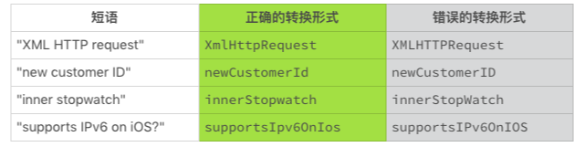
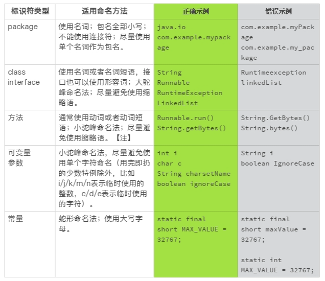
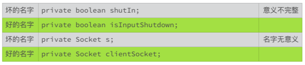
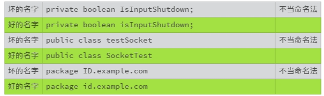

# 05 | 经验总结：如何给你的代码起好名字？

上一节我们讲了编码规范的重要性，而编码规范，从起一个好名字开始。但起名字，也没有我们想得那么简单。有个流传很广的戏言：“计算机科学只有两件难事，废弃缓存和取名字。”


之所以说是戏言，因为取名字这件事无论如何都不算是高深的学问；之所以广泛流传，因为取名字真的就是一件很难的事情，而且起名字是关乎代码质量的大事。


## 为什么需要一个好名字？

名字要准确地代表它背后的东西，并且还能让代码干净漂亮。不然，我们的思路就会受到干扰，影响我们的思考和心情。


比如说，对于答案只有是与非两个选择的时候，我们通常使用布尔类型（boolean）。所以，取名字的时候，我们通常需要一个表达疑问的前缀，比如是不是“is”。

```java
public boolean isEmpty();     // String.isEmpty()
```

但如果我们把这样的疑问前缀，使用到一个非布尔类型上，对于代码要干什么百思不得其解？

```java
public byte[] isEmpty();
```

名字就是沟通的方式，错误的命名很难让我们清楚地理解代码真实的意图。所以，混淆的命名很难让我们阅读和理解代码。


虽然编译器不关心命名的好坏，但是我们却可以从一个好名字中获得巨大的好处。

## 为什么需要命名规范？

虽然起一个好名字的重要性不言而喻，但命名规范的选择，以及执行程度，却是一个有争议的话题。有人喜欢这种规范，有人喜欢那种规范，有人干脆认为规范都太教条，真是众口难调。此外，即使已知且明确定义了命名规范，某些组织也无法始终如一地遵守它们，从而导致不一致和混淆。如果命名规范内部不一致，任意且难以记忆，这些挑战还会加剧。

所以使用一个好的命名规范是非常重要的，我们都能获得哪些好处呢？

1. 为标识符提供附加的信息，赋予标识符现实意义。帮助我们理顺编码的逻辑，减少阅读和理解代码的工作量；
2. 使代码审核变得更有效率，专注于更重要的问题，而不是争论语法和命名规范这类小细节，提高开发效率；
3. 提高代码的清晰度、可读性以及美观程度；
4. 避免不同产品之间的命名冲突。

## 有哪些常见的命名方法？

尽管不同的编程环境、不同编程语言也需要沟通，但遗憾的是，到目前为止，还没有一种通用的命名方法。 在不同的场景下，程序员们有着不同的偏好。我们需要阅读很多代码，多了解一些命名方法，这样我们才能更好地理解不同风格的代码。

我来一一介绍下几种常见的命名方法。

### 1. 驼峰命名法（CamelCase）

驼峰命名法指的是使用大小写混合的格式，单词之间不使用空格隔开或者连接字符连接的命名方式。它有两种格式：大驼峰命名法（UpperCamelCase）和小驼峰命名法（lowerCamelCase）。

大驼峰命名法的第一个单词以大写字母开始，其余的和小驼峰命名法相同。 比如：LastName, InputStream。

小驼峰命名法的第一个单词以小写字母开始，其他单词以大写字母开始，其余字母使用小写字母。 比如：firstName, toString。

有时候，一个名字可能有不只一种合理形式，比如缩略语（IPv6）或者异常的结构（iOS)。 为了减少这种不确定性，Google 定义了以下的转换规则：

1. 从正常的表达形式开始，把短语转换成 ASCII 码，并且移除单引号。 例如，“Müller’s algorithm”转换为“Muellers algorithm”；
2. 如果上述结果含有其他标点符号，比如连字符，在该符号处，把这个结果切分成单词形式。 如果某个单词已经是驼峰形式，也相应地切分开来。 例如，“AdWords”切分成“ad words”，“non-current assets”切分成“non current assets”；
3. 将所有字母转换为小写字母，然后将每个单词的首字母大写，这样就得到了大驼峰式命名的形式； 如果第一个单词的首字母小写，就得到了小驼峰式命名的形式；
4. 将所有的单词连在一起，就是最后的标识符命名。

下面的表格列出了不同例子的正确转换形式，和容易出错的转换形式 （出自“Google Java Style Guide”）。



### 2. 蛇形命名法（snake_case)

在蛇形命名法中，单词之间通过下划线 `_` 连接，比如 `out_of_range`。

### 3. 串式命名法（kebab-case）

在串式命名法中，单词之间通过连字符 `-` 连接，比如 `background-color`。

### 4. 匈牙利命名法（己抛弃）

在匈牙利命名法中，标识符由一个或者多个小写字母开始，这些字母用来标识标识符的类型或者用途。标识符的剩余部分，可以采取其他形式的命名法，比如大驼峰命名法。

如果起始的小字母用来表示标识符的数据类型，这种命名法也被称为系统匈牙利命名法。 比如：

- lAccountNum 标识一个 _ 长整数 _（首字母“l”，long）。
- szName 标识一个 _ 零字符结束的字符串 _（首字母“sz”，zero-terminated string）。

如果起始的小字母用来表示标识符的实际用途，这种命名法也被称为应用匈牙利命名法。 比如：

- rwPosition 标识一个 _ 行 _（首字母“rw”，row）。
- usName 标识一个 _ 非安全字符串 _（首字母“us”, unsafe string）。

由于在微软产品中的广泛使用，匈牙利命名法曾经是一种流行的命名形式。然而，由于这种命名会带来不必要的记忆负担和阅读障碍，导致命名规则的执行和名称的维护都很困难，微软已经抛弃了这种命名形式。

由于历史的原因，还有很多代码使用这种命名形式。阅读这些代码时，你可以选择性地忽略这些表示类型或者用途的字母前缀。

## Java 命名规范

一段代码，是不是只能使用一种命名方法？ 一般来说，一个编码规范会组合使用这些命名方法，每一种命名方法都被规定了适用的范围。 这样就形成了命名规范。


比如，Java 的命名规范可以使用下表来表示。




==需要注意的是，常量必须是真的不能改变的量，不打算改变或者能够改变的量都不能算作常量。==

比如，下面的例子声明的是常量：

```java
static final short MAX_VALUE = 32767;
static final Set<String> EMPTY_NAMES =
        Collections.unmodifiableSet(Collections.emptySet());
```

下面的例子声明的就不是常量，它们的值都可以改变：

```java
static short nonFinalShort = 32767;
static final Set<String> mutableNames = Collections.emptySet();
static final String[] names = { "Alice", "Bob", "Tom" };
```

需要注意的是，方法标识符使用动词或者动词短语，这是传统的方法命名。如果能够分隔开配置（set）和使用（get），使用名词的方法标识符。比如 Builder 模式的接口设计。这个接口设计和命名惯例，我们以后再讨论。

## 怎么取好名字？

了解了命名方法后，你是不是想知道怎么取好名字呢？一般来说，给代码取名字，需要遵守如下三条原则。

### 1. 要有准确的意义

名字要能够准确、完整地表达出它代表的意义，可以见字知意，名副其实。


比如，表达式“a = b - c”的语法是没有什么问题，可是该表达式代表的实际含义并不清楚。相比而言，“grossIncome = grossRevene - costOfGoodsSold”就有很准确、清晰的现实意义。这样的命名更容易阅读和理解。



### 2. 严格遵守命名规范

不同的编程环境，偏爱不同的命名规范，比如 Java 倾向于使用驼峰命名法，C 语言倾向于使用蛇形命名法，CSS 使用串式命名法。 尽管如此，如果定义了个性化的命名规范，请严格遵守自定义的命名规范，如果没有定义个性化的命名规范，我们就需要严格遵守业界普遍公认的命名规范。

### 3. 可读性优先

名字的可读性一定要优先考虑，一般需要注意以下几点。

- 可读性强的名字优先于简短的名字，尽量使用完整的词汇。
- 不要使用缩写、简写、缩略词，除非这些词语被广泛使用。
- 不要使用太短的名字，比如一个字母，除非是广泛接受的特例（i/j/k/m/n 表示临时使用的整数，c/d/e 表示临时使用的字符）。
- 避免含糊、混淆或者误导。

另外，不要混合使用英文和汉语拼音。由于很多类库使用的是英文，如果使用汉语拼音命名，会造成事实上的拼音名字与英文名字的混用，所以也要尽量避免使用拼音命名。



## 小结

简言之，取名字要做到“信、达、雅”（准确、直观、优美）。“信”和“达”是基本要求，有才气的你可以有“雅”的追求。


取好名字是编写优秀代码最基础也是最重要的一项修炼。 你不妨试试上述的原则和规范，将它们用于新代码，或者整理老代码。 仅仅因为名字的优化，你就会立刻感受到代码质量的大幅度提升！

## 一起来动手

所以为了让你更好地实践，我找了一段 Java 代码。你来试试，这段代码中有哪些名字可以优化？ 欢迎你把优化的代码发在评论里，我们亲自感受下如何优化代码名字。

```java
import java.util.HashMap;
import java.util.Map;

class Solution {
    /**
     * Given an array of integers, return indices of the two numbers
     * such that they add up to a specific target.
     */
    public int[] twoSum(int[] nums, int target) {
        Map<Integer, Integer> map = new HashMap<>();
        for (int i = 0; i < nums.length; i++) {
            int complement = target - nums[i];
            if (map.containsKey(complement)) {
                return new int[] { map.get(complement), i };
            }
            map.put(nums[i], i);
        }
        throw new IllegalArgumentException("No two sum solution");
    }
}
```

备注：代码选自https://leetcode.com/problems/two-sum/

你也可以把这篇文章分享给你的朋友或者同事，一起来讨论一下这道小小的练习题。


## 1716143665 拼课微信(27)

- 

  pyhhou 置顶

  2019-01-15

  **7

  思考题：
    \1. 第四行：class Solution -> class TwoSumSolution
    \2. 第九行：public int[] twoSum(int[] nums, int target) { ->
            public int[] twoSumSolve(int[] numbers, int targetNumber) {
    \3. 第十行：map -> targetNumbersRemain
    \4. 第十二行：complement -> remain

  望老师指点，感觉命名确实可以让程序变规范、写代码变高效、读起来更直观、管理起来更方便，谢谢老师

  展开**

  作者回复: 改得漂亮！ 我真没有想到使用remain，语义会更清晰些。👍 类似的，参数名也不是很清晰，也可以改改。

- 

  richey

  2019-01-14

  **8

  范老师，一直有个疑问，有时候为了方法名或类名更好的表意，会把名字起的比较长，但名字太长也感觉不太优雅，这方面有什么好的经验吗？

  作者回复: 如果名字没有超过20个字符，长一点也没关系。如果是代码内部使用标识符，要是使用它的代码还能保持在80个字符以内，再长一点也可以。毕竟，容易理解是最重要的。

  确实有不方便的时候，可以使用首字母缩略词，比如把server name indication缩略成sni，使用类似于sniServerName这样的命名。 缩略语离开语境，就很难理解了，我们可以通过注释或者接口规范弥补这个缺陷，解释清楚缩略语代表什么意思，以及缩写的名字具体的含义。 比如说，

  @param sniServerName the server name of a Server Name Indication (SNI)

- 

  J

  2019-01-14

  **8

  推荐FindBugs插件,不规范命名可以识别出来

  展开**

  作者回复: 是的，工具可以帮助我们查一查。

  顺便的，FindBugs停止更新了，后继者是SpotBugs。前面的留言区有小伙伴提到过。

- 

  雷小鸿

  2019-01-15

  **5

  简单说下我们dao层命名。一般我们dao层都是和数据库交互的。一个dao类对应一个数据库表。可以用数据库表名+dao这样。具体名字严格按照类命名规范。一个表映射一个实体dao类。这个dao类里面的方法只操作对应的表。如果你不是这样的dao。可以相同的业务放在一个dao里面。根据相同的业务命名。只是给那位同学提供参考不一定完全正确。

  展开**

  作者回复: 谢谢！

- 

  ownraul

  2019-01-18

  **3

  一个好名字的确定，也是建立在业务模型稳定的基础之上，如果开发前不能把最终的业务名称用词确定下来，那是很难一下在代码层面把名字定完善的

- 

  MOV AX,0

  2019-01-30

  **2

  编写这段代码时，有两个书写问题，也是我一直所困惑的：
  1.参数中存在多种类型，是否有根据参数类型来在参数声明中，排列参数的规范呢？比如例子中的
  (int[] numbers, int targetNumber)，我希望参数列表呈现出一种递减/增的趋势，由集合到数值，再到布尔类型，或者反过来。例如：Map<String, Object> idNameMap, List<CustomerDto> customers,
  long minBalance, boolean isMember。每个参数所包含元素的复杂度递增/递减，让我觉得有一种美感。
  不知老师怎么看？
  2.类似1中的问题，在方法体内，初始化参数时，我希望参数的初始化顺序是由简至繁。虽然表述有歧义，
  请看我之前贴的代码：
      int testTargetNumber = 7;
      int[] testNumbers = new int[]{1, 2, 3, 4, 5};
  我希望在保证所有初始化的参数，尽量贴近它的首次调用点的前提下，做到简单类型先初始化，每行代码的长度从上至下由短到长。
      可能这些问题，看起来都很无聊没有太多可讨论的地方。但我认为编码就是艺术，艺术在于精进，再简单的东西也要尽量做的赏心悦目。起初这门课程上线时，我也有看大纲，很多已经从sonar刻到骨子里了，想着没有太大必要再买。但一位好友近期要转java开发，我也一时想不到什么特别好的书给他参考。某天点开极客时间，又看到这门课，买下来看了下，确实深有感触。如果自己都没确认好不好，不敢误人子弟。趁着这个机会推荐给他，我自己也再学一遍，也算与他共同学习吧，不知他有没机会看到这段话。也希望老师对我的代码给一点建议，感激不尽！

  展开**

  作者回复: 第一个问题是个好问题。我还没有看到过这方面的书面规范。一般情况下，我使用的方法是按照参数的关联度，或者参数的逻辑关系。

  比如，String.valueOf(char[] data, int offset, int count)，最重要的是data，所以放在第一位。然后是从什么地方开始，使用多少个字符。

  我们如果阅读这个方法的规范，它写的是“Returns the string representation of a specific subarray of the char array argument.” 首先提到的就是data这个参数，然后再说明data的附加条件。

  我觉得可以试试，如何用语言把这个方法描述出来。参数出现的描述中顺序大致就可以是参数在方法中的出现顺序。

  第二种初始化的顺序，也是我常用的顺序。

  可能会有人觉得规范无聊，但是掌握了它的人都知道，好的规范，赏心悦目的代码，可以理清思路，提高效率，减少错误，减轻疲劳。只是大家不知道为什么好，就不知道为什么要规范。所以我也选择了一个不太讨好市场的方式，说了很多为什么好的道理。这确实不性感，不带劲！

  我非常感谢你能给朋友推荐这个专栏。我希望这个专栏的打开方式是从这里看看为什么和一些小例子，找一个详尽的规范看看详细的怎么办，比如阿里巴巴的规范，Google的规范，Java自己的规范等等。然后，使用练手题练习一下，然后把学到的、认可的规范用到自己实际的代码里去。

  写好代码，是一个长期的修行。我自己也在不停地琢磨怎么可以做的更好。共勉！

- 

  allean

  2019-01-14

  **2

  认真规范自己写的代码，感觉很开心了

  展开**

  作者回复: 代码写的好看，真的心情好的。

- 

  🍃Spring...

  2019-01-14

  **2

  抛开编程，其实我们的工作是一种表达，或者沟通，不同的是我们在于两个截然不同的两个主体表达，第一个计算机，它有他的规范，只要满足就能实现。第二个就是人，我们自己，有章有法的表达就是最好的沟通。

  展开**

  作者回复: 👏此处有掌声👏

- 

  人脑逆向工...

  2019-03-18

  **1

  对国内程序员来说提升英语水平会比较明显有助于改善变量命名

  展开**

  作者回复: 😂坚持使用良好的变量命名，反过来也促进英文水平。

- 

  MOV AX,0

  2019-01-31

  **1

  非常感谢您的细心回复！实际工作中，确实会返回空集合，这也是我一直的习惯。因为在例子中返回异常，所以还是按异常来写了。main方法是写给其他初学者看的，刚开始工作时JUnit都不会，只会main来测... 有不少同学提到了阿里的代码规范插件，配合SonarLint更佳！我们公司对异常的处理，是使用了一个ApiResult的类封装返回结果，假设Facade接口内捕获了报错，会使用:
  LOGGER.error("error msg in logger", e);
  return result.error("error msg to invoker");
  这样调用方，可以通过静态方法ApiResult.isSuccess(result)/ApiResult.isFail(result)来判断接口调用是否成功，通过result.getMsg()即可获取错误信息。
  对外接口是绝对不可以抛出异常的，内部调用的服务XxxxService是可以抛出异常的，DAL层不做参数校检且不对外提供服务，参数的校检和异常捕获也应在Service层完成。关于结果返回封装类，网上有很多实现可以参考。

  展开**

  作者回复: 这种ApiResult的处理方式让我想起了C语言时代的错误处理方式。

- 

  lincoln�...

  2019-01-15

  **1

  我觉得dao层的方法，也应该根据不同的业务隔离，不提倡公用(复用)。复用既耦合，大部分业务复杂的CRUD系统，随着后续的维护工作的开展，dao复用带来的弊，比复用带来的利要大的多。

  展开**

- 

  草原上的奔...

  2019-01-15

  **1

  这节课给的命名规则很实用，既见树木，又见森林，范老师不仅告诉我们为什么要用命名编码规范，还说了不同语言业公认命名编码规范，自己不同的命名方法，驼峰，匈牙利，蛇形，串行。命名效果要信达雅。继续跟着范老师精进！

- 

  等

  2019-01-14

  **1

  dao层，与数据库交换层，一般写sql语句，是不是用sql的功能来命名？ 比如getStudentinfo之类的

  作者回复: 谢谢。我对数据库比较陌生了，小伙伴们能不能帮着回答下这个问题？

  \> 如果多个（至少5个）方法调用同一个dao，这个dao要怎么命名好点？还是，以业务功能划分，把这个dao分开？
  以前我做数据库代码的时候，数据库的设计一般按照业务逻辑来的。数据存取接口虽然不涉及具体的业务逻辑，但是由于数据库的设计是按照业务数据来做的，数据存取接口也是按照业务逻辑设计的。这样，接口的命名体现的也是业务数据处理的细分功能。命名的时候，也是使用业务的逻辑表达方式。

  现代的数据库模型是什么样子的，我就不懂了。希望看留言区的小伙伴可以帮帮我。

- 

  等

  2019-01-14

  **1

  老师您好，如果多个（至少5个）方法调用同一个dao，这个dao要怎么命名好点？还是，以业务功能划分，把这个dao分开？

  作者回复: 不好意思，dao是什么意思？

- 

  Being

  2019-01-14

  **1

  学习完后，抬头看自己的代码，嗯，又挑出刺儿来了，好好优化吧，争取做到“雅”🤔

  作者回复: 嗯，又好了一点儿😄

- 

  王小勃

  2019-01-14

  **1

  打卡

  展开**

- 

  Sisyphus2...

  2019-05-21

  **

  代码的命名规范没有共识，但可读性和效率却是大家都在追求的。
  在实践命名的过程中，总是能感觉到代码内部命名和 REST 规则有某种联系。
  package, module, class 都是资源，尽可能用名词，而 function 就像是 API，用动词/动词短语获取资源。

  作者回复: 👍

- 

  小文

  2019-02-14

  **

  老项目驼峰命名方法和匈牙利命名方法混着用，我是应该用哪种呢？求解 😄

  展开**

  作者回复: 建议你使用驼峰命名方法。匈牙利命名方法是历史遗留产物了。

- 

  MOV AX,0

  2019-01-30

  **

  一直以来有两个疑惑：
  1.参数列表中参数的排序规则.
   惯于将类型复杂度由高到低（或相反），排列函数参数，如：
    (Map<String, Object> idNameMap, List<CustomerDto> customers, long minBalance, boolean isMember)

  2.方法中声明/初始化参数的顺序.
   以尽量将参数声明/初始化贴近首次调用位置，为前提下。
   惯于将类型复杂度由低到高，对各个参数声明/初始化，如：
    boolean isMember = true;
    long minBalance = 20000;
    List<CustomerDto> customers = customerService.getByParams(params);
    Map<String, Object> idNameMap = customerWeixinService.getIdNameMapByParams(params);
  个人觉得看起来比较有美感，但还未见有提过这方面的规范。
  最早上线这门课程时，看了下大纲，感觉sonar里基本都提过了，就没有购买。
  直到某天想起编码规范的事，想给朋友推荐一本书来参考，发现没有什么特别深入的书。
  基本都是讲讲命名法之类的就没了，还不如sonar插件。本着推荐人一定要自己先验证的原则，
  买来看了几篇，深有体会。公司很多旧代码，包括现有的一些工作已久的同事，注释都不好好写。
  这个问题也不好提，比较尴尬，因为我也才工作一年多。也不知道我的朋友会不会看到这段话，
  希望他通过这门课程，能够受益终生，我也将与他共同学习。同时也希望老师对我的代码给一些
  宝贵的建议，谢谢！

  展开**

  作者回复: 问题在另外一个留言里回复过了，你找找看看。

  我也理解编码不规范的程序员，他们还没有养成习惯。很多问题，形成氛围就好了。我的同事们一般都比较直爽，有的时候会说，这段代码我看的比较费劲，你加一段注释；这段代码通常不这么处理，你为什么这么干，加一段注释；这个参数无效这么办，规范里写清楚。我自己非常享受这样的氛围。

  这样的氛围形成之前，先把自己的代码弄好，然后看看能不能影响你觉得可以影响的人。

- 

  MOV AX,0

  2019-01-30

  ```java
  import java.util.Arrays;
  import java.util.HashMap;
  import java.util.Map;
  
  /**
   \* Two sum solution util.
   *
   \* @author Easley
   \* @date 2019/1/30
   \* @since 1.0.1
   */
  public final class TwoSumSolutionUtil {
  
      private TwoSumSolutionUtil() {
          throw new IllegalStateException("Error getting an instance of immutable class.");
      }
  
      /**
     \* Given an array of integers, return indices of the two numbers
     \* such that they add up to a specific target.
     \* @param numbers an array of integers.
     \* @param targetNumber a specific target that may be added up to by two numbers in array.
     \* @return an array of integers which contains the two numbers of solution.
     \* @throws IllegalArgumentException numbers is empty or no solution
     *
     \* @author Easley
     \* @date 2019/1/30
     \* @since 1.0.1
     */
      public static int[] getTwoSumSolution(int[] numbers, int targetNumber) {
          if (numbers == null || numbers.length == 0) {
              throw new IllegalArgumentException("numbers cannot be null or empty array.");
          }
  
          Map<Integer, Integer> numberIndexMap = new HashMap<>(16);
          for (int index = 0; index < numbers.length; index++) {
              int remain = targetNumber - numbers[index];
  
              if (numberIndexMap.containsKey(remain)) {
                  return new int[]{numberIndexMap.get(remain), index};
              }
              numberIndexMap.put(numbers[index], index);
          }
          throw new IllegalArgumentException("No solution.");
      }
  
      public static void main(String[] args) {
          int testTargetNumber = 7;
          int[] testNumbers = new int[]{1, 2, 3, 4, 5};
  
          System.out.println("-> params:{numbers:" + Arrays.toString(testNumbers) + ", targetNumber:" + testTargetNumber + "}");
          System.out.println("-> indices of solution numbers:" + Arrays.toString(getTwoSumSolution(testNumbers, testTargetNumber)));
      }
  }
  ```

  注释有点啰嗦，但还是按照公司的规范来写的。个人英文水平比较一般，有语法表述错误的地方，还望见谅和指正！由于字数限制，将我的疑问放在下一条评论中。

  展开**

  作者回复: 这个修改非常棒，特别是加入private的构造方法，废弃掉这个类的实例化，以及把方法声明为静态方法。这些都可以改进效率，使用起来更皮实。

  还可以有改进，比如说不要使用IllegalArgumentException， 因为找不到可能是很正常的情况，使用异常会降低效率。留言区里有人使用返回空数组的做法，你可以参考一下。

  另外，如果有条件，尽量把测试代码（main()）和接口代码分离开来。 main()是public的方法，如果放在一起，不能限制调用者使用这个方法，这可能不是我们想看到的。

