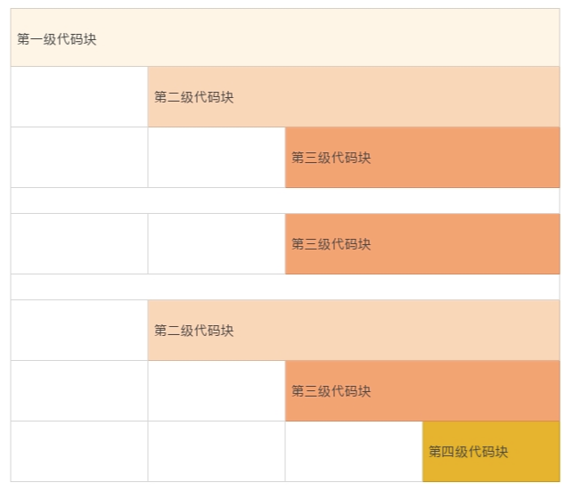

# 06代码整理的关键逻辑和最佳案例

写一篇文章，要层次清楚、段落分明，写代码也是这样。杂志排版，要布局合理，阅读舒适，代码的编排也要这样。

可是很多人想的是，代码能工作就行，不用讲究格式；时间紧，哪有时间整理代码。

可事实上，干净整洁的代码带给我们的，远远不止格式上的赏心悦目，它更可以减少错误，提高我们的编程速度与效率。因为代码的层次结构、格式部署，是我们对自己思维的整理，也是我们思考逻辑的展现。

很多人不愿意整理代码，觉得这项工作很麻烦。其实代码的整理并不复杂，也不需要什么高深的技巧。有效地使用空行、空格和缩进，简单的分割与对齐，就可以使得代码的视觉效果甚至质量发生巨大的变化，理顺编码的思路，提高编码的效率。这是一个付出少、收获大，值得养成的好习惯。

## 给代码分块

其实整理代码，就是给代码分块。我们的大脑接收信息是按照分块的模式进行的。一块就是一个可识别的信息，它被安放到短期记忆的“插槽”里。信息块的实际信息量是可变的，但是越简单、越具体的信息块越容易被记住和理解。

一份好的报纸或者杂志，文章本身往往很简短，或者被分割为简短的块。使用小段落、子标题，大量留白，版面切割，尽一切可能分解文章、版面，让眼睛舒适，让大脑有时间停留下来接受每个信息快。

一个代码文件，可以看做是一个杂志版面。在这个版面里，我们要把代码整理成清晰的模块，这样每一小块在视觉上和逻辑上都是可以区分的，可以帮助我们阅读和记忆，减轻眼睛和大脑的疲劳。

比较下面的两种形式的语句。这两种形式，在实际逻辑上是完全相同的。但是，第二个语句使用了更细化的块，这样视觉形式和逻辑形式都是清晰直观的。

```java
if (firstName != null && lastName != null)
```

```java
if ((firstName != null) && (lastName != null))
```

如果一段代码放眼望去都是大块大块的，那对于一个初学者来说，阅读和理解就非常困难。他需要将复杂的表达式再次分解，分解到可以单独理解的变量和运算符，再重新组合。

你看，这样是不是很麻烦？

一个好的程序员，要识别并且区分代码块，让它们易于阅读和辨认。程序代码分块时，我们需要注意以下三个点。

1. **保持代码块的单一性，一个代码块只能有一个目标**。代码块内所有的内容都是为了一个目标服务的，不能把无关的内容放在同一个代码块里。同一个代码块里语句的相互联系比与相邻代码块里的语句关系更为紧密；
2. **注意代码块的完整性**。代码块是一个完整的信息块。一个代码块要表达一个相对完整的意思，不能一个意思没说完就分块了，就像话说了半句一样；
3. **代码块数量要适当**。代码块过多，会让人觉得路径太长，逻辑复杂，不容易阅读理解。一个基础的代码块最好不要超过 25 行（通常显示屏小半个页面），否则就会有增加阅读理解的困难。

我们读文章的时候，如果段落划分合理，那么读一次差不多就能清楚地记住了。日常阅读的新闻、时事、娱乐报道，和学术著作相比，通常会使用更短的段落。这就是有意缩短信息快，使报道更加适合快速阅读的需要。

同样的，我们划分代码块，就是要让人清楚地阅读和理解。如果一个代码块太长，说明我们还可以进一步细分它。

## 使用空白空间

给代码分块的办法之一，就是有效地使用空白空间。空白的空间虽然没有内容，但会给我们重要的信息提示。因此我们写代码的时候，一定要合理地运用空白。

为什么呢？

靠近的代码会形成一个视觉块，并且具有隐含的关联。分开的代码，意味着上下两段代码的关联没有那么紧密。这种视觉效果会给我们暗示，代码靠得越近，代码之间的关系越紧密。

因此，空白区域，不仅仅可以用来分割代码，还展示了代码之间的关系。

代码的分块，通过空格、缩进和空行来整理，或者分割。其中空格可以进行逻辑区隔，用于同一行代码内部的信息分块。缩进用于水平分割，用于表示代码块的级别。空行用于垂直分割，用于分开同级别的不同代码块。

下面这个简图，可以直观地表示这种代码块的布局方式。



或者，也可以参考下面的代码示例。 这段代码，也包含了使用空格区分同一行代码内部的信息块。

```java
package coding;

public class CodingFormat {
    public static void main(String[] args) {
        System.out.println(
            "German say hello with "
            + Greeting.GERMAN.getGreeting());
    }

    private static enum Greeting {
        ENGLISH     ("English",  "Hello"),
        SPANISH     ("Spanish",  "Hola"),
        GERMAN      ("German",   "Hallo"),
        MANDARIN    ("Mandarin", "Ni Hao");

        private final String language;
        private final String greeting;

        private Greeting(String language, String greeting) {
            this.language = language;
            this.greeting = greeting;
        }

        private String getGreeting() {
            return greeting;
        }

        private String getLanguage() {
            return language;
        }
    }
}
```

那么到底如何利用空白空间呢？可以分为下面四个方法，我来一一讲解一下。

**同级别代码块靠左对齐**
我们阅读的习惯顺序是从左到右，代码也如此。因此不同行，但同级别的代码要靠左对齐。
比如，上面的 CodingFormat 例子中，main() 方法和 Greeting 枚举类都是 CodingFormat 的下一级内容，属于同一级别的两个块。 两个代码块的左侧要对齐。

上面的 CodingFormat 例子中的枚举常量、枚举类的变量、枚举类的方法，也是属于同一级别的内容。 对应地，左侧要对齐。

**同级别代码块空行分割**

我们阅读代码总是从上往下读，不同行的同级别的代码块之间，要使用空行分割。

当我们读到一个空行的时候，我们的大脑就会意识到这部分的信息结束了，可以停留下来接受这段信息。 另外，我们阅读代码的时候，碰到空白行，我们也可以暂停，往回看几行，或者重新回顾一下整个代码块，梳理逻辑、加深理解。

比如，上面的 CodingFormat 例子中，main() 方法和 Greeting 枚举类之间的空白行，getGreeting() 和 getLanguage() 方法之间的空行，都是用来分割不同的信息块的。greeting 变量和 Greeting 构造方法之间的空白行，表示变量声明结束，下面是开始定义类的方法，同样起到分割信息块的作用。

**下一级代码块向右缩进**

我们上面讲了同级别的代码格式，那么不同级别的呢？

区分不同行的不同级别的代码，可以使用缩进。缩进的目的是为了让我们更直观地看到缩进线，从而意识到代码之间的关系。

缩进虽然是一个共识，但怎么缩进是一个富有争议的话题。不同的语言，不同的程序员，有着不同的偏好。

我刚开始工作时，编写代码必须使用制表符缩进，并且要把制表符设置为四个字符空间。那个时候，还没有什么 IDE 可以依赖，大家都使用 vi 编辑器编写代码。缺省的，vi 制表符使用八个字符空间。所以，那个时候我们看代码的第一件事，就是看看 vi 配置有没有把制表符设置为四个字符空间。 要不然的话，代码就凌乱得找不到头绪。

现在，OpenJDK 的代码里已经不允许存在制表符了，缩进统一使用四个空格。也有的缩进规范使用两个空格，或者八个空格。

上面的 CodingFormat 例子中，我们使用了四个空格作为一个缩进单元。下面，我们看看两个空格的缩进，以及八个空格的缩进效果。

两个空格的缩进：

```java
package coding;
 
public class CodingFormat {
  public static void main(String[] args) {
    System.out.println(
        "German say hello with " + Greeting.GERMAN.getGreeting());
    }
 
  private static enum Greeting {
    ENGLISH     ("English",  "Hello"),
    SPANISH     ("Spanish",  "Hola"),
    GERMAN      ("German",   "Hallo"),
    MANDARIN    ("Mandarin", "Ni Hao");
 
    private final String language;
    private final String greeting;
 
    private Greeting(String language, String greeting) {
      this.language = language;
      this.greeting = greeting;
    }
 
    private String getGreeting() {
      return greeting;
    }
        
    private String getLanguage() {
      return language;
    }
  }
}
```

两个空格的缩进，可以为每一行语句释放出更多的空间，从而减少换行，方便我们使用较长标识符或者语句。

两个空格的缩进，视觉上，缩进线靠得太近，相对而言，更容易混淆代码的分块级别。这是两个空格缩进的一个小缺点。

我们再来看下八个空格的缩进：

```java
package coding;
 
public class CodingFormat {
        public static void main(String[] args) {
                System.out.println(
                        "German say hello with "
                        + Greeting.GERMAN.getGreeting());
        }
 
        private static enum Greeting {
                ENGLISH     ("English",  "Hello"),
                SPANISH     ("Spanish",  "Hola"),
                GERMAN      ("German",   "Hallo"),
                MANDARIN    ("Mandarin", "Ni Hao");
 
                private final String language;
                private final String greeting;
 
                private Greeting(String language, String greeting) {
                        this.language = language;
                        this.greeting = greeting;
                }
 
                private String getGreeting() {
                        return greeting;
                }
        
                private String getLanguage() {
                        return language;
                }
        }
}
```

八个空格的缩进，视觉上可以看到缩进线明显，缩进的级别也容易辨认。

但过多的缩进空格也有缺点。它很容易超过每行字数的限制，比如屏幕每行可容纳字符的限制。特别是当我们使用较长标识符或者语句的时候，如果每行字符空间较小（手机屏幕），就很容易导致自动换行，让代码变得难以阅读。

另外，如果我们使用八个空格作为一个缩进单元，为了代码的整洁性，我们往往会被迫使用最少的缩进嵌套，这也导致了额外的复杂性，可读性就降低了。

由于我们倾向于使用有准确意义的命名，标识符的长度往往是一个不能忽视的因素。现在的编码规范，四个空格的缩进最为常见，二个空格的缩进次之，八个空格的缩进使用的较少。

**同行内代码块空格区隔**

我们上面讲的都是不同行的代码该如何注意格式。位于同一行内的代码块，同样需要注意。我们可以使用空格区分开不同的逻辑单元。

比如，逗号分隔符后要使用空格，以区分开下一个信息：

```java
String firstName, lastName;
```

双目运算符或者多目运算符，运算符前后都要使用空格：

```java
firstName != null
 
(firstName != null) && (lastName != null)
```

## 一行一个行为

上面我们讨论了代码块的一些整理办法。 那对于每一行代码，有没有整理办法呢?

当然是有的。

**一个重要的原则是，每一行代码仅仅表示一个行为。这样每一行的代码才是一个常规大小的、可以识别的基础信息块。**

比如说，下面的这行代码就包含了两个行为，一个是判断行为，一个是执行行为。 两个行为放在一行，这样的代码不仅看起来有些乱，我们的大脑处理起来也有些懵。

```java
if (variable != null) variable.doSomething();
```

如果分隔开这两个行为，信息块的区隔会更明显，代码会更清晰：

```java
if (variable != null) {
    variable.doSomething();
}
```

一般一个完整的表达式可以看作是一个独立的行为。


编辑器的宽度，屏幕的宽度，都是有限制的。当一个完整的表达式比较长时，就需要换行。


**基本的换行原则**

我们前面讨论的代码分块的基本思想，同样适用于换行。基本的换行规范需要考虑以下三点。

1. 每行代码字符数的限制。一般情况下，每行代码不要超出 80 个字符（ 80 个字符是传统终端的宽度，比如 vi 编译器）。由于屏幕尺寸和代码阅读终端的变化，现在的很多规范，开始使用 120 个字符的限制。所以我们编码的时候，需要留意一下；
2. 如果一行不足以容纳一个表达式，就需要换行；
3. 一般的换行原则包括以下五点。

- 在逗号后换行。

  ```java
  String variable = anObject.getSomething(longExpressionOne,
          longExpressionTwo, longExpressionThree);
  ```

- 在操作符前换行。

  ```java
  String varibale = longStringOne + longStringTwo
          + longStringThree;
  ```

- 高级别的换行优先。

  ```java
  anObject.methodOne(parameterForMethodOne,
          anObject.methodTwo(parameterForMethodTwo));
   
  / conventional indentation
  int runningMiles = runningSpeedOne * runningTimeOne
                   + runningSpeedTwo * runningTimeTwo;
   
  // confusing indentation                           
  int runningMiles = runningSpeedOne
         * runningTimeOne + runningSpeedTwo
         * runningTimeTwo;
  ```

- 新的换行与上一行同级别表达式的开头对齐。

  ```java
  anObject.methodOne(parameterOne,
                     parameterTwo,
                     parameterTwo);
  ```

- 如果上述规则导致代码混乱或者代码太靠右，使用 8 个空格作为缩进（两个缩进单位）。

  ```java
  anObject.methodOne(parameterForMethodOne,
          anObject.methodTwo(parameterOneForMethodTwo,
                  parameterTwoForMethodTwo,
                  parameterThreeForMethodTwo));
   
  // bad indentation
  if ((conditionOne && conditionTwo)
      || (conditionThree && conditionFour)) {
      doSomething();  
  }
   
  // a better indentation, using 8 spaces for the indentation
  if ((conditionOne && conditionTwo)
          || (conditionThree && conditionFour)) {
      doSomething();  
  }
  ```

## 小结

今天，我给你讲了整理代码的重要性以及一些方法。其实归根结底，整理代码有一个基本的思想，那就是把代码分割成大脑能够有效识别并记忆的信息块，通过合理地使用空行、空格和缩进，把这些信息块清晰地呈现出来。清晰的代码结构，可以帮助我们理顺编码的思路，提高编码的效率，减少编码的错误，提高代码的可读性，降低代码的维护成本。


总之，整理代码带给我们的好处，是很多的。

## 一起来动手

还记得我们上一节的练习题吗？上次我们改名字，这次我们来修改一下代码的编排。欢迎你把优化的代码公布在讨论区，也可以写下你的优化思路，我们一起来看看编排优化后的代码是不是更好阅读了呢？

```java
import java.util.HashMap;
import java.util.Map;

class Solution {
    /**
     * Given an array of integers, return indices of the two numbers
     * such that they add up to a specific target.
     */
    public int[] twoSum(int[] nums, int target) {
        Map<Integer, Integer> map = new HashMap<>();
        for (int i = 0; i < nums.length; i++) {
            int complement = target - nums[i];
            if (map.containsKey(complement)) {
                return new int[] { map.get(complement), i };
            }
            map.put(nums[i], i);
        }
        throw new IllegalArgumentException("No two sum solution");
    }
}
```

欢迎你把这篇文章分享给你的朋友或者同事，一起来探讨吧！


## 精选留言(28)

- 

  草原上的奔...

  2019-01-16

  **4

  今天这篇内容很实用，我现在也有整理代码的习惯，但是只是用的都比较零散，不像本篇中这么系统，而且范老师给出了理论依据。代码块，人体接受信息的方式。有实践方法，有理论支撑，以后整理代码也会更有目标性，同时，在要求别人整理代码时，也会有理有据。最后说一句，看到写的排版很乱的代码，很影响阅读代码的心情，以及理解代码的速度。

  展开**

  作者回复: 知道为什么乱，才好改。

  这一篇的最后一节，我们会总结一些编码规范方面的一些心理学知识。到时候，你在回头看看这一篇的文章，可能会有新的收获。

  编码规范比较杂，知道了背后的道理，运用的就自如些，方便些。

- 

  王小勃

  2019-01-20

  **3

  打卡
  我有一个自己在实践且感觉不错的经验，分享一下:
  举个栗子，我现在准备写一个控制器方法，我会先仔细想想要做一点什么？怎样的顺序？多想几次在脑袋里过一下，但是我不会深想到底怎么做，想好以后，我会先写注释（更准确说应该是提纲），以注释作为思路的引子同时也是一种代码实现思维的分块

  展开**

  作者回复: 这个办法不错。我是在纸上各种画。

- 

  _CountingS...

  2019-01-16

  **3

  因为每一个编辑器的制表符显示出来不一样 有点编辑器 把制表符展示为4个空格 有的编辑器把制表符展示为8个空格 不统一 不同编辑器显示效果不同 使用4个空格就没有这个问题

  展开**

- 

  背着吉他的...

  2019-01-21

  **2

  老师，有的时候，在一个代码块里面逻辑较多，远远超过了25行，这个时候我们是在这个块里写完，还是再分块，分块了又使得同一个目标不同的代码块了，希望老师能看到

  展开**

  作者回复: 一般来说，一个大的逻辑可以分成更小的逻辑，并列的小逻辑或者下层的小逻辑。这些小逻辑，可以分割成代码块，或者包装成方法。所以，一个大块里，你还可以再分小块。

  

- 

  蓝色波浪

  2019-01-18

  **2

  // conventional indentation
  int runningMiles = runningSpeedOne * runningTimeOne +
            runningSpeedTwo * runningTimeTwo;
  这个是不是违背了在操作符前换行这个原则？

  作者回复: 是的。

- 

  hua168

  2019-03-10

  **1

  老师，像我这种没有项目经验，知道类、接口及其修饰符、方法，但不知道什么情况下使用：
  \1. 接口：是抽象方法的集合，一个实现接口的类，必须实现接口内所描述的所有方法。
       理解是当有些方法规定死的就要用接口，比如人的身份证，设置名字、地址、性别等

  \2. 类：类是一个模板，它描述一类对象的行为和状态。对象是类的实例化。
      访问控制修饰符：default、private、public、protected
      非访问修饰符：static、final、abstract（只能继承）、synchronized、transient
             volatile
      继承、多态、
  3.方法： 语句的集合，它们在一起执行一个功能。

  这些基础概念都懂，但是就不知道怎么在项目中应用的，说懂好像又不懂，感觉基础不是很扎实一，我这种情况怎搞？有没有相关文章或书推荐一下，非常感谢？

  展开**

  作者回复: 先要区分类和方法。在面向对象的设计中，类表示的是一个对象。比如人，身份，铅笔，钱包等。一般地，名词或者可以看作名词的词，需要用类来表示。

  方法，一般表示的是行为，也就是你说的执行一个功能。比如买菜，拖地，钓鱼，吃没吃过晚饭，有没有购房资格，都可以看作是行为或者判断。一般地，动词和形容词，或者类似的词，要用方法来表示。

  通常地，一句话，有主语、谓语、宾语，主语和谓语一般表示为类，而谓语就是连接两个类的方法。

  举个例子，“授权的用户可以登录服务系统”这句话里的词语有“授权的", “用户”，“登录”，“服务系统”。那么，“用户”和“服务系统”就可以设计成类，而“授权的”是“用户”这个类的一个方法。“用户”和“服务系统”这两个类里，要分别有方法处理“登录”这个行为。

  而Interface呢，一般用在高度抽象的场合。什么是高度抽象呢？ 比如说，我们知道资源的使用最后应该关闭，那么“关闭”就可以是一个高度抽象的方法。 不管是什么资源，什么类，都可以有一个“关闭”的方法。实现了“关闭”接口的类，都可以调用“关闭”这个方法。 这里面有一个小问题就是，房屋的门可以实现“关闭”，下水管道也可以实现“关闭。可是，房屋和下水管道之间，并没有可以继承的关系。这时候，Interface就可以突破class的继承限制，多个没有继承关系的类，都可以实现Interface。一个类，只能继承一个父类，但是可以实现多个Interface。 比如说，class MySubClass extends MyClass implements Closeablse, Comparable {// snipped}。

  不知道市面上还有没有"面向对象软件构造"这本书。太厚了，可以当作工具书查阅。 另外，多看看、琢磨琢磨Java标准类库的设计。这些API的设计，用“苛刻”这个词形容一点都不过分。这些API的背后，有着大量的权衡和考量，大部分都经得住了时间的考验。琢磨琢磨这些API的设计方式，也是一个学习设计的好办法。

- 

  Dream

  2019-01-17

  **1

  总感觉给出的一些理论，在现实开发有一些是没有必要的。如果每一篇就讲针对性很强的一段代码，不好吗，理论性的东西太多了，对实践转换率不强，

  作者回复: 嗯，我理解你的看法。这也是这个专栏不讨巧的地方。如果讲代码的话，我写的也轻松，你学的也带劲。其实，这也是我一直想和大家讨论的一个问题。

  讲代码很重要。但是，看再多的代码，就这一节来说，我觉得都不如知道“大脑按块接受信息”这个行为模式重要。理解了基础的理论，所有的规范都不用死记硬背，你还可以创造新规范、改进旧规范。

  有时候，我们对于一些规范很纠结，比如使用四个空格的缩进问题，比如if语句后要跟个括号的问题，也很难再实践中被遵守。为什么哪？ 说白了，就是不知道不这样做的危害。很多公司有一套一套的规则，就是执行不了。为啥呢？大家根本不知道规则对自己有什么好处。

  编码规范这东西，随便网上找找，都是一大堆的规范。阿里的规范，Google的规范，Java的规范的规范，都可以找到，讲的比我们这个专栏要全要多。当我开始筹划这个专栏的时候，我给自己定下的目标，是让大家了解为什么；然后给一些例子，说明怎么办。理解了为什么，好多事情你自然就知道怎么办了，这样好多东西才可能成为你自己的东西，而不是我塞给你的东西。

  很可惜的是，这样做的确存在很大的问题：理论成了我要硬塞给你的东西。所以，理论这一块，有人可能就有点抗拒。🤣又让我学没用的理论！

  我们在看代码的时候，很少有人说，这是代码规范规定的，你必须这样改、那样改，按照规范改。这样说，可能没人愿意搭理我们。我们常说的是，这样看着不舒服，那样容易出问题，说的更多的是为什么。如果让我找一找为什么给出理论重要，也许更愉快地工作，算是一点吧。

- 

  lianlian

  2019-01-16

  **1

  哈哈哈，我发现我写得很规范

  展开**

- 

  空知

  2019-01-16

  **1

  老师可不可以多出些题目,可以结合实际练练手~~

  展开**

  作者回复: 嗯，我找找实际的代码。

  就规范这一部分来说，你可以看看OpenJDK的String类的代码，或者其他基础类的代码，看看有什么可以改进的地方。 发现了问题，就给OpenJDK提交bug，提交补丁。

  JDK用的太广泛了，每一个微小的修改，都会用到几十亿台设备上，都很有价值。还能成为OpenJDK成员😊

- 

  pyhhou

  2019-01-16

  **1

  专栏看到现在，很有收获，规范了自己之前没有想到的很多地方，满满的干货，谢谢老师～

  作者回复: 不谢，有收获就好。

- 

  Sisyphus2...

  2019-05-21

  **

  留言里没有一条讨论习题的。。。

  Line 2 后面习惯空两行，表示 import 和代码块之间的区分；
  Line 8 后面空一行，表示注释的区分；
  Line 10 后面空一行，表示初始化的区分；
  Line 17 后面空一行，表示异常的区分；

  空格、空行、缩进都是很好的视觉手段，加上 IDE 提供的收起和展开功能往往能让开发者很直观的看到代码的意图。整理代码逻辑就能很好的分块，我一般代码会分为“基础校检”，“初始化”，“核心代码逻辑” *n，“LBYL”的异常处理等

  展开**

  作者回复: “整理代码逻辑就能很好的分块”！ 这个总结很棒！

- 

  浅吟且行的...

  2019-04-04

  **

  赞老师，理论结合实际的方式很好！学到了原因，更容易理解规范！

  展开**

- 

  hua168

  2019-03-08

  **

  一个代码块只能有一个目标，有点疑问：
  \1. 代码块是不是可以是类、接口、方法(函数)？

  \2. 如果类和方法的话，是不是可以理解类是实现大目标，方法实现小目标？
    我实现一个类，要使用几好个方法，方法一定要独立的吗？

  3.方法和类的使用一直有点判断不了，在什么情况下使用类什么情况使用方法？
   我一个东西可以使用方法实现，也可以使用类实现，是不是能用方法就不用类？

  展开**

  作者回复: 一个大目标可以分解为小目标，大问题分解为小问题，这就是为什么会有缩进的逻辑。

  方法独立的问题，我们后面还会谈到。 如果方法不独立，会有很多问题； 但是也做不到所有软件的所有方法都独立。

  类一般是一个名词，表示一个对象；而方法一般可以使用动词，表示一种行为。从需求中找名词、动词（主语、谓语、宾语，形容词）这是一个常用的面向对象设计的办法。比如，一个授权的客户可以查询他的账户余额，客户、账户、余额，都是对象，可以考虑设计成类，而授权、查询，都是行为，可以考虑设计成方法。该怎么授权呢？ 又是一大堆的描述，这就是把大问题分解成小问题。

  行为也可以设计成类，比如授权当作名词看，就可以是个类。这种情况，需要复用设计，分离出抽象行为的时候用的比较多。

- 

  湮汐

  2019-02-20

  **

  老师，有些时候，因为方法名太长比如aaa.bbb().ccc().ddd()这种结构，换行是应该在“.”前面还是后面？

  作者回复: 两种方式都很常见，“.”前面换行的稍微多一点。

- 

  CGL

  2019-02-19

  **

  Idea的ctrl shift enter了解一下

  展开**

  作者回复: IDEA看来很多人爱啊

- 

  黄朋飞

  2019-01-23

  **

  换行后应该和表达式的哪部分对齐呢？

  展开**

  作者回复: 如果有空间，双倍缩进或者缩进更多到和同级别的表达式对齐。只要多于双倍缩进，怎么好看怎么来。

- 

  xavier

  2019-01-22

  **

  感谢老师的讲解。规范的目的是提高代码可读性，便于交流。这些规范不是死板的，每个人可以根据自己的喜好，在不违背基本要求的前提下，选择自己认可的编码方式。不要过于纠结用哪一种方式。比如方法的{}花括弧，我就喜欢每个单独一行。另外可以使用一些代码格式化的插件，实现老师文中提到的一些基本编码格式。

  展开**

  作者回复: 是的，认为写好代码只有一种规范是不对的。所以，我们要理解规范要求背后的一些东西，这样就计较容易写出别人看的顺眼的代码。不过，如果一个项目有规范，还是要遵守的。审美偏好太难协调，每个人一套规范也很麻烦。

  插件是个好东西。有些规范，也是我们思考的逻辑的延展。要是编写代码的时候，就主动使用规范，也能帮助我们写好代码。

- 

  Kai

  2019-01-19

  **

  可以使用一些lint工具自动格式化代码

  展开**

  作者回复: 写好的代码可以自动化格式化一下。 还没写的代码，可以自己来格式化。这样编写代码的时候，心里的逻辑是清晰的，有利于编码速度，降低错误。

- 

  wwww

  2019-01-18

  **

  和实习所想相当契合 学习了~

  展开**

- 

  👽

  2019-01-17

  **

  其实个人认为。划分代码块的话，主要还是参照可阅读性。
  if（ a == b && b == c）
  和
  if（（a == b） && （b == c））
  实际使用中我其实偏向于第一种。
  比起第二种，反而第一种显得清爽直观一些。

  展开**

  作者回复: 规范有很多不同的审美偏好，上面你举得例子在实践中就很难协调。

  以前，我个人喜欢第一种，我很清楚 `==` 和'&&'的运算符优先级，以及运算的顺序。但是，我的同事，有的就比较抗拒第一种，每次看到类似的代码，都会建议我改成第二种，要不然他们就会问我 `==` 和'&&'的运算顺序。现在，我有时候还是会使用第一种(难缠的惯性)，但是一旦我意识到可读性有了问题，我也愿意使用第二种。如果还没有养成习惯，总是使用第二种，可能是一个更简单的选择。

  规范的一个其中好处，就是不让审美偏好的争执影响我们的工作。
