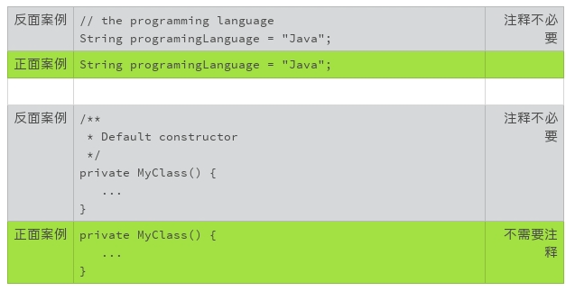
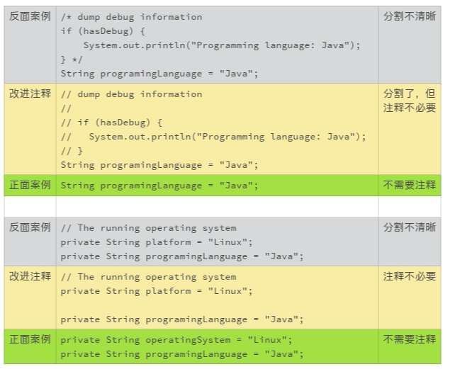
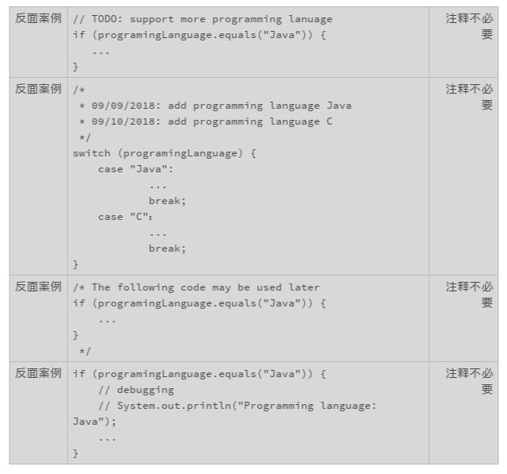
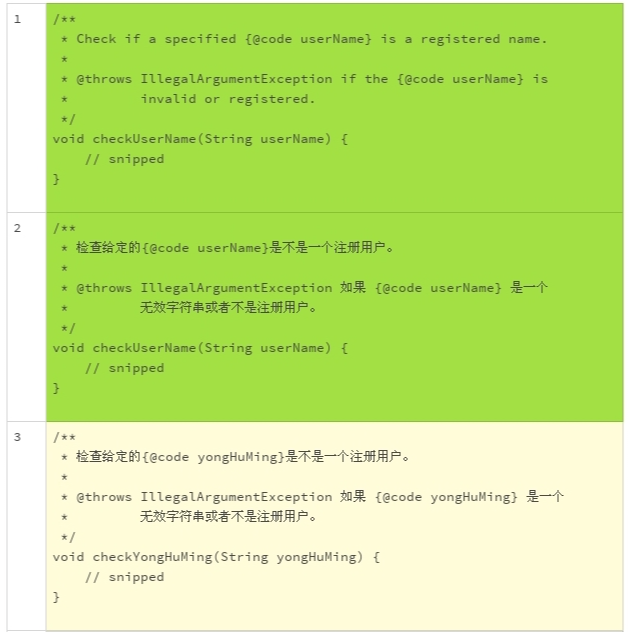
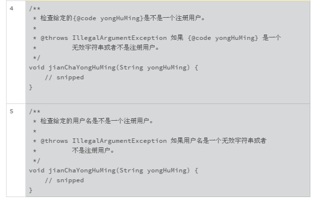

# 07写好注释，真的是小菜一碟吗？

上一讲中我们讲了如何整理代码，但有些时候，即便我们取好了名字，编排好格式，但代码还是让我们抓狂，不明出处，不好理解。这时候，就需要注释登场了。


顾名思义，注释就是对代码的解释。注释不需要运行，它是用来提高代码的可读性和可维护性的。不好的注释会使代码变得更糟糕，使人更抓狂。


理想虽丰满，现实很骨感。注释虽小，写好不易。那写注释有哪些注意事项？有没有什么技巧呢？今天我们就来聊聊写注释这个话题。


当然了，不同的语言，注释的语法差别很大。为方便起见，我们统一使用 Java 语言的注释语法，来解释说明写好注释的基础原则。

## 注释是无奈的妥协

那你是不是有这样一个问题，源代码一定需要解释吗？


其实在理想状况下，代码不需要注释。理想的代码，命名恰当，结构清晰，逻辑顺畅，含义显而易见。但正如一个作家无法预料他的读者能否清晰地理解他的文字一样，一个程序员也不能判断他的读者能否清晰地理解他写的代码。所以，写注释其实是下巧功夫。


可是，注释也是一个麻烦鬼，可能会给我们带来三个麻烦。


首先，**因为注释不需要运行，所以没有常规的办法来测试它**。 注释对不对？有没有随着代码变更？这些问题都是写注释需要注意的地方。**注释难以维护，这是使用注释带来的最大的麻烦**。


另一个麻烦是，**注释为我们提供了一个借口**。使用注释来解释代码，是注释的本意。但是，我们有时候会过度依赖解释，从而放弃了潜在的替代方案，比如更准确的命名，更清晰的结构，更顺畅的逻辑等等。 **注释，被我们用成万能的狗皮膏药，有时会让代码更糟糕**。


比如，下面的代码和注释，看起来没毛病，但读起来很吃力。

```java
String name1;  // first name
String name2;  // last name
```

如果使用准确、有意义的命名，我们就可以去掉没有意义的注释了。

```java
String firstName;
String lastName;
```

还有一个麻烦，就是**注释的滥用**。 由于注释部分不被执行，那么就可以被用来注释掉一些不需要的东西。比如，在正式的产品代码中，注释掉调试信息、代码块、俏皮话等等。

比如说，看到下面的注释，你是不是立即就转移注意力了？ 我理解这个注释的初衷是幽默一下，但是众口难调，这样的注释有些人感觉到的不是幽默，而是散漫和业余。

```java
// 哈哈，有没有人姓好，叫“好名字”？
String firstName;
String lastName;
```

讲了这么多，总结一下，注释是代码的一部分，是需要阅读的内容，目的是让其他人能更好地理解我们的代码，写注释需要我们有“用户思维”。虽然也有过度依赖注释的情况，但是，对于大部分程序员来说，问题还是注释太少，而不是太多。

## 几种常见注释类型

接下来，我们就聊聊几种常见的注释类型。一个典型的源代码文件，一般包含不同类型的注释。不同类型的注释，有着不相同的要求，适用于不同的注释风格和原则。


**第一种类型，是记录源代码版权和授权的**，一般放在每一个源文件的开头，说明源代码的版权所有者，以及授权使用的许可方式，或者其他的公共信息。比如，如果是个人的代码，版权信息可以写成：

```java
/*
 * Copyright (c) 2018, FirstName LastName. All rights reserved.
 */
```

一般来说，版权和授权信息是固定的。版权和授权信息是法律条款，除了年份，一个字都不能更改。对于每个源代码文件，我们记得复制粘贴在文件开头就行。**需要注意的是，如果文件有变更，记得更改版权信息的年份（比如上例中的 2018）**。


**第二种类型，是用来生成用户文档的**，比如 Java Doc。 这部分的作用，是用来生成独立的、不包含源代码的文档。 这些文档帮助使用者了解软件的功能和细节，主要面向的是该软件的**使用者**，而不是该软件的开发者。 比如 Java 的 API 规范的文档。


**第三种类型，是用来解释源代码的**。换句话说，就是帮助代码的阅读者理解代码。这是大家默认的注释类型，也是我们今天讨论的重点。

## 简化注释的风格

上面我们介绍了三种常见的注释类型，下面就针对这三种注释类型，再给你介绍**三种风格**的注释。


**针对第一种注释类型，也就是固定的版权和授权信息，使用一般的星号注释符（/\*-\*/）**。注释块的首行和尾行只使用星号注释符，中间行以缩进一个空格的星号开始，文字和星号之间使用一个空格。注释的每行长度限制，和代码块的每行长度限制保持一致。


比如：

```java
/*
 * Copyright (c) 2018, FirstName LastName. All rights reserved.
 */
```

**针对第二种注释类型，即生成用户文档的注释，使用 Javadoc 要求的格式，文档注释符（`/**-*/`）**。 除了首行使用特殊的文档注释符（`/**`），其他的格式和第一种风格保持一致。


比如：

```java
/**
 * A {@code Readable} is a source of characters. Characters from
 * a {@code Readable} are made available to callers of the read
 * method via a {@link java.nio.CharBuffer CharBuffer}.
 *
 * @since 1.5
 */
public interface Readable {
   ...
}
```

**针对第三种注释类型，也就是代码解释注释，只使用行注释符（//）**。 每行长度限制，和代码块的每行长度限制保持一致。

比如：

```java
// Verify that the buffer has sufficient remaining
private static void verifyLength(
        ByteBuffer buffer, int requiredLength) {
    ...
}
 
String myString;  // using end-to-line comment
 
// This is a multiple line comment.  This is a multiple
// line comment. 
if (!myString.isEmpty()) {
   ...
}
```

写代码注释时，我一般只用这三种风格。它们各自有固定的使用范围，简单直观，规避不必要的代码错误。也不会让别人混淆注释的类型。


我不会使用如下的注释，因为这种注释风格可能和有效的代码混淆在一起。 注释越长，错误越容易隐藏起来。

```java
/*
 * This is a multiple line comment.  This is a multiple
 * line comment.
 
 if (programingLanguage.equals("Java")) {
    ...   
 } */
```

当然了，肯定有人会喜欢上述的风格，因为这种风格可以注释掉不用的代码。这一点，方便我们调试分段代码。我自己在调试的时候也喜欢使用这种注释方式，但是一旦调试结束，我就会清理掉这些注释。


从我自己的经验来看，养成这样的习惯很有帮助：**如果一段代码不再需要，我会清理掉代码，而不会保留这个注释掉的代码块。**不要在源代码里记录代码历史，那是代码版本管理系统该干的事情。

## 注释的三项原则

那么，用来解释源代码的注释有什么需要注意的地方吗？为了规避注释的种种麻烦，有没有什么原则我们必需要遵守呢？我总结了以下三点。

1. **准确**，错误的注释比没有注释更糟糕。
2. **必要**，多余的注释浪费阅读者的时间。
3. **清晰**，混乱的注释会把代码搞得更乱。

比如，当我们说编程语言时，一定不要省略“编程”这两个字。否则，就可能会被误解为大家日常说话用的语言。这就是准确性的要求。


如果代码已经能够清晰、简单地表达自己的语义和逻辑，这时候重复代码语义的注释就是多余的注释。注释的维护是耗费时间和精力的，所以，不要保留多余的、不必要的注释。



如果注释和代码不能从视觉上清晰地分割，注释就会破坏代码的可读性。


另外，不要在代码里标注你想要做的工作和已经做过的工作。比如使用 TODO，记录代码更改记录等等。这些信息会干扰代码的阅读者。


特别需要注意的是，我们可以使用临时的调试语句，但是，不要把代码的调试语句保留在提交的代码里。这些调试语句，既不容易维护，也不容易阅读。



## 注释用英文还是汉字呢？

你会注意到，上面的代码案例中，我基本使用的是英文注释，在这里我也建议你使用英文注释。

特别是国际化的项目，比如说贡献给 Apache 的项目，就没有办法使用中文注释了。而且，如果是去面试，我也会尽最大的努力不使用中文注释，以免踩到坑。

除了接受度之外，汉字带来的真正困扰是，它会影响到编码风格的偏好。比如命名的问题，到底是应该使用拼音还是英文？ 由于代码命名只能使用 ASCII 字符，注释里的拼音、英文、汉字混杂的问题该怎么处理？代码编辑时，字符的切换也是一个麻烦事。比如，空格使用汉字全角，编译器会报错，但是肉眼看不到，问题排查起来也很心累。

那么什么情况下使用汉字呢？

面对国内的需求文档的时候。因为很多项目的需求文档一般是汉字书写的。程序的编码，当然需要按照需求来。如果需求的引用还要翻译成英文，那就太麻烦了。

还有一种状况，就是团队的英文水平不太好。与其使用难以读懂的蹩脚英文，不如使用大家更熟悉的中文注释来的便捷。不过，我对这种状况的担心越来越少，现在大部分年轻软件工程师的英语水平是可以让人放心的。

试着对比下面的几种注释，你喜欢哪一种呢？





上面的五种不同的风格，我个人比较喜欢第一种和第二种，第三种也可以接受。 但是我会尽量避免第四种和第五种风格。

总结一下，今天我们讨论了怎么写好注释这个话题，希望你能理解一个基本的原则：注释是用来提高代码的可读性和可维护性的。 不要让注释偏离了这个原则，破坏了代码的逻辑和可读性。你也可以实践一下我们讨论的“三项原则”和“三种风格”，看看能不能让你的代码变得更友好？

## 一起来动手

还记得我们上一节的练习题吗？前面，我们改了名字，改了编排。这一次，我们来修改注释。认真读一下这段代码，看看有需要增加或者修改注释的地方吗？欢迎你把优化的代码公布在讨论区，我们一起来感受修改后的代码是不是更好阅读，更好维护。

```java
import java.util.HashMap;
import java.util.Map;
 
class Solution {
    /**
     * Given an array of integers, return indices of the two numbers
     * such that they add up to a specific target.
     */
    public int[] twoSum(int[] nums, int target) {
        Map<Integer, Integer> map = new HashMap<>();
        for (int i = 0; i < nums.length; i++) {
            int complement = target - nums[i];
            if (map.containsKey(complement)) {
                return new int[] { map.get(complement), i };
            }
            map.put(nums[i], i);
        }
        throw new IllegalArgumentException("No two sum solution");
    }
}
```

## 精选留言(18)

- Code Tells You How, Comments Tell You Why.

- 要写好注释首先要思考怎么不写注释

- 老师最后讲的五种风格，第三种风格和第四种风格有什么区别，只发现了颜色区别，其他的一样

  作者回复: 第三种风格和第四种风格区别在方法的命名上。嗯，不太容易看出来。

- 尽量不写注释，尽量用代码告诉别人我的思想。注释用来写代码无法表达的东西，比如我当时为什么这么写，其他想法等。

- 留言区没有人讨论课后题，我抛砖引玉下。注释就像文中所说，准确、必要和清晰最重要，也就是说在不同的团队同一段代码的注释会不同，因为团队能力不同。这里我试着用比较完整的方式做一段注释，如果团队能力好，一些部分是可以省略的

  import java.util.HashMap;
  import java.util.Map;

  class TwoSumSolution {
    /**
     \* Given an array of integers, return indices of the two numbers
     \* such that they add up to a specific target.
     */

    public int[] twoSum(int[] nums, int target) {
      // init a map storing number and its index relation
      Map<Integer, Integer> map = new HashMap<>();

  ​    for (int i = 0; i < nums.length; i++) {
  ​      // calculate the complement of current number
  ​      int complement = target - nums[i];
  ​      // if map contains the complement, return complement directly, else update map with current number
  ​      if (map.containsKey(complement)) {
  ​        return new int[] { map.get(complement), i };
  ​      }
  ​      map.put(nums[i], i);
  ​    }
  ​    
  ​    // if the sum of any two numbers is not equal to the specific target, throw illegal argument exception
  ​    throw new IllegalArgumentException("No two sum solution");
    }
  }

  展开**

  作者回复: 👍

- 

  卞雪达

  2019-05-14

  **

  如果一段代码不再需要，我会清理掉代码，而不会保留这个注释掉的代码块。
  --我简直不能再同意了，我曾因为错误的注释代码而导致十几万的损失，我那时候测试分支特别喜欢用注释代码的方式，因为在一个文件甚至方法里复制并注释两下，是很快能达成一个分支的。这种错误的习惯一旦养成，隐患大大滴。正如您说的，这种情况应该使用版本控制。切换的时候，应该切换不同版本的文件。确定的分支如判断开发环境或生产环境，我喜欢用配置文件…应该，是受到前端套路的影响，你知道各种前端框架都喜欢isDev，我慢慢的…觉得好像还不错…

  展开**

  作者回复: 我可能要极端一点，配置文件可以，但是判断是开发环境还是生产环境的，然后使用不同分支的代码不应该出现，也是一大堆的问题。


  我从来没在注释里用过｛code userName｝这样的用法，以后需要改进

  展开**

  作者回复: 嗯，防止指代不明。

- 还是喜欢中文，文中的indices就不知道啥意思，翻译后才知道是指数，有时候看英文注释个别单词不认识很郁闷😒

  作者回复: 随着视野的不断扩张，早晚会习惯英文的。

- 

  峰人院

  2019-01-24

  **

  第三四五种不用是因为用了拼音吧🤣，第五种注释有问题，注释没有完结的 /，后面的代码都不能用啦，谢谢老师指点

  作者回复: 嗯，我漏掉了尾部注释符号这一行。 谢谢！

- 

  王小勃

  2019-01-20

  **

  打卡

  展开**

- 

  草原上的奔...

  2019-01-18

  **

  老师最后留的题看半天才发现是返回两个数的索引，这两个数的和为target，若不存在，则抛出异常，方法的注释应该把异常抛出的情况也讲出来，同时，注释中的indicate感觉改为index更好理解。

  展开**

  作者回复: 练手题的注释缺了很多注释，难以理解。已经有的注释，使用的也不规范。你找到的两个都是很好的改进。

- 

  DemonLee

  2019-01-18

  **

  老师，如果我有一个函数，只是先写了一个空函数（类似于定了一个接口），这个时候我会写个注释说待完善，感觉是不是也不能写了？我感觉这有点类似于警告的性质，就是说提醒开发者，后续要注意

  展开**

  作者回复: 空函数有人使用吗？ 没人用要删掉，有人用函数的功能要清楚。

  有的时候，的确需要一些提醒类的东西，但是要标记清楚问题，不要含混。 要不然，一旦忙起来，忘记了修改，以后自己看到都记不起来了。OpenJDK的代码里就有不少这样的失误，改起来很费精神，要校对注释和代码，比重写一遍都麻烦。

  当然，代码没提交之前，特别是编码和调试的时候，可以多用些注释提醒下。我一般会把这样的注释和代码，顶格些，提交之前浏览下，这样就不容易忘记删除了。

- 

  王智

  2019-01-18

  **

  心酸,被打击到了,表示毕业半年,在校英语就不好,现在依旧,看到要用英文写注释表示头疼,一直想学好英语但不知道从哪里下手,看来下去得多尝试尝试英语了,增强一下英语水平,不然就只能使用idea的插件进行翻译了,(╥╯^╰╥)!!!

  展开**

  作者回复: 写代码的，那么多的英文文献要看，英文想不好都不太容易。时间长点，就适应了。
