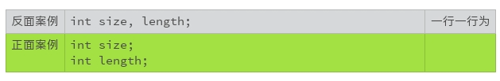
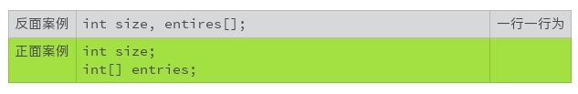
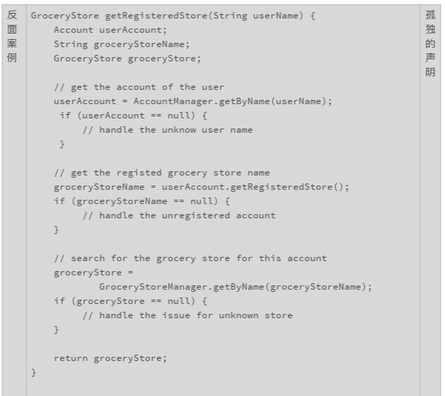
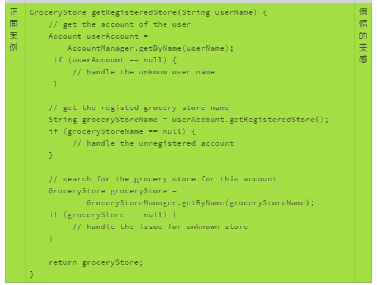
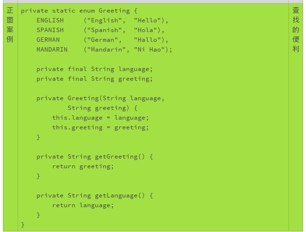
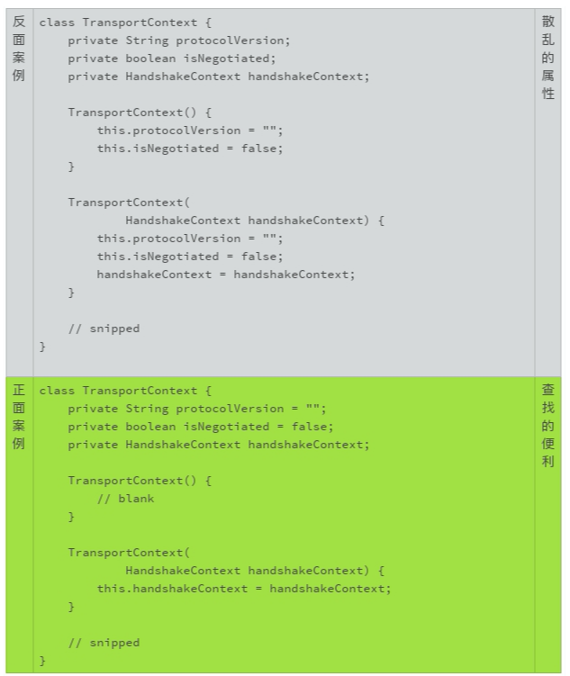
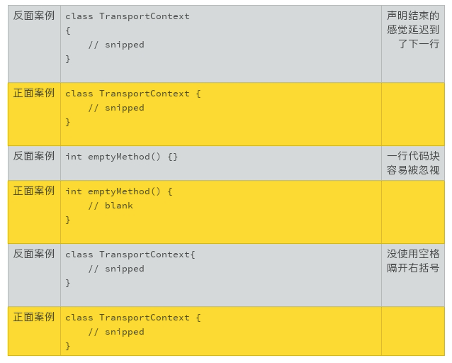
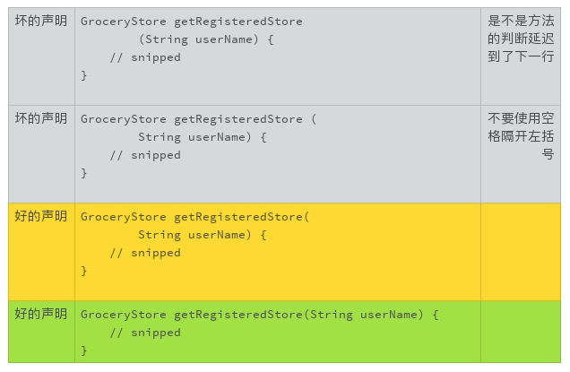
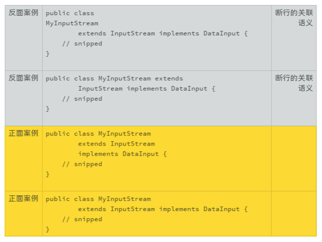

# 08 | 写好声明的“八项纪律”

我们在前面讨论了该怎么取一个好名字。在编程语言里，我们使用标识符来表示不同的逻辑和对象。声明就是用来定义这些标识符的。标识符声明的地方，就是取名字和第一次使用名字的地方。这一次，我们聊一聊该怎么声明一个标识符。

“声明”是我们和标识符初次见面的地方，第一印象就显得特别重要。如果我们忘记了，回头能够清晰地找到它，也很重要。如果我们印象模糊了，回头能够重新认识它，对于我们阅读程序也有很大的帮助。

一个标识符，不仅仅只是一个名字。 像人分男女、高矮胖瘦一样，标识符也可以有附加信息，用来增强人们对它的认识。

一个声明，一般至少包含两个部分，一个是标识符的名字，一个是标识符的类型。 比如：

```
int size;
复制代码
```

有的声明，还有修饰和限定部分，比如 Java 的访问控制修饰符（private，public 等）：

```
private int size;
复制代码
```

或者 C 语言的存储类别限定符（auto，extern 等）：

```
auto int size;
复制代码
```

写声明很简单，但写好声明也并非易事。我们以 Java 语言为例来讨论声明的编码风格。在 Java 语言里，声明可以用来定义类、方法、类变量、局部变量和常量。不同声明的语法有着巨大的差别，但是也有很多共通的地方，你可以把这些思路用在自己熟悉的语言上。

接下来，我会带你一起来学写好声明的“八项纪律”。

## 取一个好名字

既然是标识符，就涉及到取名字的问题。我们前面已经讨论过“怎么取好名字”这个话题了，你可以复习一下。

## 一行一个声明

我们在前面讨论过“一行一个行为”的代码整理规则。这一规则，同样适用于标识符的声明。不推荐在同一行里声明多个变量，即使这一行很短。



这样可以很方便地变更和维护代码。 比如，下面的两个代码变更，第二种格式更容易发现大意的错误。

```
- int size;
+ int size, length;
  int size;
+ int length;
```

下面这个代码变更例子，也是同理。

```
- int size, length;
+ int size;    // size of the list
+ int length; 
- int size;
+ int size;    // size of the list
  int length;   
```

另外，不要在同一行声明不同类型的标识符。



需要注意的是，表示数组的中括号 `[]` 是类型的一部分，而不是标识符的一部分。无论是 Java 语言，还是在 C 语言的代码中，我都建议把数组符号放在类型该在的地方。


## 局部变量需要时再声明

标识符的声明应该和它的使用尽可能地靠近，特别是局部变量的标识符声明。这样在视觉上，标识符的定义和使用，可以方便我们阅读和记忆。


比如，在下面的例子中，GroceryStore 的声明就太早了。如果代码再长一些，等我们读到代码的末尾时，前面声明的变量很可能都忘记了，如果还要返回来查看这个具体的声明，那就太麻烦了。





## 类属性要集中声明

同样是为了阅读和记忆，类变量的声明则要集中。因为类变量无论是私密变量，还是公开变量，在类的方法实现中，随时都可以调用。我们需要把这些变量放在一起，以便于修改和查找。


在下面的例子中，变量的声明散乱在类的代码块里。如果我们想要新加一个方法，或者调整方法声明的顺序，代码马上就会变得混乱不堪。




## 声明时就初始化

除非变量的初始值依赖于更多的条件，或者涉及到一定的计算，否则，声明时就应该完成初始化。声明时初始化，可以防止初始化的遗漏或者不必要的代码重复。


在下面的例子中，你可以设想一下，如果变量 _isNegotiated_ 是后来加入的属性，哪一种编码方式更容易变更、更容易维护？



## 尾随的花括号

一般来说，类声明和方法声明后，要使用花括号把实现的代码包括进来。花括号的使用语法很随意。我不建议代码中混杂地使用不同的格式。我只推荐一种方法：

1. 左括号不要单独成行，要紧随在语句尾部，以一个空格隔开；
2. 右括号单独一行。



## 靠紧的小括号

小括号的使用语法也可以很随意。小括号一般用来识别一个标识符是不是方法标识符，所以建议小括号要紧靠着标识符，中间不要有空格。



## 搜索优化的换行

搜索优化是我们编写代码时要考虑的一个因素。搜索优化既包括针对搜索引擎的优化（SEO），也包括针对编辑器（vi, Netbeans）以及系统工具（grep）的搜索优化。

常见的搜索模式有：

- “public class”
- “abstract class”
- “class TheClassName”
- “extends TheClassName”
- “implements TheInterfaceName”
- “theMethodName(”

这些常用的搜索模式给了我们一个很好的启示：语义相关的词语，常见的搜索模式，要尽量放在用一行。



## 小结

我们讲完了写好声明的八项原则，虽然相对来说比较细致，但基本的大原则主要有两个：

- 取好名字
- 容易识别

掌握住这两条大原则，你会慢慢积累更多的最佳实践案例和纪律细节，让自己的代码声明越来越好读、越来越好用。

## 一起来动手

所以为了让你更好地实践，我找了一段 Java 代码。你来试试看，怎么把这段代码改得更漂亮？欢迎你把优化的代码公布在讨论区，我们一起来看看这段代码都有哪些可以改进的地方。

```java
import java.util.ArrayList;
import java.util.HashMap;
import java.util.List;
import java.util.Map;
 
class Solution {
    /**
     * Return a list of the words in words that match the given pattern.
     *
     * A word matches the pattern if there exists a permutation of
     * letters p so that after replacing every letter x in the pattern
     * with p(x), we get the desired word.
     *
     * Example:
     *     Input: words = ["abc","deq","mee","aqq","dkd","ccc"],
     *            pattern = "abb"
     *     Output: ["mee","aqq"]
     *
     *     Explanation: "mee" matches the pattern because there is
     *         a permutation {a -> m, b -> e, ...}.
     *
     *        "ccc" does not match the pattern because
     *        {a -> c, b -> c, ...} is not a permutation, since a
     *        and b map to the same letter.
     */
    public List<String> findAndReplacePattern(String[] words, String pattern) {
        List<String> ans = new ArrayList();
        for (String word: words)
            if (match(word, pattern))
                ans.add(word);
        return ans;
    }
 
    public boolean match(String word, String pattern) {
        Map<Character, Character> M = new HashMap();
        for (int i = 0; i < word.length(); ++i) {
            char w = word.charAt(i);
            char p = pattern.charAt(i);
            if (!M.containsKey(w)) M.put(w, p);
            if (M.get(w) != p) return false;
        }
        boolean[] seen = new boolean[26];
        for (char p: M.values()) {
            if (seen[p - 'a']) return false;
            seen[p - 'a'] = true;
        }
        return true;
    }
}
```

备注：代码选自https://leetcode.com/problems/find-and-replace-pattern/

欢迎你把这篇文章分享给你的朋友或者同事，一起来探讨吧！


## 精选留言(12)

- 

  pyhhou

  2019-01-22

  **2

  第28，29，39，40，44行相对应带上大括号会更好
  第39，40，44行属于一行表示多重行为，不便于观察和理解，换行会更好
  第28，31，36，42，47行的代码与前面的代码没有很好的分块，构成不了视觉上面清晰的代码块，在前面加上空行会更好
  第35行命名不够清晰，修改为Map<Character, Character> charMapping = new HashMap<>();
  第29行，就像前面 @背着吉他的大漠狼 同学说的，if 里面的 match 函数其实表示的意义不太明确，读者需要去看 match 函数的大致实现，如果在此之前定义一个boolean isMatched = match(word, pattern); 再将 isMatched 放到 if 里面会好很多；而且把函数直接放在 if 语句里面其实也违反了我们之前提到的单行单一行为的原则，因为运行函数返回结果和表达式条件判断在概念上本就是两个完全不同的行为

  能看到的就这些了，不足之处还请老师和大神们补充

  展开**

  作者回复: 找的都很棒！

- 

  王智

  2019-01-21

  **2

  \```
  import java.util.ArrayList;
  import java.util.HashMap;
  import java.util.List;
  import java.util.Map;

  class Solution {
    /**
     \* Return a list of the words in words that match the given pattern.
     *
     \* A word matches the pattern if there exists a permutation of
     \* letters p so that after replacing every letter x in the pattern
     \* with p(x), we get the desired word.
     *
     \* Example:
     \* Input: words = ["abc","deq","mee","aqq","dkd","ccc"],
     \* pattern = "abb"
     \* Output: ["mee","aqq"]
     *
     \* Explanation: "mee" matches the pattern because there is
     \* a permutation {a -> m, b -> e, ...}.
     *
     \* "ccc" does not match the pattern because
     \* {a -> c, b -> c, ...} is not a permutation, since a
     \* and b map to the same letter.
     */
    public List<String> findAndReplacePattern(String[] words, String pattern) {
      List<String> ans = new ArrayList();
      for (String word : words) {
        if (match(word, pattern)) {
          ans.add(word);
        }
      }
      return ans;
    }

    public boolean match(String word, String pattern) {
      Map<Character, Character> M = new HashMap();
      for (int i = 0; i < word.length(); ++i) {
        char w = word.charAt(i);
        char p = pattern.charAt(i);
        if (!M.containsKey(w)) {
          M.put(w, p);
        }
        if (M.get(w) != p) {
          return false;
        }
      }
      boolean[] seen = new boolean[26];
      for (char p : M.values()) {
        if (seen[p - 'a']) {
          return false;
        }
        seen[p - 'a'] = true;
      }
      return true;
    }
  }
  \```
  改成我喜欢的格式,虽然不一定准确,但是自己看上去舒服很多

  展开**

  作者回复: 舒服很多就是收获了。

- 

  allean

  2019-01-21

  **2

  细节无小事，高手不是掌握了降龙十八掌，而是简单的事也能做到极致，学习了。

  作者回复: 质量的事是大事（追求），质量的事是小事（执行）。

- 

  Y024

  2019-01-29

  **1

  代码图片建议用 carbon 美化下，可读性会更好：）

  https://carbon.now.sh/

  展开**

  作者回复: 刚注意到代码图片里的一些规范问题，手误。 看了下carbon，很不错的工具。 谢谢推荐！

- 

  Sisyphus2...

  2019-05-22

  **

  声明包含命名规范和类型，命名规范之前的文章探讨过，我觉得这里更重要的是类型。文中提到很多格式上的注意，我补充一些类型上的探讨，使用类型上有很大学问，个人觉得 function 能解决的不用 class，不变的变量要使用 immutable 的类型，避免中间赋值的改变，整型能表达的不用浮点型，金钱等精确度要求高的变量转换成整型。

  另外就是不同代码模块传参的时候，相同声明可能会造成误解，或者一些语言会出现不同 namespace 不可知的变量值改变。

  展开**

  作者回复: 都是很好的经验！ 谢谢分享！

- 

  拉格朗日的...

  2019-02-22

  **

  import java.util.ArrayList;
  import java.util.HashMap;
  import java.util.List;
  import java.util.Map;

  class Solution {

    private static final char CHAR_VALUE = 'a';
    
    
    /**
     \* Return a list of the words in words that match the given pattern.
     *
     \* A word matches the pattern if there exists a permutation of
     \* letters p so that after replacing every letter x in the pattern
     \* with p(x), we get the desired word.
     *
     \* Example:
     \* Input: words = ["abc","deq","mee","aqq","dkd","ccc"],
     \* pattern = "abb"
     \* Output: ["mee","aqq"]
     *
     \* Explanation: "mee" matches the pattern because there is
     \* a permutation {a -> m, b -> e, ...}.
     *
     \* "ccc" does not match the pattern because
     \* {a -> c, b -> c, ...} is not a permutation, since a
     \* and b map to the same letter.
     */
    public List<String> findAndReplacePattern(String[] words, String pattern) {
      List<String> result = new ArrayList();
      
      for (String word: words)
      {
       if (match(word, pattern))
        {
        
         result.add(word);
        }
          
      }
        
      return result;
    }

    public boolean match(String word, String pattern) {
      Map<Character, Character> map = new HashMap();
      
      for (int i = 0; i < word.length(); ++i) {
      
        char wordChar = word.charAt(i);
        char patternChar = pattern.charAt(i);
        
        if (!map.containsKey(w))
        {
         map.put(wordChar, patternChar);
        }
        if (map.get(wordChar) != patternChar)
        {
         return false;
        }
        
      }
      
      boolean[] seen = new boolean[26];
      
      for (char charPattern: map.values()) {
        
        if (seen[charPattern - CHAR_VALUE])
        {
          return false;
        }
        
        seen[charPattern - CHAR_VALUE] = true;
      }
      
      return true;
    }
  }

  展开**

- 

  小文

  2019-02-15

  **

  还想问个问题就是c++得成员变量初始化可以再声明的时候初始化也可以在构造函数初始化，那哪种比较好呢

  作者回复: 和Java的惯例相比，道理是一样的。C语言，我更倾向于声明时就初始化一点。Java有固定的缺省的值，C语言的缺省值是随机的，一旦初始化遗漏，很多麻烦。

- 

  小文

  2019-02-15

  **

  不明白为什么像这种int size, length;一行声明多个的形式要被设计出来，不让用不就得了，唉……

  作者回复: 语言的设计一般要追求的灵活性，使用者就要规避灵活性带来的负面影响。

- 

  Lindroid

  2019-01-31

  **

  length方法直接写在for循环语句中会不会不是很好呢？因为这样每次循环都会调用它去获取word字符的长度，所以我觉得可以在for循环直接声明一个变量，值就是word的字符长度：
      int wordLength = word.length();
      for (int i = 0; i < wordLength; i++) {
        ……
      }

  展开**

  作者回复: 赞这个发现！

- 

  背着吉他的...

  2019-01-21

  **

  1，if语句尽量不要涉及复杂的表达式，可以用局部变量申明出来
  2，例子中有些许的不同语义的卸载了同一行，写没很好使用花括号
  3，方法体内可以将申明部分与逻辑部分使用空行加强阅读理解

  展开**

  作者回复: “if语句尽量不要涉及复杂的表达式”，这个经验很赞！

- 

  DemonLee

  2019-01-21

  **

  老师，声明时就初始化，好像我定义那些实体Bean时候，并没有这么做，这个也要看情况吧？

  作者回复: 要看情况，简单的声明优先声明时就初始化。但是也有很多声明，特别是涉及效率的时候，要延迟初始化。我们后面还会专门将延迟初始化。所以，那一段我有加一个这个原则的适用条件。

- 

  王小豪

  2019-01-21

  **

  很有用～就是感觉有点短呐😂

  展开**

  作者回复: 多出来的时间练练题吧😄