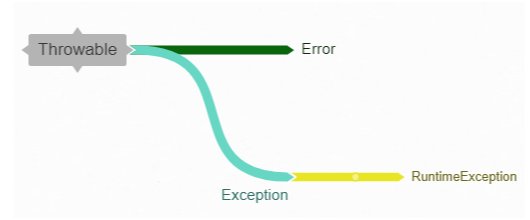
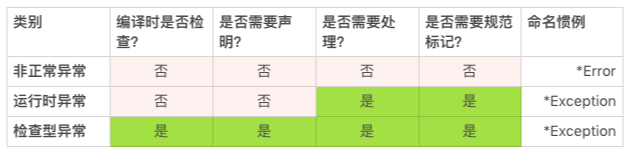
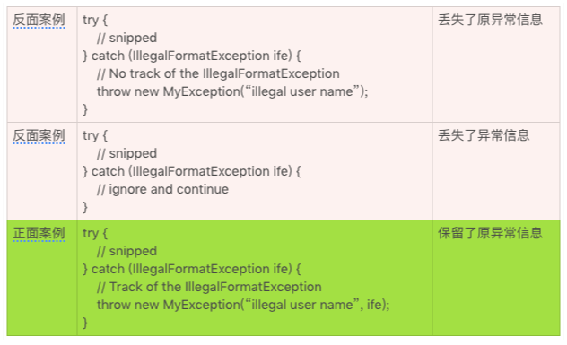

# 10 | 异常处理都有哪些陷阱？

上一讲中我们聊了聊怎么用好 Java 注解，今天我们谈谈怎么处理异常。

处理好异常状况是掌握一门编程语言的基础，也是我们编程离不开的基本功。相信你对异常处理的机制已经很熟悉了。异常处理便捷、灵活、好用。但是，越好用的东西，我们越容易忽视它的缺陷。异常处理就有很多我们容易忽视的陷阱。今天，我们来聊聊这些问题，以及该怎么处理这些问题。

## 异常就是非正常

异常状况，就是不正常的状况。

异常状况的处理会让代码的效率变低。一个流畅的业务，它实现代码的执行路径，理想的状况就是没有任何异常状况发生。否则，业务执行的效率就会大打折扣。既然这样，我们就不应该使用异常机制来处理正常的状况。

这一点不难理解。可是，由于一门语言无法理解什么样的状况是正常状况，什么样的状况又是异常状况，也就无法限制异常机制使用的具体场景。所以作为程序员，我们需要自己解决好这个问题，不要滥用了异常机制。

比如说，很多 API 的设计有检查参数有效性的方法。如果参数通过检验，就没有异常抛出，否则就会抛出异常。在使用这个方法的代码时，我们需要检查有没有抛出异常来确认参数是否有效。

```java
/**
 * Check if the user name is a registered name.        
 *
 * @throws IllegalArgumentException if the user name is invalid or
 *         not registered.
 */
void checkUserName(String userName) {
    // snipped
}
```

这是一个糟糕的设计！

在这个例子中，如果 userName 字符串不符合规范，这是一个异常状况； 如果 userName 不是一个注册用户，这通常是一个正常状况。 在正常状况下使用异常处理，无疑会降低系统的效率，以及编码的效率。

所以正常的状况和异常的状况一定要分开、分清，不能混用。

```java
/**
 * Check if the user name is a registered name.        
 *
 * @return true if the userName is a registered name.
 * @throws IllegalArgumentException if the user name is invalid
 */
boolean isRegisteredUser(String userName) {
    // snipped
}
```

## 分清异常的类别

我们上面讲了异常的一些基本概念，现在我们来讲讲异常的类别。在 Java 语言里，异常状况分为三类。

- **非正常异常**（Error）：这类异常的命名以 Error 结尾，比如 OutOfMemoryError，NoSuchMethodError。这类异常，编译器编译时不检查，应用程序不需要处理，接口不需要声明，接口规范也不需要纪录；
- **运行时异常**（RuntimeException）：这类异常的命名通常以 Exception 结尾，比如 IllegalArgumentException，NullPointerException。这类异常，编译器编译时不检查，接口不需要声明，但是应用程序可能需要处理，因此接口规范需要记录清楚；
- **非运行时异常**：除了运行时异常之外的其他的正常异常都是非运行时异常，比如 InterruptedException，GeneralSecurityException。和运行时异常一样，命名通常以 Exception 结尾。这类异常，编译器编译时会检查异常是否已经处理或者可以抛出，接口需要声明，应用程序需要处理，接口规范需要记录清楚。

通常我们说的异常，指的是运行时异常和非运行时异常。对于非正常异常，我们通常使用“错误”这个词汇而不是“异常”来表示。 由于非正常异常不需要特别处理，使用“错误”这个词汇，并不会导致使用方面的误导。

非运行时异常还有一个别名，叫作检查型异常（CheckedException）。对应地，运行时异常的别名是非检查型异常（UncheckedException）。 为了便于识别，我们通常使用检查型异常指代非运行时异常，使用运行时异常指代非检查型异常。



我们来看看两个例子，感受下运行时异常和检查型异常不同的处理方式。

下面这个例子中，IllegalArgumentException 是运行时异常。虽然方法的声明中没有出现 IllegalArgumentException，但是在方法的规范中，需要使用记录什么情况下抛出该异常。只有这样，方法的调用者才能知道什么时候异常会抛出，该采取什么样的处理办法。

```java
/**
 * Check if the user name is a registered name.
 *
 * @return true if the userName is a registered name.
 * @throws IllegalArgumentException if the user name is invalid
 */
boolean isRegisteredUser(String userName) {
    // snipped
}
```

下面这个例子中，CloneNotSupportedException 是检查型异常。这样的异常，一定要出现在对应方法的声明中。

```java
/**
 * Returns a clone if the implementation is cloneable.
 *
 * @return a clone if the implementation is cloneable.
 *
 * @throws CloneNotSupportedException if this is called on an
 *         implementation that does not support {@code Cloneable}.
 */
public Object clone() throws CloneNotSupportedException {
    // snipped
}
```

这三类异常的处理，可以用下表来总结。



## 标记清楚抛出异常

应用程序需要处理异常（CheckedException 和 RuntimeException），就需要我们在方法的规范描述文档中清楚地标记异常。没有标记的异常，应用程序没有办法通过文档了解哪些异常需要处理、什么状况下会抛出异常以及该怎么处理这些异常。

对于检查型异常，编译器或者 IDE 会友好地提醒使用合适的声明。我们一般不会遗漏检查型异常的声明。既然声明不会遗漏，异常的标记也通常不容易遗漏。 比如上面 clone() 方法的例子，CloneNotSupportedException 已经在方法定义部分声明了。在方法规范描述部分，只要不遗漏这个异常的描述就好了。

然而，对于运行时异常，我们就没有这么幸运了。目前我们使用的编译器或者 IDE，还没有提醒运行时异常遗漏的功能。由于没有工具的帮助，我们就很难发现运行时异常，这就很容易导致代码效率降低，错误增多。

我举个例子，在上面的检查用户名的例子中，如果我们不在方法的规范描述中记录抛出的运行时异常，该方法的使用立即就会遇到问题。

```java
/**
 * Check if the user name is a registered name.
 *
 * @return true if the userName is a registered name.
 */
boolean isRegisteredUser(String userName) {
    // snipped
}
```

其中最常见的问题包括：

1. 如果参数 userName 是一个无效引用（null），会发生什么状况，该怎么处理？
2. 如果参数 userName 是一个空字符串（“”），会发生什么状况，该怎么处理？
3. 如果参数 userName 不是一个规范的用户名，会发生什么状况，该怎么处理？

每一个问题，都会降低使用者的效率，让使用者陷入难以摆脱的困扰。

如果代码的层次结构再多一层，这个问题就会更加严重：

```java
/**
 * Check if the {@code userName} is an authenticated user.
 *
 * @return true if the {@code userName} is an authenticated user.
 */
boolean isAuthenticatedUser(String userName, String password) {
    // WRONG, should catch or describe the thrown exception.
    if (isRegisteredUser(userName)) {
        // snipped      
    } else {
        // snipped
    }
    // snipped
}
```

如果一个方法既没有异常的声明，又没有异常的规范描述，调用者一般不会进行异常处理，也不在规范描述中加入抛出异常的描述。 这样的层次结构，只要稍微多个一两层，运行时异常虽然在代码和规范描述层面消失得无影无踪，但它并没有真正消失，依然会在运行时准时出现。

即使调用者拥有源代码，可以阅读源代码，也不容易意识到有运行时异常需要谨慎对待。代码的阅读者也不会有足够的精力和动力去深挖所有的层次，来确认有没有运行时异常。

由于编译器或者 IDE 并不能给我们太多的帮助，我们更需要谨慎、严格地处理好运行时异常。具体该怎么做呢？

1. 对于所有的可能抛出运行时异常，都要有清晰的描述，一个也不要错过；
2. 查看所有的调用方法的规范描述，确认抛出的异常要么已经处理，要么已经规范描述。

如果我们都遵循了这两条运行时异常处理的办法，我们只需要查看一层代码的异常就可以了，这样无论是编码还是阅读代码，都会轻松不少。

## 处理好捕获异常

要想处理好异常，我们需要了解异常机制的基本原理。 我们一起回顾一下 Java 异常的四个要素：

1. 异常类名（IllegalArgumentException， FileNotFoundException）
2. 异常描述（“Invalid file path”）
3. 异常堆栈（at sun.security.ssl.InputRecord.read(InputRecord.java:504)）
4. 异常转换（Caused by: javax.net.ssl.SSLException: Unrecognized SSL message, plaintext connection?）

这四个要素满足了三个现实的异常处理问题：

1. 出了什么错？
2. 什么地方出了错？
3. 为什么会出错？

其中，异常类名解决了“出了什么错”的问题；异常描述解决了“为什么会出错”的问题；异常堆栈解决了“什么地方出了错”的问题；而异常转换记录了不同场景对这三个问题的不同理解和不同处理。

其中 JVM 自动帮我们处理异常堆栈，我们需要特别关注的就只有三点了。

- 对于异常类名，我们要准确地选择异常类。

  Exception 类是一个包罗万象的超级异常类，如果我们使用 Exception 作为声明和抛出的异常，就不方便用户精准定位，从而解读和判断“出了什么错”。 类似的超级异常类还有 RuntimeException、IOException 等。 除非是超级的接口，否则我们应该尽量减少超级异常类的使用，而是选择那些意义明确、覆盖面小的异常类，比如 FileNotFoundException。

- 对于异常描述，我们要清晰地描述异常信息。

  虽然 Java 异常允许使用没有具体异常信息的异常，但是这种使用却容易丢失用户对于“为什么会出错”这个问题更精准的解读。 所以我不推荐使用没有描述信息的异常。


- 对于异常转换，我们要恰当地转换异常场景。

  随着应用场景的转换，我们还需要转换异常的类型和描述。 比如，SQLException 这种涉及具体实现细节的异常类就不太适合直接抛给最终的用户应用。 用户关心的是商业的逻辑，并不是实现的细节，这就需要我们随着使用场景调整异常。如果一股脑儿地把所有的异常抛到底，业务逻辑就会很混乱，用户体验也不好。

  但是随着场景调整异常也不是没有代价的。这是一个妥协的选择，会带来一些负面的情况。

  第一个情况，就是需要编写转换的代码，这当然没有异常一抛到底方便。

  第二个情况，就是信息的冗余。如果转换场景有两三层，异常打印出来的堆栈信息就会很长，而最有用的信息其实只有最原始的异常。

  第三个情况，就是信息的丢失。有些信息的丢失是有意的，比如对敏感信息的过滤而丢掉的异常信息。有些信息的丢失是无意的过失。信息的丢失很难让我们排查出异常问题，于是错误的源头被硬生生地隐匿了起来。所以，除非有明确的需求，我们要尽量保留所有的异常信息以及转换场景。




由于这些负面情况的存在，我们就更要谨慎地使用异常场景转换，特别是要认真权衡信息丢失的问题。

## 小结

今天我给你讲了处理异常的一些情况，它的小陷阱很多。单就编写规范的代码来说，我们要记住三条准则：

1. 不要使用异常机制处理正常业务逻辑；
2. 异常的使用要符合具体的场景；
3. 具体的异常要在接口规范中声明和标记清楚。

你还知道哪些异常处理的陷阱呢？欢迎你分享在留言区，我们一起来学习。

## 一起来动手

下面的这段 Java 代码，它的异常处理有没有违反我们上面讨论的原则？你能够改进下面的代码吗？

欢迎你把优化的代码公布在讨论区，我们一起来讨论，看哪些地方我们可以做得更好。也欢迎你把今天的内容分享给协作的小伙伴，和他一起进步。

```java
import java.util.HashMap;
import java.util.Map;
 
class Solution {
    /**
     * Given an array of integers, return indices of the two numbers
     * such that they add up to a specific target.
     */
    public int[] twoSum(int[] nums, int target) {
        Map<Integer, Integer> map = new HashMap<>();
        for (int i = 0; i < nums.length; i++) {
            int complement = target - nums[i];
            if (map.containsKey(complement)) {
                return new int[] { map.get(complement), i };
            }
            map.put(nums[i], i);
        }
        throw new IllegalArgumentException("No two sum solution");
    }
}
```

## 1716143665 拼课微信(14)

- 

  Y024

  2019-01-30

  **18

  当方法中返回的数组或集合，会有为空的情况，不要直接返回 null（会强迫调用方需要进行判空处理，否则可能出现 NullPointerException），最好返回大小为 0 的数组或集合。

  其实分配一个空数组或集合所花费的时间和空间，性能损坏是很小到基本可以忽略不计的。同时，如果返回的空数组或者集合是 immutable（即不可变的）的话，可以进一步定义成 static final（对于数组而言）或者 Collections.emptyList()/emptyMap()/emptySet()，来公用同一个对象，减少性能影响。

  展开**

  作者回复: 这个留言必须赞！

- 

  老杨同志

  2019-01-25

  **2

  \1. 没找到结果应该是正常业务，不用抛出异常
  \2. 缺失必要的参数校验

  import java.util.HashMap;
  import java.util.Map;

  class Solution {
    /**
     \* Given an array of integers, return indices of the two numbers
     \* such that they add up to a specific target.
     \* return null if nums==null or nums.length==0 or result not found.
     */
    public int[] twoSum(int[] nums, int target) {
        if(nums==null || nums.length==0){
            return null;
        }
      Map<Integer, Integer> map = new HashMap<>();
      for (int i = 0; i < nums.length; i++) {
        int complement = target - nums[i];
        if (map.containsKey(complement)) {
          return new int[] { map.get(complement), i };
        }
        map.put(nums[i], i);
      }
      return null;
    }
  }

  展开**

  作者回复: 改的很赞！

  另外，有一个小技巧和你分享一下。如果返回值是空值（null），如果调用代码没有检查空值就调用，会抛除NullPointerException异常。如果返回空数组（int[0]）, 就不会出现这个问题了。 这个小技巧可以减少调用代码的错误，这样设计的接口比较皮实耐用。如果返回值是数组或者集合，我们通常使用这一个技巧。

- 

  草原上的奔...

  2019-01-25

  **1

  课后习题，1.使用异常处理正常的业务逻辑。2.异常没有在接口规范中标记清楚。3.异常类名感觉用在这里不合适

  作者回复: 找的都对。你想到怎么修改了吗？

- 

  Sisyphus2...

  2019-05-22

  **

  异常和错误是必须要分离的部分，错误必须抛出，异常要分清类型处理。
  对于开发异常，应该及时抛出，在开发中解决；
  对于生产中异常，要做好 log，及时报警，比如用 Sentry 处理 500 的服务器异常，用 log 记录核心功能的状态

- 

  木白

  2019-03-28

  **

  “ 对于异常类名，我们要准确地选择异常类。” 老师，我们应该怎么去快速准确地知道需要抛哪个异常呢？因为有时候只是觉得应该做异常检测，但是属于哪种异常自己也描述不清楚。需要把jdk中的异常都记下来吗？我就是那种直接抛Exception异常的。

  作者回复: 坏消息是，即使我们记住了所有的JDK异常类，也仅仅是异常世界的一小部分，不够用的。 好消息是，没有人能记住即便是JDK这么少的异常类，所有我们也不要折磨自己去记住所有的异常。

  首先要记住，异常是一个可以扩展的类，需要时可以自己定义。所以，你的应用可以有自己定义的异常类。

  弄不清楚使用哪种异常，有两种情况比较典型，一种是不了解调用的类；另一种是不了解自己编写的代码的逻辑。这两条清楚了，异常就清楚了。这两条不清楚，代码也很难清楚。

  异常就不正常的状况。不正常的状况是什么，搞清楚了，异常该是什么也就知道了八九分。然后，去找合适的现存异常类，或者定义新的异常类，剩下的一两分工作也就凑齐了。

  比如说，我回复这条信息的时候，总是输错字母。要是用异常表示，这个不正常的状况就是“键盘输入信息错误”。 然后，在你使用的类库中，去寻找有没有表示这个不正常状况的异常，找到了就用。找不到，如果你想精确定义，就自己定义一个KeyboadInputException; 如果你不想定义新异常，就扩大概念，从“键盘输入信息错误"扩大到"输入信息错误"。然后IOException就是大家都常用的异常了，然后你就可以使用new IOException("键盘输入信息错误")来表示“键盘输入信息错误”这个不正常状况了。

  就这样，了解的代码，了解了不正常的状况到底是什么状况。

- 

  北风一叶

  2019-03-08

  **

  异常的使用要符合具体的场景，这一条非常虚，不具备可执行性

  展开**

  作者回复: 哈哈，看来你喜欢干脆的结论。

- 

  DemonLee

  2019-03-04

  **

  老师，请教一个问题，在写定时任务的业务时，一开始从表中提取一些记录，然后针对每条记录进行业务处理（业务处理有事务），如果业务处理成功，则更新这条记录状态为A，如果业务处理失败，则更新这条记录状态为B，此时我就感觉违背了“不要用异常处理业务逻辑”这条规则，老师有什么好建议。另外，我想到的是用两个线程处理 ，主线程更新状态，子线程处理业务逻辑，但是需要线程间同步。
  public void execute(){
  List<T> rows = list();
  for(T t:rows){
    try{
     deal(t);
     updateStatus("A");
    }catch(Exception ex){
      updateStatus("B");
    }
  }
  }

  展开**

  作者回复: deal()能不能不抛出异常？或者不正常的时候抛出异常，正常的业务不抛出异常？

  使用线程处理更复杂，还不如捕获异常呢。

- 

  拉格朗日的...

  2019-02-22

  **

  从函数的单一职责规范来看，该方法for循环里面的逻辑可以提取出来，单独称为一个方法

- 

  李星

  2019-02-12

  **

  如果是异常没有被try-catch住的线程呢？

  展开**

  作者回复: 我们先来看看线程的主方法声明“public void run()”。这个声明没有抛出检查型异常，只能抛出运行时异常。所以，检查型异常一定要在线程的实现中得到处理；否则的话，编译器应该报错的。这个方法可以抛出运行时异常。一个线程，像一个普通的方法一样（run()），抛出运行时异常后，线程就终止了。问题在于，线程通常共享资源，如果线程之间有联系，很多事情就会发生，依赖于线程的具体实现逻辑。比如说，如果一个线程要等待另一个线程的I/O，也许会阻塞。

- 

  李星

  2019-02-12

  **

  想问一下作者，在多线程情况下时，当某一个线程发生运行时异常，并且不处理时，是否真的会阻塞当前线程呢？使得这个线程被废掉。？

  作者回复: 当前线程是发生异常没处理的线程吗？ 还是不同的两个线程? 没太明白问题。

- 

  pyhhou

  2019-02-09

  **

  思考题：
  \1. 对输入数组需进行预判
  \2. 方法内如果有异常抛出，需进行标记描述
  \3. 异常名称名不副实

  import java.util.HashMap;
  import java.util.Map;

  class Solution {
    /**
     \* Given an array of integers, return indices of the two numbers
     \* such that they add up to a specific target.
     */
    public int[] twoSum(int[] nums, int target) {
      if (nums == null || nums.length ==0) {
        return new int[0];
      }

  ​    Map<Integer, Integer> map = new HashMap<>();
  ​    for (int i = 0; i < nums.length; i++) {
  ​      int complement = target - nums[i];
  ​      if (map.containsKey(complement)) {
  ​        return new int[] { map.get(complement), i };
  ​      }
  ​      map.put(nums[i], i);
  ​    }
  ​    
  ​    return new int[0];
    }
  }

  最后还想问下，如果说是 return 的不是 null 而是空数组，是不是就不需要在文档描述中标记写明？

  年过了一半了，看看自己拉下的章节还有不少，得抓紧了，祝老师新的一年心想事成，身体健康，工作生活一切顺利～ 今年励志一定要好好和你学写代码，稳扎稳打，快速成长

  展开**

  作者回复: 新春快乐！

  JDK的习惯是，不论是null还是空的集合、数组，都在文档描述中标记清楚。这样，调用者能确切地知道该怎么检查。

- 

  天佑

  2019-01-26

  **

  大师，断言呢，使用场景是什么。

  展开**

  作者回复: 简单的说，就是尽量不要使用断言。断言的设计是为了提高代码质量，可是断言一般有三个状态：断言是否启用；如果启用，断言是否成立。这让编码的逻辑很混乱，阅读的时候我们不一定能够把三个逻辑考虑周全，增加了编码错误的几率，降低了代码质量。

- 

  我来也

  2019-01-25

  **

  看不懂java 看这个异常处理有点吃力 🤦‍♂️

  展开**

  作者回复: 有问题就留言，我们一起把疑惑的地方解决掉。

- 

  王智

  2019-01-25

  **

  这个小节看着懵懵的,看完之后完全不记得看了个啥,(╥╯^╰╥).还得看第二遍呀.

  后面的题目那个算是正常的业务,不应该用异常处理? 而且就算用异常处理了,方法的注释中也没有提及这个异常,那文档中就不会有这个异常的说明.

  我看了半天就看了这个,能力还是有点弱,得加油呀!!!

  展开**

  作者回复: 练手题的问题找的都不错啊！