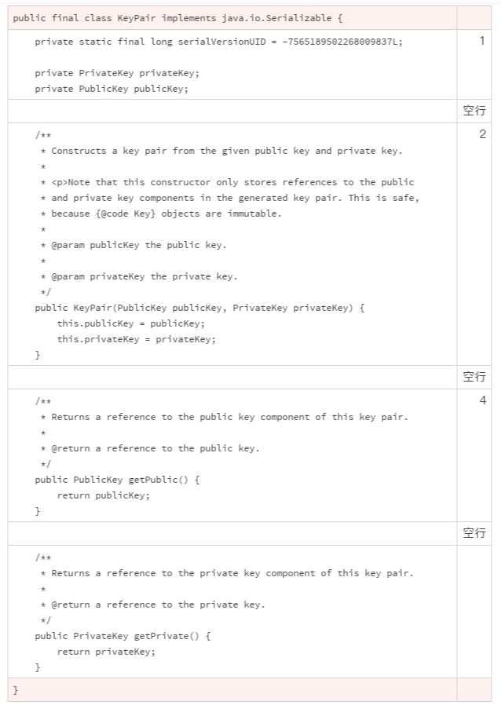

# 11 | 组织好代码段，让人对它“一见钟情”

当我们看到一个事物的时候，它的轮廓首先进入视野，给了我们第一印象。如果第一印象没有吸引到我们，那我们就不会集中注意力去关注它，也不会想去认识它。

我觉得有个俗语非常好地概括了这个认知习惯。这个俗语就是“不起眼”，更通俗一点的说法是“放在人群里认不出来”。

不管我们愿不愿意，第一印象特别影响我们的判断和心情。我们看到美好的东西，自己也跟着高兴；看到乱糟糟的东西，自己也感觉乱糟糟的。

代码也是这样的。如果我们看到整齐、清爽的代码，我们就对它有好感，愿意阅读，也愿意改进。 如果代码一团糟，风格混乱，我们就特别想静静地走开，一行都不想看。

前面的几讲中，我们讨论了注释、声明、格式、注解等编码规范。现在，是时候把这些零散的知识放到一块儿了。这些规范组合在一起，就会让代码既有让人喜悦的轮廓，也有让人清爽的细节。

这一次，我们将使用大量的例子，从代码文件头部结构、对象结构、类的内部结构、方法的代码结构、限定词的使用以及空行的使用这六大维度，来说明到底该怎么组织一个源代码文件。

## 代码文件头部结构

一般来说，一个源代码文件的开始部分包含三项内容。 按照出现顺序，分别为：

1. 版权和许可声明；
2. 命名空间（package）；
3. 外部依赖（import）。

下面就是一个例子。


在版权部分中，“2003, 2013”中的 2003 表示的是代码的诞生日期，2013 表示的是代码的最近更改日期。需要注意的是，每次代码变更，都要更改代码的最近更改日期。

## 代码文件对象结构

紧随着源代码的头部，是对目标类的定义，这一部分包含三个部分。 按照出现顺序，分别为：

1. 类的规范；
2. 类的声明；
3. 类的属性和方法。

这一部分中，我们需要注意的是，对于公共类，需要使用 since 标签，标明从哪一个版本开始定义了这个类。 这样的标明，方便我们对类进行版本管理，减少我们进行代码变更时的工作量。


比如在上面的例子中，如果需要修改 Readable，当看到“since 1.5”的标签时，我们就不需要检查 Java 1.4 的代码了。

你也许会问，为什么 Java 1.4 不能使用 Readable 呢？since 标签同样可以给你答案，因为 Readable 是从 Java 1.5 开始才有的接口。

这些问题虽然简单，但是如果没有使用 since 标签，答案就没有这么直观明显了。

## 类的内部代码结构

类的属性和方法，一般是一个代码文件的主要组成部分。类的结构，推荐的编码顺序依次为：

1. 类的属性；
2. 构造方法；
3. 工厂方法；
4. 其他方法。

我摘抄了一段 JDK 的代码，你看这样是不是更干净整洁？



上面的代码案例中没有用到工厂方法，我来讲一下这个。

类似于构造方法，工厂方法也是用来构造一个类的实例。不同的是，工厂方法有具体的返回值。它可以是静态方法，也可以是实例方法。

如果是实例方法，工厂方法还可以被子类重写。这是工厂方法和构造方法的另外一个重要的区别。由于工厂方法也扮演着构造类实例的功能，我们一般把它放在构造方法的后面，其他方法的前面。


## 方法的代码结构

讲完了类的内部代码结构，我们再来讲讲方法的代码结构。一般来说，一个方法需要包含三项内容：

1. 方法的规范；
2. 方法的声明；
3. 方法的实现。

内部类的内部方法，可以没有第一部分。但对于公开类的公开方法，方法的规范一定不能缺失。 一个典型的规范，应该包含以下十个部分：

1. 方法的简短介绍；
2. 方法的详细介绍（可选项）；
3. 规范的注意事项 (使用 apiNote 标签，可选项)；
4. 实现方法的要求 (使用 implSpec 标签，可选项)；
5. 实现的注意事项 (使用 implNote 标签，可选项)；
6. 方法参数的描述；
7. 返回值的描述；
8. 抛出异常的描述：需要注意的是，抛出异常的描述部分，不仅要描述检查型异常，还要描述运行时异常；
9. 参考接口索引（可选项）；
10. 创始版本（可选项）。

下面的这个例子，也是来自 JDK 的源代码。你可以清晰地看到，这段代码中的规范是非常典型的。


如果方法的创始版本和它所属类的创始版本一致，方法的创始版本描述可以省略。 要不然，一定要加入方法的创始版本标签。

像下面这个例子，就添加了创始版本标签。


## 按顺序使用限定词

在声明一个类、方法或者方法属性时，为了更准确地描述和理解声明的适用场景，我们通常要使用修饰性的关键词。这些修饰性的关键词，我们通常称它们是修饰符或者限定词。 一个声明，可以使用多个限定词。

Java 的语法中，限定词的使用顺序没有强制性规定。但是，限定词的使用顺序有一个约定俗成的规则。按照这个规则使用限定词，一般来说，我们最关切的修饰符最先进入我们的视野，和标识符最密切的位置最靠近标识符。使用一致性的顺序，我们就能更快速地理解一个声明。

限定词推荐使用顺序：

1. public/private/protected （访问控制限定词，制定访问权限）
2. abstract （抽象类或者抽象方法，具体实现由子类完成）
3. static （静态类、方法或者类属性）
4. final （定义不能被修改的类、方法或者类属性）
5. transient（定义不能被序列化的类属性）
6. volatile（定义使用主内存的变量）
7. default（声明缺省的方法）
8. synchronized（声明同步的方法）
9. native（声明本地的方法，也就是 Java 以外的语言实现的方法）
10. strictfp（声明使用精确浮点运算）


## 使用空行分割代码块

我们之前讲过怎么整理代码，一个重要的原则就是“给代码分块”，通过空格、缩进、空行实现这个目的。

再来回顾一下空行的作用，空行用于垂直分割，用于分开同级别的不同代码块。

我们可以使用空行分割如下的代码块：

1. 版权和许可声明代码块；
2. 命名空间代码块；
3. 外部依赖代码块
4. 类的代码块；
5. 类的属性与方法之间；
6. 类的方法之间；
7. 方法实现的信息块之间。


## 小结

对于软件开发者来说，组织代码是一项基本技能，也是我们需要养成的好习惯。组织代码有许多不同的习惯和策略，我们要学会辨别这些策略中哪些是有效的，哪些是有害的。

怎么辨别呢？

和其他技能一样，最快的提升方法是仔细思考一下为什么我们要做出这样的选择，而不是其他的。知其然远远不够，还要知其所以然。

你可以试着看看你的项目，源代码是按照这种方式组织的吗？哪些部分采用了合理的组织方式，哪些部分还有改进的空间？哪些是值得分享的经验？欢迎你把想法分享在留言区，我们一起来学习。

## 一起来动手

下面的这段 Java 代码，我们已经很熟悉了。前面，我们对它做过很多方面的修改。这一次，我们把前面的修改集中起来。你试着去找到所有可以改进的地方，然后比较一下修改前和修改后的代码。你有什么感受？

欢迎你把优化的代码公布在讨论区，让我们一起来感受、来欣赏！

也欢迎点击“请朋友读”，把这篇文章分享给你的朋友或者同事，一起来体验修改代码的快感。

```java
import java.util.HashMap;
import java.util.Map;
 
class Solution {
    /**
     * Given an array of integers, return indices of the two numbers
     * such that they add up to a specific target.
     */
    public int[] twoSum(int[] nums, int target) {
        Map<Integer, Integer> map = new HashMap<>();
        for (int i = 0; i < nums.length; i++) {
            int complement = target - nums[i];
            if (map.containsKey(complement)) {
                return new int[] { map.get(complement), i };
            }
            map.put(nums[i], i);
        }
        throw new IllegalArgumentException("No two sum solution");
    }
}
```

## 精选留言(6)

- 

  老杨同志

  2019-01-28

  **3

  /*
    Copyright (c) 2019 leetcode 算法练习
    给定整形数组和目标值，求数组中那两个元素之和等于目标值
    example : 输入 [2,4,6,7,] target = 10 ;return [4,6]
  */

  import java.util.HashMap;
  import java.util.Map;

  class Solution {

  ​    //为了展示属性应该放的位置，强加属性，关键字顺序也是老师推荐的
  ​    private static final long serialVersionUID = 5454155825314635342L;
  ​    
  ​    //只有一个构造方法可以省略，多个构造方法时，空实现换行加注解
  ​    public Solution(){
  ​      //blank 空实现
  ​    }
  ​    
    /**
     \* Given an array of integers, return indices of the two numbers
     \* such that they add up to a specific target.
     \* return int[0] if nums==null or nums.length==0 or result not found.
     */
    public int[] twoSum(int[] nums, int target) {
  
  ​      //check 代码块之间空行隔开
  ​      if (nums==null || nums.length==0) {
  ​        return new int[0];//老师提示返回int[0]避免空指针
  ​      }
  ​      
  ​      //algorithm begin
  ​    Map<Integer, Integer> map = new HashMap<>();
  ​    for (int i = 0; i < nums.length; i++) {
  ​      int complement = target - nums[i];
  ​      if (map.containsKey(complement)) {
  ​        return new int[] { map.get(complement), i };
  ​      }
  ​      map.put(nums[i], i);
  ​    }
  ​    
  ​    //not found
  ​    return new int[0];
    }
  }

  展开**

  作者回复: 改的不错，还有一些小问题，有的我们还没有讲到。

- 

  北风一叶

  2019-03-08

  **1

  谢谢老师的整理 以后有法可依了

  展开**

- 

  苦行僧

  2019-01-28

  **1

  一般用静态检查工具去发现问题

  展开**

  作者回复: 嗯，检查工具有反馈，多查到几次问题，慢慢我们就知道怎么规避这些问题了。

- 

  Sisyphus2...

  2019-05-22

  **

  规范的代码结构能提高开发效率，让后续的开发者能够快速理解项目结构和历史情况。代码迭代的时候也能快速找到所需要的信息，以及需要连动迭代的代码

  展开**

- 

  DemonLee

  2019-01-28

  **

  老师，类的声明与方法或属性之间没有强制要求换行分割吧，有些同事喜欢这样干。
  public class Xxx{
  //换行
  private String xxx;
  }

  展开**

  作者回复: 一般不要求分割。 缩进已经表明了这是下一级代码块。 换行的时候，大都是声明一行写不完，要用两行或者多行。 如果两个代码块视觉分割不清楚，可以多一个空行。

- 

  王智

  2019-01-28

  **

  好规范呀,发现自己以前写的代码好多都不规范!!!
  课后习题在我看来:
  \1. 类没有介绍
  2.方法前面介绍不全,必要的没写,比如说抛出的异常,参数等等
  3.方法内没有空行分割,看起来一大片.
  这就是我的看法,这篇文章的规范有点多,需要好好看一下.
  加油!!!

  展开**

  作者回复: 找的不错，还有一些问题，我们后面还会讲。