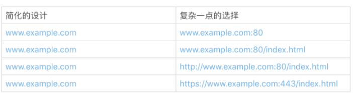

# 14 | 怎么写好用户指南？

前一段时间，我要买一部家用的跑步机。有一款跑步机看起来配置齐备，商品的标题中指明“需要组装”。

商品的评论只有两条。其中一条给了三分：“还没有来得及试一试这个新到的跑步机。因为，我一直试着把它组装起来。我做梦都没有想到，‘需要组装’意味着我花了三天时间，都没有组装起来。它也许是一个好的跑步机，可是令人失望的是，这些零件到底该怎么凑在一起！”

而另一条则给了最低的一分。评论写道：“商品描述不准确。这台机器非常重，长度甚至超过两人沙发。一般的家庭根本放不下这台跑步机。已经退货了”。

你可以想象，这两条仅有的评论对这款跑步机的销售有多大的杀伤力。它本身的品质无论如何，都不至于沦落到一分、三分的地步。

问题在哪儿呢？无论是谁，花了三天时间都搞不定组装，肯定有一肚子的不满意。好不容易组装起来，却发现没有空间放置，又要拆掉退货，就会更不满意。

我了解了一下这款跑步机的用户手册，发现组装非常繁琐，所涉及的部件有很多，还真不是一下子就可以搞定的。

很显然，用户指南非常重要，但这款跑步机却给我们提供了一个反面的案例，可见写出一份好的用户指南也不是一件容易的事。

**最好的用户指南，是产品本身**。我们随手拿一只圆珠笔，就知道怎么用。然而，不是所有的产品都能够简单到拿来就用。一份合格的用户指南，要帮助用户减少产品使用的障碍，快速地使用产品。

作为程序员，我们常和软件的用户指南打交道。软件和的用户指南和家用电器的操作指南一样，是最终用户的参考手册。今天，我就和你聊聊怎么写好软件的用户指南这个话题。

## 谁是指南的用户？（用户指南写给谁？）

既然是用户指南，就必须让用户看得懂、用得上。首先我们需要搞懂，谁是用户？ 只有这样，我们才能了解用户的日常习惯和知识偏差。

一般来说，我们把用户的门槛降得越低，潜在用户的群体就越大，软件就越容易推广。

比如说，访问一个网站时，我们只要在浏览器输入网址，就可以浏览网站的内容。这背后的技术，真的像大海一样深不可测。可是，作为用户，我一点儿也不关心这些技术，我只关心，我能不能访问到这个网站。

假设一个浏览器的设计者，添加了两个强制的选择项，让用户访问网站时选择：

1. 使用 TCP 协议还是 UDP 协议？
2. 使用 HTTP 还是 HTTPS?

估计很多用户立即就会不知所措。他们大部分都不知道这些协议到底是什么，更别提让他们做出有实际意义的选择了。

我举这样的一个例子，想说明的是，有了用户的千差万别，才有了软件的千差万别。我们不能想当然地认为，有了详实的用户指南，用户就能够使用产品。

**事实上，用户指南，不能超越用户的理解能力和操作能力。**

## 什么时候确定产品用户？

这是一个老生常谈的问题。之所以常谈，是因为我们很容易就忘了我们的用户。所以，不得不经常拎出来谈一谈，时不时地拽一拽这根弦。

等到产品出来的时候才确定用户，再写用户指南，就太晚了。 谁是我们的用户？用户该怎么使用我们的产品？这些问题应该是产品还没有影子的时候，就要开始着手解决的问题。 然后，在产品研发的全工程中，反复地调试、测试这两个问题的答案。

需要注意的是，这两个问题答案，千万不要越来越丰富，而是要简化再简化，越来越简单。

无论用户手册写得有多好，一个需要组装近百个部件才可以使用的跑步机，都瑜不掩瑕。

所以在产品设计时，就需要解决掉用户定位和怎么使用这两个问题。

比如浏览器的设计，我们一定要压制住给用户提供更多选择的冲动，把技术细节隐藏到具体实现中去，而不是让用户来做选择。即便是简单的给浏览器输入地址这一行，你想一想下面的这些地址隐藏了多少细节！

我们经常使用浏览器，所以讨论浏览器的设计时，可能比较容易理解简单带来的巨大好处。如果换成我们自己的软件产品，看起来就没有那么容易了。

我们可能生怕遗漏了什么、错过了什么。丢掉东西，尤其是放弃一个看似美妙的想法，不符合我们的思维方式和行为习惯。 但在用户指南这个问题上，我们需要记住“less is more”。如果可以从用户的角度看问题，产品中自我的影子就会少一点点，这些选择也会简单一点点。

## 保持指南和代码的一致

和接口规范一样，用户指南一般也是由程序员和其他的作者一同完成的。和接口规范不一样的是，接口规范可以在源代码文件中定义、描述，而用户指南通常是独立于源代码的文档。这种分离的组织形式，经常会让用户指南和源代码脱节。如果维护指南的作者和维护源代码的作者不是同一个人，脱节就会更加严重，导致维护和服务都很困难。

那么该怎么办呢？程序员一定要和用户指南的维护者保持通畅的沟通，商定协作的方式。

比如，在 OpenJDK 中，如果源代码的修改导致了行为和接口的改变，就要考虑是不是需要修改用户指南。如果需要修改用户指南，就要提交一个用户指南修改的提议。在这个提议里，说明代码导致的行为、接口的变更，以及用户指南修改的建议。用户指南的维护者收到提议后，就会跟踪代码的变更，提议具体的修改方案，完成用户指南的修改。源代码修改和用户指南的修改，一定要放在一个连贯的流程里。

保持用户指南和源代码的一致性是一个很有挑战性的任务。这是一个成本很高的问题，你一定要找到适合自己的办法。比如可以像 OpenJDK 一样，通过改进开发流程，把用户指南修改和代码变更绑定在一起。用户指南修改修改完成，这个代码变更才算完成。如果工具使用得当，团队合作流畅，这是一个可以尝试的好办法。

## 开发指南的实践

开发指南是一类我们经常接触的用户指南，它的典型用户是使用该软件 API 的软件工程师。

我们上一次聊到了接口规范。开发指南和接口规范这两类文档是怎么分工的呢？ 接口规范的重点在于接口的设计和功能描述上，包括确认边界条件、指定参数范围以及描述极端状况。而开发指南的重点在于定义术语、交代概念、提供示例、问题排查等。

接口规范描述的是每一个部件的规格，是一个细节、局部的范围。开发指南说的就是怎么理解这些部件之间的关系，怎么把这些部件组合起来，形成更大的部件或者产品。

对于一个陌生的类库，我们一般要先阅读开发指南，然后检索接口和接口规范。如果开发指南让用户抓狂，你可以回顾一下开头讲到的跑步机的例子，想象下影响会有多糟糕！

那么合格的开发指南都要符合哪几个规则呢？我总结为三点：需要交代清楚概念，可以快速上手，示例都可操作。

**交代概念**

一个合格的开发指南，不要假定用户具有和开发者一样的知识范围。对应的接口规范和开发指南里涉及到的概念，一定要交代清楚。我们可以假定一个程序员了解 IP 地址这个概念，这是计算机入门的基本概念。但是，不要假定他了解 IP 地址的计算方式，虽然也是基础知识，但是大部分人记不住知识的细节。

所以说，交代清楚概念，很方便作者和读者之间建立共识，降低后续文档的阅读负担。

**快速上手**

一个好的开发指南，要尽最大可能，让开发者快速上手。

我们学习一门编程语言，往往从“Hello, World!”这个例子开始。它本身并没有太多玄妙的东西，但可以让一个初学者最快地玩耍起来，然后，再逐步探索更深入的内容。

这是一个值得学习的方法。很多开发指南，都有一个类似于“Hello, World!”这样的简短的快速入门章节。你也可以试试这个办法。

但需要注意的是，快速入门的章节一定要简单、靠前。让读者最快接触到，很容易学会，方便“玩耍”。

**示例都可操作**

可操作性是开发指南的一个命门。所有成文的方法和示例，都要求可以使用、可以操作、可以验证。虽然说起来简单，但是做到这一点并不简单。

开发指南，需要适应版本的变迁和代码的修改。第一版的开发指南也许看起来、用起来都很美妙，但到了第二版，就会面临代码和指南脱节的问题。

指南的方法是否还适用？示例的代码是否需要修改？示例的输出有没有变化？问题排查的办法有没有变更？ 这些都是潜在的问题。

如果我们在开发指南里使用了不能执行的伪代码，这些问题就会更加突出。我们虽然清楚第一版伪代码的逻辑，却没有办法验证这样的逻辑在第二版是不是依然成立。

如果开发指南里的示例都可以被编译、被使用，那么解决起来就会轻松很多。修订开发指南时，如果我们把这些示例重新编译、运行、查看结果，然后对比文档，就可以解决掉很多潜在的忧患。

当然，可操作的开发指南，用户不仅仅是可以阅读，也可以照着例子玩耍。

## 小结

最后我来总结一下，用户指南的形式和组织方式各式各样，我们没有办法去限定它的具体格式。 一般而言，我们要建立下面的意识：

1. 从用户的角度出发来思考用户指南，用户指南要容易上手；
2. 用户指南和源代码一样，也有开发周期，也是需要维护的。

## 一起来动手

今天，我们找两个真实的例子练练手。限于版权，我不能拷贝这两个例子的内容。麻烦大家去看原文。

第一个例子是腾讯微信的《小程序开发指南》第一小节的["Hello World"示例](https://developers.weixin.qq.com/ebook?action=get_post_info&docid=0002c8979d0678bb00862b8595b00a)。第二个例子是[GitHub 页面开发的入门网页](https://pages.github.com/)，也是一个 Hello World 示例。你仔细研究下，看看是不是都容易上手？每一个例子都有什么优点，有什么缺点？ 你有哪些改进的建议？

欢迎在留言区分享你的看法，我们一起来讨论、学习。

如果你觉得这篇文章有所帮助，欢迎点击“请朋友读”，把它分享给你的朋友或者同事。

## 精选留言(7)

- 

  北风一叶

  2019-03-11

  **1

  我之前的主管给我的建议是这样的：你就把用户假定为啥也不理解然后再去写文档，写出来的文档就是合格的

  作者回复: 这是一个好办法。经常地，我们看一些文档，觉得废话太多，大量的篇幅交代背景。其实，哪是为了照顾更多的用户。

- 

  Sisyphus2...

  2019-05-22

  **

  用户指南就像是开发者的 PPT，一个好的产品还要有一个漂亮的展示才能有价值。

  例证丰富能快速上手实践的往往是好的用户指南，在写文档的时候，文字和代码以及例证交叉，再配合一些图效果比较好，另外使用总分的结构效果比较好

  展开**

- 

  Lindroid

  2019-04-27

  **

  今年我也在GitHub上添加了两三个开源库（主要是供自己使用），不得不说写好说明文档真的是不容易的，而且比起最初的编写，后期的维护也考验人。

  作者回复: 😊经久耐用的软件，成本基本都在维护上。

- 

  Geek_96eff...

  2019-04-03

  **

  我提出要给服务的接口写wiki，但是领导说大家都不会维护，还不如直接问接口维护人。我觉得维护文档是大家不太习惯，但是长远来看是可以提高开发效率。

  展开**

  作者回复: 直接问接口维护人的问题很多： 接口维护人不一定时刻都在；接口维护人不一定有那么多时间；接口维护人不一定记得那么多细节；我们不一定想要面对面地提问；面对面问问题的效率有可能更低（复杂的技术问题需要问答双方都花很多时间）。

- 

  空知

  2019-02-15

  **

  微信和Github的示例都只是提供示例,但是一些前提概念没有说明下吧.

  展开**

  作者回复: 嗯，引用的是快速入门部分。

- 

  秦凯

  2019-02-15

  **

  个人理解是：接口规范应该更多的是描述接口为什么这么设计，而用户指南更多的是指导用户如何使用接口，阅读的群体和功能上有区别。

  作者回复: 在 Java SE里，接口规范一般不包括“为什么这么设计”的描述。

- 

  vector

  2019-02-08

  **

  简单明了，考虑全面。佩服别人家的手册。

  展开**