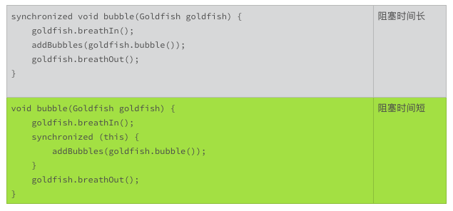

# 22丨高效率，从超越线程同步开始

线程的同步是学习一门编程语言的难点。刚开始线程同步的困难，主要在于了解技术；跨过了基本技术的门槛后，更难的是掌握最基本的概念。

学习技术时，我们对基本概念熟视无睹，只想将宝剑尽快握在手，哪管宝剑何时该挥出的教导。学会技术后，基本概念就会回来找我们算旧账，出错一次剑，就记一笔账。账本慢慢变厚的过程，也是我们向基本概念靠拢的过程。当我们掌握了最基本的概念后，开始慢慢还账，账本再越变越薄。

不单单是线程和同步，掌握好基本概念，几乎是我们学习所有技术背后的困境。这怨不得我们自己，我们认识一件事情的过程，大抵就是这样。

如果有人很早地就敲着桌子，不厌其烦地重复着基本的概念，事情会不会容易一些？这一次，我们聊聊线程同步的基本概念，以及如何超越线程同步。

## 什么时候需要同步？

线程有两个重要的特征，就是并发执行和共享进程资源。

你可以把进程想象成一个鱼缸。鱼缸里的金鱼可以看作线程。鱼缸里的碎石、水草、鱼食等可以看作共享的资源。每一条鱼都独立行动，随时可以吐个气泡，吃点鱼食，耍弄下水草。

鱼缸里的碎石、水草，小鱼儿搬不走、吃不掉，是一个不变的量。鱼食和气泡就不一样了，每一条小鱼儿随时都会吐泡泡、吃鱼食，改变气泡和鱼食的数量。鱼食和气泡，是鱼缸里的可变量。

如果有一条小鱼儿，想要数数有多少气泡，麻烦就来了，小鱼儿要吐出新泡泡，水面的旧泡泡要破掉，怎么数都跟不上变化的节奏。怎么办呢？要让变化停止，数清楚之前，其他的小鱼儿不能吐新泡泡，水面的泡泡也不能破掉。数清楚后，再恢复行动。**这就像是线程的同步**。

线程的并发执行和共享进程资源，是为了提高效率。可是线程间如何管理共享资源的变化，却是一个棘手的问题，甚至是一个损害效率的问题。如果有两个以上的线程，关心共享资源的变化，一旦共享资源发生变化，就需要同步。线程同步的意思，就是一个接一个来，上一个线程没有完成一项任务之前，下一个线程不能开始相关的行动。简单地说，就是排队。

什么时候需要同步呢？需要同步的场景，要同时满足三个条件：

1. 使用两个以上的线程；
2. 关心共享资源的变化；
3. 改变共享资源的行为。

## 同步是损害效率的

假设一条小鱼吐一个泡泡 1 秒钟，如果没什么限制，10 条小鱼 1 秒钟就可以吐 10 个泡泡。可是，如果要小鱼排队吐泡泡，10 条小鱼 1 秒钟最多只能吐 1 个泡泡，这还没算上小鱼儿交接的时间。实际上，10 条排队的小鱼 1 秒钟可能只能吐 0.9 个泡泡，因为交接也是要费时间的。

线程同步也是这样的，同步需要排队，同步的管理需要时间。所以，实践中，我们要想尽办法避免线程的同步。如果实在难以避免，就减少线程同步的排队时间。

## 避免线程同步

该怎么避免线程同步呢？

对应上述的同步场景所需的三个条件，我们只要打破其中的任何一个条件，就不需要线程同步了：

1. 使用单线程；
2. 不关心共享资源的变化；
3. 没有改变共享资源的行为。

举个例子吧，下面的这段代码用于表示在不同的语言环境下，该怎么打招呼。在汉语环境下，我们说“你好”；在英语环境下，我们说"Hello"。

如果只有一个线程，这段代码就没有问题。但是，如果有两个线程，一个线程读，一个线程写，就会出现竞争状况，返回不匹配的语言环境和问候语。

```java
class HelloWords {
    private String language = "English";
    private String greeting = "Hello";
 
    void setLanguage(String language) {
        this.language = language;
    }
 
    void setGreeting(String greeting) {
        this.greeting = greeting;
    }
 
    String getLanguage() {
        return language;
    }
 
    String getGreeting() {
        return greeting ;
    }
}
```

比如说，如果两个线程的执行顺序是：

1. 线程 1 执行 getLanguage()，得到返回值是英语的语言环境；
2. 线程 2 执行 setGreeting()，把问候语设置为汉语环境的“你好”；
3. 线程 1 执行 getGreeting()，得到返回值是问候语“你好”。

那么，按照线程 1 得到的结果，在英语环境下，我们打招呼用“你好”。这可差的远了。

怎么改变这种状况呢？ 其中一种方法，就是要把变量，变成像鱼缸里的碎石、水草这样的不可变的东西。不可变（immutable），放在软件环境里，指的就是一旦实例化，就不再改变。思路就是把变化放在出品之前。做到这一点的利器，就是 Java 的关键字“final”。

```java
class HelloWords {
    private final String language;
    private final String greeting;
 
    HelloWords(String language, String greeting) {
        this.language = language;
        this.greeting = greeting;
    }
 
    String getLanguage() {
        return language;
    }
 
    String getGreeting() {
        return greeting ;
    }
}
```

使用了限定词“final”的类变量，只能被赋值一次，而且只能在实例化之前被赋值。这样的变量，就是不可变的量。如果一个类的所有的变量，都是不可变的，那么这个类也是不可变的。

不使用限定词“final”，能不能达到不可变的效果呢？如果我们把上面代码中的限定词“final”删除掉，代码实现的细节依然保证这两个变量具有不可变的效果。 只是，如果代码再长一点，方法再多一点，我们可能会不经意地修改这两个变量，使得这个类又重新面临线程同步问题。

所以，我们要养成一个习惯，看到声明的变量，就要琢磨，这个变量能不能声明成不可变的量？现有的代码设计，这个变量如果不是不可变的，我们也要琢磨，有没有办法修改接口设计或者实现代码，把它改成不可变的量？设计一个类时，要优先考虑，这个类是不是可以设计成不可变的类？这样就可以避免很多不必要的线程同步，让代码的效率更高，接口更容易使用。

如果这是一个开放的不可变的类，我们要在接口规范里声明这个类是不可变的。这样调用者就不用考虑多线程安全的问题。没有声明多线程安全，或者不可变的接口，都不能当作线程安全的接口使用。

这是一个即便是资深的 Java 专家，也容易忽视的用法。希望你学会使用 final 限定词，让设计的接口又好用，又有效率。

## 减少线程同步时间

减少线程同步的排队时间，换一个说法，就是减少同步线程的阻塞时间。

比如说吧，如果小鱼吐泡泡需要同步，吐泡泡的时间越短越好。如果把吐泡泡的整个过程分成三步，吸气、吐泡、呼气，每一步用时 1/3 秒。如果排队轮到一条小鱼儿吐泡，它要完成所有三步，才轮到小一条小鱼，那么这个阻塞时间就是 1 秒。如果轮到这个小鱼儿吐泡时，它已经完成了吸气的动作，吐完泡就让给下一条等待吐泡的小鱼，离开队伍后再呼气，那么这个阻塞时间就是 1/3 秒。

在阻塞的这段时间里，做的事情越少，阻塞时间一般就会越短。

这个小鱼吐泡泡的过程，可以表示成如下的代码：



从这段代码里，我们可以看到，减少阻塞时间的一个办法，就是**只同步和共享资源变化相关的逻辑**。引起共享资源变化的事前准备以及善后处理，属于线程内部变化，不需要同步处理。

在设计接口或者实现代码时，有一项很重要的一个工作，就是反复考虑在多线程环境下，怎么做才能让线程同步的阻塞时间最小。这是一个很值得花费时间去琢磨的地方。比如上面小鱼吐泡泡的微小改进，效率就提高了三倍。

## 小结

今天，我们主要讨论线程同步的基本概念以及超越线程同步的技巧。由于线程同步对效率的损害，我们使用线程同步的最高技巧，就是不使用线程同步。如果做不到这一点，在线程同步的处理时间内，做的事情越少越好。

线程同步本身非常复杂，它相关的技术也很繁杂。这方面可以参考的书籍和文章也很多。我们不在这里讨论这些同步的技术了。

欢迎你在留言区，讨论这些技术，分享你使用这些技术的心得体会，我们一起来学习、精进。

## 一起来动手

下面的这段代码，摘录自 OpenJDK，我们上次使用过。上一次，我们讨论了它的接口设计问题。

代码中 Signature 这个类，不是一个天然的多线程安全的类，它的 setParameter()，initSign()，update() 这些方法，都可以改变实例的状态。

如果要你去实现一个多线程安全的子类，你会怎么办？

如果要你重新设计这个类，包括拆分成几个类，你有没有办法把它设计成一个天然的多线程安全的类？

你试试看，能不能解决这些问题。欢迎你把发现的问题，解决的办法，以及优化的接口公布在讨论区，也可以写一下你的解决问题的思路。Signature 这个类，是一个有着二十多年历史的，被广泛使用的 Java 核心类。说不定，你可以为 OpenJDK 社区，提供一个有价值的参考意见或者改进方案。

```java
/*
 * Copyright (c) 1996, 2018, Oracle and/or its affiliates. All rights reserved.
 * DO NOT ALTER OR REMOVE COPYRIGHT NOTICES OR THIS FILE HEADER.
 *
 * <snipped>
 */
 
package java.security;
 
import java.security.InvalidAlgorithmParameterException;
import java.security.InvalidKeyException;
import java.security.PrivateKey;
import java.security.PublicKey;
import java.security.SignatureException;
import java.security.SignatureSpi;
import java.security.spec.AlgorithmParameterSpec;
 
/**
 * The Signature class is used to provide applications the functionality
 * of a digital signature algorithm. Digital signatures are used for
 * authentication and integrity assurance of digital data.
 * 
 * <snipped>
 * 
 * @since 1.1
 */
public abstract class Signature extends SignatureSpi {
    // snipped
 
    /**
     * Initializes this signature engine with the specified parameter set.
     *
     * @param params the parameters
     *
     * @exception InvalidAlgorithmParameterException if the given parameters
     * are inappropriate for this signature engine
     *
     * @see #getParameters
     */
    public final void setParameter(AlgorithmParameterSpec params)
            throws InvalidAlgorithmParameterException {
        // snipped
    }
 
    /**
     * Initializes this object for verification. If this method is called
     * again with a different argument, it negates the effect
     * of this call.
     *
     * @param publicKey the public key of the identity whose signature is
     * going to be verified.
     *
     * @exception InvalidKeyException if the key is invalid.
     */
    public final void initVerify(PublicKey publicKey)
            throws InvalidKeyException {
        // snipped
    }
 
    /**
     * Initialize this object for signing. If this method is called
     * again with a different argument, it negates the effect
     * of this call.
     *
     * @param privateKey the private key of the identity whose signature
     * is going to be generated.
     *
     * @exception InvalidKeyException if the key is invalid.
     */
    public final void initSign(PrivateKey privateKey)
            throws InvalidKeyException {
        // snipped
    }
 
    /**
     * Updates the data to be signed or verified, using the specified
     * array of bytes.
     *
     * @param data the byte array to use for the update.
     *
     * @exception SignatureException if this signature object is not
     * initialized properly.
     */
    public final void update(byte[] data) throws SignatureException {
        // snipped
    }
 
    /**
     * Returns the signature bytes of all the data updated.
     * The format of the signature depends on the underlying
     * signature scheme.
     *
     * <p>A call to this method resets this signature object to the state
     * it was in when previously initialized for signing via a
     * call to {@code initSign(PrivateKey)}. That is, the object is
     * reset and available to generate another signature from the same
     * signer, if desired, via new calls to {@code update} and
     * {@code sign}.
     *
     * @return the signature bytes of the signing operation's result.
     *
     * @exception SignatureException if this signature object is not
     * initialized properly or if this signature algorithm is unable to
     * process the input data provided.
     */
    public final byte[] sign() throws SignatureException {
        // snipped
    }
 
    /**
     * Verifies the passed-in signature.
     *
     * <p>A call to this method resets this signature object to the state
     * it was in when previously initialized for verification via a
     * call to {@code initVerify(PublicKey)}. That is, the object is
     * reset and available to verify another signature from the identity
     * whose public key was specified in the call to {@code initVerify}.
     *
     * @param signature the signature bytes to be verified.
     *
     * @return true if the signature was verified, false if not.
     *
     * @exception SignatureException if this signature object is not
     * initialized properly, the passed-in signature is improperly
     * encoded or of the wrong type, if this signature algorithm is unable to
     * process the input data provided, etc.
     */
    public final boolean verify(byte[] signature) throws SignatureException {
        // snipped
    }
}
```

## 精选留言(3)

- 

  唐名之

  2019-02-22

  **6

  学习总结：
  1：多线程具备并行和共享资源特性，多核cpu并行可加快执行速度但需谨慎共享资源带来的隐患；
  2：多线程中使用单例对象，工具类都需注意多线程安全问题；
  3：优化同步，加锁粒度尽量控制更细，尽量减少阻塞时间；

  展开**

- 

  克里斯

  2019-05-04

  **4

  刚工作一年的程序员小嫩鱼，一直很想成为一种人:思维清晰，思路快。

  团队也有一些思路严谨的同事，然而问他如何思考问题的，他也只是说多思考多想;问一些代码写的好的同事，他们也说不出所以然。所以决定开始了自己的求索之路。

  带我入门的是极客时间 刘超《趣谈网络协议》，最大的收获就是感觉理解技术代表的“需求（或者说是what+why）”才是理解技术的核心所在。

  一直感觉自己代码写的不好，看了一些技术书，基本上也是介绍一些知识性的细节，基本也是技术的语法和常见的注意事项。实践了一段时间，感觉自己没有什么提升，无论是阅读代码还是写代码。

  就开始找代码重构之类的书，很庆幸自己读了《head first 设计模式》。这本书基本上是我觉得写的最浅显也是最深刻的书籍了，我认为是扫地僧级别的。但是很多觉得知识才是王道的人，发现不了这本书的能量之大。也是在这本书我了解到了思考需求应该如何落地，以及应该考虑哪些未知变化，也就是（how+if）。

  后来追本溯源，发现了逻辑学教材《金字塔原理》，系统的了解了思维的结构，但是实践却需要我一辈子去努力。

  读到范前辈的文章时，我更加确定了一个优秀的学者是什么思维，感谢你们的课程，让我更加确信这是一条无论怎么努力都不为过的道路。

  展开**

- 

  Sisyphus2...

  2019-05-23

  **

  先将启动 signature 的部分拆分出来生成一个类，完成 verification 和 signing 的初始化。更新的方法放在一个类中扩展 signature，这样所有修改的值都是一个对象的属性值，这样会不会多线程安全？

  展开**

  作者回复: 有一个思路，就是把update()的逻辑内部化，比如使用Stream而不是byte[]。没有了update()方法，这个类重构起来就方便多了。